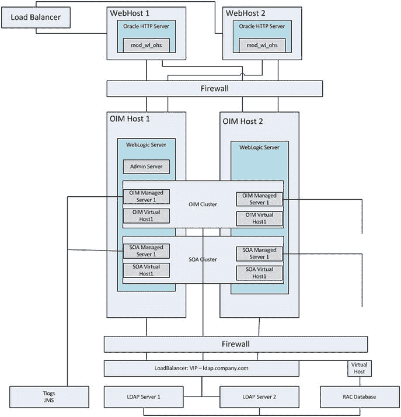
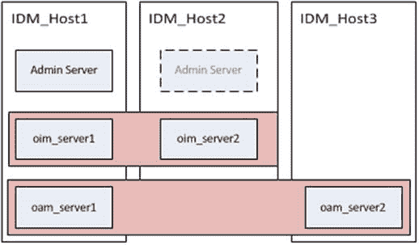

# Oracle 身份管理器 (Oracle Identity Manager)

与 `OAM` 类似，`OIM` 也依赖 `WebLogic` 架构来实现性能集群和高可用性。然而，由于其依赖 Oracle 面向服务的架构 (`SOA`)，因此多了一层复杂性。此外，配置为使用 `RAC 数据库` 的 `OIM` 集群，如果在数据库层面发生故障，将要求用户重新提交其请求。为了提供高可用性和负载均衡以提升性能，`OIM` 必须配置为从 Web 层到数据库和 `LDAP` 层的每一级都实现集群。图 2-10 展示了 Oracle 身份管理的高可用性架构。



图 2-10. Oracle 身份管理本地高可用性架构

图 2-10 有几个细节需要注意。

*   一个 `OIM` 托管服务器已部署在 `OIM 主机 1` 和 `OIM 主机 2` 上。
*   一个 `SOA` 托管服务器已部署在 `OIM 主机 1` 和 `OIM 主机 2` 上。
*   `管理服务器` 可以安装在两台主机上，但一次只能在一个节点上运行。
*   `RAC 数据库` 在两个节点上都配置了 Java 数据库连接 (`JDBC`) 多数据源，以防范数据库节点故障。
*   为 `OIM` 和 `SOA` 配置的虚拟主机名允许在节点丢失时进行故障转移。

通过将这些架构应用于 Oracle 身份与访问管理的各个组件，组织可以创建一个可扩展且高可用的环境。虽然图示仅展示了一个双节点集群，但它们可以扩展以包含更多节点，甚至可以扩展到包含多个数据中心。然而，扩展到额外数据中心并提供数据复制和分区超出了本书的讨论范围。讨论这些是为了让读者在实施环境前考虑这些选项，因为这需要特别考量。

Oracle 身份与访问管理的每个组件都在单独的章节中进行了介绍，因为每个都是一个构建块，可以根据组织需求的增长单独实施。虽然它们可以安装在完全独立的硬件或单台服务器上，但将它们安装在独立的 `WLS`（WebLogic Server）中将简化软件生命周期管理。

根据需要分阶段实施，允许组织安装满足其需求的最基础软件。例如，如果组织的短期需求是一个用于集中管理或应用程序身份验证的身份存储库，那么可以只利用 `Oracle 目录服务`，而无需增加 `身份管理器` 或 `访问管理器` 的开销。随后可以添加 `OAM` 以提供单点登录 (`SSO`)，之后再实施 `OIM` 来完成整个技术栈，并提供对身份治理和完整身份生命周期管理的访问。

将身份与访问管理的各个组件保留在独立的 `WebLogic` 环境中，可以简化软件生命周期的管理。很多时候，组织可能需要升级技术栈中的某一部分，例如 `Oracle 目录服务`，而保持 `OIM` 和 `OAM` 为当前版本。`WLS` 可能需要为 `OIM` 打补丁，但这个补丁可能会对 `OAM` 产生不利影响。在这些情况下，将每个组件保持在独立的 `WLS 主目录` 中，将确保补丁和升级可以在不影响其他功能的情况下执行和测试。

在决定如何实施这些组件时，必须权衡所选方法的复杂性和可管理性。对于某些组织来说，在独立的 `WebLogic` 环境中安装每个组件可能是最佳的总体选择；而另一些组织可能决定将 `OAM` 和 `OIM` 组合在同一个域中，同时将 `Oracle 目录服务器` 分离出来是最佳方案。

### 先决条件

与任何软件一样，Oracle 身份与访问管理套件也有自己的一系列要求，必须满足这些要求才能成功实施。与 Oracle 所有产品一样，Oracle 提供了经过认证的环境列表，包括 `操作系统`、`Java` 运行时环境、应用程序服务器和 `CPU` 架构。满足这些认证将确保环境在基准水平上运行，并在需要时获得 Oracle 的适当支持。

#### 操作系统

`中间件融合` (`Fusion Middleware`) 套件的产品和应用程序可以部署在多种经过认证的 `操作系统` 上。每个组织运行其选择的 `操作系统` 都有不同的原因。因此，本书的范围不包括 `操作系统` 建议。在规划阶段确保 Oracle 认证了将使用的 `操作系统` 非常重要。这些认证还将包括为确保安装成功所需的任何补丁和软件包。

### 中间件融合硬件要求

满足身份与访问管理的系统要求首先要确保满足 `中间件融合` 环境的硬件要求。这包括 `CPU`、内存、存储和网络配置。这里提供的信息代表了 Oracle 提供的最低要求，但在大多数情况下，超出这些最低要求将为增长提供空间，并能应对应用程序负载的突然变化。

在其安装规划指南中，Oracle 提供了典型的 `CPU` 配置列表。对于身份与访问管理 `11.1.2.x`，建议环境满足以下准则。每个组件的推荐架构见表 2-1。

表 2-1. 推荐的 CPU 配置

| 托管服务器 | 处理器 |
| --- | --- |
| Oracle 访问管理器 | 6 个或更多 X Pentium 1.5 GHz 或更高 |
| Oracle 目录服务 | 2 个或更多 X Pentium 1.5 GHz 或更高 |
| Oracle 身份管理器 | 6 个或更多 X Pentium 1.5 GHz 或更高 |

一般来说，Oracle 身份与访问管理产品要求最低可用内存大于 4 GB。因此，必须使用 64 位 `操作系统` 并安装在 64 位 `CPU` 架构上。还应注意的是，64 位 `CPU` 每秒能够执行的计算比 32 位 `CPU` 更多。尽管在许多情况下，Oracle 提供了其产品的 32 位版本，但 64 位处理能力和支持的增长为性能和可扩展性带来了许多改进。


##### WebLogic Server

本节中的数字针对的是基础的 `WLS`。通常，服务器需要 8 GB 物理内存和 16 GB 可用内存。随着托管服务器和身份与访问管理组件的部署，将需要额外的内存。内存要求的具体细节见表 2-2。

表 2-2.
按操作系统划分的 Fusion Middleware 最低内存要求

| 操作系统 | 最小物理内存 | 最小可用内存 |
| --- | --- | --- |
| UNIX | 8 GB | 16 GB |
| Linux | 8 GB | 16 GB |
| Windows | 8 GB | 16 GB |

在此上下文中，可用内存等于物理内存加上交换空间内存。然而，增加可用内存中物理内存的占比，可以通过减少对磁盘上交换空间内存的 I/O 来提升性能。此基准是假设需要 4 GB 用于操作系统，加上 4 GB 用于 `WebLogic` 和管理服务器而计算得出的：

```
    4 GB of memory for the OS
+    4 GB of memory for WLS and the Admin Server
_________________________________________________________
    Total physical memory required
```

Fusion Middleware 环境的存储要求可能差异很大。Oracle 至少建议 10 GB 存储空间。应当考虑到日志记录和额外部署的软件会增加此数值。安装完成且环境稳定后，降低任何已部署应用程序和托管服务器的日志级别配置，可能是谨慎的做法。

#### Oracle Directory Services

建议将 `OUD` 安装在与 Oracle 身份和访问管理实例分开的主机上。这是为了将 `LDAP` 身份存储库置于与数据库相同的内部网络层中。在之前显示的体系结构图中，您会注意到 `LDAP` 和数据库环境被放置在一个与应用中间件层分开的层中。因此，Oracle 目录服务的内存要求将与 Oracle 身份和访问管理组件分开介绍。

`OUD` 是一个基于 `Java` 的 `LDAP` 目录服务器。因此，与其他 Fusion Middleware 产品一样，它安装在受支持的应用服务器内。本节中的要求是针对软件本身的，必须与 Fusion Middleware 的最低要求相结合。这将在后面展示。

Oracle 建议为 `OUD` 在生产环境中以最佳水平运行提供 2 GB 物理内存。这是在 Fusion Middleware 所需的 8 GB 之外的。`OUD` 的 `Java` 虚拟机 (`JVM`) 可以进行配置，以确保使用足够的内存而不会使服务器过载，这将在本书的安装部分讨论。计算总体内存要求可以简单地按如下方式进行：

```
    4 GB of memory for the OS
+    4 GB of memory for WebLogic and the Administration Server
+    2 GB of memory for the OUD JVM
___________________________________________________________
    10 GB physical memory required for OUD
```

需要注意的是，`OUD` 使用一个小数据库来存储 `LDAP` 条目。该数据库至少需要 1 GB 磁盘存储空间。根据日志配置或复制情况，这可以增加到 30 到 40 GB。确保日志配置和轮换设置正确，以防止存储问题，这一点非常重要。Oracle 还建议，通过调整内存大小，使得整个数据库文件可以加载到内存中，可以提高性能。

#### Oracle Identity and Access Manager

尽管将 `LDAP` 存储库与身份和访问管理节点分开是一个好主意，但在大多数情况下，Oracle Identity and Access Manager 可以安装在相同的物理主机上。是否将它们安装到单独的 Fusion Middleware 环境中取决于安装者。然而，内存要求将保持不变。

`OAM` 的最低要求内存是 4 GB 物理内存和 8 GB 可用内存，而承载 `OIM` 服务的主机还必须考虑 `SOA`。因此，仅托管 `OIM` 服务器就需要至少 8 GB 物理内存和 16 GB 可用内存。这是在 Fusion Middleware 基础设施所需的最低要求（即 8 GB）之外的。将它们相加可以得到以下计算：

```
    4 GB for the OS
+    4 GB for WebLogic and the Administration Server
+    4 GB for OIM Managed Server
+    4 GB for SOA Managed Server
+    4 GB for the OIM Administration Server
____________________________________________________________
    20 GB memory required for OIM
```

如果 `OAM` 与 `OIM` 在同一个 `WebLogic` 实例中安装在同一主机上，则将需要额外的 8 GB。在这 8 GB 中，4 GB 分配给 `OAM` 管理服务器，另外 4 GB 分配给访问管理器托管服务器。由于额外的 `WebLogic` 实例需要 4 GB，因此可能希望将 `OAM` 托管服务器安装在与 `OIM` 实例相同的域中。

### 集群注意事项

在 Fusion Middleware 中，集群被定义为多个 `WLS` 协同工作以提高可靠性和性能。如前所述，只要资源足够，可以在单台机器上或在多台机器上向集群域添加更多实例。

在确定集群规划时，努力遵循最佳实践很重要。实施集群环境本质上增加了复杂性。服务不再由单个实例处理，而是添加了额外的实例，从而增加了对复杂会话处理、负载均衡、分布式处理和复制的需求。

##### 主机配置

虽然 Oracle 建议每两个 `CPU` 只运行一个 `WebLogic` 实例，但仔细的规划和容量规划将确保环境能够处理预期的负载。Fusion Middleware 环境和 Oracle 身份产品的线性可扩展性允许随着组织需求的增长而实现未来的增长。需要注意的是，物理服务器不需要配置相同的硬件。然而，每台服务器必须满足支持已部署应用程序所需的最低要求。也可以将集群托管服务器部署在不同的物理主机上。

例如，`Host_1` 可能包含管理服务器、身份管理器和访问管理器，而 `Host_2` 仅包含身份管理器，访问管理器则部署在 `Host_3` 上。图 2-11 描绘了物理主机上身份管理组件的基本分布。


图 2-11.
在多个主机上分发身份管理器集群

#### 网络规划

随着服务器数量的增长，集群环境对网络需求也随之增加。根据组织的网络拓扑结构（如 DMZ | 应用层 或 DMZ | 应用层 | 数据层等），防火墙和负载均衡器的数量会有所变化。在每个层级，都需要配置防火墙以允许适当的通信。在许多情况下，组织会有两个主要网络区域：公共区域/DMZ 以及内网或内部区域。为简化起见，本书将采用这种双区域配置进行说明。

公共区域或 DMZ 通常包含 Web 服务器，这些服务器为位于内网区域的应用程序提供前端代理。这样可以将内部应用区域与公共区域隔离开来，并通过限制内部通信仅使用经批准的协议和端口来保护资源。在 DMZ 内部，负载均衡器负责在一台或多台 Web 服务器之间分配负载，而防火墙则用于限制通信。这提供了更严格的安全性、故障转移和性能优势。

在内网区域中，应用服务器和数据库服务器向用户提供服务。这些服务通过 DMZ 中的代理和 Web 服务器进行访问。由于防火墙限制了访问，此区域内的服务器通常配置为仅在指定端口上进行通信。在某些情况下（例如数据库服务器），可能需要负载均衡器来处理故障转移和负载均衡任务。在其他情况下，配置了 WLS 模块的 Web 服务器可以处理负载均衡。负载均衡器也可以用作安全套接字层（SSL）终端点，从而减轻底层服务器的加密处理负担。

无论使用何种负载均衡技术，组织都应确保其能够提供以下功能：

-   监控 HTTP 和 HTTPS 流量。
-   维护多个虚拟服务器名称和端口。
-   检测服务器状态。
-   在服务器故障时重新路由请求。
-   SSL 管理、加速、终止等。
-   能够向 `HTTP 请求处理器` 添加 `WL-Proxy-SSL : true`。

## 总结

本章介绍了从硬件要求到部署拓扑和安装前注意事项的一系列概念。本章并未针对 CPU 架构、操作系统和网络硬件等选项提供具体建议，而是给出了通用指导原则。每个环境都有不同的需求。然而，所提供的信息应能帮助组织规划其部署策略。

在接下来的章节中，将演示一个双节点集群的安装。在某些情况下，多个 Fusion Middleware 主目录和实例可以安装在单个服务器上。这些情况及其背后的原因都将予以说明。

