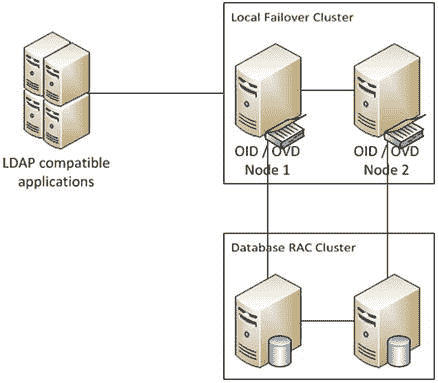
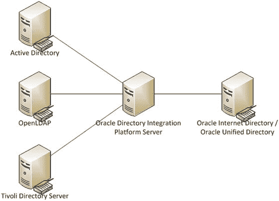
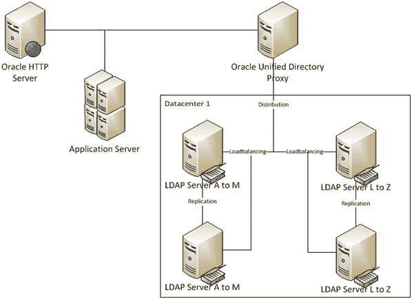
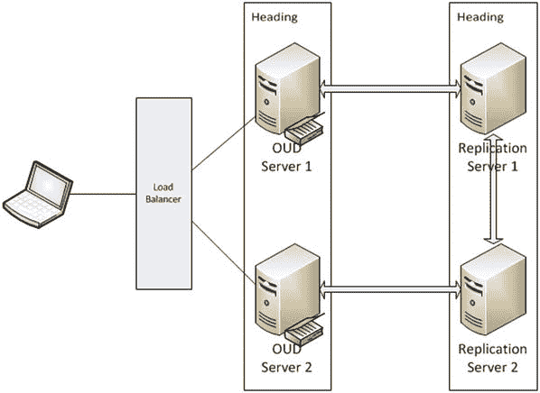
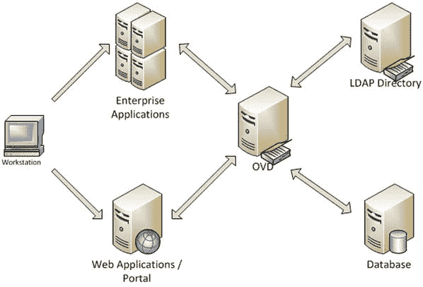
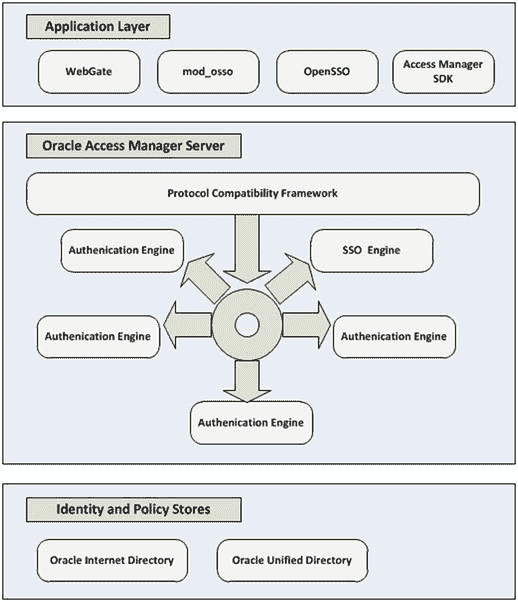
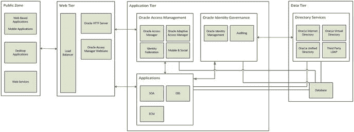

# 索引

## 关于作者与关于技术审校者

*   关于作者
*   关于技术审校者
*   致谢
*   引言

## Oracle 身份与访问管理套件概述

Oracle 融合中间件产品部署在 WebLogic Server 架构中。WebLogic Server 提供了一个可扩展的环境，使企业能够部署和管理 Oracle 产品及 Java 应用程序，并具备访问数据库和消息服务的能力。WebLogic Server 作为应用服务器层运行。WebLogic 提供的能力包括集群、高可用性、可管理性、监控、安全以及数据库集成。

Oracle 身份与访问管理套件由多个组件组成，每个组件都有其特定的用途。这些组件包括目录服务、访问管理或单点登录、身份管理、自助服务门户，以及配置、治理和报告服务。

本章将介绍 Oracle 融合中间件 WebLogic Server 环境以及配置 Oracle 身份与访问管理套件所涉及的主要组件。同时，您还将获得对本书其余部分相关的 Oracle 身份管理组件的描述。

### WebLogic Server

Oracle 的 WebLogic Server (WLS) 是一个完全符合 J2EE 标准的应用服务器，它将支持 Oracle 身份与访问管理套件组件。此环境提供了部署自定义应用程序以及 Oracle 融合中间件产品（如企业内容管理和 Oracle 身份与访问管理）所需的必要组件。由于 WebLogic Server 是一个应用服务器，用户能够通过 Web 浏览器使用部署的应用程序端口，或通过充当反向代理的 HTTP 服务器来访问这些应用程序。

为了提供企业级服务，WebLogic Server 支持多项环境特性。

*   编程模型：WLS 支持 Java EE 部署环境、Web 服务支持、Java 消息服务、可扩展标记语言能力、Java 数据库连接资源以及其他组件。
*   高可用性：通过使用 WebLogic 集群将工作负载分布到多个服务器上，以及检测和管理过载状况的能力来实现高可用性。持久化存储和存储转发服务允许临时存储 JMS 消息并在跨集群分布的服务之间传递它们。
*   安全性：WLS 提供了一个内置的轻量目录访问协议 2.0 身份存储，可用于管理对部署在服务器上的服务的访问。除此之外，WLS 可以配置为针对多种不同的外部数据存储（如 Oracle Internet Directory、Active Directory 等）进行身份验证。此外，WLS 框架允许集成身份断言器，例如 Oracle 访问管理器。
*   诊断框架：提供收集和分析服务器上运行进程的运行时数据的能力。这可用于诊断问题和调整以获得更好的性能。

针对 Oracle 身份与访问管理环境，本书将讨论如何使用以下组件。

*   管理服务器提供了一个图形用户界面，用于管理部署的所有组件。每个 WLS 域都有一个管理服务器，可以在任何 WebLogic 主机上运行。管理服务器管理域、集群、受管服务器、数据源、安全设置和应用程序部署的配置数据。
*   域是 WLS 内服务器资源的逻辑管理单元。环境的所有方面都包含在一个域中，包括受管服务器、数据库源、消息服务、应用程序部署、计算机和集群。
*   计算机代表托管受管服务器的物理主机。一个管理服务器可以管理多台计算机。管理服务器与每台计算机的节点管理器通信，以执行每个受管服务器的启动和停止操作。如果需要，单个物理主机可以配置多个计算机，监听不同的端口。
*   WebLogic 集群由一个或多个协同工作的 WLS 实例组成，提供高可用性和横向扩展环境的能力。
*   受管服务器是一个逻辑上的 WLS 构造，应用程序可以部署在其上。
*   数据源是在 WLS 内配置的 JDBC 连接，供部署在各个受管服务器中的应用程序使用。将数据源定位到特定的受管服务器可使其仅对那些指定的服务器可用。
*   安全域定义了保护应用程序资源的身份验证提供者和断言器。安全组、用户和策略都可以在 WebLogic 安全域中定义。

### Oracle 目录服务

Oracle 目录服务构成了 Oracle 身份与访问管理的核心。它由多个选项组成，目录服务提供了身份和策略存储、目录同步以及虚拟化功能，可供企业使用的各种应用程序利用。这些选项包括：

*   Oracle Internet Directory：基于数据库的完全兼容 LDAP-V3 的身份目录。
*   Oracle Unified Directory：基于 Java 的符合 LDAP-V3 标准的身份目录。
*   Oracle Virtual Directory：目录集成，支持管理多个源而无需数据复制。

### Oracle Internet Directory

`OID`是一个完全符合`LDAP-V3`标准的目录服务，它使用`Oracle Database`作为存储后端。这使得`OID`能够充分利用数据库的特性，例如`真正应用集群`和`多主复制`，并结合`OID`集群与`Fusion Middleware`架构，以提供高可用和可扩展的环境。`Oracle Directory Services Manager`为维护`OID`中的用户、安全组、对象类、属性和策略提供了一个标准的前端界面。图 1-1 展示了使用`真正应用集群数据库`环境的`OID`或`OVD`的基础高可用性环境。

图 1-1. 基础本地高可用配置

`OID`通过支持存储多个上下文，允许存储不同的身份数据。这使得来自多个来源的数据可能被集中在一个实例中进行管理。例如，如果企业已经实施了多个`Active Directory 轻量目录服务`实例来管理各种启用了`LDAP`的应用程序的用户，则可以利用`OID`为所有这些应用程序提供一个统一的`LDAP`源。

通过使用`Oracle 数据库`作为数据存储库，`OID`能够利用`透明数据加密`和`数据库保险库`等特性，在操作的每一层提供安全保障。利用这些数据库特性的能力，通过允许数据库处理数据存储和备份安全，实现了安全职责的分离。

`OID`提供了与企业内使用的其他目录服务进行同步的能力。如图 1-2 所示的`目录集成平台`，允许管理员为`Active Directory`、`Sun eDirectory`、`OpenLDAP`等创建和维护同步配置文件。这使得企业能够整合用户存储库，并使用标准化的通用`LDAP`目录来提供应用安全性。

图 1-2. 目录集成平台

除了通过复制数据并转换其格式以适应`OID`存储需求来整合多个不同的身份存储库之外，`OID`还能够在`OID`节点之间执行数据复制，以提供高可用性和性能可扩展性。

使用`OID`时，组织面临多种复制概念。完全复制涉及将整个目录传播到其他`OID`节点，而不是仅将指定的结构部分发送到其他节点。对于复制的传输层，`OID`支持`LDAP`复制和`数据库高级复制`。前者依赖`LDAP`协议将数据从一个`OID`实例传输到另一个实例，而`Oracle 数据库高级复制`则要求数据库在数据库实例之间复制数据。最后一个概念是复制方向。`OID`支持单主、多主和扇出复制。顾名思义，单主复制可以被视为从主节点到所有其他节点的单向复制。多主复制允许从任何节点进行的更改复制到其他节点。扇出复制是前两种方向的一种组合，其中一个主节点复制到其他节点，然后这些子节点可以向其他节点复制完整或部分数据。

虽然`OID`历史悠久，并且目前与`OIM`和`OAM`等其他`Oracle 身份管理`组件以及`Fusion Middleware`产品和应用程序兼容，但`Oracle`已表示目录服务的未来方向是`OUD`。

#### Oracle Unified Directory

`OUD`代表`Oracle`发布了业界首个基于`Java`、符合`LDAP-V3`和`目录服务标记语言 (DSML) v2`标准的目录服务，它将存储、代理、同步和虚拟化结合在单个平台中。`OUD`在商用级硬件和灵活的部署架构上，提供了高水平的性能、弹性可扩展性和高可用性。在提供这种级别的服务的同时，`OUD`能够保持高级别的安全性和监控能力。

`OUD`的架构支持全局索引，增强了其弹性可扩展性。此特性允许管理员添加服务器；`OUD`将根据需要处理将新请求路由到新服务器和存储。这消除了构建新环境和迁移大量数据的需要。索引的另一个好处是，规模需求可以按需解决。管理员不再需要确定当前的容量需求并估计未来几年的增长。条目也可以分布在多个目录存储实例中。图 1-3 展示了一个分布在多个节点并集群以提供故障转移保护的环境。

图 1-3. 分布式架构

为了在支持高可用性的同时提升高性能，`OUD`分离了目录服务和复制服务的任务。如前所述，`OUD`允许跨多个数据中心分布服务器。为了支持这一点，`OUD`引入了如图 1-4 所示的复制服务器。这些是专用于在整个环境中复制数据的服务器，将客户端请求处理工作留给目录服务器。

图 1-4. Oracle Unified Directory 复制

在图 1-4 描述的`OUD`复制过程中，每个`OUD`服务器连接到一个复制服务器。然后它向该服务器发送和接收所有更改。复制服务器将接收到的更改通知给环境中的所有其他复制服务器。`OUD`复制服务器将这些更改传达给与其连接的`OUD`服务器。由发起更改的`OUD`服务器分配的一个更改号标识该更改，并被复制服务器用来确保更改传播到其他`OUD`服务器。此更改号也存储在一个持久化存储中，该存储用于向可能已从复制服务器断开的`OUD`服务器提供更改。如果更改同时发生在两个`OUD`服务器上并导致冲突，每个`OUD`服务器将重放更改，直到所有冲突都得到解决。

复制服务器管理与`OUD`服务器的连接，并监听来自其他复制服务器的更改。这些更改被传播到与其连接的目录服务器。当为复制配置`OUD`服务器时，这些复制服务器会自动创建。因此，它们可以运行在同一台`Java`虚拟机（`JVM`）或主机上。为了节省资源，可以将`OUD`服务器配置为同时执行目录和复制服务器功能。然而，对于大型环境，`Oracle`建议将这些功能分离到不同的服务器上。

与`OID`类似，可以使用`目录集成平台`从第三方`LDAP`存储库复制身份数据，为应用程序身份验证提供中央数据存储库。需要注意的是，这与前面为`OID`介绍的功能相同。因此，它生成的是必须维护的身份数据副本。一些组织可能不希望管理多份`LDAP`数据副本。这正是`OVD`所解决的问题。

## Oracle Virtual Directory

`OVD` 提供了一种方法，能够将多个身份存储呈现为**单一源**，而无需同步和复制数据。呈现为单一源使得企业应用程序能够从多个来源（如数据库、`EBS`、`Active Directory` 和 `OID`）访问身份数据。

聚合多个数据源使企业能够利用跨多个源的现有身份数据，而无需复制数据或设置复杂的同步任务。由于 `OVD` 呈现多个数据源时**不复制底层数据**，因此可以显著节省成本，因为存储开销得以降低。

`OVD` 的一项关键能力是能够将身份数据转换为**应用程序特定的视图**。因此，它可以将非 LDAP 数据（如数据库或 Web 服务）以各种企业应用程序所需的适当格式呈现。例如，`OVD` 可用于将 `Siebel Customer Master` 数据作为 `LDAP` 源呈现，供其他应用程序进行身份验证。这种转换能力不仅允许多个应用程序按需查看数据，还使组织能够保留对其自身存储库中身份数据的管理和共享方式的控制权。

`OVD` 不仅可以将多个数据存储呈现为单一源，还支持**拆分配置文件**的概念。例如，企业可能将所有身份数据存储在 `Active Directory` 中。然而，像 `EBS` 这样的应用程序可能需要存储在 `OID` 或人力资源数据库中的额外元数据来进行授权。`OVD` 适配器将允许应用程序将这些数据视为单个条目来查看。图 1-5 展示了通过 `OVD` 整合多个目录源的表示。由于此环境是虚拟化的，所有操作均无需复制即可完成。

图 1-5. 通过 `OVD` 在应用程序和身份源之间进行的数据流

`OVD` 设计为可扩展且高可用，无论企业规模多大，都能提供支持。性能扩展可以像向集群添加更多节点一样简单。这可以在中心位置或跨地域进行。高可用性不仅在 `OVD` 环境内得到支持，还支持其数据源的负载均衡和高可用。尽管此配置允许一个更精简的环境且无数据重复，但如果用户从一个源中被移除，可能会出现数据丢失、孤立账户和组等问题。

### Oracle Identity and Access Management

大多数组织需要身份服务，例如 `LDAP` 存储库。有时这可以通过简单的网络目录（如 Microsoft `Active Directory`）来实现。然而，在考虑应用程序安全性时，一个更通用的目录是必需的。前面介绍的 `OID`、`OVD` 和 `OUD` 可用于提供此服务。随着越来越多的应用程序被引入业务，用户在不同应用程序之间切换时，可能会被身份验证对话框淹没。

`OAM` 是身份与访问管理套件的一个组件，可用于提供 `SSO`（单点登录）功能。此功能可大大减少用户在一天中必须进行身份验证的次数，从而提高生产力。这种减少还可以通过联合方式集成外部和第三方应用程序来进一步扩展。

通过 `OAM` 实现 `SSO` 减少了身份验证请求次数，但重要的是应用程序用户需保持安全的密码和账户。账户管理变得至关重要，因为单个账户可能访问大量系统和数据。Oracle Identity Management 是身份管理技术栈的关键组件，它提供用户自助服务、用户管理以及高水平的可审计性。

### Oracle Access Manager

Oracle Fusion Middleware 应用程序和产品被设计为支持 Oracle Identity Manager (`OIM`) 组件（如 `OID` 和 `OUD`）来获取身份信息。此外，这些资源可以使用 `OAM` 进行保护。Oracle Access Manager 利用会话管理、身份上下文和风险分析等功能，为应用程序环境提供身份验证和授权、策略管理与执行以及 `SSO` 能力。`OAM` 还提供额外功能，最显著的是为采用多个 Oracle 产品的组织提供 `SSO` 环境，以及支持与安全断言标记语言 (`SAML`) 兼容的第三方产品集成的身份联合支持。

`OAM` 的核心是为企业应用程序提供身份验证和授权服务。它还允许在基于 Oracle Fusion Middleware 的环境内实现 `SSO` 功能。图 1-6 提供了 `OAM` 架构的高级描述。对受保护资源的访问请求被一个称为 `WebGate` 或 `mod_osso` 实例的过滤器拦截，并发送到 `OAM` 进行处理。`OAM` 参考可配置的身份验证和授权策略来确定是否授予客户端访问权限。成功身份验证后，会设置一个 Cookie 以确保持续访问所请求的资源以及 `OAM` 环境内的其他资源。

图 1-6. Oracle Access Manager 组件分解

### Oracle 访问管理

### Oracle 自适应访问管理

OAM 不仅提供认证和授权服务；它还使组织能够在应用程序架构的多个层面（如 Web 层、数据层和应用层）提高安全意识和欺诈检测能力。Oracle 自适应访问管理器 (OAAM) 通过增加学习行为和检测可能欺诈活动的能力，增强了 OAM 认证机制的安全性。OAAM 的实时与批处理风险分析组件可用于通过模式、规则引擎、操作和交易分析来验证用户身份和活动的有效性。

以下是 OAAM 的一些风险分析组件：

*   `设备指纹识别`：此功能收集用户交易期间用于连接的设备属性。这些属性用于识别可能的欺诈访问请求。
*   `行为分析`：OAAM 可以学习用户的正常行为、设备信息、位置和其他数据，以主动检测可能的滥用或安全漏洞。
*   `风险引擎分析`：此功能允许对事件、用户配置文件、设备指纹、地理位置和其他数据进行实时分析，以确定用户交互期间的风险级别。分析轨迹可以被审计，以确保采取了适当的措施。
*   `预测分析`：这促进了与 Oracle 数据挖掘的集成，以提供基于历史数据的异常检测。这也可以用于基于分析数据做出变更决策，因为可以测试不同的模型。
*   `调查取证`：这可用于为审计和欺诈调查工作提供数据集。数据可以使用 Business Intelligence Publisher 进行定制，也可以使用开箱即用的模板。这些报告可以帮助安全调查员识别实例和可能相关的欺诈访问。
*   `通用风险快照`：这些用于备份、恢复和迁移现有的安全策略和配置。

面向用户的防恶意软件和网络钓鱼攻击组件增强了 OAAM 分析功能，以提供端到端的解决方案。最终用户可能会看到虚拟认证设备、基于知识的认证问题和一次性密码机制，以防止未经授权的账户访问。

Oracle 自适应访问管理的面向用户组件包括以下内容：

*   `设备指纹识别`：这提供了 OAAM 收集有关用户设备元数据的能力。这些数据可能包括 Cookie、硬件配置、地理位置和网络配置。这些数据用于检测用户行为的变化。
*   `基于知识的认证`：这通过要求用户回答安全问题来提供第二种形式的认证。
*   `答案逻辑`：此组件使 OAAM 能够检测基于知识的认证问题的根本正确答案，即使它们有小的打字错误。
*   `一次性密码`：此功能使用户能够通过短消息服务 (SMS) 或电子邮件接收一次性使用的密码，用于系统认证。
*   `自助服务密码管理`：用户被授权使用自助服务创建和重置其凭证。

### 身份联合

随着公司转向基于云的服务或采用外部 Web 应用程序和其他跨域服务，能够使用相同凭证对这些服务进行认证的需求日益增长。身份联合通过消除传统上为应用程序可能存在于多个域中的不同环境所需的多组凭证，使组织能够简化用户访问管理。OAM 支持与 SAML、OpenID、表单填充和 OAuth 的联合。

Oracle 访问管理器身份联合的两个功能组件是服务提供者 (Service Provider) 和身份提供者 (Identity Provider)。身份提供者组件负责建立用户身份、过滤属性、断言身份信息和维护会话。服务提供者负责映射属性、链接身份并将身份信息传递给应用程序。

在登录时，作为身份提供者，OAM 首先对用户进行认证。如果用户会话已超时，身份提供者将确定用户是否需要重新认证。最后，身份提供者组件确定合作伙伴应用程序是否需要符合请求期间指定的级别或方案的质询。为此，OAM 允许配置灵活的认证机制。身份联合使用联合认证方法和 OAM 认证方案映射来控制应如何对用户进行认证质询。

在注销期间，访问管理器身份提供者服务提供者支持两种不同的流程，具体取决于注销的发起位置：从 OAM 或从联合合作伙伴应用程序。

在 OAM 发起的注销期间：

1.  用户通过 OAM 请求注销。
2.  OAM 结束访问管理器会话。
3.  OAM 指示各种 WebGate 实例删除用户的会话 Cookie。
4.  OAM 联合服务执行注销操作，通过 HTTP 重定向用户或通过简单对象访问协议 (SOAP) 消息发送注销请求来导致合作伙伴应用程序注销。
5.  OAM 联合服务终止联合会话。

如果注销是通过合作伙伴应用程序发起的：

1.  合作伙伴应用程序将用户重定向到 OAM 联合服务。
2.  联合服务将会话标记为注销。
3.  用户被重定向到 OAM 进行注销。
4.  OAM 指示各种 WebGate 实例删除用户的会话 Cookie。
5.  OAM 联合服务执行注销操作，通过 HTTP 重定向用户或通过 SOAP 消息发送注销请求来导致合作伙伴应用程序注销。
6.  OAM 联合服务终止联合会话。

OAM 内的身份联合的服务提供者组件与身份提供者协同工作，在联合环境中提供欺诈和风险感知。当身份提供者对用户进行认证时，可以触发服务提供者创建具有适当认证级别的会话，该级别通过联合认证方法映射。这些属性方法作为来自身份提供者的请求属性或映射到 OAM 会话中传入的断言属性名称是受支持的。

Oracle 访问管理身份联合支持多种联合技术，包括 SAML、OpenID、OAuth、社交身份和表单填充。

#### 联合身份认证

*   **基于 SAML 的联合身份认证**：SAML 是一个行业标准的开放框架，用于共享安全信息。它提供了一种在跨多个域的应用程序间传输信息的标准方法。它还可用于链接同一用户在多个站点中的账户。SAML 协议提供可在多个安全框架中使用的标准安全令牌。SAML 还提供了一种表示安全令牌的标准方法，该令牌可在业务流程或事务间传递。这通过`XML`文档实现。
*   **基于 OpenID 的联合身份认证**：OpenID 允许任何网站利用一个身份验证标准，而无需自行开发系统。它使用一个可在多个系统中使用的令牌。`OAM`支持交换`OpenID`标识符以交换身份数据。这可以通过使用一个包含`NameID`和其他可选属性的令牌来完成，或者通过使用`NameID`格式、经过哈希处理的用户属性以及存储在数据存储中的生成值来完成。
*   **基于 OAuth 的联合身份认证**：此技术支持委托授权。它是一个行业标准，旨在透明地将一个站点的私有数据共享给另一个站点。`OAM`在其身份联合组件、移动与社交安全以及 API 网关中支持`OAuth`。通过这些组件，`OAM`提供符合`OAuth 2.0`标准的令牌颁发、令牌验证和令牌撤销服务。

#### 移动与社交访问

随着当今组织对云和其他基于网络的应用程序的依赖日益加深，他们的客户和内部用户需要从多种设备和位置（包括移动设备）进行访问。除了从移动设备访问企业资源外，许多组织正在部署其用户群常用应用程序的移动版本。Oracle 通过`OAM`的“移动与社交访问”组件满足了这一日益增长的需求。

Oracle 的“移动与社交访问”利用`OAM`保护应用程序的核心能力。这些能力包括凭证收集器、身份验证与授权服务以及单点登录。该组件以安全平台为设计理念，与`OAM`栈中的“自适应访问管理”部分集成，以提供审计、设备指纹识别、风险分析以及身份验证兼容性。

“移动与社交访问”使企业能够提供以下功能：

*   符合`OAuth 2.0`标准的委托授权。
*   基于浏览器和原生移动应用程序对身份存储的访问。
*   与基于云的身份服务（如`Google`和`Facebook`）的交互。
*   用于`LDAP`操作的`REST`接口，可用于用户配置文件服务。

#### API 与 Web 服务安全

`OAM`提供了保护 Web 服务安全的能力，以支持行业对面向服务架构日益增长的使用。如今，越来越多的组织正在公开可以集成到其他应用程序中的 Web 服务。例如，一家公司可能希望在其内部网门户中包含一个股票市场应用程序。这些 Web 服务必须受到保护，以确保只有授权访问其功能，防止被滥用。`OAM`提供符合标准的功能，使用 Web 服务管理器、安全令牌服务和`APG`组件来保护 Web 服务和应用程序编程接口。

`WSM`使用`WS-Security`、`SAML`和`OAuth`等协议来保护融合中间件产品和服务。`WSM`允许企业通过定义策略、执行安全和监控事件来适应不断变化的安全形势。这些能力通过`OAAM`得到进一步增强，以帮助组织识别可能的安全漏洞并分析风险，从而实时制定新的安全策略。`OAM WSM`处理 Web 服务安全的所有方面，包括身份验证、授权、机密性和完整性，使用公钥基础设施来加密和解密传输中的数据。

`APG`用于保护部署在云中或企业内的服务和`API`的访问。为此，`APG`能够评估流量以查找可能的威胁，有选择地限制可能包含威胁的请求，并主动扫描内容以查找格式错误的请求和病毒。该网关还允许企业集成`LDAP`身份和策略存储（如`OUD`或`Active Directory`）来执行身份验证和授权规则。

安全令牌服务通过提供令牌生命周期服务（获取、验证和取消）来管理服务提供者与服务消费者之间的关系。该服务支持 Web 服务与`API`网关之间的信任关系、单点登录环境，或由安全令牌服务在客户端、令牌颁发机构和令牌消费者之间启用的身份传播。

#### 云访问门户

`OAM`访问门户旨在简化对合作伙伴应用程序以及与`OAM`集成的应用程序的访问。该访问门户提供了一个跨平台界面，允许用户从任何设备访问受`OAM`保护的资源。门户使管理员能够自动向用户账户配置应用程序，并为他们提供一个目录，供用户选择要包含在其个性化界面中的应用程序。此外，访问门户将允许用户在线更新其凭证，而无需联系管理员或服务台。

所有`OAM`支持的身份验证类型都可以在门户上使用，从而最大化组织的投资并提高用户生产力。它还能够访问联合合作伙伴应用程序并使用表单填充身份验证注入，这允许用户存储将用于软件即服务或 Web 应用程序登录表单的凭证。访问门户为组织提供了在企业内部部署单点登录环境的框架，通过为用户提供一个访问其应用程序的中心位置来提高用户群的生产力。

### Oracle Identity Manager

随着组织规模扩大和用户在线访问资源日益增多，对更严格控制和直观管理工具的需求也随之增长。用户生产力的提升不能以牺牲企业安全和治理为代价。企业必须持续掌握谁拥有什么访问权限以及他们如何获得该权限，以便及时发现可能的滥用或欺诈行为。OIM 构成了身份与访问管理套件产品的身份治理组件。

必须严格控制用户身份生命周期，以确保用户在入职第一天就拥有正确的访问权限，并在他们角色变更或离职时根据需要及时撤销访问。此外，某些用户可能需要一些与其职位不寻常的访问权限。其中许多权限可以基于一套定义的规则授予，或由用户选择并经经理和管理员批准。然而，需要工具并实施严格的控制来确保正确的访问权限。

OIM 是一种配置工具，它利用了前面讨论的身份存储和访问系统。Oracle 身份与访问管理套件的其他组件致力于存储或虚拟化身份信息，并在企业应用环境中提供身份验证和授权服务；而 OIM 则简化了整个身份环境中的配置、生命周期、审计和对账服务。该组件完善了满足所有企业安全需求的单一身份管理平台。

为实现提升用户生产力和效率的目标，OIM 提供了一套完整的功能，包括自助服务门户、配置和账户管理工作流、定制化和个性化。

#### 自助服务

OIM 的自助服务功能通过赋予单个用户管理其许多账户细节的能力来提升用户效率。这些功能包括重置和恢复丢失的密码、申请新权限以及注册账户。员工在丢失密码时不再需要提交服务台工单。用户可以通过回答预设的验证问题来请求密码重置。需要系统新权限或额外权限的用户可以使用自助服务门户进行申请，参考一个包含可能授权选项的目录。OIM 还提供了允许新用户在系统中注册的功能，并根据管理员定义的规则集授予其必要的预设默认权限。

#### 工作流

在大多数组织中，用户根据部门或职位获得权限。围绕这些授权的规则可以在 OIM 中定义，并应用于新创建的用户。此外，当员工申请新权限时，由业务定义的复杂工作流可以在实际权限授予之前处理所需的审批矩阵。这些功能确保了最高级别的可审计性，以确定谁拥有什么访问权限、谁在何时授予了该权限。这些信息在调查可能的滥用行为或进行安全审计时都非常有用。

#### 委派管理

随着组织的成长，委派管理的需求变得显而易见。单一的 IT 组织可能没有足够的资源来处理公司的所有权限请求。OIM 提供了将管理任务分散给负责相关内容的各个业务部门的能力。通过使用高级安全配置，这也确保了委派管理仅授予所需的区域。例如，财务管理员应该只能访问财务组的权限，而无法授予对法律部门内容的访问权限。

#### 审计

鉴于 OIM 提供的所有灵活性，必须注意到频繁的安全审计变得多么有价值。OIM 包含一系列功能，使这些审计易于管理，同时提供立即可用的信息和服务。使用内置报告和门户可以让管理员和审计员快速概览或详细了解安全状态。此外，可以识别孤立或异常账户，以便采取必要的对账操作。

### 整体概览

至此，您已经了解了 Oracle 身份与访问管理的各个主要组件。这些组件包括 Fusion Middleware 架构、目录服务、访问管理和身份管理。尽管这些产品中任何一个都无法单独提供组织可能需要的全部功能，但它们可以被视为构建完整企业级身份管理解决方案的基石，每个都提供自己的一套功能。因此，短期目标可能仅为 Oracle 应用提供身份验证的组织，可以随着需求增长轻松扩展功能。在图 1-7 中，整体架构被呈现为一个单一单元。需要指出的是，这并不意味着所有组件都必须驻留在单台服务器上。

图 1-7. Oracle 身份与访问管理概览

图 1-7 展示了 Oracle 身份与访问管理如何在整个应用层部署组件，以提供企业的端到端安全。从 Web 层开始，`Access Manager WebGate` 拦截资源请求，并根据在 `Access Manager` 中定义的身份验证策略确定是否需要身份验证。如果需要，`Access Management` 服务器会基于后端的 `LDAP` 数据层对用户进行身份验证。此外，`Identity Management` 服务会跟踪身份活动，例如新用户配置、授权请求和其他治理任务。

