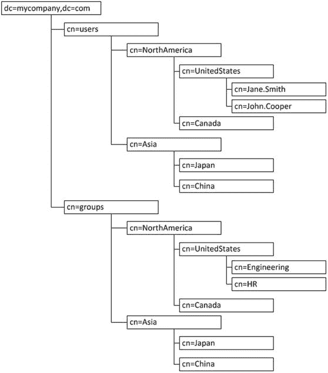
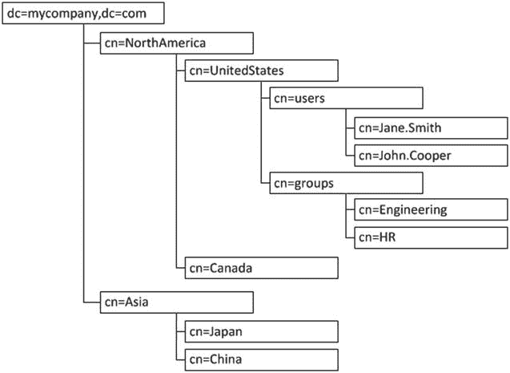
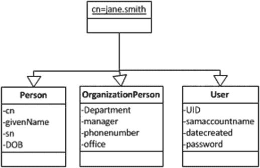

# 3. 用户和策略存储

身份和访问管理系统围绕一个核心存储系统构建，该系统能够维护用户信息、角色、策略和凭证。这些存储系统也可用于存储有关网络资源、外设和应用程序的信息。目录存储最常使用的是基于轻量级目录访问协议（LDAP）的系统。其他存储方法包括数据库存储和文件存储。然而，LDAP 提供了一个更广泛接受的标准，并且与更广泛的应用程序兼容。

LDAP 定义了一种访问身份数据、网络资源、外设、甚至加密证书和服务相关信息的标准化方法。身份信息可以包含用户凭证、联系信息以及其他用于识别个人的相关数据。这些数据可以被诸如电子邮件之类的应用程序用于获取电子邮件地址。或许最有用的功能是提供身份验证和角色定义的能力。应用程序可以使用目录和标准 LDAP 命令来确保用户能够访问系统，并且只能访问其被授权使用的数据。

## 用户和策略存储概述

存储在 LDAP 目录中的数据通常以有组织的方式构建，以便在浏览和查询信息时更易于访问。此外，对象符合定义的格式，包括必需属性和强制属性。这些属性不仅有助于识别人或对象，还赋予应用程序查询符合特定条件的用户组的能力。

尽管 LDAP 并未定义存储何种数据或如何构建数据，但它确实定义了如何访问数据。基于 LDAP 的目录具有一个优势，即运行在任何平台上的应用程序都可以访问它们。这些应用程序可以使用 TCP/IP、LDAP 协议和 HTTP 来查询目录存储。因此，可以通过使用安全套接字层（SSL）和传输层安全性（TLS）来提供额外的安全性。这通过提供实施安全性的标准方法，加快了应用程序的开发速度。存在多种用于管理和浏览目录的查询工具。

其他身份存储方法，如基于文件的安全性和数据库用户存储，并未提供标准的数据访问方法。这会导致应用程序开发效率低下，因为应用程序必须考虑身份存储来开发，并且开发人员必须知道如何访问必要的信息。此外，当组织从传统系统迁移到新产品或开发工作时，这可能会导致兼容性问题。

如前所述，用户信息（如凭证和联系数据）可以存储在 LDAP 目录中。数据通常以树状结构存储，这使得组织更为便捷。在大多数情况下，树的根部定义了组织或安全域。基准判别名（DN）可以设置为类似 `dc=mycompany,dc=com` 的形式，其中 `DC` 代表域组件。这提供了一个有效的组织标识，同时层级足够高，可以按地区、业务单元或企业定义的其他分类来细分下级层级。目录树可能如图 3-1 所示。



图 3-1.
LDAP 目录结构示例（按地区分组的用户和组）（管理员可以使用组织单元，而不是 CN 或通用名称）

```
dc=mycompany,dc=com
ou=users
ou=NorthAmerica
ou=US
ou=Canada
ou=Mexico
ou=Asia
ou=Japan
ou=China
ou=Taiwan
```

需要注意的是，这些只是示例。个别组织可能希望按地区、国家、业务单元或资源进行组织，如图 3-2 所示。



图 3-2.
区域内用户和组的 LDAP 结构示例

由于 LDAP 并未规定数据的结构或粒度，公司在很大程度上可以自由地以符合其当前和未来发展情况的方式创建目录结构。设计决策可能是基于分布式管理、未来的数据分区计划或其他诸多原因而做出的。

用户和资源条目存储在这些分支中。在大多数情况下，这就是用户身份存储的方式。例如，用户 John Daily 可能就职于 mycompany 的美国分公司。在第一个例子中，该条目可以通过 `cn=john.daily,ou=US,ou=NorthAmerica,ou=users,dc=mycompany,dc=com` 来唯一标识。这就是所谓的 DN。通常使用基于名称的方法来分配 DN，例如 `john.daily`。然而，其他组织可能希望使用分配的标识符来创建用户账户，以简化名称变更，或者防止如果有第二个 John Daily 加入公司时出现重复用户账户的情况。

#### 组织和管理用于用户身份的目录

如果各个用户条目不具备可用于识别用户的标准化信息，那么组织用户条目将几乎毫无用处。除了存储联系信息外，用户目录还可用于维护活动数据，例如上次登录时间或上次登录终端。这些数据可用于跟踪历史记录；在更高级的系统中，它可以通过向管理员或用户警示偏离正常活动的行为来识别可能的欺诈行为。此外，有关失败登录的信息可用于在尝试次数过多后锁定账户。为确保特定类型的每个条目都包含相同的可用数据，可以使用对象类来配置目录。

#### 对象类和属性定义

对象类用于定义必须为每个条目配置的标准属性。这有助于强制实施必填字段和可选数据，以便在查询用户时，无论返回哪个用户，客户端都能确信会检索到预期的结果。可以为各种类型的条目创建对象类，包括用户、网络资源、外围设备，甚至会议室。对象类的定义由管理员构建，可以简单到一两个必填字段，也可以包括子对象类以及必填和可选属性的组合。

例如，对象类可以将一个 `person` 定义为需要姓氏或 `sn`、通用名或 `cn`、给定名和出生日期。可以定义另一个对象类 `organizationPerson`，包含属性 `manager`、`department`、`telephone number` 和 `office location`。还可以创建具有不同属性配置文件的更多对象类，例如一个名为 `user` 的类，它可能需要用于身份验证的属性，如 `password` 或 `failedLoginAttempts`。目录中的条目可以使用一个或多个对象类创建，并且可以定义目录树的整个分支，使得该分支内的所有条目都使用相同的对象类组合创建，从而确保北美组织单位内的所有用户都使用图 3-3 所示的 `Person`、`OrganizationPerson` 和 `User` 属性创建。


*图 3-3. 对象类和用户对象示例*

#### 应用程序权限和组管理

应用程序权限和对网络资源的授权可以在目录存储中定义。与用户身份类似，角色和权限通常也被组织成目录结构。虽然可以单独为用户授予应用程序或其他系统内的权限，但在 `LDAP` 目录中使用组可以提供为许多用户授予相同权限的能力。它还将用户到权限的映射和处理开销转移给了 `LDAP` 目录。

目录中的组可以由用户条目或其他组构成。存储在目录中后，应用程序可以利用标准的 `LDAP` 应用程序编程接口 (`API`) 命令，在授予对请求资源的访问权限之前验证用户的组成员资格。这些应用程序角色通常直接映射到应用程序内的权限。

#### 多目录的挑战

企业内存在多个目录会增加管理工作的难度和成本。当一个组织维护一个网络用户目录，可能还有两三个应用程序目录，以及其他系统的专有身份目录时，每个目录都需要进行管理以应对不断变化的环境。这需要为每个目录投入更多的人力资源时间。除了持续管理外，还有设置和配置所需的时间，以及保持所有目录以最佳水平运行所需的计算能力和网络资源。

由于管理多个目录所需的管理任务，各种身份存储变得不一致的情况非常普遍。在身份生命周期（设置、维护和移除）中，确保用户账户在多个存储中被创建会变得非常繁琐。这导致了账户在一个目录中创建或删除，但在其他目录中没有同步的可能性。结果，这会拖慢新用户的访问速度，因为他们试图访问尚未获得账户的资源。另一方面，这也开启了已应停用的用户仍能访问机密信息的可能性。

如前所述，多个目录引发了许多安全问题，这些问题可能由于难以保持所有实例同步而发生。除此之外，它还导致数据不一致。随着目录的管理以及用户条目在多个位置被修改，条目属性可能会过时。结果，应用程序可能无法访问关于用户或权限的最新信息。

