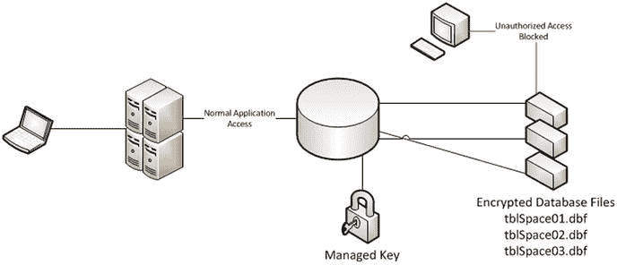
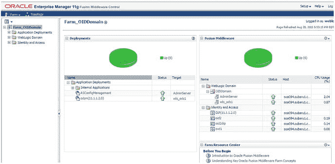
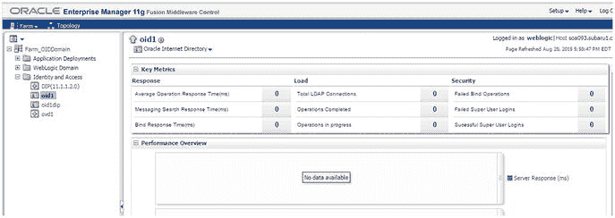
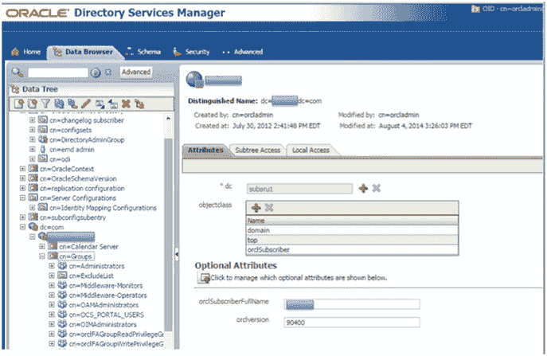
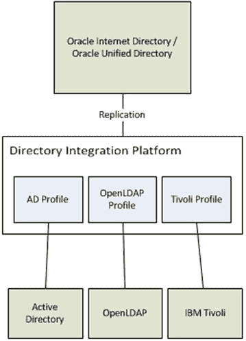
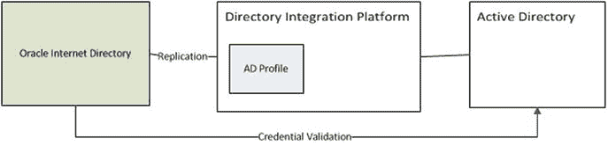
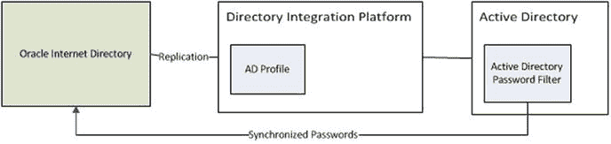
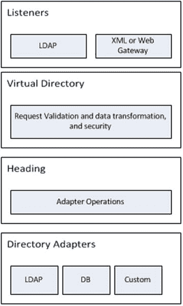

# Oracle Internet Directory

Oracle Internet Directory (`OID`) 是 Oracle 基于数据库的、兼容 `LDAP v3` 的目录服务器。它不仅能够存储身份数据，还能与现有的其他数据存储进行同步。基于 Oracle 数据库，`OID` 能够利用高级特性，即使在存储备份层面也能提供高级别的安全性。`OID` 的可扩展性使其能够处理大量用户和事务，即使是在多站点环境中。高可用性是组织关注的一个关键问题。`OID` 提供的机制有助于 IT 部门为其客户提供极高的可靠性。总体而言，`OID` 为组织提供了其可能需要的所有身份和策略存储选项。

作为目录服务器，`OID` 围绕 `LDAP v3` 兼容性构建。这不仅确保 Oracle 应用程序可以引用 `OID`，而且其他具有 `LDAP` 兼容性的第三方应用程序和服务也能够利用组织的投资。与 Active Directory 等网络访问目录或特定于应用程序的目录不同，`OID` 是一个通用目录。通用目录遵循一个可以支持不同应用程序的通用标准。虽然 Active Directory 是一个网络，是 `LDAP` 标准的实现，但它专为网络操作系统 (`OS`) 定制，包含网络身份验证和授权所需的属性。它是一个更专业的工具，可能更难以适应通用目的。因此，`OID` 为公司提供了一个整合目录以使用 `OID` 的平台。

### 安全性与数据隐私

如果一个组织正在考虑采用 Oracle Identity Management，安全性将是其首要关注点之一。从客户端/提供程序层一直到底层的数据存储乃至备份级别，都应维持高度的安全防护。从客户端应用和认证层面来看，OID 支持 SSL。SSL 确保数据在通过网络发送前被加密。在此基础上，它提供了验证接收方是否被授权、解密数据以及确保消息完整性的机制。

如前所述，以安全方式传输数据可确保消息不会被第三方截获和解读。一旦数据被请求者接收或写入磁盘，数据隐私方面的考虑要求即便在这些层面也必须极其谨慎地保护数据。利用 Oracle 数据库作为其数据存储，OID 能够利用先进的数据库功能来实现这一目标。

##### Oracle 透明数据加密 (TDE)

Oracle 透明数据加密 (TDE) 为 OID 提供了一种对写入数据库磁盘的数据进行加密的方法。当 OID 数据被写入数据库时，配置了 TDE 的表空间可确保数据在写入数据文件时即被加密。随后，当结果集返回给客户端时，数据会被解密。如果存储设备或备份丢失或被盗，加密可确保身份数据保持私密和安全。此加密层在数据库内部进行。经过授权的应用程序用户且拥有正确权限者，可以正常查看数据，无需任何额外操作。然而，试图绕过应用程序直接从数据库文件读取数据的未经授权人员或进程，则只能看到加密数据。所有这些对应用程序都是透明的，这意味着 OID 无需进行任何额外的配置更改即可利用数据库内的此功能。图 3-4 描绘了一个 TDE 环境。



图 3-4. 透明数据加密

身份数据不仅需要防范入侵者，有时还必须防范可能包括拥有特权的数据库账户用户在内的内部威胁。不幸的是，大多数内部数据库账户（如 sys 或 system）为多人所知，例如数据库管理员 (DBA)。这可能导致对关键数据的未授权访问，即使这种访问是无意的。Oracle Database Vault 允许管理员有效地将数据库账户锁定在应用程序数据之外，同时仍允许这些账户执行数据库管理操作。因此，通过防止特权账户访问 OID 使用的私有身份数据，这在数据库层面增强了安全性。

即使不使用数据库内的 TDE 或 Data Vault，OID 也开箱即用地支持对敏感数据元素进行加密。敏感属性包括 `orclpasswordattribute` 和 `orclrevpwd`。此类值在存储操作期间被加密，并在需要时解密。如果在 OID 内启用了数据隐私模式（这是默认模式），这些值将使用 AES256 进行加密。

#### 易用性与管理

本书前文已讨论过，安全性不应成为应用程序性能或用户生产力的瓶颈。增强的安全性不应需要复杂的界面或额外的维护资源。OID 通过使用 Oracle 的 Fusion Middleware Control 界面和 Oracle Directory Service Manager (ODSM)，简化了管理任务和环境管理。借助这些图形用户界面 (GUI) 以及多种命令行选项，可以轻松地管理和监控 OID。这使得故障排除和日常维护更为简单，同时也使目录管理等日常操作更加直接。

##### ODSM 界面

ODSM 界面是 Oracle 标准的基于 Web 的 GUI，可用于管理 OID、Oracle Virtual Directory (OVD) 和 Oracle Unified Directory (OUD)。该界面可供非管理员用户作为基本的 LDAP 浏览器使用，供管理用户管理属性、条目和目录对象，甚至可以管理配置条目。

作为基本的 LDAP 浏览器，ODSM 允许非管理用户查看和搜索其他用户。任何经过认证的用户（即存在并输入有效凭证的用户）都可以浏览目录。组织无需开发定制应用程序或投资购买昂贵的第三方产品，即可让其用户利用 OID 在目录中搜索其他用户的联系信息。需要注意的是，当非特权用户登录 ODSM 界面时，他或她只能查看“数据浏览器”选项卡，而不能对目录进行任何更改。该用户的视图也将仅限于其有权访问的数据。

管理用户可以将 ODSM 用作管理工具。当超级用户账户 `cn=orcladmin` 或 `DirectoryAdminGroup` 的成员登录时，该用户会看到比普通认证用户更多的数据选项。管理用户可以浏览相同的数据，但可以选择创建和修改用户及组条目、管理策略（如密码策略），甚至创建新的对象类和新的对象类型。这些用户还能够管理系统配置条目。

维护 OID 不仅仅是管理目录和跟上 LDAP 条目。还需要持续监控系统性能、监控系统状态，并管理后台进程，如目录集成平台 (DIP)。Fusion Middleware Control 界面是一个基于 Web 的工具，系统管理员可通过它完成这些任务。

##### Fusion Middleware Control 界面

如果 OID 安装在 WebLogic 域中，WLS 会提供对控制屏幕的访问。在 Fusion Middleware Control 提供的众多功能中，它允许管理员查看性能摘要、启动和停止环境、查看端口使用情况、获取规模调整建议、设置与其他 LDAP 实例的同步和复制，以及管理安全。图 3-5 显示了 Fusion Middleware Control 摘要屏幕。使用此屏幕，管理员可以获得 OID 状态的高层视图。



图 3-5. Fusion Middleware Control 摘要屏幕

管理员访问 WebLogic Fusion Middleware Control 屏幕后，可以深入查看各个部署和应用程序，如图 3-6 所示。在这些屏幕中，不仅可以查看当前的统计数据和状态，还有菜单允许修改和维护环境。



图 3-6. Oracle Internet Directory 摘要

另一个用于 OID 的关键管理工具是 ODSM。通过如图 3-7 所示的此工具，管理员可以浏览、添加、编辑和删除各种目录属性，包括用户、组、策略和操作特性。



图 3-7. Oracle Directory Services Manager


#### 目录同步

多年来，OID 一直是 Oracle 身份管理解决方案以及众多 Oracle 应用程序和融合中间件产品的安全应用核心，这些产品在设计之初就围绕 OID 进行认证和授权。因此，在已部署 Oracle 产品的组织中，它已成为事实上的安全标准。然而，很少有组织愿意从 Active Directory 等网络目录访问平台迁移。对大多数人来说，Active Directory 提供了高级别的网络安全，而 OID 则允许进行定制，以用作应用或通用身份目录。其由 DIP 提供的同步功能，是使组织能够保留对 Active Directory 或其他第三方目录系统投资的关键，同时利用 OID 的优势服务于其应用程序。

DIP 使组织能够保持 OID 与不同目录系统之间的同步。可以为 DIP 创建配置文件，以连接并将身份数据复制到 OID。在此复制过程中，集成配置文件允许转换身份数据，以匹配 OID 环境或使用它的应用程序所需的结构和属性。DIP 可以根据组织在性能和目录大小方面的要求进行配置。也许组织拥有一个遍布全球的庞大用户基础，此时重组数据结构可能更有意义。使用 DIP，OID 中的数据结构不一定需要与 Active Directory 中存储的结构相匹配。DIP 支持将多个身份存储同步到单个 OID 实例。由于 OID 支持存储多个上下文，组织可以轻松地组织来自每个存储的用户。图 3-8 展示了 DIP 如何将多个不同的目录源整合到单一源中的一个示例。



**图 3-8.**
目录集成平台可视化

目录同步是一项宝贵的资源，直到出现数据不一致。这些不一致通常源于在 OID 中编辑用户或组属性，而真实数据源可能是另一个目录系统，如 Active Directory。一个常见的属性是用户密码。用户不想为不同的系统和应用程序管理多个密码。要求他们这样做会导致安全性削弱，因为用户倾向于写下密码或使用更简单的密码。在 OID 中为从 Active Directory 同步过来的用户更改密码可能导致不一致，从而可能阻止用户登录所需资源。OID 能够使用外部认证插件和外部密码过滤器来帮助防止这种情况发生。

外部认证插件允许管理员配置 OID，将凭据验证移交给给定用户的源目录。这样做，OID 不会为任何从源复制的用户维护用户密码。相反，用户属性会触发 OID 将凭据传递给源进行验证。因此，有效用户必须在 OID 和源中都存在，但 OID 中的密码更改不会影响认证，因为唯一有效的密码存储在源中。这样，真实数据源仍然是源目录，密码必须在那里更改。DIP 负责保持所有属性同步，而插件处理认证，提供了一个非常安全的环境而无需同步密码。使用外部认证，如图 3-9 所示，OID 将凭据验证移交给源目录。



**图 3-9.**
外部认证插件

外部密码过滤器也与 DIP 协同工作。然而，它不是将凭据验证移交给外部目录，而是将源密码同步到 OID。为确保密码相关的数据隐私，在从源复制密码到 OID 时使用 SSL 通信。与 DIP 过程非常相似，密码过滤器将源目录中发生的密码更改复制到 OID。但应注意，此过程可能导致数据不一致，因为在 OID 中进行的密码更改将是有效的。如果后来用户在源中更改其密码，这将触发 OID 中的相同更改，可能会造成一些混淆。因此，目录可以被配置为同步密码而非移交凭据验证，如图 3-10 所示。



**图 3-10.**
Oracle Internet Directory 密码过滤器

外部认证插件和外部密码过滤器与 DIP 协同工作，为组织提供了维护与企业目录系统保持同步的应用目录的能力。这带来了更高效的安全部署，因为管理员只需在企业目录中维护企业用户，知道这些新增和更新会自动传播到 OID 实例。

### Oracle 统一目录

Oracle 在通过 OID 提供强大的 LDAP 目录方面有着悠久的历史。最近，此产品已升级为包含 OUD，这是一个完全用 Java 实现的 LDAP 存储库，提供了许多可扩展性选项，同时还包括同步、代理和虚拟化等功能。

### 架构

OUD 从头开始基于 Java EE 平台构建。据 Oracle 称，这使他们能够利用 Java 虚拟机提供的内存管理能力和调优功能。对于数据存储，OUD 使用 Oracle 的 Berkeley Database Java Edition。这个面向对象的数据库提供了一个稳定的平台，非常适合映射目录中的条目和属性。这种架构减少了 I/O 延迟，并提供了独立于平台的备份和管理能力，从而在提高整体性能的同时，使整个系统更少依赖于企业架构决策。

与 OID 非常相似，OUD 能够构建高可用性架构。OUD 在设计时将高可用性作为首要任务。它提供了在多个数据中心的多个节点上部署的能力，不仅支持本地故障转移，还支持灾难恢复。此外，借助 OUD 的引用功能和透明重路由能力，故障可以立即转移到其他数据中心，从而提供 99.99%的正常运行时间。


#### 可扩展性

OUD 的架构及其支持多个节点和数据中心的能力，提供了极高的可用性。结合高可用性，可扩展性使企业能够根据当前需求启动足够规模的目录，而无需为未来的需求预留环境空间。Oracle 声称 OUD 可以在商用服务器上扩展到数十亿用户。这是通过代理功能和跨部署在一系列服务器上的分区分发身份数据来实现的。分区的分发允许工作负载分散在多个服务器之间，从而减少了在仅能跨数据中心一两台服务器平衡负载的环境中通常出现的工作量和 I/O 操作。

为了给 OUD 的可扩展性增加最大价值，全局索引允许 OUD 将请求映射到正确的分发分区。OUD 可以使用数据分发将数据存储分散到多个节点，甚至跨多个数据中心。这不仅对分散工作负载非常有用，而且如果按区域进行，还可以利用它来减少网络延迟的影响。如果企业的用户遍布全国甚至全球，它很可能在不同区域战略性地设有数据中心。使用 OUD 的分区数据能力，允许将区域用户放置在最适合其常规工作区域的服务器上。全局索引使 OUD 能够跟踪条目的位置。如果一个节点收到请求，它会快速转到正确的节点（无论其位置）以验证用户。此功能不仅可以帮助组织降低成本，还可以提高用户生产力。

#### 复制

与 OID 类似，OUD 提供了一种在多个节点间复制数据的机制。此功能对于确保最大可用性至关重要。复制确保在一个节点上更新的身份存储库数据传播到集群的其他成员节点。延迟过长或未正确复制的环境可能导致安全问题，因为用户可能能够访问已将其移除一段时间的资源，或者密码更改可能不会立即生效。OUD 引入了高级复制。高级复制模型使用复制服务器来与其他目录服务器同步数据更改。通过将复制工作转移到单独的服务器，同步更改的工作从目录服务器上卸载，允许它们将资源集中用于目录查询。为确保复制的安全性，OUD 复制服务确保客户端应用程序请求的身份数据仅在数据已复制到其他成员后才会发布。此外，通过防止敏感数据被复制到可能不太安全的服务器上，增强了身份安全性。

### 可用性与可管理性

与 OID 一样，OUD 使用 `ODSM` 和 `Fusion Middleware Control` 进行管理。由于之前已经讨论过这些，此处不再赘述。

## Oracle Virtual Directory

大多数组织已经在多个身份存储上进行了投资。这包括他们的网络身份存储、特定于应用程序的身份存储，甚至可能是特定于业务部门的 `LDAP` 目录。在许多情况下，各种数据存储包含相同的用户或相同数据的子集。这常常导致混乱，管理员试图管理用户组并知道各种存储的位置。将这些目录同步到中央存储库可能会导致其他问题，例如增加的数据存储需求以及确保应用程序能够以预期的方式利用存储。引入 `OVD` 是为了解决这些问题。`OVD` 允许组织将其身份目录投资整合到一个集中式存储中，而无需复制数据。

`OVD` 被宣传为一个目录聚合工具。它使组织能够访问正在使用的各种用户存储库，而无需复制其中包含的数据。此外，`OVD` 提供数据转换服务，允许应用程序以预期或要求的格式接收数据。`OVD` 甚至可以为非 `LDAP` 类型的源（例如基于数据库或文件的身份存储）提供 `LDAP` 接口。

### 架构

部署在 `WLS` 上，`OVD` 利用了 `WLS` 的许多优势。在 `WLS` 环境中，`OVD` 能够与凭证存储、审计和日志框架集成，并可以使用 `Fusion Middleware Control` 接口进行管理。

`OVD` 由四个协同工作的逻辑层或组件组成，以提供所有服务，例如数据聚合和转换。从第一层开始，`OVD` 提供了允许外部应用程序连接到它的监听器。下一层由验证请求有效性并确定使用哪个适配器来满足请求的进程组成。请求被传递给一个连接机制，该机制与各种适配器一起操作以检索数据并转换数据集。这些层共同工作，为应用程序提供看似单一数据源的效果。图 3-11 显示了 `OVD` 的主要组件。

```

```

**图 3-11.**
Oracle Virtual Directory 组件

适配器允许 `OVD` 连接到底层身份存储，无论它们是 `LDAP` 还是数据库存储库。提供了用于连接到 `LDAP`、数据库和本地存储的适配器。此外，可以配置自定义适配器来处理各种其他存储库。

由于其架构，`OVD` 具有极强的容错能力。可以在不同的服务器上甚至在不同区域部署多个具有相同配置的 `OVD` 实例。无需复制数据或存储文件，也无需提供数据库高可用性选项。每个 `OVD` 实例都使用自己的适配器连接到后端存储库，因此基于负载均衡或故障，任何一个实例都可以处理请求。此外，保证数据与源存储库一样新。

除了能够跨多个服务器部署以提供自身的容错能力外，还可以配置 `OVD` 适配器以将负载分散到源目录的多个实例上。例如，如果有两个使用复制的 `Active Directory` 实例，可以配置 `OVD` 适配器引用这两个实例，从而在一个实例发生故障时提供自动故障转移。

### 聚合

Oracle 虚拟目录并不存储其呈现的身份数据。相反，通过使用前一节中提到的适配器，`OVD`充当了多个后端目录的代理。这减少了与复制和同步多个存储相关的成本和管理工作量，同时利用了组织内已在使用的存储库。它还通过减少开发所需的时间和精力来提高效率，因为无需构建新的目录或接口。

大多数公司都有若干个（如果不是多个的话）不同的用户存储库。这些可能包括网络或企业目录、特定于业务部门的目录、电子邮件、实现其自身目录的`LDAP`启用应用程序，甚至像`EBS`或`PeopleSoft`这样的数据库源。在许多情况下，存储在一个源中的数据不易适配与其他应用程序协同工作，这就需要进行数据复制。通常，控制这些应用程序的各个业务部门有要求，规定他们必须保留对其目录的控制权。无论出于何种原因需要维护多个数据存储，`OVD`都可以整合它们并提供那个单一访问点。

为了便于聚合身份存储信息，`OVD`提供了转换或映射数据到应用程序或后端数据存储预期格式的能力。这些映射以双向流进行。这允许将请求格式化以匹配存储要求，同时返回的数据随后被转换以匹配客户端应用程序的要求。`OVD`也可以配置为重新映射属性名称和值。

作为代理，`OVD`系统地将每个传入的请求路由到正确的适配器，其逻辑是检查`DN`模式、过滤器、属性和查询，以确定满足请求的最佳可能适配器。这减少了为结果而查询的适配器数量，优化了`OVD`的性能，并允许配置更复杂的环境而不影响性能。

### 访问管理

许多组织正在努力为其用户提供单点登录（`SSO`）能力。然而，如前所述，这些组织可能拥有多个用户存储库。之前提到，`OVD`为客户端应用程序访问各种后端目录提供了单一前端。访问管理系统也是如此。像`OAM`这样的产品大多数时候都需要一个`LDAP`存储库来提供身份验证和授权服务。无论后端存储库如何，都提供那个`LDAP`前端，这正是`OVD`的设计目的。

`OVD`为访问管理系统提供的另一个好处是抽象层。随着时间的推移，底层数据存储会发生变化。这些变化可能导致客户端应用程序或访问管理系统失败。通过将底层目录结构与客户端应用程序分离，`OVD`通过确保数据继续被转换或翻译成所需的正确格式来保护它们免受变更影响。

## 总结

本章介绍了构成 Oracle 目录服务的三个主要产品，它们构成了 Oracle 身份和访问管理的基础。`OID`和`OUD`都提供用户管理和存储解决方案，并向客户端应用程序和服务暴露`LDAP`接口。`OVD`帮助组织整合多个目录的管理，并为需要身份验证服务的应用程序提供单一来源。本书的其余部分将集中介绍`OUD`的安装，因为 Oracle 已指明该产品将是 Oracle 目录服务的发展方向。然而，当`OVD`提供额外功能或替代解决方案时，也会对其进行讨论。

