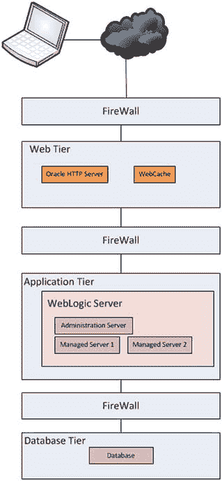
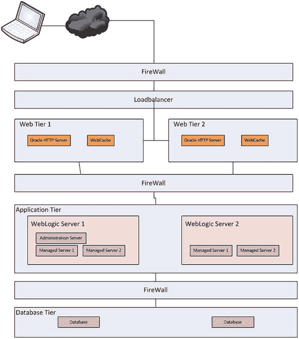
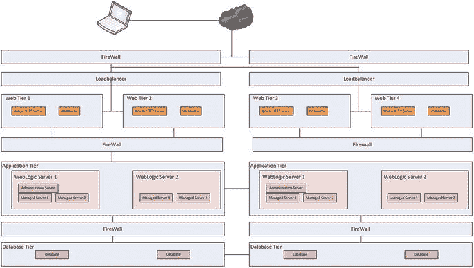
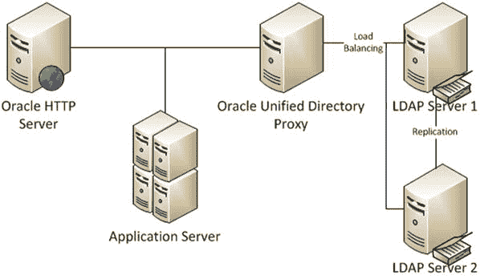
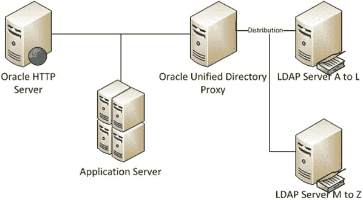
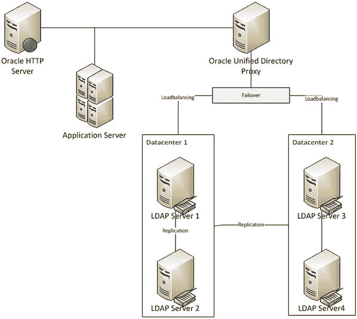
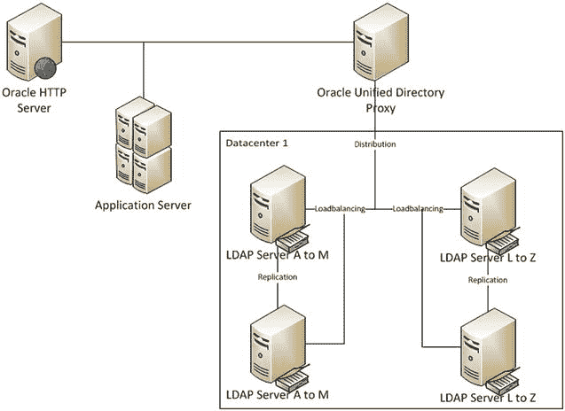
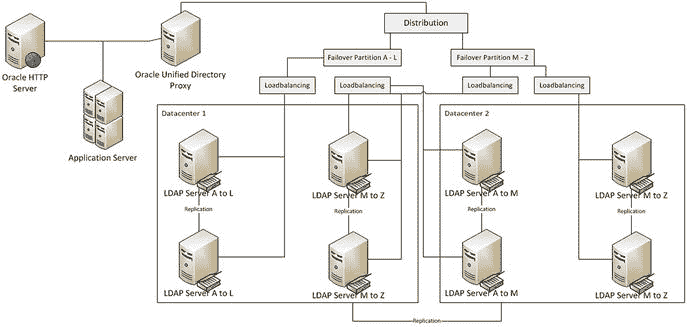
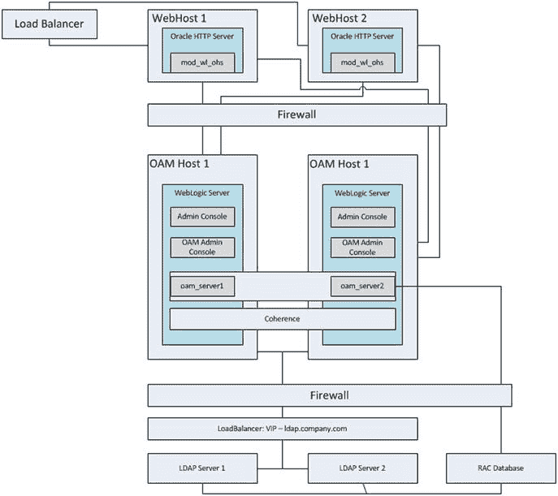

# 2. 安装前注意事项与先决条件

## 容量规划

在没有对当前环境进行适当分析并对未来进行一定规划的情况下，无法正确实施 Oracle 身份与访问管理套件或其部分组件，以在企业内提供应用程序安全。这将确保不仅满足当前需求，而且在未来随着更多用户和应用程序添加到环境中，性能也不会下降。本章为处于身份管理实施规划阶段的人员提供指导。

## Fusion Middleware

Oracle 身份与访问管理与其他 Fusion Middleware 产品和应用程序一样，依赖于`WebLogic Server`（`WLS`）架构。作为 Fusion Middleware 架构的支柱，确保`WLS`环境正确配置至关重要。这始于恰当的规划和分析。在决定如何设置环境时，规划 WebLogic 环境涉及诸多方面，例如内存、硬件、灾难恢复等。下文将对此进行讨论。

性能要求是重要的考虑因素之一。必须考虑应用程序用户对部署在实例上的应用程序期望何种服务级别。所涉及的应用程序是否高度依赖身份或其他数据，是否内存密集型，或者应用程序是否有特定的响应时间要求？还必须考虑环境预计将承受的负载。

### 评估容量需求

`WLS`必须在满足最低要求的服务器上安装和配置。然而，满足最低要求并不总是能保证部署在其中的应用程序以最佳水平运行并提供系统用户所需的服务级别。在规划 WebLogic 实施时，应与应用程序规划人员或开发人员合作，以确定预期用户数、并发连接数、预期响应时间等。此外，收集有关应用程序本身的信息非常有帮助，包括事务时长、每秒事务数和应用程序复杂度。同时考虑应用程序架构，例如数据库连接和外部服务访问。这些都将是确定`WLS`所需硬件要求以及软件调优的有用输入。所有这些可能都需要安装一个测试环境，并根据这些数字进行负载测试。这种做法也可以为未来的调优工作提供一个可靠的基准。

### 硬件

容量规划从计算硬件需求开始，并确保环境满足或超过这些需求。一个很好的起点是计划用于环境的软件附带的文档。`WLS`最低要求一个 1-GHz CPU，但待安装组件的需求将决定整体系统要求。例如，一种分布式架构，其中`Oracle Access Manager`（`OAM`）和`Oracle Identity Manager`（`OIM`）安装在一台主机上，而轻量级目录访问协议（`LDAP`）服务器安装在另一台上，则需要两台物理主机。`OAM`/`OIM`主机将需要六个或更多内核，而`LDAP`主机仅需两个。

### 内存

`WLS`需要 8 GB 可用内存（4 GB 物理内存和 4 GB 交换空间）。这些代表了最低要求，并将根据托管服务器的数量以及部署在其中的软件而变化。重要的是要考虑服务器本身也有内存需求。可以通过为 Linux 操作系统（`OS`）分配 3 GB、为`WebLogic Admin Server`分配 3 GB、为每个托管服务器分配 3 GB（此数字将根据部署内容而变化）来确定一个起点。这将提供`WLS`硬件所需可用内存的初步估算。本章后续将提供关于内存的更详细讨论。

### 存储

尽管`WLS`不需要大量的前期存储空间，但调整磁盘空间大小以允许增长很重要。同样，必须考虑将在 WebLogic 托管服务器内部署的所有软件的磁盘空间要求。`WLS`安装需要大约 580 MB，另外需要 570 MB 用于 coherence。所需总空间大约为 1.2 GB。如前所述，考虑要部署的应用程序。例如，`Oracle Internet Directory`（`OID`）、目录集成平台和目录服务管理器将需要额外大约 800 MB。

### 网络

主机上的网络负载和网络配置将对`WLS`实例的感知性能产生影响。Oracle 建议将`WLS`安装在千兆网络上，并使用硬件负载均衡器。


## 集群化

增加物理或虚拟主机的 CPU 和内存将提升 WLS 环境的性能。这些改动同样会影响部署在受管服务器内的应用程序性能。然而，它们无法降低单个服务器的整体负载。增加服务器或采用集群能带来更大的性能提升。

WebLogic 环境的集群化包括增加一个或多个运行 WLS 的额外主机，并将应用程序部署在受管服务器上，或是在单个多处理器服务器上部署多个实例。然而，性能仍然会受限于物理服务器上的其他资源。跨多台服务器进行 WebLogic 集群化的额外好处包括，通过在物理服务器故障时提供故障转移支持来提高可用性。向 WLS 集群添加新的独立主机并进行负载均衡，会将负载分散到多个主机上。WebLogic 将处理会话信息和集群成员监控，以确保数据连续性。一个配置得当的 WebLogic 集群在客户端应用看来就像一个单一实例。

集群的负载均衡优势能将应用负载均匀地分布在多个主机上。这要求受管服务器部署在集群内的每个节点上。需要注意的是，集群内的每个 WebLogic 实例都管理着自己与数据库及底层服务的连接。这种能力进一步提升了整体环境的性能，因为每个节点都处理自己的一组应用请求。此外，可以向环境添加额外的集群成员而不影响用户，从而实现动态可扩展性。

集群带来的高可用性提升允许在节点丢失时实现故障转移冗余，因为 WebLogic 基础架构处理会话信息，并且应用状态集群可以提供自动故障转移能力。另外，如果需要，整个受管服务器可以迁移到另一个节点。

总之，确保一个成功的 WebLogic 环境需要考虑系统将要承担的基本负载。单台服务器必须至少具备 WLS 所需的最低 CPU 和内存，同时也必须拥有部署应用程序所需的要求。通过 WebLogic 集群功能，可以进一步提升性能和故障转移能力。这些特性将负载分散到多个主机上，每个主机分担一部分工作，并在一个或多个节点宕机时承担起额外负载。Oracle 身份与访问管理套件的所有组件都需要 WebLogic 环境。本章后续将讨论整体环境的通用指南和注意事项，以帮助您建立一个高性能、高可用的系统。

## 企业部署拓扑

Oracle 身份与访问管理代表了 Oracle 基于最先进技术的全面身份管理套件，是同类产品中的佼佼者。它提高了用户生产力，同时提供了一个高度安全且易于适应的环境。为了支持涵盖性能、高可用性和可扩展性的广泛企业需求，Oracle 身份与访问管理利用了 Fusion Middleware 架构。借助 Fusion Middleware，组织可以获得多种选择，从适用于开发环境的单节点，到位于不同地理位置数据中心以支持负载和最大灾难恢复的多节点集群。本节将讨论 Oracle 建议的各种拓扑结构，以及每种结构应被采用的原因及其能为企业带来的好处。

### 单节点

单节点架构描述了一个所有服务都在单一 WebLogic 节点上运行的环境。虽然可能涉及多台物理或虚拟主机，但每台主机运行不同的组件，且不提供故障转移。例如，OID 可能只有一个实例运行在 Host_1 上。OAM 可能运行在 Host_2 上。然而，在这种情况下，所有认证请求都会通过 Host_2 上的 OAM 路由。OAM 检查 Host_1 上的 OID。如果 Host_1 或 Host_2 中的任何一个宕机，所有操作都将停止。这种拓扑不提供任何冗余。同时，它也不提供负载均衡。如果应用程序经历高负载，单台服务器必须处理增加的流量。正是由于这两个原因，单节点拓扑通常只适用于开发环境。

图 2-1 描述了单节点拓扑。应用环境的每一层都由一个单主机/单个 WLS 和两个受管服务器组成。如图 2-1 所示，没有冗余或负载均衡机制。此配置是最简单的实现，很可能在一天内即可完成配置。虽然这对于小型组织或不预期高负载的组织来说可能是可以接受的，但较大的组织通常需要比此架构提供的更高的容错能力和性能水平。



图 2-1. 通用单节点拓扑

图 2-1 中的图像描述了一个包含身份与访问管理的单节点配置。应用环境的每一层都由单台服务器组成。请求被路由到带有 Access Manager WebGate 的 Oracle HTTP 服务器。WebGate 确定请求的资源是否需要认证。如果用户尚未认证，请求会被路由到单一的 Access Manager 服务器，认证过程被移交给 LDAP 服务器。在企业内部，可以使用 Identity Manager 来维护用户存储库。

总的来说，单节点拓扑对于可以容忍停机时间或没有高可用性要求的环境是适用的。例如，开发组可以使用它们来开发需要身份管理的应用程序。开发环境可以选择脱机而不影响普通用户群体。通过进行频繁备份并制定良好的恢复计划，如果用户数量较少或不需要 24/7 可用性，小型组织或许可以通过运行单节点环境来节省一些成本。


#### 本地高可用性

Oracle Fusion Middleware 利用 WLS 的集群功能，使组织能够为冗余和更好性能而实施集群。前文已讨论过，集群环境提供可扩展性，可动态向环境中添加更多节点以适应增加的负载或为未来任务做规划。如果组织预计负载较高或业务增长，可以添加新节点，并且负载均衡可以确保负载在集群的所有成员之间均匀分布。

本地高可用性集群是位于单一数据中心或地理区域内的环境。它提供了冗余和负载均衡能力，是最基本的集群环境。但是，如果单一数据中心发生断电或灾难，将导致服务完全中断，直到环境重新启动或恢复为止。需要注意的是，环境可能由两个或更多 WLS 实例组成。图 2-2 展示了一个使用多个 Web 层和一个双节点应用层的典型负载均衡环境。



图 2-2. 通用单站点集群示意图

Fusion Middleware 环境中的集群对象也支持更高的可用性。集群的节点可以几乎无影响地添加或移除。例如，如果管理员注意到某个集群成员出现 I/O 或内存等问题，只要其他成员可用以接管负载，就可以将该成员下线进行处理。借助集群提供的冗余能力，发生故障的服务器进程可以自动故障转移至集群中的另一个成员。

当仅运行于单个节点的应用程序发生故障时，自动服务器迁移可能非常有用。在这种情况下，Fusion Middleware 允许将服务器配置为自动或手动迁移。如果 WebLogic 检测到服务故障，该单实例服务将自动迁移至另一个节点。这对于像 `JMS` 或 `JTA` 事务恢复系统这样只能在单一服务器上运行的服务尤其有价值。

本地高可用性集群通过提高性能和针对计划外停机提供冗余，并且还能通过以滚动方式应用系统补丁使组织受益。使用集群，组织可以在不关闭整个环境的情况下应用小型补丁。可以通过关闭单个节点或指示负载均衡器将其从可用服务器列表中移除，然后对其应用补丁，从而逐个节点进行修补。在该节点完成补丁后，可以重新启动并重新加入集群，然后可以处理下一个节点，而不会对用户群体产生不利影响。

这些单站点多节点集群非常适合需要解决性能问题并提供高可用级别的组织。这些环境通过使用负载均衡器将请求分配到多个服务器来处理负载。Fusion Middleware 架构提供了从 Web 层到应用层的负载均衡以及从应用层到数据库层的负载均衡。这确保了最有能力处理请求的服务器来处理它们。然而，这取决于服务器进程的类型。

有状态的 Java 应用程序（如 `WebCenter` 或 `ADF`）利用 `WebLogic` 代理插件 `mod_wl_ohs` 来监控服务器状态，以及会话状态副本信息的位置。如果集群中的某个节点丢失，`WebLogic` 代理插件会将请求路由到可用节点，并从副本恢复会话状态。无状态应用程序则依赖负载均衡器将请求路由到集群的可用成员。对于像基于 `C` 的组件这样的有状态应用程序，则不存在会话状态信息副本。负载均衡器保持会话粘性，如果服务器丢失，将路由到下一个可用节点。但是，由于没有可用的会话信息，用户将需要开始一个新的会话。

本地高可用性集群通过将负载分散到多个服务器成员，提供了高水平的性能和可靠性。它们还使企业能够在不影响其用户群体的情况下应用补丁和小型升级。通过 Fusion Middleware 架构，从 Web 层到数据层都提供了高可用性和负载均衡。


#### 灾难恢复与最高可用性

尽管本地高可用性集群适用于许多组织，并提供高水平的性能和故障转移能力，但一些组织需要将负载分散到多个地理位置，并提供跨地理位置的故障转移。这可以在整个数据中心发生故障时，提供最高的可用性和最快的恢复速度。这种拓扑结构也可以用来为地理位置分散的用户提供更好的性能。这对组织来说是最昂贵的选项，因为它需要更多的硬件和多个数据中心站点，同时也增加了复杂性和管理难度。然而，对于需要 **99.999%** 正常运行时间、且对容量和性能有极高要求的组织来说，这是最终的解决方案。

最高可用性是业务遍及全球的组织的必备要求。这些组织无法承受其系统宕机，或安全成为服务访问的瓶颈。这些公司内部的技术团队可能会选择将数据复制到多个数据中心。*主被动* 环境允许更快的恢复。在主站点发生故障的情况下，所有流量都可以在故障转移过程中被导向备份站点。当主数据中心重新上线后，所有流量会被重新定向回它，并重新开始复制以确保备份站点的数据一致性。另一个选项是在多个数据中心间维护 *主主动* 集群。在这种情况下，所有流量会在所有数据中心的所有节点之间进行负载均衡。如果一个数据中心发生故障，负载均衡器会自动将流量导向剩余的服务器。

集群带来的额外好处是，可以将计算能力和任务分散到多个节点上。许多大型公司在全球范围内拥有海量的身份数据和用户。通过使用代理服务器并将数据分布到多个地理位置，组织可以减少网络流量和查询时间。例如，在纽约设立一个数据中心，存放北美地区的身份数据；在东京设立另一个数据中心，处理亚洲地区的身份数据，这样就实现了数据本地化，减少了亚洲国家请求的网络延迟。由于每个区域的数据源更小，查询时间也随之减少。对于用户群体可能没有广泛地理分布、但拥有大量数据的组织，可以使用同样的功能在多台服务器上处理数据子集，从而减少查询时间，同时通过在多个位置复制服务器来改善恢复时间和可靠性。这种环境的示例如图 2-3 所示。



图 2-3.

通用多数据中心最高可用性架构

图 2-3 描绘了一个环境，其中应用程序架构的每一层都进行了集群化，并分布在多个地理位置。这相当于将本地高可用性集群配置复制到一个或多个地理上分离的数据中心。这样做提高了容错能力和性能。需要注意的是，图 2-3 并未详细说明数据负载的分布。这些内容将在本章后面讨论，因为它们与 Oracle 身份和访问管理拓扑相关。

#### 拓扑实现

到目前为止，本章主要集中在 Fusion Middleware 环境的通用术语以及可以采取哪些措施来提高性能和可用性。身份和访问管理的各个组件利用这些拓扑结构为组织提供这些优势。接下来将讨论这些内容与身份和访问管理组件的关系。

这些建议基于 Oracle 企业部署指南。EDG 代表了 Oracle 工程师开发的建议架构，旨在提供最佳性能和可靠性。虽然它们没有给出具体的硬件或调优要求，但给出了环境应如何安装和配置的总体思路。在确定组织的总体需求时，应遵循这些总体指南。使用这些指南还将允许环境更加标准化，从而更容易添加新资源、进行故障排除以及让新管理员定位必要的组件。


### Oracle 目录服务

Oracle 统一目录 (`OUD`) 支持多级负载均衡和分布。最基本的形式是简单负载均衡。这种实现允许代理根据服务器状态和负载来确定哪个节点应处理请求。这会在一个或多个服务器之间均匀分配工作量，从而提供故障转移和性能提升，如图 2-4 所示。


图 2-4：Oracle 目录服务的简单复制以实现负载均衡。

图 2-4 描述了一个简单负载均衡场景。`LDAP 服务器 1` 上的所有数据都被复制到 `LDAP 服务器 2`。统一目录代理在两个 LDAP 服务器之间处理负载均衡，从而减轻单个服务器实例的整体负载。在这种情况下，可以通过代理配置负载均衡。使用 Oracle 统一目录代理，可以将环境配置为按数据分布拆分工作负载。通过简单分布，数据被分区，因此每个服务器只存储整体数据的一部分。代理知道每个分区的内容，并将数据适当地路由到节点。

图 2-5 描述了一个环境，其中身份信息被拆分，使得字母表的前半部分位于 `LDAP 服务器 1`，后半部分位于 `LDAP 服务器 2`。这种分布通过根据所需数据拆分工作来减轻服务器工作负载。支持的分布算法包括数值、词典和 DN 模式。


图 2-5：Oracle 目录服务的简单分布。

在前面提到的简单复制和简单分布式架构的基础上，数据中心之间的故障转移实现了最大可用性和灾难恢复拓扑。在此架构中，负载不仅跨多个服务器拆分，而且跨数据中心复制。这提供了一个负载均衡的环境，当一个数据中心发生中断或饱和时，可以故障转移到另一个数据中心。图 2-6 展示了一个这样的例子。


图 2-6：带有副本节点的负载均衡站点。

图 2-6 描述了一个环境，其中 LDAP 服务器在 `数据中心 1` 内复制，并且该环境被复制到 `数据中心 2`。每个数据中心内部的负载均衡根据组织的需求进行配置。故障转移事件可以配置为在 `数据中心 1` 丢失时将请求路由到 `数据中心 2`。然而，另一个选项是为饱和事件配置故障转移。如果 `数据中心 1` 变得不堪重负，请求可以被发送到 `数据中心 2`，直到饱和度恢复到正常水平。

前面的示例提供了基于每个服务器上复制数据的、数据中心内部服务器间的负载均衡。下一个选项涉及在单个数据中心内的服务器间对分布式数据进行负载均衡。对于缺乏辅助数据中心，但拥有庞大的身份数据需求且预期负载很重的组织来说，此选项将是理想的选择。如图 2-7 所示，身份数据按字母顺序分布在两个 LDAP 服务器上，同时多个故障转移节点提供稳定性和负载均衡。


图 2-7：负载均衡的分布式数据。

在图 2-7 中，身份数据分布在两个服务器上，允许每个分区仅根据查询字符串提供服务。然后每个分区被复制到第二个实例以实现负载均衡。这种架构提供了极快的性能，因为请求会根据服务器包含的内容以及与其他服务器相比所承受的负载被定向到特定服务器。

尽管负载均衡的分布式架构提供了高水平的性能，并在服务器出现问题时提供了一定程度的冗余，但如果数据中心出现问题，它提供的故障转移能力有限。可用性和性能的终极方案结合了所有这些概念，创建了一个多数据中心的负载均衡分布式数据环境。图 2-8 展示了跨多个故障转移站点的分布式架构。


图 2-8：带有跨数据中心故障转移的负载均衡分布式数据。

采用图 2-8 所描述的、带有跨数据中心故障转移的负载均衡分布式数据方案，`LDAP 服务器 A 到 L` 在 `数据中心 1` 内复制。然后这些数据被复制到 `数据中心 2` 中的两个 `LDAP 服务器 A 到 L` 实例。这产生了一个负载均衡的身份数据分区，可以在发生中断时故障转移到另一个数据中心。和之前一样，通过允许每个服务器处理整体数据的一个子集，它减轻了单个服务器的负载。然后，通过为单个数据分区跨多个服务器拆分负载，提高了可靠性和性能。此外，可以为每个分区配置故障转移，以便根据状态或饱和度重定向请求。

### Oracle 访问管理器

`OAM` 利用 `WLS` 集群功能来提供高可用性和性能可扩展性。这些功能依赖于从 Web 层到数据库层的适当设置。需要注意的是，为了获得更高的可用性和性能，在 `OHS` Web 服务器之前，应由负载均衡器处理所有 HTTP 请求，并为 HTTP 流量启用会话粘性。`OAM` 负载均衡和简单故障转移如图 2-9 所示。


图 2-9：基本的 Oracle 访问管理本地高可用性架构。

在如图 2-9 所示的 Oracle 访问管理本地高可用性架构中，请求首先由负载均衡的 Web 层处理，该层由两个或多个带有 `mod_wl_ohs` 模块的 Oracle HTTP 服务器组成。`mod_wl_ohs` 模块使用一个名为 `mod_wl_ohs.conf` 的文件进行配置，该文件标识了 WebLogic 托管服务器的位置。如果 `OAM` 保护所请求的资源，则在 `OHS` 实例上配置的 `WebGate` 组件会收集必要的凭证并将其转发给 `OAM`。需要注意的是，应在负载均衡器上设置 HTTP 会话粘性，以确保后续用户请求被路由到正确的服务器。

`OAM` 部署在一组 `WLS` 上，并使用标准的域、计算机和集群功能进行集群。与普通集群一样，`管理服务器` 安装在两个 WebLogic 节点上。但是，它一次只在一台服务器上运行。`OAM 服务器 1` 和 `OAM 服务器 2` 部署在 `OAM 主机 1` 和 `OAM 主机 2` 上配置的机器上。由于两台机器属于同一个 WebLogic 域，因此它们可以由运行在 `OAM 主机 1` 上的单个 `管理服务器` 实例控制。

从 `OAM 服务器` 实例出发，身份验证查询通过负载均衡器发送到后端 LDAP 服务器。如前一节所述，LDAP 服务器可以是 `OVD`、`OID` 或 `OUD`。为了获得最佳性能和可用性，LDAP 服务器层应配置为负载均衡，如前一节所述。

虽然 Oracle 访问管理的单个实例可以支持大量用户，同时仍能提供良好的性能，但多实例配置可以提供冗余以实现容错和恢复，以及负载均衡以提供更好的性能。


### Oracle Identity Manager

与 `OAM` 类似，`OIM` 也依赖 `WebLogic` 架构来实现性能集群和高可用性。然而，由于其依赖于 Oracle 面向服务的架构（`SOA`），因此多了一层复杂性。此外，配置为使用 `RAC` 数据库的 `OIM` 集群，如果数据库发生故障，将要求用户重新提交他们的请求。为了提供高可用性和负载均衡以优化性能，`OIM` 必须在从 Web 层到数据库和 LDAP 层的每一层都配置集群。图 2-10 展示了 Oracle Identity Management 的高可用性架构。


图 2-10. Oracle Identity Management 本地高可用性架构

请注意图 2-10 的几个细节。

*   `OIM Host 1` 和 `OIM Host 2` 上均已部署了 `OIM` 托管服务器。
*   `OIM Host 1` 和 `OIM Host 2` 上均已部署了 `SOA` 托管服务器。
*   `管理服务器`可以安装在两个主机上，但一次只能在一个节点上运行。
*   `RAC` 数据库在两个节点上均配置了 `Java 数据库连接 (JDBC)` 多数据源，以防数据库节点故障。
*   为 `OIM` 和 `SOA` 配置的虚拟主机名允许在节点丢失时进行故障转移。

将为 Oracle Identity and Access Management 的各个组件使用这些架构结合起来，组织可以创建一个可扩展且高可用的环境。尽管每个部分仅展示了一个双节点集群，但它们可以扩展到包含更多节点，甚至可以扩展到包含多个数据中心。然而，扩展到其他数据中心以及提供数据复制和分区超出了本书的范围。讨论这些是为了让读者在实施环境之前考虑这些选项，因为需要特别考量。

Oracle Identity and Access Management 的每个组件都在单独的章节中进行了介绍，因为每个组件都是一个构建块，可以根据组织需求的发展单独实施。尽管它们可以安装在完全独立的硬件或单一服务器上，但将它们安装在不同的 `WLS` 实例中将简化软件生命周期管理。

根据需要分阶段实施，允许组织安装满足其需求的最低限度的软件。例如，如果组织的短期需求是一个用于集中管理或应用程序认证的身份存储库，则可以使用 `Oracle Directory Services`，而无需 `Identity Manager` 或 `Access Manager` 的额外开销。之后可以添加 `OAM` 以提供单点登录 (`SSO`)，随后可以实施 `OIM` 来完善技术栈，并提供对身份治理和完整身份生命周期管理的访问。

将 Identity and Access Management 的各个组件保持在独立的 `WebLogic` 环境中，简化了软件生命周期的管理。组织经常可能需要升级技术栈中的某一部分，例如 `Oracle Directory Services`，同时保持 `OIM` 和 `OAM` 在其当前版本。`WLS` 可能需要为 `OIM` 打补丁，但这个补丁可能会对 `OAM` 产生不利影响。在这些情况下，将每个组件放在独立的 `WLS` 主目录中，将确保可以执行和测试补丁与升级，而不会危及其他功能。

在确定如何实施这些组件时，必须考虑所选方法的复杂性与可管理性之间的权衡。对于某些组织来说，在独立的 `WebLogic` 环境中安装每个组件可能看起来是最佳的综合选择，而其他组织可能会决定将 `OAM` 和 `OIM` 组合在同一个域中，同时分离 `Oracle Directory Server` 是最好的。

## 前提条件

与任何软件一样，`Oracle Identity and Access Management Suite` 也有其自身的一系列要求，必须满足这些要求才能成功实施。与 Oracle 的所有产品一样，Oracle 提供了一个经过认证的环境列表，包括 `操作系统`、Java 运行时环境、应用服务器和 `CPU` 架构。满足这些认证将确保环境在基准水平上运行，并在需要时获得 Oracle 的适当支持。

### 操作系统

`Fusion Middleware` 套件中的产品和应用程序可以部署在多种经过认证的 `操作系统` 上。每个组织运行其选择的操作系统都有不同的原因。因此，本书的范围不包括操作系统建议。在规划阶段确保 Oracle 对将要使用的操作系统进行认证非常重要。这些认证还将包括任何所需的补丁和软件包，以使安装成功。

### Fusion Middleware 硬件要求

满足 Identity and Access Management 的系统要求首先要确保满足 `Fusion Middleware` 环境的硬件要求。这包括 `CPU`、内存、存储和网络配置。此处提供的信息代表了 Oracle 提供的最低要求，但在大多数情况下，超出这些最低要求将为增长提供空间，并能够处理应用程序负载的突然变化。

在其安装规划指南中，Oracle 提供了典型的 `CPU` 配置列表。对于 Identity and Access Management `11.1.2.x`，建议环境满足以下指导原则。每个组件的推荐架构如表 2-1 所示。

表 2-1. 推荐的 CPU 配置

| 托管服务器 | 处理器 |
| --- | --- |
| Oracle Access Manager | 6 个或更多 X Pentium 1.5 GHz 或更高 |
| Oracle Directory Services | 2 个或更多 X Pentium 1.5 GHz 或更高 |
| Oracle Identity Manager | 6 个或更多 X Pentium 1.5 GHz 或更高 |

一般来说，`Oracle Identity and Access Management` 产品要求最低内存可用性大于 4 GB。因此，必须使用 `64 位` `操作系统` 并安装在 `64 位` `CPU` 架构上。还应注意，`64 位` `CPU` 每秒能够执行的计算量比 `32 位` `CPU` 更多。尽管在许多情况下，Oracle 提供其产品的 `32 位` 版本，但 `64 位` 处理能力及其支持的发展为性能和可扩展性带来了诸多改进。


### WebLogic Server

本节中的数字针对基本的`WLS`。通常，服务器需要 8 GB 物理内存和 16 GB 可用内存。随着托管服务器和身份与访问管理组件的部署，将需要额外的内存。内存要求的具体细节见表 2-2。

表 2-2. 按操作系统划分的 Fusion Middleware 最低内存要求

| 操作系统 | 最低物理内存 | 最低可用内存 |
| --- | --- | --- |
| UNIX | 8 GB | 16 GB |
| Linux | 8 GB | 16 GB |
| Windows | 8 GB | 16 GB |

在这种情况下，可用内存等于物理内存加上交换内存。然而，允许更多的可用内存由物理内存构成，将通过减少存储在磁盘上的交换内存的 I/O 来提高性能。此基线计算假设操作系统需要 4 GB，加上`WebLogic`和管理服务器需要 4 GB：

```
    4 GB of memory for the OS
+    4 GB of memory for WLS and the Admin Server
_________________________________________________________
    Total physical memory required
```

Fusion Middleware 环境的存储要求可能会有很大差异。Oracle 至少推荐 10 GB 的存储。应该考虑到日志记录和额外部署的软件会增加这个数字。安装完成并环境稳定后，降低任何已部署应用程序和托管服务器的日志记录级别配置可能是谨慎的做法。

### Oracle Directory Services

建议将`OUD`安装在与 Oracle 身份和访问管理实例分开的主机上。这是为了将`LDAP`身份存储库放置在与数据库相同的内部网络层中。在之前展示的架构图中，您会注意到`LDAP`和数据库环境被放置在一个与应用程序中间件层分开的层中。因此，Oracle 目录服务的内存要求将与 Oracle 身份和访问管理组件分开呈现。

`OUD`是一个基于 Java 的`LDAP`目录服务器。因此，与其他 Fusion Middleware 产品一样，它安装在受支持的应用服务器中。本节的要求是针对软件安装的，必须与 Fusion Middleware 的最低要求相结合。这将在后面展示。

Oracle 推荐为`OUD`分配 2 GB 物理内存，以便在生产环境中以最佳水平运行。这是除了 Fusion Middleware 所需的 8 GB 之外的。可以配置`OUD`的 Java 虚拟机（`JVM`）以确保使用足够的内存而不会使服务器过载，这将在本书的安装部分讨论。整体内存要求的计算可以简单地如下进行：

```
    4 GB of memory for the OS
+    4 GB of memory for WebLogic and the Administration Server
+    2 GB of memory for the OUD JVM
___________________________________________________________
    10 GB physical memory required for OUD
```

需要注意的是，`OUD`使用一个小数据库来存储`LDAP`条目。此数据库至少需要 1 GB 的磁盘存储。根据日志配置或复制设置，这可能会增加到 30 到 40 GB。确保正确配置日志记录和轮转以防止存储问题非常重要。Oracle 还建议，通过调整内存大小使得整个数据库文件可以加载到内存中，可以提高性能。

### Oracle Identity and Access Manager

尽管将`LDAP`存储库与身份和访问管理节点分开是个好主意，但在大多数情况下，Oracle 身份和访问管理器可以安装在同一物理主机上。是否将其安装到单独的 Fusion Middleware 环境中取决于安装者。但是，内存要求将保持不变。

`OAM`的最低要求内存是 4 GB 物理内存和 8 GB 可用内存，而承载`OIM`的主机还必须考虑`SOA`。因此，`OIM`主机仅托管服务器就需要至少 8 GB 物理内存和 16 GB 可用内存。这是除了 Fusion Middleware 基础设施的最低要求（即 8 GB）之外的。将这些加在一起可以得到以下计算：

```
    4 GB for the OS
+    4 GB for WebLogic and the Administration Server
+    4 GB for OIM Managed Server
+    4 GB for SOA Managed Server
+    4 GB for the OIM Administration Server
____________________________________________________________
    20 GB memory required for OIM
```

如果`OAM`与`OIM`安装在同一主机的同一个`WebLogic`实例中，则还需要额外的 8 GB。在这 8 GB 中，4 GB 分配给`OAM`管理服务器，另外 4 GB 分配给访问管理器托管服务器。由于需要额外的 4 GB 用于另一个`WebLogic`实例，可能希望将`OAM`托管服务器安装在与`OIM`实例相同的域中。

#### 集群考虑因素

在 Fusion Middleware 中，集群被定义为多个`WLS`协同工作以提高可靠性和性能。如前所述，只要资源足够，可以在单台机器上或在多台机器上向集群域添加更多实例。

在确定集群规划时，努力遵循最佳实践很重要。实现集群环境本质上会增加复杂性。不再是单个实例处理所有服务，而是增加了额外的实例，从而增加了对复杂会话处理、负载均衡、分布式处理和复制的需求。

##### 主机配置

尽管 Oracle 推荐每两个`CPU`仅使用一个`WebLogic`实例，但仔细的规划和容量规划将确保环境能够处理预期的负载。Fusion Middleware 环境和 Oracle 身份产品的线性可扩展性允许随着组织需求的增长而实现未来的增长。应该注意的是，物理服务器不需要配置相同的硬件。但是，每台服务器必须满足支持已部署应用程序所需的最低要求。也可以将集群托管服务器部署在不同的物理主机上。

例如，`Host_1`可能包含管理服务器、身份管理器和访问管理器，而`Host_2`仅包含身份管理器，访问管理器则部署在`Host_3`上。图 2-11 描绘了物理主机上身份管理组件的基本分布。


图 2-11. 在多台主机上分布身份管理器集群


### 网络规划

随着服务器数量的增加，集群环境对网络的需求也随之增长。根据组织的网络拓扑结构（例如 DMZ | 应用层 或 DMZ | 应用层 | 数据层），防火墙和负载均衡器的数量也会变化。在每一层，都需要配置防火墙以允许适当的通信。在许多情况下，组织有两个主要的网络区域：公共区域/隔离区（DMZ）和一个内网或内部区域。为简单起见，本书将介绍这种双区域配置。

公共区域或隔离区通常包含 Web 服务器，它们为位于内网区域的应用提供前端代理。这有助于将内部应用区域与公共区域隔离，通过限制内部通信仅使用批准的协议和端口来保护资源。在隔离区内，负载均衡器负责在一个或多个 Web 服务器之间分配负载，而防火墙则用于限制通信。这提供了更严格的安全性、故障转移和性能优势。

在内网区域中，应用服务器和数据库服务器向用户提供服务。这些服务通过隔离区中列出的代理和 Web 服务器进行访问。由于防火墙限制了访问，此区域内的服务器通常配置为仅在指定端口上通信。在某些情况下，例如数据库服务器，可能需要负载均衡器来处理故障转移和负载均衡任务。在其他情况下，使用配置了 WLS 模块的 Web 服务器即可处理负载均衡。负载均衡器也可用作安全套接层（SSL）端点，从而减轻底层服务器的加密处理负担。

无论使用何种负载均衡技术，组织都应确保其能够提供以下功能：

*   监控 HTTP 和 HTTPS 流量。
*   维护多个虚拟服务器名称和端口。
*   检测服务器状态。
*   在服务器故障时重新路由请求。
*   SSL 管理、加速、终止等。
*   能够向 HTTP 请求处理程序添加 `WL-Proxy-SSL : true`。

## 总结

本章介绍了许多概念，从硬件要求到部署拓扑和安装前注意事项。本章并未提供关于 CPU 架构、操作系统和网络硬件等选项的具体建议，而是给出了通用指导原则。每个环境都有不同的要求。然而，所提供的信息应能使组织能够规划其部署策略。

在接下来的章节中，将演示一个双节点集群的安装。在某些情况下，可以在单台服务器上安装多个 Fusion Middleware 主目录和实例。本书将指明这些情况，并说明其背后的原因。

