# 4. Oracle 目录服务安装与配置

Oracle 为轻量目录访问协议（`LDAP`）数据存储提供了多种选项。Oracle Internet Directory（`OID`）和 Oracle Unified Directory（`OUD`）都提供存储功能，而 Oracle Virtual Directory（`OVD`）则允许多个不同的`LDAP`存储呈现为单一来源。本章介绍每个产品的安装和配置步骤。在撰写本文时，Oracle 电子商务套件认证可用于`OID`，而非`OVD`或`OUD`。所有三个产品的安装过程均作为未来参考的指南提供。但是，在后面的章节中，仅使用`OID`。

## 预安装任务

在开始实际的软件安装并将二进制文件放置到文件系统之前，需要注意有一些必须完成的任务以确保操作成功。应仔细创建或完成这些任务，例如填充操作系统（`OS`）用户、设置内核参数以及授予适当的权限。这些项目将在本章后续部分中介绍。

#### 操作系统用户

对于大多数 Oracle 应用程序安装，应创建`OS`用户和组来执行安装和配置任务。创建`OS`组将允许其他`OS`用户执行与应用程序环境管理相关的特定任务。在 Linux 环境中安装 Oracle 应用程序时，最常见的`OS`用户和组是 `` `oracle` `` 用户以及 `` `oinstall` `` 或 `` `dba` `` 组。

要创建必要的 `` `oinstall` `` 和 `` `dba` `` 组，以`root`用户身份执行以下命令：

```
[root@clouddemolab home]# groupadd oinstall
[root@clouddemolab home]# groupadd dba
```

组创建完成后，创建 `` `oracle` `` 用户。

```
[root@clouddemolab home]# useradd -g oinstall -G dba oracle
```

注意

`` `-g` `` 表示用户应添加到的主组。 `` `-G` `` 表示任何附加组。

要设置用户的密码，请以`root`用户身份使用以下命令：

```
[root@clouddemolab home]# passwd oracle
```


#### 操作系统配置

在安装 Oracle 融合中间件基础架构和 Oracle 身份管理软件之前，确保操作系统满足最低要求和配置至关重要。以下列出了所需的内核参数、软件包以及需要更改的文件。

需要设置以下内核参数：

```
kernel.sem  256  32000  100  143
kernel.shmmax 10737418240
```

要设置这些参数，请编辑位于 `/etc` 目录下的 `sysctl.conf` 文件。

```
[root@clouddemolab home]# vi /etc/sysctl.conf
```

在该文件的此部分添加或编辑以下行：

```
# Controls the maximum number of shared memory segments, in pages
kernel.shmall = 4294967296
kernel.sem = 256 32000 100 142
kernel.shmmax = 10737418240
```

在 `sysctl.conf` 文件中设置好这些值后，必须使用以下命令激活并验证新值已显示：

```
[root@clouddemolab home]# /sbin/sysctl –p
net.ipv4.ip_forward = 0
net.ipv4.conf.default.rp_filter = 1
net.ipv4.conf.default.accept_source_route = 0
kernel.sysrq = 0
kernel.core_uses_pid = 1
net.ipv4.tcp_syncookies = 1
net.bridge.bridge-nf-call-ip6tables = 0
net.bridge.bridge-nf-call-iptables = 0
net.bridge.bridge-nf-call-arptables = 0
kernel.msgmnb = 65536
kernel.msgmax = 65536
kernel.shmmax = 68719476736
kernel.shmall = 4294967296
kernel.sem = 256 32000 100 142
kernel.shmmax = 10737418240
```

必须将打开文件限制设置为 4096 以支持该实例。为此，请编辑 `limits.conf` 文件。

```
[root@clouddemolab home]# vi /etc/security/limits.conf
```

如果环境要安装在 Oracle Linux 或 RedHat Linux 上，您还必须在 `/etc/security/limits.d/90-nproc.conf` 文件中执行相同的编辑。如果遗漏了此步骤，该文件中的值可能会覆盖 `limits.conf` 文件中的值。

在刚才列出的两个文件中，确保添加或编辑以下行：

```
* soft nofile 4096
* hard nofile 65536
* soft nproc 2047
* hard nproc 16384
```

编辑此文件后，必须重启服务器以确保所有更改生效。

#### 操作系统软件包

每个 Oracle 应用程序都有自己所需的一组软件包。根据您使用的 Linux 版本，安装过程可能有所不同。在以下列表中，请注意，某些软件包需要在 64 位操作系统上同时安装 32 位和 64 位版本。如果未安装这些软件包，安装将无法正确完成。Oracle 安装程序会检查这些并在安装期间显示错误。

```
binutils-2.20.51.0.2-5.28.el6
compat-libcap1-1.10-1
compat-libstdc++-33-3.2.3-69.el6 for x86_64
compat-libstdc++-33-3.2.3-69.el6 for i686
gcc-4.4.4-13.el6
gcc-c++-4.4.4-13.el6 glibc-2.12-1.7.el6 for x86_64 glibc-2.12-1.7.el6 for i686 glibc-devel-2.12-1.7.el6 for i686 libaio-0.3.107-10.el6 libaio-devel-0.3.107-10.el6 libgcc-4.4.4-13.el6 libstdc++-4.4.4-13.el6 for x86_64 libstdc++-4.4.4-13.el6 for i686 libstdc++-devel-4.4.4-13.el6 libXext for i686 libXtst for i686 libXext for x86_64 libXtst for x86_64 openmotif-2.2.3 for x86_64 openmotif22-2.2.3 for x86_64 redhat-lsb-core-4.0-7.el6 for x86_64 sysstat-9.0.4-11.el6 xorg-x11-utils* xorg-x11-apps* xorg-x11-xinit* xorg-x11-server-Xorg* xterm
```

至此，操作系统应已完全准备好，可以进行后续安装。在安装软件之前执行这些操作将确保安装过程顺利进行。在许多情况下，如果遗漏了任何内容，安装程序会提供详细的消息。如果在安装过程中出现错误，请停止安装并先解决问题，然后再继续。

#### 数据库准备

在开始安装之前，需准备所需的数据库模式。这使用 Oracle 的仓库创建实用程序完成。该软件可从与身份管理软件相同的位置下载。确保 RCU 的版本与要安装的融合中间件软件的版本完全一致非常重要。

本例中将安装 OID 11.1.1.9。因此，将使用 RCU 版本 11.1.1.9。如前所述，OID 11.1.1.9 是经认证可与 Oracle 电子商务套件一起使用的最新版本。

下载所需软件后，即可开始创建仓库。将下载的文件解压到临时目录。本例中使用 `/home/oracle/stage/rcu`。解压后将创建一个名为 `rcuHome` 的目录。如图 4-1 所示，运行 `rcuHome/bin` 目录下的 `rcu` 文件。

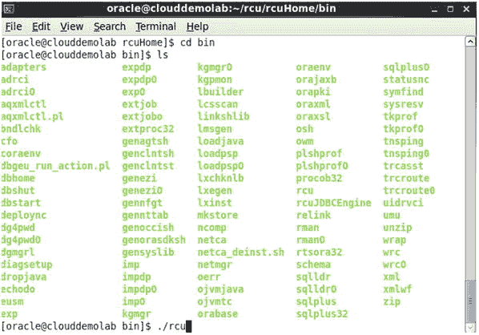
图 4-1. 仓库创建实用程序

在运行 RCU 之前，数据库初始化参数 `open_cursors` 应至少设置为 500。默认值通常为 300。要更改此参数，请在 SQLPlus 提示符下执行以下命令：

```
alter system set open_cursors = 1000 scope = both;
```

RCU 的第一页是欢迎屏幕。清除“下次跳过此页”复选框可在后续运行 RCU 时跳过欢迎屏幕。如图 4-2 所示。

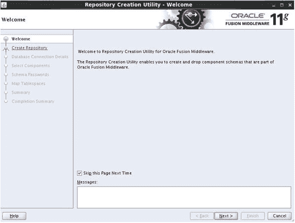
图 4-2. 仓库创建实用程序欢迎屏幕

图 4-3 显示了 RCU 中的第一个决策点。此时，您可以选择创建新的元数据仓库或删除现有仓库。

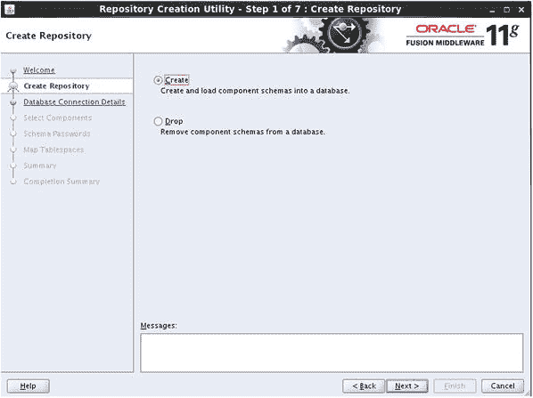
图 4-3. 仓库创建实用程序：选择将组件模式创建到数据库中

RCU 可用于根据需要创建所需的数据库模式或删除模式。该工具可以多次运行。因此，如果遗漏或错误创建了某个模式，可以重新运行 RCU 来创建遗漏的对象或删除整个模式。务必谨慎，确保要删除的模式当前未被使用。决定创建或删除仓库后，RCU 将提示您输入数据库连接详情，如图 4-4 所示。

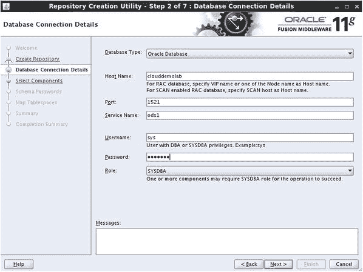
图 4-4. 数据库配置参数

需要注意的是，RCU 不支持可插拔数据库或容器数据库。如有疑问，请与您的数据库管理员讨论。

选择“创建”或“删除”操作后，RCU 工具将提示输入数据库连接信息。您的数据库管理员可以提供此信息。本例中，数据库实际上与身份管理环境运行在同一主机上。虽然在资源充足的主机上这是可行的，并且可以支持开发实例，但建议在生产环境中将数据库和融合中间件组件运行在不同的主机上。将完成一项先决条件检查，如图 4-5 所示。

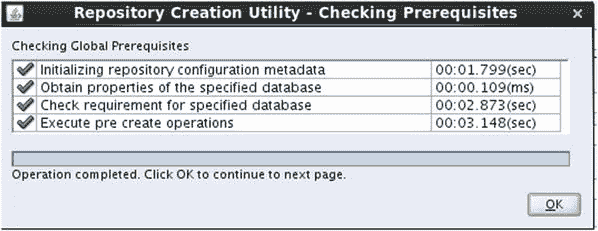
图 4-5. RCU 数据库先决条件检查

RCU 应使用具有 `SYSDBA` 权限的 `SYS` 帐户。但是，如果无法做到这一点，可以配置 RCU 生成模式创建脚本，然后提供给数据库管理员。


在输入数据库参数以告知`RCU`使用哪个数据库后，该工具将执行初步检查以确保满足最低要求。如果遇到任何错误，请在继续安装前进行更正。图 4-6 所示的屏幕允许您选择希望创建的组件。

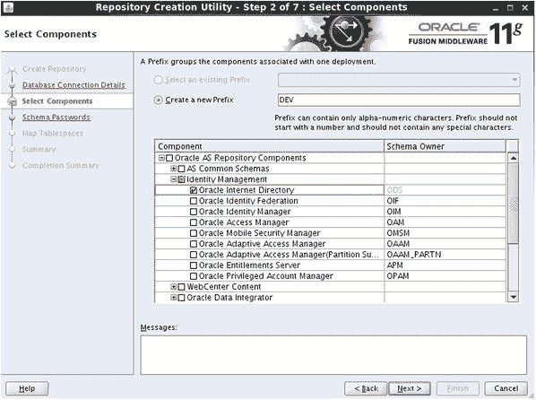

图 4-6. 模式选择屏幕

在“选择组件”屏幕上，您可以选择计划安装的融合中间件组件。虽然多个组件可以安装在同一数据库中，但通常的做法是将身份管理组件与诸如 WebCenter Content 或面向系统架构（`SOA`）等其他应用程序分开。在此情况下，仅`OID`模式（Oracle 目录服务）将安装在此数据库上。这样做是为了便于管理和维护。数据库的补丁和升级将被隔离到`OID`数据库，管理员无需担心会影响身份与访问管理器应用程序。您将看到如图 4-7 所示的确认屏幕。

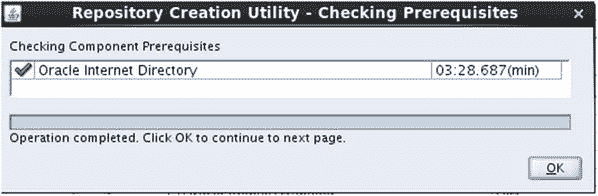

图 4-7. 预检查已完成注意

对于大多数融合中间件产品，数据库可以存储模式的多个实例，因此在前面的截图中有创建前缀的选项。但是，每个数据库只允许一个`OID`实例。如“模式选择”屏幕所示，`ODS`模式未添加前缀。

完成组件选择后，`RCU`将检查数据库以确保唯一性并符合先决条件。

必须为`RCU`将创建的模式设置密码，如图 4-8 所示。您可以为所有模式使用相同的密码，也可以为每个模式使用不同的密码。由于安全考虑，某些环境可能需要不同的密码。

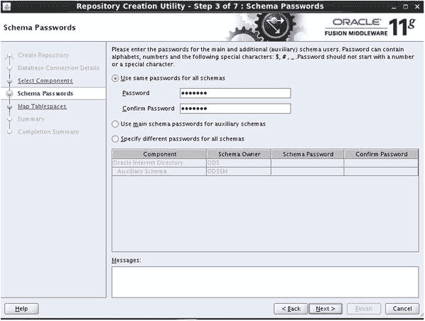

图 4-8. 设置模式密码

图 4-9 显示了数据库先决条件以及`RCU`将执行的操作的摘要。

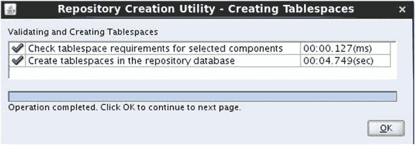

图 4-9. 创建必要的数据库对象

表空间映射屏幕显示了要安装的每个组件以及将要创建的表空间。单击“其他表空间”按钮会显示更详细的列表。此屏幕如图 4-10 所示，仅提供信息，无需输入。

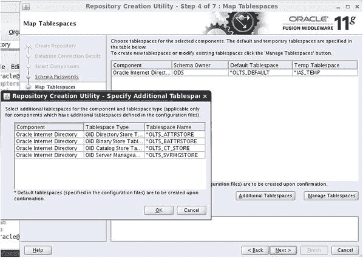

图 4-10. 表空间映射

在此屏幕上单击“下一步”后，将显示输入的摘要，让您有机会在创建任何内容之前检查配置，如图 4-11 所示。

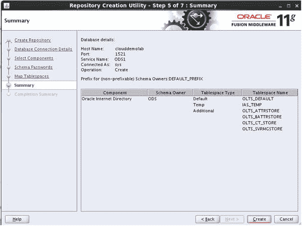

图 4-11. 存储库创建配置摘要屏幕

图 4-12 显示了“存储库创建工具完成摘要”屏幕。此时，所有数据库模式对象都已创建，并填充了`OID`所需的必要数据。后续步骤包括安装 WebLogic 基础设施和`OID`。

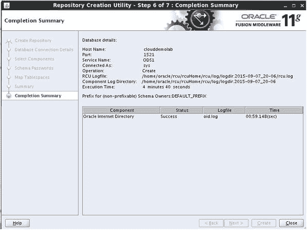

图 4-12. RCU 已完成

## 融合中间件 WebLogic 服务器

一旦先决任务完成，安装`OID`就可以从安装融合中间件 WebLogic 服务器（`WLS`）开始。截至撰写本文时，`OID` 11.1.1.9 已在`WLS` 10.3.6 上获得认证。虽然在此环境中使用更新版本的`WLS`可能是可行的，但强烈建议您遵循 Oracle 提供的认证矩阵。这将确保在出现问题时的兼容性和可支持性。

融合中间件环境需要使用经过认证的 Java 开发工具包（`JDK`）。出于本讨论的目的，将使用`JDK` 1.6 更新 45。您可以在一台机器上安装多个版本的`JDK`。但是，重要的是在安装和所有管理任务期间，更新`JAVA_HOME`和`PATH`变量以使用正确的版本。这些可以使用以下命令完成，或者可以将它们添加到配置文件脚本中以避免重新输入命令。

```
[oracle@clouddemolab ∼]$ export JAVA_HOME=/home/oracle/java/jdk1.6.0_45
[oracle@clouddemolab ∼]$ export PATH=$JAVA_HOME/bin:$PATH
```

`WLS` 11g（版本 10.3.6）是目前与`OID` 11.1.1.9 认证的最新`WLS`版本。因此，本节介绍此版本的安装。如果在 64 位系统上安装`WLS`，则需要使用`wls10.3.6_generic.jar`文件。要使用此文件，请执行如图 4-13 所示的命令。


图 4-13. 开始 WebLogic 服务器安装

几乎每个 Oracle 软件安装程序都从“欢迎”屏幕开始，如图 4-14 所示；`WLS`也不例外。

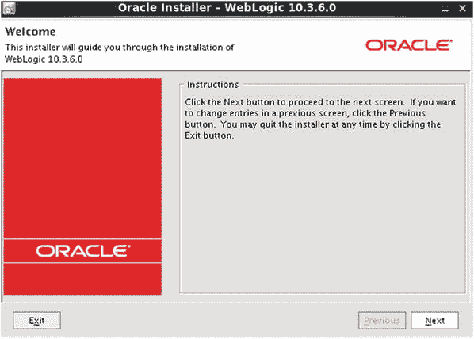

图 4-14. WebLogic 服务器安装欢迎屏幕

第一个需要的输入是新的中间件主目录的位置。每个融合中间件应用程序都需要一个中间件主目录位置。对于`OID`和身份与访问管理环境，为了可管理性，这些将是分开的。对于`OID`，中间件主目录将称为`OIDMiddleware`，位于`/home/oracle/OIDMiddleware`。此屏幕之后将是软件更新屏幕。您可以选择输入电子邮件地址以接收更新通知，也可以跳至下一步。详情请参见图 4-15。

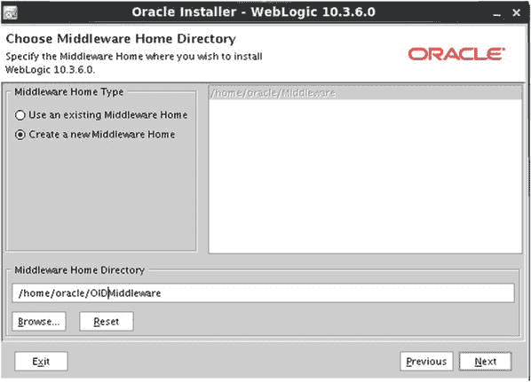

图 4-15. WebLogic 服务器中间件主目录配置

选择您打算使用的`ORACLE_HOME`后，将出现如图 4-16 所示的屏幕，您需要在该屏幕上选择安装类型。

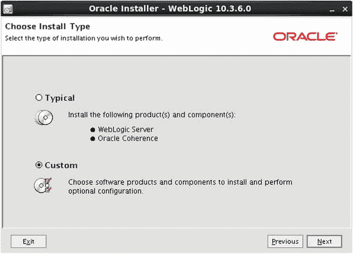

图 4-16. 选择安装类型

此步骤允许您选择典型或自定义安装。典型安装安装以下组件：

*   核心应用程序服务器。
*   管理控制台。
*   配置向导和升级实用程序。
*   Web 2.0 HTTP 发布-订阅服务器。
*   WebLogic SCA。
*   WebLogic JDBC 驱动程序。
*   第三方 JDBC 驱动程序。
*   WebLogic 服务器客户端。
*   WebLogic Web 服务器插件。
*   UDDI 和 XQuery 支持。
*   评估数据库。
*   Oracle Coherence。

如果安装不需要其中任何一项，请选择“自定义”并取消选择不需要的项目，例如“评估数据库”。

一旦选择了安装类型并选择了希望安装的组件，`JDK`选择屏幕（如图 4-17 所示）将显示。

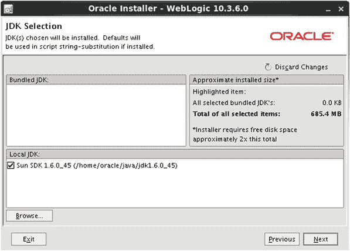

图 4-17. 选择要使用的 JDK 版本

如果主机上安装了多个`JDK`，它们将在此步骤的安装程序中列出。但是，如果在运行`wls1036_generic.jar`文件时指定了`JDK`，那么这将是列出的`JDK`。


