# 5. 目录同步与虚拟化

Oracle Internet Directory (OID)、Oracle Virtual Directory (OVD) 和目录集成平台 (DIP) 共同为 Oracle 目录服务提供了整合用户管理和与其他应用程序集成的能力。这些概念已在前面的章节中介绍。本章将介绍使用 DIP 从 Active Directory 将用户复制到 OID 实例中，为后续与 EBS 以及 Oracle 身份和访问管理器的集成做准备。
```


## 目录集成平台

同步 OID 与 Active Directory 的关键在于 `DIP`。利用 Oracle `DIP`，IT 部门可以将轻量级目录访问协议 (`LDAP`) 信息（源自包括 Active Directory、OpenLDAP 及其他 `LDAP` 或数据库存储在内的多个来源）复制到一个集中式目录中，该目录可与 Oracle 产品及应用程序配合使用。

数据同步通过配置文件完成，这些配置文件可在 `DIP` 系统中创建，用于映射和转换外部目录身份信息，以满足 Oracle 系统的要求。当 `DIP` 执行并查询 `LDAP` 源以在 `OID` 中插入或修改数据时，便会使用这些配置文件。在接下来的章节中，您将看到一个基本的配置文件，用于将 `OID` 与单个 Active Directory 实例同步。`DIP` 可以支持多个配置文件和多个来源。如果您需要将不同的 Active Directory 组织单元 (`OUs`) 同步到 `OID` 内不同的命名空间中，或者需要同步来自不同来源的用户，这将会很有帮助。

### 创建同步配置文件

将使用 Fusion Middleware Control 界面来创建 `DIP` 配置文件。有关 Fusion Middleware Control 界面的更详细信息，请参见第 8 章。导航至 `http://hostname:port/em` 即可打开 Fusion Middleware Control 的欢迎屏幕，如图 5-1 所示。


图 5-1.
Fusion Middleware Control 登录屏幕

可以通过浏览器访问 `OID` Fusion Middleware Control，导航至 `http://<host>:<port>/em`。使用的端口应为域配置期间选择的 WebLogic 管理服务器端口。本例中为 `7001`。登录 Fusion Middleware Control 界面后，使用位于屏幕左侧的菜单结构，定位到位于“身份和访问”下的 `DIP(11.1.2)` 实例。

选择 `DIP(11.1.2)` 后，您将看到服务器进程的当前状态，如图 5-2 所示。请注意，执行摘要为空，因为尚无配置文件可供执行。此屏幕是一个快速参考。创建配置文件后，每个配置文件的摘要将显示在此部分。


图 5-2.
目录集成平台主页屏幕

在 `DIP` 主页屏幕上，使用 `DIP` 服务器下拉菜单导航到 管理 ➤ 同步配置文件。同步配置文件不同于配置配置文件。后者将在本书后面介绍 `EBS` 集成时讨论。图 5-3 描绘了状态屏幕和菜单选项。


图 5-3.
选择同步配置文件

在“管理同步配置文件”页面上（如图 5-4 所示），列出了所有现有配置文件。从这里，您可以根据需要创建、删除和编辑配置文件。启用的配置文件是那些当前正由 `DIP` 调度程序执行的配置文件。它们各自按照为它们配置的间隔运行。


图 5-4.
管理同步配置文件屏幕

随 `DIP` 安装的 `OID` 包含许多预配置的配置文件，用于支持目录源，如 Active Directory、IBM Tivoli、Sun Directory Server 和 Novell eDirectory，以及数据库和 `LDIF` 源。这些是包含常见属性映射的基本模板。组织的个别需求将决定这些配置文件需要多少定制。然而，它们是一个良好的起点，可以避免从头开始创建。请注意，除了所包含模板之外的其他目录源将需要完全自定义的配置文件。

由于这是系统中的第一个配置文件，请在窗口中选择 `创建`。系统将提示您输入有关配置文件类型和源服务器配置的信息。请务必在开始此过程前准备好源服务器信息。您需要主机、端口以及目录中至少具有读取权限的帐户。

创建同步配置文件的第一步是提供名称和有关源身份存储的连接详细信息。创建屏幕如图 5-5 所示。


图 5-5.
连接详细信息


## 配置同步配置文件

为正在创建的配置文件提供一个名称。如果计划为一个给定目录只使用一个配置文件，可以使用像 `AD2OID` 这样通用的名称。但是，如果预计同一来源会有多个配置文件，则可能希望提供更具体的名称，例如 `AD_Region2OID`。此示例可用于当组织要求将不同 Active Directory 组织单位中的用户放置在不同的 OID 命名空间中或区别处理的情况。良好的命名约定有助于管理员轻松管理配置文件。

为配置文件提供名称后，输入先前收集的源目录连接详细信息。由于此示例是一个 Active Directory 服务器，因此类型选择为 Active Directory (MS)。确保为配置文件选择正确的服务器类型，以便身份合成器能够相应地创建配置文件模板。必须输入源目录的主机和端口，并提供一个用户名/密码对，该账户至少对要同步的用户和组具有读取权限。此账户无权访问的任何信息都将不会被同步。这可能导致 OID 中数据缺失。

对于从 Active Directory 到 OID 的单向同步，只需读取访问权限。配置此类同步后，Active Directory 中的更改将被写入 OID。但是，不会写回任何内容到 Active Directory。这将保持 Active Directory 作为环境中所有用户的真实来源。OID 则充当应用程序身份存储。请注意，身份合成器配置文件不会将密码从 Active Directory 同步到 OID。密码处理由外部身份验证插件或 Active Directory 密码过滤器执行。这些选项将在本章后面讨论。

### 属性映射

正确同步两个不同的身份存储要求源对象属性正确映射到目标。例如，Active Directory 可能使用像 `SAMAccountName` 这样的属性进行用户登录，而 OID 实例可能使用 `UID`。这必须在身份合成器配置文件中予以考虑。图 5-6 显示了映射屏幕。

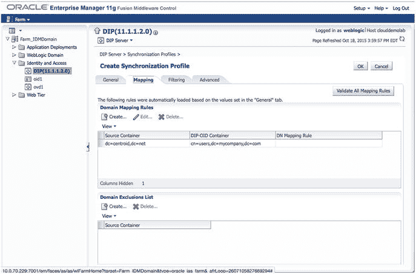

图 5-6. 同步配置文件映射

输入源目录连接详细信息并通过连接测试后，就该配置映射详细信息了。“配置文件映射”页面提供了“源容器/目标规则”、“排除规则”和“属性映射规则”的输入项。这些部分均可配置以满足组织的需求。

#### 域映射规则

在“域映射规则”部分，可以配置一个或多个源容器及其在 OID 中的映射位置。如果源目录结构由多个域或容器组成，而这些域或容器又需要映射到不同的 OID 容器中，这将非常有用。这里需要注意，在单个配置文件中设置的排除和映射规则将应用于此“域映射规则”部分中定义的所有容器。如果每个容器需要不同的排除或映射规则，则应考虑创建多个配置文件来处理每个容器。

在许多情况下，组织在源目录中有一个必须映射到 OID 中单个域的域。在这种情况下，图 5-6 显示源容器为基本判别名 (DN)，目标容器为 OID 域主用户容器。出于本示例的目的，此映射已足够。

需要注意的是，身份合成器主要同步新账户和对现有账户的修改。然而，每个目录源处理对象删除的方式不同，需要特别注意以确保从源中删除的对象也从目标目录中删除。这可能包括诸如授予同步账户域管理员权限等步骤，以便它可以正确查看已删除账户的墓碑记录，或授予对存储已删除或已停用账户的域单位的权限。请参阅源目录文档或咨询管理员以确定需要采取的措施。

#### 属性映射规则设置

属性映射规则允许您指定如何将条目从源转换为目标。Oracle 后端目录必须是源或目标。转换条目时，有三种类型的映射规则：域规则、属性规则和协调规则。这些映射规则允许您指定 DN 映射、属性级映射和协调规则。如图 5-7 所示。

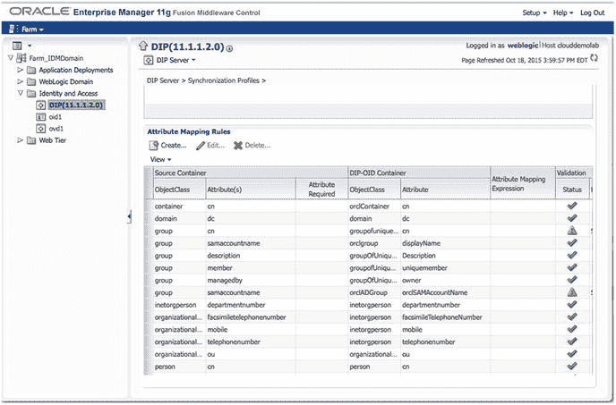

图 5-7. 属性映射规则设置

创建属性映射规则时，源 `ObjectClass` 和 `Attribute` 会直接映射或经过转换以填充目标属性。在创建映射规则时，请牢记一些注意事项。OID 中所有必填字段都应基于源目录中的必填字段。如果构建转换，请确保映射中使用的元素在源中已填充。如果未填充，输入到 OID 的数据可能格式错误。如果源包含二进制值，则必须指定属性类型为二进制。

图 5-8 显示了从 Active Directory 同步 OID 时使用的属性映射规则示例。虽然可以手动创建这些规则，但当使用开箱即用的模板时，规则是预创建的，仅当您的环境使用额外属性或有特殊需求时才需要修改。


图 5-8. 身份合成器映射规则

编辑映射规则的示例如图 5-9 所示。一个常用的映射规则是将源 `userPrincipalName` 和 `sAMAccountname` 转换为可用于填充 OID 中 `orclSAMAccountname` 字段的格式，规则如下：

```
toupper(truncl(userPrincipalName,'@'))+"$"+sAMAccountname
```

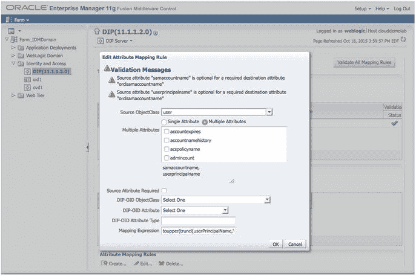

图 5-9. 编辑映射规则

需要注意的是，您的环境可能有不同的要求。

### 过滤规则

过滤规则可用于减少同步对象的数量。您可以使用这些规则排除 Active Directory 组织单位或不符合特定条件的对象。“过滤”选项卡如图 5-10 所示。

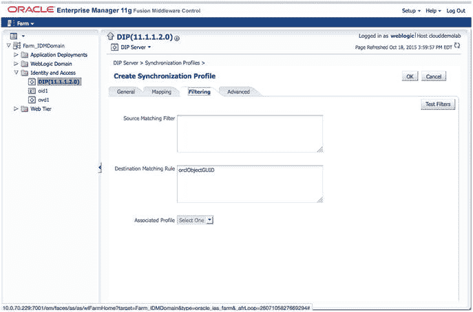

图 5-10. 过滤规则

复杂过滤器应括在双引号中。在某些版本的 OID 中，测试未加引号的复杂过滤器会导致此屏幕锁定，并最终导致 OID 实例崩溃。复杂过滤器是指任何具有多个条件并使用 `AND` 和 `OR` 等运算符的过滤器。

### 高级选项

图 5-11 显示了新身份合成器配置文件的高级设置。“高级”选项卡允许您设置运行同步配置文件的计划间隔并更新平台的其他属性。“最后更改编号”字段可以更新以重新运行最近的更改。但是，在更新该值之前应仔细考虑。

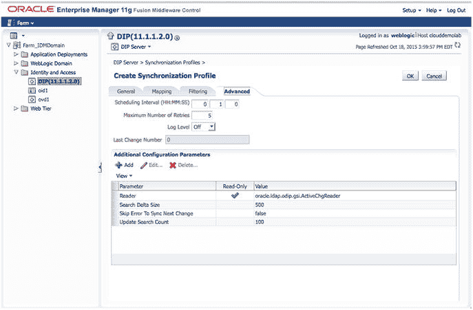

图 5-11. 高级选项


## 创建与管理同步配置文件

创建配置文件后，它将列在图 5-12 所示的“管理同步配置文件”屏幕上。您可以根据需要在此处启用、禁用、编辑、删除和测试您的配置文件。作为管理员，您可以根据需求创建任意多的配置文件。编辑配置文件将使您返回到之前呈现的页面。

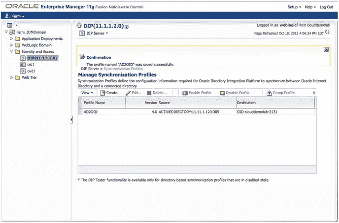

**图 5-12.** 创建的同步配置文件

建议在启用配置文件之前对其进行测试。只有禁用的配置文件才能使用 `DIP Tester` 进行测试。还应注意，只有从 `LDAP` 源到 `LDAP` 目标的配置文件才能使用此方法进行测试。要测试配置文件，请首先确保其已禁用，然后单击 `DIP Tester` 按钮。在第一个测试屏幕上，您可以转储配置文件并查看在创建步骤中创建的映射。单击 `Launch Tester` 按钮。

`DIP Tester` 提供两种测试选项：基本和高级。基本测试将使用预配置的设置运行测试。它将运行并记录消息到 `Fusion Middleware Control`。如果您正在排查同步错误或查找失败的同步，这可能很有用。高级模式允许您配置测试设置，例如要搜索的 `Change Number` 以及同步源目录中的特定更改。

> **注意**
>
> 尽管可以使用 `manageSyncProfiles` 实用程序创建和管理同步配置文件，但建议您使用 `Fusion Middleware Control`。

## 启动目标目录数据

创建同步配置文件后，在启用之前，请使用 `syncProfileBootstrap` 实用程序立即使用源目录中的数据填充目标目录。

要使用 `syncProfileBootstrap`，首先请确保 `WLS_HOME` 和 `ORACLE_HOME` 环境变量设置为正确的值。`WLS_HOME` 应设置为 `<Middleware Directory>/wls10.3.6`。`ORACLE_HOME` 应设置为您安装 `OID` 的目录。这通常是 `<Middleware Directory>/Oracle_OID`。您还应准备好 `WebLogic Admin Server` 主机和端口以及 `WLS` 密码。

> **提示**
>
> 允许 `DIP` 进程执行初始填充可能需要大量时间。建议您使用 `syncProfileBootstrap` 实用程序。

`syncProfileBootstrap` 实用程序位于 `$ORACLE_HOME/bin` 目录中。可以按如下方式运行：

```
syncProfileBootstrap -h HOST -p PORT -D wlsuser {-file FILENAME |-profile -PROFILE_NAME} [-ssl -keystorePath PATH_TO_KEYSTORE -keystoreType TYPE] [-loadParallelism INTEGER] [-loadRetry INTEGER][-help]
[oracle@clouddemolab OIDMiddleware]$ export ORACLE_HOME=/home/oracle/OIDMiddleware/Oracle_IDM1
[oracle@clouddemolab bin]$ export WL_HOME=/home/oracle/OIDMiddleware/wlserver_10.3/
./syncProfileBootstrap -h localhost -p 7005 -D weblogic -pf AD2OID -lp 5
[oracle@clouddemolab bin]$ ./syncProfileBootstrap -h localhost –p 7005 –D weblogic –pf AD2OID –lp 5
[Weblogic user password]
Connection parameters intialized.
Connecting at localhost:7005, with userid "weblogic"..
Connected successfully
The bootstrap operation completed, the operation results are:
entries read in bootstrap operation: 433
entries filtered in bootstrap operation: 0
entries ignored in bootstrap operation: 0
Entries processed in bootstap operation: 346
Entries failed in bootstrap operation: 87
```

> **注意**
>
> 如果您从中加载数据的源目录包含大量条目，最快且最简单的目标目录启动方法是使用 `LDIF` 文件。在这种情况下，不建议使用集成配置文件进行启动，因为在读取和写入源目录和目标目录之间时可能会发生连接错误。如果 `DN` 包含特殊字符，在使用集成配置文件启动时可能无法正确转义，此时也建议使用 `LDIF` 文件。

## 启用配置文件与查看状态

目录启动后，您可以启用配置文件并允许 `OID` 与源 `Active Directory` 中的值进行同步。返回到 `Fusion Middleware Control` 屏幕并启用同步配置文件，如图 5-13 所示。

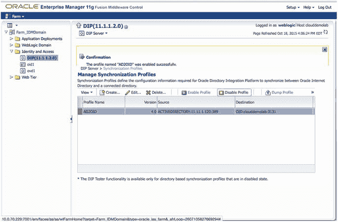

**图 5-13.** 启用同步配置文件

一旦配置文件被启用，您就可以在图 5-14 所示的 `DIP` 服务器主屏幕上查看同步配置文件的统计信息和状态。一目了然，您将看到更改数、错误数、跳过对象数、最后完成日期和上次运行状态。要查看更深入的信息，您可以查看日志消息。

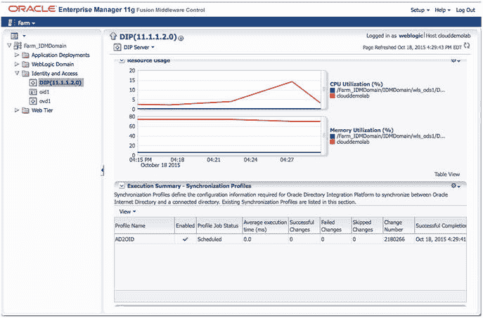

**图 5-14.** DIP 状态

## 故障排除与配置调整

在同步过程中，单个对象可能导致进程停止。默认情况下，如果遇到错误，`DIP` 将不会继续。您可以检查 `DIP` 日志以查看导致同步停止的对象。此日志屏幕如图 5-15 所示。

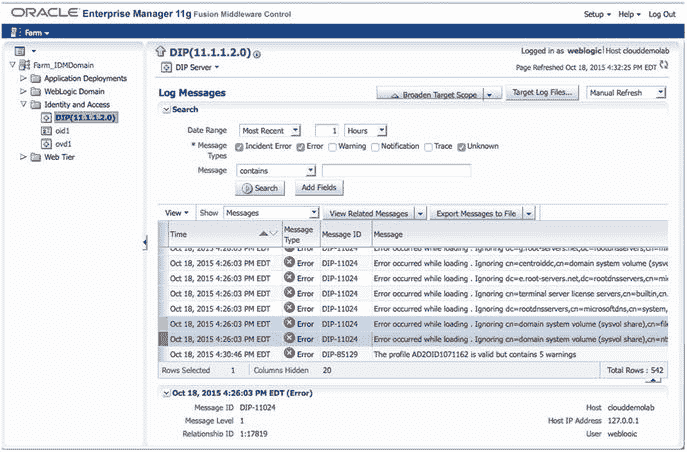

**图 5-15.** 同步配置文件日志消息

很多时候，错误是由缺少必填属性引起的。在识别问题后，可能只需在源 `Active Directory` 帐户中修复问题即可。

其他时候，问题可能看起来更复杂。可能创建了一个新的 `Active Directory OU` 并填充了用户。`DIP` 同步可能会尝试在创建新 `OU` 之前创建用户，这将导致错误。

您可以配置 `DIP` 以跳过错误并继续，防止整个过程失败。在刚才介绍的后一个例子中，这可以允许 `OU` 被创建，下一次同步将获取错过的对象。图 5-16 所示的“高级”选项卡可用于调整特定配置文件的 `DIP` 选项。

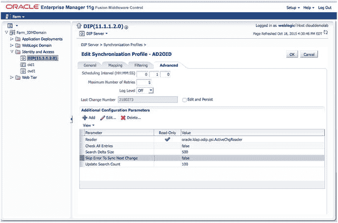

**图 5-16.** 设置“跳过错误以同步下一个更改”参数

另一个故障排除选项是编辑配置文件排除规则。此选项允许您配置同步以在对象不符合特定条件时跳过它们。如果您的环境包含许多您不希望同步的 `LDAP` 对象，您可能会发现此功能很有用。使用图 5-17 所示的“映射”选项卡添加或编辑排除规则。

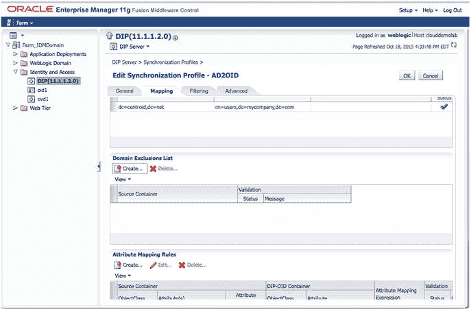

**图 5-17.** 编辑域排除规则和筛选

如果 `DIP` 服务器已关闭，或者您需要运行同步以捕获因错误而错过的信息，您可能需要使用更早的更改编号运行该过程。选择“编辑并保留”复选框并更新“最后更改编号”字段。这样做将允许 `DIP` 进程运行自输入的新“最后更改编号”以来的所有更改。您需要查询源目录以获取您希望返回到的更改编号。同样，可以使用“高级”选项卡来完成此操作。图 5-18 显示了修改此字段所必需的“编辑并保留”复选框。

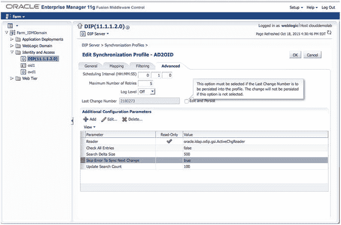

**图 5-18.** 编辑同步配置文件

## 总结

在本章结束时，您应该拥有一个完全同步的 `OID`。根据配置的属性映射规则，此目录中存储的数据应与您的 `Active Directory` 源匹配。使用本章内容，您应该能够编辑用户属性映射并对配置文件进行故障排除。


# 6. Oracle 访问管理器安装

## 摘要

许多组织需要保持身份目录之间的同步。可能 OID 被用作应用程序的身份验证目录，而 Active Directory 被网络用于身份验证。用户必须同时存在于这两个地方才能访问网络资源和他们所需的应用程序。DIP 提供了一种机制，将存储在一个源中的数据复制到另一个源。虽然这可以手动完成，但 DIP 是 Oracle 提供的一个自动化流程。利用本章的信息将帮助您创建必要的组件，以保持不同身份存储的同步。

Oracle 互联网目录（OID）已经安装，并已填充了来自 Active Directory 的用户。您已经配置了一个同步过程，以确保 Active Directory 中的账户信息变更能够填充到 OID。这样做的好处是，所有使用 OID 进行身份验证和角色信息的应用程序都能持续拥有最新的用户信息。融合中间件应用程序和其他轻量级目录访问协议（LDAP）兼容的应用程序可以配置为使用 OID 进行身份验证。然而，许多组织希望通过提供单点登录（SSO）环境来增强此功能。Oracle 引入了 Oracle 访问管理器（OAM），正是赋予组织这种能力。本章介绍如何安装 OAM 工具，为 EBS 和 WebCenter 环境实现 SSO 做准备。

在之前的章节中，OID 已经安装并配置完毕。如果您的环境中尚未存在 OID，或者尚未经过验证，请参阅第 4 章的说明。

## 预安装任务

### 操作系统用户

对于大多数 Oracle 应用程序安装，应创建操作系统（OS）用户和组来执行安装和配置任务。创建 OS 组将允许其他 OS 用户执行与管理应用程序环境相关的特定任务。在 Linux 环境中安装 Oracle 应用程序时，最常见的 OS 用户和组是`oracle`用户以及`oinstall`或`dba`组。

要创建必要的`oinstall`和`dba`组，请以 root 目录身份执行以下命令：

```
[root@clouddemolab home]# groupadd oinstall
[root@clouddemolab home]# groupadd osdba
```

组创建完成后，创建`oracle`用户。

```
[root@clouddemolab home]# useradd  -g oinstall -G osdba oracle
```

注意

-g 表示用户应添加到的主组。-G 表示任何附加组。

要为用户设置密码，请以 root 用户身份使用以下命令：

```
[root@clouddemolab home]# passwd oracle
```

### 操作系统配置

在安装 Oracle 融合中间件基础设施和 Oracle 身份管理软件之前，确保操作系统满足最低要求和配置非常重要。以下列出了所需的内核参数、软件包以及文件更改。

需要设置以下内核参数：

```
kernel.sem  256  32000  100  143
kernel.shmmax 10737418240
```

要设置这些参数，请编辑`/etc`目录中的`sysctl.conf`文件。

```
[root@clouddemolab home]# vi /etc/sysctl.conf
```

在文件的此部分中添加或编辑以下行：

```
