# Oracle Internet Directory 安装与配置

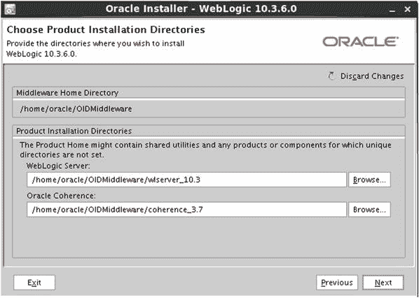
*图 4-18. WLS 服务器与 Coherence 安装位置*

安装摘要屏幕（如图 4-19 所示）确认了所有将要安装的 WLS 组件。使用此屏幕进行复查并进行任何更改。请注意，此安装设置为安装除评估数据库之外的所有组件。

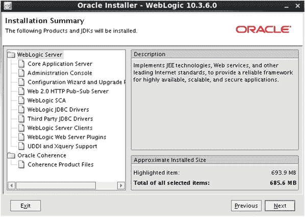
*图 4-19. 安装摘要屏幕*

WLS 安装结束时，将显示安装完成屏幕，如图 4-20 所示。界面中会呈现“运行快速启动”复选框。在此场景中，请清除此复选框。域配置将在之后将 OID 安装到此 Middleware Home 中时进行。

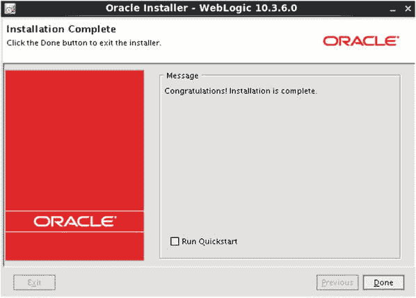
*图 4-20. WebLogic Server 安装完成屏幕*

至此，您已安装了 OID Middleware Home 所需的二进制文件。OID 应用程序文件将被安装到此环境中。

## Oracle Internet Directory 安装

在运行 Oracle 安装程序之前，确保选择正确的 JDK 至关重要。与安装 WLS 类似，设置 `JAVA_HOME` 目录，并确保 `PATH` 环境变量包含 `JAVA_HOME/bin` 目录。

运行 Identity Management 11.1.1.9 的安装程序以安装 OID，如图 4-21 所示。

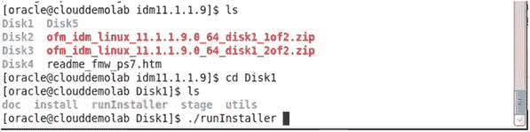
*图 4-21. Identity Management 11.1.1.9 安装软件的目录结构*

从 Oracle 下载 Identity Management 11.1.1.9 软件后，在名为 `idm11.1.1.9` 的目录中解压文件。这将创建包含所有安装实用程序的 `Disk1` 到 `Disk5` 目录。在 `Disk1` 目录中，运行文件 `runInstaller`。这将打开如图 4-22 所示的屏幕。

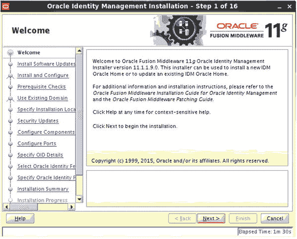
*图 4-22. 列出的安装步骤*

此时，您可以从 Oracle 的支持站点搜索更新。但此操作不是必需的。图 4-23 显示了您可以选择搜索更新的屏幕。

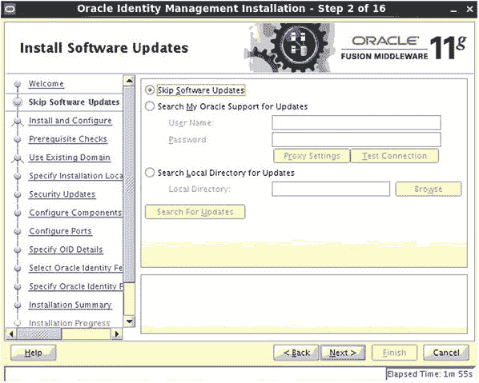
*图 4-23. 安装软件更新屏幕*

本节的计划是安装二进制文件。不要进行安装和配置，因为这将在后续步骤中完成。如图 4-24 所示，在继续之前选择“安装软件 - 不配置”选项。

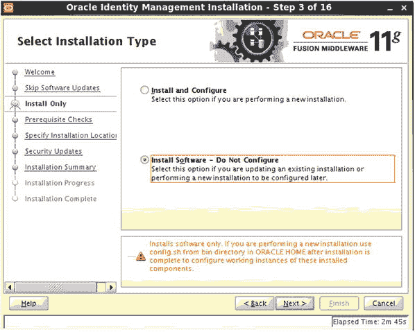
*图 4-24. 选择安装类型屏幕*

系统会检查所需的软件包并确保满足最低要求。如果任何检查导致错误，则必须在继续之前进行修正。警告应予以纠正。虽然警告可能不会导致安装错误，但它们可能导致未来出现问题。图 4-25 显示所有先决条件检查已正确完成。

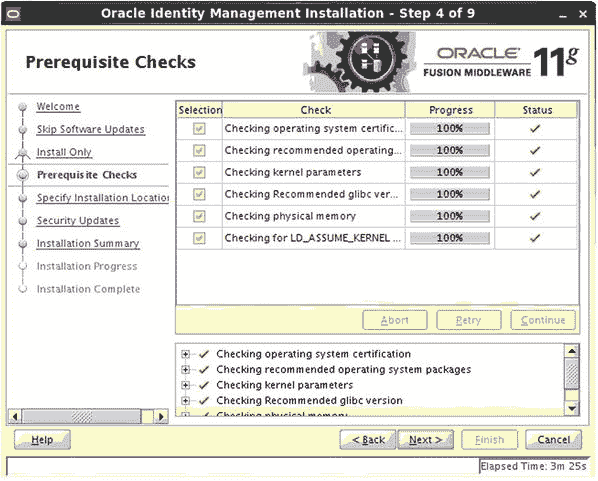
*图 4-25. OID 安装先决条件检查屏幕*

OID 环境将在所选的 Middleware Home 中创建 Oracle Home 结构。在本例中，Oracle Home 将位于 `/home/oracle/OIDMiddleware/` 目录中，并命名为 `Oracle_IDM1`。图 4-26 显示了新的 Oracle Middleware Home。

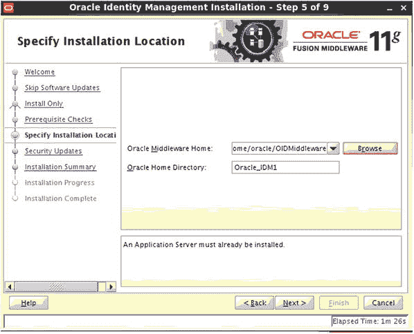
*图 4-26. 选择 Middleware Home 和 Oracle Home 位置*

“指定安全更新”屏幕允许您输入电子邮件地址，以便在系统需要未来更新时接收通知。您可以选择不填写此信息而继续，但请务必定期检查 Oracle 支持以获取环境所需的更新。有关此步骤的详细信息，请参见图 4-27。

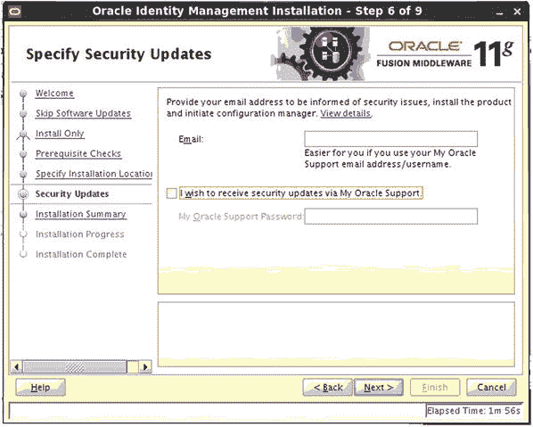
*图 4-27. 安全更新选择加入选项*

在安装 Oracle Identity Management 期间，需要输入的步骤并不多。图 4-28 显示了摘要屏幕。

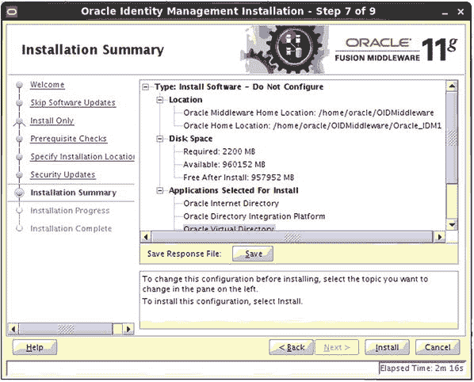
*图 4-28. 安装摘要屏幕*

在安装摘要屏幕上单击“安装”后，Universal Installer 开始复制文件并创建文件系统。您在初始步骤中做出的选择为此阶段的 Universal Installer 提供了指导。图 4-29 显示了安装进度屏幕，其中包含一个连续的进度条。

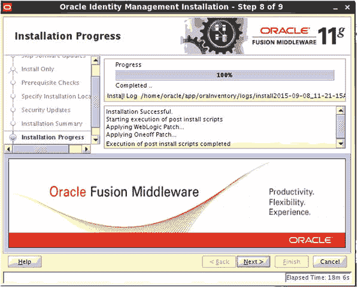
*图 4-29. 安装进度屏幕*

安装完成后，有两个脚本需要以主机 `ROOT` 用户身份运行。以 root 用户身份登录终端窗口并运行指定的脚本。图 4-30 所示的屏幕指出了必要的脚本。以 `Root` 身份登录服务器来运行这些脚本。

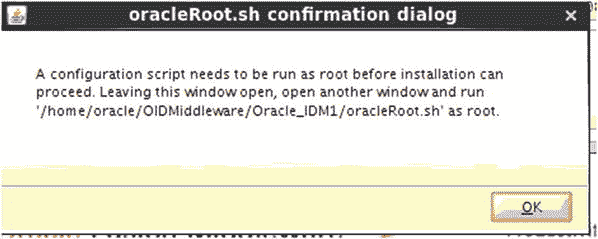
*图 4-30. Root 脚本*

```
[root@clouddemolab ∼]# cd /home/oracle/OIDMiddleware/
[root@clouddemolab OIDMiddleware]# cd Oracle_IDM1/
[root@clouddemolab Oracle_IDM1]# ./oracleRoot.sh
[root@clouddemolab Oracle_IDM1]#
```

在为 OID 配置域之前，您应决定此环境是否要进行集群。如果您的环境计划考虑冗余，请在任何其他要包含的主机上重复前面的步骤来安装 WLS 和 OID 软件。还应运行 RCU 以在另一个数据库中为其他服务器创建 Oracle Directory Services 模式。

## Oracle Internet Directory 配置

在本节中，您将在 WLS 环境中配置 OID 域。在继续之前，您应了解要使用的配置场景：

*   在新的 WebLogic 域中配置带有 Oracle Directory Integration Platform (DIP) 和 Oracle Directory Service Manager (ODSM) 的 OID。
*   将使用 Fusion Middleware Control 和 WebLogic 管理控制台来管理 OID 环境。
*   将使用 Directory Integration Platform (DIP) 将 OID 与第三方 LDAP 源同步。
*   将使用 ODSM 管理 LDAP 目录实例。
*   Oracle Fusion Middleware 环境中不存在其他 WebLogic 域。

#### 配置类型

还有许多其他场景，涉及在新的或现有的域中安装 OID 和 OVD。本次讨论的目的是假设这些都是新的域。

在开始此步骤之前，WLS 和 Oracle Identity Management 软件应该已经安装但尚未配置。如果在安装 WebLogic 后运行过快速启动向导并创建了域，您可以使用 OID 扩展该域，这与本文介绍的步骤非常相似。

##### 开始配置

要开始域配置，请运行位于 `$ORACLE_HOME/bin` 目录下的 `config.sh` 文件。在此情况下，`ORACLE_HOME` 是 Oracle Identity Management 软件的安装位置，即 `/home/oracle/OIDMiddleware/Oracle_IDM1`。这一点很重要，因为 Middleware 环境的其他目录中还存在其他 `config.sh` 文件。图 4-31 显示了要使用的配置文件位置。

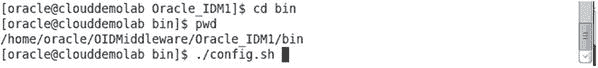
图 4-31. 为 Oracle Internet Directory 配置新的 WebLogic 域

##### 欢迎屏幕

和之前一样，启动配置文件后您将看到的第一个屏幕是欢迎屏幕，如图 4-32 所示。此处无需任何操作。只需点击“下一步”即可开始配置 OID。

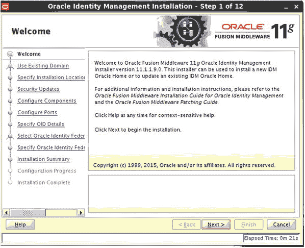
图 4-32. 域配置步骤

##### 选择域类型

如图 4-33 所示的屏幕允许您选择是创建新域、扩展现有域还是扩展集群。由于这是全新安装，请选择“创建新域”。如果在此过程的前期运行过快速启动向导，请选择“扩展现有域”。

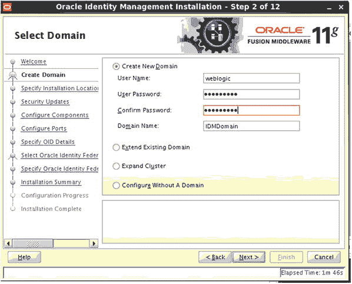
图 4-33. 创建新域

##### 输入管理员信息

输入管理用户的名称（通常为 `weblogic`）、所需的密码以及您希望为域使用的名称。

##### 配置新域详情

由于您正在创建新的 OID 域，系统将提示您输入新域的详细信息。图 4-34 显示了您可以输入域位置、OID 实例名称和实例位置的屏幕。需要注意的是，您可以在以后创建新的 OID 实例。

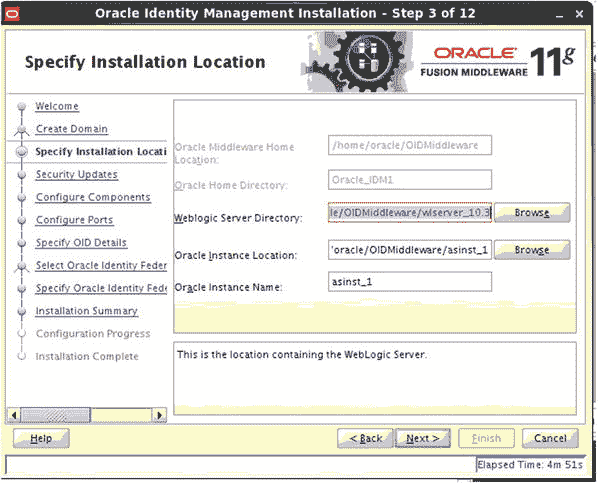
图 4-34. 配置实例位置和 WebLogic Home 目录

##### 选择组件

在如图 4-35 所示的“配置组件”屏幕上，选择您希望部署的 Identity Management 组件。

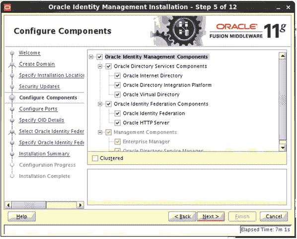
图 4-35. 新域的组件选择

在此情况下，OID、OVD 和 DIP 都将安装在 Identity Management 域中。进行选择时，工具将自动选择支持安装所需的任何必备组件。建议您不要更改任何预选组件。

##### 配置端口

在指示配置工具新 OID 域的安装位置后，您将可以选择配置 OID 将使用的端口，如图 4-36 所示。

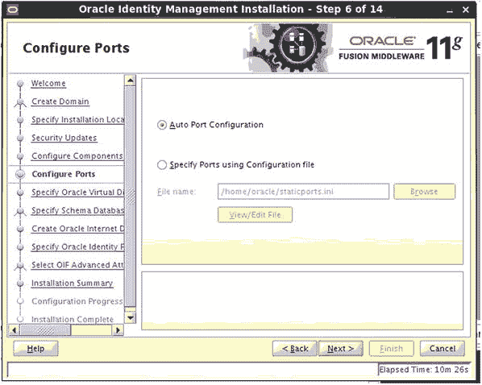
图 4-36. 端口配置

在新安装中可以使用默认端口。如果任何端口已被占用，请创建一个 `staticports.ini` 文件，并在此屏幕上指定其位置。

注意
安装介质中提供了一个示例 `staticports.ini` 文件。它位于 `Disk1/stage/Response`。您可以复制此文件并根据需要编辑，以指定安装期间要使用的端口。

##### 配置 OVD（如果选择）

如果您选择在 OID 之外还使用 OVD，如图 4-37 所示的 OVD 信息屏幕会提示您输入所需信息。

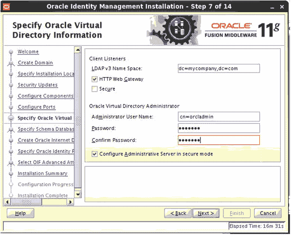
图 4-37.

##### 配置 Oracle 虚拟目录领域和管理员密码

账户 `cn=orcladmin` 是用于 OID 的标准管理账户。请为其设置密码，并妥善保管。没有此账户，您将无法执行某些管理功能。

注意

有一个可以用来重置 `orcladmin` 密码的脚本。要运行此脚本，您必须知道 Oracle 目录服务模式连接信息。该实用程序名为 `oidpasswd`，位于 `$ORACLE_INSTANCE/bin` 目录中。

在开始安装过程之前，已使用 RCU 创建了必要的模式对象。在此步骤中，请使用以下格式指定数据库的位置：`host:port:servicename`。Oracle 目录服务模式名称将已预填充；请输入在 RCU 过程中指定的密码。如果在上一步中未运行 RCU，请在此处选择“创建模式”。图 4-38 显示了“指定模式数据库”屏幕。


图 4-38.

选择数据库信息

与配置 OVD 信息的步骤非常相似，请输入相同的数据。此信息将用于 OID 配置。请注意，OID 和 OVD 是两个不同的产品。图 4-39 显示了新 OID 设置的开始。


图 4-39.

指定 Oracle Internet Directory 领域信息

域配置将提示输入 Oracle 身份联合信息。这将用于生成签名和加密密钥库，如图 4-40 所示。


图 4-40.

Oracle 身份联合配置

在此阶段可以保留默认值。这些值决定了身份管理如何存储会话信息以及如何检索其数据。如果需要，这些值可以在安装后更改。默认值参见图 4-41。


图 4-41.

配置身份联合属性

检查提供的数据后，单击“继续”以创建 Oracle 身份管理域。请注意，此过程可能需要较长时间才能完成。示例见图 4-42。


图 4-42.

配置信息摘要

此时，您已输入配置实用程序创建新 OID 和 OVD 域所需的所有指令。图 4-43 显示了“配置进度”屏幕。此过程可能相当耗时。有些步骤可能看起来像是挂起了，而另一些步骤则会相当快。请确保每个步骤在继续之前都正常运行。如果报告任何问题，请检查此屏幕上指示的日志。


图 4-43.

域创建完成

配置完成后，您将看到一个摘要屏幕，其中显示许多重要数据点，包括端口号、管理 URL 和目录位置。所有步骤完成后的配置摘要如图 4-44 所示。


图 4-44.

关于域配置的重要信息

图 4-45 详细显示了“安装完成”屏幕，其中显示了所有配置参数的结果。


图 4-45.

关于新 OID 域的相关信息

记录此信息非常重要。但是，您稍后可以使用管理控制台或 Fusion Middleware Control 工具来查看此信息。这些 URL 和端口可用于管理环境。

### 验证安装

完成 OID 的所有安装和配置任务后，验证环境非常重要。这涉及登录到各个组件并确保它们可运行。此时，还建议您验证启动和停止脚本，并为管理设置托管服务器。

在上一节中，您安装了 WLS 作为 OID、OVD、DIP 和 ODSM 的基础架构。这些组件应该已自动启动。检查操作系统以查看为支持 OID 而启动的进程。

打开控制台并以 oracle 用户身份登录到主机。使用先前创建的域的名称，使用 `ps` 命令检查从域目录运行的进程。有关此过程的示例，请参见图 4-46。


图 4-46.

验证 WLS 和 ODSM 的运行进程

这将提供有关 WLS 和托管服务器进程的信息。如果此操作未返回任何信息，则需要启动环境。这将在后面讨论。

Oracle 进程管理器和通知服务器 (`OPMN`) 控制实际的 OID 实例。`OPMN` 在域配置期间安装。尽管它是 OID 的进程管理器，但它不在 WLS 内运行。它为 OID 环境提供启动和关闭功能以及监控和重启服务。在验证过程中，将使用它通过 `opmnctl` 命令检查进程状态。

在与之前相同的控制台中，将 `ORACLE_INSTANCE` 设置为在域配置步骤中创建 OID 实例的位置。这很可能位于 `MIDDLEWARE_HOME` 目录中；例如，`/home/oracle/OIDMiddleware/asinst_1`。

```
export ORACLE_INSTANCE=/home/oracle/OIDMiddleware/asinst_1
```

`opmnctl` 命令位于 `ORACLE_INSTANCE/bin` 目录中。`opmnctl` 命令可以接受从基本状态检查到完全重启的多种命令。

您可以使用 `opmnctl help` 获取命令列表。

```
[oracle@clouddemolab bin]$ ./opmnctl help
```

