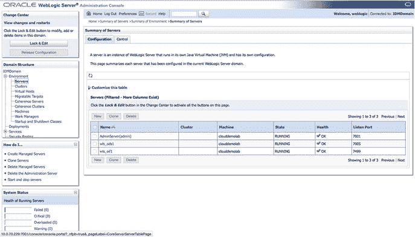
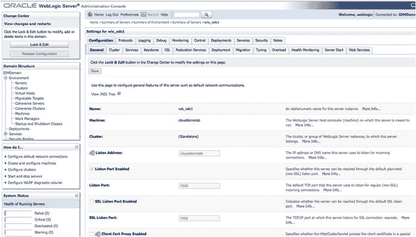
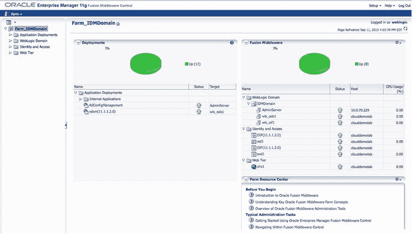
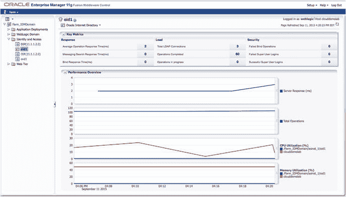
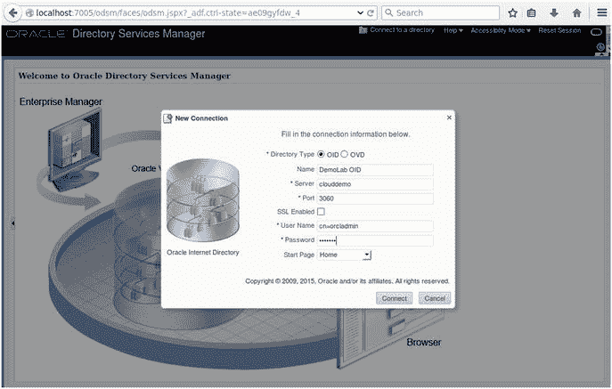

# 4. 安装验证

要检查 OID 进程，请使用基础的 `opmnctl status` 命令：
```
[oracle@clouddemolab bin]$ ./opmnctl status
Processes in Instance: asinst_1
---------------------------------+--------------------+---------+---------
ias-component                    | process-type       |     pid | status
---------------------------------+--------------------+---------+---------
ohs1                             | OHS                |   73204 | Alive
ovd1                             | OVD                |   72408 | Alive
oid1                             | oidldapd           |   72284 | Alive
oid1                             | oidldapd           |   72288 | Alive
oid1                             | oidmon             |   72276 | Alive
EMAGENT                          | EMAGENT            |   72559 | Alive
```

注意
设置 `ORACLE_HOME`、`ORACLE_INSTANCE` 和 `PATH` 环境变量以便更好地与环境交互。

检查进程状态后，您可以继续使用管理控制台、融合中间件控制和 ODSM 来进一步检查环境并熟悉管理工具。

WebLogic 管理控制台提供整体环境状态和控制。可以在“环境”➤“服务器”屏幕上检查托管服务器的状态。图 `4-47` 显示了 OID 域的 WebLogic 组件的服务器状态屏幕。


图 4-47. 服务器管理控制台屏幕

此屏幕提供托管服务器的总体状态，但深入查看每个服务器可以提供一些配置详细信息，包括端口、机器信息、JDK 信息等。有关托管服务器配置的更详细视图，请参见图 `4-48`。


图 4-48. 托管服务器配置详细信息

这里展示的管理控制台屏幕只是可用信息和配置选项的冰山一角。然而，此时您只是在验证托管服务器是否正在运行。

融合中间件控制屏幕（如图 `4-49` 所示）提供了关于整个系统状态和健康状况的更多详细信息。


图 4-49. 融合中间件控制主屏幕

一目了然，主屏幕提供了系统的整体健康状况。甚至融合中间件组件（如 OID、DIP 和 OVD）内每个组件的状态都显示在主页上。很容易验证一切是否正常运行和操作。深入查看左侧菜单中的组件可提供更多信息。后续章节将提供更多关于管理的深入信息。

图 `4-50` 显示了 OID 实例的状态页面。此屏幕是操作统计的快速视图。您可以使用它深入查看详细信息。


图 4-50. 单个身份组件状态屏幕

验证 OID 服务器的总体状态后，您可以访问 ODSM 来检查在域配置期间创建的 LDAP 目录。图 `4-51` 显示了 ODSM 的登录界面。这是一个可用于浏览、编辑和管理用户、组和实例设置的工具。


图 4-51. 使用 ODSM 创建连接

完成这些步骤后，您就拥有了一个完全安装的 OID 并已对其进行了验证。在接下来的章节中，随着后续组件安装的继续，您将看到更多管理屏幕的详细信息。

## 本章总结

本章介绍了 OID 的安装和初始配置。这为成功的身份管理实施奠定了基础。从这一点开始，您可以开始在 Oracle 的通用 LDAP 目录中管理应用程序用户和属性。应用程序（无论是 Oracle 还是第三方应用程序）都可以连接到 OID 以验证用户凭据，作为 LDAP 身份存储。数据库也可以使用该身份存储进行身份验证。尽管 OID 提供基本的 LDAP 身份验证和基于身份的系统数据存储，但该环境仅维护对单个应用程序的单一身份验证。Oracle 访问管理器可以提供更好的用户体验，用户只需登录一次即可访问已纳入环境的应用程序。Oracle 身份管理器将提供用户自助服务和管理服务。这些附加组件依赖于可靠的 LDAP 实现，并将在后续章节中介绍。

