# Controls the maximum number of shared memory segments, in pages
kernel.shmall = 4294967296
kernel.sem = 256 32000 100 142
kernel.shmmax = 10737418240
```

在 `sysctl.conf` 文件中设置这些值后，必须激活并验证是否显示新值，使用此命令：

```
[root@clouddemolab home]# /sbin/sysctl –p
net.ipv4.ip_forward = 0
net.ipv4.conf.default.rp_filter = 1
net.ipv4.conf.default.accept_source_route = 0
kernel.sysrq = 0
kernel.core_uses_pid = 1
net.ipv4.tcp_syncookies = 1
net.bridge.bridge-nf-call-ip6tables = 0
net.bridge.bridge-nf-call-iptables = 0
net.bridge.bridge-nf-call-arptables = 0
kernel.msgmnb = 65536
kernel.msgmax = 65536
kernel.shmmax = 68719476736
kernel.shmall = 4294967296
kernel.sem = 256 32000 100 142
kernel.shmmax = 10737418240
```

打开文件限制必须设置为 4096 以支持实例。为此，请编辑 `limits.conf` 文件。

```
[root@clouddemolab home]# vi /etc/security/limits.conf
```

如果环境要安装在 Oracle Linux 或 RedHat Linux 上，则必须同时在 `/etc/security/limits.d/90-nproc.conf` 中执行编辑。如果遗漏了此步骤，此文件中的值可能会覆盖 `limits.conf` 中的值。

确保在这两个文件中添加或编辑以下行：

```
* soft nofile 4096
* hard nofile 65536
* soft nproc 2047
* hard nproc 16384
```

编辑此文件后，必须重新启动服务器以确保所有更改生效。

### 操作系统软件包

每个 Oracle 应用程序都有自己所需的一套软件包。根据您所使用的 Linux 版本，安装过程可能有所不同。在以下列表中，请注意某些软件包在 64 位操作系统上需要同时安装 32 位和 64 位版本。如果这些软件包未安装，安装将无法正常完成。Oracle 安装程序会检查这些依赖项，并在安装过程中显示错误。

```
binutils-2.20.51.0.2-5.28.el6
compat-libcap1-1.10-1
compat-libstdc++-33-3.2.3-69.el6 for x86_64
compat-libstdc++-33-3.2.3-69.el6 for i686
gcc-4.4.4-13.el6 gcc-c++-4.4.4-13.el6
glibc-2.12-1.7.el6 for x86_64
glibc-2.12-1.7.el6 for i686
glibc-devel-2.12-1.7.el6 for i686
libaio-0.3.107-10.el6
libaio-devel-0.3.107-10.el6
libgcc-4.4.4-13.el6
libstdc++-4.4.4-13.el6 for x86_64
libstdc++-4.4.4-13.el6 for i686
libstdc++-devel-4.4.4-13.el6
libXext for i686
libXtst for i686
libXext for x86_64
libXtst for x86_64
openmotif-2.2.3 for x86_64
openmotif22-2.2.3 for x86_64
redhat-lsb-core-4.0-7.el6 for x86_64
sysstat-9.0.4-11.el6
xorg-x11-utils*
xorg-x11-apps*
xorg-x11-xinit*
xorg-x11-server-Xorg*
xterm
pdksh-5.2.14
```

至此，操作系统应已为后续安装做好充分准备。在安装软件之前执行这些操作将确保安装过程顺利进行。大多数情况下，如果遗漏了任何项目，安装程序会提供详细的错误信息。如果在安装过程中出现错误，请停止安装并解决所有问题后再继续。

### 数据库准备

与 OID 类似，安装 OIM 也需要创建特定的数据库对象。这包括在不同数据库模式中创建的一系列表、视图和包。此过程使用仓库创建实用程序完成。虽然数据库对象可以创建在 OID 数据库内，但通常建议将 Oracle 标识与访问管理存储库创建在单独的实例中。这简化了数据库管理任务和未来维护。为防止安装问题，确保所使用的 RCU 版本与要安装的融合中间件产品版本相匹配至关重要。在域配置过程中发现版本不匹配将导致流程无法继续。解压下载文件并运行 `<RCU_HOME>/rcu/bin` 目录中的 `rcu.sh`。您将首先看到如图 7-1 所示的“创建存储库”屏幕。

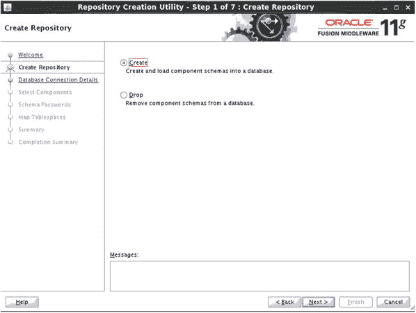
图 7-1.

创建或删除模式。

由于这是首次安装 OIM，请在此屏幕上选择“创建”选项。这将以创建模式启动 RCU。

选择创建模式后，您必须在如图 7-2 所示的屏幕上输入目标系统的数据库连接详细信息。您可以选择在与 OID 相同的数据库中创建身份管理器模式。但是，为了简化数据库管理，身份管理器模式通常安装在不同的数据库中。此实例可以与 OAM 实例相同。

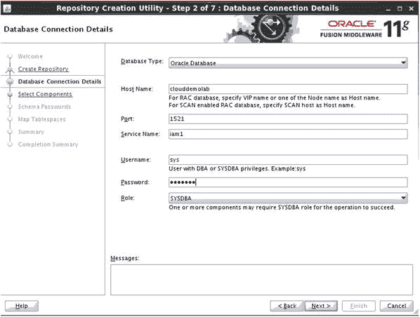
图 7-2.

数据库连接详细信息屏幕。

注意：必须先运行 `$ORACLE_HOME/rdbms/admin/xaview.sql` 以启用 XA 事务视图和同义词，然后才能创建 OIM 模式。

RCU 验证连接详细信息后，将提示您选择要安装在新存储库中的组件。此屏幕如图 7-3 所示。

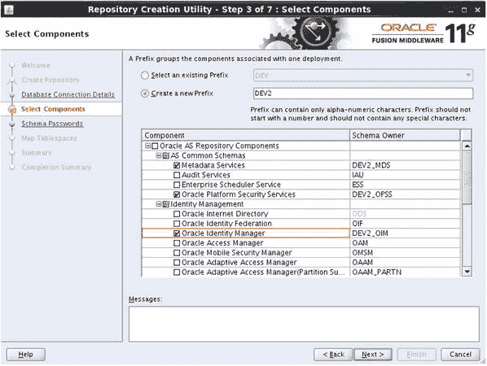
图 7-3.

选择组件屏幕。

在 RCU 的此步骤中，您必须选择要安装的组件。请注意，当您选择 OIM 组件时，其他必需项目将被预选。请不要取消选择这些项目，因为它们将在域配置步骤中进行验证。然后，RCU 将验证数据库是否满足所选组件所需的先决条件，如图 7-4 所示。

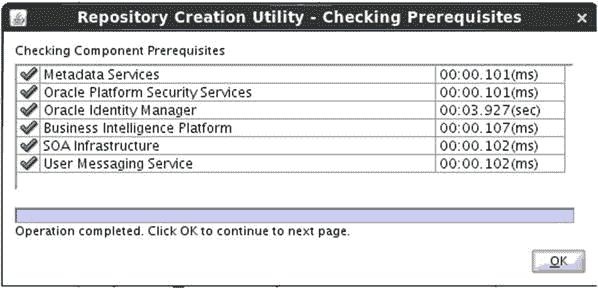
图 7-4.

检查先决条件。

每个融合中间件组件都有数据库要求，例如最大连接数或打开的进程数。RCU 将在创建数据库模式和对象之前检查这些先决条件。

如果数据库满足最低要求，下一步是输入新数据库模式要使用的密码，如图 7-5 所示。

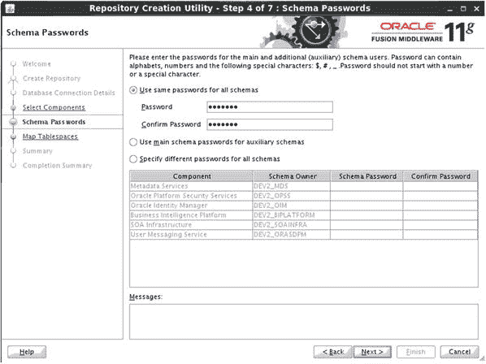
图 7-5.

模式密码屏幕。

在此步骤中，指定您希望使用的密码值。您可以选择为所有模式使用相同的密码，也可以为每个模式使用不同的密码。请根据安全要求和易于管理性做出决定。

图 7-6 显示了表空间复查屏幕，其中显示了将为选定的身份管理组件创建的新数据库表空间。您可以单击“下一步”继续，或选择自定义新表空间。

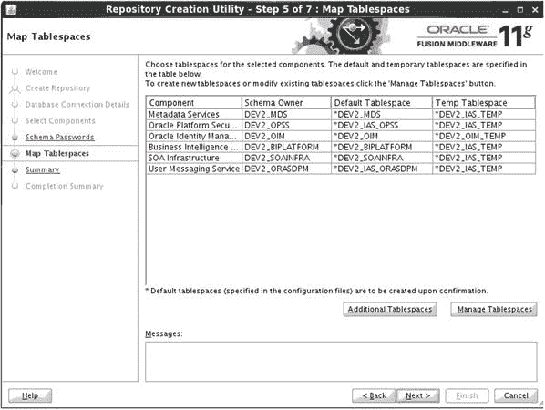
图 7-6.

表空间列表。

在实际创建表空间之前，RCU 将向您显示其将执行操作的概要。图 7-7 显示了“概要”屏幕。您应注意记录这些信息，以便在将来与数据库管理员讨论与数据库相关的运行时问题时作为参考。

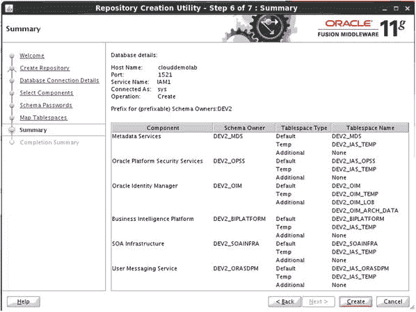
图 7-7.

创建概要屏幕。

所有数据库对象创建完成后，您将看到“完成概要”屏幕，如图 7-8 所示。单击“关闭”以完成该过程。

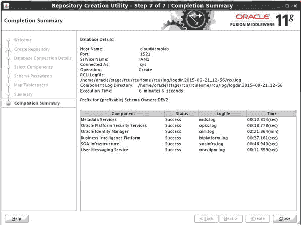
图 7-8.

完成概要屏幕。

至此，OIM 的存储库创建过程完成。身份管理器及其所需组件的必要数据库模式和对象已安装在目标数据库中。现在可以继续安装过程。

### 身份管理器软件安装

在上一节中，您已完成创建 OIM 数据库模式和对象的步骤。以下部分讨论身份管理器软件的安装。此过程创建必要的文件系统结构并部署融合中间件产品所需的二进制文件。

OIM 必须安装在 WLS 主目录中。在第 6 章中，介绍了在单独的 WLS 主目录中安装 OAM 的步骤。您可以选择将身份管理器软件安装在与访问管理器相同的目录中，也可以专门为其创建一个完全独立的主目录。通常将访问管理器和身份管理器部署在网络的不同层级或不同的物理主机上。如果您的环境需要这样做，请遵循第 4 章中的 WLS 安装步骤。


### 面向服务的架构安装

`OIM` 需要 Oracle 面向服务的架构 (`SOA`) 才能正常运行。此安装独立于 `OIM` 过程，但可以安装在相同的 `WebLogic` 主目录中。`SOA` 安装完成后，您可以安装 `OIM` 并同时为两个产品配置域。这是这两个产品的推荐流程。

与许多其他 Fusion Middleware 产品类似，`SOA` 安装工具通过运行 `runInstaller` 命令来启动 Oracle 通用安装程序。该程序位于安装介质的第 1 张光盘上。运行该工具时，您必须指明 Java 运行时环境的位置。具体操作如图 7-9 所示。

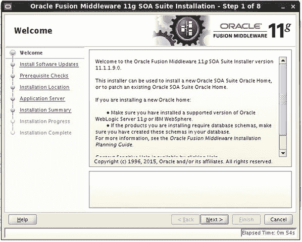

图 7-9. 启动通用安装程序

```
runInstaller -jreLoc /home/oracle/jdk1.6.0_45/jre
```

`OIM` 需要 `SOA 11.1.1.9`。将使用此工具安装此版本。初始屏幕会显示与计划安装相关的信息以及运行 `RCU` 的提醒。与其他版本的通用安装程序非常相似，Oracle 会检查 `OS` 以确保其满足最低要求。图 7-10 显示了一个已完成的先决条件检查。

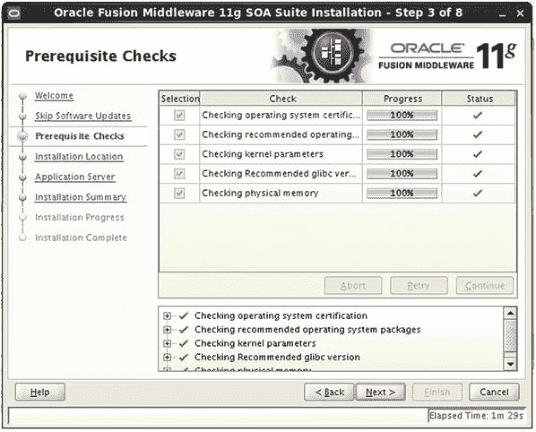

图 7-10. 先决条件检查屏幕

与 `OAM` 一样，`SOA` 也有自己的一套必需的 `OS` 软件包、内核参数、内存和存储要求。在继续安装之前，必须满足这些条件。尽管其中许多要求与访问管理器的安装相同，但请务必查阅本章开头部分以查看它们。

注意：先决条件失败将在通用安装程序屏幕上以红色 `X` 显示。您可以打开一个以 `root` 身份登录的终端窗口来纠正任何问题，然后重试先决条件检查，直到所有问题都得到解决。

在下一步中，您必须为此安装选择中间件主目录位置。由于此环境为访问管理器和身份管理器分别配置了独立的 `WLS`，因此将 `SOA` 安装在正确的中间件主目录中至关重要。在本例中，身份管理器将安装在 `IDMMiddleware` 目录中。更多详情请参见图 7-11。

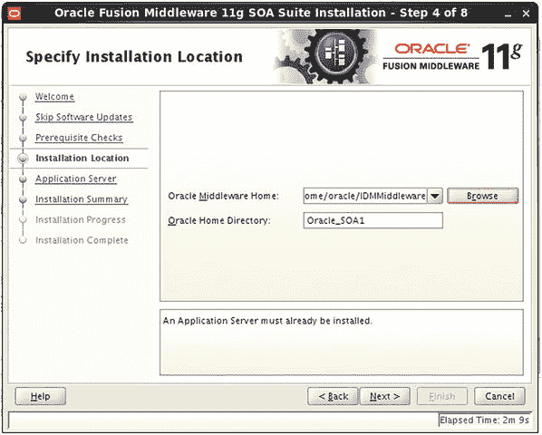

图 7-11. 指定安装位置屏幕

Oracle `SOA` 可以安装在 `WLS` 或 `WebSphere` 服务器上。本书重点介绍 `WLS` 安装类型。选择 `WebLogic Server`，如图 7-12 所示，然后继续下一步。

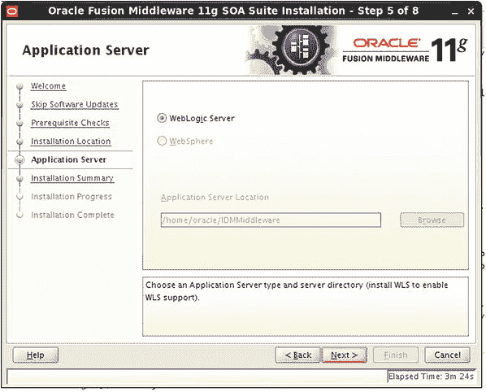

图 7-12. 选择应用程序服务器类型

安装摘要屏幕（如图 7-13 所示）显示了在安装程序屏幕中所做的选择摘要。确认选择后，点击 `安装` 开始安装。

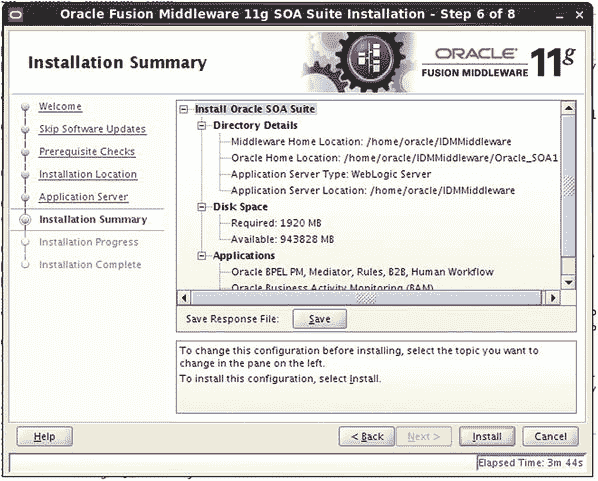

图 7-13. 安装摘要屏幕

实际安装可能需要大约 10 分钟。进度屏幕（如图 7-14 所示）将让您了解当前状态。如果进度似乎停滞了一会儿，请不要惊慌。

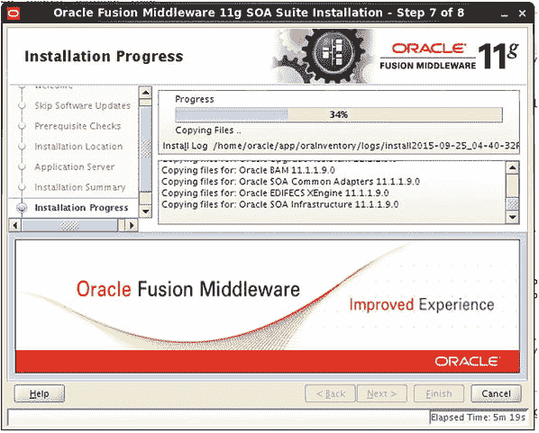

图 7-14. 安装进度屏幕

在安装程序完成复制必要文件并创建文件系统后，将显示图 7-15 所示的安装完成屏幕。此屏幕包含与您的新环境直接相关的详细信息。记录这些内容以备将来参考可能会很有用。此时，您可以点击 `完成` 并退出安装程序。

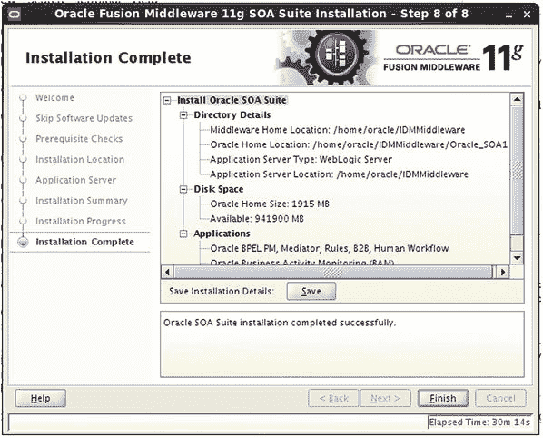

图 7-15. 安装完成屏幕

至此，所需的 Oracle `SOA` 套件实例已安装完毕。在配置 `OIM` 域时，配置向导将设置 `SOA` 的必要组件。如您所记得的，此 `SOA` 实例与身份管理器安装在同一个中间件主目录中。下一节将介绍 `IOM` 安装。

### 身份管理器安装

`WLS` 和 `SOA` 软件已安装完毕。现在是安装身份管理器软件的时候了。同样，此过程通过运行安装介质第 1 张光盘上的 `runInstaller` 脚本启动。与 `SOA` 安装一样，您必须指明 Java 运行时环境的位置，安装程序才能正常运行。图 7-16 显示了通用安装程序。

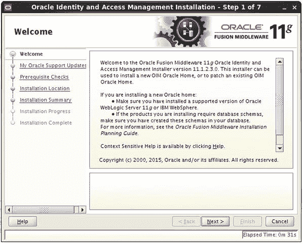

图 7-16. 安装欢迎屏幕

```
./runInstaller.sh -jreLoc /home/oracle/jdk1.6.0_45/jre
```

第一个屏幕显示了有关要安装软件的重要信息。确保显示的版本符合您的要求以及先前运行的 `RCU` 的版本。

与 `OAM` 一样，`OIM` 也有自己的一套必需的 `OS` 软件包、内核参数、内存和存储要求。在继续安装之前，必须满足这些条件。如图 7-17 所示，安装程序将在允许流程继续之前检查这些条件。尽管其中许多要求与 `OAM` 安装相同，但请务必查阅本章开头部分以查看它们。

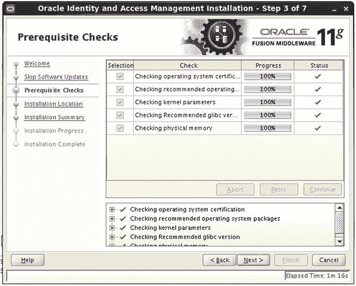

图 7-17. 先决条件检查屏幕

在“指定安装位置”屏幕上，您必须选择一个中间件主目录来存放安装文件。图 7-18 提供了此入口点的详细信息。此位置必须是一个已安装 `WLS` 的目录。由于此物理主机托管了两个 `WLS` 实例，请确保选择当前未用于 `OAM` 的位置。所选主目录应与您在上一步为 `SOA` 选择的相同。

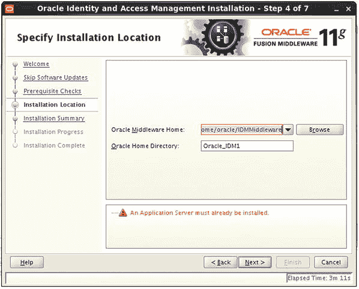

图 7-18. 指定安装位置屏幕

此时，通用安装程序将开始将文件复制到新位置。图 7-19 所示的进度屏幕将显示当前操作和进度。

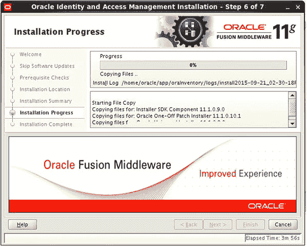

图 7-19. 安装进度屏幕

软件文件的实际安装通常在大约 10 分钟内完成。在此期间，您可以在进度屏幕上看到实际操作，该屏幕还显示了安装日志文件的位置。您可以监视此日志以查找任何错误。完成后，您可以关闭安装程序，因为所有安装操作都已完成。在接下来的几节中，您将配置 `OIM` 域。


## 配置身份管理器域

必要的软件组件安装完成后，您可以继续配置 WebLogic 域以支持 OIM。此过程通过运行位于 `IDM_HOME/common/bin` 目录中的 `config` 脚本启动。需要注意的是，此时您只是在配置 WebLogic 域，OIM 还未准备好运行。

### 基本约定

为避免本章后续内容产生混淆，将使用以下约定。`MIDDLEWARE_HOME` 是安装 WLS 的基目录。`IDM_HOME` 是 WLS 安装目录中安装 OIM 的目录，通常是一个名为 `Oracle_IDM1` 的目录。图 7-20 显示了配置向导。

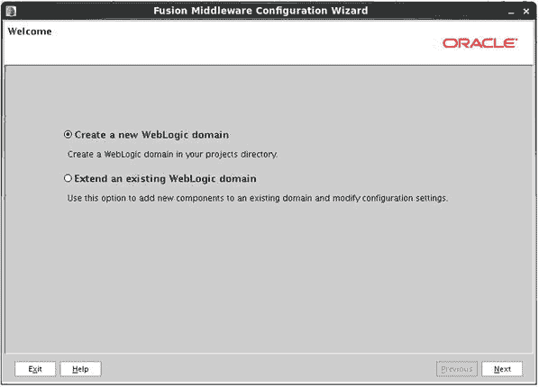

图 7-20.

### 创建新的 WebLogic 域

创建一个新的 WebLogic 域。
注意。
在 Middleware Home 子目录中可以找到多个 `config.sh` 脚本实例。运行位于 `<MIDDLEWARE_HOME/Oracle_IDM1/common/bin` 中的正确版本至关重要。

由于这是首次在 WLS 环境中创建域，请选择“创建新的 WebLogic 域”。

### 选择域组件

在此过程的下一步，选择 OIM 组件。如图 7-21 所示，此列表基于 WebLogic Home 目录中找到的软件。您会注意到 Oracle SOA Suite 已被自动选中。如果在 WLS Home 中找不到 SOA Suite，系统将显示错误提示。在继续之前，请确保已安装任何缺失的软件。

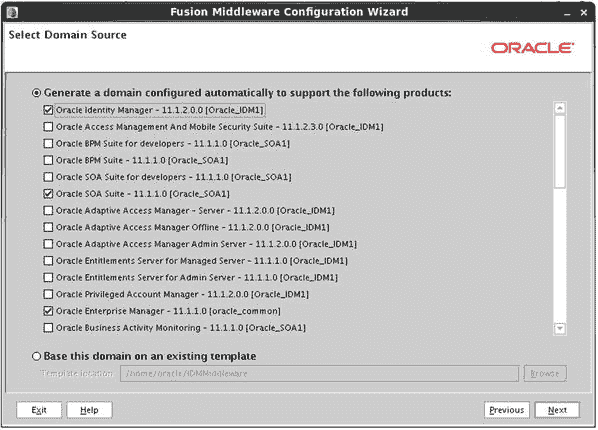

图 7-21.

选择域组件。

### 输入域名和位置

在配置过程中，系统会提示您输入要创建的域的名称。您可以保留默认名称 “base_domain”，也可以将其命名为在您的环境中更有意义的名称。示例请参见图 7-22。在某些情况下，可能需要将相关文件定位在 Middleware Home 目录之外。这通常在需要跨物理主机共享存储的集群环境中进行。

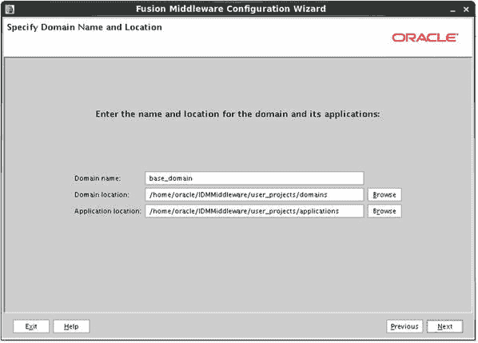

图 7-22.

输入域名和位置。

### 管理员密码

`weblogic` 的用户密码应设置为您环境中的标准密码。此密码将用于启动和停止受管服务器，以及登录 WebLogic 管理控制台和 Fusion Middleware Control。图 7-23 显示了密码配置屏幕的样子。

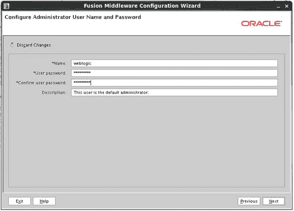

图 7-23.

管理员密码。

### 服务器启动模式

启动模式决定了受管服务器的启动方式。在开发模式下，受管服务器可以从命令行启动和停止而无需密码。此外，可以在 WebLogic 控制台中进行配置更改并激活，而无需锁定环境。将启动模式配置为生产模式会锁定环境，以确保在未锁定控制台进行编辑的情况下无法进行任何更改。命令行工具也需要密码。这些选项如图 7-24 所示。

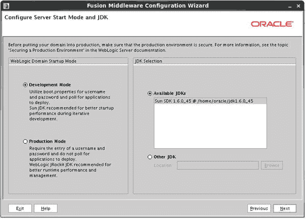

图 7-24.

服务器启动模式。
注意。
锁定管理控制台可防止多个管理员进行更改并相互覆盖。

### 数据库模式检查

输入 Java 数据库连接 (JDBC) 详细信息后，配置工具将验证这些信息。将显示任何错误。如果某个模式无法验证，请返回上一步以确保模式名称和详细信息正确。如果数据库模式不存在，请重新运行 RCU 来创建它。图 7-25 显示了已完成的数据库检查。

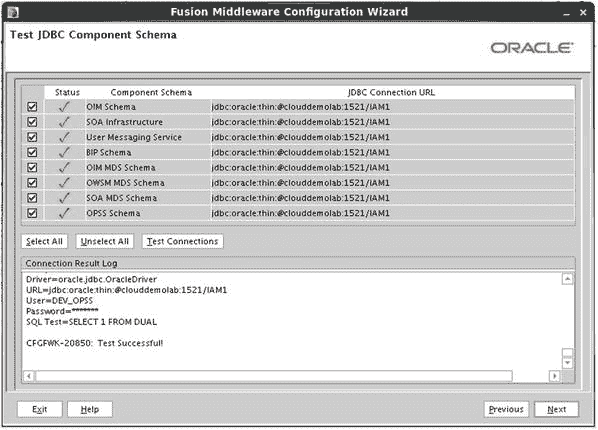

图 7-25.

数据库模式检查。

### 选择可选配置

如 AOM 安装章节所述，本书使用的示例采用了分离域。因此，每个组件（OID、OAM 和 OIM）都将拥有自己的管理服务器。如图 7-26 所示，选择“管理服务器”、“受管服务器”、“集群”和“计算机”。

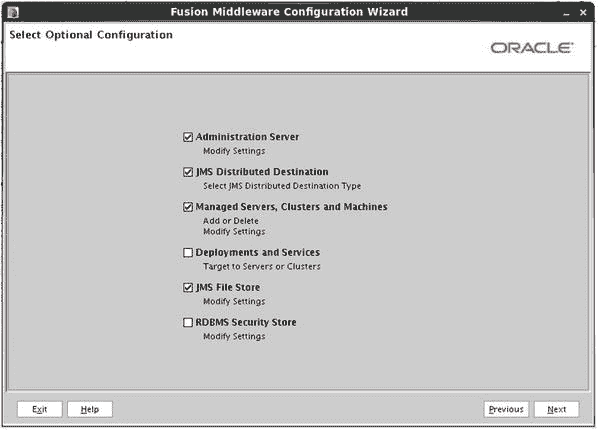

图 7-26.

选择可选配置屏幕。

### 配置管理服务器

管理服务器的默认端口是 7001，上一章中访问管理器管理侦听端口使用的就是这个端口。使用标准端口约定有助于消除混淆或遗忘端口。在本练习中，使用端口 7101，如图 7-27 所示。随后，如果安装更多 WLS 实例，请使用端口 7201、7301 等。

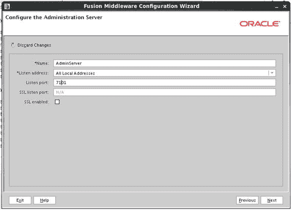

图 7-27.

配置管理服务器屏幕。

### 配置受管服务器

在此环境中，访问管理器和身份管理器安装在不同的 Oracle Middleware Homes 中。这意味着每个都由 WLS、管理服务器和受管服务器组成。如前所述，这样做是为了便于未来的维护，例如打补丁和升级。如果需要，它还允许在以后将这些层分离到不同的物理主机上。由于它们将在同一物理主机上但位于不同的 WLS 中运行，因此每个管理服务器都需要自己的侦听端口。

受管服务器将预填充安装使用的标准端口。如果需要，您可以更改端口或填充安全套接字层 (SSL) 侦听端口。在许多情况下，允许 HTTP 服务器或负载均衡器执行 SSL 端点职责就足够了，从而通过将加密职责卸载到外部设备来获得一些性能提升。为了便于故障排除和未来维护，请将端口保留为默认值，如图 7-28 所示。

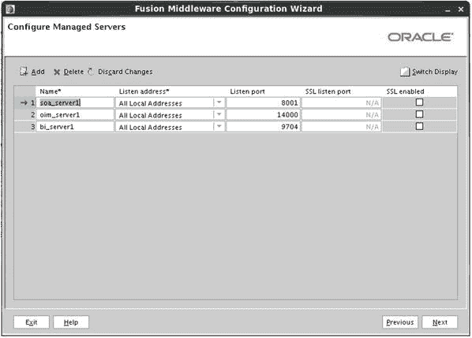

图 7-28.

配置受管服务器屏幕。

### 配置集群

在本书的整个过程中，集群不是关注点。但是，为了便于以后创建集群，集群配置信息在此处输入，如图 7-29 所示。因此，WebLogic 域将预先配置好集群。实际上，此步骤创建了一个单节点集群，以后可以扩展以包含多台计算机和实例。

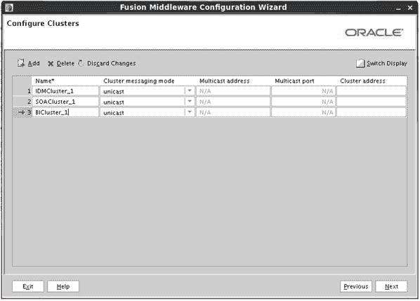

图 7-29.

配置集群屏幕。

### 将服务器分配给集群

将受管服务器分配给所需的集群，如图 7-30 所示。请注意，可以创建单个集群并将所有受管服务器分配给它。但是，为了简化管理任务，每个受管服务器将在 WebLogic 中分配到其自己的集群。

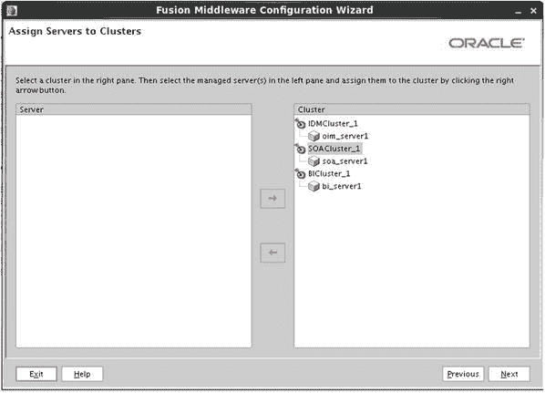

图 7-30.

将服务器分配给集群屏幕。

此时应该注意，如果集群中只有一个节点，您可能会在受管服务器日志中看到与等待集群其他成员通信相关的错误。这些错误可以忽略，并且在向集群添加其他成员后会消失。


如前一章所述，机器为 WebLogic 管理服务器提供必要的信息，以便其与服务器进程通信以获取状态和生命周期事件。对于任何基于 UNIX 的操作系统，使用 Unix 机器类型至关重要。这确保了当管理服务器执行其操作时，所有必要的环境设置都能得到正确配置。集群可以包含一台或多台机器，而一台机器可以包含一个或多个受管服务器。图 7-31 显示了一个新的 Unix 机器。


图 7-31. 配置机器屏幕

将受管服务器分配到上一步创建的机器。在图 7-32 中，您将看到所有新的受管服务器都被分配到了上一步创建的单一 `Unix_Machine` 上。您可以选择创建多台机器，并将不同的组件分配到不同的机器上。如果您有多个集群成员，每台机器可以驻留在不同的集群中。


图 7-32. 将服务器分配给机器屏幕

将受管服务器分配给机器后，系统将显示您所输入的所有信息的摘要。这个配置摘要屏幕（如图 7-33 所示）提供了对即将启动的配置的最后检查机会。请审阅此摘要，以确保文件位置、名称和配置参数看起来都正确。点击 `创建` 以开始新的 WebLogic 域的创建。

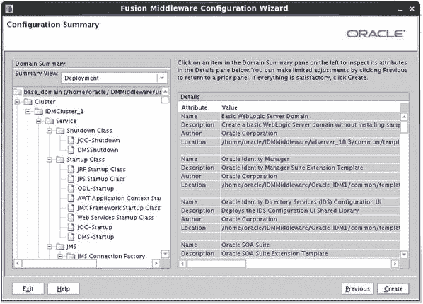
图 7-33. 配置摘要屏幕

在域创建过程中，会创建许多文件并启动各种进程。此过程的进度可以在配置向导的“创建域”屏幕上看到，如图 7-34 所示。届时会显示一个配置日志。请让其不间断运行直至完成。如果出现任何错误，请检查指定的日志文件。


图 7-34. 配置进度

域配置完成后，点击 `完成` 退出工具。如果您一直遵循此过程操作至此，您将已安装 OID、OAM 和 OIM。每个组件都驻留在其自己的 WebLogic 域中，并由其自己的 WebLogic 服务器控制。这有助于简化管理流程，并便于未来的升级和补丁应用。还应注意，在某些情况下，您的网络基础设施可能要求将组件分隔在不同的网络区域中。请访问本书的相关架构章节以获取更多信息。

## 总结
本章涵盖了在新的 WebLogic 域中安装 OIM 所需的步骤。如果从头开始操作，您已了解为元数据存储库创建必要数据库对象的步骤。本章还涵盖了 OIM 及其所需的 Oracle SOA 安装的实际软件安装和新 WebLogic 域的创建。后续章节将涵盖 OIM 组件的配置以及它们之间的集成。

# 8. Oracle HTTP Server 和 WebGate 的安装与配置
至此，Oracle 身份与访问管理套件中所有必需的组件都已就位，这些组件将用于提供与 Oracle 产品和应用程序的单点登录（SSO）。包含身份管理器（Identity Manager）使得能够管理 Oracle Internet Directory（OID）轻量级目录访问协议（LDAP）用户存储中的用户。Oracle HTTP Server（OHS）和 Oracle Access Manager（OAM）WebGate 代表了 Oracle 应用程序和产品前端的 Web 服务器。从核心上讲，`OHS`是一个带有 Oracle WebLogic 模块的 Apache Web 服务器。结合 `OAM` `WebGate` 软件，`OHS`成为了一个中心位置，负责处理传入请求、检查身份验证，并在 `OAM` 完成其操作后，允许经过身份验证的用户访问所需资源。本章涵盖 Oracle HTTP Server 和 OAM Webgate 的安装与部署。

## 预安装任务
### 操作系统用户
对于大多数 Oracle 应用程序的安装，应创建操作系统（OS）用户和组来执行安装和配置任务。创建 OS 组将允许其他 OS 用户执行与应用程序环境管理相关的特定任务。在 Linux 环境中安装 Oracle 应用程序时，最常见的 OS 用户和组是 `oracle` 用户以及 `oinstall` 或 `dba` 组。

要创建必要的 `oinstall` 和 `dba` 组，以 root 用户身份执行以下命令：

```
[root@clouddemolab home]# groupadd oinstall
[root@clouddemolab home]# groupadd osdba
```

创建组后，创建 `oracle` 用户：

```
[root@clouddemolab home]# useradd  -g oinstall -G osdba oracle
```

**注意**
`-g` 表示用户应加入的主要组。`-G` 表示任何次要组。

要设置用户密码，请以 root 用户身份使用以下命令。

```
[root@clouddemolab home]# passwd oracle
```

### 操作系统配置
在安装 Oracle 融合中间件基础架构和 Oracle 身份管理软件之前，确保操作系统满足最低要求和配置至关重要。以下列出了所需的内核参数、软件包以及文件更改。

需要设置以下内核参数：

```
kernel.sem  256  32000  100  143
kernel.shmmax 10737418240
```

要设置这些参数，请编辑位于 `/etc` 目录下的 `sysctl.conf` 文件。

```
[root@clouddemolab home]# vi /etc/sysctl.conf
```

在此文件的部分中添加或编辑以下行：

```
