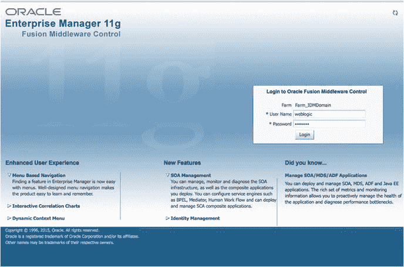
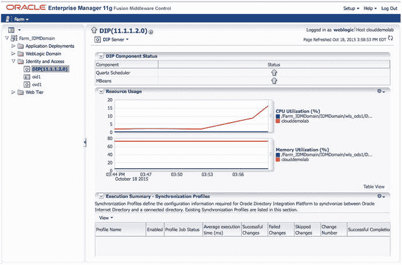
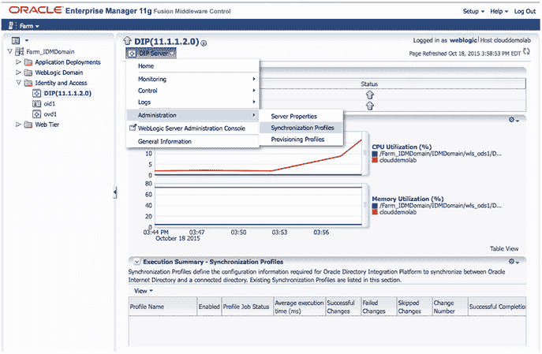
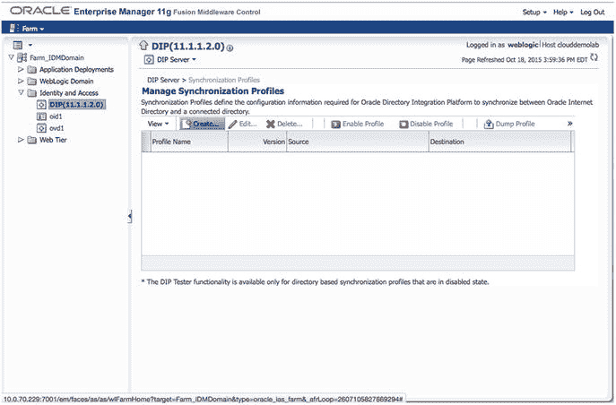
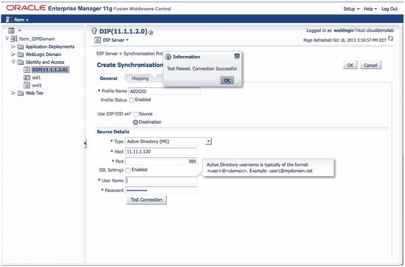

# 5. 目录同步与虚拟化

Oracle Internet Directory (OID)、Oracle Virtual Directory (OVD) 和 Directory Integration Platform (DIP) 为 Oracle 目录服务提供了整合用户管理和与其他应用程序集成的能力。这些概念已在前面的章节中介绍过。本章介绍使用 DIP 从 Active Directory 复制用户到 OID 实例，为与 EBS 和 Oracle 身份与访问管理器的其余集成做准备。

### 目录集成平台

同步 `OID` 与 `Active Directory` 的关键在于 `DIP`。使用 Oracle `DIP` 可以使 IT 部门将来自 `Active Directory`、`OpenLDAP` 及其他 `LDAP` 或数据库存储的轻量目录访问协议 (`LDAP`) 信息复制到一个集中式目录中，该目录可与 Oracle 产品和应用程序结合使用。

数据同步通过在 `DIP` 系统中创建配置文件（profiles）来完成，这些配置文件用于映射和转换外部目录的身份信息，以满足 Oracle 系统的要求。当 `DIP` 执行并查询 `LDAP` 源以向 `OID` 插入或修改数据时，就会使用这些配置文件。在以下章节中，您将看到一个基本的配置文件，用于将 `OID` 与单个 `Active Directory` 实例同步。`DIP` 可以支持多个配置文件和多个源。如果您需要将不同的 `Active Directory` 组织单元 (`OUs`) 同步到 `OID` 内不同的命名空间中，或者需要从不同来源同步用户，这将非常有用。

### 创建同步配置文件

将使用 `Fusion Middleware Control` 界面来创建 `DIP` 配置文件。有关 `Fusion Middleware Control` 界面的更详细信息将在第 8 章介绍。导航至 `http://hostname:port/em` 将打开如图 5-1 所示的 `Fusion Middleware Control` 欢迎屏幕。

图 5-1. `Fusion Middleware Control` 登录屏幕

`OID` `Fusion Middleware Control` 可通过浏览器访问，导航至 `http://<host>:<port>/em`。使用的端口应为域配置期间选择的 `WebLogic Admin Server` 端口。本例中为 `7001`。登录到 `Fusion Middleware Control` 界面后，使用屏幕左侧的菜单结构，定位到“身份和访问”下的 `DIP(11.1.2)` 实例。

选择 `DIP(11.1.2)` 后，您将看到服务器进程的当前状态，如图 5-2 所示。请注意，执行摘要为空，因为尚无配置文件可执行。此屏幕是快速参考。创建配置文件后，每个配置文件的摘要将显示在此部分。

图 5-2. 目录集成平台主屏幕

在 `DIP` 主屏幕上，使用 `DIP Server` 下拉菜单导航至“管理” ➤ “同步配置文件”。同步配置文件与置备配置文件不同。后者将在本书后面介绍 `EBS` 集成时讨论。图 5-3 描绘了状态屏幕和菜单选项。

图 5-3. 选择同步配置文件

在如图 5-4 所示的“管理同步配置文件”页面上，列出了所有现有的配置文件。您可以根据需要从此处创建、删除和编辑配置文件。已启用的配置文件是那些当前正由 `DIP` 调度程序执行的配置文件。它们各自按为其配置的间隔运行。

图 5-4. 管理同步配置文件屏幕

`OID` 与 `DIP` 安装时附带多个预配置配置文件，以支持诸如 `Active Directory`、`IBM Tivoli`、`Sun Directory Server` 和 `Novell eDirectory` 等目录源，以及数据库和 `LDIF` 源。这些是包含常见属性映射的基本模板。组织的具体需求将决定这些配置文件需要多少定制。然而，它们是一个很好的起点，可以避免从头开始创建。请注意，除了已包含的模板外，其他目录源将需要完全自定义的配置文件。

由于这是系统中的第一个配置文件，请在窗口中选择“创建”。系统将提示您输入有关配置文件类型和源服务器配置的信息。请确保在开始此过程前准备好源服务器信息。您需要主机、端口以及目录中至少具有读取权限的帐户。

创建同步配置文件的第一步是提供名称和有关源身份存储的连接详细信息。创建屏幕如图 5-5 所示。

图 5-5. 连接详细信息

