# 配置同步配置文件

为正在创建的配置文件提供一个名称。如果计划为一个目录只使用一个通用配置文件，可以使用诸如 `AD2OID` 这样的通用名称。但是，如果预计同一个源会有多个配置文件，可能需要提供更具体的名称，例如 `AD_Region2OID`。此示例可用于组织要求不同 Active Directory OU 中的用户被放置在不同的 OID 命名空间或进行不同处理的情况。良好的命名约定可以帮助管理员轻松管理配置文件。

为配置文件提供名称后，输入先前收集的源目录连接详细信息。由于此示例是 Active Directory 服务器，因此类型选择 Active Directory (MS)。确保为配置文件选择正确的服务器类型，以便 DIP 能相应地创建配置文件模板。必须输入源目录的主机和端口，并提供一个具有至少对要同步的用户和组的读取权限的账户的用户名/密码对。此账户无权访问的任何信息都将不会被同步，这可能导致 OID 中数据缺失。

对于从 Active Directory 到 OID 的单向同步，只需要读取权限。配置此类同步时，Active Directory 中的更改会被写入 OID。但是，不会有任何内容写回 Active Directory。这将 Active Directory 维护为环境中所有用户的真实来源。OID 充当应用程序身份存储。请注意，DIP 配置文件不会将密码从 Active Directory 同步到 OID。密码处理由外部身份验证插件或 Active Directory 密码过滤器执行。这些选项将在本章后面讨论。

正确同步两个不同的身份存储要求将源对象属性正确映射到目标。例如，Active Directory 可能使用 `SAMAccountName` 这样的属性进行用户登录，而 OID 实例可能使用 `UID`。这必须在 DIP 配置文件中加以考虑。图 5-6 显示了映射屏幕。


**图 5-6. 同步配置文件映射**

输入源目录连接详细信息并通过连接测试后，就需要配置映射详细信息。配置文件映射页面提供了源容器/目标规则、排除规则和属性映射规则的输入项。这些部分中的每一个都是可配置的，以满足组织的需求。

在域映射规则部分，可以配置一个或多个源容器，以及它们在 OID 中的映射位置。如果源目录结构由多个域或容器组成，且这些容器要映射到不同的 OID 容器，这将非常有用。这里需要注意的是，在单个配置文件中设置的排除和映射规则将应用于本域映射规则部分中定义的所有容器。如果每个容器需要不同的排除或映射规则，应考虑创建多个配置文件来处理每个容器。

在许多情况下，组织在源目录中只有一个域，需要映射到 OID 中的单个域。在这种情况下，图 5-6 显示源容器是基础判别名 (DN)，目标容器是 OID 域主用户容器。出于此示例的目的，此映射已足够。

需要注意的是，DIP 主要同步新账户和对现有账户的修改。然而，每个目录源处理对象删除的方式不同，需要特别注意以确保从源中删除的对象也从目标目录中删除。这可能包括一些步骤，例如授予同步账户域管理员权限，以便它能正确查看已删除账户的墓碑记录，或授予对存储已删除或已停用账户的域单元的权限。请参考源目录文档或管理员以确定需要什么。

属性映射规则允许指定如何将条目从源转换到目标。Oracle 后端目录必须是源或目标。转换条目时，有三种类型的映射规则：域规则、属性规则和协调规则。这些映射规则允许指定 DN 映射、属性级映射和协调规则。如图 5-7 所示。


**图 5-7. 属性映射规则设置**

创建属性映射规则时，源 `ObjectClass` 和 `Attribute` 被直接映射或经过转换以填充目标属性。在创建映射规则时，牢记一些注意事项很重要。OID 中所有必填字段都应基于源目录中的必填字段。如果构建转换，请确保映射中使用的元素在源中已填充。如果未填充，输入到 OID 的数据可能格式错误。如果源包含二进制值，则必须将属性类型指定为二进制。

图 5-8 显示了一个在从 Active Directory 同步 OID 时使用的属性映射规则示例。虽然可以手动创建这些规则，但当使用开箱即用的模板时，规则是预先创建好的，只有在环境使用额外属性或有特殊需求时才需要修改。


**图 5-8. DIP 映射规则**

图 5-9 展示了一个编辑映射规则的示例。一个常用的映射规则是将源 `userPrincipalName` 和 `sAMAccountname` 转换为可用于填充 OID 中 `orclSAMAccountname` 字段的格式，使用以下规则：

```
toupper(truncl(userPrincipalName,'@'))+"$"+sAMAccountname
```


**图 5-9. 编辑映射规则**

需要注意的是，您的环境可能有不同的需求。

过滤规则可用于减少同步对象的数量。您可以使用这些规则排除 Active Directory OU 或不符合特定条件的对象。过滤器选项卡如图 5-10 所示。


**图 5-10. 过滤规则**

复杂的过滤器应该用双引号括起来。在某些版本的 OID 中，测试未用引号括起来的复杂过滤器将导致此屏幕锁定，并最终导致 OID 实例崩溃。复杂过滤器是指任何具有多个单一条件并使用 AND 和 OR 等运算符的过滤器。

图 5-11 显示了新 DIP 配置文件的高级设置。此高级选项卡允许设置运行同步配置文件的调度间隔以及更新平台的其他属性。可以更新上次更改编号字段以重新运行最近的更改。但是，在更新该值之前应仔细考虑。


**图 5-11. 高级选项**


在创建配置文件后，它将被列在“管理同步配置文件”屏幕上，如图 5-12 所示。在这里，你可以根据需要启用、禁用、编辑、删除和测试你的配置文件。作为管理员，你可以根据需求创建任意多的配置文件。编辑配置文件将带你回到之前展示过的页面。


图 5-12. 已创建的同步配置文件

建议你在启用配置文件之前先对其进行测试。只有禁用的配置文件才能使用 DIP 测试器进行测试。还应注意，只有从 LDAP 源到 LDAP 目标的配置文件才能用此方法测试。要测试配置文件，请先确保它是禁用的，然后单击 DIP 测试器按钮。在第一个测试屏幕上，你可以转储配置文件并查看创建步骤中建立的映射。单击启动测试器按钮。

DIP 测试器提供两种测试选项：基本和高级。基本选项将使用预配置的设置运行测试。它会在 Fusion Middleware Control 中运行并记录消息。如果你正在排查同步错误或寻找失败的同步，这会很有用。高级模式允许你配置测试设置，例如要搜索的更改号，以同步源目录中的特定更改。

注意
虽然可以使用 `manageSyncProfiles` 实用程序创建和管理同步配置文件，但建议你使用 Fusion Middleware Control。

创建同步配置文件并准备启用它之后，使用 `syncProfileBootstrap` 实用程序立即将源目录中的数据填充到目标目录。

要使用 `syncProfileBootstrap`，首先确保 `WLS_HOME` 和 `ORACLE_HOME` 环境变量设置为正确的值。`WLS_HOME` 应设置为 `<Middleware Directory>/wls10.3.6`。`ORACLE_HOME` 应设置为安装 OID 的目录，通常是 `<Middleware Directory>/Oracle_OID`。你还应该准备好 WebLogic 管理服务器的主机名和端口以及 WLS 密码。

提示
允许 DIP 进程执行初始填充可能需要大量时间。建议使用 `syncProfileBootstrap` 实用程序。

`syncProfileBootstrap` 实用程序位于 `$ORACLE_HOME/bin` 目录中。可以按如下方式运行：

```
syncProfileBootstrap -h HOST -p PORT -D wlsuser {-file FILENAME |-profile -PROFILE_NAME} [-ssl -keystorePath PATH_TO_KEYSTORE -keystoreType TYPE] [-loadParallelism INTEGER] [-loadRetry INTEGER][-help]
[oracle@clouddemolab OIDMiddleware]$ export ORACLE_HOME=/home/oracle/OIDMiddleware/Oracle_IDM1
[oracle@clouddemolab bin]$ export WL_HOME=/home/oracle/OIDMiddleware/wlserver_10.3/
./syncProfileBootstrap -h localhost -p 7005 -D weblogic -pf AD2OID -lp 5
[oracle@clouddemolab bin]$ ./syncProfileBootstrap -h localhost –p 7005 –D weblogic –pf AD2OID –lp 5
[Weblogic user password]
Connection parameters intialized.
Connecting at localhost:7005, with userid "weblogic"..
Connected successfully
The bootstrap operation completed, the operation results are:
entries read in bootstrap operation: 433
entries filtered in bootstrap operation: 0
entries ignored in bootstrap operation: 0
Entries processed in bootstap operation: 346
Entries failed in bootstrap operation: 87
```

注意
如果你要加载数据的源目录包含大量条目，最快最简单的方法是使用 LDIF 文件引导目标目录。在这种情况下，不建议使用集成配置文件进行引导，因为在读写源目录和目标目录时可能会发生连接错误。如果 DN 包含特殊字符，在使用集成配置文件引导时可能无法正确转义，此时也建议使用 LDIF 文件。

目录引导完成后，你可以启用配置文件，并允许 OID 与来自源 Active Directory 的值进行同步。返回到 Fusion Middleware Control 屏幕，如图 5-13 所示启用同步配置文件。


图 5-13. 启用同步配置文件

配置文件启用后，你可以在如图 5-14 所示的 DIP 服务器主屏幕上查看同步配置文件的统计信息和状态。一目了然，你将看到更改数、错误数、跳过对象数、上次完成日期和上次运行状态。要查看更多详细信息，可以查看日志消息。


图 5-14. DIP 状态

在同步过程中，单个对象可能导致进程停止。默认情况下，如果遇到错误，DIP 将不会继续。你可以检查 DIP 日志以查看导致同步停止的对象。此日志屏幕如图 5-15 所示。


图 5-15. 同步配置文件日志消息

很多时候，错误是由缺少必填属性引起的。识别问题后，可能只需在源 Active Directory 账户中修复问题即可。

在其他时候，问题可能看起来更复杂。例如，可能创建了一个新的 Active Directory OU 并填充了用户。DIP 同步可能会尝试在新 OU 之前创建用户，这将导致错误。

你可以将 DIP 配置为跳过错误并继续，以防止整个进程失败。在刚刚展示的后一个例子中，这可以允许 OU 被创建，而下一次同步将拾取遗漏的对象。如图 5-16 所示的“高级”选项卡可用于为特定配置文件调整 DIP 选项。


图 5-16. 设置“跳过错误以同步下一次更改”参数

另一个故障排除选项是编辑配置文件排除规则。此选项允许你配置同步，如果对象不符合特定条件则跳过它们。如果你的环境中包含许多不希望同步的 LDAP 对象，你可能会发现此功能很有用。使用如图 5-17 所示的“映射”选项卡添加或编辑排除规则。


图 5-17. 编辑域排除规则和过滤

如果 DIP 服务器已关闭，或者你需要运行同步以捕获因错误而错过的信息，则可能需要使用较早的更改号运行该进程。选中“编辑并持久化”复选框并更新“上次更改号”字段。这样做将允许 DIP 进程运行自输入的新“上次更改号”以来的所有更改。你需要查询源目录以获取你希望返回到的更改号。同样，可以使用“高级”选项卡来完成此操作。图 5-18 显示了修改此字段所需的“编辑并持久化”复选框。


图 5-18. 编辑同步配置文件

在本章结束时，你应该拥有一个完全同步的 OID。根据配置的属性映射规则，此目录中存储的数据应与你的 Active Directory 源匹配。通过本章，你应该能够编辑用户属性映射并排除配置文件故障。


## 摘要

许多组织需要保持身份目录彼此同步。也许 OID 被用作应用程序认证目录，而 Active Directory 被网络用于认证。用户必须同时存在于这两个地方才能访问网络资源和他们所需的应用程序。DIP 提供了一种机制，将存储在一个源中的数据复制到另一个源。虽然可以手动完成，但 DIP 是由 Oracle 提供的自动化流程。使用本章中的信息将帮助您创建必要的组件，以保持不同的身份存储同步。

## Oracle Access Manager 安装

Oracle Internet Directory (OID) 已安装，并填充了来自 Active Directory 的用户。您已配置同步过程以确保 Active Directory 中的账户信息更改会传播到 OID。这样做的好处是，所有使用 OID 进行认证和角色信息的应用程序都能持续获得最新的用户信息。Fusion Middleware 应用程序和其他轻量级目录访问协议 (LDAP) 兼容应用程序可以配置为使用 OID 进行认证。然而，许多组织希望在此基础上构建，提供单点登录 (SSO) 环境。Oracle 引入了 Oracle Access Manager (OAM)，正是为了赋予组织这种能力。本章介绍如何安装 OAM 工具，为在 EBS 和 WebCenter 环境中实现 SSO 做准备。

在之前的章节中，OID 已被安装和配置。如果您的环境中尚未存在 OID，或者尚未验证，请参阅第 4 章的说明。

## 预安装任务

#### 操作系统用户

对于大多数 Oracle 应用程序安装，应创建操作系统 (OS) 用户和组来执行安装和配置任务。创建 OS 组将允许其他 OS 用户执行与应用程序环境管理相关的某些任务。在 Linux 环境中安装 Oracle 应用程序时，最常见的 OS 用户和组是 `oracle` 用户以及 `oinstall` 或 `dba` 组。

要创建必要的 `oinstall` 和 `dba` 组，以 root 用户身份执行以下命令：

```
[root@clouddemolab home]# groupadd oinstall
[root@clouddemolab home]# groupadd osdba
```

创建组后，创建 `oracle` 用户。

```
[root@clouddemolab home]# useradd  -g oinstall -G osdba oracle
```

注意

`-g` 指示用户应添加到的主组。`-G` 指示任何附加组。

要设置用户的密码，请以 root 用户身份使用以下命令：

```
[root@clouddemolab home]# passwd oracle
```

#### 操作系统配置

在安装 Oracle Fusion Middleware 基础架构和 Oracle Identity Management 软件之前，确保操作系统满足最低要求和配置非常重要。以下列出了需要设置的内核参数、所需的包以及所需的文件更改。

需要设置以下内核参数：

```
kernel.sem  256  32000  100  143
kernel.shmmax 10737418240
```

要设置这些参数，请编辑 `/etc` 目录中的 `sysctl.conf` 文件。

```
[root@clouddemolab home]# vi /etc/sysctl.conf
```

在文件的此部分添加或编辑以下行：

```
# Controls the maximum number of shared memory segments, in pages
kernel.shmall = 4294967296
kernel.sem = 256 32000 100 142
kernel.shmmax = 10737418240
```

在 `sysctl.conf` 文件中设置这些值后，必须激活并验证新值是否显示，使用此命令：

```
[root@clouddemolab home]# /sbin/sysctl –p
net.ipv4.ip_forward = 0
net.ipv4.conf.default.rp_filter = 1
net.ipv4.conf.default.accept_source_route = 0
kernel.sysrq = 0
kernel.core_uses_pid = 1
net.ipv4.tcp_syncookies = 1
net.bridge.bridge-nf-call-ip6tables = 0
net.bridge.bridge-nf-call-iptables = 0
net.bridge.bridge-nf-call-arptables = 0
kernel.msgmnb = 65536
kernel.msgmax = 65536
kernel.shmmax = 68719476736
kernel.shmall = 4294967296
kernel.sem = 256 32000 100 142
kernel.shmmax = 10737418240
```

打开文件限制必须设置为 4096 以支持实例。为此，编辑 `limits.conf` 文件：

```
[root@clouddemolab home]# vi /etc/security/limits.conf
```

如果环境要安装在 Oracle Linux 或 RedHat Linux 上，还必须同时在 `/etc/security/limits.d/90-nproc.conf` 中执行编辑。如果错过这一步，此文件中的值可能会覆盖 `limits.conf` 文件中的值。

在以上列出的两个文件中，确保添加或编辑了以下行：

```
* soft nofile 4096
* hard nofile 65536
* soft nproc 2047
* hard nproc 16384
```

编辑此文件后，必须重新启动服务器以确保所有更改生效。

#### 操作系统软件包

每个 Oracle 应用程序都有自己的一组必需软件包。根据您使用的 Linux 版本，安装过程可能有所不同。在以下列表中，您应注意某些软件包需要在 64 位操作系统上同时安装 32 位和 64 位版本。如果未安装这些软件包，安装将无法正确完成。Oracle 安装程序将检查这些并在安装过程中显示错误。

```
binutils-2.20.51.0.2-5.28.el6
compat-libcap1-1.10-1
compat-libstdc++-33-3.2.3-69.el6 for x86_64
compat-libstdc++-33-3.2.3-69.el6 for i686
gcc-4.4.4-13.el6 gcc-c++-4.4.4-13.el6
glibc-2.12-1.7.el6 for x86_64
glibc-2.12-1.7.el6 for i686
glibc-devel-2.12-1.7.el6 for i686
libaio-0.3.107-10.el6
libaio-devel-0.3.107-10.el6
libgcc-4.4.4-13.el6
libstdc++-4.4.4-13.el6 for x86_64
libstdc++-4.4.4-13.el6 for i686
libstdc++-devel-4.4.4-13.el6
libXext for i686
libXtst for i686
libXext for x86_64
libXtst for x86_64
openmotif-2.2.3 for x86_64
openmotif22-2.2.3 for x86_64
redhat-lsb-core-4.0-7.el6 for x86_64
sysstat-9.0.4-11.el6
xorg-x11-utils*
xorg-x11-apps*
xorg-x11-xinit*
xorg-x11-server-Xorg*
xterm
pdksh-5.2.14
```

在此过程的这一点上，操作系统应已完全准备好，可以继续进行安装。在安装软件之前执行上述操作将确保安装过程无忧。在许多情况下，如果遗漏了任何内容，安装程序将提供详细的消息。如果在安装过程中出现错误，请停止安装并在继续之前修复任何问题。


#### 数据库准备

与 OID 类似，OAM 的安装也需要创建特定的数据库对象。这包括在多个数据库模式中创建一系列表、视图和包。此操作使用存储库创建实用程序完成。尽管数据库对象可以在同一个数据库中创建，但通常建议将 Oracle 身份和访问管理存储库创建在单独的实例中。这简化了数据库管理任务和未来的维护工作。RCU 创建存储库屏幕如图 6-1 所示。请注意下载并运行与你安装的 Oracle 身份和访问管理版本指定的 RCU。解压下载文件并运行位于 `<RCU_HOME>/rcu/bin` 目录中的 `rcu.sh`。

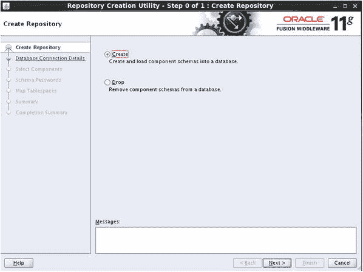

图 6-1. 创建新模式

创建数据库存储库对象的过程与为 OID 执行的过程相同。启动 RCU 并选择“创建”。

输入 Oracle 数据库详细信息。图 6-1 中屏幕上的详细信息指向与 Oracle 目录服务相同的数据库服务器。但是，数据库实例是专门为 Oracle 身份和访问管理器创建的，以保持两个系统分离。图 6-2 显示了输入的数据库详细信息。

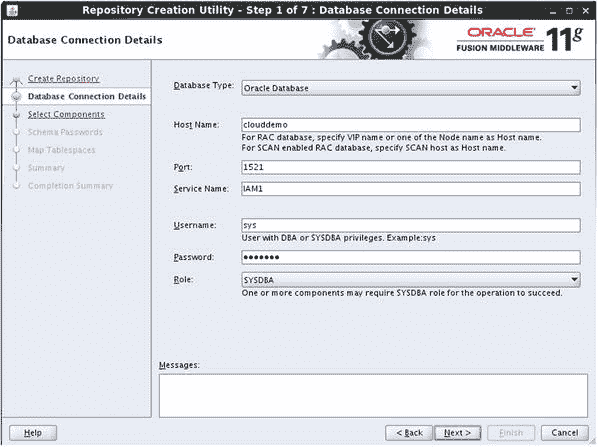

图 6-2. 输入数据库连接详细信息

如图 6-3 所示，RCU 将检查以确保数据库满足最低先决条件。如果存在任何失败项，必须在继续流程之前予以纠正。

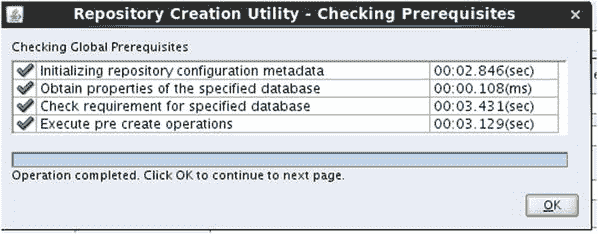

图 6-3. 数据库预检完成

在 RCU 的“选择组件”屏幕上，选择 `Oracle Access Manager`，如图 6-4 所示。如果需要，将选择其他组件。这包括审计服务、元数据服务和 Oracle 平台安全服务等项目。确保在选择过程中添加的项目不要取消选择。图 6-4 显示了“选择组件”屏幕。

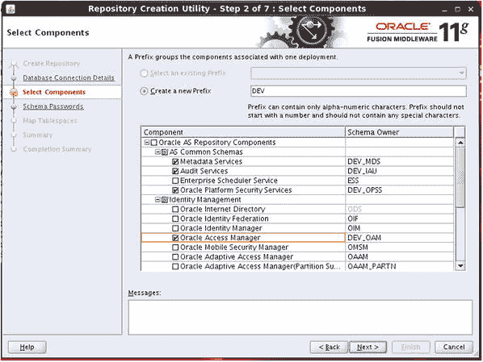

图 6-4. 组件选择

RCU 检查目标数据库，以确保其满足所选组件的必要要求。RCU 日志将显示遇到的任何错误，这些错误必须在继续之前解决。如图 6-5 所示，RCU 检查所选组件的先决条件。

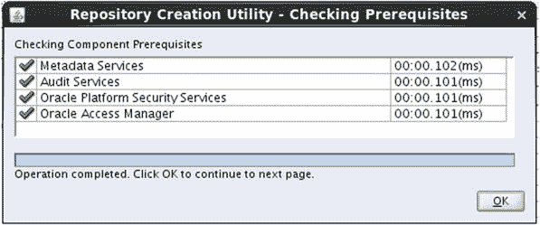

图 6-5. 数据库先决条件检查

RCU 验证先决条件后，系统将提示你输入新数据库模式使用的密码，如图 6-6 所示。

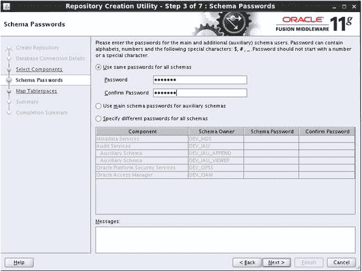

图 6-6. 模式密码

你可以设置所有模式使用相同的密码，或为每个组件设置不同的密码。尽管你的组织可能要求不同的密码，但使用相同的密码通常就足够了。

“映射表空间”屏幕显示了为每个组件创建的基本表空间。每个组件会创建额外的对象，可以通过单击屏幕右下角的“管理表空间”来显示它们。图 6-7 显示了为 OAM 元数据存储库创建的表空间列表。

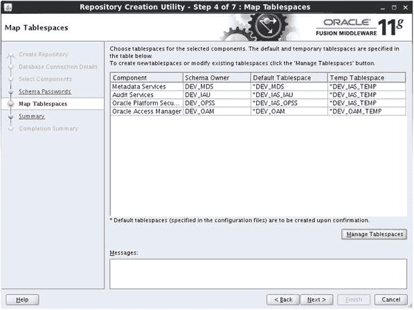

图 6-7. 表空间列表

图 6-8 显示了可选屏幕，允许你在下一步中自定义要创建的表空间的属性。

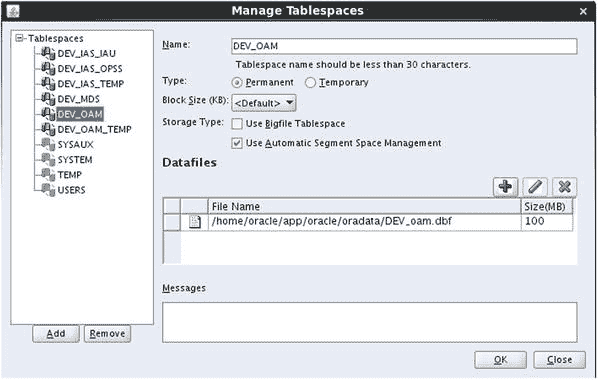

图 6-8. 管理表空间屏幕

除非与数据库管理员密切合作，否则应避免修改 RCU 期间提供的默认值。但是，你的 DBA 可能会有建议或要求来提高性能。

图 6-9 展示了“摘要”屏幕。此屏幕让你有机会查看根据你在先前屏幕上的输入将创建的所有对象。如果发现任何不合适的地方，这是在创建数据库对象之前进行最后调整的机会。

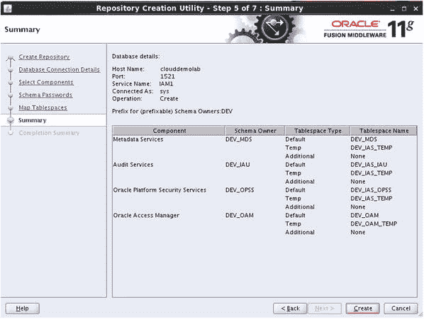

图 6-9. 创建摘要屏幕

当 RCU 创建元数据存储库所需的对象时，会显示进度屏幕，如图 6-10 所示。请让此过程完成而不要中断。如果由于任何原因此过程停止，你应该重新启动 RCU 以丢弃此次运行的所有组件，并从头重新开始创建。

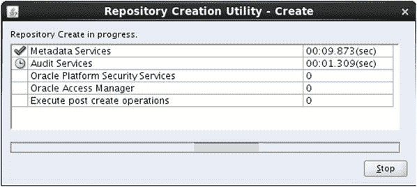

图 6-10. RCU 完成

RCU 已完成，并且所有数据库模式对象均已创建以支持 OAM。数据库准备好后，即可安装 OAM 软件并配置域。


### 访问管理器软件安装

Oracle 软件使用通用安装程序进行安装。该工具作为向导，引导您确保正确的软件二进制文件被安装在正确的位置。`runInstaller` 工具要求在运行时指定 Java 运行时环境。这可以通过使用 `–jreLoc` 参数来完成。

在 Linux 中，运行方式如下：

```bash
[oracle@clouddemolab Disk1]$ ./runInstaller -jreLoc /home/oracle/jdk1.6.0.45/jre
```

### 图 6-11：欢迎屏幕

Oracle 通用安装程序的欢迎屏幕如下图所示。文本中应能看到 Oracle 身份和访问管理软件的版本信息，本例中为 `11.1.2.3`。如果此版本与您要安装的版本不匹配，请寻找正确的安装程序软件。上一节运行的 RCU 仅与 `11.1.2.3` 兼容。

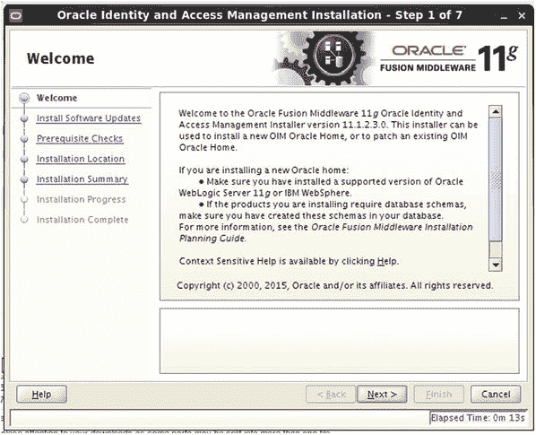

### 图 6-12：先决条件检查

与其他 Oracle 产品一样，安装程序首先会验证目标主机是否满足最低要求，以及所有必要的操作系统包是否已安装。详情请参阅本章开头的先决条件列表。下图显示先决条件检查已成功完成。

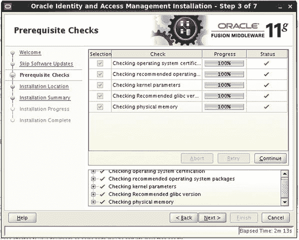

如果在先决条件检查期间发现任何问题，则必须予以解决。这包括操作系统包和参数。

安装程序确认先决条件后，系统会要求您指定新的 Oracle 中间件主目录。中间件主目录位置是必需的。您应仅在现有的中间件主目录中安装此软件。此位置即为此过程开始时安装 WebLogic 的位置。

### 图 6-13：Oracle 中间件主目录选择

OAM 软件必须安装到现有的融合中间件主目录中。安装 WLS 会创建融合中间件主目录。安装 WLS 的说明可以在第 4 章找到。按照这些说明，在名为 `IAMMiddleware` 的目录中创建一个主目录。这确保了 OAM 环境与 OID 中间件目录结构分离。

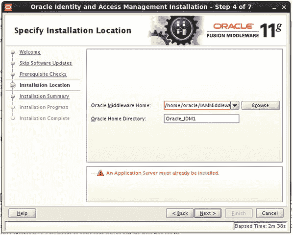

### 图 6-14：组件摘要

Oracle 身份和访问管理器安装程序仅用于安装 Oracle 访问管理器和 Oracle 身份管理器。因此，它不会提示您选择要安装的组件。系统会向您提供计划安装的摘要。

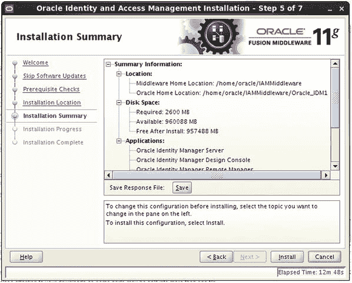

在完成之前，通用安装程序将显示将安装到中间件主目录中的组件摘要。点击 **安装** 以部署二进制文件。

### 图 6-15：安装进度

当进程完成时，进度条将显示为 100%。请耐心等待，因为有时进度条可能看起来没有移动。如果出现任何问题，请检查屏幕上显示位置的安装日志。

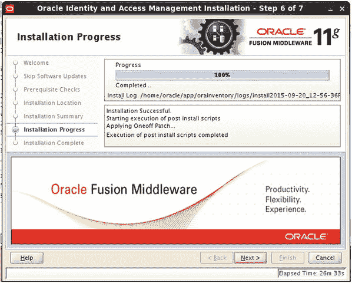

### 图 6-16：安装完成

完成后，安装程序将提供已安装组件的摘要和文件位置。请记录完成数据中显示的信息。

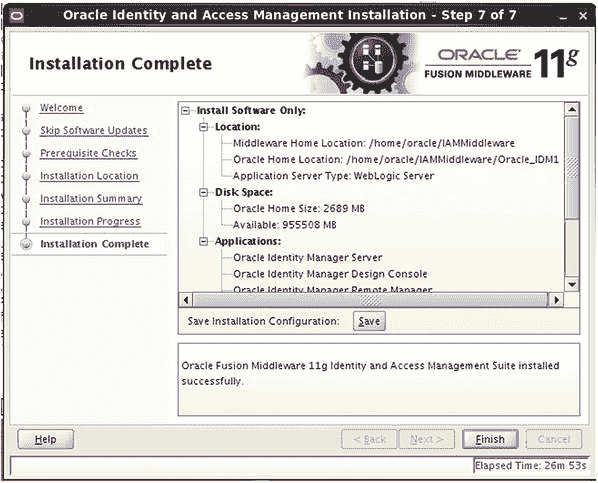

至此，Oracle 身份和访问管理软件的安装已完成。如前所述，环境可以在分离或组合域中实施。在分离域中，OAM 安装在单独的中间件主目录甚至单独的物理服务器中。组合域将两个组件放在同一个中间件主目录中。本书将使用分离域。本章的其余部分将重点介绍创建 OAM 域。


### 创建访问管理器域

安装 OAM 后，可以配置一个新的域。这通过运行位于 `IDM_HOME/common/bin` 目录下的 `config.sh` 脚本来完成。需要注意的是，`config.sh` 可能存在于多个位置。要配置 OAM 域，必须使用指定的配置脚本。

此操作从 `<MIDDLEWARE_HOM>/Oracle_IDM1/common/bin` 目录运行。

```bash
[oracle@clouddemolab bin]$ pwd
/home/oracle/IAMMiddleware/Oracle_IDM1/common/bin
[oracle@clouddemolab bin]$ ./config.sh
```

从 `ORACLE_HOME/common/bin` 目录运行配置实用程序将启动访问管理器域配置向导。首先您会看到如图 6-17 所示的欢迎界面。

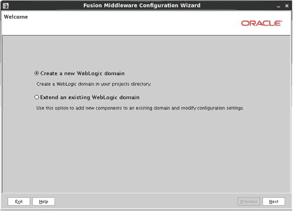

图 6-17. 创建新域的欢迎界面

Fusion Middleware 软件部署在 WLS 环境中的一个域内。首先，选择 `Create a New WebLogic Domain` 选项。

选择配置类型后，您将看到一个可以在新域内配置的身份管理组件列表。此选择界面如图 6-18 所示。域配置过程涉及选择将在创建域时部署到域中的软件组件。此列表基于上一步中安装的软件。在选择过程中，必要的组件会根据需要预先选中。在此步骤中，`Oracle Access Management and Mobile Security Suite 11.1.2.3.0` 被选中，并且 `Oracle Enterprise Manager` 组件也被预先选中。

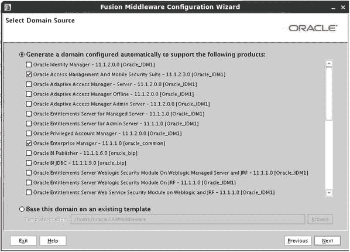

图 6-18. 为域选择组件

在此步骤中，您需要为域提供一个名称并指定文件系统位置。根据文件系统要求和高可用性需求，这些文件可能需要部署在不同的位置。本书的高可用性部分将对此进行讨论。图 6-19 展示了此步骤的一个示例。

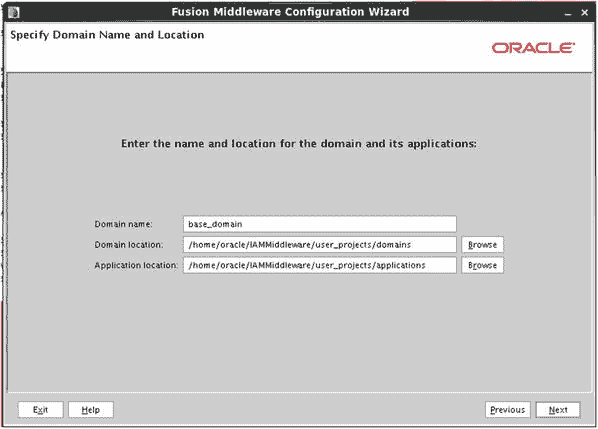

图 6-19. 指定域位置

为 `weblogic` 用户提供一个密码，如图 6-20 所示。虽然在此阶段您可以指定不同的用户名，但通常使用 `weblogic`。稍后您可以创建其他用户来访问管理实用程序。`weblogic` 用户密码应设置为适合您环境的标准密码。此密码将用于启动和停止被管理服务器，以及登录 WebLogic 管理控制台和 Fusion Middleware 控制台。

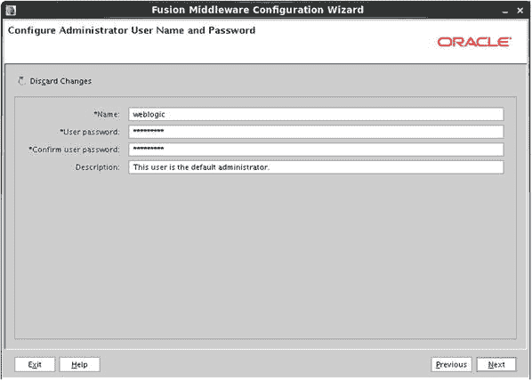

图 6-20. 设置管理用户密码

图 6-21 显示了启动模式选择界面。

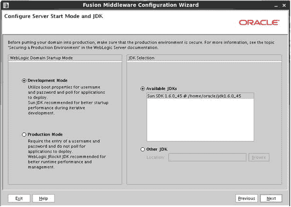

图 6-21. 域启动模式配置

启动模式决定了被管理服务器的启动方式。在开发模式下，被管理服务器可以在无需密码的情况下从命令行启动和停止。此外，可以在 WebLogic 控制台中进行配置更改并激活，而无需锁定环境。将启动模式配置为生产模式会锁定环境，以确保在未锁定控制台进行编辑的情况下无法进行更改。命令行工具也将需要密码。

**注意：** 锁定管理控制台可防止多个管理员进行更改并相互覆盖。

数据库连接界面如图 6-22 所示，需要为将在 WebLogic 域中配置的每个组件输入数据库连接详细信息。显示的数据库模式是预先填充的，应已使用 RCU 创建。

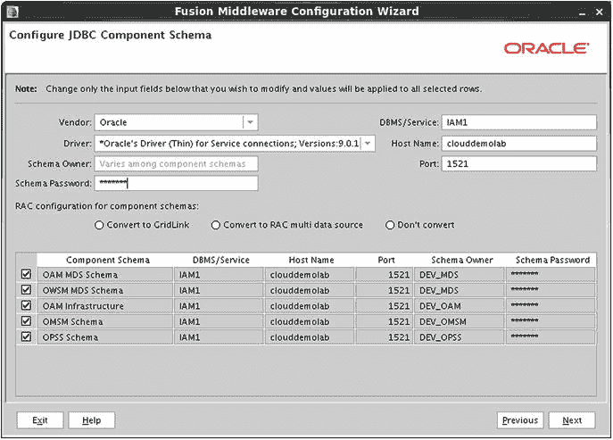

图 6-22. 配置 JDBC 数据库连接

输入数据库详细信息，例如主机、端口和服务名称。必须输入每个模式的密码。此步骤在 WebLogic 域内创建 Java 数据库连接性（JDBC）数据源。

**注意：** 选中此界面上所有模式旁边的复选框将允许复制条目，而无需多次输入数据。

输入 JDBC 连接详细信息后，配置工具会验证信息。任何错误都会显示出来。如果某个模式无法验证，请返回上一步以确保模式名称和详细信息正确。如果数据库模式不存在，请重新运行 RCU 创建它。图 6-23 显示了数据库存储库验证已完成。

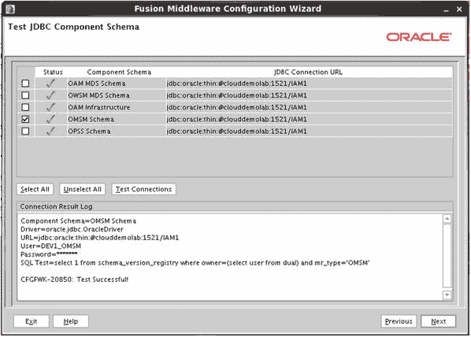

图 6-23. 检查模式

出于本章的目的，您将创建管理服务器、被管理服务器、集群和计算机，如图 6-24 所示。如果此时您的环境需要部署和服务或 RDBMS 安全存储，请现在选择它们。此屏幕上选择的项目决定了后续屏幕。您只会看到与所选项对应的屏幕。

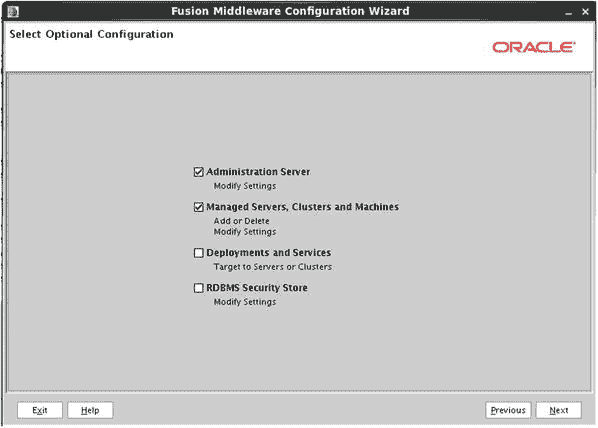

图 6-24. 可选配置

#### 配置管理服务器、被管理服务器、集群和计算机

在以下步骤中，将配置管理服务器、被管理服务器、集群和计算机。图 6-25 显示了配置管理服务器界面。

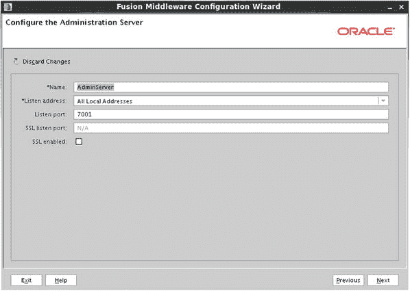

图 6-25. 管理服务器配置

每个域一次只能运行一个管理服务器。使用配置工具，可以指定一个管理服务器。在集群环境中，可以在辅助节点上配置一个备份管理服务器，以防主节点丢失。在此步骤中，请确保指定的端口在物理主机上可用。

输入管理服务器详细信息后，您将看到如图 6-26 所示的配置被管理服务器界面。被管理服务器将根据之前选择的组件预先填充。

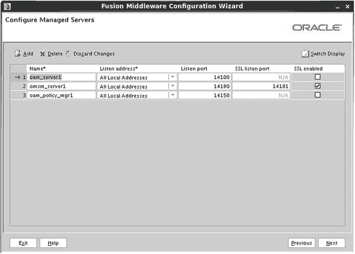

图 6-26. 被管理服务器配置

在域配置期间，选定的产品将部署在被管理服务器中。图 6-26 显示了将要创建的被管理服务器。您应确保在此屏幕上输入的端口是可用的。

如果您计划安装多个 OAM 实例以提供故障转移或负载均衡能力，图 6-27 所示的配置集群界面允许进行此配置。

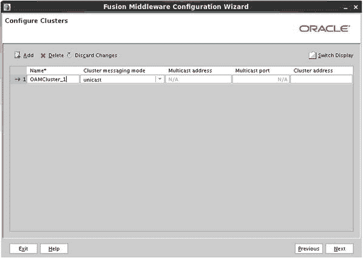

图 6-27. 集群配置

集群允许多个应用程序实例部署在一起工作，以提供高可用性环境或更好的性能。配置集群界面允许配置工具在此阶段定义集群。继续配置 OAM 集群。集群也可以稍后使用管理控制台创建。

指定集群名称后，您需要将被管理服务器分配给每个集群，如图 6-28 所示。


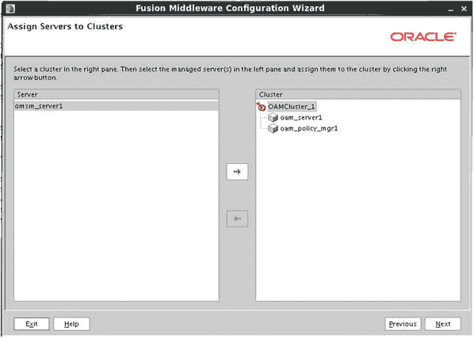
*图 6-28. 将受管服务器分配到集群*

受管服务器可以分配到前面屏幕上定义的集群中。根据在给定环境中部署的产品，您可能希望将受管服务器分散到不同的集群中。这些分配关系以后可以使用管理控制台重新分配。

机器定义了一个管理受管服务器内进程的主机。您可以在给定的主机上创建多台机器，或者将机器分布在多个主机上。图 6-29 显示了“配置机器”屏幕。

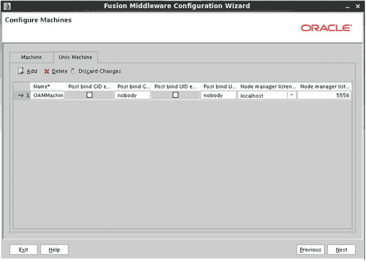
*图 6-29. 机器配置*

如果主机基于 Linux 或 UNIX，则必须创建 UNIX 机器。机器配置会告知 WebLogic 环境如何联系节点管理器以控制受管服务器。

机器配置完成后，需要将要创建的受管服务器分配到相应的机器上，如图 6-30 所示。通常，在集群环境中，会存在多台机器，每台机器上运行受管服务器的一个节点。这使得单个管理服务器能够联系并控制位于不同主机或不同 Middleware Home 中的受管服务器。

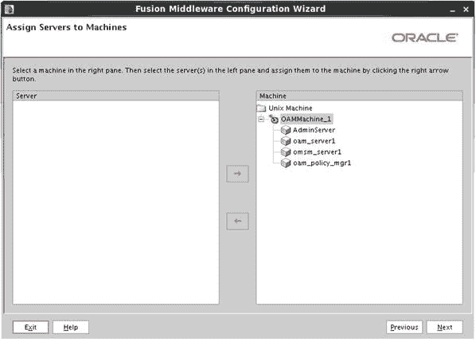
*图 6-30. 将受管服务器分配到机器*

如图 6-31 所示的“配置摘要”屏幕，提供了在执行配置之前对所有配置参数的最后检查机会。如果此时有任何内容看起来不正确，请返回并进行必要的修正，然后再继续。

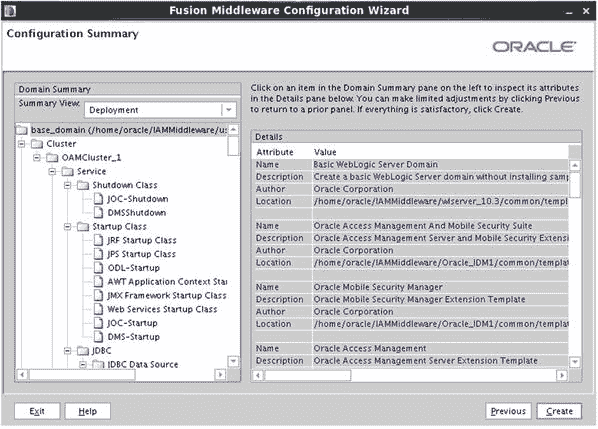
*图 6-31. 配置摘要屏幕*

检查完配置摘要屏幕后，单击“创建”以启动配置过程。图 6-32 显示了已完成的配置。

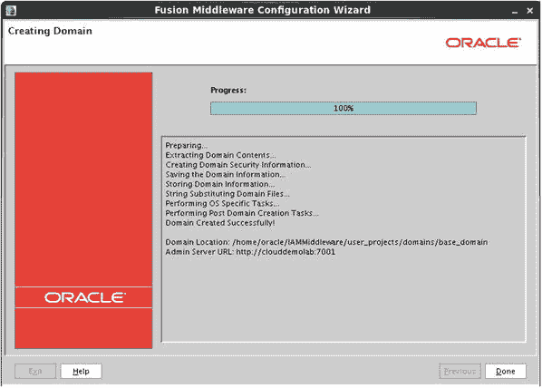
*图 6-32. 域配置完成*

OAM 域配置已完成。在启动之前，还有几个必需的步骤。下一章将介绍 Identity Manager 组件的安装和配置。随后，将配置整个身份和访问管理器环境以协同工作。

## 总结

本章介绍了 OAM 的安装过程。在安装软件文件之后，向您展示了 OAM 域的配置。至此，所有必要的文件都已复制，文件系统已准备就绪。如果您的实施只需要 SSO，则可以跳过下一章关于 Identity Manager 安装的内容。

