# Controls the maximum number of shared memory segments, in pages
kernel.shmall = 4294967296
kernel.sem = 256 32000 100 142
kernel.shmmax = 10737418240
```

在 `sysctl.conf` 文件中设置这些值后，您必须激活并验证新值是否生效，使用此命令：

```
[root@clouddemolab home]# /sbin/sysctl –p
net.ipv4.ip_forward = 0
net.ipv4.conf.default.rp_filter = 1
net.ipv4.conf.default.accept_source_route = 0
kernel.sysrq = 0
kernel.core_uses_pid = 1
net.ipv4.tcp_syncookies = 1
net.bridge.bridge-nf-call-ip6tables = 0
net.bridge.bridge-nf-call-iptables = 0
net.bridge.bridge-nf-call-arptables = 0
kernel.msgmnb = 65536
kernel.msgmax = 65536
kernel.shmmax = 68719476736
kernel.shmall = 4294967296
kernel.sem = 256 32000 100 142
kernel.shmmax = 10737418240
```

打开文件限制必须设置为 4096 以支持该实例。为此，编辑 `limits.conf` 文件。

```
[root@clouddemolab home]# vi /etc/security/limits.conf
```

如果环境要安装在 Oracle Linux 或 RedHat Linux 上，您还必须同时编辑 `/etc/security/limits.d/90-nproc.conf` 文件。如果遗漏了这一步，该文件中的值可能会覆盖 `limits.conf` 文件中的值。

在这两个文件中，确保添加或编辑了以下行：

```
* soft nofile 4096
* hard nofile 65536
* soft nproc 2047
* hard nproc 16384
```

编辑此文件后，必须重新启动服务器以确保所有更改生效。


### 操作系统软件包

每个 Oracle 应用程序都依赖于一组特定的软件包。根据您使用的 Linux 版本，安装过程可能会有所不同。在以下列表中，请注意，在 64 位操作系统上，某些软件包需要同时安装 32 位和 64 位版本。如果这些软件包未安装，安装将无法正确完成。Oracle 安装程序会执行检查，并在安装过程中显示错误。

```
binutils-2.20.51.0.2-5.28.el6
compat-libcap1-1.10-1
compat-libstdc++-33-3.2.3-69.el6 for x86_64
compat-libstdc++-33-3.2.3-69.el6 for i686
gcc-4.4.4-13.el6 gcc-c++-4.4.4-13.el6
glibc-2.12-1.7.el6 for x86_64
glibc-2.12-1.7.el6 for i686
glibc-devel-2.12-1.7.el6 for i686
libaio-0.3.107-10.el6
libaio-devel-0.3.107-10.el6
libgcc-4.4.4-13.el6
libstdc++-4.4.4-13.el6 for x86_64
libstdc++-4.4.4-13.el6 for i686
libstdc++-devel-4.4.4-13.el6
libXext for i686
libXtst for i686
libXext for x86_64
libXtst for x86_64
openmotif-2.2.3 for x86_64
openmotif22-2.2.3 for x86_64
redhat-lsb-core-4.0-7.el6 for x86_64
sysstat-9.0.4-11.el6
xorg-x11-utils*
xorg-x11-apps*
xorg-x11-xinit*
xorg-x11-server-Xorg*
xterm
pdksh-5.2.14
```

此时，操作系统应已完全准备好进行后续安装。在安装软件之前执行这些操作将确保安装过程顺利进行。在许多情况下，如果遗漏了任何步骤，安装程序会提供详细的错误消息。如果在安装过程中出现错误，请停止安装并在继续之前解决所有问题。

## Oracle HTTP Server 软件安装与配置

`OHS` 软件的安装和配置非常直接。安装程序会引导您完成整个过程，并在最后配置服务器。因此，安装结束后，您应该能够通过访问指定的主机名和端口来测试服务器。

与 `Identity Management` 安装程序类似，它是通过在软件目录下运行命令来启动的。图 8-1 显示了 `Web Tier Installer` 的欢迎页面。

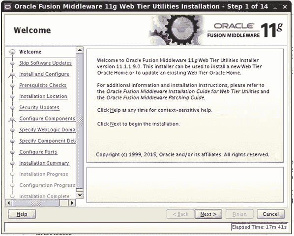

图 8-1.

启动 Universal Installer

```
runInstaller -jreLoc /home/oracle/jdk1.6.0_45/jre
```

在此阶段，请确保欢迎屏幕上显示了您计划安装的 `OHS` 版本。每个 `OHS` 版本都有其专属的安装程序。在安装 `OHS` 之前，您应检查 `Oracle` 认证矩阵，以确保 `OAM WebGate` 版本兼容。

`OHS` 是一个可以使用“安装并配置”选项的组件，如图 8-2 所示。这是执行此操作的最简单方法，因为它不需要在之后运行其他工具或手动修改配置文件。

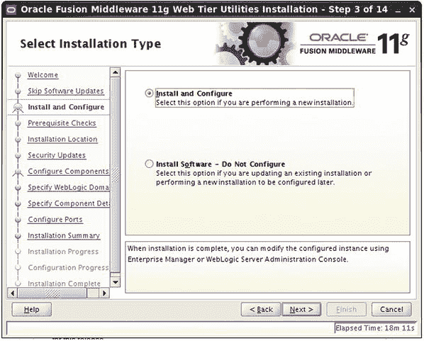

图 8-2.

安装并配置设置

在本章开头，列出了操作系统先决条件。如果显示任何错误或警告，请在继续之前解决这些问题。安装程序将检查操作系统并通知您任何缺失的先决条件，如图 8-3 所示。

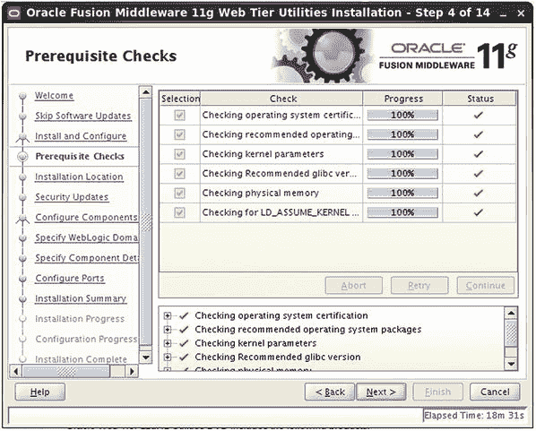

图 8-3.

先决条件检查屏幕

`OHS` 可以安装在现有的 `WebLogic home directory` 中，也可以放置在新目录中。如果您计划在域中注册此 `OHS` 实例，则必须将该软件安装在该域的 `Middleware Home directory` 中。但是，将 `OHS` 安装在其独立的目录中而不将其与域注册也是完全可以接受的做法。虽然您可能会失去一些监控和管理功能，但大多数操作都可以通过命令行执行。如图 8-4 所示，输入为 `Web Tier` 指定的新 `Middleware Home` 位置。

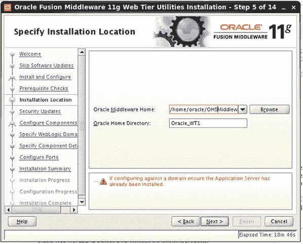

图 8-4.

Middleware Home 位置

至少，您应该安装 `Oracle HTTP Server` 组件，如图 8-5 所示。如果您的环境中需要 `Web Cache`，请选择它。此处选中 `Oracle Web Cache` 复选框仅是为了展示配置屏幕。`Web Cache` 超出了本书的讨论范围。因为此 `OHS` 实例将独立于 `WebLogic` 域运行，所以“将选定组件与 `WebLogic` 域关联”复选框未被选中。

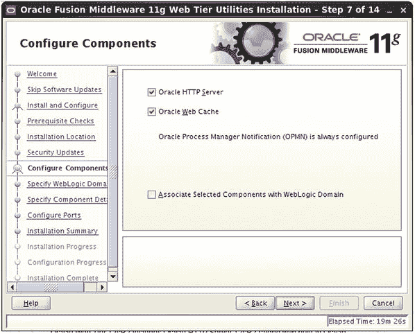

图 8-5.

配置组件屏幕

在“指定组件详细信息”屏幕上，您可以为每个组件指定实例主目录和名称。确保将它们设置为您容易记住的值。图 8-6 显示了“指定组件详细信息”屏幕的示例。

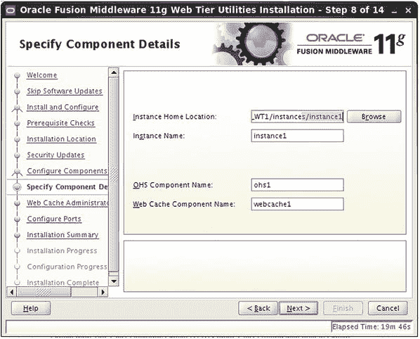

图 8-6.

指定组件详细信息屏幕

如果配置 `Web Cache`，则必须为管理员用户提供密码。在对 `Web Cache` 进行配置更改时需要此用户。请提供所需的信息，如图 8-7 所示。

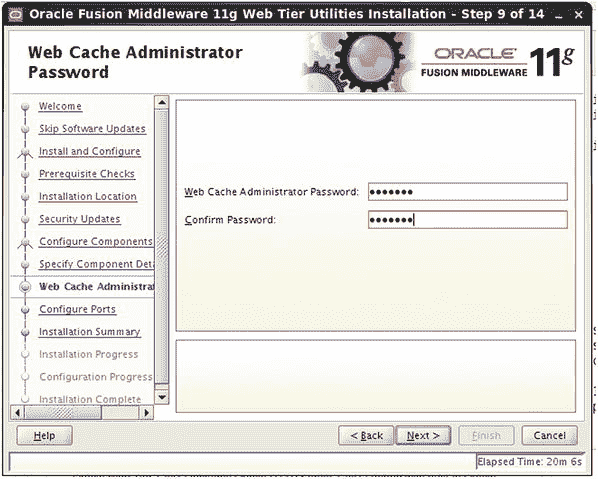

图 8-7.

Web Cache 管理员密码屏幕


OHS 服务器的安装将默认使用端口 `7777`。如果您选择使用不同的端口，例如 `80`、`443` 或两者都用，可以通过修改 `staticports.ini` 文件来完成配置。或者，您也可以稍后更新位于实例配置目录下的 `httpd.config` 文件。图 8-8 展示了一个使用 `自动端口配置` 设置的安装过程。

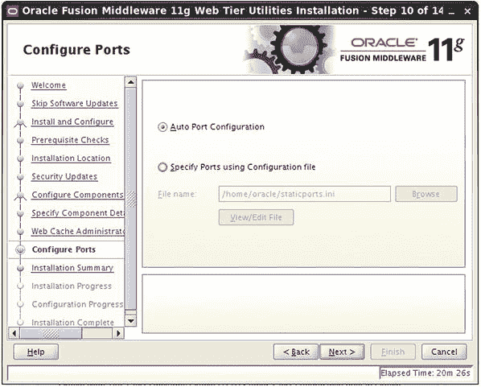

图 8-8. 端口配置

`安装概要` 屏幕，如图 8-9 所示，为您提供待安装组件的概览。点击 `安装` 继续。

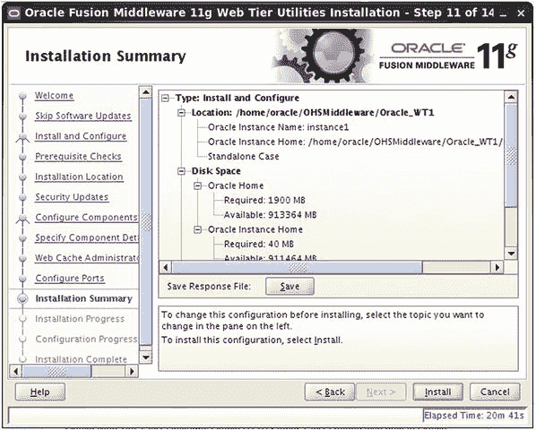

图 8-9. 安装概要屏幕

一般来说，此过程需要 `5` 到 `10` 分钟。`安装进度` 屏幕，如图 8-10 所示，将显示进度以及实际正在进行的流程。如果出现任何错误，请参考屏幕上显示的日志文件。

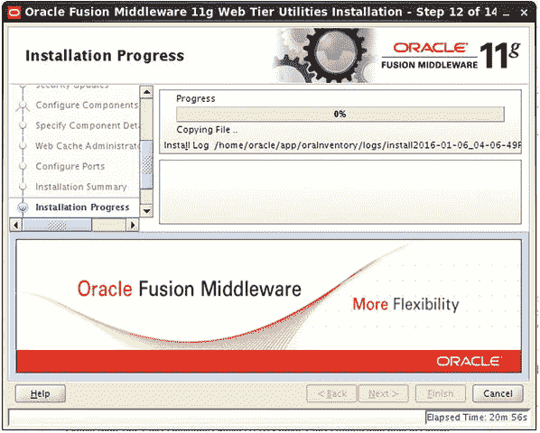

图 8-10. 安装进度屏幕

安装程序完成安装后，它将立即开始基于先前屏幕上的输入来配置新创建的实例。每个步骤可能都需要一点时间。配置完成后，安装程序将启动 OHS 进程。请监控图 8-11 所示的 `配置进度` 屏幕，如果有任何错误，请检查指定的日志文件。

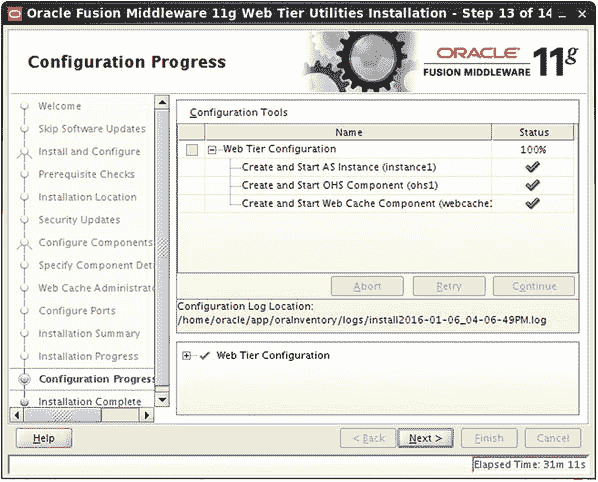

图 8-11. 配置进度屏幕

图 8-12 中的 `安装完成` 屏幕指示了新 Web 层的所有安装和配置详情。

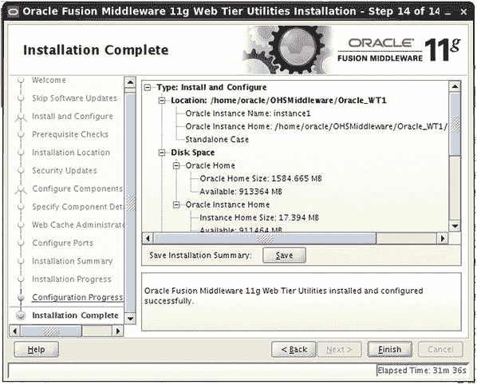

图 8-12. 安装完成屏幕

您已完成 OHS 的安装和配置，现在拥有一个可用的 Web 服务器，可作为各种应用程序的前端。通过 OHS，您会获得 Oracle WebLogic 模块，该模块允许您配置各种位置由底层 WebLogic 应用服务器处理。`Mod_wl_ohs` 包含处理基于 WebLogic 应用程序的反向代理和集群故障转移所需的配置。本章下一节将介绍在 HTTP 服务器上安装和配置 OAM WebGate 的步骤。

## Oracle Access Manager WebGate 安装与配置

允许 OAM 保护资源并处理 SSO（单点登录）的关键组件是 WebGate。当请求进入时，OAM WebGate 会评估请求并确定是否需要认证。如果请求的资源受保护，WebGate 会将认证责任移交给 OAM。一旦 OAM 对用户进行了认证，它就会在浏览器中设置会话信息，WebGate 利用这些信息允许用户访问被允许的应用程序。

WebGate 安装过程与其他安装程序类似，首先是图 8-13 所示的欢迎屏幕。重要的是确保该版本与您已安装的 OAM 版本兼容。

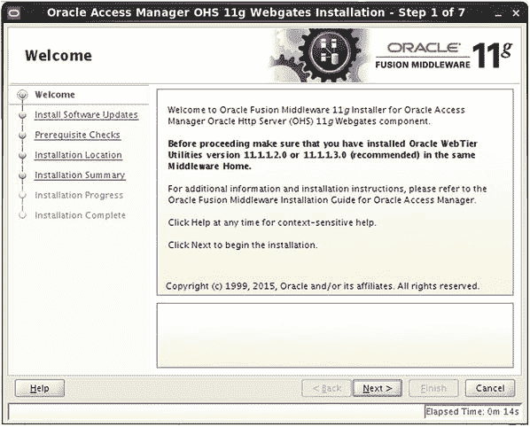

图 8-13. 安装开始

OAM WebGate 的安装启动方式与其他 Oracle 应用程序的安装类似，使用通用安装程序。从下载的安装介质 `Disk1` 中，执行：

```
./runInstaller.sh –jreLoc /home/oracle/jdk1.6.0_45/jre
```

如果您在开始时花时间确保满足所有操作系统先决条件，此屏幕应正常完成所有检查。如果任何检查失败，请在此处解决问题后再继续。有关已完成的先决条件检查示例，请参见图 8-14。

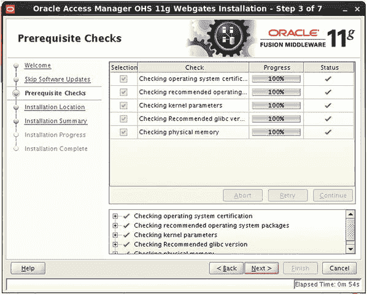

图 8-14. 先决条件检查屏幕

Oracle WebGate 应安装在与 OHS 相同的 Middleware Home 位置内。如果这是在 WebLogic Middleware Home 中完成的，请确保 WebGate 软件共享此主目录。列出的 `Oracle 主目录` 在该目录中应是唯一的，如图 8-15 所示。

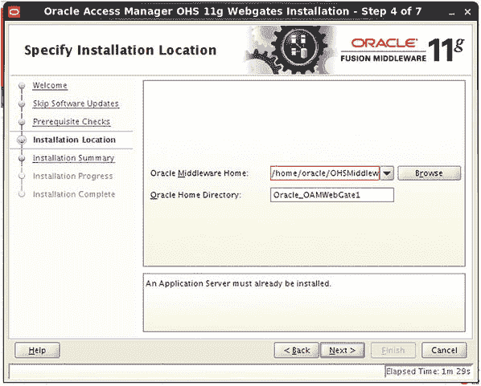

图 8-15. 安装位置

`安装概要` 屏幕，如图 8-16 所示，展示了待安装组件及其位置的摘要。请花时间确保一切看起来正确。

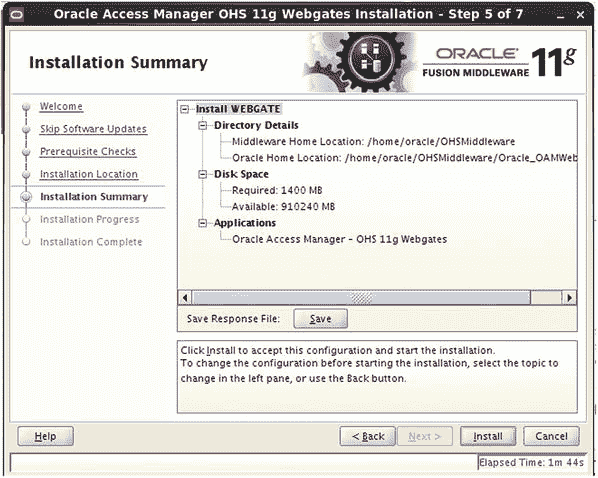

图 8-16. 安装详情

与本书中安装的其他产品一样，OHS 11g WebGate 安装程序提供了一个进度指示器，如图 8-17 所示。如果出现任何错误，您可以监控指示的安装日志。

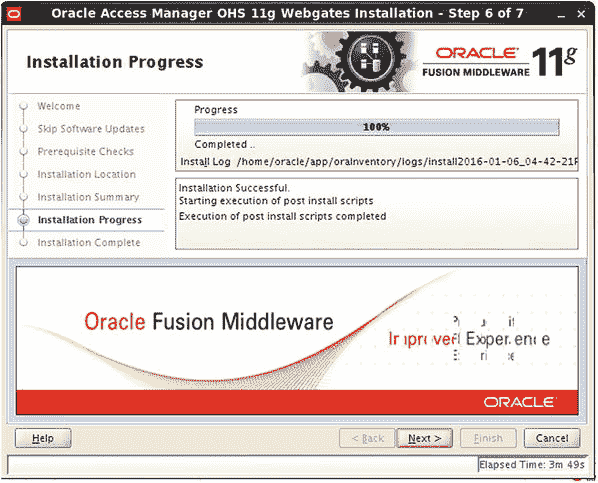

图 8-17. 安装进度屏幕

在安装阶段结束时，请记下图 8-18 所示完成屏幕上提供的详细信息。

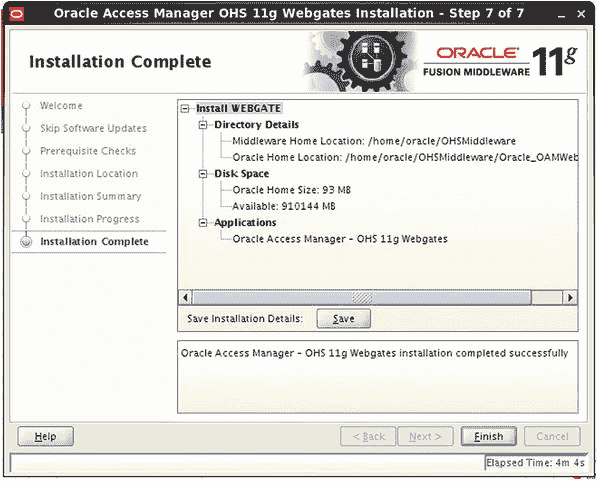

图 8-18. 安装完成屏幕

至此，OAM WebGate 的安装完成。在下一节中，您将完成 WebGate 在 OHS 环境中的初始配置和部署。


## 配置与部署 Oracle WebGate

既然 OHS 和 OAM WebGate 软件已安装完毕，是时候将 WebGate 部署到 OHS 中了。执行此操作的工具位于 Oracle WebGate 主目录中。该目录是在安装过程中选定的。

打开命令提示符，导航至以下目录：

```
/webgate/ohs/tools/deployWebGate
```

工具 `deployWebGateInstance.sh` 需要两个参数：WebGate 主目录和 WebGate 实例主目录。这两个参数分别通过 `–w` 和 `–oh` 参数指定。用 `–oh` 指定的 WebGate 主目录是 WebGate 软件的安装目录。用 `–w` 指定的 WebGate 实例目录是 OHS 实例目录，在多数情况下，该目录位于 `Oracle_WT1/instances/instance1/config/OHS/ohs1`。

命令应类似于以下形式：

```
./deployWebGateInstance.sh –w /home/oracle/OHSMiddleware/Oracle_WT1/instances/instance1/config/OHS/ohs1 –oh /home/oracle/OHSMiddleware/Oracle_OAMWebGate11g
```

运行 `deployWebGateInstance.sh` 工具会将所需的代理文件复制到 WebGate 实例目录中。你可以通过查看目录 `/home/oracle/Oracle_WT1/instances/instance1/config/OHS/ohs1` 来验证这一点。你应该会看到一个 `webgate` 目录和一个 `webgate.conf` 文件。

部署过程的下一步是修改所需的文件，以使 OHS 能够识别 WebGate。

为此，你必须首先通过运行以下命令确保 `LD_LIBRARY_PATH` 包含了 OHS 的 `lib` 文件夹：

```
export LD_LIBRARY_PATH=$LD_LIBRARY_PATH:/home/oracle/OHSMiddleware/Oracle_WT1/lib
```

接下来，移动到目录 `/home/oracle/OHSMiddleware/Oracle_OAMWebGate11g/webgate/ohs/tools/setup/InstallTools`。在此目录下，运行命令：

```
./EditHttpConf –w  -oh 
```

上述命令需要两个参数：WebGate 主目录和 WebGate 实例主目录。这两个参数分别通过 `–w` 和 `–oh` 参数指定。用 `–oh` 指定的 WebGate 主目录是 WebGate 软件的安装目录。用 `–w` 指定的 WebGate 实例目录是 OHS 实例目录，在多数情况下，该目录位于 `Oracle_WT1/instances/instance1/config/OHS/ohs1`。

验证命令是否已做出适当的更改。检查 `/home/oracle/OHSMiddleware/Oracle_WT1/instances/instance1/conf/OHS/ohs1` 目录中的 `httpd.conf` 文件。它现在应该在文件末尾包含以下行：

```
include "/home/oracle/OHSMiddleware/Oracle_WT1/instances/instance1/config/OHS/ohs1/webgate.conf”
```

## 总结

现在你已经拥有一个 OHS 和 OAM 11g WebGate 实例。你的 OHS 可以用作 Web 服务器来托管需要 OAM 保护的应用程序。基础组件现已就位，可以实施 Oracle 标识与访问管理套件。接下来的几章将提供将所有部分整合在一起所需的信息。

# 9. 配置 Oracle Access Manager

所有必需的组件现已安装完毕。你已经在独立的 Middleware Home 中为每个组件创建了一个域。这简化了未来的升级和维护。完成这组操作后，实际的组件需要被配置，并为实际的集成做好准备。配置过程包括根据你的环境设置组件。以下几页将讨论如何配置 OAM 以支持你环境中的单点登录 (SSO)。

## 准备 Access Manager 使用 Oracle Internet Directory

默认情况下，OAM 被配置为同时使用 WebLogic 内置的轻量目录访问协议 (LDAP) 用户存储区作为系统存储区和默认存储区。强烈建议你在生产环境中配置 OAM 使用外部数据存储区。虽然你可能并非在设置生产环境，但建议你将开发或测试环境配置得与生产系统相似。因此，本章将演示如何配置 OAM 使用 Oracle Internet Directory (OID) 作为其标识存储区。

要使用 OID 作为标识存储区，第一步是配置 WebLogic 安全域以识别 OID。将浏览器指向 `http://host:port/console` 来打开 OAM WebLogic 域管理控制台。在本书中，OAM WebLogic Server 管理控制台配置的主机为 `10.0.70.229`，端口为 `17001`。如果你还记得前面的章节，OID 使用端口 `7001`，而 Oracle Identity Manager (OIM) 使用 `27001`。图 9-1 显示了 WebLogic 管理控制台的安全域。

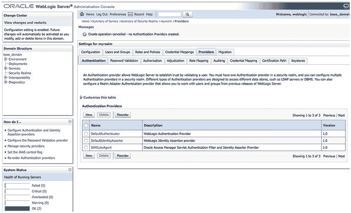

图 9-1. WebLogic Server 安全域

登录到 OAM 域的管理控制台后，导航至“安全域” ➤ “myrealm”。屏幕将显示在域创建期间配置的默认安全域。它由 DefaultAuthenticator、IAMSuiteAgent 和 DefaultIdentityAsserter 组成。在此步骤中，你将添加一个身份验证器以支持 OID。单击“新建”以创建新的身份验证器。这将打开如图 9-2 所示的“创建新身份验证提供程序”屏幕。

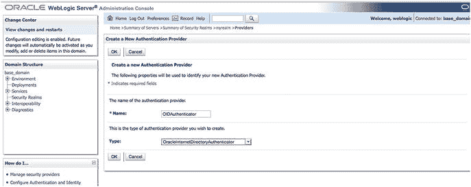

图 9-2. 创建 OID 身份验证器

在此屏幕上，为新身份验证器提供一个名称。在本例中，将其命名为 `OIDAuthenticator`，并在“类型”字段中选择 `OracleInternetDirectoryAuthenticator`。单击“确定”。

图 9-3 显示了 WebLogic 身份验证提供程序的重新排序屏幕。

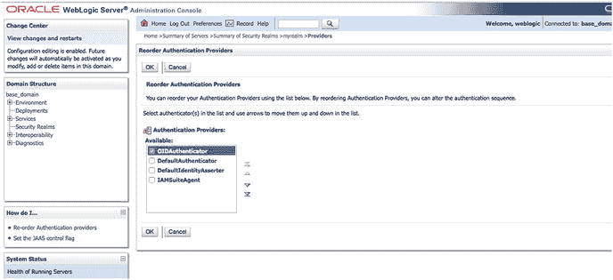

图 9-3. 重新排序提供程序

创建新提供程序后，应将其设置为提供程序列表中的第一位。选中新 `OIDAuthenticator` 旁边的复选框，然后使用箭头将其移动到适当的位置。单击“确定”保存此步骤。然后，你可以继续设置图 9-4 所示的“控制标志”属性。

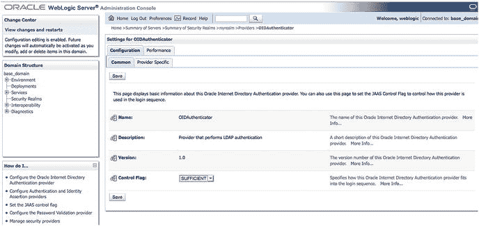

图 9-4. 提供程序公共配置

对提供程序重新排序后，必须配置 `OIDAuthenticator`。首先将控制标志设置为 `Sufficient`。这允许新创建的身份验证器提供身份验证服务，但不要求用户必须存在于 OID 用户存储区中才能访问资源。这是必要的，因为某些用户（例如 `weblogic`）可能不存在于 OID 中。完成 `OIDAuthenticator` 的配置后，`DefaultAuthenticator` 上的控制标志也必须设置为 `Sufficient`。

在如图 9-5 所示的“提供程序详细信息”选项卡上，输入新身份验证器的配置详细信息。在本例中，根据表 9-1 中的值进行设置。

表 9-1. OID 身份验证器参数

| 参数 | 描述 |
| :--- | :--- |
| 主机 | 安装 OID 的主机 |
| 端口 | OID LDAP 端口（OID 默认为 `3060`） |
| 主体 | `cn=orcladmin` 或用于身份验证器的其他主体 |
| 凭证 | 主体使用的密码 |
| 用户基准 DN | `cn=users,dc=mycompany,dc=com` |
| 组基准 DN | `cn=groups,dc=mycompany,dc=com` |

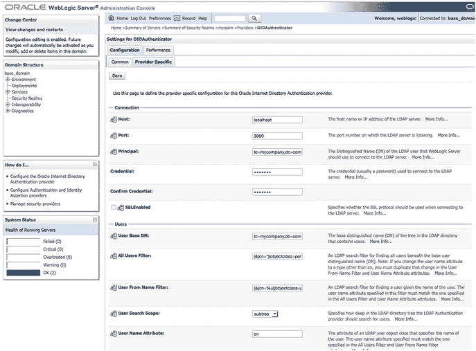

图 9-5. 身份验证器详细信息


根据需要自定义其他字段。在大多数情况下，默认值即可正常工作。点击“保存”继续。如前所述，需要将 `DefaultAuthenticator` 的控制标志配置为 `Sufficient`。以图 9-6 所示的待更新字段为例。

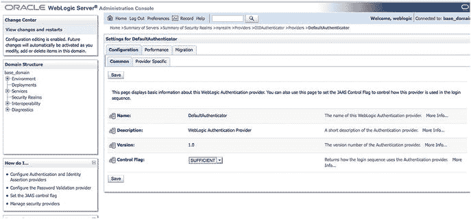

图 9-6.
默认验证器控制标志

配置完 `OIDAuthenticator` 属性，并为 `OIDAuthenticator` 和 `DefaultAuthenticator` 均设置好控制标志后，您需要重启 OAM 托管服务器和 WebLogic 管理服务器。请遵循本书前面介绍的步骤来重启所有进程。

## 为 Oracle Access Manager 预配置 OID

随着 OAM 域配置好 OID 验证器，现在需要在 OAM 内配置身份存储。此配置确保 OAM 使用先前配置的 OID 实例。

首次登录 `OAMConsole` 时，您需要使用 `weblogic` 用户，因为 OAM 当前使用的是默认验证器，且 `oamadmin` 尚未获得 `OAMConsole` 的管理员访问权限。因此，流程的第一步是在 OID 中创建必要的用户和组，为集成做准备。

打开命令提示符，将工作目录设置为 `<ORACLE_HOME>/idmtools/bin`，其中 `<ORACLE_HOME>` 是 OAM 的安装目录。本节所有 IDM 工具命令都将在此位置运行。

**注意**
IDM 工具应始终从同一位置运行，以确保参数文件被正确更新。但是，在拆分域中（即 OIM 安装在单独的 WLS 主目录或独立服务器上），您需要在 OIM 主目录中运行 `–configOIM` 命令。

在运行 `idmConfigTool.sh` 命令之前，必须确保环境变量已正确设置。若设置不当，将导致各种错误，且并非所有错误都会明确指出原因。请按如下方式设置环境变量：

```bash
MW_HOME=/home/oracle/OAMMiddlewareHome
JAVA_HOME=
IDM_HOME=/home/oracle/OIDMiddlewareHome
ORACLE_HOME=/home/oracle/OAMMiddlewareHome/Oracle_IAM1
IAM_ORACLE_HOME=/home/oracle/OAMMiddlewareHome/OracleIAM1
```

这些值应反映您特定环境中使用的安装目录。请注意，`MW_HOME` 和 `ORACLE_HOME` 与 Oracle Access Management 安装相关。`IDM_HOME` 应指向 OID 安装目录。`IDM_HOME` 是一个可选参数，如果 OID 安装在单独的服务器上，可以省略。

创建一个名为 `extendOAMPropertyFile` 的文件：

```
extendOAMPropertyFile
IDSTORE_HOST: 10.0.70.229
IDSTORE_PORT: 3060
IDSTORE_BINDDN: cn=orcladmin
IDSTORE_USERNAMEATTRIBUTE: cn
IDSTORE_LOGINATTRIBUTE: uid
IDSTORE_USERSEARCHBASE: cn=Users,dc=mycompany,dc=com
IDSTORE_GROUPSEARCHBASE: cn=Groups,dc=mycompany,dc=com
IDSTORE_SEARCHBASE: dc=mycompany,dc=com
IDSTORE_SYSTEMIDBASE: cn=systemids,dc=mycompany,dc=com
```

`extendOAMPropertyFile` 中的值应设置如下：

*   `IDSTORE_HOST`：应设置为 OID 实例的主机名，或负载均衡 OID 实例的虚拟主机名。
*   `IDSTORE_PORT`：设置为 OID 实例的 LDAP 端口。
*   `IDSTORE_BINDDN`：`cn=orcladmin`。工具将使用此值登录 OID。该用户应有权在 `usersearchbase` 和 `groupsearchbase` 内创建用户和组。
*   `IDSTORE_LOGINATTRIBUTE`：应设置为 LDAP 存储中包含登录名的属性。
*   `IDSTORE_USERSEARCHBASE`：将此属性设置为 ID 存储中存储用户的位置。
*   `IDSTORE_GROUPSEARCHBASE`：将此属性设置为 ID 存储中存储组的位置。
*   `IDSTORE_SEARCHBASE`：包含上述搜索基的父容器。
*   `IDSTORE_SYSTEMIDBASE`：将存储身份管理套件所用系统 ID 的新容器。

创建一个名为 `preConfigOAMProperties` 的文件，内容如下：

```bash
vi preconfigOAMPropertyFile
IDSTORE_HOST : 10.0.70.229
IDSTORE_PORT : 3060
IDSTORE_BINDDN : cn=orcladmin
IDSTORE_USERNAMEATTRIBUTE: cn
IDSTORE_LOGINATTRIBUTE: uid
IDSTORE_USERSEARCHBASE: cn=Users,dc=mycompany,dc=com
IDSTORE_GROUPSEARCHBASE: cn=Groups,dc=mycompany,dc=com
IDSTORE_SEARCHBASE: dc=mycompany,dc=com
IDSTORE_SYSTEMIDBASE: cn=systemids,dc=mycompany,dc=com
POLICYSTORE_SHARES_IDSTORE: true
OAM11G_IDSTORE_ROLE_SECURITY_ADMIN:OAMAdministrators
IDSTORE_OAMSOFTWAREUSER:oamLDAP
IDSTORE_OAMADMINUSER:oamadmin
```

此文件中输入的值应反映您环境中使用的值。


*   `IDSTORE_HOST`：应设置为 OID 实例的主机名，或负载均衡 OID 实例的虚拟主机名。
*   `IDSTORE_PORT`：设置为 OID 实例的 LDAP 端口。
*   `IDSTORE_BINDDN`：cn=orcladmin。此值将被工具用于登录 OID。该用户应有权在 usersearchbase 和 groupsearchbase 内创建用户和组。
*   `IDSTORE_LOGINATTRIBUTE`：应设置为 LDAP 存储中包含登录名的属性。
*   `IDSTORE_USERSEARCHBASE`：将此属性设置为 ID 存储中存储用户的位置。
*   `IDSTORE_GROUPSEARCHBASE`：将此属性设置为 ID 存储中存储组的位置。
*   `IDSTORE_SEARCHBASE`：包含前述 searchbase 的父容器。
*   `IDSTORE_SYSTEMIDBASE`：将存储身份管理套件所用系统 ID 的新容器。
*   `POLICYSTORE_SHARES_IDSTORE`：设置为 true。
*   `OAM11G_IDSTORE_ROLE_SECURITY_ADMIN`：将包含 OAM 管理员的 LDAP 组的名称。
*   `IDSTORE_OAMSOFTWAREUSER`：将被 OAM 进程使用的 OAM 用户。
*   `IDSTORE_OAMADMINUSER`：将在 OAM 控制台中拥有管理员权限的新用户。

现在可以运行`idmConfigTool.sh`命令，为 OAM 创建必要的容器、组和用户。请按如下方式运行该命令。

首先，扩展 LDAP 身份存储以进行 Access Manager 集成。

```
./idmConfigTool.sh –preConfigIDStore input_file=extendOAMPropertyFile
```

输出应类似于以下内容：

```
[oracle@clouddemolab bin]$ ./idmConfigTool.sh -preConfigIDStore input_file=extendOAMPropertyFile
Enter ID Store Bind DN Password :
Jan 5, 2016 1:14:42 PM oracle.ldap.util.LDIFLoader loadOneLdifFile
INFO: -> LOADING: /home/oracle/IAMMiddleware/Oracle_IAM1/idmtools/templates/oid/idm_idstore_groups_template.ldif
Jan 5, 2016 1:14:43 PM oracle.ldap.util.LDIFLoader loadOneLdifFile
INFO: -> LOADING: /home/oracle/IAMMiddleware/Oracle_IAM1/idmtools/templates/oid/idm_idstore_groups_acl_template.ldif
Jan 5, 2016 1:14:43 PM oracle.ldap.util.LDIFLoader loadOneLdifFile
INFO: -> LOADING:  /home/oracle/IAMMiddleware/Oracle_IAM1/idmtools/templates/oid/idstore_tuning.ldif
Jan 5, 2016 1:14:43 PM oracle.ldap.util.LDIFLoader loadOneLdifFile
INFO: -> LOADING:  /home/oracle/IAMMiddleware/Oracle_IAM1/idmtools/templates/oid/oid_schema_extn.ldif
Jan 5, 2016 1:14:50 PM oracle.ldap.util.LDIFLoader loadOneLdifFile
INFO: -> LOADING:  /home/oracle/IAMMiddleware/Oracle_IAM1/../oracle_common/modules/oracle.ipf_11.1.1/scripts/ldap/OID_OracleSchema.ldif
Jan 5, 2016 1:15:01 PM oracle.ldap.util.LDIFLoader loadOneLdifFile
INFO: -> LOADING:  /home/oracle/IAMMiddleware/Oracle_IAM1/idmtools/templates/oid/fa_pwdpolicy.ldif
The tool has completed its operation. Details have been logged to automation.log
```

如果报告任何错误，请检查`automation.log`文件并纠正错误，然后再继续。

LDAP 身份存储预配置完成后，您需要运行创建的第二个文件来填充容器，如下一个示例所示。

```
./idmConfigTool.sh –prepareIDStore mode=OAM input_file=preconfigOAMPropertyFile
```

运行此命令时，系统将提示您设置`oblixanonymous`、`oamLDAP`和`oamadmin`用户的密码。输出将类似于以下摘录。

```
[oracle@clouddemolab bin]$ ./idmConfigTool.sh -prepareIDStore mode=OAM input_file=preconfigOAMPropertyFile
Enter ID Store Bind DN Password :
*** Creation of Oblix Anonymous User ***
Jan 5, 2016 1:17:21 PM oracle.ldap.util.LDIFLoader loadOneLdifFile
INFO: -> LOADING: /home/oracle/IAMMiddleware/Oracle_IAM1/idmtools/templates/oid/oam_10g_anonymous_user_template.ldif
Enter User Password for oblixanonymous:
Confirm User Password for oblixanonymous:
*** Creation of oamadmin ***
Jan 5, 2016 1:17:33 PM oracle.ldap.util.LDIFLoader loadOneLdifFile
INFO: -> LOADING:  /home/oracle/IAMMiddleware/Oracle_IAM1/idmtools/templates/oid/oam_user_template.ldif
*** Creation of oamLDAP ***
Jan 5, 2016 1:17:33 PM oracle.ldap.util.LDIFLoader loadOneLdifFile
INFO: -> LOADING:  /home/oracle/IAMMiddleware/Oracle_IAM1/idmtools/templates/oid/oim_user_template.ldif
Enter User Password for oamLDAP:
Confirm User Password for oamLDAP:
...
*** Creation of ESSO acl ***
Jan 5, 2016 1:17:47 PM oracle.ldap.util.LDIFLoader loadOneLdifFile
INFO: -> LOADING:  /home/oracle/IAMMiddleware/Oracle_IAM1/idmtools/templates/oid/esso_acl.ldif
The tool has completed its operation. Details have been logged to automation.log
```

完成后，必要的用户和组已在 OID 内创建。请在 OID 中，使用 Oracle Directory Service Manager（`ODSM`）工具进行检查，以确保`oamAdministrators`组和`oamAdmin`用户已被创建。


## 配置 Oracle Access Manager 身份存储

随着 OID 扩展以支持 OAM，现在需要配置 OAM 以使用 OID 作为系统和默认用户存储。通过访问 URL `http://host:wls_console_port/oamconsole` 登录 AOM 管理控制台。图 9-7 显示了 OAM 管理控制台的一个示例。使用 `weblogic` 用户名和密码登录。在 OAM 系统和默认身份存储配置完成之前，新创建的管理员用户将无法使用。

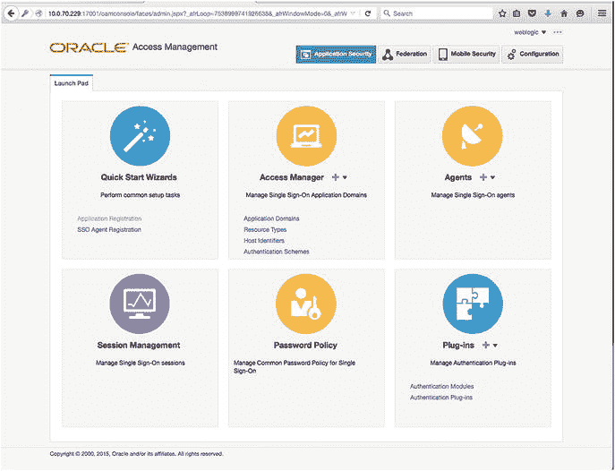
**图 9-7. OAM 管理控制台**

管理控制台的登陆页面被划分为多个部分，以便于查找配置设置。顶部是主要配置类别：应用程序安全、联合、移动安全和配置。每个类别都有若干选项，允许你配置各种组件。首先，选择屏幕右上角的“配置”选项。配置菜单如图 9-8 所示。

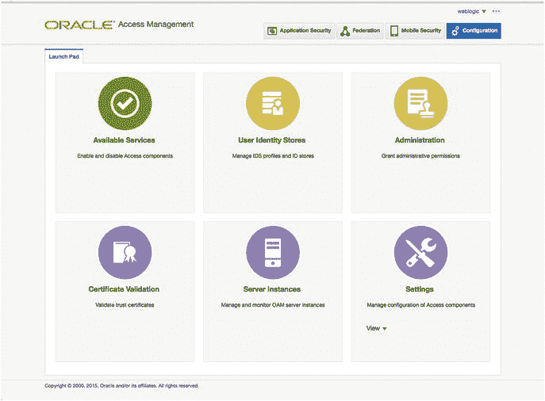
**图 9-8. 配置菜单**

完整的配置和管理超出了本书的范围。不过，本指南涵盖了完成整体集成所必需的部分。在配置菜单上，单击“用户身份存储”图标以查看当前配置。图 9-9 显示了你在创建新存储之前将看到的“用户身份存储”屏幕。

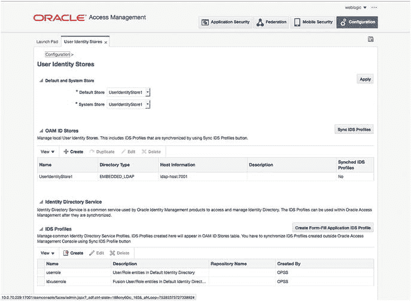
**图 9-9. 身份存储配置屏幕**

首次访问“用户身份存储”屏幕时，你会看到访问管理器正在使用嵌入式 LDAP 作为 `用户身份存储`，并且它被设置为默认存储和系统存储。这里的嵌入式 LDAP 指的是 WLS 内置的。在本节中，你将创建一个名为 OID 的新身份存储，并将系统存储和默认存储更改为使用它。

### 创建：用户身份存储

在如图 9-10 所示的“创建：用户身份存储”屏幕上，输入 OID 所需的连接详细信息。随后的表 9-2 列出了此阶段预期的值。

**表 9-2. OID 身份存储连接详细信息**

| 存储名称         | 为新的身份存储指定一个将被使用的名称                                                                 |
|------------------|------------------------------------------------------------------------------------------------------|
| 存储类型         | OID Oracle Internet Directory                                                                        |
| 绑定 DN          | `Cn=orcladmin`，或其他对用户和组搜索基础具有读取访问权限的用户                                         |
| 密码             | 为“绑定 DN”中列出的用户设置的密码                                                                    |
| 描述             | （可选）                                                                                             |
| 位置             | OID 的主机名和 LDAP 端口号                                                                           |
| 登录 ID 属性     | `CN` 是默认值；如果你使用不同的属性，请在此处输入                                                   |
| 用户密码属性     | `userPassword`                                                                                       |
| 用户搜索基础     | `Cn=Users,dc=mycompany,dc=com`；此值应与 `extendOAMPropertyFile` 中使用的用户搜索基础匹配            |
| 组搜索基础       | `Cn=Groups,dc=mycompany,dc=com`；此值应与 `extendOAMPropertyFile` 中使用的组搜索基础匹配              |

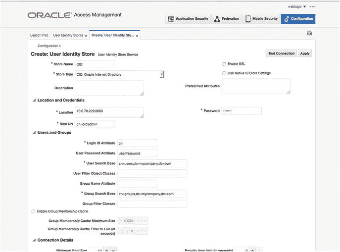
**图 9-10. 创建：用户身份存储屏幕**

单击“测试连接”以确保你输入的详细信息正确，并且 OAM 能够连接到新的 LDAP 存储。在继续下一步之前，请确保你看到的结果与图 9-11 相似。


**图 9-11. 测试连接**

### 设置默认存储和系统存储

成功创建 LDAP 存储后，你必须将 OAM 系统存储和默认存储的值设置为新存储的名称。你将在图 9-12 中看到一个示例。

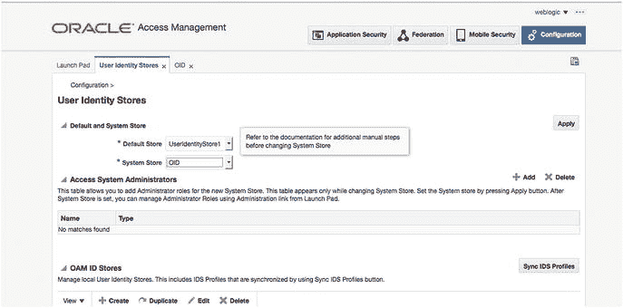
**图 9-12. 设置默认存储和系统存储**

更新存储值时，你会看到一条弹出消息，告知你在应用更改之前必须完成一个步骤。页面上将出现一个名为“访问系统管理员”的新部分。在此部分中，你将添加在 `preconfigOAMProperties` 文件中创建的 `oamadmin` 用户和 `oamadministrators` 组。单击“添加按钮”并使用搜索屏幕查找用户和组。根据需要添加你的环境中可能需要的任何其他用户。添加用户后，单击“应用”。系统将要求你输入 `oamadmin` 用户名和密码，以验证新的用户存储是否正常工作。

### 配置 LDAP 认证模块

验证管理员用户并保存新配置后，你必须配置 LDAP 认证模块以使用新的身份存储。在退出管理控制台之前未完成此步骤可能会导致你无法再次登录 OAM 控制台。要继续，请选择屏幕顶部中心的“应用程序安全”选项，如图 9-13 所示。


**图 9-13. 应用程序安全菜单**

在“应用程序安全”菜单上，在“访问管理器”下，单击“认证方案”链接。图 9-14 显示了 OAM 预配置的认证方案列表。

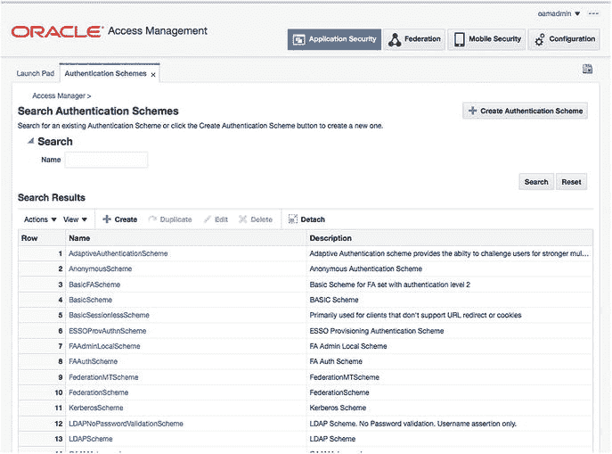
**图 9-14. 认证方案**

在“搜索认证方案”屏幕上，单击“搜索”以显示当前可用的方案列表。单击列出的 `LDAPScheme` 以调出其配置。这将显示所使用的认证模块的名称。图 9-15 显示了将使用的配置屏幕。

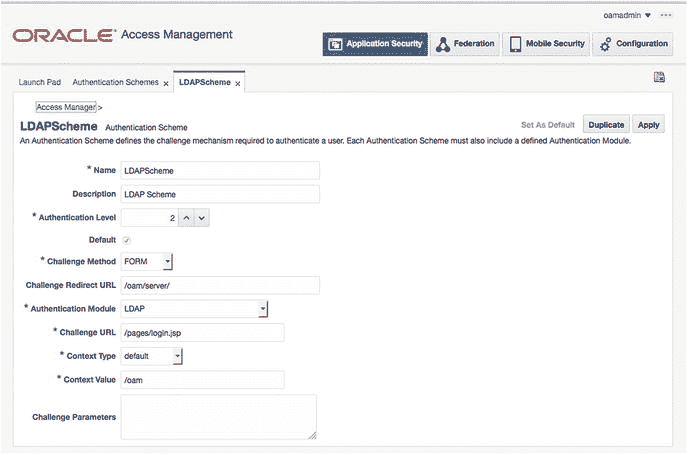
**图 9-15. LDAPScheme 配置屏幕**

在此情况下，`LDAPScheme` 被配置为使用 LDAP 认证模块。这是你需要更改的模块，以确保在使用外部 LDAP 存储（如 OID）配置的访问管理器中能够正常登录和访问。图 9-16 显示了“认证模块”选项卡上的结果集。

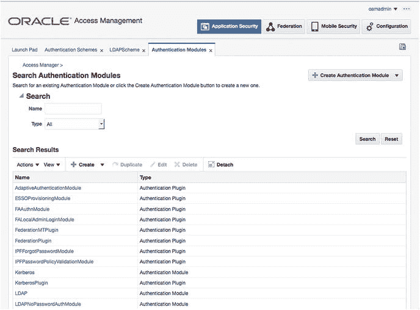
**图 9-16. 认证模块**

现在你已经知道了 LDAP 认证方案使用的认证模块的名称，返回到启动页面，并在“应用程序安全”屏幕上的“插件”下，单击“认证模块”链接。单击“搜索”以显示可用的模块，然后单击 LDAP 链接。这将调出所选模块的配置参数，如图 9-17 所示。

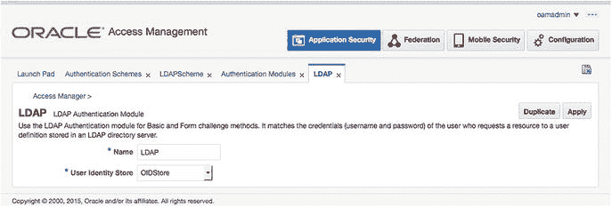
**图 9-17. LDAP 认证模块配置**

在配置屏幕上，对于“用户身份存储”，选择 `OIDStore`，即先前创建的身份存储的名称。单击“应用”以保存更改。你现在已经完成了 AOM 使用 OID 的配置，可以进入下一章配置 OIM 的下一步了。现在关闭浏览器并重新启动 OAM。重启后，请测试确保你可以使用你创建的 `oamadmin` 用户登录到 `OAMConsole`。

## 总结

本章演示了配置 OAM 所需的步骤。它包括预配置 OID 模式，以包含将 OAM 与外部 LDAP 提供程序集成所必需的容器、用户和组。尽管这些说明是针对 OID 的，但稍作修改后，类似的说明可用于大多数其他受支持的 LDAP 目录。无论是否为与 OIM 集成而配置 OAM，此步骤都是必需的。它将确保用户和权限包含在集中式 LDAP 存储中，而不依赖于嵌入式 WebLogic 存储。


# 10. Oracle 身份管理配置

Oracle 身份管理器（OIM）提供了一个管理员可用的用户界面，用于创建和管理用户账户、设置角色、配置工作流等。它还可以与 Oracle 访问管理器（OAM）集成，提供用户自助界面，允许最终用户重置遗忘的密码、管理其个人资料信息以及设置安全验证问题。这一切共同为组织构建了一个完整的身份生命周期管理环境。

第 7 章介绍了为 OIM 配置新域的步骤。那仅仅设置了在 WebLogic Server 内运行 OIM 所必需的结构，并部署了必要的组件。本章将指导您完成运行身份管理器工具所需的实际配置。

## 预配置步骤

创建新的 OIM 域后，在实际配置身份管理器服务器之前，必须完成几个步骤。首先通过升级 Oracle 平台安全服务（OPSS）模式开始预配置。

Oracle 融合中间件补丁集助手将用于升级 OPSS。您可以在目录`/home/oracle/IDMMiddleware/oracle_common/bin/psa`中找到补丁集助手的可执行文件。这将启动一个图形用户界面（GUI）来引导您完成整个过程。图 10-1 显示了补丁集助手。

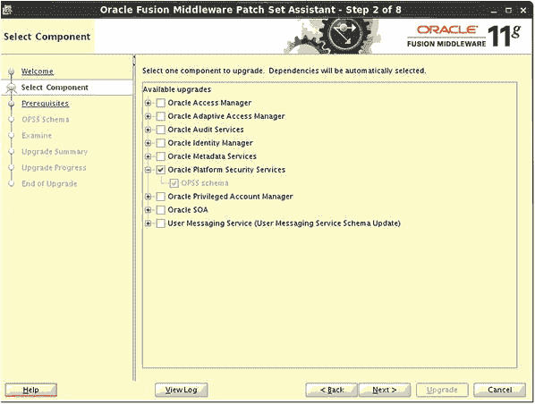

图 10-1. 启动补丁集助手

在“选择组件”屏幕上，选中 Oracle 平台安全服务复选框。

补丁集助手将要求您确认已完成数据库备份，并且所使用的数据库版本经过融合中间件认证。如图 10-2 所示。如果您尚未检查 Oracle 的认证矩阵，请立即检查。完成后，选中复选框，然后单击“下一步”。

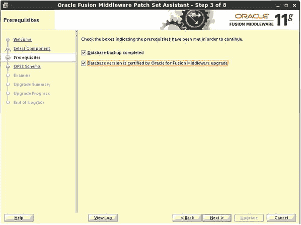

图 10-2. 检查先决条件

在 OPSS 模式屏幕上，您需要输入环境中数据库的连接详细信息。输入的字段和值如图 10-3 所示。

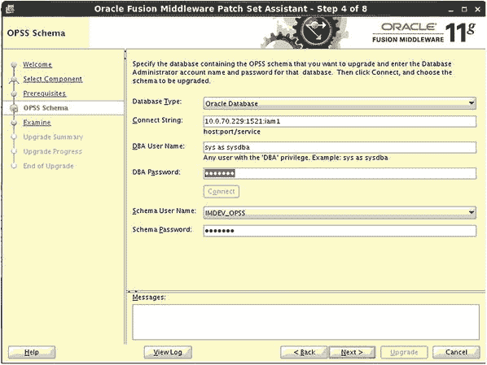

图 10-3. 连接详细信息

有关字段说明及每个字段应输入的数据，请参见表 10-1。

表 10-1. OPSS 模式升级连接详细信息

| 字段 | 值 |
| --- | --- |
| 数据库类型 | Oracle 数据库 |
| 连接字符串 | 应按以下格式输入连接字符串：主机名:端口:服务名 |
| DBA 用户名 | 此字段中输入的用户必须具有 sysdba 权限。按“sys as sysdba”格式输入 |
| DBA 密码 | 上述输入用户的密码 |
| 模式用户名 | 应为使用存储库创建实用程序（RCU）创建的 OPSS 模式名称 |
| 模式密码 | 输入在 RCU 创建期间设置的密码 |

在实际升级 OPSS 模式之前，补丁集助手将验证数据库和模式对象，以确保它们满足要求。图 10-4 显示了验证过程。需要注意的是，如果 OPSS 已处于正确版本或不满足最低要求，此屏幕将告知您该情况。

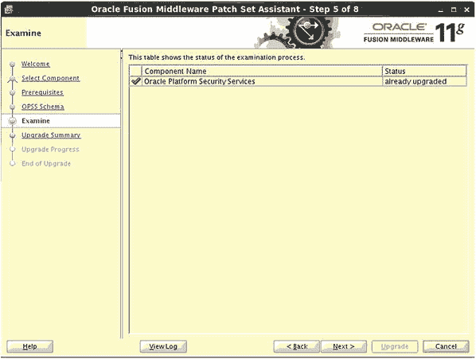

图 10-4. 检查待升级的模式

补丁集助手将检查模式并验证其升级状态，然后为您提供将要升级的环境摘要。在继续之前，请花时间查看图 10-5 所示的“升级摘要”屏幕。

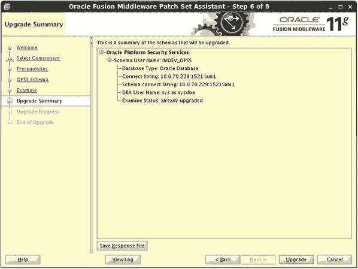

图 10-5. 确认升级组件

图 10-6 显示了补丁集助手的进度指示器。一旦显示 100%，您就可以单击“下一步”继续。

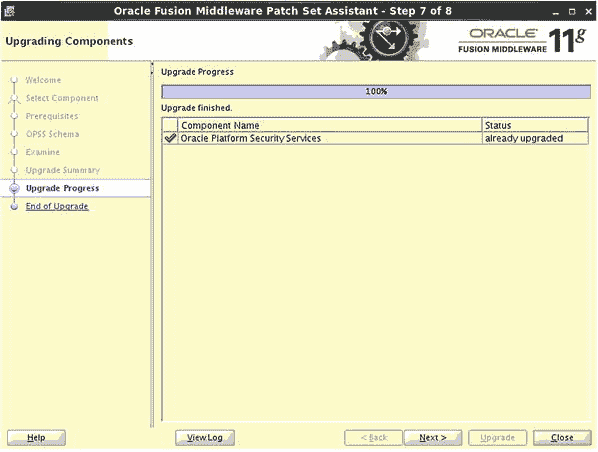

图 10-6. 升级进度

在过程结束时，您将看到“升级成功”屏幕，如图 10-7 所示。如果遇到任何错误，请先解决它们，然后再继续。

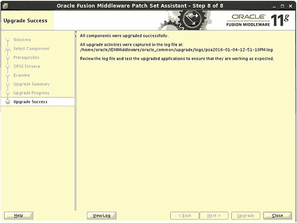

图 10-7. 升级完成

现在 OPSS 模式已成功升级，您可以继续下一步，即设置数据库安全存储。

## 配置数据库安全存储

升级 OPSS 数据库模式后，您还必须为新的 OIM 实例配置数据库安全存储。Oracle 身份和访问管理仅支持数据库安全存储。因此，以下步骤将帮助您配置此存储。

在配置 OAM 时您已执行过相同的活动。如果在共享同一数据库的单个域中同时配置 OAM 和 OIM，您将需要遵循让 OIM 加入访问管理器数据库安全存储的步骤。但是，如果您已按照本书介绍的步骤操作，那么您是在拆分域中安装了 OAM 和 OIM。存储库对象也安装在单独的数据库中。这要求您为每个产品创建单独的安全存储。

`configureSecurityStore.py`脚本位于 OIM 主目录下的`common/tools`中。要运行该脚本，您将使用 Middleware Home 目录下`oracle_common/common/tools`中的`wlst.sh`。

如前所述，如果您的 OIM 和 OAM 安装在同一个域中，并且您已经为访问管理器运行过此脚本，那么您需要使用`–m join`选项。但在本例中，您将使用`-m create`选项在 OIM 数据库存储库中创建新的安全存储。

要配置新的安全存储，请从`/home/oracle/IDMMiddleware/oracle_common/common/tools`运行以下命令。

```
./ wlst.sh /home/oracle/IDMMiddleware/Oracle_IDM1/common/tools/configureSecurityStore.py -d /home/oracle/IDMMiddleware/user_projects/idm_domain -c IAM -p Password123 -m create
```

在此命令中，您需要指定`configureSecurityStore.py`文件的位置和 OIM 域的位置。指定`IAM`作为组件以及 OPSS 模式密码。


## 为 OIM 预配置 OID 身份存储

由于计划集成 OIM 和 OAM，您必须在 OIM 服务器中启用轻量级目录访问协议（LDAP）同步。在配置过程中会有一个步骤来启用 LDAP 同步。但是，为了准备该步骤，您必须在继续之前完成这些先决条件步骤。这将确保您的 LDAP 存储（即 OID）已准备好用作 OIM 的身份存储。这些说明适用于使用 OID。Oracle 支持其他 LDAP 存储，如 Oracle Unified Directory、Oracle Virtual Directory、Active Directory 和 iPlanet/ODSEE，但这些超出了本书的范围。

继续之前，请设置环境变量如下：

```
MW_HOME=/home/oracle/OIDMiddleware
ORACLE_INSTANCE=/home/oracle/OIDMiddleware/asinst_1
ORACLE_HOME=/home/oracle/OIDMiddleware/Oracle_IDM1
```

要将 OID 预配置为 OIM 的 LDAP 身份存储，首先创建一个名为 `oidContainers.ldif` 的文件，内容如下：

```
dn: cn=oracleAccounts,dc=mycompany,dc=com
cn: oracleAccounts
objectClass: top
objectClass: orclContainer
dn: cn=Users,cn=oracleAccounts,dc=mycompany,dc=com
cn: Users
objectClass: top
objectClass: orclContainer
dn: cn=Groups,cn=oracleAccounts,dc=mycompany,dc=com
cn: Groups
objectClass: top
objectClass: orclContainer
dn: cn=Reserve,cn=orcleAccounts,dc=mycompany,dc=com
cn: Reserve
objectClass: top
objectClass: orclContainer
```

该文件包含创建 OIM 用于同步的新容器所需的信息。使用 `ldapadd` 命令在 OID 中创建这些容器。例如：

```
ldapadd –h 10.0.70.229 –p  3060 –D cn=orcladmin –w ****** –c –f oidContainers.ldif
```

在此示例中，`-h` 是 OID 服务器的主机名，`-p` 是 OID 服务器的 LDAP 端口，`-D` 是 `cn=orcladmin`，`-w` 是 `oracladmin` 密码，`-f` 是 `oidContainers.ldif` 文件的完整路径。

`ldapadd` 命令位于 OID 的 `ORACLE_HOME/bin` 目录中。

为启用 LDAP 同步创建容器后，您必须创建 Oracle Identity Manager 的 LDAP 同步过程所需的用户、组和 ACI。首先创建另一个名为 `oimAdmin.ldif` 的文件，内容如下。

```
dn: cn=systemids,dc=mycompany,dc=com
changetype: add
objectclass: orclContainer
objectclass: top
cn: systemids
dn: cn=oimAdminUser,cn=systemids,dc=mycompany,dc=com
changetype: add
objectclass: top
objectclass: person
objectclass: organizationalPerson
objectclass: inetorgperson
objectclass: orclusers
objectclass: orcluserV2
mail: oimAdminUser
givenname: oimAdminUser
sn: oimAdminUser
cn: oimAdminUser
uid: oimAdminUser
userPassword: gundam1
dn: cn=oimAdminGroup,cn=systemids,dc=mycompany,dc=com
changetype: add
objectclass: groupOfUniqueNames
objectclass: orclPrivilegeGroup
objectclass: top
cn: oimAdminGroup
description: OIM administrator role
uniquemember: cn=oimAdminUser,cn=systemids,dc=mycompany,dc=com
dn: cn=oracleAccounts,dc=mycompany,dc=com
changetype: modify
orclaci: access to entry by group="cn=oimAdminGroup,cn=systemids,dc=mycompany,dc=com" (add,browse,delete) by * (none)
orclaci: access to attr=(*) by group="cn=oimAdminGroup,cn=systemids,dc=mycompany,dc=com" (read,search,write,compare) by * (none)
dn: cn=changelog
changetype: modify
add: orclaci
orclaci: access to entry by group="cn=oimAdminGroup,cn=systemids,dc=mycompany,dc=com" (browse) by * (none)
orclaci: access to attr=(*) by group="cn=oimAdminGroup,cn=systemids,dc=mycompany,dc=com" (read,search,compare) by * (none)
```

使用此文件，您将使用同样位于 `ORACLE_HOME/bin` 目录中的 `ldapmodify` 命令将新对象导入 OID。

```
ldapmodify -h 10.0.70.229 -p 3060 -d cn=orcladmin -w gundam1 -c -v –f oidAdmin.ldif
```

通过执行以下命令验证此 `ldapmodify` 命令是否正常工作。两者都应返回无错误。

```
ldapsearch -h  -p  -D "cn=orcladmin"  -w gundam1-b "dc=mycompany,dc=com" -sone "objectclass=*" orclaci
ldapsearch -h  -p  -D  "cn=oimAdminUser,cn=systemids,dc=mycompany,dc=com" -w * -b  "cn=changelog" -s sub "changenumber>=0"
```

在此类需要集成 OAM 和 OIM 的环境中，您必须通过扩展 OAM 模式来扩展 OID 以用于 OAM 和 OIM 集成。您需要使用 `ldapmodify` 脚本导入位于 OAM 主目录中的四个文件。

将您的工作目录移动到 `/home/oracle/IAMMiddleware/Oracle_IAM1/oam/server/oim-intg/ldif/oid/schema/oim-intg/ldif/oid/schema`。有四个文件：`OID_oblix_pwd_schema_add.ldif`、`OID_oblix_schema_add.ldif`、`OID_oim_pwd_schema_add.ldif` 和 `OID_oblix_schema_index_add.ldif`。使用以下示例导入新的模式信息。

```
ldapmodify -h 10.0.70.229 -p 3060 -D cn=orcladmin -w gundam1 -f OID_oblix_pwd_schema_add.ldif
ldapmodify -h 10.0.70.229 -p 3060 -D cn=orcladmin -w gundam1 -f OID_oblix_schema_add.ldif
ldapmodify -h 10.0.70.229 -p 3060 -D cn=orcladmin -w gundam1 -f OID_oim_pwd_schema_add.ldif
ldapmodify -h 10.0.70.229 -p 3060 -D cn=orcladmin -w gundam1 -f OID_oblix_schema_index_add.ldif
```


## 配置 Oracle Identity Manager 服务器

至此，OID 已被设置为 OIM 的身份存储，您可以继续配置 Identity Manager 服务器。在之前的章节中，您已在自己的 WebLogic Middleware Home 中创建了新的 OIM 域。该步骤配置了一个管理服务器、一个面向服务的架构 (SOA) 服务器和一个身份管理服务器。本节将在此基础上继续操作，为启动 OIM 做好准备。

现在是时候启动 WebLogic 管理服务器和 SOA 服务器了。在配置 Identity Manager 之前，这些服务必须正在运行。转到身份管理域目录 `/home/oracle/IDMMiddleware/user_projects/oim_domain`。执行命令 `startWeblogic.sh`。如果您希望该命令在后台启动，可以使用 `nohup` 执行命令，例如 `nohup ./startWeblogic.sh > weblogic.out &`。这将把命令的输出重定向到文件 `weblogic.out`。为此，WLS 必须配置为以开发模式启动。如果服务器配置为以生产模式启动，那么您需要确保有一个 `boot.properties` 文件已就位。接下来启动 SOA。这可以通过在 `bin` 目录中执行 `./startManagedWebLogic.sh soa_server1` 来完成。

**注意**

要在后台启动服务器，`boot.properties` 文件必须存在于安全目录中，或者服务器必须处于开发模式。

在 `<Domain Home/servers/<ServerName>/security` 目录中，创建一个名为 `boot.properties` 的文件，格式如下：

```
username=weblogic
password=
```

现在，WebLogic 管理服务器和 SOA 服务器已经启动，您可以继续配置 Identity Manager 服务器。

导航到 `<Middleware_Home>/Oracle_IDM1/bin`，其中 `Middleware_Home` 是您安装 OIM 的目录。在本例中，它是 `/home/oracle/IDMMiddleware`。在 `bin` 目录中，执行 `config.sh`：

```
//bin/config.sh
```

**注意**

此步骤仅运行此目录下的 `config.sh` 文件。`config.sh` 可能在其他位置找到，但只有这个位置的文件会启动正确的图形用户界面。

第一步是选择在此步骤中要配置的组件。必需组件是 OIM Server。OIM 设计控制台和 OIM 远程管理器只能安装在 Microsoft Windows 上，因此您不会在此处安装它们。如果您决定以后在单独的服务器上安装这些组件，可以之后进行。请如图 10-8 所示进行选择。

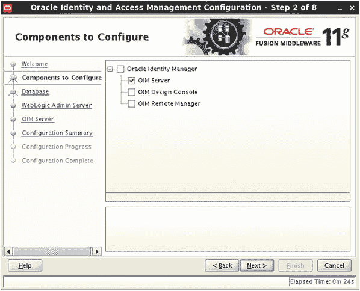
*图 10-8. 选择要配置的组件*

选择要配置的组件后，该工具将询问有关 OIM 安装的数据库信息。您在安装软件时已创建了必要的存储库数据库对象。在这里，您将指定详细信息。图 10-9 显示了数据库连接屏幕。

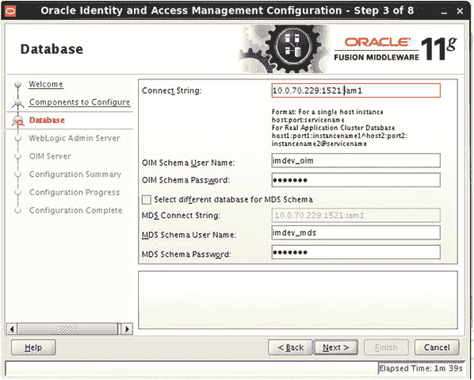
*图 10-9. 数据库信息*

连接字符串应以 `主机名:端口:SID` 的格式输入。在本例中，您有一个数据库实例。如果您使用的是 RAC 数据库，可以如下输入两个节点：`主机 1:端口 1:实例名 1^主机 2:端口 2:实例名 2@<服务名>`。

OIM 模式用户名是在本书前面 RCU 操作期间输入的模式名称。本例中，使用 `imdev_oim`。

OIM 模式密码在下一行输入。您在 RCU 操作期间提供了此密码。

MDS 连接字符串默认为与已输入的连接字符串值相同。如果您将 MDS 模式安装在其他数据库中，请选中 **为 MDS 模式选择其他数据库** 复选框，这样您就可以编辑此字段。

MDS 模式用户名应包含在 RCU 操作期间配置的用户名，本例中为 `imdev_mds`。


## OIM 配置

MDS Schema Password 应包含 `imdev_mds` 的密码。

在初始域创建步骤中，您已配置了一个用于容纳 OIM 的 WebLogic 域。您将 Administration Server 配置在端口 27001 上。请输入 Administration Server 的 URL，包括端口，如图 10-10 所示。请注意，在这种情况下，您必须使用 T3 协议以 `t3://hostname:port` 的格式输入 URL。输入 WebLogic 用户名和密码，然后单击“下一步”继续。

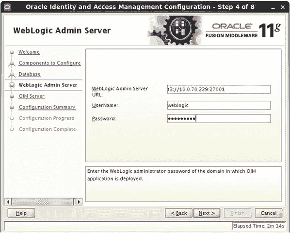

图 10-10. WLS 信息

下一步允许您配置有关新 OIM 服务器的详细信息。图 10-11 显示了收集新 OIM 管理员密码和密钥库密码的屏幕。请记录这些值，因为它们在后续过程中将是必需的。

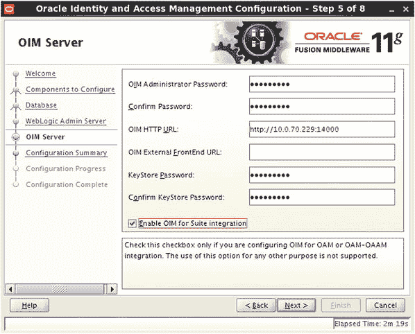

图 10-11. OIM 服务器配置

OIM Administrator Password 应设置为您能记住的值。OIM HTTP URL 是用于 Identity Manager 的 URL。如果 OIM 服务器前面有 Oracle HTTP Server (OHS)，请在此处输入其 URL。如果您尚未安装 OHS 服务器，可以稍后更新此项。输入并确认密钥库密码。

选中“Enable OIM for Suite Integration”复选框。此环境将包含 OAM 和 OIM 集成。同步是必需的。在本章前面，已经介绍了此操作的前提步骤。如果您尚未完成这些步骤，请立即返回完成，然后再继续。

在 10 个步骤中的第 6 步，系统将提示您输入 OIM 要使用的 LDAP 身份存储。图 10-12 显示了 LDAP 服务器屏幕。

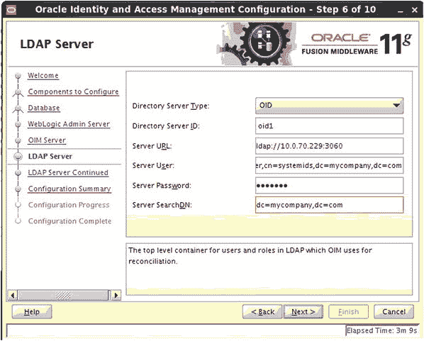

图 10-12. 目录服务器配置

在之前的步骤中，您已预先配置了此身份存储。在此示例中，您使用的是 OID。

*   选择 OID 作为 Directory Server Type。
*   输入 Directory Server ID。这应该是唯一的。
*   以 `ldap://hostname:ldapport` 的格式输入 LDAP 服务器连接信息。
*   输入 OIM 用于连接和执行操作的 Server User。这不应是 `cn=orcladmin` 用户。相反，在预配置步骤中，您创建了一个名为 `oimadminuser` 的用户。使用完整的可分辨名称输入：`cn=oimadminuser,cn=systemids,dc=mycompany,dc=com`。
*   Server Password 需要是您在预配置步骤中设置的密码。
*   输入 Server SearchDN 作为包含用户和组容器的总体容器名称。

因为您选择了启用 LDAP 同步，配置工具将提醒您完成预配置步骤，如图 10-13 所示。如果您尚未完成，请返回本章的相应部分并立即完成步骤。

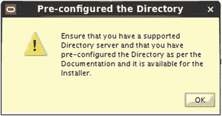

图 10-13. 先决条件检查

图 10-14 所示的“LDAP Server Continued”屏幕继续配置 LDAP 身份目录。

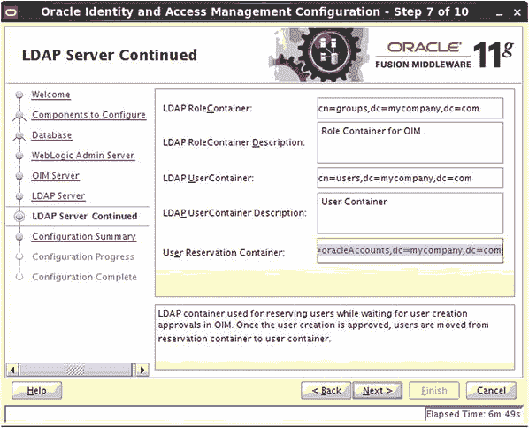

图 10-14. LDAP 服务器信息

在此屏幕上，您将输入与 OIM 将用于创建用户的用户和组容器相关的信息。

*   LDAP RoleContainer 是组容器。
*   输入描述。
*   LDAP UserContainer 是 OIM 将管理的所有用户的位置。
*   输入描述。
*   User Reservation Container 是等待批准的新创建用户的暂存区。

图 10-15 所示的“Configuration Summary”屏幕显示了已输入的配置参数的汇总。

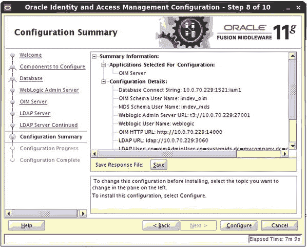

图 10-15. 配置摘要屏幕

确保列出了您选择配置的组件。这也是仔细检查您用于配置的值的机会。单击“配置”继续。

您现已完成 OIM 配置。服务器现在应配置为具有 OID 身份存储并启用 LDAP 同步。图 10-16 显示了已完成的配置。

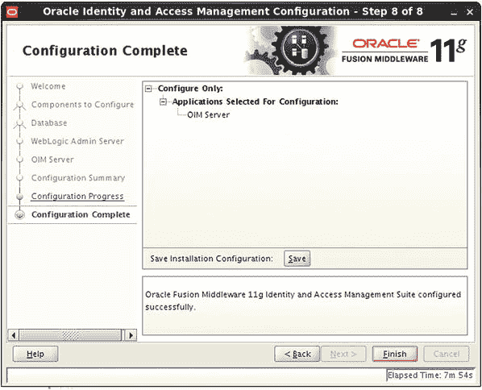

图 10-16. 配置完成屏幕

## 完成 LDAP 安装后配置

在上一节中，您完成了 OIM 配置。在该步骤中，您选择了“Enable OIM for Suite Integration”。这通知 OIM 您将使用 LDAP 同步，这对于 OAM 和 OIM 集成是必需的。在预配置期间，您运行了实用程序来为同步准备 OID。现在是运行安装后任务以使其完成的时候了。

在继续之前，请确保为 `ldapconfigpostsetup` 实用程序正确设置了环境变量。必须按如下方式设置：

*   `APP_SERVER=weblogic`
*   `JAVA_HOME=/home/oracle/java/jdk1.6.0_45 MW_HOME=/home/oracle/IDMMiddleware`
*   `OIM_ORACLE_HOME=/home/oracle/IDMMiddleware/Oracle_IDM1`
*   `WL_HOME=/home/oracle/IDMMiddleware/wlserver_10.3`
*   `DOMAIN_HOME=/home/oracle/IDMMiddleware/user_projects/domains/idm_domain`

在目录 `/home/oracle/IDMMiddleware/Oracle_IDM1/server/ldap_config_util` 中，您将找到一个名为 `ldapconfig.props` 的文件。备份此文件并按如下所示进行编辑：

```
