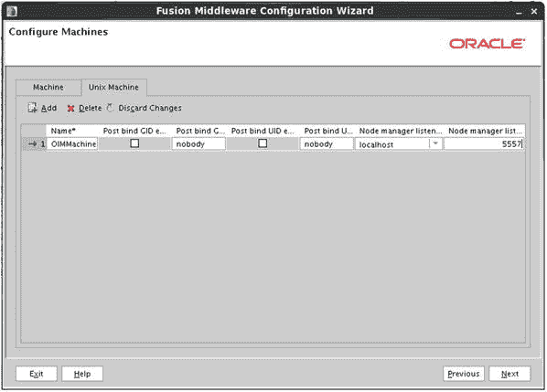
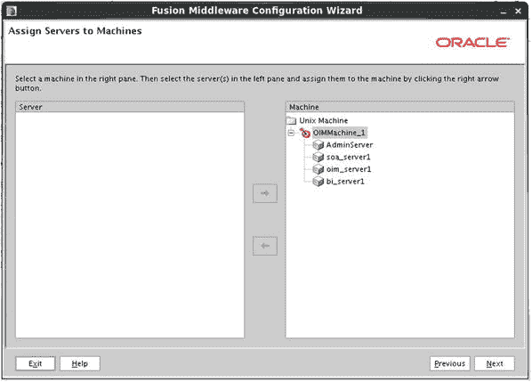
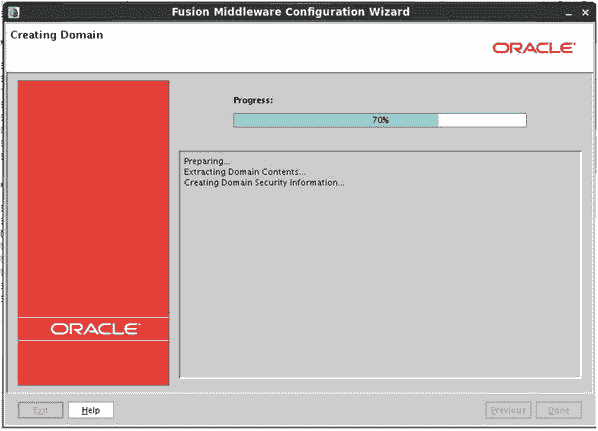

# 8. Oracle HTTP Server 与 WebGate 的安装和配置

至此，提供与 Oracle 产品和应用程序单点登录 (SSO) 所需的所有 Oracle Identity and Access Management Suite 组件都已就绪。Identity Manager 的加入提供了管理 Oracle Internet Directory (OID) 轻量目录访问协议 (LDAP) 用户存储中用户的能力。Oracle HTTP Server (OHS) 和 Oracle Access Manager (OAM) WebGate 代表了 Oracle 应用程序和产品的 Web 服务器前端。从核心上讲，OHS 是一个带有 Oracle WebLogic 模块的 Apache Web 服务器。结合 OAM WebGate 软件，OHS 成为了一个中心位置，负责处理传入请求、检查认证，并在 OAM 执行其操作后，允许经过认证的用户访问所需资源。本章涵盖 Oracle HTTP Server 和 OAM Webgate 的安装与部署。

### 安装前任务

#### 操作系统用户

对于大多数 Oracle 应用程序安装，应创建操作系统 (OS) 用户和组来执行安装和配置任务。创建 OS 组将允许其他 OS 用户执行与管理应用程序环境相关的特定任务。在 Linux 环境中安装 Oracle 应用程序时，最常见的 OS 用户和组是 `oracle` 用户以及 `oinstall` 或 `dba` 组。

要创建必要的 `oinstall` 和 `dba` 组，请以 root 用户身份执行以下命令：

```
[root@clouddemolab home]# groupadd oinstall
[root@clouddemolab home]# groupadd osdba
```

组创建完成后，创建 `oracle` 用户：

```
[root@clouddemolab home]# useradd  -g oinstall -G osdba oracle
```

注意

-g 表示用户应添加到的主组。-G 表示任何次要组。

要设置用户密码，请以 root 用户身份使用以下命令。

```
[root@clouddemolab home]# passwd oracle
```

#### 操作系统配置

在安装 Oracle Fusion Middleware 基础设施和 Oracle Identity Management 软件之前，确保操作系统满足最低要求和配置非常重要。以下列出了所需的内核参数、软件包以及文件更改。

需要设置以下内核参数：

```
kernel.sem  256  32000  100  143
kernel.shmmax 10737418240
```

要设置这些参数，请编辑位于 `/etc` 目录下的 `sysctl.conf` 文件。

```
[root@clouddemolab home]# vi /etc/sysctl.conf
```

在该文件的此部分中添加或编辑以下行：

```
# Controls the maximum number of shared memory segments, in pages
kernel.shmall = 4294967296
kernel.sem = 256 32000 100 142
kernel.shmmax = 10737418240
```

在 `sysctl.conf` 文件中设置这些值后，必须激活并使用以下命令验证新值是否显示：

```
[root@clouddemolab home]# /sbin/sysctl –p
net.ipv4.ip_forward = 0
net.ipv4.conf.default.rp_filter = 1
net.ipv4.conf.default.accept_source_route = 0
kernel.sysrq = 0
kernel.core_uses_pid = 1
net.ipv4.tcp_syncookies = 1
net.bridge.bridge-nf-call-ip6tables = 0
net.bridge.bridge-nf-call-iptables = 0
net.bridge.bridge-nf-call-arptables = 0
kernel.msgmnb = 65536
kernel.msgmax = 65536
kernel.shmmax = 68719476736
kernel.shmall = 4294967296
kernel.sem = 256 32000 100 142
kernel.shmmax = 10737418240
```

必须将打开文件限制设置为 4096 以支持该实例。为此，请编辑 `limits.conf` 文件。

```
[root@clouddemolab home]# vi /etc/security/limits.conf
```

如果环境要安装在 Oracle Linux 或 RedHat Linux 上，还必须在 `/etc/security/limits.d/90-nproc.conf` 中进行编辑。如果遗漏了这一点，此文件中的值可能会覆盖 `limits.conf` 文件中的值。

在这两个文件中，确保添加或编辑了以下行：

```
* soft nofile 4096
* hard nofile 65536
* soft nproc 2047
* hard nproc 16384
```

编辑此文件后，必须重新启动服务器以确保所有更改生效。

如前一章所述，机器提供 WebLogic 管理服务器与服务器进程通信所需的状态和生命周期事件信息。对于任何基于 UNIX 的操作系统，使用 `Unix Machine` 类型至关重要。这确保了在管理服务器执行操作时，任何必要的环境设置都能得到正确配置。集群可以包含一台或多台机器，而机器可以包含一个或多个受管服务器。图 7-31 展示了一个新的 Unix Machine。



图 7-31.

配置机器屏幕

将受管服务器分配给上一步创建的机器。在图 7-32 中，您将看到所有新的受管服务器都已分配给在上一步中创建的单个 `Unix_Machine`。您可以选择创建多台机器，并将不同的组件分配给不同的机器。如果您有多个集群成员，每台机器可以驻留在单独的集群中。



图 7-32.

将服务器分配给机器屏幕

将受管服务器分配给机器后，您将看到一个汇总，显示您输入的所有信息。此配置摘要屏幕（如图 7-33 所示）提供了您即将启动的配置的最后检视机会。请查看此摘要以确保文件位置、名称和配置参数看起来正确。单击“创建”以开始创建新的 WebLogic 域。


图 7-33.

配置摘要屏幕

在域创建过程中，会创建许多文件并启动各种进程。可以在配置向导的“创建域”屏幕上查看此过程的进度，如图 7-34 所示。将显示一个配置日志。请让此过程不间断运行直至完成。如果出现任何错误，请检查指示的日志。



图 7-34.

配置进度

域配置完成后，单击“完成”退出工具。如果您一直按照流程操作至此，您将已安装 OID、OAM 和 OIM。每个组件都驻留在自己的 WebLogic 域中，并由自己的 WebLogic 服务器控制。这有助于简化管理流程，并便于未来的升级和打补丁。还应注意，在某些情况下，您的网络基础架构可能要求将组件分隔在不同的网络区域中。请参阅本书的架构章节以获取更多信息。

## 总结

本章旨在介绍在新的 WebLogic 域中安装 OIM 所需的步骤。如果从头开始操作，您已经了解了为元数据存储库创建必要数据库对象的步骤。本章还介绍了 OIM 和必需的 Oracle SOA 安装的实际软件安装以及新 WebLogic 域的创建。后续章节将介绍 OIM 组件的配置以及它们之间的集成。


#### 操作系统软件包

每个 Oracle 应用程序都有自己所需的一组软件包。根据您使用的 Linux 版本，安装过程可能有所不同。在下面的列表中，请注意，在 64 位操作系统上，一些软件包需要同时安装 32 位和 64 位版本。如果这些软件包没有安装，安装将无法正常完成。Oracle 安装程序将检查这些并在安装过程中显示错误。

```
binutils-2.20.51.0.2-5.28.el6
compat-libcap1-1.10-1
compat-libstdc++-33-3.2.3-69.el6 for x86_64
compat-libstdc++-33-3.2.3-69.el6 for i686
gcc-4.4.4-13.el6 gcc-c++-4.4.4-13.el6
glibc-2.12-1.7.el6 for x86_64
glibc-2.12-1.7.el6 for i686
glibc-devel-2.12-1.7.el6 for i686
libaio-0.3.107-10.el6
libaio-devel-0.3.107-10.el6
libgcc-4.4.4-13.el6
libstdc++-4.4.4-13.el6 for x86_64
libstdc++-4.4.4-13.el6 for i686
libstdc++-devel-4.4.4-13.el6
libXext for i686
libXtst for i686
libXext for x86_64
libXtst for x86_64
openmotif-2.2.3 for x86_64
openmotif22-2.2.3 for x86_64
redhat-lsb-core-4.0-7.el6 for x86_64
sysstat-9.0.4-11.el6
xorg-x11-utils*
xorg-x11-apps*
xorg-x11-xinit*
xorg-x11-server-Xorg*
xterm
pdksh-5.2.14
```

此时，操作系统应已完全准备好，可以继续安装。在安装软件之前执行这些操作将确保安装过程顺利进行。在许多情况下，如果遗漏了任何内容，安装程序将提供详细的消息。如果在安装过程中出现错误，请停止安装并在继续之前修复任何问题。

## Oracle HTTP Server 软件安装与配置

OHS 软件的安装和配置非常简单。安装程序会引导您完成安装，并在过程结束时配置服务器。因此，安装结束后，您应该能够通过导航到指定的主机名和端口来测试服务器。

与 Identity Management 安装软件非常相似，它通过运行命令从软件位置启动。图`8-1`显示了 Web Tier 安装程序的欢迎页面。


图 8-1.

启动 Universal Installer

```
runInstaller -jreLoc /home/oracle/jdk1.6.0_45/jre
```

在此阶段，请确保您计划安装的 OHS 版本显示在欢迎屏幕上。每个 OHS 版本都有自己的安装程序。在安装 OHS 之前，您应该检查 Oracle 认证矩阵，以确保 OAM WebGate 版本兼容。

OHS 是一个可以使用`Install and Configure option`的组件，如图`8-2`所示。这是执行此操作的最简单方法，因为它不需要运行其他工具或在以后修改配置文件。


图 8-2.

安装和配置设置

在本章开头，列出了操作系统先决条件。如果显示任何错误或警告，请在继续之前更正它们。安装程序将检查操作系统，并通知您任何缺失的先决条件，如图`8-3`所示。


图 8-3.

先决条件检查屏幕

OHS 可以安装在现有的 WebLogic 主目录中，也可以放置在新目录中。如果您计划在域中注册此 OHS 实例，则必须在该域的`Middleware Home directory`中安装软件。但是，将 OHS 安装在自己的目录中，并且不向域注册是完全可以接受的。虽然您可能会失去一些监控和管理能力，但大多数操作都可以通过命令行执行。如图`8-4`所示，输入为 Web Tier 指定的新`Middleware Home`的位置。


图 8-4.

Middleware Home 位置

至少，您应该安装 Oracle HTTP Server 组件，如图`8-5`所示。如果您的环境需要`Web Cache`，请选择它。此处选中`Oracle Web Cache`复选框仅是为了显示配置屏幕。Web Cache 超出了本书的范围。因为此 OHS 实例独立于 WebLogic 域，所以`Associate Selected Components with WebLogic Domain`复选框未被选中。


图 8-5.

配置组件屏幕

在`Specify Component Details`屏幕上，您有机会为每个组件指定实例主目录和名称。确保将其设置为您能记住的内容。图`8-6`显示了`Specify Component Details`屏幕的示例。


图 8-6.

指定组件详细信息屏幕

如果配置`Web Cache`，则必须为管理员用户提供密码。在对 Web Cache 进行配置更改时，此用户是必需的。提供所需的信息，如图`8-7`所示。


图 8-7.

Web Cache 管理员密码屏幕

