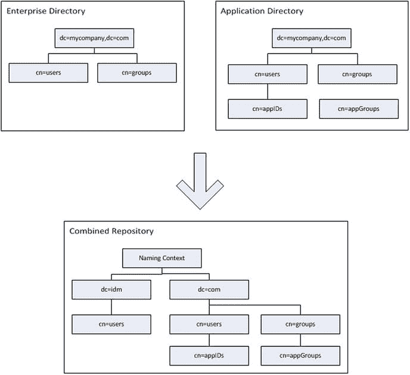
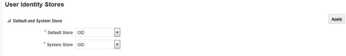
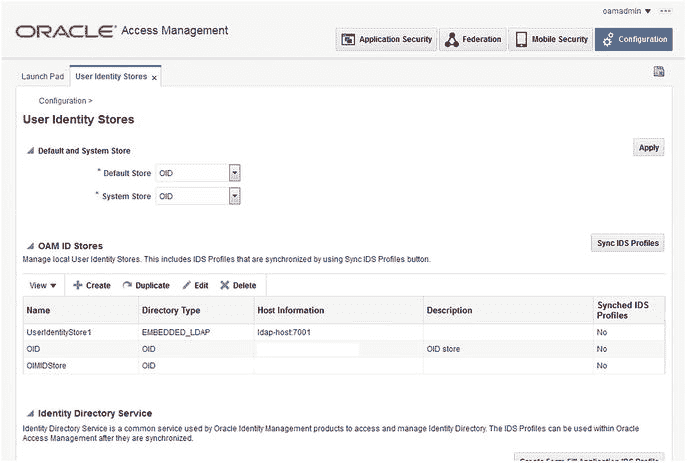

# Oracle 身份管理与身份存储

许多组织拥有多个身份存储，以支持不同的业务单元和流程。这些身份存储可能以`轻量目录访问协议 (LDAP)`兼容的目录、数据库表或其他格式存在。在许多情况下，`Oracle 身份管理器 (OIM)` 可以借助`Oracle 虚拟目录 (OVD)` 来管理这些不同的目录格式。尽管本书主要关注使用`Oracle 互联网目录 (OID)`作为主要身份存储并通过 LDAP 同步，但在环境需要时，考虑将此配置作为一种可能的解决方案是很重要的。您可能还会发现，配置 LDAP 同步从一开始就使用`OVD`，并为多数据存储环境做好准备，是很有用的。

大多数大型公司都在各种用户身份存储上有投入。他们可能使用`Microsoft Active Directory`作为其网络 LDAP 用户账户，同时使用其他用户目录服务于各种应用程序。`OID`或`Oracle 统一目录 (OUD)`可能已就位，为诸如`Oracle 电子商务套件`或`OBIEE`等应用程序提供支持。其他业务单元可能采用基于文件或`OpenLDAP`的身份存储来支持其他应用程序，例如内部开发的定制工具。这往往导致的结果是，单个用户拥有许多账户和密码。这不仅对用户是个问题，而且从安全角度来看，这可能导致无人知晓的孤立账户，甚至是恶意账户。

### 用例

`OIM`提供了解决方案来帮助防止这些情况的发生。任何 LDAP 兼容的应用程序都可以通过标准 LDAP 认证调用使用`IOD`，并且许多第三方应用程序能够利用`Oracle 访问管理器 (OAM)`所使用的`安全断言标记语言 (SAML)`断言协议。这仅涵盖了企业工具的认证和授权方面。管理这些多个身份存储可能具有挑战性，因为大多数存储都有专有的管理工具，无法管理其他品牌或类型的目录。

过去，`OID`提供了与其他 LDAP 目录（如`Active Directory`、`ODSEE`、`OpenLDAP`等）同步的能力。虽然这是一个有用的工具，可为用户提供来自多个存储的应用程序访问，但它并未解决用户账户的管理问题。

`OVD`通过将多个不同的目录呈现为单一来源，提高了身份存储管理的整合级别。这不仅对于为所有现有应用程序提供单一 LDAP 接口非常有用，而且可以通过充当`OIM`处理账户治理的单一来源来发挥作用。

如前所述，`OIM`是一种身份治理工具。因此，它提供了管理用户从入职、新权限授予到离职的全生命周期支持的能力。`OVD`和`OIM`组合最常见的用途之一可能是将`OID`用户和`Microsoft Active Directory`用户合并到单一来源进行管理。当正确呈现给`OIM`时，这两个来源都可以被管理，确保无论用户账户如何创建，其处理方式都是一致的。

## 拓扑结构

使用`OVD`向`OIM`环境呈现身份存储时，主要的两种部署类型是`分割配置文件`和`不同的用户群体`。当用户账户信息存储在一个位置，而相应的应用程序用户信息存储在其他位置时，分割配置文件可能很有用。在这种情况下，网络身份目录可能是`Active Directory`，而特定于应用程序的账户信息可能存在于`OID`或`OUD`中，甚至存在于另一个 LDAP 目录中。另一种部署拓扑涉及拥有多组不同的用户和组群体。这在外部用户存储在应用程序身份存储中而内部员工用户在`Active Directory`中管理的环境中很常见。在这种常见配置中，这两组用户必须通过单一界面进行管理。

### 分割配置文件

如果公司拥有单一用户群体，但身份数据分散在多个身份存储中，他们可能会选择实施分割配置文件配置。如果员工用户账户存储在网络 LDAP 目录中，并且一个或多个应用程序使用自己的存储进行账户访问，就可能出现这种情况。例如，`Active Directory`用于网络资源访问，而`OID`用于访问`Oracle 电子商务套件 (EBS)`。虽然扩展`Active Directory`模式以包含`EBS`数据是可能的，但这并非对所有组织都是最佳方法。`OID`被视为包含必要属性的次要或影子身份存储。`OVD`仅仅服务于整合用户属性以供`OIM`处理。然而，在这种情况下，来自`Active Directory`和`OID`的用户群体是相同的。

在分割配置文件环境中，每个用户存储库承担着不同的角色。`Active Directory`或另一个企业目录负责存储企业用户账户和组，而`OID`管理应用程序用户账户和组。在这种情况下，`OID`被认为是一个“影子”存储库。应用程序角色和成员资格由`OID`处理并由`OIM`管理。`Active Directory`处理企业级或网络用户。应该注意的是，在这种配置中，`OIM`可用于管理应用程序级别的安全，但它将无法管理企业级别的账户。

在考虑为您的环境实施分割配置文件时，应满足以下先决条件。

*   `OID`应配置为`Oracle 融合中间件`产品和应用程序的身份存储。换句话说，访问应用程序所需的用户、组和权限必须存储在`OID`存储中。这将成为影子目录。
*   `OID`应关闭“参照完整性”。这将确保在`OID`中创建的组可以包含不在同一目录中的成员。组中包含的用户可能是企业身份存储的一部分。
*   登录名和账户在所有身份存储中必须是唯一的，无论存储数量多少。
*   `Active Directory`或企业身份存储应包含用户信息，但不包含应用程序属性。

图 12-1 展示了企业存储库和应用程序身份存储如何组合，为身份管理套件提供用户和组权限的单一视图。这种组合提供了来自企业目录的认证凭据和来自应用程序目录的授权上下文。



图 12-1.
分割域目录结构


### 区分用户与群体

越来越多的组织既有面向公众的资源，也有仅供员工访问的私有内容。在这种情况下，要将所有用户（包括外部和内部用户）都纳入公司的网络 `LDAP` 目录并不总是可行。大多数企业部署要求将这两类用户分开存储，而不是放在提供网络访问的系统中。虽然可能涉及其他 `LDAP` 目录，但一个常见的例子是将外部用户存储在 `OID` 中，而内部用户在 `Active Directory` 中创建和维护。这是一种非常常见的架构，但应用程序安全可能仍然要求所有用户存储在一个通用的目录中，以便存储应用层级的属性。

`OIM` 为这种架构提供了几种不同的解决方案。使用 `OVD` 可以让多个用户身份存储呈现为一个单一存储供应用程序和服务管理，而目录集成平台 (`DIP`) 则可以将多个 `LDAP` 存储库同步到一个 `OID` 实例中。

在决定于 `OIM` 环境中的特定用户群体内部实施多个目录时，应考虑几点。首先，用户群体存在于多个目录中，意味着环境可能将一组外部用户存储在 `OID` 中，而企业用户存储在 `Active Directory` 中。

### 身份存储与 Oracle 访问管理器

`OAM` 需要一个身份存储来处理身份验证请求。为此应使用符合 `LDAP` 标准的身份存储。虽然 `OAM` 可以配置使用多种不同的目录，包括 `Active Directory` 和 `WebLogic` 内置的 `LDAP`，但建议使用 `OID`、`OVD` 或 `OUD`。这将确保在 Oracle 单点登录 (`SSO`) 环境中最常用的应用程序之间获得最大的兼容性。

配置 `OAM` 时，应首先在 `WebLogic 管理控制台`中配置安全领域。执行此步骤将确保您能够使用指定为管理员的任何用户登录来登录 `WebLogic 管理控制台` 以及随后的 `OAM 管理控制台`。这对于防止共享管理账户以及丢失或遗忘 `WebLogic` 用户密码特别有帮助。

第 9 章介绍了在 `WebLogic` 安全领域内将 `OID` 设置为 `OAM` 身份提供者的步骤。在那里，您被指导如何在 `OAM` 中创建单个数据存储。需要注意的是，访问管理器支持多个身份存储。请记住，只有一个存储可以用作默认存储或系统存储。

**注意**
设置 `系统存储` 时，您必须指定用户和/或组来授予管理权限。应用更改时，系统将提示您输入属于这些组的用户的用户名和密码。您还必须将 `LDAP 身份验证模块` 设置为使用 `默认存储`。未能这样做可能会将管理员用户锁定在 `管理控制台`之外。

在 `OAM` 身份存储配置中，`默认存储` 在身份验证请求期间被用作用户信息的搜索位置。它也用于 `身份联合` 和 `安全令牌服务`。配置 `OAM 联合伙伴应用程序` 时，可以指定身份存储。如果在 `OAM` 中配置了多个存储，管理员可以选择合适的存储。如果一个伙伴应用程序仅由企业内一小部分人使用，并且它使用自己的 `LDAP` 存储库，这可能会很有用。如果在此配置期间未指定身份存储，`OAM` 将使用 `默认存储` 进行身份验证。

`系统存储` 在用户尝试登录管理工具时被使用。此存储必须包含所有被指定为管理员的用户。设置时，您应指定与在 `OAM WebLogic 安全领域` 中用作身份提供者相同的 `LDAP` 存储。这样做将确保管理员用户能够以其适当的权限登录，并且管理组和角色能够得到正确利用。图 12-2 显示了设置 `系统` 和 `默认` 身份存储的功能。


图 12-2. 默认和系统身份存储

**注意**
如果错误地设置了 `系统存储` 或 `默认存储`，并将管理员用户锁定在 `管理控制台`之外，您可以使用 `wlst` 撤销更改：

```bash
Run $ORACLE_HOME/common/bin/wlst.sh
```

```python
wls:/offline> connect("t3://:", "weblogic", "")
wls:/base_domain/serverConfig> displayUserIdentityStore('UserIdentityStore1')
wls:/base_domain/serverConfig> editUserIdentityStore(name="UserIdentityStore1",isPrimary="true",isSystem="true")
```

当 `OAM` 与 `OIM` 集成时，应注意会在 `OIM` 中创建一个共享的身份存储。这将与配置为与 `OIM` 同步的 `LDAP` 存储库一致。在许多情况下，这将是 `访问管理器` 环境中使用的合适的身份存储。然而，在某些环境中，可能需要为不同的联合应用程序或身份验证模块使用不同的存储。图 12-3 展示了一个 `OAM` 环境的示例，其中有多个可用的身份存储。您会注意到有一个 `Embedded_LDAP`，其配置与 `WebLogic` 安全领域中使用的存储信息相同。所示的 `OID 身份存储` 是一个整体的 `OID` 配置。在此示例中，`基础 DN` 被配置为 `OID` 目录的顶级容器。如前所述，`OIMIDStore` 是在 `OIM` 和 `OAM` 集成期间创建的。在许多情况下，这可能是整个 `LDAP` 存储或用户的一个子集。


图 12-3. Oracle 访问管理器身份存储

## 总结

`OIM` 和 `OAM` 应用程序套件可以配置为使用各种身份存储组合。虽然环境可以使用 `OVD` 来呈现一个管理多个不同存储的单一接口，但使用目录同步配置文件可以利用更简单的配置。此外，多个存储的存在可以根据集成到 `SSO` 环境中的应用程序来提供身份验证服务。本章描述了其中的一些可能性。

