# Fusion role-sod

SetHandler weblogic-handler
WebLogicHost 10.0.70.229
WeblogicPort 14000
WLLogFile "${ORACLE_INSTANCE}/diagnostics/logs/mod_wl/oim_component.log"

SetHandler weblogic-handler
WLCookieName oimjsessionid
WeblogicHost 10.0.70.229
WeblogicPort 14000
WLLogFile "${ORACLE_INSTANCE}/diagnostics/logs/mod_wl/oim_component.log"

SetHandler weblogic-handler
WeblogicHost 10.0.70.229
WeblogicPort 14100

SetHandler weblogic-handler
WeblogicHost 10.0.70.229
WeblogicPort 14100
```

更新此文件后，停止并重新启动 OHS 以使更改生效。下一步将是向 OAM 身份验证策略中添加 OIM 特定的资源。

您将使用 OAM 管理控制台来添加 OIM 特定的身份验证策略。

在浏览器中导航到 `http://<oam-hostname>:<OAMWLSAdminPort>/oamconsole` 登录到 OAM 管理控制台。使用 `OAMAdmin` 用户名和您之前设置的密码。访问管理登陆页面如图 11-1 所示。

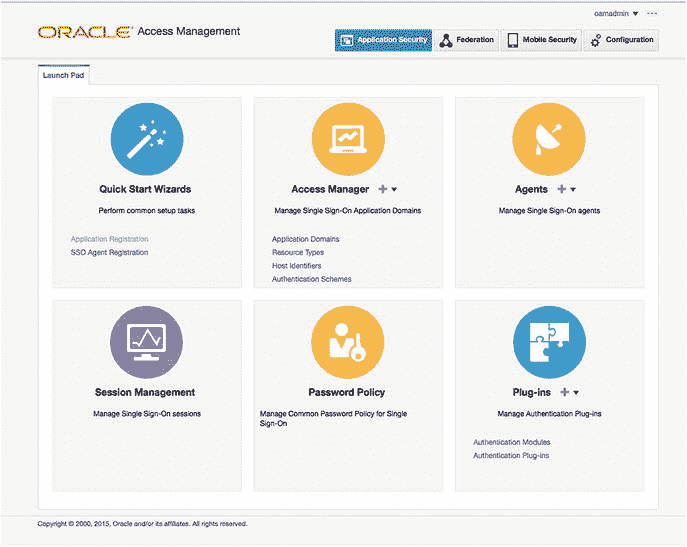

图 11-1. Oracle Access Manager 管理控制台

注意：`<OAMWLSAdminPort>` 应设置为 WebLogic 管理服务器的端口号。即使 OAM 托管服务器未运行，您也可以访问 OAM 管理控制台。

在此屏幕上，在“访问管理器”下，单击“应用程序域”链接。图 11-2 所示的 OAM 应用程序域选项卡显示了开箱即用的现有域。请注意，系统已为您创建了 IAM Suite 和 Webgate。

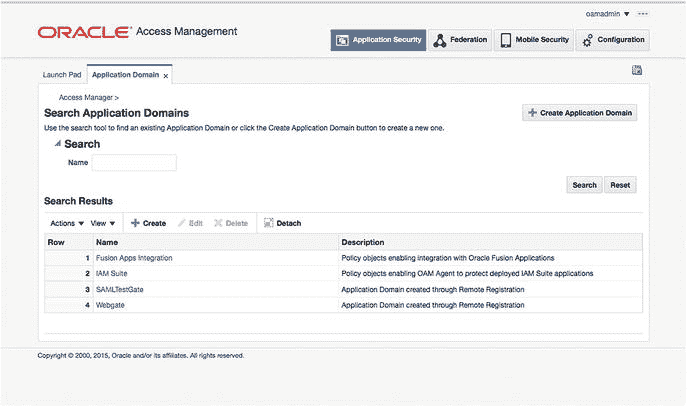

图 11-2. 搜索应用程序域屏幕

在“搜索应用程序域”屏幕上，单击“搜索”以显示创建的域列表。您应该会看到在第 8 章中创建的原始域，以及本章前面使用 `idmConfigTool` 创建的 IAM Suite 域。单击 IAM Suite 域进行编辑。有关 IAM Suite 域编辑屏幕，请参见图 11-3。

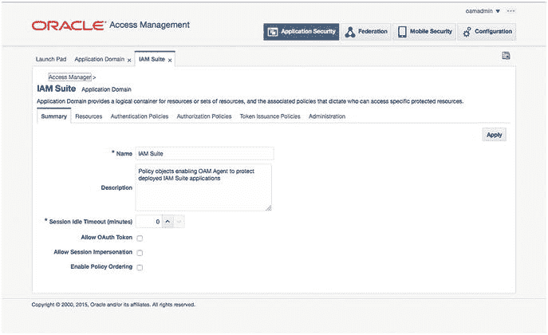

图 11-3. IAM Suite 域摘要

在第一页，您将看到有关 IAM Suite 域的摘要详细信息，如图 11-4 所示。单击“资源”选项卡以显示此域中的所有受保护资源。

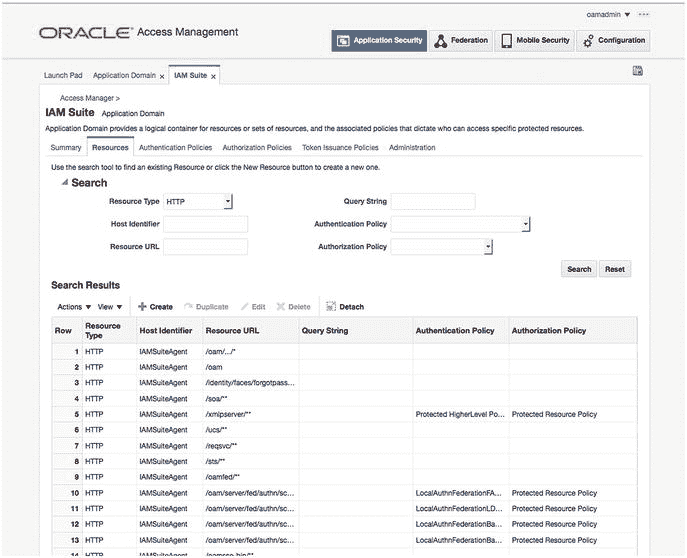

图 11-4. IAM Suite 域资源

进入“资源”选项卡后，单击“搜索”以显示所有资源 URL 和配置。滚动直到找到 `/identity/**` 资源。单击它以编辑该资源。这将打开如图 11-5 所示的编辑资源屏幕。

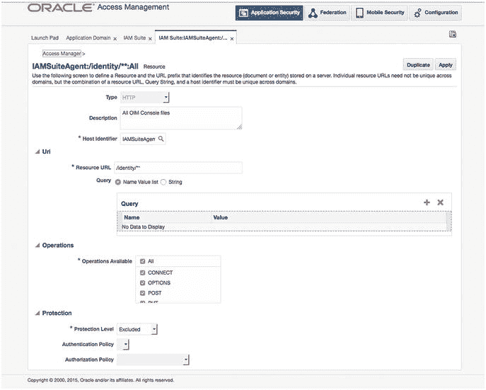

图 11-5. 编辑资源屏幕

在编辑资源屏幕上，将“保护级别”设置为“已排除”。确保“身份验证策略”和“授权策略”字段为空。单击“应用”。

在此页面上，单击“复制”以创建新资源。将“资源 URL”设置为 `/provisioning-callback/**`。单击“应用”以保存更改。

您现在已将 OIM URL 设置为 OAM 环境中的资源。

## 总结

安装 OIM 和 OAM 的软件组件后，需要为集成配置每个层。在此过程的这一点上，您应该拥有一个允许您使用 OIM 实用程序创建用户的环境。使用新创建的用户，您可以登录，并会立即提示您更改密码并设置验证问题。设置完此基本配置文件后，应直接将用户带到最初请求的资源。在下一章中，将演示流程流以及测试集成的过程。


# 12. Oracle 身份管理与身份存储库

许多组织拥有多个身份存储库以支持不同的业务单元和流程。这些身份存储库可能是轻量级目录访问协议（`LDAP`）兼容的目录、数据库表或其他格式。在许多情况下，可以使用`Oracle 身份管理器`（`OIM`）通过`Oracle 虚拟目录`（`OVD`）来管理这些不同的目录格式。尽管本书侧重于使用`LDAP`同步将`Oracle Internet Directory`（`OID`）作为主要身份存储库，但在环境需要时，考虑将此配置作为一种可能的解决方案非常重要。您可能还会发现，配置`LDAP`同步以从`OVD`开始，并为多数据存储环境做准备，是很有用的。

大多数大型公司在各种用户身份存储库上都有投入。他们可能使用`Microsoft Active Directory`作为其网络`LDAP`用户账户，并可能使用其他用户目录用于各种应用程序。可能已经部署了`OID`或`Oracle 统一目录`（`OUD`），为`Oracle 电子商务套件`或`OBIEE`等应用程序提供支持。其他业务单元可能采用基于文件或基于`OpenLDAP`的身份存储库来支持其他应用程序，如自定义的内部实用程序。这往往导致单个用户拥有许多账户和密码。这不仅对用户是个问题，而且从安全角度来看，这可能导致孤立账户，甚至无人知晓的恶意账户。

## 用例

`OIM`提供解决方案以帮助防止这些情况发生。任何兼容`LDAP`的应用程序都可以使用标准的`LDAP`认证调用来使用`IOD`，许多第三方应用程序能够利用`Oracle 访问管理器`（`OAM`）使用的`安全断言标记语言`（`SAML`）断言协议。这仅涵盖了企业工具的认证和授权方面。管理这些多个身份存储库可能具有挑战性，因为大多数存储库都有专有的管理工具，无法管理其他品牌或类型的目录。

过去，`OID`提供了与其他`LDAP`目录（如`Active Directory`、`ODSEE`、`OpenLDAP`等）同步的能力。虽然这是为用户提供来自多个存储库的应用程序访问的有用工具，但它并未解决用户账户的管理问题。

`VD`通过将多个不同的目录呈现为单一来源，提高了身份存储库管理的整合水平。这不仅对于为所有现有应用程序提供单一`LDAP`接口很有用，而且通过充当`OIM`处理账户治理的单一来源也颇有裨益。

如前所述，`OIM`是一种身份治理工具。因此，它提供了管理用户生命周期支持的能力，从入职到新权限再到离职。`OVD`和`OIM`组合最常见的用途之一可能是将`OID`用户和`Microsoft Active Directory`用户合并到一个管理源中的实例。当正确呈现给`OIM`时，这两个源都可以被管理，确保无论用户账户如何创建，都能得到一致的处理。

## 拓扑结构

在使用`OVD`向`OIM`环境呈现身份存储库时，分割配置文件和独立用户群是两种主要的部署类型。当用户账户信息存储在一个位置，而相应的应用程序用户信息存储在其他位置时，分割配置文件可能很有用。在这种情况下，网络身份目录可能是`Active Directory`，而特定于应用程序的账户信息可能存在于`OID`或`OUD`中，甚至是另一个`LDAP`目录中。另一种部署拓扑涉及拥有多个独立的用户和组群。这在外部用户存储在应用程序身份存储库中而内部员工用户在`Active Directory`中管理的环境中很常见。在这种常见配置中，两组用户必须通过单一接口进行管理。

### 分割配置文件

如果公司拥有单一用户群但身份数据分布在多个身份存储库之间，则可能会选择实施分割配置文件配置。如果员工用户账户存储在网络`LDAP`目录中，而一个或多个应用程序使用自己的存储库进行账户访问，就可能发生这种情况。例如，`Active Directory`用于网络资源访问，`OID`用于访问`Oracle 电子商务套件`（`EBS`）。尽管扩展`Active Directory`模式以包含`EBS`数据可能是可行的，但这并非对所有组织都是最佳方法。`OID`被视为包含必要属性的辅助或影子身份存储库。`OVD`仅用于整合用户属性以供`OIM`处理。然而，在这种情况下，来自`Active Directory`和`OID`的用户群是相同的。

在分割配置文件环境中，每个用户存储库都扮演着独特的角色。`Active Directory`或另一个企业目录负责存储企业用户账户和组，而`OID`管理应用程序用户账户和组。在这种情况下，`OID`被认为是一个“影子”存储库。应用程序角色和成员资格由`OID`处理，并由`OIM`管理。`Active Directory`处理企业或网络用户。值得注意的是，在此配置中，`OIM`可用于管理应用程序级别的安全性，但无法管理企业级别的账户。

在考虑为您的环境实施分割配置文件时，应满足以下先决条件。

*   `OID`应配置为`Oracle 融合中间件`产品和应用程序的身份存储库。换句话说，访问应用程序所需的用户、组和权限必须存储在`OID`存储库中。这将成为影子目录。
*   `OID`应关闭“参照完整性”。这将确保在`OID`中创建的组可以包含不位于同一目录中的成员。组中包含的用户可能是企业身份存储库的一部分。
*   登录名和账户必须在所有身份存储库中唯一，无论存储库数量多少。
*   `Active Directory`或企业身份存储库应包含用户信息，但不包含应用程序属性。

```
图 12-1
```

展示了企业存储库和应用程序身份存储库如何结合，为身份管理套件提供用户和组权限的单一视图。这种组合提供了来自企业目录的认证凭据和来自应用程序目录的授权上下文。


图 12-1. 分割域目录结构


### 区别的用户与群组群体

越来越多的组织同时拥有可供公众访问的资源和仅供员工使用的私有内容。在这种情况下，将所有外部和内部用户都纳入公司网络的 `LDAP` 目录并不总是可行的。大多数企业部署都规定这两类用户应分开存储，而不是放在提供网络访问的系统中。虽然可能涉及其他的 `LDAP` 目录，但一个常见的例子是：`OID` 中包含所有外部用户，而内部用户则在 `Active Directory` 中创建和维护。这是一种非常常见的架构，但应用安全可能仍要求所有用户存储在一个通用目录中，以便存储应用层级的属性。

`OIM` 为此类架构提供了几种不同的解决方案。使用 `OVD` 可以让多个用户身份存储表现为一个单一的存储供应用程序和服务管理和使用；而目录集成平台 (`DIP`) 则允许将多个 `LDAP` 仓库同步到一个单一的 `OID` 实例中。

在决定于 `OIM` 环境中为不同的用户群体实施多个目录时，应牢记几点考虑。首先，用户群体存在于多个目录中，这意味着环境中可能将一组外部用户存储在 `OID`，而将企业用户存储在 `Active Directory` 中。

## 身份存储与 Oracle 访问管理器

`OAM` 需要一个身份存储来处理身份验证请求。应为此要求使用符合 `LDAP` 标准的 ID 存储。虽然 `OAM` 可以配置为使用多种不同的目录，包括 `Active Directory` 和 `WebLogic` 内置的 `LDAP`，但建议使用 `OID`、`OVD` 或 `OUD`。这将确保在 Oracle 单点登录 (`SSO`) 环境中最常用的应用程序之间实现最大的兼容性。

配置 `OAM` 时，应首先在 `WebLogic 管理控制台` 中配置安全领域。执行此步骤将确保您以后能够使用指定为管理员的任何用户登录到 `WebLogic 管理控制台` 以及 `OAM 管理控制台`。这对于防止使用共享管理账户以及丢失或忘记 `WebLogic` 用户密码尤其有帮助。

在第 9 章中介绍了在 `OAM` 的 `WebLogic` 安全领域内设置 `OID` 作为身份提供者的步骤。那里指导了如何在 `OAM` 中创建单一数据存储。需要注意的是，访问管理器支持多个身份存储。请记住，只有一个存储可以用作默认存储或系统存储。

**注意**

设置系统存储时，您必须指定用户和/或组来授予管理权限。应用更改时，系统将提示您输入属于这些组的用户的用户名和密码。您还必须将 `LDAP 身份验证模块` 设置为使用默认存储。否则可能会导致管理用户无法登录管理控制台。

在 `OAM` 身份存储配置中，**默认存储** 用作身份验证请求期间用户信息的搜索位置。它也用于身份联合和安全令牌服务。配置 `OAM` 联合合作伙伴应用程序时，可以指定身份存储。如果在 `OAM` 中配置了多个存储，管理员可以选择合适的存储。如果某个合作伙伴应用程序仅由企业内一小部分人使用，并且使用其自己的 `LDAP` 仓库，这会很有用。如果在此次配置期间未指定身份存储，`OAM` 将使用默认存储进行身份验证。

当用户尝试登录管理工具时，会使用到**系统存储**。此存储必须包含所有被指定为管理员的用户。在设置时，您应指定与在 `OAM WebLogic 安全领域` 中用作身份提供者的相同 `LDAP` 存储。这样做将确保管理用户能够使用其适当的权限登录，并且管理组和角色能得到正确利用。图 12-2 展示了设置系统和默认身份存储的功能。


**图 12-2.** 默认和系统身份存储

**注意**

如果您错误地设置了系统存储或默认存储，导致管理用户无法登录管理控制台，可以使用 `wlst` 撤销更改：

```
Run $ORACLE_HOME/common/bin/wlst.sh
```

```
wls:/offline> connect(“t3://:”, “weblogic”, “”)
wls:/base_domain/serverConfig> displayUserIdentityStore('UserIdentityStore1')
wls:/base_domain/serverConfig> editUserIdentityStore(name="UserIdentityStore1",isPrimary="true",isSystem="true")
```

当 `OAM` 与 `OIM` 集成时，应注意会在 `OAM` 中创建一个共享身份存储。这将与配置为与 `OIM` 同步的 `LDAP` 仓库相一致。在许多情况下，这将是访问管理器环境应使用的正确身份存储。然而，在某些环境中，可能需要为不同的联合应用程序或身份验证模块使用不同的存储。图 12-3 展示了一个 `OAM` 环境的示例，其中有多个可用的身份存储。您会注意到有 Embedded_LDAP，它配置为与 `WebLogic` 安全领域中使用的存储信息相同。显示的 `OID 身份存储` 是一个整体的 `OID` 配置。在此示例中，`基础 DN` 被配置为 `OID` 目录的顶层容器。如前所述，`OIMIDStore` 是在 `OIM` 和 `OAM` 集成期间创建的。在许多情况下，这可能是整个 `LDAP` 存储或用户的一个子集。


**图 12-3.** Oracle 访问管理器身份存储

## 总结

`OIM` 和 `OAM` 应用程序套件可以配置为使用各种身份存储组合。虽然可以使用 `OVD` 配置环境，以提供一个用于管理多个不同存储的单一接口，但使用目录同步配置文件可以利用更简单的配置。此外，多个存储的存在可以根据集成到 `SSO` 环境中的应用程序来提供身份验证服务。本章描述了其中的一些可能性。

# 13. 身份管理器策略管理

Oracle 身份管理器 (`OIM`) 为管理组织的身份数据提供了大量功能。通过提供各种工具来协助管理员、经理、服务台人员和最终用户维护一致且可审计的身份，`OIM` 已成为企业内的关键工具。`OIM` 策略，如密码策略、访问策略和审批策略，可以在组织提高效率的同时保持严格的安全性。利用 `OIM` 策略，系统可以配置为允许许多用户权限的组合，包括自我注册、请求新权限、管理其他用户以及授予新权限的能力。


## 访问策略

大多数组织拥有不同的用户群体。例如，经理可能有权为其员工授予权限，服务台员工可能能够解锁或重置用户密码，而用户管理员则可以创建、修改和停用用户账户。尽管 `OIM` 为各种用户类型提供了极大的灵活性，但必须将这些功能谨慎地分配给适当的用户，以确保整个系统的安全性。访问策略通过允许将角色分配给单个用户、用户组或符合特定条件的用户来实现这种安全性。这些选项对于建立一个易于管理的设置至关重要。

访问策略定义了用户在系统内拥有的权限。外部客户用户或许能够注册其账户并管理诸如密码和个人信息等属性。然而，企业可能决定不允许外部用户在未致电服务台的情况下解锁其账户。另一方面，服务台用户通常被授予更多的权限。他们的访问权限可能包括创建和停用账户的能力。组织可以设置访问策略，允许员工请求新的权限，而经理可以使用工作流来批准或授予这些权限。`OIM` 提供了框架，让企业能够建立用于管理身份数据的简单或复杂规则。

### 访问策略配置示例

如果管理工具难以配置或使用，最终产品可能会受到影响。对于身份信息而言，这可能导致安全性薄弱。`OIM` 确保访问策略的配置以标准、易于使用的方式进行。图 13-1 展示了 Identity Manager 的管理界面。在此界面上，您可以管理用户、角色、密码策略、管理角色等。就访问策略而言，您将导航到“管理角色”。这些角色用于控制 `LDAP` 存储中哪些用户可以执行某些操作。

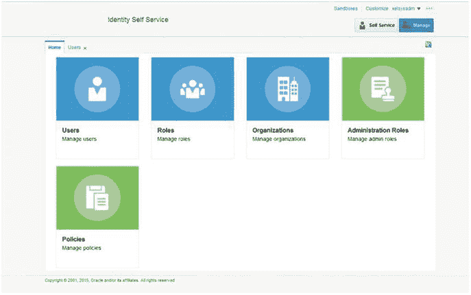
*图 13-1. Oracle Identity Manager 管理界面*

图 13-2 展示了开箱即用的 Oracle Identity Manager 管理角色默认列表。您可以根据需要添加和禁用这些角色。创建时，这些角色都没有成员。这取决于管理员来确定哪些用户组应该获得管理账户的能力。需要注意的是，这些实际上是可用于向各种用户授予权限并控制用户可以查看和修改哪些数据的模板。

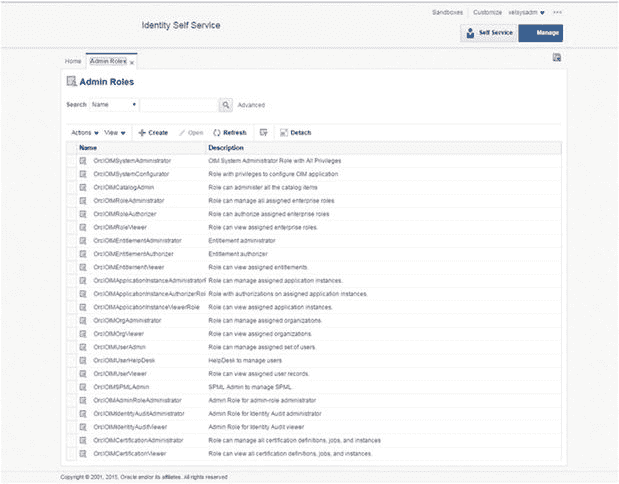
*图 13-2. 管理角色*

编辑角色相当简单。系统提供了一系列选项卡，允许您编辑基本信息、功能、成员资格规则以及其适用的组织。图 13-3 展示了给定角色的可用选项卡。

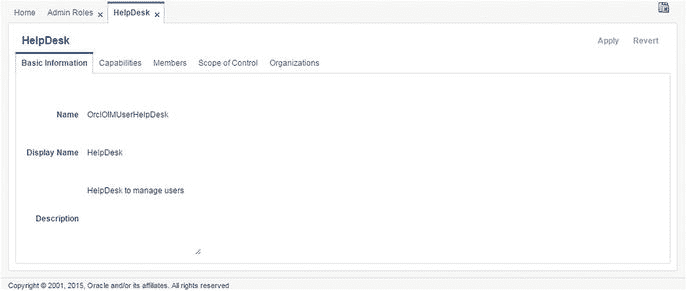
*图 13-3. 角色管理*

在此示例中，您将查看 `OrclOIMUserHelpDesk` 角色。此角色可以提供给服务台人员，允许他们管理用户账户、重置密码、解锁账户以及向其他用户授予角色。

图 13-4 所示的“功能”选项卡显示了分配 `HelpDesk` 角色的用户将能够执行的能力列表。在此案例中，服务台用户将能够创建、更新、删除以及以其他方式修改其控制范围内的用户账户（该范围将在本节后面讨论）。如果出于某种原因，此功能列表不符合组织的要求，管理员可以创建一个新的自定义访问策略，仅包含与其环境相匹配的功能。如果需要自定义策略，应保留默认策略并创建新策略。这将确保在出现问题时，原始配置保持不变。

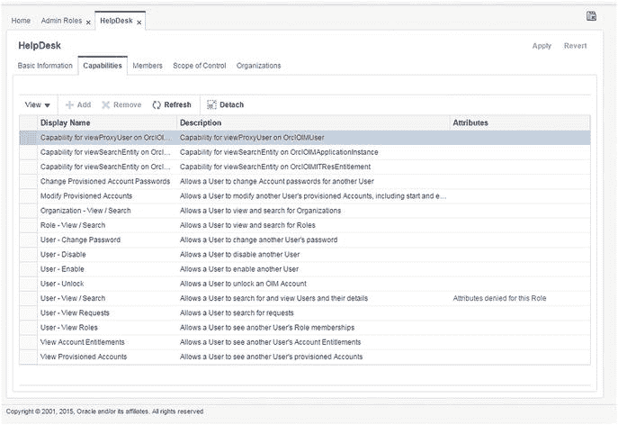
*图 13-4. 角色功能*

一旦定义了访问策略并配置了功能，管理员必须确定系统中谁将被授予新的访问权限。标准访问权限，例如搜索和查看用户信息，可能会授予所有用户。但是，编辑账户的能力可能只授予少数精选人员。确定用户成员资格非常简单：您可以选择直接将用户添加到角色，或创建管理成员资格的规则。

在图 13-5 所示的示例中，管理员创建了一个规则，只有用户名以文本 `HPDSK` 开头的用户才会被授予 `HelpDesk` 角色。在这种情况下，可能是服务台员工为承包商工作，或者其创建时带有表示所属部门的前缀。此规则可以轻松修改为基于其他 `LDAP` 属性，例如部门或员工类型。图 13-6 展示了配置基于规则的成员资格查询的示例。

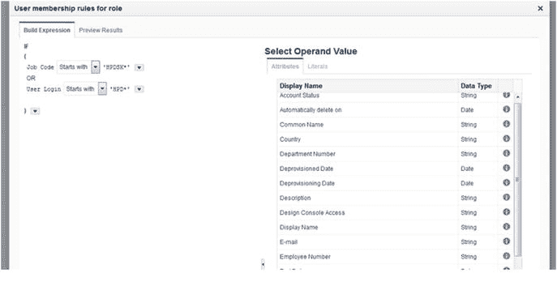
*图 13-6. 基于规则的角色成员资格查询*

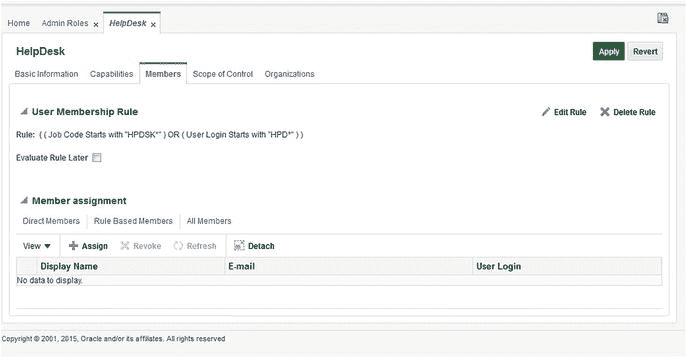
*图 13-5. 角色成员资格*

访问策略通常被授予一个控制范围。这用于定义该角色可用于控制的用户群体。例如，一项要求可能是客户支持组只能管理外部客户账户，而服务台只能处理内部员工账户。“控制范围”选项卡可用于指定这些规则。需要注意的是，如果组织有此类要求，可能需要为每个子组创建额外的角色。在图 13-7 中，您可以看到服务台的控制范围已设置为包含基础 `OIM` 安装中包含的默认用户类型。如果您的组织有其他类型，请根据需要包含它们。在此示例中，您可以看到服务台可以管理 `请求` 以及 `Top` 和默认 `Xellerate` 组织内的用户。包含子组织将确保控制权限被继承到任何子组织。

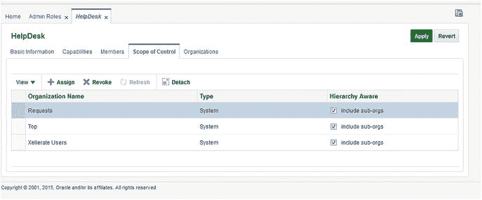
*图 13-7. 控制范围*

本章前面，您看到了一个设置 `Helpdesk` 管理角色的示例。此策略允许通过配置的规则授予此角色的用户管理其控制范围内的用户。一个用户可能被授予多个角色。需要记住的一点是，角色权限会叠加，这意味着用户将获得授予他们的每个角色的权限。然而，权限仍然是限制性的。这意味着，如果某个访问权限在一个角色中被明确限制，但在另一个角色中被授予，则用户将不会获得该权限。


## 密码策略

要求用户维护 OID 提供了在一定程度上控制密码策略的能力。OIM 添加了功能，以真正定制您组织的密码管理行为。

大多数组织都设置了策略，要求用户密码符合一组规则。这些规则可能包括最小字符数、大小写字符、特殊字符等。此类规则的组合增加了密码复杂性。密码越复杂，攻击者猜测或暴力破解它的难度就越大。

使用图 13-8 所示的 Oracle Identity Manager 管理屏幕，您可以通过单击 `Policies` 并选择 `Password Policies` 来为组织创建和维护密码策略。

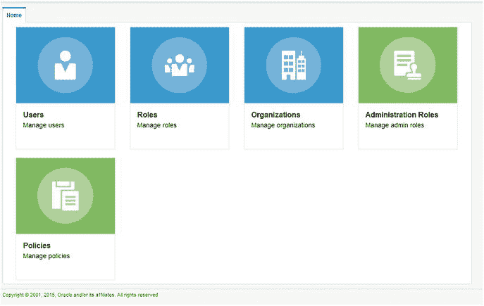

图 13-8. Identity Manager 管理屏幕

单击 `Manage Password Policies` 后，您将看到可用密码策略的列表。您可以创建新策略或使用默认策略。创建密码策略后，必须将该策略分配给适当的用户群体。OIM 提供了根据需求为不同用户组分配不同密码规则的能力。例如，由于人力资源员工可以访问敏感的个人数据，他们可能需要维护更高水平的密码复杂性。图 13-9 所示的列表显示了为 OIM 用户创建的默认密码策略以及一个示例密码策略。虽然您可以修改此密码策略，但建议您创建自己的策略。

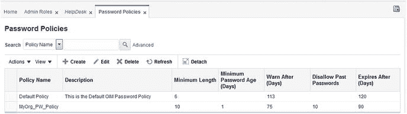

图 13-9. 密码策略列表

从图 13-9（密码策略列表）中，您可以选择一个策略并进行编辑，以根据自己的要求进行定制。图 13-10 显示了创建策略时可以使用的所有选项。

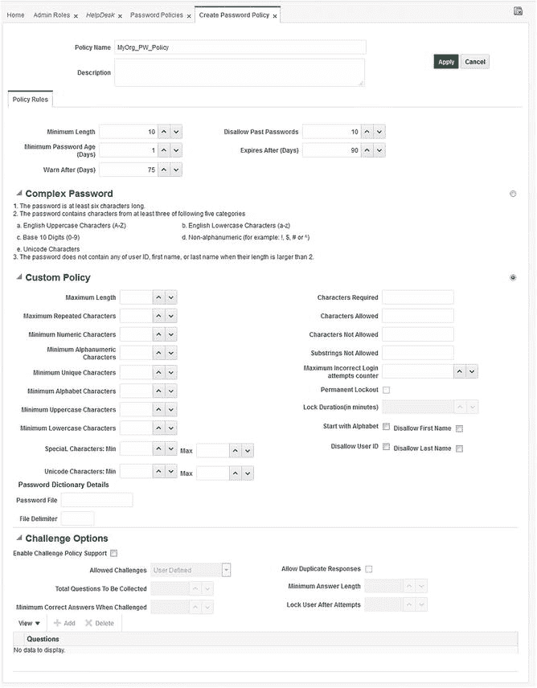

图 13-10. 密码策略配置屏幕

创建密码策略时，注意屏幕的各个部分非常重要。

*   第一部分定义了密码的基本规则。
    *   `Minimum Length`：指定密码必须达到的字符数才能通过复杂性规则。
    *   `Minimum Password Age (Days)`：定义用户必须使用密码多少天后才能再次更改它。使用数字 0 允许在同一天更改密码。
    *   `Warn After (Days)`：这是在系统向用户发送其密码即将过期的提醒通知之前的天数。通常在到期前三到五天发送。
    *   `Disallow Past Passwords`：输入一个数字以禁止用户重复使用以前的密码。通常设置为禁止使用前五个密码。
    *   `Expires After (Days)`：此数字确定密码在强制用户更改之前的最大有效期限。
*   第二部分 `Complex Password`，可用于使用预配置的密码复杂性规则。它包括以下规则：
    *   密码长度必须至少为六个字符。
    *   密码必须满足以下五条规则中的三条：
        *   必须包含大写字符。
        *   必须包含数字字符。
        *   必须包含小写字符。
        *   必须包含特殊字符（`!@#$%^&*`）。
        *   必须包含 Unicode 字符。
        *   不能包含用户的登录名、名字或姓氏。

注意

应当指出，默认 `Complex Password` 选择中列出的最小字符数实际上是基于屏幕第一部分中定义的字符数。如果您在该部分输入了 10 个字符，则 `Complex Password` 规则选择实际上将要求 10 个字符，而不是所示的六个。

此配置页面的第三部分 `Custom Policy`，允许对前述复杂规则进行完全定制。需要注意的是，对于单个密码策略，您只能使用 `Custom Policy` 或 `Complex Password`。在这里，您可以精确定义希望强制执行的规则。例如，可以要求五个大写字符和三个特殊字符，或者更多的数字字符。本节为您提供了对复杂性规则的完全控制。但是，请记住，如果密码策略限制性太强，可能会导致用户写下密码。

页面的最后部分是 `Challenge Options`。此部分用于配置 OIM，以允许用户在忘记密码或锁定帐户时回答一个或多个挑战问题。此选项可以通过允许用户自己管理锁定和忘记的密码，显著减少帮助台呼叫。

单击 `Enable Challenge Policy Support` 复选框后，配置选项将会出现。在这里，您可以配置适合您组织要求的自定义问题。您还可以允许用户输入自己的问题和答案。定义问题后，您还可以选择要求用户提供唯一的答案、定义答案的字符数，或两者兼有。为了进一步定制此系统，您可以根据需要输入任意多个问题，但允许用户在需要回答的总问题数中，选择并回答一个最小数量。

## Summary

在 OIM 中使用策略可以涵盖用户权限和密码。这使得管理员能够配置安全的身份管理系统，同时最小化必须执行的日常管理量。访问策略可用于根据职位、角色授予、组成员身份等来控制用户被允许使用的功能。此外，这些策略可用于为用户组提供细粒度的访问权限。密码策略可以通过确保用户群体使用安全的复杂密码来帮助维护系统安全。

# 14. Oracle Identity Manager 表单与定制

在前面的章节中，您已经看到 Oracle Identity Manager (OIM) 提供了各种各样的工具，组织可以提供给其用户，使他们或多或少能够自给自足。使用这些工具可以消除帮助台呼叫，并允许更快、更高效地处理权限请求以及入职和离职任务。这些还通过减少必须处理请求的人员数量以及减少管理帐户流程中的步骤，提供了更高级别的安全性。这些好处对许多组织来说可能是福音，因为他们可以看到节省资金和增强安全性。然而，开箱即用，许多可用的表单可能无法满足每个组织的外观、感觉或功能需求。

Oracle 提供了多种方法来为单个组织定制 OIM。OIM 允许进行大量的定制。这些定制的范围可以从简单的徽标和颜色更改，到提示的本地化，再到完全自定义的表单和报告。根据组织的个人需求，定制的级别会有所不同。在许多情况下，颜色更改、徽标更改和页面布局就足够了。偶尔，可能需要创建自定义表单，可以使用表单创建实用程序来创建。在某些情况下，需要整个自定义应用程序或完全定制，并可以利用 OIM 应用程序编程接口 (API) 来创建。使用 API 创建自定义应用程序超出了本书的范围。但是，本章涵盖了定制和使用表单创建实用程序。


## 基本定制

OIM 的定制涉及几个不同复杂度的层面。最基本的是，OIM 允许管理员更改背景颜色、徽标以及各个页面的视觉组件等内容。由于其执行方式，这些更改中的大多数将影响所有页面。最基本的修改涉及更改诸如层叠样式表（`CSS`）文件或替换图像文件等操作。

`CSS` 在 Web 开发中已经使用了很长时间。这些文件允许设计者一次性为项目定义诸如字体、颜色、背景等项目，而不是在部署中的每个页面上分别跟踪它们。

图 14-1 展示了 OIM 身份自服务主页。使用诸如 `HTTPFox` 或 `Google Chrome` 这类能够查看网页元素的浏览器工具，将使您能够确定整个页面所使用的 `CSS` 文件、元素和属性。这些信息将是更改 OIM 应用程序页面的关键。

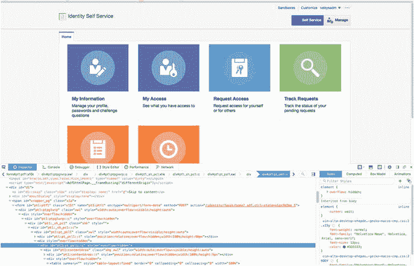
图 14-1. 正在检查元素的 OIM 身份自服务页面

### 用户界面定制

在其最简单的形式中，定制开箱即用的用户界面（`UI`）可以使用在线表单编辑工具和 OIM 的沙盒概念来完成。沙盒允许编辑者在当前实例中对表单进行更改，而不会影响其他编辑者或当前用户。在单个沙盒中进行的更改仅限于该沙盒实例。发布沙盒时，这些更改将与实时系统同步写入。图 14-2 显示了带有顶部 `Sandboxes` 链接的 Oracle 身份管理器主页。请注意，您必须以具有编辑或管理权限的用户身份登录系统才能看到此链接。您也可以通过 `sysadmin console` 页面访问此链接。

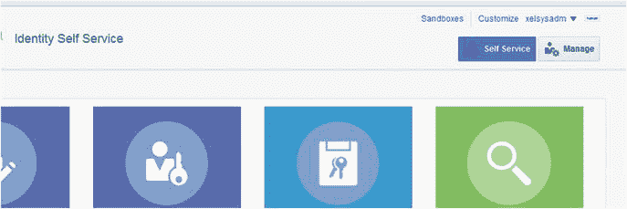
图 14-2. 创建沙盒

点击管理员可用的 `Sandboxes` 链接将弹出一个屏幕，显示当前可用的沙盒及其状态，如图 14-3 所示。在此屏幕上，您可以激活当前沙盒、发布单个沙盒、创建新沙盒或删除现有沙盒。点击 `Manage Sandboxes` 选项卡可查看现有沙盒。此屏幕将显示状态以及最后修改者。如果沙盒处于活动状态，`Active` 列中将出现一个绿灯。

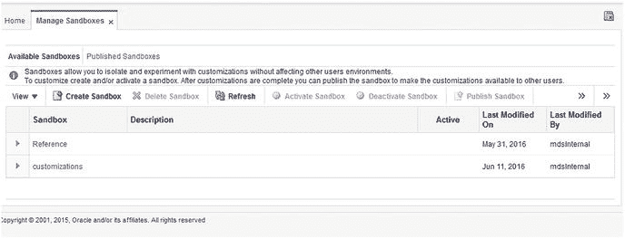
图 14-3. 当前沙盒

要创建新沙盒，请点击 `Create Sandbox` 链接。您将看到如图 14-4 所示的 `Create Sandbox` 对话框。为新的沙盒提供名称和描述。如果您想立即开始进行定制工作，请选中 `Activate Sandbox` 复选框。这将创建新环境并激活它。

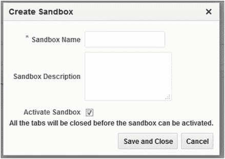
图 14-4. 创建沙盒对话框

创建新沙盒后，您将在屏幕顶部看到它已被激活。在 `Sandboxes` 链接旁边，将出现当前选定沙盒的名称，如图 14-5 所示。要自定义该页面或其他页面，请点击 `Customize` 链接。

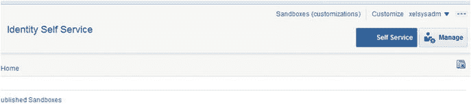
图 14-5. 活动沙盒

进入沙盒后，您将能够进行多项更改。熟悉各种视图非常重要。默认情况下，您将看到如图 14-6 所示的 `Add Content` 视图。此编辑器视图允许您在表单中输入数据。在处理多步骤表单时，此功能非常有用。在 OIM 中，有许多表单需要多个 `UI` 步骤，例如“忘记密码”页面。您可以使用 `Add Content` 视图输入数据并转到流程中的下一个页面。

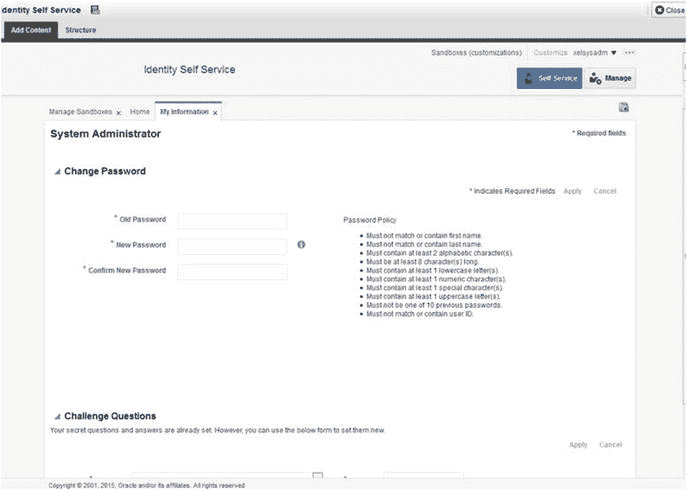
图 14-6. 沙盒定制的添加内容视图

通过 `Add Content` 屏幕输入所需数据或您希望处理的数据后，您可以切换到如图 14-7 所示的 `Structure` 视图。此屏幕显示整体页面以及页面组件的树状结构视图。右侧列出的每个组件代表左侧显示页面上的一个项目或区域。点击屏幕左侧的页面项目会在右侧的结构中选中相应的元素。使用此界面可以极大地帮助您找到希望编辑或添加的区域或元素。您可以直接使用右侧的结构列表来选择元素。

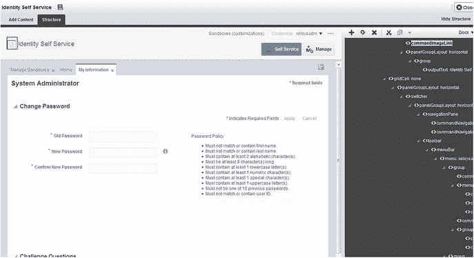
图 14-7. 沙盒定制的结构视图


## 在 OIM 中编辑用户界面元素

选定某个项目或区域后，您可以右键单击并选择 `Edit`。这将打开图 14-8 所示的界面。在此示例中，选定了品牌标志。在这里，您可以修改标志，以包含您的公司或品牌标志文件。在图 14-8 中，显示了代表该标志的 `CommandImageLink` 项的属性。在此屏幕上，您可以为文件输入新值或更改其他属性。需要注意的是，使用此方法更改标志时，相对 URL 将不起作用。如果您未使用直接的 URL 值，该字段中使用的值将默认为 `/identity/ 上下文根`。如果您不希望在环境中的其他位置（例如 Web 服务器内）托管标志，可以将您的标志放入自助应用程序 `jar 文件` 中并重新部署该文件。不过，许多组织选择在内容服务器或其他图像托管服务上托管其网站的图片。

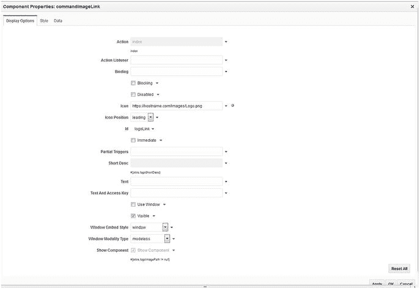

图 14-8. 编辑标志图像

更改标志、线条或其他视觉元素后，您可能希望添加新元素，例如提示文本或新字段。与更改视觉元素类似，您必须首先找到希望修改的区域。这可以通过右侧的结构窗格或左侧的内容区域来完成。请注意，当您在页面上选择区域或项目时，右侧的相应结构元素也会被选中。根据您希望添加元素的位置，您应找到其父容器并在其中添加。您可以使用容器编辑器重新排列项目。图 14-9 显示了选中某个面板的结构窗格。在此示例中，要添加的新元素是一些帮助文本，用于指导用户更改密码。这将被添加到包含密码字段的面板表单布局中。

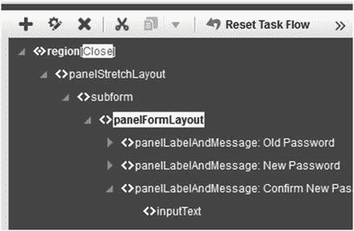

图 14-9. 添加新元素

选择要添加新元素的容器后，使用主菜单上的加号调出 `添加内容` 对话框。在此对话框中，您可以从各种页面组件中进行选择。如果您计划创建数据元素，可以使用 `数据组件`。单击任何可用组件上的 `打开` 链接将显示可以添加的各个组件。在本例中，您正在添加一个可以包含 `HTML` 标记的文本框，以向用户显示一些信息。在图 14-10 中，`添加内容` 对话框显示了可以添加的各种组件的列表。展开 `Web 组件` 并选择 `文本框`。

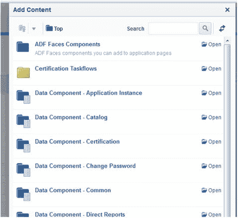

图 14-10. “添加内容”对话框

选择位置和要添加到页面的内容类型后，系统会显示新项目的属性。在此对话框中，使用 `值` 字段输入您希望添加的文本。请注意，此字段将接受 `HTML`。因为 `OIM` 页面使用 `CSS`，所以 `HTML` 将继承为应用程序其他部分定义的样式。在图 14-11 中，新的 `HTML` 字段已填充。需要注意的是，如果您希望覆盖标准的 `Identity Manager` `CSS`，可以使用 `样式` 选项卡输入自定义的样式信息。

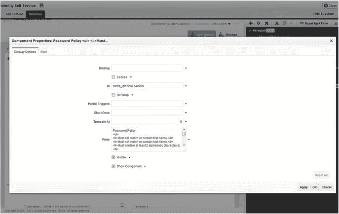

图 14-11. 新内容属性

至此，您已经更换了标志，并向 `我的信息` 页面添加了一个文本字段。如果您还记得，所有自定义都是在一个单独的 `沙盒` 中完成的。到目前为止所做的更改仅在您的 `沙盒` 处于活动状态时才可见，并且仅对进行编辑的用户可见。系统用户看到的仍是未编辑或之前已发布的编辑的标准页面。单击 `发布沙盒` 选项会将所做的更改合并到应用程序的主线中。此功能对于测试和更改用户界面而不影响当前用户非常有用。

## 总结

`OIM` 提供了大量表单，有助于简化人员流动率高的环境，或者组织希望将权力交给用户以处理请求和重置密码的环境。这种自动化和丰富的自助应用程序表单可以大大减少服务台呼叫和管理员协助的次数。然而，开箱即用的用户界面可能无法满足所有组织的需求。因此，Oracle 提供了一个易于使用的 `沙盒` 类型表单编辑器，允许对活动实例进行更改，而无需担心未经测试的更改会影响用户。系统允许开发人员在 `沙盒` 中进行更改并测试这些更改。只有当 `沙盒` 实际发布时，更改才会进入实时系统。本章演示了两种常见的用户界面更改类型。

# 15. 将访问管理器与电子商务套件集成

许多组织在 Oracle 电子商务套件 (`EBS`) 以及辅助应用程序和产品（如 Oracle WebCenter Content and Imaging、Oracle Business Intelligence 和面向服务的架构 (`SOA`) 套件）方面进行了投资。为了在保持高安全性的同时提高用户生产力，Oracle 访问管理器 (`OAM`) 提供了单点登录 (`SSO`) 功能，将这些产品绑定在一起，使用户在一天中从一个应用程序切换到另一个应用程序时无需重复登录。

## 架构

Oracle `EBS` 旨在与充当其身份存储的 Oracle Internet Directory (`OID`) 集成。此配置允许使用 `OAM` 来提供 `SSO` 功能。`EBS` 管理员会知道，该套件本身以 `FND_USER 表` 的形式拥有自己的用户存储。在 `SSO` 环境中，`EBS` 用户通过基于工作流的业务事件系统引发的事件与 `OID` 同步。

`OAM` 使用称为 `AccessGates` 的代理与 `EBS` 集成。这些代理，连同前面讨论的访问管理器 `WebGates`，用于提供从登录到应用程序的无缝过渡。

在集成的 `OAM` `EBS` 环境中会发生一系列操作流程。当 `HTTP 服务器` 收到一个 `EBS` 请求时，`OAM WebGate` 会拦截该请求并将其路由到 `OAM`。收到请求后，`OAM` 会确定资源是否受保护以及所需的认证和授权级别。尽管 `OAM` 提供凭据收集功能，但它会将凭据移交给 `OID` 进行认证。整个过程详述如下：

1.  用户尝试使用浏览器访问某个 Oracle `EBS` 资源，并被重定向到 `EBS AccessGate`。
2.  `AccessGate` 由带有 `WebGate` 的 Oracle `HTTP 服务器` (`OHS`) 保护。
3.  `HTTP 服务器` 和 `WebGate` 检查是否存在已认证的会话。如果会话存在，则允许用户访问 `EBS`。如果不存在会话，则将请求路由到 `OAM`。
4.  `OAM` 执行凭据收集。
5.  `OAM` 针对身份存储验证提交的用户凭据。
6.  `OAM` 将用户信息提供给 Oracle `EBS AccessGate`。
7.  `EBS AccessGate` 将用户信息和请求提交给 `EBS` 数据库。
8.  Oracle `EBS` 数据库检查 `EBS` 中是否存在与身份存储用户关联的用户。
9.  如果未找到关联的 `OID` 用户，则将用户重定向到 `EBS` 关联页面以关联其 Oracle `EBS` 用户名。
10. 返回最初请求的资源，并附带一个有效的已认证 Oracle `EBS` 用户会话。


### 准备 EBS 访问网关文件

下载 Oracle EBS 访问网关文件（位于补丁 `13704814`）后，将其解压缩到 `$MW_HOME/appsutil/accessgate/{instance}`。例如：

```
mkdir -p $MW_HOME/appsutil/accessgate/ebsAG
cd $MW_HOME/appsutil/accessgate/ebsAG
unzip [location to patch 13704814]/p13704814_R12_GENERIC.zip
```

访问网关的 ZIP 文件包含配置 EBS 访问网关所需的文件。这些文件将在后续的配置步骤中被引用。

*   `fndauth.war`：这是 Oracle EBS 访问网关应用程序，将在下一步创建的受管服务器中部署。
*   `fndext.jar`：此文件包含启用应用程序服务器与 EBS 数据库之间通信所需的 Java 库。
*   `txkEBSAuth.xml`：这是一个 ANT 脚本，用于帮助自动化部署 Oracle 访问网关。
*   `fndauth_deployment_plan.tmp`：这是部署自动化工具中使用的模板文件。
*   `LogConfig.properties`：此文件可作为设置日志记录的示例。
*   `samplecleanup.html`：这是一个示例 HTML 文件，用于在 EBS 注销后清理会话信息。

### 创建 EBS 访问网关安装目录

Oracle EBS 访问网关必须安装在 Middleware Home 目录内。在命令行中，于 `$MW_HOME/appsutil/accessgate/ebsAG` 为访问网关创建一个目录。如果您为访问网关使用了不同的实例名称，请将 `ebsAG` 替换为该名称。接下来，将访问网关文件复制到新的实例目录。本例中的 `MW_HOME` 目录是安装了 OAM 的中间件安装目录。

### 准备 EBS 和 OID

在开始集成过程之前，您应确保 EBS 和 Oracle 身份与访问管理环境都已应用必要的补丁和更新。请咨询 Oracle 支持以规划和实施所需的兼容性更新。

#### 将 EBS 主目录注册到 OAM

将 EBS 与 OAM 集成的第一步是将 EBS 主目录注册到 OAM。这必须在尝试集成 OID 之前完成。每个 EBS 部署只需注册实例一次。即使在 EBS 的多节点实例中也是如此。

**注意**

在尝试与 OID 集成之前，您必须先将 EBS 主目录注册到 OAM。

首先，运行位于 `EBS FND_HOME` 目录中的 `txkrun.pl` 脚本。

```
$FND_TOP/bin/txkrun.pl -script=SetSSOReg -registerinstance=yes -infradbhost=10.0.70.221 -ldapport=3060 -ldapportssl=3131 -ldaphost=10.0.70.229 -oidadminuserpass=***** -appspass=*****
```

在此命令中，按照表 15-1 所述设置参数。

**表 15-1. SSO 注册参数**

| 参数 | 描述 |
| --- | --- |
| `-script` | `SetSSOReg` 设置 `txkrun.pl` 脚本以运行 EBS 实例与 OID 的注册过程。 |
| `-registerinstance` | 将此值设置为 yes 以确保注册 EBS 实例。 |
| `-infradbhost` | 此参数应设置为 OID 数据库主机名。请注意，这与 EBS 数据库不同。 |
| `-ldapport` | 将此值设置为非安全套接字层（SSL）轻量目录访问协议（LDAP）端口。 |
| `-ldapportssl` | 将此值设置为 OID 的 SSL LDAP 端口。 |
| `-ldaphost` | 将此值设置为运行 OID 的服务器的主机名。 |
| `-oidadminuserpass` | 在此处输入 orcladmin 密码。 |
| `-appspass` | 输入 EBS apps 数据库管理员（DBA）密码。 |

#### 将 EBS 注册到 OID

成功完成将 EBS 实例注册到 OAM 后，您可以继续将 EBS 和 OAM 注册。为此，您将运行与上一步相同的 `txkrun.pl`。

```
$FND_TOP/bin/txkrun.pl -script=SetSSOReg -registeroid=yes -ldaphost=10.0.70.229 -ldapport=3060 -oidadminuserpass=***** -appspass=***** -instpass=***** -provisiontype=4
```

表 15-2 显示了此脚本设置的参数。

**表 15-2. OAM 注册参数**

| 参数 | 描述 |
| --- | --- |
| `-script` | `SetSSOReg` 设置 `txkrun.pl` 脚本以运行 EBS 实例与 OID 的注册过程。 |
| `-registeroid` | 将此标志设置为 yes 以将 EBS 注册到 OID。 |
| `-ldaphost` | 将此值设置为 OID 主机名。如果您使用负载均衡器，则应设置为实际主机名，而不是 VIP。 |
| `-ldapport` | 将此值设置为 OID 实例使用的 LDAP 端口。 |
| `-oidadminuserpass` | 此值应设置为 orcladmin 密码或其他管理员密码。 |
| `-appspass` | 将此值设置为 Apps DBA 密码。 |
| `-instpass` | 此值应设置为与 OID 管理员密码相同。 |
| `-provisiontype` | 此值可设置为 1、2、3 或 4。本例中设置为 4 表示双向——无创建配置。其他值为：1. 双向配置：此为默认值。 2. 入站配置：EBS 到 OID。 3. 出站配置：OID 到 EBS。 4. 双向，无配置 |

完成此步骤后，必须重新启动 EBS 中间层服务。

#### 创建 EBS 连接用户

将 EBS 主目录注册到 OAM 并将 EBS 注册到 OID 后，就可以为连接到 OID 创建所需的本地 EBS 用户。新 EBS 用户应使用 UMS/Apps 模式权限创建。创建此用户后，使用 EBS 本地登录名登录并重置新用户的密码。验证该用户是否可以连接到 EBS 并拥有正确的角色：UMX|Apps Schema Connect。

### 配置 EBS 访问网关

由于 Oracle EBS 使用了许多 Cookie 和会话信息，因此 EBS 访问网关的配置要求它安装在 EBS 本身使用的中间层服务器所在的同一域中。在示例中，创建了 `.example.com` Cookie 域。确保访问网关的安装使用了适用于您环境的相同信息。

#### 为访问网关创建受管服务器

在配置 OAM 期间，已为 OAM 创建了 WebLogic 服务器（WLS）域。因此，您可以将同一个 WLS 和域用于新的访问网关。登录 OAM WLS 管理控制台后，导航到 “环境” ➤ “集群”，并创建一个新集群。为集群分配一个适合您环境的名称。本例中使用名称 `ebsAG_cluster`。使用以下值配置集群参数。

*   消息传递模式：单播。
*   单播广播通道：留空。
*   多播地址：使用默认值。
*   多播端口：使用默认值。

创建新集群后，就该配置受管服务器了。导航到 “环境” ➤ “服务器”。在现有受管服务器列表中，单击 “新建”。用以下值填充字段：

*   服务器名称：`ebsAG_server1`
*   服务器侦听主机：`<OAM 主机名>`
*   服务器侦听端口：`17043` 或其他开放端口
*   集群：选择上一步创建的集群名称。

创建受管服务器后，编辑新服务器并将其分配给现有计算机。

**注意**

在集群环境中创建此配置时，请确保创建两个受管服务器，并将每个服务器分配给集群内的相应计算机。


### 复制制品文件

在本章前面部分，你已经下载了 AccessGate 文件并创建了安装目录。你已查看了下载的 zip 文件中包含的文件。在这里，你将把这些文件复制到已创建的安装目录内的正确位置。

首先，将 `samplecleanup.html` 文件从 `$MW_HOME/appsutil/accessgate/ebsAG/sample` 目录复制到 OHS 安装位置内的 htdocs 下创建的 `/public` 目录。将该文件重命名为 `oacleanup.html`，如下所示：

```
cp $MW_HOME/appsutil/accessgate/ebsAG/sample/samplecleanup.html /instances/instance1/config/OHS/ohs1/htdocs/public/oacleanup.html
```

文件被复制到正确目录后，使用 Web 浏览器访问它。导航至 [`http://10.0.70.229:7777/public/oacleanup.html`](http://10.0.70.229:7777/public/oacleanup.html)。

由于此页面不是 OAM 受保护的资源，你应该能够无需提示登录信息即可访问它。但是，此页面将显示为空。此 URL 将在后续步骤中使用，届时你将部署实际的 WebGate 并配置一个集中的注销页面。

接下来，你将把 `fndext.jar` 文件复制到 OAM 的 `lib` 目录。执行以下命令来完成此操作。

```
cp $MW_HOME/appsutil/accessgate/ebsAG/fndext.jar $MW_HOME/user_projects/domains/OAMDomain/lib
```

重启 OAM 受管服务器和管理服务器，以加载你复制到 `lib` 目录的新 `fndext.jar` 文件。

### 在 EBS 中生成 DBC 文件

EBS 使用数据库连接文件为 AccessGate 创建连接池以连接到 EBS。在本节中，你将使用 EBS AdminDesktop 实用程序来生成所需的 DBC 文件。

设置环境变量，并确保 `JAVA_HOME` 指向 OAM 实例的 JAVA 目录。使用以下命令为你的实例生成 DBC 文件。

```
java oracle.apps.fnd.security.AdminDesktop apps/ CREATE NODE_NAME=10.0.70.229 DBC=$FND_SECURE/ebsAG.dbc
```

在上述命令中，`NODE_NAME` 是 OAM 实例的主机名。为了在具有多个 EBS AccessGate 的环境中更容易引用，请将 DBC 文件命名为与 AccessGate 和 EBS 实例相关的内容。将生成的文件复制到 OAM 服务器上 EBS AccessGate 安装的目录下，在本例中为 `<MW_HOME>/appsutil/accessgate/ebsAG`。

### 将 EBS AccessGate 主机添加到外部表列表

在部署 EBS AccessGate 期间，定义了一个 Java 数据库连接。默认情况下，EBS 数据库不允许来自外部机器的通信。为了允许此操作，托管 OAM AccessGate 的 WLS 必须在 EBS 数据库中注册为受信任的机器。为此，你将使用 EBS Java 开发工具包。

出于安全考虑，Oracle 建议使用 IP 地址限制来防止未经授权的访问。通过将 EBS AccessGate 主机名添加到 EBS 配置文件中，你可以设置适当的限制。在用户级别将 `FND_SERVER_DESKTOP_USER` 配置文件设置为包含 AccessGate 的主机名列表。需要注意的是，此值可以接受逗号分隔的外部机器列表。未执行此步骤可能会导致用户尝试身份验证时出现用户名/密码无效的错误。

### 使用 txkEBSAuth.xml 部署 AccessGate

你已经配置了设置 AccessGate 所需的组件。作为这些步骤的一部分，你已暂存了软件、注册了 AccessGate 主机、配置了 AccessGate 集群和受管服务器，并设置了 Middleware Home 目录结构。现在是时候使用 WLST 实用程序部署 AccessGate 应用了。

开始之前，确保环境变量设置正确非常重要。未能做到这一点可能会导致配置问题。你可以运行位于 `$DOMAIN_HOME/bin` 目录中的 `setDomainEnv.sh` 来执行此步骤：

```
. ./setDomainEnv.sh
```

你也可以手动设置环境变量：

```
export MW_HOME=/home/oracle/OAMMiddleware
export DOMAIN_HOME=$MW_HOME/user_projects/domains/oam_domain
```

接下来，使用 WLS 主目录中的 `setWLSEnv.sh` 设置 WLST 环境。

```
. $MW_HOME/wlserver_10.3/server/bin/setWLSEnv.sh
```

切换到上一步中安装 Oracle EBS AccessGate 的目录；例如：

```
cd $MW_HOME/appsutil/accessgate/ebsAG
```

部署 EBS AccessGate 要求你为受管服务器创建数据源。执行此步骤会使用 ANT 和前面讨论的 `txkEBSAuth.xml` 模板。此文件位于 AccessGate 安装目录中。运行以下命令时，请注意它可能需要相当长的时间才能完成。让该过程运行而不要中断。最后，你将看到一条完成消息。

```
ant -f txkEBSAuth.xml createDataSource \
-Dwlshosturl=10.0.70.229:17001 \
-DdataSourceName=EBS_DS \
-DdataSourceJNDIName=jndi/EBS_DS \
-DasadminUser=OAM_EBS_USER \
-DdbcFile=$MW_HOME/appsutil/accessgate/ebsAG/ebsAG.dbc \
-DserverName=ebsAG_server1 \
-DdeploymentName=ebsauth_dev \
-DfndauthWarFile=$MW_HOME/appsutil/accessgate/ebsAG/fndauth.war \
-DplanPath=$MW_HOME/appsutil/accessgate/ebsAG/plan/Plan.xml \
-DSSOServerRelease=11 \
-DSSOServerURL=http://10.0.70.229:14100 \
-DWebgateLogoutURL=http://10.0.70.229:7777/public/oacleanup.html
构建成功：38 分 29 秒
```

该命令将保存在实例主目录中。完整的路径和文件名是：

```
$MW_HOME/appsutil/accessgate/EBS_DB/createDS.sh.
```

创建数据源后，你将使用 WLS 管理控制台将数据源定位到环境中的相应受管服务器。使用浏览器导航到 OAM WebLogic 管理控制台。访问 [`http://10.0.70.229:17001/console`](http://10.0.70.229:17001/console)，并使用 `weblogic` 用户登录。

进入 WebLogic 管理控制台后，导航到“服务” ➤ “数据源”。选择名为 `EBS_DS` 的新数据源。单击“目标”选项卡，并选择先前创建的新 `ebsAG` 受管服务器。完成后，单击“保存”以最终确定配置。此步骤无需重启。

确保数据源已配置并定位到正确的受管服务器后，你就可以在 WLS 上部署 AccessGate 应用了。同样，你将使用 ANT 来执行此步骤；例如：

```
ant -f txkEBSAuth.xml deployApplication \
-Dwlshosturl=10.0.70.229:17001 \
-DdataSourceName=EBS_DS \
-DdataSourceJNDIName=jndi/EBS_DS \
-DasadminUser=OAM_EBS_USER \
-DdbcFile=$MW_HOME/appsutil/accessgate/ebsAG/ebsAG.dbc \
-DserverName=ebsag_server1 \
-DdeploymentName=ebsauth_dev \
-DfndauthWarFile=$MW_HOME/appsutil/accessgate/ebsAG/fndauth.war \
-DplanPath=$MW_HOME/appsutil/accessgate/ebsAG/plan/Plan.xml \
-DSSOServerRelease=11 \
-DSSOServerURL=http://10.0.70.229:14100 \
-DWebgateLogoutURL=http://10.0.70.229:7777/public/oacleanup.html
```


此命令为交互式。尽管您可以在命令中提供参数值，但仍建议您以交互方式运行，并根据提示输入值，以防止以明文输入密码，并避免因拼写错误而导致执行问题。请参考表 15-3，根据提示输入脚本变量。

表 15-3. AccessGate 部署参数

| 脚本变量 | 描述 |
| --- | --- |
| `-dDeploymentName` | 输入一个可用于标识应用程序部署的值。此处，该值前缀为 `ebsauth_`，然后是所使用的 EBS 实例 `dev`。此值也将用作受 WebGate 保护的上下文根。 |
| `-DasadminUser` | 输入先前创建的、具有 UMX/APPS 模式连接权限的 EBS 用户。您应确保可以使用此用户在 EBS 中本地登录。 |
| `-DasadminPassword` | 这是运行脚本时的可选参数。出于安全原因，您可以选择不包含它。如果在命令中不包含它，命令运行时会提示您输入。 |
| `-DWebGateLogoutURL` | 此值应设置为先前创建的 `oacleanup.html` 文件的完整 URL。例如，应输入为 `http://10.0.70.229:7777/public/oacleanup.html`。请勿使用相对 URL。 |
| `-DOAMLogoutURL` | 输入 OAM 全局注销的完整 URL；例如，`http://10.0.70.229:7777/oam/server/logout`。 |
| `-DserverName` | 将此值设置为您在 WebLogic 环境中使用的部署服务器。在上一步中，您创建了一个受管服务器。作为最佳实践，请不要将任何内容部署到管理服务器。最好使用专用的受管服务器。此处使用 `ebsag_server1`。 |
| `-Dwlspwd` | 根据提示输入 weblogic 用户密码。尽管可以在命令中包含此密码，但最好不要在命令中包含明文密码。 |

Oracle EBS AccessGate 应用程序现已部署在 OAM WLS 环境中。您还创建了支持该应用程序所需的必要数据源。该应用程序已配置为知道如何使用管理员用户连接到 EBS。

### 验证 AccessGate 应用程序部署

配置 Oracle EBS AccessGate 应用程序资源并将应用程序部署到受管服务器后，建议在继续之前验证其操作并检查是否存在任何错误配置。如果发现任何问题，此时是纠正它们的最佳时机。要验证应用程序设置，您可以使用位于 `http://<hostname>:<adminserver_port>/console` 的 OAM WLS 管理控制台；例如，`http://10.0.70.229:17001/console`。

登录 WLS 管理控制台后，导航到 Environment ➤ Servers，并确保新创建的 EBS AccessGate 受管服务器 `ebsag_server1` 在指定端口上运行。

接下来，检查为 EBS AccessGate 受管服务器创建的数据源。使用左侧菜单，转到 Services ➤ DataSources，并检查您在部署期间创建的数据源（例如 `ebsAG_ds`）是否存在，并且是否定位到正确的受管服务器（例如 `ebsag_server1`）。单击数据源链接以查看设置。在“设置”视图中，使用“连接池”选项卡，根据部署参数中的指定，确保属性“用户”和“dbcFile”的值正确。您还应使用“监控”选项卡确保数据源已启用并正在运行。如果需要，您还可以在“监控”选项卡上使用“测试”实用程序来测试连接。

验证受管服务器和数据源后，导航到 Deployments，并查找名为 `ebsauth_dev` 的 Oracle EBS AccessGate 应用程序。它应处于已部署、活动状态且运行状况正常。如果不是这种情况，请尝试停止并重新启动部署。检查 WLS 日志中是否有任何可能指示配置问题的错误。

如果所有组件都已启动并运行，您应该能够使用浏览器访问 AccessGate URL。导航到 `http://<hostname>:<EBSAccessGatePort>/<accessgatename>/ssologout_callback`；例如，`http://10.0.70.229:17043/ebsauth_dev/ssologout_callback`。如果成功，您将看到一个空白页面。如果收到任何错误页面，请检查服务器是否存在问题。

### 在 Oracle Access Manager 中配置资源

配置好 AccessGate 应用程序后，就需要配置 OAM 和相应的 WebGate 来保护 EBS 应用程序 URL 了。为此，您将使用图 15-1 所示的 OAM oamadmin 界面。使用浏览器登录 OAMConsole 后，导航到“应用程序安全启动板”并单击“应用程序域”以检索当前配置的域列表。您将使用本书前面创建的 WebGate 域。在此域中，您将创建受 OAM 保护的新资源。

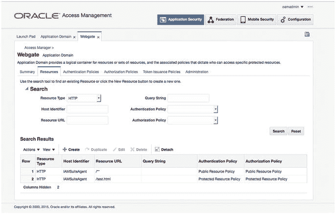

图 15-1. Oracle Access Manager WebGate 配置

新资源应配置如表 15-4 所示。

表 15-4. EBS 集成的受保护和公共资源配置

| 资源类型 | 主机标识符 | 资源 URL | 认证策略 | 授权策略 |
| --- | --- | --- | --- | --- |
| HTTP | WebGate | `/**` | 公共资源 | 公共资源 |
| HTTP | WebGate | `/public/index.html` | 公共资源 | 公共资源 |
| HTTP | WebGate | `/excluded/index/html` | 排除 | 排除 |
| HTTP | WebGate | `/ebsauth_dev/` | 受保护资源 | 受保护资源 |
| HTTP | WebGate | `/ebsauth_dev/…/*` | 受保护资源 | 受保护资源 |
| HTTP | WebGate | `/ebsauth_dev/OAMLogin.jsp` | 公共资源 | 公共资源 |
| HTTP | WebGate | `/ebsauth_dev/style/` | 公共资源 | 公共资源 |
| HTTP | WebGate | `/ebsauth_dev/style/…/*` | 公共资源 | 公共资源 |
| HTTP | WebGate | `/ebsauth_dev/ssologout.do` | 公共资源 | 公共资源 |
| HTTP | WebGate | `/ebsauth_dev/ssologout_callback` | 公共资源 | 公共资源 |
| HTTP | WebGate | `/oacleanup.html` | 公共资源 | 公共资源 |
| HTTP | WebGate | `/cgi-bin/printenv` | 受保护资源 | 受保护资源 |


## 将 HTTP 服务器重定向到 WebLogic 服务器以访问 EBS AccessGate

您可能还记得，本章开头提到 HTTP 服务器会将请求重定向到 AccessGate 进行身份验证。此重定向必须在 OHS 上配置。WebGate 将作为代理，处理对 Oracle EBS 资源的身份验证请求。因此，请求将由部署在您的 WLS 实例上的 Oracle EBS AccessGate 应用程序处理。

打开命令提示符，找到第 9 章创建的 OHS 实例的配置目录。该目录应位于 `/home/oracle/OHSMiddleware/Oracle_WT1/instances/instance1/config/OHS/ohs1`。在此目录中，您将找到名为 `mod_wl_ohs.conf` 的 WLS 模块配置文件。默认情况下，`httpd.conf` 文件应已包含必要的 include 指令，以便在启动时加载此配置。将以下几行添加到 `mod_wl_ohs.conf` 文件中，以包含 EBS 位置配置，如下所示。

```
WebLogicHost 10.0.70.229
WebLogicPort 17043

SetHandler weblogic-handler
```

此条目配置 OHS，将 EBS 身份验证请求重定向到部署了 AccessGate 的托管服务器。确保 `WebLogicHost` 和 `WebLogicPort` 指向安装的正确位置。然后重启 OHS。

现在，您应该能够通过浏览器，经由您的 HTTP 服务器和 WebGate 访问 Oracle ECBS AccessGate 资源；例如，访问 `http://10.0.70.229:7777/ebsauth_dev/ssologout_callback`。

此 URL 已在公共资源策略下的 OAM 应用程序域资源中配置。因此，此时您不应被提示进行身份验证。OHS 现在已配置为将 EBS AccessGate 应用程序部署代理为身份验证服务提供商。

## 配置集中式注销

您可能还记得，OAM 充当凭据收集代理，并根据配置的身份存储（本例中为 OID）对用户进行身份验证。当用户登录受保护资源时，OAM 会创建必要的会话和 Cookie，以确保无缝过渡到其他受保护资源，并提供 SSO 环境。在注销过程中，OAM 会清理自己的会话信息。但是，它不会清理合作伙伴应用程序的会话。因此，用户可能已从 OAM 注销，但 Oracle EBS 会话 Cookie 可能仍然存在，直到浏览器完全关闭。AccessGate 软件安装提供了必要的文件，以确保在注销操作期间清理 EBS 会话信息，从而提高安全性。配置集中式注销将确保在用户注销 SSO 应用程序时执行清理并消除 EBS 会话。

### 配置用于注销的清理文件

当您解压 EBS AccessGate zip 文件时，其中包含一个名为 `oacleanup.html` 的文件。在部署过程中，您已将此文件复制到 OHS `htdocs` 目录下的 `/public` 子目录中。找到该文件并使用文本编辑器根据需要更新上下文根，以确保脚本被正确调用。

在 `oacleanup.html` 中找到以下行：

```
<SCRIPT language=JavaScript src="http://<CONTEXT_ROOT>/oacleanup.js"></SCRIPT>
```

通过将 `<CONTEXT_ROOT>` 替换为在 OAM 中配置的资源名称来更新此条目。这应与托管服务器的名称匹配；例如，

```
<SCRIPT language=JavaScript src="http://ebsauth_dev/oacleanup.js"></SCRIPT>
```

### 配置额外的注销回调

某些环境可能有多个 EBS AccessGate 实例，或者您可能希望在注销后为其他应用程序执行会话清理。如果是这种情况，您可以为每个额外的 AccessGate 或自定义应用程序添加回调，如下所示。在 `oacleanup.html` 文件中搜索以下行：

```
function doLoad()
```

为其他应用程序添加回调。

```
logoutHandler.addCallback('//ssologout_callback');
logoutHandler.addCallback('http://webgatehost2.example.com:7777/ /ssologout_callback');
```

在注销过程中，这确保 AccessGate 调用清理过程以销毁 Oracle EBS 会话。OAM 集中式注销也应包括为 OAM 配置保护的其他合作伙伴应用程序执行清理。

在此示例中，使用了 Oracle 11g WebGate。因此，可以利用 11g WebGate 注销回调 URL 实现集中式注销流程。使用 OAM 控制台管理屏幕设置注销回调 URL。

在 OAM 管理控制台中，单击“系统配置”选项卡。在“访问管理器”部分，单击“SSO 代理”节点，然后选择“OAM 代理”。单击“搜索”并选择先前创建的 SSO 代理。图 15-2 显示了设置 SSO 代理 Webgate 时使用的配置参数。

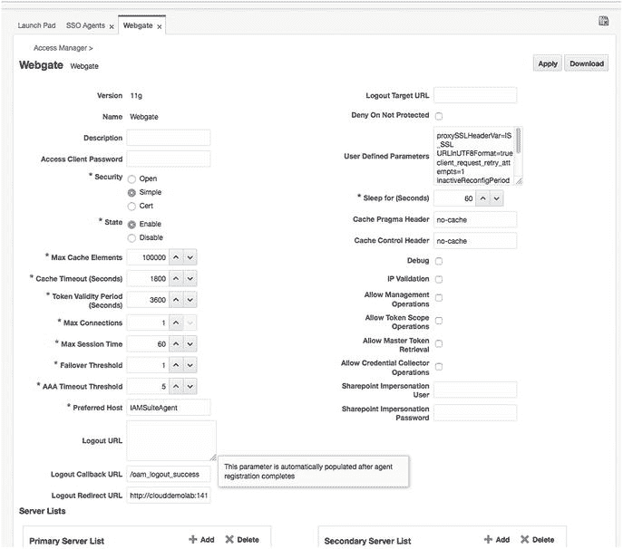
*图 15-2. 注销回调 URL 配置*

将注销回调 URL 的值设置为 `http://<ebshost>.<domain>:<port>/OA_HTML/AppsLogout`。

至此，OAM 和 AccessGate 集中式注销流程的配置完成。

## EBS 配置文件配置

配置 Oracle EBS AccessGate 应用程序和 OAM 资源后，需要在实际的 EBS 环境中设置登录配置文件。设置表 15-5 中的 Oracle EBS 配置文件选项，或让 EBS 管理员进行设置。

*表 15-5. EBS 配置文件配置参数*

| 配置文件 | 级别 | 值 |
| :--- | :--- | :--- |
| 应用程序身份验证代理 (`APPS_AUTH_AGENT`) | 站点 | `http://<webgatehost>:<port>/ebsauth_dev/` |
| 应用程序 SSO 类型 (`APPS_SSO`) | 站点 | `SSWA w/SSO` |
| 应用程序单点登录提示 Cookie (`APPS_SSO_HINT_COOKIE_NAME`) | 站点 | `<空白> (null)` 此值应为空；如果存在类似 `ORASSO_AUTH_HINT` 的值，请将其移除。 |

重启 Oracle EBS 中间层的应用程序服务，然后重启部署了 Oracle EBS AccessGate 的 WLS 和托管服务器。

## 测试电子商务套件单点登录

现在所有必要的组件都已部署和配置，并且您已为 SSO 设置了 Oracle EBS 配置文件，您可以测试整个环境。此前，您已设置了一个测试 URL 以确保身份验证机制正常。对于此步骤，您将尝试登录 Oracle EBS 系统，然后登录另一个受保护资源。如果一切正常，在浏览器会话中应该只会被提示进行一次身份验证。对其他受保护资源的后续请求应使用现有的会话信息和 Cookie。在注销时，所有会话信息都应被清理，后续请求将被提示进行身份验证。使用浏览器导航到 EBS 登录页面。


```
http://.:/OA_HTML/AppsLogin
```

根据本章开头描述的步骤，您应被重定向到 OAM 认证页面。请使用身份存储中存在的一组有效凭证进行登录。认证成功后，您应被重定向至您的 Oracle EBS 主页。

需要注意的是，只有在 EBS 中配置了**本地登录允许**配置文件的用户，才能使用 EBS 本地登录功能。这对于管理用户和故障排除非常有用。

## 总结

在本章中，我们介绍了集成 Oracle EBS 和 OAM 时涉及的操作顺序和数据流。需要注意的是，要集成`OID`和`EBS`，必须使用`OAM`，因为这种集成依赖于`EBS AccessGate`的部署。本章提供了在支持单个`EBS`实例的单个节点上实例化单个`AccessGate`所需的步骤。这些步骤可以进行修改以支持集群环境，从而在某个`AccessGate`托管服务器发生故障时，提供更高的可用性和容错能力。也可以部署多个`AccessGate`来支持多个`EBS`实例。

# 16. 故障排除和常见问题

您已经遵循了 Oracle 的文档，以确保您的环境符合认证要求。您的操作系统（`OS`）是最新的，系统要求也已满足。您运行了安装程序，一切看起来都很顺利。突然，安装程序似乎挂起了。用 Douglas Adams 的话说，“不要惊慌”。

考虑到必须安装、打补丁、配置然后集成，才能成功实施 Oracle 身份和访问管理套件的众多组件，您很可能会遇到问题。这些问题可能出现在安装和初始配置期间；也可能在您尝试将组件彼此集成或与其他应用程序集成时浮现。无论何时遇到问题，它们都可能令人沮丧，有时甚至找不到明显的解决方案。很多时候，问题仅仅源于遗漏了一个补丁或配置文件中的一个简单笔误。有些问题很容易解决，而另一些则可能需要大量的研究。本章的目的是提供一些常见问题及其解决方案的列表，以及实施者可能需要解决的几个罕见问题。这些内容来源于多次安装的汇总和同事们的笔记。

## 安装问题

本书开头介绍了构成 Oracle 身份和访问管理套件的各种组件。随后，介绍了使环境正常工作所需的主要组件的安装过程。尽管安装过程看起来相当直接，但遇到一些问题并不罕见。如果您在过程中陷得不深，重新启动安装程序可能很容易。然而，在这个阶段，除非您已采取措施解决根本问题，否则很可能会再次遇到同样的问题。

在安装阶段，您正在部署应用程序二进制文件。Oracle Universal Installer 会检查您的`OS`，以确保其满足最低规格要求。最常遇到的问题是在这个预检查期间发现的。理想情况下，您已经检查并确保安装了正确的`OS`软件包。然而，软件包列表很长，如果缺少任何一个，Oracle Universal Installer 都会指出来让您解决。如果您拥有`root`或`sudo`权限，这些问题可以很容易地解决。根据您选择的`OS`，您可以直接安装它们并继续。

使用基于`UNIX`的系统时，您可以使用`yum`来安装缺失的软件包，或者下载缺失的软件包`rpm`文件并进行安装。请注意，这需要`sudo`或`root`权限。从`rpm`文件安装缺失的软件包可能是一个漫长的过程，因为您需要找到该软件包以及所有必需的软件包才能正确安装它们。大多数时候，像`yum`这样的包安装工具会执行所有所需软件包的下载和安装。缺失的`OS`软件包是最容易诊断和解决的问题之一。请参见表 16-1，了解本书涵盖的每个主要组件所需的软件包列表。根据您的环境，这些软件包可能需要安装在您所有的服务器上，或者只安装在特定的服务器上，具体取决于每个服务器上安装的组件。

表 16-1. Oracle 身份管理系统操作系统软件包要求

| 身份管理组件 | 所需组件 |
| --- | --- |
| Oracle Internet Directory 11.1.1.9 | `binutils-2.20.51.0.2-5.28.el6`<br>`compat-libcap1-1.10-1`<br>`compat-libstdc++-33-3.2.3-69.el6 for x86_64`<br>`compat-libstdc++-33-3.2.3-69.el6 for i686`<br>`gcc-4.4.4-13.el6`<br>`gcc-c++-4.4.4-13.el6`<br>`glibc-2.12-1.7.el6 for x86_64`<br>`glibc-2.12-1.7.el6 for i686`<br>`glibc-devel-2.12-1.7.el6 for i686`<br>`libaio-0.3.107-10.el6`<br>`libaio-devel-0.3.107-10.el6`<br>`libgcc-4.4.4-13.el6`<br>`libstdc++-4.4.4-13.el6 for x86_64`<br>`libstdc++-4.4.4-13.el6 for i686`<br>`libstdc++-devel-4.4.4-13.el6`<br>`libXext for i686`<br>`libXtst for i686`<br>`libXext for x86_64`<br>`libXtst for x86_64`<br>`openmotif-2.2.3 for x86_64`<br>`openmotif22-2.2.3 for x86_64`<br>`redhat-lsb-core-4.0-7.el6 for x86_64`<br>`sysstat-9.0.4-11.el6`<br>`xorg-x11-utils*`<br>`xorg-x11-apps*`<br>`xorg-x11-xinit*`<br>`xorg-x11-server-Xorg*`<br>`xterm` |
| Oracle Access Manager 11.1.2.3 | `binutils-2.20.51.0.2-5.28.el6`<br>`compat-libcap1-1.10-1`<br>`compat-libstdc++-33-3.2.3-69.el6 for x86_64`<br>`compat-libstdc++-33-3.2.3-69.el6 for i686`<br>`gcc-4.4.4-13.el6 gcc-c++-4.4.4-13.el6`<br>`glibc-2.12-1.7.el6 for x86_64`<br>`glibc-2.12-1.7.el6 for i686`<br>`glibc-devel-2.12-1.7.el6 for i686`<br>`libaio-0.3.107-10.el6`<br>`libaio-devel-0.3.107-10.el6`<br>`libgcc-4.4.4-13.el6`<br>`libstdc++-4.4.4-13.el6 for x86_64`<br>`libstdc++-4.4.4-13.el6 for i686`<br>`libstdc++-devel-4.4.4-13.el6`<br>`libXext for i686`<br>`libXtst for i686`<br>`libXext for x86_64`<br>`libXtst for x86_64`<br>`openmotif-2.2.3 for x86_64`<br>`openmotif22-2.2.3 for x86_64`<br>`redhat-lsb-core-4.0-7.el6 for x86_64`<br>`sysstat-9.0.4-11.el6`<br>`xorg-x11-utils*`<br>`xorg-x11-apps*`<br>`xorg-x11-xinit*`<br>`xorg-x11-server-Xorg*`<br>`xterm`<br>`pdksh-5.2.14` |
| Oracle Identity Manager 11.1.2.3 | `binutils-2.20.51.0.2-5.28.el6`<br>`compat-libcap1-1.10-1`<br>`compat-libstdc++-33-3.2.3-69.el6 for x86_64`<br>`compat-libstdc++-33-3.2.3-69.el6 for i686`<br>`gcc-4.4.4-13.el6 gcc-c++-4.4.4-13.el6`<br>`glibc-2.12-1.7.el6 for x86_64`<br>`glibc-2.12-1.7.el6 for i686`<br>`glibc-devel-2.12-1.7.el6 for i686`<br>`libaio-0.3.107-10.el6`<br>`libaio-devel-0.3.107-10.el6`<br>`libgcc-4.4.4-13.el6`<br>`libstdc++-4.4.4-13.el6 for x86_64`<br>`libstdc++-4.4.4-13.el6 for i686`<br>`libstdc++-devel-4.4.4-13.el6`<br>`libXext for i686`<br>`libXtst for i686`<br>`libXext for x86_64`<br>`libXtst for x86_64`<br>`openmotif-2.2.3 for x86_64`<br>`openmotif22-2.2.3 for x86_64`<br>`redhat-lsb-core-4.0-7.el6 for x86_64`<br>`sysstat-9.0.4-11.el6`<br>`xorg-x11-utils*`<br>`xorg-x11-apps*`<br>`xorg-x11-xinit*`<br>`xorg-x11-server-Xorg*`<br>`xterm`<br>`pdksh-5.2.14` |
| Oracle HTTP Server/WebGate 11g | `binutils-2.20.51.0.2-5.28.el6`<br>`compat-libcap1-1.10-1`<br>`compat-libstdc++-33-3.2.3-69.el6 for x86_64`<br>`compat-libstdc++-33-3.2.3-69.el6 for i686`<br>`gcc-4.4.4-13.el6 gcc-c++-4.4.4-13.el6`<br>`glibc-2.12-1.7.el6 for x86_64`<br>`glibc-2.12-1.7.el6 for i686`<br>`glibc-devel-2.12-1.7.el6 for i686`<br>`libaio-0.3.107-10.el6`<br>`libaio-devel-0.3.107-10.el6`<br>`libgcc-4.4.4-13.el6`<br>`libstdc++-4.4.4-13.el6 for x86_64`<br>`libstdc++-4.4.4-13.el6 for i686`<br>`libstdc++-devel-4.4.4-13.el6`<br>`libXext for i686`<br>`libXtst for i686`<br>`libXext for x86_64`<br>`libXtst for x86_64`<br>`openmotif-2.2.3 for x86_64`<br>`openmotif22-2.2.3 for x86_64`<br>`redhat-lsb-core-4.0-7.el6 for x86_64` |


`sysstat-9.0.4-11.el6`
`xorg-x11-utils*`
`xorg-x11-apps*`
`xorg-x11-xinit*`
`xorg-x11-server-Xorg*`
`xterm`
`pdksh-5.2.14`
|
在安装期间或后续配置、运行时可能遇到的其他问题与操作系统环境及配置有关。以下信息将概述如何成功设置环境。

需要设置以下内核参数：
```
kernel.sem  256  32000  100  143
kernel.shmmax 10737418240
```

要设置这些参数，请编辑位于 `/etc` 目录下的 `sysctl.conf` 文件。
```
[root@clouddemolab home]# vi /etc/sysctl.conf
```

在该文件的相应部分添加或编辑以下行：
```
