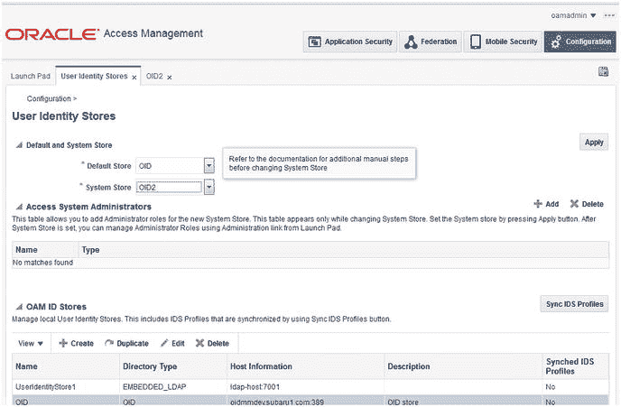
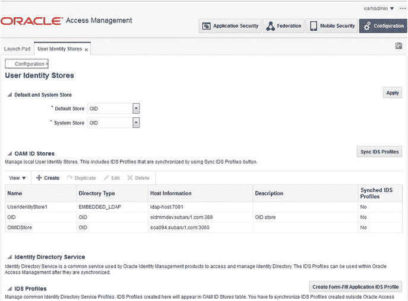
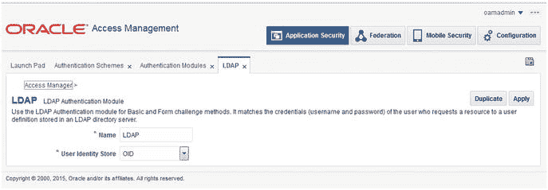

# Controls the maximum number of shared memory segments, in pages
kernel.shmall = 4294967296
kernel.sem = 256 32000 100 142
kernel.shmmax = 10737418240
```

在 `sysctl.conf` 文件中设置好这些值后，您必须激活并使用此命令验证新值是否生效：
```
[root@clouddemolab home]# /sbin/sysctl –p
net.ipv4.ip_forward = 0
net.ipv4.conf.default.rp_filter = 1
net.ipv4.conf.default.accept_source_route = 0
kernel.sysrq = 0
kernel.core_uses_pid = 1
net.ipv4.tcp_syncookies = 1
net.bridge.bridge-nf-call-ip6tables = 0
net.bridge.bridge-nf-call-iptables = 0
net.bridge.bridge-nf-call-arptables = 0
kernel.msgmnb = 65536
kernel.msgmax = 65536
kernel.shmmax = 68719476736
kernel.shmall = 4294967296
kernel.sem = 256 32000 100 142
kernel.shmmax = 10737418240
```

打开文件限制必须设置为 4096 以支持实例。为此，请编辑 `limits.conf` 文件。
```
[root@clouddemolab home]# vi /etc/security/limits.conf
```

如果要在 Oracle Linux 或 RedHat Linux 上安装环境，还必须在 `/etc/security/limits.d/90-nproc.conf` 中进行相同的编辑。如果忽略了这一步，该文件中的值可能会覆盖 `limits.conf` 文件中的值。

在这两个文件中，确保添加或编辑以下行：
```
* soft nofile 4096
* hard nofile 65536
* soft nproc 2047
* hard nproc 16384
```

编辑此文件后，必须重启服务器以确保所有更改生效。

通过确保在启动安装程序之前满足上述先决条件，大多数安装问题都可以解决或预防。

## 常见配置问题

由于 Oracle 身份和访问管理套件有三个主要组件——Oracle Internet Directory (OID)、Oracle Access Manager (OAM) 和 Oracle Identity Manager (OIM)——本节将分别介绍相关问题。

### Oracle Internet Directory

作为 OIM 和 OAM 的后端目录，如果 OID 环境配置不当，整个堆栈后续必将出现问题。虽然在此阶段配置向导会执行大部分工作，但仍可能出现问题。表 16-1 中列出的操作系统包足以满足 OID 安装需求，前述的内核参数也同样适用。正如 OAM 和 OIM 有 Java 版本范围要求一样，OID 版本对 Java 开发工具包 (JDK) 的版本和更新也非常敏感。对于 OID 11.1.1.9，请确保您使用的是 JDK 1.7 update 80。OID 可以安装在高于 update 80 的环境中，但需要仔细验证其兼容性。最常见的情况是，安装似乎运行正确。然而，在配置阶段，当域部署正在运行时，您可能会遇到问题。

许多组织使用 Active Directory 环境作为其网络轻量目录访问协议 (LDAP)。通常的做法是建立一个目录集成平台 (DIP) 来保持 OID 环境与 Active Directory 同步。有时，这种同步会要求将符合特定条件的用户添加到某个 OID 子树中，而其他用户则放入另一个子树。其他环境可能只想同步符合复杂规则集的 Active Directory 用户子集。OID 11.1.1.9 Directory 支持多组同步配置文件，每组都可以有自己的过滤规则集。然而，您可能会遇到复杂规则的问题。很多时候，这仅表现为用户未同步，并且当尝试在 EM 控制台中加载 DIP 配置文件时，控制台会挂起。此时您还会注意到服务器上的内存使用量激增。在需要类似 `searchfilter=(&(objectclass=user)(|(company= BB*))(!(objectclass=computer))` 这样的规则的情况下，请在搜索筛选器周围添加双引号，使其格式如下：`searchfilter="(&(objectclass=user)(|(company= BB*))(!(objectclass=computer)"`。

### Oracle Access Manager

OAM 为身份和访问管理环境处理单点登录 (SSO) 功能。在配置期间，可能会出现一些问题。本节涵盖了一些常见问题及解决方法。

**注意：** 在对 OAM 配置进行任何更改之前，备份一份 `DOMAIN_HOME/config/fmwconfig/oam_config.xml` 文件可能会很有用。

在 Access Manager 控制台中更改身份存储可能会有点棘手。然而，您可能正在更换身份存储，或将其迁移到新环境。在这些情况下，如果遵循一些准则，此活动可以轻松完成。首先，确保在您计划用 Access Manager 管理的新 LDAP 存储中创建一个或多个用户。理想情况下，您将保留一个名为 oamadmin 的用户和一组属于“管理员”组的用户。在图 16-1 中，显示了带有多个身份存储的 OAM 管理控制台。每个存储中至少有一个配置为管理员的用户。创建一个新的身份存储并将其设置为“系统存储”将在此页面中生成一个新部分，您可以在其中选择用于管理实例的用户和组，如图 16-2 所示。



图 16-2. OAM 身份存储选择



图 16-1. OAM 管理用户身份存储屏幕

执行这些任务后，重要的是确保正在使用的 LDAP 身份验证模块或其他身份验证模块配置为使用新的身份存储。未能执行此步骤可能会导致您将来无法访问 OAM 控制台。有关此屏幕示例，请查看图 16-3。



图 16-3. OAM 身份验证模块配置

即使做了所有准备，此过程仍有可能出错。如果这种情况发生，并且在更改后您完全无法访问 OAM 管理控制台，还有最后一个希望。在 `DOMAIN_HOME/config/fmwconfig` 目录中，您会找到一个名为 `oam-config.xml` 的文件。关闭 OAM 并编辑此文件以更改身份存储位置或其他属性。重新启动 OAM 受管服务器后，一切应该恢复正常。

**注意**


# 对 `oam-config.xml` 文件的编辑

如果您在进行更改前未关闭 OAM 服务器，那么对 `oam-config.xml` 文件的编辑将不会生效。同时，请确保递增文件开头的 `Version` 标签：`<Setting Name="Version" Type="xsd:integer">247</Setting>`

若要手动更改身份存储，请找到以下条目并将其编辑为与您的环境相匹配。请更新文件开头的 `version` 属性并重新启动 OAM。

```
dc=mycompany,dc=com
false
none
{AES}36AC17B83FF9C6D177B092FD352CB369
false
dc=mycompany,dc=com
false

cn=orcladmin
OID Store

uid
true
true

OID

userPassword
OID

ldap://ldap.mycompany.com:3060
follow

OracleUserRoleAPI

```

### Oracle Identity Manager

就其本身而言，OIM 并不是一个难以安装和配置的产品。当将其与 OID 或其他身份存储配合使用时，配置非常简单明了。但在将 OIM 与诸如 OAM 的 SSO 产品集成时，可能会遇到一些困惑。此集成涉及多个步骤，并且在不同阶段都可能遇到问题。请花些时间并仔细遵循步骤，您应该能够成功。本节介绍一些常见问题。

## 安装与配置的复杂性

Oracle Identity Management 二进制文件的安装通常是一个顺利的过程。很少出错。如果出现问题，通常是由于前面提到的因素，例如缺少操作系统软件包或 JDK 版本不正确。话虽如此，OIM 的实际配置可能有点令人困惑。很多时候，屏幕上会滚动显示一整屏的消息，某个步骤看起来似乎已正确完成。然而，某个阶段未解决或遗漏的问题可能会在后续步骤中显现。

如前所述，与 OID 和 OAM 不同（它们各自有一个 `config.sh` 或 `config.bat` 文件），OIM 实际上需要两个配置文件。对于 OIM，您必须先运行位于 `<ORACLE_HOME>/common/bin` 目录下的 `config.sh` 文件来创建域。之后，您需要运行 `<ORACLE_HOME>/bin/config.sh` 来实际配置 OIM。这对于熟悉 OID 或 OAM 环境但首次安装 OIM 的人来说可能会感到困惑。在错误的时间运行不正确的文件将导致无法指示实际问题的错误。

## 具体配置步骤

关于配置工具，安装 OIM 所需的错误版本的面向服务体系结构（SOA）可能导致许多问题。仓库配置实用程序（RCU）所需的版本与实际的 OIM 版本不匹配，这进一步加剧了问题。OIM `11.1.2.3x` 需要 SOA `11.1.1.9`。SOA `11.1.1.9` 软件是与 OIM 分开提供的下载项。没有对应的 OIM `11.1.2.3` RCU 可用。相反，您将使用 Fusion Middleware 的 `11.1.1.9` 版本。

使用带有 `–configOIM` 标签的 `idmConfigTool.sh` 配置身份存储时，可能会遇到与 `JMXCLIENTLIB` 变量相关的错误。在 Oracle 文档中，有一点不太清楚：即使您不安装 OIM Developer Console，也必须创建 `wlfullclient.jar` 文件。如果您正在配置 OAM 和 OIM 集成，则此文件必须存在。文档中，生成 `wlfullclient.jar` 文件的说明是在关于 Developer Console 的独立章节中给出的。虽然您无需将该文件复制到任何地方，但遗漏此步骤将导致运行 `idmConfigTool.sh` 文件时出错。

要解决此问题，请生成 `wlfullclient.jar` 文件。如果您在将 OIM 和 OAM 安装在同一服务器但不同的 WebLogic Server（WLS）实例中，请确保您从 OIM Home 而不是 OAM Home 运行 `idmConfigTool.sh`。这被称为分离域配置。其次，您可能需要修改您的 `CLASSPATH` 以指向 `wlfullclient.jar` 的位置，而不是 `JMXCLIENTLIB` 目录。


偶尔需要更改或更新与身份存储的连接。这可能是由于架构变更或导致需要更改主机的 OID 丢失所致。如果你的环境配置与本书中的示例类似，则它使用的是 libOVD 连接器。可以更新此连接器以反映新的 OID 或 LDAP 目录主机及连接信息。有一个名为 `adapters.os_xml` 的文件位于 `<DOMAIN_HOME>/config/fmwconfig/ovd/oim` 目录中。在修改此文件之前，请确保管理服务器和 OIM 托管服务器已关闭。查找以下部分并根据需要更新，以反映新的 LDAP 主机。请注意，仅当新的身份存储类型和版本相同，并且连接器用户名和密码也相同时，才应使用此方法；例如，OID 11.1.1.9。如果情况并非如此，你可以重新运行第 10 章中介绍的 LDAP 同步工具。

## 总结

在 Oracle 身份与访问管理套件的安装和配置过程中，有多个环节可能出现问题。安装后，你可能会遇到同步、认证和授权方面的问题。本章介绍了一些用于故障排除和解决常见问题的步骤，涵盖从安装问题到运行时和修改问题。

# 索引

## A, B, C

*   管理控制台屏幕
*   管理服务器

## D

*   数据库安全存储
*   目录集成平台
    *   高级选项
    *   连接详细信息
    *   过滤规则
    *   Fusion Middleware Control 界面
    *   主屏幕
    *   映射规则
    *   配置文件映射
    *   配置文件选择
    *   规则设置
    *   同步配置文件
        *   编辑
        *   启用
    *   排除规则
    *   日志消息
    *   跳过错误
    *   状态
*   `syncProfileBootstrap` 实用程序
*   测试器
*   目录集成平台
*   目录服务器配置

## E

*   电子商务套件，访问管理器
    *   AccessGate 文件
    *   架构
    *   清理文件
    *   配置
    *   连接用户
    *   复制构件文件
    *   DBC 文件
    *   主机列表
    *   HTTP 服务器
    *   托管服务器
    *   OAM
    *   OID
    *   配置文件配置
    *   测试
    *   `txkEBSAuth.xml`
    *   验证

## F, G, H

*   Fusion Middleware WLS
    *   组件
    *   主页配置
    *   安装
    *   JDK 选择屏幕
    *   摘要屏幕
    *   欢迎屏幕

## I, J

*   身份与访问管理
    *   Fusion Middleware
        *   集群
        *   硬件
        *   内存
        *   网络
        *   要求
        *   存储
    *   Fusion Middleware 环境
        *   集群
        *   主机配置
        *   网络规划
    *   OAM
    *   OUD
    *   WLS
*   OAM
    *   API 和 WSM
    *   云访问门户
    *   身份联合
    *   移动和社交访问
*   OAAM
*   OIM
    *   审计
    *   委派管理
    *   自助服务
    *   拓扑
*   本地高可用性
*   最大可用性
*   OAM
*   OIM
*   OUD
*   单节点
*   身份管理服务器
*   身份管理器
    *   数据库准备
    *   组件屏幕
    *   连接详细信息
    *   密码
    *   先决条件检查
    *   模式创建
    *   摘要屏幕
    *   表空间列表
*   域配置
    *   管理员密码
    *   集群屏幕
    *   组件
    *   默认端口
    *   JDBC 连接
    *   计算机屏幕
    *   托管服务器
    *   名称和位置
    *   可选屏幕
    *   启动模式
    *   摘要屏幕
    *   WLS 创建
*   安装
    *   位置屏幕
    *   先决条件检查
    *   进度屏幕
    *   欢迎屏幕
*   操作系统配置
    *   操作系统包
    *   操作系统用户
*   SOA 安装
    *   应用服务器
    *   完成屏幕
    *   位置屏幕
    *   先决条件检查
    *   进度屏幕
    *   `runInstaller` 命令
    *   摘要屏幕
*   身份管理器服务器
*   `IdmConfigTool`
    *   环境变量

## K

*   内核参数

## L, M, N

*   轻量目录访问协议
    *   安装后
    *   服务器信息
    *   注销回调

## O

*   OAM WebGate
    *   安装
    *   完成屏幕
    *   配置和部署
    *   位置
    *   先决条件检查
    *   进度屏幕
*   Oracle 访问管理器
    *   管理控制台
    *   应用程序安全选项
    *   认证模块选项卡
    *   认证方案链接
    *   配置
    *   配置问题
    *   配置菜单
    *   目录
    *   域创建
        *   集群配置
        *   组件
        *   JDBC 数据库
        *   位置
        *   计算机配置
        *   托管服务器到集群
        *   托管服务器到计算机
        *   模式配置
        *   可选配置
        *   模式
        *   服务器配置
        *   摘要屏幕
        *   用户密码
        *   欢迎屏幕
    *   `extendOAMPropertyFile`
    *   身份存储
    *   `idmConfigTool.sh` 命令
    *   安装
        *   完成摘要
        *   组件
        *   Middleware Home 目录
        *   先决条件检查
        *   进度条
        *   欢迎屏幕
    *   集成
    *   LDAP 配置
    *   `LDAPScheme` 列表
    *   OID
        *   控制标志属性
        *   创建认证器
        *   `DefaultAuthenticator` 控制标志
    *   身份存储连接
    *   参数
    *   WebLogic Server
*   操作系统配置
    *   操作系统包
    *   操作系统用户
*   `preConfig OAM` 属性
*   RCU
    *   组件
    *   数据库详细信息
    *   预检查
    *   模式创建
    *   模式密码
    *   摘要屏幕
    *   表空间列表
*   系统和默认存储
*   测试连接
*   故障排除
*   用户身份存储屏幕
*   Oracle 自适应访问管理
    *   风险分析组件
    *   用户界面组件
*   Oracle 目录服务
    *   OID
    *   OUD
    *   OVD
*   Oracle Fusion Middleware 补丁集助手
*   Oracle HTTP 服务器
    *   安装与验证
        *   完成屏幕
        *   组件屏幕
        *   详细信息屏幕
        *   Middleware Home
        *   端口配置
        *   先决条件检查
        *   进度屏幕
        *   摘要屏幕
    *   Web Cache
    *   Web 层安装程序
    *   操作系统配置
        *   操作系统包
        *   操作系统用户
*   Oracle HTTP Server WebGate
*   Oracle 身份管理
    *   配置问题
*   Oracle 身份管理器
    *   审计
    *   配置
    *   配置服务器
    *   定制
    *   数据库安全存储
    *   定义
    *   委派管理
    *   集成
    *   LDAP 安装后
    *   预配置步骤
    *   预配置 OID 身份存储
    *   自助服务
    *   UI 定制。沙盒
    *   工作流
*   Oracle Internet 目录
    *   配置
        *   数据库信息
        *   默认值
        *   实例位置
        *   OVD 信息屏幕
        *   参数
        *   端口配置
        *   领域信息
        *   签名和加密密钥库
        *   摘要信息
        *   URL 和目录位置
        *   WebLogic 域
        *   欢迎屏幕
    *   配置问题
    *   安装
        *   检查屏幕
        *   目录结构
        *   身份管理
        *   进度屏幕
        *   root 脚本
        *   摘要屏幕
        *   类型屏幕
        *   更新屏幕
    *   操作系统配置
        *   操作系统包
        *   操作系统用户
    *   验证
        *   Fusion Middleware Control 屏幕
        *   身份组件状态屏幕
        *   OPMN 控制
        *   `opmnctl status` 命令
*   Oracle 平台安全服务模式
    *   数据库安全存储
*   Oracle 进程管理器和通知服务器控制
*   Oracle 统一目录
*   Oracle 虚拟目录

## P, Q

*   策略管理
    *   访问策略
    *   管理角色
    *   能力
    *   管理角色
    *   成员角色
    *   控制范围
*   密码策略

## R

*   存储库创建实用程序
    *   配置参数
    *   数据库选择
    *   先决条件检查
    *   模式密码
    *   选择屏幕
    *   摘要屏幕
    *   表空间映射
    *   欢迎屏幕

## S

*   沙盒
    *   内容属性
    *   内容视图
    *   创建
    *   定制链接
    *   徽标图像
    *   结构视图
*   安全套接层
*   安全断言标记语言
*   面向服务的架构
*   单点登录启用

## T

*   拓扑
    *   拆分配置文件
    *   用户和组群体
*   透明数据加密

## U, V

*   用户和策略存储
    *   LDAP 目录结构
    *   对象类
    *   OID
        *   DIP
        *   目录同步
        *   安全和数据隐私
        *   TDE
        *   可用性和管理
    *   OUD
        *   架构
        *   复制
        *   可扩展性
        *   可用性和可管理性
    *   OVD
        *   访问管理
        *   聚合
        *   架构
        *   概述

## W, X, Y, Z

*   WebLogic Fusion Middleware Control
*   WebLogic Server
    *   组件
    *   环境特性
