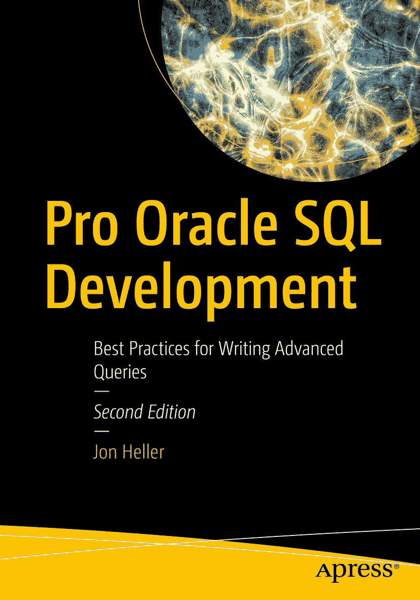

ISBN 978-1-4842-8866-5 e-ISBN 978-1-4842-8867-2 [`doi.org/10.1007/978-1-4842-8867-2`](https://doi.org/10.1007/978-1-4842-8867-2) © Jon Heller 2019, 2023

本作品受版权保护。出版商独家拥有所有权利，无论涉及材料的全部或部分，特别是翻译、转载、插图复用、朗诵、广播、缩微胶片或其他任何物理方式的复制，以及信息存储与检索、电子改编、计算机软件，或现在已知或今后开发的类似或不同方法的传播权。

在本出版物中使用通用描述性名称、注册商标、服务标志等，即使未作特别声明，也不意味这些名称不受相关保护性法律法规的约束，因此可自由用于一般用途。

出版商、作者和编辑均安全地假设本书中的建议和信息在出版时是真实准确的。出版商、作者或编辑均不对本出版物所含材料或可能存在的任何错误或遗漏提供任何明示或暗示的担保。出版商对已出版地图中的管辖权主张和机构隶属关系保持中立。

此 Apress 印记由 Springer Nature 旗下注册公司 APress Media, LLC 出版。
注册公司地址为：1 New York Plaza, New York, NY 10004, U.S.A.

*我将本书献给我出色的妻子丽莎（Lisa），以及我棒极了的孩子埃利奥特（Elliott）和奥利弗（Oliver）。*

