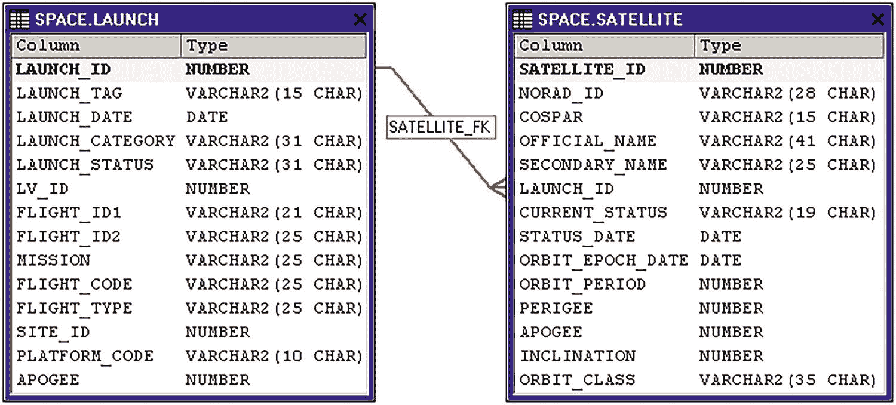

# 引言

本书将激励你编写更强大的数据库查询，并引导你走上成为 Oracle SQL 专家的道路。本书不是 SQL 语言参考手册的复刻版，不会考查你语法细节，也不会帮你备考。但它将挑战你编写 Oracle SQL 的思维方式。我希望你在阅读过程中能获得乐趣。

## 为何要更深入地学习 Oracle SQL？

任何数据库都能*存储*数据，但 Oracle 的设计旨在帮助我们*处理*数据。许多应用程序仅将数据库视为一个华丽的文本文件，而实际上有很多机会可以通过使用 SQL 来改进我们的程序。

Oracle SQL 是一门出色的编程语言，与其他语言和 SQL 实现相比，它具有许多优势：

1.  **声明式**：声明式语言让我们告诉计算机我们想要什么，而不必指定如何实现。声明式语言不同于传统的命令式语言，一开始可能会让人感到困难。例如，每当我们在 SQL 中想要使用循环时，那正是我们采用了错误编程范式的线索。SQL 让编译器处理实现细节，从而产生更简洁、更快速的代码。
2.  **流行**：Oracle 是最流行的数据库之一，而 SQL 是最流行的编程语言之一。
3.  **可移植**：SQL 和 PL/SQL 完全独立于平台。除了罕见的错误，我们永远无需担心运行 SQL 的操作系统。
4.  **清晰简洁**：基本语法简单易读，关系模型建立在几个简单的理念之上。如果这与你的现实不符，第三部分将解释如何让你的代码看起来更好。
5.  **解释型**：语句立即运行，无需单独的编译步骤。集成开发环境（IDE）可以利用解释型语言的优势，让我们即时运行程序、调试代码并获取结果。
6.  **功能强大**：Oracle SQL 拥有足够的特性来解决几乎所有问题。对于那些需要精确控制数据库代码运行方式的罕见例外，我们有集成良好的命令式选项，例如 PL/SQL、提示（hints）和 `MODEL` 子句。
7.  **快速**：Oracle SQL 功能强大，足以让我们将算法带到数据面前，而不是将数据带到算法面前。不要理会那些肤浅的基准测试，它们只是比较执行一千次 `SELECT * FROM EMPLOYEE`。现实世界的性能取决于优化器选择正确的数据结构和算法，以及一种能够通过基于集合的处理来解决更多问题的语言，而非重复执行琐碎命令的速度。

尽管有这些优势，Oracle SQL 的使用却出人意料地不充分。通过更频繁地使用 SQL，存在着巨大的系统改进机会。

## 目标读者

本书面向任何已经了解 Oracle SQL 并准备将技能提升到新水平的人。对于那些已经精通 Oracle SQL 的读者，本书将为你提供一种思考该语言的不同方式。

有许多人群经常使用 Oracle 数据库。他们使用数据库的原因可能不同，但都可以通过提高 SQL 知识而受益。

1.  **数据库开发者**：如果你已经经常使用 Oracle 数据库，那么你将从本书中获益最多。即使你已经了解许多高级特性，关于环境设置、SQL 编程风格和 SQL 性能调优的讨论仍会让你受益。
2.  **应用/前端/全栈开发者**：许多应用程序仅使用简单的查询，如 `SELECT * FROM EMPLOYEE`，或者有一个自动处理数据库访问的框架。本书不会试图说服你将所有业务逻辑都放入数据库。但它将帮助你通过使用新的 SQL 编程风格和高级特性，找到简化代码和提高性能的绝佳机会。
3.  **数据分析师和测试人员**：Oracle SQL 是分析、测试和比较数据的完美语言。本书中的许多建议将对这些任务有所帮助。
4.  **数据科学家**：你可能不会将 Oracle SQL 用于数据挖掘和机器学习（尽管 Oracle 确实有用于这些任务的工具）。但如果你的数据存储在 Oracle 数据库中，Oracle 的高级特性至少可以帮助你高效地提取、预处理和格式化数据。
5.  **数据库管理员**：SQL 是 Oracle 数据库的命脉。如果你管理 Oracle，你将需要处理 SQL 语句并帮助他人改进它们。而且，很多时候，一条高级 SQL 语句可以帮助你更好地执行管理任务。


## 书籍结构

本书分为五个部分。各章节之间存在递进关系，但耦合度不高，你应该能够轻松地在不同章节间跳转阅读。

**第一部分：学会如何学习（第 1-5 章）**：第一部分帮助你为高级的 Oracle SQL 开发奠定基础。然而，这些不仅仅是入门主题。本部分包含一些具有争议性的观点，如果你已经有一定基础，本书可能会建议你打破现有认知，重新开始。

**第二部分：使用集合与高级特性编写强大的 SQL（第 6-10 章）**：这一部分为思考查询提供了一个清晰的思维模型。然后，它将向你介绍编写高级 SQL 语句所需的高级特性、模式对象、概念和架构信息。

**第三部分：使用模式与风格编写优雅的 SQL（第 11-15 章）**：这一部分教你构建优美 SQL 语句的艺术。你不能简单地将高级特性堆砌在一起，而是必须培养一种既能构建可读性强的查询，又能避免常见反模式（anti-patterns）的风格。

**第四部分：提升 SQL 性能（第 16-18 章）**：这一部分通过实用的算法分析帮助你更深入地理解性能，并解释了许多调优概念和性能技巧。

**第五部分：用 Oracle SQL 解决任何问题（第 19-21 章）**：最后几章将向你展示如何将技能提升至最终水平。这一部分介绍了一些最高级的 SQL 特性，并简要讨论了 PL/SQL。

本书旨在引入新的思想、特性、风格、理论和思维方式。它可能挑战你以不同的方式思考自己的风格和流程，但其目的*不是*用语法琐事来困扰你。不要试图记住所有语法——重要的是记住这些概念。

## 示例模式

本书中的示例使用了从 JSR Launch Vehicle Database 生成的数据集。该数据集以及简单的安装说明可以在 [`https://github.com/apress/pro-oracle-sql-dev-2e`](https://github.com/apress/pro-oracle-sql-dev-2e) 找到。如果你想运行示例，但没有一个方便的数据库，第 2 章提供了创建开发环境的建议。

该模式简单、小巧、真实，并且希望是有趣的。这个示例模式包含了截至 2017 年所有 70,000 次尝试进行的轨道和亚轨道发射的数据，而不是一个无意义的虚构 `EMPLOYEES` 列表。如果你对太空飞行感兴趣，你可以使用这些数据回答真实的问题。

以下是主要的表格，大致按重要性和它们之间的关系列出。这些列和关系很简单，这里不详细解释。无需研究大型的实体关系（ER）图——只需花几秒钟熟悉一下表名：

```
LAUNCH
LAUNCH_PAYLOAD_ORG
LAUNCH_AGENCY
SATELLITE
SATELLITE_ORG
ORGANIZATION
ORGANIZATION_ORG_TYPE
SITE
SITE_ORG
PLATFORM
LAUNCH_VEHICLE
LAUNCH_VEHICLE_MANUFACTURER
LAUNCH_VEHICLE_FAMILY
STAGE
STAGE_MANUFACTURER
LAUNCH_VEHICLE_STAGE
ENGINE
ENGINE_MANUFACTURER
ENGINE_PROPELLANT
PROPELLANT
```

模式中最重要的表是 `LAUNCH` 和 `SATELLITE`。图 1 展示了这两个表的列以及它们之间简单的关系。任何不明显的列在示例中使用前都会被解释。



图 1 展示了两个表。标题分别是 `Space.launch` 和 `Space.satellite`。每个表都有一个类别列和类型。`Satellite_FK` 连接着两个表。

**图 1：两个最重要表的图示**

## 运行示例

这些示例应该适用于任何当前支持的 Oracle 平台、版本和版本号。本书保守地假设你运行的版本是 12.2，并且会在某个特性是 18c、19c 或 21c 的新特性时进行说明。实际上，数据库版本并不像招聘人员让你相信的那样重要，本书中的大部分信息适用于任何版本的 Oracle。

虽然示例和结果通常以文本形式展示，但我强烈建议你使用图形化的 IDE 来运行示例和查看结果。IDE 对于创建、阅读和调试大型、高级的 SQL 语句至关重要。

为了避免重复模式名称，示例假设你已将空间数据集安装在你个人的模式中。如果你将数据集安装在一个单独的模式中，在运行示例之前，请在你的会话中运行如下命令：

```
alter session set current_schema=space;
```

就像数据集一样，你可以在 [`https://github.com/apress/pro-oracle-sql-dev-2e`](https://github.com/apress/pro-oracle-sql-dev-2e) 找到本书中使用的所有代码示例。如果你发现任何错误，可以克隆该仓库并创建一个 GitHub issue。

不要被数据集和示例吓倒。本书是关于 SQL 开发流程、高级特性、编程风格和性能概念的。运行示例很有帮助，但对于阅读本书和理解材料来说并非必要。

## 致谢

许多人的帮助使本书得以面世。首先，我要感谢技术审校者迈克尔·罗森布鲁姆，他提供了许多修正和富有洞察力的意见。

感谢乔纳森·詹尼克，他在多年前联系我写书，此后一直提供出色的指导和反馈。感谢 Apress 的其他所有人，特别是吉尔·巴尔扎洛、劳拉·贝伦德森、西伦巴拉桑·潘尼塞尔瓦姆和克莱门特·威尔逊。同时感谢那些就第一版向我提供宝贵反馈的人们。

许多人帮助我成长，并使我达到了能够写书的人生阶段：我的父母，他们创造了一个成功似乎不可避免的环境；我在 National Instruments、Talecris、PPD、IFMC、Terra Technology、GDIT、Ventech Solutions、Businessolver 和 R+L Carriers 的同事们；帮助我改进开源程序的用户们；给我机会展示的会议组织者；以及 Stack Overflow 上激励我完成大量工作以赢得无意义的网络积分的用户们。

我衷心感谢那些创建和整理了宝贵知识财富的人们，这些知识帮助本书得以完成：感谢乔纳森·麦克道尔创建了用于空间数据集的 JSR Launch Vehicle Database，以及无数为 Oracle 手册、博客和维基百科文章做出贡献的人们，这些资源在本书的写作过程中给了我莫大的帮助。

最重要的是，我要感谢我的妻子丽莎，感谢她一直支持我，同时为我们的家庭和社区付出了如此多的努力。同时感谢我的孩子们埃利奥特和奥利弗，他们鼓励我并等待我完成写作，以便我能有更多时间陪伴他们。

## 关于作者 关于技术审校者

