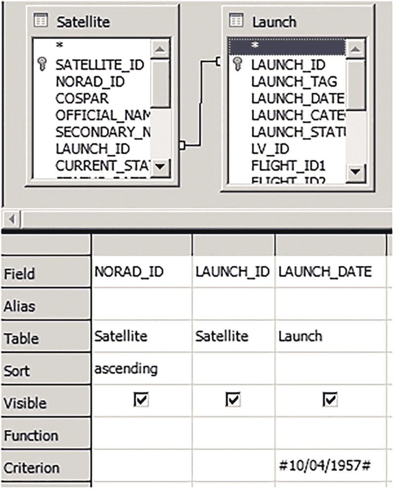
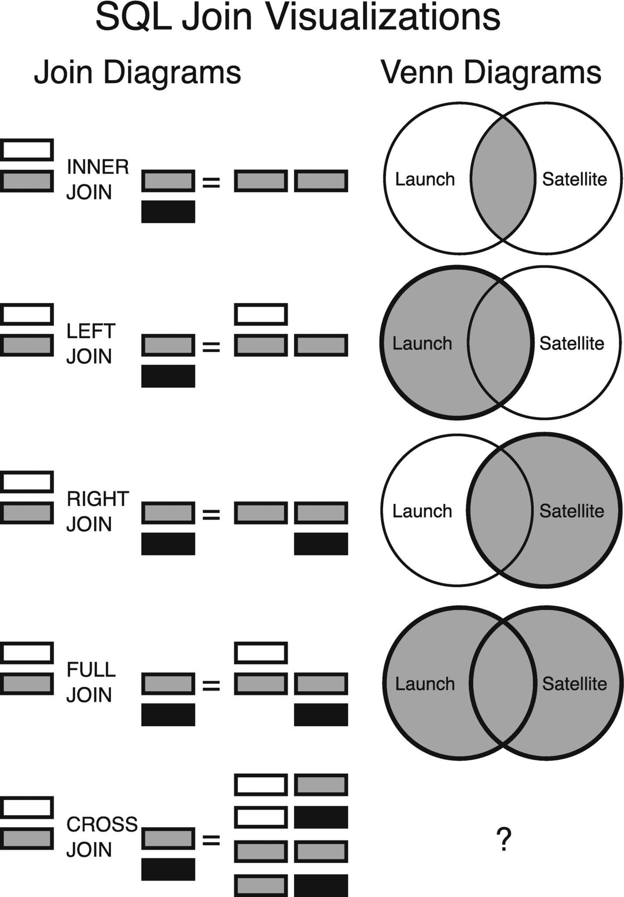
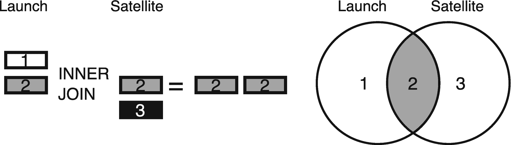

# 1. 理解关系数据库

理解关系数据库背后的历史和理论有助于我们更深入地理解 Oracle SQL。这些信息帮助我们避免重蹈覆辙，并给予我们偶尔忽略理论、构建实用解决方案的信心。本书假设你已经熟悉关系数据库和 SQL，因此这里提供的信息不仅仅是*入门*性质的；它是*基础*性的。


## 关于关系数据库的历史

简要了解关系数据库的历史有助于我们认识这项技术的重要性，并理解甲骨文公司的决策。Oracle 数据库是一个庞大的产品，其中不可避免地会存在一些错误。其中一些错误是无关紧要的历史趣闻，而另一些则是我们需要避免的巨大陷阱。

关系数据库建立在关系代数和关系模型之上，后者由**E. F. Codd**于 1970 年首次通俗地阐述。关系模型建立在集合论的基础上，这是一种处理对象集合的数学方法。关系模型将在下一节更详细地讨论。

IBM 于 1968 年开始研究关系技术和产品，但多年后才发布商业产品。这是第一个历史教训：最好者是足够好者的敌人。甲骨文公司的联合创始人拉里·埃里森听说了 IBM 的项目，实现了它，并于 1979 年发布了第一个商业化的 SQL 数据库。他在数据库世界中拥有巨大的影响力，并且至今仍参与许多数据库决策。

甲骨文公司当然利用了其先发优势。长期以来，Oracle 数据库一直是最受欢迎的数据库产品。虽然当前有从 Oracle 和 SQL 迁移的趋势，但我们不应忽视它们有多么受欢迎。在几乎所有的数据库受欢迎度指标上，该数据库得分都很高。

Oracle 的“年龄”解释了许多其出人意料的行为。以下列表包含了那些最可能让 Oracle 新开发者感到困惑的特性：

1.  `(+)`： Oracle 最初使用像`(+)`这样的语法，而不是`LEFT JOIN`这样的关键字。这种过时的语法是糟糕的编码实践，并在第 6 章和第 7 章有更详细的讨论。

2.  `Date`： Oracle 的日期类型也包含时间，或许应该被称为`DATETIME`。在引入 ANSI 日期字面量之前，日期格式化一直很笨拙，这在第 15 章中有所讨论。

3.  空字符串： Oracle 将空字符串视为 null，而不是大多数程序员期望的一个独立值。（然而，我认为 Oracle 在这里不一定错了。我们没有零长度的日期或零长度的数字；为什么我们应该有零长度的字符串？）

4.  30 字节名称限制： SQL 和 PL/SQL 语言具有类英语的语法，但如果我们使用常规单词作为名称，很快就会碰到 30 字节的限制。而好的变量名对于提高程序可读性至关重要。幸运的是，这个问题在 12.2 版本中得到了修复，允许 128 字节。

5.  `SQL*Plus`怪癖： `SQL*Plus`对于某些任务来说是一个很好的工具，但在许多方面确实显得老旧。

为 Oracle 辩护的话，这些错误是在任何标准存在之前犯的。另一方面，Oracle 也并不总是努力遵守标准。例如，Oracle 过去声称其“部分”符合标准，因为它允许长名称。虽然 30 字节是一个更大数字的“部分”，但这并不真正符合标准的精神。

比原谅 Oracle 的错误更重要的是，理解甲骨文公司如何应对行业趋势。有时感觉他们的技术采用了一种“开火并运动”的策略。他们添加了如此多的功能，以至于没有人可能跟得上他们。然而，添加大量功能现在可能适得其反。为每个任务构建小工具的 Unix 哲学似乎正在占据上风。

以下列表显示了 Oracle 所经历的最大的架构和概念性变革，以及它们引入的版本。这些不一定是最重要的功能，而是那些试图重新定义数据库是什么的功能：

*   `Multiversion concurrency control (MVCC)`： 4
*   `PL/SQL`： 6
*   `Object-relational, Java`： 8
*   `OLAP, XML (Extensible Markup Language), RAC`： 9
*   `JSON, sharding, in-memory, containers (multitenant)`： 12
*   `Property graph, autonomous database, documents`： 18
*   `Cloud integration`： 19
*   `MLE (multilingual engine)`： 21

添加新功能很少会损害销售，但其中一些新功能可以说让 Oracle 走向了错误的方向。例如，数据库中的对象关系和 Java 存在显著问题。这些缺点在第 10 章和第 15 章中讨论。

Oracle 总会添加新功能以跟上竞争对手，即使该功能没有意义。并非甲骨文公司所做的一切都是“未来”。Oracle 是一个庞大的产品，有时会同时向多个相互矛盾的方向发展。我们需要记住不要盲目追随，也不要为了闪亮的新事物而抛弃经过验证的技术。

另一方面，Oracle 几乎支持所有功能是件好事。它是数据库解决方案的瑞士军刀。我们不需要为每一个新技术趋势都使用一个新的数据库。

技术变革的速度正在加快，没有人能预测未来。鉴于过去，可以安全地说 Oracle 将会添加或发明新的重要功能。我们并不总是想立即开始使用新功能，但我们至少应该花时间阅读手册中“新特性”章节的内容。

## 关系模型及其重要性

关系模型在计算机科学和编程领域产生了巨大的影响。有许多论文、书籍和课程与关系数据库系统的理论相关。我们不需要对关系模型有透彻的理解就能成为一名成功的 SQL 开发者，但我们至少应该有一个入门级的理解。

### 历史

关系模型是 Oracle 数据库的理论基础。它首次由**E. F. Codd**在 1970 年的论文《大型共享数据库的关系数据模型》中描述。我推荐阅读这篇论文；它出人意料地易懂且至今仍有价值。本节的大部分内容都基于那篇原始论文，尽管**E. F. Codd**和其他人在其他著作中对关系模型进行了扩展。

### 术语

理解关系模型至少可以帮助我们理解别人。几乎没有好的理由使用理论术语`relation`、`tuple`和`attribute`，而不是更常见的`table`、`row`和`column`。即使是**E. F. Codd**的论文也在多处使用了那些常见词汇。但既然有些人坚持使用那些花哨的术语，我们不妨也学习一下。

表 1-1 直接复制自 Codd 的原始论文。有一个名为`SUPPLY`的`relation`（表）。它有三个`tuple`（数组或行）和四个`simple domains`（属性、字段或列），意味着它的`degree`是四。`Primary key`唯一标识每一行，是`SUPPLIER`、`PART`和`PROJECT`的组合，其中每一个也是指向另一个关系的`foreign key`。外键确保查找值在它们引用的表中实际存在。

表 1-1

supply

| 供应商 | 零件 | 项目 | 数量 |
| --- | --- | --- | --- |
| 1 | 2 | 5 | 17 |
| 1 | 3 | 5 | 23 |
| 2 | 3 | 7 | 9 |

### 关系模型

#### 简洁性

关系模型的核心就在于**简洁**。它并非比其他系统更强大，只是更易用。（所以请放心，本节不会涉及任何证明或公式。）

简洁性是通过*规范化*和*主键*来消除*冗余*和*非简单域*而实现的。在实践中，这些概念转化为两条简单的规则：不要存储值列表，不要重复列。在前述的 `SUPPLY` 表中，添加如 `DELIVERY_DATES` 或 `SUPPLIER_NAME` 这样的列将是一个巨大的错误，即使这些列起初看起来可能很方便。`DELIVERY_DATES` 可能是一个以逗号分隔的值列表，它易于读取，但难以进行筛选或连接。`SUPPLIER_NAME` 紧挨着供应商编号看起来可能不错，但它将是 `SUPPLIER` 表中已有值的重复。这些重复的列会导致*更新异常*，即相关列对值的认定无法保持一致。

关系模型的规则可以总结为：让模式（Schema）智能，但让表保持简单。重要的是表之间的*关系*。这些关系通过约束和连接来建立，但如果数据不简单，这些约束和连接就无法正常工作。

#### 集合与表

从简单关系或仅仅简单集合的角度来思考数据库，是编写出色 Oracle SQL 的关键之一。我们使用关系模型来检索集合，将它们连接成新集合，再将这些集合连接起来，等等。就像用户界面设计一样，两个简单的选择优于一个困难的选择。在脑海中构建关于数据库集合和表的良好模型需要时间，所以如果你现在还没完全理解，也不必感到困扰。本书中会多次讨论这个主题。

表如此普遍，以至于我们很容易将其视为理所当然。我们不仅在数据库中使用它们，还在电子表格、HTML 以及许多其他地方使用它们。我们不应因为一个数据结构乍看之下过于简单而回避使用它。当我们遇到难以将数据放入一个表的问题时，答案不是创建一个更复杂的表，而是创建更多的表。

#### 实现关系模型的问题

科德（Codd）的论文预见到了实现关系模型的困难。事实证明，他的担忧是有充分依据的。

抽象存储机制赋予了数据库系统许多职责。数据库必须创建和维护物理数据结构，并选择访问这些数据结构的算法。如果尼克劳斯·沃思（Niklaus Wirth）的著作《*算法 + 数据结构 = 程序*》的书名是正确的，那么数据库要做的工作就很多了。这些额外的工作是个问题，但 Oracle 为我们承担了繁重的部分。例如，虽然我们需要选择对哪些列进行索引，但我们通常不需要确切知道 Oracle 将如何物理创建和维护这些数据结构。索引维护算法是 Oracle 公司程序员需要解决的问题，也是我们为其软件付费的原因。

不幸的是，Oracle 无法将所有事情自动化。Oracle 提供了多种存储选项，如索引、缓存、内存列存储等。它还提供了通过表和列统计信息等方式收集关于这些关系的元数据的方法。在性能和存储之间存在许多复杂的权衡，我们必须帮助决定何时值得进行这种权衡。当处理 `N` 列时，至少有 `N!` 种排列组合^(⁶) 来决定如何存储它们。

尽管科德在其论文中坚持规范化，但他也明白冗余数据是不可避免的。防止冗余数据的不一致很难，因为不一致是一种状态，而不是一个特定动作。E. F.科德预测了使用元数据系统来识别冗余，并且这些冗余可以通过实时或批处理作业来预防。据我知，目前尚不存在自动防止冗余的系统。也许未来某个版本的 Oracle 会有 `ASSERT` 功能来填补我们关系模型实现中的这一空白。就目前而言，需要我们自己意识到不一致问题，并采用有纪律的方法来减轻其影响。简单地说，如果我们创建了一个错误的列，那就是*我们*的问题。

#### 关系模型及其为何无关紧要

世界没有完美的模型。抽象是为了简化事物而构建的，但这些抽象不可避免地会不适用，或者掩盖了必须处理的重要细节。狂热地坚持关系模型会导致问题。

不要被那些提供虚假选择的书籍和产品所愚弄；我们不必在实现纯粹的关系解决方案和完全放弃关系模型之间做选择。当前的关系数据库和 SQL 语言不必完美也能发挥作用。我们必须避免寻找纯粹而真实的解决方案的诱惑，而要拥抱务实的妥协。

接下来的几节将讨论关系模型中在实践中并不总是有效的部分。好消息是，总有变通办法。

#### NULL 问题不是问题

对关系数据库最大的理论抱怨之一是它们使用 `NULL` 的方式。带有空值的三值逻辑很奇怪，需要时间来适应。表 1-2 是一个解释 `NULL` 如何工作的真值表。

表 1-2

`NULL` 三值逻辑

| A | B | = | != |
| --- | --- | --- | --- |
| 1 | 1 | 真 | 假 |
| 1 | 0 | 假 | 真 |
| 1 | `NULL` | 未知 | 未知 |
| `NULL` | `NULL` | 未知 | 未知 |

`NULL` 很奇怪，但我们的数据也是如此。很多时候我们并不知道某些事情。可能会想用我们不知道某事的原因列表来替代 `NULL`。但有很多时候我们甚至不知道*为什么*我们不知道。而且这些原因列表会迅速增长并变得荒谬。

通过为每个可为空的列创建一个单独的表，*可以* 消除 `NULL`。但创建如此大量的表很快会变得一团糟。

例如，有些人没有名字、中间名或姓氏。我们可以创建单独的表 `EMPLOYEE_FIRST_NAME`、`EMPLOYEE_MIDDLE_NAME` 和 `EMPLOYEE_LAST_NAME` 来存储员工姓名，而不是使用可为空的列。每个表只有两个值：`EMPLOYEE_ID` 和 `NAME`。如果某个员工没有中间名，那么在 `EMPLOYEE_MIDDLE_NAME` 表中就不会有对应其 `EMPLOYEE_ID` 的行。恭喜！我们刚刚创建了一个没有任何 `NULL` 的模式。但现在我们需要连接四个表才能找到一个人的姓名。如果将来其他列也变成可为空的，我们就必须对模式进行重大更改，而不是仅仅修改单个列。姓名可能很复杂，有时将其存储在多个表中可能是合理的，但不要出于对 `NULL` 的恐惧而这样做。

`NULL = NULL` 返回未知，在大多数上下文中这等同于 `FALSE`，这种感觉很不自然。当我们编写一个与 `NULL` 进行比较的 `NOT IN` 表达式却不返回任何结果时，也很烦人。但这些问题并不意味着我们的数据库包含一个定时炸弹，就像某些可怕的 Y2K 漏洞一样等待着毁灭一切。未知数据带来了挑战，但我们需要适应不确定性。

#### 列的顺序至关重要

在关系模型中，列和行的物理顺序并不重要。物理数据独立性相比那些顺序至关重要的系统是一个巨大的改进。数据独立性不仅是一个历史性问题；如果我们错误地将复杂、格式化的数据存储在一个单一值中，这个问题仍然会出现。

E. F. Codd 的论文并不意味着 `逻辑` 列顺序不重要。他论文中的示例具有有意义的顺序，有助于读者理解列之间的关系。将相似的列分组，并在不同的表中以相同的顺序列出，这使他的示例更易于阅读。有意义的列顺序也能让我们的模式更易理解。

我们的系统可能有用户指南、精美的实体关系图（ER 图）和其他形式的文档。但我们模式的主要接口是简单的 `SELECT` 语句。其他 SQL 开发人员是通过 `SELECT * FROM SOME_TABLE` 的输出来查看和理解我们的表，而不是通过过时的 PDF 文件。

我们不应该只是把新列扔到表的末尾。如果合理的话，我们应该花时间重新排列列的位置。更改列顺序是一个简单的操作，只需要将列临时设置为 `INVISIBLE`，然后再设置回 `VISIBLE`。那几分钟只花一次；糟糕的表设计会困扰我们好几年。

#### 反规范化

理想情况下，我们的关系数据库是完全规范化的，不包含非原子值，也不包含冗余值。坚持一个严格的“不允许非原子值”的规则是合理的，并禁止任何人存储逗号分隔的列表。然而，坚持防止冗余值并不总是现实的。并非每个系统都应该处于第三范式。

有时，为了提高读取性能，需要多次写入数据。这可能意味着在某个地方添加列的第二个版本，并通过触发器同步它们，或者可能创建一个物化视图，例如获取预连接表的某个时间点的快照。这是在存储、速度和一致性之间复杂的权衡。

在许多系统中，必须做出这种权衡，而这些权衡并不会破坏关系模型。E. F. Codd 的论文讨论了反规范化的问题，但他的论文也承认无论如何反规范化都会发生。

#### 所有行都是唯一的

关系模型建立在集合之上，而集合不能有重复的元素。这意味着所有行，以及所有查询结果，都应该是唯一的。

有一个强制所有 `SQL` 查询结果唯一性的系统可能是有帮助的。拥有真正重复的值几乎没有意义——应该总是有一种唯一的方式来标识一个值。我们都曾因为担心而给查询加上额外的 `DISTINCT` 操作符。

但强制执行这条规则并不实际。检测重复值的方法有限，每种方法要么需要大量存储空间，要么需要额外的处理时间，或者两者兼需。对大型数据集进行排序和哈希处理非常痛苦，以至于我们宁愿接受存在重复的可能性，也不愿总是检查结果。

## `SQL` 编程语言

仅有一个关系 `模型` 是不够的；我们还需要一种专门的编程语言来与数据交互。人们曾多次尝试创建这样的语言，而 `SQL` 是最终的赢家。

### 历史与术语

1970 年，E. F. Codd 的论文讨论了对数据语言的需求——一种由组合 `关系运算符` 形成的 `关系代数`——最好是一种能处理简单关系的简单语言。

与关系模型一样，了解这些关系运算的官方名称至少可以帮助我们理解别人在谈论什么。`投影` 是只选择某些列。`连接`，当然是将关系组合在一起。`限制` 或 `选择` 通过应用 `谓词` 来限制关系的元组。（这意味着结果由返回真或假的函数过滤。）一个 `笛卡尔积` （`CROSS JOIN`）产生的结果集包含来自两个集合的所有可能的元素组合。`集合并集` （`UNION ALL`）合并一个集合的所有元素，而 `集合差集` （`MINUS`）返回集合之间的差集。

在 20 世纪 60 年代，IBM 创建了结构化英语查询语言，即 `SEQUEL`。但不要用历史来争论如何正确发音 "`SQL`"。只需接受一个事实：在像 PostgreSQL 和 MySQL 这样的数据库中，它通常被发音为 "S-Q-L"；而在像 SQL Server 和 Oracle 这样的数据库中，它通常被发音为 "SEQUEL"。

`SQL` 与 `COBOL` 有些相似，因为它们都有类似英语的语法，并且最初都是为业务用户设计的。当 `PL/SQL` 被添加进来时，它延续了类似英语语法的趋势，例如，使用 `BEGIN` 和 `END` 而不是花括号。Oracle 另一个类似自然语言的特性是列表从 1 开始，而不是 0。如果我们发现自己创建了一个看起来像《黑客帝国》屏幕上的程序，那我们就已经严重偏离了初衷。

`SQL` 经常出现在编程语言流行度排行榜的顶端附近。^(⁷) 而这些网站可能仍然低估了该语言的真实受欢迎程度，因为许多非程序员使用 `SQL` 但不参与开发者调查。`PL/SQL` 不是一线语言，但它出人意料地接近一线。^(⁸)

### SQL 的替代方案

世界充满了各种查询语言。有用于处理 XML 的 XQuery，用于查询图数据库的 Cypher，用于通过互联网查询数据的 REST API，等等。但当涉及到查询关系型数据时，SQL 无疑是最佳选择。

对于查询关系型数据，SQL 的替代方案只具有学术或历史意义。像 QUEL、Rel 和 Datalog 这样的语言可能很有趣，但并不实用。技术并非总是人气竞赛，但 SQL 是如此主导，以至于不使用它来进行关系查询是荒谬的。即使有另一种语言更好，它也不会有大量为其编写的程序或大量熟悉它的人。

SQL 对未来来说是一个安全的选择吗？预测不会出现更好的技术是愚蠢的，但预测在不久的将来不会有显著更好的技术取代它是合理的。

有些语言会变老并逐渐消失，但有些语言是永恒的。C 和 Lisp 比 SQL 更古老，但它们不会很快消失。Fred Brooks 在 30 多年前撰写关于技术的文章时，就警告我们不要期望软件开发有任何“银弹”。也就是说，不要期望单一项新技术能带来数量级的改进。SQL 是一种不断发展的高级语言，很可能这种语言已经是我们所能获得的用于查询关系型数据的最佳工具了。

有些人寄希望于可视化编程语言有朝一日能使数据库查询变得更容易。不幸的是，这不太可能发生，原因有几个。

可视化查询构建器和 SQL 本身一样古老，始于 1970 年代的示例查询（QBE）。这个想法已被多次实现，但很少用于非平凡的查询。用图片编程看起来很酷，但人们很容易忘记文本有多么强大。文本可以轻松共享、修改和进行版本控制。在编程中，一幅图不值千言万语：它只值 50 个。

> 可视化编程的问题在于，屏幕上同时显示的视觉原语不能超过 50 个。
> 
> —L. Peter Deutsch

视觉原语的确切数量尚有争议，但可视化编程语言的信息密度无疑低于文本。

当我在美国国家仪器公司实习时，我有幸在创建了 LabVIEW 的公司工作，这可以说是最好的可视化编程语言。该语言使用起来很有趣，非常适合测试和测量任务。但即使是这家公司的员工也会欣然承认，可视化编程并非万能药。

作为可视化编程的一个例子，图 1-1 展示了一个针对“引言”中简要解释的空间模式的简单查询。



该代码片段包含卫星和发射任务选项，以及一个包含四列七行的表格。

图 1-1
LibreOffice Base 中的可视化查询

前面的查询查找了在 1957 年 10 月 4 日发射的所有卫星。乍一看，图像看起来不错。但可视化查询只在简单示例中看起来美观。可视化查询构建器无法扩展，表之间的连接线很快就会看起来像一团乱麻。以下是使用 Oracle SQL 的相同查询：

```sql
select
    satellite.norad_id,
    satellite.launch_id,
    launch.launch_date
from satellite
join launch
    on satellite.launch_id = launch.launch_id
where trunc(launch.launch_date) = date '1957-10-04'
order by satellite.norad_id;
```

尽管文本优于图像，但第 2 章将解释为什么我们仍然需要使用集成开发环境（IDE）进行编程。

### SQL 是编程语言吗？

是的。

一些程序员不认为 SQL 是一种“真正的”编程语言，这种错误会导致自我实现的预言。如果 SQL 没有被当作真正的编程语言对待，代码会看起来很糟糕，开发人员会回避 SQL，这使他们认为它不是真正的编程语言。

没有理论或实际的理由认为 SQL 不是一种“真正的”编程语言。准确定义什么是编程语言及其能做什么，在理论上很重要。但这些测试通常只应用于 Oracle SQL 的一个稻草人版本。

SQL 不是图灵完备的，这意味着它在理论上不能解决图灵机能解决的所有问题。图灵机是一个可以永远运行的简单抽象机器。SQL 没有无限循环，因此无法永远运行，所以从技术上讲它不是图灵完备的。但从来没有人抱怨他们的查询没有花上永远的时间来运行，所以这是一个无意义的理论争论。

而且 Oracle SQL 有许多扩展可以使 SQL 像过程式语言一样工作。借助递归公用表表达式（在第 7 章讨论）和 model 子句（第 19 章），Oracle SQL 可以运行命令式代码。多年来，Oracle SQL 和 PL/SQL 一直在缓慢融合，而 PL/SQL 是一种传统的命令式编程语言。

我们使用 Oracle SQL 能完成的事情，在理论或实践上都没有限制。

## 不同的数据库类型

本书重点介绍 Oracle SQL。对某些人来说，这个重点可能过于狭窄；他们可能使用不同的关系数据库或非关系数据库。对另一些人来说，这个重点可能过于宽泛；他们可能只在特定情境下使用 Oracle 数据库。本节简要概述了整个数据库领域，并深入探讨了特定的 Oracle 数据库环境。


### 替代性数据库模型

市面上有众多数据库产品，试图对其进行快速比较是不明智的。一次 Oracle 软件的安装包就比大多数操作系统还要庞大。我们应对数据库间的浅层比较保持怀疑，因为要准确概括如此多的功能实属困难。

但至少对现有的其他数据库类型有一个粗略的了解是有益的。数据库很难精确分类，常被贴上 NoSQL、大数据、NewSQL 等流行标签。以下列表包含常见的数据库卖点，但这些项目并非必然互斥的架构：

1.  **键值型**：使用关联数组或哈希表
2.  **对象型**：使用对象，类似于面向对象编程
3.  **图类型**：使用图结构，如节点及节点间的边（这可能是网络模型的后续者）
4.  **文档型**：使用半结构化文件，如 JSON 或 XML
5.  **层次型**：使用树状结构，如文件系统或 XML 文档
6.  **在线分析处理 (OLAP)**：使用多维数据
7.  **内存型**：将所有数据存储在内存中以获得高性能
8.  **嵌入式**：可集成到另一程序中的小型数据库
9.  **流式**：实时读写数据流
10. **列式**：按列而非按行存储数据
11. **分布式/分片**：在多个位置存储数据
12. **区块链**：去中心化、经加密安全的记录列表

前述列表中包含有趣的技术，但新技术和新产品也往往伴随着大量的神话和炒作。关系型数据库已经良好运行了数十年。鉴于“没有银弹”法则，我们应对编程技术取得巨大飞跃的说法持怀疑态度。

我并非建议不去研究或使用那些产品。但如果我们已经为 Oracle 付费，就应该仔细考虑是否要迁移到不同的系统。Oracle 远不止是一个关系型数据库；它是一个融合型数据库（以前称为多模型数据库），几乎支持前述列表中的所有项目。每当有厂商声称“Oracle 做不了 X”时，他们都是错的（除非他们加上“除非花费巨资”这一限定条件）。

我们的数据库不会增长到 Facebook 那样的规模。我们的程序可能是关键任务型的，但它们不需要像监控核反应堆的软件那样可靠。处于技术极端边缘使用的软件不一定适合普通系统。对于大多数商业应用而言，一个单一、智能的数据库就足够了。小心不要过度设计解决方案。

确实有时需要考虑替代的、专用的数据库解决方案。但 Oracle 几乎肯定能够处理任何数据库工作负载。

### 不同的 Oracle 数据库（OLTP 与 DW）

Oracle 数据库传统上分为两类：在线事务处理 (OLTP) 和数据仓库 (DW)。这两种环境有不同的目标，需要不同的技术。

OLTP 系统管理作为实时应用程序一部分的事务。这些系统通常运行大量快速查询，具有精确的应用逻辑、规范化的模式，并且需要满足所有 **ACID** 属性。ACID 代表**原子性**（事务中的语句要么全部成功，要么全部失败）、**一致性**（数据完整性永不丢失）、**隔离性**（并发会话不会相互破坏）和**持久性**（数据永不丢失）。

数据仓库允许查询和分析大量数据，通常来自多个来源。这些系统通常运行少量复杂查询；拥有大量不精确的提取-转换-加载 (ETL) 代码；采用反规范化的模式；并且不需要符合 ACID。

Oracle 默认为 OLTP 行为，这是一个合理的默认值，因为它是能最好地保护我们数据的方式。是否以及何时为了更好的性能而牺牲 ACID 属性，这取决于我们告知 Oracle 哪些数据我们不关心。

这种合理的默认设置导致一些人错误地认为 Oracle 并非为数据仓库而设计。快速浏览一下 Oracle 的文档，或以下功能，就会明显看出 Oracle 在数据仓库方面投入了大量精力。数据仓库并非简单地附加到数据库上——它已经深度集成在数据库中数十年了。有许多 Oracle 功能面向数据仓库：分区、并行、直接路径写入、物化视图、大型临时/撤销/重做日志、位图索引、维度/层次/属性、物化区域映射、属性集群等。

OLTP 和数据仓库之间存在巨大的文化差异。OLTP 数据库由应用程序开发人员管理，精心打造，维护良好，并且极度重视永不丢失数据。数据仓库由数据库程序员管理，包含大量丑陋且重复的代码，积累了大量垃圾数据，不关心丢失数据（可以重新加载），并且总是担心性能。当从一种数据库类型迁移到另一种时，我们需要相应地调整态度。

本节仅触及了差异的皮毛。有许多书籍专门论述数据仓库，例如 Oracle 长达 732 页的《数据仓库指南》。然而，该指南中的许多功能只是很酷的查询技术，可以应用于任何 Oracle 数据库。实际上，许多系统兼具 OLTP 和数据仓库的某些特点。

## 关键概念

**ANSI 连接语法** 和 **内联视图** 是编写优秀 SQL 语句的关键。ANSI 连接语法使用 `JOIN` 关键字，而不是逗号分隔的表列表。内联视图是 `FROM` 子句中的嵌套子查询。

这是本书最重要的一课，但也可能是一堂难学的课。花了多年使用旧式逗号分隔列表语法的 SQL 开发人员将很难改变。忘却语言模式需要时间，这就是为什么在此简要介绍这些概念的原因。ANSI 连接和内联视图贯穿全书使用，并在第 6 章和第 7 章中详细讨论。

但在进行详细讨论之前，牢固掌握两个关键 SQL 概念——空值和连接——至关重要。Oracle SQL 是一门庞大的语言。它有数千个关键字和数千个公共对象，如包、过程、函数、视图等。无论我们记住了多少这些特性，直到理解了空值和连接，我们才算真正理解 Oracle SQL。

这是本书中你必须完全理解的唯一部分。在理解这些概念之前，请不要继续阅读。


### NULL

NULL 很怪异。三值逻辑需要花点时间才能适应。甚至定义 NULL 都很棘手。当我看到 NULL 时，我会想到“值的缺失”，尽管这个描述在理论上并非 100%准确。重要的是你要有一个对自己管用的、快速的心理定义。

SQL 中的 NULL 不同于其他语言中的 NULL。NULL 默认不等于 0、空字符串或特定日期。有时我们并不真正知道 NULL 的含义，有时我们甚至不知道它为何存在。这没关系。我们不应该期望完美地理解所有数据。

NULL 不等于 NULL。NULL 也不`不等于`NULL。这起初有违直觉，但过段时间就会明白。

例如，假设我们想比较发射远地点。远地点是离地球最远的距离，是快速分类火箭发射的好方法。发射高度超过 80 公里通常被认为是进入了“太空”。

首先，让我们找出所有远地点未知的发射，然后再找出所有远地点已知的发射：

```
SQL> select count(*) from launch where apogee = null;
COUNT(*)

SQL> select count(*) from launch where apogee <> null;
COUNT(*)

```

两个查询都不起作用，因为`= NULL`和`<> NULL`的比较永远不会返回任何结果。直接与 NULL 比较总是返回未知，然后被转换为假。

查询 NULL 存在与否的正确方式是使用`IS NULL`和`IS NOT NULL`表达式：

```
SQL> select count(*) from launch where apogee is null;
COUNT(*)

SQL> select count(*) from launch where apogee is not null;
COUNT(*)

```

还有一种 NULL 表达式经常让人困惑的方式：如果子查询可能返回 NULL，就永远不要使用`NOT IN`表达式。

例如，让我们找出所有没有搭载卫星的发射。很多火箭发射没有有效载荷——它们只是在测试火箭本身：

```
SQL> select count(*)
2  from launch
3  where launch.launch_id not in
4  (
5     select satellite.launch_id
6     from satellite
7  );
COUNT(*)

```

前面的查询返回了一个明显错误的数字，因为存在一个`LAUNCH_ID`为 NULL 的卫星。这乍听起来不可能——怎么可能有卫星没有被发射入轨呢？结果发现有一个关于“未知的 Oko 碎片”的卫星。（Oko 是苏联的导弹防御卫星。）并不是说该卫星没有被发射到太空；我们只是不知道它是哪次发射的一部分。

总共 99.998%的卫星都有已知的发射记录。但仅仅一个 NULL 就足以毁掉所有结果。对于每个`LAUNCH.LAUNCH_ID`，Oracle 都会将其与一个包含 NULL 的列表进行比较，它无法确定值是否匹配，因此不返回任何行。

当你假设某一列总是有设置值时要小心，特别是当该列没有`NOT NULL`约束时。下一节将展示一种使用连接来获取结果的更好方法。

### JOIN

连接是 Oracle 数据库的核心操作。没有连接，数据库只是一个高级文本文件。在数据库中完成的所有操作都应围绕连接数据来设计。我们必须完全掌握最常用的连接类型。我们必须能够不假思索地阅读和编写连接。

本节提供可视化图示、描述和示例代码，以帮助我们理解和想象连接。我们不需要都以相同的方式想象连接。只要我们都有一个方便的心智模型来理解连接，那就足够了。

#### 连接可视化

基本的连接类型如图 1-2 所示，使用了两种不同的可视化方式——连接图和维恩图。大多数人将连接想象为维恩图，但有些人更习惯于将其视为连接图。^(⁹)



SQL 连接可视化包括用于发射和卫星的连接图与维恩图。内连接、左连接、右连接和全外连接使用维恩图，而交叉连接则使用问号。

图 1-2

使用连接图和维恩图可视化连接

图 1-2 中仅可视化了基本连接类型。其他连接类型（其中许多难以简单可视化）将在第 7 章讨论。目前，对主要连接类型有扎实的理解就足够了。

请注意，每个图对阴影的使用方式不同。在左侧的连接图中，阴影用于表示不同的值。在右侧的维恩图中，阴影用于表示重叠的值。

万一图 1-2 中的形状和颜色不易理解，图 1-3 展示了内连接的一个略有不同的版本。此版本列出了值。想象一下我们正在按`LAUNCH_ID`列进行连接，该列存在于两个表中。再想象`LAUNCH`表只有值 1 和 2，而`SATELLITE`表只有值 2 和 3。



使用数字方块和发射与卫星（数字为 2）的维恩图很普遍。

图 1-3

使用连接图和维恩图可视化连接，深入探讨内连接并显示值

花些时间看看图 1-2 和图 1-3，直到理解这些图示。如果我的图示对你不管用，请在互联网上搜索“连接图”，直到找到让你明白的内容。

#### 内连接

最常见的连接类型是内连接。第一组示例查询返回所有共享相同`LAUNCH_ID`的发射和卫星。这不会返回所有发射，因为许多发射没有有效载荷。也不会返回所有卫星，因为有些卫星碎片发射来源未知。`LAUNCH`表中的一些行会被返回多次，因为单次发射可能搭载多颗卫星。

执行内连接有三种常见方式。第一种是使用显式关键字`INNER JOIN`：

```
select *
from launch
inner join satellite
on launch.launch_id = satellite.launch_id;
```

内连接是默认类型，因此关键字`INNER`不是必需的：

```
select *
from launch
join satellite
on launch.launch_id = satellite.launch_id;
```

前面的查询使用了所谓的“ANSI 连接语法”，源自 ANSI SQL 标准引入的连接语法。或者，也可以使用有时称为“笛卡尔积”的方法来构建查询。这类连接在 SQL 标准创建之前就已存在。表列在一个逗号分隔的列表中，连接在`WHERE`子句中完成。这种方法强烈不推荐，如第 7 章所述：

```
select *
from launch, satellite
where launch.launch_id = satellite.launch_id;
```


#### 左外连接与右外连接

接下来最常见的连接类型是左外连接和右外连接。这些连接使我们能够从一个表中检索所有行，以及另一个表中满足条件的任何匹配行。左外连接和右外连接是相同的操作，只是方向相反。在实践中，大多数人只使用左外连接。驱动连接的表列在最前面，然后左连接到可选的表。

例如，以下是如何检索所有火箭发射及其相关卫星（如果有）的方法：

```sql
select *
from launch
left outer join satellite
on launch.launch_id = satellite.launch_id;
```

由于左连接始终是外连接，因此关键字 `OUTER` 并非必需：

```sql
select *
from launch
left join satellite
on launch.launch_id = satellite.launch_id;
```

或者，查询可以使用 Oracle 的 `(+)` 操作符来构建。`(+)` 操作符的意思是“这是条件中的可选部分”。这种老旧的语法强烈不推荐使用。但我们必须熟悉它，因为人们仍在使用它，并且在少数罕见情况下，Oracle 要求使用它。这种语法将在第[7]章中更详细地讨论：

```sql
select *
from launch, satellite
where launch.launch_id = satellite.launch_id(+);
```

将查询从左外连接更改为右外连接很简单。只需将关键字 `LEFT` 改为 `RIGHT`，或者将 `(+)` 放在条件的另一边。从左连接更改为右连接将使查询返回所有卫星，即使它们没有匹配的 `LAUNCH_ID`。这将包括“未知碎片”卫星。右连接查询是前述左连接的简单变体，因此不再展示。

（如果你对数据集中包含碎片感到烦恼，你并不孤单。在最坏的情况下，这可能是所谓的凯斯勒综合症的开始。如果不负责任的卫星运营商没有妥善处理他们的卫星，或者他们用反卫星导弹将其炸毁，碎片可能会级联增加，从而增加更多碰撞的机会。最终，某些轨道可能变得无法使用。）

#### 全外连接

全外连接返回两个表中的所有行。例如，以下三个查询返回所有发射记录（包括没有卫星的）和所有卫星（包括没有发射记录的）。与其他连接类型类似，`outer` 关键字是可选的，在第二个查询中未包含。请注意，第三个查询是无效的——老旧的 `(+)` 语法在这里不适用。我们必须使用现代的 ANSI 连接语法来实现全外连接：

```sql
--包含可选 "outer" 关键字的全外连接。
select *
from launch
full outer join satellite
on launch.launch_id = satellite.launch_id;
--省略可选的 "outer" 关键字。
select *
from launch
full join satellite
on launch.launch_id = satellite.launch_id;
--此写法无效。它会引发异常：
--ORA-01468: a predicate may reference only one outer-joined table
select *
from launch, satellite
where launch.launch_id(+) = satellite.launch_id(+);
```

#### 交叉连接

交叉连接，也称为笛卡尔积，返回两个表的所有可能组合。这种连接类型很少见，通常仅在需要生成额外行的复杂查询中使用。

大多数交叉连接是偶然发生的，要么是因为我们忘记连接表，要么是因为不理解数据而连接不足。没有理由在我们的发射和卫星数据上使用交叉连接，因此以下交叉连接查询将运行很长时间并返回三十亿行无意义的数据。

```sql
--ANSI 连接语法：
select *
from launch
cross join satellite;
--旧式语法：
select *
from launch, satellite;
```

> **警告**
>
> 如果对以上内容有任何不理解，请停下来重新阅读本节。直到你熟练使用连接之前，你将永远无法在 Oracle SQL 中发挥全部潜力。

## 总结

在简要介绍了关系模型、Oracle 和 SQL 的历史，并回顾了两个关键概念之后，我们已准备好创建我们的开发环境。虽然关系模型的许多细节并不重要，但在开发过程中，我们应始终牢记几条规则——避免在列中存储值列表，并避免数据重复。SQL 是关系数据的主要语言，我们在数据库中创建的一切都应易于在 SQL 中使用。数据库种类繁多，甚至使用 Oracle 数据库的方式也各有不同；我们讨论的功能和风格并非都适合你的环境。在继续创建开发流程之前，深刻理解 `NULL` 和连接至关重要。

脚注 1 2 3 4 5 6 7 8 9

