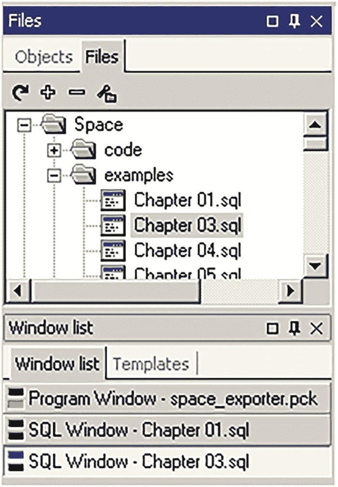

# 2. 创建高效的数据库开发流程

大多数 Oracle 数据库开发环境的设置就像一个易碎的瓷器店。有一个必须不惜一切代价维持的复杂结构，最微小的变化都可能破坏东西并阻止每个人工作。没有人确切知道数据库是如何变成现在这个样子的，而且每个人都担心当它崩溃时不知道如何修复它。典型的 Oracle 数据库开发流程远远落后于行业规范。本章展示了一种更好的工作方式。有一些简单的流程可以帮助我们创建、扩展、实验和学习，而不会打断其他人。

本章不讨论整个软件开发生命周期或敏捷与瀑布模型。如果不建立正确的基础流程，谈论采用敏捷或其他高层流程是毫无意义的。本章专注于低级别的数据库概念：创建数据库、创建数据库对象，然后管理这些对象。


## 共享数据库与私有数据库

Oracle 数据库开发主要有两种方法。最常见的方法是创建一个用于开发的共享数据库服务器。多个开发人员同时在同一个数据库、甚至可能在同一个模式中工作。不太常见的方法是为每个开发人员创建一个私有数据库。对于大多数项目，我强烈提倡采用私有数据库开发方式。

本章不会详细讨论共享数据库方法。共享数据库开发是大多数 Oracle 项目的默认选择，而这些环境的搭建是数据库管理员（DBA）的职责。

在某些情况下，共享数据库开发可能是一个不错的选择。例如，如果我们开发团队规模较小，或者应用相对稳定，或者流程已运行很长时间，共享数据库开发可能就足够了。而且，我们可以使用一些技术来改进共享数据库开发。但没有任何技术能够消除这两种模式在社会学层面的差异。共享数据库开发最终由管理员控制和限制，而私有数据库开发最终由开发者控制。

信不信由你——我知道你们大多数人都不信——私有数据库开发的效果出奇地好。对于在共享系统上工作了几十年的 SQL 开发人员来说，很难想象完全抛弃所有的基础设施和管理。一种新的开发方式，我们往往需要亲眼所见才会相信。我的目标只是向你们介绍新的理念，并说服你们保持开放的心态。

重新思考我们处理环境差异、安全性、测试、示例数据、许可、性能和部署的方式，起初可能会令人望而生畏。本章稍后将讨论其中大部分的担忧，你们可以放心，许多成功的组织和项目之前已经解决了这些问题。

我们可能仍然需要保留一些共享服务器，用于不同类型的测试。但我参与过许多项目，其中超过 90%的数据库开发和测试都是在笔记本电脑上安装的 Oracle 数据库中完成的。

在决定如何建立我们的开发流程这一重要决策时，有许多因素需要考虑。我们必须做出若干权衡。本章的其余部分只讨论私有数据库开发模式，因为我相信其权衡可以总结如下：**拥有对生产环境不完美副本的完全控制权，远胜于对生产环境完美副本几乎毫无控制权**。

## 创建无限数量的数据库

构建 Oracle 数据库解决方案的第一步，是创建一个让每个人都能拥有无限数量数据库，并对这些数据库拥有无限权限的系统。

### 私有数据库的优势

很少有 Oracle 机构使用私有数据库，但这并非激进的想法。Java 程序员不共享编译器，也不担心别人同时在编译包。C 程序员不受限于一次只能构建一个可执行文件，也不担心覆盖别人的工作。JavaScript 程序员无需请求许可即可使用语言默认包含的函数。应用程序开发人员几乎总能访问其编程语言近乎无限的能力。为什么 Oracle 开发人员不应该拥有同样的力量呢？

在私有数据库而非单一共享服务器上进行开发，有许多优势：

1.  `创建、学习和实验`：创新无需请求许可；它是自发的、稍纵即逝的、且具有颠覆性的。在共享服务器上，我们不能修改某些对象，或者需要征得他人同意，或者需要提醒团队其他成员。但我们不希望自己潜在愚蠢的想法令人尴尬。除非我们被允许先有愚蠢的想法，否则我们无法产生好的想法。为了蓬勃发展，开发者需要自由和隐私。即使是最轻微的进入障碍，也可能阻碍创新，扼杀想法的初现火花。对于尚无信心尝试新事物的**新开发者**来说，尤其如此。

2.  `并行工作`：拥有无限数量的数据库，我们就可以拥有无限多个版本。即使是只有一个内部客户的项目，支持多个版本也很重要。我们绝不应将自己限制为只能同时开发少数几个版本。

3.  `标准配置`：如果未经自动化，就不是标准化。采用手工配置的共享服务器，由于不同人员的使用和更改，不可避免地会出现漂移。

4.  `数据`：从庞大.dataset 中解放自己。针对大型生产数据集进行开发，常被用作拐杖，以弥补有意义的测试数据的不足。人工创建的测试数据比生产数据更小、更安全、也更有用。当然，有时我们需要用大数据集进行测试，但我们的大部分开发工作在更小的测试数据和更短的反馈循环下会更快完成。这个话题在第[3]章中有更详细的讨论。

5.  `安全性`：如果未经自动化，就不是安全的。手动审计和扫描是件麻烦事。审计如此困难，以至于我们下意识地为问题找借口，并且两次审计之间间隔很长。安全参数、补丁和加固程序必须实现自动化以维持安全性。私有实例可以被彻底锁定，使其比共享环境更安全。例如，在`listener.ora`文件中，设置`HOST = LOCALHOST`，外部用户就无法连接数据库。如果不共享任何东西且没有敏感数据，权限问题就会减少。如果我们在自己的私有数据库上都拥有 DBA 权限，我们就有了一个测试安全特性的地方，例如授予角色和创建用户。然而，在私有数据库上拥有提升的权限，并非忽视安全的借口。提升的权限赋予了开发人员尽早并经常实践安全性的责任。这将为开发人员带来更多的初始工作，因为他们必须意识到在高级环境中哪些提升的权限是不可用的。但这项额外的工作是一项长期投资。我们不能仅仅依赖管理员日后去加固一切。


## 6. `性能`

个人电脑（`PC`）的性能常常超过开发服务器。共享服务器通常比较陈旧，其优化方向是可靠性与持久性，而非性能。我多次看到，一台极其昂贵的服务器，其速度却远逊于一台价格惊人的便宜笔记本电脑。不要盲目接受管理层那种沉没成本谬误的推理——认为服务器因为我们花了很多钱买它，所以一定很快。我们应该用 `SPEC CPU` 基准测试来比较 CPU 性能，并用几次简单的全表扫描来大致比较 I/O 性能。即使共享服务器比我们的笔记本电脑快得多，我们也显然需要与他人共享那台服务器。对于较低环境（lower environment）中的性能测试，一致性与镜像生产环境同样重要。在私有系统上隔离测试会更容易。

## 7. `许可`

Oracle 的许可协议复杂且昂贵，但这仅限于共享服务器。Oracle 的许多开发者工具是免费的，实际上，几乎每个产品都可以从 [`https://download.oracle.com`](https://download.oracle.com) 免费下载。花几分钟时间阅读 `OTN 许可协议`。无需支付任何费用，我们就可以将 Oracle 数据库用于“开发、测试、原型设计和演示”我们的应用程序。如果那个许可不适用，那么我们可以只花几百美元购买 `个人版`。`个人版` 拥有与 `企业版` 几乎相同的所有功能，甚至附带 `Oracle 支持`。最大的区别是，`个人版` 只能供一台个人电脑上的一个用户使用。`个人版` 不包含像 `真正应用集群 (RAC)` 这样的选项，但大多数情况下，我们的开发也不需要 `RAC`。Oracle 许可真可能是个噩梦，我们需要小心，但有时我们只需访问他们的网站购买所需的软件即可。不过，我们仍然需要清楚我们已许可了哪些选项，因为在我们笔记本电脑上免费的一个选项，在生产环境中可能仍要花费很多钱。

## 8. `初始设置更简单`

设置大量的私有数据库比设置少量的服务器更容易。这是因为创建大量数据库迫使我们进行标准化和自动化。而且私有数据库使过程更加民主化；每个人都参与其中，拥有相同的权限，并且可以协作逐步改进流程。

从共享数据库转向私有数据库能极大地提升我们的生产力。分布式开发甚至让我们更快乐——没有了人为稀缺的资源，当有人阻塞一个资源时，就不会有叫喊或指责。开发者公地悲剧不复存在；每个人都可以拥有近乎无限的 Oracle 数据库供应。

在少数情况下，开发确实需要共享数据库。通常，原因是历史性的；一旦一个项目走上了共享数据库或私有数据库的道路，就很难改变方向。而且有些复杂的软件和资源无法轻松地重新部署。但不要以工具的缺陷为借口，坚持用老方法做事。完全有理由说：“如果我们无法将这个工具自动化，那这个工具就不值得再用了。”信息技术行业始终朝着更多自动化的方向发展。基础设施不应像不可触碰的大型机——基础设施应该是可以轻松更改的代码。

### 创建私有数据库：本地安装

一旦我们决定创建私有数据库，具体该怎么做呢？有很多方法可以为每位开发者提供多个私有数据库实例。时髦的做法是结合使用云、虚拟机（`VMs`）和容器。但私有数据库并不需要任何花哨的新技术。实现我们目标的最简单方法是在我们的个人电脑（`PCs`）上安装 Oracle。选择并非只能在易用的云计算和难以企及的大型机之间进行；个人电脑革命依然生机勃勃。

实际的软件安装很简单——在我们的笔记本电脑或台式机上下载并安装 `企业版` 或 `个人版`。我们应该使用一个与生产环境所用版本同样强大的 Oracle 版本。这意味着我们或许应该避免使用 `Oracle 快捷版`，因为它有硬件限制、不受支持，并且缺少重要功能。

安装本地 Oracle 实例很简单，只需几个步骤。管理 Oracle 数据库可能很困难，但当我们不必担心可靠性和持久性时，就容易多了。数据库管理员会彻夜难眠，担心备份以及维持共享服务器平稳运行所需的许多层软件。对于我们的私有开发数据库，管理起来就容易得多；我们可以忽略备份，如果几分钟内无法修复数据库，直接重新安装即可。

创建一个与生产环境完美匹配的私有数据库可能很困难。例如，我们不想在笔记本电脑上安装 `真正应用集群 (RAC)` 或 `自动存储管理 (ASM)`。而且我们的笔记本电脑操作系统也可能与生产环境不同。幸运的是，对于 99.9% 的 Oracle 开发来说，那些底层技术并不重要。`RAC`、`ASM`、操作系统和许多其他组件对用户是不可见的。Oracle 是一个高度可移植的系统，并且已经抽象化了许多底层架构。没有 `RAC`，我们的私有数据库不会那么稳定，但 99.9% 的正常运行时间与 99.99% 的正常运行时间之间的差异，对于开发来说无关紧要。

即使我们的开发必须保持为共享数据库，为每个人提供一个私有数据库仍然有好处。拥有一个可以随意尝试而不用担心破坏任何东西的沙箱总是有益的。许多测试和学习可以在私有数据库上完成，即使数据库是空的。

下一节将介绍其他选项，这些选项更高级，但前期需要更多工作。我们不需要实现那些技术之一也能做到敏捷；一台装有“朴素老式本地软件”的个人电脑通常就是我们所需要的全部。


### 创建私有数据库：其他选项

创建数据库的方法有很多，至少值得简要提及不同的选项。在实践中，你最终可能会结合使用多种方法，例如云、虚拟机、容器、多租户选项，或者仅仅是多个模式。只要这些更复杂的解决方案之一能提供无限数量的数据库，它们都能帮助我们实现创建高效开发流程的目标。

*云平台*近年来日益流行。将低层次的任务外包出去，让我们能专注于高层次的任务，这具有明显的优势。迁移到云端可以轻松为你的组织带来巨大好处，因为它让你无需再担心管理电力、操作系统、补丁等问题。但请记住，如果你仍然只能共享少量数据库，那么作为 SQL 开发人员，云对你帮助不大。

关于云计算平台的书籍有很多，这里不是比较它们的地方。Oracle 进入云领域较晚，但自从他们的 19c 自治数据库发布后，他们的产品终于开始变得有趣了。虽然我无法为你的企业推荐特定的云，但我确实推荐 Oracle 的 Always Free 套餐，如果你只是需要一个小数据库用于学习、测试或运行本书中的示例。尽管 Oracle 的云远不如其他云流行，但如果你曾经收到过吓人的账单邮件，你会感激“Always Free”（永久免费）和“Trial”（试用）之间的巨大差异。

*虚拟机*非常适合快速创建完整的环境。例如，Oracle 的 Developer Day VM 包含了立即开始数据库编程所需的几乎所有东西。使用免费的 VirtualBox 程序，你可以快速加载 VM 镜像，并拥有一个包含 Oracle Linux、Oracle 数据库、Oracle SQL Developer 等的完整系统。你可以轻松定制镜像，保存它，并与团队共享，以确保每个人使用的配置完全相同。如果我们到处使用虚拟机，就可以快速克隆生产环境，使用该镜像进行开发，并避免几乎所有的平台差异。

在虚拟机上拥有一个配置的黄金镜像特别有用，尤其是对于需要回滚的任务，例如作为持续集成和交付（CI/CD）系统一部分的测试。理论上，我们的部署变更包含回滚部分，但历史告诉我们，我们的回滚往往会失败，系统会逐渐偏离应有的状态。不断从镜像重新启动有助于防止这种配置漂移。

*容器*可以缓解使用虚拟机带来的不可避免的资源问题。每个 VM 实例都有一份完整的操作系统副本，这将浪费大量空间和内存。像 Docker 这样的容器程序将使多个镜像能够共享其中一些操作系统资源，同时保持应用程序的隔离。容器的唯一缺点是它们需要打包应用程序二进制文件，而且从历史上看，Oracle 并不总是与 Docker 配合良好。这可能是因为 Oracle 希望你使用他们自己的容器解决方案类型，即多租户选项。

*多租户*选项使用 Oracle 作为容器引擎。对于每个数据库实例，一个单一的*容器数据库（CDB）*容纳了大部分基础配置和数据字典。应用程序模式存在于轻量级的*可插拔数据库（PDB）*中，每个 PDB 看起来都像一个普通的旧数据库。（相当大的）缺点是需要额外的配置，数据库必须以多租户架构安装，并且超过三个 PDB 需要有多租户许可证。回报是，一旦多租户运行起来，克隆现有数据库可能真的就像执行 `CREATE PLUGGABLE DATABASE orclpdb2 FROM orclpdb1` 一样简单。

作为最后的手段，我们至少可以将程序安装在多个模式上，并给每个人一个单独的模式。这种方法有其自身的挑战，例如处理多个相互引用的模式（同义词可能有所帮助）、共享全局资源（如目录）等。

我曾在拥有共享数据库的企业工作过，也曾在拥有私有数据库的企业工作过。这一直是天壤之别。拥有共享数据库的组织有更多错过的期限、更丑陋的代码，以及滋生推诿和恐惧的开发者等级制度。拥有无限数量数据库的组织则拥有更好的产品、更简洁的代码，以及一个平等的环境，让人们感到快乐并帮助他们发挥全部潜力。

安装数据库软件有很多选择，但这仍然是创建良好开发环境的简单部分。困难的部分是重建自定义模式。

## 快速删除并重建模式

部署数据库变更很容易——如果我们频繁部署的话。创建和运行数据库脚本有很多花哨的方法，但老式的文本文件和 `SQL*Plus` 仍然是最好的工具。

### 为何要频繁部署？

数据库部署充满了错误、不确定性和性能问题。数据库比传统应用程序更难部署，因为数据库有更持久的数据。但我们不能仅仅因为数据库难就将部署问题归咎于它们。任何很少使用的流程都会出现部署问题。

熟能生巧。如果部署由许多人每天多次执行，它们将变得轻松无痛。但轻松的部署只有在每个人都使用私有数据库的情况下才可能实现，如前一节所讨论的。一旦我们完成工作，就应该删除并重建模式以测试构建脚本。（或者，更常见的是，现在这个过程在提交时自动完成。）删除和重建模式，即使是对于复杂的数据库程序，也可以在一分钟内完成。不断重建模式让我们能够立即发现故障。错误可以即时修复，因为代码在我们脑海中还很新鲜。

团队中的每个人都应该参与创建构建脚本。部署是任何数据库变更的自然组成部分，因此构建部署不应该被外包给一个单独的团队。在某些组织中，高级开发人员看不起仅仅部署的工作，并将这种苦差事分配给初级开发人员。但我们应该为自己的工作感到自豪，因此我们应该为打包和交付的方式感到自豪，并坚持到底。一旦建立了高效的系统，创建和测试部署脚本无论如何都会变得容易。

营造一种强烈反对破坏构建的文化很有帮助。破坏构建是编程世界中最不尊重的行为；因为一个人懒得运行一个简单的测试，其他人就无法完成他们的工作。我们不需要公开羞辱人们，但我们确实需要明确表示，为他人制造路障是不可接受的。对于习惯了共享数据库开发的人来说，这可能是一个惨痛的教训。那些开发者来自一个代码破坏不可避免的世界，他们可能不明白破坏构建不再是可以接受的。（或者，我们可以通过配置我们的代码库在提交前自动检查构建来避免整个情况。）


### 如何频繁部署？

创建并维护数据库部署脚本并非魔法，甚至不需要二十一世纪的技术。文本文件和 `SQL*Plus` 几乎总是足够好用。但最重要的要素是**纪律**。

市面上有许多号称能自动化数据库部署的产品。但在这个领域，我们应该忽略自动化工具，利用 Oracle 已经提供的简单程序，自己动手构建。许多自动化部署程序要么是数据库无关的，要么假定了一种共享服务器模型。

数据库无关本身并无过错。显然，许多框架和程序因为能够处理大量数据库而受益。但是管理和部署模式对象需要深入了解数据库。大多数部署自动化工具重数量胜过质量。这些工具不完全理解 Oracle SQL，强迫我们使用更简单的“标准 SQL”，这使得我们难以利用 Oracle 的独特优势。如果我们为 Oracle 付费了，就应该使用它的全部功能。

许多数据库部署工具假定了过时的共享数据库模型。不要被愚弄；如果每个人都共享同一个开发服务器，就不可能实现敏捷。仅仅改进我们的共享数据库部署是不够的，我们不应该安于现状。克隆、数据泵、导入/导出、闪回数据库、可传输表空间和复制等技术显然很有用。但这些技术不应该成为我们部署流程的核心。

这就把我们引向了 `SQL*Plus`。这个程序在很多方面都显得过时，对于编程和临时查询等任务来说是个糟糕的选择，正如第 5 章所讨论的。但 `SQL*Plus` 是 Oracle 脚本的**通用语言**。它不是一个完整的 shell 语言，不是一个集成开发环境，对于临时查询也不太擅长。但 `SQL*Plus` 恰好处于这些任务之间的甜蜜点。它免费、易于配置、已安装，并且与平台无关。（Oracle 有一个名为 `SQLcl` 的新命令行工具，但如第 5 章所讨论的，我还不推荐使用它。）

### SQL*Plus 安装脚本

以下是数据库安装脚本的高级纲要：

1.  注释：目的、示例、先决条件等。
2.  `SQL*Plus` 设置和启动消息。
3.  检查先决条件。
4.  删除旧的模式。
5.  为每个模式调用安装脚本：
    1.  启动消息。
    2.  创建用户。
    3.  按对象类型调用一个或多个文件。
    4.  结束消息。
6.  向角色授予权限。
7.  验证模式并打印结束消息。

不要试图把所有东西都放在一个文件里。像对待任何程序一样对待安装文件，创建大量小的、可重用的部分。顶级安装脚本应该相对较小，主要是注释和对其他脚本的调用，例如 `@schema1/packages/install_package_specs.sql`。

有许多棘手的细节需要时间才能弄对。脚本必须随着我们的程序一起成长。创建安装脚本不是一项可以留到项目最后才做的任务。

你不需要阅读整本 *SQL*Plus User's Guide and Reference*，但至少应该浏览一下目录中的命令。我不会在这里重复整本用户指南，但以下段落描述了重要的部分。

## 注释

脚本开头的注释常常被忽视。添加关于程序及其使用方式的详细信息非常重要。例如，看看 GitHub 上许多 `readme.md` 文件。最成功的项目几乎总是有有意义的文档来帮助人们快速上手。

#### SQL*Plus 设置和消息

我们可以使用许多 `SQL*Plus` 设置来精确控制命令的运行和显示方式。安装脚本应显示足够的细节以帮助我们排查错误，但也不应过多，以免难以找到真正的问题。常见的设置有 `SET DEFINE ON|OFF`（启用或禁用将 & 符号视为替换变量）、`SET VERIFY ON|OFF`（显示替换变量的更改）、`SET FEEDBACK ON|OFF`（显示诸如“x rows created”的消息）、`SET SERVEROUTPUT ON|OFF`（显示 `DBMS_OUTPUT`）、`PROMPT TEXT`（显示消息）以及 `DEFINE VARIABLE = &1`（设置变量，可能通过使用 `&NUMBER` 设置为输入参数的值）。

两个重要但未充分利用的 `SQL*Plus` 设置是 `WHENEVER SQLERROR EXIT FAILURE` 和 `WHENEVER OSERROR EXIT FAILURE`。不要把安装错误掩盖起来。一旦任何地方出错，立即停止整个安装通常比几天后试图修复一个半损坏的安装更安全。当我们犯错时，至少应该让它显而易见。

前面的脚本纲要包含了许多消息。这些消息可以由 `PROMPT`、`DBMS_OUTPUT.PUT_LINE` 或 `SELECT` 语句生成。要确切知道脚本在何处失败可能很困难，因此这些消息对故障排除很重要。使用 `SET ERRORLOGGING ON` 来捕获错误也可能有帮助。

#### 检查先决条件

我们可能需要将程序限制在特定平台或版本，检查表空间是否充足等。每当程序因配置问题而出错时，我们应该在先决条件部分添加对该问题的检查。如果 `SQL*Plus` 设置为出错时退出，我们就可以在发现缺失的先决条件时立即停止安装，例如使用像 `RAISE_APPLICATION_ERROR(-20000, 'Prerequisite X failed...')` 这样的 PL/SQL 语句。

#### 删除旧的模式

一开始看起来可能很可怕，但经常删除模式很重要。为了安全起见，我们可能希望将删除命令放在一个文件名吓人的单独脚本中，以确保它永远不会在错误的环境上运行。在开发过程中，我们的模式会被不必要的垃圾弄得杂乱无章。有时我们可能向模式添加了一个对象，却忘记将该对象添加到脚本中。最好尽早清理模式并捕获缺失的对象。删除并重新创建模式将迫使我们变得更有纪律，并构建更干净的代码。

#### 对象类型的脚本

每个模式的安装脚本是实际工作发生的地方。为每个对象类型设置单独的安装脚本非常重要。有些对象，比如表，可以分组放在一个文件中。其他对象，比如包、过程和函数，应该每个都有单独的文件。这些单独的文件允许我们的代码编辑器在开发过程中轻松地读写文件。按对象类型拆分安装脚本也使我们能够避免大多数依赖关系问题。例如，`install_schema1_tables.sql` 应该在 `install_schema1_package_specs.sql` 之前运行。分离脚本还允许它们在不同的上下文中被调用。例如，包、过程和函数将同时被安装脚本和补丁脚本调用。

#### 向角色授权

从项目一开始就构建一个向角色授权的脚本，即使我们认为不需要它。角色是我们总会忘记的事情之一，尤其是在我们删除并重新创建对象时。构建一个总是向适当角色授予所有权限的单一脚本，并在每次安装和每次补丁期间调用它，以防万一。很可能每个项目最终都需要为重要的模式设置一个只读或读写角色。


#### 验证模式

务必在最后运行一个小脚本来验证模式。即使设置了 `WHENEVER SQLERROR EXIT FAILURE`，仍然可能有一些细微的错误未被发现。验证脚本至少应检查无效对象，如果发现任何问题就抛出异常。对象在安装过程中可能会失效，但通常在最后调用 `DBMS_UTILITY.COMPILE_SCHEMA` 就能解决所有问题。对于依赖关系复杂的系统，你可能需要一些技巧，例如添加几条 `ALTER ... COMPILE` 语句。该脚本还可以检查其他状态表，或者如果启用了 SQL*Plus 错误日志记录，也可能检查 `SPERRORLOG` 表。

### SQL*Plus 补丁脚本

我们的程序在私有数据库上可能运行良好，但最终代码必须迁移到更高的环境。删除并重建我们的模式很方便，但我们显然不能在生产环境中这样做。我们需要脚本来升级模式以包含我们的更改。

每个开发人员都应该参与创建部署，并应负责将其更改集成到安装和补丁脚本中。设计补丁脚本需要一些艰难的决策，但重要的是不要采取任何捷径。

安装脚本已经处理了诸如 SQL*Plus 设置、错误检查和安装代码对象等事项。如果我们按对象类型分离安装脚本，那么一半的工作就已经完成了。无论是安装还是打补丁，安装代码对象（如包、过程和函数）都可以用相同的方式完成。我们的补丁模板可以直接调用那些预构建的代码脚本。重新编译所有内容每次都要更容易，而不是试图找出特定的代码更改。

棘手的部分是处理持久对象（如表）的更改。再次强调，手动执行此步骤比购买工具并尝试自动化流程更好。手动构建更改脚本的原因将在下一节讨论。目前，还有一个决策需要决定——这些表更改如何回移植到安装脚本中？我们是不断更新安装脚本，还是简单地运行原始安装脚本，然后在最后调用补丁脚本？

创建补丁脚本是少数几个重复自己和复制代码有益的领域之一。我们的安装脚本不仅用于重建系统；它们也是我们理解数据库如何创建的最佳文档。这些安装脚本通常比查看实时数据库更有用，因为脚本可能包含根据数据库版本或版本等因素安装不同对象版本的开关。

充满了 `ALTER` 命令的补丁脚本既丑陋又难以跟踪。要了解表是如何构建的，我们不应该需要找到原始的 `CREATE TABLE` 语句，然后翻阅补丁脚本，最后拼凑出一个 `ALTER TABLE` 语句的历史记录。我们应该额外花时间使我们的脚本对未来的开发人员更具可读性；当我们创建补丁脚本时，我们也应该将这些更改添加到安装脚本中。这很烦人，并且当代码被复制时有可能出错，但在这种情况下，重复是值得冒这个风险的。

## 用版本控制的文本文件控制模式

切勿使用数据库进行版本控制。本书旨在推广使用 Oracle SQL 的实用解决方案。虽然将 Oracle 推向极限并编写深奥的查询来解决奇怪的问题很有趣，但有些事情不应该在数据库中完成。版本控制应该通过手动创建的文本文件来完成。

### 唯一可信来源

理解为什么需要版本控制的文本文件始于一个难题：我们模式的理想版本在哪里？有很多可能的答案，例如在生产数据库上、在我们的私有数据库上、在我们的脑海中、在某个抽屉的软盘上等等。这不仅仅是一个理论问题；每个程序都需要一个唯一可信来源，一个查找和维护程序真实版本的唯一位置。（讽刺的是，“唯一可信来源”这个短语可能起源于数据库，用于数据库规范化。但现在这个短语更适用于版本控制，而版本控制不应该在数据库中进行。）

唯一可信来源必须方便且每个人都能访问。它必须允许我们存储、操作、比较、分支和跟踪所有内容的历史。虽然数据库擅长执行大多数这些任务，但数据库提供的灵活性不够，并且在跟踪更改方面完全没有帮助。这个问题很久以前就解决了，解决方案是存储在版本控制软件中的文本文件。具体的版本控制程序并不重要。无论我们使用 Git、Subversion 还是其他工具，这些选择中的任何一个都明显优于使用数据库。分支、合并和解决冲突的能力远比简单地覆盖他人的工作好得多。而现代的版本控制程序构成了极其有用的平台（如 GitHub）的基础。

不幸的是，许多 Oracle 开发团队只将版本控制软件用作一种华丽的备份。版本控制不仅仅是一个存储“官方副本”或在某物被提升到其他环境之前存储它的地方。版本控制是我们的程序需要*生存*的地方。如果我们能挥动魔杖让所有的开发数据库消失，它应该只会让我们落后几个小时。恢复应该很容易——获取最新版本控制的文件并运行安装脚本。

### 从仓库和文件系统加载对象

开发的第一步应该是克隆一个仓库或将最新文件拉取到你的文件系统上。当我们想要修改一个对象时，我们应该从*文件系统*加载该对象，而不是从数据库。现代 IDE，如 Oracle SQL Developer、Toad 或 PL/SQL Developer，使得从文件系统工作变得非常简单。事实上，从文件系统工作甚至比直接从数据库对象工作更容易，因为我们可以仔细安排文件和文件夹。

例如，在为本书构建数据集和示例时，所有内容都存储在我的硬盘上，并最终提交到 GitHub 仓库。图 2-1 显示了我在 PL/SQL Developer 中工作时的样子。菜单具有与 GitHub 仓库相同的文件结构，并且选项卡通过颜色编码来快速识别哪些文件尚未保存到文件系统，以及哪些对象自上次更改后尚未编译。



打开的文件部分选项卡的片段。它作为一个包含空间、代码、示例和第三章的文件夹打开，第三章被高亮显示。

**图 2-1**
通过版本控制的文件系统查看数据库对象

大多数 IDE 还具有版本控制界面，让我们可以直接与仓库交互，但通常使用文件系统和默认的版本控制客户端更容易。如果你不习惯命令行界面，有许多开源程序可以直观地将版本控制与文件系统集成，例如 TortoiseGit 和 Windows 文件资源管理器。


### 手动创建与保存变更

无论我们采用何种方式来操作受版本控制的文件，都应手动提交并验证这些文件。当我们推送变更或合并分支时，如果其他人也修改了相同的文件，我们可能再次遇到版本控制冲突。我们的工作是通过版本控制系统集成的，而非共享数据库。依赖版本控制虽然给我们的工作流程增加了一个步骤，但这个额外的付出是值得的，因为它支持并行开发。

市面上有些产品试图分析我们的数据库并猜测变更，但我们应避免使用这些产品。自动化在**应用**变更方面表现卓越。但当涉及**构建**变更时，这些变更应该被精心手工打造。我们不能依赖一个程序来告诉我们如何编程——那是我们的职责。

创建自动化的变更集极其困难。即使是 Oracle 的解决方案 `DBMS_METADATA_DIFF`，也做得不够好。该包可以提供一个不错的起点，但它不可避免地会产生大量冗余的垃圾代码。这些程序不理解我们的代码风格，也不关心结果是否美观。它们不明白对象在受版本控制的文本文件中也必须具备可读性。当然，这些程序通常也不是免费的。例如，`DBMS_METADATA_DIFF` 需要 OEM 变更管理选项的许可证。

最重要的是，这些自动化程序不知道我们不关心什么。它们会产生大量垃圾信息，淹没有用的特性，并且使得有意义的文件比较变得不可能。

例如，以下代码创建了一个简单的表，然后要求 Oracle 为其生成数据定义语言（DDL）：

```
create table test1 as select 1 a from dual;
select dbms_metadata.get_ddl('TABLE', 'TEST1') from dual;
```

我们可能期望 Oracle 的输出与原始命令非常相似。然而，我们却得到了下面这串可怕的输出：

```
CREATE TABLE "JHELLER"."TEST1"
(    "A" NUMBER
) SEGMENT CREATION IMMEDIATE
PCTFREE 10 PCTUSED 40 INITRANS 1 MAXTRANS 255
NOCOMPRESS LOGGING
STORAGE(INITIAL 65536 NEXT 1048576 MINEXTENTS 1 MAXEXTENTS 2147483645
PCTINCREASE 0 FREELISTS 1 FREELIST GROUPS 1
BUFFER_POOL DEFAULT FLASH_CACHE DEFAULT CELL_FLASH_CACHE DEFAULT)
TABLESPACE "USERS"
```

前面的输出在技术上是正确的。但它遗漏了太多关键信息，又添加了太多无价值的内容。像 `DBMS_METADATA` 这样的程序提供了一个有用的起点，但输出需要大量清理。它的格式丑陋，包含不必要的双引号，还有许多本应始终基于默认值的设置。模式（schema）应在脚本的其他地方参数化并控制，例如使用 `ALTER SESSION SET CURRENT_SCHEMA = SCHEMA_NAME` 这样的命令。表空间、段和存储选项等设置几乎总是应该使用默认值。

当脚本看起来像前面这种自动化输出时，人们就不会去更新它们，尤其是初级开发人员——他们会因为害怕触碰那一团糟的代码而不敢动手。根本无法分辨那个 `CREATE TABLE` 命令中哪部分重要，哪部分不重要。

有时我们确实想要编辑那些非常规选项。例如，如果我们有一个大型的只读表，通过指定 `PCTFREE 0` 可以节省 10% 的存储空间。但如果我们在前面的脚本中手动将数字 10 改为 0，会有人注意到吗？

版本控制是几乎所有开发环境中不可或缺的一部分，Oracle SQL 开发也不例外。我们的数据库模式必须真正存在于受版本控制的文本文件中。我们应该使用版本控制软件来管理差异，并创建一个社交化的编码平台。我们应该使用集成开发环境（IDE）来处理这些文件，但任何自动生成的对象都必须经过手工打磨。

## 赋能每个人

使模式易于安装以及通过版本控制改进协作，是一个更大目标的一部分——即赋能团队中的每个人。任何人都不应需要请求许可、填写表格或等待他人，才能开始开发并试验我们的程序。本章提供了关于如何实现 Oracle 模式民主化的具体想法，但实现相同目标的方式还有很多。仅凭技术无法打破严格的社会等级制度，也无法使我们的组织和项目更容易参与。

本章仅仅触及了建立高效开发流程所需内容的皮毛。本书并非关于通用的软件开发生命周期方法论，但值得讨论几个倾向于在 Oracle 环境中滋生的社**会学问题**。Oracle 的工作场所可以通过修复开发人员和管理员之间的权力失衡、提高透明度以及降低准入门槛而受益。

### 权力失衡

数据库开发人员和数据库管理员之间常常存在权力失衡。Oracle 主要用于大型企业和政府机构，DBA 会从这些官僚机构中沾染一些坏习惯。对于 Oracle 数据库环境，通常存在一些不容协商的要求——数据库必须始终安全、必须始终可用、并且绝不能丢失数据。DBA 可能会因为允许其中一项要求出现纰漏而被解雇，因此有时 DBA 必须坚持立场，告诉开发人员他们无法得到想要的东西。

但管理员们应明智地记住，如果没有人能使用他们的数据库，那么这些数据库就毫无价值。DBA 可能保护了组织，但为组织创造价值的人们同样重要。

**开发人员**：不要害怕要求 DBA 解释他们的决定。请记住，DBA 了解 Oracle 的架构和管理命令，但他们通常不懂 SQL 或 PL/SQL。DBA 有不同的类型，了解你正在与哪种类型交谈很重要。例如，运维 DBA 可能不理解你的应用程序，甚至不知道你在使用哪个数据库。但应用 DBA 应该知道这些信息。

**DBA**：当开发人员搞砸东西时，尤其是在较低的（开发/测试）环境中，不要生气。如果开发人员从不搞砸东西，例如，他们从不产生 `ORA-600` 错误，那说明他们还不够努力。开发人员必须比 DBA 更多地从错误中学习，所以不要让他们的处境变得更糟。无论何时你对开发人员的请求说“不”，都要加上为什么不能这么做的解释。试着想出一个变通方案，尤其是对于权限问题。通过角色、对象权限、系统权限、代理用户和定义者权限程序，几乎总能找到变通方法。例如，如果开发人员要求拥有在生产环境终止会话的能力，你可能无法给他们 `ALTER SYSTEM` 权限。但你可以创建一个 `SYS` 程序，该程序仅终止属于他们用户的会话，然后将该程序的执行权限授予该开发人员。

### 透明度

透明度需要愿意犯错并感到尴尬。这是 Oracle 文化落后于软件行业其他领域的另一个方面。Oracle 公司历来行事隐秘，例如将其缺陷跟踪器隐藏在付费墙后、禁止基准测试以及反对开源。不要效仿他们的做法。让人们审视我们的系统。与所有人分享我们的代码仓库、项目计划、缺陷跟踪器和其他文档。有些人会利用我们的错误来攻击我们，有些人会发现令人尴尬的缺陷。但缺陷发现得越早，就越容易修复。根据林纳斯定律，“足够多的眼球，所有缺陷都浅显”。如果我们缩短反馈循环，就能快速失败并尽快修正错误。


### 降低入门门槛

我们必须不断寻找方法来降低人们使用我们系统的门槛——不仅仅是我们构建的程序，还包括所有相关的知识。大型“企业”公司想要收割我们的数据、进行精细控制并预先收费。这种策略可能适用于向高管销售产品的大公司，但对于我们的项目来说并非良策。将文档放在 Wiki 上，允许*任何人*修改*任何内容*。使用版本控制系统，让软件分支像点击“fork”按钮一样简单。人们可能会对我们喜爱的页面进行烦人的编辑，或者以错误的方式使用我们的软件；这正是我们为鼓励参与所必须付出的代价。

## 总结

花时间思考我们的开发流程是值得的。不要盲目跟随别人的做法——他们可能也不知道自己在做什么。许多 Oracle 开发人员、DBA、测试人员和数据分析师遵循某个特定流程，仅仅是因为“历来如此”。Oracle 诞生于二十世纪，但这并不意味着我们必须像二十世纪那样编程。我们可以找到一种方法，让我们的资源看起来是无限的。我们可以让我们的程序易于安装、修改和分享。我们还可以创造一种促进学习、实验和团队合作的文化。现在我们的开发环境已经搭建好，可以进入下一章，讨论如何测试我们构建的东西。

