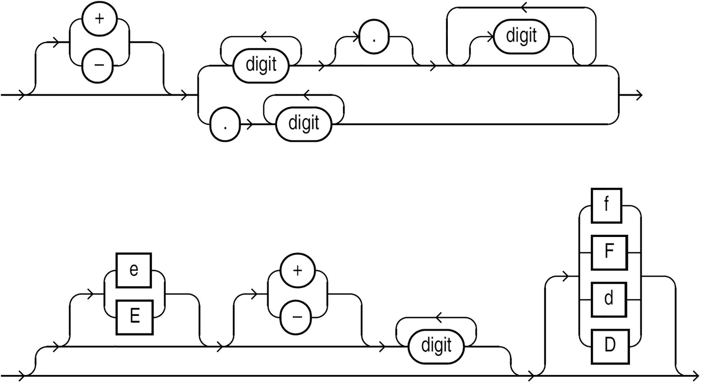

# 4. 寻找可靠的来源

Oracle SQL 编程存在一个认识论问题。认识论是研究知识的学问，简单来说就是问自己我们知道了什么以及我们如何知道。在开始编程之前，我们不必去上哲学课，但我们确实需要仔细考虑我们的信息来源。Oracle 编程文化过分依赖不可靠的认识论，例如传统和经典，而对科学和理性的重视不足。如果我们听信了错误的来源，就会学到错误的教训。

为什么寻找可靠来源在 Oracle 上比在其他技术上更成问题？Oracle 主要面向业务用户，而非学者或传统程序员。计算机科学专业的学生很少学习 Oracle，也不会将他们执着的好奇心集中在 SQL 或 PL/SQL 上。学生、技术思想领袖和业余程序员往往忽视面向业务的编程语言。Oracle 常被用于开发那些缓慢、痛苦地演进且避免实验和重构的、乏味的“企业”软件。而且，Oracle 是闭源的，且 Oracle 公司历来对开源持敌对态度，这无疑也无济于事。

有相当大比例的人使用 Oracle 只是为了谋生，并没有花时间去钻研和测试其数据库的内部机制。并非每个人都需要成为业余程序员，但需要有一定数量的、有好奇心的人来创造正确的文化规范。

存在一个知识鸿沟，而这个鸿沟已被大量烦人的传统、诉诸权威、标题党内容和神话所填充。我们无法合理地测试所有东西；第 2 章和第 3 章描述的开发流程和测试技术需要大量的时间和精力，而且现实生活中的性能问题包含太多不可控的变量。如果我们总是挑战*每一个*假设，我们将一事无成。但我们的思想领袖应该是那种总是愿意用可复现的测试用例来支持自己观点的人。

我们需要避开那些信口开河、声称某些事情他们见过一次发生但无法再次演示的“专家”。我们需要谨慎对待那些对 Oracle 做出非凡断言却不提供质疑途径的网站。

我们在前几章学习了如何在数据库中创建科学实验。当我们没有时间做实验时，我们至少需要遵循*正确的*权威和*正确的*传统。本章提供了一些关于如何在线找到优质资源以及如何在本地找到优质资源的技巧。通过足够的时间和实践，终有一天你也会成为你所在社区中的一个优质资源。

## 去哪里找

寻找与 Oracle 相关的、准确的信息，不像用谷歌搜索那么简单。排名靠前的结果常常有问题，尤其是当这些结果是论坛或静态网站时。最好的资源是像 Stack Overflow、官方文档和 My Oracle Support 这样的站点。

### 论坛的问题

论坛并非解决狭窄技术问题的最佳选择。它们关注提问者本人，而非未来数年将阅读答案的更多读者。这种错误的关注点导致了无休止的争论和冗长、漫无边际的对话，分散了我们对所关心的简单解决方案的注意力。论坛聚焦于某个时间点，但技术在变化，今天的好答案明天可能就过时了。那些锁定帖子或抱怨别人回复旧帖子的论坛，阻碍了用户整理信息。

像 Stack Overflow 这样的网站在很大程度上取代了论坛。Stack Overflow 的关键在于它不关注两人之间的对话。该网站聚焦于问题和答案，忽略个性和元讨论。Stack Overflow 是维基、博客、论坛和 Reddit 这类聚合网站的结合体。这些技术使新用户难以提问，但它们使问题和答案更简洁、更及时、更具可读性。技术网站真正的受众是读者，而不是提问和回答问题的人。我们应该把时间花在拥有最佳信息的网站上，而不一定是对新用户最友好的网站。

另一方面，很少有问题有简单、客观的答案。带有主观答案的大型问题更适合论坛的对话式氛围。我们不能总是简单地从 Stack Overflow 上复制粘贴代码，而且参与问答网站可能会让人感觉不公平且缺乏人情味。我们应该偶尔花时间阅读对困难技术主题的深入讨论。

### 静态网站的问题

我们应该对不允许任何读者反馈的静态网站保持怀疑。我不指望每个博主都参与辩论并回答每个问题，但每个技术资源都应该提供一种添加评论的方式。我们至少需要有能力通过评论相互提醒，例如“此功能在 X 版本中已弃用”。

Oracle 是一个老牌程序，许多最早的 Oracle 相关网站也因此年代久远。由于这些网站建立得早，它们拥有最多的链接，无论其质量如何，都排在搜索结果的前列。

我们还需要警惕那些为了获取流量而发布不寻常信息的网站。这不像普通的标题党那么糟糕；我还没见过题为“你不会相信这 8 个令人震惊的数据库索引技巧！”的文章，但一些最受欢迎的 Oracle 相关网站发布着疯狂且未经证实的性能断言。

很多时候，改变一个无关紧要的细节就能让我们的程序运行得更快。看似神奇的性能提升经常发生，原因如第 3 章所述，例如缓存和执行计划的变化。例如，`COUNT(1)`并不比`COUNT(*)`快，但作为重写查询的副作用，它最初可能看起来更快。

当有人发布不合理的性能技巧时，我们需要有能力指出可能的根本原因，并要求一个完全可复现的测试用例。但如果无法质疑该信息，错误可能永远得不到纠正。

同样重要的是，技术网站应包含元数据，如发布日期和 Oracle 版本。许多技术建议会随着每个新版本的发布而过时。例如，许多 PL/SQL 网站仍在讨论使用`OPEN/FETCH/CLOSE`语法进行游标处理。但该功能几乎已完全被游标`FOR`循环所取代。

不要盲目相信那些不允许评论的非官方来源。这些来源仍然有用，但我们需要对它们保持怀疑态度。


### 阅读手册

Oracle 官方文档几乎总是我们获取 Oracle 数据库信息的最佳来源。这份文档非常详尽，有时甚至会让人望而生畏。令人沮丧的是，仅仅是为了了解 Oracle，就存在一条学习曲线。但一旦我们理解了如何浏览文档和阅读语法图，官方文档就将成为我们的主要信息源。

Oracle 文档库从这个链接开始：`https://docs.oracle.com/en/database/oracle/oracle-database/index.html`。从这里，我们可以访问所有手册，甚至可以下载整套 679MB 的书架。

不幸的是，等到本书出版时，这个链接很可能已经失效了。Oracle 文档最大的问题就是链接经常变动。

我们希望引用最新版本，但最新版本也是最有可能发生变动、导致链接失效的版本。对于像电子邮件这样的临时性信息，引用最新版本是可以的。对于像博客或 Stack Overflow 帖子这样的长期信息，最好使用最近的长期版本。截至 2022 年，Oracle 19c 文档通常是最佳选择。虽然 21c 版本的文档也可用，但该版本是一个“创新发布版”，不提供长期支持，不会像长期版本那样流行，并且链接很可能再次发生变化。本书不会经常直接链接到手册，因为我们可以通过搜索书名和版本号轻松找到相关书籍。例如，我们可以搜索“Oracle SQL Language Reference 21c”。

对于 Oracle 开发人员来说，以下是最有用的书籍，按重要性排序：

1.  `SQL Language Reference` (2,271 页)：这是对 SQL 开发人员最相关的书籍。尽管它极其庞大，但最终通读全书是值得的。我几乎总是开着一个浏览器标签页显示这本手册，并且会使用目录而不是搜索引擎。

2.  `Database Concepts` (622 页)：这本书解释了数据库的工作原理。虽然本书是为管理员编写的，但无论何时我们对 Oracle 的内部运作感到好奇，都应该参考它。例如，如果我们想知道“REDO 到底是什么？”或“块是什么样子的？”，这本书就是一个很好的起点。

3.  `PL/SQL Language Reference` (865 页)：如果你从事 PL/SQL 编程，通读整本书是值得的。即使你只编写 SQL 语句，浏览这本书也很有用，因为 SQL 和 PL/SQL 正逐渐融合为一种语言。而且，如果你今天是一名 SQL 程序员，将来很可能成为一名 PL/SQL 程序员。

4.  `PL/SQL Packages and Types Reference` (4,894 页)：没有人需要读完这本庞大的书。里面有许多没人会用的陈旧包。但也有一些意想不到的宝藏，将来某天会帮到你。这本书也是学习通过 PL/SQL API 实现的 Oracle 功能实际应用的好方法。至少值得阅读每个包的描述。

5.  `Database Reference` (2,664 页)：当我们需要关于某个参数、数据字典视图或动态性能视图的信息时，这就是查阅的地方。

6.  `SQL*Plus® User’s Guide and Reference` (392 页)：即使你不怎么使用 `SQL*Plus`，你可能也想至少浏览一下命令参考列表。有一本单独的书是关于 `SQLcl` 的，但那些常用、流行的功能在 `SQL*Plus` 文档中描述得最好。

7.  `Database New Features Guide` (50 页)：浏览本指南，看看你尚未利用哪些功能，或者为升级寻找理由。

8.  `SQL Tuning Guide` (878 页)：如果你经常进行性能调优，请通读本书。如果你只有一章的时间，请阅读“**优化程序统计信息概念**”，因为优化程序统计信息是许多性能问题的关键。

9.  `Data Warehousing Guide` (732 页)：这本书不仅仅适用于数据仓库。像物化视图和高级查询技术这样的功能可以在许多场景中使用。

10. `VLDB and Partitioning Guide` (425 页)：如果你打算使用分区或并行处理，请阅读本书。这本书不仅仅适用于“超大型”数据库——它也能帮助处理中等规模的数据库。

11. `Database Performance Tuning Guide` (396 页)：这本书是针对整个数据库的调优，而不是针对单个 SQL 语句的调优。实际上，调优 SQL 语句也能解决大多数数据库性能问题，因此这本书不如 `SQL Tuning Guide` 重要。

前面列出的书籍包含了 14,189 页密集的技术文档。通读所有内容是荒谬的，但至少熟悉列表中的前四本书是重要的。我们大多数关于 SQL 语法、概念和函数的编程问题的答案都在文档中。

我们还应该偶尔浏览一下这个书单。根据我们使用的技术，可能会有一本特定的书需要阅读。例如，如果我们存储和处理大量 JSON 或 XML 数据，就有好几本专门针对这些数据类型的指南。


### 文档的局限性与价值

官方文档并非完美无缺，但它是最准确、最详尽的可用资源。其中的语法图特别有帮助。这些图起初可能让人望而生畏，但一旦熟悉了它们，它们就是理解语法选项的完美方式。

例如，数字文字格式有很多选项。用文字来解释这些选项很困难，但幸运的是，*SQL 语言参考* 使用了图 4-1 中所示的图示。



两个网络具有从左向右用箭头标记的流程。它包含数字框、小数点框、正负号、平行的大写和小写字母 f 和 d。

图 4-1

数字文字的语法。来自 *SQL 语言参考*，版权归 Oracle Corporation 所有

上图包含了大多数开发者未曾意识到的惊人数量的特性。例如，以下都是有效的 Oracle 文字：

```sql
select
-.5,
1.0e+10,
5e-2,
2f,
3.5D
from dual;
```

这些图是 SQL 语言语法的绝佳可视化表示。此外，在手册中每张图片下方，都有一个指向文本描述的链接。那些文本描述对于理解 Oracle SQL 也很有用。这些描述类似于巴科斯范式（Backus–Naur form），这是一种形式化定义编程语言的方法。如果有必要，我们甚至可以将这些语法描述作为起点，重新创建完整的语言规范。详尽的语言描述有助于完成某些编程任务，例如构建解析器。

以下是数字语法的描述。与图表相比，该描述对人类来说不那么容易阅读，但对程序来说更易读：

```text
[ + | - ]
{ digit [ digit ]... [ . ] [ digit [ digit ]... ]
| . digit [ digit ]...
}
[ [ e | E ] [ + | - ] digit [ digit ]... ] [ f | F | d | D ]
```

### 文档的不足之处

但即使是手册也不完美。Oracle 手册并非我们必须全部遵从的圣典。例如，再看一下数字文字的语法图。注意“E”和“e”对于科学记数法似乎是可选的。根据该图，`1-1` 与 `1e-1` 相同，但这在实践中显然不正确。

### 文档详尽性的利与弊

Oracle 文档的详尽性有时可能适得其反。当我们只需要使用某个特性完成一个简单任务时，手册中的细节可能令人不知所措。例如，我经常忘记究竟如何创建调度程序作业。*PL/SQL 包与类型参考* 的 `DBMS_SCHEDULER` 章节包含了有关作业调度的每一个可能的细节。但我不可能每次想做简单的事情时，都去阅读 131 页的文档。对于实用的、而非百科全书式的操作指南，我通常更喜欢 Tim Hall 的网站 `oracle-base.com`。随着你对 Oracle 越来越熟悉，你会建立起自己信任的网站列表，而不是随意点击搜索结果的顶部链接。

### My Oracle Support

#### 资源介绍与访问方式

My Oracle Support，以前称为 Metalink，是每个 Oracle 开发人员都应该能够访问的优秀资源。该网站是 [`https://support.oracle.com`](https://support.oracle.com)。该网站位于付费墙之后，但我们不应该让这个障碍阻止我们。

My Oracle Support 包含公共搜索引擎上无法获得的信息，特别是关于补丁和错误的信息。该网站上的帐户必须与有效的支持标识符相关联。如果我们询问办公室里的人，可以找到知道我们组织支持标识符的人，我们可以使用该标识符请求访问权限。或者，我们可以花几百美元购买 Oracle 个人版；作为支持合同的一部分，我们将获得自己的支持标识符以及创建服务请求的能力。

#### 重要工具：错误代码查询

My Oracle Support 最重要的功能之一是“ORA-600/ORA-7445/ORA-700 错误查询工具”。在 My Oracle Support 网站上，搜索 “ORA600 tool” 即可找到那个特殊页面。在该页面上，我们可以输入晦涩的 ORA-600 或 ORA-7445 错误的第一个参数，该工具通常会将我们带到相关的文章。大多数 ORA-600 错误代码无法在搜索引擎上找到。

#### 文档质量与服务请求

My Oracle Support 上的文档通常包含问题描述、可能相关的错误列表、补丁和解决方法。虽然这些文档通常是准确的，但版本号往往过于乐观。如果网站上说“在版本 X 中修复”，但问题在版本 X+1 中再次发生，请不要感到惊讶。

创建服务请求是出了名的困难，我还没有找到什么神奇的技巧来获得好的帮助。遵循第 3 章中关于创建最小化、可验证且完整的示例的建议偶尔会有所帮助。但有时，无论我们的测试案例多么优秀，Oracle 支持都会要求我们上传大量无关信息，直到我们放弃。我的建议是，除非绝对必要，否则不要费心创建服务请求。

## 可咨询的人员

我们共事的同事是我们解答 Oracle SQL 问题的最佳资源。最初设计系统的同事会了解我们问题的上下文，并帮助我们避免 **XY 问题**。更重要的是，电话沟通和面对面交流，比通过电子邮件、即时消息和帖子交流效果更好。无论我们在数字协作工具上投入多少，两个人在一块白板前的房间，仍然是最佳的沟通方式。

但首先，我们需要知道针对数据库问题该联系谁。在开始打扰同事之前，了解一下 `DBA` 和开发人员的职责以及他们能帮助我们解决什么问题，可能会有所帮助。

并非所有开发人员都能帮助我们解决 SQL 问题，即使他们经常使用数据库。应用程序开发人员可能会使用像 `Hibernate` 这样的对象关系映射工具来处理数据库访问。商业智能开发人员、数据分析师和 `ETL` 程序员可能会使用专有语言或图形化查询构建器。使用 `Oracle` 的方式多种多样，所以如果你遇到为 `Oracle` 数据库编程却不懂 SQL 的人，请不要惊讶。

数据库管理员（DBA）通常是任何使用 `Oracle` 的地方最顶尖的 `Oracle` 专家。与其他软件公司不同，`Oracle Corporation` 更侧重于服务管理员而非开发人员。此外，开发人员往往会将大量时间花在业务逻辑上，而管理员则可能几乎将所有时间都用于纯技术问题。对于技术问题，拥有 5 年经验的管理员可能相当于拥有 10 年经验的开发人员。然而，也有许多 SQL 技能欠缺的摇滚明星级 `DBA`。

许多组织只有运维 `DBA`，他们负责处理备份、恢复、安装、账户维护和解决告警等问题。这些主题很复杂，但可能不需要太多 SQL 知识。所有的开发、架构、数据分析和调优工作可能都由开发人员完成。

但不要因为少数 `DBA` 不懂 SQL 就放弃向他们寻求帮助。`Oracle` 是一个庞大的系统，划分数据库工作的方式有很多种。许多组织可能设有应用 `DBA` 或 `DevOps` 工程师。这些管理员可能会编写代码并理解我们的应用程序，他们可能正是我们寻找的 SQL 大师。

除了查询方面的帮助，我们还有大量其他问题。最重要的是建立直接的沟通渠道。你的公司里可能有职位名称为“需求分析师”或“项目经理”的人员。但我们不能总是依赖这些人。我们应该始终愿意直接联系客户、测试人员、开发人员、管理员、供应商，甚至是互联网上的某个随机人员。可能会有几次有人因为你绕过他们而感到不快，但我们不能让任何人阻止我们获取所需的信息。寻求原谅比寻求许可更容易。

## 总结

我们必须愿意投入时间去寻找优秀的资源，无论是线上还是线下。既然我们已经讨论了如何学习，下一章将重点讨论学什么——即用于编写 SQL 的整个技术栈。

