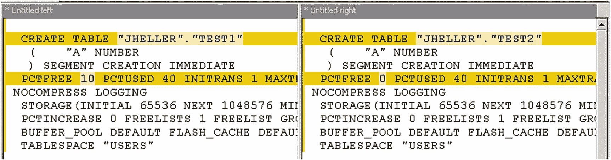
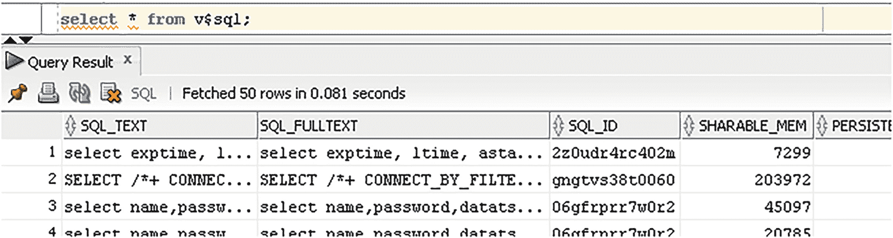
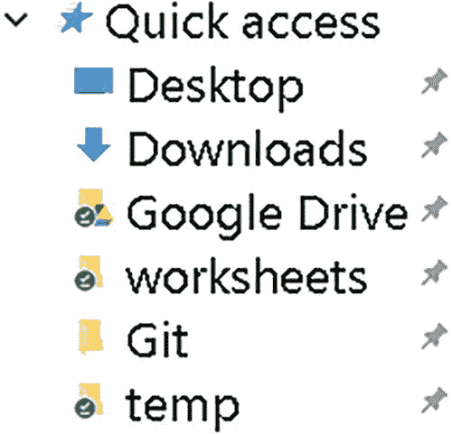
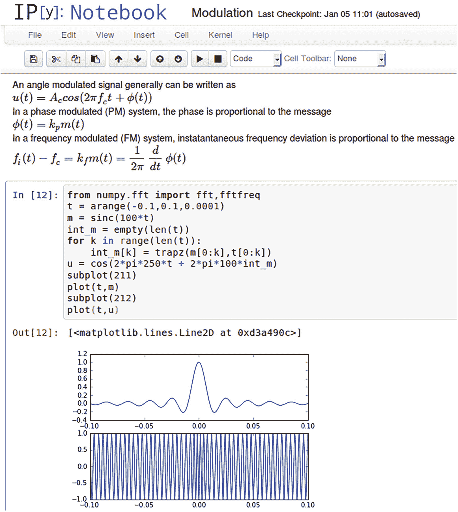
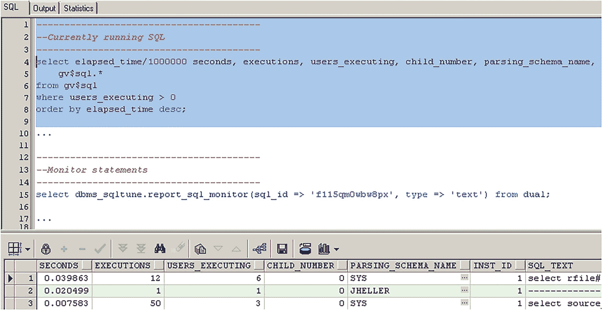

# 5. 掌握整个技术栈

Oracle SQL 开发所需的知识远不止 Oracle SQL 本身。虽然本书聚焦于 Oracle SQL 部分，但本章将审视我们用来编写 SQL 的整个技术栈。这不是一本通用的编程技术指南，因此我们将从 SQL 开发人员的视角来看待我们的技术栈。我们需要投资于我们所有的工具和流程，从底层的硬件到高层的项目管理。

目前，你可能只在工作中将 Oracle SQL 用于一小部分任务。随着你 SQL 技能的增长，以及你发现自己在数据库中完成越来越多的工作，为支持你 SQL 代码的工具投入更多是值得的。即使你不打算成为一名全职的 SQL 或 PL/SQL 开发人员，本章中的大部分建议也适用于任何编程环境。

## 不仅仅是更快

我们的工作中充满了层次、级别、抽象和技术栈。例如，网络系统有 `OSI 模型` 的七层。另一个技术栈的例子是 `LAMP` 栈，它由 `Linux`、`Apache`、`MySQL` 和 `PHP` 组成。即使是在写一封电子邮件时，我们也是从字母开始，然后构建单词、短语、句子、段落，最终形成完整的消息。

SQL 是一种高级编程语言，但值得回顾一下我们技术栈中较低的层次。如果你正在阅读本书，说明你已经知道如何使用那些技术。但重要的是，我们不能仅仅停留在基础技能上勉强应付。

我们希望将基础技术学得足够好，以至于不需要再去思考它们。当我们编写一条 SQL 语句时，我们希望只想一件事：那条 SQL 语句。我们需要掌握其他技术，以便从对它们的依赖中解放出来。例如，我们不需要学习关于操作系统的全部知识，但我们需要知道得足够多，这样操作系统才不会拖慢我们的速度。我们需要进行投资：现在就掌握这些技术，这样在我们的职业生涯中就不必持续思考它们。

为 SQL 开发定义技术栈的方式有很多。本章根据以下列表组织内容，该列表从最低层级开始，到最高层级结束：

1.  `计算机科学与数学`：关系模型已在第 [1] 章讨论。其他计算机科学和数学主题将在全书中出现。
2.  `硬件`：虽然选择正确的硬件显然很重要，但这个主题过于宽泛，本章不设专门章节讨论。
3.  `基本输入/输出系统`：本章第二节讨论了盲打的重要性。
4.  `操作系统与支持程序`：第三节讨论了操作系统命令和有用的程序。
5.  `SQL 与 PL/SQL`：本书全部内容都在讲 SQL，“引言”部分讨论了我们为什么要学习它。第四节讨论了为什么我们可能希望掌握 SQL 并学习像 `PL/SQL` 这样的相关技术。
6.  `SQL*Plus`：第五节讨论了适度使用 `SQL*Plus` 的重要性。
7.  `集成开发环境 (IDE)`：第六节讨论了我们用于开发和查询 `Oracle` 的工具。
8.  `工作表、笔记本、代码片段、脚本和 Gists`：最后一节讨论了如何组织我们的查询。
9.  `项目管理与架构`：虽然没有专门的章节讨论这些主题，但本书会偶尔涉及相关问题。

## 输入

输入是编程中最被低估的技能。输入本身并不是我们工作中特别令人兴奋的部分，但通过掌握它，我们可以受益良多。

确切的输入速度并不重要。每分钟一百二十个词并不真的比每分钟六十个词快一倍，因为我们并不总是以最快速度打字。但每分钟六十个词比每分钟三十个词快一倍以上，因为在这个速度下，我们是在盲打，而不是盯着键盘看。我们必须能够打得和想得一样快。这样我们才能专注于重要的事情，而不会不断中断思路。如果我们能正确地打字，就不会倾向于走捷径，比如使用单字母变量名或避免注释。如果我们大部分工作时间都花在键盘上，那么我们真的应该掌握它。

学习如何正确打字其实并不难。如果我们已经有一些打字技能，在网上找到打字教程来帮助我们提高是轻而易举的事。我们不需要学习优化的德沃夏克键盘布局（尽管这种布局可能有助于患有重复性劳损的人）。我们也不需要参加打字比赛。每天只需几分钟，我们就能快速填补这项基本技能的空白。

学习相关的键盘快捷键也有助于我们更快地工作，并花更多时间思考重要的事情。在操作系统层面，我们应该能够无需看键盘就能剪切、复制、粘贴、切换窗口、打开菜单、切换标签页，以及在单词、行和页面之间移动。而且，为流行的程序（比如我们的 IDE）学习或配置键盘快捷键是值得的。

在一个高度优化的环境中，我们可以在几秒钟内（而不是几分钟）编写并运行简单的查询。这种时间差异不仅让我们工作得更快；它让我们以不同的方式工作。就像我们下意识地避免访问加载时间过长的网站一样，如果编写查询的过程很慢，我们也会避免编写查询。当我们处于数据分析模式时，速度至关重要，我们需要几十个或几百个查询来彻底调查一个问题。

如果你想挑战自己更好地掌握键盘，可以把鼠标藏起来一天。对于大多数编程任务，使用鼠标只会让我们变慢。浏览网页会很痛苦，但不用鼠标工作会让我们在大多数程序中做得更好。

## 操作系统与支持程序

高级 SQL 开发需要了解许多其他程序。我们必须在不同的系统和上下文中运行 SQL。我们需要程序来帮助我们解释、管理和分享结果。本节列出了许多我们应该熟悉的程序和技能。

### 操作系统

开发 SQL 时，我们可能需要处理两个操作系统——创建 SQL 的客户端和运行 SQL 的服务器。即使每个操作系统任务都有 GUI，了解命令行也是值得的。在度过学习曲线之后，命令行更强大、更快。如果你不熟悉你的服务器或客户端操作系统，试着每天学习一个新命令。我们不一定要编写 shell 脚本，但至少能够浏览文件系统和移动文件就能让我们受益。

### 文本编辑器

文本编辑器很重要，即使我们的大部分工作是在 IDE 中完成的。SQL 开发涉及大量数据，而这些数据很多最初都是文本。每个程序员都需要使用一个比记事本功能更强大的文本编辑器。所有平台都有很多免费选项，比如 Notepad++、Notepad2、vi 等。如果我们公司的 IT 政策不允许安装程序，可以下载仅可执行文件版本。大多数图形化文本编辑器都很容易上手——我们只需要花几分钟探索工具栏和菜单即可。Unix 编辑器，比如 vi，可能更具挑战性。幸运的是，有在线视频游戏教程教授 vi，比如 [`https://vim-adventures.com`](https://vim-adventures.com)。

任何像样的文本编辑器都支持正则表达式。正则表达式对于数据处理非常宝贵，我们应该经常使用它们。例如，一个常见的 SQL 问题是将值列表转换为 SQL 数据。与其手动修改数据，正则表达式可以使数据转换快得多。

想象一个包含逗号分隔数据的大型文本文件。我们希望将以下数据文件转换为一个数据表：

```
a,1
b,2
c,3
```

我们的目标是将前面的文本转换为以下 SQL 语句：

```
select 'a',1 from dual union all
select 'b',2 from dual union all
select 'c',3 from dual;
```

使用正则表达式，我们只需四个小步骤就可以转换数据。打开编辑器的查找和替换对话框，通常用 Ctrl+F。启用正则表达式模式，通常通过点击复选框。然后进行四次替换：

1.  将 `^` 替换为 `select '`。
2.  将 `,` 替换为 `',`。
3.  将 `$` 替换为 ` from dual union all`。
4.  手动删除最后一个 ` union all`。

正则表达式起初看起来神秘而令人困惑。但它们是查找和更改数据的强大工具。它们也可以通过 `REGEXP_` 函数在 Oracle SQL 中使用。第 7 章简要讨论了这些函数和正则表达式语法。

### 比较工具

比较是 SQL 开发的核心部分。如果我们坚持关系模型，我们的大部分比较都可以通过 SQL 连接和谓词来完成。但不可避免地，我们必须比较半结构化数据，比如文本文件或源代码。我们需要一种方法来快速比较大量文本，并深入到精确的字节差异。有许多免费和开源的程序可以比较数据，比如 WinMerge。大多数版本控制客户端也可以比较文件。

例如，文本比较程序可以帮助比较长的 `CREATE TABLE` 语句。让我们使用第 2 章中的简单例子，在那里我们看到 `DBMS_METADATA.GET_DDL` 的输出会有多奇怪。以下命令是相同的，只是表 `TEST2` 是用选项 `PCTFREE 0` 创建的。在创建表时，差异很容易发现：

```
create table test1 as select 1 a from dual;
create table test2 pctfree 0 as select 1 a from dual;
select dbms_metadata.get_ddl('TABLE', 'TEST1') from dual;
select dbms_metadata.get_ddl('TABLE', 'TEST2') from dual;
```

但是当我们比较输出时，有太多无用的信息，很难找到任何有意义的差异。（如第 2 章所述，元数据如此丰富，这就是为什么我们想要保存手工编写的 SQL 语句，而不是系统生成的。）在比较工具中，两个表之间的差异变得显而易见，我们可以确切地看到哪些字符不同，如图 5-1 所示。



该片段代表为 Jheller 的测试 1 和测试 2 创建表的指令。测试 1 的 pctfree 为 10，测试 2 为 0。

图 5-1

使用 WinMerge 比较两个类似表的 `DBMS_METADATA.GET_DDL` 输出

### 报表工具与 Excel

IDE 擅长从 SQL 查询中检索结果，但这些初始结果并非总是赏心悦目。电子表格和报表工具可以帮助我们以更好的格式呈现结果。报表软件和商业智能是一个很大的话题，超出了本书的范围。但对于许多目的来说，Microsoft Excel 足以增强我们的结果展示。

大多数 IDE 只需点击几下就能将数据导出到 Excel。在 Excel 中，我们应该学习如何进行一些简单的操作，如排序、筛选、去重、创建标题行、创建像 `=SUM(A1:A100)` 这样的简单公式，以及创建简单的图表。我们可以在短短几小时内学会任何电子表格程序的基础知识。数据的呈现比我们想象的更重要。在与非技术人员分享数据之前，我们至少应该将结果放入 Excel 中。

我们的日常工作还需要许多其他程序，如浏览器、电子邮件客户端、终端模拟器、版本控制等。这里没有必要讨论这些程序，因为它们与 SQL 没有特定关系。但本章的主题同样适用于这些程序：投入时间了解我们的工具。

## SQL 与 PL/SQL

如果你正在阅读这本书，说明你已经致力于学习 SQL。但简要讨论一下为什么花费大量时间 `精通` 一门语言是有益的，这是值得的。我们需要向自己、同事和雇主证明这项投入是合理的。

开发人员经常声称学习一门新的编程语言很容易。但学习一门编程语言只有在三种情况下才容易：罕见的天才可以快速学习任何东西，一门没有太多深度的语言，或者一个不介意写出普通代码的开发者。

人们低估了专业技能的价值。有时我们忘记了掌握一项技能是多么痛苦。想想这句话中的所有单词——我们是在何时何地学会它们的？我们记不清了，但我们的父母和老师可以讲述我们多年努力掌握语言的故事。有时我们不重视专业技能是因为邓宁-克鲁格效应；我们高估了自己的技能，因为我们甚至没有足够的知识来准确判断自己的认知水平。

成为专家可能需要很长时间。十年是一个常见的估计，但不可能找到一个确切的数字。要达到足够好的水平，能够不假思索地完成某件事，需要很长时间。要凭直觉知道我们的代码何时不正确，也需要很长时间和有意识的练习。那 10 年的经验不能是 1 年的经验重复十次。我们需要努力工作，不断进步，并将自己置于不是房间里最聪明的人的环境中。

SQL 类似英语的语法使这门语言对初学者来说易于存储、更新和检索数据。但正是 Oracle SQL 的额外功能让我们能够以最佳方式处理和管理这些数据。整个 Oracle 数据库生态系统不仅包括 SQL，还包括过程扩展 PL/SQL、像 `SQL*Plus` 这样的伪脚本语言、数百个软件包和实用程序、支持 XML 和 JSON 等融合数据库特性，甚至像 APEX 这样的低代码网站构建工具。

额外的关键字、功能和概念就是为什么我们必须花费更多时间来掌握 Oracle SQL，而不是一门传统的编程语言。额外的工作和额外的知识，可以证明我们在培训和参加会议等事情上花费的时间和金钱是合理的。

成为专家值得花费时间和金钱吗？在许多情况下，答案是否定的。我们的大多数项目并不会因为变得优秀而比仅仅良好获得显著的收益。从职业角度来看，通才开发者通常比专才做得更好，尤其是在行业转向 DevOps 的背景下。对我来说，成为一门语言的专家而不是两门语言还过得去，这是个人的选择。我厌倦了世界上所有平庸的软件。如果我们想创造出色的程序，就必须花时间成为专家。

## SQL\*Plus

`SQL*Plus` 是一个很棒的工具，但仅限于特定的场景。`SQL*Plus` 是使用数据库最简单的方式。这种简单性对于脚本编写、演示、故障排除以及在无法使用图形工具时是一个优势。但是，如果我们将其用于开发、调试和即席查询，`SQL*Plus` 将阻碍我们作为开发者的成长。

### 何时应使用 SQL\*Plus

`SQL*Plus` 非常适合编写安装脚本，如第 2 章所述。它也非常适合构建可复现的测试用例，如第 3 章所述。简单、纯文本的格式让一切无所隐藏，使该程序对故障排除很有帮助。有时我们没有可用的桌面环境，而 `SQL*Plus` 是我们唯一的选择。对于一些管理任务，我们只有终端可用。即使我们有远程桌面，有时连接速度太慢而无法使用图形程序，我们只能使用命令行。我们有时不得不使用 `SQL*Plus`，所以不妨习惯它。

当我们使用 `SQL*Plus` 时，必须使用真正的 `SQL*Plus`。许多 IDE 都有内置的 `SQL*Plus` 克隆版本，我们应该避免使用。这些克隆版本总是缺少重要功能，有时甚至缺少重要的 bug。`SQL*Plus` 的主要好处在于其在不同平台和版本之间的可移植性和兼容性。如果某些东西在你的 `SQL*Plus` 中有效，但在我的版本中失败，那么我们中有人没有使用真正的 `SQL*Plus`。我见过许多部署失败，因为开发人员使用了一个没有每行 2,499 字符限制的 `SQL*Plus` 克隆版本。代码在他们的机器上可以运行，但在生产环境使用真正的 `SQL*Plus` 时就失败了。这些限制很烦人，但我们需要在开发周期中尽早意识到这些限制。


## 集成开发环境

### 何时不应使用 SQL*Plus

SQL*Plus 已不再足以应付我们日常的开发工作。市面上有许多成熟的集成开发环境（IDE）可以显著提升我们的生产力。对于编程语言而言，文本通常比图片更合适，但借助图形化 IDE，我们可以同时打开多个代码和元数据窗口，获得更好的代码可视化效果，并快速访问数百个强大的选项。

对于编写查询，我们需要能够快速执行并查看查询不同部分的结果。SQL*Plus 使得运行内联视图或子查询变得困难——我们无法简单地高亮代码并按下运行快捷键。而且 SQL*Plus 的命令行格式化功能使得几乎不可能有意义地查看复杂或即席查询的结果。如果我们事先知道列名，只选择所需的列并设置好格式选项，在 SQL*Plus 中查看少量列是可以的。但这是一种极其有限的数据库使用方式。我们应该能够毫不费力地查看表中`所有`的数据。

认为我们能记住数据库中所有值的样子，并且每次查询表时都能选择相关列，这种想法是荒谬的。当我们使用 SQL*Plus 进行即席查询时，我们把自己限制在了少数几件记得很清楚的事情上。如果把自己局限在已知的事物中，我们将永远无法进步。

例如，在进行性能故障排查时，通常需要查看视图 `V$SQL`。我们很少能提前知道问题所在；我们只是在寻找异常之处，因此需要查看所有内容。当我们在 SQL*Plus 中运行以下查询时，输出结果是一团毫无价值的混乱。我甚至不打算展示输出结果——我的良心不允许我为了打印一堆乱码而浪费纸张：

```
SQL> select * from v$sql;
```

当我们在图形用户界面（如 Oracle SQL Developer）中运行上述查询时，结果则有用得多。图 5-2 中的结果虽然算不上漂亮，但我们可以前后滚动，更容易地探索和理解数据。



该片段表示查询结果的表格，在 0.081 秒内获取 50 行后，该表有五列和四行数据。

图 5-2：在 Oracle SQL Developer 中进行的一个简单数据字典查询

我们生活在信息时代，需要能够显示大量信息的工具。许多数据库专业人士之所以未能发挥其全部潜力，是因为他们拒绝使用现代工具。那些守旧的开发人员还会拖慢我们其他人的速度，因为我们不得不为了支持每行 72 个字符而弱化我们的程序。

使用 IDE 是我们需要说服同事改变习惯的少数几个领域之一。我们不想引发关于 Oracle SQL Developer 与 Toad 的无谓口水战。但当我们看到有人困在二十世纪，只在命令行上完成所有操作时，值得尝试温和地说服他们升级工具。

命令行程序 SQLcl 旨在取代 SQL*Plus，但那一天可能还需要数年时间。该程序有一些有趣的新功能，但也存在错误和 Java 安装问题，并且不像 SQL*Plus 那样普遍可用。我们应该坚持使用 SQL*Plus，以使我们的代码更易于访问。

### 学习一个 IDE

学习 IDE 的最佳方法是观看专家使用它。当我们观看别人使用他们的 IDE 时，会有一些我们能跟上的时刻，然后他们会突然跳跃到我们前面。当我们跟不上时，请让那位开发人员解释他们的“魔法”。大多数开发者都乐于与他人分享他们的 IDE 秘诀，但前提是我们得问。IDE 中有很多个人偏好，开发者在向别人解释他们最喜欢的程序时会感到紧张，因为他们想避免分歧。我们应该向那些专家表明，我们愿意学习所有能学到的技巧和诀窍，即使这偶尔会让我们陷入关于制表符（tab）与空格（space）的争论。

关于我们的 IDE，最重要的一点是：总有办法更改任何我们想要更改的地方。不喜欢默认的字体和颜色？改掉它。觉得完成重复性任务很繁琐？创建一个键盘快捷键或宏来自动化它。希望标签页以不同顺序排列？重新排序。不喜欢它的风格？上网找个插件来改变它。我们永远不应该对 IDE 中的任何功能将就。

本书与 IDE 无关，不会深入探讨如何学习每个 IDE。但我们应该学会在我们的 IDE 中至少完成以下事情：运行光标处的 SQL（学会无需高亮任何内容即可运行命令的快捷键）、在不同的模式（Schema）中查看数据库对象、打开和更改文件系统对象、创建新的数据库对象、在编辑器中查看对象背后的 DDL（通常通过点击文本）、更改语法和格式规则（例如将制表符改为空格）、更改 NLS 属性（例如日期格式）、调试（如何快速设置断点、单步进入、单步跳出等）、运行已保存的脚本或代码片段、代码导航（例如右键点击包内的对象以跳转到不同部分）、重构变量名等等。如果其中任何功能对你来说是新的，请花些时间在你的 IDE 中学习它们。通过学习如何快速执行这些任务，我们可以运行更多的 SQL 语句，缩短反馈循环，并更快地改进我们的代码。

如果你从未浏览过你 IDE 的选项，请立即停下，花上 10 分钟。打开属性或设置菜单，在不同的窗口中右键单击，浏览弹出的菜单。浏览菜单比阅读手册更快，我保证你至少会发现一个你想更改的有用设置。

### 何时不使用 IDE 功能

我们不想使用 IDE 的所有功能。有些开发者将 IDE 当作拐杖来生成代码，只能通过点击向导来编程。仅仅因为这些向导存在，并不意味着我们必须使用它们。对于高级开发者而言，IDE 就像是打了激素的文本编辑器。例如，我们不想使用 IDE 中的“新建表”向导来创建表。我们仍然可以用文本来创建表，而我们的 IDE 会通过语法高亮、自动补全等功能来帮助我们。

IDE 通常包含一些看起来有用或漂亮但可能危险的功能。如前所述，我们应该避免使用 IDE 中模仿 SQL*Plus 的部分。我们也应该避免使用那些允许单个程序实例同时连接到多个数据库的功能。一个窗口应该只用于一个连接，并且连接别名应显著显示在窗口顶部。使用多个标签页、每个标签页连接到不同数据库的开发者，不可避免地会在错误的数据库上执行命令。我们必须配置我们的 IDE，使其总是能一目了然地显示我们连接的是哪个数据库。


## Oracle IDE 对比

我们并不总能自由选择集成开发环境。公司可能已经购买了某一款，或者项目要求使用特定工具。如果幸运的话，我们能对工具有一定的话语权。如果是业余在家编程，则必须自己做出决定。可参考表 5-1 来帮助决策。

**表 5-1**

**最流行 Oracle IDE 的简单对比**

|    | Oracle SQL Developer | PL/SQL Developer | Toad |
| --- | --- | --- | --- |
| **成本** | 免费 | 便宜 | 昂贵 |
| **功能** | 较好 | 良好 | 最佳 |
| **质量** | 良好 | 最佳 | 较好 |

很难说一个 IDE 总是比另一个好。最佳工具取决于个人偏好、使用场景、预算等因素。

`Oracle SQL Developer` 是免费的，并且随所有 Oracle 客户端默认安装。如果缺少它，安装也非常简单——只需下载并运行一个文件，无需管理员权限。由于成本和易于安装，`Oracle SQL Developer` 是最常见的选择。有时它甚至是唯一的选择，因此至少熟悉它是值得的。但它是一个典型的慢速 Java 程序，许多功能感觉不够精致。

Quest 的 `Toad` 功能最丰富，是 Quest 销售的庞大工具生态系统的一部分。如果我们有一个庞大复杂的工作环境，充满了数据分析师、测试人员、DBA 和开发人员，那么应该考虑 `Toad`。最大的缺点是其高昂的成本。

Allround Automations 的 `PL/SQL Developer` 是我个人的最爱。它便宜、快速且高质量。`PL/SQL Developer` 的功能没有其他程序那么多，但它所做的事情都做得更好。它不像 `Oracle SQL Developer` 那样免费，但一个不限人数的站点许可证比单个 `Toad` 许可证还便宜。

比较 IDE 很困难，涉及很多个人偏好。很多人会强烈反对我的分析。只要我们都有一个 IDE 并且知道如何使用它，就没问题。

## 工作表、笔记本、代码片段、脚本和 Gist

我们对 Oracle SQL 开发栈的快速浏览已经从低层理论讲到了高层 IDE。大多数开发者会到此为止。但还有一个最后的重要部分，大多数 SQL 开发者都忽略了——我们需要整理我们的 SQL 语句。我们需要将文件存储在方便、有备份、不容易忘记的位置。并且我们需要将临时的 SQL 语句写在工作表和笔记本中，而不是老式的脚本里。

### 保持条理

我们的大部分 SQL 最终会存储在程序中。在程序内部组织 SQL 很重要，但这不是我们这里要讨论的内部代码结构。本节是关于我们用来支持日常工作的临时 SQL 语句和工作表。随着我们对 SQL 的了解加深，我们会建立一个庞大的有用语句和工作表库。这个库将帮上大忙成千上万次，我们可能会将这些知识携带多年。

建立语句库的第一步是创建一个便于记忆的位置来存储这些信息。遗憾的是，很少有 SQL 开发者能做到这关键一步，看着他们努力回忆昨天构建的语句放在哪里，真是令人痛苦。我们的归档系统细节并不重要，但我们*必须*使用某种方法。

对我来说，建立一个 SQL 库就像创建三个独立的文件夹一样简单——一个用于工作表（我将来可能需要的临时 SQL 语句），一个用于版本控制的仓库，另一个用于我只在近期需要的临时文件。在 `Windows 10` 中，我们可以轻松地将文件夹添加到“快速访问”列表，这些文件夹将始终出现在每个打开或保存对话框中。图 5-3 展示了一个简单结构的示例。



**图 5-3**  
`Windows` 资源管理器“快速访问”列表的示例截图，包含桌面、下载、`Google Drive`、工作表、`git` 和 `temp` 等文件夹。

**图 5-3**  
`Windows` 资源管理器“快速访问”列表示例


## 工作表

既然我们知道了文件存储的位置，那究竟该如何在这些文件中存储我们的 SQL 语句呢？脚本管理是另一个 Oracle 的历史弊大于利的领域。四十年前，能够将单个命令保存在单个文件中然后运行该文件，已经非常酷了。许多 DBA 都有一个包含大量 `SQL*Plus` 脚本的目录，他们经常参考这些脚本来处理常见问题。这些脚本包含一个 SQL 语句，可能带有一些传递给文件的参数，以及少量的输出。

但是这些单一用途的脚本具有本章 "`SQL*Plus`" 部分讨论的所有问题。很难提前预测相关的列，也很难让这些脚本流畅地衔接在一起。

存储临时 SQL 语句的最佳方式是使用笔记本或工作表。工作表是一个简单的概念——在单个文件中存储多个相关的 SQL 语句。将这些语句按有意义的顺序排列，添加注释，将工作表加载到 `IDE` 中，一次运行一个语句，并查看结果。一个语句的结果可能是工作表中后续另一个语句的输入。

工作表和笔记本的想法在数据科学和数学编程环境中真正流行起来。有越来越多的程序让我们可以结合代码、文档和可视化。图 5-4 展示了一个 `IPython Notebook` 的示例。（你不需要理解其中的数学。）



IPython notebook 界面的结果片段。结果包含两个图表。

图 5-4
“`IPython Notebook` 界面” 由 Shishirdasika 创作，采用 `CC BY-SA 3.0` 许可。

最流行的 Oracle `SQL` `IDE` 看起来并不如图 5-4 中的图片那样美观。但工作表的大部分价值在于能够在单个文件中运行多个语句。即使工作表格式并不完美，也无伤大雅。

例如，图 5-5 展示了我正在使用的性能工作表的简化视图。该文件存储在我的 `worksheets` 文件夹中，可以轻松地用 `IDE` 打开。这是我在生产系统遇到性能问题时使用的文件。文件包含了查找慢查询、调查它们并有望解决根本问题的步骤。请不要过于关注细节，因为实际步骤并不重要。我们进行性能调优的过程各不相同。重要的是我们必须有*某种*流程。而且我们的工作表必须易于查找、运行和逐步修改。



一个 SQL 工作表的片段，包括当前正在运行的 SQL 和监控语句。底部的表格有七列三行。

图 5-5
SQL 性能工作表示例

前面的工作表不是一个脚本，我们并不希望每次运行所有命令。（确保你的 `IDE` 配置为按下 `F8`、`F9`、`Ctrl+Enter` 或其他快捷键时只运行一条语句。）工作表是一组伪自动化的步骤，用于帮助排查复杂问题。根据第一步的输出，我们可能需要运行第二步，或者我们可以跳到第三步。它不是一个全自动化的程序；更像是一个性能问题的思维导图。

将工作表存储在像 `GitHub` 这样的公共仓库中是一个流行的选择。`GitHub Gists` 可能是一个不错的选择，因为它们旨在存储单个文件。Oracle 的 `livesql.oracle.com` 提供了一个不错的类笔记本界面。不幸的是，`LiveSQL` 只能针对示例云数据库运行，无法连接到我们的真实数据库。

在线保存工作表并不总是可行。许多公司不允许员工在未经过漫长审批流程的情况下在线发布代码。发布开源软件是好事，但我们的临时工作表对其他人来说本来就不太可复用。在这种情况下，灵活性比开放性更重要。将工作表本地存储就足够了。

**注意**
在创建一个方便的位置来存储你的 SQL 工作表之前，请不要继续阅读。

大多数 `IDE` 允许我们保存和运行代码片段。能够右键单击并立即获取一条 SQL 语句很方便。代码片段对于微小任务可能有用，但它们仍然无法替代强大的工作表。

## 总结
在我们深入研究高级 Oracle SQL 功能之前，我们需要构建并学习一个能全面支持我们的技术栈。这些辅助技术并不总是那么令人兴奋，但掌握这些底层知识很重要，这样我们才能专注于重要的事情。如果我们决定投入更多精力学习 `SQL`，那么投入时间学习诸如打字技能、操作系统和程序、`SQL*Plus`、`IDE` 和 SQL 工作表等内容也是值得的。

