# 6. 使用内联视图和 ANSI 连接语法构建集合
我们几乎准备好深入研究高级 SQL 功能了。在第一部分中，我们为 SQL 编程打下了坚实的基础，但在开始使用高级功能之前，我们需要讨论如何构建我们的 SQL 语句。

编写 SQL 语句的最佳方式是使用内联视图和 `ANSI` 连接语法来创建嵌套集合。首先，我们需要讨论常见的 SQL 问题——由旧式连接语法和过多上下文导致的面条代码。集合、分块和函数式编程可以帮助我们创建更简单的查询。我们将结合这三个概念，并使用内联视图来实现它们。内联视图将成为我们 SQL 语句中微小而独立的构建块。`ANSI` 连接语法将帮助我们利用这些内联视图构建庞大但易于理解的查询。最后，我们将把这些想法整合在一起，构建一个大型示例，并从我们的空间数据集中学习一些东西。

## 非标准语法导致的面条代码
旧式连接语法将所有表放入一个逗号分隔的列表中，然后再将这些表连接在一起。这种编程过程导致代码难以阅读、难以调试、容易发生意外的交叉连接，并且是非标准的。旧式连接语法仍然有效，偶尔也有用，但应谨慎使用。

作为快速回顾，以下代码展示了旧式连接语法和较新的 `ANSI` 连接语法。（示例中使用 `*` 以求简洁，但我们的大多数生产查询应该明确命名我们需要使用的列。）

```
--我们应该避免的旧式连接语法。
select *
from launch, satellite
where launch.launch_id = satellite.launch_id(+);
--我们应该采用的 ANSI 连接语法。
select *
from launch
left join satellite
on launch.launch_id = satellite.launch_id;
```


## 难以阅读的旧语法

旧式连接语法的首要问题在于它将表与其连接条件分隔开来。表被扔进一个逗号分隔的列表中，然后才在后续步骤中被连接在一起。将表与连接条件分离，使得我们更难看清表之间是如何关联的。理论上，我们可以按有意义的顺序构建表列表，并在编写连接条件时遵循相同的顺序。但实际上，这种有序的开发过程从未真正发生，我们最终得到的总是一个难以阅读、杂乱无章的查询。

在写作时，我们希望按照项目引入的顺序来描述它们。对于表，我们也应遵循同样的规则。我们应该以相同的顺序列出并连接表。表的顺序对编译器来说无关紧要——编译器可以随意重排表的顺序。（在古老的 Oracle 版本中，或在极其罕见的情况下，表的顺序可能会影响性能。但这些特例不应决定我们如今编写代码的方式。）尽管编译器不在乎顺序，但*人*才是真正的受众。旧式连接语法辜负了我们，因为它助长了一种糟糕的风格。

对于任意一组项目，存在 `N!` 种排序方式。这意味着，连接一个大型表列表的方式数量大到难以想象。当我们看到一个逗号分隔的表列表时，我们完全无法预知查询的其余部分会是什么样子。

把一堆表扔到屏幕上，然后在它们之间画线，这是一种拙劣的思考表连接的方式。我们的大脑很难同时处理所有信息。旧语法误导我们创建了诸如噩梦般的图 6-1 那样的 SQL 语句。Oracle 编程世界充斥着丑陋的 SQL 语句，它们拖累了整个生态系统。正是这些丑陋的 SQL 语句，导致如此多的程序员厌恶 Oracle SQL，也是我花费大量时间试图说服你改变 SQL 语法的原因。

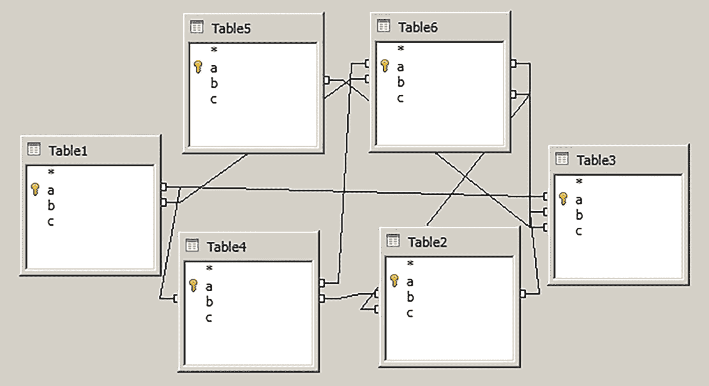

图 6-1：思考 SQL 连接的错误方式

## 难以调试的旧语法

调试本就困难，使用旧式连接语法调试则尤其困难。当我们调试大型 SQL 语句时，我们希望一次测试一小部分。如果我们的查询编写不当，就没有简单的方法来隔离和运行这些小片段。

这个调试问题在大多数 SQL 教程和书籍中并未体现。好的例子会省略不必要的代码，并且规模较小。大多数 SQL 示例只需要一两个表。当只有两个表时，连接语法无关紧要。许多 SQL 开发者学习的技术和风格在小例子上运行良好，但无法扩展到大型查询。

当我们的查询增长到三个或更多表时，问题就变得明显了。读完本书后，你应该能够轻松创建包含远不止三个表的 SQL 语句。

例如，假设我们想找出每次火箭发射使用的引擎数量。火箭可以有多个级段，每个级段可以有不同数量的引擎。要找到这些信息，我们需要连接 `LAUNCH`、`LAUNCH_VEHICLE_STAGE` 和 `STAGE` 表。下面的连接中，在感叹号旁边，有一个故意设置的错误。该查询连接了级段*编号*，而它应该使用级段*名称*：

```
select launch.launch_tag, stage.stage_name, stage.engine_count
from launch, launch_vehicle_stage, stage
where launch.lv_id = launch_vehicle_stage.lv_id
and launch_vehicle_stage.stage_no /*!*/ = stage.stage_name
order by 1,2,3;
```

前面的错误是一个简单的笔误，很容易修复。如果我们遇到的是 `LAUNCH_VEHICLE_STAGE` 和 `STAGE` 之间的问题，我们希望在没有 `LAUNCH` 表参与的情况下调试该语句。但要从前面的查询中移除 `LAUNCH`，我们必须重写它的大部分内容。在这个例子中，只有三行，所以重写不是什么大事。但在现实世界中，当涉及数十个表时，调试这样的查询是痛苦的。（本章末尾将展示一个更接近实际规模的查询。目前，我想保持简单。）

在构建程序时，我们需要即时反馈，以便尽快纠正错误。当我们把一堆表凑到一起然后再连接它们时，我们延迟了发现错误的时间。然后我们可能直到有了数十个表，更难猜测问题所在时，才注意到问题。为了使调试更容易，我们需要采用更加模块化和迭代式的过程。

## 旧语法中意外的交叉连接

旧式连接语法经常导致意外的交叉连接，也称为笛卡尔积。这些交叉连接会导致错误的结果和糟糕的性能。交叉连接在开发环境中可能运行良好，但在生产环境中，当数据量变大时，则可能灾难性地失败。

交叉连接将结果行数乘以未连接表中的行数。一个糟糕的交叉连接实际上可以使整个数据库停止工作。当 Oracle 生成大量行时，这些行必须存储在磁盘上的临时表空间中。如果该临时表空间与另一个应用程序共享，该应用程序将没有任何空间可用于排序或散列数据。然后，该应用程序的查询要么立即引发异常，要么进入挂起状态并等待更多空间。当 DBA 看到会话挂起错误时，他们通常会立即添加更多空间。但是，当 Oracle 试图写入艾字节的垃圾数据时，增加一个 32GB 的文件也无济于事。正是这些额外的临时文件，导致许多数据库最终拥有无用且巨大的临时表空间。

旧式连接语法使得无意的交叉连接更有可能发生。当我们写下一个大型表列表时，很容易在之后忘记其中一个。查询语法仍然有效，编译器也不会报错。很难发现这些错误，尤其是在大型查询中。在下面的例子中，如果相关代码没有加粗，我们会注意到 `ENGINE` 表没有连接到任何地方吗？

```
select launch.launch_tag, stage.stage_name, stage.engine_count
from launch, launch_vehicle_stage, stage, engine
where launch.lv_id = launch_vehicle_stage.lv_id
and launch_vehicle_stage.stage_no /*!*/ = stage.stage_name
order by 1,2,3;
```

我们无法禁止交叉连接，因为这种语法有时是必要的。而且我们无法通过测试捕捉所有糟糕的交叉连接，因为交叉连接可能发生在生产环境中的即席查询里。转换为 ANSI 连接语法将几乎完全消除意外的交叉连接。^(¹¹)

除了因意外交叉连接导致的数据连接不足（under-joining）外，旧式连接语法也使得数据过度连接（over-joining）更容易发生。例如，如果我们将表 `A` 左连接到表 `B`，那么我们也希望将表 `B` 左连接到表 `C`。一个常见的错误是在 `A` 和 `B` 之间使用左连接，而在 `B` 和 `C` 之间使用内连接。这个错误实际上将外连接变成了内连接。使用 `(+)` 运算符，加上杂乱无章的连接条件，在旧式连接语法中很容易犯这种错误。


## 非标准但仍有用

旧的连接语法是在 SQL-92 标准完全确立之前创建的。在早期，每个数据库都必须创建自己的连接样式。所有关系型数据库都可以使用表列表样式进行内连接，但表示外连接的方式有很多种。在 Oracle 中，外连接是通过在可选连接的一侧添加 `(+)` 操作符来标记的。

对于大多数 ANSI 连接语法的倡导者来说，遵循标准是其最大的优点。确实，带有 `(+)` 操作符的查询在其他数据库上无法运行。但缺乏标准化和可移植性实际上并不那么重要。在实践中，如果我们正在利用有用的 Oracle 特性，我们的查询无论如何都将不可移植。选择 ANSI 连接语法主要是一种风格选择（尽管在极少数情况下旧语法根本不起作用，例如全外连接）。

然而，有时必须使用旧的连接语法。我们仍然需要熟悉 `(+)` 操作符，并能够在这两种语法之间进行转换。存在一些罕见的性能问题和语法错误，可以通过切换到旧语法来解决。而且位图连接索引和快速刷新物化视图要求使用旧语法。但这些例外情况不应主导我们的风格。

## 过多的上下文

错误的 SQL 特性在我们的 SQL 语句中创造了过多的上下文和依赖关系。我们希望用小的、独立的代码块来构建我们的 SQL，并尽可能简单地连接这些块。我们应该避免使用增加上下文的功能，例如关联子查询和公用表表达式。

### 减少上下文的重要性

上下文至关重要。我们不能孤立地理解代码。我们需要看到全局和所有元数据。当我们知道代码是谁写的、为什么写，以及我们正在查看的代码块前后的代码时，代码就更容易理解。上下文让我们对所阅读的内容有更深入的理解。

但编程上下文是不同的。在编程中，上下文指的是我们程序的背景状态。这些信息可能有帮助，但当意外的副作用改变后台事物时，它更可能引起问题。代码不是具有多种有效解释的文学作品。我们的代码应该极其直白，尽可能少地包含背景信息。在编程时，上下文更有可能捉弄我们，而不是帮助我们。

当程序中的 SQL 语句出现问题时，我们希望将该语句复制到我们的 IDE 中并独立运行它。然后我们会想要运行查询的小部分来查找错误。但上下文会碍事。SQL 语句可能依赖于我们会话中未提交的数据、基于局部和全局变量的绑定变量、对象、用于外部表的操作系统文件等。

良好的编程实践，如避免全局变量，可以减少上下文。查询至少有一些上下文是不可避免的，但我们仍然可以将其最小化。我们特别希望最小化查询内部的上下文。查询内的依赖关系必须保持在最低限度。在实践中，减少上下文意味着避免关联子查询和公用表表达式。

### 避免关联子查询

关联子查询是在 `SELECT` 和 `WHERE` 子句中找到的、引用查询另一部分的子查询。关联子查询并非总是邪恶的，但如果我们一贯过度使用它们作为连接的替代品，它们会毁掉我们的查询。例如，让我们重写查找每次发射所用发动机数量的查询。不直接连接到 `STAGE` 表，而是创建一个关联子查询：

```
select launch.launch_tag, launch_vehicle_stage.stage_name,
(
select stage.engine_count
from stage
where stage.stage_name = launch_vehicle_stage.stage_name
) engine_count
from launch
join launch_vehicle_stage
on launch.lv_id = launch_vehicle_stage.lv_id
order by 1,2;
```

前面示例中的关联子查询增加了语句的复杂性。乍一看，子查询似乎将 `STAGE` 与查询的其余部分隔离开来。但由于两个 `STAGE_NAME` 列之间的关联，关联子查询并没有创建一个独立的代码块。信息现在在两个方向上传递，我们无法简单地高亮显示并运行子查询来理解它。新查询仍然有效地连接了表，但连接是间接执行的，并且需要稍多一些代码。

这个示例受关联子查询的影响并不严重，因为这个示例足够简单，可以记在脑子里。但在更大的查询中，关联子查询使得无法以小块的方式理解查询。前面的示例在 `SELECT` 子句中使用了关联子查询，但在 `WHERE` 子句中的问题同样严重。

### 避免公用表表达式

公用表表达式是一个有用的功能，但它们经常被过度使用，并不必要地增加了查询的上下文。公用表表达式也称为 `WITH` 子句或子查询因子化。例如，以下查询返回近期的深空任务：

```
with launches as
(
select *
from launch
where launch_category = 'deep space'
and launch_date >= date '2000-01-01'
)
select *
from launches
join satellite
on launches.launch_id = satellite.launch_id;
```

在上面的查询中使用公用表表达式有一些小优势。公用表表达式从上到下流动，这是更传统的程序流方向。公用表表达式分离了 `LAUNCH` 谓词，使仅测试这两个谓词更容易。但公用表表达式并没有真正创建两个独立的部分。我们仍然不能高亮显示查询的下半部分并在 IDE 中运行它。整个查询仍然紧密相连，必须作为一个整体来理解。公用表表达式增加了上下文的数量。

有很多时候关联子查询和公用表表达式是有用的。有时关联子查询看起来就是有道理的，并且它们可能通过标量子查询缓存等特性提高性能。如果被多次引用，公用表表达式可以减少代码量，并可能通过物化结果来提高性能。但如果我们想要创建小的、模块化的代码，我们需要使用不同的技术。

## 集合、分块和函数式编程来救援

关于传统 SQL 语法的问题就谈这么多——让我们来谈谈解决方案。我们如何编写功能强大的 SQL 语句同时保持其可读性？首先，我们需要将 SQL 语句视为嵌套的集合，而不是我们在图 6-1 中看到的混乱的链接表。分块可以帮助我们管理这些集合。而应用函数式编程思想可以帮助我们简化代码。


### 集合

以集合的方式思考有助于我们理解和可视化 SQL 语句。大多数 SQL 指南都强调基于集合的处理，以帮助我们编写更快的 SQL。确实，性能上的收益是巨大的，本书的第三部分和第四部分对此进行了多次讨论。但本章的重点在于，基于集合的思维同样能帮助我们编写`可读性强`的 SQL。

数学上的集合就是对象的集合——一个无定形的集合。我们可以用文本来描述一个集合，比如`A = {1, 2, 3, 4}`。将集合可视化也同样有益，例如图 6-2 所示。


一个圆形代表了多边形，它由八种不同颜色、不同形状组成。包括矩形、正方形、两个三角形、两个六边形、五边形和星形。

图 6-2

“一个集合的例子”，作者 Stephan Kulla，采用 CC0 许可授权

集合可以包含其他集合。嵌套集合是表示任何类型信息的强大方式。可视化集合的方法有很多，例如第一章的韦恩图，或图 6-3 中的示意图。思考集合的确切方式并不重要，重要的是我们心中有一个牢固的集合心理模型。

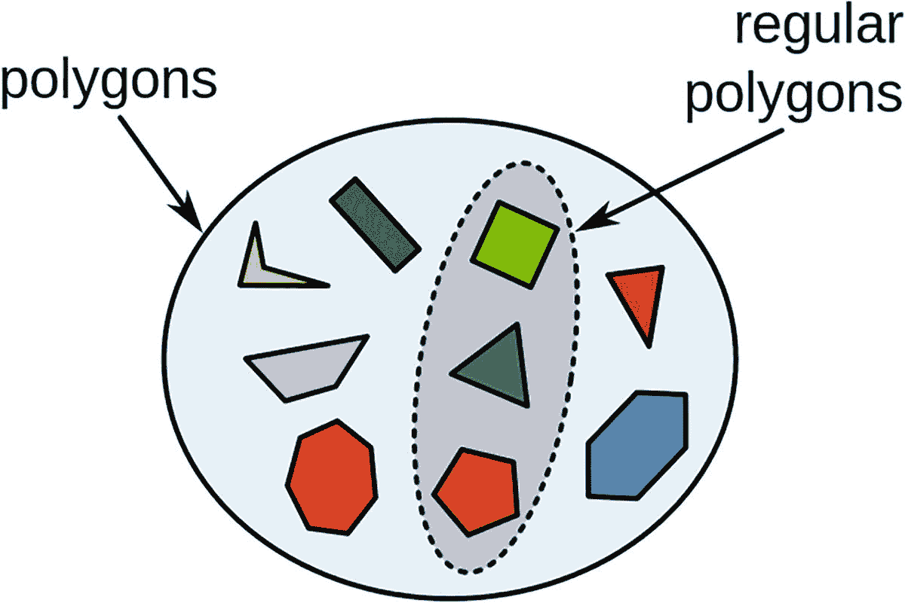

一个圆形代表了多边形，它由八种不同颜色的不同形状组成。正多边形（正方形、三角形和五边形）被一个虚线闭合图形圈出。

图 6-3

“正多边形集合，其中高亮显示了正多边形子集。集合论系列的一部分”，作者 Stephan Kulla，采用 CC0 许可授权

但是，我们的关系型集合与数学集合之间的类比并不完美。数学集合要求元素互异。但正如第一章所讨论的，总是要求我们的关系型数据互异是不切实际的。数学集合可以包含任意类型、任意形状的子集。但正如第一章所讨论的，我们需要将数据作为带有简单列的简单行来存储和投影。当我们用连接组合多个集合时，结果应该总是简单的表格数据。我们应该避免在单个列中存储集合，因为这类数据难以过滤和连接。

### 分块

分块是将小块信息组合成一个新的、有意义的实体的过程。分块是我们在有限的短期记忆容量下，将复杂概念保持在脑海中的方法。

关于我们能在短期记忆中保持多少个项目，尚无明确的共识，尽管`7 ± 2`似乎是一个普遍接受的答案。¹² 我们一直在使用分块，例如使用助记符来记住彩虹的颜色（`Roy G. Biv`），或者通过将电话号码分解成小块来尝试记住它。我们也可以使用分块来改进我们的 SQL 语句。

是时候引入第一个也是唯一一个复杂的例子了，使用太空数据集。让我们来找出每年最流行的火箭燃料，并寻找趋势。随着技术的变革，火箭是否在趋向使用特定类型的燃料？要使用旧的连接语法来回答这个问题，`FROM`子句如下：

```
from launch, launch_vehicle_stage, stage, engine, engine_propellant, propellant
```

这六个表、它们的列以及它们之间的关系，一次性处理起来太多了。相反，我们可以将这个查询看作三个不同集合的集合：发射记录、发射载具引擎以及引擎燃料。每个集合都是一个小型的、易于理解的查询。而将这些集合组合在一起是很容易的。

由于 SQL 语句比典型的集合具有更强的连接性，我们应该将`7 ± 2`的经验法则调整为`3 ± 1`。图 6-4 展示了这三个集合之间连接的韦恩图。连接韦恩图通常展示的是表，但在关系模型中，表和结果集没有区别。内连接、左外连接以及所有其他操作在表和集合上的工作方式是相同的。


一个展示发射记录、发射载具引擎和引擎之间关系的韦恩图。

图 6-4

三个关系型集合之间连接的韦恩图

嵌套集合是简化我们 SQL 的关键。在一些编程语言中，深层嵌套结构是个问题。但在 SQL 中，深层嵌套结构让我们可以简化代码。我们语句的每一层都包含少量易于理解的分块。分块之间的接口始终是相同且枯燥的关系型数据。如果一个分块出现问题，我们可以深入查看下一层的分块，并重复此过程，直到整个查询正确无误。

### 函数式编程

函数式编程可以减少依赖和上下文。在函数式编程中，确定性的数学函数对于相同的输入返回相同的值，并且不依赖于程序状态。（这种函数不同于`PL/SQL`函数，后者有时可能对相同的输入返回不同的结果。）函数式程序是声明性的，这意味着我们告诉程序我们想要什么，而不是如何去做。

移除程序状态消除了导致许多错误的意外副作用。但完全移除程序状态是困难的——我们的程序最终必须改变某些东西。这种局限性或许可以解释为什么函数式编程从未真正流行起来。最广泛使用的函数式编程语言是 R、Lisp 和 Haskell。这些语言虽然流行，但很少进入编程语言排行榜的前十名。但函数式编程的`理念`已经渗透到其他语言中。

SQL 并非设计为函数式编程语言，但我们的程序可以轻松地实现函数式编程思想。与传入参数和返回值不同，SQL 语句处理的是关系型数据：关系型集合作为输入，一个关系集合作为输出。这种简单性起初可能让人觉得受限，但这种限制却使我们免于担心上下文。如果我们使用简单的输入和输出，我们就能轻松理解一小块 SQL。

SQL 数据应该仅通过嵌套集合传递。遵循这一规则，我们只需要考虑来自一个方向的数据。这减少了依赖和上下文。我们希望尽量减少通过全局变量、绑定变量、关联子查询和其他副作用传递数据。在我们的 SQL 语句的最底层，集合来源于关系表。要将结果传递给更高层的 SQL 语句，我们必须使用内联视图。

### 内联视图

内联视图是创建和组装小型 SQL 分块的完美方式。内联视图通过结合集合、分块和函数式编程风格，帮助我们简化代码。

### 何为内联视图？

“内联视图”、“子查询”和“关联子查询”这几个术语经常被混用，但理解它们之间的区别非常重要。子查询是指查询内部的任意查询。关联子查询位于 `SELECT` 或 `WHERE` 子句中，并引用了外部查询的列值。内联视图则是位于 `FROM` 子句中的子查询：

```
--以下两者都是子查询：
--关联子查询：
select (select * from dual a where a.dummy = b.dummy) from dual b;
--内联视图：
select * from (select * from dual);
```

内联视图很有用，因为它们彼此独立。在上面的例子中，我们可以单独运行内联视图中的子查询。在 IDE 中，运行独立的部分就像高亮选中并点击按钮一样简单。而关联子查询则无法独立运行，它要求一次性理解整个查询。

每个内联视图本质上就是一个集合，其行为类似于普通的表或视图。类似于函数式编程，内联视图传入一样东西（集合），总是返回相同的结果（另一个集合），并且不依赖于其他任何东西。^(^(¹³)^)

内联视图可以无限嵌套，但我们需要谨慎把握平衡。我们不希望查询嵌套过深，因为每一层内联视图都需要更多的代码。我们也不希望查询过于扁平，因为那样就必须一次性连接所有表。这取决于我们如何定义一个可用的“块”，而我们的定义可能会随着时间改变。当我们初次使用一个数据模型时，可能一次只连接几个表，但随着对数据的熟悉，连接的表数量会增加。当我们的“块”大小增加时，我们必须记住，我们是在为其他人编写查询，而不仅仅是为自己。

### 内联视图使代码更庞大但也更简单

内联视图存在一个悖论。简化应该让代码更少，但添加内联视图却会使整体代码量变大。例如，查询十张表最简短的方式是将它们一次性全部连接起来。如果我们将列表分成两组，我们仍然需要连接所有表，现在还需要连接这两个组。这种拆分和连接导致了更多的代码，但这仍然是个好主意。

在下面的伪代码中，第一个查询初看起来可能比第二个更简单：

```
--#1: 一次性连接所有表：
select ...
from table1,table2,table3,table4,table5,table6,table7,table8,table9,table10
where ...;
--#2: 使用内联视图：
select *
from
(
select ...
from table1,table2,table3,table4,table5
where ...
),
(
select ...
from table6,table7,table8,table9,table10
where ...
)
where ...;
```

内联视图版本需要更多字符，那么我们如何能有根据地说第二个版本更简单呢？首先，想想连接那十张表的可能方式。当一次性连接时，在 `WHERE` 子句中可视化及排序这些表的方式有 `10! = 3,628,800` 种。在内联视图版本中，在 `WHERE` 子句中可视化及排序这些表的方式有 `(5! + 5!) * 2 = 480` 种。

上面的数学计算过于精确。我并非声称第二个版本比第一个版本简单整整 7560 倍。关键在于，我们的代码复杂度并非线性增长。向一个十表连接中添加一张表，比向一个五表连接中添加一张表要糟糕得多。这与我们的短期记忆或 7±2 法则有关。由于我们必须记住这些表以及如何连接它们，我们应该将这个法则减半，采用 3±1 法则。

### 一个大型示例中的简单内联视图

让我们看看第一个实际示例——查找每年最受欢迎的火箭燃料——中的内联视图。这个查询包含三个部分：发射、运载火箭引擎和引擎燃料。首先，我们想找出相关的发射：

```
(
--轨道及深空发射。
select *
from launch
where launch_category in ('orbital', 'deep space')
) launches
```

接下来，我们想找出每次发射所使用的引擎。运载火箭（通常是火箭）可以有多级。每一级可以使用不同的引擎：

```
(
--运载火箭引擎
select launch_vehicle_stage.lv_id, stage.engine_id
from launch_vehicle_stage
left join stage
on launch_vehicle_stage.stage_name = stage.stage_name
) lv_engines
```

最后，我们想找出每个引擎使用的燃料：

```
(
--引擎燃料
select engine.engine_id, propellant_name fuel
from engine
left join engine_propellant
on engine.engine_id = engine_propellant.engine_id
left join propellant
on engine_propellant.propellant_id = propellant.propellant_id
where oxidizer_or_fuel = 'fuel'
) engine_fuels
```

上述内联视图构成了我们查询的主体，分为三个独立的小块。可以说其中一些内联视图过于简单了。例如，第一个内联视图甚至没有连接表，它只是进行了过滤。但我们应该宁可谨慎。判断一个内联视图是否过于复杂是很困难的。查询编写者，就像所有作者一样，都受到“知识诅咒”的困扰；我们无意识地假定其他人知道我们所知道的一切。由于我们刚刚开始使用这个数据集，我们希望从小处着手。我们知道的越少，“块”就应该越小。

我们可以使用集合来构建优雅的嵌套结构。但将如此多的工作放在一个 SQL 语句中可能会导致问题。第 12 章讨论了构建大型嵌套查询所引发的样式和性能问题。既然我们已经有了这些小片段，下一节将讨论如何使用 ANSI 连接语法将它们组合起来。

### ANSI 连接

如果说集合和内联视图块是食材，那么 ANSI 连接就是创建可读 SQL 语句的食谱。使用 `JOIN` 关键字会让我们的查询显得有点冗长，但可读性比字符数量更重要。

ANSI 连接语法迫使我们一步一步地编写 SQL 语句。我们的查询从一个单一的集合开始，将该集合与其他东西组合以创建一个新的集合，然后重复这个过程直到完成。这些集合可以是表、视图、内联视图、物化视图、表集合表达式、分区、远程对象、使用闪回技术获取的某个时间点的表快照、表示为外部表的 CSV 文件，以及天知道的其他东西。关系模型的美妙之处在于，集合的来源并不重要。只要集合能返回行和列，它们都可以被同样对待。

ANSI 连接过程的简单性是关键。当十几个表被快速堆砌在一起时，我们很容易感到困惑。但当我们一次只添加一样东西时，就很难“迷失”在集合中。

将查询拆分为多个内联视图块并用 `JOIN` 关键字组合它们会使用更多字符。但可读性至关重要。语法辩论中提到的其他一切都无关紧要。如果我们无法读懂自己的 SQL 语句，那么关于标准符合性、罕见的优化器错误、罕见的语法特性、传统、笛卡尔积以及字符计数的争论都是毫无意义的。


### 示例

现在，让我们最终构建出第一个复杂的 SQL 语句。下面的查询展示了每年最常用的火箭燃料。该查询首先创建三个简单的内联视图片段：`launches`、`launch vehicle engines` 和 `engine fuels`。接着，查询组合这三个内联视图，统计每年燃料的使用次数，对计数进行排名，然后选择前三名。

使用嵌套内联视图构建查询时，起初会感觉是从内向外看的。与命令式编程不同，我们的查询不是从上到下流动的；代码从中间开始，然后向外层移动。在下面的示例中，每个内联视图都进行了编号，以帮助我们理解代码^(¹⁴)：

```sql
--Top 3 fuels used per year using ANSI join syntax.
--
--#6: Select only the top N.
select launch_year, fuel, launch_count
from
(
--#5: Rank the fuel counts.
select launch_year, launch_count, fuel,
row_number() over
(partition by launch_year order by launch_count desc) rownumber
from
(
--#4: Count of fuel used per year.
select
to_char(launches.launch_date, 'YYYY') launch_year,
count(*) launch_count,
engine_fuels.fuel
from
(
--#1: Orbital and deep space launches.
select *
from launch
where launch_category in ('orbital', 'deep space')
) launches
left join
(
--#2: Launch Vehicle Engines
select launch_vehicle_stage.lv_id, stage.engine_id
from launch_vehicle_stage
left join stage
on launch_vehicle_stage.stage_name = stage.stage_name
) lv_engines
on launches.lv_id = lv_engines.lv_id
left join
(
--#3: Engine Fuels
select engine.engine_id, propellant_name fuel
from engine
left join engine_propellant
on engine.engine_id = engine_propellant.engine_id
left join propellant
on engine_propellant.propellant_id = propellant.propellant_id
where oxidizer_or_fuel = 'fuel'
) engine_fuels
on lv_engines.engine_id = engine_fuels.engine_id
group by to_char(launches.launch_date, 'YYYY'), engine_fuels.fuel
order by launch_year, launch_count desc, fuel
)
)
where rownumber <= 3
order by launch_year, launch_count desc;
```

前面的代码以及所有其他代码示例都可以在 [`https://github.com/apress/pro-oracle-sql-dev-2e`](https://github.com/apress/pro-oracle-sql-dev-2e) 找到。本书假定您使用的是 Oracle 12.2 或更高版本。需要 18c 或更高版本的示例和语法将会被单独注明。

本书通常不会有大量代码块，如果您在阅读本书时没有运行示例也没关系。但这一次，我建议您至少将那个大查询加载到 IDE 中并尝试操作一下。请注意我们如何轻松地高亮显示不同部分并调试查询。每个编号的部分都可以独立运行，我们可以轻松地观察结果集逐步增长，直到查询完成。

该查询的前五行如下所示。老科幻迷们可能会感到失望——最受欢迎的火箭燃料在过去 60 年里变化不大。除了最初几年，前三名通常是 UDMH（不对称二甲基肼）和不同版本的煤油。然而，在过去 20 年里，像液氢这样的燃料开始变得更受欢迎。（显然这些数据并不完美，某些值可能应该归为一组。但这些小错误并不意味着我们的查询无效。）

```
LAUNCH_YEAR  FUEL           LAUNCH_COUNT
-----------  -------------  ------------
1957         Kero T-1                  4
1957         Kero                      1
1957         Solid                     1
1958         Solid                    39
1958         JPL 136                  21
...
```

## 总结

连接是数据库中最重要的操作。如果要在数据库领域取得成功，我们必须正确掌握连接。传统的构建查询方式——把所有表都扔进一个列表的风格——会导致许多问题。如果我们能以集合的方式思考，用内联视图将查询分解成片段，然后用 ANSI 连接语法将这些内联视图组合起来，我们的查询将会好得多。

脚注 1   2   3   4

## 7. 使用高级 SELECT 功能查询数据库

`SELECT` 是最重要的 SQL 语句类型。即使在我们更改数据时，大部分逻辑也会放在语句的 `SELECT` 和 `WHERE` 子句中。在插入、更新或删除一个集合之前，我们必须能够选择一个集合。

本章介绍 Oracle SQL `SELECT` 的中级和高级功能。每个主题都可以填满一整章，甚至一整本书。本章不展示所有选项并考您语法，而是侧重于广度而非深度，只试图向您展示可能实现的功能。高级编程和调优的第一步，就是简单地记住有哪些功能可用。当我们意识到我们的 SQL 可以通过这些高级功能之一得到改进时，我们就可以查阅 *SQL 语言参考* 来获取语法。

下面列出的主题大致按重要性排序。`SELECT` 语句几乎总是在 `SELECT` 和 `WHERE` 子句中包含表达式和条件。大多数语句会连接和排序数据。有些语句可能使用集合运算符组合查询。更复杂的问题需要高级分组、分析函数、正则表达式、行限制以及透视和逆透视。更罕见的问题需要替代表引用、公用表表达式和递归查询等功能。如果我们有非关系型数据，可能需要处理 XML 和 JSON。最后，我们偶尔还必须考虑国家语言支持（NLS）问题。

## 运算符、函数、表达式和条件

Oracle 有大量的运算符、函数、表达式和条件。我们需要理解这四个术语的精确定义，以便能够识别我们遗漏某些内容的情况、优先级规则以及如何简化我们的语法。

### 语义

运算符和函数都接受输入并返回一个值。两者的区别在于运算符具有特殊的语法。例如，我们可以使用像 `'A'||'B'` 这样的运算符连接值，也可以使用像 `CONCAT('A','A')` 这样的函数调用连接值。^(¹⁵) 表达式是字面量、函数和运算符的组合，返回一个值。条件是表达式和运算符的组合，返回一个布尔值。简而言之，运算符是返回值的符号，函数是传入参数并返回值，表达式组合事物并返回值，而条件组合事物并返回布尔值。

前面关于运算符、函数、表达式和条件的定义可能令人困惑，看起来有些学究气，但它们之间的区别很重要。在某些上下文中，并非所有这四种事物都可以使用。例如，`WHERE` 子句可以有一个独立的条件，但不能有一个独立的表达式。带有条件的语句是有效的：`SELECT * FROM DUAL WHERE 1=1`。带有表达式的语句则无效：`SELECT * FROM DUAL WHERE 1+1`。


## 如何发现我们遗漏了什么

无论我们阅读 `SQL Language Reference` 多少次，也永远无法记住所有的运算符、函数、表达式和条件。我们只能学到足够多，从而培养一种直觉：感知到我们何时遗漏了什么，以及何时应该查阅手册以寻找简化代码的方法。Oracle 提供了足够多的运算符、函数、表达式和条件来应对最常见的任务。如果我们发现自己在进行大量类型转换，那就说明我们没有使用正确的特性。这些“语法汤”问题最常出现在日期操作中。

例如，假设我们想查找关于第一颗人造地球卫星“斯普特尼克”的信息。我们可能记得发射日期是 1957 年 10 月 4 日。但没人记得确切时间，因此我们只应查询日期。下面的查询可能有效，但包含危险且不必要的类型转换：

```
select *
from launch
where to_char(to_date(launch_date), 'YYYY-Mon-DD') = '1957-Oct-04';
```

有一种更简单、更安全且更快捷的方法来实现上述查询。`TRUNC` 函数可以无需任何转换地去除日期中的时间部分。通过足够的练习和 SQL 知识，我们会直观地知道，前面的查询可以改写为类似下面的查询：

```
select *
from launch
where trunc(launch_date) = date '1957-10-04';
```

或者，如果 `LAUNCH_DATE` 列上存在索引，使用 `BETWEEN` 条件代替 `TRUNC` 函数可能会显著提高查询速度。在简洁性和性能之间存在权衡，我们应该从最简单的版本开始。

## 优先级规则

关于运算符和条件的优先级顺序，有一些非平凡的规则。对于运算符，最重要的规则是遵循传统的数学优先级规则：先乘除，后加减。对于条件，最重要的优先级规则是 `AND` 在 `OR` 之前。

比任何优先级规则都更重要的是用户界面规则：**别让我费脑筋**。不要创建复杂的表达式，迫使读者必须完全理解优先级规则。使用括号和空格来使逻辑变得简单。例如，即使这样简单的语句也可能相当令人困惑：

```
select * from dual where 1=1 or 1=0 and 1=2;
```

每当我们将 `AND` 和 `OR` 混合使用时，添加括号会更安全。例如，将前面的 SQL 改写为：

```
select * from dual where 1=1 or (1=0 and 1=2);
```

## 简化

内联视图不仅用于简化连接。当我们有一个极长的表达式，包含许多链式函数时，使用多个内联视图来拆分表达式可能是有意义的。没有通用规则告诉我们最多可以链式调用多少个函数。是否链式调用或拆分取决于查询内容以及我们认为怎样更合理。

例如，在下面的查询中一步完成所有操作可能太难理解：

```
select a(b(c(d(e(f(g(h(some_column))))))))
from some_table;
```

有时，将表达式拆分成多个步骤是有意义的，如下方查询所示。使用多个内联视图可以更容易地调试查询，并快速检查值在内联视图之间传递的情况。另一方面，我们不需要为每个额外的运算符、函数、表达式或条件都创建一个内联视图。无论我们使用哪种风格，都不需要担心性能，因为 Oracle 可以轻松地合并表达式：

```
select a(b(c(d(result1)))) result2
from
(
select e(f(g(h(some_column)))) result1
from some_table
);
```

组合条件具有欺骗性的难度。在自然语言需求中听起来合理的逻辑，并不总能转化为可读的查询。一些离散数学技巧可以帮助我们处理复杂的查询。例如，利用德摩根定律，我们可以将 `NOT(A OR B)` 重写为 `NOT(A) AND NOT(B)`，或者将 `NOT(A AND B)` 重写为 `NOT(A) OR NOT(B)`。即使重写语句并没有让它更清晰，重写过程本身也会帮助我们更好地理解语句和需求。

对于特别棘手的表达式和条件，构建一个大型真值表可能会有所帮助。这些真值表并非用于展示基本的逻辑属性——我们已经知道 `TRUE AND TRUE = TRUE`。这些表格是展示不同输入所有组合的便捷方式。当我被需求的措辞搞糊涂时，我会把不同的部分整理成类似表 7-1 的表格。

表 7-1

一个（数学上不精确的）多值真值表示例

| `Foo` | `Bar` | `Baz` | … | `Result` |
| --- | --- | --- | --- | --- |
| `True` | `True` | `True` | … | A |
| `True` | `True` | `False` | … | B |
| `True` | `False` | `True` | … | A |
| `True` | `False` | `False` | … | C |
| … | … | … | … | … |

## CASE 和 DECODE

`CASE` 表达式非常适合在 SQL 中添加条件逻辑。`CASE` 和 `DECODE` 是 SQL 中的 `IF` 语句，它们都使用短路求值。通常优先选择 `CASE` 而非 `DECODE`，因为它更易读，在 SQL 和 PL/SQL 中都可用，并且在处理空值时没有意外行为。

下面的例子使用 `CASE` 和 `DECODE` 来解决“Fizz Buzz”编程问题。Fizz Buzz 是一个儿童游戏，也是常见的初级编程面试题：从 1 数到 100；如果数字能被 3 整除，说“fizz”；如果数字能被 5 整除，说“buzz”；如果数字同时能被 3 和 5 整除，说“fizz buzz”。

下面的代码显示，`CASE` 比 `DECODE` 使用更多字符，但也更易读。`CASE` 功能更强大，因为它允许任何类型的条件，而不仅仅是相等条件。两种方法都使用短路求值，这意味着一旦找到匹配项就停止处理：

```
--Fizz buzz.
select
rownum line_number,
case
when mod(rownum, 15) = 0 then 'fizz buzz'
when mod(rownum,  3) = 0 then 'fizz'
when mod(rownum,  5) = 0 then 'buzz'
else to_char(rownum)
end case_result,
decode(mod(rownum, 15), 0, 'fizz buzz',
decode(mod(rownum, 3), 0, 'fizz',
decode(mod(rownum, 5), 0, 'buzz', rownum)
)
) decode_result
from dual
connect by level <= 100;
LINE_NUMBER  CASE_RESULT  DECODE_RESULT
-----------  -----------  -------------
1  1            1
2  2            2
3  fizz         fizz
4  4            4
5  buzz         buzz
6  fizz         fizz
7  7            7
...
```

前面的例子使用了功能更强大的搜索式 CASE 表达式。还有一种简单的 CASE 表达式——一种用于与长值列表进行比较的简短语法。下面的例子展示了通过硬编码值来编写 Fizz Buzz 程序的另一种方式。这个查询显然不是编写此程序的最佳方式，但它演示了存在不同的 `CASE` 和 `DECODE` 语法，可以简化包含许多硬编码值的查询：

```
--Hard-coded fizz buzz.
select
rownum line_number,
case rownum
when 1 then '1'
when 2 then '2'
when 3 then 'fizz'
else 'etc.'
end case_result,
decode(rownum, 1, '1', 2, '2', 3, 'fizz', 'etc.') decode_result
from dual
connect by level <= 100;
```

`DECODE` 是极少数 `NULL = NULL` 为真的地方之一。下面的查询返回“A”而不是“B”。这种行为是我们必须记住的那些例外之一：

```
select decode(null, null, 'A', 'B') null_decode from dual;
```


## 连接

连接（Join）有多种分类方式，且这些分类之间存在大量重叠。相关术语可能听起来令人困惑，某些选项可能显得深奥难懂。请记住，连接是数据库最重要的操作，一个先进的数据库理应提供众多连接选项。（衡量连接功能也是快速评估替代数据库的一种方式。如果一个数据库不认真对待连接，那它只是一个数据存储程序，而非数据处理程序。）本章仅讨论连接的语法和功能；实现连接所使用的算法在第 16 章中讨论：

1.  内连接、左外连接、右外连接、全外连接、交叉连接（笛卡尔积）、分区外连接、LATERAL 连接、交叉应用或外部应用
2.  旧式语法或 ANSI 连接语法
3.  等值连接或非等值连接
4.  半连接、反连接或两者都不是
5.  自连接或非自连接
6.  自然连接或非自然连接
7.  ON 子句或 USING 子句

上述列表中的一些项目，已在前面章节的示例中讨论和演示过。我们无需再进一步讨论内连接、左连接、右连接、全连接、交叉连接，以及旧式语法与 ANSI 连接语法的区别。由于连接如此重要，本节的剩余部分将讨论前述列表中剩下的每一项。

### 分区外连接

分区外连接对于数据增密非常有用。当我们需要计算某事件在每个组内发生的次数，并希望将结果显示在一个时间段上时，就会用到增密。我们希望看到每个项目、每个时间段的计数，即使计数为零。使用常规的左外连接很难创建多个空行——左外连接可能包含所有时间段，但不会是每个项目的每个时间段。分区外连接就像是一种多重连接——它为每个项目连接时间段。

如果没有示例，分区外连接会很难理解。举一个具体例子，假设我们想统计 2017 年每个运载火箭系列每月的发射次数。如果某个月没有发射，我们仍然希望看到一行，但计数为零：

```sql
--2017 年按运载火箭系列和月份统计的发射次数。
select
launches.lv_family_code,
months.launch_month,
nvl(launch_count, 0) launch_count
from
(
--2017 年的每个月。
select '2017-'||lpad(level, 2, 0) launch_month
from dual
connect by level <= 12
) months
left join
(
--2017 年轨道和深空发射。
select
to_char(launch_date, 'YYYY-MM') launch_month,
lv_family_code,
count(*) launch_count
from launch
join launch_vehicle
on launch.lv_id = launch_vehicle.lv_id
where launch_category in ('orbital', 'deep space')
and launch_date between
date '2017-01-01' and timestamp '2017-12-31 23:59:50'
group by to_char(launch_date, 'YYYY-MM'), lv_family_code
) launches
partition by (launches.lv_family_code)
on months.launch_month = launches.launch_month
order by 1,2,3;
LV_FAMILY_CODE  LAUNCH_MONTH  LAUNCH_COUNT
--------------  ------------  ------------
Ariane5         2017-01                  0
Ariane5         2017-02                  1
Ariane5         2017-03                  0
...
Atlas5          2017-01                  1
Atlas5          2017-02                  0
Atlas5          2017-03                  1
...
```

乍一看，上述结果似乎并不特别。但如果没有分区外连接，生成那些计数为零的行会非常麻烦。没有其他简单的方法可以基于分组重复连接表。

### LATERAL、CROSS APPLY 和 OUTER APPLY

LATERAL 连接、交叉应用和外部应用连接不值得推荐，应尽量避免使用。这些功能大多是为了帮助迁移 SQL Server 查询而添加到 Oracle 中的。这三种连接类型允许内联视图访问其外部的值，这破坏了使用内联视图的初衷。它们增加了查询的上下文范围，阻碍了构建小型、独立的集合。LATERAL、交叉应用和外部应用连接就像是读取了它们不该读取的东西，例如读取另一个类中的私有变量。

### 等值连接或非等值连接

等值连接与非等值连接乍看之下似乎是个无意义的区分。等值连接是基于等于运算符 `=` 的连接。非等值连接则使用其他运算符，例如 `<>` 或 `BETWEEN`。这个区分很重要，因为使用非等值连接时可能会出现严重的性能问题。只有等值连接才能用于哈希连接操作。哈希连接在第 16 章中有更详细的讨论。现在，只需理解哈希连接通常是最快的连接方法即可。如果存在性能问题，将非等值连接改写为等值连接以启用哈希连接可能会有所帮助。但并非总是能将查询改写为使用等值谓词。

### 半连接或反连接

半连接和反连接是两种连接类型，Oracle 在获取结果时可能无需处理所有行。对于半连接，一旦找到一个匹配行，Oracle 就可以停止连接。对于反连接，一旦找到一个不匹配的行，Oracle 就可以停止连接。当查询使用关联子查询配合 `IN`、`NOT IN`、`EXISTS` 或 `NOT EXISTS` 时，经常会触发这两种连接类型。

作为半连接的示例，假设我们要统计所有有关联发射记录的卫星数量。第 1 章中曾创建了一个类似的查询来讨论空值，但现在我们将稍微改写该查询以强调半连接：

```sql
--有发射记录的卫星。
select count(*)
from satellite
where exists
(
select 1/0
from launch
where launch.launch_id = satellite.launch_id
);
```

结果是 43,112 颗卫星，仅比卫星总数少 1。让我们用反连接来查找没有发射记录的卫星。以下查询返回一行，对应“Unknown Oko debris”：

```sql
--没有发射记录的卫星。
select official_name
from satellite
where not exists
(
select 1/0
from launch
where launch.launch_id = satellite.launch_id
);
```

你可能注意到上述示例中似乎不可能的事情——两个查询都除以零。`EXISTS` 条件不使用子查询的结果，因为该条件只关心是否存在行。子查询必须有一个表达式以符合语法规则，但这个表达式会被忽略甚至不执行。为了强调该值的无关紧要，我使用了 `1/0`。通常，每当我做奇怪的事情时，比如创建一个无关的值，我喜欢让代码看起来明显奇怪。如果查询只是使用像“1”或“A”这样的正常值，后来的读者可能会疑惑这些值的含义。表达式 `1/0` 希望能让其他人明白该值是多么无关紧要。

半连接和反连接值得注意，因为它们常常导致性能问题。半连接和反连接的编码方式看起来像是我们要求 Oracle 为每一行做工作，几乎像是试图跳出声明式编程模型，告诉 Oracle 如何完成工作。幸运的是，Oracle 通常足够智能，知道何时这些查询最好被改写为使用普通连接。但有时，通过重写查询以消除关联子查询，我们可以提升性能和可读性。


### 自连接

自连接是指一个表与自身进行连接。乍看之下，自连接并无特殊之处——其工作方式与其他连接相同。以下示例展示了 `ORGANIZATION` 表的一个简单自连接，用于查找每个组织的父级组织。在将表与自身连接时，该表需在 `FROM` 子句中列出两次，并且至少有一个表必须使用别名：

```
--组织与父级组织。
select
organization.org_name,
parent_organization.org_name parent_org_name
from organization
left join organization parent_organization
on organization.parent_org_code = parent_organization.org_code
order by organization.org_name desc;
ORG_NAME               PARENT_ORG_NAME
---------------------  ---------------------
iSpace
exactEarth Ltd.        Com Dev International
de Havilland Aircraft
...
```

结果初看可能有些奇怪，因为这是区分大小写的排序。默认情况下，Oracle 的排序是区分大小写的，按降序排序时，小写字母会排在前面。根据 NLS 参数的不同（本章稍后会详述），在你的数据库上可能会得到不同的结果。

自连接值得单独归为一类，因为它们可能非常复杂。前面的例子很简单，因为我们只查找了一个父级。但那个父级可能还有它自己的父级，以此类推。要查找所有祖先或根祖先，就需要使用递归查询。递归查询格外棘手，将在后续章节中讨论。

### 自然连接与 USING 子句之弊端

不应使用自然连接。自然连接会根据列名自动确定连接条件。只要列名匹配，表就会基于这些列的相等条件进行连接。自然连接可以是内连接、左连接、右连接或全外连接。自然连接旨在节省少量输入，但可能导致意外结果。

我们不太可能记住表中所有的列名，因此最终连接的范围可能会超出预期。或者，当我们添加新列时，可能会破坏现有查询。

以下查询是 `LAUNCH` 表和 `SATELLITE` 表之间自然连接的示例。我们之前连接过这两个表，两个表都有一个名为 `LAUNCH_ID` 的列将它们关联起来。我们可能预期会返回 43,112 行。然而，下面的查询只返回了 19 行：

```
--LAUNCH 与 SATELLITE 之间的自然连接。
select *
from launch
natural join satellite;
```

前面查询中的两个表还有一个同名的额外列——`APOGEE`。远地点是距离地球最远的距离，基于这两列进行连接毫无意义。大多数发射记录没有远地点数据。即使一次发射确实有远地点数据，也几乎不会与卫星的远地点匹配。尽管火箭可能将卫星送入某个轨道，但大多数卫星拥有自己的燃料，可以机动到不同的轨道。

我们也应该避免使用 `USING` 语法，至少在生产查询中。这种语法同样通过仅列出列名（而非完整的条件）来节省少量输入。例如，要连接 `LAUNCH` 和 `SATELLITE`，我们可以这样节省一些输入：

```
--USING 语法：
select *
from launch
join satellite using (launch_id);
```

`USING` 语法至少比自然连接更安全。我们必须手动列出列名，因此不会意外连接到不想要的列。但 `USING` 语法会产生一些奇怪的问题。我们无法再使用带特定表的 `*` 语法，也无法再用表名引用已连接的列。下面两个示例都会引发异常：

```
--ORA-25154: column part of USING clause cannot have qualifier
select launch.*
from launch
join satellite using (launch_id);
select launch.launch_id
from launch
join satellite using (launch_id);
```

对于上述问题存在变通方法，但这些方法很烦人。当我们调试大型 SQL 语句并希望临时查看特定表的所有结果时，这些变通方法尤其恼人。我们可能不得不大幅改写 `SELECT` 表达式，而不仅仅是添加 `TABLE.*`。

连接是 SQL 中最重要的特性，我们需要透彻理解它们。连接是少数几个我们应该记住语法的领域之一。如果我们想流利地使用 SQL，就需要能够毫不费力地连接表。

### 排序

`ORDER BY` 子句具有多项特性和一些可能令人惊讶的行为。我们还需要考虑排序的影响，以帮助我们决定何时进行排序。

### 排序语法

我们可以按多列、表达式或位置进行排序。排序可以是升序或降序，并且可以精确指定如何处理空值。以排序为例，让我们查找最近发射入轨的卫星：

```
--最近发射的卫星。
select
to_char(launch.launch_date, 'YYYY-MM-DD') launch_date,
official_name
from satellite
left join launch
on satellite.launch_id = launch.launch_id
order by launch_date desc nulls last, 2;
LAUNCH_DATE  OFFICIAL_NAME
-----------  -------------
2017-08-31   deb IRNSS-R1H
2017-08-31   deb IRNSS-R1H
2017-08-31   IRNSS-R1H
...
```

前面的 `ORDER BY` 子句中有很多内容。该子句看起来有些模糊——`LAUNCH_DATE` 既是一个日期列，也是一个返回文本值的表达式。到底使用的是哪个？表达式具有优先权，在本例中，我们按文本值排序。（如果我们想按日期列值排序，需要在名称前加上表名，例如 `LAUNCH.LAUNCH_DATE`。）幸运的是，文本值使用的是 ISO-8601 日期格式，因此文本版本的排序与日期值相同。如果日期格式是 `"DD-Mon-YYYY"`，那么“最新”的行将来自 10 月 31 日。`NULLS LAST` 将没有发射日期的卫星放在结果的末尾。（有些卫星是太空垃圾，我们不知道它们是何时发射的。）最后，数字 `2` 表示按第二列排序，这对于打破并列情况很有帮助。

我们应该始终对显示的结果进行完全排序。SQL 查询结果*看起来*通常是有序的，但实际并非如此。人们可能会基于前几行的外观做出错误假设，并可能得出错误结论。为了避免误解数据，最好从最左边的列开始，对行进行完全排序。另一方面，如果结果不用于显示，而仅用于内部处理，我们*不*希望对结果进行排序。排序，尤其是对于大量数据，可能耗费大量时间。


### 排序性能、资源与隐式排序

排序对性能的影响是复杂的。有两个主要主题需要考虑——排序的算法复杂度，以及排序何时需要访问磁盘而非内存。章节 16 包含了一个关于算法复杂度的速成课程。现在，我们可以先接受一个事实：对 `N` 行数据进行排序所需的操作次数大约为 `N*LOG(N)`。排序操作变慢的速度可能比我们想象的要快。如果对 1000 行进行排序需要 `1000*LOG(1000) = 1000*3 = 3000` 次操作，那么对 2000 行进行排序则需要 `2000*LOG(2000) = 2000*3.3 = 6600` 次操作。输入数据量翻倍，但所需的工作量却增加了一倍多。

理想情况下，排序应在程序全局区（PGA）内存缓冲区中完成。PGA 内存在服务器进程之间分配，主要由实例参数 `PGA_AGGREGATE_TARGET` 控制。排序是 CPU 密集型操作，也需要空间来存储临时结果集。如果这些临时结果无法容纳在 PGA 中，结果就会被写入磁盘上的临时表空间。磁盘访问比内存访问慢几个数量级。在最坏的情况下，向输入数据中添加一行，就可能导致排序运行速度慢得离谱。

另一方面，有时排序会比我们预期的更快、更节省资源。例如，Oracle 可能能够转换查询以避免冗余或不必要的排序，并且 Oracle 可能能够从索引中读取已预排序的数据。

这些复杂的性能问题导致许多开发者寻找其他排序方法，但 `ORDER BY` 子句是保证结果有序的 `唯一` 方法。试图通过变通方法将有序结果作为副产品返回是徒劳无功的。在某些版本的 Oracle 中，在某些情况下，有一些技巧可以在不实际要求排序的情况下对结果进行排序。例如，旧版本的 Oracle 会自动对 `GROUP BY` 的结果进行排序。多年后，当 Oracle 引入了新的并行特性和分组算法，这些算法不再隐式排序时，许多程序就出错了。我们绝不能依赖未公开的特性来对数据进行排序。

如果我们处理的不仅仅是 ASCII 数据，还需要考虑 Oracle 的国家语言支持。NLS 设置也会影响比较操作，这将在本章后面讨论。目前，需要记住的最重要的 NLS 属性是：Oracle 排序默认情况下是区分大小写的。

### 集合操作符

集合操作符使用 `UNION`、`UNION ALL`、`INTERSECT` 和 `MINUS` 来组合查询结果。连接（join）与集合操作符的区别在于，集合操作符依赖于集合中的 *所有* 值，而不仅仅是连接条件中使用的值。由于集合操作符依赖于所有值，因此两个集合必须具有相同数量和类型的列。与连接类似，我们可以通过图 7-1 中的维恩图来可视化集合操作符。

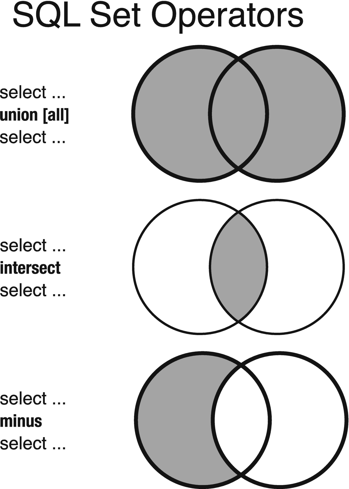

图 7-1：SQL 集合操作符的维恩图

### UNION 和 UNION ALL

最常见的集合操作符是 `UNION` 和 `UNION ALL`。当我们想要合并数据集时，即使这些集合之间没有关系，也会使用这些集合操作符。`UNION` 创建一个不包含重复项的结果集，而 `UNION ALL` 则允许包含重复项。去除重复项可能对性能产生巨大影响，因此我们默认应使用 `UNION ALL`。

`UNION ALL` 最常见的用途是生成数据。在 Oracle 中，我们必须始终从 *某个对象* 中进行选择，因此有一个名为 `DUAL` 的特殊伪表。`DUAL`^(¹⁶) 表只有一行，因此如果我们想创建多行，就必须使用 `UNION ALL` 组合语句，如下所示：

```
select '1' a from dual union all
select '2' a from dual union all
select '3' a from dual union all
...
```

### INTERSECT 和 MINUS

`INTERSECT` 返回两个查询中所有值都完全相同的行。`MINUS` 返回存在于第一个查询但不存在于第二个查询中的行。`INTERSECT` 和 `MINUS` 对于比较数据很有帮助。例如，以之前的 fizz buzz 为例，比较 `CASE` 和 `DECODE` 技术。像这样的查询可以帮助我们证明两个版本返回的数据完全相同：

```
--比较 CASE 和 DECODE 的 fizz buzz 结果。
select
rownum line_number,
case
when mod(rownum, 15) = 0 then 'fizz buzz'
when mod(rownum,  3) = 0 then 'fizz'
when mod(rownum,  5) = 0 then 'buzz'
else to_char(rownum)
end case_result
from dual connect by level <= 100
minus
select
rownum line_number,
decode(mod(rownum, 15), 0, 'fizz buzz',
decode(mod(rownum, 3), 0, 'fizz',
decode(mod(rownum, 5), 0, 'buzz', rownum)
)
) decode_result
from dual connect by level <= 100;
```

由于前面示例中的两个子查询是相等的，因此完整查询不返回任何行。如果我们将 `MINUS` 替换为 `INTERSECT`，我们可以通过计数返回的 100 行来证明子查询是相同的。

### 集合操作符的复杂性

集合操作符的比较并不总是那么简单。在上面的例子中，我们不能简单地说，“minus 查询返回 0 行；因此，集合是相等的”或者“intersect 返回 100 行；因此，集合是相等的。”

如果前面例子中的第一个子查询使用 `LEVEL <= 99` 而不是 `LEVEL <= 100` 会怎样？完整查询仍然会返回 0 行，但这两个集合并不完全相等。或者如果第一个子查询使用 `LEVEL <= 101` 而我们使用 `INTERSECT` 会怎样？完整查询将返回 100 行，尽管这两个集合并不相等。在使用 `MINUS` 或 `INTERSECT` 进行比较之前，我们需要仔细计算每个子查询的行数，同时还要注意重复项。

类似于 `DECODE` 的规则，集合操作符将两个 null 视为相同的值。集合操作符是 Oracle 打破其自身规则的另一个地方。但至少这次打破的规则是合理的。在实践中，比较集合时，我们总是希望 null 能够匹配。例如，以下查询只返回一行，这正是我们想要的结果：

```
select null from dual
union
select null from dual;
```

集合操作符无法在不寻常的数据类型上工作，例如 `CLOB`、`LONG`、`XMLType`、用户定义类型等。这些类型会产生诸如“ORA-00932: inconsistent datatypes: expected - got CLOB.”之类的错误消息。大对象理论上可能包含千兆字节的数据，这些数据无法轻松比较或排序。对大型数据类型的限制同样适用于连接和排序。

Oracle 21c 引入了新的集合操作符特性。`INTERSECT` 和 `MINUS` 现在支持 `ALL` 选项，因此您可以执行这些操作而不获得唯一结果。为了匹配 SQL 标准，添加了关键字 `EXCEPT`，但其工作方式与 `MINUS` 完全相同。


## 高级分组

Oracle SQL 提供了许多选项来帮助我们对数据进行分组并聚合结果。本书假定您已熟悉基本的分组概念，因此让我们从一个简单示例开始，然后逐步扩展。让我们按发射工具系列和发射工具名称统计轨道发射和深空发射的次数：

```
-- 统计每个系列和名称的发射次数。
select lv_family_code, lv_name, count(*)
from launch
join launch_vehicle
on launch.lv_id = launch_vehicle.lv_id
where launch.launch_category in ('orbital', 'deep space')
group by lv_family_code, lv_name
order by 1,2,3;
LV_FAMILY_CODE  LV_NAME    COUNT(*)
--------------  ---------  --------
ASLV            ASLV              4
ASLV            SLV-3             4
Angara          Angara A5         1
...
```

结果已排序，首先是增强型卫星运载火箭（`ASLV`，一种来自 1980 年代的印度火箭）和 `Angara`（一种新型俄罗斯火箭）。这种简单类型的分组对于大多数查询来说已经足够。有时我们可能需要使用 `HAVING` 子句来限制结果。例如，如果我们只想查看最受欢迎火箭的发射次数，可以在 `WHERE` 和 `ORDER BY` 子句之间添加这行代码：`HAVING COUNT(*) >= 10`。请注意，`HAVING` 条件不能引用 `SELECT` 子句中的别名，因此我们可能需要复制我们的逻辑。

### ROLLUP, GROUPING SETS, CUBE

更复杂的报告需要多级分组。让我们扩展前面的示例。除了按系列和名称统计发射次数外，我们还想仅按系列统计次数，以及获得一个总计。`ROLLUP` 语法让我们可以在同一个查询中执行多次分组。`ROLLUP` 从最详细的级别（列表中最右边的列）开始，并不断为左侧的每一列添加小计：

```
-- 按系列和名称、仅按系列以及总计统计发射次数。
select
lv_family_code,
lv_name,
count(*),
grouping(lv_family_code) is_family_grp,
grouping(lv_name) is_name_grp
from launch
join launch_vehicle
on launch.lv_id = launch_vehicle.lv_id
where launch_category in ('orbital', 'deep space')
group by rollup(lv_family_code, lv_name)
order by 1,2,3;
LV_FAMILY_CODE  LV_NAME  COUNT(*)  IS_FAMILY_GRP  IS_NAME_GRP
--------------  -------  --------  -------------  -----------
ASLV            ASLV            4              0            0
ASLV            SLV-3           4              0            0
ASLV                            8              0            1
Angara          Angara A5       1              0            0
...
                              5667             1            1
```

前面的结果显示了多级分组，包括底部的总计。空值指示了每行中哪些列被聚合。例如，第三行的 `LV_NAME` 为空，因为该行显示了整个 `ASLV` 系列所有值的总计。

要分辨哪些行是小计并不总是容易的。Oracle 提供了多种方法来区分行的分组级别。可以使用函数 `GROUP_ID`、`GROUPING` 或 `GROUPING_ID` 精确确定每行的组级别。`GROUPING` 是最容易使用的——该函数返回 `1` 或 `0`，以指示该行是否是特定列集的组。该函数在前面的结果中用于生成 `IS_FAMILY_GRP` 和 `IS_NAME_GRP` 列。可用于告诉我们分组级别的列，可用于过滤掉不需要的行或更改显示以强调总计。`GROUP_ID` 和 `GROUPING_ID` 功能更强大，但也更难使用。这两个函数返回一个编码数字来区分行类型。

除了 `ROLLUP`，Oracle 还提供 `CUBE` 和 `GROUPING SETS` 来定义更多类型的分组。`CUBE` 对所有列组合进行分组，而 `GROUPING SETS` 让我们指定多个集合进行分组。这些分组函数可能很快变得复杂，因此我不打算再展示更多庞大的示例。如果我们发现自己正在创建多个汇总查询并使用 `UNION ALL` 将它们连接起来，我们应该寻找一个高级分组函数来简化我们的代码。

数据分组后，每组内的值需要使用适当的聚合函数进行组合。大多数聚合可以通过 `MIN`、`MAX`、`AVG`、`SUM` 和 `COUNT` 的组合来满足。对于不同类型的操作，还有更多聚合函数可用。并且所有聚合函数都可以使用表达式，例如 `CASE` 表达式，使其功能更加强大。

聚合查询返回的每列都必须在 `GROUP BY` 子句中，或者具有聚合函数，或者是一个字面量。这条规则有时会导致查询中出现逻辑上冗余的分组。例如，假设我们想将发射工具分类 `LAUNCH_VEHICLE.LV_CLASS` 添加到前面的查询中。该列对于每个组将始终返回相同的值，但 Oracle 并不知道这一点。我们需要将该列添加到 `GROUP BY` 子句中，或者在列前添加一个无意义的聚合函数，如 `MAX`。从 Oracle 21c 开始，如果我们想避免额外分组的开销并使代码更清晰，我们可以使用表达式 `ANY_VALUE(LV_CLASS)`。但我们必须充分了解我们的数据，否则该表达式可能会返回意外的值。

### LISTAGG

`LISTAGG` 用于聚合字符串，这个函数过去几十年来在 Oracle 中一直令人遗憾地缺席。过去，每个 Oracle 开发人员都必须为自己创建自定义的字符串聚合解决方案。有很多旧代码和旧论坛帖子讨论了聚合字符串的不同策略：`CONNECT BY`、`MODEL`、Oracle 数据插件、`COLLECT`、未公开的函数如 `WM_CONCAT` 等等。所有这些代码都不再需要了。如果我们需要生成一个逗号分隔的字符串列表，我们应该始终使用 `LISTAGG`。

例如，此查询显示 `Ariane` 火箭系列中所有火箭的名称，并按字母顺序列出名称：

```
select
lv_family_code,
listagg(lv_name, ',') within group (order by lv_name) lv_names
from launch_vehicle
where lower(lv_family_code) like 'ariane%'
group by lv_family_code
order by lv_family_code;
LV_FAMILY_CODE  LV_NAMES
--------------  --------
Ariane          Ariane 1,Ariane 2,Ariane 3,Ariane 40,...
Ariane5         Ariane 5ECA,Ariane 5ES,Ariane 5ES/ATV,...
```

创建字符串列表是一项常见任务，并且可能有许多棘手的要求。如果字符串可能超过 4000 字节的限制，我们可能需要添加 `ON OVERFLOW TRUNCATE` 选项。（如果我们确实需要聚合超过 4000 字节，可以在网上查找使用 `XMLAGG` 或 `ODCI` 的高级解决方案。）如果我们想返回唯一值并且使用的是 19c 或更高版本，我们可以添加 `DISTINCT` 关键字。但如果我们有更复杂的要求或被困在旧版本的数据库上，我们总是可以使用多个内联视图在聚合之前预处理数据。


### 高级聚合函数

`COLLECT` 函数在需要聚合“任何内容”时非常有用。它与 `CAST` 函数协同工作，将一组值转换为单个嵌套表。然后，该嵌套表可以传递给自定义的 PL/SQL 函数进行进一步处理。`COLLECT` 为我们提供了对聚合的完全控制权。`COLLECT` 和自定义 PL/SQL 函数将在第 [21] 章中简要讨论。

聚合函数也有 `FIRST` 和 `LAST` 模式。当我们想找到最小值或最大值，但希望基于另一列来定义这个最小值或最大值时，这些模式非常有用。例如，让我们比较发射远地点——即距离地球的最远距离。对于每个运载火箭家族，我们想找到第一次发射的远地点。我们将 `APOGEE` 列传递给 `MIN` 函数，但我们希望基于 `LAUNCH_DATE` 来计算最小值：

```sql
--For each family find the first, min, and max apogee.
select
lv_family_code,
min(launch.apogee) keep
(dense_rank first order by launch_date) first_apogee,
min(launch.apogee) min_apogee,
max(launch.apogee) max_apogee
from launch
join launch_vehicle
on launch.lv_id = launch_vehicle.lv_id
where launch.apogee is not null
group by lv_family_code
order by lv_family_code;
LV_FAMILY_CODE  FIRST_APOGEE  MIN_APOGEE  MAX_APOGEE
--------------  ------------  ----------  ----------
10KS2500                  10          10          10
48N6                      40          40          40
A-350                     10           0         300
...
```

结果显示，第一次远地点通常与最小值相同。这个结果是有道理的——在测试运载火箭时，最好从小规模发射开始。但对于反弹道导弹 A-350，第一次发射比最小发射距离更远。这种差异是因为一些后续发射失败，远地点为 0。

## 分析函数

分析函数，也称为窗口函数，可以显著增强 SQL 语句的能力。到目前为止，我们看到的运算符、函数、表达式和条件都在两个层面上操作——针对每一行或针对组中的所有行。分析函数让我们能够结合这两个层面。使用分析函数，我们可以为每一行计算一个值，但该值是基于一个数据窗口的。像累计总和和移动平均值这样的计算最适合用分析函数来完成。分析函数的语法可能相当复杂，我们偶尔需要查阅手册中的语法图，但最常见的用法类似于 `ANALYTIC_FUNCTION(ARGUMENTS) OVER (PARTITION_CLAUSE ORDER_BY_CLAUSE WINDOWING_CLAUSE)`。

### 分析函数语法

有许多分析函数可供选择，包括几乎所有前面讨论过的聚合函数。`AVG`、`COUNT`、`LISTAGG`、`MIN`、`MAX` 和 `SUM` 既可以作为聚合函数，也可以作为分析函数使用。最流行的分析函数是 `DENSE_RANK`、`RANK`、`LAG`、`LEAD` 和 `ROW_NUMBER`。这些函数将在本节后面的示例中展示。

分析函数的参数可以是任何有效的表达式，并且可以涉及列、运算符等。`CASE` 表达式是聚合和分析函数的常见参数。例如，我们可以创建一个条件求和表达式，如 `SUM(CASE WHEN X = 'Y' THEN 1 ELSE 0 END)`。但是，某些分析函数，如 `ROW_NUMBER`，不接受任何参数，函数名后有一对空括号。

`PARTITION` 子句定义了分析函数的组或窗口。该子句是一个列或表达式的列表，类似于我们可能在 `GROUP BY` 子句中使用的列或表达式列表。如果我们想使用*所有*行（例如，为每行显示总计），只需将 `PARTITION` 子句留空即可。

`ORDER BY` 子句定义了行的处理顺序。例如，在累计总和中，值必须按特定顺序累加。该子句也是一个逗号分隔的列或表达式列表。与 `PARTITION` 子句类似，我们有时可以将 `ORDER BY` 子句留空，表示顺序无关紧要。

`WINDOWING` 子句不太常见。该子句允许我们指定一组更精确的行，也称为窗口。在 `PARTITION BY` 子句指定了一个组之后，`WINDOW` 子句可以进一步缩小范围。例如，一个常见的 `WINDOWING` 子句是 `ROWS BETWEEN UNBOUNDED PRECEDING AND CURRENT ROW`。这个子句比较复杂，这里不做充分解释。如果你在编写查询时希望指定当前行之前或之后的 X 行，请查阅手册中的完整语法。


### 分析函数示例

以下示例演示了 `RANK` 分析函数，以及 ORDER BY 子句和 PARTITION BY 子句的使用。让我们找出最受欢迎的运载火箭系列。但将小型探空火箭与巨大的轨道火箭进行比较并不公平，因此我们希望确定总体上最受欢迎的以及按发射类别细分最受欢迎的火箭系列。要找出总体最受欢迎的，就不要按任何字段进行分区。要找出按类别细分最受欢迎的，就按类别字段进行分区。在这两种情况下，我们都需要将结果按降序排列——发射次数最多的排在前面：

```sql
--最受欢迎的运载火箭系列。
select
launch_category category
,lv_family_code family
,count
,rank() over (order by count desc) rank_total
,rank() over (partition by launch_category
order by count desc) rank_per_category
from
(
--按类别和系列统计发射次数。
select launch_category, lv_family_code, count(*) count
from launch
join launch_vehicle
on launch.lv_id = launch_vehicle.lv_id
group by launch_category, lv_family_code
order by count(*) desc
)
order by count desc, launch_category desc;
CATEGORY          FAMILY      COUNT RANK_TOTAL RANK_PER_CAT
----------------- ----------- ----- ---------- ------------
suborbital rocket Rocketsonde 21369          1            1
suborbital rocket M-100        7749          2            2
suborbital rocket Nike         2948          3            3
suborbital rocket Loki         2495          4            4
orbital           R-7          1789          5            1
suborbital rocket Arcas        1716          6            5
...
```

请仔细关注前面结果中的数字。分析查询很复杂，即使是像计数和排名这样简单的事情也很复杂，因为数据似乎向多个方向移动。绝大多数受欢迎的运载火箭是“亚轨道火箭”类别中的探空火箭。探空火箭相对较小，通常携带少量科学实验的有效载荷。仔细查看总排名和按类别细分的排名。注意数字的排序大多是一致的，直到 `R-7` 火箭出现。`R-7` 火箭可能在总体排名中位列第五，但在轨道发射中它位居第一。发射小型实验与发射卫星和载人飞船是不同的，因此根据我们计算的方式，这款火箭可能配得上第一的位置。

`RANK`、`DENSE_RANK` 和 `ROW_NUMBER` 是相似的函数。我们在这里快要接近语法细节了，但这些函数非常常见，了解它们之间的确切区别是值得的。`RANK` 使用所谓的“奥林匹克排名法”；如果两行并列第一，下一行就是第三名。`DENSE_RANK` 则相反；如果两行并列第一，下一行是第二名。`ROW_NUMBER` 则不允许并列；如果我们没有在 ORDER BY 子句中完全指定排序规则，该函数将随机选择一个胜出者。当我们必须限制返回的行数，但又不太关心具体排名时，`ROW_NUMBER` 很有用。例如，一个屏幕可能最多只能显示 20 行，而不管是否有并列情况。

`LAG` 和 `LEAD` 函数对于查看前一个和后一个值非常有用。以下示例使用 `LAG` 来查找某一系列火箭深空发射之间的天数间隔。该查询还包括了按火箭系列统计的累计发射次数：

```sql
--使用分析函数按系列统计的深空发射。
select
to_char(launch_date, 'YYYY-MM-DD') launch_date,
flight_id2 spacecraft,
lv_family_code family,
trunc(launch_date) - lag(trunc(launch_date)) over
(partition by lv_family_code
order by launch_date) days_between,
count(*) over
(partition by lv_family_code
order by launch_date) running_total
from launch
join launch_vehicle
on launch.lv_id = launch_vehicle.lv_id
where launch_category = 'deep space'
order by launch.launch_date;
LAUNCH_DATE  SPACECRAFT  FAMILY   DAYS_BETWEEN  RUNNING_TOTAL
-----------  ----------  -------  ------------  -------------
1959-01-02   Luna-1      R-7                                1
1959-03-03   Pioneer 4   Jupiter                            1
1959-09-12   Luna-2      R-7               253              2
...
```

在前面的示例中，分析子句 `OVER (PARTITION BY LV_FAMILY_CODE ORDER BY LAUNCH_DATE)` 被指定了两次。在这个查询中，重复并不是大问题，但实际的查询可能具有更复杂且可能重复多次的分析子句。从 21c 版本开始，我们可以通过用更简单的 `OVER MY_WINDOW` 替换每个分析子句来避免重复，然后在 WHERE 子句之后像这样定义该窗口：`WINDOW MY_WINDOW AS (PARTITION BY LV_FAMILY_CODE ORDER BY LAUNCH_DATE)`。

分析函数可以解决许多高级问题，此处没有足够的空间一一列举。一个有趣的例子是查找连续或不连续的模式（有时称为“岛屿和间隙”），使用一种名为 `tabibitosan` 的技术。该技术的核心很简单——将每一行转换为一个数字，然后用该数字减去 `ROW_NUMBER` 来生成一个分组 ID。完整演示该技术需要几页篇幅。如果您感兴趣，代码库中有一个示例，展示了按发射系列统计的连续发射范围。

本节仅触及了分析函数的部分用途。一如既往，如果您需要了解有关此主题的更多信息，我建议您查阅手册。当我们试图计算某些行依赖于其他行的内容时，我们应该使用分析函数。然而，即使是分析函数也不足以帮助我们处理递归关系——当一行依赖于另一行，而另一行又依赖于另一行，等等。对于这些更困难的情况，请参阅本章后面关于递归查询的部分，或者参阅第 19 章中的“`MODEL`”部分。

## 正则表达式

正则表达式是强大的模式匹配文本字符串，可用于过滤、验证和更改文本数据。Oracle SQL 提供了多种将正则表达式应用于查询的方法。

所有程序员都应该熟悉正则表达式。对于不熟悉正则表达式的读者，本节开头提供了一个简要介绍。对于有正则表达式经验的读者，本节最后提供了关于过度使用正则表达式的重要警告。

### 正则表达式语法

Oracle SQL 通过条件 `REGEXP_LIKE` 以及函数 `REGEXP_COUNT`、`REGEXP_INSTR`、`REGEXP_REPLACE` 和 `REGEXP_SUBSTR` 支持正则表达式。这些特性与不带 `REGEXP_` 前缀的类似特性相似。例如，就像普通的 `REPLACE` 一样，`REGEXP_REPLACE` 允许我们指定要替换文本的位置和出现次数。两组特性之间的主要区别在于，`REGEXP_` 特性将模式搜索从“_”和“%”扩展到了更强大的正则表达式。

以下列表解释了最常见的正则表达式选项：

*   **.** – 匹配任何单个字符。
*   ***** – 匹配零次或多次出现。
*   **+** – 匹配一次或多次出现。
*   **?** – 匹配零次或一次出现。
*   **|** – “或”运算符。
*   **^** – 匹配字符串的开头。
*   **$** – 匹配字符串的结尾。
*   **[]** – 创建要匹配的值列表。可以使用连字符来表示一个范围，例如 "a-z" 或 "0-9"。可以使用脱字符（^）来表示“不匹配此内容”。
*   **()** – 创建一个匹配值的组。
*   **\** – 不将后面的字母解释为命令，例如，如果我们想匹配句点（.）而不是使用句点来表示“任何字符”。如果与数字一起使用，它将成为对组的引用。

Oracle 还包含许多 Perl 正则表达式扩展，用于匹配数字（`\d`）、非数字（`\D`）、单词字符（`\w`）、非单词字符（`\W`）、空白字符（`\s`）、非空白字符（`\S`）以及许多其他内容。


### 正则表达式示例

让我们尝试按名称和版本对运载火箭进行排序。但名称有些令人困惑——有时包含数字，有时包含罗马数字。为了正确排序名称，我们需要转换罗马数字。这个过程对于排序来说工作量很大，因此我们只介绍前几个步骤。首先，让我们看看流行的加拿大探空火箭“Black Brant”，并查找看起来像罗马数字的名称：

```sql
--包含罗马数字的运载火箭名称。
select lv_name
from launch_vehicle
where regexp_like(lv_name, '\W[IVX]+')
and lv_name like 'Black Brant%'
order by lv_name;
LV_NAME

Black Brant I
Black Brant II
Black Brant IIB
Black Brant III
...
```

上面查询中的关键要素是那个看似神秘的正则表达式 `'\W[IVX]+'`。该表达式用于查找所有运载火箭名称中包含一个非单词字符后跟一个或多个“I”、“V”或“X”的行。

下一步是将罗马数字转换为数字。为了简化处理，我们将取巧一点，直接硬编码几个罗马数字转换。下面查询的重要之处在于使用 `REGEXP_REPLACE` 的方式，它将名称分解成不同的部分。名称被分解后，我们可以修改罗马数字部分，然后重新组合各部分：

```sql
--转换罗马数字并将各部分重新组合成名称。
select
part_1||part_2||
--这种硬编码显然不是最佳做法。
case part_3
when 'I' then '01'
when 'II' then '02'
when 'III' then '03'
end||
part_4 new_lv_name
from
(
--包含罗马数字的运载火箭，已分解为各部分。
select
regexp_replace(lv_name, '(.*)(\W)([IVX]+)(.*)', '\1') part_1,
regexp_replace(lv_name, '(.*)(\W)([IVX]+)(.*)', '\2') part_2,
regexp_replace(lv_name, '(.*)(\W)([IVX]+)(.*)', '\3') part_3,
regexp_replace(lv_name, '(.*)(\W)([IVX]+)(.*)', '\4') part_4
from launch_vehicle
where regexp_like(lv_name, '\W[IVX]+')
and lv_name like 'Black Brant%'
order by lv_name
);
NEW_LV_NAME

Black Brant 01
Black Brant 02
Black Brant 02B
Black Brant 03
...
```

上面 `WHERE` 子句中的正则表达式仍然很简单，只是查找模式。但 `REGEXP_REPLACE` 中的正则表达式必须找到四种不同的模式——开头的任意内容、一个非单词字符、罗马数字以及结尾的任意内容。括号创建了四个分组，反斜杠加数字引用这些分组。每个 `REGEXP_REPLACE` 用四个部分中的一个来替换整个字符串。

正则表达式可以解决许多问题，并且有几种模式值得学习。最流行的例子是如何使用正则表达式将分隔符字符串拆分成不同的部分。为了按分隔符拆分，我们首先使用 `CONNECT BY` 行技巧来生成额外的行。对于每一行，我们匹配一个包含除分隔符外任意字符的字符组，使用像 `'[^,]'` 这样的表达式。最后，在 `REGEXP_SUBSTR` 函数中，我们选择匹配的第 `LEVEL` 次出现。下面的查询虽然小，但用了很多特性：

```sql
--将逗号分隔的字符串拆分成其元素。
select regexp_substr(csv, '[^,]', 1, level) element
from
(
select 'a,b,c' csv
from dual
)
connect by level <= regexp_count(csv, ',') + 1;
ELEMENT

a
b
c
```

### 正则表达式的局限性

正则表达式晦涩的语法可能让我们感觉自己像编码超级英雄，但它非常容易搞得一团糟。使用正则表达式时，我们必须格外注意代码的可读性。我们必须抵制创建一个“超级表达式”的冲动，而应该将代码分解成小块。

本章中的示例是*不该*怎么做的好例子。这些示例演示了正则表达式的概念，但我们离实际查找和替换罗马数字的目标还很远。如果我们查看所有不同的火箭名称，会注意到我们的简单规则有大量例外情况。转换这些罗马数字是那种“90-10”的任务；我们轻松构建了解决 90%问题的方案，但解决剩下的 10%将耗费我们 90%的时间。

这些“90-10”任务在解析文本时经常发生，我们必须了解自己的局限性。即使对于看似简单的字符串拆分任务，也有很多情况会破坏我们简单的正则表达式——例如空列表。拆分字符串的真正解决方案是首先不要在数据库中存储带分隔符的字符串。

即使是看似简单的查找数字任务，也可能出乎意料地困难。重现第 4 章讨论的数值字面量语法图，需要一个极其复杂的正则表达式。互联网上充满了考虑不周全的答案，比如忘了开头的负号。至于验证电子邮件地址——官方的验证正则表达式超过 6000 个字符长。

最后，有许多任务用一个正则表达式根本不可能解决。图 7-2 展示了形式语言的层级结构。尽管正则表达式是强大的工具，但它们定义的正则语言处于该层级的底部。许多语言，如 HTML、XML 和几乎所有编程语言，都是上下文无关或更高级别的语言。仅靠正则表达式无法完全解析 HTML、XML 和编程语言。正则表达式可以轻松地在复杂语言中找到许多模式，但找到简单模式可能会给我们一种错误的信心。我们必须小心，不要尝试将正则表达式用于需要完整语言解析器的任务。我们不想把时间投资在一个 99%准确但永远无法达到 100%准确的正则表达式上。

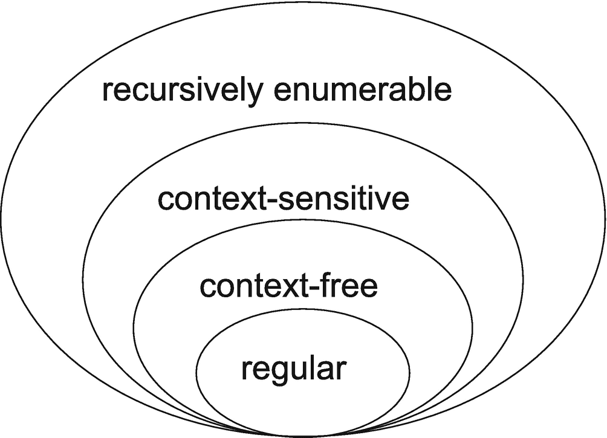

该图像是一个包含正则、上下文无关、上下文敏感和递归可枚举语言的循环层级结构。

图 7-2

“乔姆斯基层级中所包含语言集合的图形表示”由 J. Finkelstein 创作，采用 CC BY-SA 3.0 许可。

## 行限制

有时我们只想从 SQL 语句中检索结果的一个子集。当应用程序一次只显示 N 行时，我们的查询也应该只返回 N 行。Oracle 的行限制子句允许我们精确指定要返回哪个行子集。尽管行限制子句是在 12c 中引入的，但仍有大量代码使用旧的 `ROWNUM` 技术，因此我们需要理解它。有时我们还需要使用分析函数 `ROW_NUMBER` 来限制行数。


### 行限制子句

行限制子句让我们能够轻松指定查询返回的结果数量。我们可以选择返回指定的行数，或者指定比例的行数。这个数量可以是精确的，也可以同时返回与第 N 名数值相同的行。我们还可以指定偏移量，这有助于实现分页。然而，行限制子句不能立即从结果集的中间检索行，并且可能导致性能问题。为了实现更快的分页，或许更好的方法是保持一个游标打开并遍历结果。

行限制子句返回的行将遵循 `order by` 子句（如果存在）的排序。如果没有 `order by` 子句，该语法将返回它找到的前 N 行。（这些行既不是确定性的，也不是真正随机的。记住——除非我们指定 `order by` 子句，否则永远不能对结果的顺序做出任何假设。）

例如，让我们根据发射日期查找前三颗卫星：

```
--前三颗卫星。
select
to_char(launch_date, 'YYYY-MM-DD') launch_date,
official_name
from satellite
join launch
on satellite.launch_id = launch.launch_id
order by launch_date, official_name
fetch first 3 rows only;
LAUNCH_DATE  OFFICIAL_NAME
-----------  -------------
1957-10-04   1-y ISZ
1957-10-04   8K71A M1-10
1957-11-03   2-y ISZ
```

官方名称很神秘，但你知道那些卫星。如果你年龄够大，你可能真的在天空中见过那些卫星。前两行是**人造卫星一号**及其火箭，第三行是**人造卫星二号**。

### ROWNUM

在 11g 及更低版本中，行限制的语法有点棘手。即使我们只使用 12c 及更高版本，我们仍然应该熟悉旧的技术，因为我们不可避免地会继承旧代码。

获取前 N 行的传统方法是使用 `ROWNUM` 伪列和一个内联视图。`ROWNUM` 返回一个数字，代表该行从查询中返回的顺序，从 1 开始。使用 `ROWNUM` 时，每个人都会犯一个常见错误；`ROWNUM` 伪列不能在包含 `ORDER BY` 的同一个子查询中进行过滤。`ROWNUM` 是在 `order by` 子句**之前**生成的。如果我们在与 `order by` 子句相同的子查询中按 `ROWNUM` 进行过滤，查询将先返回一些随机行，然后对这些随机行进行排序。以下查询是使用 `ROWNUM` 进行过滤的唯一正确方式：

```
--前三颗卫星。
select launch_date, official_name, rownum
from
(
select
to_char(launch_date, 'YYYY-MM-DD') launch_date,
official_name
from satellite
join launch
on satellite.launch_id = launch.launch_id
order by launch_date, official_name
)
where rownum <= 3;
LAUNCH_DATE  OFFICIAL_NAME  ROWNUM
-----------  -------------  ------
1957-10-04   1-y ISZ             1
1957-10-04   8K71A M1-10         2
1957-11-03   2-y ISZ             3
```

### 分析函数行限制

更复杂的行限制需要使用 `ROW_NUMBER` 分析函数。`ROW_NUMBER` 中的 `partition by` 子句允许我们获取多个分组的前 N 行。以下示例返回每年的前两颗卫星：

```
--每年的前两颗卫星。
select launch_date, official_name
from
(
select
to_char(launch_date, 'YYYY-MM-DD') launch_date,
official_name,
row_number() over
(
partition by trunc(launch_date, 'year')
order by launch_date
) first_n_per_year
from satellite
join launch
on satellite.launch_id = launch.launch_id
order by launch_date, official_name
)
where first_n_per_year <= 2
order by launch_date, official_name;
LAUNCH_DATE  OFFICIAL_NAME
-----------  -------------
1957-10-04   1-y ISZ
1957-10-04   8K71A M1-10
1958-02-01   Explorer 1
1958-03-17   Vanguard I
...
```

`FETCH`、`ROWNUM` 和分析函数之间的性能差异通常不显著，因此我们应该使用感觉更自然的方法。如果我们确实遇到性能问题，请记住 `FETCH` 在内部是作为分析函数实现的，因此我们不必费心在两者之间重写代码。虽然 `ROWNUM` 技术较旧，但在这种情况下旧方法可能更好，因为 Oracle 有一些优化只适用于 `ROWNUM`。

## 透视与逆透视

透视将数据从行移动到列，而逆透视则将列移回行。当我们想要为报告汇总数据，或者想要将汇总的报告数据加载到表中时，这些功能非常有用。有一种使用简单聚合和 `UNION ALL` 技巧来进行透视和逆透视数据的方法。Oracle 还提供了 `PIVOT` 和 `UNPIVOT` 语法，可以帮助简化代码。我们应该了解新旧两种技术，因为它们仍然都有用。

透视将多行数据合并为一行，但包含更多列。我们的关系表通常很“瘦”，只有几列来列出类型、值和状态。但我们的报告通常很“宽”，每行一个类型，并有一列显示每个状态的值。图 7-3 是透视和逆透视如何改变结果形态的直观表示。

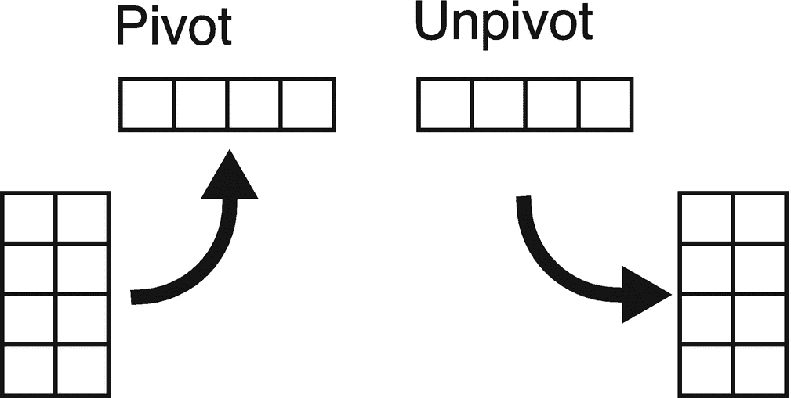

图 7-3：透视与逆透视的直观表示

### 旧式透视语法

让我们从一个简单的分组示例开始——每年的发射状态计数。查询返回的是“瘦”行，每行对应一个不同的状态：

```
--每年的发射成功与失败情况。
select
to_char(launch_date, 'YYYY') launch_year,
launch_status,
count(*) status_count
from launch
where launch_category in ('orbital', 'deep space')
group by to_char(launch_date, 'YYYY'), launch_status
order by launch_year, launch_status desc;
LAUNCH_YEAR  LAUNCH_STATUS  STATUS_COUNT
-----------  -------------  ------------
1957               success             2
1957               failure             1
1958               success             8
...
```

前面的结果格式很适合进一步处理。但如果我们想要展示结果，可以在一行中呈现更多信息。以下查询使用传统的聚合技术对结果进行透视：

```
--透视后的每年发射成功与失败情况。
select
to_char(launch_date, 'YYYY') launch_year,
sum(case when launch_status = 'success' then 1 else 0 end) success,
sum(case when launch_status = 'failure' then 1 else 0 end) failure
from launch
where launch_category in ('orbital', 'deep space')
group by to_char(launch_date, 'YYYY')
order by launch_year;
LAUNCH_YEAR  SUCCESS  FAILURE
-----------  -------  -------
1957               2        1
1958               8       20
1959              13       10
...
```

前面的结果每行显示了更多信息，因为状态值被透视到了多个列中。透视后的列使得跨年份比较数据变得容易得多。如果我们查看所有数据，会发现 1958 年是迄今为止发射最糟糕的一年，无论是失败次数还是失败率都是如此。大量的失败不仅仅是因为火箭技术很新。当时存在一种走捷径并尽快发射的压力。这种压力是由冷战和**人造卫星危机**所推动的。


### 新的 PIVOT 语法

以下查询返回与前一个查询相同的结果，但使用了新的 `PIVOT` 语法。`pivot` 子句指定了聚合函数、要转换的列列表以及要包含的值：

```sql
-- 按年份分列显示发射成功与失败次数。
select *
from
(
-- 轨道与深空发射。
select to_char(launch_date, 'YYYY') launch_year, launch_status
from launch
where launch_category in ('orbital', 'deep space')
) launches
pivot
(
count(*)
for launch_status in
(
'success' as success,
'failure' as failure
)
)
order by launch_year;
```

对于这个小例子，新语法比旧式语法更复杂、更冗长。我一直觉得 `PIVOT` 语法有点奇怪，每次使用时都得查阅一下。只有当我们有大量列需要转换时，这种语法才显示出优势。即便如此，仍然需要大量手动输入——我们仍需列出每个状态、创建别名，并可能需要处理空值。在大多数情况下，我们不妨坚持使用旧的 `SUM(CASE` 语法。

### UNPIVOT

逆透视将多列转换为多行。作为我们可能需要逆透视的一个例子，让我们看看 `LAUNCH` 表中的 `FLIGHT_ID1` 和 `FLIGHT_ID2` 列。任何时候，如果我们有多个名称相同但末尾带数字的列，就应该引起警惕。这些列是否应该存储在单独的表中，以允许无限数量的飞行标识符？如果一次火箭发射有第三个飞行标识符怎么办？与其添加新列，创建一个单独的表来存储飞行标识符可能更有意义。（在这个例子中，飞行标识符没有增加太多价值，不值得这么麻烦，但为了示例，我们假装需要这样做。）首先，让我们看看初始的、宽表数据：

```sql
-- 每次发射对应多个 FLIGHT_ID 列。
select launch_id, flight_id1, flight_id2
from launch
where launch_category in ('orbital', 'deep space')
order by launch_id;
```
```
LAUNCH_ID  FLIGHT_ID1  FLIGHT_ID2
---------  ----------  ----------
4305       M1-PS       PS-1
4306       M1-2PS      PS-2
4476       TV-3        Vanguard TV3
...
```

将列转换为瘦长行（skinny rows）的旧方法是为每个列使用一个 `UNION ALL`，如下所示：

```sql
-- 使用 UNION ALL 逆透视数据。
select launch_id, 1 flight_id, flight_id1 flight_name
from launch
where launch_category in ('orbital', 'deep space')
and flight_id1 is not null
union all
select launch_id, 2 flight_id, flight_id2 flight_name
from launch
where launch_category in ('orbital', 'deep space')
and flight_id2 is not null
order by launch_id, flight_id;
```
```
LAUNCH_ID  FLIGHT_ID  FLIGHT_NAME
---------  ---------  -----------
4305          1  M1-PS
4305          2  PS-1
4306          1  M1-2PS
4306          2  PS-2
4476          1  TV-3
4476          2  Vanguard TV3
...
```

以下查询使用 `UNPIVOT` 语法返回相同的结果：

```sql
-- 使用 UNPIVOT 语法逆透视数据。
select *
from
(
select launch_id, flight_id1, flight_id2
from launch
where launch_category in ('orbital', 'deep space')
) launches
unpivot
(
flight_name for
flight_id in (flight_id1 as 1, flight_id2 as 2)
)
order by launch_id;
```

前面的 `UNPIVOT` 查询比原始版本小得多，甚至运行速度也更快，而 `PIVOT` 语法相比原始版本几乎没有任何改进，通常也不更快。`PIVOT` 语法和性能上的不足令人遗憾，因为在实践中，我们转换数据的可能性远大于逆透视数据。

最常见的 Oracle SQL 问题之一是：我们如何动态地透视数据，而不必指定所有要显示的列？简单的答案是，没有动态透视选项。更详尽的答案是 Oracle 确实允许动态透视，但前提是要求输出为 XML 格式，而这又更难处理。一个更彻底的答案是，我们*可以*动态透视，如果我们创建高级动态 SQL 解决方案，例如第 20 章讨论的 Method4。

但关于如何动态透视这个问题的真实、却令人不满意的答案是，我们并不想动态透视我们的查询。过度通用和动态的解决方案是代价巨大而收益甚微的麻烦事。在某个时刻，我们必须了解我们的列，否则就无法对数据进行任何有意义的处理。

### 闪回

闪回查询让我们能够查询数据过去的样子。当我们遇到逻辑表损坏时，闪回可以实实在在地挽救工作。拥有一个数据的“时间机器”可以帮助我们快速回退错误的更改。想象一下，如果有人在 9 分钟前删除了 `LAUNCH` 表中的行。我们可以通过时间回溯，使用以下查询找到 10 分钟前的表状态：

```sql
-- 10 分钟前的 LAUNCH 表。
select *
from launch as of timestamp systimestamp - interval '10' minute;
```

每当有人做了错误的更改时，尝试用闪回查询找到这个更改。但不要等待——时间在流逝。闪回查询使用 Oracle 的撤销数据，而这些数据会随着时间老化消失。也许有神奇的方法可以解决我们的生产数据问题，但这个方法将会过期。很难预测撤销数据可用的时间有多长，因为保留期取决于实例参数和系统活动。

闪回有一个 `VERSIONS BETWEEN` 语法和多个伪列，可以帮助我们准确找出进行了什么更改以及何时进行的。我们可以将闪回与 `MINUS` 等集合操作符结合使用来查找缺失的数据。

除了查询数据，闪回还可以用于恢复表和整个数据库。这些功能共享“闪回”之名，但使用不同的存储机制——回收站和闪回日志。如果你需要频繁进行时间旅行，请咨询你的 DBA。

### 抽样

查询一小部分数据样本有助于测试，尤其是在处理大表时。`sample` 子句让我们指定要检索的表数据的估计百分比。默认情况下，抽样是随机的，大多数时候会返回略有不同的结果。如果我们想要一个确定性的样本，可以指定一个 `seed` 数。以下查询返回 `LAUNCH` 表中大约 1% 的行：

```sql
-- 每次返回不同行数的抽样查询。
select count(*) from launch sample (1);
-- 每次返回相同行数的抽样查询。
select count(*) from launch sample (1) seed (1234);
```

`sample` 子句返回的结果并非统计上随机的。而且如果样本量足够小，查询有可能返回零行。如果我们需要精确的随机性，需要避免使用 `SAMPLE`，改用 `ORDER BY DBMS_RANDOM.VALUE`。不幸的是，`DBMS_RANDOM` 方法慢得离谱。

### 分区扩展子句

分区扩展子句让我们可以从特定的分区或子分区集合中选择数据。（分区在第 9 章有简要描述。）可以通过分区名称或分区键值来引用分区。例如，以下查询从一个分区表中读取数据。（由于我们不一定都有分区功能的许可证，该示例使用现有的系统表，而不是创建我们自己的分区表。）

```sql
-- 引用分区名称。
select *
from sys.wrh$_sqlstat partition (wrh$_sqlstat_mxdb_mxsn);
-- 引用分区键值。
select *
from sys.wrh$_sqlstat partition for (1,1);
```

通常，分区扩展子句并非必需，因为分区对最终用户应该是不可见的。我们应该能够查询一个表，请求一个值，并让 Oracle 自动确定分区。实际上，Oracle 的分区修剪并不总能在编译时确定分区。例如，如果我们执行锁定分区的操作，如直接路径写入，Oracle 可能不得不锁定整个表，除非我们使用分区扩展子句。


## 公共表表达式

公共表表达式使我们能够用单个子查询、函数或过程来替代重复的 SQL 逻辑。公共表表达式在 SQL 语句顶部定义，并可在下方被多次引用。在 Oracle 中，此功能也被称为子查询因式分解和语法上略显拗口的“`WITH`子句”。公共表表达式可以帮助我们简化查询、提高性能、解决棘手的递归问题，并遵循编程的基本规则之一：不要重复自己。但我们也需要注意不要过度使用此功能。

### 示例

让我们结合几个高级功能来回答一个常见问题：什么发生了变化？通过结合闪回查询（用于获取旧数据）、集合运算符（用于查找差异并合并结果）和公共表表达式（以避免重复自己），我们可以找到对表所做的精确更改。

在构建大型查询之前，我们先运行一些代码来设置测试。运行以下语句对`ENGINE_PROPELLANT`表进行两次伪随机更改。此代码删除一行并将一个值从“燃料”切换为“氧化剂”，或反之亦然：

```
--从一张不太重要的表中删除和更新一行。
delete from engine_propellant where rownum <= 1;
update engine_propellant
set oxidizer_or_fuel =
case when oxidizer_or_fuel = 'fuel' then 'oxidizer' else 'fuel' end
where rownum <= 1;
```

在接下来的 5 分钟内，以下查询将显示由前述语句所做的所有更改。这个查询作为示例有点复杂，但这种通过集合运算符和公共表表达式查找差异的模式值得学习。我每个月至少会构建一次类似于下面的查询：

```
--过去 5 分钟内对 ENGINE_PROPELLANT 所做的更改。
with old as
(
--5 分钟前的表。
select *
from engine_propellant
as of timestamp systimestamp - interval '5' minute
),
new as
(
--当前的表。
select *
from engine_propellant
)
--将两个行差异合并在一起。
select *
from
(
--旧表中有而新表中没有的行。
select 'old' old_or_new, old.* from old
minus
select 'old' old_or_new, new.* from new
)
union all
(
--新表中有而旧表中没有的行。
select 'new' old_or_new, new.* from new
minus
select 'new' old_or_new, old.* from old
)
order by 2, 3, 1 desc;
OLD_OR_NEW  ENGINE_ID  PROPELLANT_ID  OXIDIZER_OR_FUEL
----------  ---------  -------------  ----------------
old                 2            100  fuel
new                 2            100  oxidizer
old                62              1  fuel
--别忘了回滚更改：
rollback;
```

结果显示了被更改的行——它同时有“旧”和“新”的值，并且`OXIDIZER_OR_FUEL`列发生了变化。结果显示被删除的行——最后一行列在“旧”中但不在“新”中。公共表表达式就像我们 SQL 语句的宏，它们帮助我们避免重复“5 分钟前”的逻辑。我们本可以使用视图，但那样的话，我们就必须仅为一个查询创建和维护单独的对象。

## PL/SQL 公共表表达式

`WITH`子句中的函数和过程允许我们向查询中添加命令式代码。此功能可以帮助最小化模式中的对象数量，并且如果我们的数据库用户没有创建对象的权限，它也会很有帮助。

让我们使用一个 PL/SQL 声明来解决另一个常见的业务问题：查找文本字段中的数值。如第 4 章所讨论的，确定一个字符串是否是数字比大多数程序员意识到的要复杂得多。使用正则表达式是个坏主意，因为我们会忘记检查负号、小数等情况。以下代码在`FLIGHT_ID1`中查找数值：

```
--启动时带有数字 FLIGHT_ID1。
with function is_number(p_string in varchar2) return varchar2 is
v_number number;
begin
v_number := to_number(p_string);
return 'Y';
exception
when value_error then return 'N';
end;
select
to_char(launch_date, 'YYYY-MM-DD') launch_date,
flight_id1
from launch
where flight_id1 is not null
and is_number(flight_id1) = 'Y'
order by 1,2;
/
LAUNCH_DATE  FLIGHT_ID1
-----------  ----------
1942-06-13   2
1942-08-16   3
1942-10-03   4
...
```

（实际上，编写前面的查询有更简单的方法，即使用许多内置函数中提供的类型安全转换模式：`TO_NUMBER(FLIGHT_ID1 DEFAULT NULL ON CONVERSION ERROR) IS NOT NULL`。在实际查询中，有用的 PL/SQL 声明会更复杂一些。）

PL/SQL 的`WITH`语法有点奇怪，许多 IDE 在解析它时都有问题。即使是 SQL*Plus 处理前面的语句也与常规的`SELECT`语句略有不同，这就是为什么前面代码末尾有一个斜杠。

### 性能与过度使用

公共表表达式在某些情况下有助于提高性能。如果公共表表达式被引用两次或更多次，Oracle 可能会通过将其结果存储在临时表中来物化结果。物化可以减少读取表的次数。Oracle 会自动决定是否值得将中间结果转换为临时表，但我们可以用提示`/*+MATERIALIZE*/`来强制决策。此外，PL/SQL 的`WITH`子句与 SQL 紧密集成，可以比常规函数和过程运行得更快。

但许多 SQL 开发人员过度使用公共表表达式。物化结果的性能优势只有在公共表表达式被多次调用时才会直接显现。（然而，物化结果会迫使 Oracle 以某种顺序执行操作，这可能会限制查询转换的方式。重写查询以使用公共表表达式可能会间接提高性能，但我们不应盲目重写查询并期望走运。）而且，虽然避免调用 PL/SQL 函数的开销是好事，但我们不希望重复自己，并将业务逻辑从包复制粘贴到单个 SQL 语句中。如果我们需要减少 PL/SQL 函数的开销，我们可以使用`PRAGMA UDF`来获得相同的性能改进。此外，如果我们过分担心 PL/SQL 函数的开销，这可能意味着我们没有充分利用 SQL。

如第 6 章所讨论的，公共表表达式的自上而下的数据流是一件坏事。只使用一次的公共表表达式增加了我们 SQL 语句的上下文，并使我们的语句更难以调试和理解。

公共表表达式是一个很棒的功能，如果使用得当，可以节省大量代码并提高性能。此外，公共表表达式可以引用自身。递归公共表表达式是一个强大的功能，将在下一节中描述。


## 递归查询

当数据以未知次数引用自身时，我们必须使用递归查询或层级查询。如果数据只单次引用自身，例如，如果我们想查找父记录，我们可以用自连接编写该查询。或者，如果我们的行只需要访问其前一行，我们可以用分析函数 `LAG` 来编写查询。但当我们要找父记录的父记录，或前一行的前一行，或者想生成类似树形结构的东西时，我们就需要 Oracle 的递归查询语法。

Oracle 提供了两种处理层级数据的方法：原始的 `CONNECT BY` 语法和较新的递归公用表表达式语法（也称为递归子查询因子化）。较新的语法通常是首选，但在这种情况下，较新的语法并不总是更好。两种语法各有优势。`CONNECT BY` 语法是原始语法，不那么冗长，对于处理传统的层级数据更为方便。递归公用表表达式语法基于一个标准，比 `CONNECT BY` 冗长，处理传统层级数据不那么方便，但功能更强大，更适合高级查询。每种语法似乎都更适合解决某些特定问题。如果一种风格（无论是语法还是性能上）给我们带来麻烦，我们应该尝试另一种风格。

### CONNECT BY 语法

在原始语法中，我们从一个集合开始，然后使用 `CONNECT BY` 条件来定义集合如何与自身连接。`CONNECT BY` 子句中的条件可以使用特殊的 `PRIOR` 运算符，这让我们能够引用集合中前一行的值。可选的 `START WITH` 条件让我们能够选择初始行。选择初始行很重要，因为它可以防止重复。如果我们从一个扁平表构建结果树，我们只希望从根节点开始构建树。如果我们既从根节点开始，又从其他层级开始构建树，最终会得到许多子树。

`CONNECT BY` 语法还提供了有用的伪列，如 `LEVEL`。`LEVEL` 是一个数字，告诉我们每一行处于树的哪个层级。`CONNECT_BY_ROOT` 返回根行的值。`SYS_CONNECT_BY_PATH` 遍历树并创建所有值的字符串聚合。`ORDER SIBLINGS BY` 子句保留了结果的树形结构。

例如，让我们看一下 `ORGANIZATION` 表。该表在数据集中经常使用；其中包含用于发射、卫星、火箭级、发动机等的组织。每个组织都有一个父组织，父组织又可以有自己的父组织，依此类推。如果我们想按组织统计发射次数或卫星数量，按顶级组织进行统计可能有所帮助。首先，我们需要使用以下查询生成组织层级结构：

```sql
--使用 CONNECT BY 的组织层级结构。
select
lpad('  ', 2*(level-1)) || org_code org_code,
parent_org_code parent,
org_name
from organization
connect by prior org_code = parent_org_code
start with parent_org_code is null
order siblings by organization.org_code;
ORG_CODE   PARENT  ORG_NAME
---------  ------  --------
...
USAF               United States Air Force
...
HAFB     USAF    Holloman Air Force Base
...
HADC   HAFB    Holloman Air Development Center
HAM  HADC    Holloman Aeromedical Lab, Holloman ...
...
```

前面的部分结果显示其中一棵树。毫不奇怪，美国空军 (USAF) 下有许多组织。结果被格式化为树形结构，使用了 `LPAD` 技巧，它根据 `LEVEL` 的值乘以空格数。查询从顶层的根组织开始——即那些 `PARENT_ORG_CODE IS NULL` 的组织。`ORDER BY` 子句中的 `SIBLINGS` 确保树形顺序得以保留。`CONNECT BY` 条件是查询中最困难的部分，需要仔细思考。想象一下，我们从 USAF 行开始，试图找到第二行。为了判断每一行是否在树中，我们需要比较当前的 `PARENT_ORG_CODE` 和 `PRIOR ORG_CODE`（前一行的 `ORG_CODE`）。

如果这些递归查询现在还不明白，请不要灰心。递归查询是出了名的复杂；可能需要尝试几次才能感觉自然。

### 递归公用表表达式

让我们用递归公用表表达式重现之前的结果。在这种语法中，我们在 `WITH` 子句中定义一个表，但这次我们还需要预先定义列名。在公用表表达式内部，有两个子查询。第一个子查询生成初始行作为启动。第二个子查询通过将表与公用表表达式本身连接来生成父行或子行。最后，查询公用表表达式以获取结果：

```sql
--来自递归 CTE 的组织层级结构。
with orgs(org_code, org_name, parent_org_code, n, hierarchy) as
(
--从父行开始：
select org_code, org_name, parent_org_code, 1, org_code
from organization
where parent_org_code is null
union all
--通过连接到父行来添加子行：
select
organization.org_code,
organization.org_name,
organization.parent_org_code,
n+1,
hierarchy || '-' || organization.org_code
from orgs parent_orgs
join organization
on parent_orgs.org_code = organization.parent_org_code
)
select
lpad('  ', 2*(n-1)) || org_code org_code,
parent_org_code parent,
org_name
from orgs
order by hierarchy;
```

前面的查询返回与 `CONNECT BY` 版本相同的结果，但使用了更多代码来完成相同的事情。没有方便的 `LEVEL` 或 `SIBLINGS` 语法，所以我们必须自己创建它们。为了重现 `LEVEL`，“n” 列从 1 开始，并在每次连接后加 1。为了按兄弟节点排序，我们需要创建一个表示整个树的字符串，然后按该字符串排序。“hierarchy” 列通过以组织代码开头并在每个层级附加新的组织代码来表示一棵树。

对于简单示例，`CONNECT BY` 语法是最佳选择。对于复杂示例，当我们需要对语句递归方式进行更细粒度的控制时，公用表表达式语法是最佳选择。

无论我们使用哪种语法，递归查询都可能变得极其复杂。理解递归查询需要在脑海中构建一个复杂的树模型。在创建递归查询时，我们必须注意保持内联视图尽可能小，并对所有内容进行详尽的文档说明。

## XML

Oracle 是一个融合数据库，支持的远不止关系数据。本书是关于 SQL 开发的，并侧重于关系数据，但有很多时候关系模型需要与以 XML 格式存储的半结构化数据相融合。有关于这个主题的完整手册，例如 *XML DB 开发人员指南*。本节仅介绍基础知识，但请记住，Oracle 旨在处理更为复杂的场景。


### XMLType

Oracle 支持创建、存储和处理可扩展标记语言（XML）文档。XML 是半结构化的，并非非结构化。我们绝不允许无效的 XML，因此我们不应直接将 XML 数据放入字符串字段。XML 数据应存储为 `XMLType` 类型，这将自动验证其结构。将文本转换为 `XMLType` 是非常简单的；只需像这样将文本传递给默认构造函数：

```sql
--将文本转换为 XML。
select xmltype('') from dual;
```

上述语句的输出取决于我们的集成开发环境（IDE）。并非所有程序都能理解 `XMLType`。程序可能会将结果显示为通用消息、文本字符串，或者在 XML 编辑器中显示。文本本身看起来可能不同。结果可能是 "`<a></a>`"、"`<a/>`" 或其他等效形式。就像关系数据具有无关紧要的显示属性（如行顺序）一样，XML 也具有无关紧要的显示属性（如标签样式和无意义的空白）。

将 `XMLType` 转换回文本则稍微复杂一些。当使用像 `XMLType` 这样的对象类型时，必须有别名、列名，以及函数调用的括号（即使没有参数）。在以下代码中，理想情况下我们只需要使用表达式 `XML_COLUMN.GETCLOBVAL`。但实际代码要更复杂一些：

```sql
--转换为 XMLType 再转换回 CLOB。
select table_reference.xml_column.getClobVal()
from
(
select xmltype('') xml_column
from dual
) table_reference;
``

正如我们绝不允许哪怕一个字节的关系数据损坏一样，我们也绝不允许任何一个 XML 出错。始终将 XML 存储为 `XMLType` 以防止无效数据。即使一个 XML 文件损坏，也可能导致我们无法处理*任何*文件。以下代码展示了当我们尝试将错误的 XML 加载到 `XMLType` 时会发生的情况：

```sql
select xmltype('</a') from dual;
ERROR:
ORA-31011: XML parsing failed
ORA-19202: Error occurred in XML processing
LPX-00007: unexpected end-of-file encountered
ORA-06512: at "SYS.XMLTYPE", line 310
ORA-06512: at line 1
```

将 XML 存储在 `XMLType` 列中还为我们提供了更多的存储选项。Oracle 可以在内部以不同的优化格式存储 XML。而且我们还可以在类型正确的 XML 数据上创建 XML 索引。

### DBMS_XMLGEN 与创建 XML

创建 XML 有很多种方法，最简单的技术是使用函数 `DMBS_XMLGEN.GETXML`。该函数接受任何 SQL 语句，并将结果作为单个 XML 文件返回。结果是一个 `CLOB` 类型，但如果有需要，很容易将其转换为 `XMLType`。第 20 章展示了我们使用 `DBMS_XMLGEN` 可以做的一些高级技巧。对于当前示例，让我们将一些发射数据转换为 XML 文件：

```sql
--为发射数据创建 XML 文件。
select dbms_xmlgen.getxml('
select launch_id, launch_date, launch_category
from launch
where launch_tag = ''1957 ALP''
')
from dual;

04-OCT-57
orbital
```

Oracle 会自动添加一个 XML 序言（顶部的版本信息），为所有结果创建一个 "ROWSET" 元素，为每一行创建一个 "ROW" 元素，并为每个列值创建一个元素。类型转换可能会出现问题。例如，上面的 `LAUNCH_DATE` 格式很糟糕，因为我的会话被设置为使用两位数年份格式。最好在 SQL 语句中自己进行转换，例如使用 `TO_CHAR(LAUNCH_DATE, 'YYYY-MM-DD') LAUNCH_DATE` 这样的表达式。

Oracle SQL 还有许多其他方法可以创建更精确的 XML 语句。我们可以使用 `XMLELEMENT`、`XMLATTRIBUTES`、`XMLAGG` 和 `XMLFOREST` 等 SQL 函数来控制元素名称、属性和其他特性。XML 数据可以通过 `INSERTXML*`、`UPDATEXML` 和 `DELETEXML` 等 SQL 函数进行修改。

Oracle 也有多种方式可以读取和处理 XML 数据。包括 `XMLQUERY` 和 `EXTRACTVALUE` 等 SQL 函数，`DBMS_XML*` 等 PL/SQL 包，以及其他编程语言的接口。Oracle 的 XML 功能变化频繁，因此我们应该参考最新版本的手册，以确保我们使用的是最新功能并避免使用已弃用的功能。

### XMLTABLE

函数 `XMLTABLE` 是访问数据库中存储的 XML 最方便、最强大的方法。`XMLTABLE` 至少接受三个参数：一个用于查找相关元素的 XQuery 字符串、包含 XML 的列，以及我们想要投影的每个列的路径。

映射 SQL 和 XML 有一些怪癖。SQL 关键字不区分大小写，而 XML 是区分大小写的。许多小的 XML 错误不会抛出错误，而是返回空值或无结果行。但当一切操作正确时，我们可以在单个语句中快速将 XML 文件转换为关系数据。

对于我们的示例，我们必须首先创建 XML 数据，这在 Oracle SQL 中很简单。以下代码将整个 `LAUNCH` 表转换为 `LAUNCH_XML`：

```sql
--为发射数据创建单个 XML 文件。
create table launch_xml as
select xmltype(dbms_xmlgen.getxml('select * from launch')) xml
from dual;
```

以下是一个从 `LAUNCH_XML` 读取的 `XMLTABLE` 查询。此查询计算每个发射类别的发射次数：

```sql
--使用 LAUNCH_XML 表按类别统计发射次数。
select launch_category, count(*)
from launch_xml
cross join xmltable(
'/ROWSET/ROW'
passing launch_xml.xml
columns
launch_id number path 'LAUNCH_ID',
launch_category varchar2(31) path 'LAUNCH_CATEGORY'
)
group by launch_category
order by count(*) desc;
LAUNCH_CATEGORY    COUNT(*)
-----------------  --------
suborbital rocket     48880
military missile      12641
orbital                5483
...
```

前面的结果是普通的关系数据，可以像读取任何其他表或内联视图一样读取。结果说明了为什么我们的许多示例查询按发射类别进行过滤。太空数据集中的大多数发射都是用于天气实验和军事测试。但最有趣的发射是那些进入太空并试图留在那里的。

### XML 编程语言

Oracle XML 功能包含几种强大的语言。`XMLISVALID` 函数可以根据 XML 模式验证 `XMLType`。`XMLTRANSFORM` 函数可以对 XML 应用 XSLT（可扩展样式表语言转换）。这些转换可用于将 XML 转换为 HTML、PDF 或其他格式。`XMLTABLE` 中的 XQuery 处理允许使用 FLWOR 表达式（`for`、`let`、`where`、`order by`、`return`）。例如，我们可以使用 XQuery 创建一个简单的行生成器：

```sql
--XQuery FLWOR 行生成器。
select *
from xmltable
(
'for $i in xs:integer($i) to xs:integer($j) return $i'
passing 1 as "i", 3 as "j"
columns val number path '.'
);
VAL
```

我将在本章看起来像“字母汤”之前停止列举 XML 功能。有大量的 SQL 功能可以帮助我们生成、读取和处理 XML 数据。有些工具在处理 XML 方面可能比 Oracle 更好，但使用数据库的内置功能可以减少我们程序的依赖性，并且可以通过减少传输大型 XML 数据的开销来提高性能。

## JSON

与 XML 类似，融合的 Oracle 数据库可以生成、读取和处理 JSON 数据。Oracle 的 JSON 支持在近年来显著增长。如果我们处理大量 JSON 数据，我们需要密切关注数据库的确切版本，并使用 *SQL 语言参考* 和 *JSON 开发者指南* 中列出的最新功能。

JSON 代表 JavaScript 对象表示法。JSON 是一种建立在两个简单概念之上的文件格式：一个是对象的集合，每个对象都有一个名称和值；另一个是数组。例如，这是一个有效的 JSON 文档，包含一个名为 "string" 的字符串和一个名为 "array" 的包含两个数字的有序数组：`{"string":"a", "array":[1,2]}`。

### 在数据库中存储 JSON

前文示例中的 JSON 文件可通过 `JSON_OBJECT` 函数生成：

```sql
--简单 JSON 示例。
select json_object('string' value 'a', 'array' value json_array(1,2))
from dual;
```

在 Oracle 21c 引入 JSON 数据类型之前，存储 JSON 数据比存储 XML 要稍微复杂一些。在更早的版本中，JSON 被存储在字符串数据类型中，例如 `VARCHAR2` 或 `CLOB`。这些列通过约束被标记为 JSON 文件，例如 `CONSTRAINT SOME_TABLE_CK CHECK (SOME_COLUMN IS JSON)`。在本章接下来的示例中，让我们创建一个简单的表来保存发射数据：

```sql
--创建一个表来保存 JSON 发射数据。
create table launch_json
(
launch_id number,
--19c 及以下版本 - 使用 VARCHAR2 或 CLOB 数据类型，以及一个约束：
json clob,
constraint launch_json_ck check (json is json),
--21c 及以上版本 - 使用 JSON 数据类型：
--json json,
constraint launch_json_pk primary key(launch_id)
);
```

与存储 XML 类似，我们必须使用正确的数据类型和约束来强制数据完整性，这一点至关重要。一个无效的 JSON 文件就可能破坏许多查询。而使用正确的数据类型和约束使我们能够在 JSON 文件上构建索引。

### 创建 JSON 数据

虽然没有与 `DBMS_XMLGEN.GETXML` 等效的 JSON 函数，但我们可以结合使用 `JSON_OBJECT`（将值转换为对象）、`JSON_ARRAY`（将列表转换为值数组）和 `JSON_ARRAYAGG`（将多个 JSON 对象组合成一个对象）等函数来创建 JSON 文件。

在 19c 版本之前，构建 JSON 的语法很不方便，需要显式列出每个值。以下语句将 `LAUNCH` 表的数据转换为 `LAUNCH_JSON`，但为了简洁，该语句只包含了少数几列：

```sql
--使用部分 LAUNCH 数据填充 LAUNCH_JSON。
insert into launch_json
select
launch_id,
json_object
(
'launch_date' value to_char(launch_date, 'YYYY-MM-DD'),
'flight_ids' value json_array(flight_id1, flight_id2)
) json
from launch
where launch_category in ('orbital', 'deep space');
commit;
```

前面的 JSON 表与上一节创建的 XML 表有些不同。XML 表将所有内容存储在一个 XML 文件中，而 `LAUNCH_JSON` 每行有一个 JSON 字符串。我们本可以反过来，每行存储一个 XML 文件，并将所有内容放在一个 JSON 字符串中。两种技术都是有效的，使用哪一种取决于数据以及数据的访问方式。

从 19c 开始，改进后的 `JSON_OBJECT` 语法通过允许使用通配符或简单的列列表，大大简化了将一行转换为 JSON 文件的过程。例如，以下查询将每个 `SATELLITE` 行转换为一个 JSON 文件：

```sql
--将每个 SATELLITE 行转换为一个 JSON 文件。
select json_object(*) satellite_json
from satellite
order by satellite_id;
SATELLITE_JSON

{"SATELLITE_ID":1,"NORAD_ID":"000001","COSPAR":"57 Alpha 1",...}
{"SATELLITE_ID":2,"NORAD_ID":"000002","COSPAR":"57 Alpha 2",...}
{"SATELLITE_ID":3,"NORAD_ID":"000003","COSPAR":"57 Beta 1",...}
```

从 19c 开始，将整个表转换为单个 JSON 文件也变得更加容易。以下示例通过结合使用 `JSON_OBJECT` 和 `JSON_ARRAYAGG`，为卫星数据创建一个 JSON 文件。JSON 函数通常将数据作为 `VARCHAR2` 返回，因此我们可能需要指定 `RETURNING CLOB` 以确保数据不会超出字节限制。此示例仅包含前三行——并非因为 Oracle SQL 无法处理更多行，而是因为您的 IDE 可能无法显示如此大的文档：

```sql
--将多个 SATELLITE 行转换为单个 JSON 文件。
select json_arrayagg(json_object(*) returning clob) satellite_json
from satellite
where satellite_id <= 3;
SATELLITE_JSON

[{"SATELLITE_ID":1,"NORAD_ID":"000001","COSPAR":"57 Alpha 1",...}]
```

### 查询 JSON

使用以下查询，可以将我们插入 `LAUNCH_JSON` 的 JSON 数据作为简单字符串查看：

```sql
--查看 LAUNCH_JSON 中的 JSON 数据。
select to_char(json) launch_data
from launch_json
order by launch_id;
LAUNCH_DATA

{"launch_date":"1957-10-04","flight_ids":["M1-PS","PS-1"]}
{"launch_date":"1957-11-03","flight_ids":["M1-2PS","PS-2"]}
{"launch_date":"1957-12-06","flight_ids":["TV-3","Vanguard TV3"]}
...
```

在 21c 版本上，前面的查询将返回错误 "ORA-00932: 不一致的数据类型: 期望 NUMBER 得到 JSON"，因为 `TO_CHAR` 函数不接受 JSON 数据类型。相反，我们需要使用 `JSON_SERIALIZE` 函数。虽然 `JSON_SERIALIZE` 比 `TO_CHAR` 功能更多，但这个错误表明，JSON 数据类型并非可以完全替代将 JSON 存储为 `VARCHAR2` 或 `CLOB`。

前面的查询向我们展示了 JSON 的工作原理，但结果在 SQL 中并不实用。在 SQL 中使用 JSON 的最大优势在于，通过一些语法扩展，可以轻松访问其列。与 XML 类似，要访问数据，我们必须使用表别名。然后添加一个点号，后跟对象名称。对于数组，我们可以使用方括号和数字，从 0 开始：

```sql
--在表 LAUNCH_JSON 上进行简单的 JSON 查询。
select
launch_id,
substr(launch_json.json.launch_date, 1, 10) launch_date,
launch_json.json.flight_ids[0] flight_id1,
launch_json.json.flight_ids[1] flight_id2,
launch_json.json.flight_ids[2] flight_id3
from launch_json launch_json
order by launch_date;
LAUNCH_ID  LAUNCH_DATE  FLIGHT_ID1  FLIGHT_ID2    FLIGHT_ID3
---------  -----------  ----------  ------------  ----------
4305       1957-10-04   M1-PS       PS-1
4306       1957-11-03   M1-2PS      PS-2
4476       1957-12-06   TV-3        Vanguard TV3
...
```

前面的查询从 JSON 生成关系数据。与 XML 类似，在映射到 SQL 时存在一些怪癖。例如，前面的查询引用了第三个 `FLIGHT_ID`，尽管我们不可能有第三个飞行 ID。这个错误展示了半结构化数据的一个陷阱——我们的查询可能出错，但不会产生编译错误。

本节仅涵盖了处理 JSON 的最简单方法。Oracle 提供了许多其他处理 JSON 的函数，包括 `JSON_DATAGUIDE` 和 `DBMS_JSON`（一种用于 JSON 的数据字典）、`JSON_MERGEPATCH` 和 `JSON_TRANSFORM`（更新 JSON 文档）、`JSON_QUERY`（检索文档片段）、`JSON_SCALAR` 和 `JSON_VALUE`（将值作为 JSON 标量或 SQL 标量检索），以及 `JSON_TABLE`（创建 JSON 的关系视图，类似于 `XMLTABLE`）。

对于那些仍在使用低于 12.1 版本 Oracle 的用户，处理 JSON 最流行的选择是开源项目 PL/JSON。即使对于较新版本的 Oracle，如果我们需要高级 JSON 功能，也可能值得研究一下该程序，尽管 PL/JSON 比原生功能更耗费资源。

我们不应过度使用 XML 和 JSON。理论上，我们可以将整个数据库存储在单个 XML 或 JSON 值中，但那样我们为什么还要使用数据库呢？半结构化数据的额外动态能力很有诱惑力，但必须存在某种模型。要查询文件，它们必须具有某种可靠的结构，否则文件就毫无用处。尽管 Oracle 可以让 XML 和 JSON 看起来像表，但这种映射并不完美。查询 XML 和 JSON 并不像查询关系数据那样方便。尽管 Oracle 内置了许多功能，但将 XML 和 JSON 加载到数据库中的最佳方式可能是将文件转换为行和列。

## 国家语言支持

国际化和本地化是复杂的。Oracle 的国家语言支持架构使我们能够存储、处理和显示任何语言和区域设置的信息。即使我们只存储简单的英文文本，仍然需要注意字符集、长度语义、NLS 比较和排序以及显示格式。这些主题适用于所有程序员，无论我们多么希望它们不存在。


### 字符集

Oracle 拥有强大的字符集支持，但其默认字符集设置也颇为糟糕。如果可能，我们的数据库应始终使用 `UTF8`，而非像 `US7ASCII`、`WE8ISO8859P1`、`WE8MSWIN1252` 这样的旧字符集。Oracle 官方早已推荐使用 `UTF8`，但令人费解的是，直到 12.2 版本它才成为默认设置。

关于字符集差异的讨论很多，但权衡的核心在于：`UTF8` 支持所有字符，但可能稍占空间。除非我们有具体、客观的理由不使用 `UTF8`，否则选择其他字符集是不明智的。我见过许多因使用旧字符集引发的问题，也见过许多数据库后来转换到 `UTF8` 时产生的奇怪错误。我们需要从项目一开始就选择正确的字符集。如果我们的数据库未使用 `UTF8`，本节中的示例将无法正确工作。

Oracle 提供了 Unicode 数据类型 `NVARCHAR2`、`NCLOB`、`NCHAR` 和 `N''` 文本字面量。这些类型的存在是为了应对这种情况：我们正在使用旧字符集，但需要支持少数几列为 Unicode 数据。这些数据类型使用 `UTF16` 或 `UCS2`——它们与 `UTF8` 略有不同，但兼容。理想情况下，我们永远不需要使用带“N”的数据类型。

在处理字符集问题时，Oracle 函数 `DUMP` 和 `UNISTR` 非常有用。`DUMP` 显示数据的内部表示，如第 3 章所述。`UNISTR` 让我们能够创建 Unicode 字符，即使我们的数据库客户端不支持 Unicode。大多数 IDE 支持 `UTF8`，但别忘了我们的安装脚本可能由配置不当的 SQL*Plus 客户端执行。

如果我们担心源代码文件可能损坏，存储非 ASCII 数据最安全的方式是使用 `UNISTR` 函数。例如，`LAUNCH.ORG_UTF8_NAME` 列包含许多非 ASCII 字符。如果字符串像这样定义，加载 `UTF8` 数据会更安全：

```sql
--使用任何编码的文本文件存储 Unicode 字符。
select unistr('A\00e9ro-Club de France') org_utf8_name
from dual;
```

ORG_UTF8_NAME
-------------
Aéro-Club de France

请注意上面输出中的“é”。实际上，`UNISTR` 语法过于繁琐，不便频繁使用。该函数仅在文本几乎全是 ASCII 字符，只有少数例外时才有帮助。

### 长度语义

我们如何计算字符串长度会产生重要影响。Oracle 默认使用字节长度语义，即字符串大小以字节数衡量。有时我们需要切换到字符长度语义，即字符串大小以字符数计算。当我们使用变宽字符集（如 `UTF8`）时，需要记住 X 字节并不总是等于 X 个字符。

以下代码演示了字符长度语义的重要性。如果我们创建一个包含类型为 `VARCHAR2(1)` 的列的表，该列只能存储 1 字节的数据。当我们尝试插入一个多字节字符时，示例会引发异常“ORA-12899: 值对于列 "SCHEMA". "BYTE_SEMANTICS_TEST". "A" 来说太大（实际值: 2, 最大值: 1）”。发生此错误是因为被插入的字符是非 ASCII 的“é”，在 `UTF8` 中无法容纳于 1 字节内。（但如果我们使用的是扩展 ASCII 字符集，以下代码可能会成功，因为该字符可能适合 1 字节。）

```sql
--字节长度语义导致错误。
create table byte_semantics_test(a varchar2(1));
insert into byte_semantics_test values('é');
```

如果我们在数据类型定义中的数字后添加关键字 `CHAR`，Oracle 将使用字符长度语义。现在该列将容纳一个字符，无论该字符使用多少字节：

```sql
--字符长度语义工作正常。
create table character_semantics_test(a varchar2(1 char));
insert into character_semantics_test values('é');
```

即使我们认为我们的数据库只包含 ASCII 字符，也很可能最终会包含文字处理标记字符。例如，Microsoft 的智能引号看起来像普通引号，但可能使用 2 字节而非 1 字节。

### NLS 比较与排序

文本比较和排序默认按二进制值进行。二进制排序意味着两个字符串只有在内部表示相同时才被视为相等。字符根据其在字符集中的数值排序。二进制排序是为什么大写字母出现在小写字母之前的原因；“A”在 ASCII 中是数字 65，“a”在 ASCII 中是数字 97。（前 127 个 ASCII 字符在 `UTF8` 中的处理方式相同。）

参数 `NLS_COMP` 和 `NLS_SORT` 使我们能够将比较和排序行为更改为更具语言学意义的方式。我们可以忽略大小写或重音进行比较和排序，或者根据特定语言的规则进行排序。（但要注意使用非二进制排序和比较会带来巨大的性能损失。基于二进制比较构建的索引不能用于语言学比较，反之亦然。）

例如，让我们查找儒勒·凡尔纳于 1898 年创立的法国航空俱乐部。“Aéro-Club de France”属于太空数据集，因为该组织参与了发射 Sputnik 41。让我们在不输入带重音字符的情况下查找该组织：

```sql
--使用不依赖重音的语言学比较和排序。
alter session set nls_comp=linguistic;
alter session set nls_sort=binary_ai;
select org_utf8_name
from organization
where org_utf8_name like 'Aero-Club de France%';
```

ORG_UTF8_NAME
-------------
Aéro-Club de France

`NLS_COMP` 和 `NLS_SORT` 参数可以按系统、会话、方案、表、列或语句进行设置。与所有参数一样，我们只希望在尽可能小的范围内设置它们。例如，如果你只需要针对特定语句修改 NLS 设置，就不要更改整个系统的 NLS 设置。

NLS 功能也可通过 `NLS_*` 函数使用。当我们不想更改参数时，可以在需要时精确调用 NLS 函数。例如，大多数太空数据集在使用二进制排序和比较时工作良好。但如果我们使用国际化名称进行排序，默认顺序可能没有意义。我们可能期望“Aéro-Club de France”出现在名称类似于“Aero”的其他组织旁边。但默认情况下，该字符串出现在其他地方：

```sql
--常规排序。
--（将会话排序重置为默认值。）
alter session set nls_sort=binary;
select org_utf8_name
from organization
order by org_utf8_name;
```

ORG_UTF8_NAME
-------------
...
Aeritalia Sistemi Spaziali (Torino)
AeroAstro, Inc
...

使用 `BINARY_AI` 排序的 `NLSSORT` 函数将“Aéro-Club de France”显示在正确的位置：

```sql
--不依赖重音的排序。
select org_utf8_name
from organization
order by nlssort(org_utf8_name, 'nls_sort=binary_ai');
```

ORG_UTF8_NAME
-------------
...
Aeritalia Sistemi Spaziali (Torino)
Aéro-Club de France
AeroAstro, Inc
...


### 显示格式

NLS（国家语言支持）功能对于数据的显示同样重要。有十几个参数用于控制日期、时间戳、货币、错误消息和数字的格式。其中最常用但也最常被误用的是 `NLS_DATE_FORMAT`。与几乎所有参数一样，`NLS_DATE_FORMAT` 的应用方式也存在一个**层次结构**。该参数可以按数据库、按会话或按函数调用进行设置。我们绝不应假设数据库级别的 `NLS_DATE_FORMAT` 具有某个特定值。许多工具和程序会自动更改会话设置，从而覆盖数据库设置。

`NLS_DATE_FORMAT` 及类似参数仅用于**临时**显示格式化。切勿依赖隐式日期格式进行数据处理。以下代码查找 1957 年 10 月 4 日发射的第一颗卫星，它是危险的。根据我们 IDE 的设置，该代码可能会因错误 “ORA-01858: a non-numeric character was found where a numeric was expected” 而失败：

```
-- 危险的 NLS_DATE_FORMAT 假设。
select *
from launch
where trunc(launch_date) = '04-Oct-1957';
```

以下代码使用了 `TO_CHAR` 函数进行显式的日期格式转换。它比前一段代码安全得多。但即使这个版本也有问题；“Oct” 并不总是 “October” 的正确缩写。然而，在程序中使用显式日期格式仍然比使用隐式格式安全得多。第 15 章将解释如何使用日期字面值使此代码完全安全：

```
-- 稍微安全的日期格式转换。
select *
from launch
where to_char(launch_date, 'DD-Mon-YYYY') = '04-Oct-1957';
```

## 本章小结

本章简要介绍了许多高级 `SELECT` 功能。每个主题都足以轻松填满一整章，有些甚至足以写成一整本书。不要期望能记住语法细节。更重要的是，我们要记住这些功能、模式以及何时使用它们。SQL 易学难精。

这是本书篇幅最长、代码最密集的一章。查询数据是数据库操作中最重要的部分。但最终，我们需要创建和更改数据。下一章将讨论用于修改数据的高级功能。

脚注 1   2   3

# 8. 使用高级 DML 修改数据

既然我们已经学会了如何编写高级 SQL 语句来检索数据，现在该学习如何编写高级 SQL 语句来更改数据了。Oracle 的数据操作语言 (`DML`) 允许我们插入、更新和删除数据。^(¹⁸)

Oracle 提供了四种主要的数据更改语句：`INSERT`、`UPDATE`、`DELETE` 和 `MERGE`。每个语句都有其特定的高级选项。还有一些对所有 `DML` 语句都相关的高级功能：可更新视图、提示、错误日志记录和 returning 子句。一些附加命令虽然严格来说不是 `DML` 语句，但用于帮助我们更改数据：`TRUNCATE`、`COMMIT`、`ROLLBACK`、`SAVEPOINT`、`ALTER SYSTEM`、`ALTER SESSION` 等。使用和修改未存储在 Oracle 中的数据具有挑战性，Oracle 为此提供了许多不同的文件输入输出选项。最后，尽管 `PL/SQL` 大多超出了本书的范围，但我们确实需要使用一些 `PL/SQL` 包来管理数据。

本章与所有章节一样，假设你已经熟悉基本的 SQL 概念。每一节将直接介绍一个高级功能。为了节省篇幅，示例将直接修改数据集中的表。请记得在完成每个示例后回滚更改。

## INSERT

`INSERT ALL` 语法旨在通过一条语句向多个表添加数据。该功能支持条件逻辑，即我们从一个大型源表中读取，并使用 `WHEN-THEN-ELSE` 逻辑来决定哪些行进入哪个目标表。但在实践中，该语法最常用于生成数据并向同一表中插入多行。

例如，假设我们想将新燃料加载到 `PROPELLANT` 表中。有几种生成数据的方法，前面的章节已经演示了 `UNION ALL` 技巧。以下代码演示了 `INSERT ALL` 技巧：

```
-- 生成新的 PROPELLANT 行。
insert all
into propellant values (-1, 'antimatter')
into propellant values (-2, 'dilithium crystals')
select * from dual;
```

请注意，前面的 `INSERT ALL` 没有使用序列，而是硬编码了主键。硬编码是必要的，因为 `INSERT ALL` 每条语句只递增一次序列，而不是每行递增一次。

关于 `INSERT ALL` 语句，有一个有争议的风格选择——前面的代码没有列出所有列名。通常，`INSERT` 语句应明确列出列名，以明确设置了哪些值。列出列名也能确保值被放入正确的位置，即使列顺序发生变化（尽管这种可能性不大）。另一方面，我们也不想重复自己并多次列出列名。

`INSERT ALL` 技巧很巧妙，但 `UNION ALL` 技巧更适合生成数据。`INSERT ALL` 语句的解析速度比 `UNION ALL` 慢，尤其对于包含数百行的大型语句而言。

如果我们的应用程序要生成大量数据，`INSERT ALL` 远胜于多条 `INSERT` 语句。但 `INSERT ALL` 不如使用应用程序的批处理 API。不要沉迷于 `INSERT ALL`。它是个巧妙的技巧，但并非为生成海量数据而设计。


## 更新（UPDATE）

`UPDATE`语句并没有很多专属的激动人心的特性。`UPDATE`的大多数高级特性和副作用也适用于其他 DML 命令，将在后续章节讨论。但有一些`UPDATE`的主题值得探讨。

`UPDATE`总是执行相同的工作量，无论值是否改变。将列更新为自身与更新为新值一样耗费资源。例如，下面的语句不改变任何内容，但该语句仍然生成 REDO、UNDO 和行锁。（REDO 和 UNDO 在第 10 章讨论。）

```
--Updating a value to itself still uses a lot of resources.
update launch set launch_date = launch_date;
```

避免使用引用同一张表两次的`UPDATE`语句。我们可以重写这些`UPDATE`语句，使其更快、更简单。例如，假设我们的数据集中有一个错误，并用一个`UPDATE`语句来修复这个错误。（记住要回滚本章中的更改。）发射和卫星有许多名称和标识符，它们之间有很多重叠。例如，一项先驱者任务的`LAUNCH.FLIGHT_ID2`设置为“Pioneer 5”，但`SATELLITE.OFFICIAL_NAME`设置为“Pioneer V”。仅为了这个例子，假设数据是错误的，我们需要修复深空任务的卫星数据。我们的第一反应可能是编写以下`UPDATE`语句：

```
--Update SATELLITE.OFFICIAL_NAME to LAUNCH.FLIGHT_ID2.
update satellite
set satellite.official_name =
(
select launch.flight_id2
from launch
where launch.launch_id = satellite.launch_id
)
where satellite.launch_id in
(
select launch.launch_id
from launch
where launch.launch_category = 'deep space'
);
```

前面的`UPDATE`语句有问题。SQL 语句的第一部分包含一个关联子查询，这增加了上下文，并使 SQL 更难调试。第二个子查询以不同的方式再次从`LAUNCH`表读取。

有两种方法可以重写前面的`UPDATE`语句。我们可以将`UPDATE`改为使用可更新视图，或者将`UPDATE`改为`MERGE`语句。`MERGE`语句是更好的选择，这两个选项都将在后面的章节中讨论。

## 删除（DELETE）

与`UPDATE`类似，`DELETE`语句也没有许多独特的高级特性。但`DELETE`语句在关系、锁和空间方面存在问题。删除时需要小心，不仅仅是因为丢失错误数据的明显问题。

当我们从表中删除时，需要考虑该表及其所有关系。如果存在父-子关系，我们不能简单地从父表中删除。尝试删除被子行引用的父行通常会引发异常，如下所示：

```
SQL> delete from launch;
delete from launch
*
ERROR at line 1:
ORA-02292: integrity constraint (SPACE.LAUNCH_AGENCY_LAUNCH_FK) violated -
child record found
```

删除父-子数据有四种方法：按特定顺序删除、可延迟约束、级联删除和触发器。

按特定顺序删除父-子数据通常是最简单和最好的方法。通常很容易知道哪张表先来。如果我们幸运，错误消息中的约束名会给我们很好的线索。在前面的例子中，约束是`LAUNCH_AGENCY_LAUNCH_FK`，它引用`LAUNCH_AGENCY`表。在 Oracle 12.2 版本之前，当 Oracle 名称限制为 30 字节时，我们并不总能给约束起明显的名字，因为没有足够的空间列出两张表。如果被迫使用隐晦的名字，我们可以在`DBA_CONSTRAINTS`中查找约束。

为深层嵌套的表结构找到正确的删除顺序可能很烦人。但这种烦恼可能是一个防止错误删除的缓冲。如果我们有一张巨大的表树，我们真的想让人轻易地从所有表中同时删除吗？如果是，最安全的解决方案是找到正确的顺序，并将`DELETE`语句放在一个存储过程中。要生成该存储过程的代码，我们可以使用数据字典视图`ALL_CONSTRAINTS`编写一个递归查询。使用存储过程具有确保每个人以相同顺序删除数据的优势，从而防止死锁。

可延迟约束允许我们暂时违反关系数据库的规则。使用延迟约束，我们可以按任何顺序删除数据，只要在下一次`COMMIT`之前一切都是正确的。但我们不应该盲目地一直使用延迟约束，因为延迟约束可能导致性能问题。延迟约束使用常规索引，而不是唯一索引。延迟约束导致元数据规则暂时放宽。这些放宽的元数据规则不能再被 Oracle 优化器用来选择更好的执行计划。

级联删除允许系统在父行更改时自动删除子行。如前所述，我们可能并不总是希望让删除大量数据变得容易。就个人而言，我总是尽量避免危险的副作用，尤其是在删除数据时。对副作用的恐惧也是我们应该尽量避免使用触发器来解决`DELETE`问题的原因。

当我们的`DELETE`语句在父表上成功时，我们需要小心避免锁定问题。每次删除父行时，Oracle 都会检查子表中对该值的引用。如果子表中的外键列没有索引，这些查找会很慢——慢到 Oracle 将锁定整个子表，而不是仅锁定被删除的行。这种锁定升级就是为什么我们想在所有外键列上创建索引。另一方面，存在许多我们实际上永远不会删除父行的关系，这些索引就不需要了。而且锁定升级并不像一开始听起来那么糟糕。表锁是坏的，但外键表锁仅持续语句的持续时间，而不是事务的持续时间。

当我们删除数据时，这些数据不会从文件系统中清除。`DELETE`语句生成大量 REDO 和 UNDO，但实际的数据文件最初变化不大。数据文件中被删除的行只是被标记为可用于新行，并将逐渐被新数据覆盖。

保留已删除行的空间通常是件好事。当从表中删除数据时，很有可能稍后会插入新数据。如果我们只是要再次请求更多空间，我们就不想释放空间。另一方面，有时我们删除数据后，永远不会将更多数据放回表中。在这些情况下，我们想重置高水位线，并用`TRUNCATE`语句回收我们的空间。`TRUNCATE`在技术上不是 DML，但将在后面的章节中更详细地描述。

删除行可能非常昂贵，以至于我们可能想要设计系统以避免使用`DELETE`进行大型数据清除。数据库通常包含具有大量历史数据的表，这些数据在一定时间后不再需要。如果我们已经许可了分区选项，我们可以基于表示每行年龄的日期列对这些表进行分区，然后定期截断或删除旧分区。创建维护作业来清理旧分区比简单的删除更复杂，但该作业将消耗很少的资源并瞬间运行。


## 合并

`MERGE`命令让我们能够更新或插入行，具体取决于这些行是否已经存在。其他数据库将此命令称为`UPSERT`，偶尔 Oracle 也会使用该名称。例如，在`V$SQLCOMMAND`中，该命令被称为"UPSERT"。除了能够合并插入和更新操作外，`MERGE`命令也是一种执行复杂更新的更简单、更快捷的方式。

`MERGE`的语法起初可能看起来令人困惑。但一些额外的关键词比编写多个`INSERT`和`UPDATE`语句并检查值是否存在要好。例如，以下代码使用太空电梯数据修改了`PLATFORM`表。`MERGE`语句在行不存在时添加该行，如果行已存在则更新该行。

太空电梯将让我们通过攀爬一根巨大的缆绳前往太空。缆绳的一端会固定在地球上，另一端会连接到太空中的一个配重块。太空电梯在科幻小说中很常见，但它们并非完全是科幻小说，因为日本已经发射了微小的实验性太空电梯：

```sql
--将太空电梯合并到 PLATFORM 中。
merge into platform
using
(
--新行：
select
'ELEVATOR1' platform_code,
'Shizuoka Space Elevator' platform_name
from dual
) elevator
on (platform.platform_code = elevator.platform_code)
when not matched then
insert(platform_code, platform_name)
values(elevator.platform_code, elevator.platform_name)
when matched then update set
platform_name = elevator.platform_name;
```

前面代码中一个微小的语法烦恼是`ON`条件周围的圆括号。连接（Join）通常不需要括号，但`MERGE`语句在这里确实需要括号。

如果我们在 SQL*Plus 中运行前面的代码，会看到类似"1 row merged."的反馈消息。不幸的是，无法判断该行是被更新还是被插入，这可能会使日志记录或基于`MERGE`行为进行决策变得复杂。

前面的`MERGE`语句既有更新部分也有插入部分，但我们并不总是需要同时包含两者。让我们使用`MERGE`来重写上一节中的`UPDATE`语句。以下语句执行相同的操作——将`SATELLITE.OFFICIAL_NAME`更新为深空发射任务的`LAUNCHES.FLIGHT_ID2`：

```sql
--将 SATELLITE.OFFICIAL_NAME 更新为 LAUNCH.FLIGHT_ID2。
merge into satellite
using
(
select launch_id, flight_id2
from launch
where launch_category = 'deep space'
) launches
on (satellite.launch_id = launches.launch_id)
when matched then update set
satellite.official_name = launches.flight_id2;
```

前面使用`MERGE`的重写比之前的`UPDATE`语句更简单、更快。新语句只引用了`LAUNCH`表一次。并且`LAUNCH`表是在内联视图中使用的，这使得调试输入行更加容易。此外，`MERGE`语句比`UPDATE`语句支持更多的连接方法。例如，`MERGE`语句可以使用哈希连接，但`UPDATE`语句不能。

`MERGE`不仅用于更新插入（upserts）。对于任何引用同一表多次或更改大量行的复杂`UPDATE`语句，我们都应考虑使用`MERGE`。

## 可更新视图

可更新视图让我们可以从查询中插入、更新和删除行，而无需直接操作表。可更新视图可以存储在视图对象中，也可以是一个子查询。可更新视图可以包含多个表的连接，但一次只能修改一个表。可更新视图还有其他一些重要限制。

例如，让我们创建另一个版本的 SQL 语句，将`SATELLITE.OFFICIAL_NAME`设置为`LAUNCH.FLIGHT_ID2`：

```sql
--将 SATELLITE.OFFICIAL_NAME 更新为 LAUNCH.FLIGHT_ID2。
update
(
select satellite.official_name, launch.flight_id2
from satellite
join launch
on satellite.launch_id = launch.launch_id
where launch_category = 'deep space'
)
set official_name = flight_id2;
```

在这三种实现此更改的版本中，前面的可更新视图版本是最小的。尽管此功能在此示例中运行良好，但通常应避免使用可更新视图。

可更新视图的主要问题之一是对其可包含的查询有大量限制。查询或视图不能包含`DISTINCT`、`GROUP BY`、某些表达式等。使用这些功能的查询可能会引发"ORA01732: data manipulation operation not legal on this view"异常。幸运的是，我们不必检查或试验每个视图来了解我们可以修改什么。数据字典视图`DBA_UPDATABLE_COLUMNS`告诉我们每个视图列可以执行哪些操作。

可更新视图查询必须明确地将被修改表的每一行返回不超过一次。查询必须是"键保留的"，这意味着 Oracle 必须能够使用主键或唯一约束来确保每行只被修改一次。否则，查询将引发"ORA-01779: cannot modify a column which maps to a non key-preserved table"异常。

`UPDATE`语句在编译时检查可能的歧义，如果该语句在理论上可能是歧义的，则引发异常。即使可更新视图在运行时*会*工作，它们也可能在编译时失败。

`MERGE`语句在运行时检查可能的歧义，并引发"ORA-30926: unable to get a stable set of rows in the source tables"异常。`MERGE`语句功能更强大，但也允许一些*不应该*工作的语句运行。

演示键保留表很棘手，需要很多篇幅。^(¹⁹)最好完全避免使用可更新视图。但如果我们被困在一个只提供视图而无法直接访问表的系统中，可更新视图是我们唯一的选择。如果我们必须使用视图，但该视图不能满足所有键保留要求，我们可以使用`INSTEAD OF`触发器。

## DML 提示

### 提示概述

提示是告诉 Oracle 如何处理 SQL 语句的指令。提示主要用于性能优化，将在第 18 章更深入地讨论。本节仅关注 DML 语句的提示。DML 提示的影响可能远不止于语句的执行计划。

关于提示的第一个难点在于理解它们并非真正的“建议”。提示不仅仅是数据库可以随意选择忽略的建议。只要可能，提示*将会*被遵循。当我们的提示未被遵循时，说明出现了问题，但要弄清楚提示为何不起作用可能很困难。

提示的格式类似于注释，但带有一个加号。提示可以是像 `--+ APPEND` 这样的单行注释，也可以是像 `/*+ APPEND */` 这样的多行注释。提示必须紧跟在语句的第一个关键字之后放置。例如，`INSERT /*+ APPEND */` 是正确的，但 `INSERT INTO /*+ APPEND */` 是错误的。错误的提示会静默失败，而不是引发错误。

提示经常被滥用。一些 SQL 开发人员会在他们的语句中随意添加提示，试图强制实现完美的执行计划并智胜优化器。用于 DML 的提示通常被认为是“好”提示，因为它们告诉了优化器一些它自己无法弄清楚的信息。然而，其中一些“好”提示会影响可恢复性，如果被误用可能会相当危险。最重要的 DML 提示是 `IGNORE_ROW_ON_DUPKEY_INDEX`、`APPEND` 和 `PARALLEL`。

### 特定提示说明

提示 `IGNORE_ROW_ON_DUPKEY_INDEX` 在我们插入数据并希望忽略重复项时非常有用。这是一个语义提示——它会改变 SQL 语句的逻辑行为。例如，如果我们尝试向表中加载重复数据，语句将产生如下错误：

```sql
SQL> insert into propellant values(-1, 'Ammonia');
insert into propellant values(-1, 'Ammonia')
*
ERROR at line 1:
ORA-00001: unique constraint (SPACE.PROPELLANT_UQ) violated
```

对于上述错误的典型解决方法是在插入前检查行是否存在。但检查行需要额外的代码和运行时间。相反，我们可以添加提示 `IGNORE_ROW_ON_DUPKEY_INDEX`，然后语句将简单地忽略重复行：

```sql
SQL> insert /*+ignore_row_on_dupkey_index(propellant,propellant_uq)*/
2  into propellant values(-1, 'Ammonia');
0 rows created.
```

`APPEND` 提示启用了直接路径 `INSERT`。直接路径插入是一个重要主题，将在第 10 章及本书其他地方讨论。简而言之：直接路径 `INSERT` 的优点是直接写入数据文件，速度更快；缺点是它们会独占锁定对象且不可恢复。这种权衡正是 DML 提示的特别之处——这是优化器自身无法做出的决定。不存在无痛的提示如 `/*+ FAST=TRUE */`。在使用潜在危险的 DML 提示之前，我们必须仔细思考。我们只应在能够接受额外锁定和可能丢失数据的情况下使用 `APPEND` 提示。

`PARALLEL` 提示较为复杂，其性能影响将在第 18 章讨论。`PARALLEL` 提示对 DML 也有影响。语句的查询部分可以并行运行，而我们不太需要担心其后果。但并行运行语句的 `INSERT`、`UPDATE` 或 `DELETE` 部分会使用直接路径模式，于是我们又回到了先前讨论的权衡问题。

如果我们既想要直接路径写入又想要并行 DML，那么我们应该同时使用 `APPEND` 和 `PARALLEL` 提示，像这样：`/*+ APPEND PARALLEL(... */`。并行 DML 隐式请求了直接路径模式，但我们仍应分别列出这两个提示。如果语句被降级为串行执行（也许因为所有并行会话都在使用中），那么仅靠 `PARALLEL` 提示将不会启用直接路径模式。降级的语句已经够糟糕了；我们不想同时失去直接路径模式。（另一方面，有时我们只想并行化语句的 `SELECT` 部分，而不是 DML 部分。）

并行 DML 默认是禁用的。在一个大型数据仓库中，这个默认设置可能让人感到烦恼，但这种烦恼保护我们免受两件重要事情的影响：直接路径模式带来的不可恢复性，以及小语句并行化的昂贵开销。并行处理有时会自动发生，但我们绝不希望直接路径模式自动发生。要请求并行 DML，我们必须使用提示 `/*+ ENABLE_PARALLEL_DML */`，或者在任何 DML 之前在我们的会话中运行以下语句：

```sql
alter session enable parallel dml;
```

### 错误日志记录

DML 错误日志记录让我们可以忽略错误并继续处理。错误以及导致这些错误的数据会被保存在一个错误日志表中。当我们不想让几个坏值停止整个处理过程时，错误日志记录非常有用。

例如，让我们尝试将新行加载到 `LAUNCH` 表中，但使用一个过大的值。默认情况下，我们的查询会产生错误并停止处理：

```sql
SQL> --Insert into LAUNCH and generate error.
SQL> insert into launch(launch_id, launch_tag)
2  values (-1, 'A value too large for this column');
values (-1, 'A value too large for this column')
*
ERROR at line 2:
ORA-12899: value too large for column "SPACE"."LAUNCH"."LAUNCH_TAG" (actual:33, maximum: 15)
```

在我们能够使用错误日志记录之前，必须先生成一个错误日志表。Oracle 提供了一个 PL/SQL 包来创建具有正确格式的表：

```sql
--Create error logging table.
begin
dbms_errlog.create_error_log(dml_table_name => 'LAUNCH');
end;
/
```

默认错误日志名称是表名前加上 “ERR$_”，因此前面的语句创建了一个名为 `ERR$_LAUNCH` 的表。错误日志子句适用于 `INSERT`、`UPDATE`、`DELETE` 和 `MERGE`。要使用错误日志表，我们必须在语句中添加错误日志子句。我们希望至少包含错误日志子句的两个不同部分——使用哪个表以及拒绝限制。

默认拒绝限制是 0，这意味着语句将记录错误但立即停止处理。一个更常见的值是 `UNLIMITED`。以下示例展示了与之前相同的坏 `INSERT` 语句，但这次语句完成了并记录了错误：

```sql
SQL> --Insert into LAUNCH and log errors.
SQL> insert into launch(launch_id, launch_tag)
2  values (-1, 'A value too large for this column')
3  log errors into err$_launch
4  reject limit unlimited;
0 rows created.
```

前面的 `INSERT` 没有引发错误，但 SQL*Plus 反馈消息显示 “0 rows created.”。该语句在 `ERR$_LAUNCH` 表中创建了一行，即使会话回滚，该行也仍然存在。

`ERR$_LAUNCH` 表包含多个带有元数据的 `ORA_ERR_*` 列，以及失败行的所有 `LAUNCH` 表列。错误日志表中有很多数据，以下查询只返回最有用的列：

```sql
--Error logging table.
select ora_err_number$, ora_err_mesg$, launch_tag
from err$_launch;
ORA_ERR_NUMBER$   ORA_ERR_MESG$                     LAUNCH_TAG
---------------   -------------------------------   ----------
12899   "ORA-12899: value too large..."   A value...
```

前面的结果非常适合调试，因为它们还显示了我们尝试使用的值。默认的 SQL 异常不包含导致错误的实际值。

当我们有一个作业必须完成而不顾错误时，错误日志记录是一个有用的功能。另一方面，我们不想过度使用错误日志记录来掩盖所有错误。大多数问题最好在发生时处理，而不是以后。


## 返回子句

`returning`子句让我们能够保存由 DML 语句所修改的行中的列值。有时我们并不确切知道更改或创建的值是什么，例如在使用序列时。我们可能希望保存这些值以供后续处理。

`returning`子句在 PL/SQL 环境中能发挥最大效用，而 PL/SQL 超出了本书的范围。但在讨论高级 SQL 时，会涉及到少量的 PL/SQL。下面的匿名块向`LAUNCH`表插入一行，返回新的`LAUNCH_ID`，然后显示新值：

```
--Insert a new row and display the new ID for the row.
declare
v_launch_id number;
begin
insert into launch(launch_id, launch_category)
values(-1234, 'deep space')
returning launch_id into v_launch_id;
dbms_output.put_line('New Launch ID: '||v_launch_id);
rollback;
end;
/
```

前面语句的 DBMS 输出应该是“New Launch ID: -1234。”更实际的例子会使用类似`SEQUENCE_NAME.NEXTVAL`的东西，而不是硬编码的数字。

`returning`子句适用于`INSERT`、`UPDATE`和`DELETE`，但不适用于`MERGE`。`returning`子句可以将多个列返回到多个变量中，也可以将多个值集合返回到集合变量中。集合变量的示例仅在代码库中展示，因为该示例需要复杂的 PL/SQL。

## TRUNCATE

`TRUNCATE`命令是删除表中所有行的最快方法。该命令官方上是数据定义语言（DDL），而不是数据操作语言（DML）。实际上，`TRUNCATE`的使用更像 DML 而非 DDL。与删除表中所有行相比，`TRUNCATE`有许多优点，但也有显著的缺点。理解这些权衡需要了解 Oracle 架构，这将在第[10]章中有更详细的描述。

删除表中的所有行是一项昂贵的操作。当删除一行时，Oracle 必须首先将信息存储在 REDO 日志中（一个预写日志，以防数据库崩溃并需要恢复），然后存储在 UNDO 表空间中（以防命令被回滚并且所有更改都需要撤销），然后才实际更改行。删除行比插入行慢得多，而`TRUNCATE`命令几乎可以瞬间运行。截断表不是逐行更改，而是简单地移除段，即表的整个存储区域。`TRUNCATE`命令可以在不到一秒内完成，无论表的大小如何。

截断而不是删除的另一个优点是，截断表会立即释放存储空间。该空间随后可用于其他对象。`DELETE`移除行，但这些行使用的空间将仅对同一表可用。

`TRUNCATE`的主要问题是它会自动提交，即使命令失败也是如此，并且无法撤销。`TRUNCATE`无法回滚，我们也不能对表使用闪回命令来查看旧数据。`TRUNCATE`还需要对表的排他锁，因此如果其他人正在修改表，我们就不能`TRUNCATE`它（尽管如果我们试图`TRUNCATE`一个别人正在修改的表，那说明已经出了严重的问题）。

下面的测试用例演示了`TRUNCATE`的一些属性。这些测试用例也是研究 Oracle 存储属性的好例子。这些是所有 SQL 开发人员都必须学会创建的测试类型。这些测试用例帮助我们证明 Oracle 的工作原理，而不是仅仅猜测。

首先，我们需要创建一个表，加载数据并进行测量：

```
--Create a table and insert rows.
create table truncate_test(a varchar2(4000));
insert into truncate_test
select lpad('A', 4000, 'A') from dual
connect by level <= 10000;
--Segment size and object IDs.
select megabytes, object_id, data_object_id
from
(
select bytes/1024/1024 megabytes
from dba_segments
where segment_name = 'TRUNCATE_TEST'
) segments
cross join
(
select object_id, data_object_id
from dba_objects
where object_name = 'TRUNCATE_TEST'
) objects;
MEGABYTES  OBJECT_ID  DATA_OBJECT_ID
---------  ---------  --------------
80     196832          196832
```

结果显示该表使用了 80 兆字节的空间，并且具有相同的`OBJECT_ID`和`DATA_OBJECT_ID`。在你的系统上大小可能不同，因为 Oracle 的段空间分配和压缩默认值因你的设置和版本而异。你的`OBJECT_ID`和`DATA_OBJECT_ID`值将与我的不同，但请注意你的两个值是相同的。

让我们`TRUNCATE`该表，然后再次检查段和对象。注意下面的`TRUNCATE`命令被注释掉了。你必须移除注释或高亮并运行该命令。这个例子故意设计得不方便——`TRUNCATE`命令是危险的，我们希望确保没有人意外运行它。不可避免地，有人会加载我们的工作表或笔记本，并像运行脚本一样运行所有命令。这个示例表不重要，但我们想养成注释掉潜在危险命令的习惯：

```
--Truncate the table.
--truncate table truncate_test;
--(Re-run the above segments and objects query)
MEGABYTES  OBJECT_ID  DATA_OBJECT_ID
---------  ---------  --------------
0.0625     196832          196833
```

前面的结果显示段空间已减少到几乎为零。`OBJECT_ID`保持不变，但`DATA_OBJECT_ID`略有变化。新的`DATA_OBJECT_ID`是 Oracle 表示表可能看起来一样，但数据已经以一种不寻常的方式完全改变。段的突然变化会影响其他操作，并在我们使用表时导致奇怪的错误，如果它正在被截断。

你可能听说过 Oracle 的口头禅“读者不阻塞写者，写者不阻塞读者”。这句话指的是 Oracle 数据库的一致性模型。如果我们开始从一个表读取，其他人可以同时更改该表。用户都不会被阻塞，并且两个用户都能获得自其语句开始时起一致的数据视图。

这些关于读者和写者的规则不适用于`TRUNCATE`。`TRUNCATE`不写入表；`TRUNCATE`会销毁并重建表。如果当表被截断时其他人正在读取该表，他们的读取操作可能会失败。当客户端向 Oracle 请求接下来的 N 行时，Oracle 将无法找到任何行。这些行显然不在表中，甚至可能不在 UNDO 表空间中，因此 Oracle 不知道数据去了哪里。`DATA_OBJECT_ID`已经改变，客户端试图读取一个旧的表，`SELECT`语句将生成错误“ORA-08103: object no longer exists.”。这个错误信息是一个不好的预兆，暗示有人在错误的时间销毁了我们的表。


## COMMIT、ROLLBACK 与 SAVEPOINT

`COMMIT`、`ROLLBACK` 和 `SAVEPOINT` 是事务控制命令，对于控制 DML 语句至关重要。本书假设您已经熟悉 `COMMIT`（使更改永久生效）、`ROLLBACK`（撤销更改）和 `SAVEPOINT`（创建可以后续回滚到的位置）的基础知识。对于高级 SQL 开发，我们需要了解更多关于事务的知识：什么会触发事务控制语句，执行事务控制语句时会发生什么，以及何时使用事务控制语句。

### 事务的基本概念
事务是逻辑上的、原子性的工作单元。由我们来决定一个事务应该包含什么。当用户点击一个按钮时，哪些更改应该要么完全发生，要么完全不发生？许多开发者对事务的理解是反过来的——他们试图弄清楚数据库能支持什么，然后据此来调整事务的大小。相反，我们应该先确定我们最大的事务是什么，然后据此来调整我们的数据库。如果我们的事务遇到资源问题，并且没有明显的错误或缺失的优化，那么我们应该调整或重新配置我们的数据库。

### 事务的开始与结束
Oracle 事务是自动开始的。我们不需要担心启动事务，但我们需要担心结束事务。大多数事务应该使用 `COMMIT` 或 `ROLLBACK` 显式结束。如果我们运行任何 DDL 语句，事务会自动提交。因为 DDL 语句在执行前会发出一个 `COMMIT`，所以即使 DDL 语句失败，事务也会被提交。与某些其他数据库不同，Oracle DDL 语句不能是事务的一部分，也无法被回滚。

退出会话也会自动结束事务。正常退出通常会发出一个 `COMMIT`，而非正常退出通常会发出一个 `ROLLBACK`。但这种行为可能是可配置的。在假设我们的事务将如何结束之前，我们应该检查我们的 IDE 和客户端。或者更好的是，我们应该通过运行 `COMMIT` 或 `ROLLBACK` 来始终明确指定事务的结束方式。

### COMMIT 的行为与注意事项
当执行 `COMMIT` 时，不会立即发生太多事情。一个简单的数据库更改需要完成大量工作以满足 ACID 属性（原子性、一致性、隔离性和持久性）。Oracle 设计为在 `COMMIT` 之前尽可能少做这些工作。`COMMIT` 命令几乎总是立即执行，但这种快速执行并不意味着 `COMMIT` 是免费的。很多工作是异步完成的。创建大量微小事务会产生更多开销，并使 Oracle 更难优化后台工作。我们应该避免将大的更改拆分成多个语句和事务。

### ROLLBACK 的行为与性能
当执行 `ROLLBACK` 时，可能需要大量工作。除非操作是插入或直接路径写入，否则运行 `ROLLBACK` 命令所需的时间大约与运行该语句所需的时间相当。当语句失败或会话被终止时，`ROLLBACK` 会自动运行。当语句失败时，只有该语句会被回滚。当会话被终止时，整个事务会被回滚。

我们需要理解 `ROLLBACK` 的性能，以帮助我们决定何时终止一个长时间运行的语句。当一个语句运行时间过长时，有时该语句已接近完成，我们不妨让它继续运行。其他时候，该语句不会很快完成，我们必须终止会话，让事务 `ROLLBACK`，然后以不同的方式运行原始语句。这个决定取决于语句完成所需的时间与 `ROLLBACK` 所需时间的对比。

### ROLLBACK 进度的估算
估算语句运行时间是困难或不可能的，如第 16 章所述。幸运的是，我们可以轻松估算 `ROLLBACK` 时间——它应该大约与原始 DML 操作所需时间相当。回滚大的 SQL 语句有点吓人，跟踪进度会很有帮助。测量 `ROLLBACK` 进度的最简单方法是使用 `V$TRANSACTION.USED_UREC`。`USED_UREC` 列是已使用的 UNDO 记录数。该值取决于更改的表行数和索引数。例如，让我们做一个小的更改并测量活动：

```
--Insert temporary data to measure transactions.
insert into launch(launch_id, launch_tag) values (-999, 'test');
select used_urec from v$transaction;
USED_UREC
```

单个 `INSERT` 语句生成了三个 UNDO 记录。这个数字有点难以理解。它代表了一行更改和两个索引更改。表 `LAUNCH` 有五个索引，但只有两个索引被使用，因为 NULL 值不存储在索引中。现在让我们 `ROLLBACK` 这个更改并观察数字减少：

```
--Now get rid of the data.
rollback;
select used_urec from v$transaction;
USED_UREC
```

`ROLLBACK` 之后，事务条目消失，行也消失了。对于长时间运行的语句，我们应该等待一分钟，重新运行对 `V$TRANSACTION` 的查询，并找出差值。这个差值给出了每分钟的 UNDO 行数，我们可以用它来估算 `ROLLBACK` 何时完成。整个 `ROLLBACK` 估算过程在 OLTP 环境中可能并不重要，因为所有更改都很小。在数据仓库环境中，当我们不得不向管理层解释为什么一个关键作业必须再等一天时，这种估算可以避免很多恐慌。

### COMMIT 的选项与风险
我们都理解，在我们运行 `COMMIT` 之前，其他会话看不到我们的更改。但是忘记 `COMMIT` 仍然是一种常见的错误，即使是最优秀的人也会犯。无论何时我们构建测试用例或报告错误，都必须明确表明代码已被提交。最终会有人问这个问题，所以我们不如提前回答。

`COMMIT` 有一些具有风险权衡的选项。`NOWAIT` 选项意味着更改不必在 `COMMIT` 返回之前完全写入磁盘。`BATCH` 选项会将多个 `COMMIT` 命令分组并一次性写入。这两个选项都提高了性能，但代价是持久性。正常的 `COMMIT` 直到所有恢复所需的内容都写入永久存储后才返回控制。如果我们要求不同的 `COMMIT` 选项，我们可能会丢失数据。既然 `COMMIT` 本身已经很快，如果我们考虑使用这两个选项，我们应该退一步问问自己为什么需要如此频繁地提交。


## ALTER SYSTEM（系统级更改）

`ALTER SYSTEM`命令不属于 DML 命令，但对于 SQL 开发者而言有时是必需的。正如第 2 章所述，我们应在能完全掌控的环境中完成大部分工作。即便拥有完全控制权，我们也不希望频繁运行`ALTER SYSTEM`命令。不过，有一些特定的命令 SQL 开发者可能会觉得十分方便。并且有简单的方法可以授予对这些命令的访问权限，而无需授予提升的权限。

### 清理内存结构
对于性能测试，清理数据库内存结构可能有所帮助。有时我们希望强制 Oracle 使用新的执行计划，可以使用此命令：`ALTER SYSTEM FLUSH SHARED_POOL`。有时我们希望清理缓存，以测试系统冷启动状态，可以使用此命令：`ALTER SYSTEM FLUSH BUFFER_CACHE`。有时我们需要终止失控的会话，可以使用类似这样的命令：`ALTER SYSTEM KILL SESSION '...' IMMEDIATE`。

### 使用 PL/SQL 授予精准权限
上一段中的命令需要强大的`ALTER SYSTEM`权限。即使我们在主要开发环境中拥有该权限，在更高级的环境中我们可能没有。但我们总是可以使用 PL/SQL 来授予高度精准的权限。我们可以创建一个定义者权限过程，只允许执行我们所需的特定命令。没有专门针对`ALTER SYSTEM FLUSH SHARED_POOL`的系统权限，但以下语句将允许用户或角色*仅*运行那个特定命令：

```sql
--让用户运行几个特定的 ALTER SYSTEM 命令。
create procedure sys.flush_shared_pool is
begin
execute immediate 'alter system flush shared_pool';
end;
/
grant execute on sys.flush_shared_pool to DEVELOPER_USERNAME;
```

上述代码中有几件事可能会引起数据库管理员的担忧。Oracle 手册说不要在系统模式中存储对象，并且要小心刷新共享池。但这些担忧不应阻止我们创建此过程。我们不想在系统模式中存储*数据*（因为`SYSTEM`表空间是特殊的，不适用于大量数据），并且出于安全考虑，我们也不想将*所有*代码存储在`SYS`中。但有时我们*必须*在`SYS`中创建对象，比如密码验证函数。在`SYS`中创建一个精准定位的过程可以帮助我们限制权限并自动化常见任务。而且在实践中，刷新缓存很少会产生巨大影响。

这里的重要启示是，即使是`ALTER SYSTEM`命令也应该对所有人可用。我们只需要小心行事，这取决于我们所处的环境以及我们正在授予的特定命令。

对于共享开发数据库且无法授予 SQL 开发者运行`ALTER SYSTEM`命令能力的组织来说，最终会导致参数混乱。参数只在绝对必要时才会更改，但多年来，这些自定义值会超出其有用性。最终，没有人知道为什么我们设置了所有那些神秘的值，也没有人被授权去测试更改这些参数。我们必须小心更改参数，但让每个人都参与我们的数据库配置是很重要的。

## ALTER SESSION（会话级更改）

`ALTER SESSION`命令也不是 DML 语句，但它支持我们的 DML 语句。

### 会话级参数设置
如第 3 章所讨论的，`V$PARAMETER`中列出了数百个实例参数，并在*Database Reference*中有解释。其中大多数参数也可以在会话级别设置。如果可能，我们应该在会话级别而不是实例级别设置参数。如果我们的应用程序中存在需要配置更改的异常行为，该更改应仅适用于*我们的*应用程序。我们不想修改碰巧运行在同一数据库上的其他程序。

例如，假设有人设置了参数`OPTIMIZER_INDEX_COST_ADJ`。这个参数是多年前更改的，没人知道为什么，但现在每个人都害怕去碰它。对该参数使用非默认值几乎肯定是个坏主意，但一旦参数设置好，我们如何证明它没有必要呢？我们可以从一次只更改一个会话的参数开始，并与其他用户一起慢慢测试更改：

```sql
--在会话级别更改 OPTIMIZER_INDEX_COST_ADJ。
alter session set optimizer_index_cost_adj = 100;
```

如果我们只想更改一个用户的参数，可以将`ALTER SESSION`语句放入登录触发器中。最终，我们可以将系统参数改回其默认值，并按照设计使用优化器。

### 其他会话参数示例
其他常见的会话参数是国家语言支持参数。但即使在会话级别，NLS 参数也被过度使用了。在会话级别设置像`NLS_DATE_FORMAT`这样的参数就像使用全局变量。我们的代码首先不应该做那么多格式转换，尽管对于某些任务这是不可避免的。

*   设置`CURRENT_SCHEMA`在我们要不断查询另一个模式而不想重复输入模式名称时很有帮助。
*   设置`ENABLE|DISABLE PARALLEL DML|DDL|QUERY`有助于设置并行度。
*   设置`RESUMABLE`可以让我们会话在数据库空间不足时选择等待或立即失败。有时我们希望等待 DBA 增加空间，有时我们希望立即抛出错误。
*   几个`PLSQL_*`参数可以帮助我们控制程序编译。

以下是前面提到的`ALTER SESSION`命令的四个快速示例：

```sql
--默认使用 SPACE 模式。
alter session set current_schema=space;
--允许并行 DML。
alter session enable parallel dml;
--等待增加空间。
alter session enable resumable;
--在新编译的程序中启用调试。
alter session set plsql_optimize_level = 1;
```


## 输入与输出

尽管我们或许希望所有工作都在单一数据库内完成，但有时仍需在系统之间迁移数据。对于数据传输，有许多强大的**抽取-转换-加载（ETL）** 工具（如 Informatica）和**抽取-加载-转换（ELT）** 工具（如 Oracle Data Integrator）。在构建这些程序的复杂工作流之前，我们应权衡使用 Oracle 内置工具在数据库、文件系统和对象存储之间传输数据的利弊。

对于两个 Oracle 数据库之间的数据复制，Oracle 的内置实用程序是最简单、最快速且最稳健的程序。当源和目标均为 Oracle 数据库时，使用为通用数据设计的第三方程序实属不智。将表导出为简单的`INSERT`语句或 CSV 文件，其难度远超多数人的认知。除非我们愿意耗费大量时间处理字符集、大型稀有数据类型、批处理及参照完整性等问题，否则应坚持使用 Oracle 的二进制数据传输工具：

### 1. 导入/导出数据泵（`impdp`、`expdp`、`DBMS_DATAPUMP`）

这是唯一支持所有数据类型和功能的传输流程。数据泵速度快，同时提供命令行程序和 PL/SQL API，还可用于创建和读取外部表。唯一的缺点是数据泵仅在服务器端运行，因此我们需要操作系统访问权限。^(²⁰) 但自 21c 版本起，这些实用程序也能直接访问 Oracle 云基础设施（OCI）对象存储；与将文件直接加载到服务器相比，向 OCI 复制文件通常更为便捷。

### 2. 传统导入/导出（`imp`、`exp`）

这是数据泵的一个较旧、功能较少的版本，直接在客户端运行。仅当需要访问古老的 Oracle 版本或无法访问服务器时，才使用这些已废弃的程序。

### 3. 数据库链接

适用于小型快速查询。链接不支持所有数据类型，且在传输大量数据时速度较慢（尽管当链接与`DBMS_DATAPUMP`或可插拔数据库克隆等程序一起使用时，其限制并不适用）。

### 4. SQL*Plus COPY

已废弃的程序，仅适用于小型、简单的传输场景，且要求源和目的地无法直接通信。

### 5. 可传输表空间

传输数据最快的方式，但它会复制整个表空间且存在限制。

当在 Oracle 与非 Oracle 系统之间传输数据时，数据通常通过文本文件进行传输。尽管 Oracle 提供了多种读取和生成文本文件的方法，但处理文本文件仍是一项挑战。Oracle 中的文本文件输入输出不如大多数数据库方便，这意味着我们需要了解多种替代方案。最佳解决方案取决于具体情境。以下列出了将文本传入和传出 Oracle 的不同方式：

### 1. `UTL_FILE`

该程序包让我们能够完全控制每个字节的读写方式。缺点在于我们必须自行编码文件格式，且文件必须位于服务器上。即使遵循像 CSV 这样简单的文件格式，其难度也超出大多数开发者的预期。在可能的情况下，我们应寻找基于`UTL_FILE`构建的预封装程序包。^(²¹)

### 2. SQL*Loader

Oracle 默认附带的快速工具，可在客户端或服务器上工作，并提供了许多配置选项（如分隔符和固定宽度格式）。其配置文件和语法较为复杂。SQL*Loader 仅对读取文件有用。

### 3. 外部表

其数据来源于平面文件、数据泵文件或云对象存储（通过`DBMS_CLOUD`配置）。外部表是访问文件最快的方式，但它们是只读的且需要服务器访问权限。自 18c 起，内联外部表允许查询直接从外部文件读取，而无需创建对象。查询文件可以简单如：

```
SELECT * FROM EXTERNAL ( (VALUE1 VARCHAR2(100)) DEFAULT DIRECTORY DATA_PUMP_DIR LOCATION ('test.csv') ).
```

### 4. `DBMS_XSLPROCESSOR`

提供了便捷的`READ2CLOB`和`CLOB2FILE`函数用于 CLOB 输入输出。自 19c 起，这些函数最好通过`DBMS_LOB`程序包使用。

### 5. SQL*Plus 脚本

如果能获取相应格式的文件，从 SQL*Plus 脚本读取数据以进行加载是方便的。而通过 SQL*Plus 脚本写入文件，即使对于像 CSV 这样的简单文件格式，也可能看似简单实则易错。需警惕那些糟糕地实现了 CSV 导出功能，而未使用如`SET MARKUP CSV ON`命令的 SQL*Plus 导出脚本。

### 6. Oracle SQL Developer、SQL CL 或其他第三方工具

大多数集成开发环境（IDE）都提供了将表数据导出为不同格式（如 CSV 或`INSERT`语句）的选项。这些工具也支持从文件导入数据或协助配置 SQL*Loader。


## 实用的 PL/SQL 包

高级 SQL 开发不可避免地需要使用 PL/SQL。PL/SQL 是 Oracle 为 SQL 提供的过程扩展，凡是有 Oracle SQL 的地方就有 PL/SQL，并且能与 SQL 无缝、最优地集成。如果我们主要构建一个运行 SQL 语句的程序，那么 PL/SQL 应该是粘合这些语句的首选。虽然 PL/SQL 有许多重要的用途，但本节仅讨论那些能帮助我们编写更好 SQL 的最受欢迎的 PL/SQL 包。

首先，我们需要讨论如何运行 PL/SQL 包，而不深入讲解完整的 PL/SQL 教程。大多数包包含我们可以直接从 SQL 语句中调用的函数。对于其他的 PL/SQL 功能，我们可以创建过程化对象或使用匿名块。过程化对象是指包、过程、函数、类型等。但我们可能没有创建和运行 PL/SQL 对象的权限，或者可能不想管理更多的模式对象。匿名块非常适合用于临时任务。

匿名块是分组在一起运行的一组语句。该块不存储在任何地方，不需要额外的编译步骤，也不需要额外的权限。块包含一个可选的 `DECLARE` 部分来创建变量，一个包含 `BEGIN` 和一个或多个语句的主体，以及一个 `END`。我们可以嵌套块；在块内部创建函数、过程和其他对象；等等。我们可以把整个程序构建在一个匿名块里，但这并不是个好主意。

让我们从最简单的匿名块开始。并非所有语法都是可选的；必须至少有一条语句，因此这是我们能编写的最小 PL/SQL 块：

```sql
--最无聊的匿名块。
begin
null;
end;
/
```

让我们通过输出数据来构建一个更有用的匿名块：

```sql
--能做点实事的匿名块。
declare
  v_number number := 1;
begin
  dbms_output.put_line('Output: ' || to_char(v_number + 1));
end;
/
--Output: 2
```

如果您没有看到前面的结果，您可能需要配置您的 IDE 以显示 DBMS 输出。一些 IDE，如 PL/SQL Developer，会自动检测并显示 DBMS 输出。而其他一些 IDE，如 Oracle SQL Developer，则需要我们在运行示例前手动启用 DBMS 输出。在 SQL*Plus 中，我们会运行以下命令来启用输出：`SET SERVEROUTPUT ON`。

SQL*Plus 有一个 `EXEC` 命令来运行 PL/SQL 语句。`EXEC` 命令获取输入语句，并用 `BEGIN` 和 `END` 将其包裹起来。我们几乎总是应该使用常规的 PL/SQL 块，而不是 `EXEC` 命令。PL/SQL 块在所有 IDE 中都有效，但 `EXEC` 命令只在部分 IDE 中有效。正如第 5 章所述，我们应该避免在 SQL*Plus 中进行 PL/SQL 开发。（但总有例外。）

```sql
SQL> set serveroutput on
SQL> exec dbms_output.put_line('test');
--test
--PL/SQL procedure successfully completed.
```

我们在本书中已经多次看到 `DBMS_OUTPUT`。该包有多个函数用于将字符串发送到输出缓冲区。该输出可能会显示在屏幕上，被 `DBMS_OUTPUT.GET_LINES` 捕获，显示为我们调度作业的输出，等等。

`DBMS_RANDOM` 生成伪随机文本和数字。此包对于生成或选择随机测试数据非常有用：

```sql
--并非完全随机地生成一个数字，因为种子是静态的。
begin
  dbms_random.seed(1234);
  dbms_output.put_line(dbms_random.value);
end;
/
--.42789904690591504247349673921052414639
```

`DBMS_STATS` 是一个对性能调优至关重要的包。优化器统计信息对于良好性能至关重要，并且有大量用于收集统计信息的选项。幸运的是，99% 的情况下，默认设置是完美的，并且该包易于使用。（您可能需要根据安装数据集所用的模式，调整以下示例中的第一个参数。）

```sql
--收集表的统计信息。
begin
  dbms_stats.gather_table_stats('SPACE', 'LAUNCH');
end;
/
--收集模式的统计信息。
begin
  dbms_stats.gather_schema_stats('SPACE');
end;
/
```

`DBMS_SCHEDULER` 让我们能够创建和管理作业。`DBMS_SCHEDULER` 是另一个至关重要的包，拥有许多强大而复杂的调度功能。我们可以创建一组作业来管理复杂的系统，构建自己的并行处理机制，或者只是启动某个任务并让代码在后台运行。以下代码创建并运行一个最简单的作业，然后检查作业的状态：

```sql
--创建并运行一个什么都不做的作业。
begin
  dbms_scheduler.create_job(
    job_name   => 'test_job',
    job_type   => 'plsql_block',
    job_action => 'begin null; end;',
    enabled    => true
  );
end;
/
--作业详情。
--（前两行可能因一次性作业完成后会自动删除自身而为空。）
select * from dba_scheduler_jobs where job_name = 'TEST_JOB';
select * from dba_scheduler_running_jobs where job_name = 'TEST_JOB';
select * from dba_scheduler_job_run_details where job_name = 'TEST_JOB';
```

`DBMS_METADATA` 和 `DBMS_METADATA_DIFF` 在第 2 章中简要提到过，但值得重复说明。这些包提供了大量用于检索、格式化和比较代码的选项。希望我们将所有代码都纳入了版本控制，这样就不太需要经常依赖这些包了。

## 总结

本章展示了数据变更远不止是简单的 `INSERT`、`UPDATE` 或 `DELETE`。这三个命令有其有趣的选项和陷阱，此外还有强大的 `MERGE` 语句。DML 语句可以使用可更新视图，但我们应该避免使用这个特性。提示可以显著改变我们的 DML 行为，但我们必须谨慎使用它们。DML 可以记录错误并从受影响的行返回数据。还有许多其他命令本身不是 DML，但能帮助我们改变数据：`TRUNCATE` 用于快速删除表数据，`COMMIT` 和 `ROLLBACK` 用于结束事务，`ALTER SYSTEM` 和 `ALTER SESSION` 用于控制环境。Oracle 有很多方法让数据进出于系统，值得了解每种工具的优缺点。最后，本章介绍了有用的 PL/SQL 包以及如何在匿名块中使用它们。

我们已经了解了如何使用高级 SQL 读写数据。下一章将讨论如何创建用于保存这些数据的对象。

脚注 1   2   3   4

# 9. 使用高级模式对象改进数据库

到目前为止，本书一直使用预先构建的对象，但现在是时候开始制作我们自己的对象了。本书假定您熟悉基本的数据定义语言命令，如 `CREATE TABLE`。本章描述 Oracle 模式对象的高级特性以及用于创建和维护它们的高级 DDL 命令。

本章的目的不是罗列一份详尽的特性列表并期望您记住语法。相反，其目标是介绍各种各样有趣的功能。接触这些新特性和命令将为您当前和未来的项目带来灵感。当需要实现这些新特性时，请查阅 *SQL 语言参考手册* 以获取更多细节。

运行本章中的命令有可能会破坏我们模式中的某些东西。但这些命令都不会破坏*其他*模式中的东西。如果我们遵循第一部分中关于建立高效数据库开发流程的建议，破坏自己模式中的东西应该不成问题。事实上，如果我们没有破坏任何东西，那说明我们还不够努力。


## ALTER（更改）

`ALTER` 命令让我们能够更改数据库以适应不断变化的需求。本节不讨论具体的 `ALTER` 命令，例如向表中添加列或重新编译对象的确切语法。本节也不包括用于“会话控制”和“系统控制”的 `ALTER SESSION` 和 `ALTER SYSTEM` 命令。相反，本节只讨论两种 `ALTER` 反模式：使用 `ALTER` 修改代码和不使用 `ALTER` 修改持久对象。

Oracle 有 51 种不同的 `ALTER` 命令。害怕从头开始重建模式的开发人员可能会过度解读这些 `ALTER` 命令的强大功能。许多开发人员都问过这样一个问题：我们如何使用 `ALTER` 向包中添加一个新函数？

对于前述问题的浅显答案是，我们不能 `ALTER` 过程式代码对象。^(²²) `ALTER PACKAGE` 命令仅用于重新编译；该命令并不赋予我们逐个添加函数的能力。

对于前述问题的更深层次答案是，如果我们甚至在问这样的问题，那说明我们的开发过程出了问题。创建对象很难，但永恒地维护和部署一组更改则更难。正如第 2 章所述，我们应该为所有过程式对象（如包、函数和过程）构建一个安装脚本。我们应该为每次部署运行相同的脚本。

在某些环境中，每次都重新编译所有内容可能效果不佳，但在 Oracle 中它效果很好。只有一种创建代码对象的方式使我们的脚本保持简单和有序。而且如果我们使用的是受版本控制的文件，当我们向包中添加函数时，无论如何我们都会将该函数保存在包的整体中。创建一个单独的 `ALTER PACKAGE ... ADD FUNCTION` 命令会更麻烦，即使这样的命令是可能的。

另一方面，当我们害怕更改*持久*对象（如表）时，我们的开发过程就会受到影响。`ALTER TABLE` 命令让我们可以更改表的几乎所有方面。与简单地更改数据相比，我们确实必须更加小心地更改表；因为 DDL 自动提交，如果出了严重问题，可能会丢失数据。但如果我们有一个完全自动化的开发和测试过程，我们就不应该害怕 DDL。

害怕更改表是实体-属性-值（EAV）模式的主要原因。EAV 是指我们的表只有几个简单的列，如 `NAME` 和 `VALUE`。EAV 在第 15 章作为反模式讨论，但它本身并非邪恶。真正的问题发生在组织如此害怕修改表，以至于将所有内容都存储在 EAV 中，这使得他们的系统难以使用。

我的简单规则是：始终从头开始重新创建代码，并始终尝试更改持久对象。

## Tables（表）

表是关系数据库中的核心对象，因此 Oracle 有多种不同类型的表、表属性、更改和删除表的方式以及列类型和属性，这并不奇怪。一些重要的表特性，如约束和分区，将在后面章节讨论。

### Table Types（表类型）

所有表在 SQL 语句中看起来都一样。但在底层，Oracle 可以用多种不同的方式实现表：堆表、全局临时表、私有临时表、分片表、对象关系表、外部表、索引组织表、不可变表和区块链表。

**Heap tables（堆表）** 是默认的表类型。“堆”一词意味着表是一堆无组织的东西。以下 `CREATE TABLE` 和数据字典查询显示了即使是最简单的表也包含大量选项。结果太大无法在此显示，因此您需要运行以下查询来查看结果：

```
--创建一个简单表并查看其元数据。
create table simple_table2(a number, b varchar2(100), c date);
select dbms_metadata.get_ddl(
object_type => 'TABLE',
name        => 'SIMPLE_TABLE2',
schema      => sys_context('userenv', 'current_schema')
) from dual;
select *
from all_tables
where table_name = 'SIMPLE_TABLE2'
and owner = sys_context('userenv', 'current_schema');
select *
from all_tab_columns
where table_name = 'SIMPLE_TABLE2'
and owner = sys_context('userenv', 'current_schema');
```

**Global temporary tables（全局临时表）** 存储只有当前会话才能看到的临时值。数据可以保留到下次提交（使用 `ON COMMIT DELETE ROWS` 选项）或直到会话结束（使用 `ON COMMIT PRESERVE ROWS` 选项）。以下示例创建了一个全局临时表，并显示了值在提交后如何消失：

```
--全局临时表，数据保留到下次提交。
create global temporary table temp_table(a number)
on commit delete rows;
--插入数据，它只出现在你的会话中。
insert into temp_table values(1);
select count(*) from temp_table;
COUNT(*)
--但一旦你提交，数据就消失了。
commit;
select count(*) from temp_table;
COUNT(*)
```

全局临时表往往在几个方面被误用。首先，Oracle 的全局临时表是*全局*的；其*定义*可被其他会话查看，但*数据*则不能。表的定义是永久的，表不需要不断地删除和重建。其次，Oracle 的全局临时表不是内存结构。写入全局临时表就像写入堆表一样，会写入磁盘。全局临时表对于保存程序的临时结果很有用，但并不适用于频繁的即时创建。与 SQL Server 不同，Oracle 的全局临时表主要不是为了提高性能。它们在某些情况下可能会提高性能，但我们不应盲目添加全局临时表并期望性能提升。

全局临时表的最大问题是当它们被用作内联视图的糟糕替代品时。复杂查询最好使用多个内联视图构建，这样可以简化程序并让 Oracle 决定何时读写数据。全局临时表仅在结果需要在多个查询中多次读取，或者在一个查询中完成所有操作不可行时才有用。第 12 章讨论了如何创建大型 SQL 语句，实际上很少有查询需要用全局临时表来拆分。

**Private temporary tables（私有临时表）** 在 18c 中引入。它们与全局临时表类似，但存储在 PGA 的内存中，且定义和数据都对会话私有。与全局临时表类似，私有临时表并非改善 SQL 的万能药。以下示例创建了一个私有临时表，之后可以像使用任何其他表一样使用它，但仅在同一会话中。请注意，私有临时表必须有一个特定的前缀，默认为 `ORA$PTT`：

```
--创建一个私有临时表。
create private temporary table ora$ptt_private_table(a number)
on commit drop definition;
```


私有临时表最糟糕的部分在于名称带来的混淆。18c 版本之前只有一种临时表。提到“临时表”几乎肯定是指“全局临时表”。

## 分片表
是指将行数据分布到多个无共享数据库中的表。该功能的管理和使用过于复杂，本书中不作示例说明。根据我的经验，使用单个数据库是解决我们大多数问题的最佳方式。当我们尝试复制和分片时，最终往往制造的问题比解决的还多。构建 Facebook 或 Google 所需的技术不一定适用于我们更简单的内部应用。

## 对象关系表
允许我们基于用户定义类型创建表。在列中存储复杂对象并不会扩展关系模型——它破坏了关系模型。破坏关系模型的弊端，例如毁掉 SQL，几乎肯定超过其优势，例如简化少数特定用例。存在例外情况，例如 JSON 和 XML，但这些例外是经过精心设计的。对象关系反模式将在第 15 章中更详细讨论。

## 外部表
是其数据来自操作系统管理的平面文件或数据泵文件的表。要创建外部表，我们需要指定 Oracle 目录（映射到操作系统目录）、文件名以及类似于 SQL*Loader 格式的列列表。然后，我们就可以像读取常规表一样从文本文件中读取数据。

外部表是将平面文件加载到 Oracle 表中的最快方式，对于在不完全恢复所有数据的情况下读取归档数据也很方便。实际上，我们的文本文件从来不像关系数据那样干净，因此我建议尽可能保持外部表的通用性。不要通过 SQL*Loader 列定义进行转换和处理，而是创建包含 `VARCHAR2(4000)` 列的外部表。然后，我们可以在单独的 PL/SQL 步骤中进行转换和处理。保持外部表的简单性使我们至少能在出现问题时查询原始数据。PL/SQL 中的异常处理比外部表定义中的异常处理更有用。

外部表还允许我们在加载数据之前运行可执行预处理器。该预处理器用于诸如在加载前解压缩文件等事情。但是，对于生成表数据的 shell 脚本，有几种创造性的用途。例如，我们可以创建一个使用简单 `DIR` 命令列出目录中所有文件的预处理器脚本。(23)

## 索引组织表
（IOT）存储在索引内部。通常，索引是一种可选的数据结构，用于性能和约束强制。索引组织表将表数据与主键索引结合在一起。如果某个索引总是被用来访问表数据，那么我们不如将更多的表数据放入该索引中，而不是要求单独的表查找。索引组织表还可以减少空间占用，因为索引数据不会被重复存储。以下代码是创建索引组织表的一个简单示例：

```sql
--创建索引组织表。
create table iot_table
(
a number,
b number,
constraint iot_table_pk primary key(a)
)
organization index;
```

## 不可变表和区块链表
自 19c 版本起可用，允许我们限制或验证对表的操作。不可变表只允许读取和插入（有一些例外），这可以帮助我们确保表未被修改。区块链表也阻止更新和删除，但它们使用加密哈希进一步确保我们的数据未被篡改。以下示例展示了不可变表的实际操作：

```sql
--创建不可变表。
SQL> create immutable table immutable_test(a number)
2  no drop until 16 days idle
3  no delete until 16 days after insert;
Table created.
SQL> insert into immutable_test values(1);
1 row created.
SQL> update immutable_test set a = -1;
update immutable_test set a = -1;
*
ERROR at line 1:
ORA-05715: operation not allowed on the blockchain or immutable table
```

在使用不可变表或区块链表之前，我们应该谨慎。除了不允许更新和删除带来的不便之外，还有性能损耗、技术限制以及影响这些新表类型的错误，并且这些数据结构很可能被误用。区块链因被过度炒作作为解决社会问题的技术方案而臭名昭著。如果我们坚持不信任任何开发人员和 DBA，开发和管理成本可能会急剧上升。


### 表属性

在定义表类型之后，我们可以通过众多可用的表属性来控制更多行为。最重要的属性包括日志记录、压缩、并行、延迟段创建、物理属性和闪回归档。表空间设置很重要，但本章后续在讨论用户时会涉及；理想情况下，表只需要一个从用户那里继承的表空间。

**日志记录**子句允许我们将表设置为 `LOGGING` 或 `NOLOGGING`。这个功能很容易启用，但日志记录子句的效果很复杂，取决于许多因素。日志记录子句帮助 Oracle 决定何时使用直接路径写入。直接路径写入速度更快，但由于不生成重做日志，因此无法恢复。（重做数据在第 10 章中描述。）我们必须告诉 Oracle 何时可以接受这种权衡。默认情况下，Oracle 会尽最大努力不丢失数据。

日志记录子句的难点在于，有太多方式可以告诉 Oracle 是否可以丢失数据。我们可以在数据库级别（数据库是 `ARCHIVELOG` 模式还是 `NOARCHIVELOG` 模式）、对象级别（表是设置为 `LOGGING` 还是 `NOLOGGING`）以及语句级别（语句是否请求了 `APPEND` 或 `NOAPPEND`）告知 Oracle。当 Oracle 收到相互冲突的指示时，它会选择不冒丢失数据风险的选项。表 9-1 展示了混合日志设置时的情况。^(²⁴)

表 9-1

Oracle 何时会生成重做日志

| 表模式 | 插入模式 | 日志模式 | 结果 |
| --- | --- | --- | --- |
| `LOGGING` | `APPEND` | `ARCHIVELOG` | 生成重做日志 |
| `NOLOGGING` | `APPEND` | `ARCHIVELOG` | 不生成重做日志 |
| `LOGGING` | `NOAPPEND` | `ARCHIVELOG` | 生成重做日志 |
| `NOLOGGING` | `NOAPPEND` | `ARCHIVELOG` | 生成重做日志 |
| `LOGGING` | `APPEND` | `NOARCHIVELOG` | 不生成重做日志 |
| `NOLOGGING` | `APPEND` | `NOARCHIVELOG` | 不生成重做日志 |
| `LOGGING` | `NOAPPEND` | `NOARCHIVELOG` | 生成重做日志 |
| `NOLOGGING` | `NOAPPEND` | `NOARCHIVELOG` | 生成重做日志 |

即使上表也没有穷尽所有生成重做日志的情况。还有其他因素会阻止直接路径插入并导致生成重做日志，例如表空间设置、外键、触发器等。

### 基本表压缩

**基本表压缩**可以节省大量空间并提高性能。Oracle 有许多压缩选项，但只有基本表压缩是免费的。幸运的是，免费选项通常足够好用。基本表压缩易于实现，几乎没有缺点。基本表压缩的问题在于很难有效使用。

一个表可以被压缩，但其中可能包含未压缩的数据。只有直接路径写入或重组表才会压缩表数据（除非我们购买高级压缩选项，该选项可以随时压缩数据）。要了解何时使用压缩，我们需要理解压缩的工作原理。了解数据在 Oracle 中如何以块的形式存储也很有帮助，这在第 10 章中有描述。

Oracle 压缩使用简单的模式替换。每个数据块（默认为 8 千字节）都有一个包含常见值的符号表。当在数据中找到这些常见值时，会使用符号代替重复的数据。以下文本展示了基本表压缩工作原理的逻辑表示：

```
--未压缩的逗号分隔值形式的发射数据。
LAUNCH_ID,LAUNCH_CATEGORY,LAUNCH_STATUS
4305,orbital,success
4306,orbital,success
4476,orbital,failure
...
--采用简单模式替换压缩的发射数据。
LAUNCH_ID,LAUNCH_CATEGORY,LAUNCH_STATUS
LAUNCH_CATEGORY:£=orbital
LAUNCH_STATUS:€=success,¢=failure
4305,£,€
4306,£,€
4476,£,¢
...
```

前面的压缩示例并非字面数据格式。真实的块要复杂得多，并且对元数据使用短数字而不是长名称。但以上文本足以理解压缩何时可能有帮助。列值必须相同，压缩才能节省空间。列值还必须在同一列内重复，而不是跨列重复。而且重复的值必须出现在同一个块内，这意味着彼此相距大约 8 千字节以内。只有每个块被压缩，而不是整个表。块压缩意味着，如果我们在压缩之前对表中的数据进行排序，整体压缩率可能会显著提高。

压缩节省的空间完全取决于我们的数据。我见过许多表根本没有缩小，也见过表缩小到其原始大小的 33%。以下代码展示了如何创建启用基本表压缩的表，以及在无法使用直接路径插入时如何压缩表：

```
--创建一个压缩表。
create table compressed_table(a number) compress;
--压缩只会针对直接路径插入发生。
--如果不能使用直接路径插入，则定期 MOVE 表。
alter table compressed_table move compress;
```

### 并行

**并行**子句允许我们为表和其他对象设置并行度。并行是显著提高性能的强大机制，但并行可能以牺牲其他进程为代价。并行最好在查询级别定义，除非我们绝对确定某个表应始终并行运行。

并行子句可以设置为 `NOPARALLEL`（默认值）、`PARALLEL X`（其中 `X` 是表示并行度的整数），或简单地设置为 `PARALLEL`（使用系统确定的并行度——CPU 数量乘以参数 `PARALLEL_THREADS_PER_CPU`）。以下代码展示了创建具有默认并行度的表示例：

```
--创建默认启用并行的表。
create table parallel_table(a number) parallel;
```

### 延迟段创建

**延迟段创建**允许我们创建表而不分配任何空间。在旧版本的 Oracle 中，每当我们创建表或分区时，Oracle 都会自动分配一个段来保存数据。这些空段通常占用几兆字节的空间，尽管如果我们使用手动段空间管理，可以定义自己的大小。在极端情况下，例如如果我们预先构建数千个表或创建具有数千个分区的表，这些空段可能会浪费大量空间。使用延迟段创建，空间在需要之前不会被添加。

延迟段创建默认启用，并且没有任何性能影响——那么我们为什么要讨论它呢？使用延迟段创建时，可能会发生一些奇怪的事情。我们可以创建一个表，并立即在 `DBA_TABLES` 中看到该表，但我们不会在 `DBA_SEGMENTS` 等数据字典视图中看到该段。缺失的段对于假设段始终存在的程序和脚本来说可能是个问题。延迟段创建是已弃用的 EXP 程序可能会遗漏我们某些表的原因。

创建表时可以禁用延迟段创建。或者，我们可以强制 Oracle 分配空间，无论表中是否有数据。以下代码展示了两种选项：

```
--创建一个没有延迟段创建的表。
create table deferred_segment_table(a number)
segment creation immediate;
--强制 Oracle 创建一个段。
alter table deferred_segment_table allocate extent;
```


## 物理属性子句与归档特性

`physical attributes clause` 允许我们控制与表存储相关的大约十几个参数。这些参数包括 `PCTFREE`、`PCTUSED`、`INITRANS` 以及 `STORAGE` 子句中的参数。除非我们知道一些 Oracle 不知道的信息，否则不要动这些参数。许多参数甚至不再使用。即使参数被使用，其默认值几乎总是足够的。

我们应该设置的唯一物理属性是 `PCTFREE`，它控制 Oracle 为更改留出多少空白空间。我们希望 Oracle 尽可能紧密地打包数据以节省空间。另一方面，如果数据打包得太密，添加一个字节就需要移动大量数据。Oracle 的默认值是 10%。如果我们知道表永远不会被更新，可以通过将 `PCTFREE` 更改为 0 来节省 10% 的空间。如果我们的表更新频繁，并且我们看到由于行迁移和行链接（在第 10 章中讨论）导致的性能问题，增加 `PCTFREE` 可能会有所帮助。

`Flashback archiving` 和 `row archival` 允许 Oracle 表归档数据。闪回归档的设置和维护很复杂，但它允许我们无限期地对表执行闪回查询。行归档启用和使用更简单，但它只允许我们归档或取消归档行。当为表启用行归档时，每行都有一个隐藏列。该隐藏列会使数据在查询中消失，除非我们特别要求归档数据。

## 修改与删除表

除了创建具有正确属性的正确类型的表之外，我们还需要知道如何修改这些属性和删除表。`ALTER TABLE` 语法非常庞大，我们可以更改表中的几乎所有内容。`ALTER TABLE` 语句是非事务性的，并且可能需要大量停机时间。在线表重定义允许我们在没有显著停机时间的情况下更改表，但这是一个复杂的主题，不在本书讨论范围内。

删除表很简单，但显然很危险。像 `DROP TABLE TABLE_NAME` 这样的语句会将表放入回收站。回收站默认启用，但在我们假设它已启用之前，应检查 `V$PARAMETER` 中的 `RECYCLBIN` 参数。

在表从回收站中清除之前，它仍然使用相同的磁盘空间。我们可以通过在命令末尾添加关键字 `PURGE` 来跳过回收站并立即回收该空间。每次删除表时，我们都需要停下来问自己——我们需要收回空间吗，以及我们是否 100% 确定永远不再需要该表？

`DROP TABLE` 命令还有一个 `CASCADE CONSTRAINTS` 选项。该选项会删除引用即将删除的表的所有引用约束。为了安全起见，我们应该避免使用 `CASCADE CONSTRAINTS` 选项。要 100% 确信我们可以删除特定表已经足够困难了。要 100% 确信该表以及数据库中可能引用它的所有其他表则是另一回事。手动禁用约束，使用常规删除命令，以及如果我们忘记禁用关系时生成异常，这样更安全。

## 列类型与属性

与表类似，列也有多种类型和许多属性。我们不需要回顾基本类型，如 VARCHAR2 和 NUMBER。但高级类型有不同的存储选项，并且列可以用几个重要属性来定义。

`XML` 数据可以以三种不同的方式存储在表中。使用 `XMLType` 时，我们可以选择二进制、结构化（对象关系）或非结构化（CLOB）。二进制 XML 存储是默认设置，适用于我们事先不知道每个文件确切结构的以文档为中心的存储。结构化（对象关系）存储适用于以数据为中心的存储，我们确切知道 XML 模式并希望优化和索引数据。非结构化（CLOB）存储已过时，但该选项适用于以原始格式逐字节存储 XML 数据。除非我们有重要的 XML 工作负载可能受益于这三种选项之间复杂的性能权衡，并且我们愿意阅读 *XML DB Developer's Guide*，否则应使用默认存储选项。

`JSON` 数据也有多个存储选项，并且这些选项也存在复杂的性能权衡。在 21c 之前，JSON 数据存储为 VARCHAR2 或 CLOB，具体取决于最大文件大小，并且添加 `IS JSON` 约束很重要。自 21c 起，我们可能应该使用本机 JSON 数据类型。

**大型对象** (LOB) 也有不同的存储选项。主要区别在于旧的 BasicFiles 和新的 SecureFiles 之间。SecureFiles 向后兼容，性能优于 BasicFiles，并提供独特功能，例如压缩、重复数据删除和加密。（但这些额外功能需要额外的许可证。）LOB 可以具有其他存储属性，例如与表不同的表空间。一如既往，除非我们有特殊情况，否则应使用默认设置。当我们升级时，应考虑从旧的默认值更改为新的默认值。例如，自 12.1 起，SecureFiles 一直是默认设置，因此如果我们继承了一个旧数据库，我们可能希望将 LOB 从 BasicFiles 转换为 SecureFiles。

**列定义**具有几个高级功能。列可以有 *default value*，这对于存储审计数据（如当前用户和日期）等任务很有用。*Virtual columns* 不存储任何数据，而是返回表达式。虚拟列可以帮助我们避免反规范化——我们可以将数据以其自然格式和显示格式存储，而无需担心同步问题。列定义可以具有 *inline constraints*，其语法比 out-of-line 约束更简单。但通常最好创建 out-of-line 约束，因为 inline 约束具有系统生成的名称，这些名称在每个数据库上都会不同。这种名称差异可能导致模式比较的麻烦。*Invisible columns* 可以使用，但不会在 `SELECT *` 中显示。以下代码演示了所有这些不寻常的列属性：

```sql
--Default, virtual, inline check, and invisible.
create table weird_columns
(
a number default 1,
b number as (a+1),
c number check (c >= 0),
d number invisible
);
insert into weird_columns(c,d) values (3,4);
select * from weird_columns;
A  B  C
-  -  -
1  2  3
```

**列默认值**对于设置主键值特别有用。在旧版本的 Oracle 中，我们需要在每次 `INSERT` 时手动调用序列、创建调用序列的触发器或使用像 `SYS_GUID` 这样的函数作为默认值。现代版本允许使用标识列和将序列作为默认值。标识列和序列默认值都比以前的解决方案更简单、更快。创建标识列会自动创建一个序列并将该序列连接到表和列。不幸的是，使用标识列我们会丢失一些重要细节，例如序列名称。我更喜欢手动创建一个序列，然后将列默认值设置为 `SEQUENCE_NAME.NEXTVAL`。手动创建序列是一个额外的手动步骤，但它避免了系统生成的序列名称，这些名称在不同环境之间永远不会匹配。以下是使用标识列和序列默认值的示例：

```sql
--Identity column and sequence default.
create sequence test_sequence;
create table identity_table
(
a number generated as identity,
b number default test_sequence.nextval,
c number
);
insert into identity_table(c) values(1);
select * from identity_table;
A  B  C
-  -  -
1  1  1
```


## 约束

约束用于限制值，以在我们的关系型数据库中强制实施关系和数据规则。我假设你熟悉基本的约束类型：主键（非空且唯一的列）、唯一键（无重复值的列）、外键（与父表共享值的列）以及检查约束（一个必须始终为真的条件）。但还存在其他类型的约束以及使用约束的高级方法。

### 约束对性能的影响

约束对于数据完整性是必要的，但它们可能会显著损害性能。在包含外键的子表上无法进行直接路径写入。（但至少外键不会阻止在父表上进行直接路径写入，并且此限制不适用于引用分区表。）为了启用直接路径写入，可以禁用然后重新启用约束，但这个过程可能很慢。每个约束的验证都需要时间，并且主键和唯一约束必须花费时间来维护索引。（但是，大多数约束执行时间要么是微不足道的，比如检查约束；要么有解决方法，例如直接路径写入将以批量而非逐行的方式执行索引维护。）

约束也可以显著*提升*性能。例如，`NOT NULL` 检查约束可以使优化器能够使用索引。以下语句对两个已索引的列 `SATELLITE.SATELLITE_ID` 和 `SATELLITE.LAUNCH_ID` 执行 distinct 计数。针对 `SATELLITE.SATELLITE_ID` 的查询可以使用索引——该列是 `NOT NULL`，因此索引包含所有值。而针对 `SATELLITE.LAUNCH_ID` 的查询无法使用索引——该列可为空，因此索引可能不包含所有值。如果可能，将列设置为 `NOT NULL` 可以启用新的索引访问路径。（但在我们的数据集中，设置该 `NOT NULL` 约束是不可能的——存在一颗卫星没有已知的发射记录。）

```sql
--此语句针对 NOT NULL 列，可以使用索引。
select count(distinct satellite_id) from satellite;
--此语句针对可为空的列，无法使用索引。
select count(distinct launch_id) from satellite;
```

性能问题不应阻止我们使用约束。数据完整性比性能更重要。而且约束带来的性能收益可能超过其性能成本。当遇到由约束引起的性能问题时，总是有解决方法。

### 修改约束

约束可以被添加、删除、启用和禁用。为了保护我们的配置，启用和禁用约束比删除并重新添加它们更好。约束属于表，大多数约束命令通过 `ALTER TABLE` 执行。为了演示一些约束属性，让我们创建一个 `ORGANIZATION` 表的空副本。以下代码创建了一个初始为空的表，添加了一个唯一约束，禁用了该约束，并加载了数据：

```sql
--为组织数据创建独立表。
create table organization_temp nologging as
select * from organization
where 1=2;
--创建一个唯一约束。
alter table organization_temp
add constraint organization_temp_uq
unique(org_name, org_start_date, org_location);
--禁用该约束。
alter table organization_temp
disable constraint organization_temp_uq;
--加载数据。
insert into organization_temp
select * from organization;
```

### 约束异常

前面的代码可以运行，但它包含一个错误。我们的唯一约束不够唯一。存在一些组织共享相同的名称、开始日期和位置。该约束当前被禁用，一旦我们尝试启用它，就会出错。

约束错误不会告诉我们导致错误的具体数据。对于我们这样的小表来说，缺乏详细信息不是问题，因为我们可以轻松地找到重复项。但对于复杂的约束或海量数据，这些错误可能难以追踪。我们可以使用 *exceptions 子句* 来找到导致约束错误的值，这类似于 DML 错误日志记录可以找到导致 DML 错误的值。

设置约束异常处理比设置 DML 错误日志更复杂。没有方便的 `DBMS_ERRLOG` 包来创建异常表。相反，我们需要调用一个存储在服务器安装目录中的脚本。如果我们的 `ORACLE_HOME` 环境变量设置正确，可以这样运行脚本：

```
SQL> @?\rdbms\admin\utlexpt1
Table created.
```

确保以数据集所有者的身份运行前面的脚本，或者在运行脚本前设置 `CURRENT_USER`。如果前面的代码不起作用，我们可以在线找到这个小脚本并手动重建该表。一旦我们有了这个表，就可以使用以下语法来保存任何异常：

```sql
--尝试启用一个无效的约束。
alter table organization_temp
enable constraint organization_temp_uq
exceptions into exceptions;
```

前面的代码仍然会抛出错误："ORA-02299: cannot validate (SPACE.ORGANIZATION_TEMP_UQ) – duplicate keys found." 但现在，通过以下 SQL 很容易找到罪魁祸首：

```sql
--阻止约束生效的行。
select *
from organization_temp
where rowid in (select row_id from exceptions);
```


## NOVALIDATE 与并行约束

我们的示例模式中存在一些重复数据，但对于有 80 年历史的数据来说，这是可以理解的。我们无法总是修复不良数据，但至少可以防止更多不良数据产生。`NOVALIDATE`选项使约束可以忽略现有异常，并防止未来异常。

`NOVALIDATE`选项在与唯一约束一起使用时有点棘手，因为唯一约束还必须与索引协同工作。要创建一个不那么唯一的唯一约束，我们必须首先创建一个非唯一索引。以下代码创建了一个非唯一索引，启用约束，忽略现有不良数据，并使用特定索引来维护该约束：

```sql
--Create a non-unique index for the constraint.
create index organization_temp_idx1
on organization_temp(org_name, org_start_date, org_location)
compress 2;
--Enable NOVALIDATE the constraint, with a non-unique index.
alter table organization_temp
enable novalidate constraint organization_temp_uq
using index organization_temp_idx1;
```

`USING`子句以及禁用和验证约束也有助于提高性能。数据仓库通常通过移除约束和索引来提升数据加载性能。但在数据加载完成后，需要重新添加这些约束和索引。`USING`子句允许我们按照自己的方式创建索引，或许可以采用一些提升性能的选项，如压缩、并行和`NOLOGGING`。要并行地重新启用约束，我们必须先使用`DISABLE`创建它们，然后将`VALIDATE`作为一个单独的步骤执行。

演示并行约束重新启用很困难，需要大量的设置工作。为了节省空间，创建大型`ORGANIZATION`表的准备工作仅在代码仓库中展示。假设我们已经创建了一个大表并加载了数据，现在我们想并行地重新添加约束。以下四个步骤展示了如何并行地重新启用约束：

```sql
--Set the table to run in parallel.
alter table organization_parallel parallel;
--Create constraint but have it initially disabled.
alter table organization_parallel
add constraint organization_parallel_fk foreign key (parent_org_code)
references organization_parallel(org_code) disable;
--Validate constraint, which runs in parallel.
alter table organization_parallel
modify constraint organization_parallel_fk validate;
--Change the table back to NOPARALLEL when done.
alter table organization_parallel noparallel;
```

并行运行约束可能看起来不常见，但这些步骤很重要，并且阐明了一个更重要的原则。根据阿姆达尔定律（Amdahl’s law，第 16 章讨论），如果我们打算并行化一个过程，我们需要并行化*所有*步骤。有许多数据仓库流程并行化并优化了显而易见的数据加载步骤，却将大部分时间花在串行地重建索引和重建约束上。Oracle 提供所有这些奇特的约束特性是有原因的。不必费心去记忆约束语法——只需记住，对于约束性能问题，总有变通办法。

## 其他约束

可以使用`WITH READ ONLY`约束创建视图，以防止它们作为可更新视图的一部分被更改。视图还有`WITH CHECK OPTION`约束，它允许可更新视图仅修改特定值。视图约束并不防止不良数据；它们只防止通过视图创建不良数据。正如第 8 章所讨论的，可更新视图很复杂，应谨慎使用。

Oracle 约束仅限于在单个表内强制执行规则，或在两个表之间用于引用完整性约束。我们应尽可能使用约束而不是触发器，但约束无法比较多个表。希望未来版本的 Oracle 会包含一个`ASSERT`命令，允许我们在单个语句中定义复杂的业务规则。目前，在后面的“物化视图”部分讨论了一个变通方法。

本书侧重于实际解决方案，但本节使用了大量奇怪的代码来演示晦涩的功能。其他不寻常的约束特性已在前面的章节中讨论过，例如级联删除和可延迟约束。约束是少数值得深入讨论的领域之一。约束至关重要，我们需要尽可能保持数据的清洁。再次强调，如果你记不住所有语法也不必担心。重要的一点是，总有办法执行我们需要的数据规则。而且总有办法高效地执行这些规则。

# 索引

索引是反映表数据的数据结构，但其组织方式旨在提高性能。Oracle 提供了多得离谱的索引选项，本节仅对它们进行简要讨论。在讨论这些选项之前，重要的是要对什么是索引以及索引如何工作有一个很好的理解。我们需要对索引有良好的理论理解，才能知道如何使用它们以及何时它们不起作用。许多数据库充斥着无用的索引，因为开发者认为索引会神奇地解决性能问题。许多数据库也因其索引缺少那一个微小的、能让索引变得有用的特性而饱受困扰。


### 索引概念

要理解索引，我们必须首先思考如何搜索数据。让我们从一个简单的儿童猜数字游戏开始，游戏中我们需要找出 1 到 8 之间的一个数字。搜索这个数字最简单的方法是从 1 开始，然后猜 2，接着猜 3，依此类推。平均而言，使用这种线性搜索算法，需要四次猜测才能找到这个数字。

幸运的是，我们都知道一个更好的猜数字游戏玩法——猜一个中间数，询问这个数字是偏低还是偏高，然后重复。这种二分搜索算法每次都能尽可能多地排除数字，并快速缩小结果范围。我们可以通过图 9-1 来可视化这种二分搜索策略。该图表形状像一棵树，在树的每个分支处，我们都必须做一个简单的决定：如果猜测的数字太高就向左走，如果猜测的数字太低就向右走。

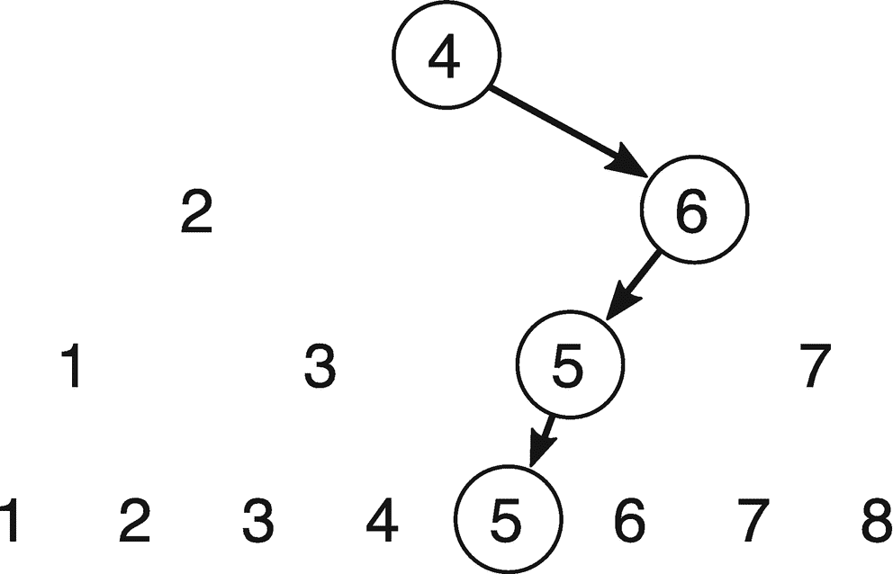

*从 1 到 8 的数字排成一行的图像。数字 5 被圈起，并通过一条链与数字 5、6 和 4 相连。*
**图 9-1** 通过二分搜索寻找数字 5

使用二分搜索算法，平均而言我们可以在三次猜测中找到这个数字。到目前为止，我们的二分搜索算法仅比线性搜索算法略好：三次猜测而不是四次。当我们增加范围时，算法的差异变得更加明显。如果我们将数字范围扩大一倍到 16，线性搜索的平均猜测次数也翻倍到八次。但二分搜索的平均猜测次数仅从三次增加到四次。

让我们将这个例子扩展到我们的数据集。假设我们想查找一次发射记录，使用以下查询：

```sql
select * from launch where launch_id = :n;
```

数据以堆表形式存储，没有特定顺序。如果我们在包含 70,535 条发射记录的表中进行线性搜索，平均需要 35,268 次比较。而二分搜索最多只需要 17 次比较就能找到该行，因为 `2¹⁷ = 131,072`，大于 70,535。儿童猜数字游戏的原理可以很好地扩展，帮助我们快速找到真实数据。

使用更数学化的解释来理解搜索过程是很有帮助的。当我们用二进制计数时，2 的幂次方增长很快。我们可能凭直觉就理解二进制增长；例如，我们知道 32 位允许大约 40 亿个数字：`2³² = 4,294,967,296`。二分搜索反向工作，而对数是指数的逆运算。因此，我们可以说，对 `N` 行进行二分搜索大约需要 `LOG2(N)` 次比较。相比之下，对 `N` 行进行线性搜索大约需要 `N/2` 次比较。这些数学表达式对于理解索引非常有用。

索引是一种类似于图 9-1 中所示二叉树的数据结构。当然，实际的索引结构比我们的例子更复杂。Oracle 的默认索引使用 B 树索引；顶部有一个根分支块，中间有分支块，底部有叶块。每个块包含数百个值，而不仅仅是一个。叶块不仅包含列值；它们还包含一个引用表行的 `ROWID`，以及指向下一块和上一块叶块的有序指针。（正是因为有这些指针，图 9-1 底部似乎多出了一行——从叶块到表块的查找。）在实践中，索引深度超过四级的极为罕见。（我们可以使用 `DBA_INDEXES.BLEVEL+1` 来计算索引的高度。）此外，真实的索引会为新值留出空闲空间，并且可能是不平衡的。

通过将图 9-1 中的树数据结构与我们简单的树遍历算法相结合，我们可以了解很多关于索引的知识。最重要的教训是为什么索引访问并不总是比全表扫描快。对于查找单个值，索引的比较次数是 `LOG2(N)`，而全表扫描是 `N/2`。对于查找一个值，索引显然是赢家。

但是，如果我们寻找的值几乎存在于每一行中呢？为每一行搜索索引意味着我们需要遍历树 `N` 次。现在，索引的比较次数是 `N*LOG2(N)`，而全表扫描是 `N`。对于查找所有值，全表扫描显然是赢家。

当我们考虑块访问时间时，索引访问的比较变得更加复杂。存储系统读取大量数据比读取多个小批量数据更高效。在系统逐个读取两个索引块所需的时间内，它可能已经能够通过全表扫描读取 64 个块。一个简单的多块读取可能比一个智能的单块读取更好。

聚簇因子也可能对索引不利。例如，假设我们只需要扫描 1%的索引。1%听起来搜索量很小，但这并不是全部情况。在读取索引块之后，我们还需要访问表块。如果我们需要的行是随机分布的，我们可能仍然需要读取 100%的表，一次一个块。`DBA_INDEXES.CLUSTERING_FACTOR` 是衡量数据无序程度的指标。一个良好的、低聚簇因子意味着一个索引块中的所有值都指向同一个表块。一个糟糕的、高聚簇因子意味着一个索引块中的行分散得到处都是。

索引非常适合从表中访问少量数据。对于从表中访问大量数据，索引可能是一个糟糕的选择。很难知道转折点在哪里，以及索引何时不再值得。我们需要考虑索引的工作原理、多块读取和聚簇因子。


### 索引特性

索引是数据库性能不可或缺的一部分。当一条简单的语句如 `CREATE INDEX SOME_INDEX ON SOME_TABLE(SOME_COLUMN)` 能让我们的查询运行速度提升百万倍时，这种感觉非常棒。但性能调优并非总是如此简单。简单的索引并非总是足够，因此我们需要了解使用、创建和修改索引的多种不同方式。

首先，我们需要理解 Oracle 如何使用索引。我们在图 9-1 中看到的树遍历是最常见的算法，但还有其他几种：

1.  `索引唯一扫描和索引范围扫描`：读取索引的传统方式，从顶到底遍历树。当我们只需要表中一小部分行时，这是理想选择。
2.  `索引快速全扫描`：通过多块读取来读取整个索引。当我们需要大部分行，并且所需的所有列都在索引中时，这是理想选择。此时索引可以作为表格的精简版本使用。
3.  `索引全扫描`：有序地读取整个索引。比索引快速全扫描慢，因为它使用的是单块读取而不是多块读取。其优点是数据按顺序返回，可以避免排序。
4.  `索引跳跃扫描`：即使前导索引列未被引用，也使用多列索引。这种访问方法较慢，尤其是当前导列的基数很高时，但聊胜于无。
5.  `索引连接`：从多个索引中读取数据并连接索引本身，而不是连接表。

`位图索引`对于低基数数据（即不同值数量较少的列）非常有用。位图是一个由 1 和 0 组成的列表，用于映射每一行是否具有特定值。例如，在我们的数据集中，`LAUNCH.LAUNCH_CATEGORY` 就是一个适合创建位图索引的候选列。以下代码创建了一个位图索引，并附带了一个简单的可视化来展示该位图索引可能的样子：

```
--在低基数列上创建位图索引。
create bitmap index launch_category_idx
on launch(launch_category);
military missile  : 111000000...
atmospheric rocket: 000111000...
suborbital rocket : 000000111...
...
```

每个位图存储 70,535 个 1 或 0，其中每一位对应一行。这种格式决定了位图索引仅适用于低基数列。尽管 70,535 位并不是很多数据，但每个唯一值都必须重复这个大小。另一方面，Oracle 可以压缩位图索引，因此实际存储空间可能小得多。`LAUNCH.LAUNCH_CATEGORY` 只有十个不同的值，所以即使在最坏情况下每个值使用 70,535 位，也不会占用太多空间。

位图格式使得执行比较操作变得容易。如果我们在 `LAUNCH.LAUNCH_STATUS` 上也创建了一个位图索引，我们就可以快速运行那些在类别和状态上都进行过滤的查询。Oracle 可以使用 `BITMAP AND` 操作来组合两个位图。比较 1 和 0 的列表是任何计算机都能高效完成的事情。

位图索引存在并发性问题，不应在频繁更改的表上使用。虽然我们可能认为位图格式就是 1 和 0 的列表，但 Oracle 的位图压缩可能会显著缩减该格式。Oracle 可能会压缩一个值范围，并存储相当于“第 1 到 10,000 行都是 0”这样的注释。如果我们更新表并更改该范围中间的某个值，Oracle 就必须重新压缩位图索引。这种重新压缩意味着更改单个值可能会锁定许多行。频繁更新带有位图索引的表会导致长时间等待和死锁错误。

`索引压缩`可以节省大量空间并提升性能。索引压缩类似于基本表压缩——它们都使用简单的模式替换。但索引压缩在几个方面优于表压缩。索引压缩不受表更改类型的影响，也不需要直接路径加载。而且索引压缩几乎没有 CPU 开销。索引是按前导列优先的方式存储的，因此只有当存在重复的前导列时，压缩才有效。

Oracle 索引可以包含`多列`。如果我们知道某些列总是会被一起查询，那么将它们放在同一个索引中可能是有意义的。或者我们可以为每一列创建单独的索引。或者我们可以两者兼有——一个多列索引和多个单独的索引。但我们不应疯狂地创建索引。每个索引都会占用空间，并且在表发生更改时需要额外的时间来维护。

`基于函数的索引`建立在表达式之上。当我们需要按列的修改版本进行查询时，基于函数的索引非常有用。例如，在查找发射记录时，大多数情况下我们只关心日期，而不是具体时间。如果我们在 `LAUNCH.LAUNCH_DATE` 上创建一个普通索引，我们可以使用 `BETWEEN` 查询来实现索引范围扫描。但我们还必须定义两个日期并指定秒数，这很麻烦。使用 `TRUNC` 函数来查询表并仅比较日期会更容易。但 `TRUNC` 函数与普通索引无法协同工作。以下代码在发射日期上创建并使用了一个基于函数的索引：

```
--创建基于函数的索引。
create index launch_date_idx
on launch(trunc(launch_date));
select *
from launch
where trunc(launch_date) = date '1957-10-04';
```

### 重建索引

索引可以被启用或禁用，类似于约束。但索引不是用 `ENABLE` 和 `DISABLE`，而是 `USABLE`（可用）或 `UNUSABLE`（不可用）。使索引不可用很简单，如 `ALTER INDEX LAUNCH_DATE_IDX UNUSABLE`，使索引可用也很简单，如 `ALTER INDEX LAUNCH_DATE_IDX REBUILD`。除了启用和禁用索引，我们还可以保持索引启用但使其不可见。不可见的索引仍然会被维护，但会被优化器忽略。我们可以更改索引的可见性，以测试索引更改对性能的影响。

除非我们正在重建整个模式，否则修改索引比重建索引更简单。我们的索引可能设置了大量属性，我们不希望在重建过程中丢失这些属性。

索引拥有许多与表相同的配置选项。索引可以设置为并行，但与表一样，我们应避免设置默认的并行度。索引可以有独立的表空间，但与表一样，我们应避免创建多个表空间。（并且请忽略索引和表需要放在独立表空间中的说法，除非您是存储系统专家并准备好彻底测试性能。）索引也可以设置为 `NOLOGGING`，但与表不同的是，使用 `NOLOGGING` 的后果并不那么严重；如果索引变得不可恢复，我们可以简单地从表数据中重新创建索引。与表类似，索引也可以进行分区，这将在后续章节中描述。

Oracle 索引重建是一个有争议的话题。显然有些时候我们必须重建索引，例如索引在维护操作中被标记为不可用，或者我们想更改索引属性。但我们不应为了性能原因或作为定期“维护”程序的一部分而频繁重建索引。除了少数罕见的例外，Oracle 索引是自我平衡的，不需要重建。

当我们确实需要重建索引时，有几种选项可以使这个过程更快且不中断。`ONLINE` 选项允许在构建索引新版本时，索引仍可用于查询。我们可以将 `ONLINE` 选项与其他选项结合使用，以快速重建索引，然后将属性重置回原始值：

```
--在线、快速重建，然后重置属性。
alter index launch_date_idx rebuild online nologging parallel;
alter index launch_date_idx logging noparallel;
```


## 分区

分区将表和索引划分为更小的片段，以提高性能和可管理性。分区表在我们的 SQL 语句看来与常规表无异。在底层，Oracle 可以调整我们的语句，使其仅访问相关分区，而不是读取整个表。分区技术在长达 425 页的《*VLDB 与分区指南*》中有完整描述。本节简要概述分区，更侧重于理解分区为何有效，而非罗列其数百项特性。

### 分区概念

尽管分区在“超大型数据库”手册中描述，但它对任何规模的数据库都可能有益。分区关乎我们访问数据的*百分比*，而不仅仅是数据的*大小*。分区和索引解决的是两种不同的性能问题；索引在检索少量行时效果最佳，而分区在检索大量行时效果最佳。

让我们用一个例子来理解分区的基本机制。本书中的大多数示例都通过 `LAUNCH_CATEGORY` 列来筛选 `LAUNCH` 表。我们很少需要查询所有发射记录，因为进行天气实验的探空火箭与将卫星送入轨道的轨道发射之间存在巨大差异。

我们的目标是优化这条 SQL 语句：`SELECT * FROM LAUNCH WHERE LAUNCH_CATEGORY = 'orbital'`。该 SQL 语句检索了相对较大比例的行。正如上一节所讨论的，索引无法帮助我们检索大量行的原因有多个。我们希望拥有全表扫描带来的多块读取效率，但又不希望读取整个表。为了理解分区，让我们首先通过一种称为“分区视图”的旧技术来艰难地实现我们的目标。我们可以通过创建多个表并将它们组合到一个视图中，来获得多块读取效率并排除大部分行。

首先，我们为每个发射类别创建一个表。只有十个发射类别，因此创建这些表不会花费太长时间。（此处仅列出这个大示例的第一部分。完整示例代码请参见代码库。）

```
--为每个 LAUNCH_CATEGORY 创建一个表。
create table launch_orbital as
select * from launch where launch_category = 'orbital';
create table launch_military_missile as
select * from launch where launch_category = 'military missile';
...
```

接下来，创建一个名为 `LAUNCH_ALL` 的视图，将这些小表拼接在一起：

```
--创建一个将按类别划分的表组合在一起的视图。
create or replace view launch_all as
select * from launch_orbital
where launch_category = 'orbital'
union all
select * from launch_military_missile
where launch_category = 'military missile'
...
```

当我们从前面的视图查询时，结果与直接查询原始 `LAUNCH` 表相同，但视图查询提供了最佳性能。Oracle 可以读取视图定义，理解十个表中只有一个能满足谓词 `LAUNCH_CATEGORY = 'orbital'`，并且将只从该表读取。起初这个方案看起来两全其美；我们像查询大表一样查询视图，但视图却像一个小表一样运作：

```
--这些查询返回相同的结果，但 LAUNCH_ALL 更快。
select * from launch where launch_category = 'orbital';
select * from launch_all where launch_category = 'orbital';
```

我们刚刚构建了一个简陋的分区方案。我们的特定示例运行良好，但该解决方案存在严重缺陷。我们无法更新 `LAUNCH_ALL`，因为会遇到可更新视图的问题。创建表和视图很繁琐，并且需要重复谓词。如果我们想创建索引，则必须为每个表创建一个索引。

真正的分区自动执行上述步骤，并创建一个能以最佳方式无瑕疵工作的表。Oracle 为每个分区创建一个段，其行为就像一个表。Oracle 完美理解这些段与表之间的映射关系，并且所有表操作在分区表上都能自动进行。

以下代码展示了如何创建一个真正的分区 `LAUNCH` 表。（或者，我们可以使用 `ALTER TABLE` 将分区添加到现有表。）这里有一些新语法，但这段代码比显式创建额外的表、视图和索引要简单得多：

```
--创建并查询一个分区的 launch 表。
create table launch_partition
partition by list(launch_category)
(
partition p_sub values('suborbital rocket'),
partition p_mil values('military missile'),
partition p_orb values('orbital'),
partition p_atm values('atmospheric rocket'),
partition p_pln values('suborbital spaceplane'),
partition p_tst values('test rocket'),
partition p_dep values('deep space'),
partition p_bal values('ballistic missile test'),
partition p_snd values('sounding rocket'),
partition p_lun values('lunar return')
) as
select * from launch;
select *
from launch_partition
where launch_category = 'orbital';
```

为什么我们不直接创建前面的分区表，而跳过那个由多个表和视图构建的糟糕版本呢？理解分区并非魔法很重要。太多 SQL 开发人员总是对大表进行分区，并认为分区会提升性能。分区只是一个将大表分解为小表的自动系统。如果我们想不出一种让查询多个更小的表能改善我们 SQL 语句的方法，那么分区将无济于事。

除了提高 SQL 语句的性能外，分区还可以使我们的数据更易于管理。例如，通过一个调度作业，读取数据字典中的分区元数据并截断或删除旧分区，可以轻松创建数据保留系统。而且从 19c 开始，我们可以创建混合分区表，其中一些分区基于外部文件或其他外部数据源。

## 分区特性

分区拥有大量特性。Oracle 提供了多种将表划分为分区、使用分区以及索引分区的方法。

我们最重要的分区决策是如何将表划分为分区。我们需要确定 SQL 语句最常引用的“数据块”。以下列表包含了最常见的分区选项：

-   *列表*：每个分区映射到一个值列表，并可以包含一个`DEFAULT`值来覆盖其他所有情况。适用于低基数的离散值，例如状态或类别列。
-   *范围*：每个分区包含一个值范围。每个分区被定义为小于特定字面量，或使用`MAXVALUE`来覆盖其他所有情况。适用于连续值，例如数值和日期值。
-   *哈希*：每个分区包含基于某个值的哈希值计算得出的随机行。适用于我们希望将数据分组但不太关心具体分组方式的情况。通常，仅当多个表以相同方式分区并计划使用分区-wise 连接时才有用。^(²⁵) 分区数应为 2 的幂，否则分区大小会出现偏差。
-   *间隔*：与范围分区相同，只是不需要完全指定范围。只需定义一个初始值和一个间隔，Oracle 将自动创建必要的分区。适用于会不断增长的连续值。
-   *引用*：使用列表、范围、哈希或间隔分区，但让子表自动遵循父表的分区方案。分区列不会重复，因此这在节省父-子表空间方面很有用。
-   *复合*：列表、范围、哈希和间隔的组合，形成分区和子分区。

选择分区类型后，我们必须选择分区的数量。分区数量涉及权衡，并取决于我们将如何访问表。大量小分区使我们能更快地仅访问所需数据。但数量越大，开销就越大，管理起来也越困难。Oracle 在管理分区的元数据和统计信息等方面做得很好；但如果我们最终有百万个分区，数据字典将会陷入停滞。我们可能倾向于选择较少的分区。例如，即使我们的查询每天只检索数据，每周的间隔分区可能就足够了。

分区和表一样，具有许多属性。分区从其表继承属性，但为不同分区自定义属性可能是有意义的。通过分区，我们可以在单个表中实现分层存储。例如，对于按日期范围分区的表，新分区可以存储在使用快速存储的表空间中，而较旧的分区可以被压缩并存储在使用较慢、更便宜存储的表空间中。

并行是分区中最容易被误解的特性。并行和分区往往一起使用，因为两者都有助于处理大数据。但我们并不需要为了利用其中一个而使用另一个。表面上，并行和分区听起来很相似——它们都将大表分解成更小的部分。但并行 SQL 在非分区表上的工作效果与在分区表上一样好。并行不一定非得使用分区块；并行可以轻松地将表本身划分为称为粒度的片段。

交换分区在数据仓库中用于帮助加载数据。我们可以花时间将数据加载到临时暂存表中。完成加载并验证数据后，可以将整个暂存表与生产分区交换。交换操作只是一个元数据更改，运行速度比插入数据快得多。

执行分区维护有多种语法选项。以下代码展示了一个示例，演示如何使用分区扩展子句从分区表中删除数据，以及使用`ALTER TABLE`命令截断同一个分区：

```
--分区管理示例。
delete from launch_partition partition (p_orb);
alter table launch_partition truncate partition p_orb;
```

分区表可以有索引。混合使用分区和索引让我们两全其美——我们可以使用分区来高效地检索大部分数据，也可以使用索引来高效地检索小部分数据。

分区表上的索引可以是全局的，也可以是本地的。虽然分区表的表数据在物理上被分离到多个分区中，但索引数据不需要遵循相同的模式。全局索引是一个覆盖所有分区的单一、大型树结构。本地索引包含多个较小的树，其中每个树覆盖一个分区。全局索引最适合搜索分布在多个分区中的少量值。本地索引最适合检索都在同一分区内的少量值。

## 视图

视图是存储的 SQL 语句。我们可以引用视图，而不是多次重复相同的 SQL 语句。视图只存储逻辑，不存储数据。物化视图包含实际数据，将在本章后面讨论。视图没有太多高级特性，前面的章节和部分已经讨论了可更新视图和视图约束。但是，创建和扩展视图存在一些重要问题。

### 创建视图

创建视图很简单。两个视图创建选项是`OR REPLACE`和`FORCE`。这些选项的工作方式没什么神秘的；`OR REPLACE`意味着视图将覆盖现有视图，`FORCE`意味着即使视图中的某些内容不存在，视图也会被创建。以下代码演示了这两个选项：

```
--使用 "OR REPLACE" 和 "FORCE" 创建视图。
create or replace force view bad_view as
select * from does_not_exist;
--视图已存在，但处于失效状态并抛出此错误：
--ORA-04063: view "SPACE.BAD_VIEW" has errors
select * from bad_view;
```

关于这两个选项的有趣之处在于，它们*不是*视图的属性——它们只是关于如何创建视图的指令。当我们通过`DBMS_METADATA.GET_DDL`或在 IDE 中点击按钮来查看视图源代码时，这些程序不一定会返回我们最初用于创建视图的选项。这些程序只返回它们认为我们下次可能想要使用的选项。

我们的原始 DDL 与元数据工具返回的 DDL 之间的这种差异，是为什么我们应该将代码存储在版本控制的文本文件中，而不是依赖数据库重建对象的另一个例子。也许我们不想在视图已存在时替换它——可能视图创建是一个不可重复过程的一部分。也许我们不想强制创建视图——我们可能希望脚本在检测到错误时立即失败。数据字典无法完美地重现我们的过程，只能做出猜测。我们的构建脚本应力求 100%的可重复性，因此我们必须注意这些微小的差异。


### 扩展视图

理论上，视图是改进我们代码的绝佳工具。“不要重复自己”可能是最重要的编程原则，而视图可以帮助我们遵循这一原则。但在实践中，视图常常变得一团糟。太多 SQL 开发人员不遵循通用的编程建议，例如使用有意义的名称、缩进、添加注释等。我们必须将 SQL，尤其是视图，当作小型程序来对待。

视图最令人烦恼的问题之一是它们变得深度嵌套。嵌套*内联*视图很棒，因为每一步都很简单，我们可以轻松查看和调试整个语句。而嵌套常规视图则往往不同，特别是当视图很大且构建得很差时。

Oracle 提供了像 `DBMS_UTILITY.EXPAND_SQL_TEXT` 这样的工具来帮助我们扩展视图，并一次性查看所有代码。以下代码演示了如何创建嵌套视图并将其展开以一次性显示所有代码：

```
--创建嵌套视图并展开它们。
create or replace view view1 as select 1 a, 2 b from dual;
create or replace view view2 as select a from view1;
declare
v_output clob;
begin
dbms_utility.expand_sql_text('select * from view2', v_output);
dbms_output.put_line(v_output);
end;
/
```

不幸的是，前面匿名块的输出看起来很糟糕。以下结果在技术上是正确的，但几乎无法阅读：

```
SELECT "A1"."A" "A" FROM  (SELECT "A2"."A" "A" FROM  (SELECT 1 "A",2 "B" FROM "SYS"."DUAL" "A3") "A2") "A1"
```

前面的混乱情况是一些组织规定视图嵌套深度不要超过一层的原因。嵌套视图的另一个潜在问题是性能。Oracle 有许多重写和转换 SQL 的方法。当我们引用一个巨大的视图，但只使用其中一小部分时，Oracle 可能能够避免运行不必要的部分——但并非总是如此。很难准确判断 Oracle 何时可以丢弃视图中不必要的部分。如果我们经常使用大型视图，却只为了其中一小部分，我们将会遇到性能问题。

不要让前面的问题阻止你使用视图。通过正确的特性、风格和纪律，我们可以用视图构建出令人印象深刻的系统。例如，如果我们将视图和 `INSTEAD OF` 触发器结合起来，就可以创建一个抽象层，这个抽象层可以比我们的表更简单，并且与数据模型变更隔离。

## 用户

Oracle 用户有两个用途——它们是一个包含对象的模式^(²⁶)，也是一个可以登录数据库的账户。许多 SQL 开发人员是由权限更高的用户分配账户的，从未考虑过用户管理。但要创建一个高效的数据库开发流程，我们需要熟练掌握创建、更改和删除用户账户。本节的建议是针对创建应用程序账户的开发人员，而非创建用户账户的 DBA。

创建用户可以很简单——我们只需要一个用户名和一个密码。但我们应该对用户管理投入更多思考，否则以后会后悔。每个组织都在为密码问题而苦恼，Oracle 有多种机制可以缓解我们的密码之痛。与其与开发人员共享应用程序密码，我们可以授予代理访问权限，允许用户使用其个人密码连接到另一个账户。例如，`ALTER USER APP_USER GRANT CONNECT THROUGH YOUR_USER` 将允许你使用用户名 `YOUR_USER[APP_USER]` 和你的个人密码登录到应用程序账户。这种奇怪的语法是避免共享和更改应用程序密码所付出的小小代价。而且从 18c 开始，我们可以为 Oracle 用户使用 LDAP 认证。或者，如果从来没有人需要以应用程序用户身份登录，从 18c 开始，我们可以使用 `NO AUTHENTICATION` 选项创建应用程序账户，完全不必担心密码管理。

我们的应用程序用户密码需要长且复杂。市面上有许多密码验证函数，我们不妨生成一个能满足所有这些函数的密码。始终组合使用多个小写和大写字符、数字和一些特殊字符。并且使用完整的 30 字节。Oracle 的密码哈希算法通常不够安全，而较长的密码至少会使哈希更难破解。

应用程序也应该有一个非默认的配置文件。配置文件用于限制用户连接、要求定期更改密码等。即使我们不关心安全影响，只想要无限连接和无限密码有效期，我们仍然需要关注配置文件。大多数数据库使用默认配置文件，该配置文件限制并发会话并使密码过期。如果我们没有选择正确的配置文件，当活动增加或密码过期时，我们的应用程序可能会崩溃。从 21c 开始，配置文件允许我们创建一个渐进的密码过渡时间。如果我们的环境有大量应用程序和连接，能够同时临时使用新旧密码可以极大地简化密码更改。

理想情况下，我们唯一需要担心表空间的时候是在创建用户时。应用程序应该有自己的表空间，或者至少不要与其他账户共享默认的 `USERS` 表空间。`USERS` 表空间往往会因为临时的 SQL 语句而被填满，我们不希望一个满的 `USERS` 表空间导致我们的应用程序中断。除了设置默认表空间外，应用程序模式还需要该表空间的配额，通常通过 `QUOTA UNLIMITED ON TABLESPACE_NAME` 来设置。

以下命令是一个示例，展示了我们可能希望如何创建一个应用程序或应用程序用户账户：

```
--创建一个应用程序用户账户。
create user application_user
identified by "ridiculouslyLongPW52733042#$%^"
--模式账户选项：
--  account lock
--18c 模式账户选项：
--  no authentication
profile application_profile
default tablespace my_application_tablespace
quota unlimited on my_application_tablespace;
```

我们正在接近数据库管理，这不是本书的主题。但 SQL 开发人员应该参与到创建、更改和删除应用程序账户的过程中。

我们应该谨慎，但不必害怕删除账户——至少在我们的沙箱环境中。除了生产环境，我们不常对应用程序账户进行维护，这意味着这些非生产账户充满了垃圾，应该经常删除并重新创建。该过程在第 2 章中描述，并以下面的命令开始。尽管这是一个无法工作的示例命令，但我已特意将其注释掉。危险的命令需要额外一层保护。注释并不是保护我们免受危险命令伤害的唯一方式；我们可能会在脚本中添加额外的提示，给脚本起一个听起来危险的名字，等等：

```
--删除用户及其所有对象和权限。
--drop user application_user cascade;
```


## 序列

序列用于生成唯一数字，通常作为代理主键。序列是另一种创建简单但具有一些意外行为的对象。

序列的一个常见需求是生成无间隙的序列。无间隙序列是不可能的，因此无需尝试。序列是为可扩展性而构建的，而创建一个无间隙的数字序列将需要序列化事务。如果用户 Alice 作为事务的一部分递增了一个序列，然后 Bob 为另一个事务递增了同一个序列，如果 Alice 执行回滚会发生什么？有两种处理方式：要么放弃 Alice 的序列号并产生间隙，要么 Bob 的事务必须等到 Alice 完成后才能开始。Oracle 选择了第一种方案，使得序列能够适应大型多用户环境。如果我们确实需要一个无间隙序列（很可能我们并不需要——我们只是认为消除间隙看起来更美观），我们将需要创建自己的自定义序列化过程，确保一次只有一个用户获得一个数字。

我们应避免删除和重新创建序列，除了在初始构建脚本中。对于基本的序列维护，我们应尽可能使用 `ALTER SEQUENCE` 命令。重新创建序列并非易事，主要是因为序列可能已授予角色和用户。

最常见的序列维护是将序列重置为一个新值。应用程序或即席 SQL 语句可能忘记使用序列来插入值，这意味着序列最终可能生成相同的值并导致唯一约束冲突。自 12.1 版本起，重置序列最简单的方法是使用此命令：

```
--创建并修改序列。
create sequence some_sequence;
alter sequence some_sequence restart start with 1;
```

在 11g 中重置序列更麻烦：将序列增量改为一个很大的值，调用该序列，然后将增量改回 1。或者我们可以简单地重复调用 `SOME_SEQUENCE.NEXTVAL`。

多次调用序列比修改序列慢得多，但优点是避免了任何 DDL 命令。在生产环境中，当我们可能需要填写大量文书工作才能执行“变更”时，这种方法可能很有用，而简单地从序列中选择并不算作变更。

序列不一定从 1 开始并以 1 递增；序列还有其他几个选项。序列可以 `START WITH` 任何数字，也可以 `INCREMENT BY` 任何数字，甚至可以是负数以使序列递减。序列可以在达到 `MAXVALUE` 后 `CYCLE` 回到 `MINVALUE`。

序列的默认值通常足够好。SQL 开发人员最常更改的选项是 `CACHE` 值，它决定了预生成并存储在内存中等待使用的序列号数量。默认值 20 通常没问题。类似于批量收集、预取和其他批处理大小选项，设置大值几乎没有好处。批处理大小在第 16 章有更详细的讨论。

对于极端的并发插入性能，我们可能需要使用 18c 引入的可扩展序列功能。序列通常线性递增，并通常用于主键生成。由于索引是按顺序存储的，新值往往会写入磁盘上的同一个块。访问相同的块有时是件好事，因为这意味着数据将被缓存在内存中。但频繁写入同一个块会导致争用，特别是在集群环境中，多个服务器上的多个进程需要协调变更。我们需要序列来创建唯一值，但有时我们不希望所有新值都存储在同一个块中。

主键索引争用的传统解决方案是使用 `REVERSE` 关键字创建索引，以反向顺序存储值。虽然像 123 和 124 这样的索引值很可能存储在一起，但像 321 和 421 这样的反向值很可能分开存储。反向键索引解决了争用问题，但将每个值写入几乎随机的位置会导致其他性能问题。在实践中，反向键索引很少能解决性能问题。

可扩展序列以更好的方式解决了争用问题，方法是在序列号前添加实例和会话 ID。每个会话倾向于将索引值写入相同的块，从而最小化访问的块数。并且由于一个会话不会与自身发生争用，并且每个会话的值都有显著差异，因此也不会发生会话间争用。唯一的缺点是序列值大得离谱，但这实际上不是什么大问题，只是这些值乍一看很可疑：

```
--创建一个可扩展序列并显示第一个值。
create sequence scalable_sequence_test scale;
select to_char(scalable_sequence_test.nextval) nextval from dual;
```

## 同义词

同义词对于为模式对象创建别名非常有用。一层同义词可以隐藏我们不想让用户或开发人员担心的、不美观的环境差异。

例如，本书中的数据集可以安装在任何模式上。数据集安装说明包括创建名为 `SPACE` 的用户的步骤。想象一下，我们正在基于我们的数据集构建一个应用程序，但名称 `SPACE` 在某个数据库上已被占用。模式名称在不同环境中会有所不同。我们的应用程序可以使用同义词来隐藏这种差异：

```
--创建同义词示例。
create synonym launch for space.launch;
```

同义词的另一个用途是在大型数据加载期间最小化停机时间。我们可以有两个表或两个物化视图，使用一个同义词指向其中之一。当新数据到达时，我们将数据加载到未使用的表中。加载完成后，我们 `CREATE OR REPLACE SYNONYM` 将同义词切换到指向新数据。这种方法不如在线表重定义那样健壮，但更简单。

与视图类似，我们应最小化间接层，并避免创建引用同义词的同义词。我们还应避免创建 `PUBLIC` 同义词。公共同义词不会授予所有用户访问权限，但公共同义词确实会污染命名空间。

## 物化视图

物化视图存储查询的结果。物化视图主要用于提高数据仓库的性能，但也可以强制执行多表约束。本节仅简要讨论物化视图主题；如需更详细信息，《数据仓库指南》中有数百页关于物化视图的内容。

物化视图具有表的所有属性，外加一个查询以及如何重建物化视图的说明。物化视图可以有索引，并且可以构建在其他物化视图之上。物化视图的刷新可以按需进行、作为计划的一部分，或在相关语句或提交后自动进行。刷新可以是 `COMPLETE`（重建整个表），也可以是 `FAST`（仅重建表的必要部分）。包 `DBMS_MVIEW` 可以帮助刷新一组物化视图。`DBMS_MVIEW.REFRESH` 过程有许多刷新选项，例如并行度、原子性（在一个事务中刷新所有物化视图）、异地（构建一个单独的表然后换出旧数据）等。

物化视图很复杂，只有在我们用尽所有其他查询调优选项后才应使用。物化视图可以解决困难的性能问题，但代价是额外的复杂性、额外的空间和额外的刷新时间。

### 针对多表约束的物化视图

在数据仓库之外，物化视图对于强制实施多表约束也很有用。例如，让我们尝试在 `SATELLITE` 和 `LAUNCH` 表之间强制实施一条规则。这两张表都有一个重要的日期列；发射表有 `LAUNCH_DATE`，卫星表有 `ORBIT_EPOCH_DATE`。这些日期是相关的，但并不总是相同。卫星轨道会随时间改变，例如当轨道因大气阻力而衰减时。`ORBIT_EPOCH_DATE` 列是轨道信息最后一次获取的日期。

`ORBIT_EPOCH_DATE` 通常晚于发射日期，因为轨道在发射后会发生变化。但是，轨道历元日期早于发射日期是没有意义的。如果 Oracle 支持断言（assertions），或许下面的语句可以保持我们的数据正确：

```sql
--LAUNCH.LAUNCH_DATE 必须早于 SATELLITE.EPOCH_DATE。
--（使用 "-1" 是因为时间上存在微小偏差。）
create assertion launch_before_epoch_date as check
(
select *
from satellite
join launch
on satellite.launch_id = launch.launch_id
where launch.launch_date - 1 < orbit_epoch_date
);
```

遗憾的是，上述功能尚不存在。大多数 SQL 开发人员会使用触发器来重新实现这条规则，而这需要编写过程式代码，很难同时保证正确性和快速性。我们可以使用物化视图以声明式的方式解决这个问题。

首先，我们必须在相关表上创建物化视图日志。每当表发生更改时，该更改也会自动写入物化视图日志。有了这些更改信息，我们的物化视图可以快速确定需要检查哪些行，因此 Oracle 只需比较已更改的行，而无需比较整张表：

```sql
--在基础表上创建物化视图日志。
create materialized view log on satellite with rowid;
create materialized view log on launch with rowid;
```

接下来，我们创建一个 `FAST ON COMMIT` 的物化视图，它将列出我们不希望看到的行。下面的代码反转了日期比较，并有一些其他奇怪的改动。该视图包含了来自两张表的 `ROWID`，并使用了老式的连接语法而非 ANSI 连接语法。快速刷新物化视图有许多奇怪的限制，可能很难创建：

```sql
--用于我们不希望发生的情况的物化视图。
create materialized view satellite_bad_epoch_mv
refresh fast on commit as
select satellite.orbit_epoch_date, launch.launch_date,
       satellite.rowid satellite_rowid,
       launch.rowid launch_rowid
from satellite, launch
where satellite.launch_id = launch.launch_id
  and orbit_epoch_date < launch.launch_date - 1;
```

（如果你使用的是来自其他模式（schema）的表，你需要直接向该模式授予 `CREATE TABLE` 权限，否则前面的语句将因 “ORA-01031: insufficient privileges” 而失败。即使你的用户可能有能力创建表，但当你创建物化视图时，物化视图的所有者需要在后台创建另一个表。）

前面的物化视图包含了所有不好的行。由于有了物化视图日志，物化视图无需重新读取整个 `LAUNCH` 和 `SATELLITE` 表来验证变更。

最后一块拼图是添加一个约束。这个物化视图不应该包含任何行，所以我们创建一个约束，如果存在任何行，该约束就会失败。但由于已经存在一些不好的行，我们将使用 `NOVALIDATE` 选项创建约束以忽略这些行：

```sql
--添加防止新行的约束。
alter table satellite_bad_epoch_mv add constraint
    satellite_bad_epoch_mv_no_row check (launch_rowid is null)
    enable novalidate;
```

最后，让我们尝试进行一次错误的更新。让我们将一个轨道历元日期设置为远早于发射日期的值。下面的 `UPDATE` 语句会运行，但 `COMMIT` 语句会引发一系列事件，最终导致错误 “ORA-02290: check constraint (SPACE.SATELLITE_BAD_EPOCH_MV_NO_ROW) violated.”。`COMMIT` 导致物化视图尝试刷新。物化视图从物化视图日志中读取已更改的行，然后尝试为我们的查询（该查询本不应返回任何行）构建结果。当查询确实返回行时，物化视图就违反了约束，从而导致错误：

```sql
--设置一个错误值。
update satellite
set orbit_epoch_date = orbit_epoch_date - 100
where norad_id = '000001';
commit;
```

物化视图断言对于强制实施复杂的数据规则很有用，但也存在几个缺点。每个模拟断言都需要几个新对象。物化视图背后的逻辑是反向的——我们必须为我们不想要的内容编写查询。该查询必须遵守几个奇怪且文档记录不全的语法规则。并且，对基础表的 DML 操作会有性能损失，因为所有变更也需要写入物化视图日志。为了创建一个简单的约束，这需要大量痛苦的代码，但为了维护数据的完整性，这种努力是值得的。

## 数据库链接

数据库链接是访问另一个数据库上数据的最简单方式。通过几个额外的关键字和一些技巧，我们可以构建强大、跨数据库的大型系统。

创建数据库链接很简单，只需要基本的连接信息。如果我们无法访问多个数据库，我们仍然可以通过创建指向自身的数据库链接来测试数据库链接功能。创建数据库链接后，访问远程对象就像添加 “`@`” 符号一样简单。Oracle 会自动处理权限、数据类型等：

```sql
--创建指向同一数据库的数据库链接，用于测试。
create database link myself
connect to my_user_name
identified by "my_password"
using '(description=(address=(protocol=tcp)(host=localhost)
(port=1521))(connect_data=(server=dedicated)(sid=orcl)))';
select * from dual@myself;
DUMMY
X
```

（如果我们设置了 `CURRENT_SCHEMA` 指向不同的模式，前面的命令将无法工作，因为数据库链接只能直接在我们自己的模式中创建。当然，我们还需要输入正确的连接字符串详细信息。）

数据库链接有一些奇怪的行为，但几乎总是有办法解决我们的问题。数据库链接不太适合导入或导出海量数据。如果我们想移动千兆字节的数据，我们应该研究像数据泵（data pump）这样的工具。“`@`” 语法本身也不支持 DDL 语句。运行 DDL 的解决方法是通过数据库链接调用 `DBMS_UTILITY.EXEC_DDL_STATEMENT`。而且，即使语句不包含 DML，数据库链接也总会产生一个事务。

出于安全原因，有太多组织规定禁止使用数据库链接。数据库链接本身没有问题，尽管 `PUBLIC` 数据库链接肯定会有问题。我们需要非常谨慎地向 public 授予任何权限。但我们不应该让一个非默认选项阻止我们使用最方便的解决方案。那些明令禁止所有数据库链接的组织，明智的做法是牢记 Avi 的可用性法则：以牺牲可用性为代价的安全性，最终也会损害安全性。如果我们阻止了简单、安全的方法，人们就会找到简单、不安全的方法。我所见过最严重的安全违规事件，就是因为组织不允许使用数据库链接而发生的。

通过正确的代码和解决方法，数据库链接可以帮助我们从一个数据库查询和控制大型环境。


## PL/SQL 对象

有许多有趣的 PL/SQL 对象，但遗憾的是，这些对象超出了本书的范围。如果你继续深入学习 Oracle SQL，你将不可避免地开始使用 PL/SQL，因此我将在这里快速列出这些对象。你可以从使用匿名块和 PL/SQL 公用表表达式开始接触 PL/SQL。最终，你会想要开始创建这些 PL/SQL 模式对象：

1.  `函数`：执行 PL/SQL 语句并返回一个值。用于小型查询或数据转换。

2.  `过程`：执行 PL/SQL 语句但不返回值。用于执行小型变更。

3.  `包规范和包体`：封装函数、过程和变量。用于创建程序。

4.  `触发器`：在事件（如表变更或系统事件）发生时触发的 PL/SQL 语句。用于处理变更的副作用，例如为新行添加主键。

5.  `类型规范和类型体`：封装函数、过程和变量。与包类似，但旨在用于存储数据。用于 PL/SQL 程序中的自定义集合或对象关系表。

PL/SQL 既被过度使用，又未被充分利用。对于来自更传统编程背景、希望进行过程化编程的程序员来说，该语言被过度使用了。当一条 SQL 语句就能完成同样的工作时，就不应使用 PL/SQL 程序。对于那些认为数据库只应存储数据而不应处理数据的程序员来说，该语言又未被充分利用。虽然我不会说 Oracle 是最好的数据库，但我可以很肯定地说，Oracle PL/SQL 是最好的数据库过程化语言。只需一点点 PL/SQL 就能开启很多可能性。PL/SQL 语言功能强大，几乎可以解决任何问题。

## 其他模式对象

本节简要列出了其他不太重要的模式对象。即便如此，这份列表也并不完整；尽管这些对象可能与 SQL 开发无关，但仍存在许多其他模式对象类型：

1.  `簇`：将多个表物理地存储在一起。例如，`LAUNCH`和`SATELLITE`表经常连接在一起。如果将这些表预先连接并存储在簇中，可能有助于提高性能。簇在理论上听起来不错，但在实践中并未使用。

2.  `注释`：为表、列和视图提供文档。这可能很有用，因为许多集成开发环境（IDE）会读取注释并在我们查询数据时显示它们。

3.  `物化区域映射`：存储关于“区域”内最小值和最大值的信息。与分区修剪类似，区域映射可用于快速从全表扫描中排除大块数据。与分区不同，区域映射只是元数据，不需要重新设计表。

4.  `OLAP 对象`：Oracle 拥有完整的联机分析处理（OLAP）选件。OLAP 技术近来已逐渐式微，Oracle 已开始将更多 OLAP 功能创建为常规数据库对象。这包括分析视图、属性维度、维度和层次结构。

## 全局对象

全局对象不归特定的 Oracle 用户所有。全局对象很容易被遗忘，因为它们并非直接由我们的应用程序拥有。我们的应用程序可能依赖于这些对象，但在我们导出模式或元数据时，这些对象通常不会出现。我们需要记住这些例外情况，否则我们的应用程序可能只能得到部分安装：

1.  `上下文`：为每个会话包含全局数据的自定义命名空间。可以通过自定义包设置，并可通过`SYS_CONTEXT`函数引用。例如，默认的`USERENV`包含许多有用的值，例如`SYS_CONTEXT('USERENV', 'HOST')`。

2.  `目录`：名称与文件系统目录之间的映射。像`UTL_FILE`这样的 Oracle 包不直接引用文件系统目录，只引用 Oracle 目录对象。这种间接性很有用，因为文件系统目录经常因环境和平台而异。

3.  `配置文件`：为用户设置限制。Oracle 建议改用资源管理器，因为它功能更强大。但在实践中，资源管理器过于复杂，我们依赖于配置文件。

4.  `还原点`：与时间戳或系统变更号（SCN）关联的名称。对闪回操作很有用。

5.  `角色`：一组可授予其他用户和角色的对象权限和系统权限。将权限一次授予正确的角色，远比将权限授予多个用户简单得多。

## GRANT 和 REVOKE

`GRANT`和`REVOKE`命令控制数据库访问。有三件事必须加以控制：对象权限（对表、视图等的访问权限）、系统权限（用于登录的`CREATE SESSION`、像`SELECT ANY TABLE`这样的强大权限等）和角色权限（自定义应用程序角色、像`DBA`这样预先存在的强大角色等）。

权限只能授予给现有对象。这个限制听起来合理，但它意味着没有办法授予用户 Alice 对用户 Bob 拥有的所有对象的永久访问权限。我们可以通过使用`ALL PRIVILEGES`选项来简化授权脚本，但我们仍然需要为 Bob 模式中的每个相关对象运行`GRANT`命令。而且，如果在 Bob 的模式中创建了新对象，在我们运行另一个`GRANT`语句之前，Alice 将无法访问它。

另一个困难的权限场景是当权限被传递时：当 X 被授予 Y，而 Y 又被授予 Z。创建授权链是困难的。当我们把一个对象授予一个用户时，除非该用户拥有`WITH ADMIN`选项，否则该用户不能将该对象授予他人。当我们把一个对象授予一个用户时，除非该用户拥有`WITH GRANT`选项，否则该用户不能基于该对象创建视图，然后再将该视图授予他人。

跟踪权限并非易事。有三种权限和三组数据字典视图，例如`DBA_TAB_PRIVS`、`DBA_SYS_PRIVS`和`DBA_ROLE_PRIVS`。由于角色可以被授予角色，如果我们想彻底列出所有角色权限，我们需要一个递归查询。如果我们想确切知道我们拥有哪些角色的访问权限，我们必须使用类似这样的查询：

```sql
--直接或间接授予当前用户的角色。
select *
from dba_role_privs
connect by prior granted_role = grantee
start with grantee = user
order by 1,2,3;
```

在查找对象和系统权限时，查询会变得更复杂。我们必须将前面的查询作为另一个查询的一部分来使用。以下示例查找授予当前用户的所有系统权限：

```sql
--直接或间接授予当前用户的系统权限。
select *
from dba_sys_privs
where grantee = user
or grantee in
(
select granted_role
from dba_role_privs
connect by prior granted_role = grantee
start with grantee = user
)
order by 1,2,3;
```

查找对象权限需要一个与前面非常相似的查询，但用`DBA_TAB_PRIVS`替换`DBA_SYS_PRIVS`。该视图名称具有误导性——该视图包含所有对象的权限，而不仅仅是表的权限。

## 总结

我们对高级功能的快速浏览已完成。我们知道如何构建集合，如何读取和写入数据，以及如何创建模式对象和全局对象。我们不需要记住 SQL 语法，但我们需要记住我们有哪些不同的选项可用。当我们开始组合高级功能并试图从 Oracle 获得最佳性能时，我们需要掀开帷幕，看看 Oracle 是如何工作的。下一章将通过介绍 Oracle 的架构来完成我们对高级功能的讨论。

脚注 1   2   3   4   5


# 10. 使用 Oracle 架构优化数据库

SQL 和关系模型是建立在我们缓慢的物理机器之上的逻辑构造。甚至连 E.F. Codd 的原始论文也警告说，实现关系模型会遇到物理限制。我们使用的高级功能越多，对数据库施加的压力越大，Oracle 的抽象层就越可能失效。Oracle 投入了大量努力使我们的 SQL 代码具备原子性、一致性、隔离性和持久性。但没有系统能隐藏所有的实现细节，我们需要理解 Oracle 内部机制才能让系统高效运行。

本章重点介绍 SQL 开发所需了解的实用架构信息。数据库管理员需要学习更多关于 Oracle 架构的知识，应该通读 622 页的《数据库概念》手册。开发人员可以通过略读该手册或参考本章信息来满足需求。

## 存储结构

SQL 开发人员需要了解数据的存储方式。即使我们不负责管理数据库和存储，Oracle 的存储架构也会影响 SQL 语句的性能和锁定机制。我们可能还需要理解空间分配方式，以便知道需要请求多少空间以及如何避免浪费空间。

存储结构按从小到大的顺序排列为：列值、行片断、块、区段、段、数据文件、表空间以及 ASM 或文件系统。该列表中除数据文件外，所有项目都是仅存在于数据库内部的逻辑存储结构，而数据文件是存在于操作系统上的物理存储结构。Oracle 还有其他物理存储结构，如控制文件和参数文件，但这些结构对 DBA 比对开发人员更重要。我们列出的存储结构并非完美的层级结构，但已足够实用。该结构如图 10-1 所示。

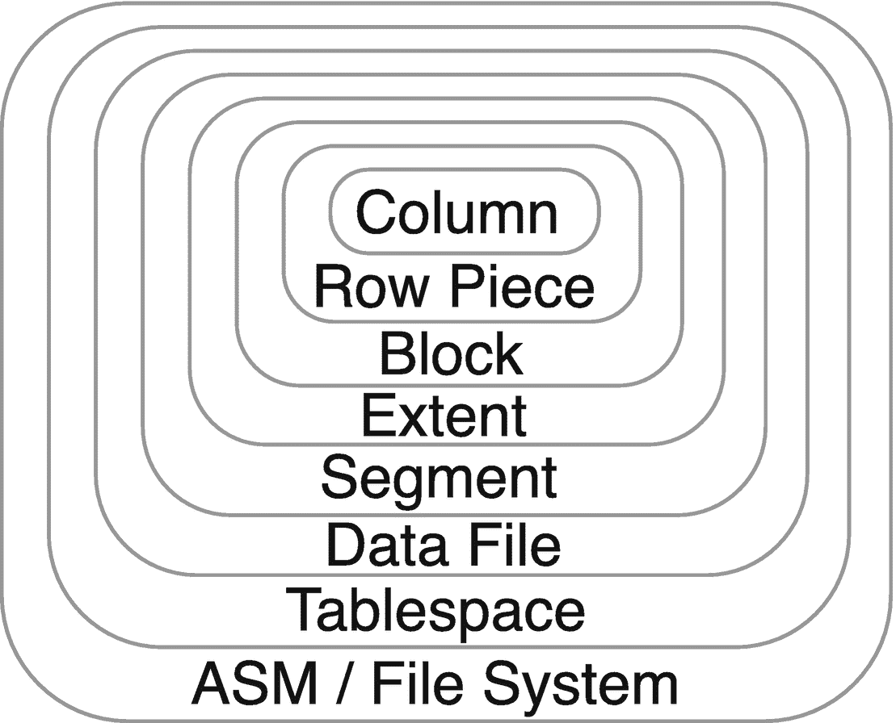

存储结构层级包括列、行片断、块、区段、段、数据文件、表空间以及 ASM 或文件系统。

图 10-1
存储结构层级

### 列值

本书中我们已经多次遇到列值。我们已经了解如何使用`DUMP`函数查看数据的内部表示。最简单的数据类型——NUMBER、VARCHAR2 和 DATE——易于理解，无需进一步解释。这些数据类型应构成我们绝大多数列。

大型对象的存储可能会变得相当复杂，例如 BLOB、CLOB 和 BFILE。`BFILE`是指向存储在文件系统上的二进制文件的指针，由操作系统管理。`BLOB`和`CLOB`可以内联存储，小于 4000 字节的值可以与其他数据一起存储。大于 4000 字节的`BLOB`和`CLOB`必须外联存储，与表中的其他数据分开。

每个`BLOB`和`CLOB`列都有一个单独的段来存储大型外联数据。在某些情况下，绝大部分表数据存储在 LOB 段中而非表段中。LOB 段可能使计算存储空间变得棘手。对于包含大型 LOB 的表，我们不能仅在`DBA_SEGMENTS`中查找表名——还必须使用`DBA_LOBS`来查找 LOB 段。LOB 还具有许多存储属性，如表空间、压缩、加密、去重、日志记录、保留等。如果我们在 LOB 中存储大量数据，需要仔细考虑每个 LOB 列的设置。

外联 LOB 仍在表段中存储少量数据。每个 LOB 值都有一个指向 LOB 的定位符。系统会自动为每个 LOB 创建索引以帮助快速查找 LOB 数据。这些 LOB 索引被赋予系统名称，如`SYS_IL0000268678C00010$$`，我们不应直接修改这些索引。

非原子类型，如`XMLType`和对象类型，则更为复杂。但即使是这些复杂类型，在底层仍然存储在常规的列和行中。`DBA_NESTED_TABLES`和`DBA_TAB_COLS`^(²⁷)等数据字典表显示，这些花哨类型的存储方式与常规类型相同。无论我们做什么，数据都是以列和行的形式存储的，因此我们不应期望通过使用高级类型来获得神奇的性能提升。

### 行片断

正如我们对关系数据库的期望，所有值都存储在列中，而列存储在行中。这些行可能被拆分成多个行片断并分散在多个块中（接下来将讨论）。Oracle 中的所有内容都必须适合一个块中，该块通常为 8KB。这种大小限制意味着大行必须被拆分成多个片断，称为行链接。如果我们更新一行，而该行突然变得太大无法容纳于块中，整行可能会迁移到另一个块。在极少数情况下，行链接和行迁移可能导致性能问题。链接和迁移行需要为行片断或新位置创建额外的指针，这可能导致额外的读取操作。

每行都可以通过`ROWID`伪列来标识，这类似于每行的物理地址。`ROWID`是查找行的最快方式——甚至比主键还快。但`ROWID`可能会改变，例如，如果我们压缩或重建表时。我们不应永久存储`ROWID`值并期望它日后仍能有效。

列数据在行中的存储方式可能对我们的表设计有重要影响。对于每一行，Oracle 存储列数。对于每个列，Oracle 存储一个字节大小，然后是数据。（还有其他行元数据，但在此不重要。）

例如，假设`LAUNCH`表中有三行，其中只有`LAUNCH_ID`列有值。该表有 14 列，因此这三行中的几乎所有值都是 NULL。再假设我们选择将`LAUNCH_ID`放在*最后*一列。每行以列数 14 开始。然后是 13 个零，表示占 0 字节的空列。接着是一个 1，表示最后一列的大小，该列仅占 1 字节。最后是`LAUNCH_ID`值本身，它们是简单的整数。前三行可能如下所示：

```
14|000000000000011
14|000000000000012
14|000000000000013
```

Oracle 使用一个简单的技巧来节省尾随 NULL 的空间。如果我们将`LAUNCH_ID`放在表的*开头*，而所有其他值都是 NULL，那么列数将仅设为 1。对于第一列，大小设为 1 字节，然后包含数据。对于其余列，不需要任何内容。Oracle 推断，如果 14 列中只有 1 列被包含，其余列必定为 NULL：

```
1|11
1|12
1|13
```

这种尾随 NULL 的技巧可以为宽而稀疏的表节省大量空间。但只有可空列放在表的末尾时，该技巧才能节省空间。我们通常不需要了解这类信息。但如果我们打算构建一些极端的东西，比如一个有上千列的表，利用 Oracle 的物理架构可能会带来很大的不同。


### 块与行级锁定

所有列和行都必须容纳在**块**中。块是 Oracle 读取操作的原子单位。尽管我们可能只关心单行数据，但数据总是至少以块为单位进行读取。块的默认大小为 8 千字节，因此，即使我们只想获取 1 字节的数据，Oracle 也总是至少读取 8 千字节。（操作系统和存储设备也可能读写更大的数据块。）块会从多个方面影响我们数据库的性能和行为。

基本表压缩是按块完成的。每个块都包含有关常见值的元数据，通过不重复存储这些常见值，块可以节省空间。如果同一个值重复出现，但距离前一个值超过 8 千字节，则该值不会被压缩。但如果表按某一列排序，重复值会彼此相邻出现，压缩率就会提高。如果我们的 `INSERT` 语句还包含 `ORDER BY` 子句，就能显著减小压缩表的大小。

块大小是可配置的，但我们不应更改它。关于块大小存在很多误解。我从未见过可复现的测试用例能证明更改块大小可以提升性能。但我见过许多系统存在令人困惑的混合块大小以及错误设置的参数。无论如何，更改块大小无助于大容量读取；Oracle 会调整 `DB_FILE_MULTIBLOCK_READ_COUNT` 参数，使其不超过操作系统最大值。除非你愿意花费大量时间进行研究和测试，否则请不要使用自定义块大小。

`PCTFREE` 参数控制新块中保留多少可用空间，默认为 10%。保留少量可用空间非常重要，可以防止行迁移。如果块被完全填满，增加哪怕一个字节都将需要移动整行。如果表是只读的，并且行永远不会移动，那么将 `PCTFREE` 更改为 0 可以节省空间。

按块检索数据解释了为什么索引的性能不如我们期望的那样好。我们的 SQL 语句可能只选择了所有行的 1%，但如果不巧，这 1% 的数据分散在 100% 的表块中。Oracle 可能不得不读取表的大部分内容来获取一小部分行。这个问题由**聚簇因子**来体现。与压缩类似，我们可以通过按特定顺序向表中插入数据来改善这种情况。但如果我们有多个索引，可能只能改善其中少数几个的聚簇因子。

Oracle 的行级锁定是在块内部实现的。每当事务更改一行时，该行就会被锁定，直到事务提交或回滚。同一时间只有一个事务可以修改同一行。锁并非存储在单独的表中——锁定信息与数据块存储在一起。每个块都有一个**Interested Transaction List (ITL)**，记录哪个事务正在修改哪一行，以及指向相关撤消（undo）数据的指针。

这种行级锁定架构意味着没有简单的方法来找出哪些行被锁定了。由于锁信息存储在每个表内部，Oracle 必须读取整个表才能知道哪一行被锁以及被谁锁定。而且 Oracle 只存储锁定行的事务，而不是具体的语句。当我们遇到锁问题时，应该问是*谁*阻塞了我们的语句，而不是*什么*阻塞了我们的语句。以下查询是一种找出谁在阻塞会话的简单方法：

```sql
--Who is blocking a session.
select final_blocking_session, gv$session.*
from gv$session
where final_blocking_session is not null
order by gv$session.final_blocking_session;
```

一旦我们找到了阻塞会话，就很容易弄清楚谁拥有该会话、他们在做什么以及他们是如何锁定该行的。存在许多复杂的锁定场景、隐藏参数、锁定模式和其他细节。但大多数情况下，当我们的行被锁定时，意味着其他人正在更新该行并忘记提交他们的事务。

### 区

**区**是属于同一个段的一组块。Oracle 可能一次修改一个块的数据，但 Oracle 分配新空间是一次分配一个区。有两种算法用于决定每个区分配多少个块；我们可以让 Oracle 通过 `AUTO` 来决定，或者我们自己用 `UNIFORM` 选择一个静态大小。

我们应该使用默认值 `AUTO`，除非我们有极端情况，否则无需担心此设置。例如，如果我们有成千上万个微小对象或分区，可能希望通过创建一个较小的统一大小来节省空间（尽管如果我们有那么多对象，我们可能还有其他问题，需要重新思考我们的设计）。只要我们在创建表和表空间时不胡乱调整区设置，区就没什么好担心的。

### 段

**段**是一组区的集合。段是一个逻辑对象的整个存储结构，尽管“对象”的定义可能有点复杂。这些对象最常见的是表和索引，但也可以包括簇、物化视图、LOB、分区和子分区等。段通常是回答有关对象大小问题的最佳存储结构，但计算可能很棘手，尤其是在涉及已删除对象时。

重要的是要理解，一个段一次只适用于一个逻辑对象。分配给一个表段的空间不能被另一个表使用。例如，如果我们用一个大表填满一个段，然后删除该表中的所有行，则该段中的空间不能被任何其他对象使用。未使用的空间就是为什么 `TRUNCATE` 命令如此重要。每个段都有一个**高水位标记**，用于标记该段已使用的最大空间量。高水位标记很容易升高，但需要 DDL 命令来缩小。段中的空闲空间在通过像 `TRUNCATE` 这样的命令重置高水位标记之前，并不是真正的空闲空间。

要完美地度量我们的数据大小是不可能的。这项任务的难度起初看起来很荒谬。数据只是 0 和 1。计算它们不应该是轻而易举的事吗？问题在于定义“数据”的方式有很多种。使用 `DBA_SEGMENTS.BYTES` 很容易包含表数据。但由于 LOB 不存储在表中，我们至少应该使用 `DBA_LOBS` 来查找相关的 LOB 段。如果我们还想计算索引，应该使用 `DBA_INDEXES` 来查找相关的索引段。但默认答案会包含块和段中的空闲空间，并且会度量压缩后的大小。考虑到所有这些变量，我们得出的任何数字都永远不会与我们的数据文本文件的大小相匹配。通常最好承认答案不会完美，就直接使用所有相关段大小的总和。

当我们想要度量或移除空间时，还需要考虑**回收站**。已删除的对象从我们的应用程序中消失了，但如果未使用 `PURGE` 选项，这些对象可能不会完全消失。相反，与对象相关的段可能被加上了 `BIN$` 前缀，以标记它们处于回收站中。Oracle 会根据“空间压力”自动从回收站中移除最旧的对象。空间压力发生在系统空间不足时。但标准并不明确；旧版手册语焉不详，新版手册则完全未讨论空间压力。为安全起见，我们应该尽可能清除对象。可以使用 `PURGE` 选项永久删除数据对象，或者可以使用诸如 `PURGE USER_RECYCLEBIN` 或 `PURGE DBA_RECYCLEBIN` 的命令。

其他非永久段类型包括重做（redo）、撤消（undo）和临时表空间。这些段类型将在本章其他地方讨论。


### 数据文件

数据文件是所有数据的实际存储结构，正如其名——它们就是操作系统中的文件。数据文件并非段的真正父级，因此本章使用的层次模型并不完美。一个大型表段可以跨越多个数据文件。但在实践中，数据文件往往比段大得多。

不幸的是，添加数据文件是 SQL 开发人员需要了解的一项任务。添加数据文件属于数据库管理任务，但它经常被错误执行并引发问题。以下是一个添加数据文件的简单示例：

```
--Add data file.
alter tablespace my_tablespace add datafile 'C:\APP\...\FILE_X.DBF'
size 100m
autoextend on
next 100m
maxsize unlimited;
```

上例的第一行是纯粹的数据库管理操作。查找表空间名称、目录（或 ASM 磁盘组）和文件名取决于我们的系统配置。最后四行对开发人员至关重要，值得简要讨论。创建初始较大的数据文件并无性能优势，因此从小一点的`SIZE 100M`开始可以节省空间，尤其是在有大量数据文件的大型环境中。我们几乎总是希望随着数据增长而增大数据文件大小，因此`AUTOEXTEND ON`是一个简便的选择。我们希望数据文件以合理的速度增长，`NEXT 100M`是一个合适的大小。如果将`NEXT`子句设为`1`，会导致严重的性能问题，因为系统将不得不为每 8KB 的数据扩展数据文件。另一方面，我们也不希望`NEXT`子句设置得太高而浪费空间。而且我们不妨尽可能利用空间，所以将`MAXSIZE UNLIMITED`设为一个好的默认值也是合理的。

另一个重要决策是添加多少个数据文件。作为开发人员，我们有责任提供数据大小的初步估计。但我们也需要认识到我们的估计可能是错误的。如果可能，我们应该尝试建立数据文件增长的规则。一个好的规则是始终将数据文件数量翻倍。如果我们遵循前面的设置，添加额外的数据文件几乎是零成本的。将数据文件数量翻倍不会有任何坏处，而且它提供了很大的缓冲空间。

关于数据文件的讨论可能感觉与 SQL 开发人员的工作无关。但提前思考空间增长是值得的。空间耗尽是 Oracle 停机的最常见原因。没有什么比分配了 TB 级空间，却因为一个数据文件未被设置为自动扩展而导致应用程序失败，或者因为 DBA 一次只添加一个数据文件而不是将其数量翻倍而反复导致应用程序失败更令人沮丧的了。

还有其他方法可以确保我们不会耗尽空间。例如，我们可以使用单个大文件表空间（bigfile）代替多个小文件表空间（smallfile）。再次强调，作为 SQL 开发人员，我们可能并不特别关心这些细节。无论我们的 DBA 选择哪种方法，我们都需要确保有一个系统来避免频繁空间耗尽。

数据文件也有高水位标记，我们可能需要偶尔对数据文件进行碎片整理。在高水位标记之上进行碎片整理很容易，但在高水位标记之下进行碎片整理可能会很痛苦。如果我们清理了很多对象，但大型数据文件仍然浪费空间，我们需要与 DBA 沟通。但如果 DBA 告诉我们无法轻松回收空间，请不要感到惊讶。

### 表空间

表空间是段的逻辑集合，并包含一个或多个数据文件。表空间用于将存储分组，通常针对一个应用程序或特定类型的数据。

每个具有永久数据的对象都可以分配到不同的表空间。但我们不希望为每个表都操心其表空间。管理存储最简单的方法是为每个用户创建一个表空间，并让该模式中的每个对象使用默认表空间。表空间越少，管理数据库越容易。我们拥有的表空间越多，其中一个表空间空间耗尽并导致问题的可能性就越大。另一方面，我们也不希望只使用*一个*表空间；一个失控的应用程序可能会填满该表空间并导致整个数据库崩溃。

许多实用程序和功能可以按表空间工作，例如数据泵导入导出、备份和可传输表空间。可传输表空间允许我们在服务器之间复制和粘贴数据文件，以快速移动数据。如果我们有一组需要频繁复制的大型表，将这些表隔离到一个表空间中可能有所帮助。

Oracle 带有默认表空间：`SYSTEM`、`SYSAUX`、`USERS`、`UNDOTBS1`和`TEMP`。`SYSTEM`和`SYSAUX`表空间用于存放系统生成的对象，我们应该避免在这些表空间中存储任何内容。当一个表空间已满时，写入该表空间的应用程序将会中断；如果`SYSTEM`或`SYSAUX`已满，整个数据库就会中断。`USERS`表空间对临时用户很有帮助，但不应与应用程序共享。我们不希望一个用户的临时表耗尽所有空间并导致我们的应用程序崩溃。`UNDOTBS1`不出意外地存储撤销数据，如本章前面所述。`TEMP`表空间将在本章后面讨论。

### 自动存储管理

自动存储管理（ASM）是 Oracle 的一个工具，用于在数据库内部管理文件系统，而不是使用操作系统。SQL 和管理命令可以引用单个磁盘组名称，而不是使用操作系统目录和文件。Oracle 可以负责条带化、镜像、文件位置等事务。ASM 有助于提高性能和可靠性，并可以实现诸如实时应用集群（RAC）之类的技术。ASM 主要影响管理员，但也可能以细微的方式影响 SQL 开发。

ASM 占用空间巨大——它需要另一个数据库安装和实例。如果我们正在设置个人沙箱环境，创建一个单独的 ASM 数据库是不值得的。

尽管 ASM 是一个独立的数据库，但我们很少需要直接连接到它。我们的常规数据库会自动连接到 ASM 实例。如果我们想编写查询来查找可用空间，而不是查看数据文件和操作系统，我们需要查看数据字典视图，例如`V$ASM_DISKGROUP`。

查询 ASM 数据字典时，我们必须小心避免重复。每个数据库会返回连接到该 ASM 实例的*所有*数据库的 ASM 信息。如果我们想查询并聚合来自所有 ASM 实例的数据，我们需要只针对每个 ASM 实例从一个数据库进行查询。根据 ASM 的设置方式，这些查询可能很棘手。但通常每个主机有一个 ASM 数据库，或者每个集群有一个 ASM 数据库。


## 浪费的空间

存储结构存在多个层次，每个层次都有浪费的空间。有些层次留有额外空间用于更新或增长；其他层次则可能保留空间，除非进行调整大小。此外，管理员必须为未来的增长和紧急情况预先分配额外空间。大多数组织都试图将其空间使用率保持在某个阈值以下，例如 80%。而大量空间可能被用于补充数据结构，如索引和物化视图。我们还需要空间用于数据库二进制文件、操作系统文件、跟踪文件、数据泵文件、平面文件、重做日志、归档日志、撤销、临时表空间等。

避免浪费如此多空间的一种方法是从简单的存储阈值规则转变为存储预测。我们不应在`ASM`达到 80%满时才添加空间，而应仅在算法预测我们将在不久的将来耗尽空间时才进行添加。作为`SQL`开发者，我们很容易忽略空间问题并让管理员处理它们。但`SQL`开发者非常适合创建跟踪空间并预测未来增长的程序。（不过，整个讨论可能不适用于云环境，在云环境中获取额外空间很简单。）

在我们计算环境中已分配空间与实际数据的比例之前，应该做好失望的准备。在我当前的工作中，我们的比例是 5 比 1；存储 1 太字节的数据需要 5 太字节的`SAN`空间。这个高比例乍看之下似乎很荒谬。但当我们逐个检查每个存储层时，额外的空间似乎不可避免。浪费大量空间只是我们必须接受的现实。

这些长期存在的空间问题意味着我们需要与我们的`DBA`就存储管理进行一次坦诚的对话。我们需要讨论开销，并确保我们`双方`都没有通过一个模糊系数来成倍增加存储需求。我们需要做好失望的准备，并理解存储`X`字节的数据需要远多于`X`字节的存储空间。

## 重做日志

`Oracle`的设计目标是永不丢失我们的数据，而重做日志是这一设计的核心部分。重做日志是对数据库所做更改的描述。当我们运行`DML`语句时，`Oracle`不会同步修改数据文件；直接写入数据文件会导致争用和性能问题。相反，`Oracle`使用一个更快但更复杂且消耗更多资源的过程。大多数现代数据库都有类似的功能，但名称不同，例如预写式日志或事务日志。

### 理论上的重做日志

当数据被更改时，`Oracle`会快速将重做数据写入重做日志缓冲区（一种内存结构）。在提交（commit）完成之前，该重做日志缓冲区必须刷新到磁盘，写入联机重做日志文件中。联机重做日志文件是多路复用的文件——丢失一个副本不会导致数据丢失。一旦数据被安全地写入多个位置，`Oracle`就可以异步完成更改。后台进程会将临时的联机重做日志复制到永久的归档日志中。后台进程还会读取更改数据并最终更新永久数据文件。

重做过程起初看起来像是很多额外的步骤。但重做日志允许`Oracle`将更改批量写入，而不是一次更新一个微小的数据文件更改。而且重做日志让大部分工作可以异步进行，同时允许`Oracle`保持持久性。如果我们拔掉数据库服务器的电源，什么都不会丢失。当数据库重启时，`Oracle`可以从永久数据文件和重做日志文件中读取，以重建数据库的状态。

### 实践中的重做日志

重做日志架构从几个方面影响我们的`SQL`性能。`DML`操作可能比我们预期的更昂贵。当我们对表进行更改时，该更改必须被写入多次。让我们重新创建`LAUNCH`表，更改新副本，并测量生成的重做数据量。以下查询使用视图`V$MYSTAT`来测量重做生成量：

```
--此会话累计生成的重做日志，单位为兆字节。
select to_char(round(value/1024/1024, 1), '999,990.0') mb
from v$mystat
join v$statname
on v$mystat.statistic# = v$statname.statistic#
where v$statname.name = 'redo size';
```

为了测量重做日志，我们必须在每条语句之后重新运行前面的查询。但为了节省空间，以下示例没有每次都重复打印语句。以下代码显示了不同的命令以及每个命令生成的重做量。注释中打印的重做大小可能与您的数据库上生成的值不完全匹配，这是由于版本差异、配置差异和四舍五入造成的：

```
--创建一个空表。+0.0 兆字节。
create table launch_redo as
select * from launch where 1=0;
--插入数据。+7.0 兆字节。
insert into launch_redo select * from launch;
commit;
--删除数据。+24.6 兆字节。
delete from launch_redo;
--回滚删除操作。+21.5 兆字节。
rollback;
```

根据`DBA_SEGMENTS`，`LAUNCH`表仅使用了 7 兆字节的空间。请注意，前面的`DELETE`语句生成的重做数据几乎是数据实际大小的三倍。即使是回滚操作也很昂贵。

如果我们想避免生成重做日志，需要使用不同的`SQL`命令。以下代码显示，直接路径插入（direct-path `INSERT`）和`TRUNCATE`语句生成的重做日志都非常少。不幸的是，没有办法阻止`DELETE`和`UPDATE`语句生成重做日志：

```
--直接路径插入。+0.0 兆字节。
alter table launch_redo nologging;
insert /*+ append */ into launch_redo select * from launch;
commit;
--截断新表。+0.0 兆字节。
--truncate table launch_redo;
```

请注意，我们是以字节而不是行数来测量重做日志的。当我们在考虑`SQL`逻辑时，行数更重要。当我们在考虑`SQL`的物理性能和影响时，字节数和数据块数更重要。

重做日志生成可能发生在意想不到的地方。像`TRUNCATE`这样的`DDL`命令不会为数据生成重做日志，但它们会为数据字典的更改生成少量重做日志。对于某些`DDL`示例，您可能会看到“+0.1”而不是“+0.0”，这种可能性很小。此外，全局临时表也会生成重做日志，除非参数`TEMP_UNDO_ENABLED`设置为`TRUE`。

重做日志生成的问题可能比仅仅等待所有这些字节写入磁盘更糟糕。如果我们的系统处于`ARCHIVELOG`（归档日志）模式，那么这些联机重做日志会再次保存为归档日志。这些归档日志在备份和删除之前可能会占用大量空间。开发者通常不关心备份，但如果我们要更改大量数据，可能需要先与`DBA`确认一下。

重做日志的用途不仅仅是恢复。`LogMiner`可以使用重做数据来读取更改并找到逻辑损坏的来源。`Data Guard`使用重做数据来维护逻辑和物理备用数据库。`GoldenGate`使用重做日志进行复制以及与其他数据库的同步。

## 撤销与多版本读一致性

撤销数据用于回滚、闪回和多版本读一致性。撤销类似于重做日志——两者都代表已更改的数据，并且都可能导致性能问题。但撤销在不同时间引起不同类型的问题。


### 用于回滚的撤销

重做代表新数据，而撤销代表旧数据。很多时候，我们的 SQL 语句需要引用旧数据。即使我们发出 `DELETE` 命令，Oracle 也不能简单地删除所有数据。最明显的问题是——如果我们回滚该语句或事务，会发生什么？当 Oracle 删除表进行到一半时，它必须能够将所有内容恢复原状。

在数据被更改前，其旧版本会被保存在撤销表空间中。虽然重做日志存储在文件系统上，但撤销数据存储在数据库内部。但更糟糕的是，撤销操作本身也会生成重做日志。如果数据库在回滚过程中崩溃，撤销与重做的组合可能是必需的。

所有这些事务日志数据起初听起来很荒谬。除了更改本身，Oracle 还会保存新数据的多个副本和旧数据的多个副本。所有这些额外的副本正是直接路径写入如此重要的原因。我们的进程并非总是有足够的时间和资源来制作这么多额外的副本。

至少，撤销通常比重做开销小。我们可以用类似衡量重做日志的方式来衡量撤销。以下对 `V$MYSTAT` 的查询与之前几乎完全相同——只需将 "redo size" 改为 "undo change vector size"：

```sql
--此会话累积生成的撤销数据量，单位为 MB。
select to_char(round(value/1024/1024, 1), '999,990.0') mb
from v$mystat
join v$statname
on v$mystat.statistic# = v$statname.statistic#
where v$statname.name = 'undo change vector size';
```

与计算重做日志类似，我们可以将上述查询的输出作为衡量撤销生成量的基准。然后，通过重新运行上述查询，我们可以确定任何语句生成的撤销量。如果我们重新运行之前的测试用例，但这次测量撤销量，会发现生成的撤销量少于生成的重做量：

```sql
--创建空表。+0.0 MB。
create table launch_undo as
select * from launch where 1=0;
--插入数据。+0.3 MB。
insert into launch_undo select * from launch;
commit;
--删除数据。+13.9 MB。
delete from launch_undo;
--回滚删除。+0.0 MB。
rollback;
--直接路径插入。+0.0 MB。
alter table launch_undo nologging;
insert /*+ append */ into launch_undo select * from launch;
commit;
--截断新表。+0.1 MB。
--truncate table launch_undo;
```

与重做日志一样，创建前面的空表几乎不生成撤销数据。插入数据时，撤销看起来比重做表现更好；无论是常规还是直接路径 `INSERT` 语句都不会生成显著的撤销数据。删除操作确实会生成大量撤销数据，大约是表大小的两倍，但该撤销量仍然小于重做日志的大小。回滚*使用*撤销数据，但不生成任何新的撤销数据。

撤销的另一个优点是它会自动过期。不存在需要保存或备份的撤销归档日志。撤销表空间最终会根据其大小、`UNDO_RETENTION` 参数和系统活动情况自动清理自身。但是，根据我们事务的大小和速度，我们可能仍需要为撤销表空间分配大量空间。如果我们收到无法找到撤销段的错误（无论是来自 DML 还是闪回操作），可能需要增大撤销表空间的大小或增加 `UNDO_RETENTION` 值。如果我们的撤销问题与 LOB 相关（LOB 以不同方式存储其撤销数据），我们可能需要更改个别列的保留设置。

### 用于多版本一致性的撤销

除了用于回滚这一明显用途外，撤销还用于维护多版本一致性。撤销是 Oracle 实现 ACID 特性中的一致性和隔离性的机制（与那些使用更简单机制——锁定整个对象——的数据库相反，后者会导致严重的并发问题）。

Oracle 使用系统变更号来标识每一行的版本。SCN 随每次提交而递增，并可通过伪列 `ORA_ROWSCN` 查询，如下例所示：

```sql
--系统变更号示例。
select norad_id, ora_rowscn
from satellite
order by norad_id
fetch first 3 rows only;
NORAD_ID  ORA_ROWSCN
--------  ----------
000001      39300415
000002      39300415
000003      39300415
```

如果我们更改了这些行并提交了更改，`ORA_ROWSCN` 将会增加。如果我们使用闪回重写查询，例如在表名后添加表达式 `AS OF TIMESTAMP SYSTIMESTAMP - INTERVAL '1' MINUTE`，我们将看到旧值和旧的 SCN。当我们查询一个表时，我们可能从其他数据结构中读取；部分表数据可能在表中，部分表数据可能在撤销表空间中。

我们需要谨慎地将 SCN 用于我们自己的目的，例如乐观锁。尽管名称如此，`ORA_ROWSCN` 并不必然返回每行的 SCN。默认情况下，Oracle 每个数据块记录一个 SCN，更新一行可能会更改其他行的 `ORA_ROWSCN`。如果我们想跟踪每行的 SCN，可以在创建表时启用 `ROWDEPENDENCIES`，这会在每行中使用额外的 6 个字节来存储 SCN。

但即使启用了 `ROWDEPENDENCIES`，`ORA_ROWSCN` 伪列也不是 100% 准确，并且可能看似随机变化。Oracle 内部对 SCN 的使用是准确的，但对外呈现的 SCN 是不精确的。在我们使用 `ORA_ROWSCN` 实现锁定机制之前，应仔细阅读《*SQL 语言参考手册*》中描述的所有注意事项。

撤销和 SCN 之所以能实现多版本一致性，是因为每一行都有效地有一个时间戳。当我们在对 `SATELLITE` 表运行上述查询时，想象一下如果有另一个用户更改了该表并提交了他们的事务。即使表在我们的查询过程中发生了更改，查询结果也不会包含那些更改。每个查询都返回一组*一致*的数据——即查询开始时存在的数据。想象一下，如果另一个用户在我们的查询开始*之前*更改了 `SATELLITE` 表，但该事务尚未提交。我们的查询结果将与该会话*隔离*，我们不会看到来自其他事务的未提交数据。

每次 Oracle 从表中读取时，都必须比较每行的 SCN 与查询开始时的 SCN。如果行的 SCN 高于查询的 SCN，则意味着最近有人更改了数据，Oracle 必须在撤销表空间中查找该数据的旧副本。

Oracle 的查询总是一致的且隔离的。虽然可以禁用重做日志，但在 Oracle 中无法禁用撤销来获得“脏读”。读取撤销数据非常快，我们很少注意到它在发生。并且由于撤销数据不与表数据存储在一起，我们不必担心表空间耗尽或需要定期清理这些撤销信息^(²⁸)。但是，Oracle 的撤销架构是有代价的。

长时间运行的 SQL 语句可能会因错误 “ORA-01555: snapshot too old” 而失败。该错误意味着自我们开始读取表以来，表已经发生了更改，并且无法在撤销表空间中找到表数据的旧版本。我们可以通过加快查询速度、使用 `UNDO_RETENTION` 参数增加撤销数据的超时时间，或增加撤销表空间的可用空间来避免这些错误。`UNDO_RETENTION` 参数并不能保证；Oracle 仅在有空间可用的情况下，才会将撤销数据保留那么长时间。

虽然重做日志和归档日志需要为*最大*可能的 DML 操作确定大小，但撤销需要为*最长*可能的 `SELECT` 查询确定大小。


## 临时表空间

临时表空间用于存储排序、哈希和大对象处理的中间结果。我们需要分配足够的空间来支持 SQL 语句，但又不希望过度分配永远不会使用的空间。

Oracle 首先会尝试在内存中处理所有数据，但用于排序和哈希的内存量取决于 `PGA_AGGREGATE_TARGET` 参数，并由 `PGA_AGGREGATE_LIMIT` 参数设置硬限制。中间结果的内存在多个会话之间共享，当操作无法在内存中容纳时，它们会通过临时表空间写入磁盘。

对数据进行排序或哈希所需的空间量大致等于该数据的大小。如果我们必须在单个查询中处理大量数据（这在数仓中很常见），这些数据不可能全部装入内存。临时表空间的最小大小应等于将要同时被哈希或排序的最大对象的大小。

预测有多少数据需要同时被哈希或排序可能很困难。我们可能需要通过试错来找到一个合适的值。试错是配置系统的一种痛苦方式，但 Oracle 提供了一些功能来帮助我们完成这项任务。

首先，我们可以查看数据字典以检查当前和历史值。我们可以查看 `DBA_SEGMENTS.BYTES` 来了解将被排序和哈希的大对象。我们可以检查 `DBA_HIST_ACTIVE_SESS_HISTORY.TEMP_SPACE_ALLOCATED` 列，了解先前 SQL 语句使用的临时表空间。我们还可以检查视图 `V$TEMPSEG_USAGE` 来了解当前使用情况。

当我们开始运行大型工作负载时，可以启用可恢复会话。当空间用尽时，可恢复会话将被挂起，而不是立即抛出错误。当会话挂起时，我们可以快速增加空间，然后会话将自动继续处理。可恢复会话通过 `RESUMABLE_TIMEOUT` 参数启用。我们可以使用数据字典视图 `DBA_RESUMABLE` 来监视挂起的会话。数据库管理员可以使用 Oracle Enterprise Manager 等程序设置警报，以便在会话挂起时接收电子邮件或短信。

如果所有临时表空间都已满，则无法进行任何哈希或排序，这实际上会使数据库瘫痪。为避免此问题，我们可以创建多个临时表空间并将它们分配给不同的用户或应用程序。使用多个临时表空间，单个失控的查询就不会导致数据库上的所有服务中断。另一方面，我们划分临时表空间越细，闲置的存储空间就越多。

很多时候，即使系统临时表空间已用完，我们也不希望添加更多空间。如果我们创建了一个无意的笛卡尔积，SQL 语句可能需要几乎无限的空间。如果我们在收到空间警报时盲目增加临时表空间，最终可能会浪费大量空间来支持一个永远无法完成的语句。实际上，我们的许多临时表空间都过大并浪费了大量空间。如果我们空间告急并感到绝望，可能需要考虑缩减临时表空间。

再次强调，这本关于 SQL 开发的书正在讨论数据库管理。我们不需要成为空间管理专家，但我们需要能够帮助管理员提前规划，以保持我们的应用程序正常运行。并且我们需要知道如何应对紧急情况——管理员并不总是知道一个查询是故意很大还是仅仅是一个错误。

## 内存

Oracle 的内存架构复杂且难以配置。虽然 DBA 主要负责内存配置，但开发人员至少需要对 Oracle 的内存架构有基本的了解，以便我们能够熟悉内存的权衡，并为我们的系统选择正确的策略。

首要的内存相关决策之一是服务器架构。Oracle 默认使用专用服务器架构，其中每个连接都有一个单独的进程或线程及其自己的内存。Oracle 也提供共享服务器架构，其中一个操作系统进程或线程处理多个连接。专用服务器模式减少了进程和线程开销，而共享服务器模式减少了内存使用，两者之间需要权衡。一如既往，除非有充分的理由，否则我们应该坚持使用默认设置。例如，如果我们应用程序有数千个活动连接或因为未使用应用池而不断重新连接，我们应该考虑切换到共享服务器模式。（或者，有一个称为数据库驻留连接池的功能，允许 Oracle 创建内部连接池。）

Oracle 内存分为两大类：系统全局区（`SGA`）和程序全局区（`PGA`）。Oracle 只会使用我们为其配置的内存。我见过很多服务器拥有数百千兆字节的内存，但安装的数据库只配置为使用几千兆字节。即使系统配置不是我们的工作，我们可能偶尔也会检查像 `SGA_TARGET` 和 `PGA_AGGREGATE_TARGET` 这样的参数，以确保我们充分使用了资源。如果我们想快速评估增加内存是否会有帮助，我们应该查看视图 `V$PGA_TARGET_ADVICE` 和 `V$SGA_TARGET_ADVICE`。

`SGA` 包含在连接之间共享的内存组件。`SGA` 最大的部分是缓冲区缓存，它缓存表和索引块。

`PGA` 包含每个会话私有的内存组件。`PGA` 主要包含用于排序、哈希和会话变量的空间。

对于 OLTP 系统，其中包含许多不断从相同表和索引读取的小查询，`SGA` 最为重要，因为这些小对象可能都适合内存。对于数据仓库系统，其中包含对大量无法装入内存的数据进行排序的大查询，`PGA` 最为重要。

正确设置内存参数很棘手，但我们不应过分担心内存。我们都听说过内存访问比硬盘访问快 100,000 倍，但这个比率并不总是适用。首先，这个巨大的数字是针对随机访问的，但磁盘驱动器在顺序吞吐量方面更有竞争力。此外，我们不能在内存中完成`一切`。数据必须频繁写入磁盘，否则我们会失去持久性。借助 Oracle 的异步 I/O，大部分写入可以批处理并在后台运行。当我们遇到性能问题时，不应盲目增加内存。

## 缓存

Oracle 提供了多种方式来利用高速内存结构缓存数据和结果。在购买单独的、昂贵的缓存解决方案之前，我们应确保已经充分利用了我们已付费的 Oracle 功能。前一节描述了高层内存系统。本节将介绍更细粒度的缓存选项。以下是 Oracle 中不同类型的缓存列表：

1.  `缓冲区缓存 (SGA)`：最大且最重要的缓存。它存储表、索引和其他对象的数据块。缓冲区缓存不存储查询的实际结果，因为这些结果通常各不相同且会失效。通过存储数据块，SGA 缓存的数据可以被许多不同的查询多次使用。数据基于最近最少使用算法被淘汰出缓存。我们可以使用缓冲区缓存命中率来计算缓存的有效性，该命中率告诉我们有多大比例的块是从内存而不是磁盘读取的。（但不要过分纠结于这个比率，因为有些操作永远无法在内存中完成。）

    ```
    --Buffer cache hit ratio.
    select 1 - (physical_reads / (consistent_gets + db_block_gets)) ratio
    from (select name, value from v$sysstat)
    pivot
    (
    sum(value)
    for (name) in
    (
    'physical reads cache' physical_reads,
    'consistent gets from cache' consistent_gets,
    'db block gets from cache' db_block_gets
    )
    );
    RATIO
    -----------------
    0.982515222127574
    ```

2.  `共享池 (SGA)`：包含已解析的 SQL 查询、存储过程、数据字典等的多个缓存。这个缓存很重要，但与缓冲区缓存不同，我们很少需要调整它。对共享池最常见的操作是用命令 `ALTER SYSTEM FLUSH SHARED_POOL` 来清空它，以强制 Oracle 重新生成执行计划。

3.  `会话内存 (PGA)`：包含会话和程序数据，例如包变量。对于包变量，尤其是集合，我们可以在必要时构建自己的缓存。

4.  `客户端结果缓存`：缓存语句结果，而不仅仅是数据块。缓存的语句比处理缓存的块要快得多。另一方面，只有当完全相同的语句被多次执行，并且底层对象均未被修改时，缓存语句才有帮助。此功能需要配置服务器、客户端以及语句或表。

5.  `内存中选项 (SGA)`：一个需要额外付费的选项，用于以特殊的列式格式缓存数据。此选项可以显著提高某些类型分析查询的性能，但它需要额外的内存和配置。从 19c 版本开始，此选项的前 16 GB 是免费的。

6.  `SQL 结果缓存 (SGA)`：缓存特定 SQL 查询的结果。此缓存必须通过 `/*+ RESULT_CACHE */` 提示手动启用。

7.  `PL/SQL 函数结果缓存 (SGA)`：缓存函数的结果。此缓存也必须手动启用，方法是在函数定义中添加关键字 `RESULT_CACHE`。

8.  `标量子查询缓存 (PGA)`：标量子查询可能会被自动缓存，从而显著提高查询性能。例如，`SELECT (SELECT COUNT(*) FROM LARGE_TABLE) FROM ANOTHER_LARGE_TABLE` 是一个编写不佳的查询，但它可能运行得比我们预期的快得多。

每当我们发现 Oracle 重复执行相同的、缓慢的任务时，都应该寻找一个缓存来减少运行时间。

## 多租户

Oracle 的多租户架构允许我们在单个容器数据库中拥有多个可插拔数据库。多租户是另一个数据库管理主题，乍一看似乎与开发人员无关。但理解这个架构可以帮助我们利用强大的功能，或者至少避免常见的陷阱。

多租户架构可以高效地处理单台机器上的多个数据库实例。在共享数据库服务器上的传统架构中，每个数据库实例都需要大量的管理时间和硬件资源，这就是 DBA 不愿为开发人员创建许多实例的原因。多租户选项通过使得执行诸如创建、删除、克隆或重定位数据库等任务变得容易，从而改变了这一状况。多租户可能为我们提供使用共享服务器但仍为每位开发人员提供多个实例的机会。

不幸的是，除非我们购买多租户选项，否则每个容器中可插拔数据库的数量限制为三个。这个数量足以让我们试用新功能，但不足以从根本上改变我们的开发流程。许可授权可能是大多数组织甚至尚未安装多租户架构的主要原因。但是，由于从 21c 版本开始，多租户架构是强制性的，我们最终还是需要学习它。

对于开发人员来说，多租户系统最大的问题出现在最开始，当我们尝试连接到数据库时。开发人员几乎总是应该连接到可插拔数据库，而不是容器数据库。不幸的是，很容易错误地连接到 CDB，因为大多数 Oracle 文档是为需要连接到 CDB 的 DBA 编写的。而如果我们使用多租户架构，默认的数据库名称“ORCL”现在指的是 CDB 而不是 PDB。

开发人员应该拥有直接连接到 PDB 的连接字符串。我们不希望先连接到 CDB，然后再运行像 `ALTER SESSION SET CONTAINER = ORCLPDB` 这样的命令。当我们只关心其中一个数据库时，却需要在两个数据库之间不断切换，这会导致混淆和错误。

如果我们不小心在 CDB 而不是 PDB 上运行了用户创建脚本，可能会遇到错误“ORA-65096: invalid common user or role name in oracle。”这个错误信息可能有误导性，因为 Oracle 确实允许我们创建公共用户——即存在于所有 PDB 上的用户。但这是一个罕见的功能，并且有一些奇怪的要求，比如在用户名前加上 `C##`。许多开发人员通过设置未文档化的参数 `_ORACLE_SCRIPT` 来愚蠢地避免该错误。这种变通方法允许脚本运行，但它以错误的方式创建了用户，以后会导致奇怪的问题。真正的解决方案是在 PDB 而不是 CDB 中安装应用程序。

如果我们正在安装个人数据库，或者在没有购买多租户选项的情况下安装共享数据库，我们可能希望选择传统架构而非多租户架构。


## 数据库类型

Oracle 数据库有多种不同类型。本书讨论的绝大多数功能适用于任何类型的 Oracle 数据库。而且本书并非讲解如何安装和管理 Oracle 的管理指南。但 SQL 开发人员有时需要了解其底层数据库类型。以下是对 Oracle 数据库进行分类的不同方式，以及它们对 SQL 开发人员的影响。这些项目不仅仅是不同的功能，它们是大型的架构变更，可能会影响我们使用数据库的方式：

1.  **版本**：可在企业版、标准版 2、快捷版和个人版之间进行选择。不同版本之间的功能和价格差异巨大。几乎所有 Oracle 信息来源都假定你使用的是企业版，因此如果你使用的是其他版本，应该调查一下你缺失了哪些功能。（某些云平台，如 Amazon RDS，添加了太多限制，以至于它们实际上创建了自己的定制版本。）
2.  **版本号**：对于 SQL 开发，我们只关心前两位数字。例如，开发人员不需要太担心 12.2.0.1 和 12.2.0.2 之间的功能差异（尽管 DBA 必须担心这些差异，因为后者是一个终端版本，支持时间要长得多）。但开发人员确实需要担心像 12.1 和 12.2 这样的版本之间的功能差异。开发人员当然也需要关心主版本号，并且需要知道长期发布版本和创新发布版本之间的区别。例如，19c 是一个长期发布版本，这意味着它将经过全面测试并获得长期支持。如果你现在还没有使用 19c 版本，那么可以肯定地说你将来会用到。另一方面，21c 是一个创新发布版本，这意味着它只获得短期支持。创新发布版本适合测试尖端功能，但你的组织在生产环境中使用创新发布版本的可能性非常小。
3.  **平台**：Oracle 具有出色的跨平台支持。在编写 SQL 时，需要担心操作系统的情况极其罕见。
4.  **真正应用集群（RAC）**：RAC 是一种完全共享解决方案，每个节点都包含相同的信息。完全共享架构对开发人员来说更容易，因为我们不关心连接到哪个节点。但我们仍然需要知道是否正在使用 RAC 系统。至少，RAC 影响我们连接到数据库的方式。例如，我们可能希望使用服务名称来实现负载均衡和高可用性，但在调试时我们希望直接连接到特定节点。（调试会创建一个后台会话，除非两个会话都连接到同一个节点，否则调试将无法工作。）我们还需要知道是否在 RAC 上，以便能够适当地查询数据字典。例如，在 RAC 上我们需要使用 `GV$` 而不是 `V$`。RAC 还显著影响并行处理，我们可能需要相应地调整并行策略。
5.  **自治**：Oracle 正在其云和本地软件中越来越多地添加自动化流程。大多数功能是针对 DBA 的：自动扩展、备份、修补、临时表空间和撤销表空间收缩。但也有一些自动化流程会影响开发人员：自动索引、SQL 计划管理、物化视图和区域映射。某些自治数据库设置，例如参数 `OPTIMIZER_IGNORE_HINTS` 默认设置为 `TRUE`，可能导致意外的性能问题。
6.  **工程系统**：通过控制整个硬件和软件栈，Oracle 的工程系统能够提供独特的功能和优化。例如，Exadata 机器拥有其他系统上不可用的执行计划操作。
7.  **许可包和选项**：虽然 Oracle 在物理上并不阻止我们使用所有数据库功能，但有些高级功能需要购买额外的许可证。我们应该四处询问，看看我们的数据库是否已获得许可使用常见的管理包和选项，例如高级压缩、数据屏蔽、内存数据库、诊断、多租户、分区和调优。
8.  **ASM**：ASM 对于管理很有用，但对我们的代码影响不大。如本章前面所述，根据我们的 ASM 选择，只有少数 SQL 命令差异。
9.  **分片**：Oracle 分片脱离了 RAC 的完全共享架构。现在我们的系统可以将不同的数据存储在不同的数据库上。与 RAC 不同，分片可能对我们的 SQL 代码产生巨大影响。

并非前面列表中的所有项目都必须在我们的所有环境中保持一致。我们的沙盒数据库是否在平台、RAC、自治或 ASM 方面与生产环境匹配并不重要。无论这四项如何，我们的绝大多数数据库代码将保持不变。这四项选择之间的微小差异可以相对容易地抽象化。而且许多差异根本无关紧要。例如，我们可能希望生产数据库达到 99.999%的可用性，但个人沙盒的可用性差得多也没关系。

但是，使用相同的版本、版本号和分片选项非常重要。这三个选择可能会从根本上改变我们的代码。例如，一些组织在生产环境中使用企业版，在开发中使用快捷版。混合使用这些版本是一个巨大的错误。如果这些功能不容易用于测试，SQL 开发人员将永远无法充分利用企业版的功能。

在为新系统选择选项时，我们不想过度设计，也不想让 Oracle 公司向我们推销不必要的产品。Oracle 的核心数据库技术非常出色，但他们的许多额外选项只是表面好看。在选择技术栈时，我们必须记住，我们在额外许可证上花费的钱可能会与我们的工资竞争。我曾遇到过这样的情况：最初的架构师总是选择高价选项，最终我们的业务或客户对高昂的成本感到厌倦，并决定从所有 Oracle 产品迁移出去。不要让自己陷入类似的失败。

## 总结

本章包含关于 SQL 开发人员何时需要挺身而出执行管理工作的建议，即使这些工作不在我们的工作描述中。开发人员和管理员之间总是有重叠，尤其是在 DevOps 运动兴起的背景下。我们不应该只把自己看作开发者，而需要关心最终结果，无论这是谁的工作。

理解 Oracle 的架构可以帮助我们改进程序，更好地与其他团队合作，并使我们的代码面向未来。希望我们能够利用对 Oracle 架构的了解，在瓶颈发生之前识别并预防它们。

脚注 1   2

# 第三部分 使用模式和风格编写优雅的 SQL


# 第 11 章 停止编码，开始写作

第一部分阐述了 SQL 的重要性，并为 SQL 开发奠定了坚实的基础。第二部分讨论了构建强大 SQL 语句所需的集合和高级特性。我们现在已具备动力、高效流程和高级知识，但这还不够。第三部分将探讨编写优雅 SQL 所需的风格和模式。

为何我们要关心编写优雅的 SQL？诚然，很多时候我们的代码质量无关紧要。尽管软件可重用性是我们被承诺过的，但在实践中，我们的大部分代码只被使用一次然后就被遗忘了。对于大多数开发而言，“足够好”胜过“卓越”。

但这个世界充斥着平庸的软件。开发者应当努力偶尔超越我们日常枯燥的代码，写出些令人惊叹的东西。

本书讨论的是“写作” SQL，而不仅仅是“编程” SQL 或“编码” SQL。“写作”一词很重要，因为它帮助我们专注于代码的真正受众。我们的受众不是最终用户；最终用户是我们程序的受众，他们不关心源代码。我们的受众不是编译器；编译器必须验证和构建我们的代码，但编译器并不关心我们的代码是否有意义。我们真正的受众是其他开发者。

软件生命周期中最稀缺的资源是开发者的注意力。我们的编程箴言应该是“别让我思考”。这句话是一本关于网站可用性的畅销书的书名。虽然我们无法让源代码像网站那样简单，但我们仍然希望最大限度地提高代码对其他开发者的可用性。

我们必须在前期投入额外的时间，以使我们的代码对后续的开发者更易用。让代码可读会鼓励其他人使用我们的代码，甚至会帮助未来的我们自己。与其编写晦涩难懂的语句，我们不如撰写易于理解的故事。但让某样东西看起来简单是困难的。

第三部分是一份风格指南，也是本书中最具主观见解的部分。我希望你强烈不同意我的某些建议。分歧意味着你在关注，你关心你的代码质量。如果我们有分歧，只要我们能为自己的信念辩护，我们仍然可以学习。拥有任何经过深思熟虑的风格指南都比没有要好。Oracle SQL 有很多历史包袱，但我们不应以“我们一直都是这么做的”为借口。如果我们不知道一个争论的双方，那么我们就等于什么都不知道。

## 示例的虚伪性

本书提倡一套风格，但偶尔也会偏离它们。在撰写关于编程风格的文章时，很难不显得虚伪，因为写作和编程并非完全相同。拥有偏好的编码风格固然很好，但我们也需要灵活并适应具体的上下文。我们应该培养一种理想化的风格，但也应该有务实的意愿，偶尔放弃我们的理想。

写作*关于*编程与编写实际的程序有点不同。例如，制表符在 IDE 中效果很好，但在书中效果不佳。全部用大写字母书写看起来很傻，但当在段落中嵌入代码时，大写能产生有益的对比。一行很长的代码在 IDE 中可能看起来没问题，但在博客文章中代码会显得不好看。在列名前加上表名通常很有帮助，但在论坛帖子中，额外的表名可能会占用太多空间。我们必须愿意偶尔忽略自己的规则。

大多数 SQL 编程风格的问题在于，它们只在小例子中看起来不错。但我们不需要帮助来写不到一行的代码。我们需要帮助来写跨越不止一页的 SQL 语句。第 6 章中展示每年使用的顶级火箭燃料的大型查询，就是一个我们需要开始应用有益风格的例子。本书提倡的风格旨在帮助处理大型 SQL 语句，而非琐碎的示例。

以理想主义和美感来编程是好的，但我们应该努力摒弃其中的教条主义。一段时间后，我们都应该培养一种代码“看起来就恰到好处”的感觉。最终我们会知道，当我们的代码看起来正确时，它运行起来也会正确。但有时我们需要忽略自己的感觉，停止坚持某一种风格总是最好的。例如，如果我们修改现有代码，我们应该模仿现有的风格。成功比正确更重要。

## 注释

我们永远不会用自然语言编程。人类语言过于复杂和模糊，无法被准确解析和执行。即使是将编程与自然语言融合的可敬尝试，例如 Donald Knuth 的文学编程，也已失败。我们的程序不可避免地晦涩而复杂。如果我们想降低程序的入门门槛，让更多人参与进来，我们就不应该让人们进行不必要的思考。我们必须使用注释来使我们的程序可读。

### 注释风格

将注释放在何处以及使用多少注释是有争议的。我建议使用足够的注释，以便人们仅通过注释就能阅读我们的程序。对于 `PL/SQL`，我们应该在顶层对象、任何函数或过程的定义处、任何大型语句集合之前，以及每当我们做一些不寻常的事情时添加注释。对于 `SQL`，我们应该在每个语句的顶部、每个 `内联视图` 的顶部，以及每当我们做一些不寻常的事情时添加注释。我们不想在注释中复述一切，但我们希望创建路标，以帮助其他人快速浏览我们的代码。

有人说，“如果写起来困难，读起来也应该困难。”我更喜欢这句格言：“如果你不能向一个六岁孩子解释它，你自己就没有理解它。”我们不应该真的为六岁孩子写作，但我们需要付出额外的努力来提炼程序中的真相，并将这些简单的真相呈现给那些没见过我们代码的读者。

当我们添加注释时，很难确切知道我们的受众是谁。我们是针对已经了解我们业务逻辑的特定同事、熟悉编程语言的开发者、未来的我们自己，还是其他人？没有简单的答案，所以我们应该至少花一点时间编写和修改我们的注释。在第一次撰写时，我们可能想要过度分享，以避免“知识的诅咒”——即我们假设每个人都知道我们所知道的认知偏差。在第二次修订时，我们可以修改注释，使其保持清晰简单。

理想情况下，我们可以将注释用作文档。开发者很少愿意阅读庞大、过时的 PDF 文件。文本文件、简单的 `HTML` 和 `markdown` 文件足以记录非商业程序。这些简单格式的优势在于它们可以自动生成。有一些开源程序，例如 `pldoc` 和 `plsql-md-doc`，可以将特殊格式的注释转换为文档。或者，仅有一个 `Readme.md` 文件，指示读者查看包规范以获取详细信息，可能就足够了。

很难确切地说我们的注释内容应该是什么——这太主观了。但我们应该避免的一个错误是，不应该使用注释来记录所有更改的历史。版本控制注释属于版本控制系统。在文件顶部看到姓名、日期和更改列表是一个危险信号。这些元数据让我们怀疑该程序是否是用版本控制系统构建的，这等同于怀疑该程序是否是称职地构建的。


### 注释机制

在 SQL 和 PL/SQL 中有两类注释。单行注释以 `--` 开头。多行注释以 `/*` 开头，以 `*/` 结尾。SQL*Plus 也允许以 `REM` 或 `REMARK` 开头的单行注释。但是，当存在适用于所有 SQL 客户端的替代方案时，我们应忽略 SQL*Plus 特有的功能。还有 `COMMENT` 对象，我们可以将其附加到表和列上。这些 `COMMENT` 对象可能很有用，特别是当集成开发环境（IDE）自动读取注释并将其显示在结果网格中时。

注释也被用作提示，如果注释以 `--+` 或 `/*+` 开头。优化器提示总是可疑的，因此当我们创建提示时，也应包含文本注释。提示是从左到右读取的，并且不会抛出语法错误，因此如果我们将文本注释放在真正提示的*后面*，一切都会正常工作：

```
--提示和注释示例。
select /*+ cardinality(launch, 9999999) - 我知道这是个坏主意但是...
```

有些人说注释是一种道歉。即使这种说法是真的，当我们在编程时，我们有很多需要道歉的地方。例如，前面代码中的提示通常被认为是一个“坏”提示。我们在欺骗优化器，告诉优化器假装该表比其实际大小大得多。有更好的方法来调整 SQL 语句，但我们可能受到限制而无法使用最佳方法。万一这些限制将来发生变化，解释我们现在为何要做“坏事”会有所帮助。让开发人员通过我们的注释发现错误或错误的假设，总比让别人在生产环境中发现问题要好。

关于 Oracle 注释，有一些限制我们需要警惕。注释不能出现在语句终止符之后。例如，以下代码在 SQL*Plus 或其他上下文中无法正常工作：

```
SQL> --不要在行终止符后使用注释。
SQL> select * from dual; --这行不通。
```

多行注释应在开头的 `/*` 后包含一个空格，否则在某些 SQL*Plus 客户端上可能会出现问题。以下的 SQL*Plus 会话看起来令人困惑，因为 SQL*Plus 很容易混淆。SQL*Plus 没有完整的解析器，它可能会错误地解释没有空格的多行注释，将其视为请求再次执行 `SELECT` 语句的前斜杠。我们可以通过使用 `/* a */` 而不是 `/*a*/` 来避免以下问题。（以下问题在最新版本的 SQL*Plus 中不会发生。但关于在第一个斜杠星号后添加空格的规则仍在手册中。）

```
SQL> --坏注释示例。
SQL> select 1 from dual;

SQL> /*a*/
```

多行注释在我们调试或测试并希望快速移除大量代码时非常有用。但对于永久性代码，坚持使用单行注释更有帮助，因为多行注释不能相互嵌套。一旦我们在永久性代码中开始使用多行注释，我们就无法快速注释掉大块代码。

### 注释 ASCII 艺术

我们可以用 ASCII 艺术充分利用我们的纯文本注释。我们不希望我们的注释看起来像古怪的论坛签名，但有些时候使用比纯文本更花哨的东西会带来好处。如果有些关键变量我们不希望开发者随意修改，一个超大的“STOP”或“DANGER”会有所帮助。我们不必手绘自己的 ASCII 文本；网上有很多 ASCII 文本生成器。

要解释复杂的流程，创建小型流程图会很有帮助。网上也有几种现成的 ASCII 图表工具。

我们应该将绝大部分精力集中在编写纯文本上。但我们必须认识到，程序员会快速浏览程序而不会留意我们严厉的警告。我们可以用像下面这样的 ASCII 艺术注释来吸引他们的眼球：

```
/***********************************************************
*
*  _______        _       +----------------+
* |__   __|      | |      |不一定是+-----+
*    | | _____  _| |_     +----------------+       |
*    | |/ _ \ \/ / __|                  |
*    | |  __/>  <| |_     +------+              |
*    |_|\___/_/\_\\__|    |无聊的+<----------------+
*                         +------+
*
***********************************************************/
```

SQL 是一门真正的编程语言，值得拥有有用的注释。永远记住，我们代码的受众不是计算机——受众是其他人。

## 选择好名称

为我们的数据库、模式、模式对象、函数、过程、变量、别名、内联视图以及所有其他编程对象选择好名称非常重要。选择好名称不仅仅是为了创建美观的代码。我们需要创建逻辑清晰、易于记忆的模块，以帮助充分利用人们的短期记忆。当我们编写源代码时，与普通写作相比，我们处于明显的劣势。选择名称是我们为数不多能够控制的事情之一，因此我们应该花费额外的精力来挑选正确的名称。

### 命名风格

随着经验的积累，我们会建立自己个人的风格和命名规则集。具体的规则并不那么重要，只要我们努力实现一致性、简单性和灵活性即可。一条常见的规则是为包和表等事物使用名词，为过程和函数使用动词。另一个例子是表名使用单数名词，而不是复数。避免使用像“A”和“B”这样的单字母变量名。另一方面，“i”和“j”是循环变量的常见名称。避免使用缩写，除非缩写在我们的领域中是标准的。避免使用列在 `V$RESERVED_WORDS` 中的名称；这些名称可能并非在所有上下文中都有效，未来版本中可能无效，并且可能会混淆语法高亮器和其他编程工具。无论我们做什么，都应该花费超过最低限度的时间来为所有事物赋予恰当的名称。

另一方面，我们不希望在团队会议中讨论每个名称，创建一个已批准表名的电子表格，或建立一个正式的流程来验证所有新列名。这三个例子并非 straw man（稻草人谬误）——我确实曾经不得不忍受这三种情况。除了是官僚主义的噩梦外，创建过多的流程会导致更糟的表和列名。在之前的一份工作中，我们并不总是有时间走完批准新列名的流程，因此我们会妥协于最不坏的现有名称。我们应该努力追求好名称，但必须务实。

在名称中包含值会有所帮助。例如，如果我们使用分析函数来查找某物每年的首次出现，我们可以将列命名为 `FIRST_WHEN_1`。当我们想将结果限制为首次出现时，谓词就变得显而易见：`FIRST_WHEN_1 = 1`。我们可以对小的值列表做同样的事情，以明确哪些值可以包含在表达式中。我们的名称可以变成微小的契约，保证我们正确使用了这些值。


## 避免使用带引号的标识符

我们应该避免使用带双引号的区分大小写的名称。Oracle 标识符通常只允许字母数字字符、下划线、美元符号和井号。使用带引号的标识符来绕过这些限制可能让人感觉很自由，但在 SQL 中引用这些带引号的标识符却是一件麻烦事。区分大小写的名称会破坏我们的许多数据字典查询和 DDL 生成程序。有些数据库对象，比如数据库链接，甚至不支持区分大小写的名称。而且，当每个名称都被双引号包围时，我们的 SQL 看起来会很丑陋。

理论上，带引号的标识符可以为我们节省一个步骤。当我们为特定目的编写 SQL 时，例如单个报表，我们可以使用带引号的标识符来为列赋予我们希望在报表上看到的精确名称。

实际上，那些我们“只用一次”、用于单个报表的查询，最终会被用于其他用途。区分大小写的列名就像病毒一样会感染我们所有的代码。我们应该避免使用区分大小写的名称，例如下面的 SQL 语句：

```
--避免使用区分大小写的列名。
select *
from
(
select 1 "Good luck using this name!"
from dual
)
where "Good luck using this name!" = 1;
```

## 名称长度与变更

尽管所有现代版本的 Oracle 都允许名称使用 128 个字符，但我们需要意识到，之前的版本限制为 30 个字符。如果我们的程序是为旧版本编写的，很可能有些列或变量被设置为 `VARCHAR2(30)`，而这些应该升级为 `VARCHAR2(128)`。

程序会随着时间而改变，重要的是我们要重构代码并保持名称的更新。大多数 IDE 都有简单的重构选项，我们可以右键单击变量名并在多处一次性更改它们。如果我们建立了完全自动化的构建和测试过程，如第 2 章和第 3 章所述，我们就不应该害怕更改名称。更改模式对象名称很简单，如下面的代码所示：

```
--更改表名和列名。
create table bad_table_name(bad_column_name number);
alter table bad_table_name
rename column bad_column_name to good_column_name;
rename bad_table_name to good_table_name;
```

如果你仍然不相信好名称的重要性，几次令人汗颜的代码审查可能会让你信服。克服知识诅咒的最好方法，就是看着别人看着我们的代码，然后大声疑惑：“这是什么意思？”

## 空白符

空白符是我们用来编写更好代码的有限工具之一。由于没有编写文档或电子邮件那样多的格式化选项，我们必须依赖空白符来分隔项目，并将读者的视线引导到重要的地方。

考虑一下我们在写作时使用空白符的方式。无论我们是用编程语言还是自然语言写作，都存在一个元素的层次结构。例如，本书从字符开始，字符组成单词，单词组成句子，句子组成段落，段落组成页面，页面组成章节，章节组成部分，最后组成整本书。这些元素中的每一个都有越来越多的空白符来分隔它们。我们都凭直觉知道这条规则并遵循它。但值得明确地说明这条规则，因为我们有时会忘记将其应用到我们的程序中。

在 PL/SQL 中，层次结构是字符、单词、语句和嵌套块。在 SQL 中，层次结构是字符、单词、表达式或条件、子句和嵌套查询。大多数程序员和代码格式化工具在 SQL 层次结构的顶部会犯一个错误。每个查询，包括每个相关子查询和内联视图，都很重要，值得额外的空间。如第 6 章所讨论的，内联视图是编写优秀 SQL 的关键。内联视图值得大量的空间，如下面的代码所示：

```
--给内联视图留出大量空间。
select * from
(
--这里有个好注释。
select * from dual
) good_name;
--不要把所有东西都挤在一起。
select * from (select * from dual);
```

前面示例中的括号就像 PL/SQL 中的 `BEGIN` 和 `END`。当括号用于分隔内联视图时，它们应该独占一行。当然，括号内的所有内容都必须额外缩进一级。缩进对于理解代码的嵌套结构至关重要。给内联视图留出大量空间也使它们更容易被高亮显示和执行，这是我们调试时经常要做的事情。

即使我们的内联视图很小，它们仍然是高级的 SQL 概念，值得额外的空白。除非内联视图是微不足道的，否则我们应该将它们与查询的其他部分清晰地分开。前面示例中的两个查询乍一看可能都很好。但这个小例子具有误导性，因为第二个更紧凑的格式扩展性不好。作为对比，我们几乎从不会把一个过程全部放在一行，如下面的例子所示：

```
--格式化过程的典型方式。
create or replace procedure proc1 is
begin
null;
end;
/
--奇怪的格式化过程的方式。
create or replace procedure proc1 is begin null; end;
/
```

空白不仅在查询内部很重要；查询之间的空白也很重要，比如在我们的 SQL 工作表中。本书和 GitHub 仓库中的示例遵循了此空白建议。每个章节有自己的文件；每个标题由三个空行和一个注释分隔；示例中的每组命令由两个空行分隔；每个命令由一个空行分隔。工作表是 SQL 开发的重要组成部分，我们都必须养成一种风格来帮助我们快速浏览工作表。

具体的行数和空格数并不重要。重要的是我们要有一个一致且易于使用的系统，并且我们为更大的工作单位使用越来越大的空白量。即使我们的 IDE 提供了导航窗格，我们仍然需要使我们的工作表、程序和查询可读。

## 让 Bug 显而易见

我们无法编写出没有 bug 的程序。但我们可以用一种让 bug 更容易被发现和修复的方式来编写程序。代码不可避免地是隐晦的，但我们应该努力让它尽可能透明。我们的目标是让我们的代码像真相一样清晰明了，即使真相令人尴尬。本节包括通用的编程建议，以及如何在 SQL 或 PL/SQL 上下文中应用这些建议。

### 快速失败

快速失败是近代史上最重要的技术概念。我们曾经相信自己可以第一次就构建正确的东西，这听起来很可笑。我们需要容忍甚至鼓励失败，以便更快地创造出有效的东西。

快速失败最重要的部分是软件工程思想，如自动化测试、敏捷、构建最小可行产品、透明度等。其中一些思想在前面的章节中有所讨论，但这些大的主题大多不在本书的范围内。快速失败的思想，以及诚实地面对我们的错误和局限，可以渗透到我们许多日常的小型编程决策中。接下来的章节讨论了在 SQL 和 PL/SQL 中快速失败的具体方法。


### 避免宝可梦式异常处理

SQL 或 PL/SQL 中的低级故障属于异常。异常处理更像是 PL/SQL 的主题，而非 SQL 的主题。不幸的是，我们需要讨论异常处理，因为它经常被错误地实施。当我们的异常处理机制失效时，我们甚至不知道该调试哪一行 SQL 语句。包括我在内的大多数 SQL 开发人员，都会浪费数周时间试图找到`真正的`行号和错误信息。

在 Oracle 中处理异常的最佳方式是什么都不做。默认情况下，当异常发生时，许多有用的事情会自动发生：异常会停止当前代码块，向上传播经过所有调用块，并导致整个程序崩溃。最终的异常会生成所有的错误代码和消息，以及所有相关的行号和对象名称。

默认的异常处理行为提供了足够的信息，几乎可以排查我们所有的问题。我们对失败的反常恐惧导致了不良实践，这些实践使得故障更难发现和诊断。

例如，许多 PL/SQL 程序捕获并记录所有异常，而不是让程序崩溃。如果我们的程序能捕获并处理一个异常，这很好。如果我们的程序能在出错后继续运行，这很好。但我们不应制造一种不切实际的期望，即`所有`程序都能处理`所有`异常。

大多数 SQL 开发人员知道，我们不应该像下面的代码那样捕获并忽略所有错误：

```sql
-- 忽略所有错误的糟糕异常处理示例。
begin
-- 在这里做些事情...
null;
exception
when others then null;
end;
/
```

但许多 SQL 程序员没有意识到，下面的代码几乎同样糟糕。这段代码记录错误并继续处理：

```sql
-- 可能很糟糕的异常处理示例。
begin
-- 在这里做些事情...
null;
exception
when others then
log_error;
end;
/
```

前面的代码至少应该重新引发错误。或者，代码一开始就不应该捕获`OTHERS`。

实际上，错误日志很少被检查。当我们的程序遇到严重问题时，有时我们需要承认失败并让程序崩溃。让程序崩溃总比把错误扫到地毯下要好。在问题还记忆犹新时立即发现错误，比以后再调查要好。

自定义的日志记录函数几乎总是无法记录完整的调用堆栈和所有行号。如果我们构建一个错误日志记录函数，我们必须始终同时使用 `DBMS_UTILITY.FORMAT_ERROR_STACK` 和 `DBMS_UTILITY.FORMAT_ERROR_BACKTRACE`。如果我们需要对错误堆栈或调用堆栈数据进行更精确的控制，可以使用 `UTL_CALL_STACK` 包。

只打印最后一个错误和最后一个行号，可能无法揭示根本问题。可悲的是，大多数自定义错误日志只显示异常处理程序的位置，而不是原始错误。如果我们构建一个自定义错误日志记录函数，该函数必须至少包含与我们什么都不做时一样多的信息。一个只存储 `SQLERRM` 的日志工具是一个巨大的错误。

除非我们的程序专门处理错误或记录仅存在于某个程序作用域的额外信息，否则我们只需要在程序入口点捕获异常。我们不应该给每个过程或每个 PL/SQL 块都添加异常处理程序。我们应该利用异常传播机制。

异常不像宝可梦——我们不想全部捕获它们。

### 使用糟糕的命名和奇怪的数值

即使知道是糟糕的代码，我们也常常会写。我们知道不应该硬编码那个值，或者调用那个危险的函数，或者依赖那个未经证实的假设。但我们还是写了糟糕的代码，因为我们没有时间让程序变得完美。当我们不得不牺牲质量时，我们本能地想要隐藏我们在做的事情。我们需要对抗这种本能，做完全相反的事情：让我们的糟糕决策对任何阅读代码的人都显而易见。

如果我们不知道自己在做什么，应该在注释中说明。如果我们表现出虚假的自信，那些比我们懂得多的程序员可能会犹豫是否更改我们的代码。通过明确我们的无知，我们是在邀请他人帮助我们。

如果我们认为我们的列或函数是危险的，就把这种不确定性放到名字里。我们不想用我们的错误把其他程序员也拖下水。

如果我们不得不硬编码一个非真实的值，就使用一个会显得突兀的奇怪数值。例如，对于日期，选择一个明显没有意义、不切实际的日期。下面的例子与我几次使用过的真实代码惊人地相似：

```sql
-- 这能用但我不知道为啥！
select date '9999-12-31' dangerous_last_date
from dual;
```

新程序员可能会对接承认错误感到紧张，但承认错误比另一种选择要好得多。专家不害怕糟糕的程序员——专家害怕的是不知道自己糟糕的程序员。在某些情境下，我们都是糟糕的程序员，所以我们都能理解时间限制和被程序搞糊涂的情况。让我们坦诚相待吧。


### 使用脆弱的 SQL

编写能够处理意外问题的健壮程序，与编写压制错误、鼓励错误输入的粗心程序，二者之间存在区别。我们一直被训练要不惜一切代价避免在 SQL 语句中出现错误和异常。正如前面章节所讨论的，避免陷入那个陷阱的最简单方法就是避免使用类似 `EXCEPTION WHEN OTHERS THEN NULL` 的代码。此外，还有一些有用的 SQL 结构，不应被用来压制有用的错误。

返回多行的关联子查询会生成错误 "ORA-01427: single-row subquery returns more than one row."。我们可能已经习惯于总是使用 `IN` 而不是 `=` 来避免该错误。但如果我们的数据本应只返回一行，那么当假设错误时，我们希望知道。例如，`DUAL` 表应该只包含一行。如果该表包含多行，我们希望立即看到错误。例如，在以下代码中，`IN` 操作符并没有保护我们；相反，它在忽略潜在的严重问题：

```
-- 如果只应该有一个值，那么“=”比“in”更好。
select * from dual where 'X' in (select dummy from dual);
select * from dual where 'X' = (select dummy from dual);
```

PL/SQL 代码中不返回任何行的查询会生成错误 "ORA-01403: no data found."。返回多行的查询会生成错误 "ORA-01422: exact fetch returns more than requested number of rows."。我们可以使用聚合函数来避免这些错误，因为它总是只返回一行。但就像前面的子查询问题一样，我们并不总是想隐藏错误。如果 `DUAL` 表不包含任何行，那么我们希望生成一个“未找到数据”异常，而不是隐藏它。以下 PL/SQL 块表明，有时最简单、最“脆弱”的代码才是最好的。如果有人弄乱了 `DUAL` 表（这在旧版本中是可能的），试图保护我们自己免受该问题是没有意义的。我们的系统将会崩溃，因此我们不如以最直接的方式尽早发现：

```
--不要隐藏 NO_DATA_FOUND 错误。
declare
  v_dummy varchar2(1);
begin
  --这会生成 "ORA-01403: no data found"。
  select dummy into v_dummy from dual where 1=0;
  --我们可能会想用聚合函数来避免错误。
  select max(dummy) into v_dummy from dual where 1=0;
  --但我们希望如果这段代码失败就得到一个错误。
  select dummy into v_dummy from dual;
end;
/
```

外连接对于我们的 SQL 语句来说显然是必要的。但我们不应该默认使用外连接来避免返回空集。如果我们的程序依赖于两张表都有数据，那么我们不想隐藏这一点。空集生成的错误可能比返回带有缺失值的集合更有用。

当我们的 SQL 查询出错时，错误比错误的结果更好。异常是显而易见的，并且可以被追踪。细微的错误结果可能潜伏很长时间，并导致难以追溯到根源的意外问题。

## 编写优秀 SQL 的途径

编写好的代码，或者说做好任何事情，都需要大量工作。虽然我当然希望这本书能帮助你成为一名优秀的 SQL 编写者，但这本书本身是不够的。第一和第二部分为你提供了编写强大 SQL 所需的流程和知识，本章介绍了 SQL 编写风格和技巧。最终，擅长写作的唯一方法就是频繁练习。仅做日常工作不足以掌握一项技能。要擅长编写 SQL，我们必须`刻意地`练习它。

我们需要找到方法，稍微走出舒适区，锻炼我们的 SQL 编写技能。有很多方法可以练习 SQL。我们可以在 Stack Overflow 上回答问题，在论坛上帮助他人，通过电子邮件与同事分享有用的技巧，在团队会议上做演示，参加本地用户组或同行评审等。

为工作和开源项目做贡献很重要，但这些贡献不会显著提高我们的 SQL`写作`技巧。诀窍是找到反馈周期短的事情，这样我们可以快速了解自己做错了什么。我们希望对参与其中感到足够自在，但对自己的帖子又不完全自在。学习某事的最佳方法是将其教给他人，尽管教学可能令人生畏。

## 总结

创建优雅的 SQL 语句需要的不仅仅是死记硬背 SQL 语法。我们需要考虑我们真正的受众——其他人类。编写`好的`SQL 需要高效的流程和技术知识。编写`伟大的`SQL 则需要在有限的格式中讲述故事而付出额外的努力。本章介绍了许多在 SQL 中讲述故事的技巧和风格。我们应该使用注释来解释自己，使用精心挑选的名字，使用空格来强调重要代码，并使我们的代码诚实，让我们的错误显而易见。

如果你不同意我的许多具体建议，那也没关系；存在很多观点，也没有一种放之四海而皆准的风格指南。我们只需要确保我们的编程风格不是由让代码编译的简单愿望所驱动。我们的编程风格必须由渴望被他人理解所驱动。

# 第 12 章：编写大型 SQL 语句

我们必须编写大型 SQL 语句，以充分利用 Oracle SQL 的强大功能。在过程式编程语言中，大型过程是一种反模式；我们需要理解 SQL 为何不同。大型 SQL 语句带来了一些风险和机会；我们必须意识到解析、优化器转换、资源消耗、上下文切换和并行化的后果。最后，我们需要学习如何阅读和调试大型 SQL 语句。

## 命令式编程的规模限制不适用

我们从命令式编程中学到的规则并非都适用于声明式的 SQL。从传统编程中学到的首要原则之一就是尽量保持每条语句、每个过程和函数小巧。

保持每行代码和每个过程小巧是很好的建议，应该在我们的 PL/SQL 代码中遵循。最好构建一个只做一件小事的过程。保持过程小巧可以最大限度地减少意外的副作用，使代码更易于理解，简化调试等。同样，每行代码也应该尽量短小，尽管对于“过大”并没有精确、客观的定义。

一条 SQL 语句可以说就是一行代码。考虑在第[6]章中构建的展示历年顶级火箭燃料的大型例子。那一行代码超过了 1500 个字符。在过程式编程环境中，一条语句中包含这么多代码将是一个庞然大物。但在 Oracle 中，那条单独的语句是获取信息的最佳方式。那个例子的过程式版本将需要更多的代码、更多的上下文和更多的支持对象。

关于过程长度的规则也适用于 SQL，但不适用于整个 SQL`语句`。在 Oracle SQL 中，与过程等效的声明式结构是内联视图。我们的 SQL 语句长达一百行并不重要，但我们的内联视图长达一百行就很重要了。

## 一个大的 SQL 语句对比多个小的 SQL 语句

要展示一个大的 SQL 语句对比多个小语句的优势，理想情况下，我们会重用第 6 章中的那个大型示例。遗憾的是，那个例子会占用太多篇幅，所以我们将重用第 7 章中的一个较小示例。以下是一个用于查找前三颗卫星（基于发射日期）的 SQL 语句：

```sql
--SQL version of first 3 satellites.
select
to_char(launch_date, 'YYYY-MM-DD') launch_date,
official_name
from satellite
join launch
on satellite.launch_id = launch.launch_id
order by launch_date, official_name
fetch first 3 rows only;
LAUNCH_DATE  OFFICIAL_NAME
-----------  -------------
1957-10-04   1-y ISZ
1957-10-04   8K71A M1-10
1957-11-03   2-y ISZ
```

上面的 SQL 语句在命令式语言 PL/SQL 中被重新实现如下：

```sql
--Imperative version of first 3 satellites.
declare
v_count number := 0;
begin
for launches in
(
select *
from launch
order by launch_date
) loop
for satellites in
(
select *
from satellite
where satellite.launch_id = launches.launch_id
order by official_name
) loop
v_count := v_count + 1;
if v_count  3 then
return;
end if;
end loop;
end loop;
end;
/
```

前面两个例子最明显的区别是 SQL 版本要小得多。这个比较并不是在批评 PL/SQL。PL/SQL 是一门很棒的语言，并且几乎与 SQL 完美集成。*任何*命令式解决方案都会比等价的声明式 SQL 语句大得多。

命令式版本的代码需要我们做更多的工作。我们需要定义变量并自己维护计数器。我们需要创建自己的循环并迭代结果集。我们需要使用更高作用域中的值将两条 SQL 语句连接在一起。我们需要考虑先迭代哪个表，`LAUNCH` 还是 `SATELLITE` —— 顺序很重要，因为我们只取前三条记录。调试 PL/SQL 代码需要单步执行代码并一次查看一个变量值，而不是一次性查看整个数据集。

像任何小型示例一样，我们需要自问：从这个示例中学到的经验是否适用于大型、真实的 SQL？在这种情况下，答案是响亮的“是”。如果我们觉得前面的 PL/SQL 代码块很糟糕，那么对于第 6 章的大型示例来说，情况会更糟。在 PL/SQL 中粘合 SQL 语句并非火箭科学，但它比通过连接或内联视图传递数据要复杂得多。有多种方法可以将大型查询拆分成过程式片段，但每种方法要么需要更多代码，要么需要更多辅助对象，比如临时表。

然而，如果我们不使用内联视图和 ANSI 连接，SQL 的可读性优势就会消失。如果我们毫无章法地将所有表堆砌在一起，结果会比命令式替代方案更令人困惑。

对于许多 SQL 开发人员来说，前面的 PL/SQL 版本已经看起来很糟糕了。用 PL/SQL 实现一个简单的连接并不难发现。但我们的 SQL 知识和经验越丰富，就越能频繁地识别出可以被声明式代码取代的过程式代码。每个有经验的 SQL 开发人员都能讲述一些故事，关于他们如何用一打 SQL 代码替换掉上百行过程式代码。当然，这个经验绝不仅仅适用于 PL/SQL。PL/SQL 是运行 SQL 语句的理想语言。在其他过程式语言中，一条 SQL 语句的等价实现甚至比前面的例子还要复杂。

## 大型 SQL 语句的性能风险

大型 Oracle SQL 语句是简化代码和提高性能的好方法，但它们也会带来性能风险。当我们开始使用高级功能时，会遇到问题，但我们应该解决问题，而不是放弃。我们需要留意解析、优化器转换和资源消耗方面的问题。

### 大型 SQL 解析问题

编写或生成大型 SQL 语句的首要问题是解析时间。每条 SQL 语句都是一个经过多步解析的程序——检查语法、检查权限、优化等。Oracle 实际上是为每条语句编译一个新程序，而传统上编译很慢。幸运的是，Oracle 的 SQL 解析比传统编译快得多。但在 SQL 解析方面仍然存在一些极端情况。

SQL 语句的大小没有理论限制。Oracle 数据库服务器可以轻松处理 SQL 语句中数兆字节的数据，尽管我们的客户端和程序可能会抱怨。查询的物理大小不是问题，除非在极端情况下，我们使用 SQL 来存储大量数据。

SQL 是一种方便的数据存储格式。我们可以通过从 `DUAL` 中选择常量并用 `UNION ALL` 组合行来存储数据。与 CSV 或 JSON 文件相比，SQL 语句稍大一些，也可能稍慢一些。但 SQL 有一个巨大优势，就是不需要任何导入工具或转换，并且可以轻松地插入到许多上下文中。

当由 `UNION ALL` 或 `INSERT ALL` 连接的行数接近几百行时，问题就开始出现了。旧版本的 Oracle 存在一个错误：连接 499 行可以正常工作，但连接 500 行会耗费数小时。现代版本的解析时间已大大改善，但我们仍应避免在单条语句中连接超过 100 行。第四部分描述了如何每次组合 100 行就足够了。大型 SQL 很有用，但巨大的 SQL 会导致解析时间过长。

在 PL/SQL 对象中存储过多的兆字节数据可能导致编译错误，如“Error: PLS-00123: program too large (Diana nodes)”。这些错误可以通过使用多个对象来避免。但在某个时刻，当导入的数据变得足够大时，我们需要考虑其他格式。

公用表表达式在嵌套深度超过几十层时也会出现解析问题。但这是一个极不可能发生的场景。我不想让大家在这里学到错误的经验。批量操作是个好主意；我们只是在使用极端尺寸时需要稍微谨慎一些。

### 大型 SQL 会增加优化器风险

一个常见的 SQL 性能问题是，两个独立运行时速度很快的查询，组合在一起后运行缓慢。我们最初的经验可能会让我们认为，组合大型内联视图会导致性能问题。我们的第一印象是错误的，我们需要理解这些问题为何会发生，如何修复根本原因，以及如何规避这些问题。

`优化器`将在第四部分详细讨论。目前，我们需要知道的是，Oracle 不必按照我们编写的顺序执行查询。当我们编写 SQL 时，我们并非在要求 Oracle “运行这些命令”；而是在要求 Oracle “获取满足这些条件为真的数据”。优化器可以将我们的代码转换为一个不同但在逻辑上等效的版本。Oracle 实际运行的 SQL 语句可能与我们编写的看起来大不相同。我们需要通过准确的统计信息为优化器提供有用的信息，并且我们需要调优的是优化器的 SQL，而不是我们编写的 SQL。

例如，当我们连接两个内联视图时，Oracle 不一定分别执行每个内联视图，然后再将它们连接起来。Oracle 可以将内联视图重写为单个查询，将条件从一个内联视图移到另一个，等等。

这些转换正是将内联视图组合在一起可能导致性能变好或变坏的原因。组合查询为 Oracle 提供了更多优化和提升性能的机会。但组合查询也带来了更多犯错和降低性能的机会。

例如，以下代码几乎肯定不会按其出现的顺序执行。SQL 语句末尾的谓词将被推入内联视图。推送该谓词允许 Oracle 使用索引，从而可以快速查找匹配 `LAUNCH_ID` 的单行。Oracle 无需先读取整个表，`然后`过滤结果。这些转换是 Oracle 经常用来显著提升性能的一个重要特性：

```sql
--一个应该被转换的内联视图。
select *
from
(
select *
from launch
)
where launch_id = 1;
```

优化器的转换可能出错并导致严重的性能问题。与其简单地关闭转换，不如理解*为什么* Oracle 做了一个糟糕的转换。找到糟糕转换的根本原因很困难，但这个根本原因会揭示影响其他代码的问题。第四部分将更详细地讨论转换和性能调优。

在实践中，我们无法深入探究每一个性能问题。我们可能没有时间查看执行计划、优化器设置、统计信息等。或者我们可能面对一个庞大的执行计划，包含数百个操作，甚至不知从何开始。在极少数情况下，一条 SQL 语句对于优化器来说过于复杂，无法正确估算。幸运的是，有一个简单的代码技巧可以禁用转换，并强制优化器将一条 SQL 语句视为两条独立的语句。

当我们知道两个查询独立运行很快，但组合在一起运行很慢时，我们可以禁用它们之间的所有转换。禁用转换并强制 Oracle 按特定顺序执行的最佳方法是使用 `ROWNUM`。以下示例在内联视图中有一个 `ROWNUM`，这阻止了 `LAUNCH_ID` 谓词被推入内部：

```sql
--一个无法被转换的内联视图。
select *
from
(
select *
from launch
--防止查询转换。
where rownum >= 1
)
where launch_id = 1;
```

`ROWNUM` 是一个伪列，旨在查询执行结束时生成，为每一行添加一个简单的递增数字。由于 `ROWNUM` 旨在用于显示顺序，Oracle 绝不会转换使用 `ROWNUM` 的内联视图。这个简单的技巧确保我们的内联视图能够像单独执行一样运行。

这个 `ROWNUM` 技巧很笨拙，但它是应对难题的最不坏选择。没有其他修复方法能可靠地工作。有几种提示组合可以做到同样的事情，但这些提示很难写对，而且在查询更改时很容易丢失。我不喜欢使用那些不解决根本问题、逻辑上看起来冗余的晦涩代码。但在实践中，这是一个值得记住的重要技巧。随着我们 SQL 编写技能的提高，我们不太可能犯导致性能问题的错误。随着数据库版本的升级，优化器的错误会被修复，新功能会解决更多的性能问题。另一方面，这些新技能和新功能将帮助我们编写更大的查询，我们仍然需要使用这个 `ROWNUM` 技巧来处理特殊情况。这个技巧也用于修复类型转换错误，如第 15 章所述。

### 大型 SQL 资源消耗问题

使用一条大型 SQL 语句进行批处理比使用多条小型 SQL 语句更快、更高效。虽然大型 SQL 语句使用的`累积`资源较少，但该语句在特定时间点消耗的资源更多。这种消耗可能导致 CPU、I/O、锁、重做日志、临时表空间的问题，最重要的是，会导致撤销表空间的问题。

大多数更改需要写入撤销表空间。DML 语句越大，一次所需的撤销量就越大。多个小更改总体上会产生更多的撤销，但这些撤销可以在提交之间被刷新。此外，运行时间较长的查询也需要访问更多的撤销数据。如果一个查询已经运行了一个小时，它可能需要访问一小时前的撤销数据。

最好调整我们的系统以支持大型 DML，但分配足够的资源并不总是可行的。有时我们需要将语句拆分成片段，但这不应该是我们的默认行为。

## 大型 SQL 语句的性能优势

在性能方面，大型 SQL 语句比小型 SQL 语句风险更大。但没有风险就没有回报。使用大型 SQL 语句有巨大的潜在性能优势。前一节讨论的每一个风险和问题，都必须与本节讨论的改进和机会进行权衡。如果我们遵循本章的风格建议，我们可以通过提高清晰度、增加优化器机会、减少 I/O、减少上下文切换以及提高并行度来提升性能。

### 大型 SQL 提高清晰度

SQL 调优的关键是理解 SQL 语句的含义。理解 SQL 让我们能够更高效地重写语句并应用高级功能。我们应该始终从理解查询开始；不要直接跳到执行计划、索引、晦涩的提示等。“理解你的业务逻辑”是一个无聊的建议，但这并不意味着它是错误的。

当使用适当的特性和风格构建时，大型 SQL 语句将比等效的命令式程序更容易理解。编写优秀的代码会吸引他人参与，形成一个良性循环。提高性能是编写干净代码的一个美妙副作用。


## Oracle 优化：编写大型 SQL 语句的优势

### 大型 SQL 为优化器提供更多机会

我们给予 Oracle 的代码和信息越多，优化器就有更多机会做出巧妙的处理。优化器构建 SQL 执行计划，并且一次只处理一个 SQL 语句。编写大型 SQL 语句为优化器提供了更多可操作的空间。

如前所述，优化器可以将谓词推入内联视图，并可能在那些行与其他表连接之前就将它们过滤掉。除了下推谓词，Oracle 还可以将连接上拉，并可以执行并非明确要求的连接。这种转换称为视图合并。

例如，考虑以下伪查询。伪代码包含两个内联视图，然后将这些视图连接在一起：

```
--使用内联视图的伪查询。
select *
from
(
... a join b ...
) view1
join
(
... c join d ...
) view2
on view1.something = view2.something;
```

优化器可以将这些视图合并为一个类似这样的语句：

```
--由视图合并产生的伪查询。
select *
from a
join b ...
join c ...
join d ...
```

Oracle 不一定要按照表显示的顺序来连接它们。Oracle 可以利用传递性连接；如果`A`连接到`B`并且`B`连接到`C`，那么 Oracle 可以直接将`A`连接到`C`。也许表`A`和`B`很大且没有过滤条件——将它们连接在一起非常耗时。而表`C`可能很小，并且经过过滤后只返回一行——与该表连接就很快。通过视图重合并、重新排序连接以及许多其他优化器转换，我们可以节省大量工作。

### 大型 SQL 减少输入/输出

大型 SQL 语句可以帮助我们显著减少生成的 I/O 量。包含中间步骤的过程必须保存临时数据，通常保存在全局临时表中。这些临时表需要将数据写入磁盘，然后再从磁盘读取数据，而单个 SQL 语句可能能够将所有内容保留在内存中，无需写入任何内容到磁盘。

当一个 SQL 语句无法在内存中处理所有内容时，Oracle 可以自动使用临时表空间。例如，在排序或散列数据时，Oracle 需要与被排序或散列的数据大致相同的空间。但是使用临时表和临时表空间有一个重要区别。写入表（即使是全局临时表）也会产生重做和撤销。而由于排序和散列写入临时表空间则不会产生任何重做或撤销。

### 大型 SQL 减少上下文切换

从过程语言切换到 SQL 的每一次转换都会产生额外开销。使用大型 SQL 语句，我们只需支付一次这个代价。如果我们使用过程语言重复调用一个 SQL 语句，每次调用 SQL 都会支付代价。同样，如果我们的 SQL 语句调用自定义 PL/SQL 函数，每次函数调用也会支付代价。

调用多个 SQL 语句可能产生巨大的开销，特别是当该调用涉及网络往返时。发送和接收消息以及解析 SQL 所需的时间可能比实际执行 SQL 还要长。用基于集合的解决方案替换逐行解决方案可以将性能提高几个数量级。

从 SQL 调用 PL/SQL 产生的开销虽然不大，但它会快速累积。尽管 SQL 和 PL/SQL 紧密集成，我们仍然希望避免它们之间过多的上下文切换。当我们在 PL/SQL 中创建用户定义函数时，每次调用这些函数都需要花费少量时间在语言之间切换。而且由于优化器无法准确估算运行过程代码所需的时间，执行计划有可能会不必要地大量调用该函数。

在前面和后续章节中展示了许多技巧，可以帮助减少 PL/SQL 开销：PL/SQL 优化级别、编译器指令`PRAGMA UDF`、使用`ROWNUM`确保函数调用次数更少、函数缓存、SQL 宏、创建自定义统计信息为函数提供成本估算等等。这些技巧很重要且通常是必要的，但它们应该始终作为我们无法将所有内容写在一个 SQL 语句中时的备选方案。


### 大 SQL 语句提升并行度

大 SQL 语句是利用并行处理最有效的方式。如果我们有充足的资源，并行处理可以将程序性能提升数个数量级。在传统编程中，并行解决方案的构建可能极其困难。而使用 SQL，并行编程可以简单到只需添加提示 `/*+ PARALLEL */`。我们无需告诉 Oracle 如何构建并发程序；Oracle 会为我们完成所有困难的工作。

Oracle 还能通过单指令多数据（SIMD）处理来利用并行性。现代 CPU 不仅拥有多个核心和线程，每条线程还能同时处理多个值。Oracle 可以在大多数现代处理器上为内存操作使用 SIMD。在少数处理器上，Oracle 拥有“硅中 SQL”特性，可以在硬件中执行部分 SQL 功能。虽然这些特性的确切工作原理尚不明确，但我们一次处理的数据越多，Oracle 利用处理器并行性的可能性就越大。

在并行处理中，大总是更好。一条语句处理海量数据，优于多条语句处理大量数据。因为单条语句只需支付一次进程启动和关闭的开销，并且只需处理一组分区粒度的偏斜问题。

每当 Oracle 使用并行处理时，它必须创建大量进程、分配内存，并最终释放这些资源。Oracle 将数据划分为分区粒度，并将粒度分配给并行进程。如果粒度大小不均衡，并且每个并行进程只被分配少量粒度，这种偏斜会显著影响性能。如果某个并行服务器的工作量大于其他服务器，那么所有进程都必须等待该线程。即使少量的串行开销也会抹去并行处理的大部分优势，这将在第 16 章进一步讨论。

例如，让我们统计一个大型分区表的行数。许多程序员犹豫是否一次性读取整张表，而倾向于一次处理一个分区。图 12-1 是 SQL 监控活动报告，展示了并行读取每个分区所产生的活动。（请参阅 GitHub 仓库获取在您的系统上生成类似示例的代码。）不必担心图像细节；只需观察其形状。

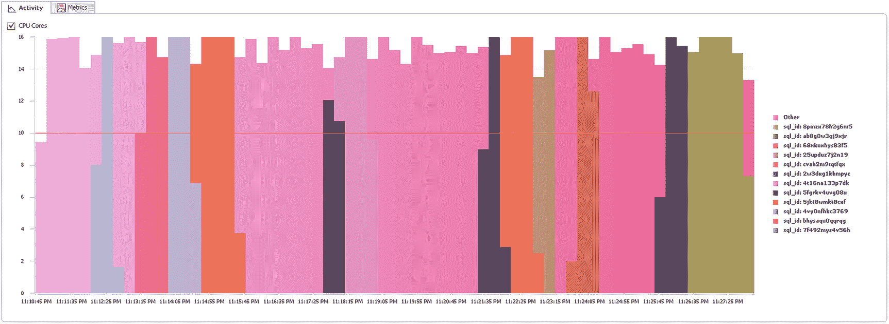

CPU 核心活动的图示。垂直的平行色带对应十二个 sql id 和其他活动。

图 12-1
并行处理大型表，一次一个分区

请注意上图中顶部的锯齿状边缘。该过程中每条 SQL 语句都请求了 16 度的并行度。然而，很多时候活跃的 SQL 会话数少于 16。代码运行了 10 分钟，如果报告能放大更多，我们会看到许多波峰和波谷。

将图 12-1 与图 12-2 对比，后者显示了用一条语句统计整个表时的 SQL 监控活动报告。这张图更“无聊”，但在此情况下，无聊是好事。Oracle 正在专注地做好一件事——平均活跃会话数几乎总是 16。几乎没有任何时间浪费在进程的扩缩容上。当我们把整个工作交给一条语句，并让 Oracle 决定如何分配工作时，进程运行得更快。

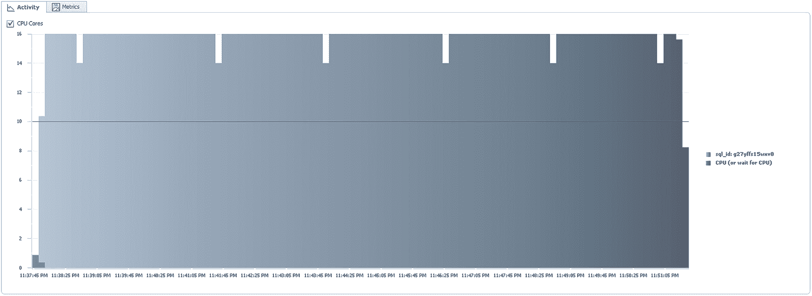

CPU 核心活动的片段。sql id 和 CPU 活动显示为平行的灰色带，时间不同。红线标记在 10 的水平。

图 12-2
用一条语句并行处理大型表

## 阅读和调试大型 SQL 语句

大型 SQL 语句的规模和结构最初可能具有挑战性。但是，通过良好的风格、一个 IDE 和实践，我们可以快速将任何代码解析为可读的块。

### 由内向外

习惯 Oracle SQL 从最深层的内联视图开始执行的方式需要时间和努力。这种由内向外的流程与每个程序员习惯的传统自上而下的流程不同。

例如，让我们再次查看第 6 章大型示例背后的代码。但这次我们将专注于查询的*形状*，而不是代码本身。该查询找到了每年使用的前三名火箭燃料。查询被分解为六个步骤，使用了内联视图、连接、条件、分组、排序和分析函数。如果我们剥离代码，只看注释，这些注释就讲述了查询的故事：

```
--每年使用的前 3 名燃料。
--
--#6：仅选择前 N 个。
--#5：对燃料计数进行排名。
--#4：每年燃料使用计数。
--#1：轨道和深空发射。
--#2：运载火箭发动机
--#3：发动机燃料
```

我在示例中有点取巧，为每个内联视图添加了编号注释。除非代码特别复杂，我通常不会加数字。在本例中，这些数字对于教授如何可视化内联视图的流程很有用。

没有那些数字时，缩进是理解代码结构的关键。我们不是使用 Python，不是*必须*缩进，但不缩进会让人抓狂。

最终，我们将能够轻松阅读这些嵌套结构。一开始很难，但我们需要拥抱这些递归结构的力量。我们无法现实地编写只使用一个子查询并自上而下流动的 SQL 代码；如果我们一次性连接所有表，最终会得到一团乱麻般的代码。我们也无法使用公用表表达式（CTE）来强制自上而下的结构。CTE 对于避免重复很有用，但除此之外，它们通过增加上下文和使调试更困难，而使我们的语句变得更复杂。

无论如何，我们需要学习这种由内向外的结构，以便理解执行计划。例如，图 12-3 是第 6 章示例代码的执行计划。就像内联视图一样，我们从最深的缩进层级开始，然后在该层级内自上而下阅读。然后我们向外移动一层并重复。

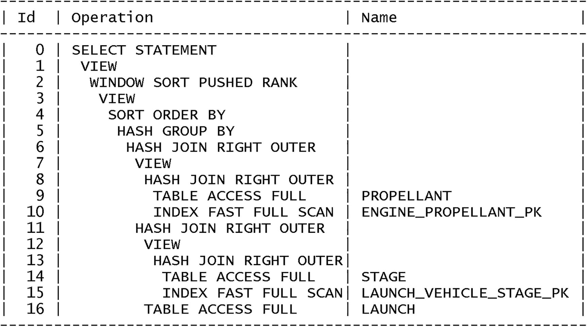

执行计划表格有 3 列和 17 行。它代表了 Id、Operation 和 Name。

图 12-3
执行计划示例

您不需要理解前面执行计划中的所有操作；只需观察执行计划的形状，并注意它与本节开头注释大纲的形状是多么相似。当我们阅读嵌套的内联视图时，我们理解 SQL 语句的方式类似于优化器的方式。


### 浏览内联视图

通过嵌套视图、正确的缩进以及将括号单独成行（有时称为艾尔曼风格），我们可以轻松地浏览代码，并高亮显示我们只想运行的内联视图。无需更改任何代码，我们就能快速调试大部分大型 SQL 语句。

`图 12-4` 展示了我们如何高亮并运行前三个内联视图。甚至不需要尝试去阅读代码；文字太小，无论如何也不重要。只需专注于高亮选中部分的*形状*。同时，请注意在每次执行后，我们如何在 IDE 窗口底部看到结果集。

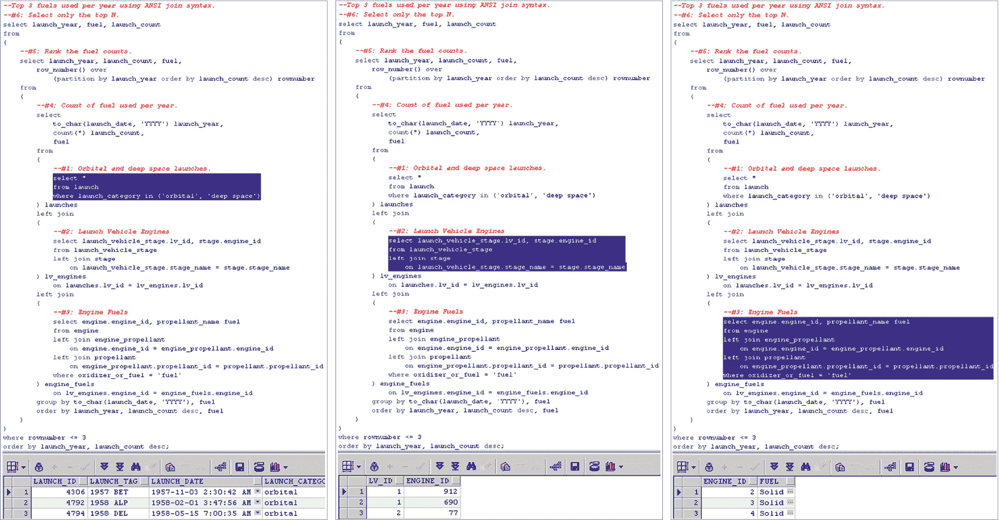

三个代码片段，每个底部有一个表格，代表了对前三个内联视图的高亮和运行。启动、运载火箭阶段、发动机。

`图 12-4`

通过运行前三个内联视图来调试第 `6` 章中的示例

这种调试方式比传统的命令式调试更简单、更强大。我们不需要为了调试而编译代码，不需要另一个界面来单步执行代码，并且我们可以在每个层级检查整个*数据集*，而不仅仅是几个标量值。找出前三个内联视图中的任何问题都将是轻而易举的。

运行了最内层的内联视图后，我们可以开始组合内联视图并生成更高级别的结果集。`图 12-5` 展示了我们现在如何选择内联视图的*组*，并沿着层次结构向上移动。再次强调，不要尝试阅读代码；只需查看高亮部分的形状。在每一个额外的层级，我们都能看到数据被组合和转换。使用任何现代 IDE，一次查看海量数据都是轻而易举的事，这使得调试简单得多。

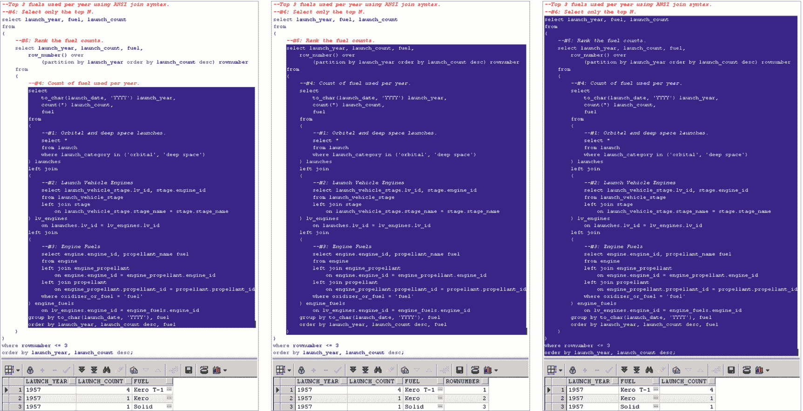

三个代码片段，每个底部有一个表格，说明了内联视图组的选择和层次结构的向上移动。

`图 12-5`

通过运行最后三个内联视图来调试第 `6` 章中的示例

`图 12-4` 和 `图 12-5` 只是运行了一个预先构建好的查询。我们可以轻松地修改并重新运行查询的任何层级，并观察这种变化如何影响结果。例如，我们可能想以更细的粒度运行查询，只专注于一个问题行。为了缩小调试范围，我们可能会在第一个内联视图中添加一个条件，如 `LAUNCH_ID = 1`。

由于每个高亮块都是独立的，我们可以用任何关系型数据源替换内联视图。我们可以调整内联视图代码以添加更多或更少的行，完全重写查询，或者用视图替换它。我们甚至可以通过返回集合的 `PL/SQL` 表函数来程序化地生成源数据。（该高级技术在第 `21` 章中描述。）

通过将一个内联视图改为以 `SELECT *` 开头，我们可以轻松查看未被投影的列。在查询的顶层使用 `SELECT *` 是个坏主意——我们不想返回超出需要的数据。但在某个嵌套的内联视图中使用 `SELECT *` 可以让调试更容易。

## 总结

给新程序员的最佳建议是：你知道的越少，你应该做的就越少。从小处着手，而不是试图一次性构建所有东西，最终导致令人困惑的大量错误。这个建议是“快速失败”的一个微小版本。嵌套的内联视图帮助我们从小处着手。最庞大的查询也是从一个简单的 `SELECT * FROM SOME_TABLE` 开始的。

不幸的是，对于 SQL，太多的开发者始于小，终于小。但你现在拥有了能力、环境、知识和风格，可以开始编写越来越大的 SQL 语句。开始在你舒适区之外编程。尝试用 SQL 构建那些看起来可能太复杂，甚至是个坏主意的东西。

在尝试构建大型 SQL 语句时，你肯定会遇到问题。大型 SQL 语句会带来性能风险，并需要一种新的阅读和调试方式。但如果你不放弃，你肯定能解决其中的大部分问题，并创建出更快、更易于使用的 SQL 语句。

# 13. 编写优美的 SQL 语句

关于编程风格，最重要的是拥有风格。这个主观且充满观点的章节展示了传统的 SQL 风格如何可能阻碍我们实现 Oracle SQL 的真正潜力。

美在观者眼中，但我们的美感应该基于合理的原则。太多开发者将所有时间都埋头编码，而没有停下来问一些重要的元问题。我们应该偶尔审视我们的代码，问自己：“*为什么*这段代码看起来不错？”

让我们从一个具体的例子开始。以下查询统计每个发射机构的轨道和深空发射次数。一次发射可能涉及多个负责机构，因此我们需要使用桥接表 `LAUNCH_AGENCY` 来连接 `LAUNCH` 和 `ORGANIZATION`。这个查询是我偏好的风格，也是本书通篇使用的风格：

```
-- 我偏好的 SQL 编程风格。
-- 拥有最多轨道和深空发射次数的机构。
select organization.org_name, count(*) launch_count
from launch
join launch_agency
on launch.launch_id = launch_agency.launch_id
join organization
on launch_agency.agency_org_code = organization.org_code
where launch.launch_category in ('deep space', 'orbital')
group by organization.org_name
order by launch_count desc, org_name;
ORG_NAME                                        LAUNCH_COUNT
---------------------------------------------   ------------
Strategic Rocket Forces                                 1543
Upravleniye Nachalnika Kosmicheskikh Sredstv             905
National Aeronautics and Space Administration            470
...
```

以下查询返回与前一个查询相同的结果，但使用更传统的 SQL 编程风格编写：

```
-- 传统的 SQL 编程风格。
-- 拥有最多轨道和深空发射次数的机构。
SELECT o.org_name, COUNT(*) launch_count
FROM launch l, launch_agency la, organization o
WHERE l.launch_id = la.launch_id
AND la.agency_org_code = o.org_code
AND l.launch_category IN ('deep space', 'orbital')
GROUP BY o.org_name
ORDER BY launch_count DESC, o.org_name;
```

本章的其余部分将比较和对比前面两个示例中使用的风格。无论我们对这些风格的看法如何，有一个风格选择是我们都能认同的：尽可能多地使用 SQL。如果我们将前面的查询用命令式的、逐行的逻辑重写，代码会更慢、更复杂。

我们不仅仅是为了让 SQL 看起来视觉上愉悦。编程风格的真正目的是降低代码的复杂度并提高其可读性。当我们内化了简洁性和可读性这些目标之后，我们对什么是优美 SQL 的看法，就应该反映一个追求更优代码的客观目标。

## 如何衡量代码复杂度

我们的编程风格应该降低程序的复杂度，从而提高可读性。但我们如何衡量代码的复杂度呢？编程本身已经足够困难了，而尝试对我们程序进行正式的分类和度量则更为艰难。

我们没有完美的方法来衡量代码，但这并不意味着我们不能对自己的代码进行推理。在代码度量谱系的一端，我们有像`圈复杂度`这样复杂的度量标准，它计算程序中的路径数量。这些高级度量标准是针对命令式编程语言设计的，对 SQL 帮助不大。在谱系的另一端，我们有一些简单的度量方法，比如比较程序的字符数量。

在实践中，大多数 SQL 开发人员通过计算字符数来比较程序的复杂度——这是一个错误。字符对`编译器`而言是代码的原子单位，但我们只关心对`人类`而言代码的原子单位。如果我们担心的是人类的理解，那么`单词`的数量比字符的数量要有意义得多。

值得简要讨论一下单词的重要性，尽管我们都凭直觉理解这个想法。我们用单词思考——记住一个单词比记住一串随机字符要容易。我们按单词阅读——除非是遇到生词，我们不会去读出每个字符。我们按单词打字——盲打打字员记忆的是整个单词，而不是单个字符。一个好的编程风格应该最小化单词的数量，而忽略字符的数量。

仅仅关注单词数量自然引出了接下来的两条规则——避免不必要的别名以及避免缩写。

## 避免不必要的别名

除非有充分的理由，我们不应创建别名。有时别名是必需的，但大多数别名是可选的。为列、表达式、内联视图或表引用创建别名是一种权衡；别名可以让我们创建更有意义的名称，但别名也创造了更多的变量。

显然，很多时候重命名事物是有帮助的。我们当然希望为表达式使用别名。我们可以用双引号引用该表达式，但带引号的标识符使用起来很麻烦。当我们返回两个同名的不同列时，我们显然希望至少将其中一个的名称改为不同的名称。当我们进行自连接时，我们需要至少给表的一个实例起一个不同的名字。例如，我们可能使用相同的名称但添加 `_PARENT` 或 `_CHILD` 这样的后缀。XML、JSON 和对象关系类型可能需要一个别名来访问对象内部的值。而内联视图值得一个好别名，尤其是当内联视图像表一样被连接在一起时。

但我们绝不能仅仅为了节省几个字符而创建别名。单字母别名的优势微不足道，节省几个字节或几秒钟的打字时间无关紧要。缺点远大于优点。添加不必要的别名会增加更多的变量，并消耗最宝贵的资源——开发人员的短期记忆。如前一节所述，重要的是我们 SQL 语句中的`单词`数量，而不是字符数量。

例如，我们绝不应该在以下示例中使用这种无意义的别名：

```
--无别名。
select launch.launch_date from launch;
--有别名。
select l.launch_date from launch l;
```

如果我们真的在用空间数据集创建程序，我们会非常熟悉 `LAUNCH` 表。在打了上百遍之后，输入 `LAUNCH` 这个词会变成下意识的动作，和输入字母 `l` 一样快。在上面这个简单例子中，别名还不算太糟。但这种别名之所以可以容忍，仅仅因为例子很简单。想象一下，如果一个 SQL 语句中有很多其他表，分散在几十行之外；我们的短期记忆会被无用的单字母变量塞满，我们将不得不花费不小的精力去记住别名 `l` 代表什么。

不必要的别名减少了字符数，但增加了单词数和变量数。我们会很快习惯最常用的表名和列名。我们应该利用这种熟悉感，并在可能时重复使用相同的名称。没有充分的理由，绝不创建新的变量。

## 前缀和后缀

命名是件难事，甚至用正确的名称来指代事物也可能很困难。我们应该为我们的对象和变量名称添加前缀和后缀吗？当我们引用对象时，我们应该加上模式名或表名作为前缀吗？本节没有严格的规则，只讨论相关的权衡并建议保持灵活。

### SQL 对象和列名

当我们创建 SQL 对象和列时，应避免在名称中添加简单的数据类型信息。例如，避免在表名前添加 `TBL_`，或在列名后添加 `_NUM`。在名称中添加简单类型信息被称为匈牙利命名法，在大多数编程语言中通常被认为是个坏主意。^(²⁹)

对象类型和列数据类型很容易查找，我们不需要持续的提醒。SQL 是一种具有类英语语法的高级语言；许多含义可以嵌入到简单的 SQL 语句中，而添加一些琐碎的前缀和后缀会分散我们对查询真正含义的注意力。与过程语言中的变量数量相比，我们需要记忆的 SQL 对象和列名要少得多，所以值得花时间让这些名称易于阅读。

对于 SQL 对象和列名，类型信息无论如何只是故事中非常微小的一部分。我们持久化的数据无法通过简单的前缀或后缀来充分解释。要了解完整情况，我们需要查看关系、检查约束、表和列的注释以及数据本身。久而久之，我们会熟悉这些名称，并了解它们的真实含义。

另一方面，我偶尔也会打破自己的规则，在视图名称末尾添加 `_VW`。很多时候，一个视图和一个表几乎完全相同，但这两个对象不能共享相同的名称。

对于避免向变量名称添加类型信息这条规则，还有另一个更有趣的例外。匈牙利命名法的初衷是向变量添加*有用的*类型信息，这会使代码中的错误更加明显。在每个列名前加上表名前缀，有助于使我们的连接和表达式更容易理解。如果前面的例子采用这种风格，即 `LAUNCH` 中的每一列都加上 `LAUNCH_` 前缀，`LAUNCH_AGENCY` 中的每一列都加上 `LAUNCH_AGENCY_` 前缀，那么这两个表之间的连接条件将是 `ON LAUNCH_ID = LAUNCH_AGENCY_LAUNCH_ID`。

使用一致且唯一的前缀，可以非常清楚地显示每个连接和表达式中的列来自哪个表。这种方法缺点在于，名称会很快变得荒谬可笑。在这种情况下，我会打破我的另一条规则，允许使用缩写；如果我们被迫为每个表一致地使用一个唯一的缩写，这些缩写对开发人员来说很快就会获得真正的意义。就个人而言，我认为对于像空间数据集这样简单的模式，这种命名系统没有帮助。但我见过这种系统在一个有数百个表的模式中运行良好。这里没有客观答案——只有权衡取舍。

### PL/SQL 变量名

在 PL/SQL 中，前缀和后缀往往比在 SQL 中更有用。PL/SQL 变量不像 SQL 名称那样具有丰富的上下文历史，它们通常只作用于一小段代码。在这些小的代码块中，变量通常只服务于一个特定的、小范围的目的，不像表名或列名那样包含丰富的上下文信息。前缀和后缀可以创建一些**微型契约**，使变量的预期用途一目了然。对于大型 PL/SQL 系统，制定命名规范以帮助区分常量与非常量变量、全局与局部变量、输入或输出参数等，是很常见的做法。

当变量包含与列相同的信息时，前缀和后缀在 PL/SQL 中尤其有用。虽然很想给这样的 PL/SQL 变量起一个与列完全相同的名字，但名称重复会导致歧义。

例如，如果一个 PL/SQL 函数有一个名为 `LAUNCH_ID` 的参数，该函数内部的 SQL 语句可能会包含一个有歧义的表达式，如 `WHERE LAUNCH.LAUNCH_ID = LAUNCH_ID`。第二个 `LAUNCH_ID` 是来自表的值还是来自参数的值？为了避免这种情况，我会用 `P_`（代表“parameter”）作为参数的前缀，用 `V_`（代表“variable”）作为局部变量的前缀。使用这样的命名方案后，有歧义的表达式就会被改为无歧义的表达式，例如 `WHERE LAUNCH.LAUNCH_ID = P_LAUNCH_ID`。

### 引用表和列

在引用表和列时，我们有几种选择。我们应该在表名前面加上模式名吗？我们应该在列名前面加上表名或别名吗？下面的例子展示了一个简单查询的几种不同选项。正确的风格取决于上下文：

```sql
-- 四种运行相同查询的方式。
select launch_date from launch;
select launch.launch_date from launch;
select launch.launch_date from space.launch;
select space.launch.launch_date from space.launch;
```

本书中的示例不引用模式名。太空数据集默认安装在 `SPACE` 模式下，但在每个查询中都添加该模式名并没有太大价值。当示例引用 `SATELLITE` 而不是 `SPACE.SATELLITE` 时，基本没有混淆的风险。

这里存在可靠性与可读性之间的权衡。**可能**我们的模式中已经有一个名为 `SATELLITE` 的表，我们可能会将那个表与 `SPACE.SATELLITE` 混淆。或者将来也可能添加一个同名的表。但这个微小的风险似乎不值得我们在示例中增加数百个额外的词。

如果我们经常查询另一个模式中的表，可以创建同义词来隐藏模式名。或者我们可以用以下命令更改我们的默认模式：

```sql
-- 默认为 SPACE 模式。
alter session set current_schema=space;
```

本书中的示例仅在表名不明显时才将表名放在列名前面。了解列的来源固然好，但在很多情况下，来源表是显而易见的。

例如，在使用太空数据集一段时间后，很明显 `LAUNCH_DATE` 来自 `LAUNCH` 表。但“显而易见”是主观的。为**每个**列都加上表名前缀会更加一致，可能在我们不熟悉代码时有所帮助，但所有这些前缀会使 SQL 语句变得杂乱。**不为任何**列加前缀会使代码更简短，对于非常熟悉数据模型的人来说可能看起来更好，但可能会让其他开发者感到困惑。我们需要找到恰当的平衡，并根据上下文调整我们的风格。

## 避免使用缩写

我们应该避免使用不常见的缩写，而应使用词语的完整形式。缩写使用的字符更少，但产生的词数相同。代码的复杂度用词数来衡量比用字符数更好，而且并非所有词都是等价的。

不常见的缩写比完整的词更难输入也更难阅读。“不常见”的定义是主观的，取决于上下文。如果我们项目中的每个程序员都能立即认出一个缩写，那么我们应该使用它。但我们不应该在每个 SQL 语句中都发明新的缩写。

举一个简单的例子，想象一下如果我们的数据集对所有东西都使用缩写：

```sql
-- 使用缩写。（此代码无法工作。）
select * from lnch;
-- 不使用缩写。
select * from launch;
```

前面两条语句中的第一条更简短，但可读性更差。缩写 `LNCH` 只需要读者进行极少量的思考——但为什么还要让他们多想呢？阅读完整的词无需思考，能让读者将所有注意力集中在更重要的事情上。

当然，有些时候缩写是有用或必要的。但是，从所有变量名中去除元音的黑客倾向并无益处。不使用元音写词，从技术上讲，我们甚至不再使用字母表；只使用辅音的书写系统被称为辅音音素文字。辅音音素文字在某些语言中可以运作良好，但在英语或 SQL 中则不行。如果我们坚持什么都缩写，那就是在与数千年的语言进化背道而驰。

## 使用制表符实现左对齐

制表符与空格之争是技术领域的古老圣战，但作为高级 SQL 开发者，值得重新审视这些论点。对于构建大型 SQL 语句而言，使用左对齐的制表符而非右对齐的空格，能帮助我们更快编程并聚焦于 SQL 语句的关键部分。

在大多数编程语言中，制表符与空格的争论毫无意义——IDE 可以自动缩并轻松转换二者。遗憾的是，SQL 开发者并不总能享受这种自动格式化。如下一节所述，SQL 自动格式化并非总是可行方案。而且 SQL 常被用于管理任务，此时我们往往无法使用 IDE。当使用动态 SQL（代码以字符串形式存储）时，我们只能手动调整代码格式。

我们需要在没有`花哨 IDE`或`自动格式化工具`辅助的情况下，相对快速地编写 SQL。我们应该无需花费大量时间逐个添加空格，就能产出美观的代码。虽然某些特殊场合需要 SQL 格外精美，值得花时间精确调整每个空格位置，但对大多数代码而言，“完美是足够好的敌人”。

编程并非竞赛，但在创建 SQL 时使用制表符能帮助我们更快编码、更清晰地思考代码结构。通过制表符，我们可以快速让代码达到“足够好”的状态——实现缩进和左对齐，而无需尝试用右对齐空格使代码看起来完美。

讨论空白字符与对齐时，小型示例具有误导性。对于像下面这样的简单 SQL 语句，右对齐关键字看起来与左对齐同样美观。右对齐甚至能在关键字后形成优美的空白河流：

```
--左对齐
select *
from dual
where 1 = 1;
--用空格右对齐
SELECT *
FROM dual
WHERE 1 = 1;
```

但前述右对齐样式无法扩展。当我们对比更真实的 SQL 语句时（例如第 6 章的大型示例），传统 SQL 样式的右对齐会迅速崩溃。传统右对齐样式在查询仅有一个层级时表现良好。但一旦开始嵌套内联视图，我们就需要快速识别当前所处层级。使用左对齐制表符，我们可以更轻松地浏览内联视图。

对于大型查询，我们不需要视觉辅助来识别`SELECT`和`FROM`等关键字。我们需要的是识别内联视图的视觉辅助。图 13-1 展示了第 6 章的示例代码，并对比了左对齐制表符与传统右对齐空格的效果。无需细读代码——只需快速扫描图像感受查询的整体形态。为强调查询结构，图 13-1 仅显示每行的第一个单词。

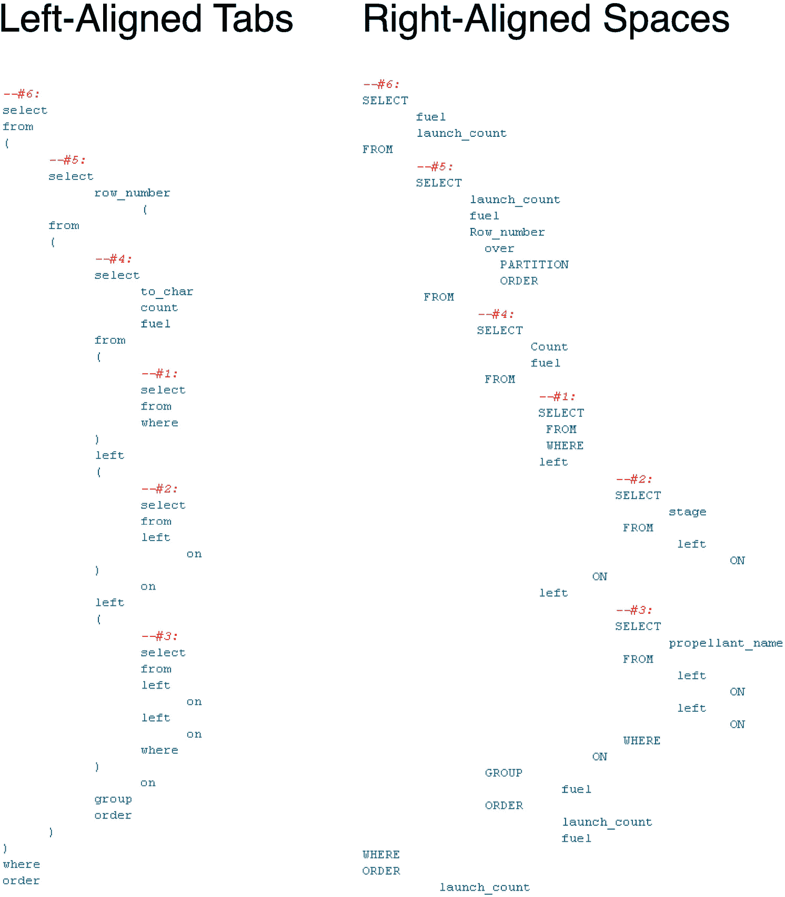

图 13-1
左对齐制表符与右对齐空格对比

在上图中，左对齐制表符版本比右对齐空格版本的结构更简洁准确。左对齐制表符版本为每个内联视图括号独占一行，并对齐这些括号的缩进。这种样式称为“`奥尔曼风格`”，它使内联视图更易阅读、编写和调试。

此外，若仔细观察右对齐空格样式，会发现其缩进存在错误。内联视图#1、#2 和#3 本应处于同一缩进层级，但右对齐空格版本错误地让#1 看起来像是#2 和#3 的父级。所有流行的 SQL 代码格式化工具都犯了同样的严重错误。缩进本应用于表达代码中的父子关系，仅仅作为首行代码并不意味着它是下一行代码的父级。

左对齐制表符样式还极大简化了内联视图的复制粘贴操作。高亮和复制内联视图变得简单，因为它们不与无关代码共享行。粘贴和格式化内联视图同样轻松——我们只需高亮后按`Tab`或`Shift+Tab`进行缩进/反缩进。相比之下，使用传统右对齐空格添加内联视图时，我们要么修改多个独立空格，要么需要重新格式化整个语句。我们的编码风格应当支持在几秒内复制代码片段。

制表符的主要缺点是尺寸未定义。当编写电子邮件、帖子或书籍时，为保险起见，可能需要在完成时将制表符转换为空格。

我们追求的是能帮助聚焦现实 SQL 语句重点的样式，而非固守传统习惯。左对齐制表符让我们更轻松地阅读和编写内联视图。


## 避免依赖代码格式化工具

我们不应依赖自动化的代码格式化工具、美化器或漂亮打印工具。虽然我欣赏自动化那种毫无灵魂的效率，但我们仍需保持手工打造代码的能力。自动代码格式化工具对大多数编程语言都表现良好，但对 Oracle SQL 却始终难以稳定胜任。

代码格式化工具处理 Oracle SQL 时遇到困难，是因为这门语言过于复杂。大多数编程语言通过库来增加功能，而 SQL 则倾向于通过新增语法来增加功能。庞大的语法体系使得自动格式化代码变得困难。

一个能解决 99%情况的代码格式化工具是不够的。当我们的 SQL 语句变得庞大并使用高级特性时——而这恰恰是最需要代码格式化的时刻——SQL 代码格式化工具最有可能失败。

我们并非总能使用集成开发环境。如果我们在服务器上进行管理工作或帮助同事，可能就无法使用我们喜爱的 IDE。而当我们为了动态 SQL 在字符串中构建 SQL 时，没有任何代码格式化工具能帮助我们。代码格式化工具要么无法识别字符串中的 SQL，要么该字符串在运行时（当我们拥有了所有变量时）之前都是无效的 SQL。正如第 14 章所讨论的，即使是生成的动态 SQL 也应该看起来美观。

SQL 代码格式化工具还侧重于小型、简单的代码。如前一节所示，SQL 代码格式化工具专注于显而易见的关键字，而非正确地为重要的内联视图添加间距和对齐。

有时我们确实关心精确的间距，但只有*我们自己*才能决定如何设置这些间距。大型 SQL 语句经常需要重复冗长的列列表。我们可能有很多不关心的列，同时有一个重要的列想要突出显示。将那个重要的列或表达式单独放在一行，有助于向读者强调其重要性。

例如，我们可能需要投影 26 列，但只有一列在表达式中被修改。我们不想为每一列浪费 26 个空行，但也不希望把所有列挤在一行而错过了重要部分。以下代码为重要的表达式使用单独一行，而将其他所有内容压缩在一个简单的列表中。如果我们想利用空间来强调重要内容，就必须手动设置间距：

```
--用空格来突出重点。
select
a,b,c,d,e,f,g,h,i,j,k,l,m,
n+1 n,
o,p,q,r,s,t,u,v,w,x,y,z
from some_table;
```

我们应该禁用 IDE 中在编译时自动格式化代码的选项。即使我们有编码标准，也可能有人出于充分的理由而打破该标准。幸运的是，一些 IDE 允许我们为特定的代码块禁用自动代码格式化。

SQL 开发者将面临许多需要手工构建代码的情况。我们必须能够快速编写代码，而不依赖于特定的代码格式化工具。

## 小写字母

SQL 应该像所有现代编程语言一样，主要用小写字母编写。小写代码看起来更好，也更易阅读。

大写关键字与较老的编程语言相关联，例如汇编语言、Fortran 和 COBOL。SQL 是一门古老的语言，这有其优势，但让我们的代码显得过时也有负面含义。几十年前，使用大写有很好的技术原因，但这些原因如今已不再成立。

当今的文化惯例是使用小写进行编程。而且小写，或混合大小写，显然是正常写作的典型选择。（有一种共识认为小写文字比大写文字更容易阅读。但为何小写更易读是有争议的，我不确定这些研究是否适用于编程语言中使用的等宽字体。）

但大写字母当然仍有其用武之地。当将小型 SQL 语句嵌入其他语言时，使用大写有助于将 SQL 与其他语言区分开来。大写在撰写电子邮件或帖子时也很有用。大写还可以帮助突出我们 PL/SQL 程序中的某些部分，例如全局常量。

我们查看代码的大部分时间是在 IDE 中，这时语法高亮比使用大小写来识别关键字更重要。使用小写并没有巨大的优势，但如果它看起来更好、更易读、更容易输入，我们不妨放弃大写。

## 总结

本书中最具争议的观点到此结束，我现在要从讲台上下来了。本书许多不同部分都包含了风格提示和技巧，并在“附录 A：SQL 风格指南速查表”中进行了快速总结。

编写 SQL，特别是编写大型 SQL，可以从非传统的编程风格中受益。我们可以通过避免不必要的别名和不常见的缩写来降低代码的复杂性。我们的编程风格应帮助代码强调重点，这通常是内联视图之间的关系。使用左对齐的制表符可以帮助我们阅读和编写嵌套的内联视图。自动代码格式化工具最终会让我们失望，因此我们不如习惯于手动调整代码的风格。使用小写字母可以让我们的代码看起来更现代，也更易读。

我希望您愿意至少重新考虑一些编写 SQL 时使用的传统“最佳实践”。无论我们偏爱哪种风格，理解我们偏爱该风格的原因都是有帮助的。在实践中，我们并非总能按自己想要的方式编写代码，我们必须愿意妥协。但拥有一个理想化的风格并努力编写优美的 SQL 语句是有益的。

脚注 1

# 14. 更多地结合基础动态 SQL 使用 SQL

动态 SQL 是一个强大的工具，帮助我们充分利用 Oracle SQL。通过动态 SQL，我们可以在运行时构建代码。在代码中编写代码具有挑战性，但也提供了许多机会。

首先，我们需要理解何时*必须*使用动态 SQL，何时*想要*使用动态 SQL，以及何时*不想*使用动态 SQL。动态 SQL 的基本功能很简单，但我们必须小心以保持性能和安全。生成源代码是棘手的，我们需要使用特定的编程风格使动态代码易于管理。当我们熟练掌握动态 SQL 后，可以将其应用于几种复杂场景，并显著提高程序的清晰度和性能。

本章仅简要介绍动态 SQL。更高级、更强大的动态 SQL 解决方案将在第 20 章和第 21 章中描述。

## 何时使用动态 SQL

动态 SQL 通常用于四种不同的场景：运行 DDL 命令、当对象或属性或结构直到运行时才知晓时、简化权限以及构建规则引擎。同样重要的是，当存在更好的替代方案时，不要使用动态 SQL。


### 运行动态数据定义语言

动态 SQL 最常见的用途是运行 DDL 命令，因为 PL/SQL 本身不支持静态 DDL。以下示例展示了如何将 DDL 作为字符串执行，而不是硬编码到 PL/SQL 中：

```sql
-- 有效的 PL/SQL 块，使用动态 SQL 压缩表。
begin
execute immediate 'alter table launch move compress online';
end;
/
-- 无效的 PL/SQL 块，试图使用静态 SQL 压缩表。
-- 此块将引发 PL/SQL 编译错误。
begin
alter table launch move compress online;
end;
/
```

最初，PL/SQL 不支持静态 DDL 感觉不太对，尤其是 PL/SQL 和 SQL 集成得如此紧密。但在实践中，这个限制并不重要，因为执行动态 SQL 只需要几个额外的关键字。我们可能也不希望在 PL/SQL 中使用静态 DDL，因为大多数 DDL 命令是破坏性的，并且需要重新编译相关的 PL/SQL 代码。如果一个过程直接引用一个对象然后修改该对象，该过程将不得不重新编译自身。Oracle 可以不断解析 SQL 语句，但在代码运行时重新编译过程性代码是个坏主意。

有几个动态 SQL 陷阱我们必须避免。虽然 DDL 必须始终使用动态 SQL，但 DML 应该很少使用动态 SQL。当静态代码工作良好时，我们不想使用动态代码。此外，仅仅因为我们能在运行时管理对象，并不意味着我们*应该*在运行时管理对象。在其他数据库中，频繁删除和重建表来保存中间值可能很常见，但这在 Oracle 中并非最佳实践。在 Oracle 中，我们应该将中间值保存在内联视图、PL/SQL 集合或只创建一次的全局临时表中。

### 运行时才确定

动态 SQL 的第二大常见用途是，直到运行时我们才知道 SQL 语句的对象、属性或结构。动态 SQL 适用于任何字符串，因此我们可以改变语句的程度没有限制。我们可以交换表名、添加条件、更改列，或完全重建整个语句。

#### 动态统计行数

例如，让我们创建一个函数来统计任何表中的行数。表名被传递给函数，然后连接到 SQL 语句字符串中。执行查询，结果存储在一个变量中，然后返回该变量：

```sql
-- 使用动态 SQL 统计表中的行数。
create or replace function get_count(p_table_name varchar2)
return number authid current_user is
v_count number;
begin
execute immediate
'select count(*) from '||
dbms_assert.sql_object_name(p_table_name)
into v_count;
return v_count;
end;
/
select get_count('LAUNCH') row_count from dual;
ROW_COUNT
```

请注意前面的代码如何调用函数`DBMS_ASSERT.SQL_OBJECT_NAME()`。此函数确保参数是一个与对象名称匹配的简单字符串。如果我们尝试使用危险的字符串调用函数，如`get_count('LAUNCH; DROP TABLE STUDENTS;')`，`DBMS_ASSERT`包将引发异常“ORA-44002: invalid object name”。`DBMS_ASSERT`包包含几个可以帮助我们避免 SQL 注入的函数。我们必须始终小心，不让未经授权的用户运行任意代码。

#### 动态 WHERE 子句

动态 SQL 的另一个流行用途是，直到运行时我们才知道`WHERE`子句的结构。当我们基于表单输入的值构建 SQL 语句时，可能会发生这种情况。使用表单中每个元素的静态查询可能会充斥着复合条件，如`COLUMN1 = P_VALUE1 OR P_VALUE1 IS NULL`。最终的查询会变得庞大，并且更可能出现性能问题。如果动态生成最终查询以仅包含相关条件，可能会更简单、更快捷。

即使我们在编译时知道依赖的对象，我们可能仍然希望避免创建静态依赖。例如，数据库链接会创建复杂的依赖关系，在一个数据库上更改基础对象可能导致另一个数据库中出现诸如“ORA-04062: timestamp of function "OWNER.OBJECT" has been changed”的错误。动态运行代码可以帮助避免与远程数据库相关的奇怪编译问题。

### 简化权限

动态 SQL 一个不太为人知的优点是简化权限。在编译 PL/SQL 对象时，PL/SQL 对象的所有者必须在编译时直接访问所有静态引用的对象。不幸的是，这种访问权限不能通过角色授予。权限必须直接授予 PL/SQL 对象的所有者。

例如，想象一下如果我们更改前面的函数，并硬编码一个对`DBA_TABLES`的静态引用。即使我们的用户拥有`DBA`角色，该函数也会编译失败，错误为“ORA-00942: table or view does not exist”。发生此错误是因为访问权限仅通过*角色*授予，而不是直接授予*用户*。

我们的第一反应可能是通过授予对`DBA_TABLES`视图的直接访问权限来解决这个问题。直接授权可以奏效，但当我们的权限变得一团糟，审计员询问为什么我们有这么多单独的授权时，我们可能会后悔。

更好的解决方法是使用动态 SQL，这也是前面函数已经使用的方式。子句`AUTHID CURRENT_USER`告诉 Oracle，当函数运行时，该函数可以使用调用该函数的用户的角色。只要我们有一个角色授予我们访问 DBA 视图的权限，我们就可以这样调用函数：

```sql
-- 使用动态 SQL 访问 DBA 视图。
select get_count('DBA_TABLES') row_count from dual;
ROW_COUNT
```

这段讨论已经偏离到复杂的 PL/SQL 主题，如定义者权限与调用者权限。需要记住的重要一点是，尽管动态 SQL 可能需要几个额外的关键字，但它可以简化我们的权限要求。在大多数组织中，添加几行代码比获得提升的权限更容易。

### 规则引擎

动态 SQL 可用于构建强大的规则引擎。规则引擎对于基于大量标准对索赔进行评分等任务很有帮助。许多医疗和保险系统都有数百条规则，其中许多包含简单重复的逻辑，例如`IF A AND B THEN 0`, `IF B OR C THEN 1`等。

SQL 是一种高级语言，具有类似英语的语法。如果我们仔细设置列和表达式，我们的 SQL 语句可以看起来惊人地接近我们的需求。与其将每条规则硬编码为查询，不如将规则存储在表中，然后动态生成 SQL 语句来实现这些规则。理想情况下，表中的规则可以由业务分析师验证或创建，无需任何编程知识。

在实践中，规则引擎很难做好。将动态代码存储在关系数据库中并不总是容易的。源代码和任何语言一样，本质上是分层的。Oracle 当然能够存储和操作分层数据，但 SQL 并不是解决困难分层问题的理想语言。虽然数据库当然能够包含简单的文本字符串，但代码版本控制最好还是使用版本控制软件。

是否要构建规则引擎是一个艰难的决定。如果我们确实决定在 Oracle 中构建规则引擎，那么我们绝对应该使用动态 SQL 作为我们引擎的基石。构建规则引擎可能很快就会陷入创建自定义编程语言的泥潭，所以我们希望尽可能靠近 SQL 和 PL/SQL。


## 何时不应使用动态 SQL

动态 SQL 适用于在运行时才知道查询*结构*的情况。不应仅仅因为在运行时才知道*值*而使用动态 SQL。如果只有值在运行时变化，那么绑定变量是更好的解决方案。

一个常见的误解是，动态 SQL 必然比常规 SQL 更慢、更不安全或更混乱。确实，动态编程带来了挑战，但它也提供了绝佳的机会。对动态 SQL 的病态恐惧可能导致巨大的反模式，并使我们错失使用 SQL 解决问题的良机。本章稍后将探讨如何通过正确的编程风格来驯服动态 SQL。

## 基本特性

动态 SQL 有很多选项，但我们的大多数程序只需要几个基本特性。我们必须决定使用哪个版本的动态 SQL，并理解其语法以及如何向 SQL 语句传入和传出信息。

Oracle 有两种不同的动态 SQL。在古老的 Oracle 版本中，动态 SQL 只能通过复杂的 PL/SQL 包 `DBMS_SQL` 来执行。现代版本的 Oracle 允许使用原生动态 SQL，它采用了更简单的 `EXECUTE IMMEDIATE` 和 `OPEN/FOR` 语法。原生动态 SQL 几乎总是最佳选择。原生动态 SQL 比 `DBMS_SQL` 更快且使用起来简单得多。有一些罕见的挑战需要 `DBMS_SQL`，这些将在第 20 章讨论。

正如我们在前面的示例中看到的，`EXECUTE IMMEDIATE` 易于使用——只需将语句作为字符串传递即可。但我们必须记住移除终止符。对于动态 SQL，语句不应以分号结尾。对于动态 PL/SQL，PL/SQL 块不应以正斜杠结尾。

与静态 SQL 一样，动态 SQL 语句的结果可以使用 `INTO` 赋值给变量。以下代码展示了一个简单的原生动态 SQL 示例：

```
--简单的 INTO 示例。
declare
  v_dummy varchar2(1);
begin
  execute immediate 'select dummy from dual'
    into v_dummy;
  dbms_output.put_line('Dummy: '||v_dummy);
end;
/
Dummy: X
```

如果返回多列，`INTO` 子句也可以包含一个逗号分隔的变量列表。如果 SQL 语句不是 `SELECT` 语句，只需省略 `INTO` 子句。可以使用 `BULK COLLECT` 和集合变量或动态 SQL 游标来捕获多行数据。但那些高级的 PL/SQL 特性此处不作讨论。需要记住的重要一点是，总有办法动态地执行任何语句。

## 为性能和安全使用绑定变量

尽管动态 SQL 执行的是拼接字符串，我们仍应利用绑定变量。绑定变量可以显著提升动态 SQL 的性能和安全性。

绑定变量是 SQL 语句中真实值的占位符。绑定变量让 Oracle 能够为不同的值重用相同的 SQL 语句，从而节省大量编译时间。

虽然绑定变量和动态 SQL 看起来是相反的，但它们仍可以一起使用。例如，以下代码使用字符串拼接来选择表名，但使用绑定变量来选择值：

```
--根据 LAUNCH_ID 统计 LAUNCH 或 SATELLITE 表的行数。
declare
  --（假设这些是参数）：
  p_launch_or_satellite varchar2(100) := 'LAUNCH';
  p_launch_id number := 4305;
  v_count number;
begin
  execute immediate
    '
    select count(*)
    from '||
    dbms_assert.sql_object_name(p_launch_or_satellite)||'
    where launch_id = :launch_id
    '
    into v_count
    using p_launch_id;
  dbms_output.put_line('Row count: '||v_count);
end;
/
Row count: 1
```

在前面的代码中，使用绑定变量显著减少了需要解析的 SQL 语句数量。可能需要多个已解析的语句来处理动态表名，但不会为每个 `LAUNCH_ID` 产生一个新语句。绑定变量不必消除解析；它们只需要减少解析。

绑定变量在 SQL 和 PL/SQL 中的工作方式略有不同。在动态 SQL 中，绑定变量按每次出现进行设置，无论绑定变量名称如何。在动态 PL/SQL 中，绑定变量按每个唯一的绑定变量名称设置一次。在下面的示例中，SQL 和 PL/SQL 代码都引用了绑定变量 `A` 两次。动态 SQL 代码需要两个输入值，而动态 PL/SQL 只需要一个输入值：

```
--SQL 需要为每个绑定变量提供变量。
--PL/SQL 只需为每个唯一的绑定变量提供变量。
declare
  v_count number;
begin
  execute immediate
    'select count(*) from dual where 1=:A and 1=:A'
    into v_count using 1,1;
  execute immediate
    '
    declare
      v_test1 number; v_test2 number;
    begin
      v_test1 := :A;  v_test2 := :A;
    end;
    ' using 1;
end;
/
```

比性能更重要的是，绑定变量可以让我们避免巨大的安全问题。如果我们允许不受信任的用户输入任意值，这些用户可能会改变我们 SQL 语句的含义。例如，想象一个程序有这样一段代码：`EXECUTE IMMEDIATE 'SELECT * FROM LAUNCH WHERE LAUNCH_ID = '||V_VALUE`。我们期望变量是一个数字，但如果变量是像 `'1 or 1=1'` 这样的字符串会发生什么？我们可以使用 `DBMS_ASSERT` 来检查值，但即使那个包也不如绑定变量安全。

从拼接的字符串值中“跳出”被称为 SQL 注入，这是最严重的安全漏洞之一。我们*绝不*允许不受信任的用户输入在动态 SQL 中运行。有很多狡猾的方法可以“逃出”变量。即使是数字和日期也不安全，因为可能通过更改会话并使用怪异的字符串作为数字和日期格式。

动态 SQL 是一个强大而绝妙的特性。但每次使用它时，我们都必须考虑其性能和安全影响。并且，我们使用了动态 SQL 并不意味着就不应再使用绑定变量。

## 如何简化字符串拼接

动态 SQL 可能会变得很丑陋。用代码构建代码已经够难了。除此之外，我们还必须处理字符串内部的字符串。为了充分利用动态 SQL，我们需要能够编写看起来体面的代码。有三种简单的技巧可以结合起来，使我们的动态 SQL 可读性无限提升：多行字符串、替代引号机制和模板。

### 多行字符串

Oracle 支持多行字符串，而且它们非常易于使用。现在仍然有不支持多行字符串的编程语言，许多开发者仍陷于拼接每一行的坏习惯中。

前面的代码示例使用了这个多行字符串：

```
'
declare
  v_test1 number; v_test2 number;
begin
  v_test1 := :A;  v_test2 := :A;
end;
'
```

如果没有多行字符串，我们就会留下这样的混乱：

```
'declare'                           ||chr(10)||
'   v_test1 number; v_test2 number;'||chr(10)||
'begin'                             ||chr(10)||
'   v_test1 := :A;  v_test2 := :A;' ||chr(10)||
'end;'
```

几乎没有任何理由要避免使用多行字符串，尽管行尾可能存在潜在的歧义。代码使用的是 ASCII 字符 10（换行符）、13（回车符）还是两者的组合？在实践中，行尾并不重要。代码的可读性比无关紧要的歧义更重要，因此我们应该尽可能多地使用多行字符串。


## 替代引号机制

如果我们只使用转义字符，在字符串中嵌入单引号会很麻烦。替代引号机制可以帮助我们编写更简洁的代码。

嵌入单引号最常见的方法是转义它们，即使用两个紧挨着的单引号。转义可能导致视觉上混乱的代码，如下所示：

```sql
--单引号示例。
select
'A'    无引号,
'A''B' 中间有引号,
'''A'  开头有引号,
''''   只有一个引号
from dual;
NO_QUOTE   QUOTE_IN_MIDDLE   QUOTE_AT_BEGINNING   ONLY_A_QUOTE
--------   ---------------   ------------------   ------------
A          A'B               'A                   '
```

前面的代码只是连接地狱的开始。当我们将 SQL 语句插入字符串或将 SQL 嵌套在 PL/SQL 中再放入字符串时，我们的代码很快就会变得令人厌恶。我个人可耻的记录是连续 12 个引号。

替代引号机制帮助我们避免连接问题。我们可以定义自己的分隔符，而不必担心转义字符。使用这种改进的语法，我们可以更轻松地将 SQL 语句复制粘贴到代码中。

要使用替代引号机制，以字母`Q`开头字符串，然后是一个单引号，接着是起始分隔符。如果起始分隔符是`[`、`(`、`<`或`{`之一，那么结束分隔符就是对应的`]`、`)`、`>`或`}`。对于其他分隔符，起始和结束字符是相同的。

以下示例使用了替代引号机制，并返回与转义字符版本相同的结果。这个例子演示了语法的工作原理，但乍一看，这个功能似乎朝着错误的方向迈出了一大步：

```sql
--替代引号机制示例。
select
q'[A]'   无引号,
q'[A''B]' 中间有引号,
q'(''A')'  开头有引号,
q'!'''!'   只有一个引号
from dual;
```

这是另一个我们可以从微不足道的例子中学到错误教训的情况。如果只有一个单引号，那么转义要简单得多。但是当我们复制粘贴代码作为字符串时，替代引号机制有着天壤之别。以下示例更现实地比较了转义与替代引号机制：

```sql
--转义字符。
begin
execute immediate
'
select ''A'' a from dual
';
end;
/
```

```sql
--自定义分隔符。
begin
execute immediate
q'[
select 'A' a from dual
]';
end;
/
```

使用替代引号机制，复制粘贴整块代码变得轻而易举。如果我们想在 IDE 中调试代码，我们可以简单地高亮并运行最内部的块。当我们使用转义时，我们必须手动更改 SQL 才能独立测试 SQL。

本节听起来可能像是语法糖，但替代引号机制更像是语法兴奋剂。如果没有编写清晰代码的能力，我们会避免使用动态 SQL，这也意味着我们会避免使用 SQL。

## 模板化

即使有多行字符串和替代引号机制，字符串连接仍然很丑陋。我们可以用一个简单的模板系统替换连接来提高代码的可读性。有模板库，但实际上我们只需要简单的变量名和`REPLACE`函数。

例如，假设我们正在构建一个包含未知列、表和条件的动态 SQL 语句。典型的方法最终可能看起来像这样：

```sql
'select '''||v_column_1||''', '||v_column_2||'
from '||v_table||'
where status = ''OPEN''
'||v_optional_condition_1
```

动态 SQL 永远无法像静态 SQL 那样好看，但前面的代码几乎不可读。而且这段代码仍然是一个微不足道的例子。想象一下连接一个高级 SQL 语句。

与其连接结果，下面的代码用真实值替换变量：

```sql
replace(replace(replace(replace(
q'[
select '$V_COLUMN_1', $V_COLUMN_2
from $V_TABLE
where status = 'OPEN'
$V_OPTIONAL_CONDITION_1
]',
'$V_COLUMN_1'            , v_column_1),
'$V_COLUMN_2'            , v_column_2),
'$V_TABLE'               , v_table),
'$V_OPTIONAL_CONDITION_1', v_optional_condition_1)
```

整体代码量更大，因为我们需要添加四个`REPLACE`函数。但 SQL 语句的可读性要高得多。变量替换是不重要的样板代码——SQL 语句才是重要的。让我们的 PL/SQL 变得更丑以让 SQL 更漂亮，这是一个很好的权衡。如果我们想将模板存储在存储库中并用它们创建规则引擎，这种模板方法也至关重要。

当我们将多行字符串、替代引号机制和一个简单的模板系统结合起来时，动态 SQL 看起来好多了。动态代码可能很快失控，所以我们需要多花一点时间来保持代码的整洁。如果我们能更频繁地使用 SQL，这些努力将是值得的。动态 SQL 并不完美，但它比其他替代方案要好。

## 代码生成，而非通用代码

动态 SQL 通常用于在运行时生成代码或临时对象。但动态 SQL 也可以用来创建永久性代码。我们可以动态构建多个简单对象，而不是构建一个复杂对象来处理多种场景。

在大多数编程语言中，动态代码生成被认为是邪恶的。例如，JavaScript 中的`EVAL`函数经常被滥用。大多数编程语言使用反射、泛型或多态等功能来创建动态程序。但在 Oracle 中，最佳实践是不同的。

编程风格差异的原因在于，Oracle 比其他环境更有结构，并且为频繁编译做了更好的准备。Oracle 是一个关系数据库，并将一切通过关系接口提供的理念牢记在心。数据字典和动态性能视图提供了丰富的信息，让我们可以轻松地推理环境、对象和代码。在其他语言中编译很慢，但 Oracle 能够快速解析大量语句。

其他编程语言中的许多高级功能在 Oracle 中效果不佳。动态 SQL 的常见替代品是对象关系特性和`ANYDATA`类型。这些替代技术在某些有限的情况下有用，但它们远不如 SQL 强大。

例如，假设我们需要为我们的表创建审计触发器。每当值发生变化时，我们希望将旧值与元数据一起存储在历史表中。代码看起来会相对简单且重复；会有很多触发器，并且触发器只会在新值与旧值不同时插入数据。

我们可能会忍不住复制粘贴代码，而是构建触发器和一个可以处理“任何”数据更改的智能过程。但我们会很快发现，在 SQL 和 PL/SQL 中转换“任何东西”并使用通用数据类型是痛苦的。

与其构建一个智能过程，不如生成大量简单的触发器。利用数据字典，我们可以轻松地找出列名和类型，并可以自动生成样板代码。

如果我们使用代码生成器方法，我们需要额外的努力来使代码生成器和生成的代码都看起来不错。编译器不在乎触发器是否好看，但最终其他程序员会看到代码。我们还应该添加一个警告注释，例如“请勿修改；此代码由<包名>自动生成。”

在许多系统中，我们必须在智能通用解决方案和自动生成的简单解决方案之间做出选择。在 Oracle 中，如果我们知道如何驯服动态 SQL，生成的代码通常是最好的解决方案。


## 概要

动态 SQL 是一项强大的特性，可用于执行 DDL、简化权限管理、构建仅在运行时知晓的代码以及构建大型规则引擎。其基本特性虽然简单，但要充分发挥动态 SQL 的效用，我们需要采用一种融合了多行字符串、替代引号机制和模板的编程风格。代码写得好，才能运行得好。我们需要考虑性能和安全性，并尽可能使用绑定变量。在许多情况下，生成“笨拙”的代码比编写“聪明”的通用代码更可取。借助动态 SQL，我们能够充分利用 Oracle 最强大的优势——SQL。

## 15. 避免反模式

到目前为止，本书主要关注的是我们*应该*做什么。但讨论我们*不应该*做什么也很有帮助。本章将列举一些常见的反模式——即我们应该避免的编程概念和风格。

反模式并不仅仅是那些我们可以立即修复的、微不足道的编译错误。反模式是微妙的错误，它们今天或许能节省时间，但明天却可能让我们付出更多代价。我们需要主动避开某些捷径，以免积累过多的技术债务。

本章所列的所有项目都是我在职业生涯中多次目睹的真实错误，其中大多数我自己也曾深陷其中。这些并非仅仅是初学者才会犯的、专家可以跳过的错误；它们是那些即使对于尚未见识过其深远后果的专家程序员来说也颇具诱惑的选择。

这些反模式大致按其对项目可能造成的灾难性程度排序。排在最前面的是几乎可以让项目夭折的架构性失误。列表末尾则是相对次要的错误，可能只会导致单个查询无法正常工作。本章只关注 Oracle SQL 反模式。显然，还有许多通用的编程和业务反模式，我们不想通过艰难的方式去学习。

## 避免第二系统综合症和从头重写

在我们抄起家伙开始抨击所有人的代码之前，需要先听取一些告诫。如果我们对现有代码过于消极和悲观，只关注问题，这种消极情绪可能会引发其他问题。只盯着软件的错误会导致第二系统综合症以及愚蠢地从头重写。

第二系统综合症是指我们倾向于对系统的第二个版本期望过高。我们对自己说：“第一个版本运行得还行，但它太简单且充满了架构错误。在构建第二个系统时，我们就能实现我们的乌托邦愿景，添加所有第一次没来得及实现的、超棒的新功能。”

敏捷开发可以解决一些与第二系统综合症相关的问题。希望我们不会花费太多时间去设计那些后来才发现并不重要的功能。看待旧代码时很容易发现问题，因为编写代码比阅读代码容易。在软件开发中，消极态度很容易产生，我们需要与之抗争。我们需要问问自己，旧系统存在局限性是否另有原因。也许是旧的开发团队痛苦地发现那数百个新功能毫无价值。或者原始团队已经尝试过但未能实现那些没有意义的功能。

过度悲观的思维会让我们愚蠢地选择从头重写。那庞大陈旧的代码不一定就丑陋不堪、充满垃圾。那些旧代码可能久经考验，包含了处理罕见、意外问题的大量修复。很可能我们并不比最初编写代码的人更聪明。当我们编写自己的版本时，也会犯很多错误。

本章列出的反模式是可能困扰我们代码的问题。但这些反模式都不是宣判代码死刑、使其完全不可用的编程“死罪”。我们可以通过重构解决许多问题，而不必全盘抛弃。很多问题我们也可以容忍。

我们总有一种偏见，认为别人的代码是垃圾，而自己的代码很棒。挑别人的代码毛病并谈论它有多糟糕是件有趣的事。反模式无疑能教会我们很多关于编程的知识，帮助我们避免错误。但我们应该保持积极的态度，尤其是在与他人分享意见时。与其说“你的代码很烂，因为 X”，不如说“我们的代码可以通过 Y 来改进”。

## 避免强类型化实体-属性-值模型

实体-属性-值模型为在关系表中存储数据提供了极大的灵活性，但我们绝不能使用错误的数据类型。EAV 是数据库设计中一个有争议的话题，存在多种优缺点。尽管在使用 EAV 时放宽某些数据库规范是合理的，但我们绝不能放弃类型安全。

### EAV 的优缺点

EAV 是一种表结构，其中每个值都存储在单独的行中，而不是使用多个列来存储每行的多个值。架构师和应用程序员往往倾向于使用 EAV，而数据库管理员和数据库开发者则倾向于避免它。

仅仅使用 EAV 本身并非反模式。构建 EAV 模型有多种方式，下表展示了一种简单且安全的方式（尽管真正的 EAV 表应包含约束、注释等）：

```sql
-- 简单且安全的 EAV。
create table good_eav
(
id            number primary key,
name          varchar2(4000),
string_value  varchar2(4000),
number_value  number,
date_value    date
);
insert into good_eav(id, name, string_value)
values (1, '姓名', 'Eliver');
insert into good_eav(id, name, number_value)
values (2, '最高分', 11);
insert into good_eav(id, name, date_value)
values (3, '出生日期', date '2011-04-28');
```

使用上述表结构，我们无需为了添加新类型的数据而增加列。我们可以在任何时候，仅使用`INSERT`语句添加任何类型的值。与存储相同数据的常规表相比，EAV 表更窄、更紧凑。

表 15-1 总结了使用 EAV 模型与使用多列模型的不同权衡。

### 表 15-1
EAV 表与非 EAV 表对比

|   | EAV | 非 EAV |
| --- | --- | --- |
| **灵活性** | 允许任何值，无需 DDL | 添加新列需要 DDL |
| **性能** | 难以索引，对优化器不透明 | 易于索引，对优化器透明 |
| **外观** | 在 ER 图中看起来更美观 | 在 IDE 中看起来更美观 |
| **类型安全** | 无约束，需要危险的转换 | 允许约束，无危险转换 |
| **大小** | 对于稀疏表更小 | 对于密集表更小 |
| **查询** | 困难——需要更多表、条件和转换 | 简单——直接引用列 |

根据上下文，上述列表中的不同项目会有不同的权重。例如，如果表只打算存储十几行数据，那么性能差异就无关紧要。

只要我们是真诚地权衡和考虑利弊，选择 EAV 模型并没有错。反模式出现在 EAV 模型被错误实现的时候。


## 切勿使用错误的类型

当一个 EAV 表仅使用一个*单一*列来存储所有值时，就会出现这种反模式。*关系型*数据库为数不多的绝对规则之一是，我们绝不能将数据存储为错误的类型。唯一的例外是使用暂存表在数据被清理并移至真实表之前临时保存数据。即使我们拥有像 XML 或 JSON 这样的非结构化数据，我们仍然可以将其存储为`XMLType`或使用`IS JSON`检查约束。我们绝不能创建如下所示的 EAV 表：

```
--切勿创建这样的表：
create table bad_eav
(
id     number primary key,
name   varchar2(4000),
value  varchar2(4000)
);
insert into bad_eav values (1, 'Name'         , 'Eliver');
insert into bad_eav values (2, 'High Score'   , 11);
insert into bad_eav values (3, 'Date of Birth', '2011-04-28');
```

将所有值存储为`VARCHAR2(4000)`是我们在数据库中可能犯的最严重的错误之一。由于数据库不再能确保类型安全，我们必须实现自己的逻辑来确保数字和日期格式正确。（如 7 章所讨论的，验证数字和日期格式并非易事，尤其是当我们考虑到国际化和本地化时。）每次我们使用类型不正确的值时，都必须记得使用正确的转换函数。数字和日期值将比其原生值占用更多空间。优化器将完全无法对这些值进行推理，并且很难构建出好的执行计划。

将所有值存储为字符串的系统被戏称为“字符串类型”（这是基于“强类型”一词的双关语）。这个问题可能出现在很多地方；列、参数、变量和表达式都可能被错误地当作字符串处理。这个问题很棘手，因为隐式转换在*大多数*情况下都能工作。在测试中很容易忽略这些问题，导致缺陷突然出现在生产环境中。

### Oracle SQL 中的隐蔽转换错误

字符串类型数据在 Oracle SQL 中尤其糟糕，因为它会产生隐蔽的、非确定性的错误。例如，看看下面的代码。我通常不喜欢考读者，但在这种情况下，我希望你尝试找出其中的错误：

```
--一个针对字符串类型 EAV 的简单查询，很可能会失败。
select *
from bad_eav
where name = 'Date of Birth'
and value = date '2011-04-28';
```

前面的查询很可能会失败，并显示错误信息“ORA-01861: 字面值与格式字符串不匹配”。根据《*SQL 语言参考手册*》中的隐式数据类型转换规则，Oracle 会尝试将字符串列`VALUE`转换为日期，以匹配日期字面量。（不必费心去记忆隐式数据类型转换规则——最好的解决方案是首先避免使用隐式数据类型转换。）但是，只有在我们的服务器或客户端日期格式设置为与填充表时使用的格式类似时，将`VALUE`从字符串转换为日期的操作才能成功。

对于前面的错误，一个常见但糟糕的解决方案是更改客户端或服务器上的日期格式。运行`ALTER SESSION SET NLS_DATE_FORMAT = 'YYYY-MM-DD'`将使 Oracle 能够正确地将某些字符串转换为日期。但现在，我们却要永远与客户端设置作斗争。我们无法合理地期望每个工具和每个用户都始终以特定的方式设置日期格式参数。

另一个常见但糟糕的解决方案是对`VALUE`列进行简单的显式日期转换：

```
--一种隐秘的、错误的查询坏 EAV 表的方式。
select *
from bad_eav
where name = 'Date of Birth'
and to_date(value, 'YYYY-MM-DD') = date '2011-04-28';
```

前面查询的一个明显问题是，表中的“出生日期”值必须始终格式正确。一个格式错误的日期字符串可能会破坏许多查询。由于这是一个通用列，很难通过约束来防止不良值。而且，由于该列可能有多种用途，可能还有许多其他写入该列的代码需要我们进行验证。

如果 EAV 表中的数据格式完美，前面的查询*可能*会工作。但该查询仍然*不能保证*工作，因为 Oracle 可能会不按顺序执行最后两个谓词。`TO_DATE`函数只能成功处理“出生日期”；如果它对“姓名”或“最高分”运行，将会失败。即使表中的数据是完美的，根据执行顺序的不同，查询也会失败。

编写此查询的最佳方式是使用新的 12.2 转换错误语法。下面查询中的语法稍微复杂一些，但它是查询该表最安全的方式。不幸的是，即使这个新语法在少数特定情况下也无效，^(³¹)但至少当语法失败时，它会一致地失败：

```
--新的类型安全方式来查询字符串类型的 EAV。
select *
from bad_eav
where name = 'Date of Birth'
and to_date(value default null on conversion error, 'YYYY-MM-DD') = date '2011-04-28';
```

如果我们受限于使用 12.2 之前的版本，解决方案会变得更加棘手。没有改进的转换语法，我们必须强制指定特定的查询执行顺序，这很困难。仅仅重新排序查询是无效的，而提示（hints）也很难正确设置。查询坏 EAV 表的少数安全方法之一是使用第 12 章讨论的`ROWNUM`技巧：

```
--旧的类型安全方式来查询字符串类型的 EAV。
select *
from
(
select *
from bad_eav
where name = 'Date of Birth'
and rownum >= 1
)
where to_date(value, 'YYYY-MM-DD') = date '2011-04-28';
```

用单一的`VALUE`列替换`STRING_VALUE`、`NUMBER_VALUE`和`DATE_VALUE`这三列，我们得到了什么？什么也没有。实际上，我们很少遇到数据如此通用，以至于我们甚至懒得去了解其类型的情况。即使我们只打算在屏幕上显示数据，我们仍然需要知道类型，以便能够正确地对显示的值进行对齐和格式化。如果我们有非结构化文档，我们可以创建另一个名为`XML_VALUE`的 EAV 列，并将该列设为`XMLType`。

类型不正确的数据是一种可怕的状况，我们绝不应该陷入其中。使用错误的数据类型可能会注定我们以及所有未来的 SQL 开发人员不得不编写奇怪的查询并处理棘手的随机错误。我们必须每次都使用正确的数据类型，这样我们就不必担心这些问题。

我曾多次目睹字符串类型数据的长期负面影响。一些系统会随机生成类型错误，没有人能可靠地重现，于是每个人都学会了忍受它。在其他系统上，我们不得不为任何触及 EAV 的查询添加保护层。另一方面，有些系统可以侥幸避免问题；也许他们的数据只以一种特定的方式被访问，或者他们只是运气好。但我们不应该设计需要运气的系统，所以请多花一分钟创建几个额外的列。


## 避免软编码

所有开发者都明白避免硬编码的重要性。我们总是在寻找方法，通过创建抽象来将代码与实现细节隔离开。我们希望能够改变程序的行为，而无需改动大量代码，也无需重新编译。在 SQL 中，我们可以通过使用绑定变量而不是硬编码字面量来提高查询的安全性和性能。但任何最佳实践都可能被过度应用；对修改代码的不健康排斥可能导致软编码这种反模式。

我们都想让自己的程序智能且灵活。正如我们在第 14 章讨论的，我们的代码可能*过于*智能。使用动态 SQL 自动生成简单代码，比用晦涩的 PL/SQL 创建一个超级复杂的代码块要好。正如我们在上一节看到的，我们的表可能*过于*灵活。最灵活的数据库模式是单个 EAV 表，但那将是一场查询的噩梦。构建一个终极的 EAV 表将消除运行 DDL 命令的需要，但这种解决方案会创造出一个数据库中的数据库。

我们不想构建一个无限通用、无限可配置的程序。任何足够高级的配置都与编程语言无异。如果我们过分努力地避免编程，结果只会糟糕地发明一种新的编程语言……这种反模式有时被称为“内平台效应”。

像变量查找、表驱动配置和程序参数化这样的想法都是很好的。但我们绝不能把这些想法推向极端。我们不希望通过配置文件或表来重新发明 SQL 和 PL/SQL。

我希望我能告诉你，这一节仅仅是理论上的。但不幸的是，我一生中大部分时间都在试图驯服各种软编码的规则引擎上浪费掉了。而且我也花了很多时间，在无意中糟糕地重新创造了 PL/SQL……

有时我们确实需要构建可配置的引擎。但我们必须有充分的理由这样做，必须仔细限制其范围，并且我们应该使用动态 SQL 而不是晦涩的 PL/SQL 特性来构建它们。

## 避免对象关系表

Oracle 是一个融合数据库，支持多种编程范式。在混合范式时必须小心，因为并非所有组合都是有用的。以关系模型存储数据并使用过程式代码访问该数据运行良好。混合过程式代码与面向对象编程也运行良好。但将面向对象数据存储在关系表中是个坏主意。

对象类型对于处理和将数据传递到 PL/SQL 中很有用。理想情况下，我们希望在 SQL 中完成所有处理，但这并不总是现实的。为了帮助将 SQL 与 PL/SQL 集成，我们可以创建一个对象类型来保存一条数据记录。如果我们想一次性存储或处理多条记录，可以创建一个该对象类型的嵌套表类型。以下代码展示了一个创建对象类型的简单示例：

```sql
--用于保存卫星数据记录的对象类型。
create or replace type satellite_type is object
(
  satellite_id number,
  norad_id     varchar2(28)
  --在此处添加更多列。
);
--用于保存多条记录的嵌套表。
create or replace type satellite_nt is table of satellite_type;
```

当我们使用 `SATELLITE_TYPE` 或 `SATELLITE_NT` 在表中存储数据时，问题就开始了。将对象类型保存在表中被宣传为关系模型的简单扩展。但存储对象类型更像是对关系模型的背叛。对象类型几乎可以无限复杂，这意味着我们的列不再具有原子值。

一旦我们开始创建对象关系表，数据模型的复杂性就会显著增加。我们不能再依赖大量支持传统数据类型的工具。我们也无法再依赖一大批懂 SQL 的现有开发人员。

为了遵循关系模型的精神，我们应该保持我们的列和表简单，而让我们的模式变得智能。对于对象关系表，单个列可能会令人困惑。像插入数据或连接表这样简单的事情会变得异常复杂。如果我们不能轻松地连接我们的数据，那么使用关系数据库就没有意义。

对象关系技术还有其他实际问题。如果我们把代码和数据混合得太紧密，修改其中任何一个都会变得痛苦。你不想以艰难的方式学习对象关系编程；如果我们修改了错误的`代码`，我们可能会永久性地破坏我们的`数据`。对象数据库在 20 世纪 90 年代曾风靡一时，Oracle 也赶上了那波浪潮，但这项技术已经很长时间没有重大升级了。

对象类型对于 PL/SQL 集合来说没问题，但我们应该将它们排除在我们的表之外。

## 避免在数据库中使用 Java

Oracle 数据库的主要语言是 SQL 和 PL/SQL。尽管官方资料声称如此，Java 在数据库中处于遥远的第三位，应尽可能避免使用。

本节并非对 Java 编程语言的抨击。Java 是一种流行、强大的语言，并经常与数据库一起使用。无论 Java 有多棒，都有几个理由避免将 Java 存储过程`放入` Oracle 数据库内部。

### Java 并非总是可用

在 Oracle 内部使用 Java 的最大问题是 Java 并非总是可用。Oracle 拥有 Java，并已宣传数据库中的 Java 数十年，但在实践中，我们无法可靠地依赖 Java 已安装。

Java 不适用于快速版（Express Edition）。我不是快速版的粉丝，但很多人使用它，因此这种不支持对许多产品来说是致命的障碍。

在所有其他数据库版本中，Java 是一个可选组件。Java 默认安装，但该组件经常被 DBA 取消选择或移除。Java 组件经常被移除，因为它可能在修补和升级过程中引起问题。不幸的是，Java 组件并非轻易就能重新安装，可能需要规划和停机时间。最近的 Oracle 版本使情况变得更糟——Java 修补甚至不再包含在常规数据库修补中。一些云服务提供商，例如 Amazon RDS，直到最近才允许使用 Java 选项，并且仍然对其使用方式施加限制。

### Java 并非完美契合

指责一个产品没有完美集成可能显得不公平。但当 SQL 和 PL/SQL 无缝集成时，处理 Java 存储过程时很难不感到恼火。

类型并不完全匹配。Java 类型本身没有问题，但每当我们来回传递数据时，都必须担心字符串大小、字符集、精度等问题。

Java 对象名称区分大小写且很长，这在 12.2 之前的版本中尤其令人烦恼，那些版本只支持最长 30 字节的名称。对象名称在数据字典中可能看起来不同，并且许多 DBA 脚本无法正确处理 Java 对象。这个问题可以通过使用 `DBMS_JAVA.LONGNAME` 转换名称来解决，但不断转换名称是件麻烦事。

### SQL 与 PL/SQL 几乎总是更佳选择

Java 拥有比 PL/SQL 更强大的语言特性，但这些特性对于数据库内部发生的处理类型而言无关紧要。一个优秀的 Oracle 数据库程序几乎会将所有繁重工作交由 SQL 完成。过程式语言主要用于将 SQL 语句粘合在一起。PL/SQL 与 SQL 更好的集成性，足以弥补其作为一门语言在能力上弱于 Java 的不足。

遗憾的是 Oracle 与 Java 并未能更好地协作。若能可靠地利用现有的 Java 库将会非常棒。或许新的多语言引擎 (`MLE`) 将来能有所改善，但这个实验性功能目前仅在 `21c` 创新版中支持 JavaScript。在可预见的未来，除非我们需要只有 Java 能提供的功能，并且完全确定我们所有的数据库都已安装 Java 组件，同时愿意忍受集成问题，否则我们应该避免在数据库中使用 Java。

## 避免使用 `TO_DATE`

`TO_DATE` 是一种代码异味。代码异味并不总是意味着错误，但它表明我们的系统中可能存在更深层次的问题或反模式。当然，有些时候我们确实需要使用 `TO_DATE`，但过多的 `TO_DATE` 调用意味着我们的系统使用了错误的数据类型。

Oracle 的日期创建和处理过程出人意料地令人困惑。根据我在 Stack Overflow 上看到的成千上万个问题，日期处理是 SQL 开发人员最大的 Bug 来源之一。本章并非完整的日期教程，但幸运的是，我们并不需要一个。只要避免使用 `TO_DATE` 函数，我们就走在了正确处理和创建日期的道路上。

### 避免字符串到日期的转换

除非是从外部源加载数据，否则我们永远不应该需要将字符串转换为日期。当值以其原生类型处理时，数据处理会更简单、更快速。Oracle 有许多用于处理日期的函数，我们几乎永远不需要在日期和字符串之间来回转换。

最常见的日期处理错误之一是使用 `TO_DATE` 来去除时间部分。例如，伪列 `SYSDATE` 包含当前的日期和时间。为了去除时间，只获取日期，一个常见的错误是编写如下代码：

```sql
--（错误地）从日期中去除时间部分。
select to_date(sysdate) the_date from dual;
THE_DATE
30-NOV-18
```

前面的代码是危险的，并且可能并不总是有效，因为它依赖于隐式数据转换。`TO_DATE` 期望的是字符串输入，而非 `DATE` 类型。因此，`SYSDATE` 被转换为字符串，然后再转换回 `DATE`。这种转换之所以能去除时间部分，只是间接地依赖于大多数客户端和服务器的 `NLS_DATE_FORMAT` 设置中不包含时间。

系统参数 `NLS_DATE_FORMAT` 经常会被会话级参数覆盖。该参数本意是用于日期的*显示*方式，而非日期的*处理*方式。如果我们服务器端的代码依赖于 Oracle 客户端设置，那我们就有麻烦了。

我们无法控制客户端的 `NLS_DATE_FORMAT` 设置。如果用户希望在输出中查看时间怎么办？如果用户运行以下命令，或者他们的 IDE 默认运行了类似的命令，那么前面的代码将不再有效：

```sql
--更改默认的日期格式显示。
alter session set nls_date_format = 'DD-MON-RR HH24:MI:SS';
```

我们不需要使用字符串处理来从日期中去除时间部分。Oracle 有一个用于此操作的内置函数——`TRUNC`。以下代码能够可靠地去除日期的时间部分，不受客户端设置的影响：

```sql
--（正确地）从日期中去除时间部分。
select trunc(sysdate) the_date from dual;
```

本节仅包含一个不良日期处理的例子，但还有其他许多常见的错误。如果我们发现自己将日期转换为字符串然后再转换回日期，那么我们很可能做错了什么。很可能有一个 Oracle 函数能以相同的数据类型更快速、安全、轻松地完成这项工作。

如果我们遇到日期问题，可能需要阅读《SQL 语言参考手册》中的“日期时间函数”部分。有 28 个内置函数可以满足我们大部分的日期处理需求。

### 使用 `DATE`、`TIMESTAMP` 和 `INTERVAL` 字面量

创建日期时间最好使用 `DATE` 和 `TIMESTAMP` 字面量。`TO_DATE` 函数并不是创建日期的好方法。改变日期格式的习惯很难，但使用日期字面量有如此多的优势，值得我们努力去改变。

以下代码比较了使用字面量创建日期与使用 `TO_DATE` 函数创建日期：

```sql
--DATE 字面量与 TO_DATE 对比。
select
  date '2000-01-01' date_literal,
  to_date('01-JAN-00', 'DD-MON-RR') date_from_string
from dual;
```

日期字面量始终使用 ISO-8601 日期格式：`YYYY-MM-DD`。日期字面量在日与月、世纪、日历或语言方面绝不会产生任何歧义。它们还有一个优点是，当我们将它们视为字符串时易于排序。（我们通常不希望将日期转换为字符串，但这种格式在数据库编程之外也很有用，例如需要在文件名中保存日期时。）

实际上，`TO_DATE` 几乎总是存在歧义，即使我们使用了显式格式。那些年纪足够大、记得千年虫（Y2K）问题的人都知道，两位数的年份简直是在自找麻烦。但前面代码中使用 `TO_DATE` 的方式还有更多问题。

例如，“JAN” 并不是每种语言中都有效的月份缩写。而且并非所有地区都使用相同的日历。如果你正在阅读这本书，那么你很可能使用英语编程并使用格里高利历。许多 Oracle 程序不需要担心本地化和国际化问题。但为什么要限制我们的程序呢？我们能确保没有人会使用非英语客户端设置来运行我们的查询和程序吗？

日期字面量偶尔还有助于优化器构建更好的执行计划。日期字面量完全明确无歧义，优化器可以确信两个不同的用户在相同的 `NLS` 上下文中执行相同的语句。而一个有歧义的 `TO_DATE` 则意味着优化器可能需要根据客户端设置以不同方式解析相同的文本。这是一个罕见的问题，但为什么要冒这个险呢？

前面的讨论同样适用于 `TIMESTAMP` 字面量与 `TO_TIMESTAMP` 的对比。事实上，`TIMESTAMP` 字面量甚至具有更多优势，因为其时区格式是标准化的。如果我们想要精确的日期和时间戳，我们应该避免使用 `TO_DATE` 和 `TO_TIMESTAMP`，而应使用日期和时间戳字面量。

我们还应该使用 `INTERVAL` 字面量进行日期运算和存储日期范围。默认的日期运算是以天为单位进行的——当前日期加一等于明天。在旧版本的 Oracle 中，更高级的日期运算需要将天转换为其他单位，这很容易出错。现代版本的 Oracle 简化了日期运算，允许我们为 `YEAR`、`MONTH`、`DAY`、`HOUR`、`MINUTE` 或 `SECOND` 指定字面量值。例如，以下代码比较了使用数学运算与使用 `INTERVAL` 字面量进行日期运算：

```sql
--使用数学运算或 INTERVAL 进行日期计算。
select
  sysdate - 1/(24*60*60)        one_second_ago,
  sysdate - interval '1' second one_second_ago
from dual;
```


## 避免使用 `CURSOR`

`CURSOR`（游标）同样是一种代码异味。和 `TO_DATE` 函数类似，虽然确实有些时候我们需要使用 `CURSOR`，但对于频繁使用该关键字的代码，我们应持怀疑态度。

游标处理本身并无问题；问题在于我们使用 `CURSOR` 关键字来编写代码。与 `TO_DATE` 类似，当我们把信息从数据库传递到外部应用时，使用 `CURSOR` 是完全可以的。

`CURSOR` 关键字的主要问题在于，它用于显式游标处理，而不是更简单、更快速的游标 `FOR` 循环处理。这个反模式是 SQL 书籍中又一个关于 PL/SQL 的话题。但简要讨论一下游标处理是值得的，因为它频繁地影响我们编写 SQL 的方式。我们希望采用一种 PL/SQL 风格，使得使用 SQL 语句变得容易。

例如，假设我们想按顺序打印所有的发射日期。下面的 PL/SQL 块使用了显式游标处理，包含了 `CURSOR`、`OPEN`、`FETCH` 和 `CLOSE` 命令。这种语法已经过时，几乎永远不应该再使用：

```
--显式游标处理：复杂且慢。
declare
cursor launches is
select * from launch order by launch_date;
v_launch launch%rowtype;
begin
open launches;
loop
fetch launches into v_launch;
exit when launches%notfound;
dbms_output.put_line(v_launch.launch_date);
end loop;
close launches;
end;
/
```

将前面的代码与下面这个简单得多的游标 `FOR` 循环处理进行比较：

```
--游标 FOR 循环处理：简单且快。
begin
for launches in
(
select * from launch order by launch_date
) loop
dbms_output.put_line(launches.launch_date);
end loop;
end;
/
```

第二个代码示例要简单得多，而且运行速度甚至更快。显式游标处理示例一次只检索一行，并在 SQL 和 PL/SQL 之间进行大量的上下文切换。而游标 `FOR` 循环示例则自动一次抓取 100 行，几乎完全消除了上下文切换。

`CURSOR` 关键字所用于的绝大多数目的都是不必要的，或者可以被更简单的游标 `FOR` 循环或更庞大的 SQL 语句所替代。

显式游标处理允许我们手动批量收集并限制结果。但更简单的游标 `FOR` 循环会自动一次收集 100 行。正如第 16 章所讨论的，一次收集 100 行几乎总是足够好的。

显式游标处理常与 `FORALL` 语句一起使用。但相反，我们几乎总是可以用一条 SQL 语句同时完成读和写。

多个游标常常在过程的开头定义，然后在循环内互相嵌套运行。相反，我们应该合并这两个 `SELECT` 语句，执行一条 SQL 语句。

游标有时用于管道函数，这是一个高级的 PL/SQL 功能。但即使是管道函数，通常也只是编写大型 SQL 语句的一种糟糕方式。

`CURSOR` 关键字当然也有其合理的用途，比如动态 ref 游标，我并非主张在我们的代码中禁止使用 `CURSOR`。但是，每次我们看到 `CURSOR`，都应该问问自己，是否错失了一个用更快、更简单的声明式 SQL 来替代缓慢、复杂的过程式代码的机会。

## 避免自定义 SQL 解析

有时，当我们面对一个困难的 SQL 语言问题时，我们会想：“我知道了，我要解析这个 SQL。”现在我们有两个问题了。

在某些情况下，解析 Oracle SQL 或 PL/SQL 语句会有所帮助。我们可能想在代码中查找问题、在不同语法间转换、查找对特定对象的引用等。不幸的是，解析 SQL 如此困难，以至于许多语言问题在实践中很少能得到解决。当我们遇到一个复杂的 SQL 问题，并认为需要一个解析器时，我们可能已经走进了死胡同。除非我们的代码只使用 SQL 语言中一个小型且定义良好的子集，否则我们应该寻找其他解决方案。

SQL 语言的语法比大多数其他编程语言复杂几个数量级。这种复杂性并不意味着 SQL 比 Java 或 C 更强大。复杂性的根源在于 SQL 通过语法（而不是通过库或包）添加了许多功能。这些额外的语法让我们的代码看起来不错，但也使得 Oracle SQL 的解析变得极其困难。

大多数编程语言只有几十个关键字，但 Oracle 有超过 2500 个关键字，而且许多是非保留的。例如，`BEGIN` 用于标记 PL/SQL 块的开始。但 `BEGIN` 也可以用作列别名。我们不能简单地搜索关键字来解析代码。一些关键字还具有多种用途，比如 “$”，它有四种不同的含义。而且在 Oracle 中，多种语言可以协同工作。完整解析 SQL 还需要解析 PL/SQL、提示（hints）和 Java。此外，还有很多遗留语法仍然被支持，甚至没有在当前版本的手册中列出。即使将 SQL 分解为词法单元（如数字和空白）也很困难。

有很多困难的编程问题。为什么解析值得一提呢？解析的问题在于，准确性与难度之间不存在线性关系。有许多解析问题可以在几小时内达到 90% 的准确性。但达到 99% 的准确性可能需要数天，而 100% 的准确性可能需要数月。正如第 7 章所讨论的，正则表达式在理论上无法解析像 SQL 这样的语言。即使我们使用强大的解析工具，如 ANTLR 或 YACC，这个问题也几乎不可能解决得完美无缺。

例如，考虑一个常见且看似简单的语言问题——判断一个 SQL 语句是否是 `SELECT` 语句。如果我们创建一个接受代码的网站，比如 [`https://dbfiddle.uk`](https://dbfiddle.uk)，我们需要对每个语句进行分类以了解如何运行它。我见过许多解决这个问题的方案，但极少有方案能够正确分类以下所有 `SELECT` 语句：

```
--有效的 SELECT 语句。
SeLeCt * from dual;
/*asdf*/   select * from dual;
((((select * from dual))));
with test1 as (select * from dual) select * from test1;
```

如果我们尝试解析 SQL，我们很容易会把自己逼入编程的死角，并浪费大量时间。除非我们能识别出特殊情况，例如可以确保我们解析的代码始终具有特定的格式，否则我们应该避免创建 SQL 解析器。


## 避免自动化一切

自动化固然很棒，但并非每一个自动化流程或技术都值得使用。对于每一个令人头疼的手动任务，都有一长串供应商愿意向我们推销软件，无论该软件是否合理。我们需要记住，许多信息技术项目都会失败，我们需要避免沉没成本谬误。有时，我们需要避开那些听起来有用但在实践中行不通的小功能。

以下列表包含了在 Oracle 中不太奏效的自动化功能示例：

1.  *自动内存管理：* 此功能从未被官方推荐，并且在 12.2 版本中它实际上已被禁用。这种功能失败对我来说没有道理——动态调整 PGA 和 SGA 的大小似乎不应该那么难。

2.  *回收站空间压力：* 当系统需要空间时，删除的表理应被自动清理。但回收空间的算法文档记录很差，而且在实践中，当我们需要空间时，表并不总是能自行清除。目前，每次我们删除一个表时，仍然需要担心是否要添加 `PURGE` 子句。

3.  *调优顾问：* 优化器效果很好，Oracle 的性能监控工具也很好用，但那些建议性能更改的程序却很少有帮助。顾问可能对于简单问题，比如添加一个显而易见的索引，效果尚可。但根据我的经验，顾问对于复杂问题很少有帮助。不过，随着 Oracle 投资其自治数据库，许多这些自动化性能流程应该会随着每个版本而改进。在升级时，值得重新评估这些顾问。

4.  *版本控制：* 如第 2 章所述，我们无法完全自动化版本控制。我们不能随心所欲地在开发数据库中更改任何内容，并期望工具能神奇地将其复制到生产环境中。编程仍然最好使用版本控制的文本文件来完成，并手动检查冲突。

请记住，标准化是自动化的先决条件。如果我们有一个完美的标准环境，前面提到的一些项目可能运作良好。如果我们有一个完全失控的环境，我们可能连自动化打补丁这样的任务都很难完成。

有些事情最好用传统方式完成。但有些事情会随着时间而改变。希望前面列表中的大多数项目在未来版本的 Oracle 中或在自治的 Oracle 数据库云环境中能够完美运行。

## 避免 Cargo Cult 编程语法

过多的复制粘贴编程会导致 Cargo cult 编程。Cargo cult 编程是指我们在代码中仪式性地包含某些东西，尽管我们没有理由相信这些东西会带来预期的结果，例如，将 `COUNT(*)` 改为 `COUNT(1)`，将 `<>` 改为 `!=`，使用（不正确的）`NOLOGGING` 提示，或任何没有明显理由却被认为可以提高性能的微小语法更改。

我们都曾犯过复制粘贴我们不理解的代码的错误。本书甚至偶尔会提倡使用一些奇怪的语法，例如使用 `ROWNUM` 来控制优化器转换。但我们需要偶尔质疑我们正在复制粘贴的内容。如果这些神奇的语法更改是真实的，我们应该能够测量它们。如果我们无法构建一个可复现的测试案例来证明某事，那么我们就不应该推广它。

## 避免使用未文档化的功能

我们的代码不应依赖未文档化或不受支持的功能。Oracle 有许多有趣的功能闲置在那里，积满灰尘，但我们必须抵制使用那些日后可能让我们后悔的东西的冲动。那些未文档化的功能可能是某个可选组件的组成部分，而该组件将会被移除，或者它们可能是一个无法按预期工作的实验性功能。

未文档化功能最著名的例子是 `WM_CONCAT` 函数。`WM_CONCAT` 是一个字符串连接函数，在内部作为工作区管理器的一部分使用。在 Oracle 11.2 之前，没有标准的字符串连接函数，开发人员不得不自己创建。许多开发人员注意到 `WM_CONCAT` 已经存在，并开始使用该函数。不幸的是，`WM_CONCAT` 在 12.1 版本中被移除，导致许多查询和程序在升级时中断。

许多功能在正式文档化之前的版本中非官方地可用。也许那些功能是实验性的，bug 太多，或者尚未经过彻底测试。无论哪种情况，使用未文档化的功能都是愚蠢的。这个规则可能有一些例外；如果我们发现一个有用的功能，并且我们可以轻松测试该功能是否有效，并且它只会在临时的即兴脚本中使用，那么使用那个未文档化的功能可能是可以的。

我们还应该避免使用未文档化的参数——那些以下划线开头的参数。理论上，我们只应在 Oracle 支持工程师告知时才设置未文档化的参数。但在实践中，我们可以阅读 My Oracle Support 笔记，并通常能弄清楚何时需要未文档化的参数。而且，这并不像 Oracle 支持工程师一旦发现任何隐藏参数就会停止帮助我们。在实践中，所有数据库都设置了一些隐藏参数。

## 避免使用已弃用的功能

我们应该避免使用已弃用的功能。当 Oracle 不鼓励使用某些功能时，我们应该听从他们的警告，转向更新更好的选项。我们应该定期检查“Database Upgrade Guide”，查看充满新近弃用和取消支持功能的章节。Oracle 通常会让弃用功能保留很长时间，但这些功能不会得到改进。旧版本很可能比新版本 Bug 更多、便利性更差、速度更慢。

例如，我们仍然可以使用旧的 `EXP` 和 `IMP` 实用程序，但它们远不如新的 `EXPDP` 和 `IMPDP` 实用程序好。或者我们仍然可以使用许多很久以前就被弃用的 XML 函数，但它们可能比新的 XML 函数运行速度慢得多。

不要混淆弃用（deprecated）和取消支持（desupported）。弃用功能仍然可以正常工作，并且*可能*在下一个版本中被取消支持。在使用弃用功能时我们应该谨慎，因为我们不想让我们的代码依赖于将来会中断的东西。但我们也应该对弃用保持怀疑态度，因为有时 Oracle 弃用便宜的功能是为了鼓励我们购买昂贵的功能。

## 避免对通用错误进行简单化解释

Oracle 有一些通用错误消息，它们代表了大量更具体的错误。使用搜索引擎查找通用错误消息没有帮助，因为每个答案只涵盖众多可能的根本原因之一。我们需要深入挖掘以找到精确的错误消息以及所有相关的参数和设置。这类通用错误消息有几类：死进程、死锁以及错误堆栈的顶部。

### 已终止进程

Oracle 错误可能导致服务器进程终止。进程的终止可能非常突然，以至于无法生成完整的错误消息并返回给客户端。Oracle 会向客户端报告一个通用错误消息，并将详细的错误信息仅存储在警报日志或跟踪文件中。

当我们看到以下任一错误消息时，仅仅搜索错误消息本身是没有意义的：

1.  `ORA-00600`：内部错误代码
2.  `ORA-07445`：遇到异常
3.  `ORA-03113`：通信通道上遇到文件结束
4.  套接字上无更多数据可读

找到真正的错误原因可能是一个复杂的过程：在数据库服务器上打开警报日志文件（如果不知道文件位置，可以使用 `V$DIAG_INFO`），根据警报日志中的错误代码和时间戳找到相关的错误发生记录，找到该错误的第一个参数，前往 My Oracle Support 网站 [`support.oracle.com`](https://support.oracle.com)，搜索“ORA-600/ORA-7445/ORA-700 错误查找工具”，输入第一个参数，并搜索相关文档以找出可能的原因。（如果该工具未找到任何相关错误，我们需要创建服务请求或寻找某种方法来规避问题。）有时，如果同时搜索错误编号和第一个参数，可以在搜索引擎上找到这些错误。但如果我们只搜索第一个错误编号，而不包含参数，将会浪费大量时间。

### 死锁

当我们看到错误消息“`ORA-00060`：等待资源时检测到死锁”时，我们需要做的第一件事是找到相关的跟踪文件。警报日志将包含死锁错误的条目，并指向一个跟踪文件，该文件包含调试所需的所有信息。

死锁是一个应用程序问题。死锁不是 Oracle 错误，也不仅仅是一个“非常糟糕的锁”。死锁是资源消耗问题，只能通过回滚两个相关会话中的一个来解决。

当两个不同的会话试图以不同的顺序锁定相同的行时，就会发生死锁。锁的持续时间和数量并不重要；关键在于锁定的顺序。

例如，以下代码将创建一个会导致其中一个语句回滚的死锁。创建死锁的棘手之处在于，我们需要在两个会话之间交替执行，并精确控制行被更改的顺序：

```
--死锁示例。一个会话将因 ORA-00060 而失败。
--会话 #1:
update launch set site_id = site_id where launch_id = 1;
--会话 #2:
update launch set site_id = site_id where launch_id = 2;
update launch set site_id = site_id where launch_id = 1;
--会话 #1:
update launch set site_id = site_id where launch_id = 2;
```

前面的简单示例一次只更新一行。在现实世界中，问题更加复杂。当我们更新多行时，无法轻易控制行被锁定的顺序。不同的语句可能以不同的顺序锁定行。即使是相同的语句，如果执行计划发生变化，也可能以不同的顺序锁定行。例如，全表扫描可能以不同于索引访问的顺序锁定行。死锁可能发生在间接锁定的对象上，例如不应该在事务表上创建的位图索引。

诊断现实生活中的死锁可能很棘手。在理解死锁理论并从跟踪文件中获取具体细节之前，甚至不要尝试解决死锁。跟踪文件会确切地告诉我们涉及死锁的对象和语句，因此我们无需猜测是什么导致了问题。

### 错误堆栈顶部

位于错误堆栈顶部的错误并不总是重要的。被掩盖的错误会伴随着诸如“`ORA-12801`：并行查询服务器 `PXYZ` 中发出错误信号”之类的消息出现。这个初始错误消息只告诉我们并行查询服务器死亡了，但没有告诉我们它为什么死亡。与死锁类似，这些错误也不是 Oracle 错误。如果我们查看完整的错误堆栈或检查警报日志，将会在内部找到一个更有用的错误消息。

我们必须始终阅读整个错误消息堆栈，特别是对于自定义异常。在自定义异常处理程序中，最后一行的行号可能仅指向最后的 `RAISE` 命令，而不是导致错误的原始行。如第 11 章所讨论的，PL/SQL 开发人员倾向于捕获并隐藏每个错误消息，而不是让异常自然传播。我们可能需要仔细查找错误消息。

例如，以下代码对 `BAD_EAV` 查询做了一些修改：该查询在并行模式下运行，并且位于一个 PL/SQL 块内部。（这个确切的问题可能难以重现，因为有多个原因导致我们的系统可能无法并行运行查询。）该异常处理程序看起来很有帮助，因为它捕获并打印了错误代码。但这个异常处理程序弊大于利：

```
--错误地捕获并打印错误代码：
declare
v_count number;
begin
select /*+ parallel(8) */ count(*)
into v_count
from bad_eav
where value = date '2011-04-28';
exception when others then
dbms_output.put_line('Error: '||sqlcode);
end;
/
Error: -12801
```

前面的 PL/SQL 块只打印了最后一个错误代码。错误代码 `-12801` 告诉我们一个并行查询服务器死亡了，但没有告诉我们根本原因。如果我们注释掉异常处理程序并重新运行该块，它将引发一个更有意义的异常，如下所示：

```
ORA-12801: 并行查询服务器 P001 中发出错误信号
ORA-01861: 字面值与格式字符串不匹配
```

### 避免设置过小的参数

设置 Oracle 参数时存在许多复杂的权衡。例如，每位管理员都有为某个数据库调高内存设置却看不到任何性能提升的故事。他们也有数据库因可用内存不足而崩溃的故事。DBA 倾向于以保守的折中考量来处理大多数参数，并且对于设置一个看起来高得离谱的值犹豫不决。

但有些参数，采用保守方法是有害的。阻止用户登录的参数是一个硬性限制，触及这些限制可能和数据库崩溃一样糟糕。对于许多此类参数，除非资源被实际使用，否则设置较高的限制并不会产生任何成本。

对于参数 `SESSIONS`、`PROCESSES`、`MAX_PARALLEL_SESSIONS` 以及配置文件限制 `SESSIONS_PER_USER`，最好采用“信任但需验证”的方法。我们应该将这些参数设置得很高，甚至高于我们认为需要的值，然后定期监控资源消耗。将这些参数设置为一个适中的高值，比在深夜耗尽会话并导致应用程序崩溃要好。例如，我见过当 `PROCESSES` 设置过低时数据库上出现数十个错误，而我只见过一次因设置过高导致的问题。

管理员可能负责设置和维护这些参数。但作为开发人员，为了我们自身的最佳利益，确保参数具有良好的值，并避免制造可能实际上破坏我们程序的人为稀缺性，是至关重要的。


## 避免将规划与过早优化混为一谈

开发者们对 Donald Knuth 的那句“过早优化是万恶之源”引用得有点太多了。这句话背后有很多语境，而将其用作借口，直到项目快结束时才考虑性能，是一种错误的做法。我们当然要避免在每一个查询、每一行 `PL/SQL` 代码被证明存在问题之前，就过度纠结于它们的性能。但是，随着我们在数据库开发方面经验越来越丰富，我们就能准确地预测瓶颈所在。每一个大型项目都应该花时间思考数据增长和反规范化的机会。

规划数据增长不仅仅是简单地估算未来需要多少空间。预测性能是复杂的，我们不能简单地假设性能会随着数据量线性增长。正如下一章将描述的，存在很多性能增长非常缓慢的情况，例如使用索引访问；但也存在性能呈指数级增长的情况，例如锁竞争或糟糕的表连接。并非所有问题都能通过添加一个索引来解决，因此明智的做法是定期用接近真实的数据量和用户活动来测试我们的系统。

务实的数据库开发者不应该太害怕反规范化数据。即使是关系模型和规范化规则的创造者也承认，有时我们需要重复数据。而且，有时我们需要快速地将不良数据塞进一个简单的表中，以后再清理。重复的数据可能使我们免于在一个复杂的数据模型中连接大量的表。移除触发器、关系完整性约束和持久性要求，可以实现直接路径写入，这比常规写入快一个数量级。当我们拥有海量数据时，我们需要为性能做好规划。

## 其他章节讨论的反模式

其他章节讨论了许多反模式，其中一些最糟糕的实践值得再次提及。我们应该避免：在列中存储值列表、使用老旧的连接语法、编写依赖于执行顺序的 `SQL`、试图处理所有异常而不是使用传播机制、需要加引号标识符的区分大小写的对象名称、使用高级 `PL/SQL` 特性代替 `SQL`、让所有对象都可公开访问，以及在单实例数据库能良好工作时对系统进行过度设计。

## 总结

记住，每条规则都有例外。除了“将数据存储为错误的数据类型”之外，本章讨论的反模式并非总是邪恶的。我们不想到处告诉别人他们的代码很烂，但我们需要留意那些应该避免的不良编码实践。

脚注 1 2

# 第四部分 提升 SQL 性能

## 16. 通过算法分析理解 SQL 性能

解决 Oracle `SQL` 性能问题是 `SQL` 开发的巅峰。性能调优需要综合运用本书前面讨论的所有技能。我们需要理解开发过程（以了解问题为何发生以及为何未被及早发现）、高级特性（以找到实现代码的替代方案）以及编程风格（以便理解代码并将其重写得更好）。

编程是少数几个专业人士与外行水平差距能达到数量级的领域之一。我们都不得不应对生产力只有我们十分之一的同事，也肯定曾被代码水平比我们高十倍的开发者折服。在性能调优方面，这些数字差距会更大，回报也更丰厚。当我们做一个小调整，程序运行速度提高了百万倍时，那种感觉令人振奋。

但“快百万倍”只是这个故事的开始。所有 `SQL` 调优指南都讨论运行时间，但没有一本考虑运行时复杂度。数据库性能调优不仅仅需要百科全书般关于晦涩特性和神秘设置的知识。它需要一种不同的心态。

算法分析是理解 Oracle 性能问题时最未被充分利用的方法。本章通过简单算法分析的视角，讲述 Oracle 性能的故事。各小节并非按传统顺序排列，例如按性能概念或调优工具排序。相反，各小节是按时间复杂度排序的，从最快到最慢。

诚然，算法分析并非最有用的性能调优技术。但它不应被束之高阁，局限于学术殿堂——它应该成为每个人 `SQL` 调优工具箱的一部分。我们可能通过采样和基数估计等技术解决更多问题，但如果不理解算法，我们就永远无法真正理解性能。

算法分析可以帮助我们进行主动调优和被动调优。对于主动调优，我们需要意识到如果我们创建不同的数据结构，能获得哪些优势。对于被动调优，我们需要能够衡量优化器选择的算法，并确保 Oracle 做出了正确的选择。

接下来的两章提供了一种更传统的性能调优方法；它们描述了 Oracle `SQL` 调优中使用的不同概念和解决方案。本章解释了 Oracle 必须做出的决策为何如此关键。这些内容对任何技能水平的 `SQL` 开发者都应有所裨益。


## 算法分析简介

通过几个简单的数学函数，我们可以更深入地理解执行计划创建过程中涉及的决策和权衡。性能结果通常以简单的数字或比率给出，例如“X 运行需要 5 秒，Y 运行需要 10 秒”。实际耗时固然重要，但使用数学函数来理解和解释我们的结果则更具威力。

算法分析，也称为渐近分析，旨在找到一个定义某事物性能边界的函数。这种技术可以应用于内存、存储和其他资源，但就我们的目的而言，我们只需要考虑算法中的步骤数。步骤数与运行时间相关，并且是对数据库系统整体资源利用情况的过度简化。本章忽略测量不同种类的资源利用，并认为所有数据库“工作”都是等价的。

对算法分析的完整解释将需要许多精确定义的数学术语。别担心——我们不需要大学计算机课程就能使用这种方法。算法分析的一个简化版本可以轻松应用于许多 Oracle 操作。

让我们从一种简单、朴素的方法开始搜索数据库表。如果我们想在表中查找一个值，最简单的搜索技术是检查每一行。假设表有 `N` 行。如果运气好，我们只需要读取 `1` 行就能找到该值。如果运气不好，我们就必须读取 `N` 行。平均而言，我们将需要读取 `N/2` 行。随着表中行数的增长，平均读取次数呈线性增长。

我们这个用于搜索表的朴素算法具有最佳情况、平均情况和最坏情况的运行时间。如果我们绘制输入大小和读取次数的关系图，我们会看到最坏情况的性能被函数 `N` 所界定。实际上，我们只关心上界。最坏情况下的运行时间可以用传统的大 O 表示法标记为 `O(N)`。尽管现实世界的解决方案充满了常数和异常，我们可以忽略所有这些细节，仍然能够有意义地比较算法。

图 16-1 将最坏情况可视化为一条实线，这是一条真实值永远无法超过的渐近线。我们那个不太聪明的搜索算法使用虚线，它根据值在表中的确切位置而或多或少地需要一些步骤^(³²)。我们现实世界的结果看起来像那条凌乱的虚线，但为了理解性能，我们可以使用更简单的实线。

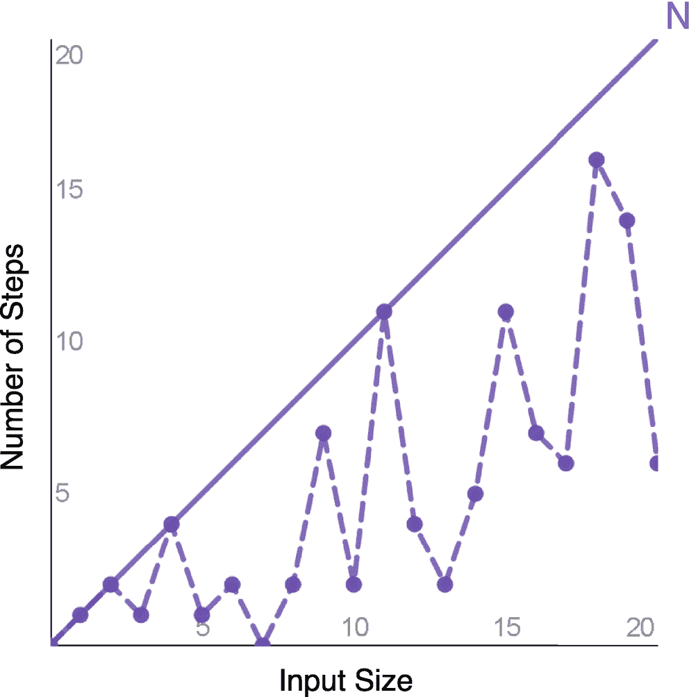

一个散点图，展示了从 0 到 20 的步骤数与从 0 到 20 的输入大小之间的关系。图中顶部标有 N 的斜线也清晰可见。

图 16-1：线性搜索算法的步骤数与输入大小关系图，包含一条渐近线

函数本身是没有意义的；重要的是函数之间的比较。我们希望 Oracle 选择那些在 Y 轴上步骤数最少的函数，即使数据沿着 X 轴不断增加。

如果 Oracle 只需要比较那些从图表原点开始的直线，那么任务将变得微不足道。当每个算法的性能由不同的曲线表示，并且这些曲线在 X 轴的不同点相交时，任务就变得困难了。抽象地表述为一个数学问题：要知道哪条曲线的 Y 值最低，Oracle 必须确定 X 值。实际地表述为一个数据库问题：要知道哪种算法最快，Oracle 必须准确估计行数。当 Oracle 没有正确的信息来准确估计哪个操作成本更低时，就会产生糟糕的执行计划。

图 16-2 展示了本章讨论的最重要的函数。`O(1)`、`O(∞)` 和阿姆达尔定律不太适合放在这张图上，但它们也会在后面讨论。幸运的是，最重要的 Oracle 操作只属于少数几个类别。我们不需要查看源代码或编写证明，因为大多数数据库操作都很容易分类。花点时间看看图 16-2 中的线条和曲线。

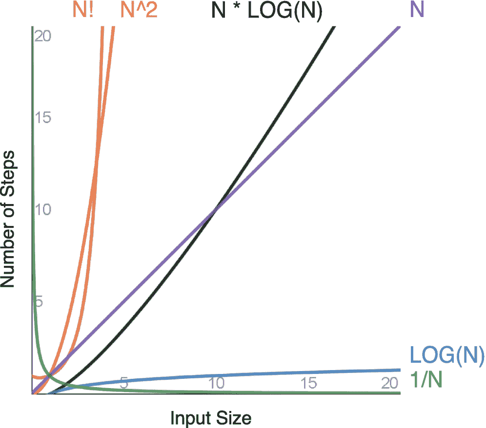

展示了 `N!`、`N²`、`N log N`、`log N` 和 `1/N` 的步骤数与输入大小的关系图。

图 16-2：代表重要 Oracle 操作的函数

接下来的几节将讨论每个函数、我们在哪里找到它们以及它们为什么重要。比较前面的形状有助于解释许多 Oracle 性能问题。


## O(1/N)：通过批处理减少开销

调和级数 `1/N` 完美地描述了许多 Oracle 操作的开销。这个函数描述了序列缓存、`BULK COLLECT` 限制、预取、数组大小、`UNION ALL` 中的子查询数量、带有批量选项（如 `DBMS_OUTPUT` 和 `DBMS_SCHEDULER`）的 PL/SQL 包，以及许多其他具有可配置批处理大小的操作。选择正确的批处理大小对性能至关重要。例如，如果需要为每一行执行一次 SQL 到 PL/SQL 的上下文切换，或者必须为每一行等待一次网络往返，性能可能会非常差。

为了减少逐行处理的浪费性开销，我们必须将多行的开销合并处理。但是，我们应该合并多少行呢？这是一个涉及许多权衡的难题。完全不合并任何行的处理速度会慢得离谱，而合并所有行则会导致内存或解析问题。批处理是获得良好性能的关键之一，因此我们需要清晰地思考应该批处理多少数据。

只需选择 100，然后停止担心它。通过理解图 16-3 中的图表，我们可以自信地选择像 100 这样的值。首先要注意的是，理论结果与现实世界的结果几乎完全匹配。

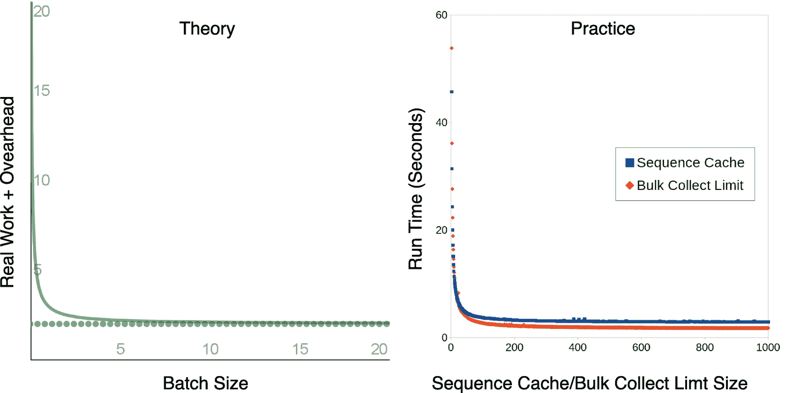

图中展示了理论与实践，包括“实际工作+开销”与批处理大小的关系图，以及运行时间与序列缓存/`BULK COLLECT` 限制大小的关系图。

**图 16-3**

批处理大小增加对运行时间的影响

对于左侧的理论图表，总运行时间是“实际工作”的虚线加上开销的实线。增加批处理大小会迅速减少开销，但开销的减少量是有限的。无论我们如何增加批处理大小，总工作量永远不会降至零。我们的处理过程从来不是纯粹的开销——总会存在一定量的实际工作。

前面图中的线条从接近无穷大开始，并迅速趋于平缓。随着我们增加批处理大小，开销迅速消失。批处理大小为 2 时消除了 50% 的开销，为 10 时消除了 90%，为 100 时消除了 99%。设置为 100 已经优化了 99%。从理论上讲，批处理大小为 100 和十亿之间的差异不可能超过 1%。

用于生成现实世界结果的脚本可以在 GitHub 仓库中找到。这里没有足够的空间列出所有代码，但这些代码值得简要讨论。这些脚本创建了两种具有极高开销的场景：插入每一行值都是序列的数据，以及批量收集少量数据但不对结果做任何处理。测试用例几乎完全充满了无用的开销。如果存在任何测试用例能通过将批处理大小从 100 增加到 1000 而显示出 *有意义的* 改进，那么这就是了。

表 16-1 详细描述了三种批处理场景。这三行是三个完全不相关的任务，但可以用相同的时间复杂度完美解释。

**表 16-1**

性能取决于减少开销的不同任务

| 任务 | 实际工作 | 开销 | 可配置参数 |
| --- | --- | --- | --- |
| 批量收集 | 选择数据 | SQL 与 PL/SQL 上下文切换 | `LIMIT` |
| 使用序列插入 | 插入数据 | 生成序列号 | `CACHE SIZE` |
| 应用程序获取行 | 选择数据 | 网络延迟 | 获取大小 |

我们可以从这个理论中得出许多实际结果。游标 `FOR` 循环使用的默认 `BULK COLLECT` 大小 100 已经足够好；几乎从来没有显著好处去使用一个高得离谱的自定义限制。默认的序列缓存大小 20 已经足够好；在极端情况下，稍微增加缓存大小可能是值得的，^(³³) 但也不应大幅增加。不同应用程序的应用程序预取大小不同；我们应该将其设置为接近 100。这些规则适用于任何减少开销的优化。

如果我们处于极端情况或深入钻研结果，我们总能发现使用更大批处理大小带来的微小差异。但如果我们发现自己处于需要设置巨大批处理大小才能显著改善的情况，那我们其实已经失败了；我们需要将算法带到数据身边，而不是将数据带到算法身边。

在实践中，将算法带到数据身边意味着我们应该将至少部分逻辑放在 SQL 中，而不是将数十亿行数据加载到过程语言中进行微不足道的处理。如果我们愚蠢地将表中的所有行加载到 PL/SQL 中，只是为了用 `V_COUNT := V_COUNT+1` 来计数，那么增加批处理大小会有所帮助。但更好的解决方案是在 SQL 语句中使用 `SELECT COUNT(*)`。如果我们将十亿行数据加载到 PL/SQL 中并对这些行执行实际工作，那么通过更大的批处理大小节省的几秒钟将是无关紧要的。总有例外情况，例如如果我们必须通过数据库链接访问大量数据并面临可怕的网络延迟，但我们不应该让这些例外情况来决定我们的标准。

在空间和运行时间之间存在权衡，但具有调和级数时间复杂度时，我们会很快用空间换取 *零* 运行时间。开发人员浪费了大量精力在争论和调整前图中右侧的大数值上，但几乎所有的收益都发生在图中左侧的快速变化区域。当我们拥有 `1/N` 时间复杂度时，收益递减点会非常快地达到。我们应该花时间寻找批处理命令和减少开销的机会，而不是担心精确的批处理大小。

## O(1)：哈希与其他操作

常数时间访问是理想的，但通常不现实。能够以常数时间工作的操作大多是简单的，例如使用像 `ROWNUM = 1` 这样的谓词。常数时间函数很简单，只是一条水平线，不值得在图表中展示。最重要的可以以常数时间运行的 Oracle 操作是哈希。哈希是数据库的核心操作，值得详细讨论。

### 哈希的工作原理

### 哈希的工作原理

哈希将一组项目分配到一组哈希桶中。哈希函数可以将项目分配到大量密码学随机的桶中，例如 `SELECT STANDARD_HASH('some_string', 'SHA256') FROM DUAL`。或者，哈希函数可以将值分配到少量预定义的桶中，例如 `SELECT ORA_HASH('some_string', 4) FROM DUAL`。哈希函数可以设计成具有多种不同的特性，其设计对它们的使用方式有重要影响。图 16-4 包含描述哈希函数的简单方法。

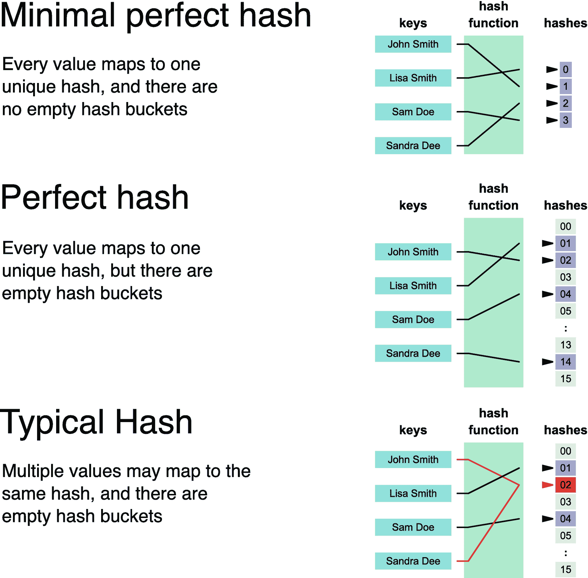

图示展示了列键、哈希函数以及用于最小完美哈希、完美哈希和典型哈希的哈希值。

图 16-4

对不同哈希函数的描述。图片由 Jorge Stolfi 创建，属于公共领域。

哈希性能的差异范围巨大，这取决于哈希的具体工作方式。使用完美哈希时，访问只需要一次读取，操作时间是 `O(1)`。而对于一个失效的哈希算法，当所有值都被映射到同一个哈希值时，我们最终得到的只是一个卡在哈希桶里的普通堆表。在这种最坏的情况下，我们必须读取整张表才能找到一个值，时间复杂度是 `O(N)`。

在使用哈希时，我们需要意识到时空权衡。实际上我们无法实现最小完美哈希。Oracle 的哈希分区是最小的（没有空桶），但远非完美（存在很多冲突）；哈希分区无法提供对单行的即时访问，但它们不会浪费太多空间。哈希集群可以是完美的（没有冲突），但远非最小（存在许多空桶）；哈希集群提供对单行的即时访问，但会浪费大量空间。哈希连接则介于两者之间。这三种哈希类型服务于不同的目的，将在后续章节中详细描述。

## 哈希分区

哈希分区根据一个或多个列的 `ORA_HASH` 值，将包含 `N` 行的表拆分为 `P` 个分区。哈希分区肯定不是完美哈希，因为每个哈希桶是一个旨在容纳多行的段。哈希分区的数量应该是最少的，因为我们不希望因创建额外的段而浪费磁盘空间。

向哈希分区表中插入一行的时间仍然是 `O(1)`——`ORA_HASH` 函数可以快速确定该行属于哪个分区。但是检索一行的时间将是 `O(N/P)`，即行数除以分区数。对于读取大量行的大型数据仓库操作，这可能是一个重要的改进。但对于读取单行而言，这种改进远不如使用 `O(LOG(N))` 的 B 树索引访问所能达到的效果。（B 树索引的时间复杂度将在后面的章节中描述。）不要试图用分区取代索引——它们解决的是不同的问题。

理论上，我们可以通过使用数量极其庞大的哈希值来构建一个具有惊人 `O(1)` 读取访问速度的哈希分区表。虽然这种哈希从“每一行都映射到单个段”的意义上来说可能是“完美”的，但数量荒谬的段会浪费大量空间，并且还会导致数据字典出现问题。

在构建哈希分区表时，我们必须为分区键使用正确的列。如果我们使用低基数的列，或者没有将分区数量设置为 2 的幂，数据将无法在分区之间均匀分布。如果所有行都存储在同一个桶（同一个哈希分区）中，那么分区将对我们毫无帮助。

在实践中，哈希分区经常被滥用。为了避免滥用这一特性，我们需要理解哈希的权衡，并选择一个好的分区键。

## 哈希集群

哈希集群旨在返回少量行，这与设计用于返回大量行的哈希分区不同。一个未公开文档记载的哈希函数确切地告诉 Oracle 存储和查找每一行的位置——无需遍历索引树和跟随多个指针。理论上，对于检索少量行，哈希集群甚至比 B 树索引更好。但在实践中，哈希集群很少使用。

哈希集群的第一个问题是我们无法将其添加到现有表中；我们必须从一开始就组织表以使用哈希集群。为了在哈希集群上获得 `O(1)` 的读取时间，我们需要创建一个近乎完美的哈希。但我们必须担心时空权衡问题。没有实际方法可以在不创建大量未使用哈希桶的情况下获得完美哈希。我们可以拥有一个性能良好的哈希集群，或者一个占用最少空间的哈希集群；我们无法两者兼得。

当我们创建哈希集群时，可以使用 `HASHKEYS` 子句指定桶的数量。根据我的经验，要获得 `O(1)` 的读取时间需要非常多的哈希桶，以至于表的大小会增加两倍。

不幸的是，即使付出了所有努力以获得 `O(1)` 的访问时间，哈希集群最终仍然比索引慢。我无法解释为什么哈希集群更慢；这是一个理论在现实世界应用中失效的地方。

Oracle 使用称为“一致性读取”的统计信息来衡量 SQL 语句执行的读取次数。可以创建测试用例，其中哈希查找只需要一次一致性读取，而同一表上的索引查找需要四次一致性读取。^(³⁴) 但索引仍然更快。对于这些操作，索引的 `O(LOG(N))` 小于哈希集群的 `O(1)`。

在比较小数字时，例如 1 对 4，常数变得比大 O 分析更重要。哈希集群很少使用，Oracle 肯定投入了更多时间来优化索引而不是集群。也许这些优化弥补了运行时复杂性之间的微小差异。

算法分析帮助我们深入探究问题，但在这种情况下，真正的性能差异被闭源软件中的常数所掩盖。也许这是一个自定义索引类型的机会。其他数据库拥有哈希索引，不需要重组整个表。也许有一天 Oracle 会添加该功能并使哈希访问工作得更好。就目前而言，我们应该忽略哈希集群。


### 哈希连接

当两张表中存在大量匹配行时，哈希连接是一种极佳的连接方式。哈希连接首先基于第一张表的连接列值创建一个临时的哈希表。接着，Oracle 使用第二张表的连接列值去探测该哈希表，以查找是否存在匹配项。

哈希连接的确切性能将在稍后讨论，但需要理解的主要一点是：创建临时哈希表的第一步需要耗费大量的时间和空间。这笔额外的投入可能是一项不错的投资，因为第二步中的每次探测理论上都可以在 `O(1)` 时间内完成。但就像哈希分区和哈希集群一样，哈希表绝非最小化且完美的。会存在一些空间浪费，探测的运行时间最终也会比 `O(1)` 稍差。然而，与哈希集群不同的是，探测的运行时间明显优于我们通过单次索引查找所得到的 `O(LOG(N))`。确定构建哈希表的前期投入是否值得，是优化器做出的最重要的决策之一。

我们需要明白，哈希连接只能用于相等条件。输入值被映射到固定长度哈希值的方式保留了一些相等性属性，但哈希化并不保留输入之间的任何其他关系。例如，A 可能小于 B，但这种关系在它们的哈希值之间不一定成立。

哈希连接非常有用，以至于我们常常值得特意去启用它们。我们可以通过将简单的不等式条件重写为奇怪的相等条件来启用哈希连接。例如，`COLUMN1 = COLUMN2 OR (COLUMN1 IS NULL AND COLUMN2 IS NULL)` 是告诉 Oracle 的一种逻辑方式：“这两列要么相等，要么两者都为 NULL。” 通过将条件重写为 `NVL(COLUMN1, 'fake value') = NVL(COLUMN2, 'fake value')`，我们或许能显著提升连接两张大表的性能。编写隐晦的表达式并非理想做法，并可能因基数估计不准而导致问题，但如果它能实现更快的连接操作，通常也值得一试。

### 其他

常数时间操作在 Oracle 中频繁出现，就像在任何系统中一样。例如，向表中插入一行、创建对象以及修改对象所花费的时间通常与输入大小无关。

另一方面，所有这些操作也都有非恒定时间的版本。如果需要维护索引，向表中插入一行会花费相当可观的时间。创建像索引这样的对象可能需要大量时间来排序数据。甚至修改表也可能不是常数时间，这取决于具体的 `ALTER` 命令。添加约束通常需要根据数据进行验证，这取决于行数；但添加默认值可以纯粹在元数据中完成，几乎能瞬间结束。

我们不能纯粹根据命令类型来对操作进行分类。要估算任何命令的运行时间，我们总是需要考虑算法、数据结构以及数据的大小。

## O(LOG(N))：索引访问

`O(LOG(N))` 是索引访问的最坏情况运行时间。索引读取是另一个核心数据库操作。索引在第 9 章中有详细描述，但以下段落简要概述了这个重要概念。

当我们搜索二叉树时，每一步都可以消除索引中一半的行。行数加倍是指数级增长；相反，行数减半是对数级缩小。简单二叉树上的索引访问是 `O(LOG2(N))`。Oracle B 树索引在每个分支上存储的远不止一个值，因此它们的最坏情况访问时间是 `O(LOG(N))`。图 16-5 展示了一个二叉树搜索的例子。

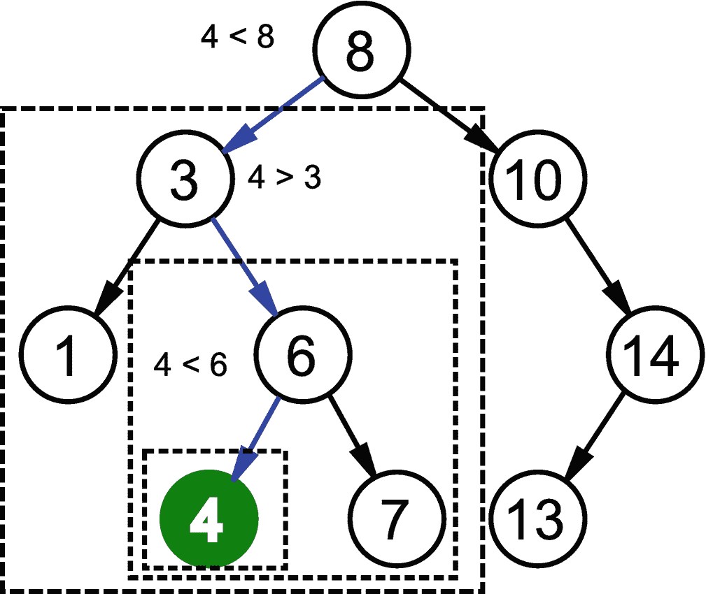

一幅展示二分算法的图示，节点数字为 1, 3, 8, 10, 14, 13, 7, 6 和 4。数字为 4 的节点以绿色高亮。

图 16-5

二分搜索算法。图片由 Chris Martin 创作，属于公有领域

我们知道索引如何工作，也知道索引对性能很有帮助，但比较算法能帮助我们精确理解索引有多么出色。图 16-6 比较了索引读取快速的 `O(LOG(N))` 与全表扫描缓慢的 `O(N)`。这个可视化是思考索引性能的一种有力方式。

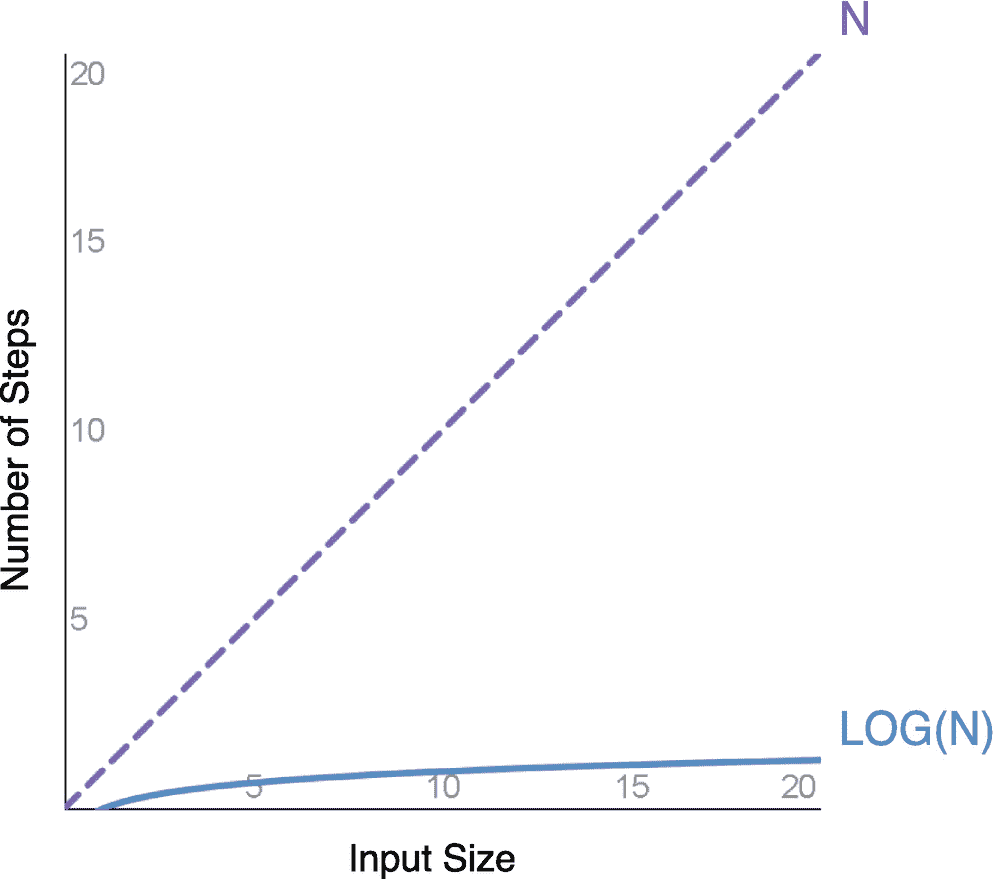

步数与输入大小（表示为 N 和 log N）关系的图表。

图 16-6

比较 `O(LOG(N))` 索引读取与 `O(N)` 全表扫描

大多数性能测试只在某个输入大小点上比较结果。思考前述可视化中的线条和曲线有助于我们理解系统性能如何随着数据增长而变化。从索引中读取一行所需的工作量几乎不会增加，无论表变得多大。实际上，我们的 B 树索引甚至很少增长到五层高度，这意味着任何索引值都只需几次读取即可获取。将这种渐进的运行时增长与全表扫描更陡峭的增长（每一行新数据都增加新工作）对比一下。

到目前为止，我们主要讨论了小型操作——一次哈希查找、一次索引查找或一次全表扫描。随着我们开始迭代操作，性能比较将很快变得更加复杂。


## 1/((1-P)+P/N)：阿姆达尔定律

对于数据仓库中的最优并行处理，我们必须考虑所有操作。仅仅关注最大的任务是不够的。如果我们的数据库有 `N` 个核心，并且我们希望大型任务的运行速度提升 `N` 倍，那么我们需要并行化所有操作。

阿姆达尔定律是前一段内容的数学表达。阿姆达尔定律并非最坏情况下的运行时复杂度，但这个函数对于理解性能至关重要，值得在此讨论。该定律可以用图 16-7 中的等式表示。

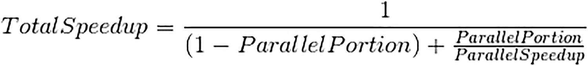

总加速比等于 1 除以括号内的 1 减去并行部分加上并行部分除以并行加速比。

图 16-7

阿姆达尔定律等式

我们无需记住这个等式，列出它只是为了完整性。但我们需要记住阿姆达尔定律的教训，这可以从图 16-8 中的图表学习到。

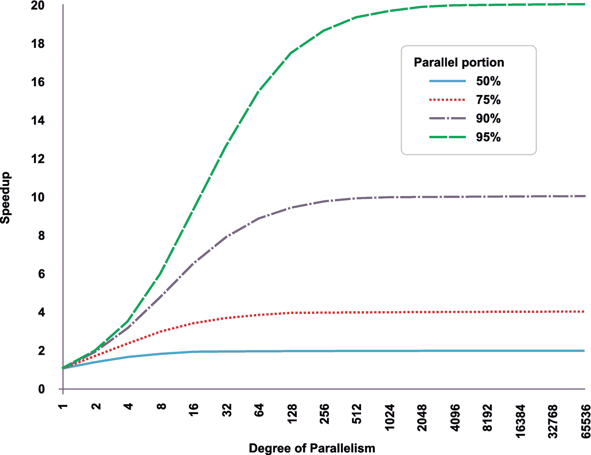

一条表示加速比随并行度增加的曲线图，展示了并行部分占比分别为 50%、75%、90%和 95%的情况。

图 16-8

阿姆达尔定律图示。基于 Daniels220 的“Amdahl’s Law”，采用 CC BY-SA 许可协议

请注意，上图使用了对数 X 轴，而 Y 轴上的数字相对较小。这张图的含义令人沮丧；即使最微小的串行部分也会破灭我们让程序运行 `N` 倍快的梦想。

例如，假设我们有一个大型数据加载任务，并且已经将 95%的流程并行化了。我们的机器有 128 个核心，并且（奇迹般地）并行部分运行速度提升了 128 倍。然而，整个流程的运行速度仅提升了 17.4 倍。如果我们愚蠢地靠堆硬件来解决问题，将核心数从 128 增加到 256，流程的运行速度也只会提升 18.6 倍。这些都是令人失望的递减回报。

如果我们的时间花在将并行部分从 95%增加到 96%，效果会好得多，这将使性能从提升 17.4 倍增加到提升 21 倍。这些令人惊讶的性能提升就是为什么我们需要投入大量精力去精确查找流程的时间消耗点。我们都喜欢凭直觉进行调优，但我们的直觉无法区分 95%和 96%。达到这种精度需要先进的工具和对流程活动的深入分析。

对于数据仓库操作，我们不能只担心运行时间最长的任务。仅仅并行化 `INSERT` 或 `CREATE TABLE` 语句是不够的。为了获得最大加速比，我们需要在所有其他数据加载操作上投入大量努力。我们需要关注诸如重建索引、重新启用约束、收集统计信息等操作。幸运的是，Oracle 提供了并行运行所有这些操作的方法。前面的章节包含了并行重建索引和重新启用约束的示例，第 18 章展示了如何轻松地并行收集统计信息。

为了充分优化大型数据仓库操作，使用 Oracle Enterprise Manager 或`DBMS_SQLTUNE.REPORT_SQL_MONITOR`等工具创建系统活动图会很有帮助。如第 12 章所讨论的，优化数据仓库操作需要关注哪怕是最微小的系统空闲时间。

## O(N)：全表扫描及其他操作

`O(N)` 是一种简单的线性性能增长。我们在很多地方都能发现这种运行时复杂度：全表扫描、快速全索引扫描（读取所有索引叶节点而非遍历树）、SQL 解析、基本压缩、写入或更改数据等。这里没什么特别的，但当我们开始比较更多函数时，下一部分就会变得有趣。

大多数 Oracle 操作属于`O(N)`类别。在实践中，我们大部分的调优时间都花在期望获得线性改进上。例如，直接路径写入可以通过减少 REDO 和 UNDO 数据量来提高性能。这只是一个线性改进，但却是一个显著的改进。

### O(N\*LOG(N))：全表扫描 vs. 索引访问、排序、连接、全局 vs. 本地索引、收集统计信息

`O(N*LOG(N))` 是现实排序算法的最坏情况运行时间。这种运行时复杂度出现在许多意想不到的地方，例如约束验证。前面的章节主要讨论了用于查找单个值的数据结构和算法，现在是时候开始迭代这些算法以查找多个值了。对于查找单个值，`O(LOG(N))`的索引访问显然比`O(N)`的全表扫描更快，但当我们查找不止一行时会发生什么？

图 16-9 比较了本节讨论的函数：`N²`、`N*LOG(N)`的变体以及`N`。

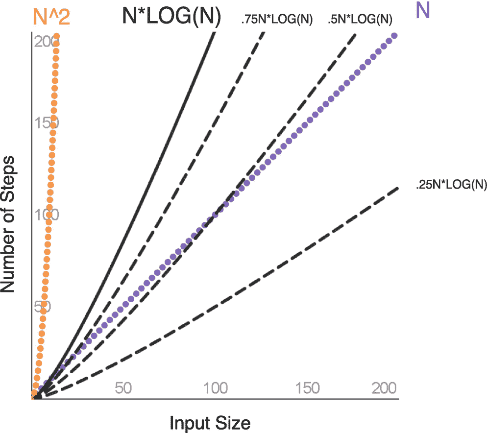

一张表示步骤数与输入大小关系的图表，展示了 N 的平方、N 乘以 log N、0.75 N 乘以 log N、0.5 N 乘以 log N 以及 0.25 N 乘以 log N。

图 16-9

比较 `N²`、`N*LOG(N)` 和 `N`

前面的线条和曲线可用于理解全表扫描与索引访问、排序、连接、全局与本地索引、收集统计信息以及许多其他操作。


### 全表扫描与索引访问

索引在查找表中单行数据时非常出色——其 `O(LOG(N))` 的读取时间几乎无出其右。但除了主键或唯一键索引外，大多数索引访问都会检索多行数据。为了检索多行，Oracle 必须多次重复 `LOG(N)` 操作。

如果使用索引扫描来查找表中的每一行，Oracle 就必须遍历树 `N` 次，从而导致 `N*LOG(N)` 的运行时间。这个运行时间显然比逐行读取整个表要差得多。如果你查看图 16-9，比较 `N*LOG(N)` 较慢的实线与 `N` 较快的虚线，性能差异就显而易见了。很多时候，全表扫描比索引访问更快。

当 Oracle 读取的行比例不是 1% 或 100% 时，性能差异就更复杂了。注意图 16-9 中的虚线；它们表示对表中 25%、50% 或 75% 的行重复进行 `LOG(N)` 访问。随着表的大小增长，每条曲线最终都会超过 `N` 的线性直线。我们不能简单地说一种算法比另一种更快。最快的算法取决于表的大小和访问的行比例。今天对于读取 25% 的表来说，索引可能是个好主意，但如果明天表增长了，可能就不是了。

还有其他因素可以显著改变这种平衡。Oracle 可以对全表扫描使用多块读取，而对索引访问则使用单块读取。使用多块读取，Oracle 可以在读取索引中一个块的相同时间内，从表中读取多个块。而且，如果索引聚簇因子很高（即索引不是按搜索值排序的），那么对少量行的索引查找最终可能还是需要读取表的所有块。

理论告诉我们线条的*形状*，但只有实践才能告诉我们实际的值。我无法为你的系统、表和工作负载给出一个确切的数字。但*确实*存在这样一个数字——一个全表扫描变得比索引访问更便宜（在性能上）的点。找到这个数字并非易事，而且 Oracle 并不总是做出正确决定，这也并不令人惊讶。

当 Oracle 未能做出正确选择时，我们不应该通过使用索引提示来完全抛弃整个决策过程。相反，我们应该寻找提供更准确信息的方法，以帮助 Oracle 做出更好的选择。帮助 Oracle 通常是通过收集优化器统计信息来完成的。

### 排序

`O(N*LOG(N))` 是流行排序算法在最坏情况下的运行时间。我们总是希望我们的过程是线性扩展的，但这通常并非如此。在实践中，我们必须处理那些比我们预期恶化得更快的算法。排序是任何数据库的核心部分，影响到 `ORDER BY`、分析函数、连接、分组、查找唯一值、集合操作等。我们需要学习如何处理这些慢算法，并在可能时避免它们。

对于规划，我们需要意识到性能将如何随时间变化。如果今天排序一百万行需要 1 秒，我们不能假设明天排序两百万行就需要 2 秒。

我们还需要意识到排序的空间需求将如何随输入大小而变化。幸运的是，所需空间量是线性增长的。如果行数翻倍，排序所需的 PGA 内存或临时表空间量也会翻倍。

有些时候，排序工作已经为我们完成了。B 树索引已经被排序——工作是在原始的 `INSERT` 或 `UPDATE` 期间完成的。向表中添加一行是 `O(1)`——该过程只需要在无序堆（dumb heap）的末尾添加一行。向索引中添加一行是 `O(LOG(N))`——该过程需要遍历树以找到添加或更新值的位置。

Oracle 可以使用索引全扫描来按顺序读取索引，而无需进行任何排序。工作已经完成；Oracle 只需要从左到右或从右到左读取索引。

Oracle 也可以使用最小/最大值读取来快速找到最小值或最大值。B 树中的最小值或最大值要么在最左边，要么在最右边。数据已经排序，所以找到顶部或底部的结果是一个简单的 `O(LOG(N))` 操作。

奇怪的是，Oracle 缺少一个功能，无法通过简单的最小/最大值读取同时找到*最小值和*最大值^(³⁵)。但下面的代码展示了这个问题的一个简单解决方法：将问题分成两个独立的查询，然后合并结果。多写一个子查询有点烦人，但这是为运行时复杂度带来巨大改进所付出的很小代价——`O(2*LOG(N))` 远比 `O(N)` 要好。当我们理解了 Oracle 使用的算法和数据结构时，我们就知道该期待什么以及何时该寻找更快的变通方法：

```
--创建一个表并查询最小值和最大值。
create table min_max(a number primary key);
--全表扫描或索引快速全扫描 - O(N)。
select min(a), max(a) from min_max;
--两次最小/最大值索引访问 - O(2*LOG(N))。
select
(select min(a) from min_max) min,
(select max(a) from min_max) max
from dual;
```

集合操作 `INTERSECT`、`MINUS/EXCEPT` 和 `UNION` 需要排序。我们应该尽可能使用 `UNION ALL`，因为它是唯一一个不需要对结果进行排序的集合操作。

排序和连接似乎总是一起出现，但在实践中它们是一个糟糕的组合。下一节将讨论为什么我们不希望在连接时使用排序。


### 连接操作

希望你还记得第 1 章中的维恩图和连接图，它们解释了连接操作在逻辑上是如何工作的。遗憾的是，理解连接操作在物理层面上如何工作则更为复杂。图 16-10 直观展示了主要的连接算法及其运行时复杂度。该图将连接操作可视化为两个无序列表之间的行匹配过程。每种连接算法在图后也有单独段落描述。你可能需要来回翻阅几次才能完全理解这些算法。

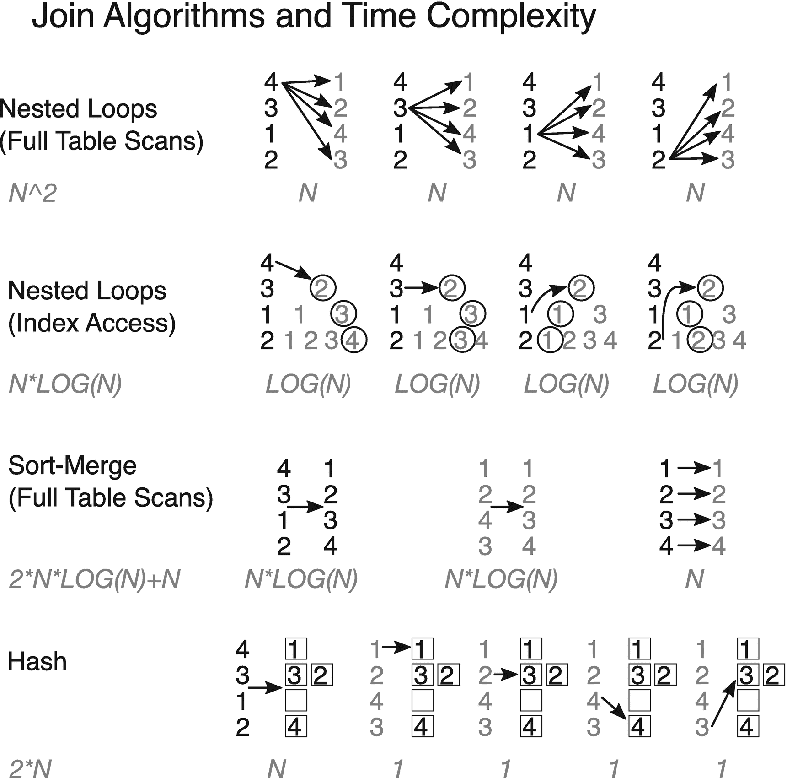

展示了全表扫描嵌套循环、索引访问嵌套循环、全表扫描排序合并以及哈希连接算法的图示及其时间复杂度。

图 16-10

连接算法与时间复杂度可视化

全表扫描嵌套循环 (`N²`) 在概念上很简单。从第一张表开始，将其每一行与第二张表的每一行进行比较。我们可以将此算法视为两个嵌套的 `FOR` 循环。每个循环运行 `N` 次，因此运行时复杂度是非常慢的 `O(N²)`。回顾图 16-9，`N²` 的线条看起来几乎是完全垂直的。这种连接算法只应在表非常小、优化器统计信息不佳或缺少重要索引时使用。

索引访问嵌套循环 (`N*LOG(N)`) 通常是更快的连接选择。对于每一行，我们不是搜索整个表，而是搜索索引。将复杂度从 `O(N²)` 降低到 `O(N*LOG(N))` 是一个巨大的改进。

但要充分利用此算法，更精确地定义变量会有所帮助。我们不用 `N` 来表示任一表的行数，假设我们读取每一行的第一张表有 `A` 行，我们通过索引读取的第二张表有 `B` 行。如果我们思考 `O(A*LOG(B))`，步骤数主要取决于 `A` 而不是 `B`。较小的表应放在前面，较大的表应放在后面。例如，如果一张表有一百行，另一张表有一百万行，`100 * LOG(1,000,000) = 600` 远小于 `1,000,000 * LOG(100) = 2,000,000`。Oracle 选择正确的算法还不够——它还必须知道如何在算法中使用这些表。

如果两张表都很大，这种连接算法效率不高。当其中一张表的行数较少，且另一张表有索引访问时，嵌套循环效果最佳。

全表扫描排序合并连接 (`2*N*LOG(N)+N`) 的操作方式是先对两张表进行排序（开销较大），然后匹配已排序的行（开销较小）。在实践中，我们不常看到排序合并连接——对于小规模连接，带索引访问的嵌套循环是更好的选择；对于大规模连接，哈希连接是更好的选择。但是，如果没有相关索引（排除了嵌套循环），并且没有相等条件（排除了哈希连接），那么排序合并就是剩下的最佳选择。而且，如果其中一张表已经通过索引预排序，那么一半的排序工作已经完成。

哈希连接 (`2*N`) 分为两个阶段。读取较小的表并构建哈希表（理想情况下在内存中）。然后扫描较大的表，并在哈希表中为较大表的每一行进行探测。在完美的哈希情况下，写入和读取哈希表只需一步，运行时仅为 `O(2*N)`。但在实践中会发生冲突，多行可能存储在同一个哈希桶中，因此执行哈希连接的时间并非线性增长；哈希连接的时间复杂度介于 `O(2*N)` 和 `O(N*LOG(N))` 之间。^(³⁶)

哈希连接具有良好的运行时复杂度，但这并不意味着我们总是想使用它们。即使我们只打算匹配少数行，哈希连接也会读取两张表的所有行。哈希连接需要大量内存或临时表空间——大约等于较小输入表的大小。内存中的慢算法可能比磁盘上的快算法更好。而且哈希连接并不总是可用，因为它们只适用于相等条件。

前面提到的连接算法有许多变体。交叉连接，也称为笛卡尔积，类似于全表扫描嵌套循环。并行化和分区总会使算法复杂化。哈希连接可以使用布隆过滤器来排除值，而无需完全比较所有值。连接是数据库中最重要的操作，这里的篇幅不足以描述连接表的所有特性。

连接性能完全取决于 Oracle 正确估计表的大小。表大小决定了使用哪些算法以及表在算法中如何使用。例如，如果其中一张表返回零行，那么哈希和排序就是糟糕的想法——当中间数据结构不会被使用时，就不需要所有这些准备工作。而对于两张都有大量匹配行的巨大表来说，嵌套循环是一个糟糕的主意。当 Oracle 误以为小表很大或大表很小时，就会产生糟糕的执行计划。这种错误如何发生以及如何修复，将在第 17 章和第 18 章中讨论。

### 全局索引与本地索引

分区对于表和索引的优缺点是不同的。对表进行分区通常是一个不错的选择，因为有很多潜在的性能提升，而成本很少。索引可以是全局的（一个索引对应整张表），也可以是本地的（每个分区一个索引）。与表分区相比，索引分区的收益较小，而成本更大。

从单个表分区读取（而不是全表扫描）可以显著降低运行时复杂度，从 `O(N)` 降至 `O(N/P)`，其中 `P` 是分区数量。但从本地索引读取（而不是全局索引），运行时复杂度仅从 `O(LOG(N))` 变为 `O(LOG(N/P))`。这种索引访问的改进几乎察觉不到。

读取整个分区表（无分区剪枝）的成本仍然是正常的 `O(N)`。但在没有分区剪枝的情况下，从本地索引读取比从全局索引读取要昂贵得多。读取一个大型索引是 `O(LOG(N))`。读取多个小型索引是 `O(P*LOG(N/P))`，这是一个显著的增加。遍历一棵大树比遍历多棵小树快得多。我们需要仔细考虑何时进行分区，并且不应期望表和索引分区以相同的方式工作。


### 收集优化器统计信息

收集优化器统计信息是实现良好 SQL 性能的**至关重要**的任务。统计信息用于估算**基数**，即一个操作返回的行数。基数与大多数章节图表中 X 轴所表示的“输入大小”是同义词。基数是做出执行计划决策的关键信息，例如判断何时使用嵌套循环或哈希连接。

### 基数估算的挑战

为了获得良好的执行计划，我们需要定期并在任何重大数据变更后收集统计信息。但收集统计信息本身可能很慢。了解收集统计信息的不同算法和数据结构可以帮助我们避免性能问题。

寻找基数并不仅仅是计算每个表中的行数。Oracle 还需要衡量列和特定列值的唯一性。例如，对主键列的相等条件永远不会返回多行，因此它是索引访问的良好候选。但对一个重复的状态列施加相等条件则更为复杂；某些状态可能很罕见，适合索引访问；而其他状态可能很常见，全表扫描效果最佳。优化器统计信息收集需要生成可用于估算多种复杂场景基数的信息。

### 使用哈希进行近似计数

计算不同项类似于排序，这是一项缓慢的操作。更糟糕的是，Oracle 需要表中所有列的统计信息，这可能需要多次遍历。计算不同值的朴素算法会首先对这些值进行排序；如果值是有序的，衡量唯一性很容易。但这种朴素方法将花费 `O(N*LOG(N))` 的时间。更好的算法会使用哈希，这正是较新版本的 Oracle 可以通过 `HASH GROUP BY` 和 `HASH UNIQUE` 操作实现的。与连接类似，哈希操作的时间介于 `O(N)` 和 `O(N*LOG(N))` 之间。

幸运的是，在收集优化器统计信息时，我们可以用准确性换取时间。默认的 Oracle 统计信息收集算法通过单次遍历表来执行*近似*计数。单遍算法在 `O(N)` 时间内运行，生成的数字是准确但不完美的。

开发者理所当然地担心不完美的值。一个错误的位就可能破坏一切。但在这种情况下，近似值已经足够好。优化器不需要知道*精确*值。Oracle 只需要知道算法是否需要针对“大”或“小”的查询进行优化。

以下示例展示了近似的接近程度，使用了函数 `APPROX_COUNT_DISTINCT`，该函数采用了与统计信息收集相同的算法：

```sql
-- 将 APPROX_COUNT_DISTINCT 与常规 COUNT 进行比较。
select
approx_count_distinct(launch_date) approx_distinct,
count(distinct launch_date)        exact_distinct
from launch;
APPROX_DISTINCT  EXACT_DISTINCT
---------------  --------------
61745           60401
```

### 采样的陷阱

快速近似算法^(³⁷) 仅在我们读取整个表时才有效。如果我们尝试对表的一小部分进行采样，近似算法就不再适用，Oracle 必须使用不同的方法。我们可能认为设置一个较小的估计百分比（例如 `DBMS_STATS.GATHER_TABLE_STATS(..., ESTIMATE_PERCENT => 50)`）是聪明的做法。但在这种情况下，读取 50% 表的慢算法比读取 100% 表的快速算法更慢且更不准确。我们应该**很少，甚至从不**更改 `ESTIMATE_PERCENT` 参数。

### 分区的增量统计信息

这些唯一计数技巧也可以应用于分区统计信息，这使用了一项称为**增量统计信息**的功能。通常，分区表需要读取表数据两次才能收集统计信息：每个分区一次，整个表又一次。这种双重读取乍看之下可能显得过度，但请考虑我们不能简单地将不同计数相加。

但增量统计信息使用了一种近似算法，使得不同计数的相加成为可能。增量统计信息创建称为**概要**的小型数据结构，其中包含分区内的唯一性信息。在为每个分区收集统计信息后，可以通过合并这些小型概要来推断全局统计信息。该算法将统计信息收集的复杂度从 `O(2*N)` 改进为 `O(N)`。这种减少听起来可能并不令人印象深刻，但请记住，分区表通常非常庞大。为我们最大的表节省一次额外的全表扫描可能是一件大事。

### 结论：统计信息是基础

这种算法分析开始变得递归性地荒谬。我们正在讨论帮助 Oracle 决定使用哪些算法的算法。而且问题更深入——在极少数情况下，统计信息收集之所以慢，是因为优化器为统计信息收集查询选择了一个糟糕的计划。对于这些罕见情况，我们可能需要“引导启动”；我们可以使用 `DBMS_STATS.SET_TABLE_STATS` 来创建初始的、虚假的统计信息，以帮助我们收集真实的统计信息。

许多组织认为收集统计信息是一项无聊的维护任务，最好由 DBA 处理。但这些元数据是 Oracle 性能的核心，任何对我们数据库程序性能负责的人都应该理解它。


## O(N²)：交叉连接、嵌套循环及其他操作

`O(N²)` 算法已进入极其缓慢的领域。除非有特殊条件，例如输入规模接近零，否则我们应不惜一切代价避免这些运行时间。这种运行时间复杂度源于交叉连接、嵌套的 `FOR` 循环、涉及全表扫描的嵌套循环连接以及其他一些操作。快速回顾一下它们的糟糕性能，图 16-11 展示了 `N!` 和 `N²`。

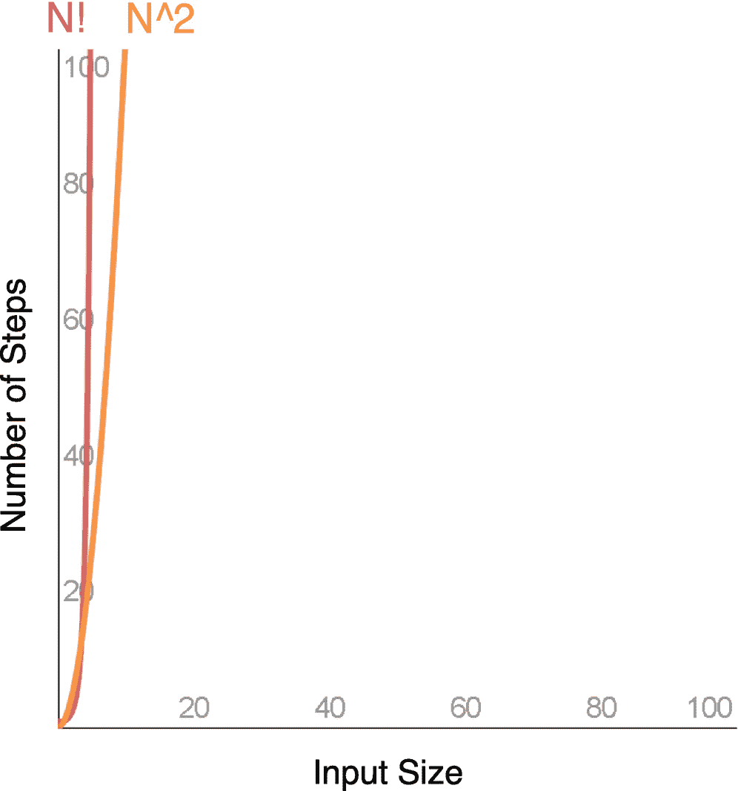

步数与输入规模关系图展示了 N 的阶乘和 N 的平方两条递增线。图 16-11 比较 N! 与 N²

交叉连接并非总是糟糕的。有时，将一个表中的每一行与另一个表中的每一行进行无脑组合是必要的。如果行数接近于零，交叉连接也可能很快。但是，由于表连接错误或基数估计不佳而发生的交叉连接对性能来说是灾难性的。意外的交叉连接非常糟糕，以至于它们可以有效地拖垮整个数据库；Oracle 可能需要无限量的临时表空间来构建结果集，从而剥夺了其他进程用于排序或哈希的空间。

`FOR` 循环内部再套 `FOR` 循环是过程式代码中产生 `O(N²)` 运行时间的最常见方式。如果我们再添加*一个* `FOR` 循环，运行时间复杂度就变成 `O(N³)`，然后是 `O(N⁴)`，依此类推。嵌套的 `FOR` 循环在 PL/SQL 中很容易发生，并且在使用显式游标时也太过常见。避免这种可怕的性能是我们应始终尝试用单个 SQL 语句替换嵌套游标的重要原因。

大多数开发人员编写过程式代码时使用嵌套的 `FOR` 循环，因为循环是思考连接的最简单方式。但 Oracle 无法改变命令式程序使用的算法——Oracle 被困在完全按照我们的要求执行。转向声明式代码的优势在于，我们不必过多担心这些算法。当我们使用 SQL 时，我们让 Oracle 决定使用哪种连接算法。

即使在切换到声明式 SQL 后，优化器仍有可能选择一个 `O(N²)` 算法。正如我们在本章前面的图 16-10 中所见，使用两个全表扫描的嵌套循环连接是一种糟糕的表连接方式。但这种最坏情况只应在我们缺少统计信息、缺少索引或连接条件奇怪时发生。

`O(N²)` 会出现在其他意想不到的地方。在极端情况下，SQL 解析时间呈指数增长。例如，如果我们使用 `UNION ALL` 组合数千个子查询，解析时间会变得异常糟糕。（测量解析时间的代码太长，无法在此处包含，但可以在代码仓库中找到。）编写大型 SQL 语句是件好事，但编写庞然大物般的 SQL 语句则不然。

`MODEL` 子句将过程式逻辑引入 SQL 语句。`MODEL` 是一个巧妙的技巧，在第 19 章中有简要解释。该子句使我们能够将数据转换为电子表格，并对行和列应用 `FOR` 循环。但就像使用 PL/SQL 一样，我们很容易发现自己陷入了 `O(N²)` 的性能困境。

高的运行时间复杂度并非总是可以避免或必然是坏事。但是，当我们看到交叉连接或嵌套操作时，我们应该仔细思考。

## O(N!)：连接顺序

`O(N!)` 是 Oracle 算法所能达到的最差复杂度，但幸运的是，它也很罕见。如第 6 章所讨论，表必须按特定顺序连接，并且对一组表进行排序的方式有很多种。在构建执行计划时，优化器必须解决表的排序问题；在尝试理解查询时，我们的大脑也必须解决这个问题。

优化器能够处理大量表而不会出现严重问题。但是，当我们把系统推向极限时，总会遇到意想不到的问题。例如，如果我们嵌套超过一打公共表表达式，解析时间似乎会像 `O(N!)` 一样增长。（代码演示见 GitHub 代码仓库。）在实践中，这个问题只会因为罕见的错误或因为我们做了不应该做的事情而发生。

我们的大脑只能在短期记忆中保持一个小型有序列表。如果我们使用巨大的逗号分隔列表来构建 SQL 语句，我们将永远无法理解它们。构建小型内联视图并使用 ANSI 连接语法将它们组合起来，将极大地简化我们的 SQL。没有精确的 SQL 复杂度方程，但我们可以这样理解复杂度比较：`(1/2N)! + (1/2N)!` ≪ `N!`

为了性能，我们希望将事物批处理在一起以减少开销。但为了使代码可读，我们希望将所有内容拆分成可管理的部分。这正是 SQL 的擅长之处；我们可以在逻辑上将查询划分为内联视图使其可理解，然后优化器可以高效地将代码重新组合起来。

## O(∞)：优化器

Oracle 优化器构建 SQL 执行计划。构建最优执行计划是不可能的，因此我们可以说这个任务是 `O(∞)`。这个运行时间复杂度乍听之下不对；Oracle 显然至少构建了*一些*最优执行计划。但将优化器视为在执行一项不可能的任务是有帮助的。

构建最佳执行计划意味着优化器必须比较算法和数据结构，并确定哪一个运行最快。但从字面上确定一个通用程序是否会*完成*都是不可能的，更不用说运行多长时间了。确定程序是否会完成被称为停机问题。在计算机发明之前，艾伦·图灵就证明了计算机不可能解决停机问题。幸运的是，这是一个在理论上不可能在所有情况下解决的问题，但在几乎所有情况下实际解决它是可行的。

给这个问题再添一层复杂性的是，Oracle 必须以极快的速度生成执行计划。给优化器起个更好的名字应该是“满意器”。满意化是在解决问题的同时考虑解决问题所需时间的一种优化问题解决方式。

理解优化器工作的难度很重要。当 Oracle 偶尔生成糟糕的执行计划时，我们不应感到惊讶。优化器并不像我们想象的那么差——它只是在尝试解决一个无法解决的问题。当优化器遇到困难时，我们不应该放弃它；我们应该尝试与它合作。

当生成了一个糟糕的执行计划时，我们的第一反应不应该是“我如何才能绕过这个坏计划？”。我们的第一反应应该是“我如何才能提供更好的信息，以便 Oracle 能做出更好的决策？”。这些信息几乎总是以优化器统计信息的形式存在，这将在第 17 和 18 章中描述。

我们需要抵制快速使用提示和更改系统参数的冲动。将优化器视为一个复杂的预测系统。我们绝不应该仅仅因为某个系统参数（如 `OPTIMIZER_INDEX_COST_ADJ`）对某一个查询有帮助就去更改它。这就像因为气象学家曾经错报了 10 度，就给每个天气预报都加上 10 度一样。


## 摘要

许多性能问题都归属于少数几种运行时复杂性类型。了解哪些函数代表了我们的问题，可以帮助我们理解 Oracle 为何会以某种特定方式表现，以及如何找到解决方案。实用的算法分析只是将我们的问题与预定义的问题类别进行匹配。我们可能不常用这种方法，但若没有它，我们将永远无法真正理解数据库性能。

我们的大多数性能问题都与实现细节以及那些我们一直方便地忽略的烦人常量有关。下一章将介绍一份更传统的 Oracle 性能概念列表。

脚注 1   2   3   4   5   6

# 17. 理解 SQL 调优理论

算法分析是理解 Oracle 性能基础的有用指南。现在，我们必须转向更传统的数据库性能技术和理论。首先，我们需要从最终用户的角度讨论性能问题。然后，我们将讨论几种流行的性能调优方法。但条条大路最终都通向 SQL 调优。为了进行有效的 SQL 调优，我们需要理解执行计划的重要性、执行计划可用的操作、基数、优化器统计信息、转换以及动态优化特性。

## 管理用户预期

在深入技术主题之前，我们需要处理性能调优中人的因素。我们通常不是为自己调优；我们是为客户或最终用户调优系统。在调查问题、解释资源、提出想法和实施变更时，我们需要仔细考虑最终用户的视角。

首先，我们需要对性能问题有一个清晰、客观的定义。最终用户可能没有太多故障排除的经验，因此我们需要帮助引导对话。与其简单地问“出什么问题了？”，我们应该询问具体细节。我们需要知道问题是持续性的还是间歇性的，它何时发生，运行需要多长时间，它是否一直这么慢，运行本应需要多长时间，我们是否确定问题出在数据库而不是应用程序等等。我们必须记住“知识的诅咒”，并且必须格外努力地用简单的语言传达调优信息。在发现阶段多花一分钟，可以为我们节省数小时不必要地调优错误目标的时间。

当我们发现并理解问题后，我们必须考虑可能为性能不佳提供背景信息的可用资源。许多性能问题是可以修复的 Bug，但许多其他性能问题是由资源限制造成的。我们需要了解我们的数据库和服务器资源，并与最终用户诚实地讨论它们。我曾通过解释“我们的旧服务器比你的笔记本电脑还慢，所以这已经是处理数据的最快速度了”或“你在读取 X GB 的数据。我们的硬盘每秒只能读取 Y MB。这个任务至少需要 Z 秒钟”来安抚许多愤怒的用户。如果用户认为等待是合理的，他们会更愿意等待。

根据变更的范围，我们可能需要向最终用户或客户提交成本/效益分析以获得批准。成本可能是购买硬件的资金，也可能是我们的时间。在这一步，诚实、谦逊和测试都很重要；花钱买硬件却解决不了任何问题，或者截止日期被推迟，这种情况并不少见。最好少做承诺，多做交付。

当我们实施变更时，我们必须确保仔细测量变更前后的性能。最终用户会想知道他们的投资到底得到了什么回报。

像大多数开发任务一样，我们大部分的性能调优时间将花在讨论和协调工作上，而不是工作本身。但本书侧重于 SQL 开发，所以让我们直接进入查找和修复性能问题的技术工作。

## 性能调优的思维方式

本章可能会让你失望。我知道你想要什么，但不可能构建一个单一、全面的性能调优检查清单。每当我们遇到性能问题时，我们都希望能扫描一个检查清单、翻阅一本书的章节或参考一个标准操作程序。本书中有大量的清单，但性能调优过于复杂，无法用简单的分步说明来描述。

性能调优很难，我们需要以不同于其他问题的方式来对待它。我们不能像调试那样对待性能调优。我们需要多种多样的方法来防止自己在有动机的故障排除上浪费时间。

### 性能调优不是调试

我们必须将性能问题与代码问题区别对待。将相同的问题解决过程应用于调优和调试是很有诱惑力的；发现问题，深入挖掘根本原因，然后修复或规避底层问题。对于调试，我们需要使用*深度优先*的方法；对于性能调优，我们需要使用*广度优先*的方法。试图对性能调优使用深度优先方法的开发人员和管理员会浪费大量时间。

对于调试，我们只需要找到第一个问题然后深入挖掘。程序必须 100% 正确运行，即使是单个不正确的字节也值得调查。即使我们没有修复正确的问题，我们仍然完成了一些有用的工作。

对于性能调优，我们需要找到第一个*显著*的问题，然后深入挖掘。“显著”这个词是主观的，可以指减慢网页速度、消耗大量资源从而拖慢整个系统、推高服务器成本等问题。但即使我们无法完全就什么是显著的性能问题达成一致，我们仍然可以采用一种通常能引导我们解决问题的思维方式。也许思考什么*不是*显著的性能问题更有用；一个问题不会仅仅因为我们不喜欢它或者我们知道如何修复它就变得显著。性能问题的候选者总是无数的。问题可能出在应用程序、数据库、操作系统、网络、硬件、存储区域网络等方面。很容易被无关紧要的线索分散注意力。如果我们不迅速排除虚假的相关性，我们将浪费大量时间。

性能调优的艺术在于使用多种方法快速收集和过滤大量数据。我们必须忽略那 90% 运行良好的部分，忽略那 9% 虽然慢但必然慢的部分，找到那 1% 既慢又可以修复的部分。如果我们使用一个简单的检查清单，里面包含诸如“避免全表扫描”这样过度简化的规则，我们将花太多时间去修复错误的问题。

### 有动机的故障排除

我们必须时刻警惕那些会让我们浪费数天时间修复无关问题的偏见。我们都有一种走捷径的冲动，专注于修复我们熟悉的问题。遵循熟悉的路径是修复 Bug 的一个好策略——任何清理都是有益的。对代码持有乌托邦式的看法是有益的。

但性能调优必须牢牢立足于现实。残酷的真相是，没有人会完全理解所有的等待事件或所有的执行计划操作。我们只有时间去修复那些缓慢的部分。

对于个人学习，调查任何看起来不对劲的地方是有帮助的。但当存在关键性能问题时，我们必须只关注最重要的部分。


### 不同的方法

排查程序性能问题的方法有很多种。以下列表列举了性能调优的常用方法。每种方法在不同场景下各有优劣，如果一种方法不奏效，我们必须愿意快速切换。随着经验积累，我们会形成自己的调优风格，并培养出对问题的直觉。此外，技术随时间演变，因此我们也必须愿意调整自己的方法：
1.  *应用程序/操作系统/硬件*：我们并非总得解决最直接的问题。改进系统中的一层可能就足以让另一层的问题消失。例如，如果我们无法修复某条语句的执行计划，或许可以通过提升硬件 I/O 性能来弥补操作缓慢的问题。或者，我们可以通过将应用逻辑移入查询，或反之，将问题转移到不同层。但我们不能总指望用一层的修复来弥补另一层的性能不佳，而且这些解决方案可能既浪费又昂贵。本章不讨论非 SQL 的方法。
2.  *基数*：检查 SQL 语句中每个操作返回的行数，是衡量执行计划准确性的一种有效方法。此方法将在后续章节讨论。
3.  *跟踪/性能剖析/采样*：Oracle 中执行的几乎所有活动实际上都被监控了。Oracle 可以通过跟踪捕获几乎每条 SQL 语句的几乎所有细节。Oracle 可以通过性能剖析捕获每行 PL/SQL 代码所花费的时间。实践中，跟踪大多已被 Oracle 的采样框架取代，例如 `AWR`（自动工作量仓库）、`ASH`（活动会话历史）和 `SQL 监控`。跟踪提供了海量数据，但使用不便。采样则提供了大量数据且易于访问。性能剖析和采样将在下一章讨论。
4.  *算法分析*：比较不同选择的运行时复杂度，有助于我们理解 Oracle 做出的权衡与决策。此方法已在前一章讨论。
5.  *求助他人*：有时我们需要承认遇到困难并向他人寻求帮助。这种方法可以像询问搜索引擎或同事一样简单。或者，我们可以创建服务请求，让 Oracle 帮我们调优。（但根据我的经验，除非我们确信遇到了错误，否则 Oracle 支持在性能调优方面帮助不大。大多数支持工程师似乎对调优不感兴趣，会不断要求我们提供无关的跟踪文件，直到我们放弃。）或者，我们可以依赖 Oracle 的自动顾问来推荐并实施性能修复。（但根据我的经验，Oracle 的顾问很少有帮助。希望未来的版本中这些顾问能有所改进。）本章不再进一步讨论此方法。
6.  *避开问题*：运行某样东西最快的方法就是完全不运行它。当我们理解了自己的代码及其上下文时，常常会发现更简单的实现方式。这种方法依赖于使用良好的开发流程、理解 Oracle 的高级功能以及采用恰当的 SQL 编程风格，以使代码含义更清晰易懂。本书第一、二和三部分讨论的主题可以解决我们的大多数性能问题。性能调优不能孤立地研究。如果你直接跳到了本书的第四部分，那么你错过了最重要的调优建议。像“使用内联视图和 `ANSI SQL` 连接语法”这样的建议虽然与性能间接相关，但比本章讨论的任何内容都更重要。

我们都有不同的偏好，一种方法不一定比另一种更好。我们常常可以运用某一项技术的专长来弥补另一项知识的不足。例如，本书采用了我偏好的技术：专注于单个 SQL 语句，而非着眼于整体资源利用率；如果我们照顾好了查询，数据库自然就会照顾好自己。诚然，这种方法并非总是有效，因此阅读不同来源、学习不同的调优风格是值得的。

### 为什么不谈数据库调优？

数据库调优、性能规划、系统架构和配置都是重要话题，相关书籍汗牛充栋。你可能想知道为什么本书聚焦于 SQL 调优而非数据库调优。这不仅因为本书是关于 SQL 的，更因为 SQL 是数据库的核心组件。调优 SQL 也将缓解数据库、操作系统、硬件、网络、`SAN` 等的压力。

反过来的情况则可能性较小：用 SQL 的改进来弥补糟糕的硬件，比用硬件改进来弥补糟糕的 SQL 要容易。硬件改进往往是线性的，而 SQL 改进通常是指数级甚至更优的。Oracle 提供了如此多的 SQL 调优机会，我们几乎总能找到让 SQL 运行更快的方法。

许多系统如果 SQL 写得好，即使硬件老旧也能勉强运行。但如果我们的执行计划充满了糟糕的笛卡尔乘积，那就毫无希望了。除非我们能用上量子计算机，否则无法靠购买硬件来摆脱一个糟糕的算法。

## 声明式编程（为何执行计划很重要）

在传统的命令式编程中，我们精确地告诉编译器如何操作，我们负责创建高效的算法和数据结构以实现良好性能。在声明式编程中，我们告诉编译器我们想要什么，然后由编译器尝试寻找最优的算法和数据结构。

### 声明式编程的怪癖

SQL 是我们在 Oracle 中使用的声明式语言。我们请求 Oracle 修改或检索数据，而 Oracle 必须决定如何连接表、应用过滤器等。这种声明式环境带来了许多有趣的结果。

例如，Oracle `SQL` 提供一致性，并试图让许多事情在同一时刻发生。以下 `SQL` 语句两次引用了 `SYSDATE`，它们总是返回相同的值：

```sql
--在声明式 SQL 中，这些 SYSDATE 生成相同的值。
select sysdate date1, sysdate date2 from dual;
```

当我们在 `SQL` 语句中写 `SYSDATE` 时，我们是请求 Oracle 获取当前日期。当我们在 `PL/SQL` 中写 `SYSDATE` 时，我们是请求 Oracle 将当前日期赋给一个变量。这个 `PL/SQL` 片段有较小的几率传入两个不同的值：`SOME_PROC(SYSDATE, SYSDATE)`。当我们在声明式和命令式世界之间切换时，可能会发生奇怪的事情。

Oracle 运行我们代码某部分的次数可能比我们预期的多或少。`SELECT` 列表中的一个函数可能对每行被调用多次——可能有一次额外的执行是为了设置结果缓存。作为 `DML` 语句一部分的函数或触发器可能被调用多次——Oracle 可能会重新启动语句的一部分以确保一致性。而且很多时候，Oracle 可能认为某些操作是不必要的，干脆不执行它，就像下面 `EXISTS` 子句中的表达式：

```sql
--表达式被忽略，不会引发除零错误。
select * from dual where exists (select 1/0 from dual);
```

在第 `15` 章，我们看到了假设 Oracle `SQL` 语句会按照我们编写的顺序运行的危险。如果我们的数据类型错误，例如在一个糟糕的 `EAV` 数据模型中，并且谓词执行顺序错误，我们可能会遇到运行时错误。但理解 Oracle 的执行计划才是这个声明式与命令式讨论的主要意义所在。


### 执行计划

执行计划是 SQL 调优的关键。执行计划展示了执行 SQL 语句所用操作的精确顺序，以及告诉我们 Oracle 如何做出决策的有用信息。这些操作和细节揭示了用于运行我们查询的算法和数据结构。Oracle 优化器根据 SQL 语句、与 SQL 语句相关的对象、关于我们数据库环境的统计信息等来生成执行计划。

执行计划常与查询计划或解释计划混淆。重要的区别在于，执行计划是 Oracle 实际使用的计划，而解释计划仅仅是 Oracle 可能使用的预测性计划。“实际”一词在接下来的两章中会频繁使用，因为这是 Oracle 用来描述实际数值与估计值的术语。例如，我们稍后会看到，“A-rows”或“实际行数”可能与“E-rows”或“估计行数”**大相径庭**。我们必须时刻清楚自己是在查看实际计划和数值，还是估计计划和数值，否则将**浪费**大量时间在不值得调优的事情上。

SQL 调优的核心就是发现、理解并修复执行计划。第 18 章将更详细地讨论发现和修复计划的多种方法。总结而言，发现和理解计划的最佳方式是以纯文本形式结合实际数值（而非仅仅是估计值）。而修复执行计划的最佳方式是间接的，即提供更多信息以便 Oracle 优化器做出更好的决策。

例如，生成估计解释计划的最简单方法是使用`EXPLAIN PLAN`命令，如下所示：

```
--生成解释计划。
explain plan for
select * from launch where launch_id = 1;
```

以下命令和结果显示了上述语句的解释计划^(³⁸)：

```
--显示解释计划。
select *
from table(dbms_xplan.display(format => 'basic +rows +cost'));
Plan hash value: 4075417019

| Id | Operation                   | Name     | Rows | Cost (%CPU) |
|----|-----------------------------|----------|------|-------------|
|  0 | SELECT STATEMENT            |          |    1 |    2   (0)  |
|  1 |  TABLE ACCESS BY INDEX ROWID| LAUNCH   |    1 |    2   (0)  |
|  2 |   INDEX UNIQUE SCAN         | LAUNCH_PK|    1 |    1   (0)  |

```

目前，您不必完全理解上述输出的所有内容。现在，只需理解执行计划对于理解 Oracle 性能的重要性就足够了。

## 操作（可用的执行计划决策有哪些）

执行计划是 SQL 调优的关键，而操作是理解执行计划的关键。许多开发人员 SQL 调优失败是因为他们关注了错误的东西。仅仅知道 SQL 语句运行了多久或者 SQL 语句在特定事件上等待了多久是不够的。按*操作*来衡量事物比按*语句*衡量更有帮助。您甚至可以说本章的标题是错误的——本章更多是关于“操作调优”而非“SQL 调优”。

### 操作详情

执行计划中的每一行对应一个操作，该操作映射到一种算法。执行计划中的“名称”列告诉我们该算法所使用的数据结构。

精确的算法取决于操作名称和操作选项的组合。截至 19c，共有 149 种操作和 259 种操作选项。通常，单个操作只有几个有效选项。例如，`HASH JOIN`是一个操作，`OUTER`是一个操作选项。为方便起见，在大多数执行计划格式中，这些名称会组合成`HASH JOIN OUTER`。

操作通过缩进来表示父子关系。这种缩进方式有些棘手，需要时间适应，但它至关重要。缩进告诉我们哪些算法先执行，以及行如何在操作之间传递。即使只改变操作行中的一个空格，也可能彻底改变执行计划的含义。

### 执行计划与递归 SQL

大多数操作会消耗行，对这些行进行处理，然后产生新行。例如，哈希连接消耗来自两个不同子源的数据行，将它们合并，然后为父操作产生一个连接后的数据集。该中间结果集可能随后再与其他内容连接。

执行计划的嵌套结构反映了我们应该用小型、嵌套的内联视图来构建 SQL 语句的方式。就像构建逻辑 SQL 语句一样，理解执行计划就是理解小的操作集，将它们组合成一个新的集合，并重复这一过程。

但执行计划并不总是那么简单。执行计划中可能没有显示大量实际工作。有时，我们需要调优一个*递归*SQL 语句——这是为支持我们的 SQL 语句而自动生成的 SQL 语句。递归 SQL（不要与使用`CONNECT BY`的递归查询混淆）可以通过多种方式生成：嵌入 SQL 的自定义 PL/SQL 函数、包含 SQL 的触发器、解析查询或构建执行计划所需的元数据查询、由远程数据库处理的远程对象等。（但视图不是递归 SQL 语句。视图中的查询会被添加到我们的 SQL 语句中，就像我们复制粘贴了文本一样。）

如果我们使用像`DBMS_SQLTUNE.REPORT_SQL_MONITOR`这样的高级调优工具，当“活动百分比”值的总和不为 100%时，我们就能判断存在缓慢的递归 SQL。可以通过查看`V$SQL`等视图来找到缓慢的递归查询，这将在下一章中解释。幸运的是，当我们知道要查找什么时，这些递归查询往往很显眼，容易捕捉。

### 操作为何重要

要理解执行计划，我们需要知道有哪些操作和操作选项可用。正如前一章所讨论的，不同的算法在不同的场景下是最优的。我们需要知道算法是什么以及何时应该使用它们。

本节列出了最常见的操作和操作选项及其适用场景。有许多指导原则，但我们并不总有精确的指令。例如，哈希连接适用于大量数据，而嵌套循环适用于少量数据。但“大”和“小”的精确定义取决于许多因素。

SQL 调优的科学在于获取精确的测量值，并找出哪些操作耗时最多，以及哪些操作可能更有效。但我们并不总有时间进行科学分析；SQL 调优的艺术则要快得多。最终，您将能够看着一个执行计划，就能直觉地判断某个操作不合适。您已经在本章中接触了许多列出的操作，并获得了关于它们何时有用的建议。但信息量很大，需要一段时间才能建立起对不良执行计划的直觉。

本章中的操作名称和选项是基于我的经验以及我能访问的 350 个数据库中最流行的组合生成的。但此列表并非详尽无遗，您可能会根据所使用的功能看到不同的操作。

以下 SQL 语句可帮助您查看系统中已使用和可用的操作：

```
--最近使用的操作和选项组合。
select operation, options, count(*)
from v$sql_plan
group by operation, options
order by operation, options;
--所有可用的操作名称和选项。（需以 SYS 身份运行。）
select * from sys.x$xplton;
select * from sys.x$xpltoo;
```


### 首次操作

执行计划中的第一个操作只是命令名称的副本，本身意义不大。但第一个操作是一个有用的占位符，用于汇总整个计划的信息。例如，第一个操作的成本就是整个语句的总成本。^(³⁹)

以下是最常见的顶级操作，无需进一步解释：`CREATE INDEX STATEMENT`、`CREATE TABLE STATEMENT`、`INSERT STATEMENT`、`DELETE STATEMENT`、`MERGE STATEMENT`、`MULTI-TABLE INSERT`、`SELECT STATEMENT` 和 `UPDATE STATEMENT`。

在前面的列表中，只有 `INSERT` 操作值得关注。`INSERT` 语句有一个子操作，用于指示该 `INSERT` 是使用了直接路径写入还是常规写入。`LOAD TABLE CONVENTIONAL` 表示使用了常规的 `INSERT`，这种方式可恢复但速度较慢。`LOAD AS SELECT` 表示使用了直接路径写入，这种方式不可恢复但速度快。

### 连接操作

连接操作有很多种：

1.  **哈希连接**：为较小的行源构建哈希表，然后为较大的行源的每一行探测该哈希表。适用于返回大量行的连接操作。需要等值条件。
2.  **归并连接**：对两个行源进行排序，然后连接它们。适用于返回大量结果但不使用等值条件的连接操作。
3.  **嵌套循环**：对于一个行源中的每一行，在另一个行源中搜索匹配项。适用于返回少量结果的连接操作。输入行源中的一个或两个应该来自索引访问。
4.  **连接过滤器**：一种可以在连接前快速消除行的布隆过滤器。只允许作为哈希连接的子操作。（我们无法对此操作做太多控制。）

选项特别重要，它们能显著改变连接操作的行为。请记住，并非所有选项都对所有操作有效：

1.  **反连接**：反连接返回在一个行源中存在但在另一个行源中不存在的值所对应的行。与 `NOT IN` 和 `NOT EXISTS` 条件一起使用。此操作在找到匹配项后立即停止，因此比普通的全表扫描更快。
2.  **半连接**：半连接返回在一个行源中的值至少与另一个行源中的一个值匹配的行。与 `IN` 和 `EXISTS` 条件一起使用。此操作在找到匹配项后立即停止，因此比普通的全表扫描更快。
3.  **缓冲**：写入到临时表空间的中间结果。行可以同时在执行计划的多个级别间流动，但这些同步点需要在进行下一步操作前检索所有行。
4.  **外连接/全外连接/右外连接**：执行外连接而不是内连接。外连接并不直接比内连接慢。但我们不应默认使用外连接，因为外连接提供的优化机会少于内连接。
5.  **笛卡尔积**：将一个源中的每一行与另一个源中的每一行组合。也称为交叉连接，此选项仅对 `MERGE JOIN` 有效。此选项在执行计划中是一个危险信号。除非行数极少，否则此选项可能导致极差的性能。

### 表访问

表是 Oracle 中最重要的数据结构。最重要的表访问操作如下：

1.  **表访问**：不言自明。
2.  **物化视图访问**：物化视图将查询结果存储为表。底层数据结构与表相同，只是名称不同。
3.  **快速 DUAL 访问**：`DUAL` 是一个用于生成数据的特殊表。在现代版本的 Oracle 中，从 `DUAL` 读取永远不需要从磁盘读取。
4.  **固定表访问**：类似于从 `DUAL` 读取，Oracle 的动态性能视图由内存结构填充。从 `V$` 视图读取不需要磁盘访问。
5.  **外部表访问**：从操作系统文件动态读取以创建表。

以下是表访问操作的选项：

1.  **全表扫描**：全表扫描是从表中读取大量数据的最快方式，因为它们可以利用多块读取。
2.  **通过[本地|全局]索引 ROWID [批处理]**：基于存储在索引中的 `ROWID`，快速访问行的物理位置。索引可能存储用于过滤的数据，但不一定包含表行所需的所有数据。每个索引条目都包含一个 `ROWID`，可用于快速访问表数据。`本地` 和 `全局` 关键字与分区表相关。`批处理` 选项是一个较新的功能，Oracle 会尝试对 `ROWID` 进行批处理，从而无需多次访问同一个表块。
3.  **通过用户 ROWID**：基于存储在表或字面量中的 `ROWID`，快速访问行的物理位置。此操作可能是访问数据最快的方式，因此通过 `ROWID` 存储和检索数据会很有帮助。另一方面，当数据更改时，行可能会移动位置，因此在存储 `ROWID` 时要小心。
4.  **抽样**：从表中返回随机样本数据。
5.  **聚簇访问**：聚簇表可以将两个表预连接存储在一起。（实际上，此选项现在已经很少使用，除了少数字典表。）

### 索引访问

最常见的索引操作如下：

1.  **索引**：B 树索引是提升性能的关键数据结构。索引通常用于快速从表中检索少量数据。
2.  **位图索引/与/或/减/转换**：位图适用于低基数列，例如状态列。通过组合位图索引可以快速执行多个 `AND` 和 `OR` 操作。B 树索引可以转换为位图以进行快速比较。
3.  **域索引**：自定义索引类型。除非我们使用 Oracle Text 等高级选项，否则这些操作很少见。
4.  **固定表访问**：动态性能视图也可以有仅驻留在内存中的索引。

这些索引选项大多只适用于 B 树索引：

1.  **范围扫描**：最常见的索引访问类型。此选项高效地遍历 B 树，可以快速返回一小部分行。
2.  **唯一扫描**：类似于范围扫描，但在找到一行后停止。
3.  **快速全扫描**：像读取表的瘦版本一样读取索引，并且可以使用快速的多块读取。如果我们需要检索大量行且所有相关列都在同一个索引中，这是一个不错的选择。
4.  **全扫描**：按顺序从索引中读取数据。按特定顺序读取数据需要较慢的单块读取，但提供预排序的结果。
5.  **扫描**：类似于范围扫描，但只需要遍历 B 树的第一条或最后一条路径即可获取最小值或最大值。（此选项有一个名为 `FIRST ROW` 的子操作。）
6.  **跳过扫描**：当多列索引的引导列无法使用时发生。此选项效率低下，表明我们可能需要创建另一个索引。


### 分组与排序

分组和查找唯一值可以通过 `HASH` 或 `SORT` 操作完成。这些操作可以带有 `GROUP BY` 或 `UNIQUE` 选项。哈希通常比排序更快，但在极少数情况下，我们可能需要通过类似 `/*+ NO_USE_HASH_AGGREGATION */` 的提示来强制优化器的决策。

`SORT` 操作也可用于 `ORDER BY`、`CREATE INDEX`、`JOIN`（在执行 `MERGE JOIN` 之前对结果排序）和 `AGGREGATE`（当存在聚合函数但没有任何分组时使用）等选项。

除了实际上并不排序数据的 `AGGREGATE` 选项外，我们应尽量避免这些缓慢的 `SORT` 操作。然而，如果排序包含了 `STOPKEY` 选项，它也可能很快。`STOPKEY` 意味着处理在前 N 行之后停止，这可能是因为 `ROWNUM` 或 `FETCH` 的缘故。

与排序和哈希类似，还有 `WINDOW` 操作，它用于分析函数。分析函数功能强大且速度快，通常比编写自连接更好的选择。但要警惕嵌套的 `WINDOW` 操作。如果多个分析函数使用了不同的 `PARTITION BY` 或 `ORDER BY` 子句，每个函数都会对应一个 `WINDOW SORT` 操作。所有这些排序可能会变得代价高昂。

### 集合操作符

我们可以使用四种集合操作符来组合查询：`INTERSECT`、`MINUS`、`UNION` 和 `UNION ALL`。（21c 版本添加了 `EXCEPT` 作为 `MINUS` 的同义词，并为 `MINUS` 和 `INTERSECT` 添加了 `ALL` 选项。）我们可能期望每个命令对应一个单独的操作，但这四个命令只映射到三种执行计划操作：`INTERSECTION`、`MINUS` 和 `UNION-ALL`。`UNION` 操作符会被转换为一个 `UNION ALL` 操作加上一个 `SORT UNIQUE` 子操作。这个额外的排序操作就是为什么如果我们知道值已经是唯一的，就应该始终使用 `UNION ALL`。

Oracle 可能会将查询转换为使用集合操作。有时，与其在整个表上只使用一种访问方式，不如使用不同的技术多次访问表并结合结果。通过表扩展，Oracle 可以以不同的方式查询不同的分区。通过 OR 扩展，Oracle 可以以不同的方式查询不同的条件——通常使用不同的索引。对于这两种类型的转换，新计划可能看起来比原始计划大一倍，而这两部分将通过 `CONCATENATION` 或 `UNION ALL` 操作组合在一起。

### 优化器统计信息

优化器统计信息对性能至关重要，以至于 Oracle 有多个专门收集它们的操作：

1.  `STATISTICS COLLECTOR`：在执行计划中间收集优化器统计信息，用于自适应查询计划。如果实际基数与预期基数不同，自适应查询计划可以动态地改变自身。例如，一个自适应查询计划可能默认使用嵌套循环来处理它认为涉及少量行的连接，但如果行数意外地大，它将切换到哈希连接。

2.  `APPROXIMATE NDV`：在单次扫描中近似计算唯一值的数量，无需排序或哈希。

3.  `OPTIMIZER STATISTICS GATHERING`：在创建表时收集优化器统计信息。如果收集统计信息只需要一次扫描，并且我们正在加载大量数据，不妨同时收集统计信息。

收集优化器统计信息可能很慢，因此我们需要留意上述操作。如果统计信息已经收集，我们就不需要在以后重复努力。或者如果表不需要统计信息，我们可以使用提示来抑制这些操作。

### 并行

并行是显著提高慢速 SQL 语句性能的绝佳机会。优化并行很棘手，需要仔细关注语法和执行计划。以下是主要的并行操作：

1.  `PX BLOCK`：并行读取数据块。

2.  `PX SEND`：将数据块向上发送到执行计划中的下一步。选项决定了块的发送方式，这是一个重要的决定。对于小结果集，`BROADCAST` 选项可能效果很好——它将所有行发送到所有并行服务器。对于大结果集，`HASH` 选项可能效果很好——它将行分配给并行服务器。这里还有其他一些未讨论的选项。

3.  `PX RECEIVE`：从 `PX RECEIVE` 接收行。

4.  `PX COORDINATOR`：最终的并行操作，负责协调和控制子并行操作。

下面的例子展示了语法可以有多挑剔，以及即使细微的执行计划差异也可能非常重要。首先，我们来看一个每个步骤都并行运行的语句：

```sql
--完全并行的 SQL 语句。
alter session enable parallel dml;
explain plan for
insert into engine
select /*+ parallel(8) */ * from engine;
select * from table(dbms_xplan.display);
------------------------------------------- ... -------------------
|Id|Operation                             | ... |IN-OUT|PQ Distrib|
------------------------------------------- ... -------------------
| 0|INSERT STATEMENT                      | ... |      |          |
| 1| PX COORDINATOR                       | ... |      |          |
| 2|  PX SEND QC (RANDOM)                 | ... | P->S |QC (RAND) |
| 3|   INDEX MAINTENANCE                  | ... | PCWP |          |
| 4|    PX RECEIVE                        | ... | PCWP |          |
| 5|     PX SEND RANGE                    | ... | P->P |RANGE     |
| 6|      LOAD AS SELECT (HYBRID TSM/HWMB)| ... | PCWP |          |
| 7|       OPTIMIZER STATISTICS GATHERING | ... | PCWP |          |
| 8|        PX BLOCK ITERATOR             | ... | PCWC |          |
| 9|         TABLE ACCESS FULL            | ... | PCWP |          |
------------------------------------------- ... -------------------
Note

- 由于提示，并行度为 8
```

下面的代码有一个小改动。代码没有使用提示 `PARALLEL(8)`，而是使用了提示 `PARALLEL(ENGINE, 8)`。花一分钟时间比较一下前面例子和下面例子之间的执行计划：

```sql
--部分并行的 SQL 语句。
alter session enable parallel dml;
explain plan for
insert into engine
select /*+ parallel(engine, 8) */ * from engine;
select * from table(dbms_xplan.display);
----------------------------- ... -------------------
|Id|Operation               | ... |IN-OUT|PQ Distrib|
----------------------------- ... -------------------
| 0|INSERT STATEMENT        | ... |      |          |
| 1| LOAD TABLE CONVENTIONAL| ... |      |          |
| 2|  PX COORDINATOR        | ... |      |          |
| 3|   PX SEND QC (RANDOM)  | ... | P->S |QC (RAND) |
| 4|    PX BLOCK ITERATOR   | ... | PCWC |          |
| 5|     TABLE ACCESS FULL  | ... | PCWP |          |
----------------------------- ... -------------------
Note

- 由于表属性，并行度为 8
- 由于对象未使用并行子句装饰，PDML 被禁用
- 由于未给出 append 提示且未并行执行，直接路径加载被禁用
```

计划差异是由提示类型引起的。并行有语句级提示和对象级提示。我们几乎总是希望使用语句级提示。如果我们要并行运行一个操作，不妨并行运行所有操作。（然而，有一些重要的例外情况。例如，我们不希望并行运行微小的、相关的子查询。）提示 `PARALLEL(8)` 告诉 Oracle 并行运行所有操作。提示 `PARALLEL(ENGINE, 8)` 告诉 Oracle 只并行化从 `ENGINE` 表的*读取*操作。


在第一个例子中，当我们使用语句级提示时，`INSERT` 和 `SELECT` 操作是并行运行的。我们可以通过观察到（命名欠佳的）`LOAD AS SELECT` 操作之上有一个“PX”操作来确认这一点。并且 `LOAD AS SELECT` 操作也意味着第一个示例使用的是快速的**直接路径加载**，而第二个示例使用的是较慢的 `LOAD TABLE CONVENTIONAL`。

请注意，并行计划包含一个名为“IN-OUT”的列。理想情况下，我们希望生产者和消费者都使用并行服务器。`P->S` 这个值意味着并行结果被压缩到单个服务器中，后续步骤将以串行方式运行。我们希望尽可能晚地看到 `P->S`，也就是希望它在执行计划中靠近顶部的位置。在第二个较慢的例子中，`P->S` 发生在中间位置。

这些例子展示了正确使用提示的困难，以及我们需要多么仔细地解读执行计划。我们应该只在告知 Oracle 某些它无法自行推断的信息时才使用提示；语句级并行提示告诉 Oracle，这个查询对我们非常重要，我们愿意使用多个线程来加速它。我们不应该使用提示来告诉 Oracle 具体如何执行其工作；对象级并行提示明确告诉 Oracle 要对哪个表进行并行化。但是，这个决定如何使用提示的简单规则并不总是有效。提示中的并行度，即数字 `8`，可以说是一个错误。如果省略这个数字，Oracle 会自动确定并行度。根据我的经验，那些自动确定的并行度不够稳定，所以我倾向于硬编码一个像 8 这样的数字来表示“中等数量的资源”。显然，这个数字可能不适合您。找到合适的数字，或是依赖自动确定的数字，是我们必须通过反复试验来摸索的。

## 分区（Partition）

分区操作的名称是自解释的，并且与分区类型相匹配。例如，`PARTITION HASH`、`PARTITION LIST`、`PARTITION RANGE` 和 `PARTITION REFERENCE` 的用途是一目了然的。

相关选项并不太复杂，但它们很重要，值得简要讨论：

1.  `ALL`：从表中检索所有分区。此选项意味着分区没有起到任何帮助作用。我们可能需要检查我们的条件，确保是按照分区列进行过滤的。
2.  `SINGLE`：仅从单个分区检索数据，这意味着分区修剪很可能在最优地工作。
3.  `ITERATOR`：从一系列分区检索数据，这意味着分区修剪在工作，但不一定是最优的。

与并行操作类似，分区很复杂，并且在执行计划中有一些特殊的列。“Pstart”和“Pstop”列列出了正在使用的分区编号。这些数字告诉我们表被修剪到更小规模的程度如何。有时值会是 `KEY`，这意味着分区编号取决于一个变量或从另一张表的查找。

如果表是子分区的，分区操作也可以叠加。两个操作都被命名为 `PARTITION`，但子操作实际上是用于子分区的。下面的例子展示了一个简单的分区执行计划是什么样子的。（该示例使用了一个不常见的系统表，因为该表已经是子分区的，并且仅仅读取该表不需要分区选项许可。）

```
--Partition 执行计划示例。
explain plan for select * from sys.wri$_optstat_synopsis$;
select * from table(dbms_xplan.display);
------------------------------- ... -----------------
| Id  | Operation             | ... | Pstart| Pstop |
------------------------------- ... -----------------
|   0 | SELECT STATEMENT      | ... |       |       |
|   1 |  PARTITION LIST SINGLE| ... |     1 |     1 |
|   2 |   PARTITION HASH ALL  | ... |     1 |    32 |
|   3 |    TABLE ACCESS FULL  | ... |     1 |    32 |
------------------------------- ... -----------------
```

在前面的输出中，我们可以看到两个 `PARTITION` 操作，一个用于分区，一个用于子分区。在我的系统上，该表有 1 个分区和 32 个子分区。由于查询没有过滤该表，因此所有分区都被读取，所以 Pstart 和 PStop 的值与分区和子分区的数量相匹配。

## 过滤（Filter）

`FILTER` 是一个重要且常被误解的操作。不幸的是，“过滤”一词在执行计划中有两种不同的含义。最常见的情况下，“过滤”是指用于限制结果的条件，它会列在执行计划的“谓词信息”部分。但 `FILTER` 操作则完全不同。`FILTER` 操作也应用一个条件，但该条件的结果会动态地改变执行计划。

一个关于 `FILTER` 操作的好例子发生在查询基于一个带有很多输入的表单时。如果用户输入了一个值，查询应仅返回匹配该值的行。如果用户将某个输入留空，查询应返回所有行。匹配单个值是索引的良好候选场景，而匹配所有值则是全表扫描的良好候选场景。使用 `FILTER` 操作，执行计划可以包含两种路径，并在运行时选择正确的路径。

请注意下面的执行计划实际上是两个独立的计划组合而成的。将在运行时选择最快的计划：

```
--过滤示例。
explain plan for
select *
from launch
where launch_id = nvl(:p_launch_id, launch_id);
select * from table(dbms_xplan.display(format => 'basic'));

| Id  | Operation                      | Name            |
|   0 | SELECT STATEMENT               |                 |
|   1 |  VIEW                          | VW_ORE_D33A4850 |
|   2 |   UNION-ALL                    |                 |
|   3 |    FILTER                      |                 |
|   4 |     TABLE ACCESS BY INDEX ROWID| LAUNCH          |
|   5 |      INDEX UNIQUE SCAN         | LAUNCH_PK       |
|   6 |    FILTER                      |                 |
|   7 |     TABLE ACCESS FULL          | LAUNCH          |
```

前面的技巧并非对所有语义等价的查询版本都有效。例如，如果我们用 `WHERE LAUNCH_ID = :P_LAUNCH_ID OR :P_LAUNCH_ID IS NULL` 替换 `WHERE LAUNCH_ID = NVL(:P_LAUNCH_ID, LAUNCH_ID)`，`FILTER` 操作就会消失。搜索单个值或所有值的场景，正是我们需要使用晦涩的代码来确保获得最佳执行计划的情况。


### 其他

许多操作是直白的，并未给我们提供任何可执行的信息。例如，`SEQUENCE` 操作是不言自明的。但这并不意味着我们可以忽略这些操作；如果某个 `SEQUENCE` 操作很慢，那么我们就应该检查序列设置，比如缓存大小。

有些操作会重复执行多次，使得监控 SQL 语句的进度变得困难。例如，`NESTED LOOPS` 连接可能会多次调用子操作。重复也可能发生在像 `CONNECT BY` 和 `RECURSIVE WITH PUMP` 这样的操作上。如果我们不知道一个操作会重复多少次，那么 `V$SESSION_LONGOPS` 提供的进度估算就毫无意义。

`REMOTE` 操作也值得特别关注。在同一个数据库上连接数据已经够难了；通过数据库链拉取信息功能强大但可能很慢。

操作可以帮助解释我们的查询在执行前是如何被转换成不同查询的。`VIEW` 操作只是操作的逻辑分组，可能是一个内联视图或一个模式对象视图。`VIEW PUSHED PREDICATE` 操作告诉我们，主查询中的一个谓词被推送到了其中一个子查询中。谓词下推通常是好事，但我们希望知道查询何时被重写，以防我们需要停止这种转换。

单个操作可以代表调用另一种编程语言，这可能代表几乎无限的工作量。`XMLTABLE EVALUATION`、`XPATH EVALUATION`、`JSONTABLE EVALUATION` 和 `MODEL` 代表嵌入在 SQL 中的语言。最常见的非 SQL 操作是 `COLLECTION ITERATOR`，它表示由 PL/SQL 表函数生成的行。我们应该对涉及非 SQL 语言的执行计划持怀疑态度。优化器在为声明性代码估算时间和构建执行计划方面做得很好。但优化器几乎完全无法了解过程式代码将如何工作，它只能进行大胆的猜测。

`TEMP TABLE TRANSFORMATION` 发生在通用表表达式被转换为临时表时。如果该通用表表达式被调用多次，那么对于 Oracle 来说，将结果存储在临时表中可能比重跑查询更划算。

## 基数与优化器统计信息（构建执行计划 I）

基数与优化器统计信息是理解 Oracle 如何决定在执行计划中使用哪些操作的关键。基数指的是项目的数量，例如行数或不同值的数量。优化器统计信息是 Oracle 用来估算基数的依据。

构建执行计划最困难的部分是决定何时一组算法和数据结构会优于另一组。正如第 16 章直观展示的，最快的算法往往取决于 X 轴的“输入大小”。在 Oracle 中，这个输入大小就是基数。要知道哪些操作最快，唯一的方法就是准确估算基数。

本节旨在说服您关注执行计划的基数以及良好优化器统计信息的重要性。下一章将讨论如何收集这些统计信息以修复错误的基数估算。

### 基数至关重要

`cardinality` 这个词在 Oracle 中有两个略有不同的含义。基数可以指返回的行数。基数也可以指返回的*不同*行数。像主键这样的高基数列有许多不同的值，而像状态码这样的低基数列只有很少的不同值。

以下是两个简单示例，展示了两种截然不同计划的基数。首先，让我们找出在白沙导弹靶场进行的所有发射，这是新墨西哥州一个重要的军事测试区域。（为简洁起见，示例使用了硬编码的 `SITE_ID`。）白沙是一个受欢迎的发射场，有 6590 次发射。从以下执行计划中的 “Rows” 列可以看出，优化器估算白沙有 6924 次发射。（估算的基数在你的机器上可能不同。）这个估算并不完美，但足以让 Oracle 理解该查询返回了 `LAUNCH` 表中很大比例的行。因此，Oracle 构建了一个包含全表扫描的执行计划：

```
--全表扫描示例。
explain plan for select * from launch where site_id = 1895;
select * from table(dbms_xplan.display(format => 'basic +rows'));

|Id|Operation         |Name  |Rows |

| 0|SELECT STATEMENT  |      | 6924|
| 1| TABLE ACCESS FULL|LAUNCH| 6924|

```

让我们改变查询，统计约翰斯顿岛一个偏远发射台的发射次数。该地点曾用于“鱼缸行动”，可以概括为“让我们在太空中引爆一颗热核武器，看看会发生什么”。不出所料，军方只使用过那个发射场一次。Oracle 估算该条件将返回 14 行，这个比例足够小，足以使用索引范围扫描：

```
--索引范围扫描示例。
explain plan for select * from launch where site_id = 780;
select * from table(dbms_xplan.display(format => 'basic +rows'));

|Id|Operation                           |Name       |Rows |

| 0|SELECT STATEMENT                    |           |   14|
| 1| TABLE ACCESS BY INDEX ROWID BATCHED|LAUNCH     |   14|
| 2|  INDEX RANGE SCAN                  |LAUNCH_IDX2|   14|

```

在没有任何干预的情况下，Oracle 能正确知道何时使用全表扫描，何时使用索引范围扫描。大多数情况下，一切都很顺利，但我们不能把这种魔力视为理所当然。我们需要确切了解正在发生的事情，以便在系统崩溃时进行修复。正如您能想象的，真实的执行计划可能比这复杂得多。

Oracle 需要理解列和表达式的基数（唯一性）来估算每个操作的最终基数（返回的行数）。估算单个等值条件已经够棘手了，但我们的 SQL 语句还有范围、复合表达式等等。

幸运的是，当我们关注基数时，有很多事情我们不需要担心。我们不需要担心执行函数或表达式所需的时间。如果我们正在进行科学编程，我们可能会寻找小的循环，并尝试找出像 `SUBSTR` 和 `REGEXP_SUBSTR` 这样的函数之间的微小性能差异。在数据库编程中，与读取数据所需的时间相比，CPU 中处理数据的时间几乎总是无关紧要的。我们需要担心用于读取和处理数据的算法，而不是小函数调用的速度。（但是，也有例外；如果我们调用一个自定义的 PL/SQL 函数十亿次，那么我们就需要担心上下文切换和函数的性能。）

比较估算基数与实际基数是判断一个计划好坏的最佳方法。（查找实际基数的简单技巧将在下一章讨论。）如果所有相关对象（如索引）都可用，并且估算准确，那么这个计划很有可能是最优的。SQL 调优的一部分工作是找出基数估算错误的时间和原因。另一部分工作是思考更好的操作以及如何使它们可用。为优化器创建更好的路径需要理解可用的操作，并理解所有使这些操作成为可能的 Oracle 特性和数据结构。例如，如果我们的查询有一个缓慢的嵌套循环操作，我们可能需要将一个条件重写为等值条件，以启用哈希连接操作。


### 基数差异

理解基数差异何时重要是关键。在前面的例子中，两个估算虽然都不准确，但仍然足够好。

将基数估算视为只返回两种可能值会很有用：大或小。要检查 Oracle 是否选择了正确的值，`百分比`差异比`绝对`差异更重要。在第一个例子中，基数估算的绝对差异为 334 行（估算 6924 行 – 实际 6590 行）。但 334 行相对于 6590 行来说不算太糟。在第二个例子中，基数估算的绝对差异为 13 行（估算 14 行 – 实际 1 行）。

第二个例子的误差在数量级上，但优化器仍然做出了良好的决策。我们需要调整对优化器估算的期望。对于结果“错误”到何种程度才重要，并没有精确的定义。但根据经验法则，在估算误差超过一个数量级之前，不必过于担心。

回想第 16 章中的图表，它比较了不同的算法时间复杂度，如 `O(N)` 与 `O(M*LOG(N))`。在极端情况下，图表之间差异很大，但在中间也有一个很大的区域，性能大致相同。数据库算法并不高度敏感——基数的微小差异通常不会引起巨大问题。

但不要认为这种大范围的可接受值意味着基数估算很容易。基数错误是乘法性的，而非加法性的。如果一个估算偏差 10 倍，另一个估算也偏差 10 倍，它们组合起来可能偏差 100 倍。幸运的是，要解决这个问题，我们可能只需要修正其中一个错误的估算。只要估算在大致正确的范围内，Oracle 就能做出良好的决策。

### 成本无关紧要

优化器的正式名称是基于成本的优化器。Oracle 为每个操作生成一个内部数值，即成本。我在本书中展示的大多数执行计划中移除了成本，因为成本通常对调优毫无价值。

成本对 Oracle 内部肯定是有帮助的。我们也可以使用成本来快速比较执行计划将消耗的资源。但成本只是一个`估算`。而且成本在执行计划中并不总是有意义的累加。查看执行计划的成本并武断地说“哦，那个数字太大了”对我们来说毫无意义。

更有意义的方法是通过 SQL 语句的运行时间来衡量它们。时间估算列比成本更有用，尽管时间估算常常极不准确。下一章将展示如何测量`实际`时间，而不仅仅是估算时间。有了实际时间，我们就能知道哪些语句和操作真正最耗时，而不必猜测。

### 优化器统计信息

优化器统计信息是生成良好基数估算的关键。理论上，由于停机问题，不可能总是准确预测运行时间。实际上，借助正确的统计信息，优化器几乎总是能生成有用的预测。以下列表包含了所有不同类型的优化器统计信息，大致按重要性排序：

1.  `表`：行数以及表以字节和块为单位的大小。基数仍然是最重要的指标，但表的字节数大小对于估算读取数据的时间很有用，尤其是在数据仓库中。
2.  `列`：不同值的数量、空值、最高值和最低值，以及列使用信息。列使用信息很重要，因为优化器不会在从未在查询中有意义地使用过的列上收集直方图。
3.  `直方图`：关于每列最常用值的详细信息。直方图在我们之前的 `LAUNCH` 示例中很有帮助，因为大多数 `SITE_ID` 只有几行，但少数 `SITE_ID` 有很多行。
4.  `索引`：B 树层级、行数、不同值的数量以及聚簇因子（可用于判断索引的效率）。
5.  `分区`：也会为每个分区生成表、列、直方图和索引统计信息。
6.  `扩展统计信息`：表达式或列组合的选择率。
7.  `临时表`：与常规表类似，但可以为全局临时表、私有表或实体化公共表表达式生成统计信息。全局临时表统计信息可以是会话级或全局级的。获取这些统计信息可能很棘手，因为数据变化非常频繁。
8.  `系统`：I/O 和 CPU 性能。此信息有助于生成更有意义的时间估算。了解单块读取时间和多块读取时间之间的差异，可以更准确地估算索引范围扫描和全表扫描之间的差异。理论上有用，但实践中很少使用。
9.  `SQL 计划指令`：自动记录表达式和连接的基数错误统计信息，并在下次调整估算。默认禁用。
10. `SQL 概要文件`：包含用于修改特定 SQL 语句估算的信息。SQL 概要文件包含可以改进估算或强制计划更改的提示。
11. `用户定义`：过程代码可以使用 `ASSOCIATE STATISTICS` 或 Oracle 数据插件接口拥有自定义统计信息。
12. `内联视图`：通过 `CARDINALITY` 等提示，我们可以为内联视图创建虚假的估算。

正如我们所料，几乎所有上述信息都可以在数据字典中找到。优化器统计信息通常与主要元数据表一起存储，例如 `DBA_TABLES`、`DBA_TAB_COLUMNS`、`DBA_INDEXES` 等。


### 优化器统计信息示例

理解基数估计的具体来源可能比较困难。通常，我们不需要知道执行计划是如何生成的确切细节。但如果我们确实需要这些细节以帮助理解优化器，本节包含一个生成和读取优化器跟踪（10053）的简单示例。

之前，我们检查了这个查询的执行计划：`SELECT * FROM LAUNCH WHERE SITE_ID = 1895`。优化器估计该查询将返回 6924 行。但这个数字 6924 是从哪里来的呢？我们可以跟踪执行计划的生成过程，从而发现这个估计值是如何得出的。

以下命令生成一个优化器跟踪文件，然后查找该文件的位置。查找跟踪文件可能比较棘手，因为跟踪文件是不断生成的，我们需要访问服务器文件系统：

```
--生成一个优化器跟踪文件：
alter session set events='10053 trace name context forever, level 1';
select /* force hard parse */ * from launch where site_id = 1895;
alter session set events '10053 trace name context off';
--在此目录中查找最新的.trc 文件：
select value from v$diag_info where name = 'Diag Trace';
```

该跟踪文件很大，可能需要一分钟才能生成，并且充满了晦涩的数字和缩写。在那个大文件中，我们只对包含`SITE_ID`列信息的部分感兴趣。跟踪文件中的数字在你的机器上可能不同，但计算过程应该是一样的。以下是我数据库中跟踪文件的相关部分：

```
...
Column (#12): SITE_ID(NUMBER)
AvgLen: 4 NDV: 1579 Nulls: 0 Density: 0.000195 Min: 0.000000 Max: 2.000000
Histogram: Hybrid  #Bkts: 254  UncompBkts: 5552  EndPtVals: 254  ActualVal: yes
Estimated selectivity: 0.098163 , endpoint value predicate, col: #12
Table: LAUNCH  Alias: LAUNCH
Card: Original: 70535.000000  Rounded: 6924  Computed: 6923.914805Non Adjusted: 6923.914805
...
```

为了得出最终的估计值 6924，Oracle 必须确定谓词`SITE_ID = 1895`的选择性，然后必须将该选择性乘以表中估计的行数。选择性是一个介于 0 和 1 之间的数字，表示谓词从表中返回一行的概率。选择性计算有时可能很简单。例如，如果某个列上的等值谓词通常从十行的表中返回五行，则选择性为 0.5。但在我们这个更现实的例子中，Oracle 不是使用简单的平均值，而是使用直方图来计算流行值的选择性。直方图是在收集优化器统计信息时生成的。普通的列统计信息包含整个列的平均选择性信息，而直方图则计算值范围和流行值的选择性。

以下数据字典查询显示`SPACE.LAUNCH.SITE_ID`有一个混合直方图。该直方图是基于 5552 行的样本构建的——这与我们在跟踪文件中看到的数字相同：

```
--SPACE.LAUNCH.SITE_ID 的列统计信息。
select histogram, sample_size
from dba_tab_columns
where owner = 'SPACE'
and table_name = 'LAUNCH'
and column_name = 'SITE_ID';
Histogram   SAMPLE_SIZE
---------   -----------
HYBRID             5552
```

直方图最多可以有 254 个桶。每个桶包含一个值范围的信息，以及最流行值的端点计数。`SITE_ID` 1895 是一个流行值，是计数为 545 的端点：

```
--1895 对应的直方图桶。
select endpoint_repeat_count
from dba_histograms
where owner = 'SPACE'
and table_name = 'LAUNCH'
and column_name = 'SITE_ID'
and endpoint_value = 1895;
ENDPOINT_REPEAT_COUNT
---------------------
                  545
```

遗憾的是，数字 545 不在跟踪文件中。我们只能去数据字典里查找它。当我们将跟踪文件中的数字与数据字典中的数字结合起来时，我们终于能看到 Oracle 是如何得出 6924 行的估计值的：

```
选择性 = 采样值的数量 / 采样的行数
0.098163 = 545 / 5552
估计基数 = 总行数 * 选择性
6924 = 70535 * 0.098163
```

扮演优化器侦探是痛苦的；如果你在前面的跟踪文件和查询中迷失了，没有必要回头深入研究它们。这个练习的重点是表明生成估计值需要许多优化器统计信息。如果需要，我们可以使用跟踪和数据字典来完全调试估计值是如何生成的。在下一章中，我们将学习如何更改这些值以获得更好的执行计划。

## 转换与动态优化（构建执行计划 II）

在构建执行计划时，Oracle 不仅限于我们编写的精确查询，也不仅限于某个时间点可用的信息。Oracle 可以通过转换来重写我们的查询。而且 Oracle 可以通过动态优化使我们的 SQL 运行得越来越快。


### 转换

Oracle 不必严格按照 SQL 语句的书写顺序来执行其各个部分。Oracle 可以将查询转换为许多不同但逻辑上等价的版本，以构建最优的执行计划。

在大多数情况下，这些转换是在幕后发生的巧妙魔术。但是，了解 Oracle 能做什么是很重要的；如果我们认为 SQL 语句真的是严格按照原样执行的，那么我们就有理由担心在大型 SQL 语句中使用多个内联视图。并且我们需要知道 Oracle 何时进行了不好的转换，以便能够阻止它。我们还需要知道 Oracle 何时没有进行转换，以便我们能用古怪或重复的代码来进行补偿。

转换只发生在单个 SQL 语句内部。然而，有些特性可能导致一个 SQL 语句间接影响另一个：SQL 计划指令、统计信息收集和块缓存都可能使一个查询间接改变另一个查询的运行时长。

### 常见的未命名转换

最常见的转换没有特定的名称。Oracle 经常改变 SQL 语句中各项的顺序。谓词和连接可以轻易地重新排序。连接语法会从 `ANSI` 语法转换为传统语法，有时反之亦然。`DISTINCT` 操作偶尔会在执行计划中提前或延后执行。但也有许多具有特定名称的重要转换。

### 特定的命名转换

#### 谓词下推

**谓词下推**是指将外层查询中的谓词推入内层查询。这一重要转换可以解释为什么将两个查询组合在一起时性能会发生显著变化。以下代码是谓词下推的一个简单示例：

```sql
--谓词下推的简单示例。
select * from (select * from launch) where launch_id = 1;
```

Oracle 不会从内联视图中检索 `LAUNCH` 表的所有行，*然后*再用谓词过滤行。相反，Oracle 会重写 SQL 语句，并直接将谓词应用于表。通过转换语句，Oracle 便可以使用索引唯一性扫描来快速检索少量行。

#### 视图合并

**视图合并**允许优化器将表移入或移出内联视图。如果两个大表的结果稍后要与一个小表连接，Oracle 可能不需要直接连接这两个大表。例如，在以下代码中，Oracle 不需要直接连接相对较大的表 `SATELLITE` 和 `LAUNCH`。相反，Oracle 可以首先连接较小的表 `SITE` 和 `LAUNCH`。第一次连接生成了极少量的行，然后这些小的中间结果可以有效地与较大的 `SATELLITE` 表连接：

```sql
--简单的视图合并示例。
select *
from
(
  select *
  from satellite
  join launch using (launch_id)
) launch_satellites
join site
on launch_satellites.site_id = site.site_id
where site.site_id = 200;
```

#### 子查询反嵌套

当 Oracle 将相关子查询重写为连接时，就发生了**子查询反嵌套**。如果主查询返回少量行，且子查询很快，那么对每一行都运行子查询是有意义的。但是，如果主查询返回大量行，或者子查询很慢，那么使用常规连接操作就有意义了。在下面的例子中，`LAUNCH` 和 `SATELLITE` 表中有很多行，Oracle 几乎肯定会将查询转换为常规连接：

```sql
--简单的反嵌套示例。（带有卫星的发射。）
select *
from launch
where launch_id in (select launch_id from satellite);
```

#### OR 扩展

**OR 扩展**可能发生在包含多个 `OR` 条件的 SQL 语句上。该语句可以被拆分成多个部分，然后用 `UNION ALL` 拼接起来。

### 查看和补偿转换

还有许多其他可用的转换。如果我们想查看 SQL 语句的最终版本，可以查看 `10053` 跟踪文件，比如前几页生成的那个跟踪文件。如果我们打开那个跟踪文件并搜索 “final query after transformations”，我们会找到查询的最终版本。不幸的是，转换后的查询版本读起来很痛苦。幸运的是，我们其实并不关心代码的最终版本；我们只关心它的运行方式。执行计划告诉了我们转换后的 SQL 语句是如何执行的，这才是真正重要的。

转换是一个有趣的话题，但我们不需要完全理解转换就能利用它们。意识到转换是有帮助的，因为有时我们需要进行自己的转换。有时重写查询以使用不同但等效的语法会带来意想不到的性能提升。如果谓词下推没有发生，那么我们可能需要重复谓词。如果子查询反嵌套没有发生，那么我们可能需要手动将子查询转换为连接。


#### 自适应游标共享与自适应统计信息

执行计划可能会在运行时根据绑定变量、先前运行记录以及从其他查询收集的信息而发生变化。通过`FILTER`操作，我们已经初步体验了 Oracle 动态执行计划的能力。Oracle 的近期版本引入了许多新的动态优化功能。

`自适应游标共享`允许一条 SQL 语句根据绑定变量拥有多个执行计划。回顾之前的示例查询：`SELECT * FROM LAUNCH WHERE SITE_ID = 1895`。该查询并不完全符合实际场景；实践中我们几乎肯定会使用绑定变量，而不是硬编码字面量。

在无法直接访问字面量的情况下，基数的估算可能会变得显著困难。如果将`1895`替换为`:SITE_ID`，Oracle 如何知道该谓词是否具有高选择性（从而适合使用索引），还是选择性低（从而更适合全表扫描）？

解决方案在于：Oracle 可以窥探绑定变量值来创建首个执行计划。如果相关列数据存在数据倾斜并已建立直方图，优化器会记录下来以便下次检查绑定变量。在下次运行时，如果绑定变量值呈现不同的倾斜分布，Oracle 将创建另一个执行计划。

`自适应统计信息`可以通过在运行时收集统计信息来改变计划。这些功能大多默认禁用，参数`OPTIMIZER_ADAPTIVE_STATISTICS`默认值为`false`。在数据仓库环境中，如果值得花费额外时间构建执行计划，启用这些功能可能是有价值的。

`动态统计信息`（亦称动态采样）可用于弥补缺失或不足的优化器统计信息。在 SQL 语句运行前，如果统计信息缺失，动态采样会基于少量数据块收集统计信息。

动态采样非常重要，且通过参数`OPTIMIZER_DYNAMIC_SAMPLING`进行调优可能较为棘手。但我们几乎肯定希望启用此功能，以便在表完全缺失统计信息时至少能收集动态统计数据。得益于动态采样，缺失统计信息要优于错误的统计信息。Oracle 可以补偿缺失的统计信息，但错误的统计信息会被采信。执行计划注释部分中出现的动态采样通常意味着我们忘记了收集统计信息。执行计划中出现“dynamic statistics used: dynamic sampling (level=2)”这一短语是一个重要的危险信号。

`自动重优化`（在 11g 中称为基数反馈）有助于改进同一语句的后续执行。对于缺失统计信息或足够复杂的语句，Oracle 会记录不同操作的实际基数。如果实际基数与估算基数存在显著差异，优化器可能会在第二次执行时构建不同的执行计划。

`SQL 计划指令`存储关于谓词的统计信息。这些信息可在多个查询间共享。优化器能够对简单的等值和范围谓词做出良好的基数估算，但我们不应期望优化器在首次运行时就能预测复杂表达式的结果。借助 SQL 计划指令，优化器可以从错误中学习。

#### 自适应查询计划

自适应查询计划允许 SQL 语句拥有多个执行计划。查询可以根据运行时的实际基数数据选择最佳计划。当 Oracle 在连接操作前添加`STATISTICS COLLECTOR`操作时，该操作会记录实际基数并据此选择最佳计划。此功能极其强大，但也使执行计划更难以解读。

让我们通过`LAUNCH`与`SATELLITE`表之间的简单连接来创建自适应查询计划示例。以下两个查询对表进行连接，但仅针对特定的发射年份。1970 年有许多发射记录，而 2050 年则没有任何记录（因为数据集仅到 2017 年）。我们希望第一个查询（针对热门年份）使用哈希连接来处理大量结果，而第二个查询（针对冷门年份）应使用嵌套循环连接来处理少量结果。但谓词的书写方式使 Oracle 难以准确估算基数：

```
--在热门年份与冷门年份的发射记录查询。
select * from launch join satellite using (launch_id)
where to_char(launch.launch_date, 'YYYY') = '1970';
select * from launch join satellite using (launch_id)
where to_char(launch.launch_date, 'YYYY') = '2050';
```

我们可以通过多种方式为优化器提供更多信息：可以将谓词重写为更简单的日期范围、创建表达式统计信息、在表达式上创建基于函数的索引等。在旧版 Oracle 中，如果查询引发问题，我们需要考虑这些方法。但在现代版本中，Oracle 可以动态修正执行计划。

对于这个更复杂的示例，`EXPLAIN PLAN`命令已不够用。我们不需要查看显示 Oracle 预期执行内容的解释计划——我们需要查看显示 Oracle 实际运行情况的执行计划。

对于更复杂的 SQL 调优，我们通常需要先找到语句的`SQL_ID`。一旦获得`SQL_ID`，就可以将其输入多种不同程序。

但找到`SQL_ID`并非总是易事。可能会出现许多误报，特别是因为查询`V$SQL`时会返回对`V$SQL`本身的查询。返回自身源代码的程序称为“自生成程序”。在大多数编程语言中编写自生成程序是一项有趣的挑战，而在 Oracle SQL 中，创建自生成程序却异常容易，因此我们需要调整查询以避免这种情况。

以下 SQL 语句可用于查找 1970 年或 2050 年查询的实际执行计划。（为节省空间，我注释掉了其中一个相关谓词，而不是两次显示查询。）

```
--查找 1970 年或 2050 年查询的实际执行计划。
select * from table(dbms_xplan.display_cursor(
sql_id =>
(
select distinct sql_id from v$sql
where sql_fulltext like '%= ''1970''%'
--where sql_fulltext like '%= ''2050''%'
and sql_fulltext not like '%quine%'
),
format => 'adaptive')
);
```

请注意，前述查询通过使用`DBMS_XPLAN.DISPLAY_CURSOR`而非`DBMS_XPLAN.DISPLAY`获取了实际计划，而非仅仅是估算计划。这个新函数需要`SQL_ID`，该 ID 通过针对`V$SQL`的子查询获得。为避免自生成程序，子查询需要包含谓词`SQL_FULLTEXT NOT LIKE '%QUINE%'`。最后，要获取自适应查询计划详情，必须使用参数`FORMAT => 'ADAPTIVE'`。面对这些高级动态功能，查找执行计划可能变得棘手。

如果我们遇到错误“ORA-01427: single-row subquery returns more than one row”，这意味着有多个查询匹配该文本。如果发生此错误，我们需要添加额外的谓词。或者可以分步执行`SELECT * FROM V$SQL`来查找`SQL_ID`。


以下是对给定文本的排版结果：

以下是 1970 年查询的执行计划。自适应计划包含所有可能的操作，并使用连字符标记非活动操作。注意以下计划中有一个 `NESTED LOOPS` 操作。但这些操作是非活动的，取而代之的是使用了 `HASH JOIN`，这对于涉及大量行的连接更为合适：

```
-----------------------------------------...-
|   Id  | Operation                     |...|
-----------------------------------------...-
|     0 | SELECT STATEMENT              |...|
|  *  1 |  HASH JOIN                    |...|
|-    2 |   NESTED LOOPS                |...|
|-    3 |    NESTED LOOPS               |...|
|-    4 |     STATISTICS COLLECTOR      |...|
|  *  5 |      TABLE ACCESS FULL        |...|
|- *  6 |     INDEX RANGE SCAN          |...|
|-    7 |    TABLE ACCESS BY INDEX ROWID|...|
|     8 |   TABLE ACCESS FULL           |...|
-----------------------------------------...-
...
Note

- this is an adaptive plan (rows marked '-' are inactive)
```

如果我们把 `DBMS_XPLAN` 查询改为查找 2050 年而非 1970 年，就会得到下面的执行计划。现在操作反转了——`NESTED LOOPS` 是活动的，而 `HASH JOIN` 被停用了。2050 年还没有任何行数据，因此 `NESTED LOOPS` 操作是理想的：

```
-----------------------------------------...-
|   Id  | Operation                     |...|
-----------------------------------------...-
|     0 | SELECT STATEMENT              |...|
|- *  1 |  HASH JOIN                    |...|
|     2 |   NESTED LOOPS                |...|
|     3 |    NESTED LOOPS               |...|
|-    4 |     STATISTICS COLLECTOR      |...|
|  *  5 |      TABLE ACCESS FULL        |...|
|  *  6 |     INDEX RANGE SCAN          |...|
|     7 |    TABLE ACCESS BY INDEX ROWID|...|
|-    8 |   TABLE ACCESS FULL           |...|
-----------------------------------------...-
...
Note

- this is an adaptive plan (rows marked '-' are inactive)
```

我们需要理解动态优化，因为我们需要知道何时看到的并非真实的执行计划。而如果我们看不到动态执行计划，就可能错失了极好的优化机会。缺少动态执行计划意味着参数设置不正确，可能是 `OPTIMIZER_FEATURES_ENABLE`、`COMPATIBLE` 或 `CURSOR_SHARING`。

这些动态选项在后台静默运行，无需任何干预就能改进大量语句。但有时，提供更多、更准确的信息反而可能导致*更差*的执行计划。这些性能下降往往是开发人员和管理员能直接看到优化在起作用的唯一时刻。

不幸的是，开发人员和管理员仅仅因为遇到某个功能的一个小问题，就为所有人禁用该功能的情况实在太常见了。我们必须抵制在*系统*级别更改某些东西的冲动，而其实我们可以在*查询*级别解决同样的问题。动态优化不必完美也可以是有用的。除非你确定动态优化导致了多个问题，否则不要禁用它们。

## 总结

本章只是对许多复杂主题的简要概述。即使是那本 878 页的 *SQL 调优指南* 和 396 页的 *数据库性能调优指南*，也没有涵盖我们需要知道的一切。我的目标仅仅是向你介绍思考 SQL 性能概念的多种方式。执行计划、操作、基数、转换和动态优化为成为 SQL 调优专家奠定了坚实的基础。

不可避免地，我们会滥用本章中的许多概念，要么解决错误的问题，要么试图以错误的方式解决正确的问题。我们会犯下巨大的错误，浪费大量时间。我们需要欣赏性能调优的复杂性，并在犯错时保持谦逊的态度。对于每一个 SQL 调优问题，都存在一个清晰、简单但错误的答案。

我们必须接受思考性能调优的多种方式，并采用广度优先的问题解决方法。作为开发人员，我们梦想为新程序拥有一个完美的想法，而不是为平庸的程序拥有十个好想法。对于性能调优，我们需要扭转这种态度，并学会如何快速尝试那十个好想法。

脚注 1   2

# 18. 提高 SQL 性能

是时候运用我们的理论并开始构建实用的 SQL 调优解决方案了。本章从高层级的应用开始，然后深入到数据库和 SQL 语句，直到触及具体的操作。

在我们开始寻找提高性能的机会之前，我们都需要同意做一件事：停止猜测。我们*永远*不应该去猜测哪个程序慢、哪个数据库慢、哪个语句慢，或者哪个操作慢。无论我们调查的是技术栈的哪一部分，都有多种工具可以轻松、精确地告诉我们哪里慢。如果我们发现自己正在猜测哪里慢，那我们就犯错了。

性能调优必须由数据指导，而不是靠猜测。没有客观的衡量标准，我们就会患上*强迫性调优失调症*。我们必须专注于系统中缓慢的部分，并坚决抵制调优那些无济于事的部分的诱惑。重构和挑战自己学习更多知识固然很好。但当我们面临紧急的性能问题时，我们需要专注于数据，而不仅仅是修复那些感觉慢或容易修复的东西。

经过多年的质疑、测量和测试，我们才能获得猜测的权利。建立良好的直觉需要时间，我们可以利用这种直觉进行快速、广度优先的性能修复搜索。但专家们仍需保持谦逊，知道他们的猜测可能是错的。

## 应用调优：日志记录与分析

大多数性能问题始于缓慢的应用。应用调优是一个很大的主题，超出了本书的范围。即使是 PL/SQL 应用也不是本书的主要话题，但它们值得简要讨论。我们至少需要了解足够的 PL/SQL 知识来帮助我们找到缓慢的 SQL 语句。


## 日志记录

为我们的 PL/SQL 程序进行插桩（instrumentation）非常重要。市面上有许多免费且功能强大的日志记录工具，但不要让它们的复杂性阻碍你进行日志记录。即使是创建我们自己简单的日志记录，也远比什么都不做要好。

这种插桩不需要很花哨。日志记录可以非常简单，比如在重要进程启动或停止时，将消息和时间戳写入表中。或者我们可以使用 `DBMS_APPLICATION_INFO` 来帮助 Oracle 跟踪数据库中的数据，或者使用 `UTL_FILE` 将数据写入文件系统。使用 `DBMS_OUTPUT` 时要小心；它对小规模调试有用，但在大型系统上可能会很慢并导致溢出错误。

例如，我们可以使用 `DBMS_APPLICATION_INFO` 来跟踪本章中各个示例的资源消耗。我们可以在每节的开头运行以下 PL/SQL 块，来设置会话的模块名和操作名：

```
-- 设置会话的 MODULE 和 ACTION。
begin
dbms_application_info.set_module
(
module_name => '第 18 章',
action_name => '日志记录'
);
end;
/
```

在本章结束时，我们可以通过查询视图和表（如 `V$ACTIVE_SESSION_HISTORY` 和 `DBA_HIST_ACTIVE_SESS_HISTORY`）中的 `ACTION` 和 `MODULE` 列来比较不同部分的情况。（这两个对象将在本章后面更详细地讨论。）以下是如何比较活动情况的示例：

```
-- 本章中哪些部分消耗了最多的资源。
select action, count(*) session_count
from v$active_session_history
where module = '第 18 章'
group by action
order by session_count desc;
```

许多数据库程序会自动设置该会话元数据。而且 Oracle 的默认日志记录已经捕获了其他元数据，例如用户名和机器名。在大多数情况下，即使没有那些额外的会话信息，我们也能找到性能问题，但我们应该在遇到问题*之前*就考虑添加额外的日志记录信息。

这些日志信息对于发现历史趋势很有帮助。Oracle 拥有丰富的性能信息，但默认信息并非针对我们的应用程序组织，也不会长期存储。为我们的代码进行插桩不需要太多精力，并且应该成为每个项目的一部分。

## 性能分析：DBMS_PROFILER

Oracle 不会跟踪每一行代码每次执行的时间。如此大量的插桩会迅速消耗所有可用存储空间。但如果我们配置好 `DBMS_PROFILER`，我们就可以临时收集 PL/SQL 程序中每一行代码的总耗时和调用次数。性能分析提供的数据比日志记录更好，但不能完全取代日志记录；性能分析有显著的开销，不应默认启用。

如果我们使用像 PL/SQL Developer 或 Toad 这样的 IDE，性能分析就像在启动 PL/SQL 程序前点击几个按钮一样简单。其他 IDE 需要更多的设置；我们必须从安装目录 `RDBMS/ADMIN` 运行 `PROFTAB.SQL`，调用 `DBMS_PROFILER` 函数来启动和停止性能分析，然后查询表 `PLSQL_PROFILER_DATA`、`PLSQL_PROFILER_RUNS` 和 `PLSQL_PROFILER_UNITS`。Oracle 没有完全自动化这个设置过程很烦人，但如果我们正在调优 PL/SQL 程序，那么这个设置绝对是值得的。

为了演示性能分析，让我们创建一个简单而缓慢的过程：

```
-- 创建一个执行许多 COUNT 操作的测试过程。
create or replace procedure test_procedure is
v_count number;
begin
for i in 1 .. 10000 loop
select count(*) into v_count from launch order by 1;
end loop;
for i in 1 .. 10000 loop
select count(*) into v_count from engine order by 1;
end loop;
end;
/
```

现在我们需要启用性能分析并运行该过程。在合适的 IDE 中，启用意味着点击一个按钮来启用性能分析，然后运行这个 PL/SQL 块：

```
-- 运行该过程进行性能分析。（大约需要 15 秒。）
begin
test_procedure;
end;
/
```

每个 IDE 或查询工具的显示方式都不同。图 18-1 显示了 PL/SQL Developer 中的性能分析器报告。结果按运行时间降序排序，因此最重要的行位于顶部。甚至还有一个迷你条形图（spark bar chart）来快速向我们显示哪些行耗时最多。

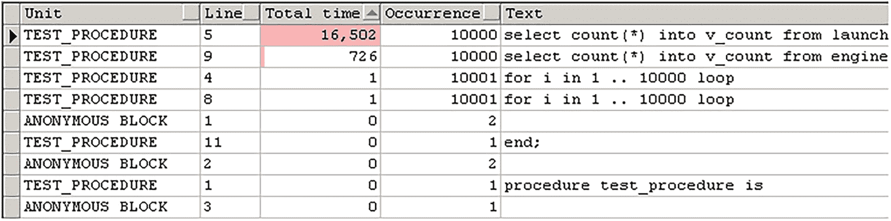

图 18-1
DBMS_PROFILER 报告

前面的性能分析器报告准确地告诉了我们应该关注过程的哪个部分。不需要猜测我们认为程序的哪个部分慢。第 5 行的运行时间远远大于所有其他行运行时间的总和。这份报告清楚地表明，如果我们花时间优化第 5 行以外的任何地方，那将是疯狂的。

## 性能分析：DBMS_HPROF

像分层性能分析器（hierarchical profiler）和跟踪（tracing）这样的工具可以提供比 `DBMS_PROFILER` 更多的数据。我倾向于避免使用这些高级工具，因为它们更难使用和获取。我宁愿要易于访问的好数据，而不是难以访问的伟大数据。但只要我们使用的工具能告诉我们实际运行时间，而不是仅仅猜测，我们就已经领先了。分层性能分析器正逐渐变得更强大、更易于使用，也许有一天它会完全取代 `DBMS_PROFILER`。

分层性能分析器的主要问题是它需要提升的权限和服务器访问权限来进行设置和使用。设置脚本随每个版本而变化，以下说明和代码可能仅适用于 18c 及更高版本：

首先，我们必须授予对该包的访问权限：

```
-- 授予对 DBMS_HPROF 的访问权限。必须以 SYS 身份运行。
grant execute on sys.dbms_hprof to &your_user;
```

以下代码创建一个表来保存性能分析器报告，启用性能分析器，并运行和分析 `TEST_PROCEDURE`：

```
-- 创建表来保存结果。
create table hprof_report(the_date date, report clob);
-- 生成报告。
declare
v_report clob;
v_trace_id number;
begin
-- 创建性能分析器表，开始性能分析。
dbms_hprof.create_tables(force_it => true);
v_trace_id := dbms_hprof.start_profiling;
-- 运行要进行性能分析的代码。
test_procedure;
-- 停止性能分析，创建并存储报告。
dbms_hprof.stop_profiling;
dbms_hprof.analyze(v_trace_id , v_report);
insert into hprof_report values(sysdate, v_report);
commit;
end;
/
-- 查看报告。
select * from hprof_report;
```

该报告包含大量很好的信息，但太宽了，无法在本页完整显示。图 18-2 仅包含了 HTML 报告中众多数据表之一的一部分。如果我们阅读整个报告，它将验证我们已经从 `DBMS_PROFILER` 中了解到的情况——过程中只有一行值得调优。未显示的报告部分还提供了相关的 `SQL_ID`，如果我们想要调优那个慢的 SQL 语句，这是必需的。

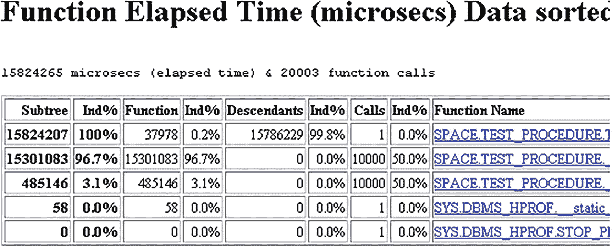

图 18-2
部分分层性能分析器报告


## 通过批处理进行应用调优

批处理命令是提升以数据库为中心的应用程序性能最简单的方法。将命令组合在一起通常是一项简单的改动，无需触及任何业务逻辑。批处理命令在两方面有益——它减少了开销，并为优化器提供了更多机会。

数据库调用可能存在大量的开销。最明显的开销是网络往返时间。并且，当多个命令和数据一起处理时，有许多可用的硬件和软件优化：改进的缓存和内存访问、SIMD、更少的上下文切换、更少的解析等。

如第 16 章所述，我们可以很快看到由减少开销的 1/N 谐波级数带来的巨大回报。我们可以保持应用程序的改动简单，因为我们不需要聚合所有东西就能获得巨大的性能提升。将命令以 100 个为一组进行组合，就达到了 99%的优化。

批处理命令为优化器提供了更多机会去做一些巧妙的事情。编写一个大的 SQL 语句，而不是多个小的 SQL 语句，让 Oracle 可以应用更多的转换和操作。另一方面，批处理也给了优化器更多犯错的机会，但不冒风险，就没有回报。当那些错误发生时，我们不必放弃批处理，而是可以运用我们的 SQL 调优技巧。

批处理命令的最大机会在于安装脚本、OLTP 应用程序和数据仓库。

### 安装和补丁脚本

提升安装和补丁脚本的性能比许多开发人员意识到的更重要。调优这些脚本只有少数`直接`益处，因为它们不被最终用户看到，并且很少在生产系统上运行。但`间接`益处是巨大的，因为更快的安装和打补丁使开发人员能够更快地进行实验和测试。

一个需要 1 分钟的安装脚本和一个需要 10 分钟的安装脚本之间的差异远不止 9 分钟。当重新安装只需要一分钟时，我们就没有借口不去测试我们脑海中浮现的任何疯狂想法。但这个建议仅适用于采用私有数据库开发模型的开发人员。

例如，下面的代码展示了一个典型的安装脚本。该脚本使用九个命令来创建和填充一个表。大多数自动脚本生成程序生成的代码都类似这样：

```
--典型、缓慢且冗长的安装脚本。
create table install_test1(a number);
alter table install_test1 modify a not null;
alter table install_test1
add constraint install_test1_pk primary key(a);
insert into install_test1(a) values(1);
commit;
insert into install_test1(a) values(2);
commit;
insert into install_test1(a) values(3);
commit;
```

我们可以将整个脚本缩减为一个命令：

```
--更快、更紧凑的安装脚本。
create table install_test2
(
a not null,
constraint install_test2_pk primary key(a)
) as
select 1 a from dual union all
select 2 a from dual union all
select 3 a from dual;
```

约束与表一起内联创建，初始值通过一个`CTAS`（`create table as SELECT`）创建。像上述批处理这样的简单改动，可以轻松地让安装脚本运行速度提升一个数量级。

默认情况下，`SQL*Plus`读取一个命令，将其发送到服务器，服务器解析并执行该命令，服务器回复一条反馈消息，然后`SQL*Plus`显示该反馈消息。实际执行命令通常并不是`SQL*Plus`脚本最慢的部分。避免发送命令和接收状态的开销可以带来巨大的性能提升。

我们还可以使用许多其他技巧来简化安装脚本。例如，除了使用大量的`UNION ALL`命令，这里有一些使用分层查询和预定义集合的技巧：

```
--生成数字和其他值的替代方法。
select level a from dual connect by level <= 3;
select column_value a from table(sys.odcinumberlist(1,2,3));
select column_value a from table(sys.odcivarchar2list('A','B','C'));
```

我们可以更进一步，使用`CREATE SCHEMA`语法进行批处理，它允许我们在单个命令中创建多个对象。在实践中，这个命令有点过头——当我们的整个脚本只是一个命令时，调试错误会变得困难。而且请记住，我们只需要批处理*大部分*命令就能获得巨大的性能收益。

匿名块也可以帮助我们提升自动生成脚本的性能。许多数据库工具不理解批处理的重要性，反而创建了冗长的独立命令列表。重写自动生成的脚本来使用像`UNION ALL`这样的技巧可能是不切实际的。但是，通过将命令列表转换为一个匿名块，我们仍然可以实现大部分的性能收益。只需在脚本开头添加`BEGIN`，在结尾添加`END;`即可。

匿名块作为单个`PL/SQL`命令发送到数据库。服务器仍然需要花费额外的时间来解析和执行多个命令。但至少网络流量和`SQL*Plus`的开销被消除了。

### OLTP 应用程序

OLTP 应用程序本质上是逐个处理的系统。但仍然有大量的批处理命令的机会，既可以通过与应用程序协作，也可以通过与 SQL 协作。

过去在应用程序开发人员和数据库开发人员之间有一场争论——谁来实现“业务逻辑”？应用程序开发人员赢了，我们数据库开发人员需要接受失败。试图说服应用程序开发人员不要使用像 Hibernate 这样的对象关系映射工具是没有意义的（尽管考虑像 jOOQ 这样以 SQL 为中心的框架可能是值得的）。相反，我们需要与现有工具协作，并愿意在可能时提供高级 SQL。

ORM 工具可能并不总是生成理想的 SQL 语句，但这并不意味着我们对 SQL 生成完全没有控制权。在我们担忧逐行处理之前，我们需要确保应用程序没有犯更大的错误；应用程序不应频繁地重新连接数据库，并且应用程序应该每个逻辑变更只使用一个命令。应用程序当然不应该一次只变更一个*列*。我们不希望我们的应用程序`INSERT`一个空行，然后运行单独的命令来逐个`UPDATE`每个列。

很少有系统是纯粹的 OLTP；通常在某些地方会有一些批处理过程。这些过程是应用高级 SQL 或至少利用应用程序批处理功能的良好候选者。像`JDBC 批处理执行`这样的选项可以带来巨大的性能提升。

我们不必纯粹选择对象关系映射或纯粹的 SQL。ORM 框架仍然可以运行本地查询和调用自定义的`PL/SQL`函数。至少我们可以为应用程序创建视图。我们不应该将自己局限于纯粹与数据库无关的功能——否则，我们为什么当初要为 Oracle 付费呢？


## 数据仓库

对于数据仓库而言，使用一条大型 SQL 语句而非多条小型 SQL 语句尤为重要。但我们必须注意可能的资源消耗问题。

单条大型 SQL 语句比多条小型语句更快且消耗更少的 `累计` 资源。然而，单条大型 SQL 语句可能在某个特定 `时间点` 消耗更多资源。语句在完成前会一直占用 undo 和临时表空间。理想情况下，我们应该调整 undo 和临时表空间的大小以适应大型查询。如果无法做到，我们就不得不使用多条小型语句。

例如，从表中删除多行的最快方法通常是单条 `DELETE` 语句。但大型 `DELETE` 语句是出了名的资源消耗大户，足够大的语句可能会因为 undo 表空间不足而失败。拆分大型 `DELETE` 的一个简单选项是多次重复该语句，但使用诸如 `ROWNUM <= 1000000` 这样的条件。每次仅删除一百万行可以显著减少所需的最大 undo 表空间。但重复 `DELETE` 语句会慢得多，因为 Oracle 必须每次重新读取整个段。很难找到一个完美的行数来平衡性能提升和降低即时资源消耗。

大型 `DELETE` 语句最快的替代方案是 `DROP` 或 `TRUNCATE` 命令。显然，我们不能总是删除表的所有内容。但如果表是分区的，我们或许可以只删除一个分区。例如，如果我们必须从大表中删除旧行以移除它们，我们可以将表设置为按日期进行间隔分区，然后简单地删除最旧的分区。

另一个替代大型 `DELETE` 的快速方法是重新创建整个表，但不包含要删除的行。如果我们使用 `NOLOGGING` 选项创建表，并使用 `APPEND` 提示插入数据，就可以避免生成昂贵的 redo 和 undo 数据。这个替代过程的问题在于重建表并非易事。表重建脚本常常忘记处理所有依赖项，如注释和权限。

当我们的处理过程需要多条 `INSERT`、`UPDATE` 和 `DELETE` 语句时，调整大型 DML 语句变得更加棘手。我们可能需要快速执行大型更改，同时仍能一致地访问表的旧版本。很难同时获得高性能、灵活性、较低的资源使用率和一致性。但 Oracle 的技术，如物化视图和分区交换，可以提供帮助。或者，我们可以简单地使用一个指向原始表的同义词，在新表上工作，完成后切换同义词。

批处理也可以通过 `DBMS_PARALLEL_EXECUTE`、并行管道函数和 `DBMS_SCHEDULER` 来实现。这些高级选项很有用，但不要过度使用。例如，并行管道函数是并行化过程代码的一个绝佳选择。但这个高级特性仍然无法像单条并行 SQL 语句那样快速执行。

我们并不总是需要牺牲性能、可用性或一致性。在数据仓库中，唯一需要牺牲的是构建高级解决方案所需的额外时间。

## 数据库调优

数据库调优是一个很大的主题，将 396 页的《Database Performance Tuning Guide》浓缩成几页是对该主题的不公。本书侧重于 SQL 调优，而数据库调优通常是 DBA 而非开发人员的任务。但我们不能完全忽视数据库调优；这两个主题之间有很大的重叠，因为数据库性能主要是 SQL 性能的总和。对于开发人员来说，最重要的数据库调优主题是性能度量、Automatic Workload Repository、^(⁴⁰) Active Session History、Automatic Database Diagnostic Monitor (ADDM) 以及各种 advisor。

### 衡量数据库性能

## 时间模型

统计信息是衡量数据库性能的好方法。应用程序简单的挂钟运行时间并不总是衡量性能的公平方式。最好测量“DB 时间”，即数据库处理请求所花费的时间。

如果一个应用程序运行了一分钟，但“DB 时间”只有 1 秒钟，那么问题就不在 Oracle。性能调优最困难的部分之一就是让人信服数据库*并非*问题所在。我们可以使用“DB 时间”指标来证明我们的观点。该指标显示在许多地方，例如 AWR 报告、`V$SQL` 等。“DB 时间”可以分解为多个子类，我们可以在 `V$SYS_TIME_MODEL` 或 `V$SESS_TIME_MODEL` 等视图中看到。

## 等待事件

等待事件帮助我们对影响数据库和 SQL 语句的瓶颈进行分类。我们的程序需要消耗稀缺资源，并且经常必须等待这些资源变得可用。通过计算等待事件并将其分类到等待类中，我们可以诊断一些系统和语句问题。

共有 14 个等待类，它们的名称不言自明：Administrative、Application、Cluster、Commit、Concurrency、Configuration、CPU、Idle、Network、Other、Queueing、Scheduler、System I/O 和 User I/O。（等待类“CPU”并不是一个真正的等待类。由于某种奇怪的原因，Oracle 并没有给这个最受欢迎的等待事件命名。）

像 User I/O 和 CPU 这样的等待类通常被认为是“良性”等待；我们的进程不可避免地至少会使用一些 I/O 和 CPU 资源。但其他等待类中大量的等待通常是麻烦的征兆。

我们可以通过等待类查看等待事件的摘要，并快速识别问题。像 Oracle Enterprise Manager 这样的程序使用等待事件来创建活动图，如图 18-3 所示。通过查看下图，我们可以很快看出存在大量 Concurrency（左侧红色区域），接着是大量 CPU（右侧绿色区域）。根据此图表，明智的做法是初步忽略 CPU 部分（可能代表实际工作），而专注于 Concurrency 部分（可能代表大量工作被类似未提交事务的东西所阻碍）。

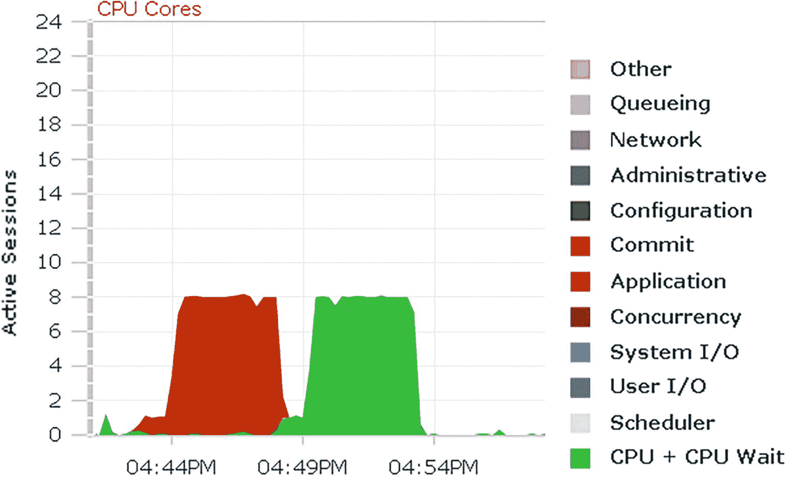

该图显示了在 5 分钟时间间隔内三个不同时刻的活跃 CPU 核心会话数。起始时间为下午 4:44。

**图 18-3**

Oracle Enterprise Manager 的（修改版）顶级活动报告示例

`EVENT` 列存储在许多表和视图中，例如 `V$SESSION` 和 `V$ACTIVE_SESSION_HISTORY`。`EVENT` 列很有用，但我们必须记住，NULL 确实表示“CPU”。以下是查看近期会话活动的等待事件和等待类的示例：

```sql
--近期的等待事件
select
nvl(event, 'CPU') event,
nvl(wait_class, 'CPU') wait_class,
v$active_session_history.*
from v$active_session_history
order by sample_time desc;
```

实际上有数千个等待事件，其中大部分在《Database Reference》的“Oracle Wait Events”章节中都有记录。当我们查看关于等待事件的报告时，我们将学会哪些等待是预期的，哪些意味着麻烦。我们必须始终关注最常见的等待。总会有一些发生次数很少的奇怪等待事件。我们不想浪费时间调查那些很少发生的等待。

## 统计信息

统计信息包含活动会话和整个系统的*累积*数字。像 `V$SESSTAT` 和 `V$SYSSTAT` 这样的视图对于查找哪些会话或数据库使用了异常大量的资源非常有用。

例如，生成过多的重做数据可能是个问题。Oracle 不会跟踪每个 SQL 语句的重做使用情况，但以下查询显示了生成最多重做的会话。通过会话标识符 `SID`，我们可以开始追踪重做的来源：

```sql
--生成最多重做的会话
select round(value/1024/1024) redo_mb, sid, name
from v$sesstat
join v$statname
on v$sesstat.statistic# = v$statname.statistic#
where v$statname.display_name = 'redo size'
order by value desc;
REDO_MB   SID   NAME
-------   ---   ---------
360       268   redo size
2         383   redo size
1         386   redo size
...
```

## 指标

指标包含统计信息随时间变化的*比率*。最流行的指标是前面讨论的“buffer cache hit ratio”，它告诉我们数据从内存而不是从磁盘读取的百分比。

虽然统计信息提供总计数，但了解不同时间点的比率更有用。例如，如果一个数据库系统生成了 1 PB 的 I/O，这并不一定能说明太多问题，这个数字的重要性取决于实例已经运行了多长时间。但如果我们查看指标“I/O megabytes per second”，如下面的查询所示，这些数字是系统性能更有意义的度量：

```sql
--当前每秒 I/O 使用量（兆字节）
select begin_time, end_time, round(value) mb_per_second
from gv$sysmetric
where metric_name = 'I/O Megabytes per Second';
BEGIN_TIME            END_TIME              MB_PER_SECOND
-------------------   -------------------   -------------
2022-08-14 20:45:13   2022-08-14 20:46:13              263
```

## 采样

采样是 Oracle 中衡量性能最有用的方法。我们可能*认为*自己想知道每次 SQL 执行的每一个细节，但实际上，如此多的信息会让人难以承受。在实践中，每秒钟拍一张快照，然后基于这些样本进行调优，就已经足够好了。采样用于 Automatic Workload Repository 和 Active Session History，这将在接下来的章节中描述。

我们可以通过采样解决 99.9% 的性能问题。在现代版本的 Oracle 中，捕获数据库的所有活动（例如使用追踪）几乎是从来不需要的。我们不需要构建自己的采样系统，也不需要决定采样频率或采样内容。Oracle 的采样系统始终在运行，针对每个用户和每条语句，并且数据通过视图可以轻松访问。即使我们想禁用 Oracle 的采样也做不到，而追踪则必须手动启用，可能消耗大量资源，并且需要外部的、非关系型工具来理解。再次强调，容易访问的良好数据胜过难以访问的完美数据。


## 自动工作负载存储库 (AWR)

自动工作负载存储库和活动会话历史可能是最强大的数据库调优功能。这些程序持续收集重要信息；我们只需查询一张表或调用一个包即可生成报告。（但请注意许可问题。尽管 Oracle 默认开启了所有功能，但这并不意味着我们已获得使用它们的许可。）

为了演示这些工具如何工作，让我们做一些极其缓慢的操作，看看 Oracle 能否告诉我们如何修复代码。首先，运行以下 PL/SQL 代码块。该代码块使用一个未加索引的列，对 `SATELLITE` 表进行了大量查询。这段代码目前什么也不做——只是为了在稍后的报告中生成活动记录：

```sql
--使用非索引列反复对一个大表进行计数。
--运行大约需要 10 分钟。
declare
  v_count number;
begin
  dbms_workload_repository.create_snapshot;
  for i in 1 .. 200000 loop
    select count(*)
    into v_count
    from satellite
    where orbit_class = 'Polar';
  end loop;
  dbms_workload_repository.create_snapshot;
end;
/
```

自动工作负载存储库收集大量信息，并将这些信息划分为快照。默认情况下，一个快照包含 1 小时的数据，这些数据会保留 8 天。可以配置 AWR 以更频繁或更少地摄取快照，并延长或缩短数据保留时间，但这些更改可能需要更多空间。快照使我们能够生成时间段报告、创建性能基线并比较时间段。有许多方法可以自定义 AWR 的收集。例如，前面的 PL/SQL 块调用了函数 `DBMS_WORKLOAD_REPOSITORY.CREATE_SNAPSHOT`，因此我们不必等待一小时才能在报告中看到我们的慢查询。

尽管大多数 DBA 仍然使用操作系统文件和脚本来生成 AWR 报告，但最简单的方法是通过 SQL 来生成。首先，我们需要找到相关的快照范围，如下所示：

```sql
--查找快照，用于生成 AWR 报告。
select dbid, snap_id, begin_interval_time, end_interval_time
from dba_hist_snapshot
order by begin_interval_time desc;
```

如果我们从上一个查询中选取 `DBID` 和最新的两个 `SNAP_ID` 值，就可以将它们填入以下函数来生成 AWR 报告：

```sql
--生成 AWR 报告。
select *
from table(dbms_workload_repository.awr_report_html(
  l_dbid     => 985569476,
  l_inst_num => 1,
  l_bid      => 6709,
  l_eid      => 6710
));
```

前面的表函数返回多行数据，每一行对应 HTML 报告中的一行。如果我们复制所有行，将它们粘贴到文本文件中，将文件保存为 .html 文件，然后用浏览器打开该文件，就会发现丰富的信息。我们也可以直接使用众多的 `DBA_HIST_*` 视图查询 AWR 数据。

AWR 报告可能非常庞大且令人望而生畏，因此我甚至不打算费心附上截图。打开前面生成的 AWR 报告，向下滚动到“Main Report”，其中包含不同部分的菜单。如果我们点击“SQL Statistics”，然后点击“SQL ordered by Elapsed Time”，应该会看到我们从 `SATELLITE` 表中计数的 SQL 语句。一个 HTML 表格显示了该语句运行的次数、花费的时间等信息。

## 活动会话历史 (ASH)

活动会话是指正在等待某种资源（如 CPU、内存、磁盘 I/O、锁定的行等）的数据库会话。实际的数据库性能调优只关心这些活跃的、正在等待的会话。如果一个会话是故意休眠或在等待客户端命令，那么性能问题就不在我们的数据库内部。Oracle 每秒为每个正在主动等待某物的会话创建一行数据。这些数据被称为活动会话历史 (ASH)。

ASH 与 AWR 相关，但存在关键区别。ASH 数据每 1 秒采样一次，而 AWR 数据每 10 秒采样一次。ASH 数据仅保留约 1 天，而 AWR 数据默认保留 8 天。ASH 和 AWR 都可以通过报告查看，但更常见的做法是仅通过查询访问 ASH。ASH 数据主要通过 `V$ACTIVE_SESSION_HISTORY` 视图查询，而 AWR 数据主要通过 `DBA_HIST_ACTIVE_SESS_HISTORY` 视图查询。

`V$ACTIVE_SESSION_HISTORY` 中的 112 个列为我们提供了关于数据库近期发生的大量信息。如果你以前没有使用过这个视图，应该花点时间浏览一下它的行和列。该动态性能视图完全存储在内存结构中，查询速度始终很快，而 AWR 表可能包含大量历史数据，可能会减慢我们的查询速度。由于性能调优最好以广度优先的方式进行，因此 ASH 相比 AWR 的查询性能优势很重要。

理解 ASH 的最佳方法之一是按每个 `SAMPLE_TIME` 计算行数来统计活动会话的数量。这个活动会话数量是衡量数据库活动的一个好方法。平均每个时间戳只有少量样本的数据库并不繁忙。每个时间戳有上百个样本的数据库可能就过于繁忙了。

采样数据的关系型接口提供了一个绝佳的调优机会。预制的报告很好，能满足许多需求，但最终我们会形成自己的性能调优风格，并构建自己的查询和报告。例如，我觉得 AWR 报告对每条 SQL 语句的细节描述不够，而且共享和比较 HTML 很困难。仅仅通过一个查询，我就能将 AWR 和 ASH 结合成一个纯文本图表，按照我喜欢的方式展示数据。^(⁴¹)

太多开发人员忽略了 ASH 数据，因为“它只是个样本”。但采样正是我们所需要的。如果一个问题持续时间不到一秒，并且从未在采样中被捕获，那么它就不是一个值得担心的问题。


### 自动数据库诊断监视器（ADDM）

自动数据库诊断监视器（ADDM）通过分析 AWR 数据帮助发现数据库性能问题。在发现一个问题后，ADDM 通常会建议使用其中一种自动指导工具来找到具体的解决方案。这些流程可以被设置为自动发现并修复性能问题。

实际上，ADDM 和这些指导工具并不总是那么有用。它们只擅长发现那些我们自己也能找到和解决的简单问题。不过，在未来版本的数据库或未来自治数据库环境中，自动调优系统应当会有所改进。

使用 ADDM 有多种方式。以下示例为我们之前查看的相同快照创建了一份 ADDM 报告：

```
--生成 ADDM 任务。
Declare
v_task_name varchar2(100) := 'Test Task';
begin
dbms_addm.analyze_db
(
task_name      => v_task_name,
begin_snapshot => 6709,
end_snapshot   => 6710
);
end;
/
```

我们可以通过再次调用 `DBMS_ADDM` 来查看报告。报告可能会生成大量的建议，但在报告的某个地方，应该会提到我们针对 `SATELLITE` 表的查询。（但我不能保证在你的系统上会有什么建议。那个长时间运行的 PL/SQL 块被设置为运行大约 10 分钟，因为这通常足以触发一条建议，但建议的阈值并未公开文档化。）

```
--查看 ADDM 报告。
select dbms_addm.get_report(task_name => 'Test Task') from dual;
...
建议 1: SQL 优化
估计的收益是每秒 0.39 个活动会话，占总活动的 96.77%。

操作
针对 SQL_ID 为 "5115f2tc6809t" 的 SELECT 语句运行 SQL 优化指导。
相关对象
SQL ID 为 5115f2tc6809t 的 SQL 语句。
SELECT COUNT(*) FROM SATELLITE WHERE ORBIT_CLASS = 'Polar'
依据
...
```

ADDM 实际上还没有 `优化` 任何东西，但前面的报告已经提供了有用的信息。请注意报告中的依据，不要盲目实施每一条建议。注意前面的输出包含了活动会话数。这个数字告诉我们通过优化这个查询可能节省多少数据库活动。如果活动会话的收益太低，那就不值得进一步调查。

前面的 ADDM 输出还包括了 SQL 语句和 `SQL_ID`。建议的操作是通过 SQL 优化指导运行该 SQL 语句，而我们需要这个 `SQL_ID` 来执行此操作。

### 指导工具

Oracle 提供了多种方式向我们提供建议。包括 SQL 优化指导、SQL 访问指导、优化器统计信息指导，以及视图 `V$SGA_TARGET_ADVICE` 和 `V$PGA_TARGET_ADVICE`。SQL 优化指导可以检查 SQL 语句的执行情况，并提供如何使其运行更快的思路。

例如，我们可以使用之前在 AWR 和 ADDM 报告中找到的 `SQL_ID`。首先，我们必须创建一个调优任务，执行该调优任务，并保存任务名称以备后用：

```
--创建并执行 SQL 优化指导任务
declare
v_task varchar2(64);
begin
v_task := dbms_sqltune.create_tuning_task(
sql_id => '5115f2tc6809t');
dbms_sqltune.execute_tuning_task(task_name => v_task);
dbms_output.put_line('Task name: '||v_task);
end;
/
Task name: TASK_18972
```

我们可以通过获取前面的任务名称并将其插入以下 SQL 语句来查看报告：

```
--查看调优任务报告。
select dbms_sqltune.report_tuning_task('TASK_18972') from dual;
...
1- 索引发现（参见下面的执行计划部分）

此语句的执行计划可以通过创建一个或多个索引来得到改进。
建议（估计收益：96.64%）

- 考虑运行访问指导以改进物理模式设计，或创建推荐的索引。
create index SPACE.IDX$$_4A1C0001 on SPACE.SATELLITE("ORBIT_CLASS");
依据

...
```

前面报告中的建议看起来是正确的；在 `ORBIT_CLASS` 列上创建索引几乎肯定会对我们刚刚运行了数千次的查询有帮助。完整报告还包括元数据、建议背后的依据，以及如果接受该建议的前后执行计划。SQL 优化指导可以推荐其他类型的更改，例如可以帮助将执行计划推向正确方向的 SQL 配置文件。SQL 配置文件将在后面讨论。


## 自动索引

### 概述

Oracle 不断创建自动化流程以简化开发和管理。自动索引作为 Oracle 自治数据库产品中的关键新特性之一，在 19c 版本中引入。优化索引需要大量的技能和精力，而像**访问顾问**和 **SQL 调优顾问**这样的工具早已提供索引协助。本节将展示自动索引如何将所有自动化部分整合起来，为开发人员免除大部分索引任务。

即使我们不打算使用自动索引，也应该了解这个特性，因为它代表了 Oracle 技术的未来。另一方面，目前该技术存在一些显著问题，可能尚未准备好在大多数生产系统中使用。这个强大的特性可能显著影响性能，因此在生产环境使用前，我们应阅读所有文档并进行彻底测试。

### 实施步骤

实施自动索引的第一步是通过查询数据字典视图 `DBA_AUTO_INDEX_CONFIG` 来检查当前配置。参数 `AUTO_INDEX_MODE` 可以设置为 `OFF`、`REPORT ONLY` 或 `IMPLEMENT`。我们可以通过调用 `DBMS_AUTO_INDEX` 包来修改配置，从而开始使用此特性。（此特性目前仅在 Exadata 和自治数据库上可用，因此第一条命令可能会因错误“ORA-40216: 功能不支持”而失败。）启用报告模式后，Oracle 将创建索引，但会将其设置为不可见，以便它们不被使用：

```
--启用 REPORT ONLY（不可见索引）。
begin
dbms_auto_index.configure('AUTO_INDEX_MODE','REPORT ONLY');
end;
/
```

接下来，我们需要设置我们希望自动索引的模式。以下 PL/SQL 块一次添加一个模式。如果您更改模式名称，代码不会删除其他模式；它只会将新的模式名称添加到列表中：

```
--允许对 SPACE 模式进行自动索引。
begin
dbms_auto_index.configure('AUTO_INDEX_SCHEMA', 'SPACE', true);
end;
/
```

为了测试该特性，让我们创建一个大表，然后在该表上运行一个显然能从索引中受益的查询：

```
--创建大表，收集统计信息，运行需要索引的查询。
create table satellite2 as select * from satellite;
begin
for i in 1 .. 100 loop
insert into satellite2 select * from satellite;
end loop;
end;
/
begin
dbms_stats.gather_table_stats(null, 'satellite2');
end;
/
select * from satellite2 where satellite_id = 1;
```

最后，我们必须等待大约 30 分钟，以便自动任务运行。我们应该能看到一个新索引出现在使用此命令生成的活动报告中：

```
--生成关于上次创建的索引的报告。
select dbms_auto_index.report_last_activity from dual;
```

报告可能会变得相当大，并且可能包含多个部分，包括报告日期、创建和删除的索引摘要、创建和删除的索引详情，以及包含执行前后计划和统计信息的验证详情。例如，以下是我们运行的慢速 SQL 语句报告的一小部分：

```
...
索引详情

1. 创建了以下索引：

| 所有者 | 表          | 索引                 | 键             | 类型   | 属性   |
|--------|-------------|----------------------|----------------|--------|--------|
| SPACE  | SATELLITE2  | SYS_AI_adscrw50ccvut | SATELLITE_ID   | B-TREE | NONE   |

...
```

在其他地方还有更多信息可用。我们不是生成关于上次活动的报告，而是可以使用同一个包生成不同日期范围的报告。有几个 `DBA_AUTO_INDEX_*` 视图可以告诉我们执行了哪些 SQL 语句，如何验证索引及相关执行计划，以及摘要数据。我们还可以通过数据字典列 `DBA_INDEXES.AUTO` 和 `DBA_INDEXES.VISIBILITY` 来跟踪自动索引。如果我们对自动索引不满意，可以使用 `DBMS_AUTO_INDEX` 包删除它们。

### 问题与局限

尽管前面的例子看似简单，但自动索引可能会发生许多意想不到的复杂情况。首先，前面的例子不可靠地复现，我不确定原因。也许有时查询被某个采样算法捕获，而有时则没有。另一方面，上一节中的语句 `SELECT COUNT(*) FROM SATELLITE WHERE ORBIT_CLASS = 'Polar'` 运行了 10 分钟，显然能从索引中受益，甚至被 SQL 调优顾问标记为需要索引，但自动索引器从未为其推荐索引。很难判断使用了什么标准，但它们显然不足以解决我们所有缺失索引的问题。

此外，`REPORT ONLY` 模式的名称具有误导性，因为它实际上创建了索引，而不是仅仅报告如果启用该任务会执行的操作。将索引设置为不可见似乎是一个糟糕的折中方案，因为不可见索引仍然可能产生实际后果。根据我的经验，创建过多索引的问题不在于优化器会错误地使用这些索引。创建过多索引的主要问题是它们消耗过多空间，并在修改数据时需要额外的工作。不可见索引不会被我们的查询使用，但它们仍然需要额外的存储空间和额外的索引维护工作。

此特性可能尚未准备好用于生产环境。实施中有几个陷阱，API 有点粗糙，报告并不总是有用或一致，该特性仅在少数环境中可用，等等。

### 结论

整个实施给人一种仓促的感觉——考虑到 Oracle 处理其最近版本的方式，很可能确实如此。但我们仍然应该关注自动索引，看看它在未来版本中如何改进。像创建索引、物化视图、区域映射等自治流程最终将改变我们的工作方式。在未来，普通开发人员可能根本不需要担心索引（除了外键等一些必要的索引）。自动索引可能会满足我们 75% 的性能需求，并且只需一名开发人员或管理员即可处理所有异常情况。如果我认为一个索引只有 75% 的成功几率，我不会在生产环境中创建它。但也许这里的教训是，我们必须降低对自动化系统的期望，并接受系统不需要 99% 的时间都能工作才具有价值。


### 其他工具

性能调优需要许多工具，而不仅仅是前面列出的那些，尤其是因为数据库问题和操作系统问题之间并不总是有清晰的界限。对于数据库管理员来说，掌握服务器操作系统的知识以及能够诊断常见操作系统问题的命令尤为重要。

但是，我们应该对购买昂贵的闭源程序来帮助我们调优数据库持怀疑态度。除非我们能先试用它们，或者得到我们信任的开发人员的推荐，否则我们不应该把钱花在额外的调优程序上。大多数性能调优程序不过是围绕 Oracle 免费提供的工具所做的昂贵而光鲜的包装而已。

将时间和金钱投资于一个小型、专有的调优程序是有风险的。即使这个程序现在很有帮助，将来我们能够使用它的可能性也很低。Oracle 用户往往只会购买少量昂贵的产品。如果你是一名 Oracle 开发人员，并换工作到其他地方开发 Oracle，那么你唯一能保证带走的技能就是 SQL 和 PL/SQL。

我们甚至对使用 Oracle 企业管理器（OEM）也应该保持谨慎。OEM 是一个强大、有用的程序，它有许多页面可以引导我们解决性能问题。不幸的是，OEM 远不如 Oracle 数据库本身可靠。如果我们变得依赖 OEM，那么当 OEM 不可用或自身出现性能问题时，我们最终会遇到麻烦。只要可能，我们应该使用 SQL 和 PL/SQL 接口来进行数据库调优。

## SQL 调优：寻找慢速 SQL

SQL 调优的第一个也是最不被重视的步骤是找到慢速的 SQL 语句。这项任务比听起来更难，尤其是因为我们的数据库运行着海量的 SQL 语句。我们需要创建一个有组织的系统来进行性能故障排查，精确定义“慢”的含义，并且能够找到当前运行缓慢或过去曾运行缓慢的 SQL。

### 有条理地组织

每个 Oracle 开发人员都必须有一套有组织的、用于排查 Oracle 性能问题的工作表。组织这些文件的方式有很多种——比如放在桌面的一个目录里，一个 GitHub 仓库等等。但这些文件必须放在我们容易记住并能快速找到的地方——便利性比完美更重要。

当我们遇到问题时，应该能在几秒钟内调出我们可靠的工作表。例如，我在本书的 GitHub 仓库中，文件 “Performance.sql” 里附上了我自己的工作表。我并不指望你使用我的文件；我们都有不同的偏好和调优风格。但你应该有类似的东西，它应该易于访问，并能让你逐步改进故障排查过程。这些文件将发展成我们思考 Oracle 问题的思维导图，因此不存在一刀切的解决方案。

### “慢”是基于数据库时间（DB Time）

本章重点关注慢的事物，但由谁来定义“慢”意味着什么？对于最终用户来说，只有墙钟运行时间才重要，但只关注运行时间可能会导致问题。我们实际上是在寻找浪费的东西——那些使用了超出必要资源的事物。我们需要一个比墙钟运行时间更有意义，但又比完整的系统资源利用率描述更简单的指标。

我们不想以牺牲其他进程为代价来提高某一个查询的速度。例如，用 9 秒钟的并行全表扫描替换 10 秒钟的索引访问可能会改善运行时间，但这将是资源的巨大浪费。而且，如果速度无关紧要，我们也不想提高它；如果一个过程调用了 `DBMS_LOCK.SLEEP`，那么这个过程是故意缓慢的，不会使用任何重要资源，也不需要调优。

幸运的是，“数据库时间”（DB time）统计信息准确地反映了数据库、SQL 语句和操作的资源利用率。数据库时间就是在数据库中进行有意义工作所花费的时间。本章的主要指标，`ELAPSED_TIME`、活动会话数和“% Activity”（活动百分比），都与数据库时间密切相关。例如，如果一个并行查询繁忙地运行了 10 秒钟并使用了两个并行服务器，那么 `ELAPSED_TIME` 将为 20 秒。如果一个过程因为 `DBMS_LOCK.SLEEP(60)` 而运行了一分钟，那么 `ELAPSED_TIME` 将为 0 秒。

### 查找当前正在运行的慢速 SQL

我们需要了解的关于我们的 SQL 的所有信息都可以在数据库内部使用 SQL 找到。除了一个好的 IDE，我们不想依赖昂贵的闭源程序来查找慢速 SQL 语句。

动态性能视图 `V$SQL` 是查找当前正在运行的 SQL 语句的关键。当我看到一个实时性能问题时，这是我运行的第一个查询：

```sql
--所有当前正在运行的 SQL 语句。
select
elapsed_time/1000000 seconds,
executions,
users_executing,
parsing_schema_name,
sql_fulltext,
sql_id,
v$sql.*
from v$sql
where users_executing > 0
order by elapsed_time desc;
```

上面的查询准确地告诉我们当前在数据库上运行的是哪些语句。解释列和表达式很棘手，因此最重要的列简要描述如下：

1.  `SECONDS`/`ELAPSED_TIME`：该语句所有执行累计花费的数据库时间。^(参见脚注 42) 总是有多个语句在运行；我们需要这个列以便关注那些慢的。

2.  `EXECUTIONS`：语句被执行的次数。调优一个每小时运行一次的语句与调优一个每小时运行一千次的语句是不同的。

3.  `USERS_EXECUTING`：当前正在运行此 SQL 语句的会话数。对于并行查询，此数字包括每个并行会话。

4.  `PARSING_SCHEMA_NAME`：运行该 SQL 的模式或用户。

5.  `SQL_FULLTEXT`：SQL 的确切文本。

6.  `SQL_ID`：基于 SQL 文本哈希计算的唯一标识符。此 ID 几乎用于所有调优工具，是我们调优时需要首先寻找的东西之一。由于 `SQL_ID` 是一个哈希值，它对空格和大小写敏感。我们需要小心精确地复制我们的 SQL 语句以获得相同的 `SQL_ID`。

7.  `V$SQL.*`：这 104 个列中的每一个都可能是重要的。大量的列是我们无法实际使用命令行进行调优的原因之一。当出现性能问题时，我们必须探索大量数据。

不要期望能揭开 `V$SQL` 的所有奥秘。我们可能永远无法理解所有的列、值，或者为什么有这么多看似重复的行。但不要让这种复杂性吓退你；即使我们没有完全理解它，`V$SQL` 也是极其有用的。

Oracle 对“正在运行”的定义可能与我们理解的不同。如果游标仍然打开，一个 SQL 语句就会出现在 `V$SQL` 中，并有一个或多个 `USERS_EXECUTING`。出现在 `V$SQL` 中并不意味着 Oracle 一定在对该语句做任何事情。程序运行一个查询，检索前 N 行，然后让查询在那里停留一段时间，这种情况相当常见。Oracle 不跟踪应用程序下载或处理行所花费的时间。一行可能在 `V$SQL` 中显示为活动状态很长时间，但 `ELAPSED_TIME` 却很小。从数据库的角度来看，我们只关心那些 `ELAPSED_TIME` 很大的查询。

### 查找历史慢速 SQL

查找过去运行缓慢的 SQL 可能比查找当前正在变慢的 SQL 更具挑战。我们需要能够快速搜索多个数据源——`V$SQL`、`V$ACTIVE_SESSION_HISTORY`、`DBA_HIST_ACTIVE_SESS_HISTORY` 和 `DBA_HIST_SQLTEXT`。并且需要查找 SQL 文本、时间、用户名以及许多其他列的组合条件。一个好的 IDE 和高级 SQL 技能将派上用场。

我们还需要记住，数据最终会从每个数据源中老化清除。粗略估计，`V$SQL` 会保留一个小时（如果共享池被手动刷新则更短），`V$ACTIVE_SESSION_HISTORY` 会保留一天，而 `DBA_HIST_*` 会保留 8 天。

## SQL 调优：查找执行计划

在找到慢速 SQL 语句后，我们很容易忍不住立即去查找执行计划。但不要忽视理解 SQL 本身的重要性。最佳的性能调优是将 SQL 重写得更简单、找到批量运行查询的方法，或是使用高级特性。如果无法修改 SQL 来避免问题，那么我们需要深入研究执行计划。但首先，请记住：解释计划（explain plans）是估算的计划，而执行计划（execution plans）才是实际的计划。这两个术语很容易混淆，甚至文档和 Oracle 程序偶尔也会弄错它们。

### 图形化执行计划的弊端

不要使用 IDE 的图形界面来查看执行计划和解释计划。尽管这些图形报告看起来漂亮，并且可以一键轻松生成，但图形化计划总是错误的或具有误导性。

让我们从一个仅连接 `SATELLITE` 和 `LAUNCH` 表的简单例子开始：

```sql
--所有卫星及其发射信息。
select *
from satellite
left join launch
on satellite.launch_id = launch.launch_id;
```

在 Oracle SQL Developer 中，我们只需按 F10 即可生成解释计划。图 18-4 显示了由 SQL Developer 生成的解释计划。

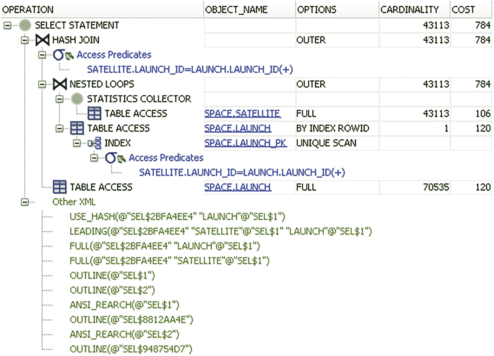

表格片段有 5 列：操作（operation）、对象名称（object name）、选项（options）、基数（cardinality）和成本（costs）。该行中的 select 语句包含两部分：哈希连接（hash join）和 `Other XML`。

图 18-4：Oracle SQL Developer 解释计划显示

上述输出存在几个问题。此查询生成了一个自适应计划（adaptive plan）；有时计划会使用哈希连接，有时则会使用嵌套循环连接。然而，上述解释计划并未明确指出哪些操作是活动的，哪些是非活动的。此外，“Other XML”部分令人困惑——该部分包含很少需要的高级信息。同时，该 XML 部分是不完整的，并未包含解释计划使用的所有提示（hints）。

我并非想针对 SQL Developer——对于数据库开发来说，它是一个很棒的程序。我使用过的每一个 SQL IDE 在可视化执行计划方面都存在类似的问题。对于执行计划和查询计划，我们应力求 100% 的准确性。在进行性能调优时，哪怕最细微的错误也可能掩盖问题所在。

### 文本方式最佳

`EXPLAIN PLAN` 命令和 `DBMS_XPLAN` 包是显示解释计划的最佳方式。例如，以下代码为 `SATELLITE` 和 `LAUNCH` 之间的简单连接生成解释计划：

```sql
--所有卫星及其发射信息。
explain plan for
select *
from satellite
left join launch
on satellite.launch_id = launch.launch_id;
select * from table(dbms_xplan.display);
```

图 18-5 显示了输出。（这是另一个由于媒介限制，我未能遵循自己建议的情况。通常，最好复制并粘贴解释计划的原始文本，但 89 个字符的宽度可能无法适应印刷页面的宽度。）

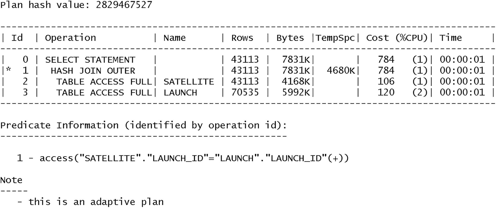

该计划输出图像有一个哈希值 2829467527，一个包含 8 列 4 行的表格，以及带有注释的预测信息。

图 18-5：来自 `DBMS_XPLAN` 的简单解释计划输出

上述解释计划显示比图形化可视化更为准确。输出仅包含活动的哈希连接，而非活动的嵌套循环连接则没有出现。“Note”部分警告我们，我们正在查看的是一个自适应计划，并且表面之下还有更多信息。如第 17 章所讨论，如果我们想查看非活动操作，可以使用以下 SQL 语句：

```sql
--查看自适应计划的所有非活动行。
select * from table(dbms_xplan.display(format => '+adaptive'));
```

`EXPLAIN PLAN` 和 `DBMS_XPLAN` 相对于解释计划的图形化表示有许多优势：

1.  **简洁、标准的格式**：`DBMS_XPLAN` 适用于任何环境，并生成每个 Oracle 专业人员都熟悉的输出。任何有权访问 Oracle 的人都可以重现该问题，并且任何人都可以使用相同的标准名称讨论该问题。我们不能假定其他开发人员可以访问我们喜欢的 IDE。
2.  **易于处理的输出**：输出易于保存、共享和搜索。我们可以将输出存储在表中、将文本复制到记事本等。使用像 WinMerge 这样的 diff 程序来比较输出也要容易得多。大型查询可能在解释计划中产生数百行，使用 diff 工具可以使调优变得更容易。对于编程而言，文本比图片更好。
3.  **包含重要部分**：由于某种奇怪的原因，IDE 从不显示“Note”部分。该部分包含至关重要的信息。没有“Note”部分，我们就不得不猜测是否有异常情况发生。
4.  **更准确**：正如我们之前看到的，IDE 生成的结果略有偏差。另一个常见问题是，有些 IDE 使用单独的会话来生成图形化解释计划。像 `ALTER SESSION ENABLE PARALLEL DML` 这样的会话设置并不总是应用于图形化解释计划。
5.  **更强大**：`DBMS_XPLAN` 可以编写成脚本，并具有将在下一节中描述的强大功能。

对于快速检查，按 F10、F5、CTRL+E 或我们 IDE 中的任何快捷键会更容易。对于将要与他人共享的严肃的执行计划分析，请始终使用 `EXPLAIN PLAN` 和 `DBMS_XPLAN`。基本的命令值得记忆。记住所有细节很难，但我们总可以在 *SQL Language Reference* 中查找 `EXPLAIN PLAN`，并在 *PL/SQL Packages and Types Reference* 中查找 `DBMS_XPLAN`。

### DBMS_XPLAN 函数

函数 `DBMS_XPLAN.DISPLAY` 仅适用于通过 `EXPLAIN PLAN` 命令收集的解释计划。那些解释计划仍然是估算值，尽管在实践中，除非存在绑定变量或自适应计划，否则估算通常是准确的。

函数 `DBMS_XPLAN.DISPLAY_CURSOR` 显示已运行 SQL 语句的*实际*执行计划。为了标识 SQL 语句，必须向此函数传递一个 `SQL_ID` 参数。`DISPLAY_CURSOR` 特别有用，因为它显示的是实际数字，而不仅仅是估算值。实际数字的重要性将在本章后面讨论。解释计划很方便，特别是用于快速演示，但如果你需要绝对确定执行计划，你可能希望坚持只使用执行计划。

函数 `DBMS_XPLAN.DISPLAY_AWR` 可以显示一条 SQL 语句使用过的所有不同执行计划。历史记录可以追溯到 AWR 保留期，默认情况下为 8 天。此功能对于诊断查询曾经运行快速但现在运行缓慢的问题非常有用。


## DBMS_XPLAN FORMAT 参数

`DISPLAY*` 函数最重要的参数是 `FORMAT`。`FORMAT` 参数接受一个以空格分隔的选项列表。其中最常见的选项有 `BASIC`（仅显示 ID、操作和名称）、`TYPICAL`（显示默认列）以及 `ADAPTIVE`（显示非活动操作）。

除了这些选项，`FORMAT` 还接受一些用作执行计划修饰符的关键字。例如，我们可能想显示 `BASIC` 格式但同时包含 `ROWS`。另一方面，我们也可以显示 `TYPICAL` 格式但排除 `ROWS`。以下 SQL 语句展示了一些选项组合：

```
--FORMAT options.
select * from table(dbms_xplan.display(format => 'basic +rows'));
select * from table(dbms_xplan.display(format => 'typical -rows'));
```

手册中列出了其他几种格式化选项，以及一些有用的隐藏选项。`ADVANCED` 或 `+OUTLINE` 都会生成包含“Outline Data”部分的输出。这个新部分显示了一组完整描述该计划的提示：

```
--Display Outline Data.
select * from table(dbms_xplan.display(format => 'advanced'));
```

输出充满了晦涩难懂的、未文档化的提示。以下结果仅显示执行计划的“Outline Data”部分。不要花太多时间研究输出；我们不需要理解所有这些提示：

```
...
Outline Data

/*+
BEGIN_OUTLINE_DATA
USE_HASH(@"SEL$2BFA4EE4" "LAUNCH"@"SEL$1")
LEADING(@"SEL$2BFA4EE4" "SATELLITE"@"SEL$1" "LAUNCH"@"SEL$1")
FULL(@"SEL$2BFA4EE4" "LAUNCH"@"SEL$1")
FULL(@"SEL$2BFA4EE4" "SATELLITE"@"SEL$1")
OUTLINE(@"SEL$1")
OUTLINE(@"SEL$2")
ANSI_REARCH(@"SEL$1")
OUTLINE(@"SEL$8812AA4E")
ANSI_REARCH(@"SEL$2")
OUTLINE(@"SEL$948754D7")
MERGE(@"SEL$8812AA4E" >"SEL$948754D7")
OUTLINE_LEAF(@"SEL$2BFA4EE4")
ALL_ROWS
DB_VERSION('12.2.0.1')
OPTIMIZER_FEATURES_ENABLE('12.2.0.1')
IGNORE_OPTIM_EMBEDDED_HINTS
END_OUTLINE_DATA
*/
...
```

这些提示对于解决高级调优问题非常宝贵。如果一个查询在两个系统上运行方式不同，“Outline Data” 可能有助于解释差异。如果我们迫切地想强制计划在两个系统上以相同方式工作，可以将该提示块粘贴到查询中。`ADVANCED` 选项还会创建一个额外的“Query Block Name/Object Alias”部分，这对于在自定义提示中引用特定对象很有帮助。

使用大纲是一种粗暴的调优方式，并不能解决根本原因。但我们并不总是有时间去寻找执行计划差异的根本原因，我们只需要立即解决问题。

## “Note” 部分

在进行更深入的执行计划分析之前，我们应该检查“Note”部分。以下是最常见和最需要注意的提示：

1.  `Dynamic statistics used: dynamic sampling (level=2)`：级别 2 意味着缺少对象统计信息。
2.  `This is an adaptive plan`：存在多个版本的计划，而我们现在只看到一个。
3.  `Statistics/cardinality feedback used for this statement`：此计划已自我纠正。原始计划是不同的。
4.  `SQL profile/plan baseline/patch "X" used for this statement`：此计划受到影响或被强制以某种方式行为。
5.  `Direct load disabled because X`：直接路径写入可能被父级引用完整性约束、触发器和其他限制所阻止。
6.  `PDML disabled in current session`：并行 DML 未工作，通常是因为我们忘记运行 `ALTER SESSION ENABLE PARALLEL DML`。
7.  `Degree of parallelism is X because of Y`：请求的 DOP 以及使用该 DOP 的原因。DOP 对于大型查询是至关重要的信息，稍后将更详细地讨论。

与“Note”类似，“Predicate Information”部分也很重要。我们的谓词可能被秘密转换为不允许索引访问的形式。例如，如果我们在谓词中看到函数 `NLSSORT`，但我们在查询中并未显式使用该函数，那就意味着会话或数据库参数强制进行语言排序。

## 其他获取执行计划的方式

可以在 SQL*Plus 中使用 `AUTOTRACE` 功能快速生成执行计划。命令 `SET AUTOTRACE ON` 将自动显示结果、实际的执行计划以及来自执行的实际统计信息。如果我们想忽略查询的结果，可以使用命令 `SET AUTOTRACE TRACEONLY`。

执行计划信息也可以在数据字典视图 `V$SQL_PLAN` 中获取。从这些视图构建执行计划很困难，但这些视图对于查找特定的执行计划特征很有用。例如，我们可以使用 `V$SQL_PLAN` 来找出哪些语句使用了哪些索引。

## SQL 调优：寻找操作的实际执行时间和基数

许多开发者犯了一个巨大的错误，即没有深入研究到执行计划之外。一条 SQL 语句是算法和数据结构的集合——每条语句实际上是一个完整的程序。说“这个程序很慢”是没有意义的；我们需要知道程序的 *哪个部分* 很慢。我们需要深入下去，关注实际的操作统计信息。

操作是 SQL 调优的原子单位。测量操作的实际执行时间可以告诉我们哪些算法和数据结构是最慢的。测量实际的基数可以告诉我们 Oracle 为什么选择该操作。如果我们必须猜测哪些操作最慢，将会浪费大量时间。尽可能使用实际数据。


### GATHER_PLAN_STATISTICS

让我们创建一个慢速 SQL 语句来练习调优。我们将从一个虚构的 ETL 过程开始，该过程创建了 `LAUNCH` 表的副本。但这个过程犯了一个巨大的错误；它*在*数据加载到表中*之前*收集统计信息，而不是*之后*。Oracle 可以轻松处理*缺失的*统计信息，但处理*错误的*统计信息则更为困难：

```sql
--创建 LAUNCH2 表并在错误的时间点收集统计信息。
create table launch2 as select * from launch where 1=2;
begin
dbms_stats.gather_table_stats
(
ownname => sys_context('userenv', 'current_schema'),
tabname => 'launch2'
);
end;
/
insert into launch2 select * from launch;
commit;
```

在我们继续之前，我们需要更彻底地为失败做好准备。这个例子比之前的例子更复杂，因为我们必须避开许多自动修复性能问题的机制。如果我们只犯一个简单的错误，Oracle 会找到补偿的方法。较新的版本，尤其是具有自治功能的版本，很难被欺骗。根据你的版本、版本类型和配置，你可能需要临时禁用的不仅仅是结果缓存：

```sql
--临时禁用可能破坏示例的功能。
alter session set result_cache_mode = manual;
```

#### 使用 GATHER_PLAN_STATISTICS 获取实际执行计划

在统计信息错误的情况下，`LAUNCH2` 表更有可能导致性能问题。假设我们发现了一条慢速语句并想对其进行调优。要获取实际的执行计划数值，而不是仅仅是猜测，我们必须使用提示 `GATHER_PLAN_STATISTICS` 来运行慢速查询，如下所示：

```sql
--卫星发射的不同日期。
select /*+ gather_plan_statistics */ count(distinct launch_date)
from launch2 join satellite using (launch_id);
```

下一步是像下面这样找到 `SQL_ID`：

```sql
--查找 SQL_ID。
select * from gv$sql where sql_fulltext like '%select%launch2%';
```

我们必须使用前面的 `SQL_ID`，并在下面对 `DBMS_XPLAN.DISPLAY_CURSOR` 的调用中使用它。要查看由 `GATHER_PLAN_STATISTICS` 提示生成的额外数据，我们需要在 `FORMAT` 参数中使用值 `IOSTATS LAST`：

```sql
--第一次执行使用了 NESTED LOOPS，错误的基数，性能不佳。
select * from table(dbms_xplan.display_cursor(
sql_id => '82nk6712jkfg2',
format => 'iostats last'));
```

仅仅为了找到一个执行计划就做了这么多工作，但额外的努力即将得到回报。输出显示在图 18-6 中。请注意，执行计划包含了新列 "A-Rows" 和 "A-Time"——实际的值。

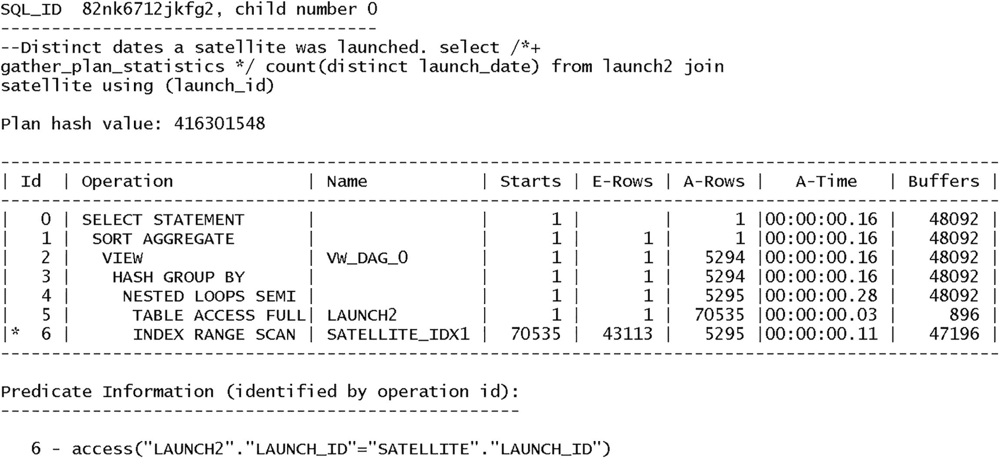
*图 18-6: 包含实际数值的慢速执行计划*

#### 分析执行计划以定位问题

下一个调优步骤是通过找到 "A-time" 最大的操作来精确定位*什么*是慢的。在上面的输出中，我们可以看到最慢的操作是耗时 0.28 秒的 `NESTED LOOPS SEMI`。如果我们想提高性能，就必须专注于那个操作。

这个执行计划很小，只有一个地方需要调优。对于更大的 SQL 语句和更大的执行计划，实际时间是找到真正问题的唯一方法。

接下来，我们想知道连接操作*为什么*慢。比较实际行数和估计行数是理解优化器错误的最佳方式。基数估计不需要完美，但需要大致正确，优化器才能做出好的决策。

在比较基数时，我们不是在寻找最大的错误——而是在寻找*第一个有意义的*错误。基数估计错误会在执行计划中传播，因此许多错误仅仅是根本错误的后果。执行计划是自内向外运行的，所以我们希望从最缩进的那一行开始。第 5 行和第 6 行是最缩进的。

第 6 行估计有 43113 行，但实际行数是 5295。这个估计已经足够好了。通常小于 10 倍的差异并不重要。

第 5 行估计有 1 行，但实际行数是 70535。如此巨大的差异值得我们关注。第 5 行是对 `LAUNCH2` 表的全表扫描。第 5 行没有星号，意味着该操作没有应用任何谓词。没有谓词，估计却如此错误，这很奇怪——除非统计信息是错误的。解决方案很简单——重新收集统计信息并再次运行：

```sql
--重新收集统计信息并重新运行查询。
begin
dbms_stats.gather_table_stats
(
ownname => sys_context('userenv', 'current_schema'),
tabname => 'launch2',
no_invalidate => false
);
end;
/
--卫星发射的不同日期。
select /*+ gather_plan_statistics */ count(distinct launch_date)
from launch2 join satellite using (launch_id);
--第二次执行使用了 HASH JOIN，基数正确，性能良好。
select * from table(dbms_xplan.display_cursor(
sql_id          => '82nk6712jkfg2',
cursor_child_no => null, --改进后的计划可能是一个子游标。
format          => 'iostats last'));
```

前面的代码生成了图 18-7 所示的执行计划。连接从 `NESTED LOOPS` 变为 `HASH JOIN`，这对于连接大部分数据来说更合适。实际基数几乎完美匹配估计基数，这强烈表明 Oracle 为给定的语句和对象创建了最佳可能的计划。实际时间也减少了。

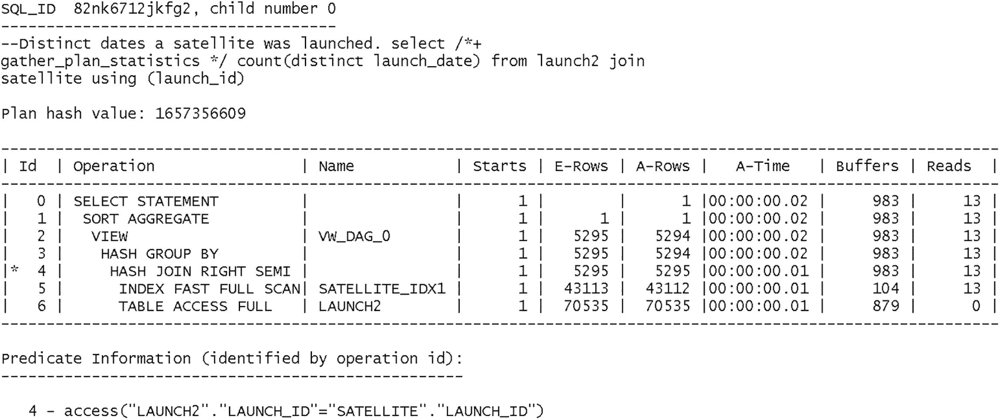
*图 18-7: 包含实际数值的快速执行计划*

所有迹象都表明 Oracle 生成了一个完美的执行计划。我们必须小心比较像 0.28 秒和 0.02 秒这样的小数字。如此小的差异可以通过缓存或系统活动来解释。为了完全确定我们的结果，我们可以多次运行前面的测试，可能在 PL/SQL 循环中运行。

这个测试案例可能感觉太刻意了；仅仅为了演示一个错误的基数估计就做了大量设置。这是因为 Oracle 在修复和预防性能问题方面已经变得异常出色。在现代版本的 Oracle 中，现实世界的性能问题很可能是由几个奇怪因素的组合引起的。SQL 调优不像过去那样常见，但当我们需要做时，它变得更加复杂。

## SQL 监控报告

### 实时 SQL 监控报告（文本格式）

实时 SQL 监控报告是优化长时间运行的 SQL 语句的最佳方式。这些报告提供了实际行数、实际耗时、等待事件以及其他重要信息。这些报告也无需重新执行语句，这对于 DML 或长时间运行的查询来说并非总是可行。

SQL 监控框架是另一种衡量 SQL 性能的方式。AWR 存储数天的高级指标，ASH 存储数小时的样本，而 SQL 监控则存储数分钟的详细信息。SQL 监控报告需要在语句运行期间或其完成后不久生成。^(参考脚注 44) 与 AWR 和 ASH 类似，我们也可以通过数据字典视图如`V$SQL_PLAN_MONITOR`和`V$SQL_MONITOR`访问 SQL 监控数据。

SQL 监控仅适用于运行时间超过 5 秒或包含`MONITOR`提示的语句。我们之前的例子运行时间不够长，无法生成 SQL 监控数据。相反，让我们在一个独立的会话中运行一个非常糟糕的 SQL 语句：

```
--荒谬的糟糕的连接查询。（在单独的会话中运行。）
select count(*) from launch,launch;
```

当上面的语句正在运行时，我们需要找到`SQL_ID`并调用`DBMS_SQLTUNE`来生成报告：

```
--查找 SQL_ID，在上一个语句运行时执行。
select *
from gv$sql where sql_fulltext like '%launch,launch%'
and users_executing > 0;
--生成报告。
select dbms_sqltune.report_sql_monitor('7v2qjmgrj995d') from dual;
```

函数`REPORT_SQL_MONITOR`可以生成多种格式的报告，默认文本格式如图 18-8 所示。其中包含大量重要信息，你可能需要花点时间看看输出。

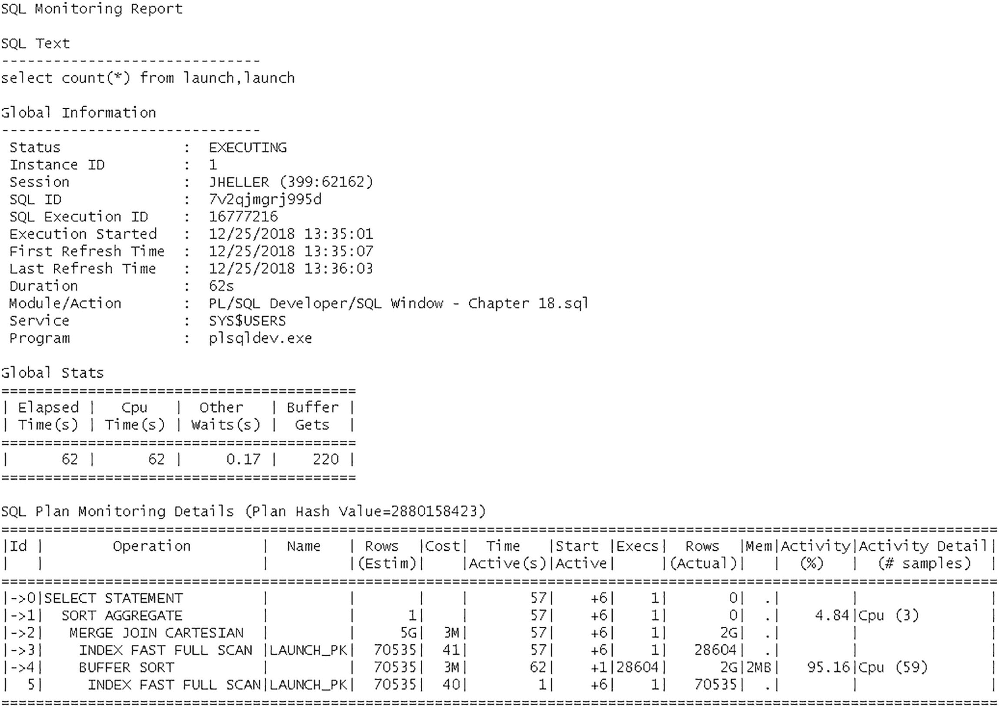

SQL 监控报告的图像。它展示了 SQL 文本、全局信息、全局状态以及 SQL 计划监控详情。

图 18-8

文本格式的实时 SQL 监控报告

前面的输出包含大量关于 SQL 语句的元数据，并且输出会根据查询类型而调整。例如，如果存在绑定变量，报告将显示绑定值。这些元数据很有帮助，因为这些报告值得保存并在日后进行比较。没有这些元数据，我们可能会忘记报告是何时由谁运行的。

报告中最重要的部分是操作表格。其格式类似于`DISPLAY_CURSOR`并包含实际值。我们可以使用“Rows (Actual)”获取真实基数，使用“Activity (%)”来找出最慢的操作。

“Activity Detail (# samples)”列提供了每个操作的每个等待事件的计数。括号中的数字表示查询等待该类资源的秒数。在前面的例子中，所有等待都是针对“Cpu”。在更实际的例子中，会有多种等待类型。与操作类似，我们只应该关注数量可观的等待。经常会出现一个听起来奇怪的等待事件，但如果该等待只发生了一次，那么就不值得担心。最常见的等待应该是针对 CPU 和 I/O，例如“Cpu”、“db file sequential read”和“db file scattered read”。我们可以在《Database Reference》手册的“Oracle Wait Events”附录中查找不寻常的事件。

监控报告还可能包含一个“Progress”列，给出操作的完成百分比。这个数字对于预测语句完成时间可能有用，但我们必须小心正确解释进度。许多操作会迭代，因此一个操作可能多次达到“99%”完成。“Execs”列告诉我们操作已经执行了多少次。

不幸的是，SQL 监控报告不包括“Note”或“Predicate Information”。有时我们可能需要使用`DBMS_SQLTUNE`和`DBMS_XPLAN`生成执行计划，并将两个结果结合起来以获得所有相关信息。

### 实时 SQL 监控报告（活动格式）

除了默认的文本格式，SQL 监控报告还可以生成为 XML、HTML 或活动格式。活动报告不仅仅是更漂亮的交互式 HTML 格式；它还包含对高级调优有用的额外信息。

活动报告包含调优并行 SQL 的有用信息，例如在整个查询生命周期中分配和使用了多少并行服务器。活动报告也有助于调优 PL/SQL 过程，因为报告包含所有相关 SQL 语句的详细信息。活动报告并不像应该的那样流行，可能是因为 HTML 文件曾经依赖 Adobe Flash，而许多开发者放弃了尝试运行它们。

生成活动报告从这样一个 SQL 语句开始：

```
--生成活动报告。
select dbms_sqltune.report_sql_monitor('242q2tafkqamm',
type => 'active')
from dual;
```

前面语句产生的 CLOB 结果必须保存为 HTML 文件，并在具有互联网连接的浏览器中打开。活动报告其中一页的示例如图 18-9 所示。报告中塞满了交互式信息，所以截图并不能充分体现其特点。

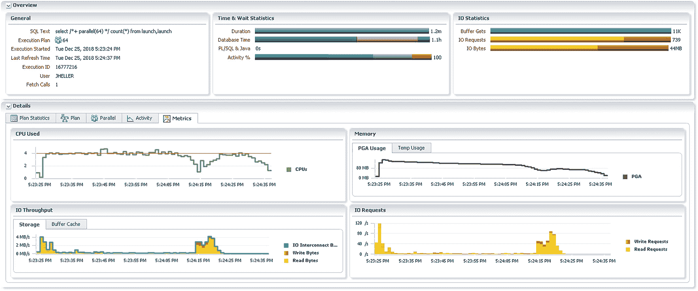

两个概览和详细选项的片段。概览有三个部分：常规、时间和等待统计以及 I/O 统计；而详细信息有四个图形部分。

图 18-9

活动格式的实时 SQL 监控报告

尽管活动报告是最强大的 SQL 调优工具之一，但文本格式仍然是一个好的默认选择，有几个原因。文本格式仍然更容易生成、共享和比较。但当我们需要更高级的调优功能或者只是想给管理层展示一张更漂亮的图片时，活动报告是一个不错的选择。

## 并行度

如果我们的 SQL 无法更智能地工作，我们可以通过并行使其更努力地工作。在数据仓库操作中，找到请求和分配的并行度至关重要。围绕并行存在许多误解，因此我们需要仔细衡量结果并使用实际数字而非猜测。

我们必须记住阿姆达尔定律以及并行化*每个*可能操作的重要性。如果执行计划中有一个 PX 操作，那么它就应该有许多 PX 操作。我们可以通过使用语句级提示而不是对象级提示来实现完全并行。

唯一不希望使用并行的情况是关联子查询。我们不希望并行化一个运行次数很多的操作——并行的开销会大于收益。避免此问题的最佳方法是将子查询重写为内联视图。

选择最优的 DOP 是困难的。较高的 DOP 对单个语句更好，但可能对其他进程不公平。

每个 Oracle 并行服务器都是一个轻量级进程，Oracle 能够处理大量的进程。开销随着每个并行服务器的增加而增加，但不像我们想象的那么多。高 DOP 肯定会有收益递减，并可能使系统的其余部分资源枯竭。但是，如果我们只执行一个足够长时间运行的语句，并且系统配置得当，那么更高的数字几乎总是更好。图 18-10 显示了 DOP 与单个语句性能之间的关系。

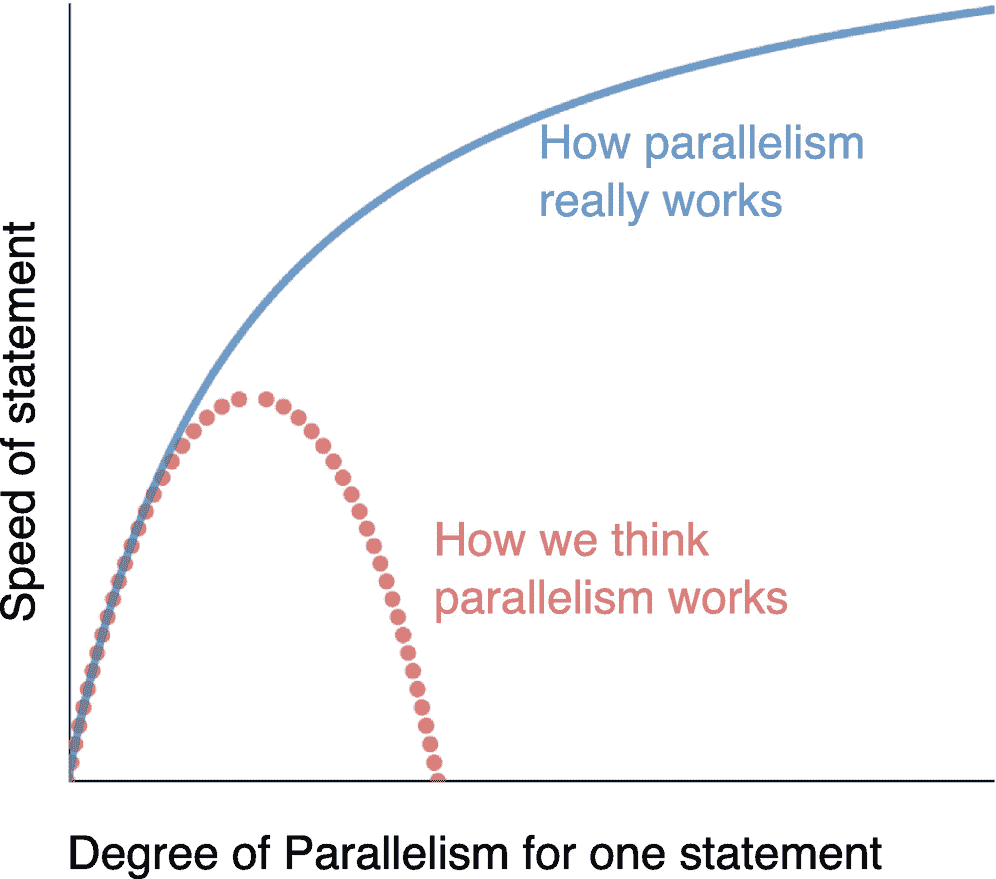

一个显示语句速度与并行度关系的图表。它表示并行实际如何工作的递增曲线，以及我们如何认为并行工作的递减曲线。

**图 18-10**

我们如何认为并行工作 vs. 它实际如何工作

默认 DOP 基于参数`CPU_COUNT`乘以参数`PARALLEL_THREADS_PER_CPU`。因此，重要的是`CPU_COUNT`要设置为物理处理器的数量，而不是“逻辑处理器”的某种市场定义。

不幸的是，很多时候并未使用默认 DOP。有超过 40 个因素^(⁴⁵)会影响并行度：提示、会话设置、对象设置、操作间并行（对于排序和分组等操作，这会将并行服务器的数量加倍）等。开发人员和管理员常常过于担心失控的并行。在降低关键参数（如`PARALLEL_MAX_SERVERS`）之前，我们应该确切理解语句为何获得其 DOP。我们还应该衡量大 DOP 下的性能，而不是简单地假设大 DOP 是坏的。

我们应该始终查看执行计划以获取关于 DOP 的信息。但请记住，执行计划只知道*请求的*并行服务器数量。实时 SQL 监控报告和`V$PX_PROCESS`可以告诉我们*实际的*并行服务器数量。即使我们的 SQL 语句被分配了正确数量的并行服务器，我们仍然需要检查该 SQL 语句是否在有意义地*使用*这些服务器。活动报告包含一个图表，向我们显示每个操作真正使用了多少并行进程。我们需要确保我们的语句始终请求、分配和使用适当数量的并行服务器。

并行执行是复杂的。如果我们正在处理数据仓库，我们应该仔细阅读《VLDB 和分区指南》中整章 87 页的“使用并行执行”。

## 执行计划中应关注什么

以下是调查执行计划的快速检查清单。这些总结是一个很好的起点，尽管它们过度简化了我们将遇到的现实世界问题：

1.  *注解*，*谓词*：这些部分中的奇怪内容可能是执行计划中其他所有问题的原因。
2.  *慢操作*：只花时间调优那些本身缓慢或导致缓慢操作的操作。
3.  *糟糕的基数*：找到第一个基数估计显著错误的操作。
4.  *错误的连接操作*：避免对连接大比例行的嵌套循环索引访问。避免对连接小比例行的全表扫描哈希连接。
5.  *错误的访问操作*：避免对返回大比例行的索引范围扫描。避免对返回小比例行的全表扫描。
6.  *奇怪的等待*：在异常等待上花费的大量时间应该被调查。大多数等待应该是针对 CPU 或 I/O。其他等待可能是配置问题的迹象。
7.  *大量执行*：操作是否快速但重复了大量次数？这可能发生在需要解嵌套的子查询中，或许可以通过重写 SQL 使用连接来解决。
8.  *糟糕的连接顺序*：对于哈希连接，最小的行源应列在前面。列在前面的行源用于创建哈希表，理想情况下该表应能放入内存。
9.  直接路径或常规写入：确保`LOAD AS SELECT`或`LOAD TABLE CONVENTIONAL`按预期使用。
10. *分区*：确保分区修剪按预期使用。
11. *数字不匹配*：如果“活动(%)”列的总和不是 100%，那么剩余时间被递归查询占用。检查缓慢的数据字典查询或查询中使用的缓慢函数。其他列（如“成本”）中的数字总和无关紧要。
12. *临时表空间*：异常大量的临时表空间速度慢，可能导致资源问题，并且是其他问题的不良迹象。Oracle 可能以错误顺序连接表，不正确地合并视图，或在错误时间执行`DISTINCT`操作。
13. *并行度*：检查请求的、分配的和使用的 DOP。

SQL 调优是困难的，我们必须始终用实际时间和基数武装自己，而不仅仅是猜测。

## SQL 调优：改变执行计划

在我们终于理解 SQL 查询的问题之后，有一长串修复执行计划的技术。每种技术都可以填满一整章，但这里只有空间进行简要总结和一个简单示例。


### 更改执行计划

更改 SQL 语句执行计划的方法有很多。以下列表按解决方案的“干净”程度排序。这个主观排序基于比例性、明显性和简单性的综合考量。

修复措施应与问题规模相匹配；重写查询只影响单个查询，而更改系统参数则会影响多个查询。修复应当显而易见；重写查询使变更一目了然，而使用 `DBMS_ADVANCED_REWRITE` 则会迷惑大多数开发者。修复应当简便；直接向查询添加提示比通过 SQL 配置文件添加提示更容易。

在实际工作中，性能调优面临诸多限制。我们常常需要在不直接更改查询的情况下修复执行计划。有时我们不得不跳过简单步骤，直接采用高级方法，暗中将糟糕的执行计划替换为优良的计划。

1.  *更改查询的调用方式*：确保应用程序不会为每个查询创建新连接。使用绑定变量，而不是创建大量硬编码的查询。使用批处理，而不是逐行读写。
2.  *重写查询*：运用高级功能和编程风格。如果查询过于庞大无法整体调优，可以使用 `ROWNUM` 技巧将其拆分为不可转换的部分。
3.  *收集统计信息*：本章末尾将有更详细的描述。
4.  *创建或修改对象*：考虑添加索引、约束、物化视图、压缩、分区、并行处理等。
5.  *向查询添加提示*：有关提示的详细信息，请参见下一节。
6.  *SQL 配置文件*：在不直接更改 SQL 文本的情况下向查询添加提示。本章后续也将介绍此功能。
7.  *SQL 计划基线*：用一个计划替换另一个计划。这是一个庞大而复杂的系统，可用于控制和演进执行计划的接受标准。此功能对于在大型系统变更中保持性能非常有用，但对于大多数 SQL 调优来说过于繁琐。
8.  *存储概要*：SQL 计划基线的一个早期、更简单且已废弃的版本。
9.  `DBMS_STATS.SET_X_STATS`：手动修改表、列和索引的统计信息，通过人为地使对象看起来开销更大或更小，可以显著改变执行计划。
10. *会话控制*：在会话级别更改参数。例如，如果从 12c 升级到 19c 导致某个进程出现问题，并且我们没有时间逐个修复查询，我们可以在会话开始时运行此命令：
    ```
    ALTER SESSION SET OPTIMIZER_FEATURES_ENABLE='12.2.0.1'
    ```
11. *系统控制*：为整个系统更改参数。例如，在数据仓库上，我们可能希望花费更多解析时间来生成良好的执行计划；可以通过运行以下命令启用 SQL 计划指令：
    ```
    ALTER SYSTEM SET OPTIMIZER_ADAPTIVE_STATISTICS=TRUE
    ```
    或者，如果我们看到大量奇怪的等待事件，可能需要重新配置系统。尽量不要对 Oracle“说谎”，不要为了仅修复单个问题实例而更改系统参数。
12. `DBMS_ADVANCED_REWRITE`：将一个查询转换为另一个查询。这个包是个巧妙的技巧，但有点“邪恶”，因为我们可以暗中更改查询的含义。
13. *虚拟专用数据库*：通过添加谓词将查询转换为另一个查询。此功能并非专为性能设计，但我们可以滥用它来改变执行计划。
14. *SQL 翻译框架*：在查询甚至被解析之前，就将其转换为另一个查询。
15. *SQL 补丁* (`DBMS_SQLDIAG.CREATE_SQL_PATCH`)：一种半文档化的方式，用于向查询添加提示。

### 提示

提示是优化器在可能情况下必须遵循的指令。“提示”这个名字具有误导性。尽管许多人认为如此，但优化器并非随意忽略提示。之所以看起来像那样，是因为提示语法很复杂。提示无效且无法被遵循的原因有很多。

有数百个提示，其中许多在《*SQL 语言参考*》的“注释”章节中有文档说明。每个执行计划功能都有一个提示。我们可以通过向 `DBMS_XPLAN` 传递参数 `FORMAT=>'+OUTLINE'` 来生成执行计划的完整提示列表。大多数提示晦涩难用。幸运的是，我们通常只需要添加少量提示。

将提示分为两个不同的类别很有用：向优化器提供有用信息的“好提示”，以及告诉优化器如何执行其工作的“坏提示”。

好提示告诉优化器一些它无法知晓的信息，比如我们愿意接受的权衡。例如，只有开发者才能选择 `APPEND` 提示，因为只有开发者知道我们是否愿意为获得性能而承担数据暂时不可恢复的风险。

坏提示绕过了正常的优化器逻辑，要求开发者扮演优化者的角色。我们并不总是有时间去修复根本原因，有时需要快速告诉优化器如何完成其工作。过度使用坏提示会使我们的 SQL 难以理解，并可能导致我们错过未来版本中的有用功能。但有时，少量坏提示对于快速解决关键问题是必要的。

以下是一些流行的、好的提示列表：

1.  `APPEND`/`APPEND_VALUES`：使用直接路径写入；提高速度但数据最初不可恢复。
2.  `DRIVING_SITE`：在远程站点执行查询；当使用数据库链接上的表时，我们可能希望在远程数据库上执行连接，而不是传递行数据后再连接。
3.  `DYNAMIC_SAMPLING`：从行源读取数据块以提供额外的优化器信息。
4.  `ENABLE_PARALLEL_DML`：仅为单个查询启用并行 DML，而不是运行 `ALTER SESSION ENABLE PARALLEL DML`。
5.  `FIRST_ROWS`：优化查询以快速返回前几行，而不是优化为快速返回整个结果集。
6.  `PARALLEL`：使用多个线程以利用更多的 CPU 和 I/O 资源。尽量使用语句级提示而非对象级提示。
7.  `QB_NAME`：为查询块创建一个名称；便于在其他提示中引用该查询块。

以下是一些流行的、坏的提示列表：

1.  `FULL`：使用全表扫描。
2.  `INDEX*`：使用特定的索引或索引访问类型。
3.  `LEADING`/`ORDERED`：按特定顺序连接表。
4.  `MERGE`：合并视图并将两个查询重写为一个。
5.  `OPTIMIZER_FEATURES_ENABLE`：使用旧版本的优化器以禁用导致问题的较新功能。
6.  `OPT_PARAM`：为查询更改特定参数值；例如，如果 DBA 愚蠢地在系统上更改了 `OPTIMIZER_INDEX_COST_ADJ`，我们至少可以为该查询修复它。
7.  `PQ*`：如何处理并行数据。
8.  `UNNEST`：将子查询转换为连接。
9.  `USE_HASH`/`USE_MERGE`/`USE_NL`：强制使用哈希连接、排序合并连接或嵌套循环连接。


## SQL 调优

提示远不止前面列表中的那些。几乎所有提示都有一个`NO_*`版本，其效果相反。甚至还有未公开的提示，它们足够有用，值得考虑使用。`CARDINALITY`和`OPT_ESTIMATE`可以硬编码或调整内联视图或操作的行数估算，对于优化器不易估算的对象（如 PL/SQL 表函数）特别有用。这些提示是自动 SQL 调优顾问创建的 SQL 配置文件在内部使用的。

`MATERIALIZE`提示强制 Oracle 将公共表表达式的结果存储在临时表中，而不是重新运行子查询。Oracle 会自动决定是否具体化公共表表达式，但有时 Oracle 会做出错误的选择。当其他方法都无效时，这些未公开的提示可能很有用。

正确使用提示需要练习和耐心。如果提示语法无效或无法使用，Oracle 不会抛出错误。相反，Oracle 会简单地忽略该提示及其后的所有提示。在 19c 中，我们可以在`DBMS_XPLAN`包中使用`FORMAT=>'+HINT_REPORT'`来帮助理解使用了哪些提示。下一节将展示一个在创建 SQL 配置文件时使用提示的快速示例。

### SQL 配置文件示例

本节演示一个最糟糕的 SQL 调优案例；我们需要应用提示来修复执行计划，但我们无权更改查询。SQL 计划基线、大纲和 SQL 调优顾问可以保留、演进和修复一些问题，但很难让这些工具完全按照我们的意愿行事。通过手动创建 SQL 配置文件，我们可以精确注入所需的提示。

例如，想象我们有一个应用程序，它错误地决定在启用并行的情况下运行所有查询。过度的并行查询正在严重影响性能，需要立即禁用。我们无法轻易更改应用程序，但需要立即更改执行计划。以下是不良查询和执行计划的示例：

```
--不应并行运行的查询。
explain plan for select /*+parallel(2)*/ * from satellite;
select * from table(dbms_xplan.display(format => 'basic +note'));
Plan hash value: 3822448874

| Id  | Operation            | Name      |

|   0 | SELECT STATEMENT     |           |
|   1 |  PX COORDINATOR      |           |
|   2 |   PX SEND QC (RANDOM)| :TQ10000  |
|   3 |    PX BLOCK ITERATOR |           |
|   4 |     TABLE ACCESS FULL| SATELLITE |

Note

- Degree of Parallelism is 2 because of hint
```

以下代码创建一个 SQL 配置文件，在查询中插入一个`NO_PARALLEL`提示。SQL 配置文件通常由 SQL 调优顾问创建。不幸的是，SQL 调优顾问并不总是确切知道我们想要做什么。自己按照我们想要的方式精确创建配置文件很有帮助：

```
--创建 SQL 配置文件以在单个查询中停止并行。
begin
dbms_sqltune.import_sql_profile
(
sql_text    => 'select /*+parallel(2)*/ * from satellite',
name        => 'STOP_PARALLELISM',
force_match => true,
profile     => sqlprof_attr('no_parallel')
);
end;
/
```

运行前面的 PL/SQL 块后，如果我们重新运行相同的`EXPLAIN PLAN`和`DBMS_XPLAN`命令，我们将看到新的执行计划如下：

```
Plan hash value: 2552139662

| Id  | Operation         | Name      |

|   0 | SELECT STATEMENT  |           |
|   1 |  TABLE ACCESS FULL| SATELLITE |

Note

- Degree of Parallelism is 1 because of hint
- SQL profile "STOP_PARALLELISM" used for this statement
```

新的配置文件出现在“Note”部分，执行计划不再使用并行。此技术可应用于任何提示组合。SQL 配置文件很棒，但不是解决性能问题的理想方式。我们必须记住将配置文件部署到所有数据库。而且如果查询有任何变化，即使是一个额外的空格，配置文件也将不再匹配该查询。

## SQL 调优：收集优化器统计信息

在任何更改了大部分数据的进程之后，应手动收集优化器统计信息。对于增量数据更改，优化器统计信息应由默认的自动任务自动收集。

请花一分钟重读上一段；大多数性能问题都是由于没有遵循这个简单的建议造成的。太多的开发人员忽略收集统计信息——也许因为他们认为“收集统计信息是 DBA 的工作”。太多的 DBA 搞砸了自动统计信息收集，也许因为他们 10 年前遇到了一个错误，并认为他们仍然可以创建一个比 Oracle 更好的作业。

### 手动统计信息

没有良好的统计信息，优化器无法正常运行。如果一个表在加载或更改后将参与查询，我们必须立即收集统计信息。大型表更改后应调用`DBMS_STATS.GATHER_TABLE_STATS`。

什么是“大型”表更改没有完美的定义。对于优化器来说，百分比比绝对数字更重要。向只有 1 行的表添加 100 行比向已经有 10 亿行的表添加 10 亿行更重要。对于全局临时表，几乎任何更改都可能被认为是大型更改，因为这些表一开始是空的。

应使用`DBMS_STATS`包来收集统计信息——不要使用已半弃用的`ANALYZE`命令。`DBMS_STATS`中最重要的函数是`GATHER_TABLE_STATS`和`GATHER_SCHEMA_STATS`。这些函数有大量参数，熟悉其中大部分是值得的。以下列表包括必需和最重要的参数：

1.  `ownname`/`tabname`：方案所有者和表名。
2.  `estimate_percent`：要采样的数据量。我们几乎总是希望保持此参数不变。默认收集 100%，但使用快速、近似不同值数量的算法。对于不需要精确统计信息的超大表，使用像`0.01`这样的微小值可能很有帮助。
3.  `degree`：并行度。此参数可以显著提高收集大型对象统计信息的性能。统计信息收集的某些部分（例如直方图）不会因并行而改善。对于极端的统计信息收集性能，我们可能需要研究并发性。
4.  `Cascade`：是否也收集相关索引的统计信息？默认为`TRUE`。^(⁴⁶)
5.  `no_invalidate`：默认情况下，统计信息不一定应用于所有现有执行计划。使许多计划失效可能会导致性能问题，因此失效是随着时间的推移逐渐完成的。默认值为`TRUE`，但在实践中，大多数依赖的执行计划会立即失效。但是，如果我们想确保我们的统计信息立即生效，我们可能希望将此参数设置为`FALSE`。
6.  `method_opt`：确定要收集哪些直方图。默认情况下，直方图是为数据分布不均匀的列创建的，并且这些列也必须在查询的相关条件中使用过。

有几种情况统计信息是作为其他操作的副作用收集的，我们不需要重复收集。加载表数据时可以自动收集统计信息，因此如果我们的执行计划中有`OPTIMIZER STATISTICS GATHERING`操作，那么我们可能不需要手动重新收集统计信息。创建或重建索引会自动收集索引统计信息，因此使用`CASCADE=>FALSE`参数我们可能可以节省大量时间。


## 第一部分 VSolve Anything with Oracle SQL

## 第 19 章 使用晦涩的 SQL 特性解决难题

现在是时候讨论 Oracle 最前沿的特性了，这些特性能够解决大多数开发者认为在数据库中不可能解决的问题。

在使用这些晦涩的技术之前，我们需要谨慎。仅仅因为我们*能*使用某个特性，并不意味着我们*应该*使用它。本章中一半的特性我只用于"代码高尔夫"来解决一些荒谬的挑战，另一半则在实际系统中使用过，在那里某个罕见的 SQL 特性发挥了关键作用。在简要描述 Oracle 最晦涩的特性之前，我们需要诚实地评估在数据库中构建如此多逻辑的成本与收益。

### 自动统计信息收集

默认情况下，Oracle 会创建调度作业来自动收集统计信息。这些调度作业由 AutoTasks 创建，可以通过数据字典视图`DBA_AUTOTASK_*`进行监控。默认情况下，AutoTask 每晚运行，并对所有变化超过 10%的表收集统计信息。

很多时候，性能问题会因为自动统计信息收集而神奇地消失。另一方面，也有极少数时候性能问题会神奇地出现——有时收集更好的统计信息反而会导致更差的执行计划。即使性能问题消失了，理解其原因也很有用。我们可以通过`DBA_TABLES.LAST_ANALYZED`等列和数据字典视图`DBA_OPTSTAT_OPERATIONS`来跟踪统计信息收集历史。

统计信息作业应该起到预防性作用，在问题发生前收集统计信息。但我们不能依赖这个作业来解决所有问题。我们仍然需要手动收集统计信息。性能不能总是等待每晚的统计作业。

如果我们遇到默认 AutoTask 的问题，可以设置首选项来帮助作业更好地工作。例如，如果一个大表耗时太长，我们可以设置表首选项以并行方式收集统计信息：

```sql
-- 并行收集优化器统计信息。
begin
dbms_stats.set_table_prefs(user, 'TEST1', 'DEGREE', 8);
end;
/
```

我们可以为所有`GATHER_TABLE_STATS`参数设置首选项。还有其他可用的首选项，例如`INCREMENTAL`（用于分区表的特殊算法）和`STALE_PERCENTAGE`（触发表统计信息收集所需修改的行百分比，默认为 10%）。如果我们在自动收集统计信息方面遇到问题，应该首先调整首选项，然后再创建自己的手动作业。

最后，如果我们的表变化模式对于自动统计信息收集来说太奇怪了，我们可以使用`DBMS_STATS.LOCK_TABLE_STATS`来停止对个别表的统计信息收集。当时机成熟时，我们可以使用`FORCE => TRUE`选项手动收集统计信息。

### 其他统计信息

存在许多奇怪的统计信息类型，以匹配我们奇怪的数据。`ASSOCIATE STATISTICS`命令让我们可以将自定义的选择性和成本与函数等模式对象关联起来。`DBMS_STATS`包含一些不言自明的函数，例如`GATHER_FIXED_OBJECTS_STATS`和`GATHER_DICTIONARY_STATS`，它们可以提高数据字典查询的性能。我们甚至可以使用`DBMS_STATS.SET_*`函数创建虚假的统计信息。

`动态采样`会在统计信息缺失时，或对于运行时间长到足以证明花费更多时间收集统计信息的并行语句时自动使用。优化器推断声明式基数的难度已经够大了；它甚至不会尝试估计表函数或对象类型的基数。对于过程式代码，优化器总是猜测 8168 行。我们可以使用动态采样来生成更好的估计，如下面的代码所示：

```sql
-- 使用动态采样估计对象类型。
explain plan for
select /*+dynamic_sampling(2) */ column_value
from table(sys.odcinumberlist(1,2,3));
select * from table(dbms_xplan.display(format => 'basic +rows +note'));
Plan hash value: 1748000095

| Id  | Operation                             | Name | Rows  |

|   0 | SELECT STATEMENT                      |      |     3 |
|   1 |  COLLECTION ITERATOR CONSTRUCTOR FETCH|      |     3 |

Note
-----
   - dynamic statistics used: dynamic sampling (level=2)
```

前面的结果显示，由于动态采样，基数估计非常完美。当动态采样不起作用时，无论是因为它太慢还是估计结果很差，我们可能需要使用未文档化的`CARDINALITY`提示来硬编码一个估计值。

`扩展统计信息`让优化器能够捕获有关表达式或列之间关系的信息。例如，在表`ENGINE_PROPELLANT`中，列`PROPELLANT_ID`和`OXIDIZER_OR_FUEL`之间存在很强的相关性。推进剂几乎总是被专门用作氧化剂或燃料。

如果我们使用两个条件`PROPELLANT_ID = 1`和`OXIDIZER_OR_FUEL = 'fuel'`来查询该表，优化器会错误地认为这两个条件都会减少行数。这个错误的假设会不正确地缩小基数估计值。我们可以使用以下代码创建扩展统计信息来告知优化器这种关系，从而获得更准确的基数估计值：

```sql
-- 在 ENGINE_PROPELLANT 上创建扩展统计信息。
select dbms_stats.create_extended_stats(
ownname => sys_context('userenv', 'current_schema'),
tabname => 'ENGINE_PROPELLANT',
extension => '(PROPELLANT_ID,OXIDIZER_OR_FUEL)')
from dual;
```

## 总结

调查性能问题并使用神秘的提示来修复它们很有趣。但最重要的性能技巧并不在 SQL 调优指南中。性能关乎于拥有一个良好的开发和测试流程，它允许快速实验、了解高级特性和对象，以及一种使 SQL 更易于理解和调试的风格。

当我们调优 SQL 语句时，必须记住要使用实际数字来找到执行缓慢的语句、缓慢的操作和不良的基数估计。我们需要一种广度优先的方法，以及使用多种工具快速找到最相关信息的能力。结合我们对算法复杂性、基数、操作、转换和动态优化的了解，我们应该对更好的执行计划可能是什么样子有所概念。修复执行计划的方法有很多，我们应该努力使用最简洁的方法。理想情况下，我们可以改进优化器统计信息并解决问题的根源。


## Oracle 对比 Unix 哲学

软件工程中一个由来已久的问题是：我们是构建一个大型系统，还是构建多个协同工作的小型系统？我们越是使用这些晦涩的 Oracle 特性，就越是在选择一个**整体式**解决方案，而非**模块化**解决方案。

我们要避免过度使用单一工具而陷入“锤子反模式”的陷阱；当我们只有一把锤子时，所有东西看起来都像钉子。技术行业一直在从昂贵服务器上的大型专有系统，转向商用硬件上的小型开源程序。Unix 哲学强调使用许多小工具并将它们串联起来。

另一方面，我们也不希望解决方案有太多的组成部分。这个问题的一个常见例子是系统管理脚本，它结合了 shell 脚本、`cron`、`SQL`、`SQL*Plus` 以及许多操作系统命令。所有这些组成部分单独看都没问题。但当它们组合在一起时，这些技术需要大量不同的技能，并且很可能在集成时出现问题。很多时候，用一个定时的 `PL/SQL` 过程替代多种技术的组合会更简单。我们需要考虑这两种方法。

我并非试图说服你用 Oracle 做所有事情。Oracle 对于电子表格处理、模式匹配、多态、Web 应用程序前端、搜索引擎、多语言编程、地理信息系统或数据挖掘来说，并不是最佳工具。但我想让你相信，有些时候你应该考虑使用 Oracle 来完成所有这些任务。如果我们已经构建了一个 Oracle 解决方案，那么能够利用我们现有的基础设施、知识和关系型接口将是一个巨大的优势。

## MODEL 子句

`MODEL` 子句使得在 SQL 语句中能够包含过程逻辑。`MODEL` 让我们能够像处理多维数组或电子表格一样处理数据。我们可以对数据进行分区，定义维度和度量，并应用规则和 `FOR` 循环。

获得这些酷炫特性所需付出的代价是复杂的语法。每次我使用 `MODEL`，都不得不重新阅读《数据仓库指南》中“*SQL 建模*”章节的部分内容。

这个特性最好用一个非现实的例子来演示。让我们用 SQL 构建一个细胞自动机。细胞自动机是一个由细胞组成的网格，每个细胞都有开或关的状态。在初始状态之后，所有细胞都根据一组简单的规则重新创建。新状态基于一个细胞邻居的状态。如果你玩过康威的“生命游戏”，那你以前就见过细胞自动机了。细胞自动机有趣的地方在于，极其简单的规则如何能产生复杂的行为。

为了尽可能简单，我们将使用一个初等细胞自动机，它被表示为一个一维数组。数组中的细胞每一代都会根据左边细胞、自身和右边细胞的状态发生变化。

图 19-1 展示了我们将在 SQL 中构建的细胞自动机。

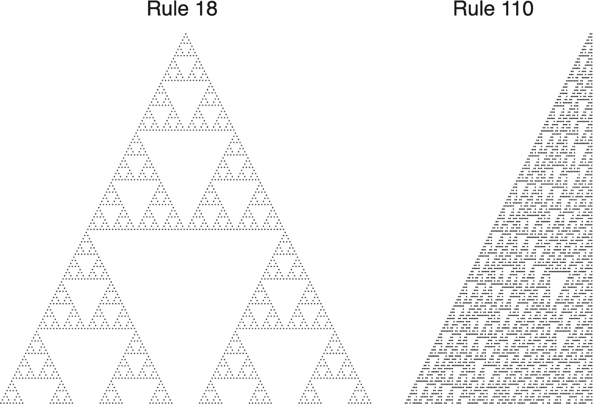

规则 18 和 110 的两个三角形初等细胞自动机图像。

图 19-1

由 `MODEL` 子句创建的初等细胞自动机

在 SQL 中创建图 19-1 中的细胞自动机是一个四步过程。第一步是创建一个二维数据数组。第二步是 `MODEL` 发挥魔力的地方，我们遍历这个二维数组，并根据状态和规则填充值。第三步是一个简单的聚合操作，将每个数组转换为一个字符串。最后，我们需要将结果复制粘贴到文本编辑器中，并缩小视图以查看结果：

```
--使用 MODEL 的细胞自动机。开为 "#"，关为 " "。
--#3：聚合状态以生成图片。
select listagg(state, '') within group (order by cell) line
from
(
--#2：使用 MODEL 应用细胞自动机规则。
select generation, cell, state from
(
--#1：初始的、基本为空的数组。
select generation, cell,
--在中心用 "#" 播种第一代。
case
when generation=0 and cell=120 then '#'
else ' '
end state
from
(select level-1 generation from dual connect by level <= 100),
(select level-1 cell from dual connect by level <= 201)
)
model
dimension by (generation, cell)
measures (state)
rules
iterate(100)
(
state[iteration_number+1, any] =
case
state[cv()-1, cv()-1] || --左邻居
state[cv()-1, cv()  ] || --自身
state[cv()-1, cv()+1]    --右邻居
--when '###' then '#'
when '## ' then '#'
when '# #' then '#'
--when '#  ' then '#'
when '  ##' then '#'
when '  # ' then '#'
when ' #' then '#'
--when '   ' then '#'
else ''
end
)
)
group by generation
order by generation;
```

第一步，创建一个空的数组，足够简单。这一步创建了一个数据表，每个值都有一个唯一的 `GENERATION` 和 `CELL` 坐标。第一步可以通过两次使用 `CONNECT BY LEVEL` 技巧然后交叉连接结果来完成。你可能想要高亮并运行第一个内联视图，以理解这个复杂查询是如何开始的。

第二步是关键步骤，在这里使用了 `MODEL` 子句。我们使用 `DIMENSION BY (GENERATION, CELL)` 创建一个二维数组。然后我们使用 `MEASURES (STATE)` 定义一个度量，即要计算的状态。在 `RULES` 子句中，我们读取和写入状态。

我们希望改变除第 0 代（具有初始状态）之外的所有细胞的状态：`STATE[GENERATION >= 1, ANY] =`。规则的左侧使用方括号进行数组访问，包含限制维度的条件，并使用了 `ANY` 关键字。右侧引用了数组三次——分别对应左父细胞、中间父细胞和右父细胞。例如，引用左父细胞的状态是 `STATE[CV()-1, CV()-1]`。`CV()` 函数获取当前值，然后我们减去一来获取父代以及左边的细胞。状态使用井号表示“开”，空格表示“关”，并且为了启用一组特定的规则，八条规则被注释掉了。

细胞自动机看起来很酷，但并不常用。`MODEL` 子句更实际的例子会复制电子表格逻辑，例如解决库存计算或创建贷款摊销计划。我只在几次实际查询中使用过 `MODEL` 子句，用于解决像传递闭包这样的图问题。Oracle SQL 绝对不是查询图的最佳语言。然而，由于我的数据已经存在于数据库中，使用 `MODEL` 比在系统中添加另一个工具要容易得多。

如果我们曾想过“这个编程问题不可能用纯 SQL 解决”，我们应该尝试一下 `MODEL` 子句。


## 行模式匹配

行模式匹配是在数据中寻找模式的一种强大方法。`REGEXP` 函数支持在单个值内搜索正则表达式。分析函数可用于查找简单的行模式，例如连续或非连续的值。而 `MATCH_RECOGNIZE` 子句则让我们能够使用正则表达式来查找行间的复杂模式。

例如，我们可以利用行模式匹配来帮助我们发现每年发射次数中的模式。虽然分析函数可以找出发射次数下降或上升的年份，但对于寻找更具体的模式来说，分析函数就不够用了。以下代码使用行模式匹配来找出发射次数连续两年或更久下降的年份：

```
--发射次数连续两年或更久下降的年份。
select *
from
(
--每年发射次数统计。
select
to_char(launch_date, 'YYYY') the_year,
count(*) launch_count
from launch
group by to_char(launch_date, 'YYYY')
order by the_year
)
match_recognize
(
order by the_year
measures
first(down.the_year) as decline_start,
last(down.the_year) as decline_end
one row per match
after match skip to last down
--下降持续两年或更久。
pattern (down down+)
define
down as down.launch_count < prev(down.launch_count)
)
order by decline_start;
DECLINE_START   DECLINE_END
-------------   -----------
...
1977          1978
1980          1986
1988          1996
...
```

`MATCH_RECOGNIZE` 的语法比较冗长，因此我让前面的大部分代码来自我说明。查询中最有趣的部分是我们定义正则表达式的地方：`PATTERN (DOWN DOWN+)`。一旦初始查询构建完成，尝试不同的模式就很容易了。我们可以轻松地找出发射次数连续增长的年份序列，或者发射次数来回波动的年份序列等。

## ANY 类型

如果我们事先不知道数据的样子，就需要有处理“任意”数据的能力。Oracle 提供了三种对象类型，可以帮助我们传递和处理完全通用的数据。`ANYDATA` 包含一个任意类型的单一值，`ANYTYPE` 包含有关数据的类型信息，而 `ANYDATASET` 则包含任意类型数据的集合。

例如，以下函数接受一个 `ANYDATA` 并返回其内部存储值的文本版本。这个函数并不是很有用，因为即使创建一个简单的 `ANYDATA` 示例也需要很多奇怪的代码：

```
--使用 ANYDATA 处理“任意”数据的函数。
create or replace function process_anything(p_anything anydata)
return varchar2
is
v_typecode pls_integer;
v_anytype anytype;
v_result pls_integer;
v_number number;
v_varchar2 varchar2(4000);
begin
--获取 ANYTYPE。
v_typecode := p_anything.getType(v_anytype);
--检查类型并进行相应处理。
if v_typecode = dbms_types.typecode_number then
v_result := p_anything.GetNumber(v_number);
return('Number: '||v_number);
elsif v_typecode = dbms_types.typecode_varchar2 then
v_result := p_anything.GetVarchar2(v_varchar2);
return('Varchar2: '||v_varchar2);
else
return('Unexpected type: '||v_typecode);
end if;
end;
/
```

以下查询显示我们可以在运行时选择数据类型：

```
--从 SQL 中调用 PROCESS_ANYTHING。
select
process_anything(anydata.ConvertNumber(1)) result1,
process_anything(anydata.ConvertVarchar2('A')) result2,
process_anything(anydata.ConvertClob('B')) result3
from dual;
RESULT1     RESULT2       RESULT3
---------   -----------   --------------------
Number: 1   Varchar2: A   Unexpected type: 112
```

在实践中，SQL 或 PL/SQL 中大多数高度通用的编程都是错误的。要对数据做任何有意义的事情，我们都必须对数据的样子有所了解。`ANY` 类型虽然简洁，但存在一些奇怪的错误和性能问题。在我们投入过多精力使用 `ANY` 类型的解决方案之前，应该确保程序可以扩展。几乎所有的数据库处理都应该用简单的字符串、数字和日期来完成。与其创建一个能接受任何数据的智能函数，不如为每种类型动态生成一个简单的函数。

## APEX

Application Express (`APEX`) 是一个免费的基于 Web 的开发环境，用于创建网站。`APEX` 与 Oracle 数据库无缝集成，使得为数据创建前端界面几乎变得轻而易举。

要重现本节中的示例，我们需要在数据库上安装 `APEX` 或者在 `https://apex.oracle.com` 创建一个免费账户。安装或创建账户后，我们需要创建一个工作区，它是应用程序的集合。然后，我们需要创建一个应用程序，它是页面的集合。

在应用程序内部，有两个主要实用工具——SQL Workshop 和 App Builder。在 SQL Workshop 中，我们可以快速创建、编辑和运行 SQL 查询以及 SQL*Plus 脚本。

如果您在本地数据库上安装了 `APEX`，那么 `APEX` 已经可以访问太空数据集。如果您使用的是 Oracle 的网站，则需要加载一些示例数据；有关少量示例数据，请参阅 GitHub 仓库中本章的工作表。在 Oracle 的网站上，您需要创建一个脚本，复制并粘贴仓库中的命令，然后运行该脚本。

数据加载完成后，我们进入 `APEX` 最重要的部分——App Builder。创建应用程序只需几次简单的点击，接下来就是创建页面了。为了展示创建页面有多么简单，以下是完整的步骤：点击“创建页面”，点击“交互式报告”，在页面名称中输入“Launch”，点击两次“下一步”，从下拉列表中选择 `LAUNCH` 表，然后点击“创建”。要查看页面，请点击“运行页面”按钮并输入用户名和密码，然后我们应该能看到类似图 19-2 的内容。

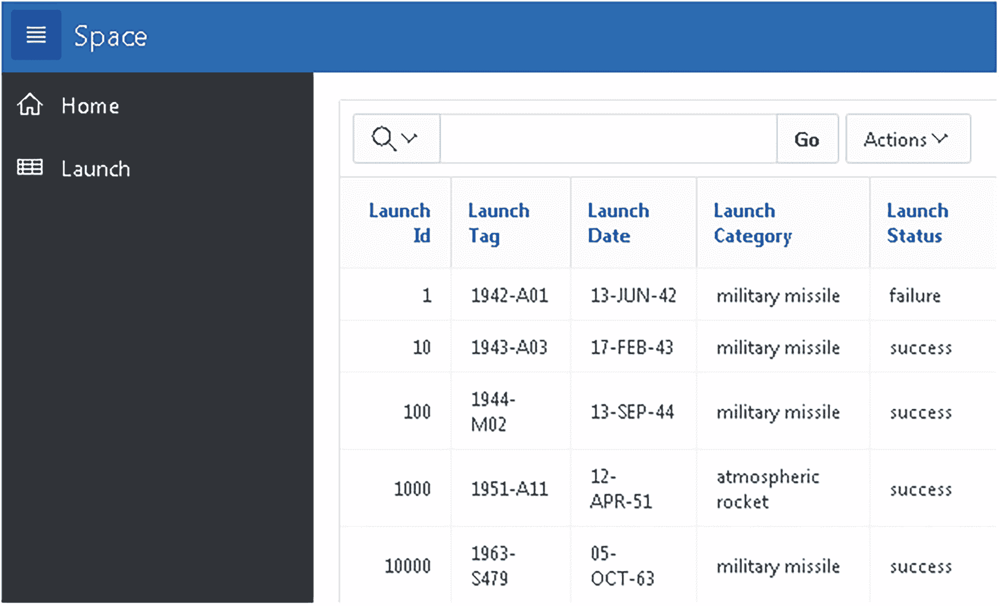

太空菜单片段，包含主页和发射部分。可以看到搜索选项、操作按钮以及发射 ID、发射标签、发射类别和发射状态等表列。

图 19-2

`APEX` 发射报告

这个简单的例子仅仅触及了 `APEX` 功能的皮毛。我们可以使用 `APEX` 来构建复杂的交互式表单、报告、图表、REST 服务、自定义身份验证，或者任何在现代网站上可能看到的功能。简单的页面可以通过几次点击构建。中等复杂度的页面可以使用我们的 SQL 技能来定义数据。高级页面则可以使用自定义 SQL、PL/SQL、CSS 和 JavaScript。

如果我们想快速为 Oracle 数据库创建一个前端界面，`APEX` 是一个绝佳的选择。即使我们不想构建网站，安装 `APEX` 也能让我们使用几个实用的 PL/SQL 包。例如，强大的 `APEX_DATA_PARSER` 非常适合声明式地读取几种常见的文件类型。


## Oracle Text

Oracle Text 让我们能够在 Oracle 数据库中构建强大的搜索引擎功能。对于大多数文本搜索来说，标准和自定义的 PL/SQL 函数已经足够好用。如果我们需要一个能够*理解*语言的工具，Oracle Text 就非常有用。Oracle Text 的特性包括模糊匹配（匹配同一单词的不同拼写）、停用词（不值得索引的次要词汇）、大小写处理、同义词库、多语言支持等等。

### 索引类型

Oracle Text 通过在我们的数据上创建特殊索引来工作。共有三种不同的索引类型，每种都有不同的用途、语法和属性。

-   `CONTEXT` 索引用于索引大型文档，并使用 `CONTAINS` 操作符。
-   `CTXCAT` 索引用于索引文本片段与其他列的组合，并使用 `CATSEARCH` 操作符。
-   `CTXRULE` 索引用于文档分类，并使用 `MATCHRULE` 操作符。

### 使用示例

例如，让我们在 `LAUNCH` 表中搜索 GPS 发射任务。`MISSION` 列包含非结构化文本，并且有几十次发射任务包含字符串 GPS。以下代码是查找 GPS 的典型方法：

```
--使用 LIKE 操作符查找 GPS 发射任务。
select count(*) total
from launch
where lower(mission) like '%gps%';
TOTAL

```

前面的查询将始终使用全表扫描。即使在表达式 `LOWER(MISSION)` 上创建基于函数的索引也没有帮助。B-tree 索引按值的首字符对数据进行排序。B-tree 索引可以帮助我们找到 `'gps%'`，但无法帮助我们找到 `'%gps'`。

文本索引处理单词，并且可以模拟前导通配符搜索。以下代码在 `LAUNCH.MISSION` 上创建了一个 `CONTEXT` 索引：

```
--在 MISSION 列上创建 CONTEXT 索引。
--(文本索引需要模式所有者的 CREATE TABLE 权限。)
grant create table to space;
create index launch_mission_text
on launch(mission) indextype is ctxsys.context;
```

使用 Oracle Text 索引需要改变谓词。我们需要用 `CONTAINS` 代替 `LIKE`。`CONTAINS` 返回一个分数用于相关性排名。如果我们只是查找单词是否存在，可以用 `> 0` 来过滤。

以下查询使用 `CONTAINS` 操作符，并返回与 `LIKE` 操作符相同数量的行。执行计划显示使用了 `DOMAIN INDEX` 操作，用到了 `CONTEXT` 索引：

```
--使用 CONTAINS 操作符查找 GPS 发射任务。
explain plan for
select count(*) total
from launch
where contains(mission, 'gps', 1) > 0;
select * from table(dbms_xplan.display(format => 'basic'));
Plan hash value: 4034124262

| Id  | Operation        | Name                |

|   0 | SELECT STATEMENT |                     |
|   1 |  SORT AGGREGATE  |                     |
|   2 |   DOMAIN INDEX   | LAUNCH_MISSION_TEXT |

```

### 索引同步

`CONTEXT` 索引的一个缺点是，它们在每次事务后不会自动更新。我们必须手动同步索引，如下所示：

```
--在对 LAUNCH 表进行 DML 操作后同步索引。
begin
ctx_ddl.sync_index(idx_name =>
sys_context('userenv', 'current_schema')||
'.launch_mission_text');
end;
/
```

前面的例子只展示了 Oracle Text 一个简单的用法。长达 293 页的《Text Application Developer’s Guide》中描述了许多隐藏的宝藏。例如，Oracle Text 很早就提供了用于分类的机器学习算法，远在该特性成为流行词之前。

## 多语言引擎

尽管 SQL 和 PL/SQL 功能强大，足以解决任何问题，但显然有时其他编程语言会很有帮助。Oracle 21c 引入了多语言引擎 (MLE)，它将 JavaScript 与 SQL 和 PL/SQL 集成在一起。

数据库中的 Java 本应为 Oracle 带来多语言编程，但由于第 15 章解释的一些技术和社原因，它失败了。希望 MLE 能避免其中一些陷阱，到目前为止，这项技术看起来很有前景。但 MLE 目前仅在创新版本 21c 上可用，并且只支持 JavaScript，因此现在判断它将产生何种影响还为时过早。

### 基本用法

调用 JavaScript 最简单的方法是使用 `console.log` 并在 DBMS 输出中查看结果：

```
--简单的多语言引擎示例。
begin
dbms_mle.eval
(
context_handle => dbms_mle.create_context(),
language_id    => 'JAVASCRIPT',
source         => 'console.log("Hello World!");'
);
end;
/
Hello World!
```

前面这个简单的例子只展示了将 PL/SQL 与 JavaScript 集成的一种方式。`DBMS_MLE` 包还允许我们在 PL/SQL 和 JavaScript 之间来回传递变量。并且，MLE SQL 驱动程序允许服务器端 JavaScript 运行并处理 SQL 查询。使用 PL/SQL 来运行 JavaScript 再运行 SQL，而不是直接用 PL/SQL 运行 SQL，可能看起来有些愚蠢。但是，服务器端 JavaScript 允许使用 APEX 的 Web 开发人员避免使用 PL/SQL，而坚持使用他们最熟悉的语言。

### 高精度计算示例

作为 MLE 如何帮助数据库开发者的一个例子，过去有几次我需要使用具有任意精度的数字。Oracle 的 `NUMBER` 数据类型对于通常存储在数据库中的物理值（如员工数量或实际方程式的结果）来说精度绰绰有余。但在 PL/SQL 中，没有简单的方法来进行密码学所需的任意精度数学运算；`NUMBER` 精度不够，而且据我所知，没有开源的 PL/SQL 库。

以下代码展示了 Oracle 数字最终如何失去精度。大约 41 位数字后，数字开始四舍五入，我们看到的是零，而不是预期的值：

```
--Oracle 精度开始失效的示例。
select
to_char(1234567890123456789012345678901234567890123, 'TM') value
from dual;
VALUE

```

虽然 JavaScript 通常不以数学技能著称，但我们可以使用几种方法通过 MLE 快速启用更高精度。有几种开源的任意精度数学库可用于 JavaScript，但截至 21c 版本，加载 JavaScript 库的过程很复杂。或者，我们可以通过在数字末尾加上字母 `n` 来使用 JavaScript 的 BigInt 类型，这样所有的数字都能被保留：

```
--使用 BigInt 获得更好的精度。
begin
dbms_mle.eval
(
context_handle => dbms_mle.create_context(),
language_id    => 'JAVASCRIPT',
source         => 'console.log(
1234567890123456789012345678901234567890123n
.toString());'
);
end;
/

```

我们不可避免地会遇到集成问题，因为 SQL 和 PL/SQL 必须将结果存储为字符串。但另一种选择是构建我们自己的数学库，这绝非易事。SQL 和 PL/SQL 将始终是我们进行 Oracle 数据处理的主要语言，但很高兴在某些极端情况下有 JavaScript 作为另一个选择。而且 MLE 很可能在未来的版本中得到改进。基于之前的测试版，下一个版本的 MLE 很可能支持 Python 作为另一种语言，并且可能包含改进的库加载和管理机制。


## Spatial

使用 Oracle Spatial，我们可以在 Oracle 中构建地理信息系统。Spatial 能够存储、索引并查询几何信息。对于几何形状而言，诸如连接（joining）等操作的含义变得截然不同。历史上，Spatial 选项是一个昂贵的附加组件，很少有组织购买。既然该选项现已免费，那么考虑使用 Oracle Spatial 来执行诸如计算地理坐标间距离之类的简单操作是值得的。

空间函数通用且强大，因此它们通常隐藏在一个更简单的接口之后，为我们省去了许多硬编码的值。存在许多坐标系，但在实践中大多数组织只需要一个简单的函数来返回两点之间的英里数，如下列函数所示：

```
--创建用于获取两个地理坐标之间英里数的函数。
create or replace function get_miles_between
(
p_latitude1  number,
p_longitude1 number,
p_latitude2  number,
p_longitude2 number
) return number is
begin
return sdo_geom.sdo_distance
(
sdo_geometry(2001,4326,null,sdo_elem_info_array(1, 1, 1),
sdo_ordinate_array(p_latitude1,p_longitude1)),
sdo_geometry(2001,4326,null,sdo_elem_info_array(1, 1, 1),
sdo_ordinate_array(p_latitude2,p_longitude2))
,1
,'unit=mile'
);
end get_miles_between;
/
```

有了这个函数，我们现在可以轻松计算发射场之间的距离，比如著名的瓦勒普斯飞行设施和白沙导弹靶场：

```
--瓦勒普斯和白沙之间的英里数。
select round(get_miles_between(
wallops.latitude,     wallops.longitude,
white_sands.latitude, white_sands.longitude)) miles
from (select * from site where site_id = 1821) wallops
cross join (select * from site where site_id = 1895) white_sands;
MILES

```

这个简单、硬编码的例子仅仅触及了 Oracle Spatial 所能做之事的皮毛。一个更现实的例子可能涉及在发射场周围创建地理围栏，然后检测船只或飞机何时过于接近。一个朴素的、`O(N²)`解决方案是计算所有点与所有车辆之间的距离。而使用 Oracle Spatial，我们可以构建一个多维 R 树索引来更快地找到任何过于接近的车辆。

## Other Features

本节简要讨论一些不太流行但能显著扩展数据库能力的选项和功能。尽管这些选项不常见，但它们并非微不足道。其中大多数功能在 Oracle 文档库中都有一本或多本书籍专门介绍。一些开发人员可能会将职业生涯的大部分时间用于使用其中某一项选项。

### Machine Learning

Oracle 拥有机器学习功能已有很长时间。过去的版本被称为数据挖掘或高级分析，它们需要昂贵的许可证，很少有组织为此付费。幸运的是，该选项现在是免费的，并且有许多工具、算法和 API 可用于机器学习。

机器学习在 SQL、PL/SQL、R 和 Python 中有多种可用的 API。这些接口让我们可以在关系型或非关系型表上创建和训练模型。甚至还有一个 SQL Developer 插件来帮助我们快速创建数据挖掘解决方案。

机器学习框架当然有更受欢迎的选择。Oracle 的优势在于投产时间。如果数据已经在数据库中，那么将算法移到数据上比将数据移到算法上更快。

### OLAP

联机分析处理（OLAP）是一种不同的数据查询方式。OLAP 使用多维模型，过去是数据仓库和业务智能应用程序的热门选择。有许多独立的 OLAP 产品，但 Oracle 的 OLAP 是一个可许可的选项，嵌入在数据库中。该选项允许创建维度、立方体和其他 OLAP 结构。该产品还附带一个独立的 Analytic Workspace Manager 图形用户界面。

OLAP 不像以前那样常见，核心 Oracle 数据库正在逐步添加类似 OLAP 的功能。例如，最近的版本向数据库添加了 `ANALYTIC VIEW`、`ATTRIBUTE DIMENSION`、`DIMENSION` 和 `HIERARCHY`，而无需 OLAP 许可证。

### Property Graph

属性图是一种用于分析图（由顶点和它们之间的边组成的数据）的工具。使用属性图，我们可以使用属性图查询语言（PGQL）查询现有的 Oracle 表。PGQL 是一种类似 SQL 的语言，但不幸的是，PGQL 没有嵌入到 Oracle SQL 中。即使是评估属性图也需要多个外部工具。希望未来的 Oracle 版本能更好地将 PGQL 与数据库集成。

### Virtual Private Database

虚拟专用数据库通过细粒度的访问控制来增强常规数据库安全性。通过 VPD，我们可以透明地将谓词插入到相关的 SQL 语句中以强制执行访问规则。

设置 VPD 需要多个对象协同工作。一个登录触发器初始化一个上下文，该上下文将标识用户及其访问权限。一个包包含一个函数，该函数使用上下文返回正确的谓词。必须设置一个策略来将函数绑定到特定表。

例如，VPD 可以限制每个用户只能看到 `LAUNCH` 表中与其分配站点相关的行。任何针对 `LAUNCH` 表的查询都将自动包含该谓词。例如，用户可能运行查询 `SELECT * FROM LAUNCH`，但 Oracle 会在后台实际运行 `SELECT * FROM LAUNCH WHERE SITE_ID = 1`。

VPD 是一个巧妙的特性，可以解决独特的安全问题。但在使用 VPD 之前我们应该谨慎。通过触发器和秘密谓词来更改安全策略可能会令人困惑。即使是管理员也会受到影响，他们可能看不到预期的结果。而且执行计划不会显示添加的谓词。如果我们构建一个 VPD 系统，我们必须彻底记录该系统并与所有用户和管理员共享该文档。

### Database In-Memory

内存中数据库可以通过以列式格式存储数据来显著提高查询性能。列式格式允许卓越的压缩、SIMD 处理、内存中存储索引、连接组、优化的向量聚合等。如果我们必须基于少量列处理大量数据，内存中列存储会很有用。

列式格式并非总是更好，Oracle 仍然会以行、块、磁盘和传统的内存结构存储数据。内存中可许可选项需要为列式存储分配额外的内存。自 19c 起，我们可以在没有许可证的情况下使用最多 16 GB 的内存。

### Advanced Compression

Advanced Compression 可许可选项提供了更好的压缩功能。基本表压缩按块工作，并且仅适用于直接路径写入。高级表压缩可以更好地压缩数据，并且可以与常规 DML 语句一起工作。Advanced Compression 还支持 CLOB 压缩和去重、改进的索引压缩以及数据泵导出压缩。压缩功能不仅仅是为了节省空间；节省空间也可以提高性能，因为 Oracle 需要从磁盘读取的数据更少。

### 融合数据库与连接性

Oracle 的融合数据库模型将几乎所有的 IT 概念都纳入数据库内部或与之紧密连接。每一种工作负载、编程范式和数据模型都可以在 Oracle 内部构建。但即使我们的数据存储在另一个系统中，Oracle 也提供了访问工具。

与其他数据库相比，连接性是 Oracle 最强大的优势之一。数据库链接的强大功能和简洁性可以通过 ODBC 或异构服务选项扩展到许多非 Oracle 数据库系统。通过 PL/SQL API、BFILE 或外部表，可以轻松访问外部文件。更新版本甚至使 Oracle 能够通过数据泵和外部表轻松连接到对象存储。大数据连接器允许 Oracle 访问 NoSQL 源（如 Hadoop 分布式文件系统），并允许这些源处理 Oracle 数据。

## 总结

每当有人问，“我能在 Oracle 数据库里做这个吗？”，答案总是“可以”。我们并不总是*想要*在 Oracle 中解决所有问题，但这个选项始终存在。Oracle 远不止是一个简单的数据存储桶。如果我们的组织已经在 Oracle 上投入了大量时间和资金，我们就不应该忽略本章讨论的这些强大特性。

脚注 1

# 20. 更常使用高级动态 SQL

SQL 是 Oracle 最强大的优势。动态 SQL 很重要，因为它给了我们更多使用 SQL 的机会。第 14 章介绍了基础特性：使用动态 SQL 进行 DDL 操作、处理未知对象和简化权限；`EXECUTE IMMEDIATE` 和绑定变量语法；使用多行字符串、替代引用语法和模板简化动态代码；以及生成代码而非创建通用代码的好处。

现在是时候讨论高级动态 SQL 了。这些特性让我们能够将 Oracle 推向极限，并在过度通用的混乱和史诗级解决方案之间走钢丝。编程已经足够难了；编程程序生成器更是极其困难。

这里讨论的主题应该在仔细考虑后才使用。通常有更简单、更常规的方法来解决我们的问题。但记住这些解决方案是值得的，因为一些最棘手的编程问题只有通过高级动态 SQL 才能解决。

## 解析

解析 SQL 难得离谱，甚至在第 15 章中被列为反模式。Oracle 的 SQL 语法非常庞大，无法用简单的字符串函数或正则表达式准确解析。在可能的情况下，我们应该寻找约束代码的方法；如果我们能强制代码以某种方式呈现，那么简单的字符串函数可能就足够了。

随着输入代码变得越来越通用，我们必须更有创造性地提出解决方案。解析是那种我们不想直接跳到最强大程序的问题，因为最强大的程序学习曲线很陡。如果我们幸运的话，我们的问题可能已经被解决并存储在数据字典的某个地方。相当多的代码检查问题可以通过 `V$SQL`、`V$SQL_PLAN`、`DBA_DEPENDENCIES`、`DBMS_XPLAN.DISPLAY` 和其他数据字典视图与工具来解决。对于更复杂的问题，我们应该看看像 `PL/Scope`、`PLSQL_LEXER` 和 ANTLR 这样的工具。

### PL/Scope

`PL/Scope` 是一个用于检查 PL/SQL 程序中使用的标识符和 SQL 语句的工具。`PL/Scope` 提供的信息可以帮助进行简单的代码分析和依赖关系检查。`PL/Scope` 提供的信息量并不大，但该程序易于访问且准确。

例如，我们可以通过设置会话变量并重新编译来分析一个小程序：

```
--Generate identifier information.
alter session set plscope_settings='identifiers:all';
create or replace procedure temp_procedure is
v_count number;
begin
select count(*)
into v_count
from launch;
end;
/
```

`PL/Scope` 数据存储在数据字典中，可以通过类似这样的查询读取：

```
--Identifiers in the procedure.
select
lpad(' ', (level-1)*3, ' ') || name name,
type, usage, line, col
from
(
select *
from user_identifiers
where object_name = 'TEMP_PROCEDURE'
) identifiers
start with usage_context_id = 0
connect by prior usage_id = usage_context_id
order siblings by line, col;
NAME                TYPE              USAGE         LINE   COL
-----------------   ---------------   -----------   ----   ---
TEMP_PROCEDURE      PROCEDURE         DECLARATION      1    11
TEMP_PROCEDURE   PROCEDURE         DEFINITION       1    11
V_COUNT       VARIABLE          DECLARATION      2     4
NUMBER     NUMBER DATATYPE   REFERENCE        2    12
```

我们还可以获取有关程序调用的 SQL 语句的信息。这些信息可以简化调优，因为否则很难找到程序调用的所有语句的 `SQL_ID`：

```
--Statements in the procedure.
select text, type, line, col, sql_id
from user_statements;
TEXT                         TYPE    LINE  COL  SQL_ID
---------------------------  ------  ----  ---  -------------
SELECT COUNT(*) FROM LAUNCH  SELECT     4    4  046cuu31c149u
```

`PL/Scope` 提供了高级信息，但它并不能真正解析我们的程序。在实践中，我很少发现 `PL/Scope` 的用途。即使是像识别依赖关系这样的任务，`PL/Scope` 通常也不够用，因为它只查找`静态`依赖关系。

### PLSQL_LEXER

语言问题需要将程序分解成小块。最小的块可能是字节和字符，但它们太底层而无法使用。解析的原子单位是`词法单元`。`词法单元` 是一系列字符，其分类方式对编译器有用。词法分析是将程序分解为 `词法单元` 的过程。

即使是 SQL 或 PL/SQL 的词法分析对于小型字符串函数或正则表达式来说也太难了。像注释和替代引用机制这样的特性使得从程序中间提取 `词法单元` 变得困难。我构建了开源包 `PLSQL_LEXER`^(⁴⁸) 来将 SQL 和 PL/SQL 分解为 `词法单元`。一旦我们有了 `词法单元`，我们就可以开始理解代码、更改 `词法单元` 并将 `词法单元` 重新组装成程序的新版本。以下是从 SQL 语句创建 `词法单元` 的简单示例：

```
--Tokenize a simple SQL statement.
select type, to_char(value) value, line_number, column_number
from plsql_lexer.lex('select*from dual');
TYPE         VALUE    LINE_NUMBER   COLUMN_NUMBER
----------   ------   -----------   -------------
word         select             1               1
*            *                  1               7
word         from               1               8
whitespace                      1              12
word         dual               1              13
EOF                             1              17
```

前面的输出非常底层，而这正是我们动态分析和修改程序所需要的。有了 `词法单元`，我们可以做诸如对语句进行分类（因为动态 SQL 必须以不同方式处理`SELECT`和`CREATE`）、移除语句终止符（因为动态 SQL 不能以分号结尾）或执行一些简单的代码检查（检查常见错误，如将提示注释放在错误位置）等事情。使用 `词法单元` 是痛苦的，但对解决具有挑战性的语言问题是必要的。

## ANTLR

ANTLR 是一个开源的解析器生成器，能够理解和修改几乎任何编程语言。它自带了预构建的 PL/SQL 词法分析器和解析器，可用于将 SQL 和 PL/SQL 分解为解析树。这些解析树类似于语言参考文档中的铁路图。

在完成大量的下载、配置和编译工作后，我们可以使用如下命令生成解析树：

```bash
C:\ >grun PlSql sql_script -gui
BEGIN
NULL;
END;
/
^Z
```

前面的代码将打开一个图形用户界面，其中显示的解析树如图 20-1 所示。

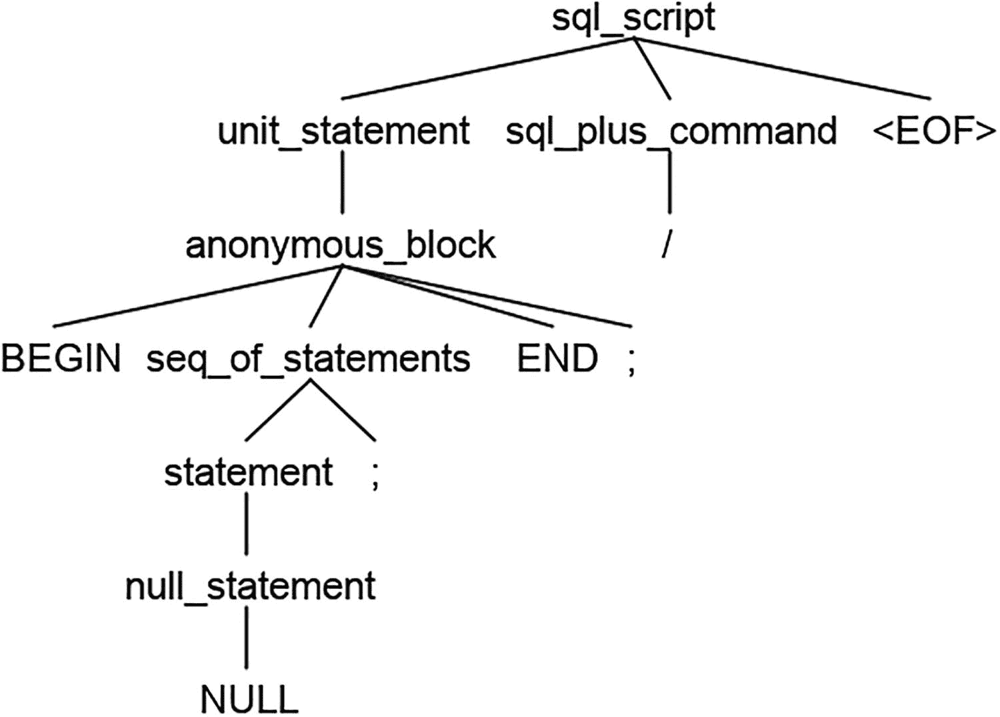

SQL 脚本被划分为三个子部分。单元语句进一步链接到匿名块，而该匿名块又有四个进一步的划分。这个链条以`NULL`结束。

**图 20-1**
*一个简单 PL/SQL 程序的 ANTLR 解析树*

ANTLR 是用于 Oracle SQL 和 PL/SQL 最强大的解析工具之一。但这个程序存在一些问题；其代码是用 Java 编写的，可能无法直接在我们的数据库环境中运行，PL/SQL 语法支持也不完整，而且生成解析树仅仅是真正工作的开始。

## DBMS_SQL

`DBMS_SQL`是运行动态 SQL 的原始方法。`DBMS_SQL`远不如`EXECUTE IMMEDIATE`方便，速度也不够快，但它有几个优点。只有`DBMS_SQL`能够跨数据库链接执行 SQL、解析^(⁴⁹) SQL 并检索列元数据，以及返回或绑定未知数量的项。

例如，以下代码解析 SQL 语句，查找列类型和名称，运行语句并检索结果：

```sql
--动态检索数据和元数据的示例。
declare
  v_cursor integer;
  v_result integer;
  v_value  varchar2(4000);
  v_count  number;
  v_cols   dbms_sql.desc_tab4;
begin
  --解析 SQL 并获取一些元数据。
  v_cursor := dbms_sql.open_cursor;
  dbms_sql.parse(v_cursor, 'select * from dual',
                 dbms_sql.native);
  dbms_sql.describe_columns3(v_cursor, v_count, v_cols);
  dbms_sql.define_column(v_cursor, 1, v_value, 4000);
  --执行并获取数据。
  v_result := dbms_sql.execute_and_fetch(v_cursor);
  dbms_sql.column_value(v_cursor, 1, v_value);
  --关闭游标。
  dbms_sql.close_cursor(v_cursor);
  --显示元数据和数据。
  dbms_output.put_line('类型: '||
    case v_cols(1).col_type
      when dbms_types.typecode_varchar then 'VARCHAR'
      --在此处添加更多类型（这很繁琐）...
    end
  );
  dbms_output.put_line('名称: '||v_cols(1).col_name);
  dbms_output.put_line('值: '||v_value);
end;
/
类型: VARCHAR
名称: DUMMY
值: X
```

前面的语法很棘手，我们在为`DBMS_SQL`编写代码时可能需要查阅手册。这个包还有一些意外行为。`PARSE`函数会自动运行 DDL 命令，因此即使是对于描述性语句我们也需要小心。尽管存在这些问题，`DBMS_SQL`仍然是一个用于以编程方式检查、构建和运行 SQL 语句的强大工具。

## DBMS_XMLGEN

`DBMS_XMLGEN.GETXML`是一个有用的函数，它将查询结果转换为 XML 类型。以下是该函数的简单示例：

```sql
--将查询转换为 XML。
select dbms_xmlgen.getxml('select * from dual') result
from dual;

X
```

`GETXML`可能原本只是为了将关系数据转换为 XML，以便在另一个系统中进行存储或处理。但请注意，查询是作为字符串传递的，这意味着查询在编译时不会被检查。这个小小的设计选择让我们可以用这个函数做一些非常有趣的事情。

借助`GETXML`，我们可以基于另一个查询动态生成和运行查询。通过仔细的代码生成和 XML 解析，我们可以查询可能不存在的表，从未知的表集合中返回值等等。最重要的是，我们可以在 SQL 中完全动态地运行 SQL，而无需创建任何 PL/SQL 对象。

例如，以下查询统计`SPACE`模式中所有名称类似`LAUNCH*`的表的行数：

```sql
--SPACE 模式中所有 LAUNCH*表的行数。
--
--将 XML 转换为列。
select
  table_name,
  to_number(extractvalue(xml, '/ROWSET/ROW/COUNT')) count
from
(
  --获取结果为 XML。
  select table_name,
         xmltype(dbms_xmlgen.getxml(
           'select count(*) count from '||table_name
         )) xml
  from all_tables
  where owner = sys_context('userenv', 'current_schema')
    and table_name like 'LAUNCH%'
)
order by table_name;
TABLE_NAME           COUNT
------------------   -----
LAUNCH               70535
LAUNCH_AGENCY        71884
LAUNCH_PAYLOAD_ORG   21214
...
```

使用 XML 很棘手，因为我们必须解析结果，而且仍然需要事先了解输出列的某些信息。不幸的是，查询字符串可以被构造但不能使用绑定变量。而且 Oracle 的 XML 处理能力不如其关系引擎健壮。SQL 查询可以轻松处理数百万行，但在处理 XML 时我们需要更加小心，否则处理中等规模的数据集时就会遇到性能问题。

## PL/SQL 公共表表达式

我们也可以在 SQL 中使用 PL/SQL 公共表表达式来运行动态 SQL。我们可以在 SQL 语句中定义一个函数，并在该函数中调用`EXECUTE IMMEDIATE`。我们需要使用 PL/SQL，但不必创建和管理任何永久的 PL/SQL 对象。

例如，以下查询返回与上一个查询相同的结果：

```sql
--当前模式中所有 LAUNCH*表的行数。
with function get_rows(p_table varchar2) return varchar2 is
  v_number number;
begin
  execute immediate 'select count(*) from '||
    dbms_assert.sql_object_name(p_table)   into v_number;
  return v_number;
end;
select table_name, get_rows(table_name) count
from all_tables
where owner = sys_context('userenv', 'current_schema')
  and table_name like 'LAUNCH%'
order by table_name;
/
```

前面的查询比`DBMS_XMLGEN.GETXML`技术更健壮，但 PL/SQL 公共表表达式并非在所有上下文中都有效。这两种技术仍然要求了解结果集的结构。


## 方法 4 动态 SQL

动态 SQL 语句可以根据其通用性进行排序。按照 Oracle 的命名法，方法 1 用于非查询语句，方法 2 用于带有绑定变量的非查询语句，方法 3 用于返回已知数量项目的查询，而方法 4 用于返回未知数量项目的查询。到目前为止，在本书中，即使使用了动态 SQL，程序仍然知道预期的输出是什么。当我们甚至不知道语句会返回什么时，SQL 就变得困难得多。

应用程序经常使用方法 4 的技术。例如，我们的集成开发环境可以运行任何查询并在运行时确定其列。许多应用程序还可以使用动态生成的 ref cursor，它不一定有已知的列集。SQL 或 PL/SQL 程序需要像方法 4 这样通用的解决方案的情况很少见。

在我们创建这些通用解决方案之前，需要提醒一句。虽然构建通用程序很有趣，但在数据库中完全不知道结果会是什么是相当不寻常的。为了对数据做任何有用的事情，我们通常至少需要知道数据的形态。在实践中，绝大多数采用方法 4 解决方案的 SQL 程序，通过硬编码列名通常能获得更好的服务。

Oracle 数据插件提供了接口，让我们能够扩展数据库并在 SQL 中构建方法 4 的解决方案。数据插件可用于构建自定义索引（如 Oracle Text）、自定义分析函数、自定义统计信息以及具有动态返回类型的函数。

构建数据插件具有挑战性，需要使用 `ANY` 类型来完整描述所有输入和输出。幸运的是，有一些预先构建的开源解决方案，例如我那没有创意地命名为 `Method4` 的程序^(⁵⁰)。例如，使用该程序，我们可以用以下 SQL 语句重新创建统计所有以`LAUNCH`开头的表的查询：

```sql
--SQL 中的 Method4 动态 SQL。
select * from table(method4.dynamic_query(
q'[
select replace(
q'!
select '#TABLE_NAME#' table_name, count(*) count
from #TABLE_NAME#
!', '#TABLE_NAME#', table_name) sql_statement
from all_tables
where owner = sys_context('userenv', 'current_schema')
and table_name like 'LAUNCH%'
]'
))
order by table_name;
```

前面的示例返回的结果与前两个查询相同。但这个新版本有一个重要的区别——查询的第一行使用了 `*` 而不是硬编码的列列表。`Method4` 每次运行查询时都会动态生成列。这使我们能够解决一些罕见但困难的问题，比如动态数据透视，或者基于存储在表中的配置数据生成并运行查询。

在一个查询中再写一个查询，查询里再套查询，会导致看起来很奇怪的字符串。数据插件代码复杂、缓慢，并且比普通的 PL/SQL 代码更容易出错。这些代价是我们为了达到查询灵活性的顶峰所必须付出的。

## 多项式表函数

多项式表函数是 Oracle 18c 引入的一项新特性，它们也具有动态生成的返回类型。多项式表函数有点像高级的数据插件解决方案；它们实现起来要容易得多，但查询结果的形态通常受到表名和列名的约束。

下面的示例创建了一个多项式表函数，它没有做任何特别有用的事情。该函数仅仅返回输入表中的所有内容。创建一个功能完备的示例会占用太多篇幅。即使生成这个几乎无用的函数也足够复杂了：

```sql
--创建多项式表函数包。
create or replace package ptf as
function describe(p_table in out dbms_tf.table_t)
return dbms_tf.describe_t;
function do_nothing(tab in table)
return table pipelined
row polymorphic using ptf;
end;
/
create or replace package body ptf as
function describe(p_table in out dbms_tf.table_t)
return dbms_tf.describe_t as
begin
return null;
end;
end;
/
```

有了前面的包，我们就可以对任何表调用 `DO_NOTHING` 函数，该函数将返回该表的全部输出：

```sql
--调用多项式表函数。
select * from ptf.do_nothing(dual);
DUMMY
------
X
```

虽然前面的输出可能看起来不起眼，但用几行代码就能返回一个通用的关系型结果，与使用 Oracle 数据插件需要数百行代码才能完成同样的事情相比，这已经非常惊人了。但我们仍然需要对这些数据做一些有用的事情，而且不用几百行代码很难演示这一点，所以我们在这里需要发挥一下想象力。

多项式表函数的一个简单但更现实的用法是，返回表中的所有列，*除了*某些特定列。对于包含许多列的表进行快速数据分析时，如果大部分列是我们希望忽略的审计列，能够快速运行像这样的查询会很有帮助：`SELECT * FROM EVERYTHING_BUT(EMPLOYEE, COLUMNS(CREATE_DATE, CREATE_USER, ...))`。该函数将与前面的函数类似，只不过我们需要遍历列，并将相关列的 `PASS_THROUGH` 属性设置为 `FALSE`^(⁵¹)。

我们可以创建通用的转换函数，将任何表或任何 SQL 语句转换为 JSON、CSV、XML 或任何其他格式。或者反过来，创建通用的转换函数，将这些文件格式转换为关系型数据。（然而，在实践中，使用预先构建的包如 `APEX_DATA_PARSER` 来处理文件转换可能更为明智。该包可能会返回数百个额外列，但处理额外列比试图重新实现转换例程更容易。）我们几乎可以创建自己的 SQL 语法。我们可以动态更改列和列名，定义我们自己的 `*` 工作方式，进行动态数据透视，以及许多我甚至无法想象的奇特操作。


## SQL 宏

普通的 PL/SQL 函数在每次 SQL 语句调用时都会执行。例如，如果我们有一个特定的日期格式化需求，并且不想多次重复该逻辑，我们可以将该逻辑封装在一个名为 `TO_ISO8601` 的函数中。如果我们的应用程序持续使用该格式，我们的数据库中可能会充斥着对该函数的调用，例如 `SELECT TO_ISO8601(START_DATE), TO_ISO8601(STOP_DATE) FROM SITE`。我们可以使用一些技巧来减少调用函数的开销，但最终我们可能仍会在 SQL 和 PL/SQL 之间切换上下文上花费比实际工作更多的时间。我们必须做出权衡；重复 `TO_CHAR` 逻辑作为 SQL 表达式可以提高性能，但使用函数可以减少开发者产生错误的几率。

SQL 宏为我们提供了两全其美的方案，并消除了这种权衡的需要。宏是在编译时被替换为 SQL 表达式或 SQL 查询的 PL/SQL 函数。宏不返回*值*；它们返回将构成我们最终 SQL 语句一部分的*字符串*。

以下的标量宏可以帮助优化我们的查询，但这个函数中有一些奇怪的特性。请注意，函数参数 `P_DATE` 并未在函数中直接使用；它既没有连接到返回字符串，也没有作为绑定变量传递到字符串中。但是当 Oracle 在编译时评估宏时，`P_DATE` 会被替换为相关的列名或表达式，并创建一个有效的 SQL 语句：

```
--将日期转换为特定类型的 ISO8601 格式字符串。
create or replace function to_iso8601(p_date date)
return varchar2 sql_macro(scalar) is
begin
return
q'!
to_char(p_date, 'YYYY-MM-DD"T"HH24:MI:SS"Z"')
!';
end;
/
```

SQL 宏是一种 PL/SQL 技巧，帮助我们避免使用过多的 PL/SQL。但我们应该谨慎，不要过度使用此功能。SQL 宏在 21c 中引入，并向后移植到 19c，但对于具体哪些功能在 19c 的哪个版本中可用存在一些模糊性。我们通常应该坚持使用静态代码而非动态代码，尽管宏是否算作“动态”尚有争议。宏不会遭受与常规动态 SQL 相同的问题，例如对 SQL 注入的担忧。另一方面，由于宏只返回字符串，在函数被使用之前我们无法判断是否存在错误。并且对于如何调整这些语句可能会有一些困惑；最终的 SQL 文本会出现在 10053 跟踪文件中，但不会出现在 `GV$SQL.SQL_FULLTEXT` 中。我们只应在确认存在性能问题时才使用标量宏。

表宏返回一个将被计算为返回数据行的表函数的字符串。使用表宏，我们终于可以创建参数化视图了。

与标量宏一样，我们应该谨慎避免过度使用表宏。尽管开发者长期以来一直在要求参数化视图，但参数化视图相对于普通视图并不总是有明显的优势。以下示例创建了一个简单的视图和一个简单的表宏：

```
--比较普通视图与表宏参数化视图。
create or replace view launch_view as select * from launch;
create or replace function launch_macro(p_launch_category varchar2) return varchar2 sql_macro is
begin
return
q'[
select *
from launch
where launch_category = p_launch_category
]';
end;
/
select * from launch_view where launch_category = 'orbital';
select * from launch_macro(p_launch_category => 'orbital');
```

从表宏中选择并不比从视图中选择更容易。如果条件复杂并且宏能向用户隐藏这种复杂性，表宏可能会有优势。但我们可以通过在普通视图中投影一个复杂的表达式，然后在简单条件中使用它来实现相同的效果。此外，表宏相对于普通视图也没有性能优势。Oracle 在某些方面已经像处理宏一样处理普通视图；优化器会转换 SQL，就好像外部查询和视图文本被硬编码成一个大型语句一样。

表宏的真正优势在于我们通过传入表名或列名作为参数来创建多态视图时。以下代码是另一种动态计算表行数的方法。但再次强调，宏代码并不像我们习惯的那样动态。表名参数 `P_TABLE` 在返回的字符串中按原样使用，我们不必担心连接、绑定变量或 SQL 注入。而且当我们调用函数时，我们传入的不是表示表名的字符串；我们是直接将表名作为标识符传入：

```
--用于计算表中行数的 SQL 宏。
create or replace function get_row_count
(
p_table dbms_tf.table_t
) return varchar2 sql_macro(table) is
begin
return
q'!
select count(*) row_count
from p_table
!;
end;
/
select * from get_row_count(launch);
ROW_COUNT

```

前面的解决方案只是比简单地硬编码查询 `SELECT COUNT(*) FROM LAUNCH` 稍微动态一些。但这并非坏事——拥有从硬编码到完全动态的一系列解决方案是件好事。而这些小例子并未完全探索 SQL 宏的强大功能。就像多态表函数一样，表宏可以使用包 `DBMS_TF` 循环遍历列并构建极其动态的查询。SQL 宏提供了另一种解决复杂挑战的方法，例如比较通用行集、动态透视，或者任何我们需要在数据库中处理“任何事物”的时候。

## 总结

借助合适的高级包和功能，我们可以解决 Oracle 中的任何问题。动态 SQL 不仅为数据库程序创造了新的机会，而且在适当位置使用一点高级代码可以极大地简化我们的程序，让我们专注于 Oracle 的最佳特性——SQL。本章的大部分功能都依赖于 PL/SQL，是时候停止仅间接地使用 PL/SQL 了。下一章将直接聚焦于 PL/SQL，并展示如何将我们的数据库代码提升到最高水平。

脚注 1   2   3   4

# 21. 使用 PL/SQL 提升你的技能

如果你使用 Oracle SQL 足够长的时间，最终你会想要学习 PL/SQL。SQL 是 Oracle 开发的主要语言，但我们需要 PL/SQL 来打包我们的工作，并调用控制和扩展数据库功能的 API。如果我们决定学习 PL/SQL，第一步是创建一个安全的“游乐场”。这里没有足够的空间提供一个完整的 PL/SQL 教程，但我们至少可以讨论最有可能帮助我们增强 SQL 的那些功能。要成为一名真正的 Oracle 大师，你需要 PL/SQL 来帮助你教导他人并创建程序。


## 学习 PL/SQL 是否值得？

在你投入更多时间学习 Oracle 之前，有必要先简要思考一下 PL/SQL 是否值得投入。通常 SQL 已足够应对需求，技术趋势正逐渐远离像 Oracle SQL 和 PL/SQL 这样的产品，并且存在反对专业化的理由。

无论你今后在 Oracle 数据库开发中走向何方，重点始终是 SQL。PL/SQL 之所以是一门出色的语言，恰恰在于它与 SQL 的集成非常出色。PL/SQL 被认为比 SQL 更高级，但“高级”并不总是意味着“更好”。PL/SQL 代码很少比 SQL 代码更快或更简洁，因此我们必须抵制使用晦涩的 PL/SQL 特性而非普通 SQL 特性的冲动。例如，并行管道函数是一种将 PL/SQL 代码并行化的巧妙方法。该特性优于单线程的 PL/SQL，但最佳选择通常是一条并行的 SQL 语句。

学习专有的 PL/SQL 语言意味着我们将职业生涯的一部分押注在甲骨文公司（Oracle Corporation）的命运和关系数据库市场的兴衰上。甲骨文公司是最大的软件公司之一，SQL 是最流行的编程语言之一，甲骨文在关系数据库市场中拥有最大的市场份额，并且 PL/SQL 是 SQL 的最佳过程化语言扩展。另一方面，甲骨文公司的收入停滞不前，其云业务举步维艰，像 NoSQL 这样的技术正在以牺牲关系数据库为代价而增长，开源技术和语言也在以牺牲专有代码为代价而增长。

我们还需要考虑关于成为技术通才（generalist）还是专才（specialist）的争论。我们不想成为“样样通，样样松”的人（jack of all trades, master of none）。另一方面，拥有广泛背景、简历看起来像“字母汤”（alphabet soup）的开发者正是招聘人员所寻找的。

学习更多关于 PL/SQL 的知识有充分的理由，但在某些时候，我们的时间或许花在学习一门完全不同的语言上会更有价值。

## 创建 PL/SQL 练习场

我们需要一个安全的“游乐场”（playground）来学习新技能，但在保守的 Oracle 开发环境中，构建沙盒（sandbox）可能具有挑战性。许多开发者没有私有的数据库、私有的模式（schema），甚至没有创建对象的权限。但即使在最糟糕的环境中，我们仍然可以学习 PL/SQL。

显然，我们总可以在家用个人电脑或云端创建一个私有数据库，或者可以使用像 [`https://dbfiddle.uk/`](https://dbfiddle.uk/) 和 [`https://livesql.oracle.com/`](https://livesql.oracle.com/) 这样的网站。但学习技能最简单的方法是在工作中使用它，或者至少使用工作中的数据，而我们不能将公司的数据放入私有数据库。幸运的是，有些技巧可以让我们在没有任何额外权限的情况下，在任何数据库上编写 PL/SQL。

在权限高度受限的环境中，匿名块（Anonymous blocks）是开始学习 PL/SQL 的最佳方式。我们可以运行不会改变任何数据的匿名块，而无需任何人知晓。本书已经使用了许多简单的匿名块，但匿名块不一定非得简单。我们可以使用匿名块来模仿大型包（packages）、存储过程和函数。以下示例展示了一个包含嵌套函数的匿名块，该函数又包含一个嵌套的过程：

```sql
--包含嵌套过程和函数的 PL/SQL 块。
declare
v_declare_variables_first number;
function some_function return number is
procedure some_procedure is
begin
null;
end some_procedure;
begin
some_procedure;
return 1;
end some_function;
begin
v_declare_variables_first := some_function;
dbms_output.put_line('Output: '||v_declare_variables_first);
end;
/
Output: 1
```

我们可以根据需要将函数和过程嵌套任意深度，以模仿大型包。为了练习在 SQL 代码中使用 PL/SQL 对象，我们可以使用 PL/SQL 公共表表达式（common table expressions）。只要我们能访问 Oracle 数据库，就总有办法进行 PL/SQL 实验。

## PL/SQL 集成特性

本章并非完整的 PL/SQL 教程。许多基础语法，如变量赋值、`IF`语句和循环，可以通过耳濡目染（osmosis）学会。并且许多语法在 SQL 和 PL/SQL 中是相同的；大多数操作符、表达式、条件判断和函数在两种语言中的工作方式相同。

PL/SQL 拥有与 SQL 相同的许多优点。PL/SQL 是一种用于处理数据的高级语言，并且具有高度的可移植性。一个为基于 Itanium 的 HP-UX 系统编写的 PL/SQL 程序，在基于 Intel x86-64 的 Windows 系统上也能运行无误。

要完全理解 PL/SQL 语言，我推荐阅读 *《PL/SQL 语言参考手册》（PL/SQL Language Reference）*。该手册是最准确的资料来源，尽管它不一定总是最容易阅读的。本章仅关注于促进 SQL 与 PL/SQL 集成的 PL/SQL 特性。

### 代码打包技巧

打包代码的第一个也是最显而易见的技巧是使用 `PACKAGE` 来封装相关代码。我们不想用所有的过程和函数来“污染”一个模式（schema）。一个有助于组织代码的简单规则是将包视为名词，而将它们的过程和函数视为动词。

默认情况下，过程、函数和变量应该只在包主体（package body）中定义，这使得它们成为私有的（private）。在包规范（package specification）中定义的过程、函数和变量是公有的（public）。我们始终希望尽量减少程序的入口点和公共接口的数量。我们向外界公开的每一个程序部分，都是我们必须支持和维护的另一项内容。

当我们为其他开发者构建程序时，必须仔细考虑程序的依赖项。其他开发者可能没有企业版（Enterprise Edition）、最新版本、提升的权限、能够将整个模式专用于某个项目的能力、Java 等可选组件、分区（partitioning）等许可选项，等等。


### 会话数据

在 PL/SQL 中，有几种方法可以在会话内存储和共享数据。但在转向 PL/SQL 解决方案之前，我们应首先评估是否可以使用堆表、全局临时表或私有临时表来代替。如果表不适用，我们可以使用 `会话状态` 来在会话持续期间持久化信息。会话状态是通过在包规范和包体中定义的全局变量构建的。这些全局包变量的值在对包的调用之间被保留。

在包规范中定义的全局变量是公共的。全局公共变量更容易访问，但被认为是糟糕的编程实践，因为我们无法控制它们的使用方式。如果我们需要在包中维护全局变量，我们几乎总是应该在包体中定义它们使其成为私有的，然后为它们创建获取器和设置器。SQL 无法直接访问包全局变量；我们无论如何都必须创建设置器和获取器，因此我们不妨尽可能多地使用私有变量。以下代码展示了这些规则的实际应用：

```
--创建一个包含全局公共和私有变量的包。
create or replace package test_package is
g_public_global number;
procedure set_private(a number);
function get_private return number;
end;
/
--创建一个设置和获取私有变量的包体。
create or replace package body test_package is
g_private_global number;
procedure set_private(a number) is
begin
g_private_global := a;
end;
function get_private return number is
begin
return g_private_global;
end;
end;
/
--公共变量可以在 PL/SQL 中直接获取或设置。
begin
test_package.g_public_global := 1;
end;
/
--私有变量不能直接设置。此代码会引发
--"PLS-00302: component 'G_PRIVATE_GLOBAL' must be declared"
begin
test_package.g_private_global := 1;
end;
/
--公共变量仍然不能在 SQL 中直接读取。
--此代码会引发 "ORA-06553: PLS-221: 'G_PUBLIC_GLOBAL' is
-- not a procedure or is undefined"
select test_package.g_public_global from dual;
--带有私有变量的获取器和设置器是首选。
begin
test_package.set_private(1);
end;
/
--此函数可在 SQL 中使用。
select test_package.get_private from dual;
GET_PRIVATE

```

全局变量创建了一个包状态，该状态会一直持续到会话结束。错误 “ORA-04068: existing state of packages has been discarded” 可能令人沮丧，但这个错误通常是我们自己的责任造成的。如果我们创建了全局变量，而包被重新编译，Oracle 无法知道如何处理现有的包状态。避免此错误的最佳方法是避免使用全局变量，除非我们确实需要它们。

有时将数据存储在 `上下文` 中并使用 `SYS_CONTEXT` 函数读取是有帮助的。本书中多次使用了上下文数据，例如 `SYS_CONTEXT('USERENV', 'CURRENT_SCHEMA')`。我们的许多会话设置可以通过默认的 `USERENV` 上下文获得，但我们也可以创建自己的上下文。自定义上下文对于向并行语句传递数据很有用，因为并行会话不继承包状态。

在创建会话数据时，我们必须记住资源并非无限。会话数据将消耗 PGA 内存，因此我们应避免将大表加载到 PL/SQL 变量中。会话也会消耗 PGA 进行排序和哈希操作，消耗临时表空间进行排序和哈希操作，并且对于大型且长时间运行的语句，可能需要大量的撤销数据。如果我们使用连接池，并且会话积累了大量的私有数据，应用程序可能需要调用过程 `DBMS_SESSION.RESET_PACKAGE`、`DBMS_SESSION.FREE_UNUSED_USER_MEMORY` 和 `DBMS_SESSION.CLEAR_ALL_CONTEXT('CONTEXT_NAME')`。对 Oracle 架构的基本理解有助于管理会话资源。

### 事务 I：COMMIT、ROLLBACK 和 SAVEPOINT

原子性是关系数据库最强大的优势之一——更改要么完全提交，要么完全不提交。Oracle 提供了实现原子性的机制，但使用事务控制语句来精确定义逻辑事务是我们的责任。我们的 PL/SQL 代码可能包含许多 DML 语句，我们需要使用 `COMMIT`、`ROLLBACK` 和 `SAVEPOINT` 来确保我们的更改有意义。

Oracle 会为会话中的第一个 DML 语句自动开始一个事务，但 Oracle 不会自动提交或回滚该事务。然而，这条规则有显著的例外；您的客户端或 IDE 可能设置为自动提交，而像 `TRUNCATE` 和 `CREATE` 这样的 DDL 命令会自动提交。

我们的大多数提交都应该是手动请求的，并且我们应该只在逻辑工作单元完成时发出 `COMMIT`。这个建议对某些人来说可能显而易见，但对于那些熟悉其他数据库架构（其中锁和事务是昂贵且需要避免的事物）的人来说，可能听起来值得怀疑。在 Oracle 中，我们不想盲目地在每次更改后都提交。过度提交会导致性能问题，并且如果出现应用程序错误，可能会导致奇怪的半更改状态。

`ROLLBACK` 命令与由错误引起的回滚之间有一个细微的区别。`ROLLBACK` 命令将撤销 *事务* 中所有未提交的更改。由异常引起的隐式回滚只会撤销 *该语句*。隐式回滚就像回滚到在 PL/SQL 块开始时创建的 `SAVEPOINT` 一样。

为了演示事务控制，我们需要从创建一个简单的表用于示例开始：

```
--为事务测试创建一个简单的表。
create table transaction_test(a number);
```

异常不会自动回滚整个事务。如果我们运行以下命令，初始的 `INSERT` 成功，`UPDATE` 失败，但表仍然包含由初始 `INSERT` 创建的行：

```
--插入一行：
insert into transaction_test values(1);
--失败并显示： ORA-01722: invalid number
update transaction_test set a = 'B';
--表仍然包含原始插入的值：
select * from transaction_test;
A

```

如果上述示例被包装在 PL/SQL 中，其行为会有所不同，因为 PL/SQL 块被视为单个语句。`INSERT` 仍然成功，`UPDATE` 仍然失败，但这个失败会导致所有内容的回滚，表中将没有数据：

```
--重置临时表。
truncate table transaction_test;
--将正确的 INSERT 和错误的 UPDATE 组合在一个 PL/SQL 块中。
--引发： "ORA-01722: invalid number"
begin
insert into transaction_test values(1);
update transaction_test set a = 'B';
end;
/
--表为空：
select * from transaction_test;
A
-
```

这种回滚行为意味着我们通常不需要仅仅为了包含 `ROLLBACK` 命令而创建额外的 `EXCEPTION` 块。PL/SQL 异常已经会回滚整个块。如果我们包含一个显式的 `ROLLBACK` 命令，它将回滚整个事务，包括 PL/SQL 块之前发生的事情。

如果我们已经因为其他目的有了一个 `EXCEPTION` 块，只要我们也包含了一个 `RAISE`，我们可能仍然不需要包含 `ROLLBACK`。只要异常被传播，该语句就会被回滚。

如果我们记住隐式语句回滚是如何工作的，我们就可以避免不必要的异常处理，如下例所示：

```
--不必要的异常处理。
begin
insert into transaction_test values(1);
update transaction_test set a = 'B';
exception when others then
rollback;
raise;
end;
/
```


## 异常处理、事务与锁机制

之前讨论的不必要的异常处理做得太多，但如果我们的异常处理做得太少，同样会陷入麻烦。例如，想象一下如果前面的异常代码是 `EXCEPTION WHEN OTHERS THEN NULL`。`INSERT` 仍然有效，`UPDATE` 仍然失败，但代码块忽略了异常；语句看起来成功完成，尽管它有一半失败了，我们最终可能得到部分提交的更改。事务控制是另一个例子，其中不进行异常处理通常是最佳选择。

虽然依赖 PL/SQL 代码块的隐式回滚是安全的，但我们不能总是依赖 SQL 客户端的隐式回滚。SQL*Plus 和大多数 SQL 客户端一样，默认在成功退出时执行 `COMMIT`，在会话异常终止时执行 `ROLLBACK`。但这种默认行为在 SQL*Plus 和其他客户端中是可配置的。最安全的做法总是在工作结束时包含一个 `COMMIT` 或 `ROLLBACK`。

### 事务 II：隐式游标属性

隐式游标属性对于管理事务通常很有用。在 DML 语句执行后，我们可能想知道有多少行被更改。这个行数对于日志记录或确定语句是否成功很有用。我们可以使用 `SQL%ROWCOUNT` 来查找受影响的行数，但我们必须在 `COMMIT` 或 `ROLLBACK` 之前引用隐式游标属性。下面的例子展示了如何正确和错误地使用 `SQL%ROWCOUNT`：

```
--正确：SQL%ROWCOUNT 在 ROLLBACK 之前。
begin
  insert into transaction_test values(1);
  dbms_output.put_line('Rows inserted: '||sql%rowcount);
  rollback;
end;
/
Rows inserted: 1

--错误：SQL%ROWCOUNT 在 ROLLBACK 之后。
begin
  insert into transaction_test values(1);
  rollback;
  dbms_output.put_line('Rows inserted: '||sql%rowcount);
end;
/
Rows inserted: 0
```

### 事务 III：行级锁

在多用户环境中运行 PL/SQL 中的 SQL 语句变得更加复杂。幸运的是，Oracle 对多版本一致性模型的健壮实现避免了在许多其他数据库中看到的锁定问题。由于 Oracle 实现锁的方式，我们不必担心锁升级或读写器相互阻塞。但每个一致性和锁系统都有一些我们需要警惕的微妙细节。

演示 Oracle 行级锁机制的一个好方法是使用一个奇怪且不切实际的例子。下面的代码演示了会话*最初*因为行锁而等待，但会话会*持续*等待直到阻塞事务完成。使用 `SAVEPOINT` 和 `ROLLBACK`，事务可以在不完成的情况下释放锁，从而为另一个会话“窃取”锁创造了机会：

```
--会话 #1：这些命令正常运行。
insert into transaction_test values(0);
commit;
savepoint savepoint1;
update transaction_test set a = 1;

--会话 #2：此命令挂起，等待被锁定的行。
update transaction_test set a = 2;

--会话 #1：回滚到之前的保存点。
--注意，会话 #2 仍在等待。
rollback to savepoint1;

--会话 #3：此命令窃取锁并完成。
--注意，会话 #2 仍在等待，等待的行已不再被锁定。
update transaction_test set a = 3;
commit;
```

这种奇怪的锁窃取行为是 Oracle 存储锁数据方式的结果。Oracle 没有一个单独的表来存储所有的行锁。如果存在这样的表，我们可以用它来防止锁窃取场景，并用它来回答诸如“现在哪些行被锁定了？”这样的问题。但在实践中，锁窃取不是一个问题，如果被锁定的行没有阻塞任何操作，我们很少需要确切地知道它们是哪些行。这两个小缺点是为了避免维护一个需要大量额外开销的锁表而付出的合理代价。

锁不是存储在一个单独的表中，而是存储在包含被锁定行的数据块中，位于感兴趣事务列表中。ITL 是一个微小的数据结构，列出了哪个事务正在锁定哪一行。在前面的例子中，当会话 #2 尝试锁定一行时，它发现会话 #1 已经持有了锁。通过回滚到保存点，会话 #1 放弃了该锁，但会话 #2 没有被通知。不能指望会话 #2 检查每一行——那将需要不断地重新读取表。相反，会话 #2 等待会话 #1 完成，而这永远不会发生。回滚到保存点会放弃锁但不会结束事务。这为会话 #3 插队并窃取锁创造了机会。

我们可能会争辩说，如果我们能够像这样“窃取”锁，那么 Oracle 并没有真正实现行级锁定。在实践中，这种情况极不可能发生。这个例子不是一个警告；它只是为了通过演示其怪癖之一来教授行级锁定的工作原理。


### 事务 IV：隔离性与一致性

Oracle 提供了多种机制，让我们的 PL/SQL 应用程序表现得好像它是数据库的唯一用户。这种隔离性对于避免事务完整性问题至关重要，例如脏读（读取另一个事务中未提交的数据）以及不可重复读或幻读（在事务中运行两次相同的查询却得到不同的结果）。Oracle 提供了两种不同的隔离级别来防止这些问题。

默认的隔离级别称为 `读已提交`。读已提交模式可以防止脏读，并确保每条 `语句` 都是一致的。语句级一致性意味着单个 SQL 语句总是读取并处理截至特定时间点的数据。即使另一个会话在我们查询某张表时删除了该表的所有行，我们的会话也不会察觉到。

例如，以下 SQL 语句从 `LAUNCH` 表中读取了两次。无论其他会话正在执行何种读写操作，以下查询对于每个 `COUNT(*)` 的结果总是相同的。这种语句级一致性是由每次数据变更所生成的撤销数据来保证的：

```
-- These subqueries will always return the same number.
select
(select count(*) from transaction_test) count1,
(select count(*) from transaction_test) count2
from dual;
```

当我们在 PL/SQL 中使用多个查询时，保持一致性就变得更为困难。如果一致性仅适用于单个 SQL 语句内部，那么下面的 PL/SQL 块在两个不同时间运行相同的查询时，可能会返回不同的数字：

```
-- These queries may return different numbers.
declare
v_count1 number;
v_count2 number;
begin
select count(*) into v_count1 from transaction_test;
dbms_output.put_line(v_count1);
dbms_lock.sleep(5);
select count(*) into v_count2 from transaction_test;
dbms_output.put_line(v_count2);
end;
/
```

如果我们使用 `可序列化` 事务，那么会话中的所有操作都表现得如同在事务开始时就已运行一样。如果我们更改会话的隔离级别，前面的例子在同一个事务内将总是返回相同的数字。这些 PL/SQL 块唯一的区别在于 `SET TRANSACTION` 命令，但该命令带来了巨大的不同：

```
-- These queries will always return the same number.
declare
v_count1 number;
v_count2 number;
begin
set transaction isolation level serializable;
select count(*) into v_count1 from transaction_test;
dbms_output.put_line(v_count1);
dbms_lock.sleep(5);
select count(*) into v_count2 from transaction_test;
dbms_output.put_line(v_count2);
end;
/
```

启用可序列化事务并不能神奇地解决我们所有的问题。它确保了事务级的读取一致性，但无法修复写入数据时可能出现的问题。如果另一个会话在可序列化事务执行期间更改了数据，并且该可序列化事务试图更改相同的行，就会引发异常 `ORA-08177: 无法序列化此事务的访问`。我们可能需要使用 `SELECT ... FOR UPDATE` 命令抢先锁定我们要处理的行。

### 简单变量

在 SQL 和 PL/SQL 之间传递数据很容易，因为它们的类型系统非常兼容。当在 SQL 和 PL/SQL 之间传递数字、日期和字符串时，我们很少需要担心格式、精度、字符集和大小限制等问题。不幸的是，类型系统并非完美匹配，因此我们需要注意如何规避一些问题。

`%TYPE` 属性可以帮助我们在 SQL 和 PL/SQL 之间安全地传递数据。我们无需硬编码数据类型，而是可以设置一个变量始终与某列的数据类型匹配。以下代码使用了 `%TYPE`，避免了需要精确指定 `LAUNCH_CATEGORY` 列数据大小的问题。如果未来某个版本的数据集增大了该列的大小，PL/SQL 变量的大小也会随之增加。同步数据类型可以避免诸如 `ORA-06502: PL/SQL: 数字或值错误: 字符串缓冲区太小` 之类的错误：

```
-- Demonstrate %TYPE.
declare
v_launch_category launch.launch_category%type;
begin
select launch_category
into v_launch_category
from launch
where rownum = 1;
end;
/
```

`布尔型` 在 PL/SQL 中得到完全支持。其语法以及关键字 `TRUE` 和 `FALSE` 让我们能够轻松地存储、比较和修改布尔变量。不幸的是，SQL 不支持布尔数据类型，因此我们需要使用变通方法来传递或存储布尔数据。

SQL 语句无法调用接收或返回布尔值的 PL/SQL 函数。我们不能使用类似 `WHERE IS_THIS_TRUE` 的代码，而必须将函数和查询设计成类似 `WHERE IS_THIS_TRUE = 'Yes'` 的形式。对于存储布尔数据，没有普遍认同的标准，因此我们必须决定是使用 “Yes/No”、“YES/NO”、“Y/N”、“1/0”、“True/False”、“sí/no” 等。我们必须通过检查约束来强制执行我们的选择，因为总有人会尝试插入意外的值：

```
-- A table designed for Boolean data.
create table boolean_test
(
is_true varchar2(3) not null,
constraint boolean_test_ck
check(is_true in ('Yes', 'No'))
);
```

布尔值在 PL/SQL 中很容易比较。正如下面的转换代码所示，我们不需要检查 `= TRUE` 或 `= FALSE`。相反，我们可以直接在条件 `CASE WHEN V_BOOLEAN` 中使用该变量。但在将值插入表之前，我们必须先将布尔值转换为字符串：

```
-- Convert PL/SQL Boolean to SQL Boolean.
declare
v_boolean boolean := true;
v_string varchar2(3);
begin
v_string := case when v_boolean then 'Yes' else 'No' end;
insert into boolean_test values(v_string);
rollback;
end;
/
```

`VARCHAR2` 类型在 SQL 和 PL/SQL 中的最大长度不同。SQL 中的默认最大长度是 4000 字节，而在 PL/SQL 中是 32,767 字节。Oracle 12.2 可以修改以允许 SQL 中使用 32,767 字节，但前提是必须更改 `MAX_STRING_SIZE` 参数。修改该参数是一个极其困难的过程，并且会对性能产生重大影响，因为大的字符串在内部是作为 CLOB 而不是 `VARCHAR2` 存储的。我怀疑很多组织会更改 `MAX_STRING_SIZE`，因此为稳妥起见，我们应该假设 SQL 的限制仍然是 4,000 字节。

PL/SQL 拥有一些额外的数据类型，例如 `PLS_INTEGER` 和 `BINARY_INTEGER`。许多内置函数返回 `PLS_INTEGER`，并且与 `NUMBER` 相比，该数据类型具有一些性能优势。但是，除非我们是在编写小型循环或进行科学计算，否则不应该特意将 `NUMBER` 转换为 `PLS_INTEGER`。


### 游标

游标是指向 SQL 语句的指针。创建和使用游标的方式有很多种，而且这项技术多年来发生了显著变化。我们需要了解所有选项，以便能在合适的上下文中使用正确的选项。并且我们要尽可能避免使用陈旧、低效的选项。

`引用游标`是将数据传递给应用程序的一种常见方式。引用游标是在 PL/SQL 代码中打开的指针，但查询直到应用程序开始获取行时才会运行并返回结果。引用游标非常适合向应用程序传递数据，但在数据库内部处理数据时并不方便。以下代码展示了创建返回引用游标的函数是多么简单，并演示了静态和动态引用游标。但这里没有展示如何使用引用游标的示例，因为每个应用程序和 IDE 的代码都不同：

```sql
--一个简单的引用游标示例。
create or replace function ref_cursor_test
return sys_refcursor is
  v_cursor sys_refcursor;
begin
  --基于查询的静态引用游标。
  open v_cursor for select * from launch;
  --基于字符串的动态引用游标。
  --（更实际的示例会包含绑定变量。）
  open v_cursor for 'select * from launch';
  return v_cursor;
end;
/
```

`显式游标`是在 PL/SQL 中循环处理行数据的最古老技术之一。但如第 15 章所述，我们应尽可能避免使用 `CURSOR`/`OPEN`/`FETCH`/`CLOSE` 语法。这种语法几乎总是比游标 `FOR` 循环或单条 SQL 语句更丑陋、更容易出错且更慢。显式游标处理可以通过 `FORALL` 和 `LIMIT` 等特性来加速，但我们通常仍然最好使用不同的游标技术。我们被迫使用显式游标的少数情况之一是使用返回多行的动态查询时（尽管 21c 有新的语法允许游标 `FOR` 循环与动态 SQL 一起使用）。

数据库中的绝大多数游标处理应该使用剩余的三个选项之一来完成：`SELECT INTO`、游标 `FOR` 循环和 `SELECT BULK COLLECT INTO`。表 21-1 描述了何时使用这三种技术。

表 21-1
何时使用不同的游标类型

|                | 单行       | 多行           |
| :------------- | :--------- | :------------- |
| **静态 SQL**   | `SELECT INTO` | 游标 `FOR` 循环 |
| **动态 SQL**   | `SELECT INTO` | `SELECT BULK COLLECT INTO` |

`SELECT INTO` 最适合返回单行的静态或动态查询。这种语法在本书中已经使用了几次，因为它是获取简单值最快、最简单的方法。以下是静态和动态 SQL 语法的简单示例：

```sql
--用于单行数据的静态和动态 SELECT INTO。
declare
  v_count number;
begin
  select count(*) into v_count from launch;
  execute immediate 'select count(*) from launch' into v_count;
end;
/
```

当 `SELECT INTO` 返回零行或多于一行时，问题就会出现。返回零行的查询将引发异常 “ORA-01403: 未找到数据”。返回多于一行的查询将引发异常 “ORA-01422: 精确提取返回的行数超出请求的行数”。但这些异常很容易处理。`SELECT INTO` 的棘手之处在于，当出现问题但没有引发异常时。

在 PL/SQL 中，每个 `SELECT` 语句都必须有 `INTO` 子句。运行查询却不处理结果是没有意义的。在前面的例子中，如果从静态查询中移除 `INTO v_count`，PL/SQL 块会引发异常 “PLS-00428: 此 SELECT 语句中需要 INTO 子句”。但是，如果我们从动态查询中移除 `INTO v_count`，查询会部分执行，并且 PL/SQL 块不会引发异常。

缺失异常的最令人困惑的例子是当未找到数据异常在 SQL 上下文中被引发时。例如，看下面的函数。这个函数将 `SELECT INTO` 与 `WHERE 1=0` 结合起来，这是引发未找到数据异常的配方。然而，当在 SQL 语句中运行该函数时，函数返回 NULL 而不是引发异常：

```sql
--此函数在 SQL 中失败但不引发异常。
create or replace function test_function return number is
  v_dummy varchar2(1);
begin
  select dummy into v_dummy from dual where 1=0;
  return 999;
end;
/
select test_function from dual;
```

SQL 的设计是为了与不返回任何内容的东西一起工作。在这种情况下，“没有任何内容” 并不意味着 NULL；它意味着根本没有结果。例如，带有 `WHERE 1=0` 这样条件的内联视图不会返回任何数据，但语句仍然会运行。我们期望 SQL 在未找到数据时能正常工作，但我们期望 PL/SQL 在未找到数据时失败。当我们把 PL/SQL 和 SQL 结合起来时，很容易忘记未找到数据的异常会被忽略。

如果我们想在 SQL 中看到这些未找到数据的异常，我们必须捕获它们并将其作为不同的异常重新引发。通常，捕获并重新引发是个坏主意，因为很容易丢失调用堆栈的细节。在这种情况下，我们别无选择。以下函数展示了如何捕获未找到数据的异常并引发一种不会被 SQL 忽视的不同类型的异常：

```sql
--此函数重新引发 NO_DATA_FOUND 异常。
create or replace function test_function2 return number is
  v_dummy varchar2(1);
begin
  select dummy into v_dummy from dual where 1=0;
  return 999;
exception
  when no_data_found then
    raise_application_error(-20000, '检测到未找到数据。');
end;
/
--引发: "ORA-20000: 检测到未找到数据。"。
select test_function2 from dual;
```

我们不需要为每个 `SELECT INTO` 都包含异常处理。我们只需要为那些将从 SQL 调用并有可能引发未找到数据异常的 `SELECT INTO` 重新引发异常。

`游标 FOR 循环`最适合返回多行的静态查询。使用游标 `FOR` 循环，我们不需要显式地打开和关闭游标，或者定义变量，或者担心批处理或限制结果。Oracle 为我们处理了所有细节。

我们已经见过类似于以下示例的代码。这个代码值得重复，因为太多开发人员浪费了太多代码来处理显式游标。我们所需要做的就是循环遍历结果：

```sql
--简单的游标 FOR 循环示例。
begin
  for launches in
  (
    --将大型查询放在这里：
    select * from launch where rownum <= 5
  ) loop
    --在这里对结果集进行操作：
    dbms_output.put_line(launches.launch_tag);
  end loop;
end;
/
```

`BULK COLLECT INTO` 最适合返回多行的动态查询。要使用此功能，我们首先需要了解记录和集合的基础知识，这些将在接下来的章节中讨论。


### 记录

到目前为止，我们的 PL/SQL 变量都是简单的标量类型。但随着我们在 PL/SQL 中进行更多的处理，PL/SQL 数据结构的复杂性必须增加。SQL 数据的复杂性从单个列值增长到一行，再增长到行表。PL/SQL 数据的复杂性从单个标量变量增长到记录，再增长到集合。图 21-1 展示了关系模型、SQL 和 PL/SQL 术语之间的关系。^(⁵²)

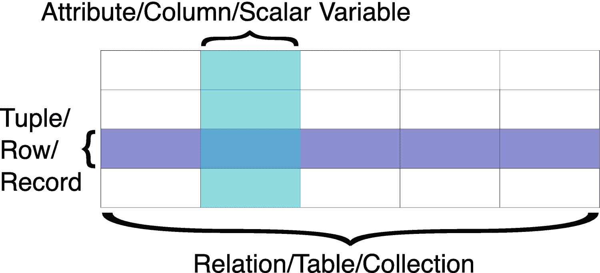

该表有五列和四行。第二列和第三行被着色，分别标记为属性或列或标量变量，以及元组、行、记录。

图 21-1

用于相似概念的关系模型、SQL 和 PL/SQL 术语。基于 Chris Martin 创建的图像，属于公共领域。

记录可以通过三种不同的方式创建，每种技术都有不同的优点。使用`%ROWTYPE`是复制表数据结构的最简单、最准确的方法。定义`RECORD`类型让我们能完全控制类型定义。用户定义的类型在 SQL 中而不是 PL/SQL 中定义；它们在技术上不是记录，但行为类似。

以下代码展示了定义和填充记录的三种不同方式。填充记录通常是重复性的，因此该示例使用了空间数据集中最简单的表`PROPELLANT`。请注意记录如何使用点表示法访问各个字段：

```
--构建用户定义类型，其类似于 PL/SQL 记录。
create or replace type propellant_type is object
(
propellant_id   number,
propellant_name varchar2(4000)
);
--%ROWTYPE, IS RECORD, 和用户定义类型的示例。
declare
--定义变量和类型。
v_propellant1 propellant%rowtype;
type propellant_rec is record
(
propellant_id   number,
propellant_name varchar2(4000)
);
v_propellant2 propellant_rec;
v_propellant3 propellant_type := propellant_type(null, null);
begin
--填充数据对所有三个选项来说可以是一样的：
v_propellant1.propellant_id := 1;
v_propellant1.propellant_name := 'test1';
v_propellant2.propellant_id := 2;
v_propellant2.propellant_name := 'test2';
v_propellant3.propellant_id := 3;
v_propellant3.propellant_name := 'test3';
--自 18c 起，记录可以使用限定表达式：
v_propellant2 := propellant_rec(2, 'test2');
--用户定义类型也可以使用构造函数：
v_propellant3 := propellant_type(3, 'test3');
end;
/
```

记录有助于将相关数据保持在一起，并且将单个记录作为参数传递比传递多个标量参数更容易。记录最大的好处在于它们用于构建集合时，集合是数据“表”的 PL/SQL 等价物。

### 集合

集合是记录或标量变量的集合。集合可以创建多维数据，但不要让“多维”这个词吓到你。实际上，集合主要用于创建看起来像表的二维数据，尽管我们也可以嵌套数据结构并创建更复杂的形状。集合有三种类型：嵌套表、关联数组和 varrays。

**嵌套表**是集成 SQL 和 PL/SQL 最有用的集合类型。嵌套表是无序的记录堆，类似于表是无序的行堆。

嵌套表可以很容易地用静态和动态 SQL 填充，使用`BULK COLLECT INTO`语法。以下代码使用`%ROWTYPE`定义一个嵌套表类型，然后创建该类型的变量。嵌套表变量与所有集合一样，具有`COUNT`属性，可用于循环遍历结果。每条记录都可以用数字索引访问，使用括号。相关字段可以使用点表示法访问：

```
--使用%ROWTYPE 定义、填充和迭代嵌套表。
declare
type launch_nt is table of launch%rowtype;
v_launches launch_nt;
begin
--静态示例：
select *
bulk collect into v_launches
from launch;
--动态示例：
execute immediate 'select * from launch'
bulk collect into v_launches;
--迭代嵌套表：
for i in 1 .. v_launches.count loop
dbms_output.put_line(v_launches(i).launch_id);
--仅打印一个值。
exit;
end loop;
end;
/
```

每当我们使用`BULK COLLECT INTO`时，都应该考虑集合的最大可能大小。集合使用 PGA 内存，每个会话只能分配一定数量的内存。如果有必要，我们可以使用循环和`LIMIT`子句每次只检索 N 行。在实践中，`LIMIT`子句被过度使用了。前面的例子将整个`LAUNCH`表放入内存，这听起来很糟糕，但直到我们意识到该表只使用了 4 兆字节的空间。如果同时有数百个会话运行该代码，我们可能会遇到麻烦，否则我们不需要担心将几兆字节加载到内存中。

如果我们有简单的数据，比如数字或字符串列表，我们甚至可能不需要创建自己的集合数据类型。Oracle 已经有许多预构建的用户定义类型，对于集合处理很有用。两个流行的例子是`SYS.ODCIVARCHAR2LIST`和`SYS.ODCINUMBERLIST`。这些类型是`VARRAY(32767) OF VARCHAR2(4000)/NUMBER`。这些不是最容易记住的名字，而且最大元素数量并不总是足够大。另一方面，这些类型对所有模式都是公开可用的，并且使用安全，因为它们在手册中列出，不会在下一个版本中突然消失。

**关联数组**是键值对，在其他语言中称为哈希映射或字典。这种集合类型在 PL/SQL 中很有用，但在处理 SQL 数据时不如嵌套表方便。

关联数组可以由`PLS_INTEGER`或`VARCHAR2`索引，但由数字索引的关联数组与嵌套表没有太大区别。关联数组通常由字符串索引，这很方便，因为它让我们可以使用几乎所有内容作为键。不幸的是，Oracle 只能直接将 SQL 加载到由数字而不是字符串索引的关联数组中，并且这些数字不能大于`2147483647`。

要构建由字符串索引的关联数组，我们必须循环遍历行并自己构建集合。关联数组的一个优点是我们可以通过简单地引用它们来创建元素，不需要`EXTEND`函数。另一个优点是结果在加载到集合中时会自动排序。关联数组的一个缺点是循环遍历键有点麻烦，如下面的代码所示：

## PL/SQL 集合与函数

```
--定义、填充并遍历一个关联数组。
declare
  type string_aat is table of number index by varchar2(4000);
  v_category_counts string_aat;
  v_category varchar2(4000);
begin
  --加载分类。
  for categories in
  (
    select launch_category, count(*) the_count
    from launch
    group by launch_category
  ) loop
    v_category_counts(categories.launch_category) :=
      categories.the_count;
  end loop;
  --遍历并打印分类和数值。
  v_category := v_category_counts.first;
  while v_category is not null loop
    dbms_output.put_line(v_category||': '||
      v_category_counts(v_category));
    v_category := v_category_counts.next(v_category);
  end loop;
end;
/
atmospheric rocket: 2600
ballistic missile test: 78
deep space: 184
...
```

`Varrays`，即可变大小数组，与嵌套表类似。`Varrays` 和嵌套表之间的区别仅在我们将集合存储在数据库中或从集合中删除项时才显得重要。无论如何，为了避免破坏关系模型，我们不应该在表中存储集合。我们也应避免从集合中删除项；最好首先通过使用 SQL 语句中更好的过滤来避免加载不需要的元素。

本节描述的集合语法远不止这些。有许多 PL/SQL 函数用于读取、插入（`EXTEND`）、删除（`DELETE`）、更新（赋值）、组合（`MULTISET UNION`/`INTERSECT`/`EXCEPT`）以及将集合加载到 SQL 中（`FORALL` 和 `TABLE`）。如果我们坚持使用 SQL 优先的方法和简单的嵌套表，我们通常可以避免这些特性。如果你需要进行大量的集合处理，你可能需要阅读《*PL/SQL Language Reference*》的“PL/SQL Collections and Records”章节。

### 函数

我们可以通过用户定义的函数来扩展数据库的功能。一个 PL/SQL 函数可以接受参数，执行过程式代码，并返回一个可以在 SQL 中轻松使用的值。我们可以使用函数来组织代码并避免重复自己。

过程与函数类似，只是过程不返回值。过程可以使用 `OUT` 参数来允许返回多个值，但这些过程不能被 SQL 直接调用。（函数也可以有 `OUT` 参数，但很少有理由需要以多种方式返回数据。）函数和过程之间并没有巨大的区别，因此这里只讨论函数。（如果你在网上查找函数和过程之间的区别列表，请小心。关于这些区别有很多误解，可能是因为在其他数据库中区别更为显著。）

作为一个函数的例子，假设我们想计算卫星的轨道周期——每颗卫星绕地球运行一周所需的时间。`SATELLITE` 表已经有一个 `ORBIT_PERIOD` 列，那么让我们看看是否可以使用远地点（离地球最远的距离）和近地点（离地球最近的距离）来复制它。开普勒行星运动第三定律背后的数学并不是超级复杂，但我们不希望在 SQL 语句中重复多次：

```
--根据远地点和近地点（单位为公里）计算轨道周期（单位为分钟）。
--（仅适用于地球轨道。）
create or replace function get_orbit_period
(
  p_apogee number,
  p_perigee number
) return number is
  c_earth_radius constant number := 6378;
  v_radius_apogee number := p_apogee + c_earth_radius;
  v_radius_perigee number := p_perigee + c_earth_radius;
  v_semi_major_axis number :=
    (v_radius_apogee+v_radius_perigee)/2;
  v_standard_grav_param constant number := 398600.4;
  v_orbital_period number := 2*3.14159*sqrt(
    power(v_semi_major_axis,3)/v_standard_grav_param)/60;
  --pragma udf;
begin
  return v_orbital_period;
end;
/
```

调用一个自定义函数就像调用内置函数一样简单。以下代码将预计算值与我们的自定义函数进行比较：

```
--卫星的轨道周期。
Select
  norad_id,
  orbit_period,
  round(get_orbit_period(apogee,perigee),2) my_orbit_period
from satellite
where orbit_period is not null
order by norad_id;
NORAD_ID   ORBIT_PERIOD   MY_ORBIT_PERIOD
--------   ------------   ---------------
000001            96.18             96.19
000002            96.18             96.19
000003           103.73            103.73
...
```

大多数值都很接近。由于四舍五入、卫星围绕另一颗行星运行，以及我可能忽略的许多其他复杂性，会存在一些差异。`GET_ORBIT_PERIOD` 函数的重点在于它封装了大量我们不希望在 SQL 语句中重复看到的逻辑。

用户定义函数的最大问题是性能损失。Oracle SQL 和 PL/SQL 是独立的语言，在它们之间切换上下文需要付出很小的代价。此外，如果我们使用函数作为条件，优化器将不得不猜测该条件的选择性如何。而且函数本身也可能很昂贵。

如果我们有很多用户定义的函数，我们应该使用像 `V$SQL`、执行计划和分层分析器这样的工具来仔细跟踪函数被调用的次数。幸运的是，我们可以做一些事情来潜在地提高函数性能。

简单地添加 `PRAGMA UDF` 可以将运行时间减半。该编译指示告诉编译器优化函数以在 SQL 上下文中运行。我们可能还希望使用 `PARALLEL_ENABLE`（允许 SQL 语句并行运行）、`DETERMINISTIC`（向编译器承诺函数对于相同的输入总是返回相同的结果，从而启用一些额外的优化和特性）和 `RESULT_CACHE`（启用缓存函数结果，如果函数经常使用相同参数调用，则此功能很有用）来定义函数。还有一些不同的编译器优化设置可能有帮助。或者，如第 20 章所述，我们可以将函数重建为 SQL 宏。

除了性能问题外，函数还可能引入一致性问题。SQL 语句是一致的，但用户定义函数内部的递归 SQL 语句在每次执行时都会读取新数据。


#### 表函数

表函数返回的集合可在 SQL 语句中用作行源。表函数的一个常见例子是，当我们使用`SELECT * FROM TABLE(DBMS_XPLAN.DISPLAY)`查看执行计划时。通过自定义表函数，我们可以结合使用声明式和过程式代码来构建表数据。表函数有三种：常规表函数、管道表函数和并行管道表函数。

常规表函数会一次性返回整个集合。在转向更高级的管道函数或 Oracle 数据插件之前，我们应该首先考虑使用简单的表函数。传入一个集合、处理该集合并返回一个新集合的过程，对于许多任务来说已经足够强大。

例如，假设我们想在 PL/SQL 中创建一个自定义的 `DISTINCT` 函数。以下代码首先创建一个嵌套表来保存数字集合。然后，该代码创建一个函数，该函数接受一个数字集合，运行`SET`函数以获取集合中的不重复值，并返回新集合：

```
--简单的嵌套表及使用它的表函数。
create or replace type number_nt is table of number;
create or replace function get_distinct(p_numbers number_nt)
return number_nt is
begin
return set(p_numbers);
end;
/
```

我们可以使用前面的函数来查找所有不重复的发射远地点（物体离地球最远的距离）。第一步是将这些值打包到特定类型的集合中，这是通过`CAST`和`COLLECT`函数完成的。然后将该集合传递给新函数，该函数处理数据并返回另一个集合。最后，`TABLE`运算符将该新集合转换回关系结果：

```
--来自自定义 PL/SQL 函数的不重复发射远地点。
select *
from table(get_distinct
((
select cast(collect(apogee) as number_nt)
from launch
)))
order by 1;
COLUMN_VALUE

...
```

上述函数是`SELECT DISTINCT APOGEE FROM LAUNCH`的一个较差版本。这段代码的意义在于为需要利用过程式代码的、更有用的函数奠定基础。

#### 管道函数

管道函数是一种特殊的表函数。管道函数返回集合，但它们一次返回一行。逐行处理通常不是好事，但在这种情况下有其优势。通过立即返回行，我们可以链接函数，并使一个流程的多个步骤并发工作。

以下是一个返回三个数字的简单管道函数。请注意函数定义中包含了关键字`PIPELINED`。这些函数不`RETURN`值；相反，函数必须为返回的每一行调用`PIPE ROW`。尽管函数返回一个集合，但我们一次只管道传输一个元素：

```
--简单的管道函数。
create or replace function simple_pipe
return sys.odcinumberlist pipelined is
begin
for i in 1 .. 3 loop
pipe row(i);
end loop;
end;
/
select * from table(simple_pipe);
COLUMN_VALUE
```

#### 并行管道函数

使管道函数并行运行需要做一些更改。并行管道函数必须传入一个游标，必须有一个对游标进行分区的`PARALLEL_ENABLE`子句，并且必须使用并行提示调用。设置并行管道函数可能具有挑战性，但可以显著提高过程式代码的性能。

以下代码接受任何输入游标，但要使代码正常工作，输入游标必须从`LAUNCH`表中选择所有列。在遍历游标时，每一行都存储在一个记录中，然后被管道输出。这个函数没有做任何特别有用的事情——它只是演示概念：

```
--并行管道函数。
create or replace function parallel_pipe(p_cursor sys_refcursor)
return sys.odcinumberlist pipelined
parallel_enable(partition p_cursor by any) is
v_launch launch%rowtype;
begin
loop
fetch p_cursor into v_launch;
exit when p_cursor%notfound;
pipe row(v_launch.launch_id);
end loop;
end;
/
```

以下代码展示了如何调用这个新函数。该查询使用`CURSOR`关键字将一条 SQL 语句传递给函数。要启用并行性，我们需要使用并行提示。这个示例不完全是子查询，因为 Oracle 传递的是指向 SQL 语句的指针，而不是传递数据集：

```
--调用并行管道函数。
select *
from table(parallel_pipe(cursor(
select /*+ parallel(2) */ * from launch
)));
COLUMN_VALUE

...
```

管道函数是强大的工具，但在实践中被过度使用。一条高级 SQL 语句通常优于高级管道函数，而一条并行 SQL 语句通常会优于并行管道函数。

#### 用于 DML 和 DDL 的自主事务

`SELECT`语句应用于读取数据，不应改变数据库状态。但在实践中，这条规则存在重要的例外情况。有时我们迫切需要从由`SELECT`语句调用的函数中运行 DML 或 DDL。

如果一个函数包含更改操作，并且我们从 SQL 中调用该函数，我们会遇到类似“ORA-14552: cannot perform a DDL, commit or rollback inside a query or DML”的错误。克服此限制的方法是使用编译指令——这是给 PL/SQL 编译器的指令。

以下代码演示了如何使用`PRAGMA AUTONOMOUS_TRANSACTION`来创建和调用一个包含 DDL 语句的函数：

```
--会更改数据库的函数。
create or replace function test_function
return number authid current_user is
pragma autonomous_transaction;
begin
execute immediate 'create table new_table(a number)';
return 1;
end;
/
--调用函数以创建表。
select /*+ no_result_cache */ test_function from dual;
TEST_FUNCTION
```

上述函数通常不是一个好主意，因为 SQL 不保证执行顺序，甚至不保证每个部分的执行次数。理论上，该函数可能被执行零次、一次或多次。（例如，根据结果缓存的配置方式，Oracle 可能在第一次解析 SQL 语句时调用该函数两次。这就是使用提示`/*+ NO_RESULT_CACHE */`的原因。）实际上，如果我们仔细测试代码并且不更改调用函数的方式，这些函数可以做到基本可靠。


## 用于日志记录的自治事务

自治事务一个更常见的用途是维护日志。我们的大多数程序都应具备相应机制来存储元数据，这些数据对于调试和性能调优很有用。这些元数据是在程序执行正常工作时收集的，但必须以一种略有不同的方式来收集。当发生异常时，我们的应用程序通常会回滚，但我们不希望日志条目也随之回滚。自治事务独立于其父事务运行，这使我们能够在回滚其他更改的同时，保留日志的更改。

例如，让我们创建一个简单的日志表和一个用于创建日志条目的简单程序。注意该过程是使用 `PRAGMA AUTONOMOUS_TRANSACTION` 创建的：

```
--创建用于保存应用程序消息的简单表。
create table application_log
(
message  varchar2(4000),
the_date date
);
--自治日志记录过程。
create or replace procedure log_it
(
p_message varchar2,
p_the_date date
) is
pragma autonomous_transaction;
begin
insert into application_log
values(p_message, p_the_date);
commit;
end;
/
```

接下来，在一个 PL/SQL 块中，我们将写入该表，创建一个日志条目，然后回滚事务：

```
--重置临时表。
truncate table transaction_test;
--自治事务在回滚后仍然有效。
begin
insert into transaction_test values(1);
log_it('Inserting...', sysdate);
rollback;
end;
/
```

`LOG_IT` 过程有一个 `COMMIT`，但这个 `COMMIT` 不会影响父事务。如果我们查看这两个表，可以看到对测试表的原始 `INSERT` 操作被回滚了，但对日志表的 `INSERT` 操作保留了下来：

```
--主事务已被回滚。
select count(*) from transaction_test;
COUNT(*)

--但日志表保留了原始的日志消息。
select count(*) from application_log;
COUNT(*)

```

即使主程序崩溃或回滚，自治事务也能让我们保留日志条目。这很重要，因为最需要日志的时候，往往就是出现错误或发生回滚时。

## 定义者权限与调用者权限

当我们构建 PL/SQL 对象时，必须就权限问题做出一个重要选择：对象是使用模式所有者的权限运行，还是使用当前用户的权限运行？这两种选项分别称为定义者权限和调用者权限。在对象定义中，我们可以指定 `AUTHID DEFINER` 或 `AUTHID CURRENT_USER`。`AUTHID` 属性是一个令人烦恼的细节，但它总是我们必须考虑的事情。这个选择会影响 PL/SQL 代码的安全性和简洁性。

默认选项是定义者权限。有时模式所有者（定义者）拥有更多权限，我们希望将这些权限“借给”另一个用户。有时当前用户（调用者）拥有更多权限，或者我们可能希望针对调用者的模式运行 SQL。

你可能已经注意到，最后一个版本的 `TEST_FUNCTION`，即创建新表的那个版本，是使用 `AUTHID CURRENT_USER` 构建的。但我无法 100% 确定该设置对您来说是正确的。正确的设置取决于您的用户被授权创建表的具体方式。通过角色授予的权限在定义者权限过程中**不**被使用。

如果您的账户通过像 DBA 这样的角色获得了 `CREATE TABLE` 权限，那么 `AUTHID CURRENT_USER` 是启用该角色所必需的。如果您的账户是直接被授予 `CREATE TABLE` 权限，那么两种设置都可以工作。大多数账户都是通过角色获得访问权限的，这就是我在函数中选择 `AUTHID CURRENT_USER` 的原因。

无论使用哪个选项，PL/SQL 对象在*编译*时都不使用任何角色。为了使过程成功编译，过程中使用的所有模式对象必须满足以下条件之一：由同一模式拥有、直接授予模式所有者、或在动态 SQL 中使用。（但是，匿名块是使用调用者的角色运行的，这就是为什么代码在作为匿名块时通常能工作，而作为存储过程时却不行。）

`AUTHID` 选项极其令人困惑，但我们不能忽视它。Oracle 权限很复杂，要理解这个选项还需要一些时间。

## 触发器

触发器包含 PL/SQL 代码，当特定事情发生且满足特定条件时执行。触发器的常见用途包括日志记录和审计、强制执行多表约束、支持对视图执行 DML 操作，以及在登录时更改会话设置。

触发器功能强大，但不应作为我们解决问题的首选。当更简单的声明式约束或列默认值可以解决问题时，我们就不应使用触发器。此外，触发器是其他更改的副作用，很容易让没有预料到这些副作用的开发者和管理员感到意外。逐行工作的触发器会降低性能，特别是当它们可能阻止直接路径写入时。有些组织有禁止使用触发器的政策；我虽不至于走到那一步，但建议我们在创建触发器时务必谨慎。

触发器的语法很复杂，这里没有足够的篇幅涵盖所有内容。触发器的主要部分包括：事件子句（指定哪些类型的语句会触发触发器）、时点（精确指定触发器何时触发）、`WHEN` 条件（可选地约束触发器何时触发），以及 PL/SQL 主体，主体中通常可以引用 `OLD` 和 `NEW` 值。触发器有四种类型：简单触发器、Instead-Of 触发器、复合触发器和系统触发器。

### 事件子句

`事件子句`可以是 DML 事件 `DELETE`、`INSERT` 和 `UPDATE` 的组合。对于系统触发器，事件可以是几乎任何 DDL 事件，例如 `CREATE` 或 `TRUNCATE`。系统触发器还可以包括数据库或模式事件，如 `AFTER STARTUP` 或 `AFTER LOGON`。

### 时点

`时点`精确地定义了触发器何时触发。一目了然的选项有 `BEFORE STATEMENT`、`BEFORE EACH ROW`、`AFTER STATEMENT`、`AFTER EACH ROW` 和 `INSTEAD OF EACH ROW`。触发器是 `BEFORE` 还是 `AFTER`，以及它是针对 `STATEMENT` 还是针对 `EACH ROW`，决定了触发器主体可以读取或更改哪些信息。例如，`AFTER STATEMENT` 触发器可以查看表的最终版本，这对于强制执行业务规则很有用。但 `AFTER STATEMENT` 触发器不是为每一行触发的，因此无法访问各个 `OLD` 和 `NEW` 值。

### WHEN（条件）

`WHEN (条件)` 允许触发器轻松地包含或排除要处理的行。任何有效的 SQL 条件都可以用来筛选结果，并且该条件可以引用 `OLD` 和 `NEW` 值。

### 简单 DML 触发器

`简单 DML 触发器`可以响应通过 `INSERT`、`UPDATE`、`DELETE` 或 `MERGE` 语句进行的更改。例如，触发器可以设置诸如 `CHANGED_BY` 或 `CHANGED_DATE` 之类的列，或者在删除前保存旧值的副本。

在许多受监管的环境中，数据永远不能被完全删除。理论上，我们可以使用备份和 LogMiner 等工具来获取表的历史记录，但在实践中，拥有审计表要方便得多。Oracle 内置的审计仅用于安全性，无法帮助我们审计数据变更。在 `DBA_AUDIT_TRAIL` 中找不到我们数据的旧副本。如果想保留历史记录，我们必须自己构建表和触发器。创建审计表有几种方法。

创建审计表的一个流行选择是使用单一的审计表，每个更改的列对应一行。这种解决方案类似于 EAV 表；该表易于构建和写入，但速度慢，对于密集的更改会浪费空间，并且难以查询。如果我们的数据量小，并且不打算太多地查询审计跟踪，那么单表方案可能就足够了。


## 审计触发器与其他 DML 触发器

如果我们有大量数据，或者计划定期查询旧数据，就应该为每个常规表建立一个审计表。这种方案速度更快、更易使用，但更为复杂，因为我们需要创建和维护额外的一组表。而且将每行数据存储两次效率低下，特别是对于稀疏变更的情况——可能仅一列发生变化，我们却要存储整行新数据。但在高度受监管的环境中，我们需要快速证明究竟发生了什么、何时发生以及由谁操作，这些表就成了**救星**。

### 行级 AFTER 触发器

以下代码创建了一个行级 `AFTER` 触发器，用于捕获对表 `TRANSATION_TEST` 所做的每一次 DML 变更。请注意触发器主体中的 `CASE` 语句如何通过条件谓词 `INSERTING`、`UPDATING` 和 `DELETING` 精确判断正在进行哪种 DML 操作。我们需要这些信息来决定使用 `OLD` 值、`NEW` 值还是两者。真正的触发器会将变更存储到审计表中，但此示例触发器仅打印语句，以便我们了解触发器的工作原理：

```sql
--创建一个触发器来跟踪每一行的变化。
create or replace trigger transaction_test_trg
after insert or update of a or delete on transaction_test
for each row
begin
case
when inserting then
dbms_output.put_line('inserting '||:new.a);
when updating('a') then
dbms_output.put_line('updating from '||
:old.a||' to '||:new.a);
when deleting then
dbms_output.put_line('deleting '||:old.a);
end case;
end;
/
```

以下 PL/SQL 块展示了执行 `INSERT`、`UPDATE` 和 `DELETE` 时发生的情况。（结果假设示例开始时表为空。）

```sql
--测试触发器。
begin
insert into transaction_test values(1);
update transaction_test set a = 2;
delete from transaction_test;
end;
/
inserting 1
updating from 1 to 2
deleting 2
```

如果我们需要审计大量表，可能值得创建一个包来自动生成审计触发器。正如前面关于动态 SQL 的章节所讨论的，我们可以利用数据字典和有益的编程风格轻松生成触发器代码。

### 用于多表约束的 AFTER STATEMENT 触发器

简单 DML 触发器的另一个用途是验证多表约束。通过触发器验证多表约束的问题在于性能；即使我们只更改一行，也可能需要查询整张表。我们至少应该使用 `AFTER STATEMENT` 触发器，这样就不必为每一行验证条件。这种方法可以实现与第 9 章讨论的物化视图多表约束相同的效果。

### Instead-of DML 触发器

`Instead-of` DML 触发器可用于改变我们与视图交互的方式。如果我们的视图很简单，它们可能天生就是可更新的，我们可以直接对它们执行 DML。但复杂的视图是不可更新的，Oracle 可能不清楚如何将对视图的更改反映为对表的更改。通过 `instead-of` DML 触发器，我们可以定义如何处理视图更改的规则。有些应用程序仅将表用作低层物理存储，只允许用户与创建系统高层抽象的视图进行交互。

### 复合 DML 触发器

`复合` DML 触发器可以将不同的时序点组合到单个触发器中。组合时序点让我们可以在 `BEFORE STATEMENT` 部分初始化变量，在 `FOR EACH ROW` 部分收集数据，然后在 `AFTER STATEMENT` 部分批量处理结果。组合触发器操作可以显著提高性能，并且在我们审计经常发生大量更改的表时很有帮助。

复合触发器还可以帮助我们避免令人畏惧的**变异表错误** `ORA-04091`。当我们的触发器试图修改触发该触发器的同一张表的行时，就会发生变异表错误。行级触发器触发触发器会导致非确定性行为，该行为将取决于行被处理的顺序。避免该问题的一种方法是在 `FOR EACH ROW` 部分收集相关数据，并在 `AFTER STATEMENT` 部分进行更改，因为 `AFTER STATEMENT` 部分不会导致变异表错误。

### 系统触发器

`系统` 触发器可以为每个模式或整个系统的 DDL 语句触发，也可以为数据库事件触发。例如，我们可以创建一个系统触发器来防止针对特定对象运行特定命令。创建系统触发器时必须格外小心，否则可能会导致 Oracle 无法工作。如果可能，我们应该使用模式触发器而不是数据库触发器，因为模式触发器影响的用户数量最少。

系统触发器的一个常见用途是创建登录触发器来设置会话值，用于格式化或优化。但请记住，我们的服务器代码绝不应依赖客户端格式设置。如果一个存储过程只能在特定的 `NLS_DATE_FORMAT` 下运行，则该过程是有缺陷的，需要修复。

许多开发人员使用登录触发器来设置 `NLS_DATE_FORMAT` 以避免隐式转换错误。我倾向于相反的做法：我喜欢故意设置一个古怪的 `NLS_DATE_FORMAT`。设置一个奇怪的值，然后运行单元测试，将确保程序不使用任何隐式日期转换。请注意，以下触发器仅针对我的模式设置，而不是整个系统。我还硬编码了我的模式名称，以确保此触发器不会意外应用于错误的环境：

```sql
--创建设置自定义 NLS_DATE_FORMAT 的登录触发器。
create or replace trigger jheller.custom_nls_date_format_trg
after logon on jheller.schema
begin
execute immediate
q'[alter session set nls_date_format = 'J']';
end;
/
--注销并重新登录后运行此命令以查看新格式。
select to_char(sysdate) julian_day from dual;
JULIAN_DAY
```

### 模拟 On-Commit 触发器

Oracle 没有 `on-commit` 触发器，但我们可以使用 `DBMS_ALERT` 和 `DBMS_JOB` 等 PL/SQL 包来模拟。`DBMS_SCHEDULER` 包几乎总是创建作业的最佳方式，但 `DBMS_JOB` 有一个优点：`DBMS_JOB` 仅在事务提交时才提交作业。以下 PL/SQL 块展示了如何在事务提交后让某事发生：

```sql
--模拟 on-commit 触发器。
declare
v_job number;
begin
--创建一个作业，但还不会生效。
dbms_job.submit
(
job  => v_job,
what => 'insert into transaction_test values(1);'
);
--回滚将忽略该作业。
--rollback;
--只有提交才会真正创建该作业。
commit;
end;
/
```

作业异步运行，可能不会立即执行。我们可能需要等待一会儿才能看到上述 PL/SQL 块的结果。


## PL/SQL 高级特性与职业发展

### 条件编译

条件编译允许我们根据环境来选择 PL/SQL 程序的源代码。条件编译比常规代码更动态，但不如动态 SQL 灵活；我们可以在几个静态代码块中进行选择，但不能在运行时任意修改源代码。当 PL/SQL 程序被编译时，条件编译可以读取会话设置和常量来决定使用哪部分源代码。当我们想使用最新、最好的 SQL 和 PL/SQL 功能，但仅在那些功能可用时，这个特性非常有用。

下面的例子展示了如何为不同版本的数据库使用不同的源代码。预处理器控制令牌（以美元符号开头的关键字）使用包`DBMS_DB_VERSION`中的常量来决定编译哪段代码。只要那段代码不被选中，源代码甚至可以是完全无意义的：

```
--条件编译示例。
begin
$if dbms_db_version.ver_le_9 $then
This line is invalid but the block still works.
$elsif dbms_db_version.ver_le_12 $then
dbms_output.put_line('Version 12 or lower');
$elsif dbms_db_version.ver_le_18 $then
dbms_output.put_line('Version 18');
$elsif dbms_db_version.ver_le_19 $then
dbms_output.put_line('Version 19');
$elsif dbms_db_version.ver_le_21 $then
dbms_output.put_line('Version 21');
$else
dbms_output.put_line('Future version');
$end
end;
/
```

前面的代码比看起来更巧妙。版本检查必须按照精确的顺序进行，否则代码将无法工作。例如，常量`DBMS_DB_VERSION.VER_LE_18`在 Oracle 12.2 中不存在。如果`IF`条件的书写顺序不同，这段代码在 12.2 版本上就会失败。

### 其他 PL/SQL 特性

我们需要知道已经存在哪些包，这样才不会*重复造轮子*。第 8 章已经提到了几个重要的 PL/SQL 包，值得再快速列举一次：`DBMS_METADATA`、`DBMS_METADATA_DIFF`、`DBMS_OUTPUT`、`DBMS_RANDOM`、`DBMS_SCHEDULER`、`DBMS_SQL`、`DBMS_SQLTUNE`、`DBMS_STATS`和`DBMS_UTILITY`。

其他有用的预构建包包括：`UTL_MAIL`（用于发送电子邮件）、`DBMS_DATAPUMP`（用于导出和导入数据）、`DBMS_LOB`（用于处理大对象）、`DBMS_LOCK`（有一个有用的`SLEEP`函数）以及`UTL_FILE`（用于对操作系统进行读写操作）。在卷帙浩繁的*PL/SQL Packages and Types Reference*中有一个很长的包列表。没有人有时间通读整本手册，但仅仅浏览一下目录也是有帮助的。

PL/SQL 的世界远不止本章所涵盖的内容。与其他数据库系统不同，Oracle 的这个过程化语言扩展是一门成熟的编程语言。PL/SQL 有足够的能力去做任何事情。但是 SQL 仍然应该是我们数据库程序的主角。我们应该把大部分巧妙的技巧留给 SQL，并使用 PL/SQL 将 SQL 粘合在一起。

### 开始教学与创造

你现在拥有成为 Oracle SQL 大师所需的一切。一个良好的开发过程可以让你快速构建解决方案并尝试新的想法。高级和神秘的功能赋予你解决任何问题的技术能力。优雅的编程风格让你能够构建优美且易于管理的代码。理解 Oracle 性能让你能够构建闪电般快速的解决方案。

如果你还没有开始，那么现在是时候与他人分享你的技能了。要真正掌握 Oracle SQL，我们需要教导他人并创建开源项目。

#### 教导他人

掌握一项技能的最好方法就是把它教给别人。我们不必在成为专家后才开始教学。总有人技能不如我们，我们可以帮助他们。也总有人技能比我们强，我们可以向他们学习。我们希望参与一个任何技能水平的人都能做出贡献的环境。

教学可以从你的工作开始。教学可能只是意味着在会议上更积极地发言、自愿做简短的演示，或者培训其他开发者。如果你因为觉得自己不够好而紧张，或者患有冒名顶替综合症，那可能恰恰是一个好迹象，说明你正在走出舒适区并学习成长。不要让那种紧张感阻止你。

最终，我们需要超越工作，开始与公众分享我们的知识。为了持续我们的职业成长，我们需要加入一个开发者可以协作、提供快速有意义的反馈并建立声誉的社区。这些社区可以是论坛、像 Stack Overflow 这样的问答网站、用户组，或者众多的开发者社交网络之一。

掌握一项技能需要*有意识*的练习。仅仅在工作上做最低限度的事情不足以让我们成为专家。我们需要有勇气展示自己，但同时也要谦逊地从错误中学习。

#### 创建开源项目

软件开发者最伟大的成就之一就是创建一个成功的、公开可用的程序。大多数 Oracle SQL 开发者只开发由单一客户使用的内部应用程序，但我们的职业生涯不必如此受限。有很多机会可以让我们使用 Oracle SQL 和 PL/SQL 来创建公共程序。

构建好的软件很难，因为我们倾向于思考通用软件。简单的想法已经被占据；世界不需要另一个手机手电筒应用。好的想法又太难；我们没有时间或技能去构建一个更好的社交网络。但不要放弃！

我们需要处在一个幸运的情境中，有机会去构建一些独特但可行的东西。除非我们是某个领域的专家，否则这些幸运的情境不会发生。如果你已经读到这里，那么你正在成为 Oracle SQL 专家的道路上。我们的初次尝试会失败，但我们会从这些失败中学到很多。不要气馁——没有人能在第一次尝试时就构建出成功的程序。

构建公共程序的最佳方式是使其开源。有许多现有的社区和工具支持开源开发。项目管理的许多技术细节可以轻松地由开源托管站点处理，例如 GitHub、GitLab、Bitbucket、SourceForge 等等。将我们的代码开源可以邀请他人参与，并帮助我们构建更好的软件。

当你开始构建公共程序时，要警惕“知识的诅咒”。有无数的仓库拥有很棒的程序，却因为没有元数据而完全无法访问。每个项目至少必须有一个 Readme 文件；一个快速的描述、一个简单的例子、简单的安装说明和许可证信息，如果我们希望人们使用我们的项目，这些都是绝对必要的。如果我们打算投入大量时间来构建某个东西，我们至少应该花几个小时让项目看起来像样并易于安装。

当大多数人谈论开源时，他们真正的意思是“便宜”。真正的开源不是为了省钱；它关乎自由、协作和正和互动，让每个人都能赢。我们的个人项目可以是开源的，我们也许还能说服我们的组织开放一些内部程序。至少，当我们在网上发布代码片段时，我们应该确保代码被正确授权以供他人使用。

Oracle SQL 还没有一个庞大的开源生态系统。凭借合适的开发环境、高级功能、优美的风格和性能调优技能，我们可以创建许多工具，填补许多知识空白。而高级编程技能肯定有助于推动我们的职业生涯。

对于高级 Oracle 开发者来说，机会是无穷的。放下这本书，去写一个程序吧。

脚注 1

## 附录


# SQL 风格指南速查表

遵循这些风格提示，以编写清晰、强大的 SQL 语句。这份简单的列表总结了本书通篇所提倡的编程风格建议。每条规则都有例外，但我们仍应了解规则是什么以及规则为何存在：

1.  **使用内联视图**：通过具有简单关系接口的小型、独立片段来构建大型 SQL 语句。

2.  **使用 ANSI 连接语法**：通过一次添加和连接一个表来有序地构建 SQL 语句。

3.  **遵循关系模型**：使用“愚笨”的列和“愚笨”的表来创建“聪明”的模式。切勿在列中存储值列表，也切勿使用错误的数据类型。

4.  **选择好名字**：避免不必要的缩写和别名。复杂性是以单词而非字符来衡量的。

5.  **使用注释和空白**：重要的结构（如内联视图）值得额外的注释、换行和缩进。

6.  **使用左对齐、制表符和小写字母**：学会快速编写能够强调重要元素（如内联视图）之间边界的代码，而不是关键词之间那些微不足道的边界。

7.  **创建大型 SQL 语句**：一个大查询通常优于两个小查询。

8.  **使用动态 SQL**：通过结合动态 SQL 与多行字符串、替代引号语法、模板和绑定变量，更频繁地使用 SQL 并保持代码的可读性。

9.  **维护单一事实来源**：我们代码的黄金副本应存在于版本控制的文本文件中，而不是数据库中。

10. **构建 MCVE 测试用例**：构建最小、完整、可验证的示例来测试我们自己并分享我们的知识。

11. **使用 SQL 工作表**：创建一个组织良好的工作表集合，其中包含强大的 SQL 语句。使用一种能利用 IDE 功能的格式。

12. **学习并使用高级功能**：SQL 远不止 `SELECT * FROM EMPLOYEES`。学习高级的 `SELECT`、`DML` 和 `DDL` 功能，以使我们的 SQL 语句更强大、更简单、更快速。

# 计算机科学主题

你不需要计算机科学学位来应用本书中的实用建议并成为更好的 SQL 开发人员。对于数据库开发人员来说，向不同方向拓展并学习其他语言、系统架构、项目管理等可能很有用。但对数据库处理的更深入理解也能为你的职业生涯提供帮助并创造有趣的机会。使用以下列表来探索本书中许多主题的理论基础：

1.  **关系模型和关系代数**：规范化和反规范化（OLTP 和数据仓库）、集合论（思考 SQL）、以及 ACID（Oracle 架构）

2.  **编程语言范式**：声明式（SQL，XQuery）、命令式（PL/SQL，`MODEL`）、函数式（SQL）、面向对象（对象关系 PL/SQL）、可视化（查询构建器）、字面化、面向方面（触发器）和元编程（动态 SQL、数据字典、条件编译）

3.  **算法**：搜索（索引遍历 vs 全表扫描）、排序（连接、分组和 order by 子句）、哈希（连接、分组、集群和分区）、不同值数量近似计算（快速计算和聚合 NDV 统计信息）、以及连接（哈希、排序合并、嵌套循环）

4.  **运行时分析**：算法分析的最坏情况 – `1/N`（批处理）、`1`（理想的哈希分区/集群/连接）、`LOG(N)`（B 树索引访问）、`1/((1-P)+P/N)`（阿姆达尔定律）、`N`（全表扫描，糟糕的哈希）、`N*LOG(N)`（排序、连接、迭代索引访问、收集统计信息）、`N²`（交叉连接、嵌套循环）、`N!`（连接顺序）、和 `∞`（为优化器满足停机问题）

5.  **数据结构**：B 树（索引）、位图（索引）、哈希表（连接、分组、去重、集群）、布隆过滤器（哈希连接）、数组（嵌套表、varray）、记录（PL/SQL 记录、类型对象、集合）、对象（类型对象）、键值和图（NoSQL 数据库）、不可变和区块链（表）

6.  **自动机理论**：形式语言（SQL 是编程语言吗、初等元胞自动机、正则表达式限制）、词法分析和语法分析（高级动态 SQL 语言问题）、巴科斯范式（语法图）、以及编译器构造（优化器转换、提示、语用）

7.  **离散数学**：布尔逻辑（条件）、德摩根定律（复合条件）、组合学（连接顺序）、以及维恩图（连接）

8.  **信息论**：随机性（`SAMPLE`，`DBMS_RANDOM`）、压缩（表和索引压缩）、和密码学（Oracle 弱密码哈希）

9.  **数据科学**：机器学习、数据挖掘、非结构化数据

10. **操作系统理论**：进程（并行）、资源分配（死锁、MVCC 行级锁）、和 I/O（内存和缓存）


# 索引

## A
- `辅音文字`
- `意外交叉连接`
- `活动会话历史 (ASH)`
- `自适应查询计划`
- `ADD FUNCTION 命令`
- `高级压缩`
- `高级分组`
  - `聚合函数`
  - `CUBE`
  - `GROUP*`
  - `HAVING 子句`
  - `LISTAGG`
  - `轨道与深空发射`
  - `ORDER BY 子句`
  - `ROLLUP`
- `高级 SELECT 功能`
  - `高级分组`
  - `分析函数`
  - `CASE 与 DECODE`
  - `公用表表达式`
  - `连接`
  - `JSON`
  - `NLS` (参见 `国家语言支持 (NLS)`)
  - `*运算符/函数/表达式/条件*`
  - `优先级规则`
  - `语义`
  - `简化`
  - `*SQL 语言参考*`
  - `行列转换`
  - `递归查询`
  - `正则表达式`
  - `行限制`
  - `集合运算符`
  - `排序`
  - `表引用`
  - `XML`
- `高级聚合函数`
- `高级 SQL 开发`
- `聚合`
- `敏捷开发`
- `别名`
- `Allman 风格`
- `ALL PRIVILEGES 选项`
- `ALTER 命令`
- `替代数据库模型`
- `替代引用机制`
- `ALTER PACKAGE 命令`
- `ALTER SESSION 命令`
- `ALTER SYSTEM 命令`
- `ALTER SYSTEM FLUSH BUFFER_CACHE 命令`
- `ALTER SYSTEM FLUSH SHARED_POOL 命令`
- `ALTER TABLE 命令`
- `阿姆达尔定律`
- `分析函数`
  - `高级`
  - `问题解决`
  - `参数`
  - `计算`
  - `FETCH`
  - `LAG 和 LEAD 函数`
  - `分区子句`
  - `RANK 函数`
  - `ROWNUM`
  - `语法`
  - `用途`
  - `窗口函数`
- `分析查询`
- `匿名块`
- `ANSI 连接语法`
  - `消除意外交叉连接`
  - `内联视图`
  - `JOIN 关键字`
  - `(+) 运算符`
  - `可读性`
  - `简洁性`
  - `SQL 语句`
  - `风格选择`
- `ANSI SQL 标准`
- `反连接`
- `反模式`
  - `敏捷开发`
  - `自动化`
  - `仪式性语法`
  - `游标`
  - `自定义 SQL 解析`
  - `已弃用功能`
  - `EAV 模型` (参见 `实体-属性-值 (EAV) 模型`)
  - `通用错误消息`
  - `死锁`
  - `死进程`
  - `错误堆栈`
  - `数据库中的 Java 组件`
  - `快速版`
  - `Oracle 内部的 Java`
  - `Java 对象名称`
  - `Java 修补`
  - `PL/SQL`
  - `SQL`
  - `对象关系表`
  - `Oracle 参数`
  - `参数`
  - `过早优化`
  - `编程死刑`
  - `第二系统综合征`
  - `软编码`
  - `细微错误`
  - `TO_DATE 函数`
  - `代码异味`
    - `日期`
    - `时间间隔`
    - `字符串到日期的转换`
    - `时间戳`
  - `未公开功能`
- `ANTLR`
- `APOGEE`
- `APPEND 提示`
- `应用程序开发人员`
- `Application Express (APEX)`
- `应用程序调优`
  - `批处理命令`
  - `数据仓库`
  - `安装`
  - `安装脚本`
  - `OLTP 应用程序`
- `补丁脚本`
  - `日志记录`
  - `部分分层`
  - `性能分析器报告`
  - `性能分析`
    - `DBMS_HPROF`
    - `DBMS_PROFILER`
- `近似算法`
- `晦涩的 SQL 功能`
  - `高级压缩`
  - `ANY 类型`
  - `APEX`
  - `连接性`
  - `融合数据库模型`
  - `内存数据库`
  - `机器学习`
  - `MLE`
  - `MODEL`
  - `OLAP`
  - `Oracle *与* Unix 哲学`
  - `Oracle Text`
  - `属性图`
  - `行模式匹配`
  - `空间`
  - `VPD`
- `归档日志模式`
- `ASCII 艺术`
- `ASCII 数据`
- `ASSERT 命令`
- `渐近分析`
- `原子性`
- `审计`
- `自动化测试`
  - `构建过程`
  - `信心与避免偏见`
  - `数据处理`
  - `修复错误`
  - `大型测试数据创建`
  - `测试数据创建`
  - `测试数据删除`
  - `测试驱动开发`
- `自动变更集`
- `自动代码格式化程序`
- `自动数据库诊断监视器 (ADDM)`
- `自动索引`
- `自动重新优化`
- `自动统计信息`
- `自动存储管理 (ASM)`
- `自动工作量存储库 (AWR)`
- `自动化`
  - `自动内存管理`
  - `回收站`
  - `空间压力`
  - `调优顾问`
  - `版本控制`

## B
- `巴科斯范式`
- `廉价分区方案`
- `基本表压缩`
- `批处理命令`
- `优美的 SQL 语句`
  - `避免代码格式化程序`
  - `避免不必要的别名`
  - `左对齐制表符 *与* 右对齐空格`
  - `小写`
  - `度量代码复杂度`
  - `前缀和后缀`
  - `避免不常见的缩写`
  - `PL/SQL 变量名`
  - `参考表和列`
  - `SQL 对象和列名`
  - `使用制表符，左对齐`
- `BETWEEN 条件`
- `BINARY_AI 排序`
- `二分搜索算法`
- `二进制 XML 存储`
- `绑定变量`
- `位图格式`
- `位图索引`
- `BLOB`
- `块`
- `区块链`
- `块大小`
- `B-树索引`
- `缓冲区缓存`
- `构建非正式测试用例`
  - `避免 XY 问题`
  - `完整的最小预言机`
  - `性能问题`
  - `共享测试`
  - `时间可验证`
- `构建查询`
- `内置实用程序`
- `面向业务的编程语言`
  - `30 字节名称限制`

## C
- `C`
- `缓存`
- `缓存`
  - `基数`
  - `成本`
  - `基于成本的优化器`
  - `差异`
  - `执行函数`
  - `索引`
  - `返回的不同行数`
  - `鱼缸行动`
  - `SQL 调优`
  - `白沙导弹靶场`
- `基数与优化器统计信息`
  - `执行计划`
- `仪式性语法`
- `笛卡尔积`
- `CASCADE CONSTRAINTS 选项`
- `CASE 表达式`
- `大小写敏感的列名`
- `元胞自动机`
- `字符长度语义`
- `字符集`
- `儿童猜谜游戏`
- `乔姆斯基层次结构`
- `分块`
- `客户端结果缓存`
- `CLOB`
- `云平台`
- `集群`
- `COBOL`
- `代码`
- `代码复杂度`
- `代码格式化程序`
- `COLLECT 函数`
- `列式格式`
- `列默认值`
- `列定义`
- `列顺序`
- `列类型和属性`
  - `列默认值`
  - `列定义`
  - `JSON 数据`
  - `LOB`
  - `XML 数据`
- `列值`
- `命令行界面`
- `注释`
  - `ASCII 艺术`
  - `机制`
  - `样式`
- `COMMIT 语句`
- `公用表表达式`
  - `性能与过度使用`
  - `PL/SQL 公用表表达式`
  - `重复的 SQL 逻辑`
  - `替换`
  - `示例`
  - `WITH 子句`
- `比较工具`
- `压缩`
- `复杂查询`
- `复合`
- `计算机科学`
- `连接`
- `信心`
- `CONNECT BY 语法`
- `连接性`
- `一致性`
- `一致性模型`
- `常数时间访问`
- `常数时间操作`
- `约束`
  - `更改`
  - `异常`
  - `NOVALIDATE`
  - `并行`
  - `性能影响`
  - `规则`
  - `类型`
  - `WITH CHECK OPTION`
  - `WITH READ ONLY`
- `容器数据库 (CDB)`
- `容器`
- `上下文`
- `持续集成与交付 (CI/CD) 系统`
- `控制模式，版本控制的文本文件`
  - `加载对象，存储库与文件系统`
  - `手动保存更改`
  - `单一事实来源`
- `融合数据库`
- `相关子查询`
- `基于成本的优化器`
- `CREATE TABLE 命令`
- `交叉连接`
- `晦涩的正则表达式`
- `CURRENT_SCHEMA`
- `游标`
- `自定义日志记录函数`

## D
- `危险命令`
- `数据`
  - `数据库架构和概念性变化`
  - `流行词`
  - `类别`
  - `数据库产品开发环境`
  - `错误`
  - `关系模型` (另见 `关系数据库`)
- `数据库管理员 (DBA)`
- `数据库概念`
- `数据库部署`
  - `自动化工具`
  - `数据库脚本`
  - `开发人员问题`
  - `模式`
  - `共享数据库开发`
  - `SQL*Plus`
  - `SQL*Plus 安装脚本`
- `数据库开发人员`
- `内存数据库`
- `数据库链接`
- `数据库新特性指南 (书)`
- `数据库性能调优指南 (书)`
- `数据库参考 (书)`
- `数据库驻留连接池`
- `数据库调优`
  - `ADDM`
  - `顾问`
  - `ASH`
  - `自动索引`
  - `AWR`
  - `DBA`
  - `数据库性能`
  - `度量指标`
  - `采样`
  - `统计信息`
  - `时间模型统计`
  - `等待事件`
  - `工具`
- `数据库类型`
  - `ASM`
  - `自治`
  - `版本`
  - `工程系统`
  - `包和选项`
  - `平台`
  - `RAC`
  - `分片`
  - `版本`
- `具有 Oracle 架构的数据库`
  - `缓存`
  - `数据库类型`
  - `内存`
  - `多租户`
  - `重做`
  - `实践理论`
  - `存储结构` (参见 `存储结构，具有 Oracle 架构的数据库`)
  - `临时表空间*,* UNDO`
  - `多版本一致性`
  - `回滚`
- `数据 cartridges`
- `数据定义语言 (DDL)`
- `数据密集化`
- `数据字典视图`
- `数据文件`
- `数据操作语言 (DML)`
- `数据对象`
- `DATA_OBJECT_ID`
- `数据泵程序`
- `数据仓库 (DW)`
- `数据仓库指南 (书)`
- `日期`
- `日期格式`
- `日期字面量`
- `DBMS_OUTPUT`
- `DBMS_PROFILER`
- `DBMS_SCHEDULER`
- `DBMS_SQL`
- `DBMS_UTILITY.EXPAND_SQL_TEXT 工具`
- `DBMS_XMLGEN 函数`
- `DBMS_XMLGEN.GETXML 技术`
- `DBMS_XPLAN FORMAT 参数`
- `DBMS_XPLAN 函数`
- `DBMS_XSLPROCESSOR`
- `数据库时间`
- `DDL 命令`
- `死锁`
- `死进程`
- `调试`
- `声明式编程`
  - `声明式怪癖`
  - `执行计划`
- `DECODE`
- `默认值`
- `防御`
- `延迟约束`
- `延迟段创建`
- `并行度 (DOP)`
- `DELETE 语句`
  - `高级功能`
  - `级联删除`
  - `延迟约束`
  - `删除顺序`
  - `锁升级问题`
  - `父子关系`
  - `REDO 和 UNDO`
  - `删除行`
  - `TRUNCATE 语句`
- `德摩根定律`
- `反规范化`
- `DENSE_RANK 函数`
- `已弃用功能`
- `DESC 命令`
- `侦探工具包`
  - `数据字典视图`
  - `动态性能视图`
  - `非关系型工具`
  - `关系型工具`
- `开发人员`
- `目录`
- `直接路径模式`
- `直接路径写入`
- `磁盘访问`
- `DISTINCT 运算符`
- `分布式/分片架构`
- `DMBS_XMLGEN.GETXML 函数`
- `DML 语句`
  - `高级选项`
    - `ALTER SESSION`
    - `ALTER SYSTEM`
    - `COMMIT, ROLLBACK, 和 SAVEPOINT`
    - `数据修改`
    - `DELETE`
    - `错误日志记录`
    - `提示`
    - `输入和输出`
    - `INSERT ALL`
    - `MERGE`
    - `RETURNING`
    - `TRUNCATE`
    - `可更新视图`
    - `UPDATE`
- `文档`
- `文档库`
- `DROP TABLE 命令`
- `DROP TABLE TABLE_NAME 命令`
- `DUAL 表`
- `DUMP 函数`
- `邓宁-克鲁格效应`
- `持久性`
- `动态代码生成`
- `动态性能视图`
- `动态采样`
- `动态 SQL`
  - `基本功能`
  - `绑定变量`
  - `性能`
  - `安全性`
  - `代码生成不是通用代码`
  - `Oracle SQL`
  - `规则引擎`
  - `运行 DDL 命令`
  - `简化权限`
  - `字符串连接`
    - `替代引用机制`
    - `多行字符串`
    - `模板`
  - `结构，直到运行时才知道`
  - `直到运行时才知道`
  - `直到运行时才知道值`

## E
- `EAV 模式`
- `优雅的编程风格`
- `嵌入式`
- `赋能每个人`
- `空白`
- `空字符串`
- `企业版/个人版`
- `实体-属性-值 (EAV) 模型`
  - `优点`
  - `数据库设计`
  - `缺点`
  - `细微的转换错误，Oracle SQL`
  - `与非 EAV 表相比`
  - `错误类型`
- `实体关系 (ER) 图`
- `等值连接`
- `错误日志记录`
- `错误堆栈`
- `异常处理`
- `EXCEPTIONS 子句`
- `排他架构`
- `EXEC 命令`
- `执行计划`
- `EXISTS 条件`
- `可扩展标记语言 (XML)`
- `区`
- `外部表`
- `提取-转换-加载 (ETL)`

## F
- `快速失败`
- `FAST ON COMMIT 物化视图`
- `FILTER 操作`
- `"开火并前进" 策略`
- `修复错误`
- `Fizz buzz`
- `闪回`
- `闪回归档`
- `FOR 循环`
- `外键`
- `FORMAT 参数`
- `论坛`
- `脆弱的 SQL`
- `FROM 子句`
- `全外连接`
- `函数式编程`
- `基于函数的索引`

## G
- `无缝序列`
- `GATHER_PLAN_STATISTICS 提示`
- `通用错误消息`
- `GETXML 函数`
- `GitHub`
- `GitHub 存储库`
- `全局索引`
- `全局对象`
- `全局临时表`
- `GRANT 和 REVOKE 命令`
- `图`
- `GROUP BY 子句`

## H
- `哈希`
- `哈希集群`
- `哈希函数`
- `哈希连接 (2*N)`
- `哈希连接`
- `哈希分区`
- `堆表`
- `分层`
- `提示`
  - `APPEND`
  - `注释`
  - `IGNORE_ROW_ON_DUPKEY_INDEX`
  - `优化器`
  - `PARALLEL`
  - `SQL 语句`
- `直方图`
- `混合方法`
- `虚伪`

## I
- `标识符`
- `不可变表`
- `增量统计信息`
- `索引压缩`
- `索引`
  - `聚簇因子`
  - `常见算法概念`
  - `数据结构`
  - `功能`
  - `性能问题`
  - `重建`
  - `存储系统`
- `索引维护算法`
- `索引组织表 (IOT)`
- `索引扫描`
- `INITRANS 参数`
- `内联约束`
- `内联视图`
  - `块创建`
  - `定义`
  - `嵌套`
  - `伪代码示例`
  - `集合`
  - `短期记忆`
  - `拆分与连接`
  - `子查询`
  - `WHERE 子句`
- `内存`
- `内连接`
- `内部平台效应`
- `创新`
- `INSERT ALL 语句`
- `安装脚本`
- `INSTEAD OF`
- `集成开发环境 (IDE)`
  - `命令`
  - `开发人员`
  - `功能`
  - `键盘快捷键`
  - `NLS`
  - `属性`
  - `选项`
  - `Oracle IDE 比较`
  - `SQL 查询`
- `感兴趣的事务列表 (ITL)`
- `间歇性系统活动`
- `INTERSECT`
- `间隔`
- `INTERVAL 字面量`
- `不可见列`
- `IPython Notebook`
- `隔离`

## J
- `万事通开发人员`
- `Java`
- `JavaScript`
- `JavaScript 对象表示法 (JSON)`
- `JavaScript 程序员`
- `连接性能`
- `连接`
  - `算法`
  - `交叉连接`
  - `数据库操作`
  - `等值连接/非等值连接`
  - `全外连接`
  - `内连接`
  - `LATERAL, CROSS APPLY, 和 OUTER APPLY`
  - `左外连接和右外连接`
  - `自然连接`
  - `Oracle 数据库操作`
  - `分区外连接`
  - `自连接`
  - `半连接/反连接`
  - `可视化`
- `连接维恩图`
- `JSON_ARRAY`
- `JSON_ARRAYAGG`
- `JSON 数据`
  - `创建`
  - `查询`
  - `SQL 语言参考`
  - `存储数据库`
- `JSON_OBJECT`
- `JUnit`

## K
- `凯斯勒综合症`
- `键保留表`
- `键-值`

## L
- `LabVIEW`
- `大对象 (LOB)`
- `大型 SQL 语句`
  - `命令式编程`
  - `大小限制`
  - `一个 *与* 多个小的 SQL 语句`
  - `性能优势`
    - `提高清晰度`
    - `增加优化器机会`
    - `并行`
    - `减少上下文切换`
    - `减少输入/输出`
  - `性能风险`
    - `增加优化器风险`
    - `解析问题`
    - `资源消耗问题`
    - `读取和调试执行计划`
  - `内联视图`
    - `由内而外`
- `LAUNCH 表`
- `LAUNCH_DATE 列`
- `LAUNCH.LAUNCH_CATEGORY 命令`
- `LAUNCH.LAUNCH_STATUS 命令`
- `左对齐制表符样式`
- `左外连接和右外连接`
- `LEVEL 技巧`
- `许可`
- `线性搜索算法`
- `列表`
- `LISTAGG`
- `字面量`
- `日志记录`
- `日志子句`
- `逻辑列顺序`
- `降低入门门槛`
- `小写`

## M
- `机器学习`
- `精通`
- `Master Oracle SQL`
- `物化视图`
  - `目标`
  - `断言`
  - `*数据仓库指南*`
  - `索引`
  - `多表约束`
  - `查询调优选项`
  - `刷新`
- `物化区域映射`
- `数学集合`
- `内存`
- `内存架构`
- `MERGE 语句`
- `Metalink`
- `Method4 动态 SQL`
- `MINUS`
- `MODEL 子句`
- `现代 IDE`
- `多块读取`
- `多行注释`
- `多行字符串`
- `多语言引擎 (MLE)`
- `多模型数据库`
- `多列`
- `多模式`
- `多租户`
- `多租户架构`
- `多值真值表`
- `多版本一致性`
- `My Oracle Support`

## N
- `朴素算法`
- `名称长度和更改`
- `名称样式`
- `命名规则`
- `命名事物`
- `国家语言支持 (NLS)`
  - `字符集`
  - `比较和排序`
  - `显示格式`
  - `信息`
  - `长度语义`
- `自然连接`
- `自然语言`
- `嵌套内联视图`
- `嵌套集合`
- `新 PIVOT 语法`
- `NLS_* 函数`
- `NLS_COMP 和 NLS_SORT 参数`
- `NLS_DATE_FORMAT`
- `非归档日志模式`
- `NOLOGGING`
- `非原子类型`
- `非等值连接`
- `非永久段类型`
- `非关系型工具`
- `非简单域`
- `NO_PARALLEL 提示`
- `规范化`
- `"没有银弹" 规则`
- `NOT NULL 约束`
- `NOVALIDATE 选项`
- `NULL`

## O
- `O(∞): 优化器`
- `O(1/N)`
- `对象`
- `对象权限`
- `对象关系表`
- `OEM 变更管理选项`
- `官方 Oracle 文档`
- `OLAP 对象`
- `旧连接语法`
  - `意外交叉连接`
  - `代码编译器`
  - `调试`
  - `FROM 子句`
  - `(+) 运算符`
  - `问题`
  - `标准化表`
  - `非故意交叉连接`
- `旧行列转换语法`
- `O(LOG(N))`
- `OLTP 应用程序`
- `OLTP 系统`
- `O(N)`
- `O(N!): 连接顺序`
- `O(N²)`
  - `算法`
  - `交叉连接`
  - `FOR 循环`
  - `MODEL 子句`
  - `N! 与 N² 比较`
  - `解析时间`
- `ON COMMIT DELETE ROWS 命令`
- `ON COMMIT PRESERVE ROWS 命令`
- `ONLINE 选项`
- `联机分析处理 (OLAP)`
- `联机事务处理 (OLTP)`
- `O(N*LOG(N))`
  - `交叉连接`
  - `全表扫描 *与* 索引访问`
  - `收集优化器统计信息`
  - `全局 *与* 本地索引`
  - `哈希连接 (2*N)`
  - `连接算法`
  - `连接性能`
  - `N², N*LOG(N), 和 N 比较`
  - `嵌套循环与全表扫描 (N²)`
  - `嵌套循环与索引访问 (N*LOG(N))`
  - `排序`
  - `排序-合并连接与全表扫描 (2*N*LOG(N)+N)`
  - `时间复杂度`
- `ON OVERFLOW TRUNCATE 选项`
- `开源托管网站`
- `开源项目`
- `操作系统`
- `操作，SQL 调优`
  - `AGGREGATE 选项`
  - `反连接`
  - `BUFFERED`
  - `CARTESIAN`
  - `执行计划`
  - `FILTER first 操作`
  - `HASH JOIN`
  - `索引操作`
  - `JOIN FILTER`
  - `MERGE JOIN`
  - `NESTED LOOPS`
  - `操作详情`
  - `操作选项`
  - `优化器统计信息`
  - `OUTER/FULL OUTER/RIGHT OUTER`
  - `并行操作`
  - `分区`
  - `递归 SQL`
  - `REMOTE`
  - `半连接`
  - `SEQUENCE`
  - `集合运算符`
  - `SORT`
  - `表访问`
  - `TEMP TABLE`
  - `TRANSFORMATION`
  - `VIEW`
  - `WINDOW`
- `优化器`
  - `OPTIMIZER_INDEX_COST_ADJ 参数`
- `优化器统计信息`
  - `列`
  - `扩展统计信息`
  - `直方图`
  - `索引`
  - `内联视图`
  - `优化器侦探`
  - `分区`
  - `选择性`
  - `SQL 计划指令`
  - `SQL 配置文件`
  - `系统跟踪文件`
  - `表`
  - `临时表`
  - `用户定义`
- `ORA-00932`
- `Oracle Cloud Infrastructure (OCI)`
- `Oracle 公司`
- `Oracle 的二进制数据传输工具`
  - `数据库链接`
  - `导入/导出`
  - `数据泵`
  - `原始导入/导出`
  - `SQL*Plus`
    - `COPY`
    - `可传输表空间`
- `Oracle SQL 语言参考 21c`
- `Oracle Text`
- `Oracle *与* Unix 哲学`
- `ORADEBUG 命令`
- `ORDER BY 子句`
- `ORGANIZATION 表`
- `组织`
- `组织的支持标识符`
- `OTN 许可协议`
- `非行内 LOB`
- `分析子句`
- `OVER()`
- `OXIDIZER_OR_FUEL 列`

## P
- `PARALLEL 提示`
- `并行子句`
- `并行约束`
- `并行`
- `并行操作`
- `解析 SQL`
  - `ANTLR`
  - `代码检查`
  - `问题`
  - `PL/Scope`
  - `PLSQL_LEXER`
- `分区外连接`
- `分区表`
- `分区视图`
- `分区交换`
- `分区扩展子句`
- `分区`
  - `自动`
  - `系统`
  - `概念`
  - `功能`
  - `表和索引`
  - `*VLDB 和分区指南*`
- `分区操作`
- `补丁脚本`
- `PCTFREE 参数`
- `PCTUSED 参数`
- `性能`
  - `性能差异`
  - `性能增强选项`
  - `性能问题`
  - `性能调优`
    - `应用程序/操作系统/硬件`
    - `广度优先方法`
    - `算法分析`
    - `避免问题`
    - `基数`
    - `数据库调优`
    - `深度优先方法`
    - `求助朋友`
    - `重大问题`
    - `跟踪/性能分析/采样`
    - `故障排除动机`
  - `性能工作表`
- `Perl 正则表达式扩展`
- `持久对象`
- `个人计算机 (PC)`
- `物理属性子句`
- `物理数据独立性`
- `行列转换`
- `PL/Scope`
- `PL/SQL`
  - `匿名块`
  - `自治事务`
  - `DML/DDL 日志记录代码`
  - `集合`
    - `关联数组`
    - `嵌套表`
    - `用途`
    - `变长数组`
  - `命令`
    - `COMMIT`
    - `创建表`
    - `INSERT`
    - `INSERT ROLLBACK`
    - `UPDATE`
  - `条件编译`
  - `游标`
    - `BULK COLLECT INTO`
    - `FOR 循环`
    - `显式游标`
    - `no-data-found`
    - `异常`
    - `REF 游标`
    - `SELECT INTO`
  - `类型`
  - `DBMS_METADATA`
  - `DBMS_METADATA_DIFF`
  - `DBMS_RANDOM`
  - `DBMS_SCHEDULER`
  - `DBMS_STATS`
  - `定义者权限 *与* 调用者权限`
  - `开发人员`
  - `DML 语句`
  - `EXCEPTION 块`
  - `异常处理`
  - `功能`
    - `函数`
      - `一致性问题`
      - `自定义函数`
      - `GET_ORBIT_PERIOD 函数`
      - `轨道周期，卫星`
      - `PARALLEL_ENABLE`
      - `性能惩罚`
      - `管道函数`
      - `PRAGMA UDF *与* 过程`
      - `RESULT_CACHE`
      - `表函数`
  - `工具`
  - `隐式游标属性`
  - `隔离/一致性问题`
  - `Oracle 的过程扩展`
  - `打包代码`
  - `记录`
  - `行级锁`
  - `安全游乐场`
  - `会话数据`
    - `上下文数据`
    - `全局变量`
    - `包`
  - `PGA 内存`
  - `过程`
  - `规则 *与* SQL`
  - `SQL*Plus 语法`
  - `表`
  - `技术通才/专才`
  - `触发器`
    - `行级`
    - `AFTER`
    - `审计表`
    - `块复合`
    - `DML 事件子句`
    - `LogMiner`
    - `登录`
    - `提交时`
    - `部分`
    - `副作用`
    - `系统`
    - `时间点`
  - `类型`
  - `用途`
  - `WHEN 条件`
  - `类型系统`
  - `变量`
    - `布尔值`
    - `%TYPE`
    - `VARCHAR2`
- `PL/SQL 公用表表达式`
- `PL/SQL Developer`
- `PL/SQL 函数结果缓存`
- `PL/SQL 函数`
- `PL/SQL 语言参考`
- `PLSQL_LEXER`
- `PL/SQL 对象`
- `*PL/SQL 包和类型参考*`
- `PL/SQL 程序`
- `PL/SQL 变量名`
- `PL/SQL 网站`
- `可插拔数据库 (PDB)`
- `(+) 运算符`
- `宝可梦异常处理`
- `多态表函数`
- `权力失衡`
- `二的幂次指数`
- `优先级规则`
- `前缀和后缀`
  - `PL/SQL 变量名`
  - `参考表和列`
  - `SQL 对象和列名`
- `过早优化`
- `主键索引争用`
- `私有数据库开发`
- `私有数据库`
  - `优点`
  - `创建替代方案`
  - `本地安装`
  - `生产力`
  - `软件和资源`
- `私有临时表`
- `过程语言`
- `过程对象`
- `生产数据`
- `配置文件`
- `性能分析`
- `程序全局区 (PGA)`
- `编程语言`
- `编程实践`
- `投影`
- `属性图`
- `属性图查询语言 (PGQL)`
- `伪脚本语言`
- `公共对象`
- `公共程序`
- `公共同义词`
- `Python`

## Q
- `查询`
- `按示例查询 (QBE)`
- `"快速访问" 列表`
- `带引号的标识符`

## R
- `范围`
- `真正应用集群 (RAC)`
- `真实分区`
- `实时 SQL 监视器报告 (活动)`
- `实时 SQL 监视器报告 (文本)`
- `递归公用表表达式`
- `递归查询`
  - `公用表表达式`
  - `CONNECT BY 语法`
  - `自连接`
- `递归 SQL`
- `重做`
  - `数据库`
  - `Oracle`
  - `实践理论`
- `重做生成`
- `冗余`
- `引用选项`
- `参考表和列`
- `REGEXP_COUNT 函数`
- `REGEXP_LIKE 条件`
- `REGEXP_INSTR 函数`
- `REGEXP_REPLACE 函数`
- `REGEXP_SUBSTR 函数`
- `正则表达式`
  - `晦涩`
  - `限制`
  - `模式`
  - `强大的模式匹配`
  - `文本字符串`
  - `罗马数字`
  - `语法`
  - `WHERE 子句`
- `关系代数`
- `关系数据`
- `关系数据库`
  - `Oracle 公司的决策`
  - `关系代数`
  - `SQL 数据库`
- `关系模型`
  - `抽象`
  - `列顺序`
  - `反规范化`
  - `历史`
  - `实现困难`
  - `影响因素`
  - `NULL 问题`
  - `行`
  - `集合和表`
  - `简洁性`
  - `术语`
- `关系运算符`
- `关系集合`
- `关系`
- `REMOTE 操作`
- `报告工具和 Excel`
- `可复现测试用例`
- `还原点`
- `限制/选择`
- `RESUMABLE`
- `检索数据，块`
- `RETURNING 子句`
- `右对齐空格样式`
- `ROLLBACK`
- `ROLLUP`
- `行归档`
- `ROWID`
- `行级锁`
- `行限制子句`
- `ROWNUM`
- `ROW_NUMBER 分析函数`
- `行模式匹配`
- `行片`
- `规则引擎`

## S
- `采样系统`
- `SAVEPOINT`
- `可扩展序列`
- `标量子查询缓存`
- `模式对象`
- `第二系统综合征`
- `SecureFiles`
- `安全性`
- `段`
- `SELECT 语句`
- `自连接`
- `语义`
- `半连接`
- `SEQUEL`
- `SEQUENCE 操作`
- `序列`
  - `ALTER SEQUENCE 命令`
  - `CACHE 值`
  - `调用`
  - `功能`
  - `间隔维护`
  - `对象`
  - `关键字`
  - `REVERSE`
  - `可扩展性`
  - `START WITH`
- `会话内存`
- `会话参数`
- `集合差`
- `集合运算符`
  - `挑战`
  - `依赖性`
  - `INTERSECT 和 MINUS`
  - `查询结果`
  - `UNION 和 UNION ALL`
  - `维恩图`
- `集合`
- `SET TIMING ON 命令`
- `集合并`
- `分片表`
- `共享数据库`
- `共享池`
- `共享 *与* 私有数据库`
- `共享服务器`
- `短路求值`
- `简洁性`
- `单指令多数据 (SIMD)`
- `软件开发生命周期`
- `排序/哈希数据`
- `排序`
  - `隐式`
  - `ORDER BY 子句`
  - `性能`
  - `资源`
  - `语法`
- `空间函数`
- `SQL`
  - `企业软件`
  - `认知问题`
  - `高级编程语言`
  - `连接`
  - `Null`
  - `问题`
  - `可靠来源`
  - `测试技术`
- `SQL 代码格式化程序`
- `SQL 开发人员`
- `SQL 开发`
- `SQL 功能`
- `SQL 函数`
- `SQL IDE`
- `SQL 注入`
- `*SQL 语言参考*`
- `SQL 库`
- `SQL*Loader`
- `SQL 宏`
  - `动态 SQL`
  - `PL/SQL 函数`
  - `标量宏`
  - `表宏`
  - `表宏`
  - `优势权衡`
- `SQL 监视器活动报告`
- `SQL 对象和列名`
- `SQL 模式`
- `SQL 性能，算法分析`
  - `渐近分析`
  - `常数时间操作`
  - `数据库性能`
  - `函数`
  - `步骤数 vs 输入大小`
  - `O(∞)`
  - `O(1)`
    - `哈希集群`
    - `哈希函数`
    - `哈希连接`
    - `哈希分区`
  - `O(1/N)`
    - `批处理大小，运行时间`
    - `批处理以减少开销`
  - `O(LOG(N))`
    - `索引访问`
  - `O(N*LOG(N))` (参见 `O(N*LOG(N))`)
  - `O(LOG(N)) 索引读取 *与* O(N) 全表扫描`
  - `O(N!)`
  - `O(N) 全表扫描`
  - `操作`
  - `1/((1-P)+P/N)`
  - `阿姆达尔定律`
  - `性能结果`
  - `主动调优`
  - `编程`
  - `被动调优`
  - `运行时间`
  - `搜索数据库表`
  - `最坏情况运行时间`
- `SQL 性能工作表`
- `SQL 计划指令`
- `SQL*Plus`
  - `每行字符限制`
  - `数据库专业人员`
  - `图形化 IDE`
  - `图形用户界面 IDE`
  - `Java 安装`
  - `无性能故障排除`
  - `脚本安装`
  - `简洁性`
  - `SQL*Plus® 用户指南和参考`
  - `SQL*Plus COPY`
  - `SQL*Plus 错误日志记录`
  - `SQL*Plus 安装脚本`
    - `检查先决条件`
    - `注释`
    - `删除旧模式`
    - `授予角色`
    - `对象类型`
    - `模式验证`
    - `设置和消息`
    - `顶级安装脚本`
  - `SQL*Plus 消息`
  - `SQL*Plus 补丁脚本`
  - `SQL*Plus 怪癖`
  - `SQL*Plus 脚本`
  - `SQL*Plus 设置`
- `SQL 问题`
- `SQL 配置文件`
- `SQL 编程语言`
  - `历史`
  - `自我实现的预言`
  - `SQL 替代方案`
  - `图灵机`
- `SQL 结果缓存`
- `SQL 类英语语法`
- `SQL 语句`
- `SQL 风格提示`
- `SQL 语法`
- `SQL 调优`
  - `查找计划`
    - `EXPLAIN PLAN 命令`
  - `SQL 调优更改执行计划`
    - `高级步骤`
    - `修复`
    - `提示`
    - `查询查找实际时间和基数，操作`
    - `DOP`
    - `执行计划`
    - `GATHER_PLAN_STATISTICS`
    - `实时 SQL 监视器报告 (活动)`
    - `实时 SQL 监视器报告 (文本)`
  - `查找计划`
    - `DBMS_XPLAN FORMAT 参数`
    - `DBMS_XPLAN 函数`
    - `执行计划`
    - `执行计划`
    - `图形化计划`
    - `"注释" 部分`
    - `Oracle SQL 开发人员`
    - `解释计划显示`
  - `性能调优`
    - `查找慢 SQL`
    - `数据库时间`
    - `有条理`
    - `运行来源`
    - `优化器统计信息`
      - `自动统计信息`
      - `动态采样`
      - `扩展统计信息`
      - `手动统计信息`
    - `性能问题`
    - `SQL 配置文件示例`
    - `*SQL 调优指南*`
  - `SQL 调优理论`
    - `声明式编程`
    - `声明式怪癖`
    - `执行计划`
    - `性能调优用户期望`
- `SQL 编写技能`
- `Stack Overflow`
- `标准手动测试`
- `静态网站`
- `存储结构，具有 Oracle 架构的数据库`
  - `ASM`
  - `块`
  - `列值`
  - `数据文件`
  - `区`
  - `层次结构`
  - `物理存储结构`
  - `行级锁`
  - `行片`
  - `段`
  - `SQL 开发人员`
  - `表空间`
  - `浪费的空间`
- `流`
- `字符串连接`
  - `替代引用机制`
  - `多行字符串`
  - `模板`
- `字符串到日期的转换`
- `子查询因子化`
- `细微的转换错误，Oracle SQL`
- `超人的编程能力`
- `同义词`
- `语法汤问题`
- `SYS_CONTEXT 函数伪列`
- `SYSDATE`
- `系统更改号 (SCN)`
- `系统全局区 (SGA)`

## T
- `表访问操作`
- `表宏`
- `表属性`
  - `基本表压缩`
  - `延迟段创建`
  - `闪回归档`
  - `日志子句`
  - `并行子句`
  - `物理属性子句`
- `表引用`
  - `闪回`
  - `分区扩展子句`
  - `采样`
- `表`
- `表空间`
- `表空间设置`
- `表类型`
  - `外部表`
  - `全局临时表`
  - `堆表`
  - `不可变表和区块链表`
  - `IOT`
  - `对象关系表`
  - `私有表`
  - `分片表`
- `制表符 *与* 空格`
- `教学`
- `TearDown 过程`
- `技术网站`
- `技术`
- `技术栈`
- `临时表空间`
- `测试驱动开发`
- `测试`
  - `自动化测试`
  - `描述`
- `测试包`
- `文本比较程序`
- `文本比较和排序`
- `文本编辑器`
- `时间模型统计`
- `TO_CHAR 函数`
- `TO_DATE 函数`
- `标记`
- `传统 SQL 编程风格`
- `转换与动态优化`
  - `自适应游标共享`
  - `自适应查询计划`
  - `自适应统计信息`
  - `自动重新优化`
  - `动态统计信息`
  - `Oracle OR 扩展`
  - `谓词推入`
  - `谓词与连接`
  - `SQL 计划指令`
  - `SQL 语句`
  - `子查询解嵌套`
  - `视图合并`
- `透明度`
- `可传输表空间`
- `树数据结构`
- `树遍历`
- `TRUNC 函数`
- `TRUNCATE 语句`
  - `优点`
  - `危险命令`
  - `DATA_OBJECT_ID`
  - `描述`
  - `缺点`
  - `错误 "ORA-08103"`
  - `问题`
  - `REDO`
  - `空间分配和压缩`
  - `测试用例`
  - `UNDO`
- `图灵机`
- `21c (版本)`
- `缓存类型`
  - `客户端结果缓存`
  - `内存选项`
  - `PL/SQL 函数结果缓存`
  - `标量子查询缓存`
  - `会话内存`
  - `SGA 共享池`
  - `SQL 结果缓存`

## U
- `超级表达式`
- `丑陋的 SQL 语句`
- `不常见的缩写`
- `未公开功能`
- `UNION 集合运算符`
- `UNION ALL 集合运算符`
- `UNPIVOT`
- `逆行列转换`
- `偏二甲肼 (UDMH)`
- `未使用空间`
- `不寻常的数据类型`
- `可更新视图`
- `UPDATE 语句`
- `更新异常`
- `大写关键字`
- `用户`
  - `应用程序创建`
  - `创建`
  - `数据库管理`
  - `无限连接`
  - `密码验证函数`
  - `代理访问`
  - `目的`
  - `沙箱环境`
- `USERS 表空间`
- `USING 子句`
- `USING 语法`
- `UTL_FILE`
- `utPLSQL`

## V
- `VERSIONS BETWEEN 语法`
- `视图`
  - `扩展`
  - `存储`
  - `创建`
  - `存储逻辑`
- `VirtualBox 程序`
- `虚拟列`
- `虚拟机 (VM)`
- `虚拟专用数据库 (VPD)`
- `视觉基元`
- `可视化编程`
- `可视化查询构建器`
- `视觉欺骗`
- `*VLDB 和分区指南*`
- `VSIZE 函数`

## W
- `浪费的空间`
- `网站`
- `怪异的值`
- `WHEN-THEN-ELSE 逻辑`
- `空白`
- `窗口子句`
- `WITH 子句`
- `WITH CHECK OPTION 约束`
- `WITH READ ONLY 约束`
- `工作表`

## X, Y, Z
- `XML 数据`
- `*XML DB 开发人员指南*`
- `XMLISVALID 函数`
- `XML 编程语言`
- `XML 模式`
- `XML 语句`
- `XMLTABLE`
- `XMLTRANSFORM 函数`
- `XMLType`