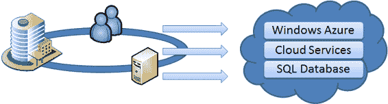

# 第 1 章：SQL 数据库入门
云计算诞生仅几年，就吸引了初创公司和大型企业的想象力。从最简单的形式来看，云计算是传统托管模型的演进；因此，它不一定是新技术。相反，它是一个提供了现有商业模式中没有的新机遇和挑战的新概念。正如敏捷编程提供了一种新的软件开发范式，云计算为基于互联网的解决方案提供了一种新的交付模型。当涉及到关系数据时，Microsoft 提供了当今唯一可用的云数据库：Windows Azure SQL Database。

## 云计算简介
让我们从云计算与传统托管服务相比能提供什么开始。通常期望大型云计算提供商提供以下能力：

- **自动且无限的可扩展性。** 如果您的服务需要更多资源，承诺会自动或以有限的努力提供额外资源。例如，如果您部署了一个 Web 服务，并且突然经历处理需求激增，您的服务将自动扩展到额外的服务器以处理临时激增，并在非高峰活动期间收缩到更少的服务器。
- **自助部署。** 如果您需要部署额外的服务或数据库，您不必致电任何人或打开服务工单。云服务提供商将为您提供必要的工具来执行自助服务。
- **内置故障转移。** 如果您的某个服务器发生故障，没人会注意到。例如，如果安装您服务的服务器崩溃，新的服务器会立即接管。
- **按需增长；按使用付费。** 您只需为使用的资源付费。例如，如果您的服务在一天内经历处理需求激增，但在本月剩余时间缩减到正常用量，您只需为临时激增支付略高于平常的费用。

云服务提供商以不同的方式兑现这些承诺。例如，对于自动化和无限可扩展性的承诺，根据所考虑的服务不同，也有不同的实现方式。Web 服务层将比数据库层更容易扩展。而使用亚马逊扩展 Web 服务层将与使用微软不同。因此，了解云服务提供商如何实现这些功能对于您的应用程序设计选择和支持运营可能很重要。

每个云服务提供商以不同方式实现其服务的事实还有另一个更微妙的影响。

切换云服务提供商可能非常困难。如果您以利用亚马逊特有服务的方式设计应用程序，那么为 Azure 平台调整您的应用程序可能非常困难。因此，在采用云策略之前，您应该仔细选择您的云服务提供商，以避免未来昂贵的应用程序重写。

### 谁在云中做什么？
较小的公司，包括初创公司，正在构建可以在云中运行的服务，而较大的公司则在投资建设支持云的基础设施。一些公司正在构建咨询服务并提供帮助客户实施支持云的解决方案；其他公司，如微软，则在投资使云成为现实的核心基础设施和服务。

微软传统上是一家软件提供商，但多年来已逐渐向硬件解决方案靠拢。在 20 世纪 90 年代末，微软与 Unisys、HP、Dell 和其他硬件制造商合作，提供高可用性的基于 Windows 的平台（Windows 数据中心版）。同时，微软投入大量资源构建其 Microsoft Systems Architecture (MSA)。该计划旨在帮助公司规划、部署和管理基于 Microsoft 的 IT 架构。这些举措，连同许多其他举措，帮助微软在高度可用和可扩展的架构方面发展了强大的知识资本，这是构建云计算平台的先决条件。

亚马逊在 2005 年以 Elastic Compute Cloud (EC2) 服务进入云计算领域。几年后，谷歌和 IBM 联手进入这个市场，微软在 2009 年宣布了许多云计算计划，包括 Azure 平台。作为其 Azure 平台的一部分，微软在其云计算产品中提供了一个非常独特的组件：一个名为 Windows Azure SQL Database（为简便起见也称为 SQL Database，之前称为 SQL Azure）的事务性数据库。

### 典型的云服务
一般来说，云计算有三种形式：

- **SaaS：软件即服务。** 这种交付平台通常是以网络应用程序的形式出现，通过互联网提供，需付费。这种模式已经存在几年了。`Microsoft Office 365` 和 `Google Apps` 是 SaaS 产品的例子。
- **PaaS：平台即服务。** 这种服务提供一个计算平台，便于其他服务的使用和部署，并满足云计算的一般期望，如可扩展性和按需付费。`Windows Azure SQL Database` 和 `Amazon S3`（简单存储服务）是 PaaS 产品的例子。
- **IaaS：基础设施即服务。** 这种产品提供必要的基础设施，提供与云计算通常相关的可扩展性，例如 `Windows Azure` 和 `Amazon EC2`（弹性计算），但在提供应用程序可以直接使用的云服务方面有所欠缺。

SaaS、PaaS 和 IaaS 被视为云计算的基本构建块。其他缩略词也正被创造出来，以描述云计算的新形态，例如桌面即服务（DaaS）、硬件即服务（HaaS），甚至研究即服务（RaaS）。很快，整个字母表都将被用来描述能在云中创建的各种服务形态。

最近，私有云服务开始出现。与公有云服务相比，私有云提供了一个关键优势，因为它允许公司将数据保留在本地。这使得某些公司能够利用云计算的优势，而无需承担将数据存储在互联网上的相关风险。然而，私有云服务在其他方面提供的益处少于公有云托管。例如，按使用付费的承诺不再适用于私有云服务。

[www.it-ebooks.info](http://www.it-ebooks.info/)

