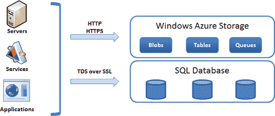

# 第 1 章 ■ SQL 数据库入门

## 发现 Microsoft Azure 平台

让我们来了解 Microsoft Azure 平台的三大主要组件：Windows Azure、Cloud Services 和 Windows Azure SQL Database。这三者都提供独特的功能，可构成构建高度可扩展和安全解决方案所需的完整服务阵列：

• **Windows Azure。** 一套虚拟的 Microsoft 操作系统集合，可在云端运行您的 Web 应用程序和服务。例如，您可以创建一个将美元转换为欧元的 Web 服务；然后，可以将其部署到 Windows Azure Web Site 上，并根据需要进行扩展。请注意，Windows Azure 可以运行 `.NET` 应用程序以及其他平台，包括 PHP。

• **Cloud Services。** 一组提供核心功能的服务，例如用于访问控制的联合身份验证，以及用于基于消息的发布者/订阅者拓扑的服务总线。

• **SQL Database。** Microsoft 基于 Microsoft SQL Server 2012 的面向云计算的事务型数据库产品。例如，您可以使用 SQL Database 将客户数据库存储在云中，并使用部署在 Windows Azure 中的服务来使用客户数据。

Microsoft 还已经发布或即将发布其他值得注意的服务，包括缓存服务、高性能计算 (HPC) 以及用于 Azure 的 Apache Hadoop。随着时间的推移，可能会发布更多服务，提供更多利用云计算承诺的方式。

图 1-1 展示了一个简化的公司环境连接到 Microsoft Azure 平台并使用各种 Azure 服务的示意图。此图被极度简化，但它传达了一个重要的信息：Microsoft Azure 旨在为 Web 应用程序、服务、消息传递和数据存储安全地扩展公司环境。

***图 1-1.** Microsoft Azure 平台概览*

### 为什么选择 Microsoft Azure？

一个经常被问到的基本问题是，“为什么？”首先，谁对在 Windows Azure 中开发应用程序感兴趣？要回答这个问题，让我们看一下 Web 平台的演变。

大约 20 年前，当公共互联网还是电子公告板系统（BBS）、Gopher 服务和 500 美元的 9600 波特调制解调器的时代，人们的问题是：“互联网作为一项技术会持续下去吗？”这个问题已经有了答案，但自那时以来，许多新概念已经发展起来，包括网站、托管中心和 SaaS。

这种演变依赖于一个共同的主题：*解耦*。BBS 将公共信息与图书馆解耦；网站将用户界面与计算机解耦；托管中心将硬件与公司自身的基础设施解耦；而 SaaS 则将复杂的应用程序与公司计算机解耦。

Microsoft Azure 上的云计算是计算灵活性的一种自然演进，其中实际的物理存储和实现细节与软件解决方案解耦。例如，在 Windows Azure 中部署服务不需要了解运行服务的机器或任何核心服务（`IIS`版本、操作系统补丁等）。您可能永远不会知道哪台机器在运行您的软件。

您通过逻辑名称连接到 Windows Azure 服务器，而连接到 SQL Database 实例需要一个互联网地址而不是实际的服务器名称。

[www.it-ebooks.info](http://www.it-ebooks.info/)

将机器与数据和服务分离的能力本身非常强大。Microsoft 的 Azure 环境允许多种业务场景蓬勃发展，包括以下这些：

• **季节性应用程序。** 开发倾向于随时间增长和收缩的网站或服务提供了潜在的节省机会，因为云计算采用按使用付费的模式。

• **短生命周期。** 开发原型或生命周期短的应用程序也很有吸引力，例如活动注册网站。您还可以为远程团队构建开发和测试环境。

• **分离存储。** 某些应用程序需要将存储保存在安全位置，但可能不需要频繁访问，或者可能需要高可用性。设计或修改应用程序，使数据既存储在本地，也存储在 SQL Database（或其他数据存储格式）中，可能是有意义的。

• **小公司和独立软件供应商 (ISV)。** 无法承担启动业务所需的大型复杂基础设施的小公司可以利用 Microsoft Azure 的财务和固有基础设施优势。独立软件供应商（ISV）也可以从云计算中受益。例如，ISV 可以使用 SQL Database 存储应用程序日志，或集中来自多个分散位置的报告功能。

有关使用 Azure 平台的设计模式和应用程序场景的更多信息，请参见第 2 章。

### 关于地理位置

为了提供高可用性，Microsoft 建立了区域数据中心运营，允许客户选择地理上分散的服务。当您创建 Azure 服务器时，您需要指定服务器应在哪个地理位置进行配置。此功能称为 *Windows Azure 地理位置*。

最初，为了提升性能，选择公司所在的地理位置可能很诱人。然而，如果 Azure 服务的可用性比响应时间更重要，您可能需要选择另一个位置。

选择地理位置时，请确保考虑以下因素：

• **性能。** 当您的数据离用户更近时，网络延迟可能会显著降低，从而改善客户体验。

• **灾难恢复。** 如果确保云平台的可用性很重要，您可能希望将服务和数据分散到多个区域。

• **法律因素。** 考虑将存储在云中的信息类型，并确保您不受可能阻止您选择远程地理位置的特定法规和命令的约束。

在撰写本文时，您可以从以下地理位置中选择一个，每个位置都由一个区域数据中心提供支持：

• 东亚

• 美国东部

• 美国中北部

• 北欧

• 美国中南部

[www.it-ebooks.info](http://www.it-ebooks.info/)

• 东南亚

• 西欧

• 美国西部

此外，您可以创建一个*关联组*，以便将某些 Azure 服务保持在一起。这样的组会在部署到 Microsoft Azure 平台的 Windows 和数据服务之间建立地理依赖关系。如果 Microsoft 因合规原因需要将某个服务迁移到另一个地理位置，相关服务很可能也会随之迁移。例如，如果您开发了一个依赖于 `SQL Database` 实例的 Azure 服务，您可能希望确保它们两者位于同一地理位置，并且属于同一个*关联组*。

可用的地理位置会随着时间的推移而增加。因此，您可能需要定期重新评估服务是否部署在最合适的地理位置。请记住，将服务迁移到其他地理位置可能非常耗时。

### 在 Azure 中存储数据

正如您所想象的那样，云计算的核心是以简单且可扩展的方式存储数据。Microsoft Azure 平台提供了多种您可以从中选择的存储模型。本节总结了在 Azure 中存储数据的四种方式；其中三种方法被认为是 Azure 服务的一部分。

图 1-2 概述了存储选项和可用的访问方法。Windows Azure 提供的存储选项集称为 *Windows Azure 存储*，包括 Blob、表和队列。可以使用 `HTTP/S` 调用直接从企业环境访问 *Windows Azure 存储*，这为接入 Microsoft Azure 平台提供了一个简单的接口。除了使用 *Windows Azure 存储* 外，消费者还可以使用 `ADO.NET` 或 `ODBC` 直接向 `SQL Database` 实例发出请求，因为 `SQL Database` 支持 `SQL Server` 使用的表格数据流 (`TDS`) 协议。因此，连接到 `SQL Server` 数据库的应用程序和服务可以同样轻松地连接到 `SQL Database`。

**图 1-2.** Microsoft Azure 数据存储访问

以下是四种存储类型的更多详细信息：

*   **Windows Azure 存储。** Windows Azure 存储提供三种针对特定需求量身定制的不同存储模型：
    *   **表。** 一种命名的键值对存储，允许您存储海量数据。这种存储模型包括自动负载均衡和故障转移。之所以称为表，是因为您可以在每一行中存储多个值。然而，这不是一种事务性存储机制；无法进行索引或表连接。此外，表中定义的列存在存储限制。例如，字符串数据类型限制为 `64KB`。
    *   **Blob。** 用于存储文件的接口，根据您创建的 Blob 类型，存储上限为 `200GB` 或 `1TB`。您可以通过表示状态传递 (`REST`) 调用，使用直接的 `HTTP` 请求轻松访问 Blob。
    *   **队列。** 一种高可用性机制，用于存储供其他应用程序或服务使用的消息。队列的典型用途是发送 XML 消息。队列存在某些限制，但您也可以通过 `REST` 访问队列。
*   **SQL Database。** `SQL Database` 是一个事务性数据库，通过 `ADO.NET` 或其他提供程序提供熟悉的数据访问方式，并允许您使用标准 `T-SQL` 语句操作数据。`SQL Database` 中的数据库实例有两种版本：`Web` 版和 `Business` 版。`Web` 版提供两种最大数据库大小：`1GB` 和 `5GB`。`Business` 版提供以下最大数据库大小：`10, 20, 30, 40, 50, 100 和 150GB`。

表 1-1 总结了 Azure 平台中这些可用数据存储选项的当前特性。

**表 1-1.** Azure 存储摘要

| 存储模式 | 最大大小 | 访问方式 | 格式 | 是否关系型 |
| :--- | :--- | :--- | :--- | :--- |
| 表 | 不适用 | `ADO.NET`/`REST` | 行和列 | 否 |
| 页 Blob | `1TB` | `REST` | 文件 | 否 |
| 块 Blob | `200GB` | `REST` | 文件 | 否 |
| 队列 | `64KB*` | `REST` | 字符串 | 否 |
| SQL Database | `150GB` | `ADO.NET` | 行和列 | 是 |

** 推荐限制*

## SQL Database 入门

如您所见，`SQL Database` 是一个基于 `SQL Server` 技术的关系数据库引擎。它支持 `SQL Server` 的许多功能，包括表、主键、存储过程、视图等等。本节提供一个简短的入门指南，帮助您开始使用 `SQL Database`。您将了解如何注册 Azure、如何创建数据库和账户，以及如何登录。

### 注册 Azure

要注册 Windows Azure，请访问 Windows Azure 网站上的定价页面：`http://www.windowsazure.com/en-us/pricing/purchase-options/`。图 1-3 显示了撰写本文时的一些可用选项。

**图 1-3.** 选择 Windows Azure 方案

从该页面，您可以选择最符合您个人情况和需求的方案。选择首选方案后，点击 `购买`，并按照屏幕上的说明操作。完成后，您将收到一封包含配置 Windows Azure 平台说明的电子邮件。

要访问 Azure 门户，请打开您的 Web 浏览器并输入以下 URL：`http://windows.azure.com`。Azure 门户允许您部署、管理和查看服务的运行状况。

### 创建 SQL Database 实例

您需要做的第一件事是创建一个新的 `SQL Database` 服务器。`SQL Database` 服务器的名称将成为一个完全限定的互联网地址，也是在其中创建数据库实例的逻辑名称。创建 `SQL Database` 服务器时，会自动配置 `master` 数据库。此数据库是只读的，包含您数据库的配置和安全信息。然后，您可以创建用户数据库。您可以使用 Windows Azure 管理门户，也可以使用 `SQL Server Management Studio` 针对 `master` 数据库执行 `T-SQL` 语句。

#### 使用 Windows Azure 管理门户

创建数据库的一种方法是通过 Windows Azure 管理门户。在导航窗格（页面左侧）中选择 `SQL Databases` 选项卡将列出您所有现有的 `SQL Database` 实例及其关联的服务器。可以通过门户以两种方式之一完成数据库的创建。首先，在显示数据库实例列表的情况下，点击门户页面左下角菜单栏中的 `新建` 按钮，然后选择 `SQL Database` ➤ `快速创建`。其次，您可以选择在门户页面顶部（`Databases` 选项卡旁边）选择 `Servers` 选项卡，从服务器列表中选择相应的服务器名称，选择 `Databases` 选项卡，然后点击底部菜单栏上的 `添加`。图 1-4 显示了管理门户，其中创建了几个订阅和 `SQL Database` 实例。

**图 1-4.** SQL Database 实例

通过 `快速创建` 选项创建 `SQL Database` 实例，您可以通过指定数据库名称以及要在其中创建新数据库实例的订阅和服务器来快速创建数据库。如果您正在某个订阅中创建新数据库，而该订阅中尚未创建任何服务器，系统还将要求您为将要配置的新服务器提供管理员用户名和密码。通过 `快速创建` 选项创建数据库会创建一个 `1GB Web 版` 数据库实例。

