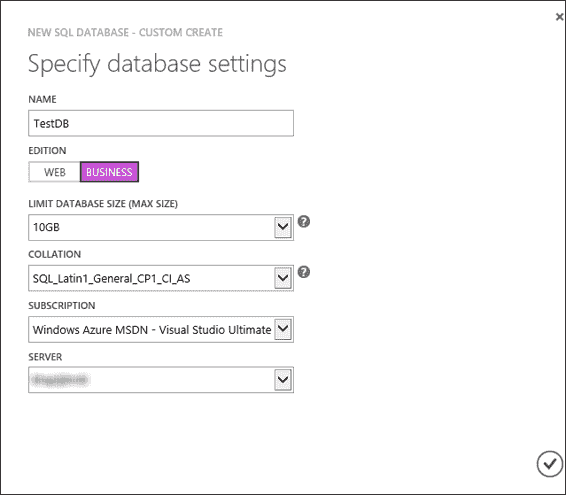
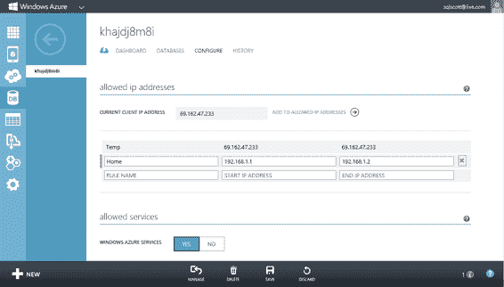
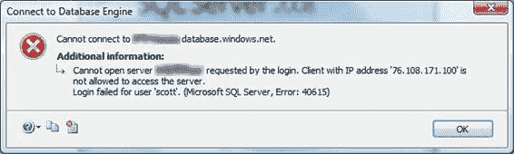
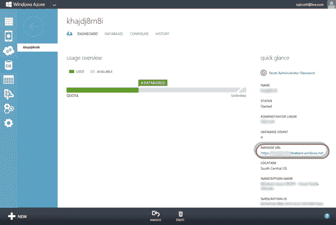
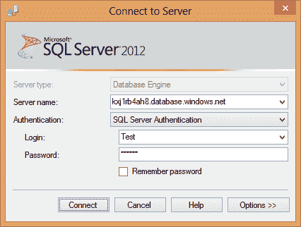
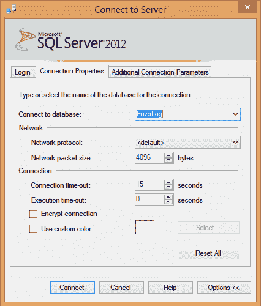
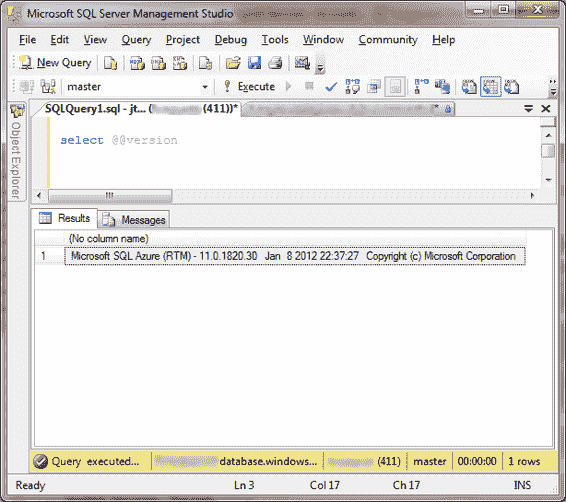

# 第 1 章 SQL 数据库入门

## 通过服务器选项卡创建数据库

通过 Servers 选项卡创建数据库的过程略有不同，它会弹出“新建 SQL 数据库-自定义创建”对话框，如图 1-5 所示。在“自定义创建”对话框中，除了输入数据库名称外，您还可以选择数据库版本（Web 或 Business），并指定数据库的大小及其排序规则。在“自定义创建”对话框中输入适当的信息后，单击“确定”。

[www.it-ebooks.info](http://www.it-ebooks.info/)



***图 1-5. 创建 SQL 数据库实例***

对于数据库大小，如果 1GB 或 5GB 对您来说足够，可以选择 Web 版本。如果需要创建更大的数据库，请选择 Business 版本，该版本允许您选择 10GB 到 150GB 之间的大小。

> **注意** 月费会根据数据库大小而变化。请参阅本章后面的附加信息以及 Microsoft 网站上的完整定价信息：[www.microsoft.com/azure.](http://www.microsoft.com/azure)

## 使用 T-SQL 命令创建数据库

使用 T-SQL 命令创建新数据库非常简单。由于 SQL 数据库中的数据库实例由 Microsoft 管理，因此只有少数几个选项可供您使用。此外，您必须连接到`master`数据库才能创建新数据库。

要使用 SQL Server Management Studio 创建新数据库，请使用管理员帐户（或任何具有`dbmanager`角色的用户）登录，并运行以下 T-SQL 命令：

```
CREATE DATABASE TextDB (MAXSIZE = 10 GB)
```

[www.it-ebooks.info](http://www.it-ebooks.info/)



如前所述，Web 版本的数据库大小可以是 1GB 或 5GB，Business 版本的大小可以是 10GB–150GB。如果未定义`MAXSIZE`参数，则数据库大小将设置为 1GB。

### 配置防火墙

SQL Database 代表您实现了一个防火墙。这是有助于保护数据库的一项优势。实际上，默认的防火墙规则是*任何人*都无法连接到新创建的 SQL 数据库服务器。您可以随时使用管理门户配置防火墙规则，即使未定义防火墙规则也可以创建数据库。默认情况下不允许任何连接是一种良好的安全实践，因为它会迫使您仔细考虑要允许哪些 IP 地址进入。

请按照以下步骤为需要访问 SQL 数据库服务器的计算机添加 IP 地址（或 IP 范围）：

1.  在 Windows Azure 管理门户中，选择左侧导航栏中的“SQL 数据库”选项卡。
2.  在“列表项”部分上方选择“服务器”选项卡。
3.  选择要添加防火墙规则的服务器名称。
4.  在“列表项”部分顶部选择“配置”选项卡。
5.  在“允许的 IP 地址”部分，输入规则名称以及起始和结束 IP 地址，如图 1-6 所示。单击“保存”。

***图 1-6. 防火墙设置***

6.  此外，如果您有需要访问 SQL 数据库服务器的 Windows Azure 服务，请在“允许的服务”部分为“Windows Azure 服务”选择“是”。

[www.it-ebooks.info](http://www.it-ebooks.info/)



如果出于某种原因防火墙规则配置不正确，您将看到相应的错误消息。

图 1-7 显示了如果防火墙规则不允许您连接，使用 SQL Server Management Studio 时会收到的错误消息。错误消息看起来像是登录失败，但其描述清楚地表明具有给定 IP 地址的客户端不允许访问服务器。

***图 1-7. 防火墙错误***

> **注意** 创建防火墙规则时，您可能需要等待几分钟才能使规则生效。

您还可以直接使用 T-SQL 查看和编辑防火墙设置，方法是使用管理员帐户连接到`master`数据库并使用以下对象：
* `sys.firewall_rules`
* `sp_set_firewall_rule`
* `sp_delete_firewall_rule`

现在您已经配置好了 SQL 数据库实例，可以开始进行有趣的操作了！

### 使用 SQL Server Management Studio 连接

请按照以下步骤使用 SQL Server Management Studio 连接到您的 SQL 数据库实例：

1.  您需要获取 SQL 数据库服务器的完全限定服务器名称。图 1-8 显示了管理门户上的服务器信息。完全限定的服务器名称位于右侧的“属性”窗格中。

[www.it-ebooks.info](http://www.it-ebooks.info/)



***图 1-8. 获取 SQL 数据库服务器的服务器名称***

> **注意** 本示例使用 SQL Server 2008 SP1 Management Studio。虽然您可以使用此版本连接和管理 SQL 数据库实例，但使用 SQL Server 2008 R2 和 SQL Server 2012 版本可以获得额外功能，例如使用对象浏览器查看数据库对象。

2.  启动 SQL Server Management Studio。在登录屏幕中单击“取消”按钮。
> **注意** 如果您使用的是 SQL Server 2008 R2 或更高版本的 SQL Server Management Studio，可以使用第一个登录窗口登录。但是，如果使用的是早期版本的 SQL Server Management Studio，则需要在第一个登录窗口中单击“取消”。本节提供的说明适用于所有版本。

3.  单击“新建查询”按钮，或按`Ctrl + N`。将打开一个新的登录屏幕（参见图 1-9）。
在此窗口中，输入以下信息：

[www.it-ebooks.info](http://www.it-ebooks.info/)



***图 1-9. 登录到 SQL 数据库服务器***

*   **服务器名称。** 输入完全限定的服务器名称。
*   **身份验证。** 选择“SQL Server 身份验证”。
*   **登录名。** 键入管理员用户名（之前创建的）。
*   **密码。** 键入管理员帐户的密码。

4.  默认情况下，单击“连接”会针对`master`数据库进行身份验证。如果要连接到另一个数据库实例，请单击“选项”，并在“连接到数据库”字段中键入所需的数据库名称，如图 1-10 所示。请注意，不能选择数据库名称；必须键入数据库名称。为了增强安全性，您还可以选中“加密连接”选项；尽管 SQL 数据库中的所有连接都是加密的，但此选项将强制立即建立加密连接，并绕过可能被中间人攻击利用的与 SQL 数据库的协商阶段。

[www.it-ebooks.info](http://www.it-ebooks.info/)



***图 1-10. 连接到`master`以外的特定数据库实例***

5.  准备就绪后，单击“连接”。将打开一个新的查询窗口，您可以针对 SQL 数据库实例执行 T-SQL 命令。

> **注意** `USE`命令无法在 SQL 数据库中切换数据库上下文。因为数据库可能物理上位于任何服务器上，所以切换数据库的唯一实用方法是重新连接。

图 1-11 显示了连接到 SQL 数据库中`master`的查询窗口，其中已执行了一个简单的命令。

[www.it-ebooks.info](http://www.it-ebooks.info/)



***图 1-11. 在 SQL 数据库实例上运行简单的 T-SQL 命令***

### 创建登录名和用户


