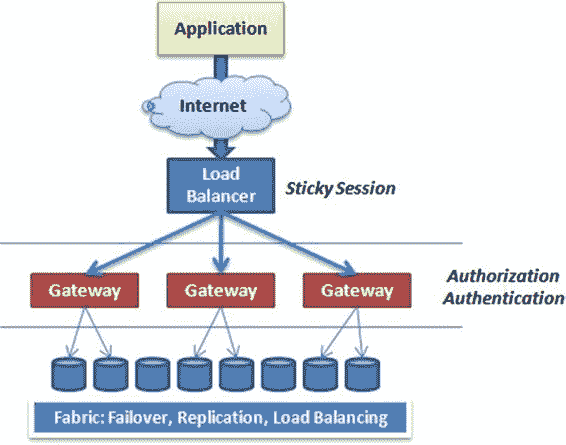

# 第 2 章：设计注意事项

## SQL 数据库版本与分区

目前，SQL 数据库支持两种版本：Web 版（1GB 或 5GB）和商业版（从 10GB 到 150GB）。因此，如果你的应用程序需要存储超过 150GB 的数据，或者你的数据库能从多线程数据访问层中受益，你就需要考虑通过一种称为*分片*的分区形式，将数据拆分到多个数据库中。你将在本章后面以及本书的更详细内容中学习有关分片的知识。

### 高可用性

在设计应用程序时，软件开发人员和架构师通常关注高可用性要求。SQL 数据库采用了一个非常精密的拓扑结构，以最大限度地实现工作负载重分布、透明性和恢复。图 2-1 展示了 SQL 数据库的高级实现，暗示了后端基础设施必须有多先进。

[www.it-ebooks.info](http://www.it-ebooks.info/)

### 图 2-1：SQL 数据库拓扑结构

图 2-1 显示，连接通过负载均衡器建立，该均衡器决定哪个网关应处理连接请求。网关充当防火墙的角色，检查请求、执行身份验证和授权服务，并将数据包转发到实际的 SQL 数据库实例。由于数据库可以动态移动以确保资源分配公平，网关可能会更改目标端点。这个过程在很大程度上是透明的。

此外，每个 SQL 数据库实例都在不同的服务器上复制了两份以实现冗余。在后台，一个复制拓扑结构确保 SQL 数据库实例始终存在于另外两台物理服务器上。

这两个额外的副本对使用者完全透明，且无法访问。

**注意：** SQL 数据库在任何给定月份提供 99.9% 的可用性。有关服务级别协议的具体条款，请查看以下链接：[`www.windowsazure.com/en-us/support/legal/sla/`](https://www.windowsazure.com/en-us/support/legal/sla/)。

### 性能

你所编写的应用程序的性能可能受两方面因素影响：节流以及你如何设计应用程序。微软实施了 `performance throttling` 以防止一个客户的程序影响他人。（这是一个好的功能，并不像听起来那么糟糕。）应用程序设计是你掌控的部分。

#### 节流

SQL 数据库运行在多租户环境中，这意味着你的数据库实例与其他公司的数据库共享服务器资源。因此，SQL 数据库平台实现了一种节流算法，以防止大型查询影响其他用户的性能。如果你的应用程序发出一个可能影响其他数据库的大型查询，你的数据库连接将被终止。

[www.it-ebooks.info](http://www.it-ebooks.info/)

此外，为了保护宝贵资源并控制可用性，SQL 数据库会自动断开空闲会话。会话超时设置为 30 分钟。当你为 SQL 数据库进行设计时，你的应用程序应考虑自动会话恢复。这也意味着你在开发阶段的性能测试变得更加关键。

但请注意，高 CPU 活动不会像其他资源一样被节流。当检测到高 CPU 活动时，SQL 数据库不会丢失数据库连接，而是会限制你的 CPU 带宽，但允许你的 T-SQL 操作继续执行。这意味着某些语句可能需要更长时间才能执行。

出现以下任何情况都将终止你的数据库连接：

*   **锁消耗：** 如果你的应用程序消耗了超过 100 万个锁，你将收到错误代码 40550。监视 `sys.dm_tran_locks` 管理视图可提供锁的状态。
*   **未提交的事务：** 一个锁定内部资源超过 20 秒的事务将被终止，并返回错误代码 40549。
*   **日志文件大小：** 如果单个事务的日志文件大小超过 1GB，连接将被终止，并返回错误代码 50552。
*   **TempDB：** 如果你运行大型事务、大型命令批处理或消耗超过 5GB 空间的大型排序操作，会话将被终止，并返回错误代码 40551。
*   **内存：** 如果你的语句在超过 20 秒的时间内消耗了超过 16MB 的内存，你的会话将被终止，并返回错误代码 40553。
*   **数据库大小：** 如果数据库超过其配置的最大大小，任何更新或插入数据的尝试都将失败，并返回错误代码 40544。你可以通过删除索引、清理表或使用 `ALTER DATABASE` 语句增加数据库大小来解决此错误。
*   **空闲连接：** 任何空闲超过 30 分钟的连接将被终止。这种情况下不会返回错误。
*   **事务：** 持续超过 24 小时的事务将被终止，并返回错误代码 40549。
*   **拒绝服务攻击：** 如果某个特定 IP 地址的许多登录尝试失败，则来自该 IP 地址的任何连接尝试都将在一段时间内失败，以保护 SQL 数据库服务。不会返回错误代码。
*   **网络问题：** 如果网络问题是会话终止的根源，你不会从 SQL 数据库收到特定的错误代码；但是，你可能会收到套接字错误。
*   **故障转移：** 当 SQL 数据库正在将你的数据库故障转移到另一个节点时，你的活动会话将被断开。你可能会收到套接字异常或一个通用错误，提示你应该重试操作。
*   **高活动性：** 托管你的数据库的服务器如果遇到巨大压力或超出其操作边界（例如太多繁忙的工作线程），SQL 数据库可能会断开会话，并返回错误代码 40501。

一些附加条件，称为瞬态错误，也可能导致你的会话被终止。你的代码应考虑到这些错误，并在发生时重试操作。以下是你的代码可能需要处理的常见错误的部分列表：

*   **错误 20：** 你尝试连接的 SQL Server 实例不支持加密。
*   **错误 64：** 与服务器建立了成功连接，但随后在登录过程中发生错误：`provider: TCP Provider, error: 0 - The specified network name is no longer available.`。
*   **错误 233：** 由于登录前初始化过程中的错误，客户端无法建立连接。可能的原因包括：客户端尝试连接到不支持的 SQL Server 版本；服务器太忙无法接受新连接；或者服务器上存在资源限制（内存不足或达到最大允许连接数）：`provider: TCP Provider, error: 0 - An existing connection was forcibly closed by the remote host.`。
*   **错误 10053：** 从服务器接收结果时发生传输级错误。已建立的连接被主机中的软件中止。
*   **错误 10054：** 向服务器发送请求时发生传输级错误：`provider: TCP Provider, error: 0 - An existing connection was forcibly closed by the remote host.`。
*   **错误 10060：** 在建立与 SQL Server 的连接时发生网络相关错误或特定于实例的错误。未找到服务器或无法访问服务器。请验证实例名称是否正确以及 SQL Server 是否配置为允许远程连接：`provider: TCP Provider, error: 0 - A connection attempt failed because the connected party did not properly respond after a period of time, or established connection failed because connected host has failed to respond.`。

