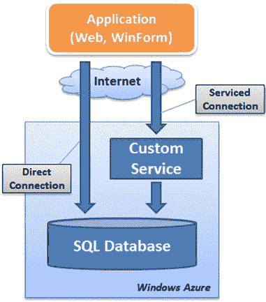
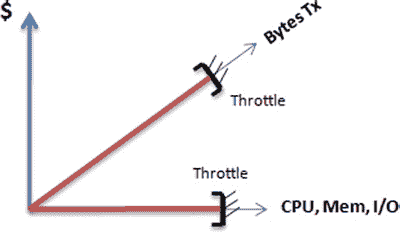

# 处理瞬态错误及 SQL 数据库的应用设计

为了解决前面提到的大多数错误，微软发布了 `Trans 错误处理应用程序块`。该框架旨在处理包括 `SQL 数据库` 在内的各种云服务的瞬态错误。框架还提供了不同的重试策略，包括 `增量`、`固定间隔` 和 `指数退避` 等选项。更多信息请访问微软 Azure 企业库集成包：[`msdn.microsoft.com/en-us/library/hh680934(v=PandP.50).aspx`](http://msdn.microsoft.com/en-us/library/hh680934(v=PandP.50).aspx)。

### 注意
在 `SQL 数据库` 的语境下，`限制连接` 通常意味着终止数据库连接。无论 `限制连接` 的原因是什么，其结果通常相同：丢失数据库连接。

## 应用设计考量

在考虑如何设计应用以充分利用 `SQL 数据库` 时，你需要评估以下几项：

- **数据库往返操作。** 在你的应用中执行特定功能需要多少次往返操作？更多的数据库往返操作意味着应用速度更慢，尤其是当连接是通过互联网链路建立并采用 `SSL` 加密时。
- **缓存。** 你可以通过在客户端机器上缓存资源或将临时数据存储在更靠近消费者的地方来改善响应时间。
- **属性延迟加载。** 除了减少往返操作外，仅加载执行必需功能所绝对必要的数据也至关重要。延迟加载在这方面能提供显著帮助。
- **异步用户界面。** 当等待不可避免时，提供响应式的用户界面会有所帮助。多线程技术有助于提供更响应迅速的应用。
- **分片。** `分片` 是一种将你的数据跨多个数据库拆分的方式，其目标是尽可能对你的应用代码透明，从而提升性能。联合（Federation）是 `SQL 数据库` 中可用的分片技术。

[www.it-ebooks.info](http://www.it-ebooks.info/)

## 第 2 章 ■ 设计考量

对于依赖远程存储的云计算解决方案，为性能而设计应用变得尤为重要。关于这些主题及更多信息，请参阅第 9 章。

### 数据同步

与 `SQL 数据库` 同步数据主要有两种方式：`Microsoft Sync Framework`（同步框架）和 `SQL Data Sync`（数据同步）服务。`Microsoft Sync Framework` 提供了包括数据库在内的多个数据存储之间的双向数据同步能力。`SQL Data Sync` 使用了 `Microsoft Sync Framework`，该框架不仅限于数据库同步；你还可以使用该框架在不同平台和网络间同步文件。

具体到 `SQL 数据库`，你可以使用 `Microsoft Sync Framework` 通过保持本地数据库与 `SQL 数据库` 实例同步，为你的应用提供离线模式。并且因为该框架可以与多个端点同步数据，你可以设计一个分片（稍后详述），其中所有数据库实例都能透明地保持其数据同步。

`SQL Data Sync` 服务为本地 `SQL Server` 数据库与 `SQL 数据库` 之间，或 `SQL 数据库` 实例之间，提供了一个更简单的同步模型。由于此服务在云端运行，因此非常适合同步云数据库，而无需在本地安装和配置服务。

### 直接连接与服务化连接

你也可以考虑开发 `Azure` 服务，将数据库连接保持在本地网络，然后使用 `SOAP` 或 `REST` 消息将数据发送回客户端。如果你的 `Azure` 服务与你的 `SQL 数据库` 实例部署在同一区域，那么数据库连接将从同一数据中心建立，性能会快得多。

然而，使用 `SOAP` 或 `REST` 将数据发送回消费者未必能提高性能；你现在发送回的是 `XML` 而非原始数据包，这意味着更大的带宽占用。最后，你可以考虑编写存储过程，让部分业务逻辑尽可能靠近数据。

图 2-2 展示了应用获取存储在 `SQL 数据库` 实例中数据的两种不同方式。

可以直接从应用建立到数据库的直接连接，在这种情况下，应用发出 `T-SQL` 语句来检索数据。或者，可以通过在 `Windows Azure` 上创建和部署自定义的 `SOAP` 或 `REST` 服务来实现服务化连接，这些服务再与数据库通信。在这种情况下，应用通过部署在 `Azure` 中的 Web 服务请求数据。

***图 2-2.** 数据连接选项*

[www.it-ebooks.info](http://www.it-ebooks.info/)

## 第 2 章 ■ 设计考量

请记住，你可以设计一个应用同时使用这两种连接方式。你可能会确定你的应用在归档数据时需要直接连接，而在执行更复杂的功能时使用服务。

一般来说，你应该尝试使用服务化连接，以便利用连接池和集中缓存，否则这些功能可能难以或无法实现。连接池和缓存是有助于避免 `限制连接` 情况的性能技术。

### 注意
本章大部分内容提供了直接连接示意图；然而，许多介绍的模式在先通过服务化连接到 `Windows Azure` 服务的情况下，同样适用。

## 定价

托管环境的定价通常不被视为标准应用设计中的一个因素。然而，在云计算（包括 `Azure`）的情况下，你需要记住，应用的性能和整体设计直接影响你的月度成本。

例如，每次部署和使用 `Azure` 服务时，你都会产生网络和处理费用。尽管如此，在撰写本文时，同一地理位置内的 `Windows Azure` 应用或服务与 `SQL 数据库` 实例之间的数据流量是免费的。

定价可能会影响你短期的应用设计选择，但你应该记住，`Microsoft` 可能随时更改其定价策略。因此，尽管定价是一个重要的考量因素（尤其对于预算有限的项目），但设计的长期生命力应比短期的财务收益更为重要。

如果你正在设计一个运行在 `Azure` 环境中的应用，并且依赖该应用产生收入，你必须确保你的定价模型能够覆盖由此产生的运营成本。例如，如果你打算对应用使用收费，那么你的应用应该从一开始就设计为具备计费能力。

与定价相关的另一个因素是，你的 `SQL 数据库` 实例成本包含月度费用和使用费。月度费用是按比例计算的，因此如果你在下午 1 点创建一个数据库并在当天下午 2 点删除它，你将被收取一部分月度费用加上使用费。使用费严格限于带宽消耗：CPU 利用率、`I/O` 消耗以及数据库的内存占用量都不是使用费的考虑因素（见图 2-3）。

然而，如前所述，如果你的数据库活动达到特定阈值，你的数据库连接可能会被 `限制连接`。

***图 2-3.** 定价与资源限制*

总之，你可以考虑将某些 CPU 密集型活动（在合理范围内）转移到 `SQL 数据库` 实例上执行而不产生额外费用。例如，你可以在存储过程中执行使用大数据集的复杂联接，并仅将一些汇总行返回给消费者，以此作为最小化使用费的一种方式。

[www.it-ebooks.info](http://www.it-ebooks.info/)

