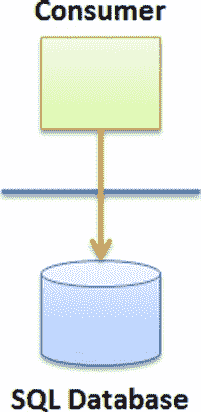
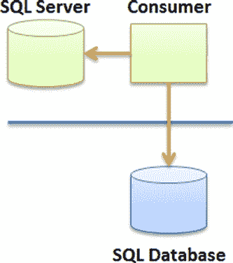
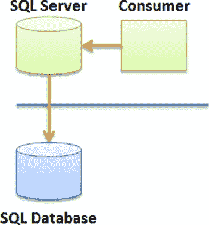
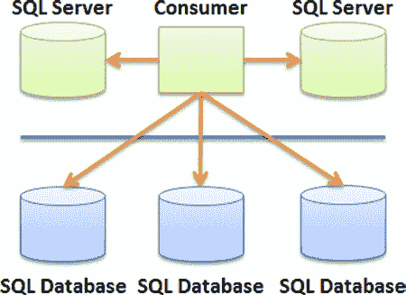

# 第 2 章：设计考虑因素

### 安全性

毋庸置疑，对于某些类型的应用，安全性可能是一个需要关注的问题；然而，这些担忧与企业在使用传统托管设施时所面临的类似。在云计算中考虑安全性时，想到的问题通常与对数据隐私缺乏控制有关。此外，某些限制可能会妨碍某些类型的监控，这就自动排除了在高度敏感的应用中使用`SQL Database`的可能，除非敏感数据在客户端已完全加密。

因此，加密可能成为您设计决策的重要组成部分。如果您决定加密数据，加密将在何处进行？尽管您的应用程序代码与`SQL Database`之间的连接是加密的，并且您可以与`SQL Database`一起使用哈希函数，但数据本身在存储于磁盘上的`SQL Database`中时并未加密。您可能需要先在应用程序代码中对数据进行加密，然后通过公共互联网发送，这样存储时数据就是加密状态。

加密有利于数据隐私，但它带来几个缺点：性能变慢以及难以搜索数据。强加密会拖慢应用程序速度，并且在数据库中搜索加密数据是众所周知地困难。

### 设计因素回顾

到目前为止，您已经看到了一些可能影响设计选择的考虑因素。表 2-1 提供了总结。其中一些考虑因素与您可以利用的机会相关；另一些则是由云计算的本质，或具体由`Azure`平台施加的限制。

**表 2-1.** 设计因素总结

| **机会** | **限制** |
| :--- | :--- |
| 异地存储 | 存储量有限 |
| 弹性成本 | 性能 |
| 即时供应 | 备份 |
| SQL 数据同步 | 安全性担忧 |
| 高可用性 | |

在设计应用程序时，请务必评估本书中讨论的具体`Azure`限制是否仍然适用——为了响应客户需求，`Azure`平台很可能会快速变化。

## 设计模式

让我们回顾一下使用`SQL Database`的重要设计模式。在设计您的第一个云应用程序之前，您应该阅读本节以熟悉一些设计选项。本章解释的一些高级设计模式也可以提供显著的商业价值，尽管它们更难以实现。

请注意，为简洁起见，本节中的图表仅显示了与`SQL Database`的直接连接。然而，几乎所有模式都可以通过`Azure`服务使用托管连接来实现。

### 直接连接

如图 2-4 所示，*直接连接模式* 可能是连接到`SQL Database`实例的最简单形式。消费者可以是位于公司网络中的应用程序，也可以是直接连接到`SQL Database`实例的`Windows Azure`服务。

[www.it-ebooks.info](http://www.it-ebooks.info/)

**图 2-4.** 直接连接模式

尽管简单，但这可能是最广泛使用的模式之一，因为它不需要特殊配置或高级集成技术。例如，软件即服务（`SaaS`）应用程序可能会使用此模式；在这种情况下，消费者是在`Azure`（或任何其他托管提供商）上托管的网站。或者，消费者可能是访问`SQL Database`中记录的智能设备或手机。

### 智能分支

*智能分支模式*（见图 2-5）描述了一种包含足够逻辑来判断其需要加载的数据是位于云端还是本地数据库中的应用程序。做出此判断的逻辑要么在应用程序中硬编码，要么由配置文件驱动。它也可能由数据访问层（`DAL`）引擎提供，该引擎包含从本地或云数据库获取数据的逻辑。

**图 2-5.** 智能分支模式

[www.it-ebooks.info](http://www.it-ebooks.info/)

智能分支的用途之一是实现一种缓存形式，其中消费者将其部分数据本地缓存，或在必要时从云数据库获取。您也可以使用此模式为应用程序实现断开连接模式，以防互联网连接不可用。

### 透明分支

智能分支依赖于消费者（或其组件之一）来确定数据是本地还是在云端，而*透明分支*（见图 2-6）则消除了消费者的这一顾虑。消费应用程序不再依赖于路由逻辑，并且对数据的最终位置变得不感知。

**图 2-6.** 透明分支模式

此模式最适合难以修改或实现成本过高的应用程序。它可以有效地以扩展存储过程的形式实现，这些过程知道如何从云数据源获取数据。本质上，此模式在数据库层实现了一个`DAL`。

### 分片

到目前为止，您看到的都是每次实现单个连接的模式。在*分片*中（见图 2-7），可以同时以读取和/或写入方式访问多个数据库，并且这些数据库可以位于混合环境（本地和云端）中。但是，请记住，分片的总体可用性部分取决于本地数据库的可用性。

[www.it-ebooks.info](http://www.it-ebooks.info/)

**图 2-7.** 分片模式

当性能要求需要以横向扩展的方式将数据访问分散到多个数据库时，通常会实现分片。

#### 分片概念与方法

在研究分片模式之前，让我们分析一下分片设计的各个方面。这里解释一些重要概念：

*   **决策规则。** 明确无误地确定哪个数据库包含相关记录的逻辑。例如，`if Country = US, then connect to SQL Database instance #1`。规则可以是静态的（例如硬编码在`C#`中）或动态的（存储在`XML`配置文件中）。静态规则往往会限制轻松扩展分片的能力，因为添加新数据库可能会改变规则。另一方面，动态规则可能需要创建规则引擎。并非所有分片库都使用决策规则。
*   **轮询。** 一种方法，以一致的方式为每个新连接（或其他条件）更改数据库端点。例如，以轮询方式访问一组五个数据库时，第一个连接到数据库 1，第二个到数据库 2，依此类推。然后，第六个连接再次连接到数据库 1，依此类推。轮询方法避免了创建决策引擎，并尝试将数据和负载均匀分布在分片涉及的所有数据库上。
*   **水平分区。** 一组具有相似模式的表，连接起来时代表整个数据集。例如，销售记录可以按国家/地区拆分，每个国家/地区存储在单独的表中。您可以通过应用决策规则或使用轮询方法来创建水平分区。使用轮询方法时，没有逻辑辅助...

识别包含目标记录的数据库；因此必须搜索所有数据库。

*   **垂直分区（Vertical partition）。** 将表模式拆分到多个数据库中。因此，单条记录的列会存储在多个数据库上。虽然这被认为是一种有效的技术，但本书未对垂直分区进行探讨。
*   **镜像（Mirrors）。** 主数据库的精确副本（或主数据库中感兴趣的较大部分）。采用镜像配置的数据库通过类似 `SQL Data Sync` 的同步机制在几乎相同的时间获取数据。例如，由两个数据库组成的镜像分片，每个数据库都包含 `Sales` 表，且两个表中的记录数始终相同。读取操作因此得以简化（无需规则），因为你连接到哪个数据库并不重要；所有数据库中的 `Sales` 表都包含你需要的数据。

[www.it-ebooks.info](http://www.it-ebooks.info/)

## 第二章 ■ 设计考量

*   **分片定义（Shard definition）。** 在 Azure 中的服务器上创建的 SQL 数据库实例列表。消费应用程序可以通过连接到主数据库自动检测哪些数据库是分片的一部分。如果所有创建的数据库都是分片的一部分，枚举 `sys.databases` 中的记录即可获得分片中的所有数据库。
*   **面包屑（Breadcrumbs）。** 一种留下小痕迹以供下游改进决策的技术。在此上下文中，可以向数据集添加面包屑，以指示记录来自哪个数据库。这有助于确定应连接到哪个数据库来更新记录，并避免将请求广播到所有数据库。

使用分片时，消费者通常会发出 `CRUD`（创建、读取、更新和删除）操作。根据所选方法的不同，每个操作都具有独特的属性。表 2-2 概述了一些可能的技术组合，以帮助你决定哪种分片方法最适合你。左列描述了分片使用的连接机制，顶行确定了分片的存储机制。

***表 2-2.** 分片访问技术*

| 决策规则 | 水平分区 | 镜像 |
| :--- | :--- | :--- |
| **规则（Rules）** 决定记录如何均匀分布在分片中。 | 这种组合似乎没有提供好处。镜像数据库未被分区，因此不存在用于查找记录的规则。 | **创建（Create）**: 应用规则。 |
| **创建（Create）**: 应用规则。 | | |
| **读取（Read）**: 连接到所有数据库，并将规则作为 `WHERE` 子句的一部分包含在内，或根据规则选择数据库。为更新和删除操作添加面包屑。 | | |
| **更新（Update）**: 应用规则或使用面包屑，如果更新的列是规则的一部分，可能还需要将记录移动到另一个数据库。 | | |
| **删除（Delete）**: 应用规则，或在可能时使用面包屑。 | | |
| **轮询（Round-robin）** | 记录根据可用连接随机放置在数据库中。无法应用逻辑来确定哪个数据库包含哪些记录。 | 所有记录都复制到所有数据库。使用单个数据库（称为*主数据库*）进行写入。 |
| **创建（Create）**: 在当前数据库中插入记录。 | | **创建（Create）**: 仅在主数据库中插入记录。 |
| **读取（Read）**: 连接到所有数据库，发出语句，并连接结果集。为更新和删除操作添加面包屑。 | | **读取（Read）**: 以轮询方式连接到任意数据库。 |
| **更新（Update）**: 连接到所有数据库（或使用面包屑），并使用主键应用更新。 | | **更新（Update）**: 仅在主数据库中更新记录。 |
| **删除（Delete）**: 与更新相同。 | | **删除（Delete）**: 仅在主数据库中删除记录。 |

分片可能非常难以实现。实施分片时，请确保进行彻底测试。你也可以参考一些已开发的分片库。本书（第 9 章）进一步介绍的、托管在 `CodePlex` 上的分片库使用了 `.NET 4.0`；你可以在 [`enzosqlshard.codeplex.com`](http://enzosqlshard.codeplex.com) 找到其源代码。

