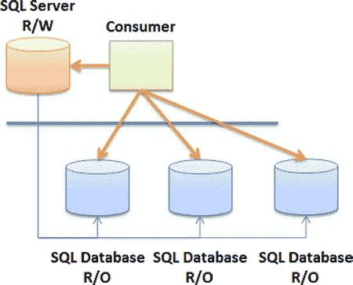
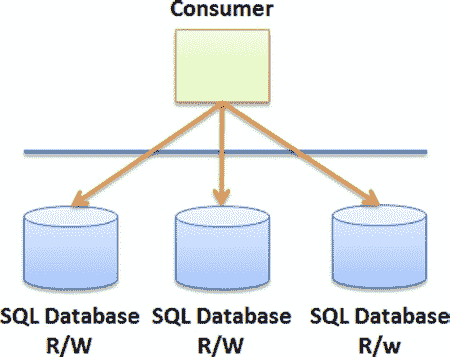

# 第 2 章 ■ 设计考虑因素

#### 只读分片

分片可以通过多种方式实现。例如，你可以创建一个**只读分片（`ROS`）**。虽然该分片的数据来源于一个接受读写操作的数据库，但其记录对于使用者而言是只读的。

[www.it-ebooks.info](http://www.it-ebooks.info/)

图 2-8 展示了一个分片拓扑结构的示例，它由一个用于存储数据的本地 `SQL Server`（具有读写权限）组成。然后数据通过 `SQL Data Sync Framework`（或其他方法）复制到实际的分片中，这些分片是云中其他的 `SQL Database` 实例。消费应用程序随后连接到该分片（位于一个 `SQL Database` 实例中），根据需要读取信息。

**图 2-8.** 只读分片拓扑结构

在一种场景中，每个 `SQL Database` 实例都包含完全相同的数据副本（镜像分片），因此消费者可以连接到其中一个 `SQL Database` 实例（例如，使用 `轮询` 机制来分散负载）。这可能是较简单的实现方式，因为所有记录都被盲目地复制到分片中的所有数据库中。但请记住，`SQL Database` 不支持分布式事务；你可能需要一个补偿机制，以防某些事务提交而另一些没有。

`ROS` 的另一种实现方式是使用 `水平分区` 来同步数据。在水平分区中，应用规则来确定哪个数据库包含哪些数据。例如，可以实现 `SQL Data Sync` 服务，将 `美国` 的销售数据分区到一个 `SQL Database` 实例，而将 `欧洲` 的销售数据分区到另一个实例。在这种实现中，要么消费者知道水平分区规则，并知道要连接到哪个数据库（通过根据客户输入应用决策规则），要么它通过必要时应用 `WHERE` 子句（按国家筛选）连接到云中的所有数据库，从而避免运行基于既定规则选择正确数据库的决策引擎的成本。

[www.it-ebooks.info](http://www.it-ebooks.info/)

