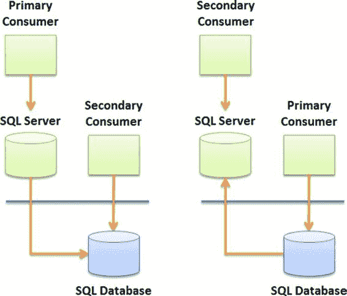

# 第 2 章 ■ 设计考虑因素

#### 读写分片

在**读写分片（`RWS`）** 中，所有数据库都被认为是可读写的。在这种情况下，你不需要使用采用 `SQL Data Sync Framework` 的复制拓扑结构，因为在分片内每个记录只有一个副本。

图 2-9 展示了一个 `RWS` 拓扑结构。

**图 2-9.** 多主分片拓扑结构

虽然 `RWS` 消除了数据库间数据同步的复杂性，但消费者需要负责将所有 `CRUD` 操作定向到适当的云数据库。这需要特殊的考虑和先进的开发技术来实现，如前所述，除非你使用 `SQL Database 联合`。

### 卸载

在**卸载**模式中，主要消费者代表一个拥有自有数据库的现有现场应用程序；但其数据的一个子集（或整个数据库）通过 `SQL Data Sync`（或其他机制）复制到云数据库中。这样，即使主数据库无法访问，次要消费者也可以使用卸载的数据。

你可以通过两种方式实现卸载模式，如图 2-10 所示。主数据库可以是本地 `SQL Server` 数据库，也可以是云数据库。例如，一个遗留应用程序可以使用本地 `SQL Server` 数据库来满足其核心需求。然后使用 `SQL Data Sync` 将相关数据或汇总数据复制到云数据库中。

最后，诸如便携设备和 `PDA` 之类的次要消费者可以通过连接到云作为其数据源来显示实时的汇总数据。请注意，如果使用 `SQL Data Sync` 服务，你可以选择进行双向数据同步。

[www.it-ebooks.info](http://www.it-ebooks.info/)

