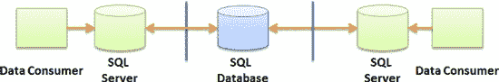
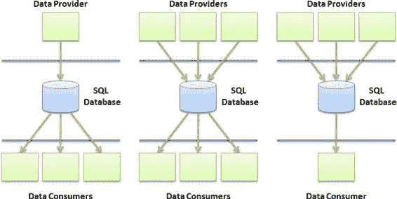

# 第 2 章 ■ 设计考虑因素

**图 2-10.** 卸载模式

### 聚合

**聚合**模式最简单的形式是提供一种机制，将来自多个数据提供者的数据收集到一个 `SQL Database` 实例中。这些数据提供者可以地理上分散且彼此不知情，但他们必须共享对模式的共同理解，以便在聚合后数据仍然有意义。

图 2-11 中展示的聚合模式使用了直接连接模式。你可以使用聚合模式来提供一个公共信息库，例如从不同国家收集的人口统计信息或全球变暖指标。该模式的关键在于定义一个所有提供者都能使用、所有消费者都能理解的共同模式的能力。因为 `SQL Database` 支持 `XML` 数据类型，你也可以将某些列存储为 `XML`，这是一种为每个客户提供存储略有不同信息的机制。

[www.it-ebooks.info](http://www.it-ebooks.info/)

