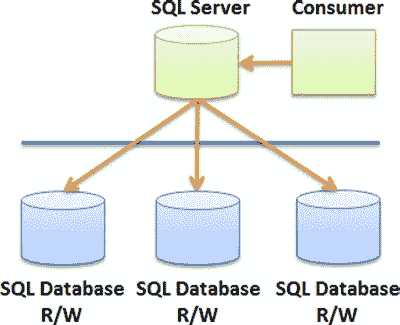

# 第 2 章 ■ 设计考虑因素

**图 2-11.** 聚合模式

### 镜像

如图 2-12 所示的**镜像**模式是卸载模式的一种变体，其中次要消费者可以是一个外部实体。此外，该模式意味着存在双向复制拓扑，以便任一数据库中的更改都能复制回另一个数据库。这种模式允许一种*无共享*的集成，即任一消费者都无权直接连接到另一个消费者。

**图 2-12.** 镜像模式

## 组合模式

前面的设计模式为使用 `SQL Database` 构建系统提供了必要的基础。其中一些模式可以直接使用，但你很可能会组合多种模式以提供改进的解决方案。本节描述一些有用的组合。

### 透明分支 + RWS

图 2-13 展示了透明分支和读写分片模式的组合。此模式可用于将现有 `企业资源规划 (ERP)` 应用程序生成的历史数据存储卸载到云中。在此示例中，分片通过使用异步 `轮询` 调用 `SQL Database` 实例来提供确保高吞吐量的方法。

[www.it-ebooks.info](http://www.it-ebooks.info/)

