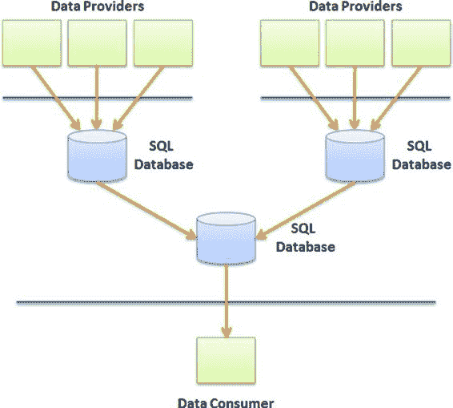

# 第 2 章 ■ 设计考虑因素

**图 2-13.** 透明分支 + RWS 模式

此模式提供以下优点：

- **透明数据传输。** 在这种情况下，透明分支模式将现有应用程序的数据复制到云数据库中，而无需更改现有应用程序的任何一行代码。
- **高性能。** 为确保高性能和高吞吐量，使用了 `轮询` 分片模式以及到云的异步调用。
- **可扩展。** 使用分片时，通过在云中添加新的 `SQL Database` 实例来扩展它非常简单。如果实现正确，分片会自动检测新数据库和存储容量，吞吐量也会自动增加。

### 级联聚合

在级联聚合中（参见图 2-14），聚合模式被串行应用以生成摘要数据库。将数据从一个 SQL 数据库实例复制（或移动）到另一个实例的机制，必须通过高级进程来完成，例如 Windows Azure 中的辅助进程。

[www.it-ebooks.info](http://www.it-ebooks.info/)

