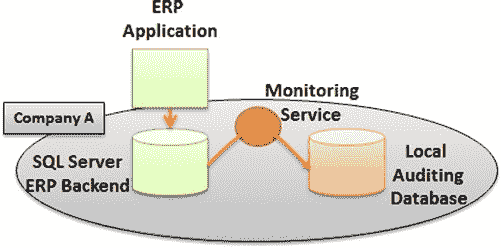
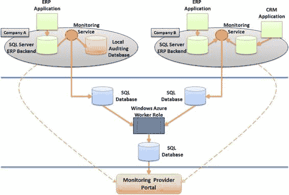
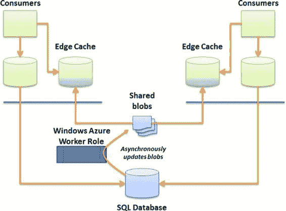

# 第 2 章 ■ 设计注意事项

## 图 2-14. 聚合 + MMS 模式

例如，此模式可用于将来自多个 SQL 数据库实例的信息收集到一个单一的实例中，供第三方用于监控整体性能。一个 Windows Azure 辅助进程可以运行 SQL 数据库提供的性能视图，并将数据存储到另一个数据库中。尽管被监控性能的 SQL 数据库实例可能具有完全不同的架构，但 SQL 数据库的性能数据管理视图（DMV）的输出是一致的。例如，监控服务可以每 5 分钟调用一次 `sys.dm_exec_connections` 来监控各个 SQL 数据库实例中的连接活动，并将结果存储在一个独立的 SQL 数据库实例中。

## 设计示例：应用程序 SLA 监控

为了让几种模式更清晰，我们来看一个例子。我们将围绕一个监控应用程序性能服务级别协议（SLA）的系统创建一个正式的设计。在此设计中，一家公司已有一个监控产品，可以审计客户现场现有 SQL Server 数据库中的活动。假设开发此监控产品的公司希望通过提供 SQL 数据库存储机制来扩展其服务，以便能够集中监控客户的数据库 SLA。

### Azure 前的应用架构

首先，我们来看现有的应用程序监控产品。它包含一个模块，用于监控企业中的一个或多个 SQL Server，并将结果存储在位于客户网络上的另一个数据库中。

在此示例中，A 公司已针对现有的 ERP 产品实施了监控服务，以监控访问安全性和整体 SLA。监控应用程序基于存储 ERP 数据的内部 SQL Server 上的实时活动执行审计。当某些语句执行时间过长时，监控服务会收到警报，并在本地审计数据库中存储一条审计记录，如图 2-15 所示。

[www.it-ebooks.info](http://www.it-ebooks.info/)

## 图 2-15. 现场监控实施

每月，管理人员会运行报告来审查 ERP 系统的 SLA，并可以确定 ERP 应用程序是否仍按照 ERP 供应商合同中规定的预定义阈值执行。迄今为止，此实施的好处包括：

- **可见性。** 客户可以了解其内部数据库的性能。
- **SLA 管理。** 可以使用衡量的 SLA 与 ERP 供应商协商合同条款。

但是，客户需要在内部存储审计数据并管理额外的 SQL Server 实例；这增加了数据库管理开销，包括确保所有安全补丁（操作系统和数据库）都是最新的。此外，在 SQL Server 上运行的本地审计数据库不容易被 ERP 供应商访问，因此 ERP 供应商无法对任何 SLA 问题采取主动措施，必须等待客户告知严重的性能问题。最后，客户不知道其内部 SLA 衡量标准与运行相同 ERP 产品的其他客户相比如何。

### Azure 实施

监控提供商已创建其监控系统的增强版本，并包含一个可选的云存储选项，监控服务可以在其中将性能事件转发到位于云中的集中式数据库。监控提供商决定实施异步智能分支模式，以便事件可以存储在 SQL 数据库实例中。

图 2-16 展示了使监控服务能够将数据存储在云数据库中的实施架构。每个监控服务现在除了本地审计数据库外，还可以将 SLA 指标存储在云端。

最后，本地审计数据库是一个可选项，客户可以选择不安装。为了支持此功能，监控提供商决定实施一种队列机制，以防到 SQL 数据库的链接不可用。

[www.it-ebooks.info](http://www.it-ebooks.info/)

## 图 2-16. Azure 监控实施

监控提供商还构建了一个门户，客户可以在其上监控他们的 SLA。例如，客户 B 现在可以使用该门户来监控其 CRM 和 ERP 应用程序数据库的 SLA。客户可以准备报告，并通过同一个门户提供给 ERP 和 CRM 供应商在线审查，并具有完整的深入访问权限以查看相关语句。

在此实施中，额外的好处包括：

- **改进的共享性。** 与供应商共享信息变得更加容易，因为通过云启用的门户提供了对问题的深入访问权限。
- **本地存储可选。** 在改进的解决方案中，如果客户缺乏人手来处理必要的内部数据库管理活动，他们可以决定仅实施云存储。
- **外部监控。** 客户 A 和 B 还有能力使用监控提供商来主动和远程监控他们的 ERP 产品，并在未满足 SLA 时执行特定的升级程序。例如，监控提供商可以直接与 ERP 供应商管理性能问题。

### 其他考虑因素

本章介绍了许多重要的设计因素，以帮助您设计使用 SQL 数据库的解决方案。还有一些其他概念值得关注，例如 Blob 数据存储、边缘数据缓存和数据加密。

[www.it-ebooks.info](http://www.it-ebooks.info/)

### Blob 数据存储

*Blobs* 是可以存储在 Windows Azure 中的文件。Blob 有趣的地方在于，可以通过 REST 轻松访问它们，可以创建的 blob 数量没有限制，并且每个块 blob 最多可包含 200GB 数据，每个页 blob 最多可包含 1TB 数据。因此，blob 可用作消费者之间的备份和传输机制。

系统可以使用批量复制程序（`BCP`）将 SQL 数据库表转储为文件，可能会先对文件进行压缩和/或加密，然后将 blob 存储在 Windows Azure 中。

### 边缘数据缓存

本章前面简要提到了缓存，但您应该记住，缓存可能会在您的应用程序设计中带来最重要的性能提升。您可以将相对静态的表缓存在内存中，将它们保存为 blob（或某种形式的内存存储），以便其他缓存系统使用相同的缓存，并创建一种使用 Azure 中的队列来刷新数据缓存的机制。

图 2-17 展示了一个设计示例，该设计创建了一个由两个 ERP 系统更新的共享缓存。每个 ERP

