# 第三章 ■ 安全性

数据库提供了强大的授权功能和基于角色的安全机制，类似于 SQL Server 2012。然而，截至本文撰写时，传统的数据库备份和活动审计功能尚不可用。微软正在为 SQL 数据库构建新的备份机制，超越了当前可用的 `BCP`（大容量复制程序）操作。有关如何在 SQL 数据库中备份数据的更多信息，请参见第四章。

### 可用性

*可用性* 确保服务正常运行时间，以便在需要时可以访问数据。设计高可用系统可能非常复杂，需要多个领域的高级知识，包括磁盘配置、系统管理、灾难恢复地点等。以下是高可用性涉及的一些技术：

-   **冗余磁盘**。允许你从磁盘主轴故障中恢复。通常涉及 `RAID` 配置。
-   **冗余网络**。允许你在多个网络组件（如网卡或路由器）故障时幸存。
-   **冗余服务**。允许你在安全和数据库等服务中断时幸存。例如使用微软 `集群服务`。
-   **冗余硬件**。允许你在机器硬件（如 `CPU` 或内存芯片）故障时幸存。
-   **可扩展性**。在负载下以近乎恒定的速度提供信息。
-   **DoS 防护**。防止成功的拒绝服务 (`DoS`) 攻击，否则会妨碍数据可用性。

[www.it-ebooks.info](http://www.it-ebooks.info/)

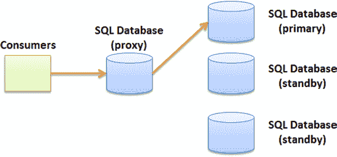

除了确保基础设施组件的冗余外，你还需要了解业务的恢复目标，以确定如何最好地实施可用性要求。

SQL 数据库提供了一个独特的平台，因为所有上述领域都是自动提供的。SQL 数据库通过其服务级别协议 (`SLA`) 提供每月 99.9% 的可用性保证。为了实现这种高可用性，SQL 数据库会为每个你创建的用户数据库透明地维护两个额外的备用数据库。如果你的任何一个用户数据库发生问题，两个备用数据库之一会在几秒钟内接管；你甚至可能注意不到故障转移过程。SQL 数据库还提供对 `DoS` 攻击的自动处理。

SQL 数据库使用图 3-1 所示的架构完成故障转移。你与一个代理交互，该代理将你的请求定向到你当前的数据库。你无法访问备用数据库。

**图 3-1.** SQL 数据库的备用数据库架构

■ **注意** 在可用性方面，SQL 数据库开箱即用的表现远超 SQL Server；SQL 数据库构建在一个可扩展且高可用的平台上，无需配置或调优。SQL 数据库中不提供任何典型的 SQL Server 配置设置（例如 `CPU 亲和性`、`复制`、`日志传送` 等）。

让我们以一个需要部署具有高可用性要求的新应用程序的项目为例。

在传统的 SQL Server 安装中需要规划的以下项目，在 SQL 数据库中会自动为你提供：

-   **群集 SQL Server 实例**。安装和配置微软 `集群服务` 以及主动/主动或主动/被动配置中的 SQL Server 实例。
-   **RAID 配置**。购买新磁盘和硬件来安装和配置 `RAID 10`（或 `RAID 0+1`）磁盘阵列（用于磁盘冗余和性能）。
-   **灾难恢复服务器**。在灾难恢复站点购买类似硬件并进行配置。
-   **复制拓扑**。根据你的需要，使用日志传送、复制、磁盘级复制或其他技术创建一种将数据从主站点传输到辅助站点的机制。
-   **数据库调优**。在大型系统中，为高性能调优 SQL Server 可能非常困难，涉及 `CPU`、内存、`I/O` 亲和性、并行度以及许多其他考虑因素。
-   **测试**。每年计划和执行一次灾难恢复计划，以确保其按预期工作。

[www.it-ebooks.info](http://www.it-ebooks.info/)

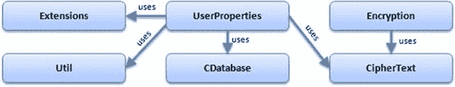

当然，你还必须考虑所有这些活动相关的成本、规划和执行此类项目所需的时间，以及实施高可用数据库环境所需的专业资源。

至此，你可以看到，尽管 SQL 数据库在安全性的某些领域提供选项较少，但在其他方面表现出色，特别是其可用性模型，这是 CIA 三要素之一。部署一个高可用的 SQL 数据库数据库是快速且极其简单的。

## 保护你的数据

让我们深入探讨一些具体细节和代码示例，展示如何在 SQL 数据库中保护你的数据。你可能需要保护数据库中包含敏感信息（如社会安全号码或信用卡号）的特定列。某些医疗应用程序存储患者数据，可能需要接受合规性审查，因此也可能需要加密。如前所述，并非所有安全机制目前都可用，因此本节重点介绍 SQL 数据库提供的功能以及缓解缺失功能的方法。关于数据加密，由于 SQL 数据库不提供任何加密功能，你将看到如何在项目中实现自己的安全类来简化数据加密。

■ **注意** 以下示例使用名为 `Security.sql` 的数据库脚本和名为 `SQLAzureSecurity.sln` 的 Visual Studio 2008 项目。如果你还没有 Windows Azure 账户，可以在本地 SQL Server 数据库上运行 SQL 脚本。

本章使用几个类和方法来演示如何使用加密、哈希和其他技术。图 3-2 显示了使用的对象。`Encryption` 类执行实际加密并返回一个 `CipherText` 结构；`UserProperties` 类使用来自 `Extensions` 类的扩展方法和 `Util` 类中的辅助方法。`CDatabase` 类返回数据库连接字符串。

**图 3-2.** 示例中使用的对象模型

### 加密

如前所述，数据加密不可用。为什么？因为 SQL 数据库不支持 X.509 证书。证书对于许多加密相关功能是必需的，例如透明数据加密 (`TDE`)、列级加密以及某些 `T-SQL` 命令，如 `FOR ENCRYPTION` 和 `SIGNBYCERT`。

然而，SQL 数据库要求其通信使用 `SSL` 加密。这意味着你的敏感数据在客户端和 SQL 数据库实例之间始终是安全传输的。你无需做任何事情来启用 `SSL` 加密；这是 SQL 数据库强制要求并自动执行的。如果应用程序尝试连接到 SQL 数据库，而该应用程序不支持 `SSL`，则连接请求将失败。

但 `SSL` 不加密静态数据；它只加密传输中的数据。当数据存储在 SQL 数据库中时，如何保护它？由于 SQL 数据库本身不支持加密，你必须在应用程序代码中加密和解密数据。

[www.it-ebooks.info](http://www.it-ebooks.info/)

`Security.sql` 脚本包含以下 `T-SQL` 语句：

```sql
CREATE TABLE UserProperties
(
    ID int identity(1,1) PRIMARY KEY, -- 记录的标识
    PropertyName nvarchar(255) NOT NULL, -- 属性名称
    Value varbinary(max) NOT NULL, -- 加密后的值
    Vector binary(16) NOT NULL, -- 加密值的向量
    LastUpdated datetime NOT NULL, -- 最后修改日期
    Token binary(32) NOT NULL -- 记录哈希值
)
```


#### 加密实现

#### 加密算法描述

每个记录包含一个可用作搜索键的属性名（第 4 行）和一个加密值（第 5 行）。

该值本身是二进制数据类型，这使其非常适合加密。为了增强安全性，使用了一个向量；该列将在后文解释。`Token` 和 `LastUpdated` 列将在讨论哈希时涉及。

以下 C# 代码展示了如何使用高级加密标准（AES）算法加密字符串值；你可以轻松地为三重数据加密标准（3DES）或其他算法添加支持。它使用共享密钥创建密文并返回一个字节数组。该字节数组随后存储在数据库的 `Value` 列中：

#### 加密代码实现

```csharp
/// <summary>
/// 存储加密值及其关联向量的结果结构
/// </summary>
public struct CipherText
{
    public byte[] cipher;
    public byte[] vector;
}

/// <summary>
/// 封装加密和解密值背后复杂性的加密类
/// </summary>
public class Encryption
{
    private byte[] _SECRET_KEY_ = new byte[] { 160, 225, 229, 3,
        148, 219, 67, 89, 247, 133, 213, 26, 129, 160, 235, 41,
        42, 177, 202, 251, 38, 56, 232, 90, 54, 88, 158, 169,
        200, 24, 19, 27 };

    /// <summary>
    /// 使用 AES 加密
    /// </summary>
    /// <param name="value">要加密的字符串</param>
    public CipherText EncryptAES(string value)
    {
        // 准备变量...
        byte[] buffer = UTF8Encoding.UTF8.GetBytes(value);
        CipherText ct = new CipherText();
        System.Security.Cryptography.Aes aes = null;
        ICryptoTransform transform = null;

        // 创建 AES 对象
        aes = System.Security.Cryptography.Aes.Create();
        aes.GenerateIV();
        aes.Key = _SECRET_KEY_;

        // 创建加密对象
        transform = aes.CreateEncryptor();

        // 加密并将结果存储在结构中
        ct.cipher = transform.TransformFinalBlock(buffer, 0, buffer.Length);
        // 保存使用的向量以备后用
        ct.vector = aes.IV;

        return ct;
    }
}
```

`CipherText` 结构（第 5 行）用作返回值。每个加密的字节数组都附带其初始化向量，这是一种防止对数据库进行字典攻击的安全机制。`Encryption` 类包含一个 `EncryptAES` 方法，该方法执行字符串值的实际加密；此方法返回 `CipherText`。

因为 AES 需要一个密钥，你在第 17 行以字节数组的形式创建了一个。密钥必须为 32 字节长。你可以轻松地使用 .NET 提供的 `Aes` 类的 `GenerateKey` 方法生成自己的密钥。

在第 29 行，你使用 UTF-8 编码将字符串值转换为其字节表示。这种编码方案非常实用，因为它会根据输入值自动在 ASCII 和 Unicode 之间进行选择。

你在第 31 行声明 `Aes` 对象，并在第 35 行使用 `Aes` 类的静态 `Create()` 方法实例化它。此方法在第 36 行自动创建向量，并设置前面讨论的私钥。

在第 40 行，你使用 `CreateEncryptor()` 方法创建一个加密对象。调用其 `TransformFinalBlock()` 方法即可完成加密，并输出一个长度可变的字节数组，你将其存储在第 43 行的 `CipherText` 结构实例中。你同时保存了先前生成的向量，并在第 47 行返回该结构。

很简单，对吧？现在你只需将 `CipherText` 内容存储在 `UserProperties` 表中。但在执行此操作之前，让我们讨论一下哈希。

> **注意** 此示例使用 AES，但 .NET Framework 还提供了其他算法。由于你还使用了初始化向量，即使输入相同，重复运行相同的代码也会产生不同的输出。这使得加密值更难破解。提供的 Visual Studio 解决方案包含了解密数据的其他方法。

### 哈希

哈希远没有你目前看到的那么复杂。虽然你可以将迄今为止加密的值存储在数据库中，但在此示例中，你对行中的所有列（ID 值除外）进行哈希处理，以确保它们未被更改。为什么？答案回到前面讨论的 CIA 三元组的完整性问题。你需要一种方法来判断数据是否在你的代码之外被修改。加密你的秘密值使得三元组的机密性方面几乎不可能被打破，但有人仍然可以更新 `PropertyName` 列——或者更糟，更新 `Value` 列。哈希不能防止数据被修改，但你可以检测它是否在未经你授权的情况下被更改。

#### 哈希工具方法

为了简化代码，首先创建几个扩展方法。扩展方法是一种便捷的方式，即使你没有原始源代码，也可以扩展类（或数据类型）可用的方法。以下是如何在 `string` 和 `DateTime` 数据类型上声明扩展方法：

```csharp
public static class Extensions
{
    public static byte[] GetBytes(this string value)
    {
        byte[] buffer = UTF8Encoding.UTF8.GetBytes(value);
        return buffer;
    }

    public static byte[] GetBytes(this DateTime value)
    {
        return value.ToString().GetBytes();
    }
}
```

此代码向 `string` 和 `DateTime` 数据类型添加了一个 `GetBytes()` 方法。你还需要创建一个实用工具类，允许你基于字节数组集合创建哈希值。以下代码展示了该类：

```csharp
public class Util
{
    /// <summary>
    /// 基于字节数组数组计算哈希值
    /// </summary>
    /// <param name="bytes">字节数组数组</param>
    public static byte[] ComputeHash(params byte[][] bytes)
    {
        SHA256 sha = SHA256Managed.Create();
        MemoryStream ms = new MemoryStream();

        for (int i = 0; i < bytes.Length; i++)
            ms.Write(bytes[i], 0, bytes[i].Length);

        ms.Flush();
        ms.Position = 0;

        return sha.ComputeHash(ms);
    }
}
```

这个 `Util` 类很快就会派上用场。注意第 7 行将变量声明为 `params byte[][]`；这意味着传递给此方法的每个参数都必须是一个字节数组。你声明了一个内存流，在第 13 行循环遍历每个字节数组变量并将其附加到内存流中。最后，在第 18 行返回内存流的计算哈希值。你很快就会看到如何调用此方法。

#### 使用哈希

接下来是 `UserProperties` 类，它在下面的示例中，并实际调用 SQL 数据库实例。它有两个输入参数：要保存的属性名称及其存储在 `CipherText` 结构中的加密值。在第 13 行，你从另一个类中检索连接字符串，并在第 15 行打开数据库连接。然后你创建命令对象，指定调用一个存储过程。存储过程的代码将在本节后面提供。哈希值在第 39 行创建；如你所见，你通过将每个存储过程参数作为字节数组传递来调用刚刚回顾的 `ComputeHash` 方法。这就是你同时使用前面创建的扩展方法和哈希方法的地方。计算出哈希结果后，你在第 45 行将其传递给最后一个存储过程参数：

```csharp
using System.Data.SqlDbType;
public class UserProperties
{

    /// <summary>
    /// 在 SQL Azure 数据库中保存属性值
    /// </summary>


## **第 3 章：安全**

正如所承诺的，以下是存储过程的代码。创建存储过程是因为它能让你从访问控制的角度提供额外的安全性。正如你稍后将看到的，你会创建一个包含表的架构，以及一个单独的架构用于存放访问这些表的存储过程。这提供了对数据库安全性的更强控制。本章稍后将回顾架构。

```sql
IF (Exists(SELECT * FROM sys.sysobjects WHERE Name = 'proc_SaveProperty' AND Type = 'P')) DROP PROC proc_SaveProperty
GO

-- SELECT * FROM UserProperties

CREATE PROC proc_SaveProperty
    @name nvarchar(255),
    @value varbinary(max),
    @vector binary(16),
    @lastUpdated datetime,
    @hash binary(32)
AS
IF (Exists(SELECT * FROM UserProperties WHERE PropertyName = @name))
BEGIN
    UPDATE UserProperties SET
        Value = @value,
        Vector = @vector,
        LastUpdated = @lastUpdated,
        Token = @hash
    WHERE
        PropertyName = @name
END
ELSE
BEGIN
    INSERT INTO UserProperties
        (PropertyName, Value, Vector, LastUpdated, Token)
    VALUES (
        @name,
        @value,
        @vector,
        @lastUpdated,
        @hash )
END
```

这个存储过程根据属性名执行更新或插入操作。注意使用了 `varbinary(max)`；因为不知道加密值会有多长，所以允许存储大型但可变长度的二进制对象。然而，向量 (`vector`) 的长度始终为 16 字节，哈希 (`hash`) 为 32 字节。

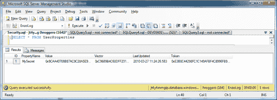

### 运行保存方法

在 `UserProperties` 类上运行 `Save()` 方法会在 `UserProperties` 表中创建一条记录。

以下代码展示了如何调用 `Save` 方法：

```csharp
/// <param name="propertyName">属性名称</param>
/// <param name="ct">要保存的 CipherText 结构</param>
public static void Save(string propertyName, CipherText ct)
{
    using (SqlConnection sqlConn =
        new SqlConnection(CDatabase.ConnectionString))
    {
        sqlConn.Open();

        using (SqlCommand sqlCmd = new SqlCommand())
        {
            DateTime dateUpdated = DateTime.Now;

            sqlCmd.Connection = sqlConn;
            sqlCmd.CommandType = System.Data.CommandType.StoredProcedure;
            sqlCmd.CommandText = "proc_SaveProperty";
            sqlCmd.Parameters.Add("name", NVarChar, 255);
            sqlCmd.Parameters.Add("value", VarBinary, int.MaxValue);
            sqlCmd.Parameters.Add("vector", VarBinary, 16);
            sqlCmd.Parameters.Add("lastUpdated", DateTime);
            sqlCmd.Parameters.Add("hash", VarBinary, 32);
            sqlCmd.Parameters[0].Value = propertyName;
            sqlCmd.Parameters[1].Value = ct.cipher;
            sqlCmd.Parameters[2].Value = ct.vector;
            sqlCmd.Parameters[3].Value = dateUpdated;

            // 计算此记录的哈希值...
            // 我们传递应该被哈希处理的值列表
            // 如果数据库中这些值中的任何一个发生更改，
            // 重新计算哈希值将产生不同的结果
            byte[] hash = Util.ComputeHash(
                propertyName.GetBytes(),
                ct.cipher,
                ct.vector,
                dateUpdated.GetBytes());

            sqlCmd.Parameters[4].Value = hash;

            int res = sqlCmd.ExecuteNonQuery();
        }

        sqlConn.Close();
    }
}
```

```csharp
class Program
{
    static void Main(string[] args)
    {
        // 声明加密对象并加密我们的秘密值
        Encryption e = new Encryption();
        CipherText ct = e.EncryptAES("secret value goes here...");

        UserProperties.Save("MySecret", ct);
    }
}
```

### 表格内容

**图 3-3** 显示了运行程序后表中的内容。`Value` 列是你的加密值，`Vector` 是存储过程中 `@vector` 变量的值，而 `Token` 列是作为 `@hash` 变量传递的计算所得哈希值。

> **图 3-3.** 包含加密值、哈希值和向量的记录

最后但同样重要的是，你应该知道 SQL Server 和 SQL Database 都原生支持哈希处理。直到最近，对哈希处理的支持还仅限于 MD5 和 SHA-1 算法。然而，SQL Database 和 SQL Server 2012


# 第三章 ■ 安全性

现在支持强度为 256 位和 512 位的哈希。因此，你可以使用 `HASHBYTES` 命令来创建之前在 C# 中生成的 `Token` 值。以下是一个如何在 SQL 中计算 SHA-256 哈希的快速示例：
```sql
SELECT HASHBYTES('sha2_256', 'MySecret')
```
`HASHBYTES()` 的输出也是一个字节数组：
```
0x49562CFC3B17139EA01C480B9C86A2DDACB38FF1B2E9DB1BF66BAB7A4E3F1FB5
```
你可以更改之前创建的存储过程，在其中执行哈希函数，而不是使用 C# 代码。然而，出于性能原因，将哈希算法保留在 C# 中可能是有意义的，因为这是一个 CPU 密集型操作。如果你的应用程序持续计算哈希，你可能希望将哈希保留在 C# 中，以节省数据库 CPU 周期用于其他任务。如果你决定使用 T-SQL 对值进行哈希处理，你可能希望先将字符串转换为 Unicode；如果你最终在 C# 中使用哈希函数，这将有助于生成可比较的哈希值（因为 C# 中的字符串默认是 Unicode）。要在 SQL Database 或 SQL Server 中将 `MySecret` 字符串作为 Unicode 进行哈希处理，请在 T-SQL 中使用 `N` 转换器，如下所示：
```sql
SELECT HASHBYTES('sha2_256', N'MySecret')
```
到目前为止，你已经看到了一种为保密性而加密敏感信息、为增强完整性而对记录的特定列进行哈希处理，以及为高可用性而在 Azure 中部署的方法。如你所见，开发加密和哈希例程可能非常复杂，并且需要对编程语言有很强的掌握。你可能会发现创建一个通用的加密库（如前面示例所示）是有益的，这样可以在不同项目中重用。

### 证书

如前所述，SQL Database 不支持 X.509 证书，尽管你可以在 Windows Azure 中部署 X.509 证书。你的客户端代码（托管在公司的网络或 Windows Azure 中）可以使用证书来加密和解密值。使用证书意味着你正在使用公钥/私钥对进行加密。公钥用于加密数据，私钥用于解密数据。

**注意：** 有关如何在 Windows Azure 中部署 X.509 证书的更多信息，请访问 MSDN 博客 [`blogs.msdn.com/jnak`](http://blogs.msdn.com/jnak) 并查看 2010 年 1 月的存档。Jim Nakashima 的博客文章包含详细说明。

你可以使用 `MakeCert.exe` 实用工具轻松创建自签名证书，该工具可在 Windows SDK 中找到。要在你的机器上创建证书，请在命令行运行以下命令。你需要以管理员身份执行此语句，否则命令将失败：
```cmd
makecert -ss root -pe -r -n "CN=BlueSyntaxTest" -sky Exchange -sr LocalMachine
```
以下是用于创建此证书的选项的简要概述：

*   `-ss root` 将证书存储在根证书存储中。
*   `-pe` 将私钥标记为可导出。
*   `-r` 创建自签名证书（意味着它不是由像 Thawte 这样的根证书颁发机构 (CA) 签发的）。
*   `-n "CN=..."` 指定证书的主题名称。
*   `-sky Exchange` 指定证书用于加密。
*   `-sr LocalMachine` 指定证书存储位置为 LocalMachine。

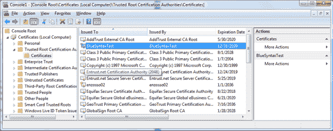

**注意：** 确保以管理员身份运行此语句，否则你会看到类似这样的错误：`Error:Save encoded certificate to store failed => 0x5 (5)`。

要验证你的证书是否已正确安装，请打开 `mmc.exe`。选择 **文件** ➤ **添加/删除管理单元**。然后，选择 **证书**，单击 **添加**，选择 **计算机账户**，然后单击 **确定**。展开左侧的树状图以查看 **受信任的根证书颁发机构** 下的证书。图 3-4 显示了使用前面的命令创建的 `BlueSyntaxTest` 证书。

*图 3-4. 在你的机器上查看证书*

现在你已经安装了证书，你可以通过代码搜索并定位它。通常，证书通过其唯一标识符（*指纹*）或其*通用名称* (CN) 来搜索。要查看证书的指纹，请双击证书，选择 **详细信息** 选项卡，向下滚动直到看到 **指纹** 属性，如图 3-5 所示。

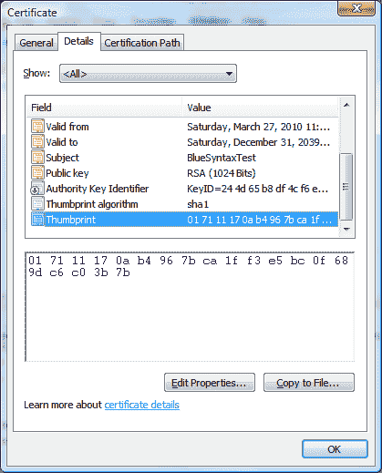

*图 3-5. 获取证书的指纹*

你可以选择指纹并将其复制到字符串变量中。以下代码展示了你之前看到的 `Encryption` 类中的一个新的私有变量和一个新的方法。第 1 行包含如图 3-5 所示的指纹，第 13 行打开 `LocalMachine` 上的根证书存储，第 17 行通过搜索指纹实例化一个 X.509 对象。注意，`Find` 方法返回一个集合；你感兴趣的是第一个证书，因为只有一个证书会匹配此指纹。在第 24 行，你创建 RSA 加密对象，并在第 27 行调用其 `Encrypt` 方法。因为使用 RSA 加密会自动包含一个向量，所以无需跟踪它，因此 `CipherText` 向量变量被设置为 0：
```csharp
1. private string _THUMBPRINT_ =
2. "01 71 11 17 0a b4 96 7b ca 1f f3 e5 bc 0f 68 9d c6 c0 3b 7b";
3.
4. /// <summary>
5. /// 使用自签名证书加密字符串值
6. /// </summary>
7. /// <param name="value">要加密的值</param>
8. /// <returns></returns>
9. public CipherText EncryptByCert(string value)
10. {
11. byte[] buffer = UTF8Encoding.UTF8.GetBytes(value);
12.
13. X509Store store = new X509Store(StoreName.Root,
14. StoreLocation.LocalMachine);
15. store.Open(OpenFlags.ReadOnly);
16.
17. X509Certificate2 x509 =
18. store.Certificates.Find(
19. X509FindType.FindByThumbprint,
20. _THUMBPRINT_, true)[0];
21.
22. store.Close();
23.
24. RSACryptoServiceProvider rsaEncrypt = null;
25. rsaEncrypt = (RSACryptoServiceProvider)x509.PublicKey.Key;
26.
27. byte[] encryptedBytes = rsaEncrypt.Encrypt(buffer, false);
28.
29. CipherText ct = new CipherText();
30. ct.cipher = encryptedBytes;
31. ct.vector = new byte[] {0, 0, 0, 0, 0, 0, 0, 0, 0,
32. 0, 0, 0, 0, 0, 0, 0};
33.
34. return ct;
35. }
```
解密代码如下所示，与前面的示例非常相似。你在 RSA 对象上调用 `Decrypt` 而不是 `Encrypt`：
```csharp
1. public string DecryptByCert(CipherText ct)
2. {
3. X509Store store = new X509Store(StoreName.Root,
4. StoreLocation.LocalMachine);
5. store.Open(OpenFlags.ReadOnly);
6.
7. X509Certificate2 x509 =
8. store.Certificates.Find(
9. X509FindType.FindByThumbprint,
10. _THUMBPRINT_, true)[0];
11. store.Close();
12.
13. RSACryptoServiceProvider rsaEncrypt = null;
14. rsaEncrypt = (RSACryptoServiceProvider)x509.PrivateKey;
15.
16. byte[] bytes = rsaEncrypt.Decrypt(ct.cipher, false);
17.
18. return UTF8Encoding.UTF8.GetString(bytes);
19. }
```
以下代码调用 RSA 加密例程并按前述方式将其结果保存到 `UserProperties` 表中。该表现在包含两条记录。请注意，使用证书加密方法时，密文的长度要大得多：
```csharp
1. class Program
2. {
3. static void Main(string[] args)
4. {
5. // 声明加密对象并加密我们的秘密值
6. Encryption e = new Encryption();
7. CipherText ct = e.EncryptAES("secret value goes here...");
8. CipherText ct2 = e.EncryptByCert("another secret!!!");
9.
10. UserProperties.Save("MySecret", ct);
11. UserProperties.Save("MySecret2", ct2);
12.
13. }
14. }
```

## 访问控制


到目前为止，你已经花费了大量时间对值进行加密和哈希处理，以增强机密性和完整性。然而，CIA 三元组的另一个重要方面是访问控制。本节将回顾访问控制的两个子类别：身份验证（也称为 `AUTHN`）和授权（`AUTHZ`）。

## 身份验证 (`AUTHN`)

`AUTHN` 是一个验证你确实是你所声称的那个人的过程。在 SQL Server 中，`AUTHN` 过程通过两种机制之一完成：网络凭据（通过安全支持提供程序接口 [`SSPI`] 上的 Kerberos 身份验证处理）或 SQL Server 凭据。连接字符串必须指定正在使用哪种 `AUTHN`。当你使用 SQL Server `AUTHN` 时，必须在尝试连接之前提供密码，这可以由运行时的用户提供，也可以在配置文件中提供。

在考虑 SQL Database 的 `AUTHN` 时，请记住以下几点：

*   **无网络身份验证**。由于 SQL Database 不在你的网络上，因此网络 `AUTHN` 不可用。这进一步意味着你必须始终使用 SQL `AUTHN`，并且必须在你的应用程序中存储密码（最好在配置文件中）。你可能希望加密存储密码。尽管你可以使用 `aspnet_regiis.exe` 实用程序在 Windows 中加密配置文件的部分内容，但此选项在 Windows Azure 中使用默认提供程序时不可用。但是，你可以使用自定义配置提供程序 `PKCS12`（可在 MSDN Code Gallery 上找到）来加密 Web 配置文件的部分内容。有关如何使用此自定义提供程序的更多信息，请访问 [`tinyurl.com/9ta8m5u`](http://tinyurl.com/9ta8m5u)。
*   **强密码**。SQL Database 要求使用强密码。此选项无法禁用，这是一件好事。强密码必须至少有八个字符长；必须组合字母、数字和符号；并且不能是字典中的单词。
*   **登录名限制**。某些登录名不可用，例如 `sa`、`admin` 和 `guest`。无法创建这些登录名。你还应避免在登录名中使用 `@` 符号；该符号用于分隔用户名和机器名，有时可能需要。

[www.it-ebooks.info](http://www.it-ebooks.info/)

第 3 章 ■ 安全

## 授权 (`AUTHZ`)

授权使你能够在通过身份验证后控制谁可以执行哪些操作。在开发周期早期定义良好的 `AUTHZ` 模型非常重要，因为更改访问控制策略可能相对困难。

一般来说，一个强大的 `AUTHZ` 模型定义了哪些用户可以访问数据库中的哪些对象。在 SQL Database 和 SQL Server 中，这通常通过定义登录、用户、架构和权限之间的关系来实现。

#### 创建登录和用户

登录帐户用于管理 SQL Database 中的身份验证；它是一个服务器级别的实体。如果你知道一个登录帐户及其密码，就可以登录。用户是一个数据库实体，用于访问控制。用户决定了你可以访问哪些对象以及可以执行哪些操作。每个登录可以映射到每个数据库（包括 `master`）中的 0 个或 1 个用户。

在 SQL Database 中，你必须连接到 `master` 数据库才能管理你的登录。部分支持 `CREATE LOGIN` T-SQL 语句。另外，请记住创建登录时必须使用强密码。

SQL Database 提供了两个新角色：

*   **`LoginManager`**。授予用户在 `master` 数据库中创建新登录的能力。
*   **`DBManager`**。授予用户从 `master` 数据库创建新数据库的能力。

首先，让我们在 `master` 数据库中创建一个登录帐户：

```sql
CREATE LOGIN MyTestLogin WITH PASSWORD='MyT3stL0gin'
GO
```

你可以选择授予此登录访问 `master` 的权限。以下代码显示了如何授予该登录访问 `master` 数据库的权限，并在 `master` 数据库中授予 `LoginManager` 角色。如果你的意图仅是授予此登录访问用户数据库的权限，则可以跳过此步骤。

```sql
CREATE USER MyTestLoginUser FROM LOGIN MyTestLogin
GO
EXEC sp_addrolemember 'loginmanager', MyTestLoginUser
GO
```

在大多数情况下，你会希望在 `master` 中创建登录帐户，在用户数据库中创建用户。以下代码显示了如何在用户数据库中创建具有读取权限的用户。你必须首先连接到用户数据库，否则下面的语句将失败。

```sql
CREATE USER MyTestLoginUser FROM LOGIN MyTestLogin
GO
EXEC sp_addrolemember 'db_datareader', MyTestLoginUser
GO
```

现在，`MyTestLogin` 帐户可以连接到你的用户数据库。

[www.it-ebooks.info](http://www.it-ebooks.info/)

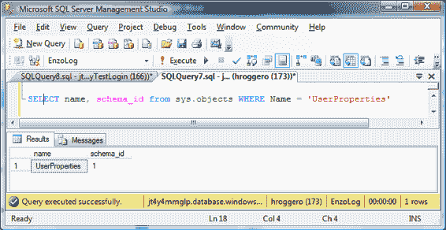

第 3 章 ■ 安全

最后，你应该注意，SQL Database 管理员帐户始终作为用户添加到每个新的 SQL Database 实例中，并且默认是 `dbo`。这意味着你不需要为管理员帐户创建用户。如果你尝试这样做，将会收到一条错误消息，指出用户已存在。例如，如果我的管理员登录帐户是 `'hroggero'`，则以下命令将失败，因为用户已自动创建并映射到 `dbo`：

```sql
CREATE USER hroggero WITH LOGIN hroggero
```

```
Msg 15007, Level 16, State 1, Line 1
'hroggero' is not a valid login or you do not have permission.
```

## 架构

`架构` 是包含数据库对象的容器；架构驻留在数据库内部。架构是数据库对象三部分命名约定的一部分；它们被视为命名空间。架构中的每个对象都必须具有唯一的名称。

默认情况下，当你使用 `dbo` 登录连接时，创建的对象由 `DBO` 架构拥有。例如，之前显示的 `UserProperties` 表的 `CREATE TABLE` 语句使用 `DBO` 作为架构所有者（对于 `DBO`，`schema_id` 始终为 1）。参见图 3-6.

***图 3-6.** 查看对象的架构所有权*

目前，新用户 `MyTestLoginUser` 无法从此表中读取。尝试对 `UserProperties` 执行 `SELECT` 语句会返回 `SELECT` 权限被拒绝的错误。因此，你有一个选择：你可以授予该用户帐户对该表的 `SELECT` 权限，将用户分配到适当的角色，或者为该用户创建一个架构并将 `SELECT` 权限分配给该架构。

通常，通过角色管理访问权限比直接通过用户管理容易得多。但是，如果你希望对访问权限进行更精细的控制，则应考虑使用基于架构的安全性。要正确执行此操作，你需要将 `UserProperties` 表的所有权更改为新架构（不是 `DBO`），然后将访问权限分配给该架构。

要创建新架构，你必须连接到 `MyTestLoginUser` 已创建的所需用户数据库。然后运行以下语句：

```sql
CREATE SCHEMA MyReadOnlySchema AUTHORIZATION DBO
```

[www.it-ebooks.info](http://www.it-ebooks.info/)

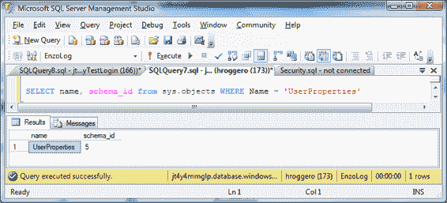

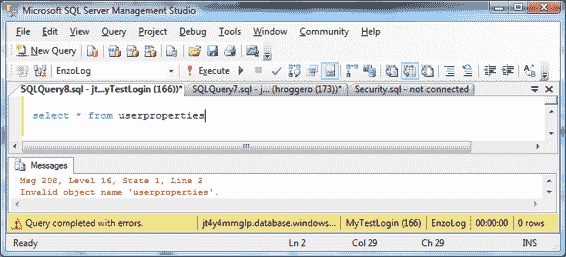

第 3 章 ■ 安全

此时，已创建一个架构；它由 `DBO` 拥有。你现在需要将 `UserProperties` 表的所有权更改为 `MyReadOnlySchema`：

```sql
ALTER SCHEMA MyReadOnlySchema TRANSFER DBO.UserProperties
```

该表现在属于该架构，如图 3-7. 所示。

***图 3-7.** 查看新的架构所有者*

然而，你还没有完成。`MyTestLoginUser` 无法再看到该表。对该表执行 `SELECT` 语句会返回 `Invalid object name` 消息，如图 3-8 所示。

***图 3-8.** 当用户看不到对象时的错误*

[www.it-ebooks.info](http://www.it-ebooks.info/)

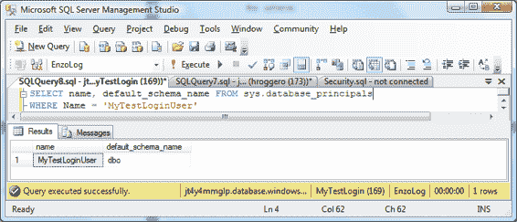

第 3 章 ■ 安全


`MyTestLoginUser` 的默认架构为 `DBO`，如图 3-9. 所示。用户的默认架构是指在 T-SQL 语句中未明确指定时所使用的架构。为简化开发人员操作，可将默认架构更改为 `MyReadOnlySchema`，这样便无需在 T-SQL 语句中进行指定。

**图 3-9.** 登录名的架构所有者

要更改用户的默认架构，需要执行以下语句：

```sql
ALTER USER MyTestLoginUser WITH DEFAULT_SCHEMA = MyReadOnlySchema
```

现在该用户已将 `MyReadOnlySchema` 设为其默认架构，它可以直接查看该架构所拥有的对象，而无需指定对象所有者。不过，访问权限尚未设置。让我们为 `MyTestLoginUser` 授予 `SELECT` 权限：

```sql
GRANT SELECT ON SCHEMA :: MyReadOnlySchema TO MyTestLoginUser
```

以下语句现在对 `MyTestLoginUser` 账户再次生效：

```sql
SELECT * FROM UserProperties
```

为何要如此麻烦？因为创建自己的架构是一种通过向架构而非直接向对象授予权限来管理访问控制的绝佳方式。在某种程度上，架构可以用作一个组，就像 Windows 组一样，可以对其授予或拒绝权限。

图 3-10 展示了如何为了获得更大的灵活性和控制力而转换安全模型。

[www.it-ebooks.info](http://www.it-ebooks.info/)

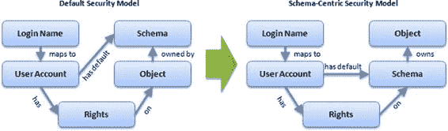

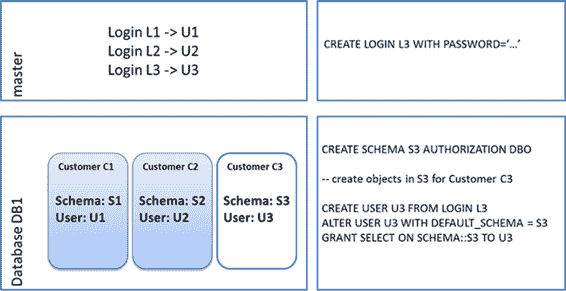

第 3 章 ■ 安全性

**图 3-10.** 迈向基于架构的安全模型

#### 架构分离

前面介绍的架构安全模型是实现多租户模型的基础，该模型使用架构分离作为分片机制。从存储角度来看，多租户系统是一个数据库集合，它以某种方式托管多个客户，使得每个客户在安全和管理方面都是隔离的。

虽然你可以通过为每个客户创建一个数据库来构建多租户系统，但你也可以为每个客户创建一个架构容器，并将客户安置在更少的数据库中。本章讨论的架构安全模型允许你安全地将客户安置在同一数据库中，并通过为每个客户使用不同的登录名和用户来保持强大的安全边界，其中每个用户只被授予访问特定架构的权限。

在图 3-11, 中，我正在一个名为 `DB1` 的现有数据库中创建一个新的客户容器。由于该数据库存储了其他客户，而我的目标是确保强大的安全隔离，因此我首先在 `master` 中为我的客户（在此示例中称为 `C3`）创建一个新的登录名 (`L3`)。

**图 3-11.** 为客户创建新的架构容器

然后我连接到 `DB1` 并创建架构容器 (`S3`)，客户数据将存储在其中。一旦创建了架构容器，我就可以在 `S3` 中创建所有必要的对象，例如表、视图和存储过程。

接下来，我为登录账户 `L3` 创建一个用户 (`U3`)。我确保将 `U3` 的默认架构从 `DBO` 更改为 `S3`。

[www.it-ebooks.info](http://www.it-ebooks.info/)

第 3 章 ■ 安全性

最后，我授予 `U3` 所有必要的访问权限。至此，我在现有数据库中创建了一个新的架构，并实现了与其他客户的强大安全隔离。

你可以在第 9 章中了解更多关于此分片模型的信息。

## SQL 数据库防火墙

SQL 数据库自带防火墙，你可以直接从 SQL 数据库门户进行配置，如第 1 章所述。你也可以通过 T-SQL 查看和更改防火墙规则。让我们快速浏览一下可用的 SQL 语句。

**注意** 你需要连接到 `master` 数据库才能查看或更改防火墙规则。必须先通过 SQL 数据库门户向防火墙添加至少一条连接规则，才能建立连接。

要查看当前的防火墙规则，请执行此语句：

```sql
SELECT * FROM sys.firewall_rules
```

你可以看到每条规则都有一个名称；该名称用作唯一键。`sp_set_firewall_rule` 命令允许你添加新规则。

新规则可能需要几分钟才能生效。例如，以下语句添加了一个名为 `NewRule` 的新规则。注意第一个参数必须是 Unicode 字符串：

```sql
sp_set_firewall_rule N'NewRule', '192.168.1.1', '192.168.1.10'
```

要删除规则，请运行以下语句：

```sql
sp_delete_firewall_rule N'NewRule'
```

## 内部防火墙

一些组织使用内部防火墙，通过高级规则控制对互联网的网络访问。

由于从内部网络连接到 SQL 数据库需要开放“TCP 1433 出站”端口，如果你的公司使用内部防火墙，你可能需要申请开放此端口。出于安全原因，你的网络管理员可能会要求提供 SQL 数据库的 IP 范围，以便仅针对特定目标开放端口。

不幸的是，将连接限制为某个 IP 范围可能会在以后出现问题，因为 SQL 数据库的 IP 范围可能会随时间变化。因此，你应该将端口开放给任何 (ANY) IP 目标。

## 合规性

尽管从风险管理角度看，云计算给组织带来了新的挑战，但微软的云数据中心根据其当地法规接受了多项审计和评估。为了促进其合规性审计和评估，微软成立了运营合规团队，为其运营设计了一个通用的合规框架。

[www.it-ebooks.info](http://www.it-ebooks.info/)

第 3 章 ■ 安全性

据微软称，其部分云计算基础设施符合多项法规，包括 PCI、《健康保险流通与责任法案》(HIPAA) 和《萨班斯-奥克斯利法案》。它还获得了多项认证，包括

-   ISO/IEC 27001:2005
-   SAS 70 Type I 和 II

微软最近以技术预览版形式发布了信任服务框架。尽管该服务处于早期阶段，但它提供了一种跨组织安全交换敏感数据的标准化机制。欲了解更多信息，请查看 SQL Azure Labs 网站 [(www.sqlazurelabs.com](http://www.sqlazurelabs.com))。

**注意** 有关微软合规计划的更多信息，[请访问 www.globalfoundationservices.com](http://www.globalfoundationservices.com)。

## 总结

云中的安全性是一个复杂的话题，需要仔细分析你的需求和设计方案。本章介绍了 CIA 三要素（机密性、完整性、可用性）的基础知识，并根据这三个方面对安全选项进行了分类。

你还回顾了如何在 Visual Studio 应用程序中规划强大的加密和哈希处理。最后，请记住，架构分离可能非常有用，应在开发周期早期实施。

至此，你应该了解了可用于保护 SQL 数据库中数据的多种选项，并意识到 SQL 数据库平台的一些限制。然而，请记住，随着微软为其 SQL 数据库平台提供更多更新，其中一些限制很可能在未来某个时候被移除或缓解。

[www.it-ebooks.info](http://www.it-ebooks.info/)

# 第 4 章

## 数据迁移与备份策略

当公司谈论他们对 Azure 技术（特别是 Azure 的 SQL 部分）的研究或经验时，他们最常关注的问题（除了安全性之外）有两个：将本地数据库和数据迁移到云端，以及备份策略。在 Azure 出现之前，数据库都是本地托管的（现在仍然如此）：它们被容纳在公司内部或数据中心里。迁移到 Azure 平台和 SQL Azure 意味着将全部或部分数据移至云端并在那里存储。


# 第 4 章 ■ 数据迁移与备份策略

第 3 章详细讨论了在云端存储宝贵数据时涉及的安全问题、注意事项以及最佳实践。将数据迁移到云端是一个重大决策，你不应也绝不能轻率决定。但在你决定使用`SQL Azure`之后，问题就变成了：如何将数据上传到云端？虽然将本地数据库无缝迁移到`SQL Azure`是理想情况，但实际操作并不像你想象的那样简单直接。你确实有几个可行的选择，但必须考虑数据迁移之外的因素，例如数据传输可能产生的成本。

数据进入云端后，还会引发更多关于备份策略的问题——这些策略在本地数据库中很常见。在`SQL Azure`中，备份设备以及数据库备份与还原的概念已不复存在。尽管这听起来令人惊讶，但请记住，微软在幕后管理着所有硬件。目前，这里不存在驱动器、设备等概念。

本章将讨论将数据库和数据迁移到云端所涉及的不同迁移工具、策略和概念。你会看到展示这些工具使用方法的示例。在本章最后，我们将用一两页的篇幅探讨备份策略以及有助于提供`SQL Database`备份功能的工具。

## 将数据库和数据迁移到 SQL Azure

假设你想将一个或多个应用程序及其数据库迁移到云端。这是一个很好的想法。很可能，你与无数考虑将应用程序迁入云端的人属于同一类：你不想从头开始。你更愿意将现有应用程序迁移到云端，但不确定必要的步骤或可用的技术。本节讨论微软提供的三种工具，它们是`SQL Server`的一部分：
*   `导入/导出服务`
*   `生成和发布脚本向导`
*   `bcp` 实用工具

除了这三种工具，我们还将简要提及 CodePlex 上一个名为`SQL Azure 迁移向导`的免费实用工具，它提供了一个向导驱动的界面，指导你将数据库和数据迁移到`SQL Azure`。

本章的示例使用`SQL Server 2012`，可从微软的`MSDN`站点获取。这些示例也适用于`SQL Server 2008`，尽管某些界面可能略有不同。

[www.it-ebooks.info](http://www.it-ebooks.info/)

这些示例中使用的数据库是`AWMini`，它是`AdventureWorks`数据库的一个精简版本。
可从本书的`APress`站点下载此数据库。

### 导入/导出服务

2012 年，微软以`导入/导出`服务的形式发布了一项强大的功能，用于将本地数据库迁移到`SQL Azure`。要理解这项服务及其工作原理，首先需要了解`数据层应用程序框架`，通常简称为`DAC Fx`。

#### 数据层应用程序框架

`DAC Fx`是在`SQL Server 2008 R2`中作为`应用程序和多服务器管理`服务的一部分引入的，旨在高效且主动地管理数据库环境。它的设计考虑了扩展性，旨在提供一种有效的方法来管理数据库架构在不同环境（例如从开发到测试，以及从测试到生产）之间的部署。

`DAC Fx`是一套旨在改进`SQL Server`数据库架构的开发、部署和管理的工具、API 和服务。在大多数环境中，`DBA`创建并维护一系列`T-SQL`脚本，用于创建或修改数据库对象，例如表和存储过程。问题在于，在许多情况下，`DBA`需要维护多套脚本：一套用于初始创建，另一套用于将数据库从一个版本更新到另一个版本的更新和修改。再加上这些脚本的多个版本，就形成了一个复杂的维护场景。

这正是`DAC Fx`的用武之地。`SQL Server 2008 R2`引入了`BACPAC`的概念，无需构建和维护`T-SQL`脚本集。`DAC`（数据层应用程序）是一个包含应用程序所使用的所有数据库对象的实体。其目的是为创建、部署和管理对象提供一个单一单元，而不是单独管理每个对象。

当`DAC`准备好部署时，会被构建成一个`DAC`包，或称`DACPAC`。这个包是一个包含`DAC`定义的文件，实际上就是一个包含多个`XML`文件的压缩文件。

然而，这些`DACPAC`只包含架构，不包含数据。这就是新版本`DAC Fx`的用武之地。2.0 版本现在同时支持数据和架构，可以将表数据与架构一起导出到一个名为`.bacpac`的新文件格式中。使用`DAC Fx`，你现在可以从现有数据库中提取`BACPAC`，并将其部署到不同的`SQL Server`环境，包括……没错，`SQL Azure`。

需要注意的是，`SQL Server 2012`附带`DAC Fx` 2.0 版本，并支持导出到`BACPAC`。接下来的两节将指导你如何使用`SQL Server 2012`创建和部署`BACPAC`。你将看到如何在`Windows Azure 管理门户`中使用`导入/导出`服务来导入和导出`SQL Azure`数据库。

#### 使用 SQL Server 2012 通过 BACPAC 部署到 SQL Azure

对于尚未升级到`SQL Server 2012`的用户，下一节将解决这个问题。但本节将使用`SQL Server 2012`。首先，你将看到如何将本地数据库直接部署到`SQL Azure`，然后如何使用内置的导入和导出功能，通过`SQL Server 2012`的`BACPAC`进行迁移。

请记住，本节的所有示例都假设你的数据库是`Azure 就绪`的，即你的本地`SQL Server`数据库已准备好迁移到`SQL Azure`。例如，如果你下载完整的`AdventureWorks`数据库（例如`SQL Server 2008 R2`版本），然后尝试完成本节中的示例，由于其中包含`Windows Azure SQL Database`不支持的对象（例如原生加密和`全文搜索`），这些示例将会失败。本章的“`生成和发布脚本向导`”一节解释了如何通过采取适当的修改和更改，将本地数据库转换为`Azure 就绪`。更重要的是，它还解释了为什么需要这些更改。

[www.it-ebooks.info](http://www.it-ebooks.info/)

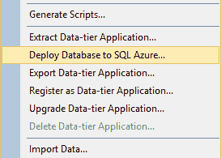

这些示例使用的数据库名为`AWMini`，它是`AdventureWorks`数据库的一个精简版本。可从本书的`APress`下载页面下载此数据库。此数据库已安装为`Azure 就绪`状态，因此你可以顺利完成这些示例。

从本书的`APress`站点下载`AWMini.zip`文件并解压缩`.sql`文件。在`SQL Server Management Studio`（适用于`SQL Server 2012`）中打开该`.sql`文件，并连接到你的本地`SQL`实例。运行该`.sql`文件，它将创建`AWMini`数据库。脚本运行完成后，刷新数据库列表，你将在数据库列表中看到新的`AWMini`数据库。

##### 直接部署到 SQL Azure

`SQL Server 2012`使得将本地数据库迁移到`SQL Azure`变得极其简单。在`SQL Server 2012`之前，迁移选项需要许多步骤，有些繁琐，并且不太符合`DAC`的整体思路，原因很简单：`DACPAC`不迁移数据。随着`SQL Server 2012`和`DAC Fx` 2.0 的发布，这一切都改变了。直接部署到`SQL Azure`就像一个三步向导一样简单。


# 第 4 章 ■ 数据迁移与备份策略

## 图 4-1. "将数据库部署到 SQL Azure" 菜单选项

如果尚未打开，请打开 `SQL Server 2012` 的 `SQL Server Management Studio`。在 **对象资源管理器** 中，展开服务器的 `数据库` 节点，并右键单击 `AWMini` 数据库。从上下文菜单中选择 `任务 ➤ 部署到 SQL Azure 数据库`，这将启动数据库部署向导（参见图 4-1）。

在 `部署数据库` 向导中，在 `简介` 页面上单击 `下一步`。在向导的 `部署设置` 页面上，您需要指定数据库将要迁移到的目标 `SQL Azure` 服务器的连接信息。单击 `连接` 按钮，这将弹出熟悉的 `连接到服务器` 对话框。输入 `SQL Azure` 服务器名称（格式为 `server.windows.database.net`），以及 `SQL Azure` 服务器的用户名和密码，然后单击 `连接`。

接下来，为数据库输入一个名称（参见图 4-2）。正如向导所述，这是一个**新建**数据库，而非现有数据库的名称。根据您本地数据库的大小，选择所需的 `版本`（`Web` 或 `Business`），然后选择所需的数据库大小。向导会自动为您填入 `临时文件名`，因此没有理由更改它。但是请注意，向导创建的是 `BACPAC`，而不是 `DACPAC`。这意味着您的数据也将被迁移。

[www.it-ebooks.info](http://www.it-ebooks.info/)

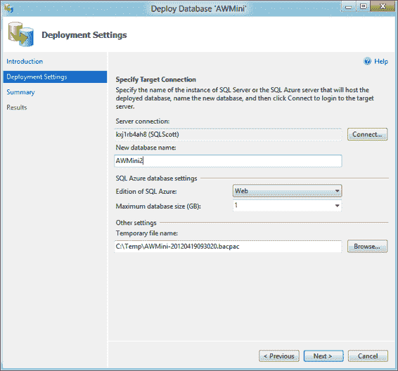

## 图 4-2. DAC 部署设置

单击 `下一步`，将显示向导的 `摘要` 页面。此页面包含一些重要信息，而不仅仅是“您在向导中选择的选项”。请注意，在摘要的 `源` 部分下，它列出了 `源数据库大小`，然后告知您您的源数据库可能大于上一向导页面选择的数据库大小。这并非需要恐慌的事情，但这是一个关键信息，提醒您务必确保所选版本和数据库大小足够大。

在 `摘要` 页面上单击 `完成`，以开始部署和迁移。在图 4-3 中，您可以看到迁移过程中采取的步骤，包括创建目标数据库、创建并验证部署计划，然后通过将 `BACPAC` 应用于目标数据库来执行该计划。部署完成后，单击 `关闭`。

[www.it-ebooks.info](http://www.it-ebooks.info/)

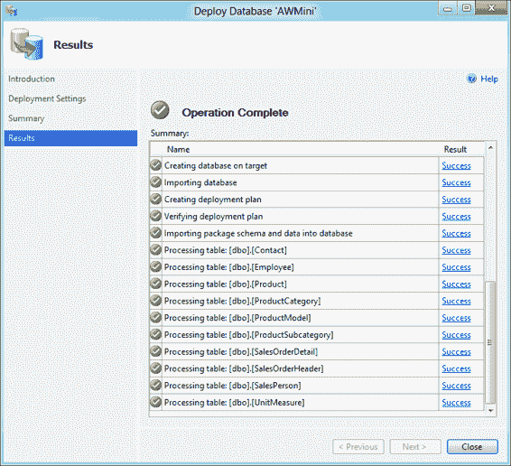

## 图 4-3. DAC 执行结果

这个过程相当快。`AWMini` 数据库包含 10 个表，总共约 200,000 条记录，在我的系统上迁移用了不到一分钟。根据您的网络连接情况，您的结果可能会有所不同（抱歉听起来像广告），但即使是更大的数据库，如完整的 `AdventureWorks` 数据库，也没有花更长多少时间。

此选项是一种无中断迁移，用于将您的 `SQL Server` 数据库部署到 `SQL Azure`。这意味着一旦您单击 `完成`，部署就开始了。然而，图 4-2 中 `临时文件名` 指定的 `BACPAC` 文件在迁移完成后**仍将存在**。根据数据库的大小，`DAC` 文件 (`.bacpac`) 可能相当大。即使是 `AWMini` 数据库，文件大小也有 5.5 MB。很棒的一点是，如果您有一个可以打开大型 `XML` 文件的程序（并且有足够的内存），您可以查看 `BACPAC` 的结构。

此时的 `BACPAC` 文件可以被归档、删除或用于其他导入服务。在这个简单的例子中，`BACPAC` 存储在本地。然而，最佳实践指出，如果您要将数据库导入多个服务器或多次导入，您会希望将 `BACPAC` 存储在 `Windows Azure` 存储中。

[www.it-ebooks.info](http://www.it-ebooks.info/)


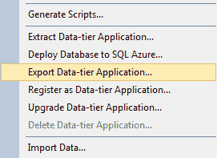

# 第 4 章 ■ 数据迁移与备份策略

##### 使用 SQL Server 2012 通过 BACPAC 导出和导入到 SQL Azure

如前所述，`将数据库部署到 SQL Azure` 是一个无法中途停止的选项。一旦你点击 `完成`，便无法回头。而且，你必须等待部署完成才能访问 BACPAC。好消息是，SQL Server 2012 并没有止步于直接部署到 SQL Azure，通过一个额外的菜单选项，你可以将本地数据库直接导出到 BACPAC，而无需直接部署到 SQL Azure。通过此菜单选项，你在部署到 SQL Azure 之前可以灵活处理你的 BACPAC，例如将其复制到另一台电脑，或使用 `导入` 选项将 DAC 包导入到多个 SQL Azure 服务器。本节将首先讨论导出选项。

###### DAC 导出

要创建 DACPAC，请右键单击 `AWMini` 数据库，然后从上下文菜单中选择 `任务 ➤ 导出数据-tier 应用程序`（参见图 4-4），这将启动 DAC 导出向导。

**图 4-4.** 导出 DAC 菜单选项

在向导的“简介”页面上单击 `下一步`。在“导出设置”页面（参见图 4-5）中，你有两个选项：`保存到本地磁盘` 和 `保存到 Windows Azure`。选择 `保存到本地磁盘` 选项，然后单击 `浏览` 按钮以选择文件名和位置来保存 BACPAC 文件。单击 `下一步`。

[www.it-ebooks.info](http://www.it-ebooks.info/)

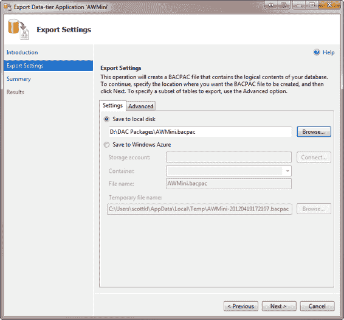

**图 4-5.** DAC 导出设置

在“摘要”页面上，检查指定的设置，然后单击 `下一步`。然后，`AWMini` 数据库将以 BACPAC 格式导出到你在向导的“导出设置”页面中指定的文件。图 4-6 显示了 DAC 框架构建 BACPAC 所采取的步骤。实际上，这是前一个示例直接部署到 SQL Azure 所经历过程的前半部分。

[www.it-ebooks.info](http://www.it-ebooks.info/)

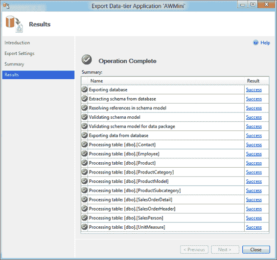

**图 4-6.** DAC 导出结果

应该指出的是，即使数据库并非为 SQL Database 准备的，前几个步骤也会在每次导出时执行。在尚未为 SQL Database 准备好的数据库上导出到 BACPAC 将会在“验证数据包的架构模型”步骤失败。你将看到的典型错误是“[MS-Description] 作为数据包 (DACPAC) 的一部分使用时不支持”和“全文目录：`[CatalogName]` 作为数据包 (DACPAC) 的一部分使用时不支持”。关键是要检查错误，进行更正，然后重新运行导出。

你可以看到，首先从数据库中提取了架构，包括引用，然后执行了验证数据库是否已为 SQL Database 准备好的重要步骤。一旦架构导出并完成所有验证，数据便会被导出。

[www.it-ebooks.info](http://www.it-ebooks.info/)

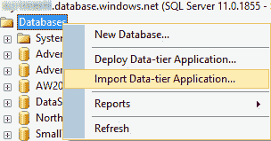

导出成功完成后，单击 `关闭`。此时，你拥有一个可以导入到一个或多个 SQL Azure 服务器的 BACPAC。当然，你不能同时导入到多个 SQL Azure 服务器，但与 `将数据库部署到 SQL Azure` 选项不同，利用导出和导入功能，你可以多次导入 BACPAC，而无需再次重新运行导出步骤。现在是时候将该 DAC 包 (BACPAC) 导入到 SQL Azure 了。

###### DAC 导入

在 SQL Server Management Studio 中连接到你的 SQL Azure 服务器，在“对象资源管理器”窗口中，右键单击“数据库”节点，然后从上下文菜单中选择 `导入 Data-tier 应用程序`（参见图 4-7），这将启动“导入 Data-tier 应用程序向导”。

**图 4-7.** DAC 导入选项菜单

在向导的“简介”页面上单击 `下一步`。在向导的“导入设置”页面（如图 4-8 所示）中，请注意你有两个选项：`从本地磁盘导入` 和 `从 Windows Azure 导入`。我们将 DAC 文件保存到了本地目录，因此选择 `从本地磁盘导入` 选项，浏览到你在上一步导出的 DAC 包 (BACPAC) 的位置，然后单击 `下一步`。

[www.it-ebooks.info](http://www.it-ebooks.info/)

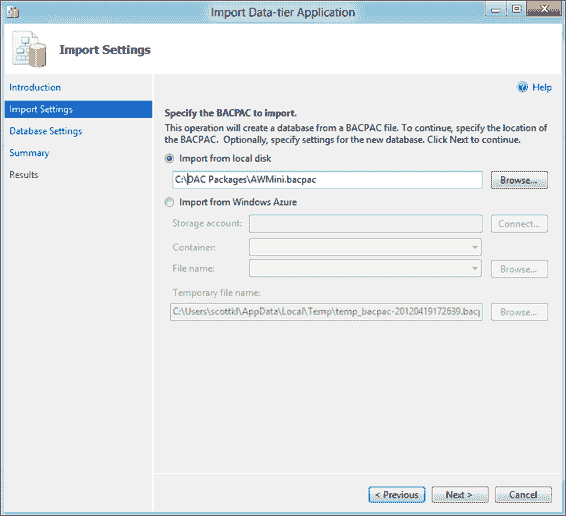

**图 4-8.** DAC 导入设置

向导的下一步，“数据库设置”，如图 4-9 所示，应该看起来很熟悉，因为你之前在图 4-2 的“部署数据库向导”的“部署设置”页面中见过它。这里你需要再次连接到你的 SQL Azure 服务器，然后选择新的 SQL Azure 数据库版本和大小。完成此操作后，单击 `下一步`。

[www.it-ebooks.info](http://www.it-ebooks.info/)

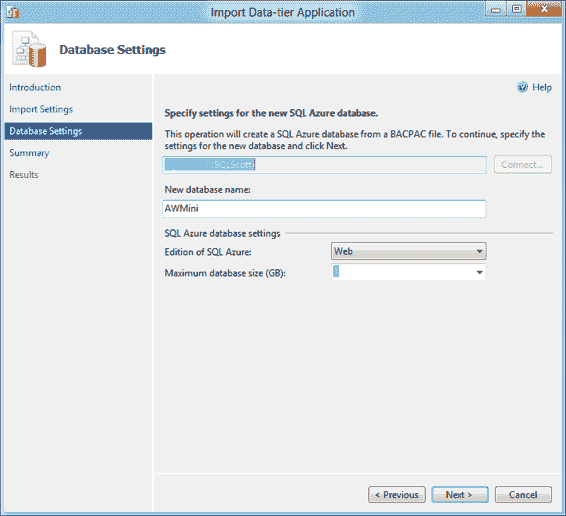

**图 4-9.** 指定新的数据库实例选项

再次出现“摘要”页面，如果一切正常，请单击 `下一步` 执行导入。

在图 4-10 中，你可以看到 DAC Fx 为将 DAC 包 (BACPAC) 部署到 SQL Azure 所采取的步骤，这是前一个示例直接部署到 SQL Azure 所经历过程的后半部分。DAC Fx 首先创建了数据库，然后创建了一个部署计划，该计划会查看当前的 DAC 包并确定如何将其部署到新数据库。然后，它会为每个表创建架构并导入数据。

[www.it-ebooks.info](http://www.it-ebooks.info/)

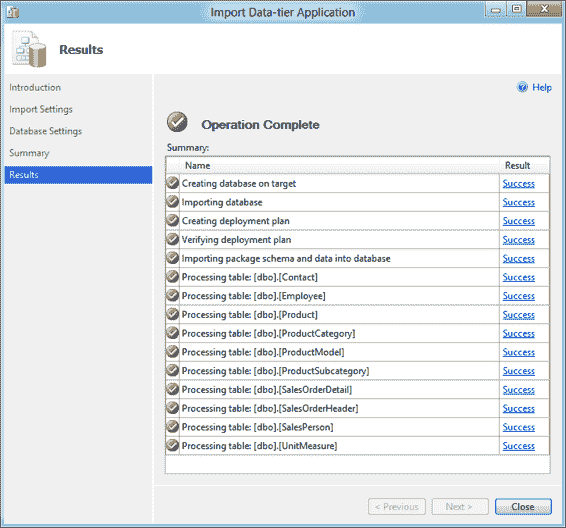

**图 4-10.** BACPAC 导入操作成功

当然，虽然 `将数据库部署到 SQL Azure` 和 `导入/导出 DAC` 选项都能完成相同的任务，但 `导入/导出 DAC` 选项为你提供了更多的控制和灵活性，例如能够将 DACPAC 部署到多个目标而无需重新导出。然而，如果你需要快速将本地数据库迁移到 SQL Azure，`将数据库部署到 SQL Azure` 是一个绝佳的选择。

[www.it-ebooks.info](http://www.it-ebooks.info/)

### 导入/导出服务

到目前为止，重点一直放在客户端；从 SQL Server 导入和导出到 BACPAC。导入/导出服务旨在直接在 Windows Azure SQL Database 和 Windows Azure BLOB 存储之间进行导入和导出。此服务自 2012 年 1 月下旬起已可用于生产环境，并且是免费的。无需注册，无需输入代码。直接使用即可。怎么用？导入/导出服务直接内置于 Windows Azure 管理门户中，通过下方功能区栏上的两个按钮：`导入` 和 `导出`。

### 导入

在本节中，你将 BACPAC 文件上传到 BLOB 存储，然后使用导入/导出服务将其导入到一个全新的 SQL Database 实例中。第一步是将 `AWMini.bacpac` 上传到 Windows Azure BLOB 存储。如果你尚未创建 Windows Azure 存储帐户，请在左侧导航窗格中选择 `存储` 选项卡，然后从下方的 `新建` 菜单中选择 `新建 ➤ 存储 ➤ 快速创建`。在 URL 字段中键入存储帐户的名称，选择区域和订阅，然后单击 `创建存储帐户`。

存储帐户创建后，在门户中选择该帐户名称；然后选择 `容器` 选项卡。在下方菜单栏上，选择 `添加容器` 以创建一个用于上传 BACPAC 的容器。在“新建 Blob 容器”对话框中，输入容器的名称（我将其称为 `bacpac`），然后单击复选（`确定`）按钮。


# 第 4 章：数据迁移与备份策略

## 导入

下一步是将 AWMini BACPAC 文件上传到存储账户和容器中。目前此选项在**Windows Azure 管理门户**中不可用，但有几种工具可以帮助你完成此操作。在 CodePlex 上有一个名为**Azure 存储浏览器**（`http://azurestorageexplorer.codeplex.com/`）的项目，这是一个用于查看和管理 Windows Azure 存储（包括 Blob、表和队列）的实用程序。RedGate 也有一款名为**Cloud Storage Studio**（`http://www.cerebrata.com/Products/CloudStorageStudio/`）的工具，它提供了丰富的功能来管理你的 Windows Azure 存储。互联网上还有其他一些工具，但这两款是最受欢迎的。

这两款工具中的任意一款都能让你快速轻松地将`AWMini.bacpac`文件上传到你的 Blob 容器中。

将 BACPAC 文件上传到 Blob 存储后，请使用与你的 Windows Azure 订阅关联的 Windows Live ID 登录到 Windows Azure 管理门户（`https://manage.windowsazure.com`）。登录门户后，在左侧导航窗格中选择`SQL 数据库`节点。如果你有任何 SQL 数据库实例，门户的下部区域将显示`导入`和`导出`按钮，如图 4-11 所示。否则，只会显示一个`导入`按钮。

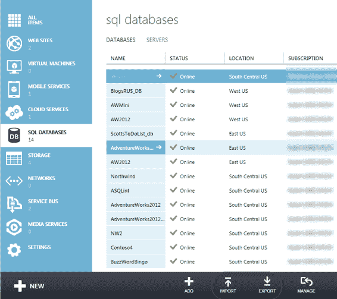

`图 4-11.` Windows Azure 管理门户中的导入和导出按钮

单击`导入`按钮，这将打开`导入数据库`对话框。在此对话框中，你首先需要在`Bacpac URL`字段中选择黑色的文件夹图标，这将打开`浏览云存储`对话框，如图 4-12 所示。在此对话框的左侧，展开存储账户名称并选择 BACPAC 文件所在的容器。然后从列表中选择`AWMini.bacpac`并点击`打开`。

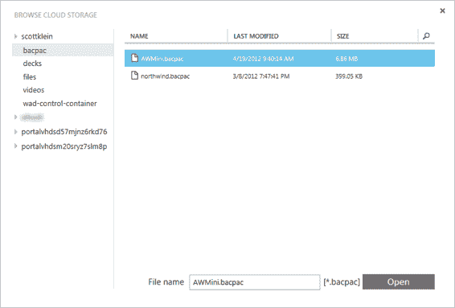

`图 4-12.` 浏览云存储对话框

返回到`导入数据库`对话框，为导入过程中将创建的新数据库输入一个名称。我将其命名为`AWMini2`，以便与上一个示例中创建的数据库区分开。

接下来，选择你将在其中创建数据库并导入 BACPAC 的订阅，然后选择将在其上创建新数据库的服务器。

> **注意：** 存储账户和 Windows Azure SQL 数据库实例必须位于同一地理区域；否则，你将收到一条警告，指出数据库和资源不在同一区域，你将无法导入 BACPAC。此限制是为了确保在导入/导出过程中不会产生任何出站传输费用。

最后，输入访问 Windows Azure SQL 数据库服务器的`登录`名和密码。此时`导入数据库`对话框应如图 4-13 所示。如果你想指定新数据库的`版本`和`最大大小`，请勾选`配置高级数据库设置`复选框。如果留空此复选框，导入过程将创建一个 1 GB 的`Web 版`数据库。因此，如果你的数据库大于 1 GB，应选择此选项并为导入过程选择合适的数据库大小。

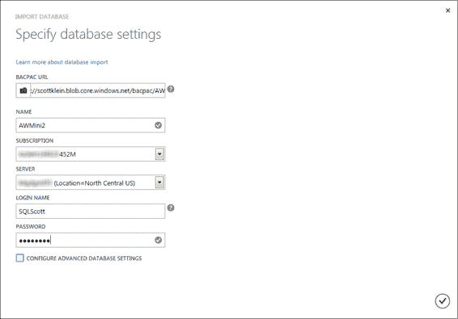

`图 4-13.` 已填写完毕的导入数据库对话框

准备就绪后，单击`导入数据库`对话框上的勾选（`确定`）按钮以开始导入过程。对话框会消失，但导入过程确实在进行中，你可以通过观察下方菜单栏的状态来验证。导入成功后，新的状态将显示在下方菜单栏中，表明导入已成功。

## 导出

导出 Windows Azure SQL 数据库实例的过程与导入过程类似。在 Windows Azure 管理门户中，在左侧导航窗格中选择`SQL 数据库`节点，然后从数据库列表中选择一个数据库。之前图 4-11 中所示的`导出`按钮现在将可见。单击`导出`按钮将打开`导出数据库`对话框，如图 4-14 所示。

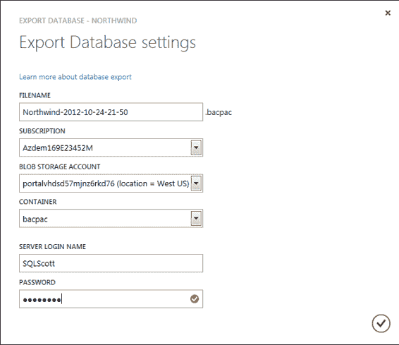

`图 4-14.` 导出数据库对话框

在`导出数据库`对话框中，`文件名`和`订阅`字段将自动为你填充。但是，你可以自由提供不同的文件名，也可以选择不同的订阅。

选择用于创建 BACPAC 文件的 Blob 存储`账户`和`容器`。但如前所述，如果存储账户和数据库位于不同区域，你将收到警告消息，并且不允许执行导出过程。

输入适当的信息后，单击勾选（`确定`）按钮，这将启动导出过程。与导入过程一样，你可以通过观察下方菜单栏的状态来验证数据库的导出。导出成功后，新的状态将显示在下方菜单栏中，表明导出已成功。然后，你可以使用最初将 BACPAC 文件上传到 Blob 存储时使用的相同工具来验证导出是否确实成功。

## 生成和发布脚本向导

**生成和发布脚本向导**用于为 SQL Server 数据库和/或所选数据库内的相关对象创建 T-SQL 脚本。你可能已经使用过此向导，因此本节不会逐步讲解；相反，本节简要重点介绍向导中的几个步骤，并指出与 SQL Azure 高效协作所需的选项。

SQL Server 2012 和 SQL Server 2008 R2 具备为 SQL Azure 环境编写本地数据库脚本的能力。

SQL Server 2012/2008 R2 与 SQL Server 2008（在对象脚本编写方面）的区别之一是向导的`高级脚本编写选项`对话框中的一个设置。你可以为脚本编写数据库对象的目标 SQL Server 版本设置两个属性：`脚本编写为的服务器版本`和`脚本编写为的数据库引擎类型`。`脚本编写为的服务器版本`选项列出了生成和发布脚本向导支持的 SQL Server 版本，范围从 SQL Server 2000 到 SQL Server 2012。

`脚本编写为的数据库引擎类型`属性有两个选项可供选择：`独立实例`和`SQL Azure 数据库`。`SQL Azure 数据库`选项仅适用于 SQL Server 2012 和 2008 R2 服务器版本。例如，如果你将`脚本编写为的服务器版本`设置为 SQL Server 2008（非 R2），然后将`脚本编写为的数据库引擎类型`属性设置为`SQL Azure 数据库`，则`脚本编写为的服务器版本`属性值会自动更改为 SQL Server 2012/2008 R2。

生成和发布脚本向导在为 SQL Azure 适当地编写对象脚本方面做得非常出色。


## 生成和发布脚本向导

该向导会检查不支持的语法和数据类型，并检查每个表上的主键。因此，以下示例将出于几个原因将 `SQL for Server Version` 设置为 `SQL Server 2008`（非 R2 版）。首先，并非所有人都在使用 `SQL Server 2012/2008 R2`，因此没有为 `SQL Azure` 编写脚本的选项。其次，本练习将向您展示为在 `SQL Azure` 中运行脚本需要执行哪些步骤。

本节将使用的数据库是您可从 CodePlex 获取的可靠 `AdventureWorks` 数据库：

[`msftdbprodsamples.codeplex.com/releases/view/55330`](http://msftdbprodsamples.codeplex.com/releases/view/55330)

此数据库下载是专为 `SQL Server 2012` 设计的 `.mdf` 文件。我们将使用适用于 `SQL Server 2012` 的 `SQL Server Management Studio` 进行操作，因此请启动它并附加下载的数据库。

### 启动向导

要在 `SQL Server Management Studio` (`SSMS`) 中启动 `生成和发布脚本向导`，请打开 `对象资源管理器` 并展开 `数据库` 节点。选择 `AdventureWorks2012` 数据库，右键单击它，然后从上下文菜单中选择 `生成脚本`。

在适用于 `SQL Server 2012` 的向导的“简介”页面上，系统会告知您必须遵循四个步骤才能完成此向导：

1.  选择数据库对象。
2.  指定编写脚本或发布的对象。
3.  查看选择内容。
4.  生成脚本。

接下来的章节将逐步讲解这些步骤。

### 选择目标对象

要选择目标数据库对象，请遵循以下步骤：

1.  在 `生成和发布脚本向导` 的“简介”页面上，单击 `下一步`。
2.  在 `选择对象` 页面（参见 `图 4-15`），选择 `选择特定的数据库对象` 选项，因为就本示例而言，您只需选择少数几个对象进行迁移。

[www.it-ebooks.info](http://www.it-ebooks.info/)

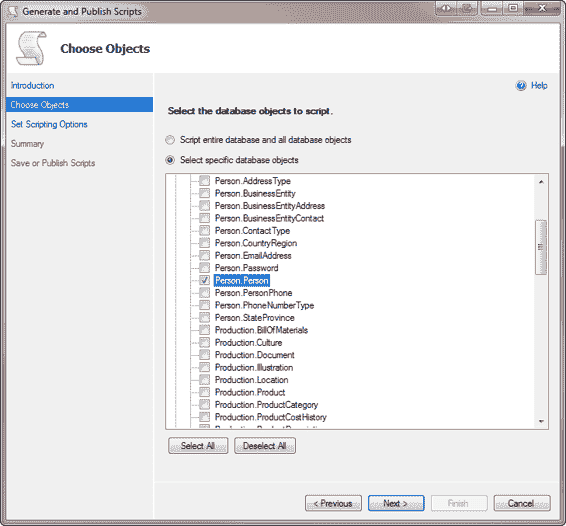

***图 4-15.** 选择要迁移为脚本形式的对象*

3.  在 `图 4-15` 中的对象列表中，展开 `表` 和 `XML 架构集合` 节点，并选择以下对象：
    *   **表：** `Person.Person`
    *   **用户定义数据类型：** `Name`，`NameStyle`
    *   **XML 架构集合：** `IndividualSurveySchemaCollection`
    *   **架构：** `Person`
4.  在 `选择对象` 页面上单击 `下一步`。
5.  在 `设置脚本编写对象` 页面上，选择 `图 4-16` 中所示的 `保存到新查询窗口` 选项，然后单击 `高级` 按钮。

[www.it-ebooks.info](http://www.it-ebooks.info/)

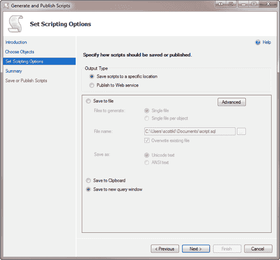

***图 4-16.** 脚本编写选项*

### 设置高级选项

单击 `高级` 按钮将打开如 `图 4-17` 所示的 `高级脚本编写选项` 对话框。请遵循以下步骤为此示例的脚本设置高级选项：

1.  在 `高级脚本编写选项` 对话框中，设置以下选项：
    *   `将 UDDT 转换为基类型`：`True`
    *   `编写扩展属性的脚本`：`False`
    *   `编写登录名的脚本`：`False`
    *   `编写 USE DATABASE 语句的脚本`：`False`
    *   `要编写脚本的数据类型`：`架构`
    *   `为服务器版本编写脚本`：`SQL Server 2012`
    *   `为数据库引擎类型编写脚本`：`独立实例`

[www.it-ebooks.info](http://www.it-ebooks.info/)

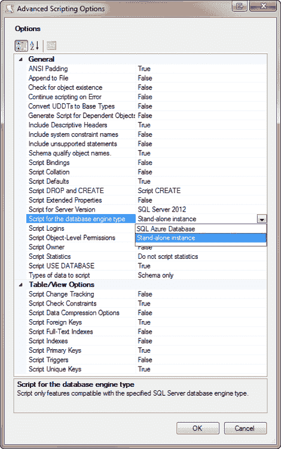

***图 4-17.** 高级脚本编写选项对话框*

您还可以将 `Script DROP and CREATE` 选项设置为 `Script DROP and CREATE`，如 `图 4-17` 所示，但对于 `SQL Azure` 并非必需此选项。

2.  在 `高级脚本编写选项` 对话框中单击 `确定`，然后在 `生成脚本` 向导中单击 `下一步`。
3.  在向导的 `摘要` 页面上，查看您的选择，然后单击 `下一步`。系统将生成 `T-SQL` 脚本，并带您进入 `保存或发布脚本` 页面。


4. 点击 **完成**。此时你的脚本已完成，并在 SSMS 的查询窗口中显示。

### 审查生成的脚本

打开你创建的文件，让我们快速查看一下生成的 T-SQL。下面的代码片段展示了创建一个 XML 架构集合和一张表的过程。为了节省本章篇幅，大部分 XML 架构集合以及部分约束的创建被省略了，但你的脚本会显示完整的 `CREATE` 语句。此外，除了你告诉脚本生成向导忽略的部分，以下 T-SQL 看起来与你日常处理的其他对象创建 T-SQL 类似：

```sql
/****** Object: Schema [Person] Script Date: 4/22/2012 3:38:28 PM ******/

CREATE SCHEMA [Person]

GO

/****** Object: XmlSchemaCollection [Person].[IndividualSurveySchemaCollection] Script Date: 4/22/2012 3:38:28 PM ******/

CREATE XML SCHEMA COLLECTION [Person].[IndividualSurveySchemaCollection]

AS N'<xsd:schema xmlns:xsd=" [`www.w3.org/2001/XMLSchema`](http://www.w3.org/2001/XMLSchema)"

...

</xsd:schema>'

GO

/****** Object: UserDefinedDataType [dbo].[Name] Script Date: 4/22/2012 3:38:28 PM ******/

CREATE TYPE [dbo].[Name] FROM nvarchar NULL

GO

/****** Object: UserDefinedDataType [dbo].[NameStyle] Script Date: 4/22/2012 3:38:28 PM ******/

CREATE TYPE [dbo].[NameStyle] FROM [bit] NOT NULL

GO

/****** Object: Table [Person].[Person] Script Date: 4/22/2012 3:38:28 PM ******/

SET ANSI_NULLS ON

GO

SET QUOTED_IDENTIFIER ON

GO

CREATE TABLE [Person].Person NOT NULL,

[NameStyle] [bit] NOT NULL,

[Title] nvarchar NULL,

[FirstName] nvarchar NOT NULL,

[MiddleName] nvarchar NULL,

[LastName] nvarchar NOT NULL,

[Suffix] nvarchar NULL,

[EmailPromotion] [int] NOT NULL,

[AdditionalContactInfo] xml NULL,

[Demographics] xml NULL,

[rowguid] [uniqueidentifier] ROWGUIDCOL NOT NULL,

[ModifiedDate] [datetime] NOT NULL,

CONSTRAINT [PK_Person_BusinessEntityID] PRIMARY KEY CLUSTERED

(

[BusinessEntityID] ASC

)WITH (PAD_INDEX = OFF, STATISTICS_NORECOMPUTE = OFF, IGNORE_DUP_KEY = OFF, ALLOW_ROW_LOCKS = ON, ALLOW_PAGE_LOCKS = ON) ON [PRIMARY]

) ON [PRIMARY] TEXTIMAGE_ON [PRIMARY]

GO

ALTER TABLE [Person].[Person] ADD CONSTRAINT [DF_Person_NameStyle] DEFAULT ((0)) FOR [NameStyle]

GO

ALTER TABLE [Person].[Person] ADD CONSTRAINT [DF_Person_EmailPromotion] DEFAULT ((0)) FOR

[EmailPromotion]

GO

ALTER TABLE [Person].[Person] ADD CONSTRAINT [DF_Person_rowguid] DEFAULT (newid()) FOR [rowguid]

GO

ALTER TABLE [Person].[Person] ADD CONSTRAINT [DF_Person_ModifiedDate] DEFAULT (getdate()) FOR

[ModifiedDate]

GO
```

注意，脚本启用了多个选项，如 `ANSI_NULLS` 和 `ANSI_PADDING`。然后它创建了 `Person` 表。该表有一个 `rowguid` 列，使用 `uniqueidentifier` 数据类型。`rowguid` 列还有一个默认值，该默认值使用 `newid()` 函数来自动生成新的 GUID。此表在 `PRIMARY` 文件组上创建，随后通过 `WITH` 子句设置了几个表选项。

### 修复脚本

因为你选择为 SQL Server 2012 生成脚本，所以脚本中包含了一些 SQL Azure 不支持的语法和语句。图 4-18 显示了如果你尝试按生成的原样运行该脚本会看到的一些错误。

**图 4-18.** SQL Azure 执行错误

在此示例中，你只生成了一张表、几个 UDT 和一个 XML 索引的脚本。如果你为更多对象生成脚本，你还会看到类似如下错误：

*   关键字或语句选项 'pad_index' 在此版本的 SQL Server 中不受支持。
*   关键字或语句选项 'allow_row_locks' 在此版本的 SQL Server 中不受支持。


*   关键字或语句选项 `textimage_on` 在当前版本的 SQL Server 中不支持。
*   `ROW GUID COLUMN` 在当前版本的 SQL Server 中不支持。
*   `文件组引用与分区方案` 在当前版本的 SQL Server 中不支持。

[www.it-ebooks.info](http://www.it-ebooks.info/)

# 第 4 章 ■ 数据迁移与备份策略

你可能还会遇到的另一个情况是 SQL Azure 不支持 `堆表`。堆表是指没有聚集索引的表。SQL Azure 目前只支持聚集表。

那么问题就变成了，为了使脚本能在 SQL Azure 上运行，需要做哪些更改？

为了让脚本在 SQL Azure 下运行，你需要进行一些修改。具体操作如下：
1.  删除所有 `SET ANSI_NULLS ON` 实例。
2.  删除所有 `ON [PRIMARY]` 实例。
3.  删除所有 `TEXTIMAGE_ON [PRIMARY]` 实例。
4.  删除以下所有实例：
    *   `PAD_INDEX = OFF`
    *   `ALLOW_ROW_LOCKS = ON`
    *   `ALLOW_PAGE_LOCKS = ON`
5.  在 `Person` 表中，修改 `rowguid` 列，移除 `ROWGUIDCOL` 关键字。
6.  为任何堆表添加聚集索引。

## 附录 B

详细讨论了进行这些更改的必要性。现在，这里给出一个简要说明：

*   `ON [PRIMARY]` 不需要，因为正如你在第 1 章和第 2 章所学，SQL Azure 隐藏了所有硬件特定的访问和信息。没有 `PRIMARY` 或文件组的概念，因为磁盘空间由 Microsoft 处理，因此不需要此选项。
*   根据 SQL Server 联机丛书 (BOL)，你可以移除包含表选项的整个 `WITH` 子句。但是，你真正需要移除的表选项只有第 4 步列出的那些（`PAD_INDEX`、`ALLOW_ROW_LOCKS` 和 `ALLOW_PAGE_LOCKS`）。
*   尽管这个表没有使用，但 `NEWSEQUENTIALID()` 函数在 SQL Azure 中不受支持，因为 SQL Azure 中没有 `CLR` 支持，因此所有基于 `CLR` 的类型都不支持。`NEWSEQUENTIALID()` 的返回值就是其中之一。此外，`ENCRYPTION` 选项也不受支持，因为 SQL Azure 整体上还不支持加密。
*   SQL Azure 不支持 `堆表`。因此，你需要通过添加聚集索引将任何堆表更改为聚集表。（有趣的是，如果你一次执行一条语句，你实际上可以*创建*堆表。但是，任何向该表的插入操作都会失败。）SQL Azure 文档建议的事项之一（如前所列）是将 `Convert UDDTs to Base Types` 属性设置为 `True`。这是因为 SQL Azure 不支持用户定义类型。

在对你的 SQL 脚本进行上述修改后，它应该如下所示：

```sql
/****** Object: Schema [Person] Script Date: 4/22/2012 3:38:28 PM ******/

CREATE SCHEMA [Person]

GO

/****** Object: UserDefinedDataType [dbo].[Name] Script Date: 4/22/2012 3:38:28 PM ******/

CREATE TYPE [dbo].[Name] FROM nvarchar NULL

GO

/****** Object: UserDefinedDataType [dbo].[NameStyle] Script Date: 4/22/2012 3:38:28 PM ******/

CREATE TYPE [dbo].[NameStyle] FROM [bit] NOT NULL

GO

/****** Object: Table [Person].[Person] Script Date: 4/22/2012 3:38:28 PM ******/

SET ANSI_NULLS ON

GO

SET QUOTED_IDENTIFIER ON

GO

CREATE TABLE [Person].Person NOT NULL,

[NameStyle] [bit] NOT NULL,

[Title] nvarchar NULL,

[FirstName] nvarchar NOT NULL,

[MiddleName] nvarchar NULL,

[LastName] nvarchar NOT NULL,

[Suffix] nvarchar NULL,

[EmailPromotion] [int] NOT NULL,

[AdditionalContactInfo] [xml] NULL,

[Demographics] [xml] NULL,

[rowguid] [uniqueidentifier] NOT NULL,

[ModifiedDate] [datetime] NOT NULL,

CONSTRAINT [PK_Person_BusinessEntityID] PRIMARY KEY CLUSTERED

(

[BusinessEntityID] ASC

)WITH (STATISTICS_NORECOMPUTE = OFF, IGNORE_DUP_KEY = OFF)

)

GO

ALTER TABLE [Person].[Person] ADD CONSTRAINT [DF_Person_NameStyle] DEFAULT ((0)) FOR [NameStyle]

GO
```

[www.it-ebooks.info](http://www.it-ebooks.info/)

# 第 4 章 ■ 数据迁移与备份策略


# ALTER TABLE [Person].[Person] 约束添加

```sql
ALTER TABLE [Person].[Person] ADD CONSTRAINT [DF_Person_EmailPromotion] DEFAULT ((0)) FOR [EmailPromotion]
GO

ALTER TABLE [Person].[Person] ADD CONSTRAINT [DF_Person_rowguid] DEFAULT (newid()) FOR [rowguid]
GO

ALTER TABLE [Person].[Person] ADD CONSTRAINT [DF_Person_ModifiedDate] DEFAULT (getdate()) FOR [ModifiedDate]
GO
```

# 在 Azure 数据库中执行脚本

现在您已经进行了必要的修正，可以开始在 SQL Azure 数据库中创建对象了。

## 连接到 Azure 数据库并执行脚本

您还没有可以运行脚本的 SQL Azure 数据库，那么现在就创建一个：

1.  连接到您的 SQL Azure 实例（如果需要可参考第 1 章），确保连接到 `master` 数据库。
2.  打开一个新的查询窗口，使用第 1 章讨论的语法创建您的 SQL Azure 数据库。将其命名为 `AWMini`，因为本章所有示例都使用此名称。
3.  切换到生成的脚本。此查询窗口当前连接到您的本地 SQL 实例，因此您需要将其更改为您的 SQL Azure 实例和刚刚创建的数据库。在脚本中任意位置右键单击，然后从上下文菜单中选择“连接” -> “更改连接”。
4.  在“连接到数据库引擎”对话框中，输入您 SQL Azure 实例的信息，并在“连接属性”选项卡上输入您刚创建的数据库名称。
5.  单击“连接”。

您现在拥有了脚本、一个数据库以及到该数据库的连接。单击“执行”按钮。您的脚本应该运行并在您的 SQL Azure 数据库中创建表、存储过程和数据。

SQL Server “生成和发布脚本向导”是开始理解迁移到 SQL Azure 所需进行的更改的绝佳方式。以此为基础，让我们讨论另一个选项：`bcp` 实用程序。

## bcp 实用程序

`bcp` 实用程序提供在 Microsoft SQL Server 实例之间进行大容量复制的功能。此实用程序随 SQL Server 安装，不需要了解或理解 T-SQL 语法。如果您不熟悉 `bcp` 实用程序，请不要将其功能与 SQL Server 中的导入/导出向导混淆或关联。尽管 `bcp` 文档将 `bcp` 所做的事情称为“大容量复制”，但请注意，您不能使用单个语句将数据从源 `bcp` 到目标。您必须首先将数据 `bcp` 导出到源；然后，才能将数据 `bcp` 导入到目标。

`bcp` 实用程序是移动数据的绝佳方式。由于它不处理模式（即模式必须已存在），因此 `bcp` 实用程序是迁移数据的非常快速的方法。例如，您需要用本地数据库的数据刷新 SQL 数据库，`bcp` 选项就是完成此任务的绝佳解决方案。

**注意**：`bcp` 实用程序非常灵活且强大，您可以对其应用许多选项。本节不深入探讨所有 `bcp` 选项或深入研究该实用程序的多种用途。您可以在 SQL Server 联机丛书或 Microsoft MSDN 网站上找到相关信息：[`msdn.microsoft.com/en-us/library/ms162802.aspx`](http://msdn.microsoft.com/en-us/library/ms162802.aspx)。

本节介绍如何使用 `bcp` 实用程序从本地数据库导出数据并将数据导入到您的 SQL Azure 数据库。它还讨论了为 SQL Azure 使用 `bcp` 实用程序时应注意的一些事项。

### 调用 bcp

`bcp` 实用程序没有 GUI；它是一个由命令提示符驱动的实用程序。但不要被此吓倒，特别是考虑到您使用它的目的。它非常灵活，可能看起来有点令人不知所措，但它非常简单。`bcp` 实用程序的基本语法如下：

```bash
bcp table direction filename - servername - username - password
```

其中：

- `table` 是基于 `direction` 参数的源表或目标表。
- `direction` 是 `in` 或 `out`，具体取决于您是将数据复制到数据库还是从数据库复制出来。
- `filename` 是您要将数据复制到或从的文件名。
- `servername` 是您要将数据复制到或从的服务器名称。
- `username` 是用于连接到本地或 SQL Azure 数据库的用户名。
- `password` 是与用户名关联的密码。

让我们开始从源数据库导出数据。

### 导出数据

首先从本地 SQL 实例复制数据。打开命令提示符，键入图 4-19 所示的命令。为您自己的服务器名称和生成的 `bcp` 文件的目标目录输入值。在此示例中，我使用了 `-T` 参数，告诉 `bcp` 实用程序使用集成安全性通过可信连接连接到我的本地实例。

**图 4-19. 使用 `bcp` 导出数据**

在此示例中，您对 `direction` 参数使用了 `out` 关键字。这是因为您正在将数据从 SQL Server **复制出来**。

`-n` 参数执行大容量复制操作，使用数据的本机数据库数据类型。`-q` 参数在 `bcp` 实用程序与 SQL Server 实例之间的连接中执行 `SET QUOTED_IDENTIFIERS ON` 语句。

键入命令后，按 Enter 执行 `bcp` 实用程序。在短短几毫秒内，超过 71,000 行数据被导出并复制到 `user.dat` 文件（见图 4-20）。

**图 4-20. `bcp` 导出命令的输出**

### 导入数据

下一步是将数据复制到云中——具体来说，是复制到您的 SQL Azure `AWMini` 数据库。将数据复制**到**数据库的语法与复制数据**出来**的语法非常相似。您使用 `in` 关键字并指定 SQL Azure 数据库的服务器名称和凭据，如图 4-21 所示。

**图 4-21. `bcp` 导入期间的 `uniqueidentifier` 数据类型错误**

键入命令后，按 Enter 执行 `bcp` 实用程序。注意图 4-22 中，导入全部 71,320 行数据几乎没有花费任何时间。

**图 4-22. 成功的 `bcp` 导入**

如果您曾经收到错误，提示遇到意外的文件结尾（EOF），此错误并非 SQL Azure 特有；`bcp` 实用程序对 `uniqueidentifier` 数据类型的列存在问题。您可以在互联网上找到许多关于此问题的帖子和博客。

解决方案是从 SQL Azure 表中删除 `rowguid` 列。很酷的是，您不需要重新导出数据。您可以简单地重新执行 `bcp` 导入命令，然后将 `rowguid` 列添加回表中。

如前所述，SQL Server BOL（联机丛书）充满了关于如何使用 `bcp` 实用程序的信息。本节简要介绍了如何使用此实用程序将数据从本地 SQL Server 实例移动到 SQL Azure。`bcp` 实用程序是一种移动数据的大容量复制方法。它缺乏 SSIS 将数据从一种数据类型转换为另一种数据类型的能力，也缺乏 SSIS 的工作流组件。但如果您感兴趣的只是将数据从一个表移动到一个类似的目标表，`bcp` 是您最好的朋友。

# SQL Azure 迁移向导

到目前为止，本章讨论的工具都是由 Microsoft 提供的。然而，有一个出色的第三方实用程序可用，它是专门为迁移到 SQL Azure 而构建的。该实用程序就是 SQL Azure 迁移向导，它值得一些应得的关注。


`SQL Azure 迁移向导`的目标是帮助您将本地的 `SQL Server 2005/2008` 数据库迁移到 `SQL Azure`。此工具采用向导驱动，非常易于使用。它将逐步引导您完成所有必需的步骤，使得迁移过程简单且几乎无缝。

您可以在 Codeplex 上找到 `SQL Azure 迁移向导`：[`sqlazuremw.codeplex.com/`](http://sqlazuremw.codeplex.com/)。

请注意，尽管这个巧妙的实用工具可以迁移 2005、2008 和 2012 版本的数据库，但它运行的最低要求是 `SQL Server 2008 R2`。

## SQL Azure 备份策略

您的数据虽然已在云端，但事情远不止于此。数据库管理员在处理本地数据存储时触手可及的许多功能，在云端还不存在。这句话的关键词是 `还不存在`。

### 复制数据库

`数据库复制`功能允许您创建源数据库的单个副本。您可以通过向 `CREATE DATABASE` 语句添加一个新参数来实现：`AS COPY OF`。作为复习，`CREATE DATABASE` 的语法如下：

```
CREATE DATABASE MyDatabase (MAXSIZE= 10 GB, EDITION= 'Business')
```

要创建源数据库的副本，语法现在变为：

```
CREATE DATABASE MyDatabase AS COPY OF [source_server_name].source_database_name
```

因此，如果您想创建 `AWMini` 数据库的副本，语法是：

```
CREATE DATABASE AWMini2 AS COPY OF servername.AWMini
```

图 4-23 显示了执行上述语句的情况。有趣的是请注意“消息”窗口中的信息。当您执行带有 `AS COPY OF` 参数的 `CREATE DATABASE` 语句时，您会立即收到“命令已成功完成”的消息。这是否意味着复制完成得如此之快？

不是的。此消息意味着复制已`开始`。您还可以在图 4-23 中看到 `AWMini2` 数据库已经列在数据库列表中；但这并不意味着数据库复制已经完成。

[www.it-ebooks.info](http://www.it-ebooks.info/)

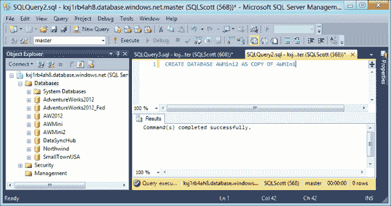

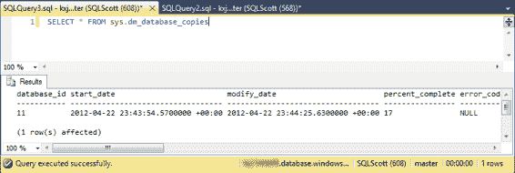

**图 4-23.** 复制数据库

### 确定复制何时完成

那么问题来了，您如何知道复制何时完成？答案是 Microsoft 创建了一个新的数据管理视图（DMV）来返回数据库复制操作的详细信息。这个 DMV 叫做 `sys.dm_database_copies`，它返回大量关于数据库复制状态的信息，例如数据库复制过程何时开始和完成、已复制的字节百分比、错误代码等。此外，Microsoft 修改了 `sys.databases` 表中的 `state` 和 `state_desc` 列，以提供有关新数据库状态的详细信息。

图 4-24 显示了数据库复制的进度。该语句查看 `sys.dm_database_copies` DMV 并检查复制状态，报告复制的开始日期和时间、完成百分比以及状态更新的日期和时间（在 `modify_date` 列中）。任何复制错误都显示在 `error_code` 和 `error_description` 列中。一旦复制完成，表中与该复制对应的特定行将从表中移除。

**图 4-24.** 检查数据库复制状态

[www.it-ebooks.info](http://www.it-ebooks.info/)

#### 自动化数据库复制

您可以通过本地 `SQL Agent` 作业和 `SSIS` 包（如本章前面所述）来调度数据库复制。只要 `Execute SQL` 任务的连接信息指向 `SQL Azure` 数据库，该作业就可以像普通的本地 SQL 作业一样进行调度。

尽管这可能不是最理想的解决方案，但它确实是一个选项，并且确实提供了您所需的调度功能。此解决方案的关键是在重新创建之前先删除复制的数据库。

#### 维护备份历史记录

`数据库复制`功能可以让您创建数据库的即时备份，但它不提供创建备份历史记录的方法。换句话说，您无法追加备份并创建多天的备份记录。

然而，您确实有几个选择。

如果您只关心备份当天的数据，可以删除当前的备份副本并重新复制数据库。这是一个可行的选项，并且不需要太多维护。

另一方面，如果您想要一个备份历史记录，这样做就有点棘手了。许多公司（如果不是大多数的话）希望保留一周的备份。这些公司每晚备份数据库，并保留七天的备份，以便可以选择恢复到前一晚备份之前的状态。要使用`数据库复制`功能实现这一点，您必须创建源数据库的七个副本——您有七个备份副本数据库。

这个策略可行，但请记住，您需要为这七个额外的数据库付费。这里的关键是，如果您使用 `SQL Azure`，仔细审视您的备份计划至关重要。

### 使用导入/导出功能进行备份

虽然 `AS COPY OF` 功能很好，但您现在需要为额外的数据库付费。许多公司现在正在考虑使用的备份和恢复解决方案是本章开头讨论的 `导入/导出服务`。将数据库备份存储在 `Windows Azure BLOB 存储`中，其成本肯定远低于第二个数据库的成本，此外，您还可以拥有数据库的多个备份。当然，这两者都不提供您在本地习惯使用的 `事务` 和 `差异` 备份解决方案，但 `导入/导出服务` 和 `DAC 框架` 为您提供了更大的灵活性。

### 第三方备份产品

目前市场上有两款非常好的产品，为 `SQL Azure` 提供出色的备份和恢复功能：

- `Enzo Backup for SQL Azure`
- `Cloud Services`

#### Enzo 备份

由 `Blue Syntax` 公司开发的 `Enzo Backup for SQL Azure` 是一款本地 Windows 应用程序，允许您对 `SQL Azure` 数据库执行备份和恢复请求。该工具的灵活性体现在几个方面。首先，您可以备份到 `BLOB 存储`或本地文件系统，并从中恢复。备份会自动压缩，并包含 `架构` 和数据。其次，您可以备份整个数据库或特定的 `架构`。您还可以恢复特定的 `架构` 或该 `架构` 或数据库中的特定表。

[www.it-ebooks.info](http://www.it-ebooks.info/)

备份具有事务一致性，就像 `CREATE DATABASE` 命令的 `AS COPY OF` 功能一样。

`Enzo Backup` 工具还允许您在 `Azure 平台`中调度备份作业运行。备份完全在云端执行和运行，使用的是 `云代理`。该代理有多种大小（与 `Windows Azure 托管服务`的大小相匹配），允许您决定希望备份执行的速度。有关 `Enzo Backup for SQL Azure` 工具的更多信息可以在这里找到：

[`www.BlueSyntax.net/backup.aspx`](http://www.BlueSyntax.net/backup.aspx)

#### 云服务


# 第五章 SQL 数据库编程

## 章节摘要

在本章中，我们探讨了将数据库架构及相关数据迁移到 `SQL Azure` 的各种选项。你了解到每种方法都有其优缺点；例如，`SQL Server` 脚本生成向导会生成架构和数据的脚本，但 `SSIS` 和 `bcp` 实用程序则不会。你还了解到，如果你使用 `SQL Server 2008 R2` 或 `SQL Server 2012`，可以选择为 `SQL Azure` 生成脚本，该功能会生成可在 `SQL Azure` 环境中直接执行的对象脚本。

我们还讨论了 `SQL Azure Copy` 功能，它允许你创建 `SQL Azure` 数据库的副本用于备份目的。

将数据库置于 `SQL Azure` 后，我们现在可以专注于如何为 `SQL Azure` 编程应用程序，这是本章的主题。

[www.it-ebooks.info](http://www.it-ebooks.info/)

前面的章节为本书的其余部分奠定了基础。你已经了解了 `Windows Azure SQL Database` 的概览，学习了云计算设计选项，并逐步完成了 `Azure` 账户的设置。你阅读了关于 `SQL Database` 安全性的内容，包括安全合规性和加密主题；并且在上一章中，你学习了数据迁移（如何将数据放入云端）和备份策略——这些都是数据库管理员（DBA）喜欢听到的内容。

从本章开始，本书的其余部分将专注于使用 `SQL Database` 进行开发。本章将探讨使用各种微软技术为 `SQL Database` 编程，包括 `ODBC`、`ADO.NET`、`LINQ` 等。

本章还讨论了当你开始设计和构建与 `SQL Database` 协同工作的新应用程序，或考虑将现有应用程序迁移到 `SQL Database` 时的开发注意事项。

你应该开始意识到，`SQL Database` 实际上与你本地的 `SQL Server` 实例并没有*那么*不同。上一章详细讨论了 `SQL Database` 中的一些 `T-SQL` 差异，但也提到微软正在持续增加功能和特性；因此，差异正在以非常快的速度缩小（这让本书的写作成为一个有趣的挑战，但这是另一个故事了）。开发应用程序的关键不在于将应用程序指向你的云数据库版本，而在于开发应用程序的方法和访问云数据库的设计考量。简单地将数据库迁移到云端并将应用程序指向该实例可能会导致灾难性的结果，例如应用程序性能下降和产生不必要的金钱成本。

本章首先专注于应用程序设计方法，以充分利用 `SQL Database` 应用程序开发。本章其余部分讨论了访问 `SQL Database` 实例的各种技术，向你展示如何使用这些技术连接和检索数据。你将学习正确使用每种技术的场合，因为有很多技术可供选择。本章末尾提供了一个简单、最佳实践的讨论：在远程部署到 `SQL Database` 之前先在本地进行测试，以确保成功的应用程序部署。

本章还将用一些篇幅讨论应用程序开发最佳实践，以帮助解决前面章节中提到的许多问题，例如节流（`throttling`）和延迟（`latency`），所有这些问题都会影响任何类型的应用程序，无论其托管在本地还是在云端。

## 应用程序部署因素

## 重新部署应用程序

正如第 4 章所述，您可以利用该章的信息将整个数据库推送到 `SQL Database`。但这样做对吗？

第 2 章详细讨论了为云环境设计和发布应用程序的各个方面，包括存储、高可用性、安全性和性能等主题。每个方面都很重要（尤其是性能），在考虑将应用程序迁移到云端时都应讨论。除了安全性，性能是公司对云计算关注的首要问题之一。

公司最不希望看到的事情之一，就是决定将关键应用程序迁移到云端后，却发现其性能不如本地版本的应用程序。

[www.it-ebooks.info](http://www.it-ebooks.info/)

第 5 章 ■ 使用 `SQL Database` 编程

不要认为将本地应用程序迁移到云端会自动导致安全问题和性能损失——事实并非如此。通过规划和正确的方法，您可以非常成功地将应用程序部署到云端。本次讨论以及第 2 章的目的，是让您在部署前进行思考和规划，从而采取正确的方法。问题是，什么是正确的方法？

本次讨论实际上关乎两件事。首先，在决定将应用程序迁移到云端时，是移动整个应用程序（即数据库和应用程序）还是只移动一部分？其次，无论您是移动全部还是部分数据库，您是同时移动应用程序，还是将其保留在本地？不要忘记，使用 `SQL Database` 并不意味着您必须自动将应用程序迁移到 `Azure` 平台。

您可以将数据库移到云端，同时仍将应用程序托管在本地。与所有事物一样，您有选择。让我们讨论托管 `SQL Database` 应用程序的不同方式。

### 本地托管应用程序

`On-premises` 意味着您的应用程序托管在本地，而不是在 `Windows Azure` 中，但您的数据库位于 `SQL Database` 实例中。您的应用程序代码使用客户端库访问一个或多个 `SQL Database` 实例。一些公司不愿将业务逻辑或特定于应用程序的逻辑置于其企业数据中心之外，而本地托管选项提供了将数据存放在云端同时将应用程序逻辑保留在本地的能力。

虽然这是一个可行的选择，但它也有相关的限制。例如，仅支持以下客户端库：
- .NET Framework 3.5 SP1 Data Provider for SQL Server (`System.Data.SqlClient`) 或更高版本
- Entity Framework 3.5 SP1 或更高版本
- SQL Server 2008 R2 Native Client ODBC 驱动程序
- SQL Server 2008 Native Client Driver（支持但功能较少）
- SQL Server 2008 Driver for PHP 1.1 版或更高版本

如果您的应用程序使用 `OLE DB`，则必须更改为使用此处列出的客户端库之一。

与将应用程序保留在本地相关的最大考虑因素是成本。每次您在 `SQL Database` 和本地应用程序之间移动数据时，都会有相应的入站数据传输成本（在本书出版时，美国和欧洲为每 GB $0.05 - $0.12，所有其他地区为每 GB $0.12 - $0.19）。如果您使用 `Azure Storage`，则还有使用该存储的成本（目前为每 GB $0.037 – $0.093）。同样，这是按 GB 计算的，因此成本很低。一个昂贵模式的例子是每天多次同步大量数据。但请记住，即使同步一个 50GB 的数据库，成本也低于几美元。

这些成本和限制不应阻止您为应用程序使用本地托管解决方案。然而，让我们看看 `Azure` 托管解决方案提供了什么。

### Azure 托管应用程序

`Azure-hosted` 意味着您的应用程序代码托管在 `Windows Azure` 中，而您的数据库位于 `SQL Database` 中。

您的应用程序仍然可以使用相同的客户端库来访问 `SQL Database` 中的一个或多个数据库。目前大多数公司正在将现有的 `ASP.NET` 应用程序发布到 `Windows Azure` 并访问 `SQL Database`。然而，您不仅限于 Web 应用程序：您也可以使用 `Windows` 桌面应用程序或 `Silverlight` 应用程序，通过 `Entity Framework` 和 `WCF` (`Windows Communication Foundation`) Data Services 客户端来访问 `SQL Database`。再次强调，您有丰富的选择。

使用 `Azure` 托管解决方案的好处是能够最小化对 `SQL Database` 实例请求的网络延迟。同样重要的是，您削减了在 `SQL Database` 和应用程序之间移动数据的成本。只要您的 `Windows Azure` 和 `SQL Database` 位于同一子区域，两者之间的带宽使用是免费的。

[www.it-ebooks.info](http://www.it-ebooks.info/)

第 5 章 ■ 使用 `SQL Database` 编程

通过将应用程序和数据库都放在 `Azure` 中，您还可以获得应用程序与数据库之间事务处理更高效的好处，因为这样做最小化了两者之间的网络延迟。

但您会产生计算成本，目前为每小时 $0.12。`Compute hours` 是您的应用程序部署到 `Windows Azure` 的时间。即使您的应用程序未处于运行状态，您也会被计费。按小时计费，不足一小时的部分按整小时计算。在开发和测试应用程序时，您应该删除未使用的计算实例。因此，这里的关键是`在远程部署前在本地进行测试`。

### 如何选择？

是否将应用程序迁移到云端或将其保留在本地，完全由您决定，这不应仅仅由您刚刚在最后两节中读到的内容来决定。决策并非如此简单。您需要考虑其他几个因素，例如成本、数据流量和带宽，然后基于对此信息的分析做出决定。例如，对于一个网络流量很少的小公司来说，由于计算成本，在 `Azure` 中托管应用程序可能不是一个明智的决定。然而，同一个公司可以将其数据库保留在 `Azure` 中，同时将应用程序保留在本地，因为数据传输成本极小，并且仍然可以获得 `SQL Database`（故障转移、高可用性等）的好处。

在许多公司中，最初的目标并非采用“全有或全无”的方法。公司会花一些时间审视其数据库和应用程序，决定哪些功能适合放入云端，并对此进行测试。他们首先测试性能，以确保应用程序在生产环境中部署到 `Windows Azure` 时，其性能与本地解决方案相当。思路是将重要事项放在首位，以确保 `Azure` 部署成功。如果有必要，可以逐步推出您的应用程序，并在部署前在本地进行测试。

是部署全部还是部分数据库和应用程序，由您决定。第 2 章详细讨论了这个问题，本章不再赘述，只希望您在做出决定前，应审视所有事实。

## 连接到 SQL Database

开发与 `SQL Database` 一起工作的应用程序并非什么特别复杂或神秘的科学技术，但它需要知道预期的情况以及您可以使用的功能。您之前已经了解到并非所有客户端库都与 `SQL Database` 兼容，并看到了支持的库。附录 B 将花一些时间讨论 `SQL Database` 中存在的 `T-SQL` 功能。即使在本书编写过程中，随着 `Microsoft` 不断添加功能，支持的功能列表也在变化。本章重点从客户端应用程序的角度进行阐述。

# 第 5 章 ■ 使用 SQL 数据库进行编程

本节将探讨使用多种技术连接和查询 `SQL 数据库` 实例，包括 `ADO.NET`、`ODBC` 和 `WCF 数据服务`。您之前已详细了解了迁移到 `Azure` 平台的正确方法。您必须考虑许多事项，包括以下内容：

-   `SQL 数据库` 仅通过 `TCP 端口 1433` 提供。
-   `SQL 数据库` 当前不支持 `OLE DB`。
-   `SQL 数据库` 仅支持 `SQL Server` 身份验证。不支持 `Windows 身份验证`。
-   连接到 `SQL 数据库` 时，必须在连接字符串中指定目标数据库。否则，您将连接到 `master` 数据库。
-   `SQL 数据库` 不支持分布式事务（影响多个资源的事务，例如通过分片涉及的表或不同数据库）。
-   您必须确保 `SQL 数据库` 防火墙已配置为接受连接。
-   您必须确定应用程序中任何嵌入（内联）的 `T-SQL` 是否受 `SQL 数据库` 支持。
-   连接到 `SQL 数据库` 时，必须使用登录名格式 `<login>@<server>`，因为某些工具实现 `表格数据流 (TDS)` 的方式不同。

此列表中的大多数项目都是自解释的，但让我们讨论其中几个。首先，强烈建议您阅读 `附录 B`，其中讨论了支持和不支持的 `T-SQL` 语法。此外，如果您有任何内联或嵌入的 `T-SQL` 代码，您需要检查您的应用程序，确保 `T-SQL` 满足 `附录 B` 中列出的要求。查看受支持 `T-SQL` 语法的在线帮助以获取最新的语法也可能对您有益。

其次，虽然不支持分布式事务，但 `第 10 章` 讨论了一种称为分片和 `SQL 联邦` 的技术，可用于显著提高性能。分片是根据条件（如地理位置）在多个数据库之间水平分区数据的概念，然后使用诸如 `ADO.NET 任务并行库 (TPL)` 之类的技术为您的应用程序添加并行性和并发性。`SQL 联邦` 将相同的概念应用于 `SQL 数据库`，在数据库级别应用分区，内置于 `SQL 数据库` 中。这些主题也在 `第 2 章` 中向您介绍过。

第三，仔细考虑 `OLE DB`。`SQL 数据库` 当前不支持通过 `OLE DB` 连接，但支持 `OLE DB` 已在 `Microsoft` 的计划中。然而，正如您在 `第 3 章` 中学到的，您可以使用 `SSIS` 通过 `OLE DB` 进行连接。但是，不建议您尝试使用 `OLE DB`——请等到它得到完全支持。

让我们开始一些编码。接下来的几节将展示如何使用不同的库（如 `ADO.NET`、`ODBC`、`sqlcmd` 实用工具和 `WCF 数据服务`）连接到 `SQL 数据库` 以查询 `SQL 数据库`。

本章中的示例将对 `SQL Server 2012` 和 `Windows Azure SQL 数据库` 使用 `AdventureWorks2012` 数据库。适用于 `SQL Server 2012` 的本地 `AdventureWorks` 数据库版本可以在此处找到：

[`msftdbprodsamples.codeplex.com/releases/view/93587`](http://msftdbprodsamples.codeplex.com/releases/view/93587)

下载名为 `AdventureWorks2012_Database.zip` 的文件。`Windows Azure SQL 数据库` 版本可以在此处找到：

[`msftdbprodsamples.codeplex.com/releases/view/37304`](http://msftdbprodsamples.codeplex.com/releases/view/37304)

用于为 `SQL 数据库` 安装数据库的说明包含在下载文件以及下载页面中。您需要安装这两个数据库才能完成本章中的示例。

### ADO.NET

`Microsoft` 通过为 `ADO.NET`、`Java` 和 `PHP` 等多个客户端库提供必要的连接字符串，使得将应用程序连接到 `SQL 数据库` 实例变得非常容易，如 `图 5-1` 所示。您可以通过在 `导航` 窗格中选择 `SQL 数据库` 选项，选择适当的数据库，然后在 `仪表板` 页面上单击 `显示连接字符串` 按钮，在 `Windows Azure 管理门户` 中找到连接信息。

将 `ADO.NET` 连接复制到剪贴板。您很快就会用到它。

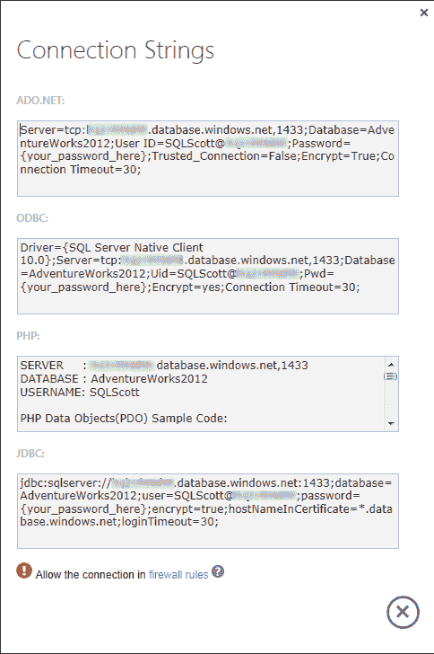

*图 5-1. 连接字符串*

#### 建立连接

让我们首先看看如何使用 `ADO.NET` 连接到 `SQL 数据库` 实例。启动 `Visual Studio 2010` 实例，并创建一个新的 `C#` `Windows 窗体` 应用程序。然后，按照以下步骤操作：

1.  在 `Form1` 上放置一个按钮，然后双击新按钮以查看其 `Click` 事件。

2.  在向单击事件放置任何代码之前，您需要声明以使用适当的 `SqlConnection` 类：

```
using System.Data.SqlClient;
```

3.  接下来，让我们添加一个方法来获取连接字符串。为了演示连接到 `SQL 数据库` 与本地数据库的区别，让我们首先连接到本地数据库副本。然后，您将更改连接字符串以连接到 `SQL 数据库` 实例。在单击事件下方，添加一个名为 `GetConString` 的新方法，该方法返回本地 `SQL Server` 实例的连接字符串。如果您有命名实例，请确保正确输入服务器名称（使用转义字符）。需要编写的代码如下：

```
string GetConString()
{
    return "Server=server;Database=AdventureWorks2012;User ID=sa;Password=password;";
}
```

4.  回到按钮的单击事件，并添加以下代码。此代码调用您之前添加的 `GetConString` 方法，返回连接字符串，建立并打开到本地数据库的连接，然后关闭连接：

```
private void button1_Click(object sender, EventArgs e)
{
    string connStr = GetConString();

    using (SqlConnection conn = new SqlConnection(connStr))
    {
        try
        {
            conn.Open();
            MessageBox.Show("连接已建立。");
        }
        catch (SqlException ex)
        {
            MessageBox.Show(ex.Message.ToString());
        }
        finally
        {
            conn.Close();
        }
    }
}
```

5.  运行应用程序，并单击窗体上的按钮。您应该会看到一个消息框显示“连接已建立。”

现在，让我们将这个简单的应用程序更改为连接到 `SQL 数据库`。您希望返回 `ADO.NET` 连接字符串，而不是本地数据库的连接字符串。继续如下：

6.  回到您的 `Visual Studio` 项目中，在 `GetConString` 方法中粘贴您之前从 `Windows Azure 管理门户` 复制的 `SQL 数据库` `ADO.NET` 连接字符串，如下面的代码所示。确保在连接字符串中输入正确的密码：

```
string GetConString()
{
    return "Server=tcp:servername.database.windows.net;Database=AdventureWorks2012; UserID=username@servername;Password=password; Trusted_Connection=False;Encrypt=True;Connection Timeout=30";
}
```

7.  在运行应用程序之前，请确保您的 `Azure` 防火墙设置是最新的（通过 `SQL 数据库服务器管理` 页面）。然后运行应用程序并单击窗体上的按钮。如果一切配置正确，您应该会看到一个消息框显示“连接已建立。”


诚然，这是一个非常简单的例子，但它说明了将现有应用程序指向 SQL Database 是多么容易。需要注意的问题在于你的应用程序包含什么。如前所述，如果你有任何内联 T-SQL，至少需要确保其语法得到 SQL Database 的支持。通常情况下它是兼容的，但检查并`测试`始终是最稳妥的做法。

即使你已连接到 SQL Database，这会影响你的数据访问代码吗？接下来的两节将讨论连接到 SQL Azure 时使用数据读取器和数据集。

#### 使用数据读取器

随着你对 SQL Database 越来越熟悉，你会发现除了可能需要修改内联 T-SQL 外，几乎不需要对应用程序代码做太多改动。这一切的美妙之处在于，你正在使用一种久经考验且值得信赖的数据访问技术——ADO.NET。因此，实际上没有改变什么。让我们修改应用程序和点击事件代码来说明这一点。请按以下步骤操作：

1.  向窗体添加一个新的列表框。

2.  在点击事件中，添加以下代码片段中**粗体**显示的代码。这段新代码使用 `SqlDataReader` 类对 SQL Database 实例执行一个简单的 `SELECT` 命令，然后遍历 `SqlDataReader` 来填充列表框：

```
private void button1_Click(object sender, EventArgs e)
{
    string connStr = GetConString();
    using (SqlConnection conn = new SqlConnection(connStr))
    {
        SqlCommand cmd = new SqlCommand("SELECT FirstName, LastName FROM Person.Person", conn);
        conn.Open();
        SqlDataReader rdr = cmd.ExecuteReader();
        try
        {
            while (rdr.Read())
            {
                listBox1.Items.Add(rdr[0].ToString());
            }
            rdr.Close();
        }
        catch (SqlException ex)
        {
            MessageBox.Show(ex.Message.ToString());
        }
    }
}
```

3.  运行应用程序，点击窗体上的按钮。几秒钟内，列表框就会填满来自 Users 表的姓名。

[www.it-ebooks.info](http://www.it-ebooks.info/)

# 第 5 章 ■ 使用 SQL 数据库编程

关键在于，你可以用本地连接字符串替换它，并且仍然有效。这是因为你使用 ADO.NET 来处理连接，而它并不关心数据库在哪里。接下来，让我们把这个例子再推进一步，看看如何使用数据集。

#### 使用数据集

在上一个例子中，你发现使用 `SqlDataReader` 查询 SQL Database 实例时语法没有差异。这个例子使用 `SqlCommand` 类和 `SqlDataAdapter` 来查询 SQL Database 并填充数据集。步骤如下：

1.  在按钮的点击事件中，用以下代码替换现有代码：

```
using (SqlConnection conn = new SqlConnection(connStr))
{
    try
    {
        using (SqlCommand cmd = new SqlCommand())
        {
            conn.Open();
            SqlDataAdapter da = new SqlDataAdapter();
            cmd.CommandText = "SELECT FirstName, LastName FROM Person.Person";
            cmd.Connection = conn;
            cmd.CommandType = CommandType.Text;
            da.SelectCommand = cmd;
            DataSet ds = new DataSet("Person");
            da.Fill(ds);
            listBox1.DataSource = ds.Tables[0];
            listBox1.DisplayMember = "FirstName";
        }
    }
    catch (SqlException ex)
    {
        MessageBox.Show(ex.Message.ToString());
    }
}
```

这段代码创建了一个新连接，使用与上一个示例相同的连接信息，然后创建了一个新的 `SqlCommand` 实例。设置好 `SqlCommand` 的连接、文本和类型后，使用实例化的 `SqlDataAdapter` 来执行它。创建一个新的数据集并从 `SqlDataAdapter` 填充，然后将其应用到列表框的数据源属性。

2.  运行应用程序，点击窗体上的按钮。同样，列表框会填满来自 SQL Database 实例中 Users 表的姓名。同样，你可以将连接字符串更改指向本地数据库，代码也能正常工作。

那么，什么样的代码会*不*工作呢？假设你的应用程序包含如下代码，该代码创建了一个没有聚集索引的表：

```
using (SqlConnection conn = new SqlConnection(connStr))
{
    try
    {
        using (SqlCommand cmd = new SqlCommand())
        {
            // 代码不完整，但原文如此
        }
    }
}
```

[www.it-ebooks.info](http://www.it-ebooks.info/)


# 第 5 章：使用 SQL 数据库编程

### ODBC

这里的内容虽然并非惊天动地或具有革命性，但让我们通过一个示例来了解 ODBC 连接如何工作，并展示您的 ODBC 类仍能像您习惯的那样正常工作。请遵循以下步骤：

1.  以正确的方式操作，创建一个枚举来处理您正在使用的连接类型。
2.  如以下代码片段所示，修改 `GetConString` 方法以接受一个参数。该参数允许您指定连接类型，以便返回正确的连接字符串（ADO.NET 或 ODBC）。请务必使用您正确的密码、用户名和服务器名称以及正确的服务器。如果将 `ADO_NET` 值传入此方法，则返回 ADO.NET 连接字符串；否则返回 ODBC 连接字符串：

    ```csharp
    enum ConnType
    {
        ADO_NET = 1,
        ODBC = 2
    }

    string GetConString(ConnType connType)
    {
        if (connType == ConnType.ADO_NET)
            return "Server=tcp: *servername*.database.windows.net;Database=AdventureWorks2012; User ID= *username*@ *servername*;Password= *password*;Trusted_Connection=False;Encrypt=True;";
        else
            return "Driver={SQL Server Native Client 10.0};Server=tcp: *servername*.database.windows.net;Database=AdventureWorks2012;Uid= *username*@servername;Pwd= *password*;Encrypt=yes;";
    }
    ```

3.  将以下声明添加到项目中：
    `using System.Data.Odbc;`

4.  在窗体上放置第二个按钮以及一个 `DataGridView`。在其点击事件中，添加以下代码。这段代码与 ADO.NET 示例中的代码类似，但它使用的是 `Odbc` 数据类而非 `Sql` 数据类。为了清晰起见，请将这个新按钮的 `Text` 属性更改为“ODBC”，以便您区分此按钮和第一个按钮。
    注意代码中将值“ODBC”传递给 `GetConString` 方法，从而返回 ODBC 连接字符串：

    ```csharp
    string connStr = GetConString(ConnType.ODBC);
    using (OdbcConnection conn = new OdbcConnection(connStr))
    {
        try
        {
            conn.Open();
            OdbcDataAdapter da = new OdbcDataAdapter();
            OdbcCommand cmd = new OdbcCommand("SELECT FirstName, LastName FROM Person.Person", conn);
            cmd.CommandType = CommandType.Text;
            da.SelectCommand = cmd;
            DataSet ds = new DataSet("Person");
            da.Fill(ds);
            listBox1.DataSource = ds.Tables[0];
            dataGridView1.DataSource = ds.Tables[0];
            listBox1.DisplayMember = "FirstName";
        }
        catch (OdbcException ex)
        {
            MessageBox.Show(ex.Message.ToString());
        }
    }
    ```

5.  在运行项目之前，您需要修改第一个按钮背后的代码，以传递适当的 `Enum` 并返回正确的连接字符串。在 `Button1` 背后代码的开头添加以下行：
    `string connStr = GetConString(ConnType.ADO_NET );`

尽管此代码完全有效，并且可以在您本地的 SQL Server 实例上成功运行，但当针对 SQL Database 实例执行时，它却无法工作。为什么？请继续将按钮点击事件中的代码替换为此代码，并运行应用程序。您将在消息框中收到的错误表明：不支持没有聚集索引的 SQL Database 表。如果您逐步调试代码，会发现表确实创建了，但错误来自于尝试向表中插入数据。您需要检查您的应用程序，寻找这类问题，以确保应用程序能够成功针对 SQL Database 运行。

我们已经讨论了使用 ADO.NET 连接以及我们在 ADO.NET 中拥有的不同选项，现在让我们继续探讨另一种连接选项，ODBC。


# 第 5 章 ■ 使用 SQL 数据库编程

## 6. 运行项目并点击 ODBC 按钮
运行项目，并点击`ODBC`按钮。与之前的示例一样，列表框会填充来自`Person.Person`表的姓名。网格也会填充相同的姓名集（参见图 5-2）。

**图 5-2.** 包含数据的完成窗体

从这些示例中，你可以看到，连接和查询 SQL 数据库与连接本地 SQL Server 实例并无不同。本章末尾将讨论一些指导原则和最佳实践，以帮助你为迁移到 SQL 数据库做好准备。

到目前为止，我们已经讨论了使用`ADO.NET`和`ODBC`进行连接，以及它们各自的不同选项，因此让我们继续讨论，谈谈使用`sqlcmd`实用工具。

### sqlcmd
如果你使用 SQL Server 已有相当长的时间，很可能你已经使用过`sqlcmd`实用工具。该实用工具允许你通过命令提示符输入和执行`T-SQL`语句及其他对象。你也可以通过`sqlcmd`模式下的查询编辑器、Windows 脚本文件或 SQL Server 代理作业来使用`sqlcmd`实用工具。

本节将讨论如何使用`sqlcmd`实用工具连接到 SQL 数据库实例并针对该数据库执行查询。本节假设你对`sqlcmd`有一定了解。该实用工具有许多选项或参数，但本节仅讨论连接到 SQL 数据库所必需的那些选项。

[www.it-ebooks.info](http://www.it-ebooks.info/)

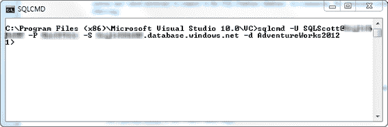

# 第 5 章 ■ 使用 SQL 数据库编程

> **注意：** SQL 数据库不支持用于更改用户密码的`-z`或`-Z`选项。你需要先连接到`master`数据库，然后使用`ALTER LOGIN`来更改密码。

要使用`sqlcmd`实用工具，你首先需要打开一个命令提示符。在命令提示符处，你需要提供连接到 SQL 数据库实例所需的选项和值。至少，命令语法如下：
```
sqlcmd -U 登录名 -P 密码 -S 服务器 -d 数据库
```
这些参数几乎是不言自明的，但这里还是列出来，以防万一：

*   `-U` 是用户登录 ID。
*   `-P` 是用户指定的密码。密码区分大小写。
*   `-S` 指定要连接的 SQL Server 实例。

可选地，你可以通过`-d`参数提供数据库名称。因此，`sqlcmd`语法看起来像下面这样：
```
sqlcmd -U providerlogin@server -P ProviderPassword -S ProviderServer -d database
```
让我们来实际应用这个语法。请按照以下步骤操作：

在命令提示符处，使用`sqlcmd`语法并输入你的连接信息，如图 5-3.所示（图中，服务器名称和密码已被隐藏）。按 Enter 键。

**图 5-3.** 通过 sqlcmd 连接

当`sqlcmd`实用工具连接成功后，会出现`sqlcmd`提示符`1>`，此时你可以开始输入并执行`T-SQL`命令。执行任何`T-SQL`语句的命令是`GO`。例如，在图 5-4 中，输入并执行了以下`SELECT`语句：`SELECT FirstName, LastName FROM Person.Person`

[www.it-ebooks.info](http://www.it-ebooks.info/)

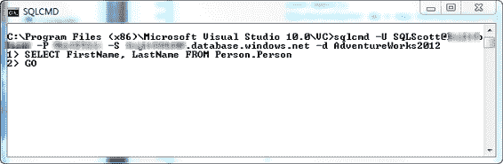

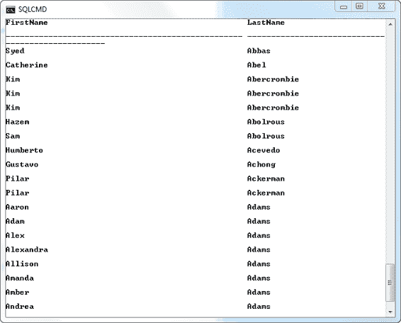

# 第 5 章 ■ 使用 SQL 数据库编程

**图 5-4.** 执行 SELECT 查询

在行`1>`处按 Enter 键创建新行并执行`SELECT`查询。在行`2>`输入`GO`并按 Enter 键，以执行自上次`GO`语句以来的所有语句（参见图 5-4）。图 5-5 显示了输入的`sqlcmd`查询的结果。如你所见，执行查询并不困难。

**图 5-5.** Sqlcmd 查询结果

[www.it-ebooks.info](http://www.it-ebooks.info/)

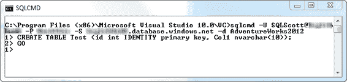

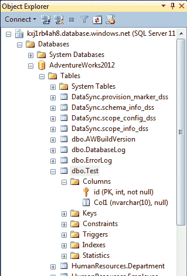

# 第 5 章 ■ 使用 SQL 数据库编程

让我们再看一个例子，在其中创建一个表并添加数据。步骤如下：

1.  在上一个查询完成后，你回到了`1>`提示符处。输入图 5-6 所示的语句。
    **图 5-6.** 创建表
2.  按 Enter 键，在行`2>`输入`GO`，然后再次按 Enter 键，以执行`CREATE`语句。
3.  当你执行的`T-SQL`命令是不返回数据的类型时，`sqlcmd`实用工具不会返回消息，而是将你带到`1>`提示符。但是，你可以通过进入 SQL Server Management Studio (`SSMS`)，连接到你的 SQL 数据库实例，并展开所选数据库的`Tables`节点来验证语句是否执行成功。图 5-7 显示了这样做的结果——你可以看到表确实已经创建。
    **图 5-7.** 在 SSMS 中查看新表

[www.it-ebooks.info](http://www.it-ebooks.info/)

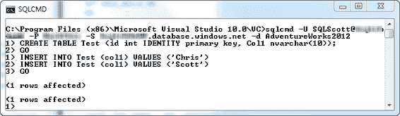

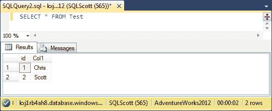

# 第 5 章 ■ 使用 SQL 数据库编程

你创建的表名为`Test`，它有两列：一个作为主键（聚集索引）的`ID`列，和一个`nvarchar`类型的`Col1`列。这个表很简单，但足以演示功能。

> **注意：** 根据本章前面的内容，你知道`ID`列必须是主键聚集索引，否则你将无法向表中添加数据。

4.  通过返回命令窗口并输入图 5-8 所示的`INSERT`语句，向表中添加一些数据。`sqlcmd`实用工具的一大优点是，你可以输入任意多的命令，直到你输入`GO`之前它们都不会执行。这里你使用了两个`INSERT`语句，向你在上一步创建的表中添加两条记录。
    **图 5-8.** 通过 sqlcmd 插入行
5.  在行`3>`输入`GO`，然后按 Enter 键。尽管`sqlcmd`实用工具提示`1 rows affected`，但你可以在`SSMS`中查询这个新表，看到添加的两行新数据，如图 5-9 所示。
    **图 5-9.** 通过 SSMS 查看结果

[www.it-ebooks.info](http://www.it-ebooks.info/)

# 第 5 章 ■ 使用 SQL 数据库编程

如你所见，使用`sqlcmd`实用工具非常直接。只需记住，如果你试图使用堆表，它无法与 SQL 数据库一起工作。所有表都必须有一个主键。另外，如前所述，`-z`和`-Z`参数不起作用。

本节讨论了连接和查询 SQL 数据库的不同机制，包括`ADO.NET`、`ODBC`和`sqlcmd`的示例。你可以看到连接过程与你当前连接和查询本地数据库的方式非常相似。然而，考虑到整个行业向`SOA`架构的推动，让我们将讨论提升到一个新的水平，看看如何使用服务，特别是`WCF 数据服务`，来连接到我们的 Azure 数据库。

### WCF 数据服务
`WCF 数据服务`（以前称为`ADO.NET 数据服务`）是支持创建和使用`OData`服务的工具。`OData`（开放数据协议）是一种新的数据共享标准，允许在不同系统之间更广泛地共享数据。在它被称为`WCF 数据服务`之前，`ADO.NET 数据服务`是最早支持`OData`的 Microsoft 技术之一，随 Visual Studio 2008 `SP1`推出。Microsoft 已经在 SQL Server 2008 R2、Windows Azure Storage 等产品中扩展了对`OData`的支持。本节将讨论如何使用`WCF 数据服务`连接和查询你的 SQL 数据库实例。

#### 创建数据服务
首先，你需要创建一个数据服务。请按照以下步骤操作：

1.  启动 Visual Studio（为安全起见，以管理员身份运行 Visual Studio），并创建一个新的 C#


1. 首先，在 Visual Studio 中创建一个新的 ASP.NET Web 应用程序（在“新建项目”对话框中，从已安装的模板列表中选择“Web”选项），并将其命名为`WCFDataServiceWebApp`。（您可以将数据服务承载在多种不同的环境中，但本示例使用 Web 应用程序。）

2. 在关系型数据库之上创建数据服务的下一个步骤是定义用于驱动数据服务层的模型。最佳方法是使用 ADO.NET Entity Framework，它允许您将实体模型公开为数据服务。为此，您需要向 Web 项目添加一个新项。右键单击 Web 项目并选择“新建项”。在“添加新项”对话框中，从“类别”列表中选择“数据”，然后从“模板”列表中选择“ADO.NET 实体数据模型”。将模型命名为`AW.edmx`，然后单击“确定”。

3. 在“数据模型向导”的第一步中，选择“从数据库生成”选项，然后单击“下一步”。

4. 下一步是“选择您的数据连接”。单击“新建连接”按钮，并创建到`AdventureWorks2012` SQL 数据库实例的连接。在连接对话框中单击“确定”。

5. 回到“实体数据模型向导”中，选择“是的，在连接字符串中包含敏感数据”选项。将实体连接设置保存为`AdventureWorks2012Entities`，然后单击“下一步”。

6. 向导的下一步是“选择数据库对象”页面。选择`Person.Person`表。注意用于复数化或单数化生成对象名称的选项。如果保留此选项为勾选状态，它将在后续步骤中生效。保持其勾选状态，并单击“完成”。

7. Entity Framework 会查看您选择的所有表，并在您即将公开为数据服务的存储架构之上创建一个概念模型。在 Visual Studio 中，您应该会看到 Entity Framework 模型设计器，其中以图形方式表示了您选择的表，称为 `entities`。关闭模型设计器——在本示例中您不需要它。

    [www.it-ebooks.info](http://www.it-ebooks.info/)
    
    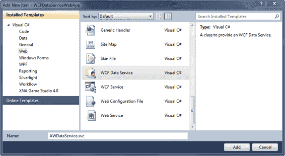
    
    **第 5 章 ■ 使用 SQL 数据库编程**

8. 现在您需要做的是在您的数据模型之上创建数据服务。在解决方案资源管理器中右键单击 Web 应用程序并选择“添加”；然后选择“新建项”。在“添加新项”对话框中，选择“Web”类别，然后向下滚动模板列表并选择“WCF 数据服务”模板。输入名称`AWDataService`，然后单击“添加”，如图 5-10 所示。
    
    **图 5-10.** *向解决方案添加 WCF 数据服务*
    
    当 ADO.NET 数据服务添加到您的项目后，关联的`.cs`文件将自动在 IDE 中显示。如您所见，ADO.NET 数据服务模板已为您生成了数据服务的初始框架。

    ### 将服务连接到模型
    
    现在，您需要将数据服务连接到数据模型，以便服务知道从何处获取数据。您知道在哪里进行此操作，因为在代码中可以看到它指示了输入该信息的位置。因此，将行：
    
    ```csharp
    public class AWDataService : DataService< /* TODO: put your data source class name here */ >
    ```
    
    改为：
    
    ```csharp
    public class AWDataService : DataService< AdventureWorks2012Entities >
    ```
    
    将数据服务连接到模型就是这么简单。信不信由你，您已经准备好测试您的服务了。
    
    不过，让我们先完成在此页面上需要做的工作。默认情况下，WCF 数据服务是受保护的。需要明确告知 WCF 数据服务您希望看到哪些数据。代码中的说明告诉您这一点，正如您在`InitializeService`方法中的代码所见。注释中甚至提供了一些示例来帮助您。

    [www.it-ebooks.info](http://www.it-ebooks.info/)
    
    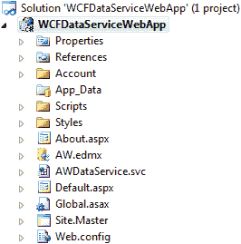
    
    **第 5 章 ■ 使用 SQL 数据库编程**
    
    对于您的示例，您不想限制任何内容，因此您确实希望解锁所有实体并显式定义对实体集的访问权限。您可以通过向`InitializeService`方法添加以下代码来实现此目的。
    
    此代码将指定实体的访问规则设置为`All`，从而为指定的实体集授予读取、写入、删除和更新数据的权限：
    
    ```csharp
    // 此方法仅调用一次以初始化服务范围的策略。
    public static void InitializeService(DataServiceConfiguration config)
    {
        // TODO: 设置规则以指示哪些实体集和服务操作可见、可更新等。
        // 示例：
        config.SetEntitySetAccessRule("People", EntitySetRights.All);
        config.DataServiceBehavior.MaxProtocolVersion = DataServiceProtocolVersion.V2;
    }
    ```
    
    如果您不想逐一指定每个实体，也可以选择使用单行代码指定所有实体，如下所示：
    
    ```csharp
    config.SetEntitySetAccessRule("*", EntitySetRights.All);
    ```
    
    此行假设您希望对所有实体指定相同的权限。这不推荐，但对于本示例是可行的。在生产环境中，您会希望对每个实体指定的权限更加具体。
    
    还有其他`EntitySetRights`选项，例如`AllRead`、`AllWrite`、`None`、`ReadSingle`和`WriteAppend`。本章不会全部涵盖它们，但您可以在这里阅读有关它们的信息：
    
    [`msdn.microsoft.com/en-us/library/system.data.services.entitysetrights.aspx`](http://msdn.microsoft.com/en-us/library/system.data.services.entitysetrights.aspx)
    
    到目前为止，您已经创建了 Web 应用程序，添加了数据模型，并添加了 WCF 数据服务。现在，您的解决方案资源管理器应如图 5-11 所示。
    
    **图 5-11.** *解决方案资源管理器中看到的带有数据服务的 Web 应用程序*

    [www.it-ebooks.info](http://www.it-ebooks.info/)
    
    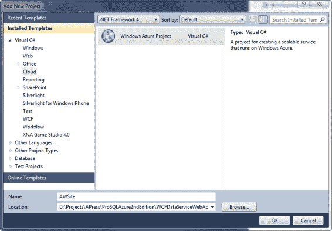
    
    **第 5 章 ■ 使用 SQL 数据库编程**

    ### 创建客户端应用程序
    
    下一步是添加客户端应用程序。在解决方案资源管理器中右键单击解决方案并选择“添加新建项目”。
    
    在“添加新建项目”对话框中，选择“Cloud”项目类型，然后选择“Windows Azure 项目”，提供名称`AWSite`，如图 5-12 所示。
    
    **图 5-12.** *添加 Azure 云服务*
    
    在“添加新建项目”对话框中单击“确定”。
    
    接下来，在“新建云服务项目”对话框中，选择“ASP.NET Web 角色”将其添加到“云服务解决方案”窗格中，保留默认名称`WebRole1`，然后单击“确定”。
    
    接下来，在解决方案资源管理器中右键单击 Web 角色项目，并从上下文菜单中选择“添加服务引用”。这将显示如图 5-13 所示的“添加服务引用”对话框。

    [www.it-ebooks.info](http://www.it-ebooks.info/)
    
    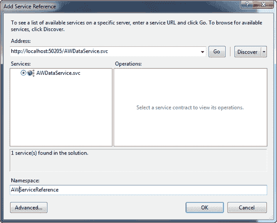
    
    **第 5 章 ■ 使用 SQL 数据库编程**
    
    **图 5-13.** *添加服务引用*
    
    在“添加服务引用”对话框中，单击“发现”按钮，该按钮将查询您的解决方案中是否存在现有服务，并在“服务”列表中显示它们。如图 5-13 所示，发现功能确实在您的 Web 应用程序项目中找到了您的`AWDataServices`服务。发现功能还提供了服务的本地 URI 以及服务公开的实体。为服务提供命名空间名称`AWServiceReference`，然后单击“确定”。
    
    此时，您的解决方案资源管理器将包含`AWSite`云服务项目、`WCFDataServiceWebApp`项目和您的 Web 角色。您应该看到它们如图 5-14 所示。

    [www.it-ebooks.info](http://www.it-ebooks.info/)
    
    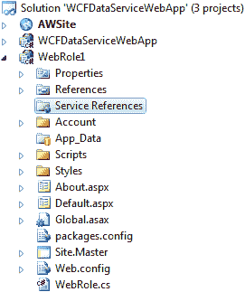
    
    **第 5 章 ■ 使用 SQL 数据库编程**
    
    **图 5-14.** *解决方案资源管理器中的项目*
    
    这是一个相当详细的示例，但让我们讨论一些连接到 Windows Azure SQL 数据库时与应用程序相关的最佳实践。

    ### 最佳实践


# 为云开发应用程序的注意事项

## 连接安全与实现

首先，我们来谈谈为云开发应用程序时需要考虑的一些事项。本章大部分内容都在讨论如何连接到 SQL Database，但在开始编码之前，你首先应该考虑的是你的连接。

首要任务是保护你的连接字符串，使其免受注入攻击和中间人攻击。.NET Framework 提供了一个简单的类，用于创建和管理 `SqlConnection` 类使用的连接字符串内容，这就是 `SqlConnectionStringBuilder` 类。

以下示例展示了如何使用此类。首先定义四个静态变量来保存用户名、密码、数据库名称和服务器：

```csharp
private static string userName = "SQLScott@server";
private static string userPassword = "password";
private static string dataSource = "tcp:server.database.windows.net";
private static string dbName = "AdventureWorks2012";
```

然后修改 `GetConString` 方法，以使用 `SqlConnectionStringBuilder` 类动态构建连接字符串：

```csharp
string GetConString(int connType)
{
    if (connType == 1)
    SqlConnectionStringBuilder connstr = new SqlConnectionStringBuilder();
    connstr.DataSource = dataSource;
    connstr.InitialCatalog = dbName;
    connstr.Encrypt = true;
    connstr.TrustServerCertificate = false;
    connstr.UserID = userName;
    connstr.Password = userPassword;
    return connstr.ToString();
    ...
}
```

因此，在连接到 SQL Database 实例时，请考虑以下几点：

- 使用 `SqlConnectionStringBuilder` 类以避免注入攻击。此类有助于防止用户 ID 和密码被窥探并用于攻击。
- 虽然所有 SQL Database 流量都通过端口 443 加密传输，但请务必将 `Encrypt` 参数设置为 `True`，并将 `TrustServerCertificate` 设置为 `False`，以确保连接正确加密，避免任何中间人攻击。
- 尽可能使用 MARS（多活动结果集）以减少访问数据库的次数。
- 使用连接池以通过减少必须打开新数据库连接的次数来提高代码效率和应用程序性能。Windows Azure SQL Database 会自动终止空闲超过 30 分钟的连接。最佳实践是设计应用程序，使其连接晚打开、早关闭。

最后，我们来讨论一些连接限制。

### 瞬态故障处理应用程序块

瞬态故障处理应用程序块提供了一组可重用组件，用于向应用程序中添加重试逻辑。这些组件可与许多 Windows Azure 服务（如 SQL Database、存储、服务总线和缓存）一起使用。这些组件通过向应用程序添加强大的瞬态故障处理逻辑，提供了应用程序所需的弹性。

瞬态故障是由于某些临时条件（如网络连接问题或服务不可靠）而发生的错误。在大多数情况下，只需等待一小段时间然后重试操作，即可成功完成操作。

这就是瞬态故障处理应用程序块的用武之地。瞬态故障处理应用程序块（以下简称 `TFHAB`）是 Microsoft 企业库的一部分。它是 Microsoft 模式与实践小组和 Windows Azure 客户顾问团队紧密合作的成果。

`TFHAB` 通过使用检测策略来识别所有已知的瞬态错误条件，使开发人员能够基于内置的重试策略轻松定义重试策略。

`TFHAB` 包含三种内置重试策略，开发人员可以利用它们在应用程序中实现一致的重试行为。这三种内置重试策略基于时间间隔：

- **固定**：在重试之间等待固定的时间。
- **增量**：每次重试后，等待时间增加 1。
- **指数退避**：在重试之间，等待时间呈指数增长。

你稍后将看到每种策略的示例。

#### 将瞬态故障处理应用程序块添加到你的项目中

`TFHAB` 是一个 NuGet 包，通过 Visual Studio 中的包管理器控制台添加。但是，在使用包管理器控制台之前，需要安装 NuGet。打开浏览器并导航到 NuGet 网站：`http://nuget.org/`。在主页上，单击“安装 NuGet”按钮。NuGet 支持 Visual Studio 2010 和 2012。

安装 NuGet 后，打开 Visual Studio 并创建一个新的 Windows 窗体应用程序。项目创建后，从 Visual Studio 的“工具”菜单中，选择“库包管理器”>“包管理器控制台”。

在控制台窗口中，键入以下命令（如图 5-15 所示）以安装瞬态故障处理应用程序块：

```
Install-Package EnterpriseLibrary.WindowsAzure.TransientFaultHandling
```

键入安装命令后按 Enter。相应的程序集和引用将被添加到你的项目中。安装完成后，在解决方案资源管理器中展开“引用”节点，你将看到项目中添加了超过六个新的 `Microsoft.Practices` 引用。

**图 5-15.** 在包管理器控制台中添加 `TFHAB`

### 使用瞬态故障处理应用程序块

安装 `TFHAB` 后，首先需要向代码中添加几条指令：

```csharp
using Microsoft.Practices.EnterpriseLibrary.WindowsAzure.TransientFaultHandling.SqlAzure;
using Microsoft.TransientFaultHandling;
```

这些指令与任何其他指令一样，它们允许使用命名空间中的类型。接下来要做的是定义重试策略。此策略简单地定义了重试命令的次数、重试之间的等待时间长度以及若干退避时间。设置起来实际上非常简单，只需一行代码：

```csharp
RetryPolicy myretrypolicy = new RetryPolicy<SqlAzureTransientErrorDetectionStrategy>(3, TimeSpan.FromSeconds(3));
```

`RetryPolicy` 构造函数有五个重载，如图 5-16 所示，但最常用的重载接受两个参数：重试次数和重试之间的等待时间。

**图 5-16.** 重试策略构造函数

此示例简单地将尝试次数定义为三，并将重试间隔设置为三秒。定义重试策略后，可以通过 `ReliableSqlConnection` 类将其应用于连接。此类提供了一种可靠地打开连接并执行命令的方法。

`ReliableSqlConnection` 类也有三个重载：连接字符串、应用于连接的已定义重试策略，以及可选的命令。

向 Button2 添加以下代码，该代码使用 `ReliableSqlConnection` 类并将重试策略应用于连接和命令：

```csharp
using (ReliableSqlConnection cnn = new ReliableSqlConnection(connString, myretrypolicy, myretrypolicy))
{
    try
    {
        cnn.Open();
        using (var cmd = cnn.CreateCommand())
        {
            cmd.CommandText = "SELECT * FROM HumanResources.Employee";
            using (var rdr = cnn.ExecuteCommand<IDataReader>(cmd))
            {
                //
            }
        }
    }
    catch (Exception ex)
    {
        MessageBox.Show(ex.Message.ToString());
    }
}
```


# 第 6 章 SQL 报告

## 总结

本章首先讨论了部署应用程序的不同因素，例如将应用程序保留在本地或在 Azure 中托管。我们还从数据库端介绍了应用程序迁移，提供了将数据库迁移到云端时需要考虑的一些想法和概念，例如要移动多少数据。

接着我们讨论了连接和查询 SQL 数据库实例的不同编程方法，为每种方法提供了示例，包括 ADO.NET 和 ODBC。

然后，我们探讨了通过 WCF 数据服务访问 SQL 数据库实例的方法。鉴于当今不仅来自 Microsoft，整个业界都对 SOA 架构有强烈重视，对 WCF 数据服务的讨论为您的 SQL 数据库实例提供了服务层的坚实基础。

最后，我们讨论了一些关键的最佳实践，例如在应用程序中实现重试策略，这可以极大地改善最终用户体验，并为基于云的应用程序增添所需的弹性。

除了重试，我们还讨论了其他最佳实践，包括连接池和使用`SqlConnectionStringBuilder`类。对所有应用程序开发（无论其是否基于云）而言，一个重要的组成部分是故障处理和重试逻辑的实现。本章花了些篇幅介绍重试逻辑，因为它对基于云的应用程序至关重要。如果实现了所有这些最佳实践，将有助于确保应用程序运行良好。

[www.it-ebooks.info](http://www.it-ebooks.info/)

## SQL 报告概述

SQL 报告是一个基于经过验证的 SQL Server Reporting Services 构建的云端报告平台。简而言之，SQL 报告就是作为高可用云服务运行的 SQL Server Reporting Services。

这意味着几件事情。首先，您不需要安装自己的 Reporting Services 实例，也不需要维护这些实例（例如应用更新）。其次，作为 SQL 数据库平台的一部分，SQL 报告可以利用 Azure 平台的优势，为您的报告服务提供高可用性和可扩展性。第三，您可以使用与当前用于构建本地报告相同的熟悉工具来构建报告。最后，开发人员可以将报告作为基于 Windows Azure 解决方案的集成部分交付。

在本地环境中，配置一个新的 SQL Server Reporting Services 服务器通常需要多长时间？即使您有一台备用服务器，将该服务器添加到您的 SQL Server 环境通常也需要几个小时。如果能在几分钟内配置一个新的报告服务器会怎样？现在，借助 SQL 报告，您可以在享受 Azure 平台优势（让 Microsoft 管理物理管理）的同时做到这一点。

使用 SQL 报告，您可以快速轻松地配置和部署报告解决方案，同时利用 Windows Azure 平台的企业级可用性、可扩展性和安全性。

通过介绍这些内容后，了解 SQL 报告的架构将有助于您了解 SQL Database 中报告的工作原理。

## 架构

SQL 报告服务的架构内置了负载均衡和高可用性。图 6-1 展示了 SQL 报告架构的不同组件，我们将对此进行讨论。

*图 6-1. SQL 报告服务 架构*

每个 SQL 报告报告都通过服务端点访问，并引用特定报告。请注意，这与访问本地报告服务器没有什么不同，只是在这种情况下，您访问的是服务端点而不是物理机器。

请求通过负载均衡器路由，该均衡器将请求进一步路由到架构中的两个应用层：

- 报告服务网关
- 报告服务节点

#### 网关

Reporting Services 网关处理所有智能元数据路由。例如，网关实现了智能路由，这意味着当报告请求进入时，每个请求都会被处理并发送到处理该请求的最佳可用报告服务器。这增强了系统可用性的安全性和控制。例如，如果一个报告（请求）导致特定节点故障，网关可以智能地停止向该特定 Reporting Services 节点路由请求。

#### 节点


这些节点是实际的报表服务器。它们被描述为**多租户**的，意味着每个节点拥有自己的 `catalog` 和 `tempDBs`（源自 SQL Database）。节点构建在 SQL Database 之上；因此，用于 SQL Reporting 的**数据层**是 SQL Database。

[www.it-ebooks.info](http://www.it-ebooks.info/)

# 第 6 章 ■ SQL REPoRTing

值得注意的是，网关所提供的服务与 SQL Database 智能元数据路由层的工作方式非常相似；事实上，SQL Reporting 架构中复现了其中一些设计模式。

### 功能比较

在进入本章的“动手实践”部分之前，先重点介绍 SQL Server Reporting Services 和 SQL Reporting 之间的一些异同点将非常有益（参见表 6-1）。

**表 6-1.** SQL Server Reporting Services 与 SQL Reporting 功能比较

| 类别 | SQL Server Reporting Services | SQL Reporting |
| :--- | :--- | :--- |
| 工具 | 商业智能开发工作室 (BIDS) | 商业智能开发工作室 (BIDS) |
| 数据源 | 内置或可自定义的数据源 | SQL Database 实例 |
| 报表管理 | 本机模式使用报表管理器，SharePoint 应用程序页面。 | Windows Azure 管理门户。 |
| 报表查看 | 可在浏览器、通过 Windows 窗体和 ASP.NET 的报表查看器中查看报表。 | 可在浏览器、通过 Windows 窗体、ASP.NET 和 SharePoint 的报表查看器中查看报表。 |
| 报表呈现 | 可将报表显示并呈现为不同格式。 | 可将报表显示并呈现为不同格式。 |
| 订阅 | 可创建订阅并计划投递。 | |
| 可扩展性 | 用于数据、处理、呈现、投递和安全性的自定义扩展 | 此版本不支持任何扩展。 |
| 安全模型 | Windows 身份验证及其他支持的身份验证 | SQL Database 用户名和密码身份验证 |

SQL Server Reporting Services 和 SQL Reporting 都具备通过角色分配向报表及相关项目应用权限的能力。

表 6-1 中的列表是一个简要的功能比较；此外，以下 SQL Server Reporting Services 功能目前在 SQL Reporting 中不受支持：

-   创建订阅或安排报表快照。
-   创建 SMDL 报表模型。
-   使用 Report Builder 1.0、2.0 或 3.0 创建报表。但是，您可以使用 3.0 版本创建报表，然后通过将其添加到 BIDS 中来部署报表。
-   不支持 SharePoint 集成模式。支持本机模式。

需要注意的是，报表管理器不可用，但 SQL Database Reporting 门户提供了类似功能。

是时候开始“动手实践”了，因此本章的剩余部分将讨论如何创建 SQL Reporting 服务器并将报表部署到该服务器。本章使用适用于 Windows Azure SQL Database 的完整 AdventureWorks 数据库。该数据库及其安装说明可在此处找到：

[`msftdbprodsamples.codeplex.com/releases/view/3704`](http://msftdbprodsamples.codeplex.com/releases/view/3704)

[www.it-ebooks.info](http://www.it-ebooks.info/)

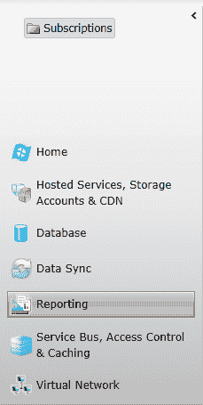

# 第 6 章 ■ SQL REPoRTing

下载名为 `AdventureWorks2012Full_SQLAzure` 的文件。安装说明也可在同一页面找到。下载文件是一个包含两种不同安装的压缩文件。请按照非联合版本的说明操作（您将在第 10 章中了解所有关于 SQL 联合的内容）。

## 配置您的 SQL Reporting 服务器

创建 SQL Reporting 服务器是一个简单快速的过程。需要注意的是，到目前为止，您大部分时间都在新的 Windows Azure 管理门户中。截至本文撰写时，SQL Reporting 和 SQL Data Sync 尚未迁移至使用新门户。短期内，当前基于 Silverlight 的门户将继续照常运行，以便在 SQL Reporting 和 SQL Data Sync 迁移到新门户之前，它们仍可访问。


打开你的网页浏览器，导航至 [`windows.azure.com/`](https://windows.azure.com/)，并使用你的 LiveID 登录。

## 配置 SQL Reporting 服务器

进入门户后，点击导航窗格中的 `Reporting` 选项。如果你之前创建过任何 SQL Reporting 服务器，它们会按订阅显示在导航窗格的顶部。图 6-2 显示了已选择 `Reporting` 选项但尚未创建任何服务器的导航窗格。

**图 6-2.** Windows Azure 门户导航窗格

你有两个创建服务器的选项。可以选择功能区上的 `创建` 按钮开始，或者点击门户的“项目列表”区域中的 `创建新的 SQL Reporting 服务器` 部分。无论哪种方式都会打开 `创建服务器` 对话框，如图 6-3 所示。

[www.it-ebooks.info](http://www.it-ebooks.info/)

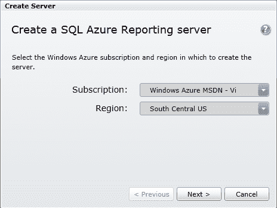

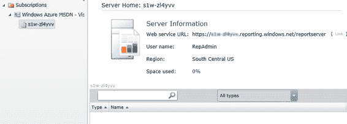

**图 6-3.** `创建服务器` 对话框

1.  选择用于配置服务器的 `订阅` 和 `区域`。点击 `下一步`。
2.  输入 `管理员` 用户名和 `密码`，然后点击 `完成`。你的 SQL Reporting 服务器将快速配置完成，届时管理门户将显示你的新服务器及相关信息，如图 6-4 所示。

**图 6-4.** 在管理门户中查看新的 SQL Reporting 服务器

请注意，服务器“名称”实际上是一个服务终结点。这是你在部署和访问报表时访问报表服务器的方式。

此时，你的服务器已配置完成并可以使用。在本章的剩余部分，你将创建一个报表并将其部署到新的 SQL Reporting 服务器。

[www.it-ebooks.info](http://www.it-ebooks.info/)

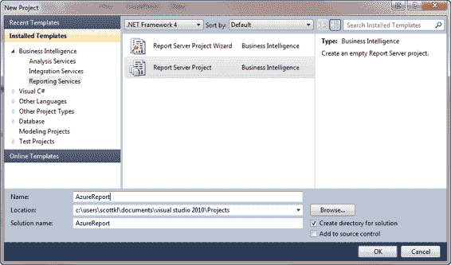

> **注意：** SQL Server Data Tools 是一个集成到 Visual Studio 中的集中统一开发环境，它允许数据库开发人员和数据库管理员在单个工具中执行所有数据库设计工作。

## 创建报表

创建从 SQL Database 访问数据的报表的过程与从本地数据访问数据的报表相同，只有一个细微差别：数据连接。本章中创建报表的示例将使用随 SQL Server 2012 安装的 SQL Server Data Tools。SQL Server Data Tools (`SSDT`) 是 SQL Server 2012 的新 `BIDS`（Business Intelligence Development Studio）。要创建报表，请按照以下步骤操作：
1.  从 `开始` 菜单中，选择 `所有程序` > `Microsoft SQL Server 2012` > `SQL Server Data Tools`。当 `SSDT` 打开时，创建一个新的 `报表服务器项目`。在 `新建项目` 对话框中选择 `Reporting Services` 模板，然后选择 `报表服务器项目`。在图 6-5 中，项目名为 `AzureReport`，但你可以随意更改名称。点击 `确定`。

    **图 6-5.** 新建报表服务器项目

2.  在 `解决方案资源管理器` 中，右键单击解决方案，然后从上下文菜单中选择 `添加` > `新建项`。
3.  在 `添加新项` 对话框中，选择 `报表` 模板，然后点击 `添加`，如图 6-6 所示。

[www.it-ebooks.info](http://www.it-ebooks.info/)

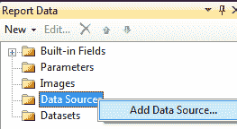

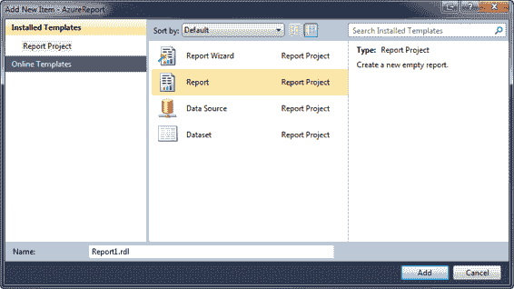

**图 6-6.** 添加报表

此时，你正面对一个空白报表，但同时也会看到 Visual Studio IDE 中显示了一个新的 `报表数据` 选项卡。你的任务是告诉报表从哪里获取数据，从 SQL Server 2008 R2 开始（并在 SQL Server 2012 中延续），通过 ADO.NET (`SqlClient`) 和 `OLE DB` 数据提供程序，这变得非常容易。

然而，SQL Server 2008 R2 及以上版本还增加了一个新的特定于 SQL Database 的提供程序。你很快就会看到。

### 创建 SQL Database 数据源

继续以下步骤：

1.  在 `报表数据` 窗口中，右键单击 `数据源` 节点，然后从上下文菜单中选择 `添加数据源`，如图 6-7 所示。


### `图 6-7.` 添加数据源

[www.it-ebooks.info](http://www.it-ebooks.info/)

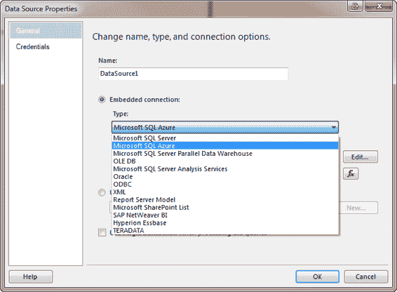

## 第 6 章 ■ SQL 报表

2.  在 `数据源属性` 对话框中，您可以定义连接的类型和连接属性。选择 `嵌入连接` 选项，然后单击 `类型` 下拉箭头。之前提到过，从 SQL Server 2008 R2 开始，包含了一个特定于 SQL Database 的提供程序，您在这里可以找到它以及其他数据源类型。如图 6-8 所示，选择用于 SQL Database 的新数据提供程序，称为 `Microsoft SQL Azure`（不然还能叫什么？）。

### `图 6-8.` 数据源属性对话框

当您选择此提供程序时，`连接字符串` 文本框默认为：

```
Encrypt=True;TrustServerCertificate=False
```

这两个参数及其关联值是为您默认设置的。建议您不要更改它们。`Encrypt` 参数指示，如果服务器安装了证书，SQL Server 将对服务器和客户端之间发送的所有数据使用 SSL 加密。`TrustServerCertificate` 属性告诉传输层使用 SSL 加密通道，并跳过验证证书链以建立信任。当 `Encrypt` 和 `TrustServerCertificate` 都设置为 `True` 时，即使此连接字符串中 `Encrypt` 参数的值设置为 `False`，也会使用 *服务器上* 指定的加密级别。

但是，即使设置了此默认字符串，您仍然需要添加 SQL Database 连接信息。

3.  单击 `编辑` 按钮打开 `连接属性` 对话框，如图 6-9 所示。输入您的 SQL Database 实例名称、用户名和密码。您现在应该知道，不能将 Windows 身份验证与 SQL Database 一起使用，因此请确保输入 SQL Database 帐户用户名和密码。

[www.it-ebooks.info](http://www.it-ebooks.info/)


## 第 6 章 ■ SQL 报表

### `图 6-9.` 连接属性对话框

4.  选择（或键入）您要从中提取数据的数据库，然后单击 `测试连接` 以确保所有设置正确。

5.  单击 `确定` 关闭此对话框并返回到 `数据源属性` 对话框。它现在应该如图 6-10 所示，显示了适当的连接类型和连接字符串。

[www.it-ebooks.info](http://www.it-ebooks.info/)


## 第 6 章 ■ SQL 报表

### `图 6-10.` 已完成的“数据源属性”对话框

诚然，这些步骤与连接到本地数据库的步骤没有什么不同。但是，尽管步骤相同，一些关键的选择组件是不同的，例如图 6-8 和图 6-9 中的部分，在那里您选择了特定的 `Microsoft SQL Azure` 提供程序和 SQL Database 特定的连接信息。

您的数据源定义还允许您指定用于连接到数据源的凭据。

在 `数据源属性` 对话框左侧选择 `凭据`，会显示四个选项：

*   Windows 身份验证（集成安全性）
*   提示输入凭据
*   使用此用户名和密码
*   不使用凭据

显然，您需要使用凭据，因此“不使用凭据”不是您想要的选项。而且 Azure 不支持集成安全性，所以那也不可行。您可以选择提示输入凭据或指定用户名和密码。默认值是提示输入凭据；如果您保留该设置，报表将在每次运行报表时提示您输入用户名和密码。

6.  最佳实践建议，在生产环境中，您应该使用集成安全性。但由于 SQL Database 不支持此选项，请选择 `指定用户名和密码` 选项，并输入有权访问相应数据库的帐户的用户名和密码。


# 第 6 章 SQL Reporting

[www.it-ebooks.info](http://www.it-ebooks.info/)


## 创建数据集

创建数据源后，现在需要为报告添加数据集。每个数据源可以创建一个或多个数据集。每个数据集指定您希望在报告中使用的数据源字段。数据集还包含（除其他事项外）用于获取数据的查询以及用于筛选数据的任何查询参数。

7.  在“报告数据”窗口中，右键单击“数据集”节点，然后从上下文菜单中选择“添加数据集”。这样将打开“数据集属性”窗口，如图 6-11 所示。
8.  “数据集属性”窗口的“查询”页面允许您执行两个主要操作：指定此数据集所基于的数据源，以及指定查询类型和关联的查询。对于本示例，请基于您之前创建的数据源。查询类型是“文本”，这意味着您在“查询”字段中键入一条 `T-SQL` 语句。

对于此示例，将连接四个表以返回联系信息，例如姓名和地址，因此请输入如图 6-11 所示的 `SELECT` 语句。数据集的“名称”默认为 `DataSet1`，对于本示例来说可以接受。单击“确定”。

**图 6-11.** `Dataset Properties` 对话框

您的数据集无需执行其他操作；您已准备好定义和布局报告。

[www.it-ebooks.info](http://www.it-ebooks.info/)


## 第 6 章 SQL Reporting

### 创建报告设计

报告处于“设计”视图中后，您现在可以开始进行布局。在本示例中，您不需要做任何花哨或广泛的事情，只需一些简单的内容来演示与 SQL Database 的连接性。请按照以下步骤操作：

1.  从“工具箱”中，将一个文本框和一个表格拖到“报告设计器”窗口。将文本框移动到报告顶部：它是报告标题。将文本框中的文本更改为 `My First SQL Azure Report`。
2.  您放在报告上的表格有三列，但您需要五列。右键单击任何现有列，然后从上下文菜单中选择“插入列”➤“右侧”，以添加一列。再添加一列，总共五列。
3.  从“报告数据”窗口中，将 `First Name`、`Last Name`、`Address Line 1`、`City` 和 `State` 列从数据集拖到表格中的列，如图 6-12 所示。

**图 6-12.** 报告设计视图

4.  您的简单报告已完成——它并不复杂或美观，但它是功能性的。您现在可以测试报告：为此，选择“预览”选项卡。您将看到如图 6-13 所示的结果。

[www.it-ebooks.info](http://www.it-ebooks.info/)


### 第 6 章 SQL Reporting

**图 6-13.** 报告预览视图

图 6-13 显示了您的工作成果，展示了 SQL Database 实例中多个表中的 `First Name`、`Last Name`、`Address Line 1`、`City` 和 `State` 数据。如果您的报告看起来像这样，那么恭喜您——您刚刚创建了一个查询 SQL Database 的报告。然而，本章节的强大之处现在来自于部署报告。

## 部署报告

要部署报告，请按照以下步骤操作：

1.  回到 Windows Azure 管理门户，在导航窗格中选择“报告”选项，然后选择之前创建的报告服务器。
2.  从门户的“服务器信息”部分突出显示并复制“Web 服务 URL”。
3.  回到 SSDT，右键单击报告解决方案，然后从上下文菜单中选择“属性”。
4.  在“属性页”对话框中，您唯一需要输入的是 `TargetServerURL`，如图 6-14 所示。另请注意 `TargetReportFolder` 的名称，在本例中为 `AzureReport`——您的 Visual Studio 解决方案的名称。

[www.it-ebooks.info](http://www.it-ebooks.info/)


# 第 6 章 SQL Reporting

**图 6-14.** 解决方案属性页

5. 在`属性`页面上点击确定。
6. 在`解决方案资源管理器`中右键单击解决方案，然后从上下文菜单中选择`部署`。
   几秒钟后，系统将提示您输入`Reporting Services 登录`信息。这是您在预配服务器时输入的管理员用户名和密码。
7. 报表部署完成后，返回到`Windows Azure 管理门户`并点击功能区上的`刷新`按钮。您的报表随后将显示在门户的`项目列表`部分，如图 6-15 所示。

**图 6-15.** 在管理门户中显示的报表

[www.it-ebooks.info](http://www.it-ebooks.info/)

8. 打开浏览器，并导航至 `https://[servername].reporting.windows.net/reportserver/AzureReport/Report1`。
9. 您应该会看到`SQL Reporting Service Home`文件夹和列出的`AzureReport`文件夹。在`AzureReport`文件夹中就是您新创建的报表。要查看报表，请点击该报表链接。

您刚刚完成了一个简单示例，创建了一个从`SQL Database`提取数据的报表。然而，在我们结束关于`SQL Reporting`的讨论之前，我们还需要谈谈安全性。

### 安全性

本节包含一些关于管理您的`SQL Reporting`服务器和报表安全性的指导原则与最佳实践。

-   将报表嵌入应用程序时，请确保到报表服务器的连接字符串的安全。
-   由于报表只能使用`SQL Database`实例作为数据源，因此推荐为报表提供对共享数据源的访问方式是创建和部署共享数据源到报表服务器上的一个文件夹。在报表服务器上存储每个共享数据源的凭据。
-   默认情况下，报表项继承基于报表文件夹权限的安全性。因此，您部署报表项到的文件夹至关重要。通过向文件夹分配特定权限，您可以中断文件夹层次结构中的权限继承。

`SQL Reporting`不仅需要用户名和密码来访问报表，还需要一个`URL`。这三部分信息是报表服务器帐户的`URL`、用户名和密码。不过，您可以在`管理门户`中创建用户，并为他们分配授予权限的角色。然后，您可以将这些用户名和密码提供给报表阅读者。

创建新用户时，您可以将它们分配到`项目`角色，并可选择分配到`系统`角色。

### 角色

作为创建新用户的一部分，您还需要将它们分配到一个`项目`角色，以及可选地分配到一个`系统`角色。这些`项目`角色和`系统`角色类似于本机模式报表服务器上可用的角色：

-   **项目角色**：`浏览器`、`内容管理器`、`我的报告`、`发布者`和`报表生成器`。
-   **系统角色**：`系统管理员`和`系统用户`。

`角色`是一个有助于按功能或目标进行组织的概念。角色代表一个或多个执行一项或多项需要特定权限的职能或任务的人员。对于`SQL Reporting`，前述角色有助于确定哪些用户可以执行特定功能，例如查看或编辑报表、发布报表、创建和管理其他用户以及管理数据库对象。

例如，`浏览器`角色可以运行报表、订阅报表并浏览文件夹结构。
`我的报告`角色可以管理工作区来存储和使用报表及其他项目。

需要注意的是，这些角色并非特定于`Windows Azure SQL Database`，而是特定于底层的`SQL Server Reporting`服务。有关这些角色的更多信息可以在这里找到：[`msdn.microsoft.com/library/ms157363.aspx(v=SQL.105)`](http://msdn.microsoft.com/library/ms157363.aspx(v=SQL.105)


按照以下步骤创建用户并为其分配角色：
```
if (condVar > someVal) {console.log("xxx")}
```


# 第 6 章 ■ SQL Reporting

## 使用管理门户

1.  在 SQL Reporting 的管理门户中，单击功能区上的**管理**按钮。这将显示如图 6-16 所示的**管理用户**对话框。

    **图 6-16.** 管理用户对话框

2.  要添加用户，单击**创建用户**按钮以打开**创建用户**对话框，如图 6-17 所示。

    [www.it-ebooks.info](http://www.it-ebooks.info/)

    

    

    **图 6-17.** 创建用户对话框

3.  在**创建用户**对话框中，输入用户名和密码。选择一个**项目**角色和一个可选的**系统**角色。单击**确定**。
4.  在**管理用户**对话框上单击**确定**。

尽管在**创建用户**对话框的**项目**角色下拉列表中列出了**我的报表**和**报表生成器**，但它们在 SQL Reporting 中不可用也不受支持。然而，根据角色分配的不同，用户可以在服务器上执行不同的任务。通过授予用户**浏览器**角色，您就赋予了这些用户读取报表的权限。您可以为用户分配多个角色，并通过角色和权限的组合来创建在报表环境中拥有适当权限的用户。

除了配置报表服务器和管理用户之外，本章大部分内容都使用了诸如 SQL Server 数据工具之类的工具来创建和部署报表。不过，本章中您所做的很多操作也可以通过管理门户完成，该门户提供了额外的功能。图 6-18 显示了选择 SQL Reporting 服务器时管理门户中的功能区。请注意，您可以创建共享数据源、创建文件夹并设置权限、上传报表以及查看服务器使用统计信息。服务器统计信息提供了查看 SQL Reporting 在给定时间段内总体使用情况的能力。默认情况下，它会显示单日的使用情况，但您也可以查看 2 天、1 周、1 个月和 3 个月期间的使用数据。

**图 6-18.** 管理门户功能区

[www.it-ebooks.info](http://www.it-ebooks.info/)

同样从功能区，您可以查看报表执行日志。此选项不限制时间段。您只需选择要查看的开始和结束日期。执行报告可以保存到本地。

## 定价

从 2012 年 8 月 1 日开始，SQL Reporting 的用户需要为其使用付费。SQL Reporting 的使用是按每个报表实例（报表服务器）的每个时钟小时计费，对于配置 SQL Reporting 服务器的每个时钟小时，至少收取一个报表实例的费用，即使没有部署任何报表。

每个报表实例的价格为每小时 0.88 美元。此费用涵盖每个时钟小时最多 200 个报表。在每个时钟小时内生成超过 200 个报表时，将额外计费一个报表实例小时（费用为 0.88 美元）（针对每额外 200 个报表块）。

# 小结

在本章中，您首先了解了 Windows Azure SQL Reporting 是什么以及这个基于云的报表解决方案提供的诸多优势。接着讨论了 SQL Reporting 的架构，以及该架构如何提供基于云的报表解决方案所需的高可用性和可扩展性。

理解本地 SQL Server Reporting Services 与 SQL Reporting 之间的功能差异也很重要，因此我们花了一些时间讨论这些差异以及它们可能如何影响报表开发。

最后，本章讨论了配置新的 SQL Reporting 服务器、创建和部署报表，以及 SQL Reporting 中托管报表的安全性。在开发报表时，许多功能在本地开发工具和管理门户之间是共享的，例如定义文件夹和数据源以及应用权限。这为报表开发提供了极大的灵活性。

[www.it-ebooks.info](http://www.it-ebooks.info/)

# 第 7 章 ■ SQL Data Sync

当我为本书第一版撰写本章时，SQL Data Sync 还是 SQL Azure Labs 的一部分，称为 SQL Azure Data Sync Services。不久之后，它便从 SQL Azure Labs 中移出，一直处于 CTP（社区技术预览版）状态，并在 Windows Azure Management Portal 中提供。自那时起，SQL Data Sync Services（或 DSS）已获得了巨大的发展势头和认可，到您阅读本书时，它将结束 CTP 阶段，进入全面正式发布。

这里需要一些背景介绍。2009 年 11 月，在洛杉矶举行的微软专业开发者大会（PDC）上，微软宣布了 Huron 项目，该项目允许在云中实现数据库同步功能。

如果您一直关注有关 Huron 的宣传和博客文章，您会知道微软一直将其及相关的数据库同步功能标榜为“无摩擦的”，意味着易于设置和维护。

微软开发 Huron 的目标是消除数据库之间数据共享所伴随的许多典型复杂性和特殊性，例如可扩展性和配置。除了这些目标，微软还希望包含用户友好的工具，让管理员能够轻松配置和同步其数据。

2010 年 6 月，在新奥尔良 Tech-Ed 大会开始时，微软宣布公开预览 Huron 项目的一部分——SQL Azure 数据同步服务。这是微软提供的解决方案，使用户能够轻松高效地在数据库之间共享数据，而不受数据库位置或连接性的限制。共享数据仅仅是开始：微软还设想包含数据协作，为用户和开发人员提供使用和处理数据的能力，无论数据位于何处。

2012 年 5 月，微软正式实施了一种新的方法来对 Windows Azure 中的服务进行命名和品牌推广，包括 SQL Azure Data Sync Services。因此，SQL Azure Data Sync Services 现在称为 SQL Data Sync。

本章将完全专注于 SQL Data Sync 的功能和特性。首先进行简要概述，然后向您展示如何通过设置和配置 Data Sync 服务来开始使用。接着，您将通过几个在不同场景和情况下使用 SQL Data Sync 的示例进行学习。在此过程中，您还将看到一些模式和最佳实践，以帮助确保对 Data Sync Service 有扎实的理解。

## 理解 SQL Data Sync

SQL Data Sync 提供两个或多个数据库之间的双向同步。表面上看，它就这么简单；但即使在幕后，它也没有复杂多少。无需编写一行代码，您就可以快速轻松地将您的 SQL Database 配置为与位于任何 Microsoft Azure 数据中心的其他 SQL Database 实例同步，甚至与本地 SQL Server 同步。

### 为何需要？

为什么 SQL Database 实例之间的数据同步能力很重要？这是一个合理的问题。让我们探讨几个答案。

[www.it-ebooks.info](http://www.it-ebooks.info/)


首先，您可能是 SQL Server 复制的粉丝，但它并不是最容易设置和配置的功能。诚然，事务复制提供实时更新，但设置和维护事务复制并非易事。

其次，虽然 SQL Data Sync 不提供实时更新，但它确实允许您将数据扩展到最靠近用户的地点，而*无需* 大费周章。数据同步服务可让您在数据库之间无缝移动数据更改。它确保适当的更改不仅传播到当前数据中心的所有其他数据库，也传播到其他数据中心的数据库。


# 第 7 章 ■ SQL 数据同步

SQL 数据同步是 Windows Azure 的一部分并在 Windows Azure 中运行，因此它可以利用 Web 工作角色和辅助工作角色。SQL 数据同步的一个关键组件是使用了 **Microsoft 同步框架**，这是一个 .NET Framework 中提供的同步平台。重要的是，所有这些同步功能都是为你提供的；同步 SQL 数据库实例时，你不需要运行任何应用程序或执行任何安装。但是，如果你需要将 SQL 数据库与本地数据库同步，则必须安装**客户端同步代理**（Client Sync Agent），以便每个本地 SQL Server 数据库都可以注册并添加到同步组中。

通过提供多个 SQL 数据库实例和 SQL Server 之间的同步灵活性，你可以根据你的需求和业务要求创建自定义且灵活的同步组。

## 基本场景

每个 SQL 数据库同步环境都包含一个单一的中心数据库（`hub`）以及一个或多个成员数据库（`members`），或称为辐条（`spokes`），如图 7-1 所示。中心是同步组中的核心数据库。辐条是与中心同步的成员数据库。设置同步包括在同步组中创建和定义同步组，指定中心数据库，然后将成员数据库分配给该中心。

**图 7-1.** 同步场景

让我们谈谈初始同步，因为理解这个过程以及发生的变化会很有帮助。初始同步发生时，这是一个两步过程：

1.  中心数据库架构被复制到成员数据库。
2.  数据从中心数据库复制到成员数据库。

这看起来可能很简单，但我们来讨论一下这两个步骤中会发生什么。首先，你不需要自己生成目标（成员）数据库架构。在第一步中，Data Sync 服务会为你完成（针对你指定要同步的表）。作为此过程的一部分，外键约束**不会**被复制。这是因为截至目前，Data Sync 服务中尚未构建完整的架构同步能力。

由于外键没有被复制，你可能会想，在成员处输入了可能破坏同步回中心的数据时会发生什么。答案是你可以控制数据应用的顺序，这有助于确保应用的更改不会影响任何外键约束。在初始同步期间，中心和成员数据库都会进行更改以有效跟踪数据更改。你将在本章后面的示例中看到此行为。

下一步是在所有成员数据库配置完成后进行数据同步。成员的配置在初始同步期间进行。数据同步就像按照配置中指定的顺序将数据从中心复制到成员一样简单。由于成员数据库上没有外键，因此表不需要按特定顺序同步。但是，将表按照数据同步发生时更改应用的顺序添加是一个好习惯。这有助于确保更改以不影响任何外键约束的方式应用。

## 常见的同步场景

许多企业中的一个常见需求是在不同位置之间分发数据。这些位置可能在地理上接近，也可能分散在全球不同地区。无论办公室位于何处，在位置之间共享、整合或迁移数据都是必要的常态。

随着云计算变得更加主流，移动、分发和同步这些数据的能力变得更加关键。在云计算中，数据同步通常分为以下四类：

-   将数据从本地数据突发到云中
-   将来自多个位置的数据聚合到单个中心位置
-   将数据从云备份到本地
-   数据地理分布

前两种场景侧重于本地应用程序可以利用和利用云来轻松扩展其本地基础设施并利用云环境的情况。例如，一家公司可能需要额外的计算能力但没有本地资源。通过将数据突发到云中，它可以轻松利用现成的云资源。

数据聚合是许多企业中常见的场景，其中来自两个或多个卫星位置或合作伙伴企业的数据需要被拉取到单个中心位置。在当今的此类场景中，你通常会看到涉及 BizTalk 或 SQL Server Integration Services 的解决方案。

最后两种场景侧重于基于云的应用程序需求。常见情况包括需要将云数据的“备份”提供到本地位置。更常见的是需要地理分发数据，将数据移动到需要访问它的用户附近。

然而，无论何种场景，Windows Azure SQL Data Sync 都提供了企业所需的数据同步和数据迁移解决方案。易于配置、快速部署、服务的可扩展性和可用性以及强大的功能使 SQL Data Sync 成为所有这四种常见场景的可行解决方案。

## 架构

了解 SQL Data Sync 的架构将有助于理解 SQL 数据库中的报告工作原理。

图 7-2 显示了 SQL Data Sync 的基本架构。


**图 7-2.** SQL Data Sync 服务架构

SQL Data Sync 包含四个主要组件：

-   SQL Data Sync 服务
-   Windows Azure SQL 数据库
-   Windows Azure 存储
-   Data Sync 代理

Windows Azure 管理门户是 SQL Data Sync 服务的用户界面。该服务负责执行同步、与 Windows Azure SQL 数据库和 Windows Azure Blob 存储通信，以及处理来自 Data Sync 代理和 Windows Azure 管理门户的传入请求。

Windows Azure Blob 存储用于临时存储包含上传数据更改的批处理文件。

该架构中的关键是 SQL Data Sync 服务本身。它是同步过程的核心。SQL Data Sync 服务与架构中的所有其他组件通信，并管理数据执行所有任务的流程。

该架构背后的基本思想和概念如下：

-   Data Sync 构建在 Windows Azure 公共平台上。
-   你可以在 Windows Azure 平台上快速轻松地配置同步组并执行同步。

与 SQL Reporting 一样，SQL Data Sync 管理在新的预览门户中尚不可用，因此本章将使用现有 Silverlight 门户中的 SQL Data Sync 进行说明。

## 配置同步

现在你已经熟悉了 Data Sync 服务工作原理的基础，让我们深入研究并为 SQL Data Sync 配置一个新的同步，以便同步两个数据库。此示例同步了与第 6 章中使用的相同的 Windows Azure SQL 数据库的 `AdventureWorks` 数据库。你可以在此处找到该数据库和安装说明：

[`msftdbprodsamples.codeplex.com/releases/view/3704`](http://msftdbprodsamples.codeplex.com/releases/view/3704)


### 配置 SQL 数据同步服务器

此数据库将成为枢纽数据库。此外，本示例将使用两个成员数据库；一个位于本地，另一个是 SQL Database。我的第二个 SQL Database 将位于第二个区域以说明区域同步，但如果您正在逐步执行本示例，请随意将第二个 SQL Database 放在同一区域。

使用您的 `LiveID` 登录到门户 [`windows.azure.com`](https://windows.azure.com)。首要任务是配置数据同步服务器。

导航窗格分为两个部分。下部包含管理门户中可用的组件和服务。顶部部分显示链接到您 `LiveID` 的可用订阅列表，或如图 7-3 所示的用于入门的有用链接。

[www.it-ebooks.info](http://www.it-ebooks.info/)


**图 7-3.** 导航窗格中的数据同步选项

请按照以下步骤配置数据同步服务器：

1.  在导航窗格中选择**数据同步**选项，然后选择您希望在其中配置和设置 SQL 数据同步的订阅。根据所选选项，顶部的菜单栏和门户中心的列表项部分会发生变化。当您选择订阅时，菜单栏和列表项部分中的唯一选项就是配置新的数据同步服务器。
2.  要配置新的数据同步服务器，只需单击菜单栏上的按钮或列表项部分中的链接。任一选项都将显示**配置**对话框。首先您会看到**使用条款**。勾选“我同意上述使用条款声明”复选框，然后单击**下一步**。
3.  **配置**对话框的下一步要求您选择要在其中配置数据同步服务器的**订阅**。是的，您已经在导航窗格中选择了订阅，但如果您改变主意想选择不同的订阅，可以在此处进行，而无需重新开始。选择订阅并单击**下一步**。
4.  最后，选择您希望在其中配置服务器的区域。通常，您会希望将此服务器配置在您的枢纽数据库所在的位置，以限制数据流量。选择区域并单击**完成**。

[www.it-ebooks.info](http://www.it-ebooks.info/)


配置过程只需几秒钟。但是，您会注意到您不会获得一个真正的服务器名称，而是一个逻辑服务器，您可以在其中配置数据同步。例如，如果您在美国中北部配置服务器，您的数据同步服务器将被列为“美国中北部”。

### 创建同步组

下一步是创建并配置一个*同步组*。同步组是为相互同步而配置的 SQL Database 实例和 SQL Server 数据库的集合。同步组包含单个*枢纽*数据库和一个或多个*成员*数据库。枢纽数据库必须是 SQL Database 实例。

在导航窗格的顶部区域，展开列出您的新数据同步服务器的节点。在该节点下，您将看到两个子节点，分别标记为**同步组**和**成员数据库**。选择**同步组**节点，如图 7-4 所示，有多个用于创建同步组的选项。

**图 7-4.** 创建同步组

如果您对 SQL 数据同步不熟悉，**SQL 数据同步入门**下的两个选项提供了创建不同同步组类型的分步演练。第一个选项创建一个本地到 SQL Database 的同步组。第二个选项在多个 SQL Database 实例之间创建同步组。

但请注意，还有第三个选项。在功能区的**同步组**部分中，有一个名为**创建**的可用按钮。本章中的示例将使用该按钮。请继续并单击该按钮。您不会得到一个分步演练，而是会看到整个模板以供配置，如图 7-5 所示。

[www.it-ebooks.info](http://www.it-ebooks.info/)


**图 7-5.** 创建同步组

这个“模板”非常易于浏览。蓝色部分是您添加“云”或 SQL Database 实例的地方，黄色部分是您添加本地 SQL Server 数据库的地方。右侧部分用于同步组配置，例如定义同步计划、您希望同步的数据以及冲突解决策略。再次强调，请记住，所有这些操作都无需编写一行代码即可完成。

无论您是使用其中一个演练选项，还是决定从空白模板开始创建同步组，您都需要为同步组命名。名称无所谓，但要让它有意义。稍后我们将讨论最佳实践，信不信由您，同步组的命名很重要。

## 定义枢纽和成员数据库

第一步是定义枢纽数据库。为此，只需单击标有“单击以添加 Windows Azure SQL 数据库作为同步枢纽”的中心图标。是的，很明显。单击该图标会弹出如图 7-6 所示的**将数据库添加到同步组**对话框。

[www.it-ebooks.info](http://www.it-ebooks.info/)


**图 7-6.** 添加枢纽

在**将数据库添加到同步组**对话框中，输入枢纽数据库的服务器名称、数据库名称和凭据，然后单击**添加**。对于此示例，您应使用 `AdventureWorks2012` 数据库。

请注意，现在同步组中的图标显示了数据库名称和服务器名称。它还包含两个至关重要的信息。首先，它显示“未部署”。这意味着尽管我们已将此数据库标记为枢纽，但我们实际上尚未为同步预配该数据库。

其次，图标显示一个小绿圈，表示数据同步服务可以成功连接到 SQL Database 实例并与其通信。

**注意：** 如果无法与 SQL Database 实例通信，图标将显示一个红色 X。如果出现这种情况，您应该检查防火墙规则以确保已为您的 `IP 地址`添加规则，或者检查凭据以确保输入正确。

下一步是预配成员数据库。我们将首先通过单击标有“单击以添加 Windows Azure SQL 数据库”的图标来预配 SQL Database 成员。同样，很明显。这将弹出一个类似于枢纽的对话框。输入成员数据库的服务器名称、数据库名称和凭据。

但是，此对话框包含一个用于设置**同步方向**的额外配置。同步方向只是指定数据同步的方向。有三个选项：

-   **双向：** 枢纽和成员之间双向同步数据。
-   **同步到枢纽：** 数据仅从成员同步到枢纽。
-   **从枢纽同步：** 数据仅从枢纽同步到成员。

[www.it-ebooks.info](http://www.it-ebooks.info/)


默认是**双向**，这也是本示例将使用的选项。单击**测试**以测试连接并确保所有输入的信息正确；然后单击**添加**。请注意，成员图标现在看起来类似于枢纽图标，表明它也正在等待预配。


下一步是配置本地成员。这需要多几个步骤，但仍然相当容易。单击“同步组”模板黄色部分中标签为“单击以添加 SQL Server 数据库”的图标。这将打开与之前相同的对话框，但提供了一些不同的选项。

此前已说明，为了与本地 SQL Server 数据库同步，有必要在本地环境中的计算机上安装客户端代理（更多信息请参阅“数据同步最佳实践”部分）。此代理是一个 Windows 服务，它位于 SQL Server 数据库和 SQL 数据库中心之间，实现基于 HTTPS 的双向通信。

图 7-7 显示了此对话框。然而，这次界面是一个多步向导，引导您完成客户端代理的安装和注册。

**图 7-7.** 将本地数据库添加到同步组

如果您是首次安装客户端代理并注册一个新的本地数据库，则应在“添加数据库”对话框中选择的选项是“向同步组添加新的 SQL Server 数据库”。如果之前已安装客户端代理并注册过 SQL Server 数据库，则可以选择第一个选项。选择添加新数据库的选项，将“同步方向”设置为“双向”，然后单击“下一步”。

在对话框的下一步中，您决定是安装新代理还是使用现有代理。这一步很简单。如前所述，如果已安装客户端代理，则可以通过该代理注册本地数据库。但是，在此示例中，代理先前并未安装，因此此处选择的选项是安装新代理。选择该选项并单击“下一步”。

“将数据库添加到同步组”对话框的这一步是您开始安装和配置代理及本地数据库的地方，这本身也是一个多步过程。“安装新代理”对话框列出了安装和配置客户端代理所需的步骤（参见图 7-8）。

[www.it-ebooks.info](http://www.it-ebooks.info/)


第 7 章 ■ SQL 数据同步

**图 7-8.** 安装客户端代理

首先，单击下载按钮。这将带您到一个可以下载客户端同步代理的网站。

下载名为 `SQLDataSyncAgent-Preview-ENU.msi` 的文件并运行安装程序。客户端代理的安装包括三个简单步骤：

```
1. 同意许可协议。
2. 输入您希望运行该服务所用的账户。
3. 选择安装文件夹。
```

如前所述，用于配置客户端代理的账户必须能够通过您网络的代理访问网络以到达数据同步服务。输入适当的信息，接受默认的安装文件夹，然后单击安装。

安装完成后，您会发现列出了一项新的 Windows 服务，名为 `Microsoft SQL Data Sync`。如果安装成功，服务状态将显示为“正在运行”。

[www.it-ebooks.info](http://www.it-ebooks.info/)


第 7 章 ■ SQL 数据同步

在客户端代理中还有几件事要做，但首先我们需要返回到管理门户。

在“安装新代理”对话框中，在步骤 2 中输入一个代理名称。虽然此代理的名称不如同步组名称关键，但为其指定一个有意义的名称仍然会很有帮助。

输入代理名称后，单击生成代理密钥按钮。系统将生成一个密钥并显示在对话框中（附带一个复制按钮）。单击复制按钮将密钥复制到剪贴板。

先不要单击下一步。接下来要做的是启动 `SQL 数据同步代理`，可以在开始菜单中找到它。启动后，首先要做的是输入刚刚复制到剪贴板的配置密钥。

单击提交代理密钥按钮，并在代理密钥对话框中输入该密钥。单击确定。

密钥注册后，下一步是单击 Ping 同步服务按钮，以确保客户端代理可以与数据同步服务通信。如果客户端代理可以成功 ping 通数据同步服务，将显示一个对话框通知您。

接下来，单击注册按钮以注册一个本地 SQL Server。可以使用 Windows 身份验证或 SQL 身份验证注册 SQL Server。此示例使用的是 Windows 身份验证。输入服务器名称和数据库名称；然后单击测试连接按钮以确保客户端代理可以连接到所选数据库。

在连接测试对话框中单击确定，然后在图 7-9 所示的 SQL Server 注册对话框中单击保存。

**图 7-9.** 已配置的同步客户端

最后，返回到管理门户，并在“安装新代理”对话框中单击下一步。该对话框现在显示一个先决条件检查，并包含下一步的信息。在步骤 2 部分单击获取数据库列表按钮。这将与数据同步代理通信，并返回已注册数据库的列表以填充步骤 3 的下拉列表，如图 7-10 所示。

[www.it-ebooks.info](http://www.it-ebooks.info/)


第 7 章 ■ SQL 数据同步

**图 7-10.** 选择您的本地 SQL Server 数据库

在步骤 3 中，从数据库下拉列表中选择数据库，然后单击完成。您的同步组模板现在应该如图 7-11 所示。

**图 7-11.** 已配置的同步组

[www.it-ebooks.info](http://www.it-ebooks.info/)


第 7 章 ■ SQL 数据同步

数据库已注册但尚未配置，下一步是配置同步组以定义要同步的数据和冲突解决策略。

### 选择要同步的表

自本书上一版以来，SQL 数据同步已进行了重大增强，包括如何定义同步数据集。在同步组窗口的“配置”部分，单击编辑数据集按钮，这将显示“定义数据集”对话框。该对话框功能强大，因为您不仅可以选择要同步的表，还可以选择每个表的列。此外，可以对数据集应用行筛选以同步特定数据。在此示例中，将说明这些功能中的每一项。

当您滚动浏览表列表时，会注意到有些表显示为红色。您还应该注意到对话框顶部有一个明显的红色警告，说明某些表不符合架构要求。

显示为红色的表无法选择用于同步。此示例将选择两个可用于同步的表：`HumanResources.Employee` 和 `Person.BusinessEntity`。当您选择 `HumanResources.Employee` 表时，您会注意到即使表本身不是红色（可以用于同步），但某些列是红色的。这意味着这些列无法选择且不可用于同步。您可以在图 7-12 中看到这一点。

**图 7-12.** 选定的要同步的表和列，以及两个无法选择的列

[www.it-ebooks.info](http://www.it-ebooks.info/)


第 7 章 ■ SQL 数据同步

### 应用筛选器


# 第 7 章 ■ SQL 数据同步

## 已选择表和列

此时，数据集可能已经完整，但本示例将应用一个筛选器。应用筛选器非常简单。如图 7-13，c 所示，单击要筛选的列旁边的 `筛选` 复选框，然后在 `行筛选` 部分中应用行筛选条件。本示例中，选择了 `Person.BusinessEntity` 表的 `BusinessEntityID` 列。在筛选器 `值` 字段中输入 `10000`，以筛选所有 `BusinessentityID` 大于 `10,000` 的 Person。

***图 7-13.** 行筛选*

查询中心数据库中的 `Person.BusinessEntity` 表，将显示在创建数据库期间添加的 ID `1` 到 `20777`。由于对此同步组应用了筛选器，因此只有 `BusinessEntityID` 大于 `10,000` 的行才会同步到成员数据库。

### 应用冲突解决策略

同步组的配置几乎完成。下一步是设置冲突解决策略。当同步组内两个或多个数据库中的相同数据在同步之间被更改时，就会发生数据冲突。在 SQL 数据同步的当前版本中，您可以在两种解决策略之间选择：中心胜出和客户端胜出。

• **中心胜出：** 保留首先写入中心的行更改。随后尝试写入中心同一行的操作将被忽略。首次写入中心的更改将传播到所有成员数据库。

• **客户端胜出：** 成员数据库中的每个行更改都会写入中心，覆盖先前对同一行的更改。最后一次写入中心的更改随后将传播到所有成员数据库。

无论采用哪种策略，只要发生冲突，其中一行更改会被保留，而其他行则会丢失。

[www.it-ebooks.info](http://www.it-ebooks.info/)


### 设置同步计划

数据同步可以安排为最短 5 分钟，最长 1 个月。默认为 30 分钟，但本示例不会等待调度程序启动。出于本示例的目的，我们将手动执行同步。因此，取消选中 `启用` 复选框以禁用自动同步。

同步组的完整配置应如图 7-14。

***图 7-14.** 完整的同步组配置*

配置完成；现在是部署和配置的时候了。

[www.it-ebooks.info](http://www.it-ebooks.info/)


### 部署同步组

配置数据库和部署同步组就像单击功能区上的 `部署` 按钮一样简单。

图 7-15 显示在部署过程中，每个数据库的状态将设置为 `正在配置`。一旦每个数据库准备就绪，其状态将设置为 `就绪`。

***图 7-15.** 数据库配置*

本地数据库很可能会在其他两个数据库之前完成配置，这时是查看在配置过程中应用了哪些更改的好时机。图 7-16 显示了对本地数据库所做的更改。

***图 7-16.** 本地数据库中选定的表*

[www.it-ebooks.info](http://www.it-ebooks.info/)

除了数据表（`HumanResources.Employee` 和 `Person.BusinessEntity`）之外，SQL 数据同步在两个数据库中创建了六个新表，即系统同步表：

• `schema_info`：跟踪成员架构信息。

• `scope_config` / `scope_info`：同步框架使用它们来确定正在同步哪些表、筛选器等。参与同步的每个数据库都包含这些表，并且至少包含一个范围（如果它们正在被同步）。

• `<table>_dss_tracking`：跟踪相关用户表的更改。

• `provision_marker`：内部用作更改跟踪机制一部分的元数据表。

每个关系都有自己的范围——因此需要范围表。例如，中心到成员 1 的关系有一个范围，而中心到成员 2 的关系有它自己的、不同的范围。就像同步组一样，这些范围定义了要在成员之间共享的数据；多个范围组成一个同步组。范围不公开，以简化数据同步服务的管理。

在本示例中，创建了四个表，但请记住，同步中包含的每个表都会创建一个跟踪表。例如，如果您在同步中包含了 `Docs` 和 `UserDocs` 表，您还会看到 `Docs_tracking` 和 `UserDocs_tracking` 表。每个跟踪表负责存储其对应表的更改。

此外还添加了 *触发器*（未在图 7-16，a 中显示）。触发器被添加到每个基表，当发生更改时更新跟踪表。一些存储过程也被添加到每个数据库；数据同步服务使用它们来高效地获取和应用更改。

### 调试和日志查看器

到现在您应该已经意识到，同步组的两个成员都已正确配置，但中心没有。中心数据库的图标变为红色，并显示一条错误消息，指出配置失败。为什么？

有一种很好的方法可以找出发生了什么，那就是通过日志查看器。在工具栏上，单击 `日志查看器` 按钮。图 7-17 显示了不同类型信息显示的列表，包括错误。要查看错误的详细信息，请单击 `消息` 列末尾的 [复制] 链接，这会将错误消息的内容复制到剪贴板。

[www.it-ebooks.info](http://www.it-ebooks.info/)


***图 7-17.** 选定的表*

打开记事本并粘贴剪贴板的内容，这将揭示即使在定义数据集时 `HumanResources.Employee` 表的 `OrganizationLevel` 列不是红色的，SQL 数据同步也无法同步该列，因为“它要么是计算列，要么是 UNION 运算符的结果”。确实，该列是一个计算列。

幸运的是，这很容易修复。返回到同步组窗口，然后单击 `编辑数据集` 按钮。选择 `HumanResources.Employee` 表并取消选中 `OrganizationLevel` 列。单击工具栏上的 `部署` 按钮以重新配置所有数据库。这次部署将会成功并启动初始同步。

### 查看同步的数据

要验证同步是否成功，请跳转到 SQL Server Management Studio 并打开一个连接到本地成员数据库 `AW2012` 的查询窗口。键入以下查询：

```
SELECT * FROM Person.BusinessEntity
```

图 7-18 显示确实所有大于 `10,000` 的行都已同步到成员数据库。

[www.it-ebooks.info](http://www.it-ebooks.info/)


***图 7-18.** 数据验证*

### 编辑数据和重新同步

现在让我们编辑一些数据并重新同步，然后通过重新查询数据来验证更改是否已进行。

返回到 SQL Server Management Studio 并打开一个连接到本地成员数据库 `AW2012` 的查询窗口。键入以下查询：

```
UPDATE HumanResources.Employee SET Job Title = 'Head Geek' WHERE BusinessEntityID = 1
```

打开另一个连接到 SQL 数据库成员实例的查询窗口并执行以下查询：

```
UPDATE HumanResources.Employee SET Job Title = 'VP of Techy Stuff' WHERE BusinessEntityID = 2
```

不要等待计划的同步启动，而是单击工具栏上的 `立即同步` 按钮。同步应该只需要几秒钟，此时您应该能够查询 `HumanResources`。


### 测试冲突解决

在本例中，冲突解决设置为 `Hub Wins`。为进行快速测试，将冲突解决更改为 `Client Wins` 并部署更改。部署完成后，返回 SQL Server Management Studio 并在本地数据库上执行以下查询：

```sql
UPDATE HumanResources.Employee SET JobTitle = 'Chief Executive Officer' WHERE BusinessEntityID = 1
```

等待 1 分钟，然后在 SQL Database 成员实例上执行以下查询：

```sql
UPDATE HumanResources.Employee SET JobTitle = 'Chief Head Officer' WHERE BusinessEntityID = 1
```

手动重新同步；这应该只需要几秒钟。同步完成后，查询 `hub database` 和本地成员数据库中的 `HumanResources.Employee` 表。`BusinessEntityID` 为 1 的记录，其 `Title` 列的值在三个位置现在都应为 `"Chief Head Officer"`。

[www.it-ebooks.info](http://www.it-ebooks.info/)

第 7 章 ■ SQL 数据同步

遵循 `Client Wins` 规则，最后一次写入 `hub` 的操作覆盖了之前的更改（“Chief Executive Officer”），然后将“Chief Head Officer”传播到所有成员数据库。

## 数据同步限制

虽然 SQL Data Sync 功能相当齐全且非常灵活，但在预发布版本中仍存在一些限制。以下是 SQL Data Sync 当前限制的列表：

- 每个订阅的最大 SQL Data Sync 服务器数：1
- 任何数据库可所属的最大同步组数：5
- 每个表的筛选器：最多 12 个（如果其中一个位于主键列上，则可选 13 个）
- 数据库、表、架构和列名称：每个名称 50 个字符
- 一个同步组中的表数：100
- 同步组中一个表的列数：1000

如果你查询 `HumanResources.Employee` 表，你会发现它包含从 1 到 290 的 `BusinessEntityID`，远低于 10,000 的筛选器。即使 `hub database` 上存在 PK/FK 约束，为什么 `HumanResources.Employee` 表中小于 10,000 的记录被同步了？

答案是当前的筛选是针对单个表进行的。在此示例中，筛选器需要应用于两个表。实际上，筛选器应设置为记录小于 10,000，并应用于两个表。

此外，在某些情况下，这 *可能* 意味着需要对数据库架构进行反规范化，以便你要筛选的值在每个表中都可用。

源表上的现有触发器、`CHECK` 约束和 XML 类型列上的索引不会被预置。

索引仅为选择要同步的列创建。

## 数据同步最佳实践

自本书上一版发布以来，我们学到了很多，因此本节将重点介绍过去几年中学到的最佳实践。我们将讨论有助于 SQL Data Sync 设计和规划阶段的主题。关键是要记住，SQL Data Sync 是一个全局解决方案，允许你在全球范围内移动数据。

### 设计考虑因素

- **避免同步循环：** 当同步组内存在循环引用时，会导致同步循环，使得一个数据库中的每个更改都在同步组内的数据库中循环且无休止地复制。同步循环会降低性能并显著增加成本。可以通过避免数据库或表之间、或两个同步组之间存在循环引用来避免同步循环。
- **本地到云场景：** 将 `hub database` 靠近同步组数据库流量最集中的地方，以最小化延迟。
- **云到云场景：** 当同步组中的所有数据库都在同一个数据中心时，`hub database` 也应位于同一数据中心。当同步组中的数据库位于不同数据中心时，`hub database` 应位于大部分流量发生的数据中心。

[www.it-ebooks.info](http://www.it-ebooks.info/)

第 7 章 ■ SQL 数据同步

### 初始同步

- SQL Data Sync 将预填充的行视为数据冲突。尽可能从空的 `destination database` 开始。
- 为提高性能，仅在测试时使用自动预置功能。对于生产环境，应使用架构预置目标数据库。
- 视图和存储过程不会在 `destination database` 上创建。你可以使用 SQL Server Management Studio 或 SQL Server Data Tools 中的“生成脚本”向导来部署这些对象。

### 安全性

- 使用具有网络服务访问权限的最低特权帐户安装 `client agent`。
- 将 `client agent` 安装在与本地 SQL Server 不同的计算机上。
- 数据库不应注册到多个 `client agent`，以避免在删除同步组时遇到挑战。

### 同步计划

这里没有要点，但有几点注意事项。良好的做法是安排同步，使得每次同步都有时间完成。如果一次同步尝试在前一次同步完成之前执行，第二次同步尝试甚至不会开始。日志或管理门户不会提供同步未发生的指示。

例如，如果同步计划设置为每五分钟一次，但完成一个同步组需要六分钟，那么你的同步实际上将每十分钟发生一次，而不是每五分钟一次。

目前，SQL Data Sync 是免费提供的。但是，离开任何数据中心的数据会产生数据传输费用。入站数据传输（ingress）是免费的，但出站数据（egress）会产生费用。因此，需要注意每张表需要刷新数据的频率。

# 总结

尽管 SQL Data Sync 尚未正式发布，但本章详细介绍了其发布时可以预期的功能。

本章首先概述了 SQL Data Sync，包括为什么需要它以及一个基本场景。随后，本章大部分内容侧重于构建一个 SQL Data Sync 示例，说明如何创建、配置和管理同步组。

最后，用几页篇幅介绍了 SQL Data Sync 安全性、设计最佳实践、考虑因素和限制。

[www.it-ebooks.info](http://www.it-ebooks.info/)

# 第 8 章

## Windows Azure 与 ASP.NET

本章将引导你完成创建 Windows Azure 应用程序并将其部署到云中的步骤。到现在为止，你知道无法在 Windows Azure 中创建 WinForms 应用程序。但是，你可以创建一个在本地 IIS 中运行并连接到 SQL Database 的 ASP.NET 应用程序，或者构建一个作为云项目运行的 ASP.NET 应用程序，然后完全在云中运行。本章将展示如何在 ASP.NET 中构建一个可以部署到云中的小型 Web 应用程序，并实现第 2 章中讨论的 Direct Connection 模式。

在 Microsoft 云中发布的应用程序被称为 *cloud service*，即使它是一个网站。因此，你需要首先创建一个新的 Windows Azure 云服务来托管该网站。

## 创建云服务

首先，你需要设置一个 Windows Azure 云服务，以便稍后部署 Windows Azure 应用程序。在云中创建的每个 Windows Azure 服务都映射到一个虚拟机。在大多数情况下，你无需控制虚拟机本身；只需部署应用程序并配置某些参数即可。但是，你也可以执行高级任务，例如运行启动脚本和建立到 VM 的远程连接。

要创建你的 Windows Azure 云服务，请按照以下步骤操作：

1.  打开 Internet Explorer，并访问 [`manage.windowsazure.com`](http://manage.windowsazure.com)。系统会提示你使用 Windows Live 帐户登录。


# Windows Azure 与 ASP.NET

2. 登录后，选择“云服务”。你将看到迄今为止创建的云服务列表（如果你被授予了他人 Azure 账户的管理访问权限，也会看到他们的云服务），如图 8-1. 所示。

[www.it-ebooks.info](http://www.it-ebooks.info/)


***图 8-1.** Windows Azure 云服务*

**注意**

■

本章假设你已注册 Windows Azure 服务。注册该服务会自动在云端创建一个 Windows Azure 项目。

3. 单击“新建”，然后选择“快速创建”以创建你的第一个 Windows Azure 服务。

这样做会改变面板，你需要在其中提供关于要创建的云服务的信息。

4. 如图 8-2, 面板允许你选择一个唯一的服务名称用作你的 URL。此 URL 在公共互联网上可用，因此必须是全局唯一的；如果不是，你将看到如图 8-3. 所示的错误消息。你还需要选择一个区域或服务关联组。图 8-2 显示你正在创建一个新服务，它将通过 http://AzureExample.cloudapp.net 提供，并托管在美国中南部地区。

[www.it-ebooks.info](http://www.it-ebooks.info/)


第 8 章 ■ Windows Azure 与 ASP.NET

***图 8-2.** 创建新的 Azure 云服务*

***图 8-3.** URL 已被使用*

在创建新的云服务时，应考虑使用关联组。为简化操作，本示例中我们不这样做，但创建关联组非常重要，原因有二：

*   **价格**。当 Windows Azure 服务连接到位于同一区域的 SQL 数据库实例时，在服务与数据库之间传输数据不会产生额外费用。
*   **故障转移**。如果发生问题，Windows Azure 服务或 SQL 数据库实例必须故障转移到另一个区域，只要可能，同一关联组中的所有服务将一起移动，从而保持服务的性能和成本结构一致。

5. 单击“创建云服务”。服务创建后，你将看到一个类似于图 8-4. 所示的页面。

[www.it-ebooks.info](http://www.it-ebooks.info/)


第 8 章 ■ Windows Azure 与 ASP.NET

***图 8-4.** 已创建新的 Windows Azure 服务*

■ **注意** 只要没有代码部署到此服务上，你就不会被收费。但是，一旦部署了某些内容，从计费角度看，时钟就开始计时了。

## 创建 Windows Azure 项目

让我们在 Visual Studio 中创建一个简单的 Windows Azure 应用程序来显示数据库用户列表。Windows Azure 项目是使用特殊项目模板“Cloud”创建的 ASP.NET 应用程序。创建云项目时，还可以使用其他项目类型，本节稍后将进行讨论。虽然你可以先创建一个与常规 ASP.NET 应用程序相同的项目，然后再将其转换为云项目，但直接从云项目开始更简单，可以避免额外的转换步骤。

### 配置开发环境

你必须首先在你的开发环境中安装 Windows Azure 工具，才能开发 Windows Azure ASP.NET 应用程序。你必须运行 Windows Server 2008 或更高版本，或 Windows Vista 或更高版本。Windows Azure 工具在你的机器上提供了一个运行时环境，允许你开发和测试 Windows Azure 项目。它基本上运行一个用于开发的本地云。安装后，你会看到一个新的项目类型：Cloud。在 Visual Studio 中创建项目时，你可以选择 Cloud 项目类型；首次执行此操作时，会提供安装 Windows Azure 工具的选项。

[www.it-ebooks.info](http://www.it-ebooks.info/)


第 8 章 ■ Windows Azure 与 ASP.NET

**注意**

■

如果你需要下载 Windows Azure 工具，请访问 Microsoft 下载中心 [www.microsoft.com/downloads/](http://www.microsoft.com/downloads/)。搜索 Azure Tools，并选择最适合你的 Visual Studio 版本的版本。请确保下载并安装此扩展，然后如有必要，重新启动 Visual Studio。

### 创建你的第一个 Visual Studio 云项目

要创建 Visual Studio 云项目，请按照以下步骤操作：

1.  以提升的权限（作为管理员）启动 Visual Studio。为此，请右键单击 Microsoft Visual Studio（2008 或更高版本），然后选择“以管理员身份运行”，如图 8-5 所示。Windows Azure 模拟工具需要以管理员身份运行，才能让你在本地测试 Azure 解决方案。

***图 8-5.** 以提升的权限启动 Visual Studio*

[www.it-ebooks.info](http://www.it-ebooks.info/)


第 8 章 ■ Windows Azure 与 ASP.NET

如果你没有以提升的权限启动 Visual Studio，你可以创建项目但无法运行它。如果尝试运行，你会收到一条错误消息，要求你重新启动 Visual Studio，如图 8-6. 所示。

***图 8-6.** 未在提升模式下尝试运行 Azure 项目时出错*

2.  选择“文件”->“新建”->“新建项目”以打开“新建项目”对话框。
3.  选择 Cloud 项目类型（在 Visual Studio 2010 中是 Cloud Service），选择“Windows Azure Cloud Service”模板，并为你的项目命名（此处为 `AzureExample`），如 Visual Studio 2008 的图 8-7 和 Visual Studio 2010 的图 8-8 所示。

***图 8-7.** Visual Studio 2008 中的 Cloud 项目类型*

[www.it-ebooks.info](http://www.it-ebooks.info/)


第 8 章 ■ Windows Azure 与 ASP.NET

***图 8-8.** Visual Studio 2010 中的 Cloud Service 项目类型*

4.  现在单击“确定”。“新建 Windows Azure 项目”对话框出现（见图 8-9）；在这里你可以为应用程序选择一个角色。ASP.NET 应用程序的角色决定了其主要用途以及你能用该项目做什么。可用角色如下：

***图 8-9.** Visual Studio 2010 中的角色类型*

[www.it-ebooks.info](http://www.it-ebooks.info/)


第 8 章 ■ Windows Azure 与 ASP.NET

*   **ASP.NET Web Role**。允许你使用 ASP.NET 创建网站。
*   **ASP.NET MVC 3 Web Role**。允许你创建 MVC 3 Web 应用程序（仅在 Visual Studio 2012 中可用）。
*   **ASP.NET MVC 2 Web Role**。允许你创建 MVC 2 Web 应用程序（仅在 Visual Studio 2010 中可用）。
*   **WCF Web Service Role**。允许你在 Windows Azure 中创建 WCF 服务。
*   **Worker Role**。相当于 Windows Azure 中没有用户界面的后台服务。
*   **CGI Web Role**。允许你使用 ASP.NET 以外的技术（例如 Python）创建 Web 应用程序。
*   **Silverlight Business Application**。允许你使用 WCF RIA Services 作为中间层构建 Silverlight 应用程序。

5.  对于此示例，选择第一个选项（ASP.NET Web Role），然后单击向右箭头（→）。这样做会在服务列表中添加一个新的 ASP.NET Web 角色，初始名称为 `WebRole1`。


6. 要更改名称，请选择`WebRole1`并按下`F2`键，或点击`Edit`链接。要查看`Edit`链接，请将鼠标悬停在`WebRole1`服务列表项上；您会看到右侧出现两个图标。第一个图标（带铅笔的）允许您编辑名称，第二个图标用于移除此 Web 角色（参见图 8-10）。

**图 8-10.** 编辑 Web 角色的名称

7. 将名称更改为`wrAzureExample`，然后按下`Enter`键。请不要使用`AzureExample`作为 Web 角色名称，否则会与之前提供的解决方案名称冲突。Web 角色现在应如图 8-11.所示。

**图 8-11.** Web 角色名称已更改

8. 点击`OK`。

至此，您已经创建了一个新的云解决方案。`解决方案资源管理器`看起来与典型的`ASP.NET`项目略有不同。您的云解决方案包含两个项目：`AzureExample`项目和`wrAzureExample` Web 角色（其本身也是一个项目），如图 8-12. T 所示。`AzureExample`项目包含稍后将部署到 Windows Azure 的配置文件。

[www.it-ebooks.info](http://www.it-ebooks.info/)


## 第 8 章 ■ Windows Azure 与 ASP.NET

**图 8-12.** ASP.NET Web 角色的项目布局

> **注意**
>
> 在撰写本文时，Windows Azure 支持.NET 3.5 SP1 和.NET 4.0。

### 将 GridView 连接到 SQL 数据库

既然您已经创建了一个示例`ASP.NET`项目，让我们连接到云中的一个数据库，该数据库将返回数据，我们将在网页上显示这些数据。请按照以下步骤继续示例：

1.  在`Default.aspx`页面上添加一个`SQL 数据源`和一个`GridView`控件，并将其连接到数据源。接下来的步骤将展示如何手动配置`SqlDataSource`。
2.  打开`Default.aspx`页面，选择`设计`视图。
3.  从`工具箱`中拖动一个`SqlDataSource`。同时将一个`GridView`控件也拖到页面上，并将其`数据源`属性设置为`SqlDataSource1`，如图 8-13 所示。

[www.it-ebooks.info](http://www.it-ebooks.info/)


## 第 8 章 ■ Windows Azure 与 ASP.NET

**图 8-13.** 更改`GridView`的`数据源`属性

4.  打开`web.config`文件，并输入您的连接字符串。您需要在`configuration`节点下添加一个`connectionStrings`节点，如下面的示例所示：
    ```xml
    <connectionStrings>
      <add
        name="Connection1"
        providerName="System.Data.SqlClient"
        connectionString="Server=tcp:yourServer.database.windows.net;
                          Database=yourDatabase;User ID=test@yourServer;
                          Password=yourPasswordHere;
                          Trusted_Connection=False;Encrypt=True;"/>
    </connectionStrings>
    ```
    > **注意**
    >
    > 确保将用户 ID 指定为`<用户名>@<服务器名>`。

[www.it-ebooks.info](http://www.it-ebooks.info/)


## 第 8 章 ■ Windows Azure 与 ASP.NET

5.  回到`Default.aspx`页面，通过手动添加`ConnectionString`和`SelectCommand`设置来更改`SqlDataSource`设置，如下所示。
    ```xml
    <asp:SqlDataSource ID="SqlDataSource1" runat="server"
        ConnectionString="<%$ ConnectionStrings:Connection1 %>"
        SelectCommand="SELECT uid, name FROM sys.sysusers ORDER BY 1" >
    </asp:SqlDataSource>
    ```
6.  运行该项目应产生与图 8-14 所示类似的输出。

**图 8-14.** 在本地运行解决方案并从 SQL 数据库获取数据

[www.it-ebooks.info](http://www.it-ebooks.info/)


## 第 8 章 ■ Windows Azure 与 ASP.NET

到目前为止，您是在本地计算机上运行此项目。虽然需要 Windows Azure 工具，但此项目并未使用任何 Windows Azure 存储选项；它直接连接到一个实时的 SQL 数据库实例。

> **注意**
>
> 本章假设您已按照第 1 章的讨论正确配置了 SQL 数据库防火墙。此外，从 Windows Azure 服务进行连接需要您在防火墙配置中设置“允许 Microsoft 服务访问此服务器”选项。如果您收到连接错误，提示不允许从特定 IP 地址连接，请参阅第 1 章获取有关正确设置 SQL 数据库防火墙的详细信息。

### 部署和配置文件

您可能已经注意到，您的解决方案中有多个配置文件。您可以在项目中找到一个`Web.Config`文件，以及其下的两个附加文件：`Web.Debug.Config`和`Web.Release.Config`。这两个附加文件允许您根据构建配置对`Web.Config`文件执行转换。当您希望在针对`发布`构建时修改连接字符串以指向生产数据库时，可以使用此功能。有关`Web.Config`转换的更多信息，请访问此链接：[`go.microsoft.com/fwlink/?LinkId=125889`](http://go.microsoft.com/fwlink/?LinkId=125889)。

您可能还注意到 Web 角色本身也有配置文件。之前创建的项目包含三个配置文件：

-   `ServiceDefinition.csdef`。允许您控制服务本身的定义，例如应用程序将侦听的 HTTP 端点。
-   `ServiceConfiguration.Local.cscfg`。选择`本地`部署模式时打包的配置文件。
-   `ServiceConfiguration.Cloud.cscfg`。选择`云`部署模式时打包的配置文件。

虽然`web.config`构建模式使用转换来更改`web.config`文件，但`ServiceConfiguration.cscfg`不会；它根据所选的部署模式使用`本地`或`云`版本。图 8-15 sho 示了在打包项目时如何应用`发布`构建配置转换和`云`服务配置文件。

**图 8-15.** 选择部署和构建配置设置

[www.it-ebooks.info](http://www.it-ebooks.info/)


## 第 8 章 ■ Windows Azure 与 ASP.NET

`ServiceConfiguration.cscfg`文件允许您提供代码可以读取的服务级设置。因为您的代码可以读取此文件，所以您可以将数据库连接字符串放在此配置文件中，而不是`web.config`文件中。如果您的目标是能够通过 Windows Azure 管理门户轻松更改连接字符串，那么将连接字符串放在`ServiceConfiguration.cscfg`中可能是有意义的。实际上，当您将连接字符串放在`web.config`文件中时，每次想要更改连接字符串都需要重新部署应用程序到 Azure。

本章创建的项目包含一个简单的部署模型，如图 8-16 所示。无论您构建`发布`还是`调试`配置，数据库连接字符串都是相同的，因为您没有使用 Web 配置转换。

**图 8-16.** 使用单个数据库的简单部署场景

您可能希望创建一个 Web 配置转换，允许您使用`调试`构建配置指向暂存数据库，并使用`发布`构建配置指向生产数据库。如果操作正确，部署选项将如图 8-17 所示。

[www.it-ebooks.info](http://www.it-ebooks.info/)


## 第 8 章 ■ Windows Azure 与 ASP.NET

**图 8-17.** 使用暂存和生产数据库的部署场景


# 第 8 章 ■ WINDOWS AZURE 与 ASP.NET

如果您检测到自己正在本地或云中运行，也可以使用代码完全覆盖数据库连接字符串，这样在开发过程中（无论构建配置如何）始终指向本地数据库，但在部署带有云服务配置的发布版本时，则使用生产数据库，如图 8-18 所示。

*图 8-18. 使用本地数据库进行开发的部署场景*

[www.it-ebooks.info](http://www.it-ebooks.info/)

从以上讨论中可以看出，您可以通过多种方式配置部署策略。您应该提前确定部署模型，以免在开发时指向了错误的数据库。

**注意**
有关 Azure 配置文件的更多信息，请阅读以下 MSDN 链接：
[`msdn.microsoft.com/en-us/library/windowsazure/ee405486.aspx`](http://msdn.microsoft.com/en-us/library/windowsazure/ee405486.aspx)

## 在 Windows Azure 中部署 ASP.NET 应用程序

马上就要完成了。本节将逐步介绍在云中部署 ASP.NET 应用程序的步骤。您可以直接从 Visual Studio 发布应用程序，或者打包部署文件并手动部署。由于直接从 Visual Studio 发布需要创建证书，并且可能需要更改防火墙设置，我将向您展示手动部署步骤，以使过程更易于遵循。

1.  您需要打包您的项目。右键单击 `AzureExample`（云项目），然后单击 `Package`。此操作将打开之前在图 8-15 中看到的对话框。选择您的 `Build` 和 `Service` 配置，然后单击 `Package`。一旦包成功创建，Windows 资源管理器将打开并显示部署文件所在的位置。您很快会需要这些文件，请不要关闭该窗口。
2.  打开 Internet Explorer，导航到 [Azure 管理门户](http://manage.windowsazure.com)，并使用您的 Live ID 登录。
3.  登录后，Internet Explorer 窗口将显示您 Azure 账户的主页。单击 `Cloud Services`。
4.  您应该会看到本章开头图 8-1a 所示的页面。单击 `AzureExample` 服务，然后单击 `Staging` 链接。现在您将看到 `AzureExample` 服务的过渡环境仪表板。
5.  单击 `Upload`。在过渡环境中部署会创建一个临时服务，您可以在将其提升到最终公共 URL 之前用于测试。这样，您可以在将应用程序部署到生产环境之前，测试其是否按预期工作。
6.  现在您会看到 `Upload a package` 对话框（见图 8-19），其中包含以下字段：
    *   **部署名称**。在 `Service Deployment Name` 下，您需要输入服务的标签。例如，键入 `TEST001`。为避免关于测试部署的警告，请勾选屏幕底部的选项（`Deploy even if one or more roles contain a single instance`）。您可以单击问号了解更多关于此警告的信息。
    *   **包**。这是 Visual Studio 为您构建的包。它是 Windows 资源管理器窗口中扩展名为 `.cspkg` 的文件。单击 `Browse` 会打开一个 `Open` 表单。您可能会发现，从 Windows 资源管理器窗口复制整个路径并粘贴到 `Open` 表单中更容易。选择包文件，然后单击 `Open`。
    *   **配置**。这是您的云服务项目的配置文件，扩展名为 `.cscfg`。同样，单击 `Browse` 并从 `Open` 表单中选择配置文件。

[www.it-ebooks.info](http://www.it-ebooks.info/)


*图 8-19. Windows Azure 部署对话框*

7.  当提供的信息如图 8-19 所示时，单击 `OK`。这样做会首先将相应的文件复制到云中，并创建将部署您的项目的虚拟机（见图 8-20）。部署完成后，您的服务将立即开始运行，您也开始产生费用。

*图 8-20. 显示正在部署包的 Azure 管理界面*

[www.it-ebooks.info](http://www.it-ebooks.info/)


要检查您的网站是否正在运行，您可能首先需要刷新屏幕。单击位于屏幕右侧的 `Site URL` 链接，该区域列出了部署的属性。单击该链接将打开另一个浏览器并在云中运行您的 Web 应用程序（见图 8-21）。

*图 8-21. 在云中运行 Web 应用程序*

**注意**
如前所述，您现在正在为这项 Windows Azure 服务付费。要删除此服务并停止产生费用，请选择 `AzureExample` 云服务，单击 `staging`，然后单击底部菜单上的 `delete` 按钮。

## 本章小结

本章向您展示了如何创建一个连接到 SQL Database 实例的简单 ASP.NET 应用程序。这需要一些配置步骤，包括在云中创建 Windows Azure 服务以及安装名为 Windows Azure Tools 的 Visual Studio 扩展。

虽然本章主要关注在云中部署 ASP.NET 应用程序，但您也可以非常轻松地将 ASP.NET 项目部署到您的企业 IIS 服务器上，并配置连接字符串以连接到 SQL Database 实例。这为您提供了多种部署选项可供考虑，尽管您必须记住，每个部署选项都有不同的成本结构。Windows Azure 和 SQL Database 之间的数据传输在同一区域内是免费的，但您需要为 Windows Azure 中的计算时间付费。

[www.it-ebooks.info](http://www.it-ebooks.info/)

# 第 9 章 ■ 高性能设计

本章重点介绍几个关键主题，可以帮助您设计高性能的应用程序，这些程序从 SQL Database 和 SQL Server 数据库中使用数据。本章采用的方法构建一个简单但有效的 WinForms 应用程序，用于使用本地和云中存储的数据。您将首先探讨一些通用概念，然后快速进入设计和开发一个分片库，该库从多个数据库读取数据。

最后，您将看到如何使用任务并行库为分片库添加多线程，以及使用企业库（正式名称为缓存应用程序块）添加缓存。

## 通用性能概念

在深入细节之前，让我们讨论一些与性能相关的概念。您首先应该知道的是，实现高性能是困难的。尽管确保应用程序达到可接受的性能水平很重要，但高级性能调优需要仔细规划，并且只有在需求驱动您认为高性能是必要时，才应将其作为设计目标。例如，如果您预计您的应用程序将被数千并发用户使用，那么您可能需要使用缓存甚至多线程。另一方面，某些高性能技术可能使代码难以阅读和维护，在这种情况下，知识转移可能很困难。

### 频繁交互 vs. 大块交互


与 SQL 数据库建立的加密网络连接会导致应用程序运行变慢，并可能显著影响您的应用程序设计。对于每次数据库调用都打开一个数据库连接、每次更新都执行一次往返（即*聊天式*应用程序）的应用程序，其性能会低于在单次调用中加载多个对象的数据并批量发送更改（*块状*应用程序）的应用程序。`LINQ to SQL` 和 `Entity Framework` 是数据访问层，它们提供了对批量操作（对象上下文上的 `SaveChanges` 方法）使用的良好控制。

例如，如果您设计了一个包含大量业务规则的数据访问层，您的代码可能会执行许多次到数据库的往返，以加载执行业务规则所需的数据。如果是这种情况，您可以将某些数据密集型业务规则在存储过程中（靠近数据）实现，和/或使用缓存来避免不必要的往返。

### 延迟加载

另一方面，尽管从性能角度来看减少往返次数是好的，但您应该只加载所需的数据，原因有二：加载的数据越多，如果数据在其所在数据中心之外被消耗，您为 SQL 数据库服务支付的费用就越高；并且加载超过必要的数据会减慢您的应用程序速度。因此，您可能需要考虑使用*延迟加载*机制，通过该机制，对象的某些属性仅在必要时才被加载。`LINQ to SQL` 和 `Entity Framework 4.0` 支持延迟加载（通过使用 `DeferredLoadingEnabled` 属性）。

虽然延迟加载最小化了加载的数据量，但它可能会产生更频繁聊天的应用程序。重要的是要在使用批量数据传输和最小化运行应用程序功能所需的数据量之间取得适当的平衡。

### 缓存

另一种用于最小化往返次数的重要技术是*缓存*。如果您的部分数据不经常更改，您的应用程序（或服务）可以使用缓存来避免不必要的往返。这也可能影响您的数据库设计选择。例如，如果您有一个存储州列表的表，该表可能长时间保持不变，这使其成为缓存的绝佳候选。

缓存可以在内存中或磁盘上（例如，在本地数据库中）执行。您有几个选项：

• **ASP.NET 缓存。** ASP.NET 提供了一个缓存对象，具有良好的缓存功能。但是，ASP.NET 缓存与 IIS 绑定。重启 IIS 会清除 ASP.NET 缓存，除非您已采取必要步骤来持久化缓存。
• **Windows Server AppFabric。** AppFabric 提供了一个下一代分布式缓存（以前称为 Velocity）。该缓存可以在多台计算机上运行，并通过 .NET API 提供。此缓存库仅适用于本地环境，不能在 Windows Azure 中使用。
• **Windows Azure 缓存服务。** 此缓存服务是 Windows Server AppFabric 缓存的一个子集。Azure 不支持其中一些方法。Azure 缓存服务仅适用于存储 IIS 会话状态，或其他键总是预先已知的键值对存储需求。但是，Azure 缓存可以在本地实例上运行，这种方法利用了 memcache 协议。
• **Enterprise Library。** Enterprise Library 提供了一组由 Microsoft 在公共许可下提供的应用程序块。Enterprise Library 包含一个不依赖于 ASP.NET 的缓存机制。此缓存机制在 .NET 4.0 中原生提供，可在 `System.Runtime.Caching` 命名空间下找到。

### 异步用户界面

最终，性能是影响用户体验的一种度量，并且可以通过提供高响应性的用户界面在一定程度上进行控制。一个在加载数据时变得无响应的 Windows 应用程序，或一个在所有数据检索完毕之前不会加载的网页，会被认为是缓慢的。因此，使用多线程技术进行开发可能对于为用户提供更好的体验变得更加重要。

对于 Web 开发，您应考虑使用异步控件（如 AJAX），以便更好地控制部分页面加载。对于 Windows 开发，您可能需要使用多线程用户界面开发方法。

要在 WinForms 中实现高响应性应用程序，请使用 `Invoke` 方法（如下例第 3 行所示）在 UI 线程上刷新用户界面：

```csharp
void OnPassCompleted()
{
    this.Invoke(new EventHandler(UpdateProgressBar), null);
}

private void UpdateProgressBar(object o, System.EventArgs e)
{
    if (progressBarTest.Value < progressBarTest.Maximum)
    {
        progressBarTest.Value++;
    }
}
```

在此示例中，`OnPassCompleted` 是主窗体接收的自定义事件，然后调用 `Invoke` 方法刷新进度条。对 `Invoke` 的调用强制进度条刷新在 UI 线程上执行，这与引发 `OnPassCompleted` 事件的线程不同。

### 并行处理

除了异步用户界面之外，您的代码可能需要在多个处理器上执行。两个主要场景可能导致您为应用程序选择并行处理：

• **大量计算。** 您的应用程序是 CPU 密集型的，特别是如果计算可以相互独立。高级图形或复杂数学计算是 CPU 密集型操作的例子。
• **大量等待。** 您的应用程序需要在每次调用之间等待，并且创建并行线程和聚合结果的成本微不足道。数据库分片就是一个例子：并行调用五个数据库大约比串行调用五个数据库快五倍。

编写并行进程有两个选择。如果可以，您应该使用任务并行库（`TPL`），因为它更简单：

• **任务并行库。** `TPL` 是一个较新的库，由 Microsoft 作为 .NET 4.0 的一部分提供。它允许您快速轻松地利用多个 CPU。您可以在 `System.Threading.Tasks` 下找到 `TPL`。
• **线程。** 使用 `System.Threading` 命名空间以传统方式管理线程为您提供了最大的灵活性。

### 分片

分片提供了另一种机制，通过该机制，您的代码几乎可以透明地针对任意数量的数据库进行读写操作。本章后面，您将使用第 2 章中描述的读写分片（`RWS`）设计模式创建一个水平分区分片（`HPS`），并采用轮询访问方法。水平分区意味着所有数据库具有相同的模式，并且给定记录可以写入属于该分片的任何数据库。从性能角度来看，并行从多个数据库读取以搜索记录会产生更高的性能；但是，如果您需要执行更新回正确的数据库，您的代码必须保留线索。最后，使用分片需要并行处理以获得最佳性能。在第 10 章中，您将探索*联合*，这是 SQL 数据库的一项功能，提供了构建数据库分片的内置能力。

#### 编码策略总结

表 9-1 pr 总结了迄今为止讨论的关于在针对 SQL 数据库实例开发时考虑到性能的一些可用编码策略的概念。


# 表 9-1. 旨在提升性能的编码策略

**技术** | **说明**
--- | ---
批量数据加载/更改 | 通过使用支持批量加载数据的数据访问库（例如 `Entity Framework`），最小化往返次数。
延迟加载 | 允许您创建某些属性仅在首次调用时才加载的对象，以最小化加载不必要数据（并提升性能）。`Entity Framework` 4.0 支持此功能。
缓存 | 允许您将某些不常更改的对象保存在内存中。微软提供的缓存应用程序块也提供此功能，以及过期和清理配置设置。
异步用户界面 | 严格来说并非一项性能改进技术，但允许用户在代码执行长时间运行的事务时继续使用应用程序，从而提供更好的用户体验。
并行处理 | 允许您在多个处理器上运行代码以获得最佳性能。尽管复杂，但此技术可提供显著的性能优势。
分片 | 允许您将数据存储在多个数据库中，以优化读取并将查询负载分散到多个数据库服务器上。

由于分片被视为一项较新的技术，本章剩余部分将重点介绍如何使用缓存和并行处理构建一个高性能系统（HPS），以提升性能和可扩展性。

## 构建分片

让我们构建一个分片库，供需要尽可能快速、透明地针对多个 SQL 数据库实例加载和更新数据的应用程序使用。我们正在构建的分片使用一组数据库作为其底层存储；但是，数据之间没有关联性。一条记录可能位于任何数据库中；该方法在添加数据时采用轮询插入机制。为了构建一个高效的分片库，您规定了以下分片要求：

1.  添加新数据库应简单且对客户端代码透明。
2.  添加新数据库不应对性能产生负面影响。
3.  该库应能与 `SQL Server`、`SQL Database` 或两者一起使用。
4.  该库应能选择性地缓存结果以供快速检索。
5.  该库应支持批量或选择性读写。
6.  该库返回的数据应能被接受作为控件的数据源。

从技术角度来看，这些要求有非常具体的影响。表 9-2 概述了哪些技术满足了哪些要求。

[www.it-ebooks.info](http://www.it-ebooks.info/)


第 9 章 ■ 高性能设计

# 表 9-2. 用于构建分片的技术

**技术** | **要求** | **说明**
--- | --- | ---
配置文件 | 配置文件存储构成分片的数据库列表，使分片定义对代码透明。
多线程 | 使用 `TPL`（任务并行库）让库能够生成多个线程以利用多 CPU 计算机，允许并行执行 `SQL` 语句，从而提升性能。
`SqlClient` | 使用 `SqlCommand` 对象允许分片连接到 `SQL Database` 和 `SQL Server` 数据库。
缓存 | 缓存允许库临时存储结果，以避免不必要的往返。
面包屑 | 库为返回的每条记录创建一个虚拟列，用于存储标识该记录来源数据库的面包屑，这支持选择性写入。
`DataTable` | 库返回一个 `DataTable` 对象，该对象可以轻松绑定到对象并用作数据源。

### 设计分片库对象

该库直接接受来自客户端应用程序的请求，可以被视为一个 `API`。请注意，您正在使用扩展方法使此 `API` 与现有的 `SqlCommand` 类融为一体；这反过来又最小化了客户端的代码量，并使应用程序更易于阅读。

图 9-1 展示了该库在典型应用程序设计中的位置。它还展示了该库如何向客户端应用程序隐藏并行处理和缓存的复杂性。最后，分片库抽象了客户端代码，使其不必直接处理多个数据库。

# 图 9-1. 分片库对象图

[www.it-ebooks.info](http://www.it-ebooks.info/)

第 9 章 ■ 高性能设计

提供了一个示例应用程序来演示如何使用分片库。尽管您将在以下部分构建的应用程序非常简单，但它使用了分片的所有功能作为参考。

**注意**
■
[请访问 http://EnzoSqlShard.Codeplex.com](http://EnzoSqlShard.Codeplex.com) 获取最新的分片库。此分片库作为一个开源项目提供。该项目还包含一个理解 SQL 数据库联合（federations）的库版本。

### 管理数据库连接

本节介绍了创建此分片时需要做出的一些编码决策。因为分片库需要能够连接到多个数据库，客户端有两种选择来提供此列表：它可以在每次调用库时提供要使用的连接列表，或者它可以预加载库一个连接对象列表，该列表随后在内存中保留供所有未来调用使用。

分片库声明了以下属性来保存预加载的连接对象列表。`ShardConnections` 属性被声明为 `static`，以便可以轻松地在多次调用中使用；客户端应用程序只需要设置一次此属性：

```csharp
public static List<SqlConnection> ShardConnections {get;set;}
```

此外，向 `SqlConnection` 添加了一个扩展方法，以提供唯一标识连接字符串的 `GUID` 值。连接 `GUID` 对于分片至关重要；它为分片返回的每条记录提供了一个面包屑。这个面包屑稍后将被分片用于确定，例如，在执行更新语句时应使用哪个数据库。

以下代码展示了如何计算连接 `GUID`。它使用了 `SqlConnectionStringBuilder` 辅助类和另一个名为 `GetHash()` 的字符串扩展方法（在第 8 行）。此扩展方法返回一个 `SHA-256` 哈希值。请注意，如果连接字符串未指定默认数据库（`Initial Catalog`），则假定用户连接到 `master` 数据库。此假设对于 `SQL Database` 是正确的，但对于 `SQL Server` 可能不成立：

```csharp
1. public static string ConnectionGuid(this SqlConnection connection)
2. {
3.     SqlConnectionStringBuilder cb = new SqlConnectionStringBuilder(connection.ConnectionString);
4.     string connUID =
5.         ((cb.UserID != null) ? cb.UserID : "SSPI") + "#" +
6.         cb.DataSource + "#" +
7.         ((cb.InitialCatalog != null) ? cb.InitialCatalog : "master");
8.     string connHash = connUID.GetHash().ToString();
9.     return connHash;
10. }
```

作为参考，这里是返回字符串哈希值的扩展方法。从技术上讲，您可以使用字符串的原生 `GetHashCode()` 方法。但是，内置的 `GetHashCode` 方法会根据使用的操作系统（32 位或 64 位）和 .NET 版本而有所不同。在这种情况下，您创建了一个简单的 `GetHash()` 方法，该方法对给定输入始终返回相同的值。字符串值首先使用 `UTF-8` 转换为字节数组（在第 3 行）。然后在第 4 行计算哈希值。第 5 行将哈希值作为字符串值返回：

```csharp
1. public static string GetHash(this string val)
2. {
3.     byte[] buf = System.Text.UTF8Encoding.UTF8.GetBytes(val);
4.     byte[] res = System.Security.Cryptography.SHA256.Create().ComputeHash(buf);
5.     return BitConverter.ToString(res).Replace("-", "");
6. }
```

[www.it-ebooks.info](http://www.it-ebooks.info/)


第 9 章 ■ 高性能设计


# 通过应用程序和库管理连接

默认情况下，应用程序代码通过应用程序配置文件加载初始的连接集。在当前设计中，加载连接是应用程序的责任。此示例应用程序在启动时读取配置文件，并添加配置文件中`ConfigurationStrings`包含单词 *SHARD* 的每个条目：

1. `foreach ( System.Configuration.ConnectionStringSettings connStr in System.Configuration.ConfigurationManager.ConnectionStrings)`
2. `if (connStr.Name.ToUpper().StartsWith("SHARD"))`
3. `Shard.ShardConnections.Add(new SqlConnection(connStr.ConnectionString));`

应用程序也可以基于用户输入添加连接。以下代码展示了应用程序如何向分片添加一个新连接：

```csharp
Shard.ShardConnections.Add(new SqlConnection("connection string here"));
```

运行测试应用程序时，您可以通过在“分片连接”选项卡上单击“添加连接”来向分片添加一个连接。此连接的 GUID 值会自动计算并显示。图 9-2 显示了允许您手动添加连接的屏幕，而图 9-3 显示了分片中定义的所有连接。

**图 9-2. 向分片添加自定义连接**

[www.it-ebooks.info](http://www.it-ebooks.info/)


第 9 章 ■ 为高性能而设计

**图 9-3. 查看分片连接**

### 读取分片

既然您已经了解了应用程序和库中如何处理连接字符串，您需要知道分片如何处理跨多个数据库的 `SELECT` 操作。最简单的形式是，库针对先前定义的连接列表执行 `SELECT` 操作。

客户端应用程序调用 `ExecuteShardQuery`，该方法接着遍历 `SqlConnection` 对象列表（见图 9-4）。如果您查看代码，可以看到首先创建了每个连接对象的副本；这是为了避免客户端代码多次调用此方法时发生任何潜在冲突（一个连接一次只能进行一次调用）。然后，对于每个连接，代码调用 `ExecuteSingleQuery`，这是分片库中调用数据库的方法。

[www.it-ebooks.info](http://www.it-ebooks.info/)


第 9 章 ■ 为高性能而设计

**图 9-4. 从分片读取**

`ExecuteShardQuery` 方法设计为使用 TPL 多次并行调用 `ExecuteSingleQuery` 方法。TPL 提供了许多有用的方法来轻松处理并行处理，而无需管理线程。分片库使用 `Parallel.ForEach`，它允许代码并发执行一个匿名方法，并根据计算机的硬件配置自动调整线程数。因此，如果您有足够的连接可以遍历，CPU 越多，以下代码执行得越快。但请注意，您需要锁定数据对象（第 5 行），它是一个 `DataTable`，因为它可能被其他执行线程访问。最后，`DataTable` 对象上的 `Merge` 方法将来自不同连接的结果集连接起来。循环执行后，结果数据对象包含从分片检索到的记录列表，顺序不保证：

```csharp
1. Parallel.ForEach(connections,
2. delegate(SqlConnection c)
3. {
4. DataTable dt = ExecuteSingleQuery(command, c, exceptions);
5. lock (data)
6. data.Merge(dt, true, MissingSchemaAction.Add);
7. }
8. );
```

以下代码是实际示例应用程序的简化版本。（为清晰起见，移除了计算执行时间和执行异常处理的代码。）第 4 行设置要执行的命令文本，例如一个 `SELECT` 语句，第 5 行针对分片执行它。代码没有调用 `ExecuteReader`，而是调用 `ExecuteShardQuery` 来使用分片。第 7 行将结果的 `DataTable` 绑定并显示分片返回的记录：

```csharp
1. SqlCommand cmd = new SqlCommand();
2. DataTable dataRes = new DataTable();
3.
4. cmd.CommandText = this.textBox1.Text;
5. dataRes = cmd.ExecuteShardQuery();
6.
7. dataGridView2.DataSource = dataRes;
```

图 9-5 显示了此代码的结果。`SELECT` 语句旨在返回数据库对象名称和类型。针对分片执行该语句符合预期。但是，请注意，显示中添加了一个额外的列：`__guidDB__`。这是前面介绍的 GUID 列的名称。这个列对于读取没有太大帮助，但它支持更新和删除，正如您稍后将看到的。

**图 9-5. 显示分片返回的记录**

只要每个连接的连接字符串中有一个关键参数不同，提供的 GUID 对于每个数据库连接就是唯一的。它由前面描述的 `ExecuteSingleQuery` 方法添加。在此方法中，在所有其他列之前添加了一个数据列，该列携带 GUID。在以下代码摘录中，第 3 行创建了类型为 `string` 的数据列，第 4 行将其默认值设置为连接的 GUID。第 7 行用查询结果以及添加的 GUID 列填充数据表。以下是添加此 GUID 的逻辑：

```csharp
1. // 为此组记录添加连接 GUID
2. // 这有助于我们识别哪一行来自哪个连接
3. DataColumn col = dt.Columns.Add(_GUID_, typeof(string));
4. col.DefaultValue = connection.ConnectionGuid();
5.
6. // 获取数据
7. da.Fill(dt);
```

[www.it-ebooks.info](http://www.it-ebooks.info/)


第 9 章 ■ 为高性能而设计

### 缓存

为了最小化到源数据库的往返次数，分片库提供了一个可选的缓存机制。该库中使用的缓存技术提供基本功能，并且可以扩展以处理更复杂的场景。该库的目标是在每次请求时缓存每个数据库后端的整个 `DataTable`。

图 9-6 显示了缓存方法的逻辑决策树。重要的是要注意，该库根据每个参数、参数值、每个 SQL 语句和数据库的 GUID 计算一个缓存键。

**图 9-6. 缓存逻辑**

当您连接到 SQL 数据库时，缓存的效果是可见的。考虑到第一次连接到 SQL 数据库实例最多需要 250 毫秒，内存访问速度要快得多。随着分片中记录数量的增加和数据库数量的增加，缓存的重要性也随之增加。

[www.it-ebooks.info](http://www.it-ebooks.info/)

第 9 章 ■ 为高性能而设计

该库提供的缓存还提供了一个生存时间（TTL）机制，该机制实现绝对过期或滑动过期方案。绝对过期在未来特定时间自动重置缓存，而滑动设置在缓存项在过期前被使用时移动过期时间。

以下代码展示了缓存是如何实现的。第 1 行创建了一个 `CacheItemPolicy`，用于定义缓存的行为。第 3 行实现了滑动窗口缓存，第 5 行实现了绝对方法：

```csharp
1. CacheItemPolicy cip = new CacheItemPolicy();
2. if (UseSlidingWindow)
3. cip.SlidingExpiration = defaultTTL;
4. else
5. cip.AbsoluteExpiration = new DateTimeOffset(System.DateTime.Now.Add(defaultTTL));
6. MemoryCache.Default.Add(cacheKey, dt, cip);
```


### 缓存优化技术

你可以通过多种方式增强这种缓存技术。例如，当缓存中存储的 `DataTable` 对象包含大量行时，可以对其进行压缩。压缩算法往往会增加延迟，但整体性能的提升可能值得这点轻微的延迟。

另一种增强缓存存储的方法是创建不同的缓存容器，以便在更细粒度的层面上控制哪个容器保存哪种数据。这样，你可以为每个容器控制不同的设置；或者你可能决定始终压缩一个缓存容器，但不压缩另一个。

最后，本库中提供的缓存不是分布式的；它是运行该库的机器本地的。如果你需要开发一个更健壮的缓存，可以考虑研究一下 `Windows Server AppFabric`；其缓存技术提供了企业级的功能。

> **注意**
>
> 有关 `Windows Server AppFabric` 的更多信息，请访问 [`msdn.microsoft.com/appfabric`](http://msdn.microsoft.com/appfabric)。

### 在分片中更新和删除记录

现在，你已经准备好了解如何通过分片进行更新和删除操作。针对分片中数据库的更新和删除操作，可以针对给定数据库中的记录执行，也可以针对所有数据库执行。从高层次来看，以下是一些指导原则，可用于决定采用哪种方法：

*   **在单个数据库中更新或删除记录。** 当你已经知道要使用的数据库 GUID 时，可以在数据库中更新或删除一个或多个记录。当你使用分片检索记录时就是这种情况，因为返回的所有记录都提供了数据库 GUID。
*   **跨数据库更新或删除记录。** 一般来说，当你不知道记录位于哪个数据库中，或者需要评估所有记录时，你会在分片中跨数据库更新或删除记录。

要在单个数据库中更新或删除记录，你必须提供一个包含要使用的数据库 GUID 的命令参数。以下是更新分片中单个记录的代码。在第 1 到 7 行，代码创建了一个命令对象，该对象调用一个需要两个参数的存储过程。在第 9 行，代码添加了要使用的数据库 GUID。这个额外的参数在调用请求的数据库之前，会被分片库移除：

```csharp
cmd.CommandText = "sproc_update_user";
cmd.CommandType = CommandType.StoredProcedure;
cmd.Parameters.Add(new SqlParameter("@id", SqlDbType.Int));
cmd.Parameters["@id"].Value = int.Parse(labelIDVal.Text);
cmd.Parameters.Add(new SqlParameter("@name", SqlDbType.NVarChar, 20));
cmd.Parameters["@name"].Value = textBoxUser.Text;
cmd.Parameters.Add(new SqlParameter(PYN.EnzoAzureLib.Shard._GUID_, labelGUID.Text));
ExecuteShardNonQuery(cmd);
```

请注意，调用存储过程并不是此代码运行所必需的。唯一需要的是使用一个 `SqlCommand` 对象；SQL 代码很可能是内联 SQL。在分片环境中使用存储过程和内联 SQL 各有利弊。正如你可能已经知道的，使用内联 SQL 可能会引入安全威胁，例如 SQL 注入；而存储过程通常要快得多，因为它们是预编译的。但是，请记住，使用存储过程会引入一个新的复杂性级别，因为你需要确保存储过程在所有分片数据库中都是相同的。

从分片中删除记录几乎是相同的。在第 1 到 5 行，使用所需的存储过程参数创建命令对象。在第 7 行，代码添加了要使用的数据库 GUID：

```csharp
cmd.CommandText = "sproc_delete_user";
cmd.CommandType = CommandType.StoredProcedure;
cmd.Parameters.Add(new SqlParameter("@id", SqlDbType.Int));
cmd.Parameters["@id"].Value = int.Parse(labelIDVal.Text);
cmd.Parameters.Add(new SqlParameter(PYN.EnzoAzureLib.Shard._GUID_, labelGUID.Text));
ExecuteShardNonQuery(cmd);
```

> **注意** `ExecuteShardNonQuery` 方法的行为根据其 `database GUID` 参数而不同。如果没有 `database GUID` 参数，它会对所有数据库执行查询。如果有一个带有值的 `database GUID` 参数，它会对指定的数据库执行查询。如果包含一个值为 `NULL` 的 `database GUID` 参数，它会使用轮询（round-robin）方式对分片中的下一个数据库执行查询。你很快就会在分片中添加记录时看到如何使用轮询调用。

图 9-7 显示了示例应用程序正在更新分片中的一条记录。当你单击 “Reload Grid” 时，会对分片发出一条 `SELECT` 语句，该语句返回每条记录的数据库 GUID。然后，当你选择特定记录（通过选择整行）时，记录详细信息会加载到屏幕的右侧区域，同时加载记录的数据库 GUID。此时，可以更新或删除该记录。如果运行此示例程序，请确保按照 “Introductions” 选项卡中的配置步骤操作。


*图 9-7. 示例应用程序更新分片中的一条记录*

因为记录正在被更新或删除，所以客户端代码会清除缓存，以强制未来的 `SELECT` 语句从分片中的数据库获取记录。分片库提供了一个 `ResetCache` 方法，正是用于此目的。

你可以通过同时对缓存中的记录执行相同的更新或删除操作来改进此逻辑。

在分片中跨数据库更新或删除记录甚至更简单。以下代码使用 `SqlCommand` 对象执行一条内联 SQL 语句。因为没有提供数据库 GUID，所以该语句会在分片中的所有数据库上执行。当你执行跨数据库的更新或删除时，正确设置并行标志很重要，如第 1 行所示：

```csharp
PYN.EnzoAzureLib.Shard.UseParallel = checkBoxParallel.Checked;
cmd.CommandText = "UPDATE TestUsers2 SET LastUpdated = GETDATE()";
cmd.CommandType = CommandType.Text;
ExecuteShardNonQuery(cmd);
```

### 向分片中添加记录

你会看到向分片数据库添加记录是多么容易。从性能角度来看，当分片中所有数据库的记录数量大致相等时，此分片效果最佳；这是因为并行处理是在没有任何确定性逻辑的情况下执行的。因此，记录在分片中分布得越散开，速度就越快。你可以通过两种方式向分片中添加记录：

*   **在单个数据库中。** 如果你是首次加载分片，你可能会决定将某些记录加载到特定的数据库中。或者，如果硬件更优越，你可能决定在一个数据库中加载比其他数据库更多的记录。
*   **跨数据库。** 通常，你在加载记录时不指定数据库。分片库使用轮询机制加载记录。

在特定数据库中添加记录与在数据库中更新或删除记录没有什么不同；你只需要创建一个 `SqlCommand` 对象，设置 `INSERT` 语句，并添加一个指示要使用的数据库 GUID 的 `SqlParameter`。

在分片中跨数据库添加一条或多条记录需要稍微不同的方法。轮询逻辑会存储上次用于在分片中插入记录的数据库。分片库提供了两种方法来执行插入：

*   `ExecuteShardNonQuery`。正如你之前看到的，此方法扩展了 `SqlCommand` 对象，并在没有提供 GUID 的情况下，使用轮询方式对分片中的下一个数据库执行语句。

`parameter` 为 `NULL`。此约定用于让分片库知晓，它应将内部数据库指针移动到分片中的下一个数据库，以供下一轮轮询调用使用。

`ExecuteParallelRoundRobinLoad`。此方法扩展了 `List<SqlCommand>` 并提供了一种创建 `SqlCommand` 对象集合的机制。每个 `SqlCommand` 对象都包含一个待执行的 `INSERT` 语句。此方法添加一个 `NULL` 数据库 `GUID` 并调用 `ExecuteShardNonQuery` 以执行所有支持轮询的语句。这种构造通过将 `INSERT` 语句均匀分布在所有数据库上，简化了快速加载分片的过程。

以下代码展示了客户端如何准备调用 `ExecuteParallelRoundRobinLoad`。第 1 行创建了一个 `SqlCommand` 对象的集合。然后，在第 3 行，外层循环针对 `userName` 数组（这是一个要添加到分片的名称列表）中的每个值执行。第 5 至 16 行，为每个要 `INSERT` 的名称创建一个 `SqlCommand` 对象并将其添加到集合中。第 22 行实际调用了 `ExecuteParallelRoundRobinLoad`。最后，在第 23 行，如果一切顺利，库的缓存将被清除：

```
List<SqlCommand> commands = new List<SqlCommand>();

foreach (string name in userName)
{
    if (name != null && name.Trim().Length > 0)
    {
        SqlCommand cmdToAdd = new SqlCommand();
        cmdToAdd.CommandText = "sproc_add_user";
        cmdToAdd.CommandType = CommandType.StoredProcedure;

        cmdToAdd.Parameters.Add(
            new SqlParameter("name", SqlDbType.NVarChar, 20));
        cmdToAdd.Parameters["name"].Value = name;

        commands.Add(cmdToAdd);
    }
}

// 进行调用！
if (commands.Count > 0)
{
    commands.ExecuteParallelRoundRobinLoad();
    Shard.ResetCache();
}
```

**请注意**，对 `ExecuteParallelRoundRobinLoad` 的调用与你目前所见的所有其他方法在两点上有所不同：第一，无需添加数据库 `GUID` 参数；它会自动创建一个值为 `NULL` 的此参数。第二，此方法是在 `List<SqlCommand>` 对象上执行，而非 `SqlCommand`。

[www.it-ebooks.info](http://www.it-ebooks.info/)


## 第 9 章 ■ 高性能设计

图 9-8 显示了示例应用程序中创建要加载到分片中的名称数组的屏幕。如前所述，使用轮询方式向分片添加了六个名称。

***图 9-8.** 示例应用程序使用轮询添加记录*

## 管理分片

创建了分片并达到能够运行查询和添加数据的阶段后，你就可以开始考虑更高级别的问题：如何处理异常、管理性能、控制事务等等。

### 异常管理

到目前为止，你已经了解了示例分片库的基本原理。你看到了如何通过库提供的各种方法来选择、插入、更新和删除记录。让我们讨论一下如何管理分片可能抛出的异常。

当前的库不处理回滚，但它可能会抛出你的代码需要捕获的异常。在前面的例子（图 9-8）中，除了 Jim Nastic 之外的所有记录都被插入了：该名称对于 `SqlParameter` 对象来说太长了（因此它抛出了一个“值将被截断”的异常）。

库通过 `TPL` 提供的 `AggregateException` 类处理异常；该类保存一个异常集合。这是必要的，因为库并行执行数据库调用。因此，可能同时发生多个异常。你需要聚合这些异常并将它们返回给客户端以进行进一步处理。

例如，分片库的 `ExecuteSingleNonQuery` 方法接受一个 `ConcurrentQueue<Exception>` 参数，该参数表示存储异常的对象。此对象是线程安全的，这意味着所有运行的线程都可以安全地向其中添加新异常，而不会遇到并发问题。以下代码显示，如果在 `ExecuteSingleNonQuery` 方法中检测到异常，代码会在第 14 行将异常添加到队列中。

另外，作为约定，如果未提供队列，则会重新抛出异常（第 16 行）：
```
private static long ExecuteSingleNonQuery(
    SqlCommand command,
    SqlConnection connectionToUse,
    System.Collections.Concurrent.ConcurrentQueue<Exception> exceptions
)
{
    try
    {
        // . . .
    }
    catch (Exception ex)
    {
        if (exceptions != null)
            exceptions.Enqueue(ex);
        else
            throw;
    }
}
```

[www.it-ebooks.info](http://www.it-ebooks.info/)

### 第 9 章 ■ 高性能设计

以下代码展示了 `ExecuteShardNonQuery` 方法，该方法调用刚刚描述的 `ExecuteSingleNonQuery` 方法。第 1 行创建了异常队列 (`ConcurrentQueue`)，它作为变量传递给 `ExecuteSingleNonQuery`。在并行执行数据库调用完成后，代码检查异常队列是否为空。如果非空，则抛出一个 `AggregateException`，其中包含存储在异常队列中的异常集合（第 13 和 14 行）：
```
var exceptions = new System.Collections.Concurrent.ConcurrentQueue<Exception>();

Parallel.ForEach(connections, delegate(SqlConnection c)
{
    long rowsAffected = ExecuteSingleNonQuery(command, c, exceptions);

    lock (alock)
    {
        res += rowsAffected;
    }
});

if (!exceptions.IsEmpty)
    throw new AggregateException(exceptions);
```

如你所见，管理异常可能有些棘手。然而，这些异常辅助类提供了一种良好的机制来存储异常并返回可供客户端代码使用的异常集合。

### 性能管理

到目前为止，你已经了解了分片库的工作原理以及如何在代码中使用它。但重要的是要记住你为什么要经历所有这些麻烦——毕竟，创建分片库并非易事。这个分片库做了一件重要的事情：它允许客户端应用程序在水平方向上扩展数据库的部分（或全部），旨在提高性能、可扩展性或两者兼得。

这意味着什么？它意味着分片库可以帮助应用程序在更多用户使用应用程序时（可扩展性）保持其性能特征在某种程度上保持一致，或者它可以帮助应用程序在给定负载下运行得更快（性能）。如果你幸运的话，分片库也许能同时实现这两点。然而，没有适当的规划，这不会发生。分片库本身只是一个分配器，在这个意义上，它将调用分散到多个数据库。

[www.it-ebooks.info](http://www.it-ebooks.info/)


### 第 9 章 ■ 高性能设计

分片不一定能提高性能；在某些情况下，分片会损害性能和可扩展性。原因在于分片强加了一个原本不会存在的开销。图 9-9 显示了标准 `ADO.NET` 调用选择记录与从分片获取相同记录时的最佳和最坏情况之间的差异。在最佳情况下，假定所有记录分布在三个不同的数据库中；分片能够并发访问所有三个数据库，聚合三个结果集，并对数据进行过滤和/或排序。分片还必须管理以下所有事项，这会消耗处理时间：

• 连接到底层数据库的循环

• 获取数据的循环

• 数据聚合、排序和过滤

# 第 9 章 ■ 高性能设计

在最坏的情况下，所有这些操作都无法并行执行，而需要串行执行。如果`TPL`检测到只有单个处理器可用，就可能出现这种情况。最终，你可能会遇到混合了最坏和最好情况的场景，其中部分调用可以并行进行，但并非全部。

**图 9-9.** 数据访问开销对比

现在所有的警告都已说明，让我们看一个分片有意义并可能同时提升性能和可扩展性的场景。设想一个`DOCS`表仅包含两条记录。该表包含一些代表文档元数据的字段，例如`Title`和`Author ID`。然而，此表还包含一个大型字段：一个名为`Document`的`varbinary`列，用于保存 PDF 文件。每个 PDF 文件大小为几兆字节。

图 9-10 展示了该表的输出。由于此数据库加载于 SQL 数据库中，`SELECT * FROM DOCS`语句会在 SSL 加密连接上返回几兆字节的数据。执行此语句平均耗时约 2.5 秒，即每条记录大约 1.25 秒。

[www.it-ebooks.info](http://www.it-ebooks.info/)


**图 9-10.** 包含文档的示例表（位于同一数据库中）

两条记录均来自同一数据库；你可以通过查看数据库 GUID 看出，两者非常相似。但是，如果你将第二条记录移动到另一个 SQL 数据库实例，平均执行时间会下降到大约 1.8 秒。图 9-11 显示了相同语句执行 1.4 秒后的结果（你可以看到数据库 GUID 现在不同了）。这仅是第一次结果执行时间的一半。

**图 9-11.** 包含文档的示例表（位于两个数据库中）

你可以更快地执行此语句，因为几乎全部时间都花在了返回`Document`字段上。图 9-12 告诉你，针对两个数据库返回除`Document`字段外的所有字段，仅需 103 毫秒。这表明，即使存在 201

[www.it-ebooks.info](http://www.it-ebooks.info/)


毫秒的处理开销，使用分片也能带来性能优势；然而，情况并非总是如此。务必仔细评估你的数据库设计，以确定哪些表（如果有的话）可以利用并行执行。

**图 9-12.** 从`SELECT`中排除`Document`字段

### 处理部分分片

请注意，构建分片并非全有或全无的方法。你可以轻松地为一组表创建部分分片。

根据你的代码结构，你可能需要也可能不需要构建理解分片的逻辑，这取决于你需要访问哪些表。分片逻辑最好构建在数据访问层（`DAL`）中，这样表的物理组织就与业务对象的组织分离开来。

例如，你可以设计一个直接使用业务对象的应用程序。这些业务对象又使用命令对象，这些命令对象是专门例程，足够智能，可以通过调用执行对象将数据加载到内存结构中。图 9-13 显示了`Authors`对象调用两个命令对象，它们从两个独立的库加载数据：标准的`ADO.NET`库和本章构建的分片库。确定调用哪个库的复杂性被推迟到尽可能低的层级，从而保护应用程序和业务对象免受数据库结构变化的影响。

[www.it-ebooks.info](http://www.it-ebooks.info/)


**图 9-13.** 实现部分分片的示例应用程序设计

### 管理事务一致性

由于 SQL 数据库不支持分布式事务，因此 SQL 数据库的分片库不提供事务一致性。但你应该仔细审视你的事务需求以及这对你的应用程序设计意味着什么。

你可以通过修改`ExecuteShardNonQuery`和`ExecuteParallelRoundRobinLoad`方法，在本章描述的分片库中添加事务功能。为此，你需要为所有连接对象添加一个独立的事务上下文，并在最后一次执行结束时循环提交它们。如果发生任何异常，必须回滚所有更改。

> **注意** 如前所述，分片库是一个开源项目，可能会随着时间演进。请查看最新版本以了解支持哪些功能。

### 管理外键约束

在分片数据库中另一个值得考虑的有趣问题与外键约束相关。你可能很快会意识到，无论使用哪种分片方法，维护引用完整性都可能具有挑战性。

为了维护关系完整性，需要考虑以下问题：

*   **数据重复。** 因为你不知道哪些记录在分片中的哪个位置，所以父表需要在每个数据库中重复。例如，一个包含州列表（`Florida`、`Illinois` 等）的表可能需要在所有数据库中复制。
*   **标识值。** 在一个数据库中添加的记录无法轻易复制到其他数据库。因此，使用标识值作为主键可能很困难，因为无法保证分片中所有数据库的值都相同。例如，`Florida`的`StateID`值在一个数据库中可能是 10，在另一个数据库中可能是 11。

关于数据重复，你可以选择将父表视为开销并在各数据库间复制它们，从而维护强引用完整性（`RI`）；或者通过分片父表来牺牲数据库中的`RI`。如果你决定分片父表，则无法再在数据库中强制执行`RI`；但你仍然可以通过向`DataTable`对象添加`RI`约束来在代码中强制执行`RI`。你可以通过在`DataTable`的`ParentRelations`集合中创建一个`DataRelation`对象来实现。例如，以下代码向`DOCS`和`AUTHORS` `DataTable`对象添加了`RI`：

```csharp
1. SqlCommand cmd1 = new SqlCommand("SELECT * FROM Authors");
2. SqlCommand cmd2 = new SqlCommand("SELECT * FROM Docs");
3. DataTable authors = ExecuteShardQuery(cmd1);
4. DataTable docs = ExecuteShardQuery(cmd2);
5. DataRelation dr = new DataRelation("RI",
6.     authors.Columns["authorId"],
7.     docs.Columns["authorId"]);
8. docs.ParentRelations.Add(dr);
```

标识值的问题在于，每条记录都会创建一个自动标识。但由于表分布在多个数据库中，随着时间的推移，无法保证值相同。为了解决这个问题，你需要创建不依赖于标识值，而是依赖于代码的`RI`规则。在存储州的表的例子中，你创建一个`StateCode`列（例如，`Florida`存储为`FL`），并将该列用作主键以及在你的`RI`规则中。这确保了分片中的所有数据库使用相同的值来维护完整性。

## 设计多租户系统

本章构建的分片库旨在使用轮询机制访问数据。新数据可以存储在任何底层数据库中，并使用临时面包屑来记忆哪个数据库包含哪些数据。这对于某些应用程序效果很好，但对于需要隔离客户记录的企业应用程序来说，可能难以使用。让我们回顾另一个高性能设计：多租户系统中客户数据的架构分离架构。


### 基于模式的安全与数据隔离

基于模式的安全与数据隔离已在第 3 章中描述。您了解到基于模式的隔离提供了一个良好的安全模型，用于保护客户数据免受同一数据库中其他租户的影响，以及如何为此模型正确配置访问控制。

### 设计此系统时必须考虑以下几点

*   `服务账户`。为了利用每个客户的连接池，您需要确保连接字符串使用服务账户。服务账户是一种用户不知道的、仅供系统使用的登录名。每个客户将拥有自己的服务账户。
*   `登录数据库`。您还需要创建一个包含每个客户应使用的连接字符串的中央数据库。或者，您可以将客户连接字符串存储在配置文件中；然而，将此设置保存在数据库中更便于维护。
*   `客户 ID`。需要为每个客户创建一个客户 ID；然后需要将该客户 ID 存储在内存中（通常在会话状态中），以便系统能够根据客户 ID 检索连接字符串。

#### 处理客户请求的工作流程

图 9-14 展示了系统在读取或更改数据时如何处理特定客户的请求。此工作流程假设客户已经登录并已通过应用程序身份验证；身份验证过程负责将客户 ID 存储在内存中（对于 ASP.NET 应用程序，客户 ID 可以存储在应用程序缓存或会话状态中）。

[www.it-ebooks.info](http://www.it-ebooks.info/)


第 9 章 ■ 高性能设计

*图 9-14. 在基于模式的多租户架构中用于获取数据的逻辑*

当发出数据库请求时，系统从本地缓存获取客户 ID (1)，并使用该客户 ID 从登录数据库检索客户连接字符串 (2)。然后，系统将客户的连接字符串保存在其内部缓存中 (3) 供后续请求使用。数据库连接字符串包含要使用的服务账户以及分配给客户的数据库。然后系统连接到数据库 (4)。由于服务账户具有指向客户模式的默认模式，系统会自动针对正确的模式发出 T-SQL 命令 (5)。系统随后可以返回客户数据并关闭连接 (6)。

#### 连接池碎片化问题

您应该知道，一个分布在多个数据库上、每个客户拥有一个服务账户的多租户系统，在大型系统中可能会产生`连接池碎片化`问题。这是因为将为每个客户创建一个连接池。此外，如果您使用多个负载均衡的中间层服务器，每个服务器将维护自己的一套连接池。因此，您应通过监控数据库连接，在多个客户之间仔细测试您的系统，以避免在针对 SQL 数据库实例建立过多连接时可能出现的限制情况。如果您使用 SQL 数据库联合（Federations）而不是模式容器方法，您将不会遇到`连接池碎片化`问题，因为所有数据库连接都是使用相同的服务账户针对单个数据库（根数据库）建立的，无论客户 ID 如何。

### 对客户模式的维护操作

对客户模式执行维护操作可能具有挑战性。您的应用程序将需要阻止客户连接，直到模式维护任务完成。例如，如果您想将客户迁移到另一个数据库，可以按照以下步骤操作：

1.  将客户置于维护模式以避免数据更改（通过您的应用程序）。
2.  创建客户模式的备份副本（您可以使用免费的`Enzo Backup`工具来备份特定模式，网址为 [`www.bluesyntax.net/`](http://www.bluesyntax.net/)）；或者，您可以使用`CREATE DATABASE . . . AS COPY OF . . .`创建数据库的完整副本；但是，此方法需要删除所有其他不应迁移到新数据库的客户模式容器。
3.  如果您使用了工具备份模式，则将模式容器还原到新数据库。
4.  更改登录数据库中的连接字符串，使其指向新数据库。

[www.it-ebooks.info](http://www.it-ebooks.info/)

第 9 章 ■ 高性能设计

正如您将在第 10 章中看到的，联合（Federations）通过提供内联的`SPLIT`操作解决了这个问题，该操作允许您在没有任何停机时间的情况下重新配置分片。

## 创建垂直分区分片

本章大部分内容讨论了水平分区分片（HPS），但熟悉垂直分区分片（VPSs）也很重要。VPS 将应用程序数据库模式存储在多个数据库中；本质上，应用程序数据库被拆分，使得分片中没有数据库持有完整的模式。

让我们考虑一个由两个表组成的简单应用程序数据库：`用户`和`销售`。`用户`表包含几千条记录，而`销售`表包含几百万条记录。您可以设计一个包含两个数据库的 VPS：第一个数据库包含`用户`表，第二个包含`销售`表。

这种类型的分片使得隔离某些任务的处理能力需求变得容易，而不影响其他数据库。例如，您可以使用`用户`表处理用户的登录请求，同时使用`销售`表进行 CPU 密集型的计算过程或运行长时间的报告。

您也可以通过跨多个数据库拆分一个表来构建 VPS。例如，`销售`表可能存储大型二进制字段（如文档）。在这种情况下，您可以拆分`销售`表，将常用字段存储在一个数据库中，而包含文档的字段存储在另一个数据库中。

VPS 确实带来了其自身的一系列挑战，例如在数据库之间保持强参照完整性（RI）的困难，以及在 SQL 数据库的情况下确保事务一致性。这些考虑只是为了在您考虑 VPS 时揭示某些设计问题。根据您的数据库设计，VPS 可能运行良好，并且可能比 HPS 更易于实现。

## 用于 Windows Azure 的大数据与 Hadoop

尽管本书是关于 SQL 数据库的，但您应该知道微软正在引入 Windows Azure 的 Hadoop，这是一项大数据计划，在 Azure 云上提供 Apache Hadoop 框架。

Hadoop 是一种分布式计算模型，允许您将处理需求可靠地扩展到大量机器上，用于处理结构化和非结构化数据。使用 Hadoop 时，您需要实现软件逻辑来使用开源子项目（如 Hadoop 分布式文件系统和 Hadoop MapReduce）来分发计算需求。Hadoop 网络中的每台机器为大规模分布式计算需求提供本地计算和存储。

在撰写本文时，Windows Azure 的 Hadoop 仅通过邀请提供，且信息有限。如果您有大量数据需要分析，并且需要一个大规模扩展的环境，请查看微软提供的 Hadoop 服务。

# 总结

正如您所见，如果需要扩展数据库设计或希望开发高性能系统，使用 SQL 数据库构建数据库可能很复杂。本章向您介绍了分片库的设计和实现，该库为您提供了必要的构建模块，以试验灵活且可扩展的架构。


你已经了解了如何在数据访问层中使用缓存，以及如何通过并行处理 SQL 语句来提升应用程序的性能。你还探索了更高级的主题，例如引用完整性与异常管理。本章为你提供了必要的基础知识，以便你能够创建自己的分片，并针对 `SQL Database` 构建高性能应用程序。

[www.it-ebooks.info](http://www.it-ebooks.info/)

# 第 10 章

## 联邦

任何云计算平台的一个主要原则是弹性，允许系统突破其当前设计的某些限制进行扩展。借助联邦，`SQL Database` 实现了这一承诺；它是一种技术，你的 `SQL Database` 实例可以利用它，随着时间的推移根据规模或性能瓶颈进行扩展。

你可能对这项技术应如何工作抱有某些预期，其中之一很可能是对你的应用程序透明。你可能期望，如果要使用联邦，现有应用程序无需进行任何代码更改。像任何其他事物一样，像联邦这样颠覆性的功能也伴随着某些妥协。考虑到这是微软应对数据库层横向扩展的首次尝试，在你能够获益之前，需要考虑某些限制。本章将帮助你理解联邦解决了哪些问题，以及如何最好地利用这一特性。

### 联邦介绍

迄今为止，开发人员和管理员能够在不引入重大代码更改的情况下，提升需要同时读写访问的数据库的性能和可扩展性的唯一实用方法，就是在同一台服务器上增加更多内存、CPU 或磁盘。这被称为“纵向扩展”。`SQL Database` 平台引入了联邦功能，旨在解决传统数据库服务器的可扩展性问题；它提供了一种通过向数据库添加更多服务器来实现数据库“横向扩展”的方式。

### 联邦与分片

在数据库领域，分片是一个通用术语，描述了将高度相关的数据分布在多台物理机器上的做法。因此，分片是大型数据库用来利用多台机器的计算能力，实现横向扩展架构的一种方式。联邦是 `SQL Database` 对分片概念的具体实现。为了说明联邦在整个图景中的位置，我将概述可用的各种扩展模型。

下述扩展模型围绕 **数据域** 的概念构建，数据域是分片中使用的主要数据隔离单元。例如，在大多数商业应用程序中，数据域是客户。在天文学中，数据域可以是星系或行星。在金融领域，它可能是财政年度。

- **纵向扩展**。如前所述，纵向扩展架构涉及为承载数据的机器增加更多资源。纵向扩展架构的根本问题在于，在某个时间点，为服务器增加更多资源并不会带来更好的性能，因为应用程序的设计并未考虑到所有可用资源，并且收益递减规律开始适用。所有数据域实例都存储在同一个数据库中，每个查询都需要包含其使用的数据域（例如，搜索特定客户 ID 时使用 `WHERE` 子句）。这是大多数系统采用的架构。

[www.it-ebooks.info](http://www.it-ebooks.info/)

**第 10 章 ■ 联邦**

- **线性分片**。在线性分片架构中，应用程序被设计为将每个数据域实例拆分到其自己的数据库中。因此，在以客户驱动的数据域情况下，每个客户都有自己的数据库。在此模型中，查询不需要根据数据域进行过滤，因为连接字符串已经将查询指向了正确的客户数据。
这种方法的主要缺点是管理员需要管理与客户数量一样多的数据库。在 `SQL Database` 中，这也可能意味着额外的运营成本。

- **压缩分片**。压缩分片类似于线性分片，因为数据域实例是隔离的。然而，隔离是通过数据库中的架构容器执行的，而不是数据库本身。在此模型中，每个数据域是一个数据库架构，并且可以使用多个数据库来存储这些架构。通常，此模型减少了使用的物理数据库数量，并因此可能降低一些运营成本。

- **联邦**。联邦是分片压缩的一种形式。最初，数据存储在单个数据库中（纵向扩展）；然而，管理员可以将数据拆分到两个或多个数据库（压缩分片）中，其中每个数据库包含一组数据域实例。
理论上，可以通过联邦将每个数据域实例拆分到其自己的数据库中来实现线性分片，尽管在实践中这可能不切实际。因此，联邦是一种分片架构，允许管理员根据其数据库的实际使用模式实现不同程度的压缩，并实现最优的成本/效益实施。正如你稍后将看到的，联邦也更加灵活，因为管理员可以实现多个数据域，而这是其他模型无法做到的。总之，联邦数据库可以实现一个或多个数据域，每个数据域都是其自己的分片，具有自己的压缩方式。

### 为何使用联邦？

让我们从理解为什么一些应用程序被设计（或重新设计）为使用联邦开始。如前所述，联邦解决了两个常见问题：`SQL Database` 中的存储空间和随时间推移的性能问题。

如你所知，`SQL Database` 的大小限制为 150GB 数据。如果你的数据库增长超出此空间限制，你该怎么办？你的选择很简单：截断部分数据（或归档旧记录）或者使用联邦。

由于联邦允许你跨多个数据库拆分表，因此你可以将数据分布在多个 150GB 的数据库中，从而在 `SQL Database` 中获得 TB 级的存储容量。例如，你的数据库可能有一个名为 `PurchaseHistory` 的表，其中包含数亿条记录，占所有存储需求的 90%。你可以将这个表跨多个服务器进行联邦，而保持所有其他表不变。如果你的 `PurchaseHistory` 表增长到 1TB 大小，你将需要七个 150GB 的 `SQL Database` 实例来存储该表（称为联邦成员），外加包含所有其他表的原始数据库（称为根数据库）。

联邦的一个强大功能是，你可以随着存储需求的增加，随时间添加更多数据库。因此，如果你的表增长到 1.1TB，只需再添加一个 150GB 的数据库。

采用联邦的另一个重要驱动因素是数据库性能。当你的应用程序用户数量增长时，数据库工作负载通常会增加。随着时间的推移，需要处理的记录更多，并且由于用户更多，数据库通常会经历请求的增加。在某个时间点，工作负载增加得如此之大，以至于你的应用程序可能会经历减速，甚至受到 `SQL Database` 的限制。联邦在某些情况下可以帮助你实现更高的性能，因为你不是在单个数据库中处理所有请求，而是将某些请求本质上分发到多个数据库，每个数据库都有自己分配的 CPU、内存、I/O 和 `TempDB`。换句话说，联邦自然地增加了你的计算资源，因为你的数据存储在几乎毫无共同点的共享服务器上。

### 联邦概述


让我们更深入地探讨联合技术，并探索其工作原理。首先，你需要学习描述联合组件的术语。

[www.it-ebooks.info](http://www.it-ebooks.info/)

# 第 10 章 ■ 联合

## 联合组件

*   `联合根`。联合根是创建所有联合的 SQL Database 实例。它是你最初创建的数据库。此数据库将保存未联合的表，例如你的配置表或其他不需要联合的表。

*   `联合`。联合是一组共享公共数据子集（即数据域）的逻辑表组。例如，你的数据库可能存储客户记录、购买历史记录、地址、潜在客户信息等。这些数据集中的每一个都可能成为联合的候选对象。联合在联合根中创建。

*   `联合成员`。联合成员是一个物理数据库，保存联合的全部或部分记录。一个联合有一个或多个联合成员。例如，如果你创建了一个 PurchaseHistory 联合，你的购买历史记录可能存储在两个数据库中；这两个数据库将被称为联合成员。初始时，你的第一个联合成员的大小将与根数据库相同，或者与执行 `SPLIT` 操作时被拆分的联合成员大小相同。联合成员的大小可以单独调整。虽然你可以在联合成员内的表之间强制执行引用完整性，但不能在联合成员之外强制执行引用完整性。

*   `联合键`。联合键是联合中用于分区数据的数据域；例如，它可以是客户 ID。每个联合都有一个联合键，每个联合成员保存该键的一组值。例如，所有小于 500 的客户 ID 存储在第一个联合成员中，而大于或等于 500 的客户 ID 存储在另一个成员中。联合键用于在不同数据库之间拆分记录。联合键有特殊要求：它只能是 `int`、`bigint`、`uniqueidentifier` 或 `varbinary(n)` 类型。

*   `原子单元`。原子单元代表一个数据域实例（即联合键的值）。例如，如果你的联合键是 `customerId`，那么针对给定客户 ID 的每一组记录就是一个原子单元。当你发出数据库请求时，可以指定在整个联合成员上执行语句，或者将语句的作用范围限制在给定的原子单元（例如 `customerId=10`），这会自动将记录过滤到单个客户。

*   `引用表`。虽然联合包含分布在多个联合成员中的表，但它也可以包含用作引用表的表。这些表存储在联合成员中，但它们不是联合的。引用表不会在联合成员之间自动维护。开发人员负责确保这些表在联合成员之间保持同步。

## 创建联合

让我们通过一个例子来了解如何创建你的第一个联合。图 10-1 展示了创建第一个联合时发生的过程。

[www.it-ebooks.info](http://www.it-ebooks.info/)


**图 10-1.** 创建第一个联合的过程

### 步骤 1：创建数据库

在步骤 1 中，你使用 SQL Database 中 master 数据库的常规 `CREATE DATABASE` 语句来创建一个数据库：

```sql
// 创建一个 1GB 的数据库。这很快将成为我们的根数据库。
// 运行此语句前请确保已连接到 master。
CREATE DATABASE EnzoLog2
```

### 步骤 2：创建联合

在步骤 2 中，你创建你的第一个联合。让我们称这个联合为 PurchaseHistory，并选择一个 `BigInt` 作为分区键，该键将基于 `purchaseId` 进行分区。连接到你的新数据库并运行 `CREATE FEDERATION` 语句，如下所示：


# 第十章 ■ 联合

// 在运行此语句前连接到你的新数据库

`CREATE FEDERATION PurchaseHistory (purchaseId BigInt RANGE)`

`注意` 请记住，除了根数据库之外，你创建的每个新联合成员都将被计费。

`CREATE FEDERATION` 语句会创建另一个数据库；这是你的第一个联合成员。联合成员拥有随机的数据库名称。连接到联合的唯一方式是发出 `USE` 命令。现在我们有了第一个联合成员，我们需要构建联合的模式（表、存储过程等）。这很重要，因为当我们创建额外的联合成员时，将使用此联合成员的模式。

如果你尝试联合一个已存在的表，你需要将此操作视为数据迁移工作；实际上，你不能简单地联合一个已存在于根数据库中的表。你首先需要创建联合成员、表本身，然后使用另一个工具（如 SQL Server Integration Services）将数据从根数据库迁移到联合成员。此时，你就可以开始拆分位于联合成员中的表了。

那么，让我们连接到第一个联合成员并创建一个 `Purchase` 表。注意 `USE FEDERATION` 命令需要联合键的值；它使用此值作为提示来找到正确的联合成员。因为这是我们的第一个联合成员，你可以为 `purchaseId` 使用任何值；目前所有可能的 `purchaseId` 值都指向同一个联合成员。

[www.it-ebooks.info](http://www.it-ebooks.info/)

```sql
// 连接到联合成员
// FILTERING=OFF 意味着我们正在使用此联合成员中的所有原子单元
USE FEDERATION PurchaseHistory (purchaseId = 0) WITH FILTERING=OFF, RESET

// 在 purchaseId 联合键上创建一个联合表
CREATE TABLE Purchases (
    pid bigint NOT NULL primary key, -- 此记录的唯一标识符
    amount decimal(10, 2) NOT NULL, -- 购买金额
    storeId int NOT NULL -- 进行购买的商店
)
FEDERATED ON (purchaseId = pid)
```

让我们在此联合成员中创建更多对象。首先创建一个引用表，其中包含商店列表，以及一个返回给定商店总销售额的存储过程：

```sql
// 创建一个名为 StoreLocations 的引用表
CREATE TABLE StoreLocations (
    storeId int NOT NULL primary key,
    storeName nvarchar(20) NOT NULL,
    zipCode nvarchar(10) NOT NULL
)
```

让我们也添加一个存储过程和一个外键引用：

```sql
// 创建一个返回特定邮政编码购买记录的存储过程
CREATE PROC GetPurchasesByZipCode(@zipCode nvarchar(10))
AS
SELECT * FROM Purchases P JOIN StoreLocations S
ON P.storeId = S.storeId
WHERE S.zipCode = @zipCode

// 现在添加外键
ALTER TABLE Purchases
ADD CONSTRAINT fk_storeId
FOREIGN KEY (storeId) REFERENCES StoreLocations (storeId)
```

最后，但同样重要的是，让我们在表中插入一些记录。你很快就会看到拆分操作将如何重新分配我们的记录。

```sql
INSERT INTO StoreLocations VALUES (1, 'Boca Raton', '33498' )
INSERT INTO StoreLocations VALUES (2, 'Orlando', '32801' )
INSERT INTO Purchases VALUES (100, 25.0, 1)
INSERT INTO Purchases VALUES (200, 75.0, 2)
INSERT INTO Purchases VALUES (300, 50.0, 1)
INSERT INTO Purchases VALUES (500, 100.0, 2)
INSERT INTO Purchases VALUES (600, 12.0, 1)
```

此时，`PurchaseHistory` 是一个包含单个数据库的分片（在某些方面是一个纵向扩展的分片）。联合允许你通过进一步拆分分片来管理压缩程度。想象一下，我们需要拆分记录，使得 `Purchases` 表分布在两个数据库上，如图 10-1 的步骤 3 所示。通过连接到根数据库并使用 `ALTER FEDERATION` 命令来拆分联合，如下所示：

```sql
// 连接到根数据库
USE FEDERATION ROOT WITH RESET

// 修改联合以发出拆分命令
ALTER FEDERATION PurchaseHistory SPLIT AT (purchaseId = 500)
```

`ALTER FEDERATION` 语句是异步执行的，并且是一个在线操作。在拆分进行期间，你可以正常访问你的联合成员。一旦拆分完成，你的联合将包含两个联合成员，并且将具有事务一致性。因为拆分会创建两个新的联合成员，复制所有对象和记录，然后删除原始联合成员，所以在拆分操作结束时，你的应用程序可能会遇到连接中断。如果是这种情况，你只需要重新连接。要获取对联合执行的任何操作的状态，请检查根数据库中的 `dm_federation_operations` 视图。如果没有返回记录，则表示你之前启动的拆分操作已完成：

```sql
// 查询拆分操作的状态
SELECT * FROM sys.dm_federation_operations
```

拆分操作将所有对象从原始联合成员复制过来，包括存储过程、引用表及其数据以及外键。

让我们分别看看两个联合成员中的数据。

```sql
// 连接到第一个联合成员
USE FEDERATION PurchaseHistory (purchaseId = 0) WITH FILTERING=OFF, RESET
// 获取一些数据；将返回三条记录
SELECT * FROM Purchases P JOIN StoreLocations S ON P.storeId = S.storeId

// 现在连接到第二个联合成员
USE FEDERATION PurchaseHistory (purchaseId = 500) WITH FILTERING=OFF, RESET
// 获取一些数据；将返回两条记录
SELECT * FROM Purchases P JOIN StoreLocations S ON P.storeId = S.storeId

// 你也可以执行存储过程
EXEC GetPurchasesByZipCode '33498'
```

现在我们有两个联合成员，你可能需要更新一条记录。但是你的记录在哪个联合中？你的应用程序不需要了解底层的实现细节。它只需要知道你想要更新的原子单元的值。让我们将 `purchaseId=100` 的金额更新为另一个值：

```sql
// 连接到包含 purchaseId=100 的联合成员
USE FEDERATION PurchaseHistory (purchaseId = 100) WITH FILTERING=OFF, RESET
// 获取一些数据；将返回三条记录
UPDATE Purchases SET amount = 17.25 WHERE pid = 100
```

这里使用的 `WHERE` 子句可能会给你一种处理纵向扩展架构的印象，因为它是唯一需要此类子句的可扩展性模型。这是因为我们用 `FILTERING=OFF` 指定了连接，这允许查询访问当前联合成员中的所有原子单元。或者，你可以告诉 SQL Database 你希望处理特定的原子单元，给你一种除了要更改的记录外没有其他记录的印象。以下语句是更新记录的首选方法。注意 `FILTERING=ON` 的使用。

```sql
// 连接到第一个联合成员
// FILTERING=ON 是可选的；它是默认设置。
USE FEDERATION PurchaseHistory (purchaseId = 100) WITH FILTERING=ON, RESET
// 获取一些数据；将返回三条记录
UPDATE Purchases SET amount = 17.25
```

你可以将相同的逻辑应用于在联合成员中添加或删除记录。如果你想删除多个原子单元，你需要使用 `FILTERING=OFF` 选项，以便你的语句可以影响多条记录。此外，如果你尝试插入的原子单元的键超出当前联合成员分区键的范围，`INSERT` 语句将失败。

### 创建更多联合

到目前为止，我们创建了一个联合，并将记录拆分为两个，从而创建了两个联合成员。


但是，我们创建的联邦仅对历史购买记录有意义，因为它的分区键是 `purchaseId`。正如本章引言所讨论的，联邦的主要优势之一是能够定义多个数据域并分别管理每个域的压缩。如果我们还有一个跟踪客户访问记录的大表怎么办？

没问题！我们可以根据需要创建任意多个联邦，并将一组表放置其中。让我们创建另一个名为 `CustomerVisits` 的联邦：

```
// 连接回根数据库
USE FEDERATION ROOT WITH RESET

// 创建一个新联邦
CREATE FEDERATION CustomerVisits (visitId BigInt RANGE)

// 连接到我们的第一个联邦成员
USE FEDERATION CustomerVisits (visitId=0) WITH FILTERING=OFF, RESET

// 然后让我们创建一个包含几条记录的表
CREATE TABLE CustomerVisits (
    vId bigint NOT NULL PRIMARY KEY,
    dateOfVisit dateTime NOT NULL,
    storeId int NOT NULL
) FEDERATED ON (visitId = vid)

INSERT INTO CustomerVisits VALUES (1, getdate(), 1)
INSERT INTO CustomerVisits VALUES (2, getdate(), 2)
INSERT INTO CustomerVisits VALUES (3, getdate(), 2)
INSERT INTO CustomerVisits VALUES (4, getdate(), 1)
INSERT INTO CustomerVisits VALUES (5, getdate(), 1)
```

我们现在总共有两个联邦和三个联邦成员，如图 10-2 所示。


# 第 10 章 ■ 联邦

**图 10-2.** 创建多个联邦

> **注意：** 到目前为止，你创建联邦键时使用的都是 `Bigint` 值。但是，你不能在联邦表上使用 `IDENTITY` 列，因此你的应用程序需要为联邦表生成下一个主键值。虽然使用 `Uniqueidentifier` 有点麻烦，但它很受欢迎，因为不需要维护生成下一个标识符的逻辑。

## 管理联邦

到目前为止，你已经了解了如何创建联邦、拆分联邦成员以及向联邦表添加记录。你可能想知道有哪些工具可以查看你的联邦及其成员，以及如何判断你的联邦是否已准备好进行拆分。

要管理你的联邦，请转到 SQL 数据库管理门户。首先登录你常用的 Windows Azure 管理门户 (`http://manage.windowsazure.com`) 来访问此门户。在 SQL 数据库下找到你新创建的数据库，然后单击屏幕底部的 `Manage` 按钮，如图 10-3 所示。


# 第 10 章 ■ 联邦

**图 10-3.** 管理你的 SQL 数据库实例

单击 `Manage` 图标将打开另一个窗口，要求你登录到所选的数据库服务器。在该屏幕上，你还可以指定数据库的名称（在我的示例中是 `EnzoLog2`）。登录后，你就进入了 SQL 数据库管理门户，如图 10-4 所示。

**图 10-4.** 查看数据库属性

你会注意到你的联邦显示在右侧；在图 10-4 中可以看到 `CustomerVisits` 和 `PurchaseHistory`。让我们点击 `PurchaseHistory`。其下方的 `Drop Federation` 按钮变为可用状态，允许你通过单击一次删除整个联邦。删除联邦将删除所有联邦成员。在此屏幕上，你还可以通过单击顶部的 `New` 按钮创建新联邦，或者通过单击 `Query Performance` 查看查询性能。但请注意，显示的性能信息仅适用于根数据库，因为这是我们当前正在查看的。

要查看联邦的详细信息，请单击其右侧的箭头。例如，如果你点击查看 `PurchaseHistory` 的详细信息，屏幕将如图 10-5 所示。你可以浏览每个联邦成员，或者单击它们以显示带有其他选项的窗口。例如，你可以通过单击 `Resize` 并指定目标大小，轻松地在此屏幕上调整单个联邦成员的大小。你还可以通过选择 `Split` 并提供联邦成员将被拆分时的联邦键值，轻松地在此屏幕上执行拆分操作。


# 第 10 章 ■ 联邦

**图 10-5.** 查看一个联邦及其联邦成员

## 高级考虑因素

从前述示例中可以看出，联邦为需要扩展到单个 SQL 数据库实例能力之外的云应用程序提供了一种重要的可扩展性模型。然而，在决定采用此功能之前，有一些挑战和考虑因素值得讨论。

### 限制

让我们回顾一下在采用联邦之前你应该了解的一些最重要的限制。

*   **无法合并。** 你可能已经注意到缺乏合并能力。一旦你拆分了联邦成员，在当前版本的 SQL 数据库中无法将其合并回去。虽然这是一个缺点，但未来版本的联邦可能会支持此功能。

*   **独立的架构。** 如前所述，一旦创建了联邦成员，其架构定义就与同一联邦中的所有其他成员独立。在我们之前的示例中，你可以连接到其中一个联邦成员并删除一个表，或添加一列，甚至更改一个存储过程。由于目前没有防护措施，很容易出现联邦成员之间架构略有不同的情况。这可能会对你的代码产生一些影响。因此，如果你更新了某个联邦成员的架构，请记住对所有其他联邦成员进行相同的更改。

*   **有限的工具支持。** 目前，市场上大多数工具都不支持联邦数据库，包括 Microsoft 提供的一些工具。尽管这种情况很可能会随着时间的推移而改变，但你不能将数据同步服务、Azure 报告服务或数据库 `COPY` 操作用于联邦成员。

*   **不支持扇出。** 另一个重要限制是缺乏对跨联邦成员查询的支持。换句话说，你不能发出一个将跨越或扇出多个联邦成员的请求，更不用说多个联邦了。如果你想获取销售总额，通常会运行这个简单的语句：

```
SELECT SUM(amount) FROM purchases
```

由于 SQL 数据库无法针对多个联邦成员执行此语句，你需要在每个联邦成员上运行此查询，并在你的代码中执行最终的求和操作。

> **注意：** 在多个数据库上执行相同的查询称为扇出操作。在你的代码中实现扇出操作并不难，尽管你应该使用多个线程来执行扇出查询以提高获取操作的性能。

还有许多其他适用于联邦的限制可能会影响你的设计或采用联邦的能力，例如不支持索引视图、缺乏对 `timestamp` 和 `rowversion` 数据类型的支持等等。

> **注意：** 如果你计划将联邦用于你的应用程序，应该花些时间在 Msdn 上查阅所有已记录的限制。使用 Bing 搜索“Federation Guidelines and Limitations”。

### 分片库


之前讨论的一些关于扇出查询的限制，可以通过自行编码逻辑或使用已解决该问题的开源库来解决。

重要的是，你可以使用前面章节讨论过的 `Enzo Sharding` 库。最新版本支持联邦功能，允许你轻松地跨多个联邦成员执行语句，并使用多线程操作以获得更快的结果。你可以使用该库内置的扇出操作来跨数据库执行架构变更、返回单个结果集或跨联邦成员执行简单聚合。

使用最新版本的库，你可以执行一种名为 `D-SQL` 的分布式查询，其语法扩展自 `T-SQL`。

该库会自动检测语法，并在指定的联邦成员上执行内部查询。

由于这是一个 .NET 库，你无法在代码之外使用此命令结构。以下是一个 `D-SQL` 查询示例，它会获取所有 `PurchaseHistory` 记录，而不考虑联邦成员的数量：
```
SELECT * USING (SELECT * FROM Purchases) FEDERATED ON (PurchaseHistory)
```
内部语句是在 `PurchaseHistory` 联邦上执行的查询；一个统一的数据集被返回给调用代码。以下是执行其他请求的几种 `D-SQL` 变体：
```
-- 在所有联邦成员中查找最大金额
SELECT MAX(amount) USING (SELECT MAX(amount) FROM Purchases)
FEDERATED ON (PurchaseHistory)
```
```
-- 查找邮编为 33498 的所有销售额总和
SELECT SUM(amount) USING (SELECT SUM(amount) FROM Purchases P
INNER JOIN StoreLocations S ON P.storeid = S.storeid
WHERE S.zipcode = '33498' )
FEDERATED ON (PurchaseHistory)
```
```
-- 在所有联邦成员上执行存储过程并返回所有记录
SELECT * USING (EXEC GetPurchasesByZipCode '33498' ) FEDERATED ON (PurchaseHistory)
```
```
-- 在同一联邦上执行 JOIN 以排除某些记录
SELECT * USING (SELECT * FROM CustomerVisits) FEDERATED ON (CustomerVisits)
WHERE storeid IN (SELECT DISTINCT storeid FROM Purchases WHERE amount >= 100)
FEDERATED ON (PurchaseHistory)
```
该库提供了额外的功能，例如基于原子单元值的缓存、排序和记录过滤。

由于这是一个开源项目，欢迎你剖析代码，并根据自己的需求实现该库的定制版本。

`注意`：要了解更多关于 `Enzo sharding` 库的信息，请访问 `http://enzosqlshard.codeplex.com`。你将能够下载该开源库和一个入门示例应用程序。

## 总结

SQL Database 提供了一个名为"联邦"的独特功能，承诺在数据库层实现弹性，让你能够快速高效地扩展数据库层。虽然此功能的首个版本存在一些限制，但显然许多开发者将被吸引去评估此功能，并可能采用它来解决其可扩展性需求。

## `第 11 章` `性能调优`

对于在云中运行的数据库，为高性能进行设计变得更加重要，因为开发目标往往是最小化往返次数和返回的数据量。本章概述了 SQL Database 中一些最常见的调优和故障排除技术。请记住，性能调优是一个非常复杂的主题；因此，本章只能介绍部分选定的技术。

所介绍的技术与 SQL Server 中可用的技术类似，尽管其中一些工具在 SQL Database 中不受支持。在此过程中，你将通过几个示例来了解如何提高 SQL 语句的性能以及进行调优所需的步骤。

## SQL Database 的不同之处


## 方法与工具

由于 SQL 数据库运行在托管的共享基础设施上，因此了解哪些调优方法可用、哪些不可用至关重要。表 11-1 概述了一些开发人员和数据库管理员（DBA）在调优数据库系统时传统上使用的关键方法。这里使用"*系统*"一词是合适的，因为有时你需要调优数据库服务器，而在其他情况下，你需要调优实际的数据库代码，甚至解决数据库设计问题。

### 表 11-1. 典型的调优方法与工具

| 方法或工具 | 是否可用？ | 说明 |
| :--- | :--- | :--- |
| `SQL Profiler` | 否 | 使用服务器端跟踪的工具不受支持，例如大多数审计工具、`SQL Profiler` 和数据库引擎优化顾问。 |
| 执行计划 | 是 | SQL Server Management Studio (`SSMS`) 可以针对 SQL 数据库显示实际执行计划。本章稍后将对此进行介绍。 |
| `Perfmon` | 否 | 任何通常用于性能调优的 Windows 监视工具均不可用。 |
| `DMVs` | 部分可用 | 少数动态管理视图 (`DMVs`) 是可用的，并能提供关于正在运行的会话和先前执行的语句的深刻见解。 |
| 库度量标准 | 是 | `ADO.NET` 提供库级别的统计信息，为开发人员提供额外的洞察，例如从使用者角度出发的总处理时间和传输的字节数。 |

该表列出了一些你可能熟悉的调优方法和工具，并指明了哪些可用于 SQL 数据库。表中不受支持的工具（例如 `SQL Profiler` 和 `Perfmon`）通常是在 SQL Server 等环境中由 DBA 和系统管理员使用的那些工具。

## 编码影响

由于你无法访问 SQL 数据库的服务器端配置设置（如磁盘配置、内存分配、CPU 亲和性等），因此需要更加注重 SQL 语句的质量——并且，比以往任何时候都更需要注重你的网络流量。实际上，你的代码生成的网络往返次数和返回的数据包数量会对性能产生影响，因为当客户端应用程序直接连接时，到 SQL 数据库的连接是一个远程链路（意味着它很远），并且通信是加密的。

你的性能调优工作应包括以下方面：

*   **连接池。** 由于建立新连接本身就需要多次网络往返，并且可能影响应用程序的性能，因此你应确保在可能的情况下通过使用服务层来正确池化连接，并使用服务帐户，这样你的连接字符串就不会改变。此外，如果你建立了过多的连接，SQL 数据库将对你进行限制。此行为由第 3 章简要讨论的拒绝服务 (`DoS`) 功能控制。
*   **数据包计数。** 由于返回数据所需的时间比你可能习惯的要长，因此你需要关注生成过多数据包的 SQL 代码。例如，Print 语句会产生不必要的额外网络流量，应尽可能从你的 `T-SQL` 中移除。
*   **索引。** 你可能从第 2 章还记得，如果 SQL 数据库检测到你的语句消耗了过多资源，它可能会限制你的连接。因此，在为性能进行调优时，适当的索引变得至关重要。
*   **数据库设计。** 当然，某些数据库设计在性能上优于其他设计。高度规范化的设计提高了数据质量，但规范化程度较低的数据库通常会提高性能。在针对 SQL 数据库进行开发时，理解这种权衡也很重要。
*   **并行数据访问。** 如果你的代码访问多个数据库（例如在分片环境中），你可能需要在代码中引入多线程，或者调整当前的并行处理方法以避免不必要的锁。

## 调优技术

让我们深入探讨性能调优的具体细节，同时牢记你迄今为止学到的知识。本节首先探讨数据库调优功能，然后沿技术栈向上，一直到实际进行 SQL 调用的客户端库。

## 动态管理视图

SQL 数据库提供了一些方便的系统视图，称为动态管理视图 (`DMVs`)，这些视图在 SQL Server 中也可用。SQL 数据库公开了 `DMVs` 的一个子集，但所有与查询执行相关的视图都是可用的。

SQL 数据库支持表 11-2 中列出的 `DMVs`。

### 表 11-2. 用于性能调优的动态管理视图

| DMV | 说明 |
| :--- | :--- |
| `sys.dm_exec_connections` | 部分支持。返回在 SQL 数据库中建立的连接列表。注意，一些有用的列（如 `client_net_address`，返回客户端计算机的 MAC 地址）不可用。 |
| `sys.dm_exec_query_plan` | 完全支持。返回 SQL 查询或批处理的 XML 执行计划。 |
| `sys.dm_exec_query_stats` | 完全支持。返回缓存查询计划的聚合性能信息。 |
| `sys.dm_exec_requests` | 完全支持。返回有关 SQL 数据库正在执行的语句的信息。 |
| `sys.dm_exec_sessions` | 部分支持。返回当前打开的会话以及有关该会话的性能信息。但是，它不返回最后登录信息，例如 `last_successful_logon` 列。 |
| `sys.dm_exec_sql_text` | 完全支持。返回 SQL 批处理的文本。 |
| `sys.dm_exec_text_query_plan` | 完全支持。以文本格式返回 SQL 查询或批处理的执行计划。 |

**注意：** 虽然连接到主数据库时可以查询其中一些视图，但除非你连接到你的应用程序正在使用的数据库，否则它们不会返回你想要的信息。

此外，用户必须具有 `VieW DataBaSe State` 权限才能查看数据库上所有正在执行的会话；否则，用户只能看到当前会话。

如果你正在查找 SQL 语句的性能指标，并且可以将该语句隔离到唯一的数据库连接，或者该语句已不再执行，那么 `dm_exec_sessions` `DMV` 适合你。这是提供性能指标（如 CPU 时间和持续时间）的系统视图之一。但是，此 `DMV` 会在通过同一连接执行的所有语句上累积性能指标。因此，为了测试数据库查询并仅检索该查询的性能指标，你需要建立两个连接：一个用于执行查询，另一个用于读取性能指标，以免干扰 SQL 数据库已收集的性能数据。

**注意：** 你需要使用相同的登录名建立两个连接，否则无法检索你尝试调优的 SQL 语句的性能指标。

例如，建立一个到 SQL 数据库的连接，并运行以下 SQL 查询：
```sql
SELECT TOP 50 * FROM sys.indexes
```
记下你的会话 ID；可以在 Microsoft SQL Server Management Studio 的状态栏中找到它。你也可以在“查询”选项卡的括号内找到它。例如，在图 11-1 中，会话 ID 是 144：你可以在选定的选项卡和底部的状态栏中看到它。

### 图 11-1. 捕获语句的性能指标


# 第 11 章 ■ 性能调优

接下来，打开另一个查询窗口，这将在 SQL 数据库中建立一个新的连接。运行以下查询（参见图 11-1），并确保指定要调查的会话 ID：

```
SELECT
    login_time,
    host_name,
    program_name,
    host_process_id,
    cpu_time,
    memory_usage,
    total_elapsed_time,
    reads,
    writes,
    logical_reads,
    row_count,
    original_login_name
FROM sys.dm_exec_sessions
WHERE session_id = 176 // 替换为你的 session_id
```

此语句返回你之前 SQL 语句的重要性能指标，如表 11-3 所述。

[www.it-ebooks.info](http://www.it-ebooks.info/)

## 表 11-3. `sys.dm_exec_sessions` 中的部分列

| `指标` | 值 | 说明 |
|----------|-------|---------|
| `login_time` | 2010-04-22 16:43:30.557 | 会话的登录时间。请注意，通过连接池，会话可以随时间重用。此时间代表最后一次成功登录。 |
| `host_name` | DEVDSK01 | 建立到 SQL 数据库连接的计算机名称。 |
| `program_name` | SSMS | 在客户端工作站上执行该语句的应用程序名称。 |
| `host_process_id` | | 在客户端工作站上执行该语句的 Windows 进程 ID（PID）。你可以在 Windows 的任务管理器中查看应用程序的 PID。 |
| `cpu_time` | | 自连接建立以来，SQL 语句消耗的 CPU 时间（以毫秒为单位）。 |
| `memory_usage` | | 连接迄今为止消耗的 8KB 字节数。 |
| `total_elapsed_time` | | 语句的持续时间（以毫秒为单位）。这包括执行语句的时间和将数据返回到客户端机器所需的时间。 |
| `reads` | | 物理读取次数。 |
| `writes` | | 物理写入次数。 |
| `logical_reads` | | 逻辑读取次数。 |
| `row_count` | | 返回的行数。 |
| `original_login_name` | MyTestLogin | 成功连接的用户的登录名。 |

此时，你需要了解一个对于性能调优非常重要的点。`cpu_time` 或许是你能用来确定 SQL 数据库中语句执行时长的最佳指标。`total_elapsed_time` 可能会产生误导。经过时间代表 SQL 数据库（或 SQL Server）获取数据并将所有数据返回给客户端所需的时间。因此，如果你的客户端显示数据速度慢，SQL 数据库会减慢速度以匹配客户端的速度；这种减慢是 TCP（传输控制协议）编程的函数，与 SQL 数据库无关。因此，`total_elapsed_time` 显示的是执行语句以及客户端完成数据获取所需的总时间。`total_elapsed_time` 与 SQL Profiler 返回的持续时间度量相同；请注意，如果你发送的是包含多个请求的批处理，`total_elapsed_time` 是所有单独执行时间的总和。

## 连接池

本章前面提到，连接池是性能的一个重要考虑因素。虽然在数据库编程领域这一说法通常是准确的，但对于 SQL 数据库来说，它变得至关重要。

设计不佳的应用程序可能会创建过多的连接请求，最终可能淹没 SQL 数据库。

如果建立了过多的连接请求，你的连接可能会被**限制**，这意味着在一段时间内你将无法再连接。

你应该知道，如果连接字符串的任何部分发生更改（即使是很小的更改），例如应用程序名称或登录 ID（UID），连接池都会受到影响。即使你更改连接字符串参数的顺序，也会创建一个新的连接池。例如，如果你有一个执行三个数据库操作的应用程序

[www.it-ebooks.info](http://www.it-ebooks.info/)


第 11 章 ■ 性能调优


### 使用相同的连接字符串

operations，并且这些操作使用以下连接字符串，分别创建了三个连接池，因此在同一个 SQL 数据库中建立了三个不同的数据库连接：`Server=XYZ;Initial Catalog=DB1;UID=hroggero;PWD=123456`

`Server=XYZ;Initial Catalog=DB1;PWD=123456;UID=hroggero`

`Server=XYZ;Initial Catalog=DB1;UID=hroggero;PWD=123456;Application Name=MyApp`

要确保使用相同的数据库连接，必须确保这三个操作使用完全相同的连接字符串：

`Server=XYZ;Initial Catalog=DB1;UID=hroggero;PWD=123456`

`Server=XYZ;Initial Catalog=DB1;UID=hroggero;PWD=123456`

`Server=XYZ;Initial Catalog=DB1;UID=hroggero;PWD=123456`

要测量给定数据库上打开的数据库连接数，可以使用 `sys.dm_exec_connections` 管理视图。每个不同的数据库连接都会返回一行；行数越少越好！

### 使用 SSMS 执行计划

有时你需要深入了解 SQL 数据库如何获取数据，然后利用这些信息来改进性能。在 SQL Server 中，你还可以使用执行计划来观察底层硬件更改（例如更改内存配置）的影响。虽然你无法控制 SQL 数据库的配置设置，但执行计划对于查看索引的影响以及了解正在使用哪些物理运算符仍然非常有用。

SQL 语句中使用逻辑运算符（如 `LEFT JOIN`），而物理运算符则告诉你 SQL 数据库正在使用哪种技术来解决给定的逻辑操作或获取额外数据。SQL 数据库用于表示 `JOIN` 操作的最常见物理运算符如表 11-4. 所示。

**表 11-4.** 物理 `JOIN` 运算符

| 运算符 | SSMS 符号 | 说明 |
| :--- | :--- | :--- |
| 嵌套循环 |  | 在 SQL 数据库中执行循环以检索数据。对于表 1 中符合`WHERE`子句的每条记录，在表 2 中查找匹配记录。在大型记录集上，循环的成本可能很高。 |
| 哈希匹配 |  | 为参与`JOIN`的每个表中的每条记录计算哈希值，并比较哈希值是否相等。 |
| 合并 |  | 合并运算符通常是最快的运算符，因为它们利用数据存储或检索的顺序，对涉及的表执行单次扫描。 |

你可以给 SQL 数据库某些提示来使用特定的物理运算符，但通常不建议这样做。你有三种适当的方法来影响 SQL 数据库选择有效的物理运算符：

*   **审查你的 `WHERE` 子句。** 这也许是性能调整中最被忽视的方面。当你有选择时，对行数最多的表应用 `WHERE` 子句会为索引提供新的机会。
*   **优化你的数据库设计。** 高度规范化的数据库迫使你创建更多的 `JOIN` 语句。当然，`JOIN` 语句越多，你需要做的调整就越多。虽然你不一定要将表设计成第一范式，但对某些表进行反规范化可以提供性能优势。

[www.it-ebooks.info](http://www.it-ebooks.info/)


第 11 章 ■ 性能调整

*   **创建更好的索引。** 拥有良好的索引策略非常重要。列的顺序和列的数量会对 SQL 数据库产生巨大影响。本章稍后将回顾索引。

■ **注意** 要运行以下示例，你需要执行本书下载页面上提供的 `tuning.sql` 脚本。它创建了几个带有测试数据的示例表。运行此脚本时，请确保选择了一个用户数据库。

为了显示选择了哪些物理 `JOIN` 运算符，执行计划提供了对正在处理的数据量以及某些操作的相对成本的洞察。例如，执行以下 SQL 语句（在运行 `tuning.sql` 脚本后）：

```sql
SELECT T.Name, T.UserType
FROM TestUsers T INNER JOIN TestUserType UT
```


# 第 11 章 - 性能调优

ON `T.UserType` = `UT.UserType`

WHERE `T.AgeGroup` > 0 AND `UT.UserTypeKey` = 'Manager'

此语句返回 25 行。要查看执行计划，你需要在运行语句前请求它。

只需在 SQL Server Management Studio 中按下`Ctrl + M`，或从菜单中选择`查询 ➤ 包含实际执行计划`，然后重新运行 SQL 语句。现在你应该能看到一个`执行计划`选项卡。点击该选项卡，即可看到与图 11-2 所示类似的输出。

**图 11-2.** 未经调优的示例执行计划

为了完全理解前面的执行计划，让我们回顾一下执行计划中常见的其他符号。表 11-5 展示了 SSMS 提供的一些具有明确性能影响的符号。

[www.it-ebooks.info](http://www.it-ebooks.info/)


**表 11-5.** 查找、索引扫描和索引查找操作符

| 操作符 | SSMS 符号 | 说明 |
| :--- | :--- | :--- |
| 查找 |  | 当语句返回数千行且每一行都需要一次查找时，查找操作的代价可能很高。如果确定查找代价高昂，请考虑创建覆盖索引。 |
| 索引扫描 |  | 索引或聚集索引扫描可能是一件坏事，也可能不是。*扫描*意味着 SQL 数据库按顺序读取索引中的所有记录。如果只返回被扫描记录的一小部分，那么扫描对性能是不利的，这种情况下就需要索引。但如果你想返回表中的所有记录，则扫描是必要的。 |
| 索引查找 |  | 索引或聚集索引*查找*意味着可以快速找到与查询匹配的第一条记录，而无需扫描。 |

执行计划还可以显示许多其他具有特定含义的符号，包括查询正在使用多个处理器等提示。

由于基础表上未定义任何索引（除了必需的聚集索引），且图 11-2 中的执行计划显示了两个聚集索引扫描（在这种情况下等同于表扫描），因此你存在潜在的性能问题。`INNER JOIN`逻辑操作符是使用`哈希匹配`物理操作符执行的。你可以看到一条更粗的线进入哈希匹配操作符；将光标悬停在这条线上会显示`JOIN`操作消耗了 50 条记录（见图 11-3）。此外，你可以看到两个表都使用了聚集索引扫描来获取数据。最后，请注意哈希匹配操作消耗了整个语句 73%的资源；这意味着`JOIN`记录比读取数据花费了更多时间。

**图 11-3.** 验证`JOIN`操作符消耗了多少条记录

总而言之，你一直在处理的语句存在三个潜在问题：

- **索引扫描。** 两个表都执行了索引扫描，可能导致不必要的读取。
- **繁重的操作符处理。** `哈希匹配`操作消耗了大部分处理时间。
- **读取的记录数多于返回的记录数。** 从图 11-3 可以看出，该语句处理了 50 条记录，但只返回了 25 条。这可能暗示你读取了比实际需要更多的记录。然而，这本身并不总是问题——只是需要留意。

> **注意：** 对于熟悉堆表的用户，SQL 数据库不允许使用堆表。如果你打算向表中插入记录，则必须在该表上定义聚集索引。

你很快就会看到索引如何帮助你调优此语句。但在结束执行计划这个话题之前，熟悉另外几点很重要：

- **相对查询成本。** 注意图 11-2 中窗口顶部附近显示的查询成本。这是与作为一批执行的所有其他语句相比的相对度量。在此示例中，该值为 100%，因为它是唯一的语句。然而，你应该知道，这个值可能会产生误导。它是由 SQL Server Management Studio 根据估计成本动态计算的，而非实际成本。因此，这个值很少准确。
- **高级调用。** 某些操作，如 XML 调用和在 SQL 语句中使用函数，在执行计划中通常被错误表示；因此，SQL 数据库（甚至 SQL Server）可能为这些操作返回 1%的成本，而实际成本可能高得多。这可能会在调优 SQL 语句时将你引向错误的方向。
- **丢弃输出。** 如前所述，持续时间（由`sys.dm_exec_sessions`测量）包括显示时间，这适用于 SQL Server Management Studio。为了最小化显示数据所需的时间，你可以通过检查`查询 ➤ 查询选项`中的必要设置来禁用输出。相同的选项出现在两个地方：`网格结果`和`文本结果`。图 11-4 展示了如何禁用`网格`显示的输出。

**图 11-4.** 在 SQL Server Management Studio 中禁用输出

[www.it-ebooks.info](http://www.it-ebooks.info/)


### 使用管理门户查看执行计划

你还应注意，SQL 数据库管理门户允许你查看执行计划；但是，表示逻辑操作的符号和提供的功能有所不同。

例如，显示区域会根据缩放级别而变化，缩小时会显示简化视图，使你能够非常快速地发现问题区域。图 11-5 显示，T-SQL 语句在其`索引查找`操作上消耗了最多的资源（总成本）。

**图 11-5.** 使用 SQL 数据库管理门户查看执行计划

你可能已经意识到，`索引查找`符号与 SSMS 显示的不同。尽管这些符号非常简洁且很大程度上是自描述的，但在调优某些 T-SQL 操作时可能会觉得更困难一些，因为有些符号被简化了。例如，`非聚集索引查找`和`聚集索引查找`操作在管理门户中被合并为一个符号。然而，如果你放大足够多，你会看到符号下方有该操作的描述，清楚地标识出所表示的操作，如图 11-7 所示。

点击其中一个符号将提供额外的详细信息，如图 11-6 所示，与你在 SSMS 中看到的类似。点击`查看更多`按钮将显示有关该操作的大量信息。要关闭详细窗口，只需点击执行计划区域中的空白区域即可。

[www.it-ebooks.info](http://www.it-ebooks.info/)


**图 11-6.** 查看操作详情

你会发现 SQL 数据库的管理门户包含一些有趣的选项，例如能够按总资源消耗、CPU 或 I/O 对批处理语句进行排序。你还可以通过选择左侧的相应图标快速定位某些操作，如警告和扫描。你还可以通过点击右上角的图标，将执行计划的显示切换为简单列表或嵌套列表，而无需重新运行 T-SQL。


# 第 11 章：性能调优

## 通过管理门户查看查询性能

语句。图 11-7 显示了与图 11-5 相同的执行计划，按 CPU 排序并完全放大；它显示`聚簇索引扫描`是服务器上消耗 CPU 资源最多的操作。

[www.it-ebooks.info](http://www.it-ebooks.info/)


**图 11-7.** 按 CPU 排序执行计划

管理门户上另一个便捷的界面是`查询性能`摘要页面。要访问此页面，只需单击数据库并选择`查询性能`。您将看到一个查询列表，其中包含一些重要指标，如`CPU 毫秒/秒`、`持续时间 毫秒/秒`等，如图 11-8 所示。您可以通过单击列标题对列表进行排序。

**图 11-8.** 查询性能摘要屏幕

[www.it-ebooks.info](http://www.it-ebooks.info/)


如果您点击某个查询，将会出现另一个显示更多详细信息的屏幕，如图 11-9 所示；这些指标主要来自`sys.dm_exec_query_stats`动态管理视图。

**图 11-9.** 查询性能详细信息屏幕

如果您以前使用过`sys.dm_exec_query_stats`视图，您会知道它包含重要的性能指标，但不会为您存储这些信息；此视图仅显示当前信息。因此，请务必在遇到性能问题后不久（几分钟内）检查`查询性能`屏幕。

# 索引

创建正确的索引可能很复杂；要完全理解索引并微调数据库查询可能需要很长时间。关于索引要记住的最重要的事情之一是，其主要目的是帮助`SQL 数据库`快速找到所需的数据。与`SSMS`类似，`SQL 数据库管理门户`在检测到缺失索引时会提供提示。虽然这些提示可能很有用，但理解索引背后的逻辑仍然很重要，这样您才能优化数据库的性能。

索引就像包含主表子集的较小表。权衡之处在于，索引会消耗空间，并且必须在主数据更改时由`SQL 数据库`引擎进行维护，这在某些情况下可能会影响性能。

[www.it-ebooks.info](http://www.it-ebooks.info/)

让我们快速回顾一下创建索引的简化语法：

```
CREATE INDEX [index_name] ON [table_name]
(col1, col2...)
INCLUDE (col3, col4...)
```

尽管创建索引很简单，但重要的是要验证`SQL 数据库`是否正在使用它，以及它是否达到了预期效果。继续前面的例子（来自图 11-2），您可以在`TestUsers`表上创建一个索引。但首先，让我们退一步，回顾一下关于该表和您希望优化的语句的几个要点。

重要的是要认识到，索引第一部分中包含的列在索引中搜索数据和连接表时被用作键。并且由于允许多个列作为键的一部分，它们的顺序绝对至关重要！有时，您会选择`WHERE`子句中首先包含的列，然后是`JOIN`部分中的列。然而，您可能会发现，有时最好从`JOIN`列开始；这取决于您的语句和手头的数据。您需要尝试两种方法来确定哪种方法适合您。接下来是`CREATE INDEX`命令的`INCLUDE`部分中的列；这些列出现在这里只有一个原因：它们有助于避免为`SELECT`子句所需的数据而对主表进行查找。

执行查找并不总是性能问题，但如果您在大批量记录中进行查找操作，它可能会成为问题。


■ ## **注意** 一个包含服务查询所需所有列的索引被称为 `覆盖索引`。

如果你分析之前的 `SELECT` 查询，你会得到 `TestUsers` 表中属于以下列表的列（按在索引中出现的顺序排列）：

• `WHERE`：包含来自 `TestUsers` 的 `AgeGroup` 字段。

• `JOIN`：包含来自 `TestUsers` 的 `UserType` 字段。

• `SELECT`：包含 `Name` 和 `UserType` 字段。`UserType` 列已是 `JOIN` 子句的一部分；无需重复计算。

让我们首先创建一个如下所示的索引：

```
CREATE INDEX idx_testusers_001 ON TestUsers
(AgeGroup, UserType)
INCLUDE (Name)
```

现在运行该语句，会得到如图 11-10 所示的执行计划。这是一个比图 11-2 b 更好的计划，因为 SQL 数据库正在执行索引查找而不是索引扫描。使用索引查找意味着 SQL 数据库能够非常快速地定位语句所需的第一条记录。然而，你仍然在 `TestUserType` 表上有一个索引扫描。让我们来修复它。

[www.it-ebooks.info](http://www.it-ebooks.info/)


# 第 11 章 ■ 性能调优

**图 11-10.** 在 `TestUsers` 表上添加索引的效果

为了消除 `TestUserType` 上的索引扫描，你可以按照之前的指导方针添加另一个索引。因为 `SELECT` 子句中不需要任何列，所以你可以省略 `INCLUDE` 部分。索引如下：

```
CREATE INDEX idx_testusertype_001 ON TestUserType
(UserTypeKey, UserType)
```

■ ## **注意** 尽管影响很小，但在生产系统中添加新索引存在风险。某些例程，特别是批处理程序，通常依赖于数据的正确排序来计算累计总和或执行特定任务。如果为了运行查询而优先使用某个索引，则有可能使用新索引，这可能会改变数据返回的顺序。如果你的所有语句都包含 `ORDER BY` 子句，那么这个问题就不会影响你。但是，如果你的某些程序依赖于记录的自然顺序，请务必小心！另外，请记住，添加索引会因增加开销而对性能产生负面影响。

你的执行计划现在应该如图 11-11 所示。请注意，物理运算符已更改为循环。还要注意，查询的成本已经从 `JOIN` 运算符转移：计划中最高的相对成本（76%）花费在从 `TestUserType` 索引读取数据上。

**图 11-11.** 索引对物理运算符的影响

[www.it-ebooks.info](http://www.it-ebooks.info/)


第 11 章 ■ 性能调优

但是调优练习还没有结束。如果你将光标悬停在 `TestUserType_001` 索引上，你会看到该循环在该索引上执行了 50 次查找（索引查找）（在图 11-12 中查找 `执行次数`）！这并不理想，但可能比没有索引要好，因为 SQL 数据库选择了这个新的执行计划。

**图 11-12.** 操作的执行次数

为了减少查找次数，你可以通过创建新索引来更改字段的顺序。让我们运行这个语句：

```
CREATE INDEX idx_testusers_002 ON TestUsers
(UserType, AgeGroup) INCLUDE (Name)
```

■ ## **注意** 你可以更改之前创建的索引，而不是创建新的索引。然而，在对数据库性能问题进行故障排除时，了解 SQL 数据库查询引擎的行为非常重要；SQL 数据库会选择它认为最有效的索引。所以，尽管去创建——根据需要创建任意多的索引，直到你得到一个良好的执行计划，然后在完成后清理掉不必要的索引。

如果你再次运行该语句，你会看到一个接近图 11-13 的结果。执行计划现在是均衡的了。


# 第 11 章 ■ 性能调优

两张表的数据搜索几乎完全相同（`49%`），两者都有查找操作；执行次数均为`1`；循环操作的成本极低（`2%`），因为实际上并未发生真正的循环。

[www.it-ebooks.info](http://www.it-ebooks.info/)


## 图 11-13. 良好的执行计划

如果你注意`实际行数`的值，你会发现这条语句只从基础表中获取了`25`条记录，而非`50`条；这随着时间的推移减少了磁盘读取。

最后但同样重要的是，如果你从设计的角度审视这个`SELECT`语句，你可能会问`UserTypeKey`值是否应该是唯一的。表模式在该字段上并未定义唯一索引，但它是否应该有？是否只允许存在一种`Manager`用户类型？如果答案是肯定的，那么你就知道`TestUserType`表对于`Manager`用户类型将始终只返回单条记录，这种情况下，你或许可以完全移除`JOIN`，并直接在`TestUsers`表上应用`WHERE`子句：

```sql
SELECT T.Name, T.UserType
FROM TestUsers T
WHERE T.AgeGroup > 0 AND T.UserType = 1
```

这条语句不仅简单得多，而且执行计划变得非常直接，这意味着 SQL Database 无需花费太多时间进行优化即可处理该请求。这一变更意味着你将过滤操作从一个记录很少的表（`TestUserType`中只有`3`条）移动到了一个记录很多的表（`TestUsers`中有`100`条）。无论何时你有这样的移动选项，你都应该执行它。这样，SQL Database 消耗的资源要少得多。当然，这种移动并非总是可行，但你需要知道在开始调优之前，拥有一个合理的数据库设计的重要性。

**注意**
性能调优可能很有趣。然而，如果你不为自己设定性能目标，可能会陷入永远调优的困境。

### 索引视图

当你绝对需要`JOIN`数据，而传统索引无法提供你所追求的性能时，索引视图是一个绝佳的替代方案。索引视图的行为类似于表；其覆盖的数据被具体化到磁盘上，以便快速检索。在急于使用索引视图之前，请理解它们存在某些限制，并且由于其特性，你可能会在常规的`Insert`、`Delete`和`Update`语句中遭受性能损失。

以上述语句为例，让我们看看如何创建一个索引视图来支持`JOIN`操作。

首先，创建一个包含你想要调优的语句的视图。确保你在`SELECT`子句中包含了所有需要的列：

```sql
CREATE VIEW vTestUsersType WITH SCHEMABINDING AS
SELECT T.Name, T.UserType, T.AgeGroup, UT.UserTypeKey
FROM dbo.TestUsers T INNER JOIN dbo.TestUserType UT ON
T.UserType = UT.UserType
```

[www.it-ebooks.info](http://www.it-ebooks.info/)


## 图 11-14. 索引视图示例

接下来，在该视图上创建唯一的聚集索引：

```sql
CREATE UNIQUE CLUSTERED INDEX IDX_VIEW_TestUsers
ON vTestUsersType
(UserTypeKey, AgeGroup, Name, UserType)
```

大功告成。当你再次运行该语句时，你会看到一个如图 11-14 所示的漂亮执行计划。

由于该视图包含了所有必要的列，并且聚集索引包含了视图的所有列，你便获得了除缓存之外最快的数据检索技术。

## 存储过程

你已经看到了多种调优语句和改进执行计划的方法。然而，请记住，你还可以使用存储过程。

如果你需要执行涉及大量数据的逻辑，存储过程可以给你带来优势。因为你知道在 SQL Database 中返回大量数据会导致性能问题，你可以将需要数据的业务逻辑放入存储过程中，并让该过程返回一个状态码。由于不按 CPU 时间收费，这便成了一个经济实惠的选择。

存储过程也可以作为一种安全工具，允许你通过一个过程代理对基础表的调用，而永不允许直接访问这些表。

想象一下，你需要计算某个商品的成本；然而，为了计算成本，你必须循环获取某些值并执行高级操作。你可以从应用程序中调用并在应用程序代码中计算成本，如下所示：

```csharp
float cost = 0.0; // 总成本
int id = 15; // 产品类别
string sql = "SELECT * FROM category WHERE catergoryId = " + id.ToString();
SqlConnection conn = new SqlConnection(connString);
SqlCommand cmd = new SqlCommand(sql, conn);
cmd.CommandType = CommandType.Text;
conn.Open();
SqlDataReader dr = cmd.ExecuteReader();
try
{
    while (dr.Read())
    {
        cost += 0.25 * ...; // 计算逻辑在此
    }
}
finally
{
    dr.Close();
    conn.Close();
}
```

或者，你可以在存储过程中计算成本，并将之前的代码改为调用该存储过程：

```csharp
float cost = 0.0; // 总成本
int id = 15; // 产品类别
string sql = "proc_CalculateCost";
SqlConnection conn = new SqlConnection(connString);
SqlCommand cmd = new SqlCommand(sql, conn);
cmd.Parameters.Add(new SqlParameter("categoryId", SqlDbType.Float);
cmd.Parameters[0].Value = id;
cmd.CommandType = CommandType.StoredProcedure;
conn.Open();
SqlDataReader dr = cmd.ExecuteReader();
try
{
    if (dr.Read())
        cost = (float)dr[0];
}
finally
{
    dr.Close();
    conn.Close();
}
```

存储过程的代码大致如下：

```sql
CREATE PROC proc_CalculateCost
    @categoryId int
AS
    DECLARE @i int
    DECLARE @cost float
    SET @cost = 0.0
    SET @i = (SELECT count(*) FROM category WHERE ID = @categoryId)
    WHILE (@i > 0)
    BEGIN
        SET @cost = @cost + 0.25*(SELECT Min(dollars) FROM ...)
        SET @i = @i - 1
    END
    SELECT @cost
```

调用存储过程的优势在于，你无需通过互联网获取必要的记录来计算成本数值。存储过程在数据所在的位置运行，在此情况下仅返回一个值。

## 提供程序统计信息

让我们看看 ADO.NET 库的性能指标，以便从性能角度获取该库的观点。该库不返回 CPU 指标或任何其他 SQL Database 指标；然而，当你在调优应用程序时，它可以提供额外的洞察，例如告诉你到数据库的往返次数和传输的数据包数量。

如前所述，数据库调用返回的数据包数量变得越来越重要，因为它会影响应用程序的整体响应时间。如果你将针对普通 `SQL Server` 安装运行一条 `SQL` 语句所返回的数据包数量，与针对 `SQL Database` 运行相同语句所返回的数据包数量进行比较，很可能会发现针对 `SQL Database` 返回的数据包更多，因为数据使用 `SSL` 进行了加密。这在大多数情况下可能不是大问题，但如果你返回大型记录集，或者每条记录包含大型列（例如存储 `PDF` 文档的 `varbinary` 列），则会严重影响应用程序的性能。

获取 ADO.NET 库的性能指标相当简单，但需要编码。在 `SqlConnection` 对象上使用的方法是 `ResetStatistics()` 和 `RetrieveStatistics()`。此外，请记住 `EnableStatistics` 属性需要设置为 `true`。一些最值得查看的有趣指标是 `BuffersReceived` 和 `BytesReceived`；它们指示已产生的网络流量大小。

你还可以从 CodePlex 下载一个名为 Enzo SQL Baseline 的开源项目，它提供了 SQL


数据库与提供程序统计指标（[`EnzoSQLBaseline.CodePlex.Com`](http://EnzoSQLBaseline.CodePlex.Com)）。该工具允许你并排比较多次执行结果，并查看哪次运行最为高效。图 11-15 显示，最近一次执行通过网络返回了 624 字节。

[www.it-ebooks.info](http://www.it-ebooks.info/)


## 第 11 章 ■ 性能调优

***图 11-15.** 在 Enzo SQL Baseline 中查看性能指标*

■ **注意** 若你想查看使用 `ADO.NET` 提供程序统计信息的代码示例，请访问

[`msdn.microsoft.com/en-us/library/7h2ahss8.aspx`](http://msdn.microsoft.com/en-us/library/7h2ahss8.aspx)。

### 应用程序设计

最后但同样重要的是，设计选择会对应用程序的响应时间产生显著影响。某些编码技术可能对性能产生负面影响，例如过多的往返通信。尽管在本地数据库上运行应用程序时，这可能并不明显，但在针对 SQL Database 运行时，可能会变得无法接受。

以下编码选择可能会影响应用程序的性能：

-   **过于频繁的设计。** 如前所述，过于频繁的应用程序会使用过多的数据库往返通信，从而造成显著的性能下降。过于频繁设计的一个例子包括：创建一个编程循环，反复调用数据库来执行 SQL 语句。
-   **规范化。** 人们普遍认为，虽然高度规范化的数据库减少了数据重复，但由于需要包含大量的 `JOIN` 操作，通常也会导致性能下降。因此，过度的规范化可能成为性能问题。

[www.it-ebooks.info](http://www.it-ebooks.info/)

## 第 11 章 ■ 性能调优

-   **连接释放。** 一般来说，应尽可能晚地打开数据库连接，并尽快显式关闭它。当你有大量连接请求时，这样做能提高你快速重用池中数据库连接的几率。实际上，连接在关闭时即从池中释放。如果你未能足够快地释放连接，可能会造成连接请求排队等待，直到池中有连接可用；或者如果等待时间过长，连接请求会超时。
-   **共享数据库帐户。** 由于 SQL Database 要求数据库登录，你需要使用共享的数据库帐户来检索数据，而不是使用每个用户独立的登录帐户。使用每个用户独立的登录帐户会禁止使用连接池，并可能显著降低性能，甚至因资源调控而导致数据库无法使用。

还有许多其他应用程序设计考虑因素，但此处列出的几点对于针对 SQL Database 编程最为适用。欲了解更多信息，请阅读 Microsoft 模式与实践部门的以下章节：

[`msdn.microsoft.com/en-us/library/ff647768.aspx`](http://msdn.microsoft.com/en-us/library/ff647768.aspx)。

# 小结

本章概述了一些可用于解决 SQL Database 性能问题的最重要调优技术。正如你所看到的，故障排除和调优语句可能很复杂，需要使用各种工具和方法来获得期望的结果。你了解了几个动态管理视图和执行计划，快速浏览了索引，并简要提及了由 `ADO.NET` 库提供的统计信息。

你还了解了一些可能影响应用程序性能的设计考量。

你可以在 Microsoft 网站上发现更多技术和概念：

[`msdn.microsoft.com/en-us/library/ms190610(v=sql.105).aspx`](http://msdn.microsoft.com/en-us/library/ms190610(v=sql.105).aspx)。

[www.it-ebooks.info](http://www.it-ebooks.info/)

## **第 12 章**

## **Windows Azure 移动服务**

自本书第一版于 2010 年发布以来，SQL Azure OData 服务已被移除。这并非坏事。OData 依然存在，你仍然可以搭建一个 WCF 数据服务并通过 OData 协议进行通信。

事实上，如果你使用 `WCF Data Services`，那么你很可能就是在使用 `OData`。`WCF Data Services` 支持 `OData` 协议，该协议允许你将数据作为资源可通过 `URI` 定址的源公开。`OData` 允许你从多种来源公开数据，范围从 Microsoft Excel 到网站，而不仅仅是关系数据库。

创建公开 `OData` 源的数据服务实际上归结为三个简单的基本步骤：
1.  **定义模型：** `WCF Data Services` 原生支持基于 `ADO.NET Entity Framework` 的模型。
2.  **创建数据服务：** 定义一个继承自 `DataService` 类的数据服务。
3.  **配置数据服务：** 配置对资源（如表）和服务操作的访问权限，并定义服务范围的行为。`WCF Data Services` 默认禁用对实体容器所公开资源的访问。

然而，本章内容并非关于 `WCF Data Services` 或 `OData`。Windows Azure SQL Database（又名 SQL Azure）并不像在 SQL Azure 实验室的 OData 服务时期那样原生支持 `OData`。相反，在 2012 年 8 月下旬，微软发布了（预览版）Windows Azure 移动服务。

Windows Azure 移动服务专为让开发者能够快速、轻松地将客户端应用程序连接到运行在 Windows Azure 上的云后端而设计，无论客户端运行在何种平台（如 Windows 8 设备、Android 平板电脑或 iOS）。

Windows Azure 移动服务的妙处在于，它通过为构建丰富的客户端体验提供基础，使你能够极其快速地启动和运行。正如你将在本章中看到的，Windows Azure 移动服务允许你非常快速地连接你的应用程序。

■ **注意** 请注意，此处的描述基于预览版的 Windows Azure 移动服务，意味着在撰写本文时它尚未正式发布，一些细节在实际发布时可能会有所变化。

## 入门

要使用 Windows Azure 移动服务，你需要一个 Windows Azure 帐户。第 1 章解释了如何注册帐户，因此此处不再赘述。使用 Windows Azure 移动服务非常简单，只需导航到 Windows Azure 管理门户 [`manage.WindowsAzure.com`](https://manage.WindowsAzure.com)。一旦你使用 Live ID 登录，你会在导航窗格中注意到一个名为“移动服务”的新选项卡，如图 12-1 所示。

[www.it-ebooks.info](http://www.it-ebooks.info/)


## 第 12 章 ■ Windows Azure 移动服务

***图 12-1.** 导航窗格上的移动服务选项*

创建一个新的 Windows Azure 移动服务非常简单：在导航窗格中选择“移动服务”选项卡，选择门户底部的“新建”按钮，最后选择“创建”以调出“新建移动服务”向导，如图 12-2 所示。

[www.it-ebooks.info](http://www.it-ebooks.info/)


## 第 12 章 ■ Windows Azure 移动服务

***图 12-2.** “新建移动服务”向导的第 1 页*

“新建移动服务”向导的第一页要求你提供服务的名称。如你所见，服务名称实际上就是应用程序将要访问的 `URL`。你不需要指定完整的 `URL`，只需提供名称。

如图 12-2 所示，我只需提供一个名称。服务将为我补全 `URL` 的剩余部分。


# 第 12 章：Windows Azure 移动服务

## 选择数据库

接下来，你需要选择是使用现有的 Windows Azure SQL 数据库实例，还是创建一个新的数据库实例。在此示例中，我选择了创建新数据库。因此，我选择了`新建 SQL 数据库`选项，并指定了希望数据库创建的区域。

### 指定数据库设置

`新建移动服务`向导的第二页要求你为新数据库命名。在此情况下，由于我选择了在美国东部区域创建数据库，该对话框搜索并发现我在该区域有一个 SQL 数据库服务器，并将其列在`服务器`下拉列表中。我只需填写登录名和密码，如图 12-3 所示。

[www.it-ebooks.info](http://www.it-ebooks.info/)


***图 12-3.** 新建移动服务向导的第 2 页*

你可以选择`配置高级数据库设置`选项（如图 12-3 所示），该选项将显示“高级数据库设置”页面，你可以在其中选择数据库`版本`（Web 版或商业版）、数据库大小和排序规则。如果你倾向于接受默认的高级设置，即 1GB Web 版数据库和 `SQL_Latin1_General_CP1_CI_AS` 排序规则设置，只需在“高级数据库设置”页面上点击`确定`（对勾）。

### 预配移动服务

在“指定数据库设置”页面填写完所有信息后，点击`确定`。随后，将在 Windows Azure 上预配一个新的 Windows Azure 移动服务，在 Windows Azure SQL 数据库中创建一个新的数据存储（因此需要在向导中输入数据库信息），该存储允许你保存应用程序所需的任何类型的数据。接下来，它将创建一系列 REST 服务终结点，应用程序可调用这些终结点来执行保存数据、执行推送通知和安全登录等任务。

移动服务的创建过程只需片刻，完成后，新服务将列在门户中，如图 12-4 所示。该服务现在已运行于 Windows Azure 中，并可供使用。图 12-4 显示了移动服务名称和状态列，但在右侧第四列是服务的 URL。

点击此 URL 将打开一个新的浏览器标签页，显示页面提示 Windows Azure 移动服务已启动并正在运行。

***图 12-4.** 在门户中选择新的移动服务*

[www.it-ebooks.info](http://www.it-ebooks.info/)


## 开始使用服务

创建服务仅仅是个开始，但正如前面提到的，它确实不会变得太难。下一步是创建一个与该服务通信的应用程序，幸运的是，我们为此也不需要做太多工作。

回到 Windows Azure 管理门户，点击图 12-4 中突出显示的服务名称，这将带我们进入预览门户中常见的熟悉仪表板。该仪表板提供了一种快速入门体验，在你使用其他 Windows Azure 服务（如网站和数据库）时也会看到。

点击服务名称链接将带您进入快速入门的`入门`页面，如图 12-5 所示。此页面提供了两个简单的演练示例；一个向你展示如何将现有应用程序连接到移动服务，另一个则引导你如何从头开始创建新的应用程序。如图 12-5 所示，此示例将使用`创建新的 Windows Store 应用`选项。

***图 12-5.** 创建新的 Windows 8 应用程序*

### 连接现有应用程序

如果你已有现成的应用程序，连接它真的没那么难。选择`连接现有的 Windows Store 应用`选项，系统会要求你选择开发语言，然后只需将几行代码复制并粘贴到现有应用程序中；这样做即可访问移动服务 SDK 来执行上述任务（保存数据、推送通知等）。

### 创建新应用程序

对于本练习，请选择`创建新的 Windows Store 应用`，它提供了一个三步演练来构建新应用程序。步骤 1 要求你下载 Visual Studio 和移动服务 SDK。如果你尚未下载 Visual Studio，该链接将带你转到相应的页面下载 Visual Studio 2012 Express。如果你已安装 Visual Studio 2012，请点击第二个链接，它将安装移动服务 SDK。

## 创建表

一旦所有合适的工具安装完毕，下一步就是创建必要的表。表可以在任何时候添加，本章稍后将对此进行介绍。表用于存储你的移动服务应用程序所需的数据。你可以创建任意数量的表，这些表将存储在 Windows Azure SQL 数据库中，即在移动服务预配期间指定的数据库实例中（在我们的 ScottsToDoList 示例中，这是图 12-3 所示的 `MyMobileToDoList` 数据库实例）。尽管使用 SQL 数据库作为数据存储，但这些表可以拥有的架构实际上相当灵活。

[www.it-ebooks.info](http://www.it-ebooks.info/)


在本教程中，新应用程序将为我们创建相应的表和架构，因此只需点击`创建 TodoItem 表`按钮。几秒钟内，表就会被创建，并且如图 12-6 所示，页面会通知我们表确实已创建。

***图 12-6.** 创建支撑表*

### 下载示例应用程序

第三步是`下载应用程序`。是的，你没看错，下载应用程序。本教程将下载一个完整的、可立即使用的示例应用程序，该应用程序将与刚刚创建的移动服务配合工作，且无需修改任何代码。

选择语言（如图 12-7 所示，本例中我们选择 `C#`），然后点击`下载`按钮，这将下载一个包含启动项目的 zip 文件。

***图 12-7.** 下载 C# 的 Visual Studio 解决方案*

将 zip 文件保存到本地硬盘驱动器，然后解压缩。如图 12-8 所示，下载的 zip 文件包含一个完整的 Visual Studio 解决方案。

***图 12-8.** 下载并解压后的 C# 项目目录*

通过双击解决方案文件打开解决方案，并打开`解决方案资源管理器`窗口。在解决方案资源管理器中（图 12-9），你应该会注意到两个文件：`App.xaml` 和 `MainPage.xaml`。这两个页面都包含为开发人员自动提供的存根代码。

[www.it-ebooks.info](http://www.it-ebooks.info/)


***图 12-9.** 示例解决方案*

打开 `App.xml.cs` 文件，并注意在约第 25 行处引用了先前创建的移动服务。这是在下载 zip 文件之前自动注入到应用程序中的，因此你可以按原样运行应用程序而无需任何代码修改。


`MainPage.xaml` 文件包含了项目的用户界面，正如你将在项目运行时看到的，它提供了输入和保存待办事项的方法。如果你打开 `MainPage.xaml` 文件，你会看到 `ToDoItem` 是一个包含三个属性的简单类。在本章后面部分，你将看到这些属性与图 12-6 步骤 2 中创建的表的列相对应。

在 `MainPage.xaml` 文件中向下滚动，你将看到插入新的 `ToDo` 项目到表中以及查询和检索表中所有项目所需的全部代码。

继续并按 `F5` 运行应用程序。当应用程序加载后，你会在左侧看到**插入一个 TodoItem**，右侧看到**查询和更新数据**。输入一个待办事项并选择**保存**。几秒钟内，该项目将出现在页面右侧（无需点击**刷新**），如图 12-10 所示。

**图 12-10.** 运行项目

当点击**保存**按钮时发生了什么？一个简单的 REST 调用被发送到 Windows Azure；它访问了 Windows Azure 移动服务（通过 `App.xml.cs` 文件中的移动服务引用）并将数据保存到 SQL 数据库实例中。

如果你是在 Windows 8 上运行此程序，你需要返回 Windows 8 的开始菜单才能回到 Visual Studio 停止调试。

[www.it-ebooks.info](http://www.it-ebooks.info/)


**第 12 章 ■ Windows Azure 移动服务**

**数据**

门户中的**数据**选项卡简单地列出了可用的 Windows Azure 移动服务正在使用的表。

图 12-11 显示了本章前面示例中使用的表。三列分别显示了表名、表上的索引数量以及每个表中的记录数。

**图 12-11.** 运行项目

移动服务的表非常灵活，以至于你可以简单地定义一个没有任何列的表（尽管在表创建时，系统会自动为你创建一个 `id` 列）。当数据最初插入到表中时，服务会自动创建相应的列。然而，要使此功能正常工作，必须将**启用动态架构**选项设置为**开**。此选项可以在**配置**选项卡上找到（见图 12-11），它位于**数据**选项卡右侧三个选项卡处。

虽然**数据**页面表面上很简单，但在处理表时还有很多很多可用的功能。点击门户中的表名将带你进入一系列页面，允许你浏览数据、处理列、在表上定义安全权限，以及在任何 CRUD（创建、读取、更新、删除）操作期间执行额外操作。以下各节详细介绍了四个选项卡。

**浏览**

**浏览**选项卡（图 12-12）只是让你浏览所选表中的数据。你可以通过在左侧导航栏中选择表来切换表。如果数据量超过页面大小，你可以使用前进和后退箭头在多个数据页面之间导航。

**图 12-12.** 浏览选项卡

[www.it-ebooks.info](http://www.it-ebooks.info/)


**第 12 章 ■ Windows Azure 移动服务**

**列**

**列**选项卡（图 12-13）允许你管理表中的列。可以添加或删除列。列一旦创建，其数据类型便无法更改。要删除列，请选择除索引列之外的任何列，然后点击门户底部的**删除**按钮。添加列有两种方式——第一种，通过删除并重新创建表（不推荐，因为会丢失数据）；第二种，通过从应用程序发送包含新属性的插入请求来实现。为此，必须启用**动态架构**。

**图 12-13.** 列选项卡


# 索引配置

此选项卡还允许您在表上定义索引。默认情况下，会在 `id` 列上放置索引，但可以向索引添加列以提高查询性能。要将列添加到索引，请选择该列并单击 `Set as Index`。经常在查询中用于排序或过滤的列应包含在索引中。注意不要向索引添加过多列；这可能会对性能产生不利影响。有许多可用的工具，包括 `SQL Server Management Studio`，它们允许您检查访问数据库的查询，以帮助确定表中的哪些列对添加到索引有益。

# 权限

“权限”选项卡提供了定义谁具有插入、更新和删除权限的能力。如图 12-14 所示，有四个选项：


*图 12-14. 权限选项卡*

*   **所有人：** 接受针对该表的任何操作请求。使用此选项，您的数据对所有人完全开放。
*   **任何拥有应用程序密钥的人：** 执行操作需要应用程序密钥。应用程序密钥随应用程序分发。由于此密钥不是安全分发的，因此不能视为安全令牌。为了保护移动服务数据的访问，您必须先对用户进行身份验证，然后才能访问。
*   **仅限经过身份验证的用户：** 只有经过身份验证的用户才被允许执行操作。在此预览版中，`Windows 8` 应用客户端通过 `Live Connect` 进行身份验证。

可以使用脚本根据经过身份验证的用户进一步限制对表的访问。

*   **仅限脚本和管理员：** 该操作需要服务主密钥，这将操作限制为仅注册的脚本或管理员帐户。

根据数据的类型和敏感性，建议谨慎使用“所有人”选项。

如果存在需要保护且性质敏感的数据，则应使用第二或第三个选项作为最佳实践。对用户进行身份验证应是防止访问敏感数据的常规做法。


# 脚本

“脚本”选项卡（图 12-15）提供了创建 `scriptlets` 的能力，这些服务端自定义逻辑将在每次操作（插入、更新、删除和读取）时运行。`Scriptlets` 是您可以注册以执行的 `JavaScript` 代码片段。

函数的名称必须与所选操作匹配，但删除操作除外，其必须命名为 `del`。

*图 12-15. 脚本选项卡*

这些脚本允许将业务逻辑注入到表操作中。例如，可以在此处基于提供的 `user` 对象的 `userId` 值进行客户端身份验证。

## 高级设置

我们已经从数据的角度讨论了移动服务，但还有其他一些项目需要重点介绍，以便对 `Windows Azure Mobile Services` 有一个完整的了解。我们将在本节重点介绍的三个设置选项卡来自主页的移动服务，可以在图 12-16: 推送、标识和缩放中看到。

*图 12-16. 移动服务选项卡*

### 推送

使用 `Windows Azure Mobile Services`，您可以通过 `Windows Push Notification Service (WNS)` 向 `Windows Store` 应用程序发送推送通知。向您的应用程序发送推送通知需要您首先配置移动服务以与 `WNS` 协同工作。这可以通过简单地在“推送”选项卡中输入客户端密钥和包 `SID` 值来完成，如图 12-17 所示。


*图 12-17. 推送通知设置*

当您在 `Windows Push Notification & Live Connect` 页面（地址为 [`appdev.microsoft.com/StorePortals/en-us/`](https://appdev.microsoft.com/StorePortals/en-us/)）注册您的应用程序时，`WNS` 会提供这些值。

启用推送通知首先要求您为 `Windows Store` 注册您的应用程序，在注册过程中，您将获得客户端密钥和包 `SID`。此时，您的应用程序已配置为与 `WNS` 协同工作。

### 标识

`Windows Azure Mobile Services` 与许多不同的社交媒体、第三方和 `Microsoft` 应用程序集成，使得从您的应用程序内部轻松验证用户变得简单。这种集成通过许多身份提供商得到支持。目前，移动服务支持以下身份提供商：

*   `Microsoft`
*   `Facebook`
*   `Twitter`
*   `Google`

图 12-18 显示了为 `Windows Azure Mobile Services` 配置 `Microsoft` 帐户、`Facebook` 和 `Twitter` 所需的信息。要启用身份验证，您首先需要向上述某个身份提供商注册您的应用程序以获得必要的 `ID` 或密钥以及密钥，然后使用该信息在此设置窗口中配置应用程序以与该提供商协同工作。


*图 12-18. 身份提供商设置*

您还需要将身份验证代码添加到您的应用程序中，以处理用户登录过程。当移动服务对用户登录进行身份验证时，`user` 对象上的 `userid` 属性的值将被设置为唯一标识用户的值。然后，此值可用于授权对数据的访问。

### 缩放

“缩放”选项卡是您为应用程序定义可用资源的地方。扩展您的移动服务就像在共享和保留资源模式之间切换，并设置移动服务的实例数量以及这些实例的大小一样简单，如图 12-19 所示。


*图 12-19. 移动服务缩放设置*

默认情况下，移动服务设置为共享模式，这意味着您的所有实例都在共享环境中运行，与其他移动服务共址。内存和 `CPU` 等资源在移动服务之间共享。

切换到保留模式意味着您的移动服务拥有专用于您的移动服务的资源，包括内存、`CPU` 和带宽。其他移动服务无法使用专用于您的移动服务的资源。

在 `Windows Azure Mobile Services` 中，您还可以扩展服务使用的 `Windows Azure SQL Database` 实例。将移动服务模式设置为保留意味着您同一区域中的所有移动服务都在保留模式下运行。

> **注意** 本章只是简要涉及了配置选项卡，因为其重点是用作 `Windows Azure Mobile Services` 数据存储的 `SQL` 数据库。有关如何配置推送通知或提供商集成的更多信息，请访问 [www.windowsazure.com/en-us/develop/mobile/](http://www.windowsazure.com/en-us/develop/mobile/)。

# 总结

虽然截至本书付印时 `Windows Azure Mobile Services` 仍处于预览阶段，但应该显而易见的是，此功能非常令人兴奋，并且真正为 `Windows Azure` “锦上添花”。本章说明了从 `Windows Store` 应用程序在 `Windows Azure SQL Database` 中存储和检索数据是多么容易。


本章我们首先创建了 Windows Azure 移动服务，然后将该服务配置为使用 Windows Azure SQL 数据库作为数据存储。接着，我们下载了示例应用程序，您看到了使用 Windows Azure 移动服务读写数据是多么容易，以及如何为 Windows 应用商店创建应用程序。

最后，我们简要了解了应用程序中可以使用的一些配置设置，例如与 Facebook 和 Twitter 的社交媒体集成，以及与 Microsoft 和 Google 等其他提供商的应用程序集成。我们还探讨了扩展移动服务这一至关重要的方面，以及执行此操作是多么容易。

[www.it-ebooks.info](http://www.it-ebooks.info/)


## 附录 A

### SQL 数据库管理门户

本附录向您介绍由 Microsoft 构建的在线 SQL 数据库管理门户。它是一个基于 Web 的应用程序，允许您设计、管理和监视 SQL 数据库实例。尽管当前版本的门户不支持 `SQL Server Management Studio` 的所有功能，但它提供了一些 SQL 数据库独有的有趣功能。

## 启动管理门户

您可以从 Windows Azure 管理门户启动 SQL 数据库管理门户（`SDMP`）。打开浏览器并导航到 [`https://manage.windowsazure.com`](https://manage.windowsazure.com)，然后使用您的 Live ID 登录。登录后，单击左侧的 "SQL 数据库"，然后从可用数据库列表中单击您的数据库。这将显示数据库仪表板，如图 A-1 所示。要启动管理门户，请单击底部的 `管理` 图标。

*图 A-1. Windows Azure 管理门户中的 SQL 数据库仪表板*

[www.it-ebooks.info](http://www.it-ebooks.info/)


附录 A ■ SQL 数据库管理门户

■ **注意** 您也可以直接在浏览器中输入 [`https://sqldatabasename.database.windows.net`](https://sqldatabasename.database.windows.net) 来访问 `SDMP`，其中 `sqldatabasename` 是您的 SQL 数据库的服务器名称。

将打开一个新网页，提示您登录 SQL 数据库服务器。如果您是从 Windows Azure 管理门户点击进入的，数据库名称将自动填写且为只读。如果您直接在浏览器中键入了 URL，则需要手动输入数据库名称。输入用户名和密码；然后单击 `登录`（图 A-2）。

*图 A-2. SQL 数据库管理门户登录屏幕*

[www.it-ebooks.info](http://www.it-ebooks.info/)


附录 A ■ SQL 数据库管理门户

登录后，您将看到一个类似于图 A-3 的页面，默认显示数据库实例的管理摘要页面，提供有关数据库实例的一般信息，例如可用空间、当前连接数等。您还可以访问设计页面，这是门户的一个部分，允许您管理表、视图和存储过程。管理功能和设计功能将在下面解释。

*图 A-3. 管理摘要屏幕*

## 管理功能

门户的管理部分允许您管理联合、监视当前查询性能、运行 `T-SQL` 查询并可选地查看其执行计划。第 10 章详细介绍了联合，因此本附录将重点介绍其他管理功能。

### 运行 T-SQL 语句

让我们首先运行一个 `T-SQL` 语句，看看可用的选项。在管理摘要页面上，单击页面顶部的 `新建查询` 图标。这将打开一个新的查询窗口。您可以根据需要打开任意多个窗口来运行多个查询，就像在 `SQL Server Management Studio` 中一样。键入并执行以下语句（单击 `运行` 图标执行它）：


# 附录 A SQL 数据库管理门户

## 查询执行

`SELECT * FROM sys.tables`

运行此查询将返回当前数据库中的表列表。查询窗口及其结果如图 A-4 所示。输出显示一个网格，其中包含作为列的字段和每个表对应的一行。如果需要，右侧会出现滚动条。在查询窗口和结果区域之间，提供了两个链接：`消息` 和 `结果`。默认选择的是 `结果` 链接（其上方有一个小的向下箭头）。点击 `消息` 将显示与查询相关的任何消息，包括错误消息。与 SQL Server Management Studio 中一样，如果发现错误，默认将显示 `消息` 窗口而不是 `结果` 窗口。

[www.it-ebooks.info](http://www.it-ebooks.info/)


附录 A ■ SQL 数据库管理门户

**图 A-4.** 查询窗口和结果区域

■ **注意** 您可以使用屏幕中间、查询窗口和结果区域之间的分隔条，根据需要调整可见区域。

请注意，您也可以从同一窗口运行多个查询。例如，执行以下批处理：

```
SELECT * FROM sys.tables

SELECT * FROM sys.procedures
```

您可能会注意到，页面的结果区域只显示表列表，就像图 A-4 中一样。但是，如果您点击 `行` 汇总（图 A-5），您将看到一个下拉列表，其中包含完整的结果集列表，每个结果集对应批处理中的一条语句。如果您点击第二项（假设您的数据库有存储过程），您将看到批处理中第二条语句的结果集。您可能还会注意到下拉列表中的一个视觉提示，指示批处理中每条语句返回的记录相对数量。因为第二条语句返回了 6 行，总共批处理中有 21 行，所以列表中的第二项包含一个填充了大约该项长度 25% 的条形。

**图 A-5.** 切换结果视图

[www.it-ebooks.info](http://www.it-ebooks.info/)


附录 A ■ SQL 数据库管理门户

### 查看执行计划

您也可以从同一查询窗口查看估计执行计划或实际执行计划。`实际计划` 和 `估计计划` 图标位于您之前点击的 `运行` 图标旁边。使用之前输入的两条 T-SQL 语句，点击 `实际计划` 图标。执行完成后，您会注意到 `结果` 旁边出现一个 `查询计划` 链接。点击此链接；您将看到如图 A-6 所示的执行计划。

**图 A-6.** 查看实际执行计划

左侧的 `排序依据` 图标允许您精确定位哪些运算符消耗的资源最多。默认情况下，执行计划以图形方式显示，突出显示消耗最多 CPU 和 I/O 资源的运算符。

您可以点击左侧的 `CPU` 或 `IO` 图标来分别显示消耗最多 CPU 或 I/O 资源的运算符。

左侧的 `查找依据` 图标允许您突出显示执行警告、索引扫描或索引查找。请注意，表扫描不能存在，因为 SQL 数据库不支持堆表。您还可以使用左下角的垂直条轻松放大或缩小。这样做当您放大到足够程度时，会更改图标的显示方式，如图 A-7 所示。

[www.it-ebooks.info](http://www.it-ebooks.info/)


附录 A ■ SQL 数据库管理门户

**图 A-7.** 放大实际执行计划

如果您从批处理中切换活动语句（如前面图 A-5 所示），将显示第二条语句的执行计划。您也可以通过点击执行计划窗口右上角的相应图标，以网格或树状结构显示执行计划。

### 监控当前查询性能

要查看数据库上最近执行的语句，请在左侧面板中选择数据库名称（在我的示例中为 `EnzoLog2`）。这将带您返回到类似图 A-3 的页面，在顶部选择 `查询性能`。将出现一个类似图 A-8 的页面，显示最近针对数据库执行的语句列表及其摘要性能指标。请注意，这些指标显示的是平均值，而不是当前值。例如，第二列显示 `CPU 毫秒/秒`，这是会话期间 CPU 消耗（以毫秒为单位）的平均值，以秒表示。

**图 A-8.** 最近针对您的数据库执行的 T-SQL 语句

[www.it-ebooks.info](http://www.it-ebooks.info/)


附录 A ■ SQL 数据库管理门户

如果您点击其中一条语句，您将看到详细的性能指标。默认情况下，页面显示 `查询计划详情`，包括持续时间、CPU、读取、写入和计划指标（参见图 A-9）。您也可以通过点击 `查询计划` 查看图形执行计划。

**图 A-9.** 特定 T-SQL 语句的性能详情

## 设计功能

门户的设计部分允许您管理数据库对象，包括表、视图和存储过程。正如您将看到的，设计部分提供了许多高级图形化选项，包括创建索引和外键的能力。

### 设计表

要访问设计部分，请点击门户左下角的 `设计`。请注意，结果页面的顶部显示三个标题：`表`、`视图` 和 `存储过程`。默认选择 `表` 标题，页面显示现有表的列表，如图 A-10 所示。使用此页面底部的图标，您可以创建新表或删除选定的现有表。您还可以通过在搜索框中键入字符来过滤表列表。

[www.it-ebooks.info](http://www.it-ebooks.info/)


附录 A ■ SQL 数据库管理门户

**图 A-10.** SQL 数据库实例中的表列表

用于创建新表的页面与用于编辑现有表的页面相同。您很快就会看到如何编辑表，但让我们先看看 `依赖关系` 功能。

如果您将鼠标悬停在表列表上，会自动出现两个图标（`编辑` 和 `依赖关系`）。`编辑` 图标看起来像一支小铅笔。另一个图标是 `依赖关系` 图标。

如果您点击某个表的 `依赖关系` 图标，将显示一个新页面，以图形格式显示其对象依赖关系，如图 A-11 所示，这是我 `DOCS` 表的情况。该图显示，一个名为 `v_Documents` 的视图依赖于我的 `DOCS` 表。从这个视图中，我可以通过点击它们的 `编辑` 图标直接编辑这些对象。

[www.it-ebooks.info](http://www.it-ebooks.info/)


附录 A ■ SQL 数据库管理门户

**图 A-11.** 依赖关系图

点击 `DOCS` 表上的 `编辑` 图标会打开表编辑页面，该页面提供了一个用于更改表定义的图形界面，如图 A-12 所示。从这个页面，您可以添加、编辑和删除表列。

您还可以更改哪些字段是主键的一部分，以及字段是否为必需。进行更改后，点击顶部的 `保存` 图标。

[www.it-ebooks.info](http://www.it-ebooks.info/)


附录 A ■ SQL 数据库管理门户

**图 A-12.** 表设计页面

点击 `索引和键` 标题可查看、添加和删除与表关联的索引和外键。


# 附录 A：SQL 数据库管理门户

该页面不允许您编辑现有索引。图 A-13 向您展示了 `DOCS` 表上的聚集索引，该索引未定义外键。

**图 A-13. 编辑索引和外键**

[www.it-ebooks.info](http://www.it-ebooks.info/)


要添加索引，请点击 **添加索引** 图标。将显示一个面板，并且表中每列旁边的复选框将变为可用。指定索引的名称并选择属于它的表列。您还可以选择 **高级选项**，这将显示自动重建索引的设置。选择 **联机** 选项，为索引指定一个筛选器（如图 A-14 所示），然后点击面板中的 **保存** 按钮以创建索引。

**图 A-14. 创建索引**

要添加外键，请点击 **添加外键关系**，即您在图 A-13 右侧看到的图标。将显示一个新面板，允许您选择特定操作，包括 **删除时** 和 **更新时** 设置，如图 A-15 所示。点击 **选择引用表** 以显示可用表的列表。然后通过点击其名称来选择引用表。接下来点击 **选择引用列** 以选择用作引用的列。一旦引用表和列被选定，源表 (`DOCS`) 中可供选择的列将根据与引用列数据类型匹配的列进行调整。选择将使用的源列（如图 A-16 所示），然后点击面板中的 **保存** 按钮。

[www.it-ebooks.info](http://www.it-ebooks.info/)


**图 A-15. 创建外键**

**图 A-16. 选择源字段和引用字段**

要删除索引或外键约束，请点击对象右侧的 **删除** 图标（显示为 X）。

您还可以通过点击 **数据** 标题（参见图 A-17）来查看和编辑所选表中存储的数据。默认情况下，此页面显示表的前 200 条记录。点击 **所有行** 链接将显示表中的所有行。您可以添加一行（通过选择 **添加行**）或删除选定行（使用 **删除行**）。

[www.it-ebooks.info](http://www.it-ebooks.info/)


**图 A-17. 查看表数据**

点击特定列值也将允许您编辑该列。例如，图 A-18 向您展示我正在将第一行的 `DownloadPrice` 值编辑为 19.99 美元。

**图 A-18. 编辑列**

[www.it-ebooks.info](http://www.it-ebooks.info/)


行左侧的一个新图标——类似于铅笔——允许我撤销我的编辑，而表列表顶部的框显示了输入的新值（您可以直接在列字段中编辑该值，或在顶部的文本框区域中编辑）。

点击文本框右侧的向上/向下箭头可展开或折叠文本区域（参见图 A-18）。

点击 **空值** 图标可将值设置为 Null。点击 **还原单元格** 图标可将您的更改重置回原始值。要保存更改，请点击屏幕顶部的 **保存** 图标。请注意，您无法编辑所有数据类型；例如，二进制列无法编辑。

### 设计视图

要管理视图，请从默认设计页面（先前在图 A-10 中显示）点击 **视图** 标题。您将看到现有视图的列表。您可以通过选择视图然后点击底部的 **删除视图** 来删除视图。

用鼠标浏览列表也会显示先前讨论过的 **编辑** 和 **依赖关系** 图标。您还可以通过在顶部的 **搜索** 框中键入字符来过滤视图列表。

让我们创建一个视图。点击列表底部的 **新建视图** 图标。一个新页面允许您指定视图的名称、其架构（如果数据库中有可用的架构，您可以通过点击它并从可用架构列表中选择来更改默认架构），以及页面中间的视图 T-SQL。图 A-19 向您展示我正在 `dbo` 架构中创建一个名为 `v_DBO_Tables` 的视图。点击顶部的 **保存** 图标以创建视图。

**图 A-19. 创建视图**

视图创建后，页面将显示两个新标题：**设计** 和 **数据**。**设计** 标题允许您编辑当前视图，而 **数据** 标题显示视图返回的记录列表，类似于图 A-17 中所示的表的 **数据** 页面。然而，不同之处在于视图的输出是只读的，因此您无法更改视图返回的数据。

[www.it-ebooks.info](http://www.it-ebooks.info/)


### 设计存储过程

要管理存储过程，请从图 A-10 所示的设计页面中选择 **存储过程**。将显示存储过程列表，此页面上的可用功能与视图所解释的功能相同。

要创建新的存储过程，请选择列表底部的 **新建存储过程**。一个新页面允许您选择存储过程的架构、指定其名称、添加参数以及输入存储过程的 T-SQL。要添加参数，请点击 **添加参数** 图标并指定参数名称、其类型（和大小）、其默认值以及参数是否为输出参数（参见图 A-20）。点击 **保存** 图标以创建存储过程。

**图 A-20. 创建存储过程**

如果发生错误，将显示一个面板在您当前工作区域的顶部；您可以展开消息以查看错误详情，如图 A-21 所示。在此示例中，T-SQL 代码中引用的字段 `author_id` 不存在，导致 T-SQL 无法编译。

[www.it-ebooks.info](http://www.it-ebooks.info/)


**图 A-21. 门户中的错误消息**

存储过程创建后，您可以执行它以查看输出。点击 **数据** 标题以查看可执行存储过程的页面。如果您的存储过程有参数，将显示一个输入参数列表，您可以指定一个输入（在 **输入值** 列中）。输入参数列表中的其他列仅供参考，无法修改。这些附加列向您显示哪些参数是输出参数、它们的默认值是什么以及它们的数据类型。指定输入参数后，点击顶部的 **运行** 按钮。存储过程的输出以及指定的输入参数将如图 A-22 所示。如果存储过程返回多个结果集，您可以使用 **结果** 链接正下方的下拉列表选择一个，如前面图 A-5 所示。

**图 A-22. 执行存储过程**

[www.it-ebooks.info](http://www.it-ebooks.info/)

## 总结


# 附录 B：Windows Azure SQL 数据库快速参考

在阅读本附录时，您肯定注意到了，该管理门户在设计时充分考虑了简洁性和可扩展性。您已经看到管理表、视图和存储过程是多么容易，以及如何在执行语句的同时，监控数据库实例中最近执行语句的性能指标。SMDP 将继续快速发展；因此，您可以预期其行为会随时间出现差异，并增加新功能。

[www.it-ebooks.info](http://www.it-ebooks.info/)

SQL Azure 支持 T-SQL。如果您正在阅读本书，那么您可能已经熟悉 SQL Server T-SQL 语法。然而，并非您所了解和喜爱的 SQL Server 所有功能都在 Windows Azure SQL 数据库中得到支持。例如，许多 T-SQL 语句与硬件或操作系统/服务器相关，例如创建证书或创建备份设备。本附录提供了截至 Service Update 4 时，Windows Azure SQL 数据库当前支持的语法快速参考。

> **注意：** 您可以在 [`http://msdn.microsoft.com/en-us/library/ee336281.aspx`](http://msdn.microsoft.com/en-us/library/ee336281.aspx) 找到描述 Windows Azure SQL 数据库支持的 T-SQL 功能的完整列表和参考。

## 支持的 T-SQL 语句

表 `B-1` 列出了您可以在 Windows Azure SQL 数据库中使用的支持的 T-SQL 语句。这些语句可以按照您当前所知的用法使用，没有任何限制。

### 表 B-1. 完全支持的 T-SQL 语句

*   `ALTER ROLE`
*   `DENY` *对象权限*
*   `ORDER BY` *子句*
*   `ALTER SCHEMA`
*   `DENY` *架构权限*
*   `OUTPUT` *子句*
*   `ALTER VIEW`
*   `DROP LOGIN`
*   `OVER` *子句*
*   `APPLOCK_MODE`
*   `DROP PROCEDURE`
*   `PRINT`
*   `APPLOCK_TEST`
*   `DROP ROLE`
*   `RAISERROR`
*   `BEGIN_TRANSACTION`
*   `DROP SCHEMA`
*   `RETURN`
*   `BEGIN...END`
*   `DROP STATISTICS`
*   `REVERT`
*   `BINARY_CHECKSUM`
*   `DROP SYNONYM`
*   `REVOKE` *对象权限*
*   `BREAK`
*   `DROP TYPE`
*   `REVOKE` *架构权限*
*   `CAST` 和 `CONVERT`
*   `DROP USER`
*   `ROLLBACK TRANSACTION`
*   `CATCH` (`TRY...CATCH`)
*   `DROP VIEW`
*   `ROLLBACK WORK`
*   `CEILING`
*   `END` (`BEGIN...END`)
*   `SAVE TRANSACTION`
*   `CHECKSUM`
*   `EXCEPT` 和 `INTERSECT`
*   `SELECT @` *局部变量*
*   `CLOSE`
*   `FETCH`
*   `SELECT` *子句*
*   `COALESCE`
*   `FOR` *子句* (XML 和 BROWSE)
*   `SET @` *局部变量*
*   `COLUMNPROPERTY`
*   `FROM`
*   `SWITCHOFFSET`
*   `COMMIT TRANSACTION`
*   `GO`
*   `TERTIARY_WEIGHTS`
*   `COMMIT WORK`
*   `GOTO`
*   `THROW`
*   `CONTEXT_INFO`
*   `GRANT` *对象权限*
*   `TODATETIMEOFFSET`
*   `CONTINUE`
*   `GRANT` *架构权限*
*   `TOP`
*   `CONVERT`
*   `GROUP BY`
*   `TRIGGER_NESTLEVEL`
*   `CREATE ROLE`
*   `GROUPING_ID`
*   `TRUNCATE TABLE`
*   `CREATE SCHEMA`
*   `HashBytes`
*   `TRY...CATCH`
*   `CREATE STATISTICS`
*   `HAVING`
*   `UNION`
*   `CREATE VIEW`
*   `Hints` (查询、表、联接等)
*   `UPDATE`
*   `CRYPT_GEN_RANDOM`
*   `IDENTITY` (*属性*)
*   `UPDATE STATISTICS`
*   `CURRENT_REQUEST_ID`
*   `IF...ELSE`
*   `USER`
*   `CURSOR_STATUS`
*   `INSERT BULK`
*   `SWITCHOFFSET`
*   `DBCC SHOW_STATISTICS`
*   `IS [NOT] NULL`
*   `WAITFOR`
*   `DEALLOCATE`
*   `MERGE`
*   `WHERE`
*   `DECLARE @local_variable`
*   `MIN_ACTIVE_ROWVERSION`
*   `WHILE`
*   `DECLARE CURSOR`
*   `OPEN`
*   `WITH` (*公用表表达式*)
*   `DELETE`
*   `OPTION` *子句*

[www.it-ebooks.info](http://www.it-ebooks.info/)

## 部分支持的 T-SQL 语句

表 `B-2` 列出了您可以在 Windows Azure SQL 数据库中使用的部分支持的 T-SQL 语句。“部分支持”意味着您可以使用这些语句，但其语法存在一些变化（或限制）。表格后提供了示例。

### 表 B-2. 部分支持的 T-SQL 语句

*   `ALTER AUTHORIZATION`
*   `CREATE SPATIAL INDEX`
*   `DROP TRIGGER`
*   `ALTER DATABASE`
*   `CREATE SYNONYM`
*   `DISABLE TRIGGER`
*   `ALTER FUNCTION`
*   `CREATE TABLE`
*   `ENABLE TRIGGER`
*   `ALTER INDEX`
*   `CREATE TRIGGER`
*   `EXECUTE`
*   `ALTER LOGIN`
*   `CREATE TYPE`
*   `EXECUTE AS`
*   `ALTER PROCEDURE`
*   `CREATE USER`
*   `EXECUTE AS` *子句*
*   `ALTER TABLE`
*   `CREATE VIEW`
*   `GRANT` *数据库权限*
*   `ALTER TRIGGER`
*   `DENY` *数据库权限*
*   `GRANT` *数据库主体权限*
*   `ALTER USER`
*   `DENY` *数据库主体权限*
*   `GRANT` *类型权限*
*   `ALTER VIEW`
*   `DENY` *类型权限*
*   `INSERT`


# 附录 B：Windows Azure SQL 数据库快速参考

`CREATE DATABASE`
`DISABLE TRIGGER`
`REVOKE` `数据库权限`
`CREATE FUNCTION`
`DROP DATABASE`
`REVOKE` `数据库主体权限`
`CREATE INDEX`
`DROP INDEX`
`REVOKE` `类型权限`
`CREATE LOGIN`
`DROP TABLE`
`USE`
`CREATE PROCEDURE`

例如，当您在 Windows Azure SQL 数据库中创建或修改存储过程时，`FOR REPLICATION` 和 `ENCRYPTION` 选项不受支持。因此，以下语句无效：

```
CREATE PROCEDURE GetUsers
WITH ENCRYPTION
FOR REPLICATION
AS
SET NOCOUNT ON;
SELECT Title, Name, Intro
FROM Users
GO
```

然而，以下语句有效：

```
CREATE PROCEDURE GetUsers
WITH RECOMPILE, EXECUTE AS CALLER
AS
SET NOCOUNT ON;
SELECT Title, Name, Intro
FROM Users
GO
```

[www.it-ebooks.info](http://www.it-ebooks.info/)

Windows Azure SQL 数据库的 `CREATE`/`ALTER TABLE` 语法稍微复杂一些，因为有几个不受支持的选项：
- `ON` `关键字` { `分区架构` | `文件组`} (例如 `ON PRIMARY`)
- `TEXTIMAGE_ON`
- `FILESTREAM_ON`
- `<` `列定义`>`
    - `FILESTREAM`
    - `NOT FOR REPLICATION`
    - `ROWGUIDCOL`
    - `SPARSE`
- `<` `数据类型`>`
    - `CONTENT`
    - `DOCUMENT`
    - `xml_schema_collection`
- `<` `列约束`>`
    - `FILLFACTOR`
    - `ON`
    - `NOT FOR REPLICATION`
- `<` `列集定义`>
- `<` `表约束`>`
    - `FILLFACTOR`
    - `ON`
    - `NOT FOR REPLICATION`
- `<` `索引选项`>`
    - `PAD_INDEX`
    - `FILLFACTOR`
    - `ON PARTITIONS`
    - `DATA_COMPRESSION`
    - `ALLOW_ROW_LOCKS`
    - `ALLOW_PAGE_LOCKS`
- `<` `表选项`>`

[www.it-ebooks.info](http://www.it-ebooks.info/)

尽管这个列表可能给人留下功能缺失很多的印象，但请记住，列表中的大多数项目之所以存在，是因为它们与操作系统或硬件相关，在 Windows Azure SQL 数据库环境中不适用。例如，以下 `CREATE TABLE` 语句无效：

```
CREATE TABLE [dbo].Users NOT FOR REPLICATION NOT NULL,
    [Name] nvarchar NULL,
    [NTUserName] nvarchar NULL,
    [Domain] nvarchar NOT NULL,
    [Intro] nvarchar NULL,
    [Title] nvarchar NOT NULL,
    [State] nvarchar NOT NULL,
    [Country] nvarchar NULL,
    [PWD] varbinary NULL,
    [rowguid] [uniqueidentifier] NULL,
    PRIMARY KEY CLUSTERED
    (
        [ID] ASC
    )WITH (PAD_INDEX = OFF, STATISTICS_NORECOMPUTE = OFF,
           IGNORE_DUP_KEY = OFF, ALLOW_ROW_LOCKS = ON, ALLOW_PAGE_LOCKS = ON)
    ON [PRIMARY]
) ON [PRIMARY]
```

此语法无效的原因有几个。`IDENTITY` 列上的 `NOT FOR REPLICATION` 子句不受支持。两个 `ON PRIMARY` 子句、`ALLOW_ROW_LOCKS` 子句或 `ALLOW_PAGE_LOCKS` 子句也不受支持。例如，`ON PRIMARY` 子句指定了表和主键索引放置在哪个文件组上。

由于在 Windows Azure SQL 数据库中无法创建文件组（因为无法访问驱动器系统），因此支持此语句没有意义。

然而，以下语法有效：

```
CREATE TABLE [dbo].Users NOT NULL,
    [Name] nvarchar NULL,
    [NTUserName] nvarchar NULL,
    [Domain] nvarchar NOT NULL,
    [Intro] nvarchar NULL,
    [Title] nvarchar NOT NULL,
    [State] nvarchar NOT NULL,
    [Country] nvarchar NULL,
    [PWD] varbinary NULL,
    [rowguid] [uniqueidentifier] NULL,
    PRIMARY KEY CLUSTERED
    (
        [ID] ASC
    )WITH (STATISTICS_NORECOMPUTE = OFF, IGNORE_DUP_KEY = OFF)
)
```

有关具体支持和不支持内容的详细信息，请访问
[`msdn.microsoft.com/en-us/library/ee336267.aspx`](http://msdn.microsoft.com/en-us/library/ee336267.aspx)。

[www.it-ebooks.info](http://www.it-ebooks.info/)

## 不支持的 T-SQL 语句

不受支持的 T-SQL 语句列表很长，但这并不像看起来那么负面。在大多数情况下，不受支持的语句与操作系统或硬件相关，在 Windows Azure SQL 数据库环境中不适用。


# 附录 B：Windows Azure SQL Database 快速参考

由于存在太多不支持的语句，本附录无法将它们全部列出。你可以在 [`msdn.microsoft.com/en-us/library/ee336253.aspx`](http://msdn.microsoft.com/en-us/library/ee336253.aspx) 找到完整的列表。表 B-3 提供了一个较短的列表，重点列出了一些你尤其需要注意的不支持语句。

`表 B-3. 不支持的 T-SQL 语句`

*   `BACKUP CERTIFICATE`
*   `DBCC CHECKTABLE`
*   `BACKUP MASTER KEY`
*   `DBCC DBREINDEX`
*   `BACKUP SERVICE MASTER KEY`
*   `DBCC DROPCLEANBUFFERS`
*   `CHECKPOINT`
*   `DBCC FREEPROCCACHE`
*   `CONTAINS`
*   `DBCC HELP`
*   `CREATE/DROP AGGREGATE`
*   `DBCC PROCCACHE`
*   `CREATE/DROP RULE`
*   `DBCC SHOWCONTIG`
*   `CREATE/DROP XML INDEX`
*   `DBCC SQLPERF`
*   `CREATE/DROP/ALTER APPLICATION ROLE`
*   `DBCC USEROPTIONS`
*   `CREATE/DROP/ALTER ASSEMBLY`
*   `KILL`
*   `CREATE/DROP/ALTER CERTIFICATE`
*   `NEWSEQUENTIALID`
*   `CREATE/DROP/ALTER DEFAULT`
*   `OPENQUERY`
*   `CREATE/DROP/ALTER FULLTEXT (CATALOG, INDEX, STOPLIST)`
*   `OPENXML`
*   `CREATE/DROP/ALTER PARTITION FUNCTION`
*   `RECONFIGURE`
*   `CREATE/DROP/ALTER QUEUE`
*   `RESTORE`
*   `CREATE/DROP/ALTER RESOURCE POOL`
*   `SELECT INTO` *子句*
*   `CREATE/DROP/ALTER SERVICE`
*   `SET ANSI_DEFAULTS`
*   `CREATE/DROP/ALTER XML SCHEMA COLLECTION`
*   `SET ANSI_NULLS`
*   `DBCC CHECKALLOC`
*   `SET ANSI PADDING_OFF`
*   `DBCC CHECKDB`
*   `SET OFFSETS`
*   `DBCC CHECKIDENT`
*   `WITH XML NAMESPACES`

## 支持的数据类型

如果你一直关注 Windows Azure SQL Database 自其首次公开发布以来的进展，你会发现微软在支持本地、本地 SQL Server 实例中的大部分功能和许多数据类型方面已经取得了长足的进步。表 B-4 列出了截至服务更新 4，当前 Windows Azure SQL Database 支持的这些数据类型。

`表 B-4. Windows Azure SQL Database 支持的数据类型`

| `数值型` | `日期和时间` | `字符串` | `Unicode` | `二进制字符串` | `空间` | `其他` |
| :--- | :--- | :--- | :--- | :--- | :--- | :--- |
| `bigint` | `date` | `char` | `nchar` | `binary` | `geography` | `cursor` |
| `bit` | `datetime2` | `varchar` | `nvarchar` | `varbinary` | `geometry` | `hierarchyid` |
| `decimal` | `datetime` | `text` | `ntext` | `image` | | `sql_variant` |
| `int` | `datetimeoffset` | | | | | `table` |
| `money` | `smalldatetime` | | | | | `timestamp` |
| `numeric` | `time` | | | | | `uniqueidentifier` |
| `smallint` | `xml` | | | | | |
| `smallmoney` | | | | | | |
| `tinyint` | | | | | | |
| `float` | | | | | | |
| `real` | | | | | | |

有关 `geography`、`geometry`、`hierarchyid` 和 `xml` 数据类型支持的完整方法列表，请访问 [`msdn.microsoft.com/en-us/library/ee336233.aspx`](http://msdn.microsoft.com/en-us/library/ee336233.aspx)。

# 索引

*   **A**
    *   `bcp` 实用工具, 92
    *   `bcp` 导入, 94
    *   `bcp` 导出输出, 93
    *   高级加密标准 (`AES`), 49
    *   ASP.NET
        *   在 Windows Azure 中部署对话框, 180
        *   管理界面, 180
        *   包字段, 179
        *   步骤, 179
        *   Web 应用程序, 181
    *   `AUTHN` 过程, 59
    *   自动化，复制, 97
*   **B**
    *   `BACPAC` 导入操作, 78
    *   `bacpac`, 68
    *   备份策略，SQL Azure, 67, 95
    *   蓝色语法, 97
    *   云服务, 98
*   **C**
    *   数据迁移, 67
    *   数据导出, 93
    *   数据库和数据到 SQL Azure, 67
    *   `DAC` 部署, 70
    *   `DAC` 执行结果, 71
    *   `DAC` 导出, 72
    *   `DAC` 导入, 75
    *   `DAC` Fx, 68
    *   数据层应用程序框架, 68
    *   部署到 SQL Azure, 69


# ■ 索引

## 数据迁移 ( *续* )

*   导出与导入, 72
*   完整复制, 96
*   菜单，`DAC` 导入, 75
*   数据库复制，95
*   结果，`DAC` 导出，74
*   `DMV`, 96
*   设置，`DAC` 导出，73
*   `Enzo` 备份, 97
*   设置，`DAC` 导入, 76
*   保留历史记录，97
*   指定数据库实例，77
*   状态，复制，96
*   通过 `BACPAC` 迁移至 `SQL Azure`, 68
*   第三方产品, 97
*   导入/导出服务, 68, 79
*   使用导出导入, 97
*   `AWMini BACPAC`, 79
*   `商业智能开发工具 (BIDS)`, 130
*   `BLOB 存储`, 79
*   `WAMP` 中的按钮, 80
*   `云存储`, 81

### n **C**

*   “已完成数据库”对话框, 82
*   对话框，导出, 83
*   `社区技术预览版`, 143
*   导出, 82
*   导入, 79

### n **D**

*   脚本向导, 83
*   附加错误, 89
*   `数据访问层 (DAL)`, 30
*   高级选项, 87
*   `数据管理视图 (DMV)`, 96
*   针对 `Azure` 数据库, 91

`www.it-ebooks.info`

同步客户端, 154
*   `DB 引擎类型` 属性, 84
*   同步方向, 151
*   初始化, 84
*   同步组, 149–150
*   要迁移的对象, 85
*   待同步的表 d, 156
*   选项, 86
*   模板, 150
*   审查, 88
*   测试冲突, 162
*   修复脚本, 89
*   触发器, 160
*   设置, 86
*   `验证`, 161
*   设置更改, 90
*   限制, 163
*   `SQL` 脚本, 90
*   实践
*   `SSMS`, 84
*   设计, 163
*   目标对象, 84
*   初始同步, 164
*   `T-SQL`, 88
*   计划, 164
*   安全, 164

### 数据同步

配置

*   添加中心表, 151
*   应用筛选器, 157
*   双向, 152
*   客户端安装 tall, 153
*   客户端优先, 157
*   已完成同步组, 158
*   冲突解决, 157
*   创建, 149
*   数据库, 149
*   数据验证, 162
*   调试与日志, 160

理解 `SQL`

*   架构, 145–147
*   类别, 145
*   基于云的应用程序, 145
*   通用需求, 145
*   组件, 146
*   数据库同步, 144
*   `数据同步架构`, 146
*   外键, 145
*   `中心表与成员表`, 144
*   初始过程, 144


# 索引

`needs of`, 143–144

`deploying group`，159

`schema synchronization`，144

`dialog lists`, 153

`server replication`，144

`direction from hub`, 152

`Windows Azure Blob storage`, 146

`table_dss_tracking`, 160

`Design considerations`, 23

`edit and resynchronize`，162

`added features`，41

`error message`，160

`Blob data stores`, 42

`group template`，155

`data encryption`, 43

`to the hub`, 152

`Edge data caching`，42

`hub and member database`, 150–156

`federations`，43

`hub wins`，157

`SaaS applications`，43

`information display`, 161

`shared edge data`, 42

`installation, client`, 153

`combining patterns`, 37

`management portal`，154

`cascading`, 38

`navigation pane`, 148

`transparent and RWS`，37

`on-premise database`，152

`factors`, 23

`provisioning`, 148

`application design`, 26

`provision_marker`，160

`availability`，23

`query`，162

`caching performance`，28

`registering on server`，154

`connection, direct vs. serviced`，27

`resolution policies`, 157

`database instance`, 24

`row filtering`，157

`data connections`，27

`schema_info`，160

`data privacy`，29

`scope_config`，160

`encryption`, 29

`scope_info`, 160

`fault handling application`，26

`selected tables, database`，159

`instance cost`, 28

`selecting on-premises`，155

`limitations`, 29

`selecting, tables and columns`, 156

`offsite storage`，23

`setting schedule`, 158

`performance`，24

`SQL data sync server`, 147–149

`pricing`, 28

[`www.it-ebooks.info`](http://www.it-ebooks.info/)

■ 索引

`resource throttling`，28

`problems`, 208

`retrieve data`，27

vs.`sharding`

`security`，29

`compressed`，208

`SQL DB topology`，24

`linear`，208

`synchronizing data`，27

`scale up`，207

`terminating database`, 25

`scaling models`，207

`throttling performance`，24–26

使用

`transient errors`, 25

`database instance`, 208

`patterns`, 29

`limitation`，208

`access techniques, shard`, 33

`members`，208

`aggregate`, 36

`root database`, 208


# 索引

## H
- `数据访问层`，30
- `第一个联邦`，210
- `直接连接`，29
- `ALTER FEDERATION`，212
- `共享的方法与概念`，32
- `CREATE FEDERATION`，210
- `镜像`，37
- `数据库`，210
- `卸载`，35
- `过滤`，213
- `只读分片`，34
- `外键`，211
- `读写分片`，35
- `递增`，213
- `SaaS 应用程序`，30
- `成员`，211–212
- `分片`，31
- `与成员`，213
- `智能分支`，30
- `倍数`，214
- `透明分支`，31
- `存储过程`，211
- `SLA 监控`，39
- `更新记录`，212
- `Azure 实现`，40
- `USE FEDERATION`，210
- `实现 Azure`，41
- `本地实现`，40
- `预 Azure 架构`，39

## E
- `桌面即服务 (DaaS)`，2
- `硬件即服务 (HaaS)`，2
- `健康保险流通与责任法案 (HIPAA)`，66
- `弹性计算云 (EC2) 服务`，2

## I, J, K, L
- `基础设施即服务 (IaaS)`，2

## F, G
- `联邦数据库`

## M, N, O
- `微软系统架构 (MSA)`，2
- `迁移数据库`，67
- `数据层应用程序框架`，68
- `通过 BACPAC 部署到 SQL Azure`，68
- `BACPAC 导入操作`，78
- `DAC 部署`，70
- `DAC 执行`，71
- `DAC 导出`，72
- `DAC 导入`，75
- `数据库实例`，77
- `“数据库到 Azure”菜单选项`，69
- `直接到 SQL Azure`，69
- `导出与导入`，72
- `菜单，DAC 导入`，75
- `结果，DAC 导出`，74
- `设置，DAC 导出`，73
- `设置，DAC 导入`，76
- `导入/导出服务`，68

# 联邦数据库

## 组件
- `原子单元`，209
- `定义`，209
- `键`，209
- `成员`，209
- `引用表`，209
- `根`，209
- `注意事项`，216
- `限制`，216–217
- `分片库`，217–218
- `创建，拆分操作`，211
- `简介`，207
- `管理`，214
- `数据库实例`，215
- `详情`，215
- `删除`，215
- `属性`，215
- `SQL DB 门户`，214
- `查看，成员`，216

# 索引
[注] [www.it-ebooks.info](http://www.it-ebooks.info/)

## P, Q
- `逻辑，缓存`，193
- `新建到数据库的连接`，189
- `性能设计`
    - `读取应用程序`，190
    - `通用概念`
    - `从...读取`，191


# 性能调优

## 数据访问与缓存

异步 UI，184

检索到的对象，191

缓存，184

返回的记录，192

细粒度交互与批处理，183

轮询逻辑，197–198

编码策略，185–186

示例应用程序，192, 196

数据访问层，183

`SQLCommand` 类，187

磁盘缓存，184

SQL Server，188

水平分区分片，185

构建技术，187

延迟加载，183–184

生存时间，194

`OnPassCompleted`，185

更新与删除记录，194

并行处理，185

视图连接，190

读写分片，185

垂直分区分片，206

分片，185

## 性能调优

任务并行库，185

与 SQL 数据库，219

UI 线程，184

代码影响，220

适用于 Windows Azure 的 Hadoop，206

方法，219

管理分片，198

工具，219

数据访问，200

典型调优，219

数据库表，201

技术，220, 226

数据重复，203

添加索引，233

文档字段，202

应用程序代码，236

异常，198–199

应用程序性能，239

外键约束，203

平衡方案，235

标识值，203

细粒度设计，239

性能，199

索引视图，236

处理时间，200

连接池，223

引用完整性，204

连接释放，240

数据库表，201

成本计算，237

事务一致性，203

覆盖索引，232

varbinary 列，200

应用程序设计，239

处理部分数据，202

禁用 `SSMS`，227

## 多租户系统

动态管理视图，220

访问控制，204

Enzo SQL 基线，239

数据库传输，205

执行计数，234

数据隔离，204

执行 `SSMS`，224

基于架构的体系结构，205

索引视图，235

架构安全，204

索引编制，227, 231

分片，186

索引运算符，226

添加记录，196

`INNER JOIN` 运算符，226

应用程序设计，187


# 索引

-   `JOIN 操作符`224
-   `缓存`193
-   `循环操作`234
-   `ConfigurationStrings`189
-   管理门户，执行，228
-   `自定义连接`189
-   `SQL` 语句的指标，221
-   `DB` 连接管理，188
-   规范化，239
-   删除，虚拟，195
-   操作详情，229
-   `ExecuteParallelRounRobinLoad`197
-   性能指标，222, 238
-   `ExecuteShardQuery`190
-   物理操作符，索引，233
-   `ExecuteSingleQuery`190
-   `物理操作符`224
-   额外参数，194
-   潜力，226
-   `GetHashCode` 方法，188
-   查询性能，230
-   `GUID`192
-   记录计数，226
-   库对象，187
-   会话 `ID`, 222
-   [www.it-ebooks.info](http://www.it-ebooks.info/)
-   排序执行，230
-   `SQL` 数据库防火墙，65
-   `SQL` `DB` 账户，240
-   `SSPI`59
-   `SQL` 脚本，225
-   `TCP` 1433 出站，65
-   统计信息，238
-   证书，55
-   存储过程，236
-   `BlueSyntaxTest`, 56
-   `sys.dm_exec_query_stats`, 231
-   `CipherText`57
-   `sys.dm_exec_sessions`, 223
-   通用名称，56
-   `TCP` 编程，223
-   创建命令，55
-   `TestUSers`232
-   行创建，55
-   视图，管理门户，228
-   私钥，55
-   平台即服务 (`PaaS`)，2
-   公钥，55
-   项目创建，Azure
-   `RSA` 算法，57
-   环境配置，168
-   指纹属性，57
-   Visual Studio 云，169
-   唯一标识符，56
-   于 2008 年，170
-   查看，56
-   于 2010 年，171
-   `X 509`55
-   已更改的角色名称，172
-   `CIA` 三要素，45
-   编辑角色，172
-   数据，48
-   提升的模式，169
-   `AES` 算法，49
-   错误信息，170
-   字节数组，49
-   项目布局，173
-   `CipherText`50
-   角色，171
-   连接字符串，48
-   Silverlight 业务应用程序，172
-   加密方法，50
-   步骤，169
-   `3DES`, 49
-   加密，48–50
-   `n ``R``
-   对象模型，48
-   密钥，50
-   表征性状态转移 (`REST`) 调用，6
-   `SSL` 加密，48
-   研究即服务 (`RaaS`)，2


# 术语与索引

## 数据库与安全

T-SQL 语句 [49]
框架 [45]
n `S`
可用性 [46]
机密性 [45]
安全性 [45]
数据库架构 [47]
访问控制 [59]
数据完整性 [46]
身份验证 [59]
需求，可用性 [47]
`AUTHN`, `SQL` [59]
`TDE` [45]
授权 [60]
哈希处理 [50]
`AUTHZ` 模型 [60]
`访问控制` [53]
合规性 [65]
算法 [54]
容器，架构 [64]
`字节数组` [51]
`数据库连接` [61]
数据库 [51, 53]
数据库角色 [60]
`数据类型` [51]
`错误对象` [62]
`扩展方法` [51]
`HIPAA` [66]
`HASHBYTES` [54]
`内部防火墙` [65]
`MD5` [54]
`Kerberos` 身份验证 [59]
`N` 转换器 [55]
`登录名` 和 `用户` 创建 [60]
参数 [52]
`登录名`，架构 [63]
记录 [54]
`MyTestLogin` 账户 [60]
`Save()` 方法 [54]
`新架构所有者` [62]
`SHA-1` [54]
对象的架构 [61]
`UserProperties` [51]
架构 [61–64]
`工具类` [51]
安全模型 [64]
变量 [54]
安全性，架构模型 [64]
`Security.sql` [48]
分离，架构 [64]
`安全支持提供程序接口 (SSPI)` [59]

## 云服务与 SQL Database

`软件即服务 (SaaS)` [2, 30]
入门 [6, 15]
`SQL Azure 数据同步服务` [143]
`访问权限` [18]
`SQL Database` [1]
`Azure` 计划 [7]
`云计算` [1]
带宽消耗 [19]
部署 [1]
`数据库` 计费 [18]
`桌面即服务 (DaaS)` [2]
使用 `SSMS` 连接 [11–15]
`弹性计算云 (EC2)` 服务 [2]
`连接到` 字段，数据库 [14]
`故障转移` [1]
`数据库` 实例，`WAMP` [8]
`硬件即服务 (HaaS)` [2]
防火墙错误 [10]
`基础设施即服务 (IaaS)` [2]
`防火墙` 配置 [10]
`Microsoft` 系统架构 [2]
`实例` 创建 [7, 9]
`平台即服务 (PaaS)` [2]
登录到服务器 [13]
`研究即服务 (RaaS)` [2]
`登录名` 和 `用户` 创建 [15]
`资源使用情况` [1]
`登录名` 错误 [16]

`www.it-ebooks.info`

■ 索引


# 书籍索引
## 主要概念
- 可扩展性
- 主数据库，查看
- 软件即服务 (SaaS)
- 新登录名
- 切换
- 新用户
- 典型服务
- 获取服务器名称
- Windows 数据中心版
- 输出，语句
- 限制
- 密码错误
- 备份/还原操作
- 注册 Azure
- 备份
- 服务器
- 克隆操作
- 设置，防火墙
- 驱动程序和协议
- 用户错误

## 安全
- CLR
- T-SQL 命令
- 堆表
- 日志文件
- 连接约束
- 杂项
- 不允许的用户名
- 对象
- 加密
- 存储过程
- 登录名
- 还原
- SSPI 身份验证
- 安全
- TCP 端口 1433
- 系统函数
- 表和视图

## SQL 数据库管理门户
### 管理
- Microsoft Azure 平台
- 存储访问
- 关联组
- 电子公告板系统 (BBS)
- 业务场景
- 云服务
- 企业环境服务
- 数据存储选项
- 解耦
- 地理位置
- 地理定位
- 需求
- REST 调用
- SQL 数据库存储数据
- 表格数据流
- 存储类型
- Windows Azure
- Windows Azure 地理定位

### 监控与性能
- 实际执行计划
- 监控性能
- 性能报告
- 查询窗口和结果区域
- 切换，结果视图
- T-SQL 语句
- T-SQL 与数据库
- 查看执行计划
- 缩放，执行计划

### 设计
- 列编辑
- 创建，存储过程
- 创建视图
- 数据表，视图
- 依赖关系图
- 错误信息
- 外键创建
- 索引创建
- 列表，数据库实例
- 页面，表
- 过程执行

#### 其他
- 多个活动结果集
- 瞬态错误处理

---
www.it-ebooks.info


## SQL 数据库编程

- `源和引用选择`，268
- `瞬态故障处理`
- `存储过程`，271
- `添加块`，121
- `表`，263
- `ExecuteReaderWithRetry` 方法，123
- `v_Documents`，264
- `ReliableSqlConnection`，122
- `视图`，270
- `重试策略`构造函数，122
- `启动`，257
- `SOA`架构，123
- `管理`概要，259
- `TFHAB`，`包管理器`，121
- `数据库仪表板`，257
- `使用 TFHAB`，121
- `登录`屏幕，258
- `WCF`服务
  - 在`Windows Azure 门户`中，258
  - `Azure 云服务`，117

## Azure 服务

- `客户端应用程序`，117
- `应用程序部署`，99–100
- `连接模型`，115
- `Azure 托管的`，100–101
- `创建数据服务`，114
- `选择`，101
- `数据模型向导`，114
- `客户端库`，100
- `将数据服务加入解决方案`，115
- `本地部署`，100
- `InitializeService`方法，116
- `解决方案`，`Azure 托管的`，100
- `在资源管理器中的项目`，119
- `Windows Communication Foundation`，100
- `服务引用`，118
- `连接到数据库`，101
- `解决方案资源管理器`，116
- `ADO.NET`，102
- `WCFDataServiceWebApp`，118
- `Azure 平台`，101–102
- `Web 应用程序`，116
- `聚集索引`，106–107
- `Web 角色项目`，118
- `代码替换`，106

## SQL 报告

- `命令语法`，110
- `架构`
  - `命令`，`表创建`，112
  - `Azure 服务`，125–126
  - `连接字符串`，103
  - `网关`，126
  - `数据读取器`，105
  - `节点`，126
  - `数据集`，106
  - `基于云`，142
  - `执行 SELECT 命令`，111
- `创建`
  - `GetConString`方法，104，107
  - `添加报告`，131
  - `插入行`，`sqlcmd`，113
  - `添加数据源`，131
  - `建立 ADO.NET 连接`，103
  - `已完成的数据源`，134
  - `命名实例`，104
  - `连接属性`，133
  - `新表`，`SSMS`，112
  - `数据集`，135
  - `ODBC`，107
  - `数据源创建`，131
  - `查询结果`，`sqlcmd`，111
  - `设计`，136
  - `结果`，`SSMS`，113
  - `设计视图`，136
  - `分片`，102
  - `选项`，`数据源`，134
  - `分片技术`，102
  - `实践与查询`，134–135
  - `sqlcmd`，109
  - `预览视图`，137
  - `SQLDataReader`类，105


# ■ 索引

属性，`data source`, 132

`SQL Server Agent` 作业, 109

`服务器项目`，130

`SSMS`，112

`SSDT`，130

`任务并行库` (`TPL`), 102

`CTP`，125

通过 `sqlcmd`，110

`部署`, 137

`WAMP`, 104

`管理门户`，138

`ODBC`

`进程`，137

`连接`，107

`解决方案属性`, 138

`连接字符串`, 108

`实例`，125

`带数据的表单`, 109

`管理门户`

`实践`, 119

`执行日志`, 142

`连接字符串`, 120

`功能区`, 141

`数据库实例`, 120

`服务器工具`, 141

[www.it-ebooks.info](http://www.it-ebooks.info/)

SQL 报告 ( *续* )

`数据源属性`，174

`定价`，142

`部署模型`，177

`配置`，128

`环境配置`, 168

`管理门户`，129

`GridView 到 SQL 数据库`, 173

`服务器对话框`, 129

`本地数据库`，178

`Silverlight 门户`, 128

`运行并获取数据`, 175

`Windows Azure 门户`，128

`场景部署`，`数据库`，178

`安全性`

`ServiceConfiguration.cscfg`，177

`Azure 数据库`, 139

`设置`，部署和配置，176

`嵌入`, 139

`Visual Studio`，169

`管理用户`，140

`SQL 数据库`, 275

`角色`，139

`数据类型`, 280–281

`用户创建`，140–141

`无效语句`，279

`服务与功能`，127

`NOT FOR REPLICATION`, 279

`SSRS`, 125

`部分 T-SQL 支持`, 276

`支持`, 127

`语句`，`T-SQL`, 275

`SQL Server Data Tools` (`SSDT`)，130

`表语法`，278

`SQL Server Management Studio` (`SSMS`)，11, 249

`T-SQL 支持`，完整，275–279

`SQL Server 报告服务`，125

`不支持的 T-SQL 语句`, 280

`同步组`，149

`语句有效性`，277

`Windows Azure 管理门户` (`WAMP`), 8

`Windows Azure 移动服务` (`WAMS`)，241

## T、U

`身份验证`，253

`表格数据流` (`TDS`) 协议，5

`数据`，248

`透明数据加密` (`TDE`)，45

`浏览`，248

`三重数据加密标准` (`3DES`)，49

`列`, 249

`CRUD` (`创建、读取、更新和删除`)，248

`执行`, 248

## V

`权限`, 249

`脚本`，251


虚拟机 (`VM`)，165

身份提供商，252

初始化，241，243

n **W, X, Y, Z**

C# 项目主管，246

数据库实例，244

Windows Azure

开发应用程序，245

云服务，165

在导航窗格上，242

关联组，167

REST 服务，244

创建步骤，165

门户中的服务，244

最终文件，168

解决方案，247

新建服务，167

支持表，246

系统视图，166

`.xaml` 文件，247

唯一名称，166

OData 服务，241

URL，167

推送通知，251

项目创建

预留模式，254

配置，176

规模，253

配置和部署，176–179

服务选项卡，251

连接字符串节点，174

设置，251

[`www.it-ebooks.info`](http://www.it-ebooks.info/)


`Pro SQL Database for Windows Azure: SQL Server in the Cloud`

版权所有 © 2012 Scott Klein 与 Herve Roggero

本作品受版权法保护。出版商保留所有权利，无论涉及材料的全部或部分，特别是翻译、转载、插图重用、朗诵、广播、缩微胶片或其他任何物理方式的复制，以及信息存储与检索、电子改编、计算机软件，或现在已知或将来开发的类似或相异方法的传播。

本法律保留的例外情况是，为进行评论、学术分析或专门为输入和执行到计算机系统而提供的材料中使用的简短摘录，仅供该作品的购买者专用。本出版物或其部分的复制仅允许依据出版商所在地《版权法》现行版本的规定进行，并且必须始终获得 Springer 的使用许可。使用许可可通过版权结算中心的 RightsLink 获取。违反者将依据相应的《版权法》追究法律责任。

ISBN-13（平装）：978-1-4302-4395-3
ISBN-13（电子）：978-1-4302-4396-0

本书中可能出现商标名称、标识和图像。我们并非每次出现商标名称、标识和图像时都使用商标符号，而是仅以编辑方式并为商标所有者的利益使用这些名称、标识和图像，无商标侵权之意。

Android 机器人（01 / Android 机器人）的图片根据 Google 创建和共享的作品复制，并根据知识共享 3.0 署名许可中描述的条款使用。Android 及所有基于 Android 和 Google 的标识是 Google, Inc. 在美国和其他国家/地区的商标或注册商标。Apress Media, L.L.C. 与 Google, Inc. 无关，本书的撰写未得到 Google, Inc. 的认可。

本出版物中使用商品名称、商标、服务标志和类似术语，即使未特别标明，也不应视为表达这些术语是否受专有权约束的意见。

虽然本书中的建议和信息在出版时被认为是真实和准确的，但作者、编辑或出版商均不对可能出现的任何错误或遗漏承担法律责任。出版商对本出版物中包含的材料不作任何明示或暗示的保证。

总裁兼出版商：Paul Manning
主编：Jonathan Gennick
技术审校：Thomas LaRock
编辑委员会：Steve Anglin, Ewan Buckingham, Gary Cornell, Louise Corrigan, Morgan Ertel, Jonathan Gennick, Jonathan Hassell, Robert Hutchinson, Michelle Lowman, James Markham, Matthew Moodie, Jeff Olson, Jeffrey Pepper, Douglas Pundick, Ben Renow-Clarke, Dominic Shakeshaft, Gwenan Spearing, Matt Wade, Tom Welsh
协调编辑：Kevin Shea
文字编辑：James Compton
排版：SPi Global
索引：SPi Global
美术设计：SPi Global
封面设计师：Anna Ishchenko

本书在全球图书贸易中由 Springer Science+Business Media New York 发行，地址：233 Spring Street, 6th Floor, New York, NY 10013。电话：1-800-SPRINGER，传真：(201) 348-4505，电子邮件：`orders-ny@springer-sbm.com`，或访问 [`www.springeronline.com`](http://www.springeronline.com)。

有关翻译信息，请发送电子邮件至 `rights@apress.com`，或访问 [`www.apress.com`](http://www.apress.com)。

Apress 和 friends of ED 的图书可批量购买用于学术、企业或推广用途。大多数图书也提供电子书版本和许可证。更多信息，请参考我们关于批量销售和电子书许可的网页：[`www.apress.com/bulk-sales`](http://www.apress.com/bulk-sales)。

作者在文中引用的任何源代码或其他补充材料，读者可在 [`www.apress.com/9781430246831`](http://www.apress.com/9781430246831) 获取。关于如何查找本书源代码的详细信息，请访问 [`www.apress.com/source-code`](http://www.apress.com/source-code)。

[`www.it-ebooks.info`](http://www.it-ebooks.info/)

*献给我美好的妻子、孩子和家人。没有他们，我将一无所有。——Scott 献给我亲爱的妻子 Frederique。*
—Herve

[`www.it-ebooks.info`](http://www.it-ebooks.info/)

**目录**

前言 xvii
关于作者 xix
关于技术审校者 xxi
致谢 xxiii
引言 xxv

第 1 章：SQL 数据库入门 1
云计算简介 1
谁在云中做什么？ 2
典型的云服务 2


## 探索 Microsoft Azure 平台

## 为何选择 Microsoft Azure？

## 关于地理区域

### 在 Azure 中存储数据

## SQL 数据库入门

### 注册 Azure

### 创建 SQL 数据库实例

### 配置防火墙

### 使用 SQL Server Management Studio 连接

### 创建登录名和用户

### 分配访问权限

### 了解 SQL 数据库的计费方式

## SQL 数据库中的限制

### 安全性

#### 备份

#### 对象

#### 其他

## 驱动程序与协议

## 总结

# 第 2 章：设计考虑

## 设计因素

### 异地存储

### 高可用性

### 性能

### 数据同步

### 直接连接 vs. 服务连接

## 定价

### 安全性

### 设计因素回顾

## 设计模式

### 直接连接

### 智能分支

### 透明分支

### 分片

### 卸载

### 聚合

### 镜像

## 组合模式

#### 透明分支 + 读取辅助副本

### 级联聚合

## 示例设计：应用程序 SLA 监控

### Azure 部署前的应用程序架构


### Azure 实现方案
40

viii

[www.it-ebooks.info](http://www.it-ebooks.info/)

## ■ 目录

### 其他考量因素
41

### Blob 数据存储
42

### 边缘数据缓存
42

### 数据加密
43

### SaaS 应用程序与联邦
43

# 小结
43

## 第 3 章：安全

■

45

## 概述
45

### 机密性
45

### 完整性
46

### 可用性
46

### 保护您的数据
48

### 加密
48

### 哈希处理
50

### 证书
55

## 访问控制
59

### 身份验证 (AUTHN)
59

### 授权 (AUTHZ)
60

## SQL 数据库防火墙
65

## 内部防火墙
65


## 合规性

## 摘要

# 第 4 章：数据迁移与备份策略

## 将数据库和数据迁移到 SQL Azure

### 导入/导出服务

## 生成和发布脚本向导

## bcp 实用程序

### 复制数据库

### 使用导入/导出功能进行备份

### 第三方备份产品

### 摘要

# 第 5 章：使用 SQL 数据库编程

## 应用程序部署因素

#### 本地应用程序

### Azure 托管应用程序

### 如何选择？

### 连接到 SQL 数据库

### ADO.NET

### ODBC

### sqlcmd

### WCF 数据服务

#### 创建数据服务

#### 将服务连接到模型

#### 创建客户端应用程序

## 最佳实践

#### 瞬态错误处理应用程序块

#### 使用瞬态错误处理应用程序块

### 摘要

## 第 6 章：SQL 报表

### SQL 报表概述

## 架构

### 功能比较

### 配置您的 SQL 报表服务器

### 创建报表

#### 创建 SQL 数据库数据源

#### 创建报表设计

### 部署报表

### 安全性

### 角色

## 使用管理门户

## 定价

### 摘要

# 第 7 章：SQL 数据同步


# 理解 SQL 数据同步

### 为何需要？

## 基本场景

## 常见数据同步场景

## 架构

## 配置同步

### 预配 SQL 数据同步服务器

### 创建同步组

### 定义中心和成员数据库

### 选择要同步的表

### 部署同步组

### 调试与日志查看器

### 查看已同步的数据

### 编辑数据并重新同步

## 数据同步限制

## 数据同步最佳实践

### 设计考量

### 初始同步

### 安全

### 同步计划

## 总结

---

[www.it-ebooks.info](http://www.it-ebooks.info/)

## 目录

# 第 8 章：Windows Azure 与 ASP.NET

## 创建云服务

## 创建 Windows Azure 项目

### 配置开发环境

### 创建首个 Visual Studio 云项目

### 将 GridView 连接到 SQL 数据库

### 部署与配置文件

## 在 Windows Azure 中部署 ASP.NET 应用程序

## 总结

# 第 9 章：高性能设计

## 通用性能概念

### 闲聊式与大块式

### 延迟加载

### 缓存

### 异步用户界面

### 并行处理

### 分片

#### 编码策略总结

## 构建分片

### 设计分片库对象

### 管理数据库连接

### 使用分片读取数据


# 目录

# 第 10 章：联合

## 联合介绍

### 联合与分片

### 为何使用联合？

### 联合概述

### 创建更多联合

### 管理联合

### 高级考量

### 限制

### 分片库

# 小结

# 第 11 章：性能调优

### SQL 数据库的不同之处

## 方法与工具

## 编码影响

## 调优技术

## 动态管理视图

## 连接池

### 使用 SSMS 查看执行计划

### 使用管理门户查看执行计划

### 使用管理门户查看查询性能

# 索引

### 索引视图

## 存储过程

## 提供程序统计信息

### 应用程序设计

# 小结

# 第 12 章：Windows Azure 移动服务

## 入门

### 数据


## 目录

*   浏览
*   列
*   权限
*   脚本
*   高级设置
*   推送
*   身份
*   缩放
*   摘要

# 附录 A：SQL 数据库管理门户

*   启动管理门户
*   管理功能
    *   运行 T-SQL 语句
    *   查看执行计划
    *   监视当前查询性能
*   设计功能
    *   设计表
    *   设计视图
    *   设计存储过程
*   摘要

## 附录 B：Windows Azure SQL Database 快速参考

*   支持的 T-SQL 语句
*   部分支持的 T-SQL 语句
*   不支持的 T-SQL 语句
*   支持的数据类型

# 索引

*   索引

[www.it-ebooks.info](http://www.it-ebooks.info/)

# 前言

我从`盒装软件`工程师转变为云服务工程师的旅程始于四年多前，当时我转到了微软的 SQL 云团队。我想说，是我卓越的远见让我做出了这个转变，但事实是，这源于一次团队重组带来的幸运意外。我对此机会感激不尽，因为参与`Windows SQL Azure`项目是我职业生涯中最有趣、最激动人心的项目。

构建关系数据库即服务的旅程并非一帆风顺。我们尝试了几种不同的方案，在最终呈现出您今天所见的服务之前，不得不从几个死胡同中退出。

我们还在价值主张上进行了多次迭代。我们在构建什么？它有什么用？它如何帮助客户？曾有很多反对者认为，`SQL`关系数据库在云中没有立足之地。

有些人认为云只是一时的风潮，与人们已经做的没什么不同。而我们的信念不同。

我们知道，您可以兼得关系数据库系统（一个易于理解的模型和编程`API`，以及现有的丰富工具生态系统）和云服务最佳特性（高可用性、轻松快速的配置、大幅减少的管理以及按需付费模式）的优势。

显然，这引起了客户的共鸣。我们看到它被用于各种使用场景。有些是众所周知的场景，如简单的网站、部门级企业应用程序。另一些则是全新的场景，例如我们称之为`数据枢纽`的场景，它涉及数据孤岛之间的共享，比如公司与其分支机构、公司与其供应商/合作伙伴，或者多个协作公司之间。我们最常见的场景是新旧混合的`SaaS`业务线应用程序。这包括纯云公司以及正在将其软件迁移到云端的现有`盒装软件`供应商。对于这些公司来说，迁移到`SaaS`是一个巨大的优势。它使他们能够简化销售周期，将资源集中在核心能力上，并轻松扩展其全球市场覆盖范围。

然而，运行云服务与构建`盒装软件`不同。虽然应用程序的业务逻辑很容易就能启动和运行，特别是如果您有来自本地应用程序的现有代码；但要使其在云中良好运行并不容易。安全性不仅仅是为您的客户采用合规的算法和最佳实践。您有责任防止或至少识别和阻止对系统的恶意攻击。您必须确保将一个租户与另一个租户隔离。可用性和性能是客户视为理所当然的事情，而它们则是您的责任。一旦出现问题，您就会接到电话，将您从睡梦中叫醒。


# 文档大纲

故障排除要困难得多。在单一的 `SQL 数据库`上定位问题根源可能就很困难。当您有 1000 个 `SQL 数据库`时，该如何处理？此外，还有一些思维模式的转变需要适应，比如拥抱故障并在系统中构建补偿机制。`SQL Database`客户们最感棘手的问题之一，是他们必须从 `纵向扩展` 转向 `横向扩展`。这之所以困难，是因为在盒子世界里 `纵向扩展` 曾是首选模式，而 `横向扩展` 则要棘手得多。还有很多新东西需要处理，比如 `多租户`。我该如何承载 1000 个客户？哪些部分需要保持隔离，哪些部分可以共享？如何计费？如何计算 `销售成本` 并确保其足够低！

这些都不是简单的问题。为了有效地解决它们，您需要理解您所运行平台的能力。它能帮您解决哪些问题，哪些问题需要您自己处理？作者 Scott Klein 和 Herve Roggero 出色地带您深入了解了 `Windows Azure SQL Database` 的方方面面。从编程模型到迁移策略，从安全性到横向扩展。无论您是专注于使用 `WCF` 和 `OData` 等最新高级接口，还是深入研究性能调优的细节，本书都涵盖了您需要了解的关于 `SQL Database` 的一切知识。

Rick Negrin
首席项目经理
`Windows Azure SQL Database`

xvii

[www.it-ebooks.info](http://www.it-ebooks.info/)


## 关于作者

**Scott Klein** 是微软的 `Windows Azure` 技术布道师，专注于 `Windows Azure SQL Database`（前身为 `SQL Azure`）及相关的云就绪数据服务。他的 `SQL Server` 职业生涯始于 4.2 版本，并在其超过 20 年的职业生涯中与每一个后续版本都有合作。在加入微软之前，他曾是 `SQL Server` MVP，随后成为首批四位 `SQL Azure` MVP 之一。Scott 是多本由 Wrox 和 Apress 出版书籍的作者或合著者，包括本书。Scott 会在任何能让人倾听的地方谈论 `Windows Azure SQL Database`。您可以通过 `SQLScott@live.com` 联系 Scott，并在 `http://www.scottlklein.com` 阅读他的一些随想。

**Herve Roggero**，`Windows Azure` MVP，是 Blue Syntax Consulting 公司的创始人，该公司专注于云计算产品和服务。Herve 的经验涵盖软件开发、架构、数据库管理以及在全球性公司和初创公司担任高级管理职务。Herve 持有多个认证，包括 `MCDBA`、`MCSE` 和 `MCSD`。他还拥有印第安纳大学的工商管理硕士学位。Herve 是 Apress 出版社的《Pro SQL Database for Windows Azure》一书的合著者。欲了解更多信息，请访问 [www.bluesyntax.net](http://www.bluesyntax.net)。

xix

[www.it-ebooks.info](http://www.it-ebooks.info/)


## 关于技术审校

**Thomas LaRock** 是一位经验丰富的 IT 专业人士，拥有超过十年的技术和管理经验。目前担任 Confio Software 的技术布道师，Thomas 在他的职业生涯中历经多个职位，包括程序员、分析师和 DBA。Thomas 拥有华盛顿州立大学的数学 `硕士` 学位，并且是可用性专业人士协会的成员。Thomas 目前服务于 `SQL Server` 专业人士协会 (`PASS`) 的董事会，并且也是一位 `SQL Server` MVP。Thomas 还在 `http://thomaslarock.com` 上写博客，并且是《DBA Survivor: Become a Rock Star DBA》（[`dbasurvivor.com`](http://dbasurvivor.com)）一书的作者。

xxi

[www.it-ebooks.info](http://www.it-ebooks.info/)

## 致谢

本书的存在得益于少数人的勤勉与耐心，我们对此深表感激。

首先，感谢 Apress 的 Jonathan Gennick 允许我们进行第二版的创作，并成为本书相关想法和观点的一个绝佳讨论对象。其次，感谢 Apress 的 Kevin Shea 和 Chris Nelson 让我们保持正轨，审阅我们的工作，修正我们的语法，使得本书的撰写过程相当愉快。

特别感谢技术编辑 Tom LaRock，感谢他细致入微的工作，确保我们的示例确实有效，并且我们分享的信息对读者来说清晰而全面。如果您有机会见到 Tom LaRock，请务必感谢他，并抓住机会与他聊聊 `SQL Server`。您会庆幸自己这么做了。

我们无法用言语充分感谢微软那些优秀人士对许多章节提供的见解和反馈。因此，特别感谢 Rick Negin、Mike Morrison、Ariel Netz 和 Barclay Hill。能与充满工作热情的人共事是一种荣幸。我们也再次感谢 Rick Negrin 为本书撰写了前言。

若无家人的爱与支持，此生便无值得之事。因此，Scott 要向他的妻子 Lynelle 和他的孩子们致以深切的谢意，感谢他们无尽的爱、支持、理解和巨大的耐心。在专业方面，Scott 也要感谢几位同事的见解、观点和建议。

感谢 Cory Fowler、Brady Gaster 和 Wenming Yi！

xxiii

[www.it-ebooks.info](http://www.it-ebooks.info/)


# Windows Azure 平台上的 SQL 数据库高级指南

# 内容概览
## 目录
## 前言
## 关于作者
## 关于技术审阅者
## 致谢
### 引言

# 第 1 章：SQL 数据库入门

## 云计算简介
### 谁在云中做什么？
### 典型的云服务
## 探索 Microsoft Azure 平台
### 为什么选择 Microsoft Azure？
### 关于地理位置
### 在 Azure 中存储数据
### SQL 数据库入门指南
### 注册 Azure
### 创建 SQL 数据库实例
#### 使用 Windows Azure 管理门户
#### 使用 T-SQL 命令
### 配置防火墙
### 使用 SQL Server Management Studio 连接
### 创建登录名和用户
#### 创建新登录名
#### 创建新用户
### 分配访问权限
### 了解 SQL 数据库的计费方式
### SQL 数据库的限制
### 安全性
#### 备份
#### 对象
#### 杂项
#### 驱动程序和协议
# 小结

# 第 2 章：设计考量

## 设计因素
### 异地存储
### 高可用性
### 性能
#### 节流
#### 应用程序设计考量
### 数据同步
#### 直连与服务连接
## 定价
### 安全性
### 设计因素回顾
## 设计模式
#### 直连模式
### 智能分支
### 透明分支
### 分片
#### 分片概念与方法
#### 只读分片
#### 读写分片
### 卸载
### 聚合
### 镜像
## 组合模式
### 透明分支 + 读写分片
### 级联聚合
### 示例设计：应用 SLA 监控
#### Azure 之前的应⽤架构
### Azure 实现方案
## 其他考量
### Blob 数据存储
### 边缘数据缓存
### 数据加密
#### SaaS 应用与联合
# 小结

# 第 3 章：安全性

## 概述
#### 机密性
### 完整性
### 可用性
### 保护数据安全
### 加密
#### 哈希处理
### 证书
## 访问控制
### 身份验证 (AUTHN)
### 授权 (AUTHZ)
### 创建登录名和用户
## 架构
#### 架构分离
## SQL 数据库防火墙
## 内部防火墙
## 合规性
# 小结

# 第 4 章：数据迁移与备份策略

## 将数据库和数据迁移到 SQL Azure
### 导入/导出服务
#### 数据层应用程序框架
#### 使用 SQL Server 2012 通过 BACPAC 部署到 SQL Azure
##### 直接部署到 SQL Azure
##### 使用 SQL Server 2012 通过 BACPAC 导出和导入到 SQL Azure
###### DAC 导出
###### DAC 导入
### 导入/导出服务
####### 导入
####### 导出
## 生成和发布脚本向导
### 启动向导
### 选择目标对象
### 设置高级选项
### 审查生成的脚本
### 修复脚本
### 针对 Azure 数据库执行脚本
#### bcp 实用工具
### 调用 bcp
### 导出数据
### 导入数据
## SQL Azure 备份策略
### 复制数据库
#### 了解复制何时完成
#### 自动化数据库复制
#### 维护备份历史记录
### 使用导入/导出功能进行备份


### 第三方备份产品
## Enzo Backup
#### 云服务
### 概要

# 第五章：使用 SQL 数据库编程
## 应用程序部署因素
### 本地应用程序
### Azure 托管应用程序
### 如何选择？
## 连接到 SQL 数据库
### ADO.NET
#### 建立连接
#### 使用数据读取器
#### 使用数据集
### ODBC
### sqlcmd
### WCF 数据服务
#### 创建数据服务
#### 将服务连接到模型
#### 创建客户端应用程序
## 最佳实践
### 瞬态故障处理应用程序块
#### 将瞬态故障处理应用程序块添加到您的项目
### 使用瞬态故障处理应用程序块
### 概要

# 第六章：SQL 报告
## SQL 报告概述
## 架构
#### 网关
#### 节点
### 功能比较
## 配置您的 SQL 报告服务器
## 创建报告
### 创建 SQL 数据库数据源
### 创建报告设计
## 部署报告
### 安全性
### 角色
## 使用管理门户
## 定价
### 概要

# 第七章：SQL 数据同步
## 理解 SQL 数据同步
### 为何需要？
## 基本场景
## 常见数据同步场景
## 架构
## 配置同步
### 配置 SQL 数据同步服务器
### 创建同步组
### 定义中心数据库和成员数据库
### 选择要同步的表
### 应用筛选器
#### 应用冲突解决
### 设置同步计划
### 部署同步组
### 调试和日志查看器
### 查看同步的数据
### 编辑数据并重新同步
### 测试冲突解决
## 数据同步限制
## 数据同步最佳实践
#### 设计考虑
### 初始同步
### 安全性
### 同步计划
### 概要

# 第八章：Windows Azure 与 ASP.NET
## 创建云服务
## 创建 Windows Azure 项目
### 配置您的开发环境
### 创建您的第一个 Visual Studio 云项目
### 将 `GridView` 连接到 SQL 数据库
### 部署和配置文件
## 在 Windows Azure 中部署 ASP.NET 应用程序
### 概要

# 第九章：高性能设计
## 通用性能概念
### 喋喋不休 vs. 大块传输
### 延迟加载
### 缓存
### 异步用户界面
### 并行处理
### 分片
#### 编码策略总结
## 构建分片
### 设计分片库对象
### 管理数据库连接
### 使用分片读取
### 缓存
### 更新和删除分片中的记录
### 向分片添加记录
## 管理分片
### 管理异常
### 管理性能
### 使用部分分片
### 管理事务一致性
### 管理外键约束
## 设计多租户系统
## 创建垂直分区分片
## 使用 Windows Azure 上的 `Hadoop` 处理大数据
### 概要

# 第十章：联合
## 联合简介
### 联合 vs. 分片
### 为何使用联合？
### 联合概述
### 创建更多联合
## 管理联合
## 高级考虑
### 限制
### 分片库
### 概要

# 第十一章：性能调优
## SQL 数据库的不同之处


*   方法与工具
    *   编码注意事项
    *   调优技术
        *   动态管理视图
        *   连接池
        *   使用 SSMS 查看执行计划
        *   使用管理门户查看执行计划
        *   使用管理门户分析查询性能
        *   索引
        *   索引视图
        *   存储过程
        *   提供程序统计信息
        *   应用程序设计
    *   小结
# 第 12 章：Windows Azure 移动服务
### 入门指南
### 数据
#### 浏览
#### 列
#### 权限
#### 脚本
## 高级设置
### 推送
#### 身份标识
### 缩放
# 小结
# 附录 A：SQL 数据库管理门户
## 启动管理门户
## 管理功能
### 运行 T-SQL 语句
### 查看执行计划
### 监控当前查询性能
## 设计功能
### 设计表
### 设计视图
### 设计存储过程
# 小结
# 附录 B：Windows Azure SQL 数据库快速参考
## 支持的 T-SQL 语句
## 部分支持的 T-SQL 语句
## 不支持的 T-SQL 语句
## 支持的数据类型
# 索引
