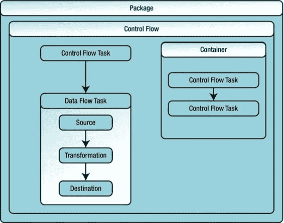
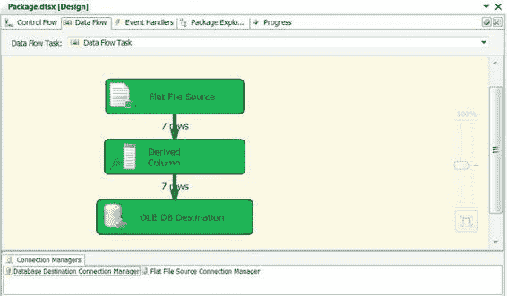

# 第一章 - 介绍集成服务

随着 SQL Server 2005 的发布，Microsoft 用 SQL Server Integration Services (SSIS) 取代了 DTS。SSIS 是一个真正企业级的 ETL 解决方案，相较于其前身有多项进步，包括内置日志记录；支持广泛的复杂转换、数据验证和数据清理组件；将流程控制与数据流分离；支持多种类型的数据源和目标；以及能够创建自定义组件等，不胜枚举。

SQL Server 12 中的 SSIS 代表了自 2005 年首次推出以来 SSIS 的首次重大增强。在这个最新版本中，Microsoft 在功能性和可用性方面实现了重大改进。一些新的亮点包括：能够在环境之间无缝移动 ETL 包，集中存储和管理 SSIS 包，以及众多可用性增强功能。在本书中，您将探索开始运行 SSIS 所需的核心功能，以及实现最复杂 ETL 处理所需的高级功能。

### ETL：失落的岁月

虽然 bcp 很高效，但多年来许多开发人员和 DBA 发现需要能够执行更复杂解决方案的工具。在 SQL Server ETL 的“失落岁月”期间，世界各地的工作场所开始涌现大量自研的 ETL 应用程序。其中许多解决方案效率非常低，特点是硬编码的源和目标以及不灵活的转换。即使在 21 世纪，一些世界上最大的公司中仍在运行不少这类遗留的自研 ETL 应用程序。从头开始构建和维护内部 ETL 应用程序可能是一项有趣的学术练习，但效率极其低下。为这些应用程序维护和管理代码库所花费的额外时间和金钱，会占用大量本可以用于在企业级 ETL 平台上设计、开发和构建实际 ETL 解决方案的资源。

### SSIS 能为您做什么？

SSIS 提供了大量开箱即用的功能来完成常见的 ETL 相关任务。您在大多数 ETL 处理中会遇到的主要任务包括：

[`www.it-ebooks.info`](http://www.it-ebooks.info/)

-   从各种来源提取数据，包括平面文件、XML、互联网、Microsoft Excel 电子表格以及关系型和非关系型数据库。如果标准源适配器无法满足您的需求，SSIS 对 .NET 的支持使您能够从几乎任何可访问的数据源提取数据。
-   根据您指定的预定义规则，在数据通过 ETL 过程时验证数据。您可以使用多种方法验证数据，例如确保字符串匹配模式以及数值在给定范围内。
-   执行数据清理，即识别无效数据值并将其删除或修改以符合您预定义约束的过程。示例包括将负数更改为零或从字符串中删除额外的空白字符。
-   数据去重，即删除您认为是重复的数据记录。对于给定的过程，您可能认为整个记录完全匹配即为重复；对于其他过程，您可能判定单个字段（或字段集）上的值匹配（例如“电话号码”）即标识了重复记录。
-   将数据加载到文件、数据库（如 SQL Server）或其他目标中。SSIS 提供了广泛的内置目标适配器，允许您将数据输出到几个定义明确的目标。与数据提取类似，如果您有一个不受 SSIS 标准适配器支持的特殊目标，内置的 .NET 支持让您能够输出到几乎任何可访问的目标。

几乎任何可以用 ETL 步骤定义的过程，都可以通过 `SSIS` 来执行。而且它的应用不仅限于数据库（尽管本书中我们的主要焦点在于数据库）。举个例子，你可以使用 Windows Management Instrumentation (`WMI`) 来检索有关计算机系统的信息，按你的喜好进行格式化，然后将其存储到 Excel 电子表格中；或者，你可以从逗号分隔的文件中获取数据，稍作转换，再将其写回一个新的逗号分隔文件。说得直白些，任何需要数据移动和处理的任务，你几乎都可以用 `SSIS` 来完成。

### 什么是企业级 ETL？

在本章中，你已看到我们将 `SSIS` 称为一个 *企业级 ETL 解决方案*，你或许曾问自己：“企业级 ETL 解决方案与其他 ETL 解决方案有何不同？”别担心，这是一个常见问题，我们曾经问过，后来也被问过多次。答案很简单：企业级 ETL 解决方案除了能够满足提取、转换和加载这些标准的功能性需求外，还有能力帮助你满足你的非功能性需求。

那么，什么是*非功能性需求*，它与 ETL 有何关系？如果你曾参与过应用程序或业务系统的开发项目，你可能对这个术语很熟悉。在上一节中，我们讨论了 `SSIS` 如何帮助你满足 ETL 的*功能性需求*——即描述系统“做什么”的需求。就 ETL 而言，功能性需求通常相当简单：(1) 从一个或多个来源获取数据，(2) 根据某些预定义的业务逻辑处理数据，以及 (3) 将数据存储在某处。

另一方面，非功能性需求更多地涉及系统的质量属性。这类需求涉及诸如鲁棒性、性能与效率、可维护性、安全性、可扩展性、可靠性以及 ETL 解决方案的整体质量等方面。我们倾向于将非功能性需求视为系统中那些不一定直接影响最终结果或输出的方面；相反，它们在幕后支持着结果的生成。

以下是 `SSIS` 能帮助你满足非功能性需求的一些方式：

-   **鲁棒性** 在 `SSIS` 中主要通过内置的错误处理机制来提供，用于捕获和处理不良数据及执行时发生的异常；通过事务确保当流程进入不可恢复的处理异常时数据的一致性；以及通过检查点提供一定程度的包重新启动能力。
-   **性能**和**效率**是密切相关但又不完全等同的概念。你可以将性能视为 ETL 流程完成其任务的原始速度。效率则更深入一些，包括最小化资源（内存、CPU 和持久存储）争用和使用量。`SSIS` 在其数据流组件和数据流引擎中内置了许多优化——例如，用于调整数据流的原始性能和资源效率。第 14 章将介绍如何充分利用这些内置优化。
-   **可维护性** 可以归结为你的 ETL 解决方案投入生产后，管理和维护的持续成本。可维护性也是最容易衡量的项目之一，因为你可以问这样的问题：“我每个月需要花多少小时来修复 ETL 流程中的问题？”或者“每周需要多少小时的人工干预来处理或避免 ETL 流程中的错误？”`SSIS` 提供了一种新的项目部署模型，使 ETL 项目从一个环境迁移到另一个环境更加容易；而 `BIDS` 则为 Team Foundation Server (`TFS`) 等源代码控制系统提供了内置支持，有助于最小化解决方案的维护成本。
-   **安全性** 在 `SSIS` 中通过多种方法以及与其他系统（包括 Windows NT File System (`NTFS`) 和 SQL Server）的交互来提供。将包和项目部署到 SQL Server 是保护包的一种强大方法。在这种情况下，SQL Server 利用其强大的安全模型来控制对 `SSIS` 包内容的访问和加密。
-   **可扩展性** 可以定义为你的 ETL 解决方案处理数据量增长的能力如何。`SSIS` 提供了随着需求增长而可预测扩展的能力，当然前提是你要创建能够最大化 `SSIS` 吞吐量的包。我们将在第 15 章讨论可扩展的 ETL 设计模式。

> **提示：** 关于 `SSIS` 设计模式的深入探讨，我们强烈推荐 Andy Leonard, Matt Masson, Tim Mitchell, Jessica Moss, 和 Michelle Ufford 所著的 *SSIS Design Patterns* (Apress, 2012) 一书。

## 可靠性

简而言之，可靠性可以定义为你的 ETL 解决方案抵御故障的能力——以及如果故障确实发生，你的解决方案处理该情况的效果如何。`SSIS` 提供了广泛的日志记录功能，结合 `BIDS` 的内置调试功能，可以帮助你快速追踪并修复故障的根本原因。`SSIS` 还能在发生故障情况时通知你。

所有这些单独的非功能性需求综合在一起，共同定义了你的 ETL 解决方案的整体质量。虽然构建一个将数据从点 A 转移到点 B 的包或程序相对简单，但非功能性需求在这一基本功能之上提供了一个层面，使你能够满足服务级别协议 (`SLA`) 和其他处理需求。

### SSIS 架构

`SSIS` 相对于 `DTS` 的一项重大改进是分离了*控制流*和*数据流*的概念。控制流管理包的执行顺序，并管理与事件处理程序等支持元素的通信。数据流引擎作为控制流中的一个组件公开，它提供高性能的数据提取、转换和加载服务。

如图 1-1 所示，控制流、数据流及其各自组件之间的关系是直截了当的。

**图 1-1.** 控制流与数据流之间的关系

简而言之，一个包包含控制流。控制流包含控制流*任务*和*容器*，这两者都将在第 4 章详细讨论。*数据流任务*是一种特殊类型的任务，它包含数据流。数据流包含*数据流组件*，这些组件移动和处理你的数据。数据流组件有三种类型：

-   **源** 可以从各种数据存储中提取数据，并将这些数据送入数据流。
-   **转换** 允许你在数据流中逐行操作和修改数据。
-   **目标** 为数据流提供一种方式，用于在数据流经最后阶段后输出和持久化数据。

虽然图 1-1 中的简化图仅显示了控制流中的一个数据流，但任何给定的控制流可以包含多个数据流。如图所示，控制流和数据流都存在于你可以使用 Microsoft Business Intelligence Development Studio (`BIDS`) 设计、构建和测试的 `SSIS` 包范围内。`BIDS` 是 .NET 程序员所熟悉的 Visual Studio 集成开发环境 (`IDE`) 的一个外壳。图 1-2 展示了 `BIDS` 设计器中一个非常简单的 `SSIS` 包的数据流。

**图 1-2.** BIDS 中简单的 SSIS 包数据流

