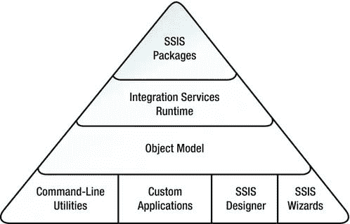

# 第 1 章 - 集成服务简介

自 SSIS 推出以来，微软在支持包执行和企业级 ETL 管理所需的基础设施方面投入了巨资。除了数据移动和操作外，SSIS 基础设施还支持日志记录、事件处理、连接管理和枚举活动。图 1-3 是一个简化的金字塔图，展示了 SSIS 基础设施的主要组成部分。

[www.it-ebooks.info](http://www.it-ebooks.info/)

**注意：** 我们将在第 2 章介绍 `BIDS` 并讨论新的设计器特性。

*图 1-3. SSIS 架构组件（简化版）*

金字塔的底层是命令行实用程序、自定义应用程序、SSIS 设计器以及向导（如导入/导出向导），它们提供了与 SSIS 的交互方式。这些应用程序和实用程序是使用托管或非托管代码开发的。对象模型层公开了接口，允许这些实用程序和应用程序与集成服务运行时进行交互。反过来，集成服务运行时负责执行包，并为日志记录、断点和调试、连接管理与配置以及事务控制提供支持。位于金字塔顶端的是 SSIS 包本身，您在 `BIDS` 环境中设计和构建它，以包含本章前面讨论的控制流和数据流。

### 告别数据转换服务

早在 SQL Server 2005 中，微软就宣布弃用数据转换服务。

在 SQL Server 2005、2008 和 2008 R2 中，DTS 作为遗留应用程序得到支持。但由于 SSIS 是 DTS 的成熟企业级替代品，因此在这个最新版本的 SQL Server 中不再支持 DTS 也就不足为奇了。这意味着 `执行 DTS 2000 包` 任务、DTS 运行时和 API 以及 `包迁移向导` 都将消失。幸运的是，将 DTS 包转换到 SSIS 的学习曲线并不陡峭，并且在大多数情况下过程相对简单。如果您有遗留的 DTS 包，现在是时候计划将它们迁移到 SSIS 了。

此外，专门为支持 DTS 而提供的 `ActiveX 脚本` 任务将被移除。许多原本使用 `ActiveX 脚本` 任务的操作可以通过优先级约束来处理，而更复杂的任务则可以重写为 `脚本` 任务。我们将在第 4 章和第 5 章详细探讨优先级约束和 `脚本` 任务。

[www.it-ebooks.info](http://www.it-ebooks.info/)

