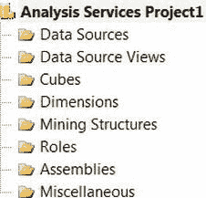
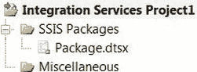

# 第 2 章

## BIDS 和 SSMS

*知识的每一次增长，以及每一种新工具的发明，都使人类的劳动得以简化。*

—发明家 查尔斯·巴贝奇

在收集了新流程的需求和规范之后，是时候设计`ETL`流程了。这包括决定要使用的工具、数据处理的时间框架、成功和失败的标准等等。决定使用哪些工具的一个关键部分是确定数据源以及工具是否能够轻松访问并高效地提取数据。正如我们在第 1 章讨论的，高效指的是对网络、硬件和整体资源进行最优的占用。`SSIS`的最佳特性之一是其开发和维护的简便性（在遵循最佳实践和标准的前提下）、它可以访问的广泛数据源、它在数据流动过程中可以处理的转换，以及最重要的成本，因为它随 SQL Server 12 一起提供。

在安装 SQL Server 12 时，你可以选择安装三个对于开发`ETL`流程至关重要的工具集：商业智能开发工作室（`BIDS`）、SQL Server 管理工作室（`SSMS`）—基本版和管理工作室—完整版。`BIDS`使用 Visual Studio 2010 平台来开发`SSIS`包，以及创建服务于 SQL Server 12 套件组件的项目。管理工具包括`SSMS`、SQL Server 命令行实用工具（`SQLCMD`）以及其他一些功能。通过这些核心组件，开发人员可以发出数据定义语言（`DDL`）语句来创建和修改数据库对象。他们还可以发出数据操作语言（`DML`）语句，使用微软风格的标准查询语言（`SQL`），即 Transact-SQL（`T-SQL`），来查询数据库对象。数据控制语言（`DCL`）允许用户配置对数据库对象的访问权限。

本章涵盖了`BIDS`支持的项目模板。它还简要概述了 SQL Server 12 套件的各个元素。

### SQL Server 商业智能开发工作室

`BIDS`以 Visual Studio 2008 作为开发平台，支持几个项目模板，其唯一目的是提供数据洞察力。这种洞察力可以来自于将相关数据从源移动到数据库（使用`SSIS`项目的`ETL`流程）、开发可以提供数据最优高级摘要的多维数据集（使用 SQL Server Analysis Services 开发的`SSAS`项目），以及创建可以直接针对数据库或多维数据集运行的报表（使用 SQL Server Reporting Services 设计的`SSRS`项目）。图 2-1 显示了 Visual Studio 中可用的商业智能项目。

*图 2-1. `BIDS`可用的项目*

对于 SQL Server 12，这些项目需要安装`.NET Framework 3.5`。Visual Studio 解决方案可以维护多个项目，这些项目分别对应 SQL Server 套件中的不同学科领域。一些元素跨越多个项目。这些元素列举如下，并在逻辑上在一个解决方案级别上联系在一起：

- 数据源是将被项目成员导入的数据所来自的不同来源。这些数据源可以通过向导创建，并通过设计器进行编辑。项目中的各种组件都可以访问这些连接。
- 数据源视图（`DSVs`）本质上是可用于从源中提取数据的即席查询。它们的主要目的是存储源的元数据。作为元数据的一部分，还存储了关键信息，以帮助在 Analysis Services 数据库中创建适当的关系。
- 杂项是一个类别，包括所有起支持作用但非核心的文件。这包括用于 Integration Services 的配置文件。

#### Analysis Services 项目

*Analysis Services 项目*用于设计、开发和部署 SQL Server 12 Analysis Services 数据库。通常，`ETL`项目的目的在于将多个系统整合成一个适合报表的形式，以便在高级别上汇总活动。Analysis Services 多维数据集对维度执行汇总计算，以实现快速高效的报表生成。这个项目模板提供了一个如图 2-2 所示的文件夹结构，这是开发 Analysis Services 数据库所必需的。开发完成后，多维数据集可以直接部署到 Analysis Services。

[www.it-ebooks.info](http://www.it-ebooks.info/)

*图 2-2. Analysis Services 项目的文件夹结构*

这些文件夹以对开发者友好的格式组织文件。这种格式也有助于构建和部署项目。部分文件夹列表如下：

- Cubes 包含作为 Analysis Services 数据库一部分的所有多维数据集。可以使用向导，利用存储在`DSVs`中的元数据来创建维度。
- Mining Structures 对来自`DSVs`的数据应用数据挖掘算法。根据数据质量和适当算法的使用，它们可以帮助创建预测分析的水平。你可以使用挖掘模型向导来帮助创建这些模型，也可以使用挖掘模型设计器来编辑它们。
- Roles 包含 Analysis Services 数据库的所有数据库角色。这些角色可以从管理权限到基于维度数据的限制各不相同。
- Assemblies 保存对组件对象模型（`COM`）库和微软`.NET`程序集的所有引用。

**提示：** `SSIS`包可用于处理多维数据集。这些包可以在成功的`ETL`流程结束时执行。

与 Integration Services 一样，Analysis Services 数据库可以从各种位置和物理存储格式中获取数据源。`DSVs`使用相同的驱动程序，并且不一定局限于 SQL

### 服务器数据库引擎

早期版本的 SQL Server 以及其他关系数据库管理系统（RDBMSs）都可以作为数据源。用于查询 SQL Server 多维数据集的语言称为多维表达式（`MDX`）和数据挖掘扩展（`DMX`）。在多维数据集中，为了分析目的而定义的一些对象包括度量值、度量值组、属性、维度和层次结构。这些对象对于组织和定义最终用户最关心的度量指标及其描述至关重要。

Analysis Services 提供的另一个重要功能是关键绩效指标（`KPIs`）的概念。`KPIs` 包含与度量值组相关的计算。这些计算对于评估业务绩效至关重要。

[www.it-ebooks.info](http://www.it-ebooks.info/)

