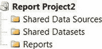
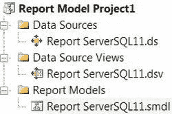
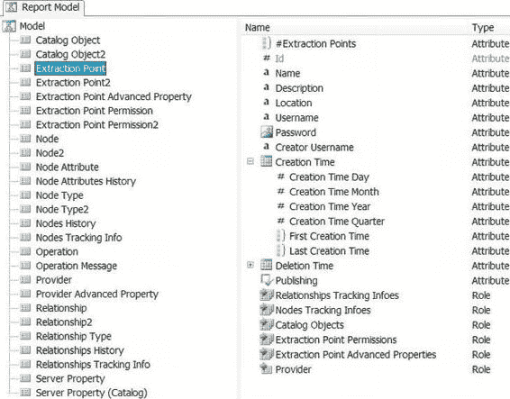
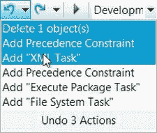

# 第 2 章  BIDS 和 SSMS

### Integration Services 项目

`Integration Services 项目`模板使开发者能够创建 `SSIS` 包。包是 `SSIS` 中的可执行工作单元。它由更小的组件组成，这些组件在开发期间可以单独执行，但 Integration Services 是在包级别执行的。Visual Studio 中的调试选项会将包作为一个整体执行，但控制流可执行文件也可以单独测试。图 2-3 展示了一个 Integration Services 项目的示例。如果您已经打开了一个解决方案，此项目将自动添加到当前解决方案中。否则，将创建一个临时解决方案。

> **注意：** 尽管 Visual Studio 有能力执行包，但我们建议在测试时使用命令行来执行它们。Visual Studio 调试模式应在开发期间使用。我们将在第 20 章讨论更多关于运行 `SSIS` 包的选项。

*图 2-3. Integration Services 项目的文件夹结构*

以下列表描述了您的项目中将出现的对象和文件夹：

*   `SSIS 包`包含与项目关联的所有包。这些工作单元是实际执行 ETL 的组件。所有包都被添加到 `.dtproj` 文件中。这个基于 XML 的文件列出了项目中包含的所有包和配置。
*   `杂项`包含除 `.dtsx` 文件外的所有文件类型。此文件夹对于存储配置文件至关重要，在利用源代码管理应用程序时，对于整合连接非常有用。Team Foundation Server 将在本章后面介绍。

> **注意：** 在 SQL Server 12 中，数据源和数据源视图无法添加到项目中。相反，这些连接可以添加到各个包中。在早期版本中，数据源可以作为连接管理器添加，并允许引用所包含的 `DSV` 作为源组件中的表。使用这种方法访问 SQL Server 上的数据并不是提取数据的最佳方式。

Visual Studio 中的调试选项执行当前的包。此功能对于观察包的行为（数据流任务中数据行通过组件的速度有多快、可执行文件完成的速度有多快、查找和合并联接的成功匹配等）非常有用。在执行过程中，三种颜色指示可执行文件和数据流组件的状态：黄色—正在进行，红色—失败，绿色—成功。这种不同颜色的使用在开发过程中很有帮助，因为它显示了优先级约束和数据流任务如何移动数据。

> **注意：** 除非一个包调用另一个包作为可执行文件，否则在调试模式下运行的只有当前包，而不是项目中的所有包。Visual Studio 将打开在父-子配置中调用的每个包并执行它们。如果包太多，某些包可能会打开并显示内存溢出错误，但该包可能在后台执行并继续处理后续包。

### 撤销还是重做，这是个问题

自 SQL Server 2005 引入以来，`SSIS` 并没有原生的撤销或重做功能。这些操作的按钮存在于工具栏上，但无论 `SSIS` 设计器中做了什么更改，它们都永久呈灰色不可用状态。撤销更改最常见的方法是在不保存更改的情况下关闭包。即使有源代码管理，这始终是一个棘手的操作。从 SQL Server 2012 开始，`SSIS` 开发者现在可以享受其他 Visual Studio 开发者在软件的多个迭代版本中早已享受的撤销功能。在 `SSIS` 中，点击“确定”按钮会提交更改。如果您只是在查看代码，应养成点击“取消”或“关闭”按钮以保持代码不变的习惯。撤销和重做功能在某种程度上也延伸到组件的编辑。

### 报表服务器项目向导

`报表服务器项目向导`允许您自动创建报表服务器项目。您必须指定到数据源的连接，包括必要的安全信息、报表的查询等。项目创建后，可以使用报表设计器进行所有修改。

### 报表服务器项目

`报表服务器项目`允许开发者创建报表所需的所有对象。报表可以部署在门户上，最终用户可以通过该门户访问它们。门户可以利用 SharePoint，用户甚至可以在其中保存他们经常使用的自己的报表。通常使用 Web 浏览器访问报表。如果报表汇总数据（即执行计数、求和和平均值），则应使用多维数据集。如果报表显示详细级别的信息，查询数据库很可能是更高效的途径。在报表上包含过多细节会影响最终用户浏览器的加载时间以及服务器的查询时间。图 2-4 演示了报表服务器项目可用的文件夹结构。

[www.it-ebooks.info](http://www.it-ebooks.info/)

*图 2-4. 报表服务器项目的文件夹结构*

这些文件夹包含执行以下任务的对象：

*   `共享数据源`包含报表服务器项目的必要组件。这些组件允许报表连接到将作为报表基础的数据源。
*   `共享数据集`包含多个报表用来作为公共数据源的数据集。
*   `报表`存储所有作为实际报表的 `.rdl` 文件。您可以使用设计器修改报表。

在创建报表时，“设计”视图使您能够修改页面的视觉布局以及填充每个元素的代码。根据数据源的不同，您将需要使用相应变体的 `SQL` 或 `MDX`。报表的数据源可以包括 `RDBMS`s、报表模型和 `XML`。除了“设计”视图，还有一个“预览”视图可用于运行报表，以确保数据呈现符合预期。使用此视图会将数据缓存在开发者的本地机器上，因此建议经常清除缓存。

### 导入 Analysis Services 数据库

### BIDS 和 SSMS 工具详解

### 导入 Analysis Services 数据库项目

*导入 Analysis Services 数据库项目*模板会自动生成 Analysis Services 项目的所有项。该向导要求你指向一个 Analysis Services 数据库，并将基于现有数据库反向生成所有项目项。生成的项目可用于修改对象并将其重新部署到服务器，以更新数据库。

### 集成服务项目向导

*集成服务项目向导*将自动生成集成服务项目的所有项。该向导会询问现有项目的来源（`.dtproj` 文件或部署在 SQL Server 实例上的包）。此向导将从现有项目中导入所有对象。

### 报表模型项目

*报表模型项目*利用 SQL Server 数据库生成报表。根据定义，报表模型存储其源数据及其关系的元数据。数据源允许你访问指定源的 DDL 并将其用于报表模型。数据源视图（DSV）允许你存储来自源数据的元数据并为报表生成模型。模型设计器可以使用 SQL Server 或 Oracle 9.2.0.3 及更高版本的关系数据库管理系统（RDBMS）来创建报表模型。虽然基于 RDBMS 的模型可以修改，但基于 Analysis Services 的模型则不能。数据源中的所有数据都会自动包含在模型中。图 2-5 展示了报表模型项目中可用的所有对象和文件夹。

[www.it-ebooks.info](http://www.it-ebooks.info/)

*图 2-5\. 报表模型项目的文件夹结构*

> **注意：** 一个 `.smdl` 文件只能引用一个数据源（`.ds`）和一个数据源视图（`.dsv`）。此限制将阻止你执行跨数据库连接。

报表模型由三部分组成：语义模型，为数据对象分配业务友好的名称；物理模型，表示数据源视图中的对象并输出其中包含的查询元数据；以及映射，用于对齐语义模型和物理模型。语义模型定义语言（`.smdl`）文件仅包含一个语义模型、一个物理模型和一个映射。如图 2-6 所示，设计器可以读取此 DDL 并用于生成描述数据源视图对象的模型。

[www.it-ebooks.info](http://www.it-ebooks.info/)

*图 2-6\. 从数据源视图导入的模型*

部署报表模型项目允许最终用户访问底层数据库中存在的数据。该项目需要部署到报表服务器上，用户在那里拥有访问权限。

### 集成服务

SQL Server 12 中企业级 ETL 流程的基础是 SSIS 包。自 SQL Server 2008 以来，开发 Studio 在界面和一些组件的性能增强方面经历了巨大变化。开发包始于 Visual Studio 2008 BIDS 项目。

项目文件（`.dtproj`）将管理这些包。它枚举了将要生成和部署的包；我们将在第 19 章更详细地讨论此过程。项目文件还有助于在 Team Foundation Server（TFS，一个 Visual Studio 代码存储库系统）内进行开发。

设置 TFS 并在此源代码控制框架内工作的内容在第 20 章介绍。在生成过程中，项目包含的每个包中列出的所有配置文件（`.dtsxConfig`）都将被创建。

让开发者感到兴奋的最大变化之一是能够撤销和重做更改。在早期版本的工具集中，你必须关闭包而不保存更改，然后重新打开包。这意味着，如果你想保留一个更改，但之后又做了一个不想要的更改，你*唯一的选择*就是关闭包而不保存。另一种选择是禁用任务。

[www.it-ebooks.info](http://www.it-ebooks.info/)

