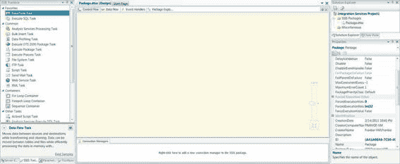
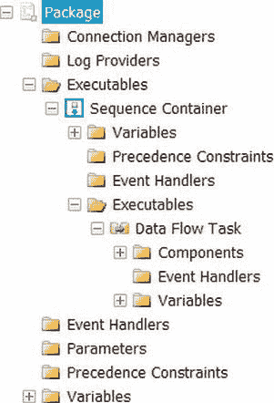
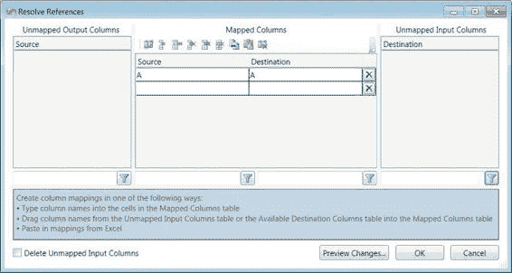
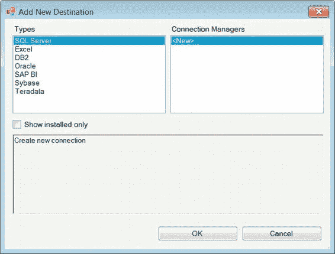

# 第 2 章  项目与 SSIS 包

这常常导致包中充斥着被禁用的可执行文件或容器。`图 2-7`展示了“撤销”和“重做”功能现在所提供的变更历史记录。

`图 2-7. 撤销和重做功能`

#### 项目文件

SSIS 2012 中的一些变化涉及项目文件可用的属性。项目文件的属性允许配置构建过程——具体来说，是包的文件夹路径。文件夹路径属性还允许用户直接将项目部署到 SQL Server 数据库，即 Integration Services 目录。Integration Services 目录将在第 18 章中详细讨论。

在文件系统中手动添加或删除包（`.dtsx`）文件不会修改或更新项目文件。实际上，从文件系统中删除包会损坏项目。`代码清单 2-1`演示了可修改以添加或移除项目中包的 XML 标签。

`注意：` 我们建议在 Visual Studio 中添加现有包。但是，如果一个包已经存在于项目文件夹中，Visual Studio 将创建该原始包的副本，并将该副本添加到项目中。通常，复制的包名称会附加“(1)”。

`代码清单 2-1. 项目文件示例`

```xml
<Database>
<Name>Integration Services Project1.database</Name>
<FullPath>Integration Services Project1.database</FullPath>
</Database>
<DataSources />
<DataSourceViews />
<DeploymentModelSpecificContent>
<Manifest>
<SSIS:Project SSIS:ProtectionLevel="DontSaveSensitive">
<SSIS:Properties>
<SSIS:Property SSIS:Name="ID">{bf2a36bf-0b7c-471d-95c7-3ee9a0d74794}</SSIS:Property>
<SSIS:Property SSIS:Name="Name">Integration Services Project1</SSIS:Property>
<SSIS:Property SSIS:Name="VersionMajor">1</SSIS:Property>
<SSIS:Property SSIS:Name="VersionMinor">0</SSIS:Property>
<SSIS:Property SSIS:Name="VersionBuild">0</SSIS:Property>
<SSIS:Property SSIS:Name="VersionComments"></SSIS:Property>
<SSIS:Property SSIS:Name="CreationDate">2012-02-14T22:44:55.5341796-05:00</SSIS:Property>
<SSIS:Property SSIS:Name="CreatorName">SQL12</SSIS:Property>
<SSIS:Property SSIS:Name="CreatorComputerName">SQL12</SSIS:Property>
<SSIS:Property SSIS:Name="OfflineMode">0</SSIS:Property>
<SSIS:Property SSIS:Name="Description"></SSIS:Property>
</SSIS:Properties>
<SSIS:Packages>
<SSIS:Package SSIS:Name="Package.dtsx" SSIS:EntryPoint="1" />
</SSIS:Packages>
<SSIS:Parameters />
<SSIS:DeploymentInfo>
<SSIS:PackageInfo>
<SSIS:PackageMetaData SSIS:Name="Package.dtsx">
<SSIS:Properties>
<SSIS:Property SSIS:Name="ID">{A41A08A6-7C50-4DEC-B283-D76337E73505}</SSIS:Property>
<SSIS:Property SSIS:Name="Name">Package</SSIS:Property>
<SSIS:Property SSIS:Name="VersionMajor">1</SSIS:Property>
<SSIS:Property SSIS:Name="VersionMinor">0</SSIS:Property>
<SSIS:Property SSIS:Name="VersionBuild">1</SSIS:Property>
<SSIS:Property SSIS:Name="VersionComments"></SSIS:Property>
<SSIS:Property SSIS:Name="VersionGUID">{9181C329-7E44-4B3D-B125-14D94639BF03}</SSIS:Property>
<SSIS:Property SSIS:Name="PackageFormatVersion">6</SSIS:Property>
<SSIS:Property SSIS:Name="Description"></SSIS:Property>
<SSIS:Property SSIS:Name="ProtectionLevel">0</SSIS:Property>
</SSIS:Properties>
<SSIS:Parameters />
</SSIS:PackageMetaData>
</SSIS:PackageInfo>
</SSIS:DeploymentInfo>
</SSIS:Project>
</Manifest>
</DeploymentModelSpecificContent>
<Miscellaneous />
<Configurations>
<Configuration>
<Name>Development</Name>
<Options>
<OutputPath>bin</OutputPath>
<ConnectionMappings />
<ConnectionProviderMappings />
<ConnectionSecurityMappings />
<DatabaseStorageLocations />
<ParameterConfigurationValues />
</Options>
</Configuration>
</Configurations>
```


这个简单项目文件的一部分包含了开发和使用 SSIS ETL 过程的所有基本要素。正如您可能猜到的，这些信息以可扩展标记语言 (XML) 的形式存储。这使得通过直接编辑 XML 来修改项目成为可能。

我们想重点强调以下几个关键标签/属性（更多细节将在后续章节中讨论）：

`ProtectionLevel` 允许您保护敏感信息，例如凭据。此属性可以在项目级别以及包级别设置。但是，两者的设置应保持一致。在构建项目时，项目中的所有包都需要设置与项目文件相同的保护级别。我们将在第 19 章更详细地讨论此属性。

`Packages` 包含与项目关联的所有包。复制并粘贴此标签，并将名称修改为工作目录中存在的某个包，将强制将该包添加到项目中。在 Visual Studio 中打开项目时，该包将列在“包”文件夹中。直接修改项目文件有时可以避免创建整洁文件名的麻烦，而不是使用 Visual Studio 向导来添加现有包。

`Parameters` 可以在运行时用于设置包中的值。此属性允许包中的某些组件更改值。最显著的应用是在 OLE DB 源组件中，它可以对 SQL 语句进行参数化。对包进行参数化将在第 16 章更详细地介绍。

`Configuration` 决定您是构建还是部署项目。默认情况下，该属性设置为构建项目。根据每个配置的目的，您创建的不同配置可以使用不同的设置。项目设置中的配置管理器允许您创建不同的配置。

`OutputPath` 设置将为项目构建的对象的文件夹路径。默认情况下，它设置为 bin 目录。当需要创建部署实用程序时，可以定义不同的路径。在 2005 和 2008 版本中，创建部署实用程序使用了默认的文件夹路径 `bin\Deployment`。

#### 工具窗口

BIDS 环境提供了将所有组件组织成易于查找部分的工具。首先，开始页面包含一些重要的参考项目。“最近的项目”面板包含一些已打开项目的历史记录。此面板底部是打开现有项目的链接以及创建 BIDS 项目和其他 Visual Studio 项目的链接。“入门”窗格包含指向 BOL（联机丛书）主题的链接，这些主题可以帮助开发人员学习工具集。如果安装了 Team Foundation Server 团队资源管理器实用程序，则会提供“源代码管理”页面。此页面允许开发人员快速访问分配给他/她的项目，并使用存储在存储库中的特定版本刷新代码副本。

BIDS 中的工具窗口有助于开发，如图 2-8 所示。中间部分是 SSIS 包的实际设计器。设计器的一个附加功能是缩放工具，当它不活动时是透明的，但当鼠标悬停在其上时，它会变为不透明。缩放比例下方是一个“缩放到适应”按钮，该按钮将自动确定最佳缩放级别以显示内容，同时保持当前布局。

设计器下方是连接管理器。这些是 ETL 过程的数据源和目标。它们包含连接信息，例如服务器名称、数据库名称，并且根据定义的保护级别，还包含安全凭据。可能需要某些驱动程序才能创建连接。默认情况下仅附带某些驱动程序。其他驱动程序可以从 Microsoft 获取。大多数驱动程序可从 Microsoft 免费下载；其他公司可能会收费。使用或命名连接管理器时应遵循某些惯例；我们将在本书的第二部分讨论它们。

**注意：** 如果 BIDS 工具安装在 32 位操作系统上，则只会安装 32 位版本的驱动程序。在 64 位操作系统上，将同时安装 32 位和 64 位工具。同样重要的是要注意，并非所有 32 位工具在 64 位环境下都可用。Microsoft OLE DB Provider for Jet（Office Access 和 Excel 引擎）和 SQL Server Compact Provider（SQL Server Compact）在 64 位环境中不可用。在 64 位环境中，Visual Studio 中包的默认执行使用 64 位工具。如果这些工具不可用，包可能会挂起或失败。`Run64BitRuntime` 项目属性控制此执行。当设置为 True 时，与项目关联的所有包都将以 64 位模式运行。设置为 False 则导致 32 位执行。



*图 2-8. SSIS 2012 的工具窗口*

#### 设计器窗口

设计器顶部的选项卡显示了 ETL 过程的控件。控制流由三种不同类型的组件组成：可以将任务逻辑分组在一起的容器、用于满足包功能需求的任务，以及控制可执行文件、容器和任务之间流程顺序的优先级约束。我们将在第 5 章和第 6 章详细介绍控制流。

“数据流”选项卡是允许开发人员控制实际数据处理的设计器。数据流任务是将数据从源移动到目标的组件，同时允许在传输过程中进行转换。

“事件处理程序”选项卡允许根据触发的运行时事件（如 OnError、OnExecStatusChanged 等）来设计操作。这些触发器可以附加到包中的所有可执行文件和任务。我们将在第 10 章深入介绍事件处理。

“包资源管理器”选项卡提供对整个包的快速浏览。它以树状视图显示包的所有内容，如前面的图 2-8 所示。如图所示，变量出现在不同的位置；这是由于变量定义的范围所致。变量将在第 11 章讨论。

关于变量新增的功能之一是添加了一个变量属性 `RaiseChangedEvent`。这允许特定的更改标准触发事件，这些事件可以被事件处理程序捕获。它还允许 SSIS 日志记录通过您使用的日志提供程序捕获此事件。图 2-9 显示了包中对象的树状图视图。

**注意：** 在开发 SSIS 包时，焦点的概念起着重要作用。焦点基本上意味着当前选择了哪个组件。在创建变量时，记住这一点至关重要。如果在创建变量时意外选择了某个容器或可执行文件，则会将该变量限制在该特定对象内。BIDS 允许您在作用域之间“移动”变量。然而，Visual Studio 所做的只是在新作用域中创建一个新变量，其名称是原始变量的名称后附加一个 1，然后 Visual Studio 会删除原始变量。



*图 2-9. 包资源管理器*

在包执行期间，“进度”选项卡会出现在“包资源管理器”选项卡的右侧。


此选项卡会持续更新，显示执行过程的当前状态，直至最终以成功或失败结束。该选项卡将显示当前正在运行的执行程序、查找组件已缓存的行数等信息。它还会捕获执行前处理以及执行后处理的进度。执行完成后，它会将自身重命名为“执行结果”选项卡。

“执行结果”选项卡包含的内容与“进度”选项卡最末端的内容相同。其中存储的最关键信息之一就是提交到目标的行数。

在设计器窗口的右上角有两个按钮。它们是“参数和变量”窗口窗格以及“SSIS 工具箱”窗口窗格的快捷方式。当需要快速查看参数、变量以及当前上下文可用的工具时，这些按钮非常方便。

#### 解析引用

数据流的一项令人兴奋的新功能是**解析引用**实用工具。通过在数据流中两个组件之间的路径上右键单击并选择“解析引用”即可使用。这是一个强大的工具，因为它允许在 Excel 电子表格中生成和维护映射关系，然后只需将其添加为源与目标输入之间的映射即可。这相比之前版本的“恢复无效列引用编辑器”是一个巨大的改进，后者在使用时常常让开发人员感到担忧。图 2-10 展示了在 Visual Studio 中出现的“解析引用”实用工具。

[www.it-ebooks.info](http://www.it-ebooks.info/)



##### 图 2-10. 解析引用实用工具

由于 DDL 更改或源/目标更改，此工具可以快速更新元数据。它的实用性在于能够一次性查看流水线中的所有列，而不是像以前那样在下拉列表中一次查看一个列映射。在该实用工具的“映射列”窗格中，按钮从左到右执行以下功能：

- `自动映射列` 会尝试根据名称最佳匹配源中的列和目标中的列。此功能在 SSIS 的先前版本中已存在，通常在目标组件中生成映射。
- `插入单元格` 允许您错开当前的映射，而不会丢失当前存在的所有已映射列。它会将所选单元格（无论在“源”列还是“目标”列）下方的单元格向下移动。
- `插入行` 插入整行，以便可以构建全新的映射。如同集合理论一样，顺序并不重要。映射呈现的顺序无关紧要，只要映射存在即可。
- `删除单元格` 将单元格向上移动至当前高亮显示的单元格。此操作可用于将映射从其正确位置移开。
- `删除行` 删除整行不需要的映射。使用此选项移除列映射——例如，如果自动映射功能在不相关的列之间建立了关联。
- `消除空白行` 删除所有不包含映射关系两侧（源和目标）的行。如果某一行有“源列”或“目标列”已填充，则不会删除该行。

[www.it-ebooks.info](http://www.it-ebooks.info/)

- `将映射复制到剪贴板` 以 Excel 格式复制整个映射表的内容。这可用于将映射存储在电子表格中用于文档目的。
- `从剪贴板粘贴` 将剪贴板的内容粘贴到实用工具中。它允许您粘贴元数据中不存在的列，但在网格填充后，它将验证映射。如果列不存在，窗格底部会出现错误消息，提示您指定的列不存在。此外，粘贴操作始终会附加到现有的映射；如果映射已存在于表中，则无法覆盖它。使用此按钮的唯一先决条件是确保剪贴板中只有两列。
- `清除所有映射` 清除映射表的内容，并将列移回它们各自的窗格，即“未映射的输出列”和“未映射的输入列”。

**注意：** 如果从数据流的源中移除了列，当下游组件在其映射中仍在使用该列时，系统仍会识别为该列存在于上游流水线中。待依赖关系移除后，该列才会从流水线中移除。

为了保持包的组织性和可读性，一个名为“格式”的菜单项允许您根据需要排列控制流和数据流的元素。对于简单的流，自动布局应足以使包显得美观。对于更复杂的包，还有选项可以对齐组件、调整它们之间的距离以及使它们大小相同。

对于这些选项，在应用这些更改之前，需要先选择要应用格式的组件。首先选择的组件将成为其余组件的参考。例如，其他组件的对齐方式将相对于第一个选定的组件来确定。

#### SSIS 工具箱

设计器窗口的左侧是 SSIS 工具箱。这是对先前 BIDS 版本的名称更改，之前仅称为“工具箱”。Visual Studio 中仍然存在一个“工具箱”，但它不包含任何用于 SSIS 设计器的组件。SSIS 工具箱会变化，仅显示与设计器当前视图相关的组件。

在 SSIS 工具箱的底部，有一个对所选组件的简要描述，对初次开发的开发人员很有帮助。右键单击该描述会显示“显示类型信息”选项。此选项提供有关所选工具的详细信息，例如程序集名称和.dll 的位置。除了此描述外，还有两个参考点：该部分右上角的“帮助”按钮和“查找示例”超链接，后者会带您到 CodePlex 并预填搜索条件。

SSIS 工具箱的组织方式与先前版本完全不同。控制流组件的新组织方式分为四组：收藏夹、常用、容器和其他任务。默认情况下，收藏夹包含 SSIS 领域的核心任务，即“数据流任务”和“执行 SQL 任务”。

[www.it-ebooks.info](http://www.it-ebooks.info/)



**提示：** 默认情况下，SSIS 12 有其自己的组件分组，但此分组可以根据您的需要进行更改。可以通过右键单击任务并将其移动到所需的分组来将其移至其他分组。容器是例外；它们只能移动到收藏夹或常用分组。

数据流的 SSIS 工具箱的组织方式与控制流类似。组件分为几类：收藏夹、常用、其他转换、其他源和其他目标。与控制流任务一样，此分组在某种程度上可以根据个人喜好进行修改。数据流的默认收藏夹对于 SSIS 是新的：目标助手和源助手。这些助手根据存储类型组织包中定义的连接管理器，如图 2-11 所示。默认情况下，它们只显示机器上安装了驱动程序的数据存储应用程序。如果所需的应用程序不存在，可以使用助手创建新的连接管理器。

##### 图 2-11. 目标助手

#### 包代码视图


SSIS 包背后的实际代码存储为基于 XML 的`.dtsx`文件。通过在文本编辑器中打开包文件，或在包打开时点击`Visual Studio`中的`View`菜单并选择`View Code`，即可查看此 XML。`SQL Server 2008`和`SQL Server 12`中`.dtsx`文件所包含的 XML 差异巨大。每个标签的属性都位于新行上，使得代码更易于人类阅读。此特性也使得这些包可以通过`diff 工具`进行修改。在`TFS`中，`Compare Files`工具现在成为一个可行的选项，用于识别包版本之间的差异。这也使得`TFS`中的`Merge`工具更易于操作，以合并两个版本的包。

[www.it-ebooks.info](http://www.it-ebooks.info/)

## 第 2 章  BIDS 与 SSMS

#### 清单 2-2. 数据流任务组件

```xml
<component
refId="Package\Data Flow Task\OLE DB Source"
componentClassID="{165A526D-D5DE-47FF-96A6-F8274C19826B}"
contactInfo="OLE DB Source;Microsoft Corporation;
Microsoft SQL Server; (C) Microsoft Corporation; All Rights Reserved;
http://www.microsoft.com/sql/support;7"
description="OLE DB Source"
name="OLE DB Source"
usesDispositions="true"
version="7">
<properties>
<property
dataType="System.Int32"
description="The number of seconds before a
command times out. A value of 0 indicates an infinite time-out."
name="CommandTimeout">0</property>
<property
dataType="System.String"
description="Specifies the name of the database object used to open a rowset."
name="OpenRowset"></property>
<property
dataType="System.String"
description="Specifies the variable that contains the
name of the database object used to open a rowset."
name="OpenRowsetVariable"></property>
<property
dataType="System.String"
description="The SQL command to be executed."
name="SqlCommand"
UITypeEditor="Microsoft.DataTransformationServices.Controls.ModalMultilineStringEditor, Microsoft.DataTransformationServices.Controls, Version=12.0.0.0, Culture=neutral, PublicKeyToken=89845dcd8080cc91">SELECT 1 AS A
WHERE 1 = 1;</property>
<property
dataType="System.String"
description="The variable that contains the SQL command to be executed."
name="SqlCommandVariable"></property>
<property
dataType="System.Int32"
description="Specifies the column code page to use
when code page information is unavailable from the data source."
name="DefaultCodePage">1252</property>
<property
dataType="System.Boolean"
description="Forces the use of the DefaultCodePage
property value when describing character data."
name="AlwaysUseDefaultCodePage">false</property>
<property
dataType="System.Int32"
description="Specifies the mode used to access the database."
name="AccessMode"
typeConverter="AccessMode">2</property>
<property
dataType="System.String"
description="The mappings between the parameters in the SQL command and variables."
name="ParameterMapping">"0",{F05D0A62-4900-482A-88D9-DE0166CB4CB9};</property>
</properties>
<connections>
<connection
refId="Package\Data Flow Task\OLE DB Source.Connections[OleDbConnection]"
connectionManagerID="Package.ConnectionManagers[FRANKIE-VM\SQL12.SSISDB]"
description="The OLE DB runtime connection used to access the database."
name="OleDbConnection" />
</connections>
<outputs>
<output
refId="Package\Data Flow Task\OLE DB Source.Outputs[OLE DB Source Output]"
name="OLE DB Source Output">
<outputColumns>
<outputColumn
refId="Package\Data Flow Task\
OLE DB Source.Outputs[OLE DB Source Output].Columns[A]"
dataType="i4"
errorOrTruncationOperation="Conversion"
errorRowDisposition="FailComponent"
externalMetadataColumnId=
"Package\Data Flow Task\OLE DB Source.Outputs
[OLE DB Source Output].ExternalColumns[A]"
lineageId="Package\Data Flow Task\OLE DB Source.Outputs
[OLE DB Source Output].Columns[A]"
name="A"
truncationRowDisposition="FailComponent" />
</outputColumns>
<externalMetadataColumns
```

[www.it-ebooks.info](http://www.it-ebooks.info/)


#### 数据流输出定义

```xml
<output
refId="Package\Data Flow Task\OLE DB Source.Outputs[OLE DB Source Output]"
isUsed="True">
<externalMetadataColumns>
<externalMetadataColumn
refId="Package\Data Flow Task\OLE DB Source.Outputs[OLE DB Source Output].ExternalColumns[A]"
dataType="i4"
name="A" />
</externalMetadataColumns>
</output>
<output
refId="Package\Data Flow Task\OLE DB Source.Outputs[OLE DB Source Error Output]"
isErrorOut="true"
name="OLE DB Source Error Output">
<outputColumns>
<outputColumn
refId="Package\Data Flow Task\OLE DB Source.Outputs[OLE DB Source Error Output].Columns[A]"
dataType="i4"
lineageId="Package\Data Flow Task\OLE DB Source.Outputs[OLE DB Source Error Output].Columns[A]"
name="A" />
<outputColumn
refId="Package\Data Flow Task\OLE DB Source.Outputs[OLE DB Source Error Output].Columns[ErrorCode]"
dataType="i4"
lineageId="Package\Data Flow Task\OLE DB Source.Outputs[OLE DB Source Error Output].Columns[ErrorCode]"
name="ErrorCode"
specialFlags="1" />
<outputColumn
refId="Package\Data Flow Task\OLE DB Source.Outputs[OLE DB Source Error Output].Columns[ErrorColumn]"
dataType="i4"
lineageId="Package\Data Flow Task\OLE DB Source.Outputs[OLE DB Source Error Output].Columns[ErrorColumn]"
name="ErrorColumn"
specialFlags="2" />
</outputColumns>
<externalMetadataColumns />
</output>
</outputs>
</component>
```

[www.it-ebooks.info](http://www.it-ebooks.info/)

## 第 2 章  BIDS 与 SSMS

#### XML 可读性改进

通过查看一个极其简单的源组件的 XML，需要强调的一些关键点包括与之前版本的 SSIS 相比包的简洁性，以及包跟踪对象方式的一些变化。XML 可读性改进的关键原因之一在于一些默认设置不会生成。例如，如果源组件的`IsSorted`属性保持默认值`False`（如清单 2-2 中所示），则不会生成额外的 XML 来存储该元数据。在以前的 SSIS 版本中，所有的细节都存储在包的 XML 中。

以下列表重点介绍了一些更重要的属性：
*   `refId`：指示包内对象的路径。此属性在包中唯一标识组件。
*   `SqlCommand`：通常包含将针对关系数据库管理系统执行的确切查询。
*   `Connections`：包含包中为数据源组件存储的所有连接信息。可以保存包的登录凭据，但不建议这样做。连接管理器也有`refId`。
*   `Output Columns`：关于包输出的元数据对于确保数据正确插入非常重要。如果仅仅在将数据转换为 SQL Server 可处理格式时失败，包可以被设置为因此失败。

#### 数据行 ID 跟踪方式变更

另一个仅通过查看 XML 就能注意到的变更是在 XML 中跟踪`lineageId`的方式。`lineageId`被 SSIS 用来跟踪数据流中的所有列，包括由组件添加到管道中的错误列。SSIS 不再像以前版本那样硬编码整数值，而是使用对象的名称来实质上创建到对象的路径，并且由于对象在 SSIS 中必须具有唯一名称，该路径本身就为列创建了唯一标识符。

XML 可读性的另一个重大改进是将`&lt;`和`&gt;`实体编码替换为它们对应的特殊字符。

#### CDATA 部分

包 XML 的一个新增部分称为`CDATA`，它捕获包中组件的视觉布局。清单 2-3 演示了包代码的这一部分。它不仅捕获包的尺寸和位置坐标，还捕获数据流组件之间的数据流路径形状以及控制流中的优先级约束。这些元数据对包本身并不关键，如果在 Visual Studio 中打开包时损坏或丢失，将会被重新生成。

*清单 2-3. 简单包的 CDATA 部分*

```xml
<![CDATA[<?xml version="1.0"?>
<!--此 CDATA 节包含包的布局信息。该节包含诸如 (x,y) 坐标、宽度和高度等信息。-->
<!--如果您手动编辑此节并出错，可以将其删除。包仍能正常加载，但之前的布局信息将丢失，设计器会自动重新排列设计界面上的元素。-->
<Objects
Version="sql12">
<!--下面的每个节点将包含不影响运行时行为的属性。-->
<Package
design-time-name="Package">
<LayoutInfo>
<GraphLayout
Capacity="4" xmlns="clr-namespace:Microsoft.SqlServer.IntegrationServices.Designer.Model.Serialization;assembly=Microsoft.SqlServer.IntegrationServices.Graph">
<NodeLayout
Size="152.276666666667,42"
Id="Package\Data Flow Task"
TopLeft="5.49999999999999,5.49999999999989" />
</GraphLayout>
</LayoutInfo>
</Package>
<TaskHost
design-time-name="Package\Data Flow Task">
<LayoutInfo>
<GraphLayout
Capacity="4" xmlns="clr-namespace:Microsoft.SqlServer.IntegrationServices.Designer.Model.Serialization;assembly=Microsoft.SqlServer.IntegrationServices.Graph"
xmlns:mssgle="clr-namespace:Microsoft.SqlServer.Graph.LayoutEngine;assembly=Microsoft.SqlServer.Graph" >
<NodeLayout
Size="151.083333333334,42"
Id="Package\Data Flow Task\OLE DB Source"
TopLeft="15.918333333333,5.5" />
<NodeLayout
Size="171.920000000001,42"
Id="Package\Data Flow Task\OLE DB Destination"
TopLeft="5.50000000000001,107.5" />
<EdgeLayout
Id="Package\Data Flow Task.Paths[OLE DB Source Output]"
TopLeft="91.46,47.5">
<EdgeLayout.Curve>
<mssgle:Curve
StartConnector="{x:Null}"
EndConnector="0,60"
Start="0,0"
End="0,52.5">
<mssgle:Curve.Segments>
<mssgle:SegmentCollection
Capacity="5">
<mssgle:LineSegment
End="0,52.5" />
</mssgle:SegmentCollection>
</mssgle:Curve.Segments>
</mssgle:Curve>
</EdgeLayout.Curve>
<EdgeLayout.Labels>
<EdgeLabelCollection />
</EdgeLayout.Labels>
</EdgeLayout>
</GraphLayout>
</LayoutInfo>
</TaskHost>
<PipelineComponentMetadata
design-time-name="Package\Data Flow Task\OLE DB Source">
<Properties>
<Property>
<Name>DataSourceViewID</Name>
</Property>
</Properties>
</PipelineComponentMetadata>
<PipelineComponentMetadata
design-time-name="Package\Data Flow Task\OLE DB Destination">
<Properties>
<Property>
<Name>DataSourceViewID</Name>
</Property>
<Property>
<Name>TableInfoObjectType</Name>
<Value
type="q2:string">Table</Value>
</Property>
</Properties>
</PipelineComponentMetadata>
</Objects>]]>
```

如默认注释所示，这些数据使用 (x, y) 笛卡尔平面坐标以及宽度和高度对来存储，且按该配对顺序。高亮部分显示了数据流路径线条的捕获。

### SQL Server Management Studio 简介

SQL Server 12 内置的用于访问和维护的工具是 Management Studio。它允许你配置、管理和开发 SQL Server 的组件。连接到数据库引擎允许你使用 T-SQL 以及通过使用 `SQLCMD` 模式的 SQL 命令实用程序来执行操作系统命令。数据库引擎允许使用 DDL 来创建对象，使用 DML 来访问对象中的数据，以及使用 DCL 来定义用户对对象的 DDL 和 DML 访问权限。Management Studio 允许你创建和修改 T-SQL、MDX、DMX、XML 和 XML for Analysis (XMLA) 脚本，甚至是纯文本文件。


### Management Studio 与 SQL 查询开发

Management Studio 对于在 SSIS 中开发 SQL 查询至关重要。这些查询可被源组件、执行 SQL 任务、查找组件以及 OLE DB 命令组件使用。为 SSIS 数据流任务从数据库检索数据的最有效方法是指定所需的列。这允许缓冲区填充行而非列，因为未指定的列将被丢弃。这对于查找组件同样重要，因为默认情况下它们会缓存结果集，因此 `SELECT` 语句中应仅指定键列和输出列，而非整个数据集。

> **注意：** 级联查找组件会在运行时堆叠创建的缓冲区。每个查找操作都会创建其前一个缓冲区的副本，并将新的查找结果列添加到该副本中。这些缓冲区直到一批行被提交或到达数据流末尾才会被释放。在数据流中堆叠多个查找操作可能导致内存溢出和性能下降。仅应通过组件将必要的列引入管道。

#### 工具窗口

用于访问数据库引擎的查询窗口如图 2-12 所示。随着 SQL Server 2008 引入 `IntelliSense`，查询开发变得更加容易，因为它提供了关于函数的快速参考信息以及对数据库对象的自动填充功能。对于 SQL Server 12，Management Studio 已基于 Visual Studio 框架构建，这在声明了此事实的启动屏幕上最为明显。

默认情况下，Management Studio 环境由三个窗口组成。左侧是 `Object Explorer` 窗口；它允许您通过以服务器为根节点的树形视图查看所有已定义的对象。除了显示对象外，它还提供了用于执行管理和管理任务的向导及选项。`Object Explorer` 可用于连接多个实例以及 SQL Server 的不同引擎。对于数据库引擎，查询窗口是主要的访问方式。查询窗口默认位于中间，但可以拖动到屏幕上的任何位置，且不受 Management Studio 窗口的限制。如果使用多个屏幕，可以将查询窗口移动到与 Management Studio 不同的屏幕上。

*图 2-12. SQL Server Management Studio 的工具窗口*

默认情况下，Management Studio 的设置有三个顶部栏：菜单栏、工具栏和上下文菜单。这些栏可以帮助您快速访问所需的对象和数据，而无需费力寻找选项。以下列表突出显示了常见的工具栏按钮：

- `新建查询`：基于 `Object Explorer` 的上下文打开一个新的查询窗口。如果所选对象是数据库引擎的成员，查询将是 SQL 查询。如果对象是 Analysis Services 数据库，查询将是 MDX 查询。查询将自动连接到所选对象所属的服务，或者使用当前查询窗口的连接信息。
- `数据库引擎查询`：打开一个新的查询窗口并询问连接数据库所需的信息。执行和解析查询需要此连接。
- `Analysis Services MDX 查询`：创建一个可查询多维数据集数据的新查询窗口。对于非 Analysis Services 开发人员，通过 `Object Explorer` 使用 `浏览多维数据集` 选项可能就足够了。
- `Analysis Services DMX 查询`：为数据挖掘表达式创建一个新的查询窗口。这些查询用于访问多维数据集上存在的数据挖掘模型。
- `Analysis Services XMLA 查询`：为定义 Analysis Services 数据库对象创建一个新的查询窗口。此查询通常使用 BIDS 开发，并针对 Analysis Services 运行以创建多维数据集。
- `活动监视器`：打开一个显示服务器状态的窗口。可以修改刷新速率以所需的速度显示信息。图 2-13 展示了监视器跟踪的各种统计数据。

*图 2-13. Management Studio 活动监视器*

上下文菜单特定于当前选定的查询窗口。MDX 和 DMX 查询具有相同的菜单，而数据库引擎和 XMLA 查询的菜单略有不同。多维数据集查询与 T-SQL 查询之间的主要区别在于结果显示和执行计划选项，这些选项存在于 T-SQL 查询中，而多维数据集查询中没有。因为 XMLA 不查询数据，而是定义执行分析的对象，所以它有一套完全不同的工具集。多维数据集和 T-SQL 查询都有以下工具：

- `连接`：将断开的查询连接到适合查询类型的数据库。
- `更改连接`：提示您输入连接信息，以更改正在查询的实例。
- `可用数据库`：是一个下拉列表，包含当前实例上所有可用的数据库。
- `执行`：这是迄今为止最常用的，执行当前窗口中的查询。如果高亮显示了部分代码，则仅执行高亮显示的代码。

> **注意：** 执行中的错误通常会显示一个最有可能找到错误的行号。此行号是相对于语句开始的批处理的起始位置。第 10 行实际上可能是查询窗口中的第 30 行。为了帮助定位错误，我们建议您通过“选项”菜单并选择“文本编辑器”来打开“行号”。
- `解析`：这是另一个常用的功能，将解析查询以验证其语法是否正确。它不会验证对象是否存在。如果连接到 SQL Server 2008 或更高版本的实例，`IntelliSense` 通常会提供一些错误高亮显示。
- `注释掉选定行`：在当前或选定的每一行开头添加一个带有双连字符 (`--`) 的单行注释。
- `取消注释选定行`：从当前或选定的每一行开头移除任何由双连字符 (`--`) 标记的单行注释。
- `减少缩进`：从当前或选定的代码行开头移除任何现有的缩进。
- `增加缩进`：在选定或当前代码行添加缩进。默认情况下，缩进是一个制表符，但可以通过“选项”菜单更改。
- `为模板参数指定值`：弹出一个窗口，该窗口将用指定的值替换查询模板中的参数。该实用程序自动读取模板中定义的参数，如图 2-14 所示。SQL Server 和 Analysis Services 都有大量可用模板。图 2-15 展示了这两者的模板。

T-SQL 查询有几个其他查询类型没有的额外上下文选项。这些选项涉及输出结果和查询计划资源管理器。与 SQL 查询关联的按钮如下：

- `显示估计的执行计划`：显示查询窗口中查询的估计查询计划。该计划以图形方式显示在输出屏幕底部其自己的选项卡“执行计划”中。在对查询进行性能调整时，此实用程序至关重要。
- `查询选项`：打开一个“查询选项”窗口，允许您为查询执行和结果集设置某些选项。
- `IntelliSense 已启用`：切换 `IntelliSense` 的开启和关闭。
- `包含实际执行计划`：将查询计划与结果一起包含。此计划与估计计划的不同之处在于，它显示了查询优化器实际执行的操作。该计划显示在名为“执行计划”的选项卡中。


[www.it-ebooks.info](http://www.it-ebooks.info/)

