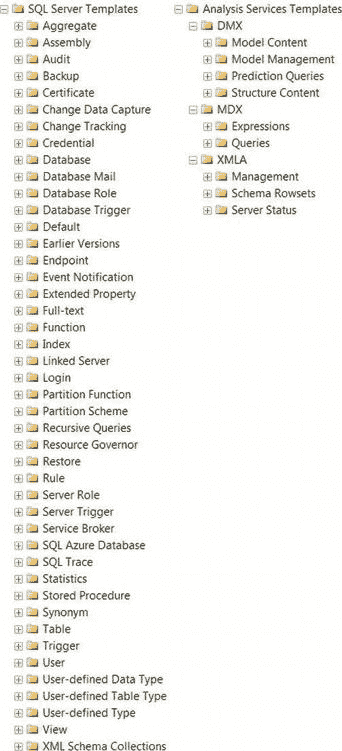
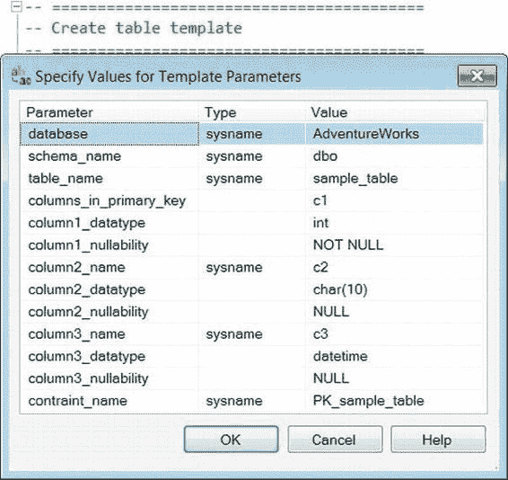

# 第二章 - BIDS 与 SSMS

**Include Client Statistics** 在名为“Client Statistics”的选项卡中显示客户端统计信息。此实用工具实际上会记录不同查询执行的统计信息，显示每次执行的变化以及每个统计信息的平均值。

**Results to Text** 将查询结果以文本形式输出。输出以空格分隔，可能难以阅读，但在没有电子表格程序的情况下，这是传输查询结果最简单的方法。

**Results to Grid** 以网格格式显示结果，可以轻松复制到 Excel 或其他电子表格编辑器中。可以一次复制整个结果集、特定列或特定记录。

**Results to File** 将结果直接输出到指定文件。每次执行查询时都需要定义文件。结果集的默认格式是报表文件（`.rpt`）。

对于 XMLA 查询，上下文菜单主要由 XML 编辑器选项组成，旨在帮助闭合当前标签并提供有关对象当前属性的信息。

### SQL Server Management Studio 项目

与 BIDS 一样，SSMS 支持项目。然而，这些项目仅限于三种类型：由 T-SQL 脚本组成的 SQL Server 脚本；由 MDX、DMX 和 XMLA 脚本组成的 Analysis Services 脚本；以及 SQL Server Compact Edition 脚本。这些项目由三部分组成：连接、查询和杂项。以下列表提供了这些部分的简要描述：

- **Connections** 存储与项目相关的所有连接。创建连接后，即可使用该连接创建查询，而无需使用对象资源管理器。如果未独立创建连接，则为项目中查询建立的连接将自动添加。
- **Queries** 包含与项目关联的所有查询。根据项目类型，只有受支持的文件才能添加到此文件夹中（例如，SQL Server 项目的 `.sql` 文件）。
- 查询的连接信息存储在项目文件（`.ssmssqlproj` 或 `.ssmsasproj`）本身中。与 BIDS 一样，项目文件包含重要信息。对于 Management Studio 项目，它们包含诸如超时时间、包含的查询以及查询的连接信息等信息。打开项目中包含的查询将使用其最初连接到的服务器的连接来打开它。

### 模板

SQL Server Management Studio 提供了许多模板来存储常见的 DDL 和 DCL 语句。

这些语句同时适用于 SQL Server 和 Analysis Services；模板如图 2-14 所示。这些模板包含可使用名为“Specify Values for Template Parameters”（如图 2-15 所示）的实用工具轻松替换的参数。此实用工具执行类似于“查找和替换”的功能，但专门用于识别所有参数并将其全部显示在一个位置。模板以树形结构存储，模板类型位于根目录。要访问模板资源管理器，可以从工具栏中选择“视图”，然后单击“模板窗口”。在窗口的左上角，您将看到两个按钮，允许您打开 SQL Server 模板或 Analysis Services 模板。模板将作为新的查询窗口打开。



*图 2-14. Management Studio 中的代码模板*



*图 2-15. 指定模板参数值*

展开到所需的树后，只需双击即可将模板添加到查询窗口。模板打开后，可以使用上下文菜单上的“指定模板参数值”按钮来调用该实用工具。模板的真正强大之处在于您可以创建自己的一组模板以满足您的特定需求。您可以在脚本顶部添加注释块，提供有关脚本及其内容的详细信息，并且所有这些都可以参数化。

参数具有以下格式：`<parameter_name, data_type, value>`。`parameter_name` 指定参数的名称，`data_type` 指定参数的数据类型，`value` 指定将替换参数每个实例的值。

您还可以将模板添加到您选择的文件夹中。因为大多数对象都有其模板的文件夹，所以您更可能在现有文件夹中创建模板，而不是创建自己的模板文件夹。

### 代码片段

代码片段在 Visual Studio 环境中已经存在了几个版本。随着 SQL Server 12 的推出，它们现在也可用于 Management Studio。它们的工作方式与模板类似，但与模板不同的是，它们可以直接插入到当前查询窗口中。`Ctrl+K, Ctrl+X` 会调出片段插入器，其中包含可用片段的下拉列表。片段最棒的部分是能够为您最常使用的代码包添加自己的自定义片段。此功能在 Visual Studio 开发中非常有用，也是 SQL Server 12 中一个受欢迎的功能。清单 2-4 显示了我们创建的一个自定义片段，用于编写表的删除和创建语句脚本。

> **注意：** 默认的片段集主要由 DDL 和 DCL 对象创建脚本组成。这非常有用，因为 SSMS 存储了我们开发人员最可能使用的实际语法，以参考 Microsoft 开发者网络 (MSDN) 或联机丛书 (BOL)。通过创建自己的片段的能力，您 90% 的日常语法都可以为此目的进行编码。除了语法之外，查询的常见代码块（您在大多数查询上执行的连接、对业务逻辑至关重要的 where 子句等）都可以编写脚本，以便只需按几下键就可以将它们添加到代码中，而无需一遍又一遍地输入。

*清单 2-4. 用于删除和创建表的片段*

```xml
<?xml version="1.0" encoding="utf-8" ?>
<CodeSnippets>
    <_locDefinition>
        <_locDefault _loc="locNone" />
        <_locTag _loc="locData">Title</_locTag>
        <_locTag _loc="locData">Description</_locTag>
        <_locTag _loc="locData">Author</_locTag>
        <_locTag _loc="locData">ToolTip</_locTag>
    </_locDefinition>
    <CodeSnippet Format="1.0.0">
        <Header>
            <Title>Drop and Create Table</Title>
            <Shortcut></Shortcut>
            <Description>Drops a table if it exists, then creates a table.</Description>
            <Author>Rodrigues, Coles</Author>
            <SnippetTypes>
                <SnippetType>Expansion</SnippetType>
            </SnippetTypes>
        </Header>
        <Snippet>
            <Declarations>
                <Literal>
                    <ID>SchemaName</ID>
                    <ToolTip>Name of the schema</ToolTip>
                    <Default><![CDATA[<schema_name, sysname, dbo>]]></Default>
                </Literal>
                <Literal>
                    <ID>Tablename</ID>
                    <ToolTip>Name of the table</ToolTip>
                    <Default>Sample_Table</Default>
                </Literal>
                <Literal>
                    <ID>column1</ID>
                    <ToolTip>Name of the column</ToolTip>
                    <Default>ID</Default>
                </Literal>
                <Literal>
                    <ID>datatype1</ID>
                    <ToolTip>Data type of the column</ToolTip>
                    <Default>INT IDENTITY(1,1) NOT NULL</Default>
                </Literal>
                <Literal>
                    <ID>column2</ID>
                    <ToolTip>Name of the column</ToolTip>
                    <Default>Desc</Default>
                </Literal>
                <Literal>
                    <ID>datatype2</ID>
                    <ToolTip>Data type of the column</ToolTip>
                    <Default>NVARCHAR(50) NULL</Default>
                </Literal>
            </Declarations>
            <Code Language="SQL">
                <
```


