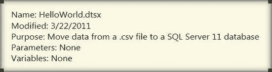

# 第三章：HELLO WORLD——您的第一个 SSIS 2012 包

### 包注释

在查看新包上设置的属性之后，我们建议首先做的一件事就是为包添加注释。这可以通过在当前设计器视图的背景处右键单击并选择 `Add Annotation` 来完成。注释可用于记录包的信息，以便其他开发人员无需打开并通读所有任务就能轻松识别包的用途。彻底检查包的工作可以留到调试时进行。注释应包含的信息类型如图 3-1 所示。

*图 3-1\. 控制流推荐注释*

`Name` 属性代表当前包的名称。这在 Visual Studio 的多个地方显示，但由于 SSIS 包背后的 XML 得到了极大改进，如果您需要去那里查找某些信息，请不要惊讶。注释字符串本身存储在包 XML 底部的 `CDATA` 中。

`Modified Date` 仅仅是记录对包所做最后一次更改的日期。在没有代码库的情况下，这部分信息会有所帮助。文件系统的修改日期在捕捉 SSIS 包的实际更改方面并不总是准确的。在许多设计器上单击 `OK` 按钮以及在设计器选项卡中移动对象，都会导致 Visual Studio 识别为更改，即使没有任何功能上的变化。这可能导致文件系统不准确地反映包的功能性更改。

`Purpose` 属性仅用于标识包的目标。模块化编程的特点是拥有独立的、可互换的代码块或模块。本书第 2 部分将介绍一些设计模式，使您能够在 SSIS 2012 中保持这种实践。用途涵盖了包执行后的最终状态——哪些数据元素已被移动、哪些项目已在文件系统上移动、存储过程的执行等等。这旨在是一个高级描述而非详细描述，但本质上取决于您的 ETL 过程设计。

`Parameters`（参数）和 `Variables`（变量）是相关的，因为它们可用于在包之间传递值。参数是可以在包执行前设置的外部值。变量是在包之间传递信息的内部机制。在之前的 SQL Server Integration Services 版本中，变量通过配置服务于这两种目的，无论是使用配置文件分配值还是通过父变量继承值。识别参数很重要，因为它们对项目中的所有包都是可访问的；在采用父子包设计时，这种结构变得极其有用。父包可以自动检测子包中定义的参数，并分配要传递给它的变量或参数。现在，变量可以仅用于在包之间传递值，而无需外部进程修改。在分配参数和变量时，它们与系统变量出现在同一个下拉列表中。您还可以选择编写表达式将参数值分配给变量。变量是通过引用而不是通过值传递给子包的。对值进行的任何修改都需要子包中的一个 `Script` 任务才能将更改传播回父包。有一个替代使用 `Script` 任务修改父包的方法，允许您直接访问变量。然而，当子包独立执行时，此方法也会导致访问子包内变量的可执行文件在运行时出错。我们将在第 16 章讨论这些选项。

变量列表对变量的 `Scope`（作用域）敏感。变量的作用域可以是整个包，也可以是特定的容器、任务或事件处理程序内。面对多个变量，您很容易忘记它们全部，因此注释可以节省大量查找时间。`Package Explorer` 选项卡和 `Parameters and Variables` 工具栏中的 `Show Variables of All Scopes` 选项提供了相同的功能，但通过注释，您可以记录它们在过程中扮演的角色。

> **注意：** 在分配时，`Parameters`、`Variables` 和系统变量列在同一个下拉列表中。我们建议使用命名空间以避免混淆。我们将在第 10 章详细讨论参数和变量。

### 包属性类别

包属性按其提供的功能分为类别。这些类别通常比较宽泛，并且包含比前一节概述的主要属性更多的可配置属性。这些类别及其属性涉及 SSIS 2012 的一些非功能性能力。我们在此简要介绍这些类别，并在后续章节中进行更深入的分析：

**`Checkpoint`（检查点）属性** 控制 SSIS 包执行的重新启动能力。您必须为进度存储定义一个文件路径和名称，以便在执行期间使用。如果发生故障，该文件将用于在之前失败的任务处重新启动过程。此功能本身不会处理已提交数据的回滚。成功执行后，此文件会自动删除。

**`Execution`（执行）属性** 定义包的运行时方面。这些包括包可以容忍的失败次数，以及如何处理嵌套容器相对于父容器成功的失败。性能调优也可以从本节中的属性开始。如果内存溢出成为问题，可以限制并发可执行文件的数量。

**`Identification`（标识）属性** 用于唯一地识别包。这些属性包括前面列出的一些（特别是 `Name` 和 `ID`）。包可以捕获的其他信息是它曾在其上执行的计算机。

`ID` 属性为包提供唯一标识符。在考虑日志记录选项时，此属性变得很重要。此 `ID` 将区分特定执行中运行的包。当新包添加到项目时，会生成一个新的标识符，但当现有包被添加或在 `Solution Explorer` 中复制粘贴包时，原始包的标识符会被保留。此值不能直接修改，但有一个选项可以生成新的 `ID`。

`ProtectionLevel` 管理存储在包中的敏感数据。默认情况下，此属性设置为 `EncryptSensitiveWithUserKey`。此选项使用一个标识当前用户的密钥加密整个包。只有当前用户才能加载包含所有信息的包。其他用户将只看到用户名、密码和其他敏感数据为空白。我们建议使用 `DontSaveSensitive` 选项，特别是当多个开发人员将处理同一组包时。敏感数据可以存储在配置文件中。我们将在第 19 章讨论开发和部署包的安全方面。

[www.it-ebooks.info](http://www.it-ebooks.info/)

创建日期以及创建它的用户。此处归类的另一个重要属性是“描述”，这是自由格式的文本。

杂项属性是那些无法在其他类别中清晰分类的属性的混合体。此类别包含各种不同的属性，其功能从记录包执行的日志行为到列出为包创建的配置，各不相同。

[www.it-ebooks.info](http://www.it-ebooks.info/)

