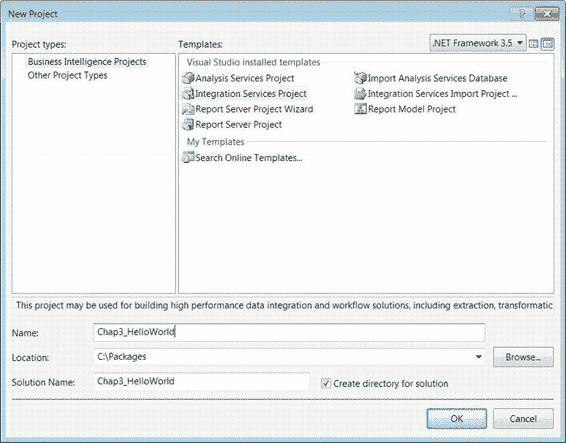
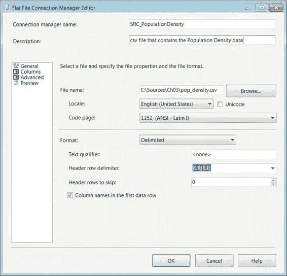

# 第 3 章 - 你好世界——你的第一个 SSIS 2012 包

安全属性处理可能存储在包中的敏感信息。此部分的主要属性 `ProtectionLevel` 之前已列出。根据开发、测试和生产使用的不同环境，可以配置这些属性。某些设置将允许你在环境之间移动包，而不会引起身份验证问题。

**提示：** 一个有助于加快 SSIS 12 包开发速度的选项是杂项类别中的 `OfflineMode` 属性。此属性可防止包打开连接来验证元数据。此属性是只读的，可以通过菜单栏上的 SSIS 菜单进行修改。修改此属性的另一个选项是通过文件 `<project_name>.dtproj.user` 处理。这个基于 XML 的文件包含 `OfflineMode` 属性。它直接对应于包属性，但会影响该工程中的所有包。如果你修改此文件，应该关闭工程，修改文件，然后重新打开工程。修改此文件可以让你避免每次需要进行工程更改时都去修改它，但这样做显然存在危险。一旦开发完成，或者源或目标的结构发生变化，我们强烈建议你将此属性设置为 False。最佳实践是在修改包时验证元数据；它有助于确保在开发中使用正确的源和目标，以及避免运行时神秘出现的许多其他问题。

## 你好世界

在简要了解了 SSIS 12 包属性之后，让我们直接开始创建一个包。在 Visual Studio 中开发包的第一步需要一个工程。在本章中，我们创建了一个恰当地命名为 Chap3_HelloWorld 的工程。图 3-2 展示了如何在 Visual Studio 中创建新的 Integration Services 工程。你可以通过工具栏上的“文件”菜单并选择“新建”->“工程”来访问此对话框。另一种方法是使用“开始”页面上的“最近的工程”面板。底部有一个创建工程的超链接。

[www.it-ebooks.info](http://www.it-ebooks.info/)

*图 3-2. 创建新的 Integration Services 工程*

以下是对话框中的一些元素及其用途的简要说明：

*   对话框中的 `Name` 文本字段为工程文件分配名称。这个名称应该足够广泛，以覆盖将要存储的各种包。因为我们仅试图演示一个简单的包，所以工程名称指的是一个简单的流程。
*   `Location` 字段指示在开发期间工程在文件系统上存储的目录。为简单起见，我们创建了一个简短的文件夹路径来存储我们的包。
*   `Solution Name` 字段会自动填充为 `Name` 字段中提供的相同值，但如果该名称不适合解决方案，可以更改。
*   `Create Directory for Solution` 复选框对于保持工程组织性非常有用。它将在定义的 `Location` 内创建一个子文件夹，并将构建和部署所需的所有文件（`.database`、`.dtproj`、`.dtproj.user`、`.dtsx` 等）和子文件夹放置其中。

创建工程后，Visual Studio 将自动生成一个包并将其命名为 `Package.dtsx`。我们建议你执行的第一步是将此名称修改为更合适和描述性的名称。如果你通过解决方案资源管理器直接更改它，将会弹出一个对话框，要求你确认更改包的 `Name` 属性。如果你通过属性窗口更改包的名称，则不会弹出对话框来确认对文件名的更改。这种行为允许两者不同步，但没有理由出现这种情况。我们建议你保持它们同步。

因为我们不是在创建具有大量元数据的复杂包，所以我们将 `DelayValidation` 属性保留为 False。这个包只是简单地从平面文件获取数据并将其移动到 SQL Server 12 数据库，没有任何转换。这是 SSIS 可以执行的最简单的 ETL（提取、转换和加载）任务，从源存储平台获取数据并将其放置到目标存储平台。我们也将跳过 ID 生成，因为我们没有从现有包复制此包。

我们将 `ProtectionLevel` 设置为 `DontSaveSensitive`。这将允许我们在处理包时无需记住密码，也无需通过公共用户帐户使用同一台机器。它还将强制我们将任何必需的连接信息存储在包之外的其他文件中。

我们鼓励你将敏感信息存储在配置文件中，既为了安全地只存储一次信息，也为了限制对该文件的访问权限。

在设置了所有所需的属性之后，我们可以开始包的实际开发。我们建议你添加一个如图 3-1 所示的注释，概述我们将要为 ETL 流程实现的基本设计。有了这个注释，我们就知道包中所有对象的功能。ETL 流程的第一步是确定你要提取的数据、数据的位置以及关于数据的一些基本数据（元数据）。处理平面文件时，元数据变得至关重要，因为对列长度的低估将导致截断。

**注意：** 工程中所有相关包的 `ProtectionLevel` 设置必须与工程的 `ProtectionLevel` 属性相同。

### 平面文件源连接

我们将添加到包中的第一个对象是一个平面文件连接。我们通过右键单击设计器底部的“连接管理器”窗格并选择“新建平面文件连接”来完成此操作。这将打开“平面文件连接管理器编辑器”，如图 3-3 所示。我们建议你用能够让你轻松识别该管理器所访问数据的名称替换连接的默认名称。连接名称必须是唯一的。此外，我们还建议在 `Description` 字段中写下管理器的简短说明。这两个字段将在编辑器左侧面板中列出的所有页面中重新出现。

[www.it-ebooks.info](http://www.it-ebooks.info/)

*图 3-3. 平面文件连接管理器编辑器 — 常规属性*

