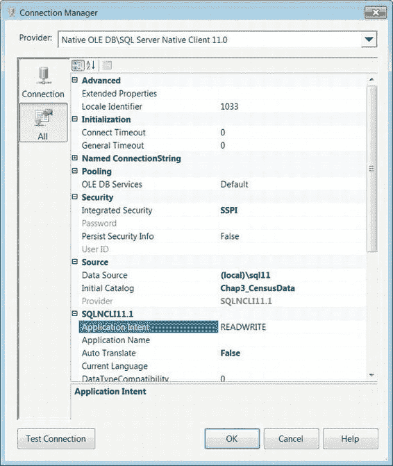
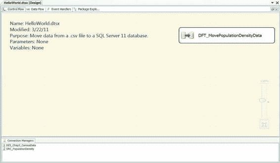
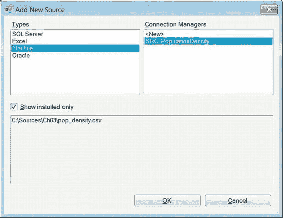

# 第 3 章：HELLO WORLD——您的第一个 SSIS 2012 包

### 数据连接属性

“数据连接属性”窗格显示了从 `SQL Server 12` 数据库提取（或者在我们的例子中是加载）数据所需的所有信息。“数据源”指的是服务器及其上关系数据库管理系统（RDBMS）实例的名称。IP 地址同样可以轻松使用，但我们建议尽可能使用机器名称。“初始目录”是指数据将从中提取或加载到的数据库。“集成安全性”属性决定了如何访问数据库：是使用用户名和密码，还是通过 Windows 身份验证传递凭据。在我们的示例中，我们将使用 Windows 身份验证。“提供程序”是用于连接到数据库的驱动程序。`SQLNCLI1.1` 是连接到 `SQL Server 12` 数据库所需的驱动程序。

*图 3-8. 连接管理器——连接页*

[www.it-ebooks.info](http://www.it-ebooks.info/)

### 配置连接

在“连接”页上，您需要提供连接到特定数据库所需的所有详细信息。在本例中，我们需要的是将用于存储人口密度数据的数据库。

创建连接后，可以在“配置 OLE DB 连接管理器”向导的“数据连接属性”窗格中轻松参考此信息。该向导允许您轻松查看所有先前创建的连接以供重用。连接管理器的“服务器名称”还必须包括实例名称。该字段下方的单选按钮指示要使用的访问模式。使用 Windows 身份验证时，请确保您拥有访问服务器和数据库的适当凭据。如果没有访问权限，您将无法收集或验证所需的元数据。

对于每个连接，您必须指定要使用的数据库。利用配置文件允许您将连接信息存储在单独的文件中。这使得更改可以传播到多个配置为使用该文件的包，而无需手动打开和更新连接管理器的每个实例。“测试连接”按钮使用提供的信息来 ping 服务器和数据库。这是测试您的凭据并验证对所选数据库访问权限的快速方法。“连接管理器”对话框的“全部”选项卡（如图 3-9 所示）使您可以访问连接的所有可用属性。

[www.it-ebooks.info](http://www.it-ebooks.info/)

*图 3-9. 连接管理器——全部页*

利用“全部”选项卡可提供超出“连接”页的属性。此页面允许您完全修改连接管理器以满足您的需求。您可以定义连接超时以设置查询可以运行的最长时间限制。除非有非常特殊的原因，否则我们不建议调整这些属性。默认情况下，这些设置应能提供您所需的最佳性能。添加连接管理器后，我们建议您立即重命名它，以便在以后尝试访问时可以轻松识别。

### 数据流任务

为数据集的源和目标添加连接管理器后，我们可以继续添加将提取和加载人口密度数据的可执行文件。可以在 SSIS 工具箱的“收藏夹”部分找到“数据流任务”。它默认就在这里，如果您不常用，也可以移动它。图 3-10 展示了包含单个数据流任务的控制流窗格。

**提示：** 我们最喜欢的人之一 Jamie Thomson 有一个完全致力于 SSIS 对象命名约定的博客。这些约定可以在他的 EMC 咨询站点上找到：http://consultingblogs.emc.com/jamiethomson/archive/2006/01/05/ssis_3a00_-suggested-best-practices-and-naming-conventions.aspx。我们将在此列表中添加新组件的命名约定。

*图 3-10. HelloWorld.dtsx——控制流*

使用 Jamie Thomson 引入的命名约定，我们将前面的可执行文件命名为 `DFT_MovePopulationDensityData`。`DFT` 表示它是一个数据流任务。名称的其余部分描述了数据流任务的功能。每个控制流组件都有自己的符号，使您可以轻松识别对象。数据流符号是两个圆柱体，一个指向另一个的箭头。

[www.it-ebooks.info](http://www.it-ebooks.info/)

**提示：** 菜单栏上的“格式”菜单有两个选项，可使“控制流”和“数据流”窗口保持有序。第一个选项“自动调整大小”会自动调整所选对象的大小以适应名称。第二个选项“自动布局 Diagram”会改变当前窗口中对象的方向，使对象的中间（高度）和中心（宽度）均匀对齐。在“控制流”窗口中，设计为同时执行的可执行文件或容器其中间会对齐，而那些设计为顺序执行的则其中心会对齐。控制流中的执行顺序由定义的优先级约束决定。对于“数据流”窗口，使用管道来组织对象。

通常，“数据流”窗口中的组件不会有多个对象对齐中间，除非存在多个流。

您可以按照与我们在本包中所做的不同顺序添加连接管理器。我们采用了一种循序渐进的方式来创建此包，其中确定源和目标是首要议程。正如您将在有关助手的部分中看到的，您可以在向数据流添加组件时添加连接管理器。我们认为这提供了创建临时管理器的机会，而不是通过计划的过程创建源和目标。

### 源组件

有了人口密度文件的连接管理器和用于提取数据的数据流任务后，我们可以添加将打开连接并读取数据的源组件。在 SSIS 12 中，源助手的添加极大地帮助我们组织了已创建的不同连接管理器。图 3-11 演示了源助手如何使您快速为所需连接添加源组件。在此示例中，我们要查找的源是 `SRC_PopulationDensity`。如果您选择，可以在此处为您的源数据添加新的连接管理器，方法是选择 `<新建>` 并单击“确定”按钮。

[www.it-ebooks.info](http://www.it-ebooks.info/)

*图 3-11. 源助手*

### Types 窗格与连接管理器

Types 窗格包含了当前机器支持的所有连接管理器。其他连接管理器（例如 DB2）的驱动程序可以从 Microsoft 网站下载。对于我们的示例包，我们只关注 `Flat File` 源。在连接管理器窗格中，列出了该类型的所有管理器。在这个名为 `HelloWorld.dtsx` 的包中，只有一个这样的管理器。

底部窗格显示了此特定平面文件的连接信息，因此您甚至可以看到文件名和路径。在 SSIS 的早期版本中，您必须在添加源组件之前就了解每个管理器的连接信息。当时不存在源助理来为您显示不同管理器的连接字符串。在这方面，为连接管理器使用的命名约定非常重要。单击 **确定** 按钮后，您将自动将该组件添加到 `DFT_MovePopulationDensityData` 中。默认情况下，组件的名称是 `Flat File Source`，但通过使用定义的命名约定，我们将其名称更改为 `FF_SRC_PopulationDensity`。当您键入名称时，组件会自动调整大小，以便您清楚了解该组件将在窗口中占用多少空间。

### 添加目标组件

源组件就位后，我们现在可以添加数据的目标。添加到 SSIS 12 的另一个新助理是目标助理。该助理提供了与源助理相同的组织帮助。该助理的一个关键特性是窗格底部显示的连接信息，如图 3-12 所示。通过助理可以使用添加新连接管理器的选项。为连接管理器适当命名将使识别正确的连接变得更加容易。

*图 3-12. 目标助理*

选择我们想要的连接管理器 `DES_Chap3_CensusData` 后，我们可以通过单击 **确定** 按钮将其添加到数据流中。该组件将以默认名称 `OLE DB Destination` 添加。我们将遵守命名约定并将其重命名为 `OLE_DST_CensusData`。与源组件的情况一样，它会自动调整大小以适应提供的名称。

### 创建数据流路径

在数据流任务中同时拥有源和目标组件后，我们需要指示 SSIS 将数据从源移动到目标。这是通过为数据流定义路径来完成的。要添加路径，您必须单击源组件。您将看到组件底部出现两个箭头。绿色箭头表示成功读取后的数据流，红色箭头则重定向读取期间失败的行。SSIS 将绿色箭头识别为 `Flat File Source` 输出，红色箭头被称为 `Flat File Source Error Output`。这两个箭头如图 3-13 所示。

*图 3-13. 源组件——输出*

数据流路径可以通过从源组件单击并拖动绿色箭头到目标组件来简单创建。另一种选择是使用数据流中的添加路径向导。可以通过右键单击源组件并选择 **添加路径** 来访问此向导。这将打开一个对话框，使您能够选择组件和路径的方向，如图 3-14 所示。

*图 3-14. 数据流 创建新连接器*

使用此连接器向导，我们可以定义数据流的方向。此连接器向导将影响之后出现的向导的设置，如图 3-15 所示。

*图 3-15. 输入输出选择*

在向导完成后，您需要为路径命名。我们将其命名为 `FF_SRC_PopulationDensity to OLE_DST_CensusData`。路径连接了源的 `Flat File Source Output` 和目标的 `OLE DB Destination Input`。在数据流设计器中，路径将显示为连接两个组件的箭头。

