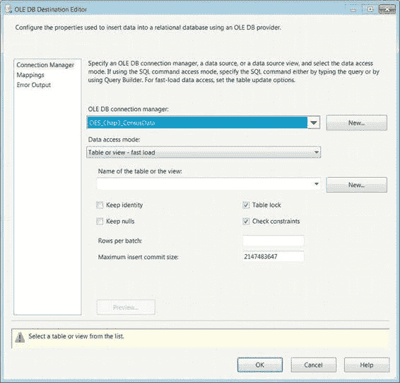
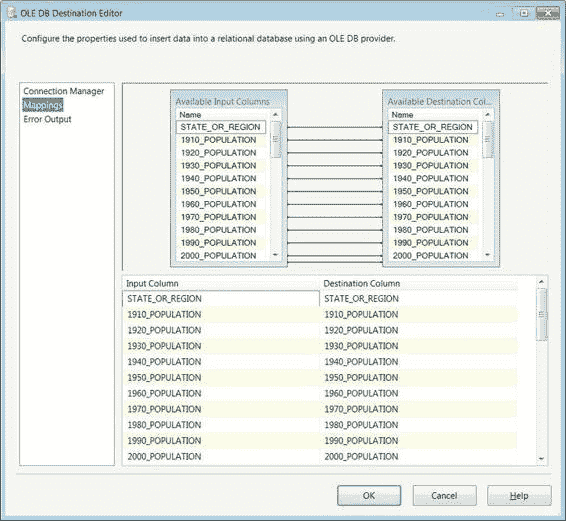

# 第三章 你好世界——你的第一个 SSIS 2012 包

### 映射

此向导允许你匹配源组件和目标组件的输入和输出。对于输出，你有两个选项：`Flat File Source Output` 和 `Flat File Source Error Output`。因为我们想要文件中的实际数据，所以我们选择了 `Flat File Source Output`。`OLE DB` 目标组件只能接受一个输入。单击“确定”后，将使用定义的输出和输入在这两个组件之间创建数据流路径。但创建数据流路径并不是最后一步；我们还需要映射源和目标之间的列。

如你所记，我们必须定义所有预期从源获得的列。将数据移动到目标时也需要相同的过程。在源和目标之间创建数据流路径后，Visual Studio 通过目标组件上的一个小红色 *x*（如图 3-16 所示）对此事实提供了一个小提醒。该错误将传播到控制流级别的可执行文件，因此你也会在 `DFT_MovePopulationDensityData` 上看到 *x*。

#### 图 3-16. 数据流任务——映射错误 OLE DB 目标

你可以通过将光标悬停在 *x* 标记上来识别错误的原因。在我们的案例中，我们没有为数据定义目标表。要解决此问题，我们必须双击目标组件以打开 `OLE DB` 目标编辑器。如图 3-17 所示，此编辑器允许你修改要用作连接管理器的内容以及有关实际将数据插入数据库的一些选项。



## 第三章 你好世界——你的第一个 SSIS 2012 包

#### 图 3-17. 使用 OLE DB 目标编辑器修复错误

`OLE DB` 连接管理器下拉列表允许你更改在使用目标助手时选择的连接管理器。“数据访问模式”列表为你提供了有关如何加载数据的几个选项。“表或视图”选项将数据加载到目标数据库中定义的表或视图中。此选项为每一行触发插入语句。对于小型数据集，这些事务可能看起来很快，但随着数据量开始增加，使用此选项你将遇到瓶颈。“表或视图 – 快速加载”选项针对批量插入进行了优化。设置目标组件时，此选项是默认选项。“表名或视图名变量”选项使用一个变量，该变量的值是目标表的名称。此选项也仅使用逐行插入语句来加载数据。“表名或视图名变量 – 快速加载”也利用变量的值来确定目标表，但它针对批量插入进行了优化。

## 第三章 你好世界——你的第一个 SSIS 2012 包

`SQL` 命令选项利用 `SQL` 查询来加载数据。此查询将为目标组件输入中出现的每条记录执行。

我们没有准备好用于从源加载数据的表，但 `OLE DB` 目标编辑器能够根据传递到其输入的元数据生成 `CREATE TABLE` 脚本。为此特定数据集生成的表脚本如清单 3-1 所示。如果我们在将列传递给目标组件之前从管道中删除了它们，则它们不会被添加到此创建脚本中。粗体代码表示我们为符合命名标准而对脚本所做的更改。默认情况下，表名为 `OLE_DST_CensusData`，这是赋予组件的名称。编辑器在生成创建表脚本时不指定表架构。如果要加载数据的表已经创建，则它会在下拉列表中可用。

#### 清单 3-1. 人口密度数据的创建表脚本

```sql
CREATE TABLE dbo.PopulationDensity (
    [STATE_OR_REGION] varchar(50),
    [1910_POPULATION] varchar(50),
    [1920_POPULATION] varchar(50),
    [1930_POPULATION] varchar(50),
    [1940_POPULATION] varchar(50),
    [1950_POPULATION] varchar(50),
    [1960_POPULATION] varchar(50),
    [1970_POPULATION] varchar(50),
    [1980_POPULATION] varchar(50),
    [1990_POPULATION] varchar(50),
    [2000_POPULATION] varchar(50),
    [2010_POPULATION] varchar(50),
    [1910_DENSITY] varchar(50),
    [1920_DENSITY] varchar(50),
    [1930_DENSITY] varchar(50),
    [1940_DENSITY] varchar(50),
    [1950_DENSITY] varchar(50),
    [1960_DENSITY] varchar(50),
    [1970_DENSITY] varchar(50),
    [1980_DENSITY] varchar(50),
    [1990_DENSITY] varchar(50),
    [2000_DENSITY] varchar(50),
    [2010_DENSITY] varchar(50),
    [1910_RANK] varchar(50),
    [1920_RANK] varchar(50),
    [1930_RANK] varchar(50),
    [1940_RANK] varchar(50),
    [1950_RANK] varchar(50),
    [1960_RANK] varchar(50),
    [1970_RANK] varchar(50),
    [1980_RANK] varchar(50),
    [1990_RANK] varchar(50),
    [2000_RANK] varchar(50),
    [2010_RANK] varchar(50)
);

GO
```



## 第三章 你好世界——你的第一个 SSIS 2012 包

列名和长度是基于在 `Flat File` 连接管理器中定义的元数据定义的。由于我们未将列定义为 Unicode，因此所有列的默认数据类型都是 `varchar`。此创建脚本通过一个可编辑的文本框提供，当你为目标表选择单击“新建”按钮时，该文本框会打开。将脚本修改为满足我们的需求后，我们需要在目标数据库上执行它以创建表。

在数据库上创建表后，它将出现在目标表下拉列表中。

由于列名和数据类型与目标输入中的列完全匹配，因此映射由 `SSIS` 自动创建，如图 3-18 所示。为了查看映射，你需要单击编辑器左侧窗格中的“映射”选项。

#### 图 3-18. OLE DB 目标编辑器映射页

要从输入列创建到目标的映射，你有两个选项。你可以使用编辑器上半部分的 `UI`，它允许你将输入列单击并拖动到其匹配的目标列。或者，你可以使用屏幕的下半部分，其中输入列显示在每列目标列旁边的下拉列表中。你可以将一个输入列映射到仅一个目标列。如果要将同一列映射到多个目标，则必须使用管道中的一个组件来添加重复列。

在 `Visual Studio` 中运行此包之前，我们必须确保项目的 `ProtectionLevel` 属性与包中设置的值 `DontSaveSensitive` 相匹配。不更改此属性，`Visual Studio` 将报告生成错误，并且不允许我们执行包。在创建所有组件并设置属性后，我们可以快速查看“包资源管理器”窗口，以快速审阅包中的对象。`HelloWorld.dtsx` 的包资源管理器如图 3-19 所示。

#### 图 3-19. HelloWorld.dtsx — 包资源管理器

图 3-19 中的“变量”文件夹是可展开的，因为为所有包创建了默认系统变量。它们以 `Package` 作用域创建，因此所有定义的可执行文件和容器都可以访问它们。由于此包设计得尽可能简单，因此大多数对象已被跳过。我们在控制流上只有一个可执行文件 `DFT_MovePopulationDensityData`，因此我们看不到任何优先约束。


