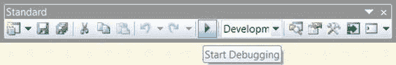
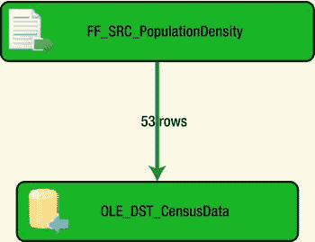

# 第三章 – 你好世界：你的第一个 SSIS 2012 包

### 执行

除了提供包对象的结构化视图外，`Package Explorer` 设计窗口还可以让你快速导航到需要修改的对象。双击单个连接管理器将打开其编辑器。双击 `Data Flow` 任务将打开该特定 `Data Flow` 任务的设计窗口。

我们终于迎来了劳动成果。我们已经完成了包的设置，所有对象都已就位，可以让我们将数据从平面文件移动到 SQL Server 数据库。使用 `Visual Studio` 执行包需要将包作为项目的一部分打开。默认情况下，`Visual Studio` 在每次调试操作之前会执行生成操作。这使你能够看到每个组件和可执行文件的进度。





图 3-20 显示了标准工具栏，其中 `开始调试` 按钮已高亮显示。在 `Visual Studio` 中执行包的另一个选项是右键单击包并选择 `执行包`。解决方案文件也会启动调试模式；要使用此方法，你必须右键单击 `解决方案资源管理器` 中的解决方案名称，进入 `调试` 组，然后选择 `启动新实例`。

SSIS 的 `Visual Studio` 调试模式有三种关联颜色：绿色表示成功，黄色表示进行中，红色表示失败。图 3-21 显示了此包调试操作的输出。`Visual Studio` 为每个数据路径提供行数；对于这个简单的包，只有一个。此输出告知我们，有 53 行数据从平面文件中提取，并成功插入到目标表中。

执行包的另一个选项是使用菜单栏上 `调试` 菜单中的 `开始执行（不调试）` 选项。这将提示 `Visual Studio` 调用 `dtexec.exe`，并为其提供执行包所需的适当参数。此选项的一个缺点是 `Visual Studio` 不提供将报告限制为仅错误的参数。不设报告限制地执行包将导致大量输出，很可能会超出命令提示符的屏幕缓冲区。我们建议你使用命令提示符，自行调用 `dtexec.exe` 并带上所需的适当参数。你甚至可以将输出存储到文件中，以便查看执行详细信息。我们将在第 26 章详细介绍此选项。

为了验证数据已加载到数据库中，你可以运行查询来测试 ETL 过程的结果。清单 3-2 展示了一种验证数据是否正确加载的快速方法。第一个查询执行行数统计以显示表中的记录数。第二个查询将输出表中存储的所有记录。

**注意：** 由于我们未在包中执行表截断操作，除非你对表执行了 truncate 语句，否则你将多次加载数据。在不删除数据的情况下执行包的次数越多，你发现的重复记录也就越多。

*清单 3-2. 用于验证数据成功加载的查询*

```sql
SELECT COUNT(*)
FROM dbo.PopulationDensity;
```

```sql
SELECT STATE_OR_REGION
,1910_POPULATION
,1920_POPULATION
,1930_POPULATION
,1940_POPULATION
,1950_POPULATION
,1960_POPULATION
,1970_POPULATION
,1980_POPULATION
,1990_POPULATION
,2000_POPULATION
,2010_POPULATION
,1910_DENSITY
,1920_DENSITY
,1930_DENSITY
,1940_DENSITY
,1950_DENSITY
,1960_DENSITY
,1970_DENSITY
,1980_DENSITY
,1990_DENSITY
,2000_DENSITY
,2010_DENSITY
,1910_RANK
,1920_RANK
,1930_RANK
,1940_RANK
,1950_RANK
,1960_RANK
,1970_RANK
,1980_RANK
,1990_RANK
,2000_RANK
,2010_RANK
FROM dbo.PopulationDensity;
```

通过查询数据，你无意中享受到了将数据存储在关系型数据库管理系统中的一项好处。


