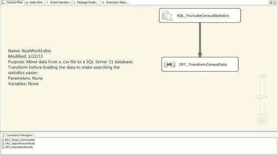

# 第三章  HELLO WORLD——您的第一个 SSIS 2012 包

与平面文件不同，这个特定的数据集使用列名来界定它所包含的数据。这是一个相对非规范化的数据集，迫使您必须选择特定年份和统计指标组合来查看数据。到了 2020 年，更新此数据的唯一方法将是添加新的列来支持新数据。通过数据规范化，我们倾向于选择加载数据，而不是修改现有的表结构。为了一个更复杂和真实世界的例子，下一个包将说明我们如何利用 SSIS 动态地对数据进行规范化处理。

[www.it-ebooks.info](http://www.it-ebooks.info/)

### 现实世界

这个简单的包示例让您快速接触到了 SSIS 12 开发。然而，在日常情况下，需求不会如此简单。下一个示例向您展示了您在工作场所可能面临的一些功能性需求。在这个包中，我们将把人口密度数据与分配数据结合起来，并将其作为一个便于查询的数据集存储在数据库中。为此，我们将以 Hello World 示例中所做的工作为基础。

为了利用在 `HelloWorld.dtsx` 上的开发成果，我们只是简单地将包添加到了一个新的解决方案 `Chap3_RealWorld` 中。创建新解决方案后，我们删除了默认的 `Package.dtsx`，然后右键单击解决方案文件，在 `添加` 组中选择了 `添加现有包`。添加后，我们在 Visual Studio 中将其重命名为 `RealWorld.dtsx`。将其添加到新项目只是创建文件的一个副本。如果您在同一个文件夹中创建所有解决方案，您将创建一个名为 `RealWorld (1).dtsx` 的副本。图 3-22 显示了我们创建的可执行文件，以允许包多次运行而无需在外部删除先前的数据。

*图 3-22. RealWorld 包已添加到新的 Chap3_RRealWorld 解决方案中*

#### 控制流

除了第一个包的两个连接管理器外，我们还添加了第三个连接管理器 `SRC_ApportionmentData`，以便我们能够提取分配数据集。我们还在 70

[www.it-ebooks.info](http://www.it-ebooks.info/)

