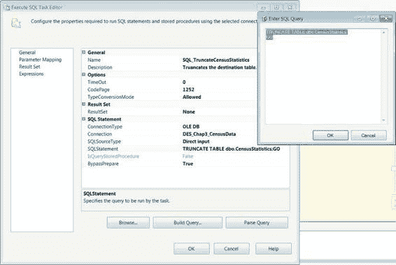

# 第三章  HELLO WORLD——您的第一个 SSIS 2012 包

控制流中添加了一个 `执行 SQL` 任务可执行文件 `SQL_TruncateCensusStatistics`，以便运行包时无需在两次执行之间手动截断表。`数据流` 任务 `DFT_TransformCensusData` 与 `DFT_MovePopulationDensityData` 相比更为复杂，因为我们必须使用各种组件来满足需求。我们将向您介绍的转换组件包括 `派生列`、`排序`、`合并连接` 和 `逆透视` 组件。

**注意：** `排序` 组件可能是一个极其消耗内存的组件，具体取决于数据量。如果您使用的是大型平面文件，我们建议您将数据存储在适当索引的暂存表中，并使用数据库执行必要的连接操作。由于我们的美国人口普查平面文件相对较小，因此可以在示例中使用 `排序` 组件。

#### 执行 SQL 任务

`SQL_TruncateCensusStatistics` 需要一个 `OLE DB` 连接来执行其中包含的 SQL 语句。此可执行文件可用于多种目的，从从数据库提取数据并将其存储为 SSIS 包可访问的对象，到执行更新语句。就我们的目的而言，我们将使用它在每次运行包时截断表。绿色箭头，即优先约束，确保在 `数据流` 任务开始执行之前，`执行 SQL` 任务已完成执行。只有当 `SQL_TruncateCensusStatistics` 成功完成后，`DFT_TransformCensusData` 才会执行。图 3-22 显示了 `执行 SQL` 任务的配置。在放置可执行文件之前，我们修改了该任务的一些关键属性：`名称` 是控制流中任务的唯一标识符。同一类型的两个任务不能具有相同的名称。此名称是在控制流设计器中显示的标签。

`描述` 是一个文本字段，用于简要说明任务在包中的功能。修改此属性不是必需的，但它可以帮助不熟悉该包的人更容易地理解流程。

`连接` 是一个必需的属性，默认情况下为空。因为我们想要截断目标表，所以我们使用了与 `OLE DB` 目标组件相同的连接管理器。无需仅为 `执行 SQL` 任务创建新的连接管理器。

`SQL 语句` 包含需要执行的 `DDL`（数据定义语言）、`DML`（数据操作语言）或 `DAL`（数据访问语言）语句。如图 3-23 所示，我们输入了一条语句，后跟一个批处理终止符 `GO`。当您修改语句时，会打开一个文本编辑器，您可以在其中键入语句。如果没有文本编辑器，您无法将 `GO` 放在新行上，因此在执行包时会出现错误。

[www.it-ebooks.info](http://www.it-ebooks.info/)

